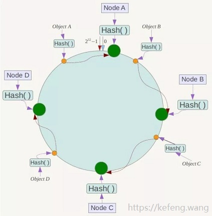

# 算法部分


## 1、哈希算法

哈希算法又叫**散列算法**或者**摘要算法**，实现该算法的函数叫**hash函数**或者**散列函数**，它能将任意长度的消息输入通过哈希算法变成固定长度的**消息摘要**输出。哈希算法虽然称之为算法，实际上它更像一种思想，哈希算法没有一个固定的公式，只要符合散列思想的算法都可以被称为是哈希算法。

**哈希算法具有以下特点：**

- 不可逆：不能通过hash值计算出原来的值。
- 效率高：hash算法通常能够快速得出结果。
- 冲突少：优秀的hash算法具备的条件。

**哈希算法的应用场景：**

- 基于hash算法的不可逆特性，可以将hash算法用在密码学和数字签名中，例如鼎鼎大名的MD5算法。
- 根据hash值计算的逻辑，可以用其验证文件的完整性，例如MD5/SHA1算法都可以用来做文件完整性及安全验证。
- 在一些高级语言中，有基于hash算法的数据结构，例如Java语言中的HashMap。

**常见的哈希算法有：**

- **直接寻址法：**取关键字或关键字的某个线性函数值为散列地址。即H(key)=key或H(key) = a·key + b，其中a和b为常数（这种散列函数叫做自身函数）。
- **除留余数法：**取关键字被某个不大于散列表表长m的数p除后所得的余数为散列地址。即 H(key) = key MOD p,p<=m。不仅可以对关键字直接取模，也可在折叠、平方取中等运算之后取模。对p的选择很重要，一般取素数或m，若p选的不好，容易产生碰撞。
-  随机数法：选择一随机函数，取关键字作为随机函数的种子生成随机值作为散列地址，通常用于关键字长度不同的场合。
-  数字分析法：分析一组数据，比如一组员工的出生年月日，这时我们发现出生年月日的前几位数字大体相同，这样的话，出现冲突的几率就会很大，但是我们发现年月日的后几位表示月份和具体日期的数字差别很大，如果用后面的数字来构成散列地址，则冲突的几率会明显降低。因此数字分析法就是找出数字的规律，尽可能利用这些数据来构造冲突几率较低的散列地址。
- 平方取中法：取关键字平方后的中间几位作为散列地址。
- 折叠法：将关键字分割成位数相同的几部分，最后一部分位数可以不同，然后取这几部分的叠加和（去除进位）作为散列地址。

**哈希算法必然存在冲突，那么解决哈希冲突的方法有哪些呢？**

- **链地址法：**例如Java中HashMap处理冲突的解决方法。
- **线性探查法：**冲突后，线性向前试探，找到最近的一个空位置。缺点是会出现堆积现象。存取时，可能不是同义词的词也位于探查序列，影响效率。
- **再散列法：**在位置d冲突后，再次使用另一个散列函数产生一个与散列表桶容量m互质的数c，依次试探（d+n*c）%m，使探查序列跳跃式分布。


## 2、一致性哈希算法


1. **传统哈希（硬哈希）**

   分布式系统中，假设有 n 个节点，传统方案使用 `mod(key, n)` 映射数据和节点。
   当扩容或缩容时(哪怕只是增减1个节点)，映射关系变为 `mod(key, n+1)` / `mod(key, n-1)`，绝大多数数据的映射关系都会失效。

2. **一致性哈希(Consistent Hashing)**

   通俗的说就是对于 `k` 个 `key` 和 `n` 个槽位(分布式系统中的节点)的哈希表，增减槽位后，平均只需对 `k/n` 个 `key` 重新映射即可。

   一致性哈希算法的目标是尽可能降低分布式环境下，通过哈希定位算法确定的元素(key)位置受机器节点数量的影响。

3. **哈希指标**

   评估一个哈希算法的优劣，有如下指标，而一致性哈希则全部满足：

   - 映射地址均衡性(Balance)：将元素`key`的哈希地址均匀地分布在地址空间中，使地址空间得到充分利用，这是设计哈希的一个基本特性。
   - 单调性(Monotonicity)：单调性是指当地址空间增大时，通过哈希函数所得到的关键字的哈希地址也能映射的新的地址空间，而不是仅限于原先的地址空间。或等地址空间减少时，也是只能映射到有效的地址空间中。简单的哈希函数往往不能满足此性质。
   - 分散性(Spread)：也称一致性，即不同的终端用户通过相同的哈希定位函数得到的元素`key`的地址位置应该是相同的，也就是能够得到固定相同的缓冲区节点。
   - 负载均衡性：即一个好的哈希定位算法，应该使得落在每个缓冲区节点上的元素key的数量大致相当，不至于出现某些节点负载严重不均衡的情况。

4. **实现原理**

   **一句话概括就是：避免使用固定值取模进行定位，改用范围定位的总体设计思想。**

   - 使用公用哈希函数和哈希环

     

     设计哈希函数 Hash(key)，要求取值范围为 [0, 2^32)
     各哈希值在上图 Hash 环上的分布：时钟12点位置为0，按顺时针方向递增，临近12点的左侧位置为2^32-1。

   - 将节点(Node)映射至哈希环上

     如图哈希环上的绿球所示，四个节点 Node A/B/C/D，
     其 IP 地址或机器名，经过同一个 Hash() 函数计算出地址结果，映射到哈希环上。

   - 将元素对象(Object)映射于哈希环上

     如图哈希环上的黄球所示，四个对象 Object A/B/C/D，
     其键值key，经过同一个 Hash() 函数计算出地址结果，映射到哈希环上。

   - 将元素对象(Object)映射到节点(Node)上

     在元素对象和节点都映射至同一个哈希环之后，要确定某个对象映射至哪个节点，
     只需从该元素对象开始，沿着哈希环顺时针方向查找，找到的第一个节点，即是。
     如上图所示，Object A/B/C/D 分别映射至 Node A/B/C/D。

   - 处理节点(Node)被删除的场景

     当服务器缩容删除某个节点，或者某个节点宕机时，只需将原本落在该节点上的元素(key)映射到下一个临近的节点上即可，按照“沿着哈希环顺时针方向查找就近的节点”的规则，解决这个问题也是顺理成章的事情。

   - 处理新节点(Node)加入的场景

     当服务器扩容增加节点，或者宕机节点恢复时，只需根据公共的Hash()函数确定新节点的地址位置即可，按照“沿着哈希环顺时针方向查找就近的节点”的规则，解决这个问题也是顺理成章的事情。

   - 通过增加虚拟节点解决每个节点上元素分布不均的问题

     对于前面的方案，节点数越少，越容易出现节点在哈希环上的分布不均匀，导致各节点映射的对象数量严重不均衡(数据倾斜)；相反，节点数越多越密集，数据在哈希环上的分布就越均匀。
     但实际部署的物理节点有限，我们可以用有限的物理节点，虚拟出足够多的虚拟节点(Virtual Node)，最终达到数据在哈希环上均匀分布的效果。

     虚拟节点哈希值的计算方法调整为：Hash(节点IP(或机器名) + 虚拟节点的序号(1~N))。

5. 示例代码：

   默认的java实现

   ```java
   public interface ConsistentHashingAlgorithm {
   
       /**
        * 添加节点
        * @param node
        */
       public void addNode(Node node);
   
       /**
        * 删除节点
        * @param node
        */
       public void removeNode(Node node);
   
       /**
        * 获取元素(key)所映射的节点
        * @param elementKey
        * @return
        */
       public Node getNodeOfElement(String elementKey);
   
       /**
        * 节点抽象
        */
       public static interface Node extends Comparable<Node> {
   
           public String key();
   
           default public int compareTo(Node o) {
               return key().compareTo(o.key());
           }
       }
   
   }
   //默认实现
   public class DefaultConsistentHashingAlgorithm implements ConsistentHashingAlgorithm {
   
       private static final int DEFAULT_VIRTUAL_COPIES = 1024 * 1024;
   
       /**
        * 每个物理节点具有的虚拟节点副本数
        */
       private final int virtualCopies;
   
       /**
        * 存储物理节点
        */
       private final Set<Node> physicalNodes = new TreeSet<>();
   
       /**
        * 哈希值与虚拟节点的映射关系
        */
       private final TreeMap<Long,Node> virtualNodes = new TreeMap<>();
   
       private final ReentrantReadWriteLock readWriteLock = new ReentrantReadWriteLock();
   
       public DefaultConsistentHashingAlgorithm(Collection<Node> physicalNodes) {
           this(DEFAULT_VIRTUAL_COPIES, physicalNodes);
       }
   
       public DefaultConsistentHashingAlgorithm(int virtualCopies, Collection<Node> physicalNodes) {
           Assert.isTrue(virtualCopies > 0, "Property 'virtualCopies' must be > 1");
           Assert.notEmpty(physicalNodes, "Property 'physicalNodes' can not be empty!");
           this.virtualCopies = virtualCopies;
           for(Node physicalNode : physicalNodes) {
               addNode(physicalNode);
           }
       }
   
       /**
        * 32位的 Fowler-Noll-Vo 哈希算法
        * https://en.wikipedia.org/wiki/Fowler–Noll–Vo_hash_function
        */
       protected Long hashing(String key) {
           final int p = 16777619;
           long hash = 2166136261L;
           for (int idx = 0, num = key.length(); idx < num; ++idx) {
               hash = (hash ^ key.charAt(idx)) * p;
           }
           hash += hash << 13;
           hash ^= hash >> 7;
           hash += hash << 3;
           hash ^= hash >> 17;
           hash += hash << 5;
   
           if (hash < 0) {
               hash = Math.abs(hash);
           }
           return hash;
       }
   
       @Override
       public void addNode(Node node) {
           Lock lock = readWriteLock.writeLock();
           lock.lock();
           try {
               physicalNodes.add(node);
               for (int i = 0; i < virtualCopies; i++) {
                   long hash = hashing(node.key() + "#" + i);
                   virtualNodes.put(hash, node);
               }
           } finally {
               lock.unlock();
           }
       }
   
       @Override
       public void removeNode(Node node) {
           Lock lock = readWriteLock.writeLock();
           lock.lock();
           try {
               physicalNodes.remove(node);
               for (int i = 0; i < virtualCopies; i++) {
                   long hash = hashing(node.key() + "#" + i);
                   virtualNodes.remove(hash);
               }
           } finally {
               lock.unlock();
           }
       }
   
       @Override
       public Node getNodeOfElement(String elementKey) {
           Assert.hasText(elementKey, "Parameter 'elementKey' can not be empty!");
           Lock lock = readWriteLock.readLock();
           lock.lock();
           try {
               long elementHash = hashing(elementKey);
               //相当于顺时针获取当前元素key所在位置之后的虚拟节点集合
               SortedMap<Long, Node> tailMap = virtualNodes.tailMap(elementHash);
               //如果tailMap为空则说明元素key的hash值已经无限接近圆环的起点位置了
               long nodeHash = tailMap.isEmpty() ? virtualNodes.firstKey() : tailMap.firstKey();
               return virtualNodes.get(nodeHash);
           } finally {
               lock.unlock();
           }
       }
       ...
   }
   ```
   Guava提供的实现：
   
   ```java
   public class GuavaConsistentHashingAlgorithm implements ConsistentHashingAlgorithm {
   
       /**
        * 存储物理节点
        */
       private final List<Node> nodeBuckets;
   
       private final ReentrantReadWriteLock readWriteLock = new ReentrantReadWriteLock();
   
       public GuavaConsistentHashingAlgorithm(List<Node> nodeBuckets) {
           this.nodeBuckets = new ArrayList<>(nodeBuckets);
           Collections.sort(nodeBuckets);
       }
   
       @Override
       public void addNode(Node node) {
           Lock lock = readWriteLock.writeLock();
           lock.lock();
           try {
               nodeBuckets.add(node);
               Collections.sort(nodeBuckets);
           } finally {
               lock.unlock();
           }
       }
   
       @Override
       public synchronized void removeNode(Node node) {
           Lock lock = readWriteLock.writeLock();
           lock.lock();
           try {
               nodeBuckets.remove(node);
               Collections.sort(nodeBuckets);
           } finally {
               lock.unlock();
           }
       }
   
       @Override
       public Node getNodeOfElement(String elementKey) {
           Lock lock = readWriteLock.readLock();
           lock.lock();
           try {
               int bucketIndex = Hashing.consistentHash(Hashing.md5().hashString(elementKey, StandardCharsets.UTF_8), nodeBuckets.size());
               return nodeBuckets.get(bucketIndex);
           } finally {
               lock.unlock();
           }
       }
   	...
   }
   ```

