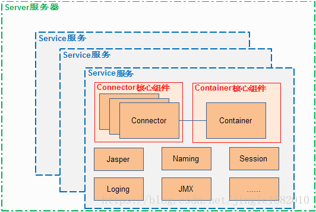

综合技术篇


# Mybatis 部分面试题


## 1、Mapper接口里的方法能重载吗？

Mybatis内部是以Mapper接口的全限名联合接口中的方法名作为Mybatis XxxMapper.xml映射文件中MappedStatement的id值，如果Mapper接口方法存在重载那么将会导致这个id值不唯一，因而Mapper接口中的方法是不可以重载的，否则运行会报错。


## 2、Mapper接口的工作原理是什么？

**Mapper接口的工作原理是JDK动态代理**，Mybatis运行时会使用JDK动态代理为Mapper接口生成代理proxy对象，代理对象proxy会拦截接口方法，转而执行MappedStatement所代表的sql，然后将sql执行结果返回。


## 3、Mybatis是如何进行分页的？分页插件的原理是什么？

Mybatis使用RowBounds对象进行分页，它是针对ResultSet结果集执行的内存分页，而非物理分页，可以在sql内直接书写带有物理分页的参数来完成物理分页功能，也可以使用分页插件来完成物理分页。

　　分页插件的基本原理是使用Mybatis提供的插件机制，通过自定义插件接口，在插件的拦截方法内获取并剔除RowBounds参数，将获取到的RowBounds中的offset和limit两个参数值用于重写分页sql上，根据dialect方言，添加对应对应数据库的物理分页逻辑。

举例：select * from student，拦截sql后重写为：select t.* from student limit 0,10

实现代码：

```java
public interface Dialect {

	/**
	 * 根据原始查询sql语句及分页参数获取分页sql,
	 * (注意：如果SQL语句中使用了left join、right join查询一对多的结果集时,请不要使用该分页处理机制,得另寻他法)
	 * @param sql
	 * @param offset	- 起始记录行数(从0开始)
	 * @param limit		- 从起始记录行数offset开始获取limit行记录
	 * @return
	 */
	public String getLimitSql(String sql, int offset, int limit);
	
	public enum Type {
		MYSQL, ORACLE;
		
		public static Type getType(String name) {
			for(Type em : values()) {
				if(em.name().equals(name)) {
					return em;
				}
			}
			return null;
		}
	}
	
}

public class MySQLDialect implements Dialect {

	public String getLimitSql(String sql, int offset, int limit) {
		sql = sql + " limit " + offset + ", " + limit;
		return sql;
	}

}

//分页插件实现
@Intercepts({@Signature(type=StatementHandler.class, method = "prepare", args = {Connection.class, Integer.class})})
public class PaginationInterceptor implements Interceptor {

	private volatile Dialect dialect;
	
	public Object intercept(Invocation invocation) throws Throwable {
		StatementHandler statementHandler = (StatementHandler)invocation.getTarget();
		MetaObject statementHandlerMeta = MetaObject.forObject(statementHandler, new DefaultObjectFactory(), new DefaultObjectWrapperFactory(), new DefaultReflectorFactory());
		RowBounds rowBounds = (RowBounds)statementHandlerMeta.getValue("delegate.rowBounds");
		if(rowBounds == null || rowBounds == RowBounds.DEFAULT){
			return invocation.proceed();
		}
		Dialect dialect = getDialect(statementHandlerMeta);
		String originalSql = statementHandlerMeta.getValue("delegate.boundSql.sql").toString();
		statementHandlerMeta.setValue("delegate.boundSql.sql", dialect.getLimitSql(originalSql, rowBounds.getOffset(), rowBounds.getLimit()));
		statementHandlerMeta.setValue("delegate.rowBounds.offset", RowBounds.NO_ROW_OFFSET);
        statementHandlerMeta.setValue("delegate.rowBounds.limit", RowBounds.NO_ROW_LIMIT);
        return invocation.proceed(); 
	}

	public Object plugin(Object target) {
		return Plugin.wrap(target, this);
	}

	public void setProperties(Properties properties) {}
	
	protected Dialect getDialect(MetaObject meta) {
		if(dialect == null) {
			synchronized (this) {
				if(dialect == null) {
					dialect = doGetDialect(meta);
				}
			}
		}
		return dialect;
	}

	protected Dialect doGetDialect(MetaObject meta) {
		Configuration configuration = (Configuration) meta.getValue("delegate.configuration");
		Dialect.Type databaseType;
		String d = configuration.getVariables().getProperty("dialect");
		if(d == null || "".equals(d.trim())){
			throw new IllegalStateException("No property named with 'dialect' defined in mybatis configuration xml file.");
		}
		try {
			databaseType = Dialect.Type.valueOf(d);
		} catch (Exception e) {
			throw new IllegalStateException(String.format("No such dialect enum defined in class %s.", Dialect.Type.class));
		}

		switch (databaseType) {
			case ORACLE: // Oracle分页
				dialect = new OracleDialect();
				break;
			default: // 默认为MySQL分页
				dialect = new MySQLDialect();
		}
		if(dialect == null){
			throw new IllegalStateException(String.format("No %s dialect found!", databaseType));
		}
		return dialect;
	}
	
}
```


## 4、简述Mybatis的插件运行原理，以及如何编写一个插件。

Mybatis仅可以编写针对ParameterHandler、ResultSetHandler、StatementHandler、Executor这4种接口的插件，Mybatis使用JDK的动态代理，为需要拦截的接口生成代理对象以实现接口方法拦截功能，每当执行这4种接口对象的方法时，就会进入拦截方法，具体就是InvocationHandler的invoke()方法，当然，只会拦截那些你指定需要拦截的方法。

实现Mybatis的Interceptor接口并复写intercept()方法，然后在给插件编写注解，指定要拦截哪一个接口的哪些方法即可，记住，别忘了在配置文件中配置你编写的插件。


## 5、Mybatis动态sql是做什么的？都有哪些动态sql？简述一下动态sql的执行原理

Mybatis动态sql可以让我们在Xml映射文件内，以标签的形式编写动态sql，完成逻辑判断和动态拼接sql的功能，Mybatis提供了9种动态sql标签`trim`|`where`|`set`|`foreach`|`if`|`choose`|`when`|`otherwise`|`bind`。

其执行原理为，使用`OGNL`从sql参数对象中计算表达式的值，根据表达式的值动态拼接sql，以此来完成动态sql的功能。


## 6、Mybatis是如何将sql执行结果封装为目标对象并返回的？都有哪些映射形式？

**第一种是**：使用`<resultMap/ >`标签，逐一定义列名和对象属性名之间的映射关系。**第二种是**：使用sql列的别名功能，将列别名书写为对象属性名，比如T_NAME AS NAME，对象属性名一般是name，小写，但是列名不区分大小写，Mybatis会忽略列名大小写，智能找到与之对应对象属性名，你甚至可以写成T_NAME AS NaMe，Mybatis一样可以正常工作。

　　有了列名与属性名的映射关系后，Mybatis通过反射创建对象，同时使用反射给对象的属性逐一赋值并返回，那些找不到映射关系的属性，是无法完成赋值而被忽略。


## 7、Mybatis能执行一对一、一对多的关联查询吗？都有哪些实现方式，以及它们之间的区别。

能，Mybatis不仅可以执行一对一、一对多的关联查询，还可以执行多对一，多对多的关联查询，多对一查询，其实就是一对一查询，只需要把selectOne()修改为selectList()即可；多对多查询，其实就是一对多查询，只需要把selectOne()修改为selectList()即可。

　　关联对象查询，有两种实现方式，一种是单独发送一个sql去查询关联对象，赋给主对象，然后返回主对象。另一种是使用嵌套查询，嵌套查询的含义为使用join查询，一部分列是A对象的属性值，另外一部分列是关联对象B的属性值，好处是只发一个sql查询，就可以把主对象和其关联对象查出来。

　　那么问题来了，join查询出来100条记录，如何确定主对象是5个，而不是100个？其去重复的原理是<resultMap>标签内的<id>子标签，指定了唯一确定一条记录的id列，Mybatis根据<id>列值来完成100条记录的去重复功能，<id>可以有多个，代表了联合主键的语意。

　　同样主对象的关联对象，也是根据这个原理去重复的，尽管一般情况下，只有主对象会有重复记录，关联对象一般不会重复。

　　举例：下面join查询出来6条记录，一、二列是Teacher对象列，第三列为Student对象列，Mybatis去重复处理后，结果为1个老师6个学生，而不是6个老师6个学生。

​    t_id   t_name      s_id

|      1 | teacher    |    38 |
|      1 | teacher    |    39 |
|      1 | teacher    |    40 |
|      1 | teacher    |    41 |
|      1 | teacher    |    42 |
|      1 | teacher    |    43 |


## 8、Mybatis是否支持延迟加载？如果支持，它的实现原理是什么？

Mybatis仅支持association关联对象和collection关联集合对象的延迟加载，association指的就是一对一，collection指的就是一对多查询。在Mybatis配置文件中，可以配置是否启用延迟加载lazyLoadingEnabled=true|false。

它的原理是，使用CGLIB创建目标对象的代理对象，当调用目标方法时，进入拦截器方法，比如调用a.getB().getName()，拦截器invoke()方法发现a.getB()是null值，那么就会单独发送事先保存好的查询关联B对象的sql，把B查询上来，然后调用a.setB(b)，于是a的对象b属性就有值了，接着完成a.getB().getName()方法的调用。这就是延迟加载的基本原理。

当然了，不光是Mybatis，几乎所有的包括Hibernate，支持延迟加载的原理都是一样的。


## 9、Mybatis的Xml映射文件中，不同的Xml映射文件，id是否可以重复？

不同的Xml映射文件，如果配置了namespace，那么id可以重复；如果没有配置namespace，那么id不能重复；毕竟namespace不是必须的，只是最佳实践而已。

原因就是namespace+id是作为Map<String, MappedStatement>的key使用的，如果没有namespace，就剩下id，那么，id重复会导致数据互相覆盖。有了namespace，自然id就可以重复，namespace不同，namespace+id自然也就不同。


## 10、Mybatis中如何执行批处理？

使用BatchExecutor完成批处理。


## 11、Mybatis都有哪些Executor执行器？它们之间的区别是什么？

Mybatis有三种基本的Executor执行器，**SimpleExecutor、ReuseExecutor、BatchExecutor。**

**SimpleExecutor：**每执行一次update或select，就开启一个Statement对象，用完立刻关闭Statement对象。

**ReuseExecutor：**执行update或select，以sql作为key查找Statement对象，存在就使用，不存在就创建，用完后，不关闭Statement对象，而是放置于Map<String, Statement>内，供下一次使用。简言之，就是重复使用Statement对象。

**BatchExecutor：**执行update（没有select，JDBC批处理不支持select），将所有sql都添加到批处理中（addBatch()），等待统一执行（executeBatch()），它缓存了多个Statement对象，每个Statement对象都是addBatch()完毕后，等待逐一执行executeBatch()批处理。与JDBC批处理相同。

作用范围：Executor的这些特点，都严格限制在SqlSession生命周期范围内。


## 12、Mybatis中如何指定使用哪一种Executor执行器？

在Mybatis配置文件中，可以指定默认的ExecutorType执行器类型，也可以手动给DefaultSqlSessionFactory的创建SqlSession的方法传递ExecutorType类型参数。


## 13、Mybatis是否可以映射Enum枚举类？

Mybatis可以映射枚举类，不单可以映射枚举类，Mybatis可以映射任何对象到表的一列上。映射方式为自定义一个TypeHandler，实现TypeHandler的setParameter()和getResult()接口方法。TypeHandler有两个作用，一是完成从javaType至jdbcType的转换，二是完成jdbcType至javaType的转换，体现为setParameter()和getResult()两个方法，分别代表设置sql问号占位符参数和获取列查询结果。


## 14、Mybatis映射文件中，如果A标签通过include引用了B标签的内容，请问，B标签能否定义在A标签的后面，还是说必须定义在A标签的前面？

虽然Mybatis解析Xml映射文件是按照顺序解析的，但是，被引用的B标签依然可以定义在任何地方，Mybatis都可以正确识别。

原理是，Mybatis解析A标签，发现A标签引用了B标签，但是B标签尚未解析到，尚不存在，此时，Mybatis会将A标签标记为未解析状态，然后继续解析余下的标签，包含B标签，待所有标签解析完毕，Mybatis会重新解析那些被标记为未解析的标签，此时再解析A标签时，B标签已经存在，A标签也就可以正常解析完成了。


## 15、简述Mybatis的Xml映射文件和Mybatis内部数据结构之间的映射关系？

Mybatis将所有Xml配置信息都封装到All-In-One重量级对象`Configuration`内部。在Xml映射文件中，`<parameterMap/ >`标签会被解析为`ParameterMap`对象，其每个子元素会被解析为`ParameterMapping`对象。`<resultMap/ >`标签会被解析为`ResultMap`对象，其每个子元素会被解析为`ResultMapping`对象。每一个`<select/ >`、`<insert/ >`、`<update/ >`、`<delete/ >`标签均会被解析为`MappedStatement`对象，标签内的`sql`会被解析为`BoundSql`对象。


## 16、为什么说Mybatis是半自动ORM映射工具？它与全自动的区别在哪里？

Hibernate属于全自动ORM映射工具，使用Hibernate查询关联对象或者关联集合对象时，可以根据对象关系模型直接获取，所以它是全自动的。而Mybatis在查询关联对象或关联集合对象时，需要手动编写sql来完成，所以，称之为半自动ORM映射工具。


## 17、当实体类中的属性名和表中的字段名不一样，怎么办？

第1种**：** 通过在查询的sql语句中**定义字段名的别名，让字段名的别名和实体类的属性名一致**

第2种： **通过`<resultMap/>`来映射字段名和实体类属性名的一一对应的关系**


## 18、在mapper中如何传递多个参数?

**第一种：使用占位符的思想**

- **在映射文件中使用#{0},#{1}来代表传Mapper方法参数列表**
- **使用`@param`注解来命名Mapper方法参数**

**第二种：使用Map集合作为参数来装载**


19、Mapper接口与SQL绑定有几种实现方式,分别是怎么实现的?

Mapper接口与SQL绑定有两种实现方式：

- 一种是通过注解绑定,就是在接口的方法上面加上`@Select`、`@Update`等注解里面包含Sql语句来绑定。
- 另外一种就是通过xml里面写SQL来绑定,在这种情况下,要指定xml映射文件里面的namespace必须为接口的全路径名。


## 19、Mybatis中#{param}和${param}的区别

`#{param}`是SQL预编译占位符 **`?`** 的代表，即`#{param}`在SQL通过JDBC驱动发送出去之前会被替换为占位符 **`?`** ，在很大程度上能防止SQL注入等问题。

`${param}`其实就是普通的SQL拼接，即`${param}`在SQL通过JDBC驱动发送出去之前会被替换为实际的参数值，存在SQL注入等问题。


## 20、Spring自动扫描Mapper接口的机制

mybatis-spring集成项目中提供了`ClassPathMapperScanner`类将指定配置的Mapper接口自动注册为Spring容器中的bean实例，使得基于Mybatis的开发更为简单。`ClassPathMapperScanner`是实现`Mapper`接口自动扫描注册的关键，该类继承自`ClassPathBeanDefinitionScanner`，并设置自动扫描的`basePackage`、以及设置标记为`Mapper`的注解或标记接口等`TypeFilter`，然后通过调用`doScan()`方法来扫描到符合条件`Mapper`的`BeanDefinition`集合，然后给集合中的每个候选的`BeanDefinition`设置一个`beanClass`（`org.mybatis.spring.mapper.MapperFactoryBean`）以及一些其他设置并最终注册到Spring容器中去，所以`Mapper`接口的实例最终还是通过`FactoryBean`来创建出来的，而`FactoryBean`的getObject()方法最终调用的还是`SqlSession#getMapper()`方法，该方法最终是通过JDK动态代理生成`Mapper`接口的一个代理实例返回给Spring容器。

延伸知识：

- `ClassPathBeanDefinitionScanner`继承自`org.springframework.context.annotation.ClassPathScanningCandidateComponentProvider`
- `SqlSession#getMapper()`是通过调用`org.apache.ibatis.binding.MapperRegistry#getMapper(Class<T> type, SqlSession sqlSession)`，然后`MapperRegistry#getMapper(..)`委托`org.apache.ibatis.binding.MapperProxyFactory`Mapper代理工厂类的`newInstance(sqlSession)`方法来创建Mapper的代理实例的。
- Mapper代理的`InvocationHandler`实现是`org.apache.ibatis.binding.MapperProxy`，`invoke(..)`方法的实现实际就是调用`org.apache.ibatis.binding.MapperMethod#execute(SqlSession sqlSession, Object[] args)`，在execute(..)方法中根据`SqlCommand`的类型去调用`SqlSession`的`insert(..)`、`update(..)`、`delete(..)`、`select(..)`系列方法。


## 21、Mybatis执行流程

如果通过Mapper接口的方式来使用Mybatis的话：

- 首先不管是我们直接通过`SqlSession#getMapper(Class<T> type)`方法来获取Mapper接口的实例，还是mybatis-spring模块提供的Mapper接口自动扫描（`ClassPathMapperScanner`）并注册`Mapper`接口的实例，都是通过Mybatis内部的基于JDK动态代理技术生成的Mapper接口的一个代理实例。
- 当我们在代理实例上调用Mapper接口的方法时，会被`invoke(..)`方法拦截，并根据`Sqlcommand`类型最终调用的还是`SqlSession`的`insert(..)`、`update(..)`、`delete(..)`、`select(..)`系列方法。
- 当调用`SqlSession`的`insert(..)`、`update(..)`、`delete(..)`、`select(..)`系列方法时，`SqlSession`会委托给它所持有的`Executor`去执行相关的增删改查操作。
- `Executor`根据实现的不同也会执行相应的`query(..)`、`update(..)`等操作。
- 在`Executor`的`query(..)`、`update(..)`方法中，先创建`StatementHandler`并应用相关的`Plugin`插件，然后调用`StatementHandler#prepare(..)`方法从`Transaction`中获取`java.sql.Connection`并创建`java.sql.Statement`对象，然后调用`StatementHandler#query(..)`或`StatementHandler#update(..)`等方法。


# HTTP&HTTPS部分

## 1、HTTPS工作原理

HTTPS在传输数据之前需要客户端（浏览器）与服务端（网站）之间进行一次握手，在握手过程中将确立双方加密传输数据的密码信息。TLS/SSL协议不仅仅是一套加密传输的协议，更是一件经过艺术家精心设计的艺术品，TLS/SSL中使用了非对称加密，对称加密以及HASH算法。握手过程的简单描述如下：

- 浏览器将自己支持的一套加密规则发送给网站。
- 网站从中选出一组加密算法与HASH算法，并将自己的身份信息以证书的形式发回给浏览器。**证书里面包含了网站地址，加密公钥，以及证书的颁发机构等信息**。
- 获得网站证书之后浏览器要做以下工作：
  - 验证证书的合法性（颁发证书的机构是否合法，证书中包含的网站地址是否与正在访问的地址一致等），简单说，是需要浏览器访问CA站点去验证证书的有效性的，如果证书受信任，则浏览器栏里面会显示一个小锁头，否则会给出证书不受信的提示。
  - 如果证书受信任，或者是用户接受了不受信的证书，浏览器会生成一串随机数密码（这个密码就是后续浏览器与网站进行数据交互的HTTPS对称加密秘钥，也就是说浏览器与网站交互的第一次使用非对称加密，后续使用对称加密以提高性能），并用证书中提供的公钥进行加密。
  - 使用约定好的HASH计算握手消息，并使用生成的随机数密码对消息进行对称加密，最后将之前生成的所有信息发送给网站。
- 网站接收浏览器发来的数据之后要做以下的操作：
  - 使用自己的私钥将信息解密取出对称加密的密码，使用密码对称解密浏览器发来的握手消息，并验证HASH是否与浏览器发来的一致。
  - 使用浏览器定下的对称加密密码加密一段握手消息，发送给浏览器。
- 浏览器解密并计算握手消息的HASH，如果与服务端发来的HASH一致，此时握手过程结束，之后所有的通信数据将由之前浏览器生成的随机密码（作为对称算法的密钥）并利用对称加密算法进行加密。

这里浏览器与网站互相发送加密的握手消息并验证，目的是为了保证双方都获得了一致的密码，并且可以正常的加密解密数据，为后续真正数据的传输做一次测试。另外，HTTPS一般使用的加密与HASH算法如下：

非对称加密算法：RSA，DSA/DSS

对称加密算法：AES，RC4，3DES

HASH算法：MD5，SHA1，SHA256

**其中非对称加密算法用于在握手过程中加密生成的密码，对称加密算法用于对真正传输的数据进行加密，而HASH算法用于验证数据的完整性。**

**由于浏览器生成的密码是整个数据加密的关键，因此在传输的时候使用了非对称加密算法对其加密。**非对称加密算法(例如RSA)会生成公钥和私钥，公钥只能用于加密数据，因此可以随意传输，而网站的私钥用于对数据进行解密，所以网站都会非常小心的保管自己的私钥，防止泄漏。TLS握手过程中如果有任何错误，都会使加密连接断开，从而阻止了隐私信息的传输。

**总结：**

**HTTPS第一次使用非对称加密算法，传输浏览器生成的随机密码给服务端，这个随机密码就是后续真正进行数据传输的对称加密密钥，要明白非对称加密安全性得到了绝对保障，但是效率低，而对称加密效率高，所以后续采用对称加密，对称加密的秘钥通过非对称加密来传输，从而保证了后续对称加密传输的安全性；**


# Tomcat部分


## 1、Tomcat架构与原理解析

参考链接https://blog.csdn.net/jingle1882010/article/details/80557808

- #### Tomcat 总体结构

  Tomcat 的结构很复杂，但是 Tomcat 也非常的模块化，找到了 Tomcat 最核心的模块，您就抓住了 Tomcat 的“七寸”。下面是 Tomcat 的总体结构图：

  

  从上图中可以看出 **Tomcat 的心脏是两个组件：Connector 和 Container**，关于这两个组件将在后面详细介绍。Connector 组件是可以被替换，这样可以提供给服务器设计者更多的选择，因为这个组件是如此重要，不仅跟服务器的设计的本身，而且和不同的应用场景也十分相关，所以**一个 Container 可以选择对应多个 Connector**。**多个 Connector 和一个 Container 就形成了一个 Service**，Service 的概念大家都很熟悉了，有了 Service 就可以对外提供服务了，但是 Service 还要一个生存的环境，必须要有人能够给她生命、掌握其生死大权，那就非 Server 莫属了。所以整个 Tomcat 的生命周期由 Server 控制。

  ##### 以 Service 作为“婚姻”

  我们将 Tomcat 中 Connector、Container 作为一个整体比作一对情侣的话，**Connector 主要负责对外交流**，可以比作为 Boy，**Container 主要处理 Connector 接受的请求**，主要是处理内部事务，可以比作为 Girl。那么这个 Service 就是连接这对男女的结婚证了。是 Service 将它们连接在一起，共同组成一个家庭。当然要组成一个家庭还要很多其它的元素。

  **说白了，Service 只是在 Connector 和 Container 外面多包一层，把它们组装在一起，向外面提供服务，一个 Service 可以设置多个 Connector，但是只能有一个 Container 容器。**这个 Service 接口的方法列表如下：

  

  从 Service 接口中定义的方法中可以看出，它主要是为了关联 Connector 和 Container，同时会初始化它下面的其它组件，注意接口中它并没有规定一定要控制它下面的组件的生命周期。所有组件的生命周期在一个 Lifecycle 的接口中控制，这里用到了一个重要的设计模式，关于这个接口将在后面介绍。

  Tomcat 中 Service 接口的唯一标准实现类是 StandardService 它不仅实现了 Service 接口同时还实现了 Lifecycle 接口，这样它就可以控制它下面的组件的生命周期了。StandardService 类结构图如下：

  

  ##### 组件的生命线“Lifecycle”

  一系列组件包括：Server、Service、Container、Connector、Excutor等都是具有生命周期的，都实现了Lifecycle接口。

  ##### Connector 组件

  Connector 组件是 Tomcat 中两个核心组件之一，它的主要任务是负责接收浏览器的发过来的 tcp 连接请求，创建一个 Request 和 Response 对象分别用于和请求端交换数据，然后会产生一个线程来处理这个请求并把产生的 Request 和 Response 对象传给处理这个请求的线程，处理这个请求的线程就是 Container 组件要做的事了。

  ##### Servlet 容器"Container"

  Container 是容器的父接口，所有子容器都必须实现这个接口，Container 容器的设计用的是典型的责任链的设计模式，它有四个子容器组件构成，分别是：Engine、Host、Context、Wrapper，这四个组件不是平行的，在类对象结构上是父子关系（不是继承关系），Engine 包含 Host，Host 包含 Context，Context 包含 Wrapper。通常一个 Servlet class 对应一个 Wrapper，如果有多个 Servlet 就可以定义多个 Wrapper，如果有多个 Wrapper 就要定义一个更高的 Container 了。

  ##### 容器的总体设计

  Context 还可以定义在父容器 Host 中，Host 不是必须的，但是要运行 war 程序，就必须要 Host，因为 war 中必有 web.xml 文件，这个文件的解析就需要 Host 了，如果要有多个 Host 就要定义一个 top 容器 Engine 了。而 Engine 没有父容器了，一个 Engine 代表一个完整的 Servlet 引擎。

  ##### Wrapper 容器

  Wrapper 代表一个 Servlet，它负责管理一个 Servlet，包括的 Servlet 的装载、初始化、执行以及资源回收。Wrapper 是最底层的容器，它没有子容器了，所以调用它的 addChild 将会报错。

  Wrapper 的实现类是 StandardWrapper，StandardWrapper 还实现了拥有一个 Servlet 初始化信息的 ServletConfig，由此看出 StandardWrapper 将直接和 Servlet 的各种信息打交道。


## 2、Tomcat常用参数解析

整个server.xml就代表了Tomcat的所有核心组件

- #### Server

  Server元素在最顶层，代表整个Tomcat容器，因此它必须是server.xml中唯一一个最外层的元素。 **一个** **Server** **元素中可以有一个或多个Service** **元素。**

  ```xml
  <Server port="8005" shutdown="SHUTDOWN">
      ...
  </Server>
  ```

  - **shutdown**：属性表示关闭Server的指令；
  - **port**：属性表示Server接收shutdown指令的端口号，设为-1可以禁掉该端口；
  - **className**：这个类必须是*org.apache.catalina.Server*的实现类，如果没有指定类名，则使用标准实现；
  - **address**：这是等待关闭命令的TCP/IP地址，如果没有指定，默认使用*localhost*。

- #### GlobalNamingResources

  配置Server的JNDI全局资源。

- #### Service

  Service的作用，是在Connector和Engine外面包了一层，把它们组装在一起，对外提供服务。 **一个** **Service** **可以包含多个Connector** **，但是只能包含一个Engine** **；**其中Connector的作用是从客户端接收请求，Engine的作用是处理接收进来的请求。

  ```xml
  <Service name="Catalina">
      ...
  </Service>
  ```

  - **name**：属性代表Service名称。实际上，Tomcat可以提供多个Service，不同的Service监听不同的端口，同一个Server下的每个Service的名称必须唯一；
  - **className**：这个类必须是*org.apache.catalina.Service*的实现类。

- #### Executor

  Executor代表一个可以在Tomcat各组件中共享的线程池。每个Connector可以创建一个线程池，可以在Connector以及其他组件之间共享，只要那些组件配置之后支持Executor。**其实Tomcat的Executor继承自JUC的Executor，并且其默认实现StandardThreadExecutor内部也是通过JUC的ThreadPoolExecutor代理实现的。**

  ```xml
  <Executor name="tomcatThreadPool" 
      namePrefix="catalina-exec-" 
      maxThreads="500" 
      minSpareThreads="80"
      maxQueueSize="100" 
      maxIdleTime="60000"
      prestartminSpareThreads="true" />
  ```

  - **className**：必须是org.apache.catalina.Executor的实现类，默认值为org.apache.catalina.core.StandardThreadExecutor；
  - **name**：名称，要求唯一；
  - **threadPriority**：Executor线程优先级，默认为常量Thread.NORM_PRIORITY（5）；
  - **daemon**：线程是否应该为守护线程，默认为true；
  - **namePrefix**：Executor创建的线程名称的前缀，每个线程名称为namePrefix+线程编号；
  - **maxThreads**：线程池最大活跃线程数量，默认200；
  - **minSpareThreads**：一直保持存活的最低线程数量，默认25；
  - **maxIdleTime**：线程超时时间，单位毫秒。线程闲置时间超过这个数值会被关闭，除非活跃线程数量低于或等于minSpareThreads。默认值为60000ms（即1分钟）；
  - **maxQueueSize**：等待执行的任务队列的最大值，默认为整型最大值Integer.MAX_VALUE；
  - **prestartminSpareThreads**：是否预启动空闲线程数（minSpareThreads）。在Executor启动时，是否启动minSpareThreads，默认为false；
  - **threadRenewalDelay**：如果配置了组件ThreadLocalLeakPreventionListener（防止ThreadLocal泄露的监听器），它会通知Executor停止Context环境。如果Context停了，池里的线程会重新创建。为了避免所有的线程同时重新创建，这个选项设置了任意两个线程创建之间的延迟时间。单位毫秒ms，默认1000ms。如果为负值，线程不会被重新创建；

- #### Connector

  Connector的主要功能，是接收连接请求，创建Request和Response对象用于和请求端交换数据；然后分配线程让Engine来处理这个请求，并把产生的Request和Response对象传给Engine。

  通过配置Connector，可以控制请求Service的协议及端口号。每个传入的请求都会申请一个线程。如果多个请求同时进入，并且超过了当前可用线程数量，就会创建更多的线程，直到达到配置的最大线程数量（maxThreads），如果还有更多的同时请求，这些请求会被堆积在Connector创建的server socket中，直到最大值（acceptCount），后面更多的请求会收到"connection refused"错误，直到有可用的资源。

  ```xml
  <Connector port="8080" protocol="HTTP/1.1" connectionTimeout="20000" redirectPort="8443" />
  <Connector port="8009" protocol="AJP/1.3" redirectPort="8443" />
  #优化参数
  <Connector port="8080"   
            protocol="org.apache.coyote.http11.Http11NioProtocol"
            maxThreads="1000"   
            minSpareThreads="100"   
            acceptCount="1000"  
            maxConnections="1000"  
            connectionTimeout="20000"   
            maxHttpHeaderSize="8192"  
            tcpNoDelay="true"  
            compression="on"  
            compressionMinSize="2048"  
            disableUploadTimeout="true"  
            redirectPort="8443"  
            enableLookups="false"  
            URIEncoding="UTF-8" />
  ```
  以下是公共的配置参数：

  - **allowTrace**：是否允许TRACE HTTP方法，默认false；
  - **asyncTimeout**：异步请求超时时间，单位毫秒，默认10000ms（10秒），Servlet3.0异步配置；
  - **enableLookups**：如果想使用request.getRemoteHost()方法通过DNS查找远程请求客户端的真实的主机名，则设置为true。设置为false会跳过DNS查找，直接返回IP地址。DNS查找默认禁用；
  - **maxHeaderCount**：一个请求允许最大的请求头数量。如果超出限制请求会被拒绝。如果为负值，无限制。默认值100。
  - **maxParameterCount**：GET和POST请求的参数（和值）的最大数量，超出的参数会被忽略。如果是0或者小于0，表示无限制。默认为10000。
  - **maxPostSize**：POST请求的最大字节数。如果为负，无限制。默认2097152字节（即2Mb）。
  - **maxSavePostSize**：POST请求的最大保存/缓冲字节数。-1表示无限制，0表示禁用保存/缓冲，默认为4096字节（4Kb）。
  - **port**：指定`protocol`协议的端口号，例如8080端口就是HTTP协议的默认端口号；
  - **protocol**：通信协议。默认为HTTP/1.1，这个协议使用自动切换机制来选择阻塞式基于Java的Connector或者基于APR/native的Connector。如果要使用明确的协议，而不是自动切换机制选择的协议，可以选择下面的值：
    - org.apache.coyote.http11.Http11Protocol - 阻塞 Java connector，等价HTTP/1.1
    - org.apache.coyote.http11.Http11NioProtocol - 非阻塞 Java connector
    - org.apache.coyote.http11.Http11AprProtocol - APR/native connector.
      也支持自定义的实现；
  - **proxyName**：如果当前Connector使用代理配置，使用这个属性指定Server名称。这个Server名称，可以调用request.getServerName()方法返回；
  - **proxyPort**：指定代理的Server端口；
  - **redirectPort**：如果当前Connector不支持SSL请求，但是收到的请求匹配web.xml中配置的security-constraint选项，要求使用SSL端口，那么Catalina会自动把请求转发到这个指定端口，一般是8443；
  - **scheme**：给当前协议设置一个名字，这样可以通过request.getScheme()方法获得协议名词，比如给SSL协议取名https，默认值为http；
  - **URIEncoding**：字符编码。用于URI字节解码，和URL %xx部分数据的解码。默认为ISO-8859-1；
  - **useIPVHosts**：将该属性设置为true会导致Tomcat使用收到请求的IP地址，来决定将请求发送到哪个主机。默认false。

  除了上面列出的常见的Connector属性，标准的HTTP连接器（BIO，NIO和APR/native）都支持以下属性。以下是Connector标准实现属性：

  - **acceptCount**：当maxConnections达到最大时还能再接受多少个连接。当这个值也满了，则任何请求都会被拒绝。默认100；
  - **address**：如果服务器有多个IP，这个属性指定使用哪个IP地址用于监听端口。默认使用与服务器关联的全部IP地址；
  - **compressableMimeType**：HTTP压缩的元数据类型，参数可以使用逗号间隔。默认为text/html,text/xml,text/plain,text/css,text/javascript,application/javascript；
  - **compression**：为了节省服务器带宽，Connector可以使用HTTP/1.1 GZIP压缩。
    - on：允许压缩，这回引起文本数据被压缩。
    - off：禁用压缩。
    - force：强制在所有情况下压缩。
    - 某整数：压缩前的最小字节量，否则不压缩。
      默认为false。
  - **compressionMinSize**：当compression设置为on，指定压缩前的最小数据量。默认为2048；
  - **connectionTimeout**：连接超时时间。-1表示无限制。默认值60000ms（60秒）。但server.xml默认配置为20000；
  - **disableUploadTimeout**：是否禁用上传超时时间，开启后，上传数据的连接使用单独的超时时间；
  - **connectionUploadTimeout**：上传数据时，连接超时时间；
  - **executor**：指向Executor元素的引用。如果设置了这个元属性，并且对应的Executor存在，Connector将使用这个Executor，而其他所有线程相关属性将被忽略。如果未指定此属性，Connector会使用一个私有的、内部Executor来提供线程池；
  - **executorTerminationTimeoutMillis**：在关闭Connector之前，那个私有的、内部Executor等待请求处理线程的终结的超时时间。BIO Connector默认值为0ms。NIO和APR/native Connector默认值为5000ms；
  - **keepAliveTimeout**：长连接超时时间。Connector在关闭连接之前，会等待另一个HTTP请求的时间。默认值是connectionTimeout的属性值。-1无超时时间；
  - **maxKeepAliveRequests**：HTTP请求最大长连接数量。如果值为1，禁用长连接。设为-1，无限制。默认值为100。
  - **maxConnections**：tomcat能够接受的最大连接数。对于Java的阻塞式BIO，默认值是maxthreads的值；如果在BIO模式使用定制的Executor执行器，默认值将是执行器中maxthreads的值。对于Java 新的NIO模式，maxConnections 默认值是10000。对于windows上APR/native IO模式，maxConnections默认值为8192，这是出于性能原因，如果配置的值不是1024的倍数，maxConnections 的实际值将减少到1024的最大倍数。
    如果设置为-1，则禁用maxconnections功能，表示不限制tomcat容器的连接数。
    **maxConnections和acceptCount的关系为**：当连接数达到最大值maxConnections后，系统会继续接收连接，但不会超过acceptCount的值；
  - **maxHttpHeaderSize**：请求头和响应头的最大字节数。默认8192（8Kb）；
  - **maxThreads**：最多同时处理的请求的最大线程数量，这决定了同时处理请求的最大数量。默认200；
  - **minSpareThreads**：最小空闲线程数量。默认10；
  - **socketBuffer**：Socket输出缓冲区大小。单位字节。-1表示禁用缓冲区。默认值9000字节；
  - **SSLEnabled**：是否开启SSL加密传输。需要配置secure和scheme属性；

- #### Engine

  **Engine组件在Service组件中有且只有一个**，Engine是Service组件中的请求处理组件，Engine组件从一个或多个Connector中接收请求并处理，并将完成的响应返回给Connector，最终传递给客户端。Engine元素必须嵌入在Service元素内。

  ```xml
  <Engine name="Catalina" defaultHost="localhost">
      ...
  </Engine>
  ```

  - **defaultHost**：默认的主机名，它必须指向一个Host元素的name属性；
  - **name**：Engine的逻辑名称，用于日志和错误信息。如果在一个Server中使用多个Service元素，每个Engine必须使用唯一的名称；

- #### Host

  **Engine元素至少包含一个或多个Host元素**，每个Host元素定义了一个虚拟主机，它可以包含一个或多个Web应用，其中一个Host的name必须与Engine组件的defaultHost属性相匹配。

  Host虚拟主机的作用，是运行多个Web应用（一个Context代表一个Web应用），并负责安装、展开、启动和结束每个Web应用。

  Host组件代表的虚拟主机，对应了服务器中一个网络名实体(如”www.test.com”，或IP地址”116.25.25.25”)；为了使用户可以通过网络名连接Tomcat服务器，这个名字应该在DNS服务器上注册。

  客户端通常使用主机名来标识它们希望连接的服务器；该主机名也会包含在HTTP请求头中。Tomcat从HTTP头中提取出主机名，寻找名称匹配的主机。如果没有匹配，请求将发送至默认主机。因此默认主机不需要是在DNS服务器中注册的网络名，因为任何与所有Host名称不匹配的请求，都会路由至默认主机。

  ```xml
  <Host name="localhost" debug="0" appBase="webapps" unpackWARs="true" autoDeploy="true">
      ...
  </Host>
  ```

  - **name**：虚拟主机的名字；

  - **appBase**：指定虚拟主机的目录,可以指定绝对目录,也可以指定相对于<CATALINA_HOME>的相对目录， 如果此项没有设定,默认值为<CATALINA_HOME>/webapps；

  - **unpackWARs**：如果此项设为true,表示将把Web应用的war文件先解压为开放目录结构后再运行.如果设为false,将直接运行war文件；

  - **autoDeploy**：如果此项设为true,表示当Tomcat服务器处于运行状态时,能够监测appBase下的文件,如果有新的Web应用加入进来,会自动发布这个Web应用；

- #### Context

  每个Context元素代表了运行在虚拟主机上的单个Web应用，**一个<Host>元素中可以包含多个<Context>元素**。
  **你可以定义多个Context元素**，每个Context必须在虚拟主机内有一个唯一的名称，但Context路径不需要是唯一的。使用一个空字符串名称的Context，作为虚拟主机默认的Web应用，用于处理其他与Context路径不匹配的请求。

  ```xml
  <Context path="/sample" docBase="sample" debug="0" reloadable="true">
      ...
  </Context>
  ```

  - **cookies**：是否使用cookie，可以通过cookie鉴别session。默认true。设置为false，则无法使用cookie完成session鉴证，然后必须依赖于URL重写；
  - **docBase**：应用程序文件的根目录。如果应用程序不在Host元素的appBase路径下，需要设置此属性；
  - **path**：应用程序的访问路径（context path）；
  - **reloadable**：自动重新加载class和jar文件。设置为true，Catalina会监视/WEB-INF/classes/ 和/WEB-INF/lib目录下的变动，如果检测到变动就会自动重新加载应用程序。此功能非常有用但是不建议在生产环境使用；

- #### Connector中maxConnections、maxThreads、acceptCount关系

  用一个生活中去海底捞排队就餐的形象比喻：

  - maxConnections：代表海底捞餐桌数。
  - maxThreads：代表最大服务人员数。
  - acceptCount：代表在外面排队的号数。

  这样你就很清晰的明白是怎么回事了：

  当海底捞店里餐桌(maxConnections)都满了，外面排队的号数(acceptCount)已经满了，这个时候就拒绝更多的客户来排号了。

## 3、Tomcat Server处理一个http请求的过程

- 根据请求端口找到对应的Connector，如果是https的那么通过就转发到redirectPort指定的Connector上；
- Connector把该请求交给它所在的Service的Engine来处理，并等待来自Engine的回应；
- Engine获得请求URL，匹配它所拥有的所有虚拟主机Host，如果未匹配到相应name的Host则使用默认的Host（name="localhost"）来处理请求；
- 匹配到的Host开始根据URL中的context-path来匹配Context，如果未匹配到则使用默认Context（name=""）来处理请求；
- Context匹配到URL PATTERN为/xxx的servlet，对应于JspServlet类；
- 构造HttpServletRequest对象和HttpServletResponse对象，作为参数调用JspServlet的doGet或doPost方法；
- Context把执行完了之后的HttpServletResponse对象返回给Host；
- Host把HttpServletResponse对象返回给Engine；
- Engine把HttpServletResponse对象返回给Connector；
- Connector把HttpServletResponse对象返回给客户browser；


## 4、Tomcat面试题

https://blog.csdn.net/ThinkWon/article/details/104397665/


# Nginx部分


## 1、nginx的location匹配规则

- ##### location 分类

  **location分类只有两类**：正则location和普通location

  `~` 和 `~*` 为正则location
  `=`、`^~`、`@`和无任何前缀的都属于普通location，另外，`@`是用作服务端内部的一种转发行为，很少用，在此不做讨论。

- ##### location 规则语法

  | 语法 | 匹配规则                                                     |
  | ---- | ------------------------------------------------------------ |
  | 空   | 普通匹配(遵循最大前缀匹配规则, 优先度比正则低)               |
  | =    | 精确(严格)匹配, **优先度最高** **后续不再匹配正则**          |
  | ^~   | 非正则匹配(**依然遵循**最大前缀匹配规则) **后续不再匹配正则** |
  | ~    | 表示区分大小写的正则匹配                                     |
  | ~*   | 表示不区分大小写的正则匹配                                   |
  | /    | 通用匹配，任何请求都会匹配到(本质上等同于语法 `空`)          |

- ##### location 匹配顺序

  1. 首先进行**精确匹配**，如果匹配成功不再匹配其他直接返回，如果匹配失败则进入到2，例如：

     ```nginx
     location = / { ... }			#只匹配http://[ip]:[port]/
     location = /login.html { ... }  #只匹配http://[ip]:[port]/login.html
     ```

  2. 其次进行**最大大前缀匹配规则**，如果匹配成功不再匹配其他直接返回，如果匹配失败则进入到3，例如：

     ```nginx
     #最大化匹配，即如果url是http://[ip]:[port]/assets/images/123.png，则匹配第二个
     location ^~ /assets/ { ... }
     location ^~ /assets/images/ { ... }	
     ```

  3. 第三进行正则匹配（`*`为不区分大小写）,而且按正则匹配配置在conf文件中出现的物理位置决定优先级，即先出现的先匹配匹配到了就返回，如果匹配失败则进入到4，例如：

     ```nginx
     #测试链接：http://[ip]:[port]/a，http状态码是：999
     
     location ~* /a {
         return 999;
     }
     #匹配a-z的任意一个字母
     location ~* ^/[a-z]$ {
         return 666;
     }
     ```

     ```nginx
     #测试链接：http://[ip]:[port]/a，http状态码是：666
     
     #匹配a-z的任意一个字母
     location ~* ^/[a-z]$ {
         return 666;
     }
     location ~* /a {
         return 999;
     }
     ```

  4. 第四进行常规字符串匹配（也是按最大前缀匹配），如果有正则检查，正则优先，如果成功匹配到了就返回，如果匹配失败则进入5，例如：

     ```nginx
     #测试链接：http://[ip]:[port]/a/b，http状态码为666
     #测试链接：http://[ip]:[port]/a/b/c，http状态码为777
     
     #普通location
     location  /a/b {
         return 666;
     }
     #普通location
     location /a/b/c {
         return 777;
     }
     ```

  5. 所有location都不能匹配后的默认匹配原则，即最后兜底的匹配规则，如下：

     ```nginx
     location / {
         root   html;
         index  index.html index.htm;
     }
     #或者“空”
     location {
         root   html;
         index  index.html index.htm;
     }
     ```


## 2、nginx的虚拟主机配置

通过 Nginx 可以实现虚拟主机的配置，Nginx 支持三种类型的虚拟主机配置

- ##### 基于 IP 的虚拟主机

  **这种情况一般是一个网卡绑定多个IP**，以Linux为例：

  vi /etc/sysconfig/network-scripts/ifcfg-ens33

  ```shell
  TYPE=Ethernet
  PROXY_METHOD=none
  BROWSER_ONLY=no
  # BOOTPROTO=dhcp 注意区别！！！
  DEFROUTE=yes
  IPV4_FAILURE_FATAL=no
  IPV6INIT=yes
  IPV6_AUTOCONF=yes
  IPV6_DEFROUTE=yes
  IPV6_FAILURE_FATAL=no
  IPV6_ADDR_GEN_MODE=stable-privacy
  NAME=ens33
  UUID=26c2f3f8-62c5-4571-80e2-ca394cfd43da
  DEVICE=ens33
  ONBOOT=yes
  ZONE=public
  
  # 注意区别
  IPADDR0=192.168.78.132
  PREFIX0=24
  
  IPADDR1=192.168.78.133
  PREFIX1=16
  ```

  然后配置nginx.conf：

  ```nginx
  ...
  server {
      #监听的ip和端口，配置192.168.78.132:80
      listen       80;
      #虚拟主机名称这里配置ip地址
      server_name  192.168.78.132;
      
      location / {
  		root   html/192.168.78.132;
  		index  index.html index.htm;
  	}
      ...
  }
  ...
  ...
  server {
      #监听的ip和端口，配置192.168.78.133:80
      listen       80;
      #虚拟主机名称这里配置ip地址
      server_name  192.168.78.133;
      
      location / {
  		root   html/192.168.78.133;
  		index  index.html index.htm;
  	}
      ...
  }
  ...
  ```

- ##### 基于域名的虚拟主机

  1. hosts文件中配置：

     ```shell
     127.0.0.1 news.nginxexample.com
     127.0.0.1 game.nginxexample.com
     ```

  2. 然后配置nginx.conf：

     ```nginx
     ...
     server {
         #监听的域名和端口，配置news.nginxexample.com:80
         listen       80;
         #虚拟主机名称这里配置ip地址
         server_name  news.nginxexample.com;
         
         location / {
     		root   html/news;
     		index  index.html index.htm;
     	}
         ...
     }
     ...
     ...
     server {
         #监听的域名和端口，配置game.nginxexample.com:80
         listen       80;
         #虚拟主机名称这里配置ip地址
         server_name  game.nginxexample.com;
         
         location / {
     		root   html/game;
     		index  index.html index.htm;
     	}
         ...
     }
     ...
     ```

- ##### 基于端口的虚拟主机

  ```nginx
  ...
  server {
      #监听端口81
      listen       81;
      #使用同一个域名
      server_name  localhost;
      
      location / {
  		root   html/81;
  		index  index.html index.htm;
  	}
      ...
  }
  ...
  ...
  server {
      #监听端口82
      listen       82;
      #使用同一个域名
      server_name  localhost;
      
      location / {
  		root   html/82;
  		index  index.html index.htm;
  	}
      ...
  }
  ...
  ```


## 3、nginx访问日志轮询切割

默认情况下Nginx会把所有的访问日志生成到一个指定的访问日志文件access.log里，这样时间长了会使得该日志太大，比便于日志的分析与处理，因此，有必要对Nginx日志，通过定时任务按规定时间进行切割，使其分成不同的文件保存。

解决方案：

- 基于crontab定时任务 + 切割脚本的方案

  通过定时任务每天凌晨00时执行一次脚本：00 00 * * * /bin/bash /server/scripts/cut_nginx_log.sh >/dev/null 2>&1

- 通过第三方的module来做


## 4、nginx的负载均衡方式

- 轮询：**round-robin**（**默认**）

  每个请求按时间顺序逐一分配到不同的后端服务器，如果后端服务器down掉，能自动剔除。**默认负载均衡方式**，不需要配置。

- 权重：**weight**

  按权重来分配，权重大的分配的请求多

  ```nginx
  upstream bakend {
  	server 192.168.0.14 weight=4; #占比40%
  	server 192.168.0.15 weight=6; #占比60%
  }
  ```

- **ip_hash**

  按请求客户端的ip地址散列值来分配

  ```nginx
  upstream bakend {
      ip_hash;
      server 127.0.0.1:8181 max_fails=3  fail_timeout=60s;
      server 127.0.0.1:8182 max_fails=3  fail_timeout=60s;
      server 127.0.0.1:8183 max_fails=3  fail_timeout=60s;
  }
  ```

- **url_hash**（**第三方**）

  按请求url的散列值来分配

  ```nginx
  upstream backend {
      server squid1:3128;
      server squid2:3128;
      hash $request_uri;
  	hash_method crc32;
  }
  ```

- 公平：**fair**（**第三方**）

  按后端服务器的响应时间来分配请求，响应时间短的优先分配。 

  ```nginx
  upstream backend { 
      server server1;
      server server2;
      fair;
  }
  ```


## 5、upstream参数释义

```nginx
#定义参与负载均衡的服务器的Ip及状态
upstream bakend {  
    ip_hash;
    #down 表示单前的server暂时不参与负载。
    server 127.0.0.1:9090 down;
    #weight 默认为1，weight越大，负载的权重就越大。
    server 127.0.0.1:8080 weight=2;
    #max_fails是允许请求失败的次数，默认为1，当超过最大次数时，返回proxy_next_upstream模块定义的错误。
    #fail_timeout是max_fails次失败后需要暂停的时间。
    server 127.0.0.1:6060 max_fails=3 fail_timeout=60s;
    #其它所有的非backup机器down或者忙的时候，请求backup机器。所以这台机器压力会最轻。
    server 127.0.0.1:7070 backup;
} 
```


## 6、nginx全量配置参数说明

```nginx
# 运行用户
user www-data;    # 启动进程,通常设置成和cpu的数量相等
worker_processes  6;
# 全局错误日志定义类型，[debug | info | notice | warn | error | crit]
error_log  logs/error.log;
error_log  logs/error.log  notice;
error_log  logs/error.log  info;
# 进程pid文件
pid        /var/run/nginx.pid;
# 工作模式及连接数上限
events {    
    #使用epoll多路复用I/O模型，Linux建议epoll(仅用于linux2.6以上内核)，FreeBSD建议采用kqueue，window下不指定。
    use   epoll;
    # 单个后台worker process进程的最大并发链接数    
    worker_connections  1024;     
    # 客户端请求头部的缓冲区大小    
    client_header_buffer_size 4k;
    # keepalive 超时时间    
    keepalive_timeout 60;      
    # 告诉nginx收到一个新连接通知后接受尽可能多的连接    
    # multi_accept on;            
}
#设定http服务器，利用它的反向代理功能提供负载均衡支持
http {    
    # 文件扩展名与文件类型映射表义    
    include       /etc/nginx/mime.types;    
    # 默认文件类型    
    default_type  application/octet-stream;    
    # 默认编码    
    charset utf-8;
    # 服务器名字的hash表大小    
    server_names_hash_bucket_size 128;
    # 客户端请求头部的缓冲区大小    
    client_header_buffer_size 32k;
    # 客户请求头缓冲大小    
    large_client_header_buffers 4 64k;
    # 设定通过nginx上传文件的大小    
    client_max_body_size 8m;
    # 开启目录列表访问，合适下载服务器，默认关闭。    
    autoindex on;    
    # sendfile 指令指定 nginx 是否调用 sendfile 函数（zero copy 方式）来输出文件，对于普通应用，    
    # 必须设为 on,如果用来进行下载等应用磁盘IO重负载应用，可设置为 off，以平衡磁盘与网络I/O处理速度    
    sendfile        on;    
    # 此选项允许或禁止使用socke的TCP_CORK的选项，此选项仅在使用sendfile的时候使用    
    #tcp_nopush     on;    
    # 连接超时时间（单秒为秒）    
    keepalive_timeout  65;
    # gzip模块设置    
    gzip on;               #开启gzip压缩输出    gzip_min_length 1k;    #最小压缩文件大小
    gzip_buffers 4 16k;    #压缩缓冲区
    gzip_http_version 1.0; #压缩版本（默认1.1，前端如果是squid2.5请使用1.0）
    gzip_comp_level 2;     #压缩等级
    gzip_types text/plain application/x-javascript text/css application/xml;    
    gzip_vary on;    
    # 开启限制IP连接数的时候需要使用    
    #limit_zone crawler $binary_remote_addr 10m;
    # 指定虚拟主机的配置文件，方便管理    
    include /etc/nginx/conf.d/*.conf;    
    # 负载均衡配置    
    upstream mysvr {        
        # 请见上文中的五种配置
	}   
    # 虚拟主机的配置    
    server {        
        # 监听端口        
        listen 80;
        # 域名可以有多个，用空格隔开        
        server_name www.jd.com jd.com;        
        # 默认入口文件名称        
        index index.html index.htm index.php;        
        root /data/www/jd;        
        # 图片缓存时间设置        
        location ~ .*.(gif|jpg|jpeg|png|bmp|swf)${            
        	expires 10d;
        }        
        #JS和CSS缓存时间设置        
        location ~ .*.(js|css)?${            
        	expires 1h;
        }        
        # 日志格式设定        
        #$remote_addr与$http_x_forwarded_for用以记录客户端的ip地址；        
        #$remote_user：用来记录客户端用户名称；        
        #$time_local： 用来记录访问时间与时区；        
        #$request： 用来记录请求的url与http协议；        
        #$status： 用来记录请求状态；成功是200，
        #$body_bytes_sent ：记录发送给客户端文件主体内容大小；        
        #$http_referer：用来记录从那个页面链接访问过来的；        
        log_format access '$remote_addr - $remote_user [$time_local] "$request" '
        				  '$status $body_bytes_sent "$http_referer" '
        				  '"$http_user_agent" $http_x_forwarded_for';
        # 定义本虚拟主机的访问日志        
        access_log  /usr/local/nginx/logs/host.access.log  main;
        access_log  /usr/local/nginx/logs/host.access.404.log  log404;
        # 对具体路由进行反向代理        
        location /connect-controller {            
        	proxy_pass http://127.0.0.1:88;
            proxy_redirect off;            
        	proxy_set_header X-Real-IP $remote_addr;            
        	# 后端的Web服务器可以通过X-Forwarded-For获取用户真实IP            
        	proxy_set_header X-Forwarded-For $proxy_add_x_forwarded_for;            
        	proxy_set_header Host $host;            
        	# 允许客户端请求的最大单文件字节数            
        	client_max_body_size 10m;
            # 缓冲区代理缓冲用户端请求的最大字节数，            
        	client_body_buffer_size 128k;
            # 表示使nginx阻止HTTP应答代码为400或者更高的应答。
            proxy_intercept_errors on;            
        	# nginx跟后端服务器连接超时时间(代理连接超时)            
        	proxy_connect_timeout 90;
            # 后端服务器数据回传时间_就是在规定时间之内后端服务器必须传完所有的数据            
        	proxy_send_timeout 90;
            # 连接成功后，后端服务器响应的超时时间            
        	proxy_read_timeout 90;
            # 设置代理服务器（nginx）保存用户头信息的缓冲区大小            
        	proxy_buffer_size 4k;
            # 设置用于读取应答的缓冲区数目和大小，默认情况也为分页大小，根据操作系统的不同可能是4k或者8k
            proxy_buffers 4 32k;
            # 高负荷下缓冲大小（proxy_buffers*2）
            proxy_busy_buffers_size 64k;
            # 设置在写入proxy_temp_path时数据的大小，预防一个工作进程在传递文件时阻塞太长            
        	# 设定缓存文件夹大小，大于这个值，将从upstream服务器传            
        	proxy_temp_file_write_size 64k;
        }        
        # 动静分离反向代理配置（多路由指向不同的服务端或界面）        
        location ~ .(jsp|jspx|do)?$ {
            proxy_set_header Host $host;            
        	proxy_set_header X-Real-IP $remote_addr;            
        	proxy_set_header X-Forwarded-For $proxy_add_x_forwarded_for;            
        	proxy_pass http://127.0.0.1:8080;
        }    
	}
}
```


## 7、正向代理与反向代理

**正向代理**

1. 代理客户;
2. 隐藏真实的客户，为客户端收发请求，使真实客户端对服务器不可见;
3. 一个局域网内的所有用户可能被一台服务器做了正向代理，由该台服务器负责 HTTP 请求;
4. 意味着同服务器做通信的是正向代理服务器;

**反向代理**

1. 代理服务器;
2. 隐藏了真实的服务器，为服务器收发请求，使真实服务器对客户端不可见;
3. 负载均衡服务器，将用户的请求分发到空闲的服务器上;
4. 意味着用户和负载均衡服务器直接通信，即用户解析服务器域名时得到的是负载均衡服务器的 IP ;

**共同点**

1. 都是做为服务器和客户端的中间层
2. 都可以加强内网的安全性，阻止 web 攻击
3. 都可以做缓存机制，提高访问速度

**区别**

1. 正向代理其实是客户端的代理,反向代理则是服务器的代理。
2. 正向代理中，服务器并不知道真正的客户端到底是谁；而在反向代理中，客户端也不知道真正的服务器是谁。
3. 作用不同。正向代理主要是用来解决访问限制问题；而反向代理则是提供负载均衡、安全防护等作用。


## 8、Nginx 常见的优化配置有哪些?

- **调整 worker_processes**

  指 Nginx 要生成的 Worker 数量，一般是2倍的CPU核心数。

- **最大化 worker_connections**

  比如10240，即单个worker可接受的最大连接数为10240，这个值在Linux操作系统上受限的单个进程可打开的最大文件数(Linux上通过ulimit -n查看，默认1024)，在windows上没有限制。

- **启用 Gzip 压缩**

  压缩文件大小，减少了客户端 HTTP 的传输带宽，因此提高了页面加载速度。

- **为静态文件启用缓存**

  例如通过expires参数设置静态文件的服务端缓存天数：

  ```nginx
  location ~ .*\.(gif|jpg|jpeg|png|bmp|swf)$ {
      #过期时间为30天，图片文件不怎么更新，过期可以设大一点，如果频繁更新，则可以设置得小一点。
      expires 30d;
  }
  location ~ .*\.(js|css)$ {
  	expires 10d;
  }
  location ~ .*\.(?:htm|html)$ {
      add_header Cache-Control "private, no-store, no-cache, must-revalidate, proxy-revalidate";
  }
  ```

- **禁用 access_logs**

  访问日志记录，它记录每个 Nginx 请求，因此消耗了大量 CPU 资源，从而降低了 Nginx 性能。

  ```nginx
  location xxx {
  	access_log off;
  }
  ```

  

# MySQL部分


## 1、如何获取MySQL的版本？

```mysql
select version();
```


## 2、MySQL中如何查看建库语句及建表语句?

```mysql
show create database xmodule;
show create table t_person;
```


## 3、MySQL备份与还原

- ##### 通过`mysqldump`命令备份数据库

  ```shell
  1. 导出一张表
  　　mysqldump -uroot -p123456 test t_person > d:/t_person.sql
  　　
  2. 导出多张表
  　　mysqldump -uroot -p123456 test t_person t_address > d:/my_dump.sql
  
  3、导出一个库
  　　mysqldump -uroot -p123456 --lock-all-tables --database test > d:/test.sql
  ```

- ##### 在不登录的情况下导入备份数据库

  ```shell
  mysql -uroot -p123456 test < d:/test.sql
  ```

- ##### 在已登录的情况下，使用source命令导入

  ```mysql
  > source d:/test.sql
  ```


## 4、SQL语句的定义顺序与执行顺序

- ##### 定义(书写)顺序

  ```mysql
  (1) SELECT 
  (2)		DISTINCT<select_list>
  (3) FROM <left_table>
  (4) <join_type> JOIN <right_table>
  (5)         ON <join_condition>
  (6) WHERE <where_condition>
  (7) GROUP BY <group_by_list>
  (8) WITH {CUBE|ROLLUP}
  (9) HAVING <having_condition>
  (10) ORDER BY <order_by_condition>
  (11) LIMIT <limit_number>
  ```
  注：group by with {cube|rollup}的使用见：https://www.cnblogs.com/shuangnet/archive/2013/03/26/2982144.html

- ##### 执行顺序

  ```mysql
  (8) SELECT 
  (9)		DISTINCT<select_list>
  (1) FROM <left_table>
  (3) <join_type> JOIN <right_table>
  (2)         ON <join_condition>
  (4) WHERE <where_condition>
  (5) GROUP BY <group_by_list>
  (6) WITH {CUBE|ROLLUP}
  (7) HAVING <having_condition>
  (10) ORDER BY <order_by_list>
  (11) LIMIT <limit_number>
  ```

  **可以看到，一共有十一个步骤，最先执行的是FROM操作，最后执行的是LIMIT操作。每个操作都会产生一个虚拟表，该虚拟表作为一个处理的输入，看下执行顺序：**

  1. **FROM**：对FROM子句中的左表`<left_table>`和右表`<right_table>`执行笛卡儿积，产生虚拟表VT1；
  2. **ON**：对虚拟表VT1进行ON筛选，只有那些符合`<join_condition>`的行才被插入虚拟表VT2；
  3. **JOIN**：如果指定了`OUTER JOIN`(如LEFT OUTER JOIN、RIGHT OUTER JOIN)，那么保留表中未匹配的行作为外部行添加到虚拟表VT2，产生虚拟表VT3。如果FROM子句包含两个以上的表，则对上一个连接生成的结果表VT3和下一个表重复执行步骤1~步骤3，直到处理完所有的表；
  4. **WHERE**：对虚拟表VT3应用WHERE过滤条件，只有符合`<where_condition>`的记录才会被插入虚拟表VT4；
  5. **GROUP BY**：根据GROUP BY子句中的列，对VT4中的记录进行分组操作，产生VT5；
  6. **CUBE|ROllUP**：对VT5进行CUBE或ROLLUP操作，产生表VT6；
  7. **HAVING**：对虚拟表VT6应用HAVING过滤器，只有符合`<having_condition>`的记录才会被插入到VT7；
  8. **SELECT**：执行SELECT操作，选择SELECT指定的列，插入到虚拟表VT8中；
  9. **DISTINCT**：去除重复，产生虚拟表VT9；
  10. **ORDER BY**：将虚拟表VT9中的记录按照`<order_by_list>`进行排序操作，产生虚拟表VT10；
  11. **LIMIT**：取出指定offset和limit确定的记录，产生虚拟表VT11，并返回给查询用户；


## 5、INT(M)中的M的含义是什么?

M指的是最大显示宽度，最大255，并不是代表INT的范围长度精度什么的，只表示数字显示位数，且需要联合zerofill一起使用才有效果，且在命令行下能看出效果，在Navicat下看不出效果。

```mysql
t_person | CREATE TABLE `t_person` (
  `id` bigint NOT NULL AUTO_INCREMENT,
  `name` varchar(255) COLLATE utf8mb4_unicode_ci NOT NULL,
  `age` int(3) unsigned zerofill NOT NULL,
   PRIMARY KEY (`id`)
)

mysql> select * from t_person;
+----+----------+-----+
| id | name     | age |
+----+----------+-----+
|  1 | zhangsan | 001 |
|  2 | zhangsen | 012 |
+----+----------+-----+
2 rows in set (0.00 sec)
```


## 6、MySQL中FLOAT、DOUBLE、DECIMAL的区别

- **FLOAT**：单精度型浮点型，占4个字节，**运算结果不够精准**
- **DOUBLE**：双精度型浮点型，占8个字节，**运算结果不够精准**
- **DECIMAL**：定点类型，DECIMAL(M,D)中M表示该值的总共长度，D表示小数点后面的长度，**运算结果精准**


## 7、MySQL中TEXT数据类型的最大长度

- TINYTEXT：256 bytes
- TEXT：65,535 bytes(64kb)
- MEDIUMTEXT：16,777,215 bytes(16MB)
- LONGTEXT：4,294,967,295 bytes(4GB)


## 8、MySQL中如何表示当前日期时间?

```mysql
mysql> select CURRENT_DATE(), CURRENT_TIME(), NOW(), CURRENT_TIMESTAMP();
+----------------+----------------+---------------------+---------------------+
| CURRENT_DATE() | CURRENT_TIME() | NOW()               | CURRENT_TIMESTAMP() |
+----------------+----------------+---------------------+---------------------+
| 2020-10-06     | 17:43:31       | 2020-10-06 17:43:31 | 2020-10-06 17:43:31 |
+----------------+----------------+---------------------+---------------------+
1 row in set (0.00 sec)
```


## 9、MySQL中datetime与timestamp的区别

- DATETIME 的日期范围是 1001——9999 年；TIMESTAMP 的时间范围是 1970——2038 年
- DATETIME 存储时间与时区无关；TIMESTAMP 存储时间与时区有关，显示的值也依赖于时区
- DATETIME 的存储空间为 8 字节；TIMESTAMP 的存储空间为 4 字节
- DATETIME 的默认值为 null；低版本的MySQL中TIMESTAMP 的字段默认不为空(not null)，默认值为当前时间(CURRENT_TIMESTAMP)，高版本MySQL已经没有类似的限制了。


## 10、MyISAM与InnoDB的区别

- InnoDB 支持事务；MyISAM 不支持事务。
- InnoDB 最小锁粒度行级锁；MyISAM 最小锁粒度是表级锁。
- InnoDB 支持 MVCC(多版本并发控制)；MyISAM 不支持。
- InnoDB 支持外键；MyISAM 不支持。
- MySQL 5.6 以前的版本，InnoDB 不支持全文索引，MySQL 5.6 以后才支持全文索引；MyISAM一直都支持全文索引。
- InnoDB 不保存表的总行数，执行select count(*)需要全表扫描；MyISAM 用一个变量保存表的总行数，查总行数速度很快。
- InnoDB是聚簇索引，数据文件存放在主键索引的叶子节点上，因此InnoDB必须要有主键（如果既没有主键也没有唯一键，则会自动添加一个隐藏的ROW_ID列相当于隐式主键并生成隐式的聚簇索引 ，但数据插入会存在性能问题，所以必须要有自定义主键而非隐式主键），通过主键查询效率很高。但是辅助索引查询需要查询两次，先通过辅助索引查询到主键，再根据主键索引查询到数据，所以主键不宜过大，过大会导致索引也很大；MyISAM是非聚簇索引，数据文件和索引文件是分开的，索引保存的是数据文件的指针，主键索引和辅助索引是独立的。


## 11、建表语句中varchar(50)中50的指是什么？

- MySQL 5.0版本以前这个50指的是字节，如果按照UTF8来算，最多存16个汉字（每个汉字占3个字节）。
- MySQL 5.0版本开始这个50指的就是字符个数，无论存放数字、字母还是UTF8的汉字，最多只能存储56632字节大小的字符串。


## 12、MySQL中varchar最大字符长度是多少？

首先MySQL存在最大行长度（max row size）65535字节的限制。因此按照单表就一个varchar类型的字段来计算，MySQL中varchar能够存储的最大字符个数受以下几个因素的制约：

- MySQL最大行长度（max row size）65535字节

- 如果字段是default null，则需要1个字节的标志位

- varchar长度的本身存储空间

  varchar是变长类型，当varchar长度在255以内时，需要1个字节空间来存储varchar的长度，当varchar长度大于255时需要两个字节来存储varchar的长度

- 字段的字符集

  例如字符集为latin1则可以存储更多字符，而UTF8中文则存储更少

举个例子：假设test表仅有一个name字段，那么可以有以下几种情况：

```mysql
#极限情况
mysql> create table test( name varchar(65532) default null) charset=latin1;
Query OK, 0 rows affected (0.08 sec)
#这个65532 = (最大行长度65535) - (default null,1字节标志位) - (varchar长度大于255需要2个字节存储去大小)

#再增加一个字符大小，即65533则报错了
mysql> create table test( name varchar(65533) default null) charset=latin1;
ERROR 1118 (42000): Row size too large. The maximum row size for the used table type, not counting BLOBs, is 65535. This includes storage overhead, check the manual. You have to change some columns to TEXT or BLOBs

#改成not null试试，可以成功，因为没了default null修饰则能够从表结构metadata中知道该列不能为空，故可以节省1个字节
mysql> create table test( name varchar(65533) not null) charset=latin1;
Query OK, 0 rows affected (0.33 sec)
#这个65533 = (最大行长度65535) - (varchar长度大于255需要2个字节存储去大小)

#再增加一个字符大小，即65534则报错了
mysql> create table test( name varchar(65534) not null) charset=latin1;
ERROR 1118 (42000): Row size too large. The maximum row size for the used table type, not counting BLOBs, is 65535. This includes storage overhead, check the manual. You have to change some columns to TEXT or BLOBs

#字符集换成utf8mb4试试，报错：
mysql> create table test( name varchar(65532) default null) charset=utf8mb4;
ERROR 1074 (42000): Column length too big for column 'name' (max = 16383); use BLOB or TEXT instead
#因为utf8mb4最大需要4个字节，按极端情况存的都是4字节偏僻中文算，最多只能存储(65532 / 4 = 16383)个字符

#改成16384试试，还是报错：
mysql> create table test( name varchar(16384) default null) charset=utf8mb4;
ERROR 1074 (42000): Column length too big for column 'name' (max = 16383); use BLOB or TEXT instead

#改成16383试试，成功：
mysql> create table test( name varchar(16383) default null) charset=utf8mb4;
Query OK, 0 rows affected (0.37 sec)
```


## 13、datetime(3)或timestamp(3)的含义

**这个3代表毫秒精度，如果是6则代表微秒精度**


## 14、说说MySQL的主流存储引擎

- #### InnoDB

  - 默认事务型引擎，被广泛使用的存储引擎。
  - 数据存储在共享表空间或独占表空间中，即多个表的数据、表结构、索引都存储在一个表空间中或者为每一个表单独的生成一个以表名为文件名的.ibd文件的独占表空间，这个可以通过修改配置`innodb_file_per_table=ON`来设置。
  - 主键查询的性能高于其他类型的存储引擎。
  - 内部做了很多优化，如：从磁盘读取数据时会自动构建hash索引，插入数据时自动构建插入缓冲区。
  - 通过一些机制和工具支持真正的热备份。
  - 支持崩溃后的安全恢复。
  - 支持行级锁。
  - 支持外键。
  - 5.6版本以后支持全文索引。

- #### MyISAM

  - 支持全文索引、空间函数。
  - 不支持事务和行级锁、不支持崩溃后的安全恢复。
  - 每个MyISAM引擎的表在磁盘上存储成三个以表名为文件名的文件，他们分别为：.frm的表定义文件、.MYD的数据文件、.MYI的索引文件。而且这些文件都是跨平台的，所以在跨平台的数据转移中会很方便，在备份和恢复时可单独针对某个表进行操作。
  - MyISAM支持支持三种不同的存储格式：静态表(默认，但是注意数据末尾不能有空格，会被去掉)、动态表、压缩表。当表在创建之后并导入数据之后，不会再进行修改操作，可以使用压缩表，极大的减少磁盘的空间占用。
  - 设计简单，某些场景下性能很好，例如获取整个表有多少条数据，性能很高。

- #### CSV（略）

- #### Memory（略）


## 15、说一说MySQL中的锁机制

- #### 锁的分类：

  - ##### 按粒度分：

    - **表级锁**：锁粒度最大的一种锁，表示对当前操作的整张表加锁。加锁开销小，加锁速度快；不会出现死锁；锁定范围粒度大，因此发生锁冲突的概率最高，并发度最低。
    - **行级锁**：锁粒度最小的一种锁，表示只针对对当前操作所影响的行进行加锁。加锁开销大，加锁速度慢；会出现死锁；锁定范围力度小，因此发生所冲突的概率小，并发度最高。
    - **页级锁**：粒度介于行级锁和表级锁中间的一种锁。开销、加锁时间和并发度界于表锁和行锁之间；会出现死锁。

  - ##### 按操作分：

    - **读锁(共享锁或S锁)**：针对同一份数据，多个读取操作可以同时进行，不互相影响，读的时候阻塞写操作。

      **读锁(共享锁)**加锁语句：`SELECT * FROM table WHERE ... LOCK IN SHARE MODE`

    - **写锁(排它锁或X锁)**：针对同一份数据，当前写操作没有完成前，会阻断其他写锁和读锁。

      **写锁(排它锁)**加锁语句：`SELECT * FROM table WHERE ... FOR UPDATE`
      
      DELETE / UPDATE / INSERT  语句默认加上排他锁。
    
  - **按模式分**：**共享锁、排他锁、意向锁**。其中共享锁和排他锁是行锁，意向锁是表锁。

  - **按并发控制方式分**：**悲观锁、乐观锁**。其中共享锁和排他锁是悲观锁，而乐观锁MySQL中并没有实现，需要应用程序实现，通常是在表中加一个version字段，例如：`update t_product a set a.inventory = a.inventory - 1 where a.id = ? and a.version = ?`

  - **按算法分**：

    - **记录锁(Record)**：唯一性索引（包括主键索引、唯一索引）等值查询（`=`），精准命中一条记录的时候就是记录锁；不能为 `>`、`<`、`like`等，否则也会退化成`间隙锁`（可能会出现Record和GAP两种锁同时出现）。**解决脏读、不可重复读问题**。

      

    - **间隙锁(GAP)**：间隙锁，锁定一个范围，但不包含记录本身，间隙锁是封锁索引记录中的间隔，或者第一条索引记录之前的范围，又或者最后一条索引记录之后的范围。仅在RR事务隔离级别下才有可能出现间隙锁。**参数innodb_locks_unsafe_for_binlog=0（静态参数，默认为0，表示启用gap lock，如果设置为1，表示禁用gap lock，该参数最新版本已被弃用）**

      **间隙锁是基于非唯一索引的（不能唯一确定一条记录的情况），因此产生间隙锁的条件（RR事务隔离级别下）有：**

      1. 使用普通索引锁定；
      2. 使用多列唯一索引；例如：`unique key(pid, name)，select * from test where pid = 1 for update`
      3. 使用唯一索引锁定多行记录；例如：`primary key (id)，select * from test where id > 5 for update`
    
      
    
    - **临键锁(Next-Key)**：范围查询的时候，Innodb默认的行锁算法。临键锁=间隙所+记录锁。用于解决幻读的问题。
    
      当查询的索引含有唯一属性时，也就是查询的列是主键索引或唯一索引时，InnoDB存储引擎会对Next-Key Lock进行优化，将其降级为Record Lock，即仅锁住索引本身，而不是范围，例如：`primary key (id)，select * from test where id = 5 for update`；
      
      若唯一索引由多个列组成，而查询仅是查找多个唯一索引列中的其中一个，那么查询其实是range类型查询，而不是point类型查询，InnoDB存储引擎依然使用Next-Key Lock进行锁定，例如：`unique key(pid, name)，select * from test where pid = 1 for update`；
      
      

- #### 不同存储引擎的锁机制：

  - InnoDB 存储引擎既支持行级锁(row-level locking)，也支持表级锁，但默认情况下是采用行级锁。
  
    **InnoDB行锁是通过给索引上的索引项加锁来实现的，这一点MySQL与Oracle不同，后者是通过在数据块中对相应数据行加锁来实现的。InnoDB这种行锁实现特点意味着：只有通过索引条件检索数据，InnoDB才使用行级锁，否则，InnoDB将使用表锁！**
  
  - MyISAM 和 MEMORY 存储引擎采用的是表级锁(table-level locking)。
  
  - BDB 存储引擎采用的是页面锁(page-level locking)，也支持表级锁。
  
- #### 锁冲突：

  - S 锁和 S 锁兼容，X 锁和 X 锁冲突，X 锁和 S 锁冲突；
  - 表锁和行锁的冲突矩阵参见前面的博客 [了解常见的锁类型](https://www.aneasystone.com/archives/2017/11/solving-dead-locks-two.html)；

- ##### kill锁

  首先通过 `show processlist` 命令查看进程，找出持有锁的进程ID和等待锁的进程ID，比如根据State栏或Info栏(语句)查找

  - kill持有锁的进程，可以通过：
    1. 直接从show processlist结果中根据业务SQL语句观察出持有锁进程PID，如果观察不出则通过第2中方法来
    2. 从表`sys.innodb_lock_waits`的`sql_kill_blocking_connection`中来获取kill语句
  - kill等待锁的进程，可以通过：
    1. 直接从show processlist结果中根据业务SQL语句观察出等待锁进程PID，如果观察不出则通过第2中方法来
    2. 从表`sys.innodb_lock_waits`的`waiting_pid`中获得等待锁的进程PID

- 


## 16、MySQL索引

- ##### 索引创建语句

  ```mysql
  CREATE TABLE table_name[col_name data type]
  [unique|fulltext][index|key][index_name](col_name[length])[asc|desc]
  ```

  - unique|fulltext为可选参数，分别表示唯一索引、全文索引
  - index和key为同义词，两者作用相同，用来指定创建索引
  - col_name为需要创建索引的字段列，该列必须从数据表中该定义的多个列中选择
  - index_name指定索引的名称，为可选参数，如果不指定，默认col_name为索引值
  - length为可选参数，表示索引的长度，只有字符串类型的字段才能指定索引长度
  - asc或desc指定升序或降序的索引值存储

- ##### 查看索引

  ```mysql
  show index from table_name;
  ```
  
- ##### 索引的限制

  myisam表，单列索引，最大长度不能超过 1000 bytes；**超出限制会warning且创建成功，最终创建的是前缀索引；**

  innodb表，单列索引，最大长度不能超过 767 bytes；**超出限制会warning且创建成功，最终创建的是前缀索引；**

  utf8 编码时  一个字符占三个字节

  varchar 型能建立索引的最大长度分别为

  myisam  1000/3 = 333（个字符）

  innodb   767/3 = 255（个字符）

  

  utf8mb4 编码时  一个字符占四个字节

  varchar 型能建立索引的最大长度分别为

  myisam  1000/4 = 250（个字符）

  innodb   767/4 = 191（个字符）

- ##### 按类型分：

  - **FULLTEXT**：即为全文索引，MyISAM和InnoDB引擎均支持全文索引。其可以在CREATE TABLE ，ALTER TABLE ，CREATE INDEX语句中创建全文索引，不过目前只有 CHAR、VARCHAR ，TEXT 列上可以创建全文索引。

    全文索引并不是和MyISAM一起诞生的，它的出现是为了解决WHERE name LIKE “%word%"这类针对文本的模糊查询效率较低的问题。

  - **HASH**：由于HASH的唯一（几乎100%的唯一）及类似键值对的形式，很适合作为索引。

    HASH索引可以一次定位，不需要像树形索引那样逐层查找，因此具有极高的效率。**但是，这种高效是有条件的，即只在“=”和“in”条件下高效，对于范围查询、排序及组合索引仍然效率不高。**

  - **BTREE**：BTREE索引就是一种将索引值按一定的算法，存入一个树形的数据结构中（二叉树），每次查询都是从树的入口root开始，依次遍历node，获取leaf。**这是MySQL里默认的和最常用的索引类型**。

  - **RTREE**：RTREE在MySQL很少使用，仅支持geometry数据类型，支持该类型的存储引擎只有MyISAM、BDb、InnoDb、NDb、Archive几种。**相对于BTREE，RTREE的优势在于范围查找**。

  ```mysql
  #创建普通索引语句
  #1、在create table语句中创建索引
  create table t_userinfo (
  	id bigint unsigned not null auto_increment comment '用户主键ID',
      name varchar(50) not null comment '用姓名',
      age tinyint unsigned not null comment '用户年龄',
      idcard varchar(50) not null comment '身份证号码',
      address varchar(512) not null comment '现居地址',
      primary key (id),
      index idx_name(name)
  )
  #2、在alter table语句中创建索引
  alter table t_userinfo add unique index idx_name(name);
  #3、直接通过create index语句创建索引
  create index idx_name on t_userinfo(name);
  
  #创建唯一索引语句
  #1、在create table语句中创建索引
  create table t_userinfo (
  	id bigint unsigned not null auto_increment comment '用户主键ID',
      name varchar(50) not null comment '用姓名',
      age tinyint unsigned not null comment '用户年龄',
      idcard varchar(50) not null comment '身份证号码',
      address varchar(512) not null comment '现居地址',
      primary key (id),
      unique index idx_idcard(idcard)
  )
  #2、在alter table语句中创建索引
  alter table t_userinfo add unique index idx_idcard(idcard);
  #3、直接通过create index语句创建索引
  create unique index idx_idcard on t_userinfo(idcard);
  
  #创建全文索引语句
  #1、在create table语句中创建索引
  create table t_userinfo (
  	id bigint unsigned not null auto_increment comment '用户主键ID',
      name varchar(50) not null comment '用姓名',
      age tinyint unsigned not null comment '用户年龄',
      idcard varchar(50) not null comment '身份证号码',
      address varchar(512) not null comment '现居地址',
      primary key (id),
      fulltext index idx_address(address)
  )
  #2、在alter table语句中创建索引
  alter table t_userinfo add fulltext index idx_address(address);
  #3、直接通过create index语句创建索引
  create fulltext index idx_address on t_userinfo(address);
  
  #创建组合索引语句
  #1、在create table语句中创建索引
  create table t_userinfo (
  	id bigint unsigned not null auto_increment comment '用户主键ID',
      name varchar(50) not null comment '用姓名',
      age tinyint unsigned not null comment '用户年龄',
      idcard varchar(50) not null comment '身份证号码',
      address varchar(512) not null comment '现居地址',
      primary key (id),
      index idx_name_age(name, age)
  )
  #2、在alter table语句中创建索引
  alter table t_userinfo add index idx_name_age(name, age);
  #3、直接通过create index语句创建索引
  create index idx_name_age on idx_name_age(name, age);
  
  #直接删除索引
  drop index index_name on table_name;
  #修改表结构删除索引
  alter table table_name drop index index_name;
  ```

- ##### 按种类分：

  - **普通索引**：仅加速查询，例如：`create index idx_name on t_userinfo(name)`
  - **唯一索引**：加速查询 + 列值唯一（可以有null），例如：`create unique index idx_dicard on t_userinfo(idcard)`
  - **主键索引**：加速查询 + 列值唯一（不可以有null），例如：`create table t_userinfo(...，primary key (id))`
  - **全文索引**：对文本的内容进行分词，进行搜索，例如：`create fulltext index idx_address on t_userinfo(address)`
  - **组合索引**：多列值组成一个索引，专门用于组合搜索，其效率大于索引合并，例如：`create index idx_name_age on t_userinfo (name, age)`
  - **覆盖索引**：要查询的列都包含在索引列中，不必读取数据行，即为覆盖索引。

- ##### 按存储方式分类：

  - **聚簇索引**：聚簇索引就是对磁盘上的实际数据重新组织以按照特定的一个或者多个列的值排序的算法，特点是存储数据的顺序和索引顺序一致，一般情况下主键会默认生成聚簇索引且一张表有且只有一个聚簇索引。Innodb的聚簇索引在同一个B-Tree中保存了索引列和具体的数据，在聚簇索引中，实际的数据保存在叶子节点中，中间的节点页保存指向下一层页面的指针。**InnoDB引擎是必须设置主键的，需要依赖主键生成聚簇索引，因此当没有指定主键的时候，InnoDB引擎会默认寻找一个可以唯一标识每行数据的列作为主键，当这种列不存在的时候，会默认生成一个6字节整型的隐藏列作为主键。**

    - ###### 聚簇索引的优点

      1. 聚簇索引将索引和数据行保存在同一个B-Tree中，因此通过聚簇索引可以直接获取数据，相比非聚簇索引需要第二次查询（非覆盖索引的情况下）效率要高。
      2. 聚簇索引对于范围查询的效率很高，因为其数据是按照顺序排列的。

    - ###### 聚簇索引的缺点

      1. 聚簇索引的更新代价比较高，如果更新了行的聚簇索引列，就需要将数据移动到相应的位置。这可能因为要插入的页已满而导致“页分裂”。
      2. 插入速度严重依赖于插入顺序，按照主键进行插入的速度是加载数据到Innodb中的最快方式。如果不是按照主键插入，最好在加载完成后使用`OPTIMIZE TABLE`命令重新组织一下表。
      3. 聚簇索引在插入新行和更新主键时，可能导致“页分裂”问题。
      4. 聚簇索引可能导致全表扫描速度变慢，因为可能需要加载物理上相隔较远的页到内存中（需要耗时的磁盘寻道操作）。

  - **非聚簇索引**：非聚簇索引，**又叫二级索引或者辅助索引**。InnoDB中的二级索引的叶子节点中保存的是行的主键值。当通过二级索引查找行，存储引擎需要在二级索引中找到相应的叶子节点，获得行的主键值，然后使用主键去聚簇索引中查找数据行，这需要两次B-Tree查找（**称之为回表**）。MyISAM中的二级索引的叶子节点中保存的是指向行的物理指针，且主建索引和二级索引的结构并没有什么区别。

  
  
- ##### MySQL索引的数据结构

  在MySQL中如果索引类型是BTREE类型的，那都是B+树的结构，可以充分利用数据块，来减少IO查询的次数，提升查询的效率，如图所示，一个数据块data里面，存储了很多个相邻key的value值，所有的非叶子节点都不存储数据，都是指针。

  

  Mysql采用B+树的优点：IO读取次数少（每次都是页读取，图中每个节点称之为页），范围查找更快捷（相邻页之间有指针）

  - **平衡二叉树**：树的根节点到每个叶子节点的高度大致相当，相对平衡，这样查找性能没有什么大的差异和波动；

  - **B树**：又叫平衡树，相对于平衡二叉树，每个节点的子节点可以多于2两个，这样可以使得B数的整体高度会变低，有利于查询效率；
  - **B+树**：B+ 树是对 B 树的进一步优化。B+ 树非叶子节点上是不存储数据的，仅存储键值，而 B 树节点中不仅存储键值，也会存储数据。之所以这么做是因为在数据库中页的大小是固定的，InnoDB 中页的默认大小是 16KB。如果不存储数据，那么就会存储更多的键值，相应的树的阶数（节点的子节点树）就会更大，树就会更矮更胖，如此一来我们查找数据进行磁盘的 IO 次数又会再次减少，数据查询的效率也会更快。

- ##### 索引的优点及缺点

  - 优点：
    - 减少数据库服务器需要扫描的数据量
    - 帮助数据库服务器避免排序和临时表
    - 将随机 I/O 变顺序I/O
    - 提高查询速度
    - 唯一索引，能保证数据的唯一性
  - 缺点：
    - 索引的创建和维护耗时随着数据量的增加而增加
    - 对表中数据进行增删改时，索引也要动态维护，降低了数据的维护速度
    - 增大磁盘占用


## 17、MySQL中事务隔离级别的实现原理

- ##### 标准SQL隔离级别

  SQL的标准制定者提出了不同的隔离级别：读未提交（READ-UNCOMMITED）、读已提交（READ_COMMITED）、可重复读（REPEATABLE-READ）、序列化读（SERIALIZABLE）。其中最高级隔离级别就是序列化读，而在其他隔离级别中，由于事务是并发执行的，所以或多或少允许出现一些问题。

  - **脏读**：后一个事物读取并使用到前一个事务还未提交的数据，称之为脏读。
  - **不可重复读**：前一个事务中多次读取同一个数据，并且期间该同一数据被后一个事物修改过，而引发的前一事务读取到同一数据不同结果的问题，称之为不可重复读。
  - **幻读**：幻读是指同一查询在同一事务中多次进行，由于其他事务所做的插入操作，导致每次返回不同的结果集，此时发生幻像读，就好象发生了幻觉一样。
  - **第1类更新丢失**：A事务撤销时，把已经提交的B事务的更新数据覆盖了。这类更新丢失在目前主流数据库中已经不存在了。
  - **第2类更新丢失**：A事务覆盖B事务已经提交的数据，造成B事务所做操作丢失。注意此处的第2类更新丢失指的是诸如：`update account set money = money + 100 where id = 'xxx'`这种情况；而对于`update account set money = 100 where id = 'xxx'`则无能为力，因为这涉及到ABA问题，四种隔离级别都不能解决该问题，可以借助乐观锁来解决。

  |        **隔离级别**         | 是否存在脏读 | 是否存在不可重复读 | 是否存在幻读 | 是否存在第1类更新丢失 | 是否存在第2类更新丢失 |
  | :-------------------------: | :----------: | :----------------: | :----------: | :-------------------: | :-------------------: |
  | 读未提交（READ-UNCOMMITED） |    **是**    |       **是**       |    **是**    |          否           |        **是**         |
  |  读已提交（READ-COMMITED）  |      否      |       **是**       |    **是**    |          否           |        **是**         |
  | 可重复读（REPEATABLE-READ） |      否      |         否         |    **是**    |          否           |          否           |
  |  序列化读（SERIALIZABLE）   |      否      |         否         |      否      |          否           |          否           |

  

- ##### 标准SQL事务隔离级别实现原理

  我们上面遇到的问题其实就是并发事务下的控制问题，解决并发事务的最常见方式就是悲观并发控制了（也就是数据库中的锁）。标准SQL事务隔离级别的实现是依赖锁的，我们来看下具体是怎么实现的：

  | 事务隔离级别   | 实现方式                                                     |
  | -------------- | ------------------------------------------------------------ |
  | 读未提交（RU） | 事务对当前被读取的数据不加锁；  事务在更新某数据的瞬间（就是发生更新的瞬间），必须先对其加**行级共享锁**，直到事务结束才释放。 |
  | 读已提交（RC） | 事务对当前被读取的数据加**行级共享锁（当读到时才加锁）**，一旦读完该行，立即释放该行级共享锁；  事务在更新某数据的瞬间（就是发生更新的瞬间），必须先对其加**行级排他锁**，直到事务结束才释放。 |
  | 可重复读（RR） | 事务在读取某数据的瞬间（就是开始读取的瞬间），必须先对其加**行级共享锁**，直到事务结束才释放；  事务在更新某数据的瞬间（就是发生更新的瞬间），必须先对其加**行级排他锁**，直到事务结束才释放。 |
  | 序列化读（S）  | 事务在读取数据时，必须先对其加**表级共享锁** ，直到事务结束才释放；  事务在更新数据时，必须先对其加**表级排他锁** ，直到事务结束才释放。 |

  可以看到，在只使用锁来实现隔离级别的控制的时候，需要频繁的加锁解锁，而且很容易发生读写的冲突。

- ##### MySQL的事务隔离级别

  - MySQL的默认隔离级别是：REPEATABLE-READ

    查看MySQL的默认隔离级别：`show variables like 'transaction_isolation%'`

  - 设置MySQL的隔离级别：

    `set session transaction isolation level repeatable read`（设置当前会话隔离级别）

    `set global transaction isolation level repeatable read`（设置系统当前隔离级别）

    或者在my.cnf文件中设置：

    ```shell
    [mysqld]
    transaction-isolation = READ-COMMITTED
    ```

  - ##### MySQL的隔离级别

    **MySQL的隔离级别比标准隔离级别提前了一个级别，具体如下**：

    |        **隔离级别**         | 是否存在脏读 | 是否存在不可重复读 | 是否存在幻读 | 是否存在第1类更新丢失 | 是否存在第2类更新丢失 |
    | :-------------------------: | :----------: | :----------------: | :----------: | :-------------------: | :-------------------: |
    | 读未提交（READ-UNCOMMITED） |    **是**    |       **是**       |    **是**    |          否           |        **是**         |
    |  读已提交（READ-COMMITED）  |      否      |    <u>*否*</u>     |    **是**    |          否           |      <u>*否*</u>      |
    | 可重复读（REPEATABLE-READ） |      否      |         否         | <u>*否*</u>  |          否           |          否           |
    |  序列化读（SERIALIZABLE）   |      否      |         否         |      否      |          否           |          否           |

    准确地说，**MySQL的InnoDB引擎在提已交读（READ-COMMITED）级别通过MVCC解决了不可重复读的问题，在可重复读（REPEATABLE-READ）级别通过间隙锁解决了幻读问题**。也就是说MySQL的事务隔离级别比对应的标准事务隔离级别更为严谨，也即：

    - MySQL的读已提交（READ-COMMITED）解决了不可重复读问题(抵得上标准事务隔离级别的（REPEATABLE-READ）)；
    - MySQL的可重复读（REPEATABLE-READ）解决了幻读问题；

- ##### InnoDB事务隔离级别实现原理

  首先在往下分析之前，我们有几个概念需要先了解下：

  - **MVCC实现**：在InnoDB中，给每行增加两个隐藏字段来实现MVCC，一个用来记录数据行的创建版本号，另一个用来记录数据行的删除版本号。创建版本号和删除版本号的值都是来自事务的版本号，每开启一个新事务，事务的版本号就会递增。

    于是乎，默认的隔离级别（REPEATABLE READ）下，增删查改变成了这样：

    - **SELECT**：InnoDB 会根据以下两个条件检查每行记录：

      1. InnoDB只查找版本早于当前事务版本的数据行（也就是，行的系统版本号小于或等于事务的系统版本号），这样可以确保事务读取的行，要么是在事务开始前已经存在的，要么是事务自身插入或者修改过的。
      2. 行的删除版本要么未定义，要么大于当前事务版本号。这可以确保事务读取到的行，在事务开始之前未被删除。

      只有符合上述两个条件的记录，才能返回作为查询结果。

    - **INSERT**：InnoDB将当前事务的版本号保存至行的创建版本号。

    - **UPDATE**：InnoDB新插入一行，并以当前事务的版本号作为新行的创建版本号，同时将原记录行的删除版本号设置为当前事务版本号

    - **DELETE**：InnoDB将当前事务的版本号保存至行的删除版本号。

  - **锁定读**：在一个事务中，主动给读加锁，如SELECT ... LOCK IN SHARE MODE 和 SELECT ... FOR UPDATE。分别加上了行共享锁和行排他锁。

  - **一致性非锁定读**：InnoDB使用MVCC向事务的查询提供某个时间点的数据库快照。查询会看到在该时间点之前提交的事务所做的更改，而不会看到稍后或未提交的事务所做的更改（本事务除外）。也就是说在开始了事务之后，事务看到的数据就都是事务开启那一刻的数据了，其他事务的后续修改不会在本次事务中可见。

    **Consistent Read是InnoDB在READ-COMMITED和REPEATABLE-READ隔离级别下普通SELECT语句的默认模式**。一致性非锁定读不会对其访问的表设置任何锁，因此，在对表执行一致性非锁定读的同时，其它事务可以同时并发的读取或者修改它们。

  - **当前读**：读取的是最新版本，像**UPDATE、DELETE、INSERT、SELECT ... LOCK IN SHARE MODE、SELECT ... FOR UPDATE**这些操作都是一种当前读，为什么叫当前读？就是它读取的是记录的最新版本，读取时还要保证其他并发事务不能修改当前记录，会对读取的记录行**加行级排它锁**。

  - **快照读**：读取的是快照版本，也就是历史版本，像不加锁的普通**SELECT**操作就是快照读，即不加锁的非阻塞读；**快照读的前提是隔离级别不是读未提交和序列化读级别，因为读未提交总是读取最新的数据行，而不是符合当前事务版本的数据行，而序列化读则会对表加锁**。

  - **隐式锁定**：InnoDB在事务执行过程中，使用两阶段锁协议（不主动进行显示锁定的情况）：

    - 随时都可以执行锁定，InnoDB会根据隔离级别在需要的时候自动加锁；
    - 锁只有在执行commit或者rollback的时候才会释放，并且所有的锁都是在同一时刻被释放；

  - **显式锁定**：InnoDB也支持通过特定的语句进行显示锁定：

    ```mysql
    select ... lock in share mode //共享锁
    select ... for update //排他锁
    
    lock table table_name [read|write] [local]
    ...
    unlock table
    ```

  了解完上面的概念后，我们来看下InnoDB的事务具体是怎么实现的（下面的读都指的是非主动加锁的select）

  | 事务隔离级别   | 实现方式                                                     |
  | -------------- | ------------------------------------------------------------ |
  | 读未提交（RU） | 事务对当前被读取的数据不加锁，都是**当前读**；  事务在更新某数据的瞬间（就是发生更新的瞬间），必须先对其加**行级共享锁**，直到事务结束才释放。 |
  | 读已提交（RC） | 事务对当前被读取的数据不加锁，且是**快照读**；  事务在更新某数据的瞬间（就是发生更新的瞬间），必须先对其加**行级排他锁（Record）**，直到事务结束才释放。  **通过快照，在这个级别MySQL就解决了不可重复读的问题** |
  | 可重复读（RR） | 事务对当前被读取的数据不加锁，且是**快照读**；  事务在更新某数据的瞬间（就是发生更新的瞬间），必须先对其加**行级排他锁（Record，GAP，Next-Key）**，直到事务结束才释放。  **通过间隙锁，在这个级别MySQL就解决了幻读的问题** |
  | 序列化读（S）  | 事务在读取数据时，必须先对其加**表级共享锁** ，直到事务结束才释放，都是**当前读**；  事务在更新数据时，必须先对其加**表级排他锁** ，直到事务结束才释放。 |

  可以看到，InnoDB通过MVCC很好的解决了读写冲突的问题，**而且提前一个级别就解决了标准级别下会出现的幻读和不可重复读问题，大大提升了数据库的并发能力**。

  

- ##### InnoDB行锁实现方式

  简述：**InnoDB行锁是通过给索引上的索引项加锁来实现的，这一点MySQL与Oracle不同，后者是通过在数据块中对相应数据行加锁来实现的。InnoDB这种行锁实现特点意味着：只有通过索引条件检索数据，InnoDB才使用行级锁，否则，InnoDB将使用表锁！**

- ##### 一些常见误区

  - ###### 幻读到底包不包括了delete的情况?

    幻读：当同一个查询在不同时间生成不同的行集合时就是出现了幻读，针对的是其他事务的insert操作，为了解决这个问题，锁定整个表到事务结束（也就是S级别，当然MySQL使用间隙锁在RR级别就解决了这个问题）

    网上很多文章提到幻读和读已提交的时候，有的说幻读包括了delete的情况，有的说delete应该属于提交读的问题，那到底真相如何呢？我们实际来看下MySQL的官方文档（如下）

    > The so-called phantom problem occurs within a transaction when the same query produces different sets of rows at different times. For example, if a [`SELECT`](https://segmentfault.com/a/1190000025156465#)) is executed twice, but returns a row the second time that was not returned the first time, the row is a “phantom” row.
    >
    > https://dev.mysql.com/doc/refman/5.7/en/innodb-next-key-locking.html

    可以看到，幻读针对的是结果集前后发生变化，所以看起来delete的情况应该归为幻读，但是我们实际分析下上面列出的标准SQL在RR级别的实现原理就知道，**标准SQL的RR级别是会对查到的数据行加行共享锁，所以这时候其他事务想删除这些数据行其实是做不到的，所以在RR下，不会出现因delete而出现幻读现象，也就是幻读不包含delete的情况。**

  - ###### MVCC能解决了幻读问题?

    网上很多文章会说MVCC或者MVCC+间隙锁解决了幻读问题，实际上MVCC并不能解决幻读问题。如以下的例子：

    ```mysql
    begin;
    
    #假设users表为空，下面查出来的数据为空
    
    select * from users; #没有加锁
    
    #此时另一个事务提交了，且插入了一条id=1的数据
    
    select * from users; #读快照，查出来的数据为空
    
    update users set name='mysql' where id=1;#update是当前读，所以更新成功，并生成一个更新的快照
    
    select * from users; #读快照，查出来id为1的一条记录，因为MVCC可以查到当前事务生成的快照
    
    commit;
    ```

    可以看到前后查出来的数据行不一致，发生了幻读。所以说只有MVCC是不能解决幻读问题的，解决幻读问题靠的是间隙锁。如下：

    ```mysql
    begin;
    
    #假设users表为空，下面查出来的数据为空
    
    select * from users lock in share mode; #加上共享锁
    
    #此时另一个事务B想提交且插入了一条id=1的数据，由于有间隙锁，所以要等待
    
    select * from users; #读快照，查出来的数据为空
    
    update users set name='mysql' where id=1;#update是当前读，由于不存在数据，不进行更新
    
    select * from users; #读快照，查出来的数据为空
    
    commit;
    
    #事务B提交成功并插入数据
    ```

    **注意，RR级别下想解决幻读问题，需要我们显式加锁，不然查询的时候还是不会加锁的**。


引用自[MySQL中事务隔离级别的实现原理](https://segmentfault.com/a/1190000025156465)


## 18、MySQL语句加锁分析


首先，“XXX语句该加什么锁”本身就是个伪命题，一条语句到底加了什么锁受到很多条件制约，例如：

- ##### 事务的隔离级别

  例如：RC只会出现记录锁，RR才有可能出现GAP锁；

- ##### 语句执行时使用的索引（比如聚簇索引、唯一二级索引、普通二级索引）

  例如：仅在唯一索引确定一条记录的时候才会出现记录锁

- ##### 查询条件（比方说`=`、`=<`、`>=`等等）

  同上：是唯一索引查询，还是范围查询；

- ##### 具体执行的语句类型

- ##### 表中的数据情况等

**常见语句加锁分析**：

- ##### 案例1（使用聚簇索引即主键索引作为查询条件）

  表结构如下：

  ```mysql
  CREATE TABLE `t_person` (
    `id` int unsigned NOT NULL,
    `name` varchar(50) NOT NULL,
    `idcard` varchar(50) NOT NULL,
    PRIMARY KEY (`id`)
  );
  
  insert into t_person(id, name, idcard)
  values (1, '张三', '1001'), (5, '李四', '1005'), (8, '王五', '1008'), (10, '赵六', '1010');
  
  mysql> select * from t_person;
  +----+--------+--------+
  | id | name   | idcard |
  +----+--------+--------+
  |  1 | 张三    | 1001   |
  |  5 | 李四    | 1005   |
  |  8 | 王五    | 1008   |
  | 10 | 赵六    | 1010   |
  +----+--------+--------+
  4 rows in set (0.00 sec)
  ```

  1. 第一种情况：查询条件是聚簇索引，也就是主键索引的精确匹配情况

     ```mysql
     #在id=1的聚簇索引上加X锁
     update t_person a set a.name = 'zhangsan' where a.id = 1;
     #在id=1的聚簇索引上加S锁
     select * from t_person a where a.id = 1 lock in share mode;
     ```

     上面这种情况下，如果 SQL是=精确查询，不管是 RR 还是 RC 隔离级别下，都会在命中的索引上加 Record Lock（行锁）

  2. 第二中情况：如果是聚簇索引上的范围查询，那么在在 RC 隔离级别下，会在所有命中的行的聚簇索引上加 Record Lock（锁行）。因为 RC 级别下是没有间隙锁的，条件 id > 7或者 id <= 1都会走聚簇索引，MySQL会对满足条件的行逐行加锁。

     ```mysql
     #在id=8和10的聚簇索引上加X锁
     update t_person set name='haha' where id > 7;
     #在id=1的聚簇索引上加X锁
     update t_person set name='asd' where id <= 1;
     ```

  3. 第三种情况：在 RR 隔离级别下，会在所有命中的行的聚簇索引上加 Next-Key Lock（锁住行和间隙），最后命中的索引的后一条记录，也会被加上 Next-Key Lock。

     ```mysql
     #在id=8和10的聚簇索引上加X锁
     #在(5,8)(8,10)(10,+∞)加gap lock
     update t_person set name='haha' where id > 7;
     #在id=1的聚簇索引上加X锁
     #在(-∞,1)加gap lock
     update t_person set name='asd' where id <= 1;
     ```

  4. 第四种情况：如果查询结果为空，即没有命中任何聚族索引，那么，在 RC 隔离级别下，什么也不会锁。

     ```mysql
     #id=2时聚簇索引上没有任何记录被命中，什么锁也不会加
     update t_person set name='haha' where id = 2;
     ```

  5. 第五种情况：如果查询结果为空，即没有命中任何聚族索引，那么，在 RR 隔离级别下，会锁住查询目标所在的间隙（闭区间）。

     ```mysql
     #id=2时聚簇索引上没有任何记录被命中，但会在id=2所在的闭区间内加GAP锁
     update t_person set name='haha' where id = 2;
     ```

- ##### 案例2（使用唯一索引作为查询条件）

  表结构如下：

  ```mysql
  CREATE TABLE `t_person` (
    `id` int unsigned NOT NULL,
    `name` varchar(50) NOT NULL,
    `idcard` varchar(50) NOT NULL,
    PRIMARY KEY (`id`),
    UNIQUE KEY `uk_person_idcard` (`idcard`)
  );
  
  insert into t_person(id, name, idcard)
  values (1, '张三', '1001'), (5, '李四', '1005'), (8, '王五', '1008'), 
  (10, '赵六', '1010'), (11, '老王', '1011');
  
  mysql> select * from t_person;
  +----+--------+--------+
  | id | name   | idcard |
  +----+--------+--------+
  |  1 | 张三    | 1001   |
  |  5 | 李四    | 1005   |
  |  8 | 王五    | 1008   |
  | 10 | 赵六    | 1010   |
  | 11 | 老王    | 1011   |
+----+--------+--------+
  4 rows in set (0.00 sec)
  ```
```
  
  1. 第一种情况：查询条件是唯一索引，精确匹配情况，可以通过`show engine innodb status \G`查看事务信息，可以看到用的是Record Lock（记录锁）。
  
     ```mysql
     #在idcard='1001'的唯一索引上加X锁
     update t_person a set a.name = 'zhangsan' where a.idcard = '1001';
   #在idcard='1001'的唯一索引上加S锁
     select * from t_person a where a.idcard = '1001' lock in share mode;
```

   上面这种情况下，如果 SQL是=精确查询，不管是 RR 还是 RC 隔离级别下，都会在命中的索引上加 Record Lock（记录锁）

  2. 第二中情况：如果是唯一索引上的范围查询，那么在在 RC 隔离级别下，会在所有命中的行的唯一索引上加 Record Lock（记录锁）。因为 RC 级别下是没有间隙锁的，条件 idcard like '100%'会走唯一索引，MySQL会对满足条件的行逐行加锁。
  
     ```mysql
     #仅在idcard以100开头的唯一索引上加X锁，此时若另一个事务修改idcard=1010则不会发送所冲突而被阻塞
     update t_person set name='haha' where idcard like '100%';
     ```
   ```
     
3. 第三种情况：在 RR 隔离级别下，会在所有命中的行的唯一索引上加 Next-Key Lock（锁住行和间隙），最后命中的索引的后一条记录，也会被加上 Next-Key Lock。
  
     ```mysql
     #idcard以100开头的都会被加记录锁或GAP锁
     #经测试idcard=1010也会被加上X锁(这个不理解)
     #经测试idcard=1011不会被加上X锁
     update t_person set name='haha' where idcard like '100%';
   ```

4. 第四种情况：如果查询结果为空，即没有命中任何唯一索引，那么，在 RC 隔离级别下，什么也不会锁。
  
   ```mysql
     #idcard=1002时唯一索引上没有任何记录被命中，什么锁也不会加
     update t_person set name='haha' where idcard = '1002';
   ```
  
5. 第五种情况：如果查询结果为空，即没有命中任何唯一索引，那么，在 RR 隔离级别下，会锁住查询目标所在的间隙（闭区间）。
  
   ```mysql
     #idcard=1002唯一索引上没有任何记录被命中时：
     #当另一个事务也执行update set ... where idcard = '1002';时并不会发生锁冲突而阻塞
     #当另一个事务执行insert ... values(..., '1002');时并会发生insert intention锁冲突而阻塞
     update t_person set name='haha' where idcard = '1002';
   ```

https://www.aneasystone.com/archives/2017/12/solving-dead-locks-three.html


## 19、说一说MySQL中的事务

-  **事务四大特性（ACID）**
   
   - 原子性(Atomic)：一个事务中的所有操作，要么全部完成，要么全部不完成，不会结束在中间某个环节。事务在执行过程中发生错误，会被回滚到事务开始前的状态，就像这个事务从来没有执行过一样
   
   - 一致性(Consistency)：在事务开始之前和事务结束以后， 数据库的完整性没有被破坏
   
   - 隔离性(Isolation)：数据库允许多个并发事务同时对其数据进行读写和修改的能力，隔离性可以防止多个事务并发执行时由于交叉执行而导致数据的不一致。事务隔离分为不同级别，包括读未提交（Read uncommitted）、读提交（read committed）、可重复读（repeatable read）和串行化（Serializable）
   
   - 持久性(Durability)：事务处理结束后，对数据的修改就是永久的，即便系统故障也不会丢失
   
     
   
-  **事务控制**

   - BEGIN 或 START TRANSACTION 显式地开启一个事务
   - COMMIT 会提交事务，使已对数据库进行的所有修改成为永久性的
   - ROLLBACK 回滚，会结束用户的事务，并撤销正在进行的所有未提交的修改
   - SAVEPOINT identifier，SAVEPOINT 允许在事务中创建一个保存点，一个事务中可以有多个 SAVEPOINT
   - RELEASE SAVEPOINT identifier 删除一个事务的保存点，没有指定的保存点执行该语句会抛出一个异常
   - ROLLBACK TO identifier 把事务回滚到标记点
   - SET TRANSACTION 用来设置事务的隔离级别

-  **MySQL 开启事务的方法**

   1. ###### 用 BEGIN/START TRANSACTION, ROLLBACK, COMMIT来实现

      - BEGIN/START TRANSACTION 开始事务
      - ROLLBACK 事务回滚
      - COMMIT 事务确认

   2. ###### 直接用 SET 来改变提交模式来实现

      - SET AUTOCOMMIT=0 禁止自动提交
      - ROLLBACK 事务回滚
      - COMMIT 事务确认

- **MySQL事务示例**

   ```mysql
   #临时修改会话的事务隔离级别
   SET SESSION TRANSACTION ISOLATION LEVEL READ COMMITED;
   
   START TRANSACTION;
   UPDATE account a SET a.money = a.money - 100 WHERE a.id = 'xxx';
   SELECT SLEEP(30); #休眠30秒
   #最后提交数据
   COMMIT;
   #或者回滚数据
   #ROLLBACK;
   ```

   

-  **注意**

   - MySQL 的事务控制是表引擎上处理，有些引擎是不支持事务的
   - 不支持事务的表上执行事务操作，MySQL不会发出提醒，也不会报错


## 20、Mysql区分大小写吗?

- ##### Linux下MySQL默认区分大小写

  ```mysql
  mysql> show variables like '%lower%';
  +------------------------+-------+
  | Variable_name          | Value |
  +------------------------+-------+
  | lower_case_file_system | OFF   |
  | lower_case_table_names | 0     |
  +------------------------+-------+
  2 rows in set (0.01 sec)
  ```

  lower_case_table_names参数详解：**其中 0：区分大小写，1：不区分大小写**

- ##### Windows下MySQL默认不区分大小写

  ```mysql
  mysql> show variables like '%lower%';
  +------------------------+-------+
  | Variable_name          | Value |
  +------------------------+-------+
  | lower_case_file_system | OFF   |
  | lower_case_table_names | 1     |
  +------------------------+-------+
  2 rows in set (0.01 sec)
  ```

  lower_case_table_names参数详解：**其中 0：区分大小写，1：不区分大小写**

- ##### MySQL在Linux下数据库名、表名、列名、别名大小写规则是这样的：

  1. 数据库名、表名、表的别名都是严格区分大小写的；
  2. 列名与列的别名在所有的情况下均是忽略大小写的；
  3. 变量名也是严格区分大小写的；

  **修改不区分大小写,在my.cnf中的[mysqld]后面添加lower_case_table_names=1，然后重启MYSQL服务**


## 21、InnoDB引擎的四大特性

- 插入缓冲(insert buffer)
- 二次写(double write)
- 自适应哈希索引(ahi)
- 预读(read ahead)

具体参见：https://www.cnblogs.com/zhs0/p/10528520.html


## 22、MySQL索引创建及使用注意事项

1. 在经常出现于`where`条件中，以及`order by`子句中的字段上创建索引，根据业务，可创建组合索引从而复用索引；

2. 考虑索引的选择性，索引列的基数越大，数据区分度越高，索引的效果越好；

   > 其中基数也叫不重复的索引值，`选择性 = 基数 / 记录数`，因此选择性越大，数据区分度越高，索引效果越好，反之则重复较多，不适合建立索引。

3. 考虑对char、varchar等类型的列使用前缀索引，当前缀长度合适时，既能保证索引的效率也能减小索引维护及开销（例如节省索引空间）；

4. 业务上具有唯一特性的字段，即使是多个字段的组合，也必须创建唯一索引，这样可以避免产生脏数据；

   > 唯一索引对insert的影响基本可以忽略不计，但却会明显提升查找速度。另外，根据墨菲定律，即使业务层做了非常严格的校验，仍然会有脏数据产生。

5. 主键尽可能选择较短的数据类型，可减少索引的磁盘占用，提高查询效率；

6. 字符串类型列的索引使用时应该遵循**最左前缀匹配原则**，即like字句中不能出现左模糊查询（like '%xxx'），如果非要这样建议走ES搜索引擎；

7. 联合索引应该遵循**最左匹配原则**，即最左优先，以最左边的为起点任何连续的索引都能匹配上。同时遇到范围查询(`>、<、between、like`)就会停止匹配。最左前列（带头大哥）的索引失效，则后面的索引都失效。这一原则是非常重要且难以掌握的索引使用原则，此处例举了一些示例加以说明：

   假如存在联合索引（a,b,c），则：

   - ##### 全值匹配查询时

     ```mysql
     select * from table_name where a = '1' and b = '2' and c = '3';
     select * from table_name where b = '2' and a = '1' and c = '3';
     select * from table_name where c = '3' and b = '2' and a = '1';
     ```

     按最左匹配原则来说，以上三个只有第一个会使用到索引，后面两个不会使用到索引，但是实际上他们都会使用到联合索引索引，原因在于MySQL查询优化器会自动根据索引情况优化查询顺序（***但是这种优化只有在执行常量等值查询的时候才有***），从而应用到了联合索引；

   - ##### 匹配左边的列时

     ```mysql
     select * from table_name where a = '1';
     select * from table_name where a = '1' and b = '2';
     select * from table_name where a = '1' and b = '2' and c = '3';
     ```

     以上三个都符合最左匹配原则，因此都会应用到联合索引。而下面几种情况却不行：

     ```mysql
     select * from table_name where  b = '2';
     select * from table_name where  c = '3';
     select * from table_name where  b = '1' and c = '3';
     ```

   - ##### 匹配列前缀

     如果联合索引中a或者b或者c是字符类型，那么前缀匹配（`like 'xxx%'`）会走索引，后缀（`like '%xxx'`）和中缀（`like '%xxx%'`）只能全表扫描了：

     ```mysql
     #符合最左前缀匹配原则，索引生效，explain type=range
     select * from table_name where a like 'xxx%';
     
     #不符合最左匹配原则，索引不生效，explain type=all
     select * from table_name where b like 'xxx%';
     
     #经优化器优化顺序后，符合最左前缀匹配原则，索引生效，explain type=range
     select * from table_name where b like 'xxx%' and a = '2';
     
     #接上一个，如果like为后缀查询，则索引也会生效，生效的是最左列a(a = '2')，此时explain type=ref
     select * from table_name where b like '%xxx' and a = '2';
     
     #经优化器优化顺序后，符合最左前缀匹配原则，索引生效，explain type=range
     select * from table_name where b like 'xxx%' and a like 'yyy%';
     
     #由于(a like '%yyy%')不符合最左前缀匹配原则，进而导致不符合最左匹配原则，索引不生效，explain type=all
     select * from table_name where b like 'xxx%' and a like '%yyy%';
     ```

   - ##### 匹配范围值

     可以对最左边的列进行范围查询：

     ```mysql
     #符合最左匹配原则，索引生效，explain type=range
     select * from table_name where a > 1 and a < 3;
     ```

     多个列同时进行范围查找时，只有对索引最左边的那个列进行范围查找才用到B+树索引，也就是只有a用到索引，在1<a<3的范围内b是无序的，不能用索引，找到1<a<3的记录后，只能根据条件 b > 1继续逐条过滤：

     ```mysql
     #也就是说下面第一个条件(a > 1 and a < 3)应用到了索引，而第二个条件(and b > 1)用不到索引，走的是逐条过滤；
     #也就是部分生效，explain type=range
     select * from table_name where a > 1 and a < 3 and b > 1;
     
     #假设a=3处于表数据集的前部，则下面第一个条件(a < 3)应用到了索引，而第二个条件(and b > 1)用不到索引，走的是逐条过滤；
     #也就是部分生效，explain type=range，extra=Using index condition
     select * from table_name where a > 1 and a < 3 and b > 1;
     
     #假设a=3处于表数据集的前部，则下面第一个条件(a > 3)不会走索引，因为这种情况走全表扫描比走索引可能更快，
     #所以mysql优化器放弃了走索引，后面条件也就更不可能走索引了
     #也就是索引完全不生效，explain type=all，extra=Using where
     select * from table_name where a > 1 and a < 3 and b > 1;
     ```

   - ##### 精确匹配某一列并范围匹配另外一列

     如果左边的列是精确查找的，右边的列可以进行范围查找

     ```mysql
     #经优化器优化顺序后，符合最左前缀匹配原则，索引生效，explain type=range
     select * from table_name where b like 'xxx%' and a = '2';
     
     #a=1的情况下b是有序的，进行范围查找走的是联合索引，索引生效，explain type=range
     select * from table_name where a = 1 and b > 3;
     ```

   - ##### 排序

     一般情况下，我们只能把记录加载到内存中，再用一些排序算法，比如快速排序，归并排序等在内存中对这些记录进行排序，有时候查询的结果集太大不能在内存中进行排序的话，还可能暂时借助磁盘空间存放中间结果，排序操作完成后再把排好序的结果返回客户端。Mysql中把这种在内存中或磁盘上进行排序的方式统称为文件排序。文件排序非常慢，但如果order子句用到了索引列，就有可能省去文件排序的步骤

     基于最左匹配原则的order by排序场景，都是可以使用到索引的：

     ```mysql
     #排序列的顺序和索引列的顺序一致，所以order by用到了索引
     select * from table_name order by a,b,c limit 10;
     
     #排序列的顺序和索引列的顺序不一致，所以order by用不到了索引
     select * from table_name order by b,a,c limit 10;
     
     #以下遵循最左匹配原则，所以order by用到了部分索引
     select * from table_name order by a limit 10;
     select * from table_name order by a,b limit 10;
     ```

     联合索引左边列为常量，后边的列排序可以用到索引：

     ```mysql
     #以下也是用到了部分索引
     select * from table_name where a =1 order by b,c limit 10;
     ```

     对于使用联合索引进行排序的场景，我们要求各个排序列的排序顺序是一致的，也就是要么各个列都是ASC规则排序，要么都是DESC规则排序，混用将会导致不走索引：

     ```mysql
     #索引生效
     select * from table_name order by a ASC, b ASC, c ASC limit 10;
     
     #索引生效
     select * from table_name order by a DESC, b DESC, c DESC limit 10;
     
     #order by ASC|DESC混用时索引不生效
     select * from table_name order by a ASC, b DESC, c limit 10;
     ```

   - ##### 分组

     其实分组也是将相关字段先排序，然后给据排序结果将相同值的再分成一组，所以分组也是会用到索引的

     ```mysql
     #索引生效
     select a, b, c, count(*) from table_name group by a, b, c;
     ```

8. MySQL 在数据量较小的情况可能会不使用索引，因为全表扫描比使用索引速度更快；

9. 关键词 or 前面的条件中的列有索引，后面的没有，所有列的索引都不会被用到，应该用UNION改写；

   假如存在联合索引（a,b,c），则：

   ```mysql
   #由于or的后面条件(b = 2)不符合最左匹配原则，导致整个查询都无法应用索引，索引不生效，explain type=all
   select * from table_name where a = 1 or b = 2;
   
   #接着上一个改写一下，如下符合最左匹配原则，索引生效，explain type=ref
   select * from table_name where a = 1 or (a = 1 and b = 2);
   ```

10. 列类型是字符串，查询时一定要给值加引号，否则索引失效；

11. 尽量利用覆盖索引进行查询操作，避免二次查询；

12. 建立联合索引时，区分度最高的放在最左边；

13. 单个表中索引个数不宜过多，4~5个比较合适；

**最后给个通俗理解的口诀：**

  全值匹配我最爱，最左前缀要遵守；

  带头大哥不能死，中间兄弟不能断；

  索引列上少计算，范围之后全失效；

  LIKE百分写最右，覆盖索引不写星；

  不等空值还有or，索引失效要少用。


## 23、MySQL小表驱动大表原理

- ##### MySQL驱动表定义

  当进行多表连接查询时， [**驱动表**] 的定义为：

  1. 指定了联接条件时，满足查询条件的记录行数少的表为[**驱动表**]；
  2. 未指定联接条件时，行数少的表为[**驱动表**]；

  **忠告**：如果你搞不清楚该让谁做驱动表、谁 join 谁，请让 **MySQL优化器** 运行时自行判断；

- ##### MySQL表关联算法

  MySQL表join算法有两种：**嵌套循环算法Index Nested-Loop Join** (NLJ) 和 **块嵌套循环算法Block Nested-Loop Join**(BNLJ)

  - ###### 嵌套循环算法Index Nested-Loop Join

    **嵌套循环算法，这是一种基于索引的算法，如果你的表连接字段用到了索引，则会使用这个算法。**

    嵌套循环算法的主要工作机制是这样的：将**驱动表(循环的外层表)**的结果集作为循环基础数据，然后循环从该结果集每次一条获取数据作为下一个表的过滤条件查询数据，然后合并结果。如果有多表join，则将前面的表的结果集作为循环数据，取到每行再到联接的下一个表中循环匹配，获取结果集返回给客户端。这就像编程语言中的多层for循环一样：

    ```c
    for(int i = 0; i < 5; i++)
    {
         for(int j = 0; j < 1000; j++)
         {
             ...
         }
    }
    ```

    <u>如果小的循环在外层，对于数据库连接来说就只连接5次，同样进行5000次操作，如果1000在外，则需要进行1000次数据库连接，从而浪费资源，增加消耗。这就是为什么要小表驱动大表。</u>

  - ###### 块嵌套循环算法Block Nested-Loop Join

    如果你的被驱动表字段上面没有索引，那么势必会进行全表扫描，mysql就会使用另外一种算法。这个算法叫BNLJ算法。

    BNLJ，块嵌套循环算法。BNLJ是优化版的NLJ，BNLJ区别于NLJ的地方是它加入了缓冲区`join buffer`来提高全表扫描的效率，它的作用是外层驱动表可以先将一部分数据事先存到`join buffer`中，然后再和内层的被驱动表进行条件匹配，匹配成功的记录将会连接后存入结果集，以此类推直到外层驱动表中的数据全部循环完毕为止，等待全部循环结束后，将结果集发给client即完成一次join。

    `join buffer`存在内存中，那么他就有大小的限制，参数`join_buffer_size`就是限制join buffer大小的。**默认值是256k**。如果驱动表的数据大于`join buffer`的大小，那么就会分段，也就是分多次进行。

    <u>可想而知，如果外层驱动表的数据量较小的话，使用宝贵资源`join buffer`的频次就会更少，join速度更快些。</u>

- ##### 总结

  **不管是你，还是 MySQL，优化的目标是尽可能减少JOIN中Nested Loop的循环次数。以此保证：永远用小结果集驱动大结果集！**


## 23、MySQL索引引发的一些疑难杂症

- ##### 全表扫描与全索引扫描的选择

  - **full index scan**：全索引扫描，查询时，遍历索引树来获取数据行。如果数据不是密集的会产生随机IO

    在执行计划中是Type列为：**index**

  - **full table scan**：通过读物理表获取数据，顺序读磁盘上的文件。这种情况会顺序读磁盘上的文件。

    在执行计划中是Type列为：**all**

- ##### MySQL中使用IN会不会走索引?

  首先给出结论：IN肯定走索引的，随着IN子句中的取值范围扩大时，explain的type会由ref变为range。

  假设存在普通索引 (a)：

  1. IN子句的中取值就一个单值时，explain的type=ref，例如：

     ```mysql
     #explain的type=ref
     select * from table_name where a in ('1');
     ```

  2. IN子句的中取值为多值时，explain的type=range，例如：

     ```mysql
     #explain的type=range
     select * from table_name where a in ('1', '2', '3', '4', '5');
     ```

  3. IN子句中是一个子查询时，explain的type=ref，例如：

     ```mysql
     select * from table_name1 where a in (select type from table_name2);
     ```
     
     

- ##### MySQL中NULL对索引的影响

  给出结论：不管是单列索引还是联合索引，null列是可以使用到索引的，前提是where条件是：`where a is null`；对于其他的诸如`where a is not null`、`where a = null`、`where a <> null`等等都不会应用到索引；

  虽然MySQL可以在含有null的列上使用索引，但不代表null和其他数据在索引中是一样的。

  不建议列上允许为空。最好限制`not null`，并设置一个默认值，比如`0`和`''`空字符串等，如果是datetime类型，可以设置成`'1970-01-01 00:00:00'`这样的特殊值。

  

- ##### MySQL中in和exists的优化

  原则：**小表驱动大表**，即小的数据集驱动大的数据集，***小表数据要在大表之前去执行***。**即先执行查询的为小表，后执行查询的为大表。**

  1. **in**：当**S**表的数据集小于**M**表的数据集时，**in**优于**exists**的；

     对于**in**子查询来说：`select * from M where id in (select id from S)`，**in**是先执行**S**查询，然后将**S**查询的内容创建一个临时表，再执行**M**查询，这个顺序和**exists**是相反的。

  2. **exists**：当**S**表的数据集大于**M**表的数据集时，**exists**优于**in**的；

     对于**exists**子查询来说：`select * from M where exists (select 1 from **S** where **S**.id = **M**.id)`，**exists**是先执行**M**查询，将主查询**M**的数据，放到子查询**S**中做条件验证，根据验证结果（true或false）来决定主查询的数据是否保留。

     

- ##### 浅谈sql中的in与not in,exists与not exists的区别

  - ##### in和exists

    in是把外表和内表作hash连接，而exists是对外表作loop循环，每次loop循环再对内表进行查询，一直以来认为exists比in效率高的说法是不准确的。**如果查询的两个表大小相当，那么用in和exists差别不大；如果两个表中一个较小一个较大，则子查询表大的用exists，子查询表小的用in；**

  - ##### not in 和not exists

    not in 逻辑上不完全等同于not exists。

    **对于not in来说**：尽量不要用not in，如果not in中的子查询表中存在null值，那么会导致返回的结果集为空；如果查询语句使用了not in，那么对内外表都进行全表扫描，不会走索引；

    **对于not exists来说**：not exists的子查询依然能用到表上的索引。所以无论哪个表大，用not exists都比not in 要快。

- ##### in 与 = 的区别

  如果in字句中是常量值，那么in与=是等同的；

  ```mysql
  #以下两句是等同的
  select name from student where name in('zhang','wang','zhao');
  select name from student where name='zhang' or name='wang' or name='zhao'
  ```

- ##### not in改写

  原not in语句：

  ```mysql
  select p.* 
    from t_product p 
   where p.category_id not in (
       select c.category_id 
         from t_category c 
        where c.category_type = 'main'
   )
  ```

  用not exists改写：

  ```mysql
  select p.* 
    from t_product p 
   where not exists (
       select c.category_id 
         from t_category c 
        where c.category_type = 'main'
          and p.category_id = c.category_id
   )
  ```

  用left join改写：

  ```mysql
  select t.* 
    from (select a.*, b.category_id as cid
            from t_product a left join t_category b 
                 on(a.category_id = b.category_id and b.category_type = 'main')
         ) t
   where t.cid is null
  ```

- 


## 24、MySQL执行计划EXPLAIN详解

EXPLAIN命令（执行计划）是查看优化器如何决定执行查询的主要方法。使用EXPLAIN关键字可以模拟优化器执行SQL语句，从而知道MySQL是 如何处理你的SQL语句的，让我们知道***\*SQL\*******\*的执行计划\****，可以帮助我们深入了解MySQL的基于开销的优化器，还可以获得很多可能被优化器考虑到的访问策略的细节，以及当运行SQL语句时哪种策略预计会被优化器采用，进而分析你的查询语句或是结构的性能瓶颈。

**explain有两个变种**：

1. **explain extended**：会在 explain 的基础上额外提供一些查询优化的信息。紧随其后通过 **`show warnings`** 命令可以 得到优化后的查询语句，从而看出优化器优化了什么。

   ```mysql
   mysql> explain extended select * from film where id = 1;
   ```

   

   ```mysql
   mysql> show warnings; -- 这个是通过系统自动给出当前select的优化意见，当然意见不一定准确，仅供参考
   ```

   

2. **explain partitions**：相比 explain 多了个 partitions 字段，如果查询是基于分区表的话，会显示查询将访问的分区。

**explain中的列**：

| 列名              | 描述                                                         |
| ----------------- | ------------------------------------------------------------ |
| id                | 在一个大的查询语句中每个SELECT关键字都对应一个id，id列越大执行优先级越高，id相同则从上往下执行，id为NULL最后执行 |
| select_type       | SELECT关键字对应的那个查询的类型，select_type 表示对应行是简单还是复杂的查询，如果是复杂查询那又是哪一种复杂查询?取值：SIMPLE、PRIMARY、SUBQUERY、DRIVED、UNION、UNION RESULT |
| table             | 对于explain中每一行所访问的表                                |
| partitions        | 匹配的分区信息                                               |
| **type**          | 针对单表的访问方法，依次从最优到最差分别为：system > const > eq_ref > ref > range > index > ALL，一般来说，得保证查询达到range级别，最好达到ref |
| **possible_keys** | 可能用到的索引                                               |
| **key**           | 实际上使用的索引                                             |
| **key_len**       | 实际使用到的索引长度                                         |
| ref               | 当使用索引列等值查询时，与索引列进行等值匹配的对象信息       |
| rows              | 预估的需要读取的记录条数                                     |
| filtered          | 某个表经过搜索条件过滤后剩余记录条数的百分比                 |
| **Extra**         | 一些额外的信息                                               |

- ##### id列

  id列的编号是 select 的序列号，有几个 select 就有几个id，并且id的顺序是按 select 出现的顺序增长的。MySQL将 select 查询分为简单查询(SIMPLE)和复杂查询(PRIMARY)。

  复杂查询分为三类：简单子查询（SUBQUERY：select列中的子查询）、派生表（DRIVED：from语句中的子查询）、union 查询(UNION、UNION RESULT)。

  id列越大执行优先级越高，id相同则从上往下执行，id为NULL最后执行。

  - ###### 简单子查询（SUBQUERY）：

    ```mysql
    mysql> explain select (select 1 from actor limit 1) from film;
    ```

    

  - ###### 派生表（DRIVED）：

    ```mysql
    mysql> explain select id from (select id from film) as der;
    ```

    

  - ###### union查询（UNION、UNION RESULT）：

    ```mysql
    mysql> explain select 1 union all select 1;
    ```

    

- ##### select_type列

  select_type 表示对应行是简单还是复杂的查询，如果是复杂的查询，又是上述三种复杂查询中的哪一种。

  - **SIMPLE**：简单查询。查询不包含子查询和union。
  - **PRIMARY**：复杂查询中最外层的 select。
  - **SUBQUERY**：包含在 select 列中的子查询（不在 from 子句中）。
  - **DRIVED**：包含在 from 子句中的子查询。MySQL会将结果存放在一个临时表中，也称为派生表（derived的英文含义）。
  - **UNION**：在 union 中的第二个和随后的 select。
  - **UNION RESULT**：从 union 临时表检索结果的 select。

  综合示例：

  ```mysql
  mysql> explain select (select 1 from actor where id = 1) from (select * from film where id = 1) der;
  ```

  

  ```mysql
  mysql> explain select 1 union all select 1;
  ```

  

- ##### table列

  这一列表示 explain 的一行正在访问哪个表。

- ##### type列

  这一列表示关联类型或访问类型，即MySQL决定如何查找表中的行，查找数据行记录的大概范围。

  依次从最优到最差分别为：system > const > eq_ref > ref > range > index > ALL。

  一般来说，得保证查询达到range级别，最好达到ref。

  - **const, system**：mysql能对查询的某部分进行优化并将其转化成一个常量（可以看show warnings 的结果）。用于 `primary key` 或 `unique key` 的所有列**与常数比较时**，所以表最多有一个匹配行，读取1次，速度比较快。system是const的特例，表里只有一条元组匹配时为system。

    ```mysql
    mysql> explain extended select * from (select * from film where id = 1) tmp;
    mysql> show warnings;
    ```

    
    

  - **eq_ref**：`primary key` 或 `unique key` 索引的所有部分**被连接使用时** ，最多只会返回一条符合条件的记录。这可能是在 const 之外最好的联接类型了，简单的 select 查询不会出现这种 type。

    ```mysql
    mysql> explain select * from film_actor left join film on film_actor.film_id = film.id;
    ```

    

  - **ref**：相比 `eq_ref`，**不使用唯一索引**，而是使用普通索引或者唯一性索引的部分前缀，索引要和某个值相比较，可能会找到多个符合条件的行。

    ```mysql
    #简单 select 查询，name是普通索引（非唯一索引）
    mysql> explain select * from film where name = "film1";
    ```

    

    ```mysql
    #关联表查询，idx_film_actor_id是film_id和actor_id的联合索引，这里使用到了最左匹配原则
    mysql> explain select film_id from film left join film_actor on film.id = film_actor.film_id;
    ```

    

  - **range**：范围扫描通常出现在 in(), between ,> ,<, >= 等操作中。使用一个索引来检索给定范围的行。

  - **index**：**扫描全表索引**，这通常比ALL快一些。（index是从索引中读取的，而all是从硬盘中读取）。

  - **ALL**：即全表扫描，意味着mysql需要从头到尾去查找所需要的行。通常情况下这需要增加索引来进行优化了。

- ##### possible_keys列

  这一列显示查询可能使用哪些索引来查找。 

  explain 时可能出现 possible_keys 有列，而 key 显示 NULL 的情况，这种情况是因为表中数据不多，mysql认为索引对此查询帮助不大，选择了全表查询。 

  如果该列是NULL，则没有相关的索引。在这种情况下，可以通过检查 where 子句看是否可以创造一个适当的索引来提高查询性能，然后用 explain 查看效果。

- ##### key列

  这一列显示mysql实际采用哪个索引来优化对该表的访问。

  如果没有使用索引，则该列是 NULL。如果想强制mysql使用或忽视possible_keys列中的索引，在查询中使用 force index、ignore index。

- ##### key_len列

  这一列显示了mysql在索引里使用的字节数，通过这个值可以算出具体使用了索引中的哪些列。 

  举例来说，film_actor的联合索引 idx_film_actor_id 由 film_id 和 actor_id 两个int列组成，并且每个int是4字节。通过结果中的key_len=4可推断出查询使用了第一个列：film_id列来执行索引查找。

  ```mysql
  mysql> explain select * from film_actor where film_id = 2;
  ```

  
  key_len计算规则如下：

  - 字符串
    - char(n)：n字节长度
    - varchar(n)：2字节存储字符串长度，如果是utf-8，则长度 3n + 2
  - 数值类型
    - tinyint：1字节
    - smallint：2字节
    - int：4字节
    - bigint：8字节
  - 时间类型
    - date：3字节
    - timestamp：4字节
    - datetime：8字节
  - 如果字段允许为 NULL，需要1字节记录是否为 NULL

  索引最大长度是767字节，当字符串过长时，mysql会做一个类似左前缀索引的处理，将前半部分的字符提取出来做索引。

- ##### ref列

  这一列显示了在key列记录的索引中，表查找值所用到的列或常量，常见的有：const（常量），字段名（例：film.id）

- ##### rows列

  这一列是mysql估计要读取并检测的行数，注意这个不是结果集里的行数。

- ##### Extra列

  这一列展示的是额外信息。常见的重要值如下：

  - **Using index**：查询的列被索引覆盖，并且where筛选条件是索引的前导列，是性能高的表现。一般是使用了覆盖索引(索引包含了所有查询的字段)。对于innodb来说，如果是辅助索引性能会有不少提高。索引优化的目的就是尽量让Extra列是Using index，这样查询效率最高。

    ```mysql
    mysql> explain select film_id from film_actor where film_id = 1;
    ```

    

  - **Using where**：查询的列未被索引覆盖，where筛选条件非索引的前导列。

    ```mysql
    mysql> explain select * from actor where name = 'a';
    ```

    

  - **Using where Using index**：查询的列被索引覆盖，并且where筛选条件是索引列之一但是不是索引的前导列，意味着无法直接通过索引查找来查询到符合条件的数据。

    ```mysql
    mysql> explain select film_id from film_actor where actor_id = 1;
    ```

    

  - **NULL**：查询的列未被索引覆盖，并且where筛选条件是索引的前导列，意味着用到了索引，但是部分字段未被索引覆盖，必须通过“回表”来实现，不是纯粹地用到了索引，也不是完全没用到索引。

    ```mysql
    mysql>explain select * from film_actor where film_id = 1;
    ```

    

  - **Using index condition**：与Using where类似，查询的列不完全被索引覆盖，where条件中是一个前导列的范围；

    ```mysql
    mysql> explain select * from film_actor where film_id > 1;
    ```

    

  - **Using temporary**：mysql需要创建一张临时表来处理查询。出现这种情况一般是要进行优化的，首先是想到用索引来优化。

    ```mysql
    #1. actor.name没有索引，此时创建了张临时表来distinct
    mysql> explain select distinct name from actor;
    ```

    
  
    ```mysql
    #2. film.name建立了idx_name索引，此时查询时extra是using index,没有用临时表
    mysql> explain select distinct name from film;
    ```
  
    
  
  - **Using filesort（文件排序）**：mysql 会对结果使用一个外部索引排序，而不是按索引次序从表里读取行。此时mysql会根据联接类型浏览所有符合条件的记录，并保存排序关键字和行指针，然后排序关键字并按顺序检索行信息。这种情况下一般也是要考虑使用索引来优化的，因为文件排序效率比索引排序低很多。总之就是在使用order by排序的时候，如果排序字段没有创建索引，也就无法使用现成的已经排序好的数据结构（叶子结点的内容已经是排好序依次连接了），就只能去使用文件排序来实现order by。
  
    ```mysql
    #1. actor.name未创建索引，会浏览actor整个表，保存排序关键字name和对应的id，然后排序name并检索行记录
    mysql> explain select * from actor order by name;
    ```
    
    
    ```mysql
    #2. film.name建立了idx_name索引,此时查询时extra是using index
    mysql> explain select * from film order by name;
    ```
  
    


**从explain结果中寻找优化措施**：

- 优先从type字段来判断是否需要优化，type的从最优到最差的顺序如下：

  system > const > eq_ref > ref > ref_or_null > index_merge > unique_subquery > index_subquery > range > index > ALL

- 其次从key字段来判断是否需要优化，即key字段值为null则代表着没有用到索引，则是全表扫描，因此需要建立合适的索引提高查询效率；

- 其次是possible_keys出现过多，可能是出现了索引建立的出现了冗余或不合理，需要按照业务整体规划精简索引；

- 其次从extra字段来判断是否需要优化，extra的从最优到最差的顺序如下：

  1. **Using index**：使用到了覆盖索引，是性能高的表现；

  2. **Using index condition**：搜索条件中虽然出现了索引列，但是有部分条件无法使用索引，会根据能用索引的条件先搜索一遍再匹配无法使用索引的条件，典型的联合索引(a,b)中a使用范围条件应用到了索引，但是就此使得b断送了使用索引的可能(最左匹配原理)；举个例子：

     ```mysql
     #也就是说下面第一个条件(a > 1 and a < 3)应用到了索引，而第二个条件(and b > 1)用不到索引，走的是逐条过滤；
     #也就是部分生效，explain type=range
     select * from table_name where a > 1 and a < 3 and b > 1;
     
     #假设a=3处于表数据集的前部，则下面第一个条件(a < 3)应用到了索引，而第二个条件(and b > 1)用不到索引，走的是逐条过滤；
     #也就是部分生效，explain type=range，extra=Using index condition
     select * from table_name where a > 1 and a < 3 and b > 1;
     
     #假设a=3处于表数据集的前部，则下面第一个条件(a > 3)不会走索引，因为这种情况走全表扫描比走索引可能更快，
     #所以mysql优化器放弃了走索引，后面条件也就更不可能走索引了
     #也就是索引完全不生效，explain type=all，extra=Using where
     select * from table_name where a > 1 and a < 3 and b > 1;
     ```

  3. **Using where**：全表扫描并且where中有针对该表的搜索条件。优化策略：合理建立并使用索引；

  4. **Using join buffer**：在连接查询执行过程中，当被驱动表不能有效的利用索引加快访问速度时就分配一块join buffer内存块来加快查询速度。优化策略：去除外连接、增大join buffer大小；

  5. **Using filesort**：用了文件排序，排序的时候没有用到索引。优化策略：尽量修改业务使用已应用的索引字段来排序；

  6. **Using temporary**：在诸多查询过程中，可能会借助临时表来完成一些查询功能，比如去重、排序之类的，比如我们在执行许多包含distinct、group by、union等子句的查询过程中，如果不能有效利用索引完成查询，mysql可能通过建立内部临时表来执行查询。优化策略：增加条件以减少结果集、增加索引，思路就是要么减少待排序的数量，要么提前排好序；

- 


## 25、MyISAM索引与InnoDB索引的区别？

- InnoDB 索引是聚簇索引，MyISAM 索引是非聚簇索引
- InnoDB 的主键索引的叶子节点存储着行数据，主键索引非常高效
- MyISAM 索引的叶子节点存储的是行数据地址，需要再寻址一次才能得到数据
- InnoDB 非主键索引的叶子节点存储的是主键和其他带索引的列数据，因此查询时做到覆盖索引会非常高效


## 26、Mysql中exists和in的区别

下面将主查询的表称为外表；子查询的表称为内表。exists 与 in 的主要区别如下：

- 子查询使用 exists，会先进行主查询，将查询到的每行数据循环带入子查询校验是否存在，过滤出整体的返回数据；子查询使用 in，会先进行子查询获取结果集，然后主查询匹配子查询的结果集，返回数据
- 外表内表相对大小情况不一样时，查询效率不一样：两表大小相当，in 和 exists 差别不大；内表大，用 exists 效率较高；内表小，用 in 效率较高。
- 不管外表与内表的大小，not exists 的效率一般要高于 not in，跟子查询的索引访问类型有关。


## 27、说一些索引失效的情况

- 如果条件中有 or，即使其中有部分条件是索引字段，也不会使用索引
- 复合索引，查询条件不使用索引前面的字段，后续字段也将无法使用索引
- 以 % 开头的 like 查询
- 索引列的数据类型存在隐形转换
- where 子句里对索引列有数学运算
- where 子句里对索引列使用函数
- MySQL 引擎估算使用全表扫描要比使用索引快，则不使用索引


# Redis部分

## 1、Redis持久化方式RDB和AOF

- ##### RDB机制

  RDB其实就是把数据以快照的形式保存在磁盘上。什么是快照呢，你可以理解成把当前时刻的数据拍成一张照片保存下来。

  RDB持久化是指在指定的时间间隔内将内存中的数据集快照写入磁盘。也是默认的持久化方式，这种方式是就是将内存中数据以快照的方式写入到二进制文件中,默认的文件名为dump.rdb。

  既然RDB机制是通过把某个时刻的所有数据生成一个快照来保存，那么就应该有一种触发机制，是实现这个过程。对于RDB来说，提供了三种机制：save、bgsave、自动化。我们分别来看一下：

  1. **save触发方式**

     该命令会阻塞当前Redis服务器，执行save命令期间，Redis不能处理其他命令，直到RDB过程完成为止。执行完成时候如果存在老的RDB文件，就把新的替代掉旧的。所以在并发量大的时候要维持高可用这种方式应该是明令禁止的。

  2. **bgsave触发方式**

     执行该命令时，Redis会在后台异步进行快照操作，快照同时还可以响应客户端请求。具体操作是Redis主进程执行操作系统的fork操作创建一个子进程，RDB持久化过程由子进程负责，完成后自动结束。阻塞只发生在fork阶段，一般时间很短。基本上 Redis 内部所有的RDB操作都是采用 bgsave 命令。

     其中fork操作机制如下：

     - 在 `fork` 函数调用时，父进程和子进程会被 Kernel 分配到不同的虚拟内存空间中，所以在两个进程看来它们访问的是不同的内存（虚拟内存）；在真正访问虚拟内存空间时，Kernel 会将虚拟内存映射到物理内存上，所以父子进程共享了物理上的内存空间；当父进程或者子进程对共享的内存进行修改时，共享的内存才会以页为单位进行拷贝，父进程会保留原有的物理空间，而子进程会使用拷贝后的新物理空间；

     - 通过 `fork` 创建的子进程能够获得和父进程完全相同的内存空间，父进程对内存的修改对于子进程是不可见的，两者不会相互影响；
     - 通过 `fork` 创建子进程时**不会立刻**触发大量内存的拷贝，Redis主线程对内存进行修改前会通知fork子进程将对应物理内存上的数据copy一份到新的物理内存，并将fork子进程的虚拟内存地址指向新的物理内存地址，大意就是Redis主进程在写之前通知fork子进程：我要对某一块物理内存写数据了，你先对这块地址的数据进行写复制备份(要不然就会被我的写操作覆盖了，这样就不是快照)。这也就避免了大量拷贝内存而带来的性能问题；

  3. **自动触发**

     自动触发是由我们的配置文件来完成的。在redis.conf配置文件中，里面有如下配置，我们可以去设置：

     ```shell
     save 900 1   #900秒内至少有1个key被更改就执行快照
     save 300 10  #300内描述至少有10个key被更改就执行快照
     save 60 10000  #60秒内至少有10000个key被更改就执行快照
     ```

     **注意自动触发的save其实指的就是bgsave。**关于redis.conf配置文件中对自动save的配置项有如下：

     | 参数                        | 默认值   | 说明                                   |
     | --------------------------- | -------- | -------------------------------------- |
     | save                        | 900 1    | 900秒内至少有1个key被更改就执行快照    |
     | save                        | 300 10   | 300内描述至少有10个key被更改就执行快照 |
     | save                        | 60 10000 | 60秒内至少有10000个key被更改就执行快照 |
     | stop-writes-on-bgsave-error | yes      | 拍摄快照失败是否继续执行写命令         |
     | rdbcompression              | yes      | 是否对快照文件进行压缩                 |
     | rdbchecksum                 | yes      | 是否数据校验                           |
     | dbfilename                  | dump.rdb | 快照文件存储的名称                     |
     | dir                         | ./       | 快照文件存储的位置                     |

  - ##### RDB的优势和劣势

    - **优势**
      1. RDB文件紧凑，全量备份，非常适合用于进行备份和灾难恢复。
      2. 生成RDB文件的时候，redis主进程会fork()一个子进程来处理所有保存工作，主进程不需要为此进行任何磁盘IO操作。
      3. RDB 在恢复大数据集时的速度比 AOF 的恢复速度要快。
    - **劣势**
      1. RDB容易造成数据的丢失。假设每5分钟保存一次快照，如果Redis因为某些原因不能正常工作，那么从上次产生快照到Redis出现问题这段时间的数据就会丢失了。
      2. RDB使用fork()产生子进程进行数据的持久化，如果数据比较大的话可能就会花费点时间，造成Redis停止服务几毫秒。如果数据量很大且CPU性能不是很好的时候，停止服务的时间甚至会到1秒。

  - ##### 关闭RDB持久化

    1. 在redis.conf配置文件中注释掉所有的save配置；
    2. 在最后一条save配置追加吃命令：`save ""`；

- ##### AOF机制

  全量备份总是耗时的，有时候我们提供一种更加高效的方式AOF，工作机制很简单，redis 每次接收到一条写命令，会先写入操作系统 cache 中，然后每隔一定时间再 fsync 一下就直接保存在我们的AOF文件中。

  - ##### 启用AOF

    ```shell
    appendonly yes #开启AOF
    appendfilename "appendonly.aof" # aof文件名
    
    #aof策略
    #每次写入一条数据就执行一次fsync;
    appendfsync always 
    #每隔一秒执行一次fsync; 
    appendfsync everysec #缺省方式
    #不主动执行fsync，由操作系统自己决定，对大多数Linux操作系统，是每30秒进行一次fsync，将缓冲区中的数据写到磁盘上；
    appendfsync no
    ```

  - ##### 文件重写原理

    AOF的方式也同时带来了另一个问题。持久化文件会变的越来越大。为了压缩aof的持久化文件。redis提供了bgrewriteaof命令。将内存中的数据以命令的方式保存到临时文件中，同时会fork出一条新进程来将文件重写，重写的最后阶段（即完成了重写将tmp.aof文件原子滴替换旧的aof文件时）会阻塞Redis主进程。

    **重写aof文件的操作，并没有读取旧的aof文件，而是将整个内存中的数据库内容用命令的方式重写了一个新的aof文件，这点和快照有点类似。**

  - ##### AOF自动重写配置

    ```shell
    #当前AOF文件大小与上次重写过后的AOF文件大小的增量比，
    #如果大于这个百分比并且当前AOF文件大于下面的rewrite-min-size，则启动自动重写
    auto-aof-rewrite-percentage 100
    #自动重写的最小阈值64mb
    auto-aof-rewrite-min-size 64mb
    #如果 no-appendfsync-on-rewrite=no, 这个时候主线程的写操作会被阻塞掉, 由于没有新的值写入 redis, 
    #所有就没有这个时候数据丢失的可能. 一旦 tmp.aof 重写成功, 就不会有数据丢失.
    #如果 no-appendfsync-on-rewrite=yes, 这就相当于将appendfsync设置为no，这说明并没有执行磁盘操作，
    #只是写入了缓冲区，因此这样并不会造成阻塞，即这个时候主线程的写操作不会阻塞, 就会有新值写入 redis, 
    #但是这部分记录不会同步到硬盘上, 就会有数据丢失的问题可能. 一旦 tmp.aof 重写成功就发生故障, 就会产生数据丢失。
    #因此，如果应用系统无法忍受延迟，而可以容忍少量的数据丢失，则设置为yes。如果应用系统无法忍受数据丢失，则设置为no
    no-appendfsync-on-rewrite yes|no
    ```

  - ##### AOF也有三种触发机制

    每次修改同步（**always**）：同步持久化每次发生数据变更会被立即记录到磁盘，性能较差但数据完整性比较好。

    每秒同步（**everysec**）：异步操作，每秒记录如果一秒内宕机，有数据丢失，缺省方式。

    从不主动同步（**no**）：不主动执行fsync，由操作系统自己决定，对大多数Linux操作系统，是每30秒进行一次fsync，将缓冲区中的数据写到磁盘上

  - ##### AOF的优势和劣势

    - **优势**
      1. AOF可以更好的保护数据不丢失，一般AOF会每隔1秒，通过一个后台线程执行一次fsync操作，最多丢失1秒钟的数据。
      2. AOF日志文件没有任何磁盘寻址的开销，写入性能非常高，文件不容易破损。
      3. AOF日志文件即使过大的时候，出现后台重写操作，也不会影响客户端的读写。
      4. AOF日志文件的命令通过非常可读的方式进行记录，这个特性非常适合做灾难性的误删除的紧急恢复。比如某人不小心用flushall命令清空了所有数据，只要这个时候后台rewrite还没有发生，那么就可以立即拷贝AOF文件，将最后一条flushall命令给删了，然后再将该AOF文件放回去，就可以通过恢复机制，自动恢复所有数据
    - **劣势**
      1. 对于同一份数据来说，AOF日志文件通常比RDB数据快照文件更大。
      2. AOF开启后，支持的写QPS会比RDB支持的写QPS低，因为AOF一般会配置成每秒fsync一次日志文件，当然，每秒一次fsync，性能也还是很高的。

- ##### RDB和AOF到底该如何选择

  选择的话，最好两者同时开启才更好。

  在两种方式同时开启的情况下，redis启动的时候会优先加载aof文件来恢复原始数据，因为在通常情况下aof文件保存的数据集比rdb文件保存的数据集要完整，rdb的数据会不实时。那要不要只使用aof呢？建议不要，因为rdb更适合用于备份数据库（aof在不断变化，不好备份），快速重启，而不会有aof可能存在的潜在bug，留着作为一个补救的手段；


## 2、Redis线程模型

- ##### 文件事件处理器（file event handler）

  1. Redis 基于 Reactor 模式开发了自己的网络事件处理器： 这个处理器被称为文件事件处理器（file event handler）
  2. 文件事件处理器使用 I/O 多路复用（multiplexing）程序来同时监听多个套接字， 并根据套接字目前执行的任务来为套接字关联不同的事件处理器。
  3. 当被监听的套接字准备好执行连接应答（accept）、读取（read）、写入（write）、关闭（close）等操作时， 与操作相对应的文件事件就会产生， 这时文件事件处理器就会调用套接字之前关联好的事件处理器来处理这些事件。
  4. 文件事件处理器以单线程方式运行， 但通过使用 I/O 多路复用程序来监听多个套接字， 文件事件处理器既实现了高性能的网络通信模型， 又可以很好地与 redis 服务器中其他同样以单线程方式运行的模块进行对接， 这保持了 Redis 内部单线程设计的简单性。

- ##### Redis线程模型

  

  Redis客户端对服务端的每次调用都经历了发送命令，执行命令，返回结果三个过程。其中执行命令阶段，由于Redis是单线程来处理命令的，所有每一条到达服务端的命令不会立刻执行，所有的命令都会进入一个队列中（这个队列是底层操作系统I/O多路复用器epoll中的队列），然后逐个被执行。并且多个客户端发送的命令的执行顺序是不确定的。但是可以确定的是不会有两条命令被同时执行，不会产生并发问题，这就是Redis的单线程基本模型。

- ##### Redis是单线程模型为什么效率还这么高？

  1. 纯内存访问：数据存放在内存中，内存的响应时间大约是100纳秒，这是Redis每秒万亿级别访问的重要基础。
  2. 非阻塞I/O：Redis采用epoll做为I/O多路复用技术的实现，再加上Redis自身的事件处理模型将epoll中的连接，读写，关闭都转换为了时间，不在I/O上浪费过多的时间。
  3. 单线程避免了线程切换和竞态产生的消耗。
  4. Redis采用单线程模型，每条命令执行如果占用大量时间，会造成其他线程阻塞，对于Redis这种高性能服务是致命的，所以Redis是面向高速执行的数据库


## 3、Redis有哪些优缺点？

- ##### 优点

  - 性能极高，能到 100000 次/s 读写速度；
  - 支持数据的持久化，支持AOF和RDB两种数据持久化方式；
  - 丰富的数据类型，String(字符串)、List(列表)、Hash(字典)、Set(集合)、Sorted Set(有序集合)；
  - 原子性：Redis 的所有单个命令操作都是原子性的，多个命令操作通过 MULTI 和 EXEC 指令以事务的方式执行；
  - 丰富的特性：key 过期、publish/subscribe、notify；
  - 支持数据的备份，快速的主从复制；
  - 节点集群，Redis Cluster很容易将数据分布到多个Redis实例中；

- ##### 缺点

  - 数据库容量受到物理内存的限制，不能用作海量数据的高性能读写
  - 适合的场景主要局限在较小数据量的高性能操作和运算上


## 4、Redis与Memcached的区别

- 数据结构：Redis 支持 5 种数据结构；Memcached 只支持字符串
- 性能对比：单核小数据量存储 Redis 比 Memcached 快；大数据存储 Redis 稍逊
- 持久化：Redis 支持持久化；Memecached 数据都在内存之中
- 线程模型：Redis 使用单线程模型，基于非阻塞的 IO 多路复用机制，无线程切换；Memecached 使用多线程模型，一个 master 线程，多个 worker 线程
- 灾难恢复：Redis数据丢失后可以通过 aof|rdb 恢复；Memecached 挂掉后数据不可恢复
- 集群模式：Redis 原生支持cluster模式；Memcached 没有原生的集群模式


## 5、Redis是单线程模型为什么效率还这么高？

1. 纯内存访问：数据存放在内存中，内存的响应时间大约是100纳秒，这是Redis每秒万亿级别访问的重要基础。
2. 非阻塞I/O：Redis采用epoll做为I/O多路复用技术的实现，再加上Redis自身的事件处理模型将epoll中的连接，读写，关闭都转换为了时间，不在I/O上浪费过多的时间。
3. 单线程避免了线程切换和竞态产生的消耗。
4. 数据存储进行了压缩优化。
5. 使用了高性能数据结构，如 Hash、跳表等。


## 6、Redis的过期策略和内存淘汰策略

- ##### Redis的过期策略

  过期策略通常有以下三种：

  - 定时过期：每个设置过期时间的key都需要创建一个定时器，到过期时间就会立即清除。该策略可以立即清除过期的数据，对内存很友好；但是会占用大量的CPU资源去处理过期的数据，从而影响缓存的响应时间和吞吐量。
  - 惰性过期：只有当访问一个key时，才会判断该key是否已过期，过期则清除。该策略可以最大化地节省CPU资源，却对内存非常不友好。极端情况可能出现大量的过期key没有再次被访问，从而不会被清除，占用大量内存。
  - 定期过期：每隔一定的时间，会扫描一定数量的数据库的expires字典中一定数量的key，并清除其中已过期的key。该策略是前两者的一个折中方案。通过调整定时扫描的时间间隔和每次扫描的限定耗时，可以在不同情况下使得CPU和内存资源达到最优的平衡效果。
     (expires字典会保存所有设置了过期时间的key的过期时间数据，其中，key是指向键空间中的某个键的指针，value是该键的毫秒精度的UNIX时间戳表示的过期时间。键空间是指该Redis集群中保存的所有键。)

  **Redis中同时使用了*惰性过期*和*定期过期*两种过期策略。**

- ##### Redis的内存淘汰策略

  Redis的内存淘汰策略是指在Redis的用于缓存的内存不足时，怎么处理需要新写入且需要申请额外空间的数据。Redis共提供6中内存淘汰策略：

  1. noeviction：当内存不足以容纳新写入数据时，新写入操作会报错。
  2. allkeys-lru：当内存不足以容纳新写入数据时，在键空间中，移除最近最少使用的key。
  3. allkeys-random：当内存不足以容纳新写入数据时，在键空间中，随机移除某个key。
  4. volatile-lru：当内存不足以容纳新写入数据时，在设置了过期时间的键空间中，移除最近最少使用的key。
  5. volatile-random：当内存不足以容纳新写入数据时，在设置了过期时间的键空间中，随机移除某个key。
  6. volatile-ttl：当内存不足以容纳新写入数据时，在设置了过期时间的键空间中，有更早过期时间的key优先移除。

  **备注：**

  - volatile 是对已设置过期时间的数据集淘汰数据
  - allkeys 是从全部数据集淘汰数据
  - lru 是 Least Recently Used 的缩写，即最近最少使用
  - ttl 指令可以获取键到期的剩余时间(秒)，这里的意思是淘汰最早会过期的数据

  **Redis的默认内存淘汰策略是`volatile-lru`。**

  可以通过命令直接设置：`config set maxmemory-policy volatile-lru`

- ##### 总结

  Redis的内存淘汰策略的选取并不会影响过期的key的处理。内存淘汰策略用于处理内存不足时的需要申请额外空间的数据；过期策略用于处理过期的缓存数据。


## 7、说说Redis的主从同步机制？

**同步(sync)：将从节点的数据库状态更新至与主节点的数据库状态一致**

- 从节点向主节点发送 SYNC 指令
- 主节点收到 SYNC 指令，执行 BGSAVE 指令，在后台生成一个 RDB 文件，并使用一个缓冲区记录从现在开始执行的所有写指令
- 主节点 BGSAVE 指令执行后，会将生成的 RDB 文件发送给从节点
- 从节点接收、载入 RDB 文件，将数据库状态更新至主节点执行 BGSAVE 指令时的数据库状态
- 从节点加载完 RDB 文件，通知主节点将记录在缓冲区里面的所有写指令发送给从节点，从节点执行这些写指令，将数据库状态更新至主节点当前数据库状态


## 8、Pipeline有什么好处？

多个指令之间没有依赖关系，可以使用 pipeline 一次性执行多个指令，减少 IO次数，缩减时间。


## 9、说说Redis集群的方式有哪些？

redis有三种集群方式：主从复制，哨兵模式和集群。

1. ##### 主从模式

   - ###### 主从复制原理

     - 从服务器连接主服务器，发送SYNC命令； 
     - 主服务器接收到SYNC命名后，开始执行BGSAVE命令生成RDB文件并使用缓冲区记录此后执行的所有写命令； 
     - 主服务器BGSAVE执行完后，向所有从服务器发送快照文件，并在发送期间继续记录被执行的写命令； 
     - 从服务器收到快照文件后丢弃所有旧数据，载入收到的快照； 
     - 主服务器快照发送完毕后开始向从服务器发送缓冲区中的写命令； 
     - 从服务器完成对快照的载入，开始接收命令请求，并执行来自主服务器缓冲区的写命令；（**从服务器初始化完成**）
     - 主服务器每执行一个写命令就会向从服务器发送相同的写命令，从服务器接收并执行收到的写命令（**从服务器初始化完成后的操作**）

   - ###### 主从复制优优点

     - 支持主从复制，主机会自动将数据同步到从机，从而可以实现读写分离，为Master分但读操作压力。
     - Slave同样可以接受其它Slaves的连接和同步请求，这样可以有效的分载Master的同步压力。
     - Master Server是以非阻塞的方式为Slaves提供服务。所以在Master-Slave同步期间，客户端仍然可以提交查询或修改请求。
     - Slave Server同样是以非阻塞的方式完成数据同步。在同步期间，如果有客户端提交查询请求，Redis则返回同步之前的数据。

   - ###### 主从复制优缺点

     - Redis不具备自动容错和恢复功能，主机从机的宕机都会导致前端部分读写请求失败，需要等待机器重启或者手动切换前端的IP才能恢复。
     - 主机宕机，宕机前有部分数据未能及时同步到从机，切换IP后还会引入数据不一致的问题，降低了系统的可用性。
     - Redis较难支持在线扩容，在集群容量达到上限时在线扩容会变得很复杂。

2. ##### 哨兵模式

   当主服务器中断服务后，可以将一个从服务器升级为主服务器，以便继续提供服务，但是这个过程需要人工手动来操作。 为此，Redis 2.8中提供了哨兵工具来实现自动化的系统监控和故障恢复功能。

   哨兵的作用就是监控Redis系统的运行状况。它的功能包括以下两个：

   1. 监控主服务器和从服务器是否正常运行。 
   2. 主服务器出现故障时自动从从服务器列表中选举一个主服务器出来。

   - ##### Sentinel配置

     关键配置项解析：

     ```shell
     #告诉sentinel去监听地址为ip:port的一个master，这里的master-name可以自定义，
     #quorum是一个数字，指明当有多少个sentinel认为一个master失效时，master才算真正失效
     sentinel monitor <master-name> <ip> <redis-port> <quorum>
     
     #设置连接master和slave时的密码，注意的是sentinel不能分别为master和slave设置不同的密码，
     #因此master和slave的密码应该设置相同。
     sentinel auth-pass <master-name> <password>
     
     #这个配置项指定了需要多少失效时间，一个master才会被这个sentinel主观地认为是不可用的。 单位是毫秒，默认为30秒
     sentinel down-after-milliseconds <master-name> <milliseconds> 
     
     #这个配置项指定了在发生failover主备切换时最多可以有多少个slave同时对新的master进行 同步，这个数字越小，
     #完成failover所需的时间就越长，但是如果这个数字越大，就意味着越 多的slave因为replication而不可用。
     #可以通过将这个值设为 1 来保证每次只有一个slave 处于不能处理命令请求的状态。
     sentinel parallel-syncs <master-name> <numslaves> 
     
     #failover-timeout，故障转移超时时间，默认180000毫秒 可以用在以下这些方面：     
     #1. 同一个sentinel对同一个master两次failover之间的间隔时间。   
     #2. 当一个slave从一个错误的master那里同步数据开始计算时间。直到slave被纠正为向正确的master那里同步数据时。    
     #3. 当想要取消一个正在进行的failover所需要的时间。
     #4. 当进行failover时，配置所有slaves指向新的master所需的最大时间。不过，即使过了这个超时，slaves依然会被正确配置为指向master，但是就不按parallel-syncs所配置的规则来了。
     sentinel failover-timeout <master-name> <milliseconds>
     ```

     一份Sentinel配置示例：

     ```shell
     daemonize yes 
     port 7505
     #指定工作目录
     dir "/usr/local/redis-sentinel/7505"
     logfile "./sentinel.log" 
     #指定别名  主节点地址  端口  哨兵个数（有几个哨兵监控到主节点宕机执行转移）
     sentinel monitor mymaster 127.0.0.1 7501 2
     #如果哨兵10s内没有收到主节点的心跳，哨兵就认为主节点宕机了，默认是30秒  
     sentinel down-after-milliseconds mymaster 10000
     #选举出新的主节点之后，可以同时连接从节点的个数
     sentinel parallel-syncs mymaster 1
     #failover超时时间，默认180000毫秒 
     sentinel failover-timeout mymaster 30000 
     #配置连接redis主节点密码  
     sentinel auth-pass mymaster 123456
     ```

   - ##### 哨兵的工作方式

     1. ###### 主观下线

        Sentinel集群的每一个Sentinel节点会以每秒钟一次的频率向整个集群中的Master主服务器，Slave从服务器以及其他Sentinel（哨兵）进程发送一个 PING 命令检测节点是否正常。如果一个节点在`down-after-milliseconds`时间内没有回复Sentinel节点的心跳包，则该redis节点被该Sentinel节点主观下线。

     2. ###### 客观下线

        当节点被一个Sentinel节点记为主观下线时，并不意味着该节点肯定故障了，还需要Sentinel集群的其他Sentinel节点共同判断为主观下线才行。

        该Sentinel节点会询问其他Sentinel节点，如果Sentinel集群中超过`quorum`数量的Sentinel节点认为该redis节点主观下线，则该redis节点客观下线。

        如果客观下线的redis节点是从节点或者是Sentinel节点，则操作到此为止，没有后续的操作了；如果客观下线的redis节点为主节点，则开始故障转移，从从节点中选举一个节点升级为主节点。

     3. ###### Sentinel集群选举Leader

        如果需要从redis集群选举一个节点为主节点，首先需要从Sentinel集群中选举一个Sentinel节点作为Leader。

        每一个Sentinel节点都可以成为Leader，当一个Sentinel节点确认redis集群的主节点主观下线后，会请求其他Sentinel节点要求将自己选举为Leader。被请求的Sentinel节点如果没有同意过其他Sentinel节点的选举请求，则同意该请求(选举票数+1)，否则不同意。（**意思就是先行毛遂自荐的节点最有可能成为Leader节点**）

        如果一个Sentinel节点获得的选举票数达到Leader最低票数(Max(`quorum`，`Sentinel节点数/2+1`))，则该Sentinel节点选举为Leader；否则重新进行选举。

     4. ##### Sentinel Leader决定新主节点

        当Sentinel集群选举出Sentinel Leader后，由Sentinel Leader从redis从节点中选择一个redis节点作为主节点，选主的规则如下：

        1. 过滤故障的节点；
        2. 选择优先级`slave-priority`最大的从节点作为主节点，如不存在则继续；
        3. 选择复制偏移量（数据写入量的字节，记录写了多少数据。主服务器会把偏移量同步给从服务器，当主从的偏移量一致，则数据是完全同步）最大的从节点作为主节点，如不存在则继续；
        4. 选择`runid`（redis每次启动的时候生成随机的`runid`作为redis的标识）最小的从节点作为主节点；

     5. ##### 为什么Sentinel集群至少3节点?

        如果sentinel集群节点数少于3个，比如是2两个，那么当其中一个sentinel节点挂掉之后，则就剩下一个sentinel节点可用，单独一个sentinel节点是无法完成投票选举Leader制度的！

     6. ##### 客户端对Sentinel集群应该怎么做?

        客户端(例如Jedis)根据masterName以及sentinelNodes列表等配置，配合`sentinel get-master-addr-by-name master-name`命令获取最新的master节点，同时在failover发生的时候通过订阅相关频道(`+switch-master`)获取新的master节点地址，然后在新的master节点上使用`info replication`获取failover后的完整主从拓扑信息，重新调整客户端的实际主从连接。

   - ##### 哨兵模式示例（包括哨兵集群搭建及结合springboot使用）

     哨兵集群搭建示例：https://www.cnblogs.com/toutou/p/sentinel.html

     springboot2配置sentinel示例：https://blog.csdn.net/qq_21187515/article/details/90230835

   - ##### 哨兵模式的优点

     - 哨兵模式是基于主从模式的，所有主从的优点，哨兵模式都具有。
     - 主从可以自动切换，系统更健壮，可用性更高。

   - ##### 哨兵模式的缺点

     - Redis较难支持在线扩容，在集群容量达到上限时在线扩容会变得很复杂。

3. ##### Cluster集群

   redis的哨兵模式基本已经可以实现高可用，读写分离 ，但是在这种模式下每台redis服务器都存储相同的数据，很浪费内存，所以在redis3.0上加入了cluster模式，实现的redis的分布式存储，也就是说每台redis节点上存储不同的内容。

   Redis-Cluster采用无中心结构,它的特点如下：

   1. 所有的redis节点彼此互联(PING-PONG机制)，内部使用二进制协议优化传输速度和带宽。
   2. 节点的fail是通过集群中超过**半数**的节点检测失效时才生效。
   3. 客户端与redis节点直连，不需要中间代理层，客户端不需要连接集群所有节点,连接集群中任何一个可用节点即可。

   - ##### cluster工作方式

     在redis的每一个节点上，都有这么两个东西，一个是插槽（slot），它的的取值范围是：0-16383。还有一个就是cluster，可以理解为是一个集群管理的插件。当我们的存取的key到达的时候，redis会根据crc16的算法得出一个结果，然后把结果对 16384 求余数，这样每个 key 都会对应一个编号在 0-16383 之间的哈希槽，通过这个值，去找到对应的插槽所对应的节点，然后直接自动**redirect**到这个对应的节点上进行存取操作。

     为了保证高可用，redis-cluster集群引入了主从模式，一个主节点对应一个或者多个从节点，当主节点宕机的时候，就会启用从节点。当其它主节点ping一个主节点A时，如果半数以上的主节点与A通信超时，那么认为主节点A宕机了。如果主节点A和它的从节点A1都宕机了，那么该集群就无法再提供服务了。

   - ##### Redis集群选举机制
   
     当slave发现自己的master变为FAIL状态时，便尝试发起选举，以期成为新的master。由于挂掉的master可能会有多个slave，从而存在多个slave竞争成为master节点的过程， 其过程如下：
   
     1. slave发现自己的master变为FAIL
     2. 将自己记录的集群currentEpoch加1，并广播FAILOVER_AUTH_REQUEST信息
     3. 其他节点收到该信息，只有master响应，判断请求者的合法性，并发送FAILOVER_AUTH_ACK，对每一个epoch只发送一次ack；
     4. 尝试failover的slave收集FAILOVER_AUTH_ACK，**如果slave收到FAILOVER_AUTH_ACK响应的epoch值小于自己的epoch，则会直接丢弃。一旦slave收到超过半数master的FAILOVER_AUTH_ACK，则声明自己赢得了选举**；
     5. slave选为主之后会广播Pong通知其他集群节点，当原master的其他slave收到该通知时将会执行`SLAVEOF`命令开始复制；
   
   - ##### 集群不可用(进入fail状态)的几种情况
   
     - 如果集群超过半数以上master挂掉，无论是否有slave，集群进入fail状态；
     - 某个主节点和所有从节点（如果有的话）全部挂掉，我们集群就进入faill状态；
   
   - ##### 集群分片策略
   
     Redis-cluster分片策略，是用来解决key存储位置的。
   
     集群将整个数据库分为16384个槽位slot，所有key-value数据都存储在这些slot中的某一个上。一个slot槽位可以存放多个数据，key的槽位计算公式为：`slot_number=crc16(key)%16384`，其中crc16为16位的循环冗余校验和函数。
   
     集群中的每个主节点都可以处理0个至16383个槽，当16384个槽都有某个节点在负责处理时，集群进入上线状态，并开始处理客户端发送的数据命令请求。
   
     
   
   - ##### 集群redirect转向
   
     由于Redis集群无中心节点，请求会随机发给任意主节点；
   
     主节点只会处理自己负责槽位的命令请求，其它槽位的命令请求，该主节点会返回客户端一个转向错误；
   
     **客户端根据错误中包含的地址和端口重新向正确的负责的主节点发起命令请求**。
   
     
   
   - ##### redis cluster示例
   
     https://www.cnblogs.com/cqming/p/11191079.html
   
   - ##### jedis客户端对cluster的处理
   
     初始化JedisCluster时，会从集群的任意节点中获取集群槽位信息，以便后面在本地hash(key)，避免redirect；如果出现连接异常或者重定向异常则重新计算槽位信息；
   
   

## 9、Redis Cluster集群问答

**Redis集群为了解决什么问题而存在的？** 解决线性可扩展性。

**Redis集群诞生以前怎么解决这个问题？** 客户端分片、代理协助分片(Twemproxy)、查询路由、预分片、一致性哈希、客户端代理/转发等。

**Redis集群采用什么方式保证线性可扩展性、可用性、数据一致性？** Hash槽、查询路由、节点互联的混合模式。

**Redis集群化面临的问题是什么？** Redis集群本身要解决的是可伸缩问题，同时数据一致、集群可用等一系列问题。前者涉及到了节点的哈希槽的分配(含重分配)，节点的增删，主从关系指定与变更(含自动迁移)这些具体的交互过程；后者则是故障发现，故障转移，选举过程等详细的过程。

**Redis集群实现的核心思想和思路是什么？** 通过消息的交互（Gossip）实现去中心化(指的是集群自身的实现，不是指数据)，通过Hash槽分配，实现集群线性可拓展。


## 10、说说Redis Cluster集群不可用的情况

**集群不可用(进入fail状态)的几种情况**

- 如果集群超过半数以上master挂掉，无论是否有slave，集群进入fail状态；
- 某个主节点和所有从节点（如果有的话）全部挂掉，我们集群就进入failr5e41w3状态；


## 11、Redis常用Java客户端

**Jedis**：使用阻塞的I/O，且其方法调用都是同步的，程序流需要等到sockets处理完I/O才能执行，不支持异步。Jedis客户端实例不是线程安全的，所以需要通过连接池来使用Jedis；

**Lettuce**：基于Netty框架的事件驱动的通信层，其方法调用是异步的。Lettuce的API是线程安全的，所以可以操作单个Lettuce连接来完成各种操作；

**Redisson**：基于Netty框架的事件驱动的通信层，其方法调用是异步的。Redisson的API是线程安全的，所以可以操作单个Redisson连接来完成各种操作，但是Redisson相比Lettuce对应用层支持更为广泛，比如实现了基于Redis的分布式集合、分布式锁、以及延迟队列等特性，很适合用来在一些高并发的场景中分布式锁是解决高并发的很好选择，如秒杀，抢票，抢购；


## 12、Redis如何设置密码？

- **方式一**：redis.conf配置文件中，修改 requirepass 属性，重启有效；
- **方式二**：通过`config set requirepass 123456`命令，即时有效；

客户端建立连接后第一件事就是发送`auth 123456`命令完成认证后才能继续其他操作；


## 13、Redis Cluster为什么选择crc16散列算法?

Redis Cluster是出于性能考虑使用crc16散列算法的

当数据帧长度在8bits-128bits范围内时，推荐CRC-8(CRC-8能够减少额外比特的开销，且有更好的性能表现)
当数据帧长度在128bits-2048bits范围内时，推荐CRC-12，CRC-16，CRC-CCITT(CRC-12额外比特的开销更小，且用于6bit字符流的传输；对于16bits的标准，更推荐美国标准CRC-16，性能略优于CRC-CCITT)；
当因数据帧长度更长、信道不稳定等情况而需要更高的性能时，CRC-32、CRC-32C将是更好的选择；


## 14、说一说你对Redis的事务的理解？

- ##### Redis事务的特性

  - 事务中的所有命令都会序列化、按顺序地执行。事务在执行的过程中，不会被其他客户端发送来的命令请求所打断。
  - 没有隔离级别，事务提交前结果不可见，事务提交执行后可见
  - 不保证原子性，Redis 同一个事务中有命令执行失败，其后的命令仍然会被执行，不会回滚

- ##### Redis事务三阶段

  - 开启：MULTI 指令开启一个事务
  - 入队：将多个命令入队到事务中，这些命令不会立即执行，而是放到等待执行的事务队列
  - 执行：由 EXEC 指令触发事务执行

- ##### Redis事务操作相关指令

  - multi，标记一个事务块的开始，总是返回 `OK` ；
  - exec，执行所有事务块内的命令，如果成功事务成功执行则返回事务块内所有命令执行的先后顺序的返回值组成的列表，如果操作被打断（由于watch(key)被改动或者discard主动丢弃）则返回空值 `nil` ；
  - discard，取消事务，放弃执行事务块内的所有命令，总是返回 `OK` ；
  - watch，监视 key 在事务执行之前是否被其他指令改动，若已修改则事务内的指令取消执行，总是返回 `OK`
  - unwatch，取消 watch 命令对 key 的监视，总是返回 `OK`；

- ##### 注意

  - 一旦 EXEC 指令执行，之前加的监控锁就会立即取消；
  - Watch 指令，类似乐观锁，事务提交时，如果 Key 的值已被别的客户端改变，整个事务队列都不会被执行；

- ##### 基于Redis事务的乐观锁实现示例

  ```java
  public void incr(String key) {
      jedis.watch(key);
      Integer num = Integer.valueOf(jedis.get(key));
      Transaction multi = jedis.multi();
      multi.set(key, String.valueOf(num + 1));
      List<Object> exec = multi.exec();
      // exec为空表示事务没有执行，在这里添加重试机制
      if (exec.isEmpty()) {
          incr(key);
      }
  }
  ```

- ##### RedisTemplate对事务的支持

  1. **设置 enableTransactionSupport 开启事务支持**

     ```java
     /**
      * <h2>开启事务支持: 成功执行事务</h2>
      * */
     @Test
     public void testMultiSuccess() {
       // 开启事务支持，在同一个 Connection 中执行命令
       stringRedisTemplate.setEnableTransactionSupport(true);
      
       stringRedisTemplate.multi();
       stringRedisTemplate.opsForValue().set("name", "qinyi");
       stringRedisTemplate.opsForValue().set("gender", "male");
       stringRedisTemplate.opsForValue().set("age", "19");
       System.out.println(stringRedisTemplate.exec());     // [true, true, true]
     }
     ```

  2. **通过 SessionCallback，保证所有的操作都在同一个 Session 中完成**

     更常见的写法仍是采用 RedisTemplate 的默认配置，即不开启事务支持。但是，我们可以通过使用 SessionCallback，该接口保证其内部所有操作都是在同一个Session中。测试代码如下：

     ```java
     /**
      * <h2>使用 SessionCallback, 在同一个 Redis Connection 中执行事务: 成功执行事务</h2>
      * */
     @Test
     @SuppressWarnings("all")
     public void testSessionCallback() {
      
         SessionCallback<Object> callback = new SessionCallback<Object>() {
             @Override
             public Object execute(RedisOperations operations) throws DataAccessException {
                 operations.multi();
                 operations.opsForValue().set("name", "qinyi");
                 operations.opsForValue().set("gender", "male");
                 operations.opsForValue().set("age", "19");
                 return operations.exec();
             }
         };
      
         // [true, true, true]
         System.out.println(stringRedisTemplate.execute(callback));
     }
     ```


## 15、Redis如何设置过期时间？

1. ##### 通过SET命令来设置

   ```shell
   SET key value [EX seconds] [PX milliseconds] [NX|XX]
   ```

   将字符串值 `value` 关联到 `key` 。

   如果 `key` 已经持有其他值， [SET](http://doc.redisfans.com/string/set.html#set) 就覆写旧值，无视类型。

   **对于某个原本带有生存时间（TTL）的键来说， 当 [*SET*](http://doc.redisfans.com/string/set.html#set) 命令成功在这个键上执行时， 这个键原有的 TTL 将被清除。**

   **可选参数**

   从 Redis 2.6.12 版本开始， [*SET*](http://doc.redisfans.com/string/set.html#set) 命令的行为可以通过一系列参数来修改：

   - `EX second` ：设置键的过期时间为 `second` 秒。 `SET key value EX second` 效果等同于 `SETEX key second value` 。
   - `PX millisecond` ：设置键的过期时间为 `millisecond` 毫秒。 `SET key value PX millisecond` 效果等同于 `PSETEX key millisecond value` 。
   - `NX` ：只在键不存在时，才对键进行设置操作。 `SET key value NX` 效果等同于 `SETNX key value` 。
   - `XX` ：只在键已经存在时，才对键进行设置操作。

2. ##### 通过EXPIRE或者EXPIREAT命令来设置


## 16、Redis如何设置永久有效？

```javascript
PERSIST key
```

移除给定 `key` 的生存时间，将这个 `key` 从『易失的』(带生存时间 `key` )转换成『持久的』(一个不带生存时间、永不过期的 `key` )。


## 17、如何保证Redis中存的都是热点数据？

Redis存储在内存中的数据升到配置大小时，就进行数据淘汰

使用 allkeys-lru 策略，从数据集（server.db[i].dict）中挑选最近最少使用的数据优先淘汰，即可满足保存热点数据


## 18、如何遍历Redis数据库中的key？

- ##### 通过KEYS命令来遍历

  ```shell
  KEYS pattern
  ```

  查找所有符合给定模式 `pattern` 的 `key` 。

  `KEYS *` 匹配数据库中所有 `key` 。

  `KEYS h?llo` 匹配 `hello` ， `hallo` 和 `hxllo` 等。

  `KEYS h*llo` 匹配 `hllo` 和 `heeeeello` 等。

  `KEYS h[ae]llo` 匹配 `hello` 和 `hallo` ，但不匹配 `hillo` 。

  - 优点：一次返回所有符合要求的key集合，小规模数据情况下这是首选；
  - 缺点：在大规模数据集情况下，应该明令禁止使用`KEYS`命令，因为这有可能造成整个Redis服务器被阻塞数秒，在高可用场景下这是无法容忍的，此时应该使用`SCAN`命令代替；

- ##### 通过SCAN命令来遍历

  ```shell
  SCAN cursor [MATCH pattern] [COUNT count]
  ```

  [*SCAN*](http://doc.redisfans.com/key/scan.html#scan) 命令是一个基于游标的迭代器（cursor based iterator）： [*SCAN*](http://doc.redisfans.com/key/scan.html#scan) 命令每次被调用之后， 都会向用户返回一个新的游标， 用户在下次迭代时需要使用这个新游标作为 [*SCAN*](http://doc.redisfans.com/key/scan.html#scan) 命令的游标参数， 以此来延续之前的迭代过程。

  当 [*SCAN*](http://doc.redisfans.com/key/scan.html#scan) 命令的游标参数被设置为 `0` 时， 服务器将开始一次新的迭代， 而当服务器向用户返回值为 `0` 的游标时， 表示迭代已结束。

  其中COUNT参数只是给Redis服务器一个提示，当数据量较大时，那么会按COUNT指定的值返回结果；如果数据集较小那么Redis服务器可能无视COUNT而一次返回所有结果；

  - 优点：唯一的优点恐怕就是避免大数据集情况下对Redis服务器造成阻塞；
  - 缺点：
    1. 遍历过程中，已经遍历过的key可能会被修改；
    2. 遍历过程中，可能会出现某个key被重复遍历的情况，至于筛选需要客户端做相关处理；
    3. 以上缺点出现的根本原因还是SCAN不像KEYS命令那样基于快照机制遍历的，所以才导致这一系列问题；


## 19、基于Redis延时队列的实现

针对一个具体的使用场景例如：刚创建的未支付订单30分钟后自动取消订单这样一个场景，其主要实现过程如下：

- 通过 `sorted set` 集合，使用一个固定的自定义`key`作为该集合的`key`，在此我们不妨把这个`key`定义为`delaying_order_zset`，`zadd` 指令添加消息，用当前时间戳作为`score`，消息内容作为集合的元素`member`，这个元素就是`orderId`；
- 使用一个固定的自定义key的list集合作为已经超时的元素存放的地方，这样能够阻塞式获取，使用其blpop或者brpop来达到阻塞获取已超时元素的目的，在此我们不妨把这个`key`定义为`delayed_order_list`；
- 使用一个固定的自定义key的hash集合作为并发处理已经超时元素时分布式锁的地方，在此我们不妨把这个`key`定义为`delayed_order_hash`，利用`HSETNX`命令解决并发处理超时订单问题；
- 应用程序这边使用一个或多个定时任务以每30秒一次的频率，带着当前时间戳去获取`delaying_order_zset`中`score`小于当前时间戳的元素回来，然后挨个遍历元素`orderId`，这个元素也就是订单消息了，从订单消息中提取orderId，然后将该`orderId`作为`delayed_order_hash`的`hash-key`（`hash-value`也是`orderId`），然后通过`HSETNX`将该orderId设置到`delayed_order_hash`中去，如果成功，说明抢到了锁，可以继续进行以下操作：
  1. 从`delaying_order_zset`中通过`ZREM delaying_order_zset {orderId} `来删除当前元素`orderId`；
  2. 将元素`orderId`通过`lpush`或`rpush`命令放入`delayed_order_list`中，这样消费端consumer就可以通过`brpop`或`blpop`命令消费该已超时的订单了；
  3. 将刚删除的`orderId`也从`delayed_order_hash`中删除，是为解锁；
- 应用程序这边再构造多个超时订单消费者consumer，在consumer中，通过调用`delayed_order_list`的`brpop`或`blpop`命令来阻塞式获取超时订单，获取到了就做业务处理，获取不到就阻塞，同时要捕获阻塞超时异常并进行重试等；


## 20、基于Redis的分布式锁

关于redis分布式锁最主要的原理是通过对一个业务key调用SET NOT EXISTS思想来做的，即指定的key-value不存在时，谁先设置成功，谁就算抢到了锁，同时考虑到抢到锁的客户端挂了导致锁被长期占用，所以得添加过期时间来约束，所以，综上所述，要想以上操作都在一个原子操作中完成，那么必须使用一个命令来解决，好在REDIS本身就存在这样的命令，即：

```shell
SET key value [EX seconds] [PX milliseconds] [NX|XX]
```

所以**加锁**我们可以通过一个命令：`SET key value EX 60 NX`来完成；

同样**解锁**也是需要放在一个命令中进行，但是REDIS本身没有这样一个原子命令，我们可以使用执行简单的Lua脚本来实现：

```lua
if redis.call('get', KEYS[1]) == ARGV[1] then return redis.call('del', KEYS[1]) else return 0 end
```


- ##### 基于Jedis实现

  ```java
  /**
   * 以乐观锁方式获取锁
   * @param lockKey	- 锁的key，一般按业务固定为某个值，例如：miaosha_lock_{商品ID}
   * @param requestId - 代表当前获取锁的客户端请求ID
   * @param expireTime- 锁过期时间(毫秒)
   */
  public boolean tryLock(String lockKey, String requestId, int expireTime) {
      String result = jedis.set(lockKey, requestId, "NX", "PX", expireTime);
      return "OK".equals(result);
  }
  
  /**
   * 释放已获取的锁
   * @param lockKey	- 锁的key，一般按业务固定为某个值，例如：miaosha_lock_{商品ID}
   * @param requestId - 代表当前获取锁的客户端请求ID
   * @param expireTime- 锁过期时间(毫秒)
   */
  public boolean unlock(String lockKey, String requestId) {
      Long successCode = 1L;
      //基于lua 脚本保证删除的原子性
      String script = "if redis.call('get', KEYS[1]) == ARGV[1] then return redis.call('del', KEYS[1]) else return 0 end";
      Object result = jedis.eval(script, Collections.singletonList(lockKey), Collections.singletonList(requestId));
      return successCode.equals(result);
  }
  ```

- ##### 基于RedisTemplate实现

  ```java
  /**
   * 以乐观锁方式获取锁
   * @param lockKey	- 锁的key，一般按业务固定为某个值，例如：miaosha_lock_{商品ID}
   * @param requestId - 代表当前获取锁的客户端请求ID
   * @param expireTime- 锁过期时间(毫秒)
   */
  public boolean tryLock(String lockKey, String requestId, int expireTime) {
      return redisTemplate.opsForValue().setIfAbsent(lockKey, requestId, expireTime, TimeUnit.MILLISECONDS);
  }
  
  /**
   * 释放已获取的锁
   * @param lockKey	- 锁的key，一般按业务固定为某个值，例如：miaosha_lock_{商品ID}
   * @param requestId - 代表当前获取锁的客户端请求ID
   * @param expireTime- 锁过期时间(毫秒)
   */
  public boolean unlock(String lockKey, String requestId) {
      Long successCode = 1L;
      //基于lua 脚本保证删除的原子性
      String script = "if redis.call('get', KEYS[1]) == ARGV[1] then return redis.call('del', KEYS[1]) else return 0 end";
      Object result = redisTemplate.execute(new DefaultRedisScript<Long>(script, Long.class), Arrays.asList(lockKey), requestId);
      return successCode.equals(result);
  }
  ```

- ##### 以上也不是完美解决方案，还会存在如下问题：

  1. 在锁定的时间内，业务逻辑还没有处理完，此时锁因超时过期而失效，导致资源不能够锁定住，且在释放的时候会把第二个请求过来的锁删除，导致锁失效；
  2. 以上`tryLock(..)`是基于乐观锁方式的，为防止自旋重试，故应该根据场景适当加入wait阻塞时间；
  3. 高可用问题：这恐怕是个无解的问题，只能说做到尽量高可用，在failover的时候，基本都会出现极端情况：多个客户端同时抢到同一把锁。


## 21、说一下缓存雪崩，缓存穿透，缓存击穿出现的原因及解决方案

https://blog.csdn.net/zzti_erlie/article/details/104655455


# Zookeeper部分


## 1、Zookeeper是什么？

简单地说，Zookeeper是一个开源的分布式系统应用程序协调服务。

Zookeeper 作为 Hadoop 项目中的一个子项目，是 Hadoop 集群管理的一个必不可少的模块。它提供了诸如：**统一命名服务**、**状态同步服务**、**集群管理**、**分布式应用配置项管理**等功能模块。


## 2、Zookeeper提供什么?

- ##### 文件系统

  Zookeeper维护一个类似文件系统的数据结构：

  

  每个子目录项如 NameService 都被称作为 ZNode(目录节点)，和文件系统一样，我们能够自由的增加、删除ZNode，在一个ZNode下增加、删除子ZNode，唯一的不同在于ZNode是可以存储数据的。

  - ##### ZNode

    ZNode大致可以分为**持久节点**和**临时节点**两类，共有四种类型：

    所谓**持久节点**是指一旦这个 ZNode 被创建了，除非主动进行 ZNode 的移除操作，否则这个 ZNode 将一直保存在 ZK上。而**临时节点**就不一样了，它的生命周期和客户端会话绑定，一旦客户端会话失效，那么这个客户端创建的所有临时节点都会被移除。

    另外，ZK还允许用户为每个节点添加一个特殊的属性：SEQUENTIAL。一旦节点被标记上这个属性，那么在这个节点被创建的时候，ZK会自动在其节点名后面追加上一个整型数字，这个整型数字是一个由父节点维护的自增数字。

    - **PERSISTENT-持久化目录节点**

      客户端与ZK断开连接后，该节点依旧存在；

    - **PERSISTENT_SEQUENTIAL-持久化顺序编号目录节点**

      客户端与ZK断开连接后，该节点依旧存在，只是ZK给该节点名称进行顺序编号，顺序编号由ZK保证其唯一性；

    - **EPHEMERAL-临时目录节点**

      客户端与ZK断开连接后，该节点被删除；

    - **EPHEMERAL_SEQUENTIAL-临时顺序编号目录节点**

      客户端与ZK断开连接后，该节点被删除，只是ZK给该节点名称进行顺序编号，顺序编号由ZK保证其唯一性；

  - ##### 节点Stat状态信息

    在前面我们已经提到，ZK的每个 ZNode 上都会存储数据，对应于每个 ZNode，ZK都会为其维护一个叫作 Stat 的数据结构。Stat 中记录了这个ZNode的状态信息，这个状态信息比较多,挑几个比较重要的讲，分别是：

    - **czxid**：即Created ZXID，表示创建该Znode结点的事务ID；
    - **mzxid**：即Modified ZXID,表示最后一次更新该结点的事务ID；
    - **dataVersion**：ZNode结点的版本号。每个ZNode结点被创建时版本号都为0，每更新一次都会导致版本号加1，即使更新前后ZNode存储的值没有变化版本号也会加1。dataVersion值可以形象的理解为ZNode结点被更新的次数。ZNode状态信息中的版本号信息，使得服务端可以对多个客户端对同一个ZNode的更新操作做并发控制。整个过程和java中的CAS有点像，是一种乐观锁的并发控制策略，而dataVersion值起到了冲突检测的功能。客户端拿到ZNode的dataVersion信息，并在更新时附上这个dataVersion信息，服务端在更新ZNode时必须必须比较客户端的dataVersion和ZNode的实际dataVersion，只有这两个dataVersion一致时才会进行修改，否则返回错误。

  - ##### Watcher

    Watcher（事件监听器），是 ZK中的一个很重要的特性。

    ZooKeeper 允许用户在指定节点上注册一些 Watcher，并且在一些特定事件触发的时候，ZK服务端会将事件通知到感兴趣的客户端上去，**该机制是 ZK实现分布式协调服务的重要特性**。

  - ##### ACL

    ZK采用 ACL（Access Control Lists）策略来进行权限控制，类似于 LINUX 文件系统的权限控制。

    ZK定义了 5 种权限：

    - **CREATE**：创建子节点的权限；
    - **READ**：获取节点数据及子节点列表的权限；
    - **WRITE**：更新节点数据的权限；
    - **DELETE**：删除子节点的权限；
    - **ADMIN**：设置节点ACL的权限；

    **其中尤其需要注意的是，CREATE 和 DELETE 这两种权限都是针对子节点的权限控制。**


## 3、Zookeeper的特性

- **一致性**：client不论连接到哪个ZK节点，展示给它都是同一个视图，这是zookeeper最重要的特性。
- **顺序性**：包括**全局有序**和**同一客户端有序**两种：
  - **全局有序**：如果在一台Server上消息a在消息b之前被发布出去，那么在其他Server上也是如此；
  - **同一客户端有序**：如果消息a在消息b之前被同一个客户端发布出去，那么Server肯定是先接收到消息a再接收到消息b；
- **原子性**：所有事务请求的处理结果在整个ZK集群中所有机器上的应用情况是一致的。要么这个事务在整个ZK集群所有机器都应用了，要么都没有应用，没有中间状态；
- **可靠性**：一旦ZK集群成功应用一个事务，并完成对客户端的响应，那么该事务所引起的服务端状态变更将会一直保留下来；
- **实时性**：由于网络延时等原因，ZK不能保证两个客户端能同时得到刚更新的数据，ZK仅仅保证在一定时间段内，客户端最终能够从服务器上读取到最新的数据；


## 4、Zookeeper的配置详解

```shell
#客户端连接的接口,默认2181
clientPort=2181
#用来存放myid信息跟一些版本,日志,跟服务器唯一的ID信息等
dataDir=/data
#数据日志目录
dataLogDir=/datalog
#客户端与服务器之间维持心跳的基本时间单元,后面有多个配置依赖此项配置,默认2000毫秒
tickTime=2000
#集群中的follower与leader之间初始建立连接时能容忍的最多心跳数(tickTime的数量),默认5
initLimit=5
#集群中follower与leader之间的请求和答应最多能容忍的心跳数(tickTime的数量),默认2
syncLimit=2
#保留3个快照数量
autopurge.snapRetainCount=3
#每3小时清除一次日志,默认0表示不开启定时清理
autopurge.purgeInterval=24
#从Socket层面限制单个客户端与单台服务器之间的并发连接数,即以ip地址来进行连接数的限制,默认60
maxClientCnxns=60
standaloneEnabled=true
admin.enableServer=true
#server.A = B:C:D:  A表示这个是第几号服务器,B表示的是这个服务器的IP,
#C表示的是这个服务器与集群中的Leader服务器交换信息的端口,D表示万一Leader服务器挂了,需要一个端口来重新选举
server.1=0.0.0.0:2888:3888;2181
```


## 5、Zookeeper基本操作命令

- ##### zkCli.sh连接远程ZK服务器

  ```shell
  zkCli.sh -server 127.0.0.1:2181
  ```

  ```shell
  root@zk2181:/apache-zookeeper-3.6.2-bin# zkCli.sh -server 127.0.0.1:2181
  Connecting to 127.0.0.1:2181
  2020-10-11 11:21:19,586 [myid:] - INFO  [main:Environment@98] - Client environment:zookeeper.version=3.6.2--803c7f1a12f85978cb049af5e4ef23bd8b688715, built on 09/04/2020 12:44 GMT
  2020-10-11 11:21:19,598 [myid:] - INFO  [main:Environment@98] - Client environment:host.name=<NA>
  2020-10-11 11:21:19,598 [myid:] - INFO  [main:Environment@98] - Client environment:java.version=11.0.8
  2020-10-11 11:21:19,601 [myid:] - INFO  [main:Environment@98] - Client environment:java.vendor=N/A
  2020-10-11 11:21:19,601 [myid:] - INFO  [main:Environment@98] - Client environment:java.home=/usr/local/openjdk-11
  ...
  ...
  2020-10-11 11:21:19,682 [myid:] - INFO  [main:ClientCnxn@1716] - zookeeper.request.timeout value is 0. feature enabled=false
  Welcome to ZooKeeper!
  2020-10-11 11:21:19,718 [myid:127.0.0.1:2181] - INFO  [main-SendThread(127.0.0.1:2181):ClientCnxn$SendThread@1167] - Opening socket connection to server localhost/127.0.0.1:2181.
  2020-10-11 11:21:19,725 [myid:127.0.0.1:2181] - INFO  [main-SendThread(127.0.0.1:2181):ClientCnxn$SendThread@1169] - SASL config status: Will not attempt to authenticate using SASL (unknown error)
  2020-10-11 11:21:19,745 [myid:127.0.0.1:2181] - INFO  [main-SendThread(127.0.0.1:2181):ClientCnxn$SendThread@999] - Socket connection established, initiating session, client: /127.0.0.1:37894, server: localhost/127.0.0.1:2181
  JLine support is enabled
  2020-10-11 11:21:19,785 [myid:127.0.0.1:2181] - INFO  [main-SendThread(127.0.0.1:2181):ClientCnxn$SendThread@1433] - Session establishment complete on server localhost/127.0.0.1:2181, session id = 0x100001e7a800001, negotiated timeout = 30000
  
  WATCHER::
  
  WatchedEvent state:SyncConnected type:None path:null
  [zk: 127.0.0.1:2181(CONNECTED) 0] 
  ```

- ##### ZK客户端命令

  - ##### help命令

    ```shell
    [zk: 127.0.0.1:2181(CONNECTED) 0] help
    ZooKeeper -server host:port -client-configuration properties-file cmd args
    	addWatch [-m mode] path # optional mode is one of [PERSISTENT, PERSISTENT_RECURSIVE] - default is PERSISTENT_RECURSIVE
    	addauth scheme auth
    	close 
    	config [-c] [-w] [-s]
    	connect host:port
    	create [-s] [-e] [-c] [-t ttl] path [data] [acl]
    	delete [-v version] path
    	deleteall path [-b batch size]
    	delquota [-n|-b] path
    	get [-s] [-w] path
    	getAcl [-s] path
    	getAllChildrenNumber path
    	getEphemerals path
    	history 
    	listquota path
    	ls [-s] [-w] [-R] path
    	printwatches on|off
    	quit 
    	reconfig [-s] [-v version] [[-file path] | [-members serverID=host:port1:port2;port3[,...]*]] | [-add serverId=host:port1:port2;port3[,...]]* [-remove serverId[,...]*]
    	redo cmdno
    	removewatches path [-c|-d|-a] [-l]
    	set [-s] [-v version] path data
    	setAcl [-s] [-v version] [-R] path acl
    	setquota -n|-b val path
    	stat [-w] path
    	sync path
    	version
    ```

  - ##### close命令

    close命令执行之后,CONNECTED状态变为CLOSED：

    ```shell
    [zk: 127.0.0.1:2181(CONNECTED) 1] close
    
    WATCHER::
    
    WatchedEvent state:Closed type:None path:null
    2020-10-11 11:26:46,237 [myid:] - INFO  [main:ZooKeeper@1619] - Session: 0x100001e7a800001 closed
    2020-10-11 11:26:46,238 [myid:] - INFO  [main-EventThread:ClientCnxn$EventThread@577] - EventThread shut down for session: 0x100001e7a800001
    [zk: 127.0.0.1:2181(CLOSED) 2] 
    ```

  - ##### connect命令

    其中客户端连接状态CLOSED关闭状态变为CONNECTED连接成功状态：

    ```shell
    [zk: 127.0.0.1:2181(CLOSED) 2] connect 127.0.0.1:2181
    2020-10-11 11:27:33,336 [myid:] - INFO  [main:ZooKeeper@1006] - Initiating client connection, connectString=127.0.0.1:2181 sessionTimeout=30000 watcher=org.apache.zookeeper.ZooKeeperMain$MyWatcher@7ce3cb8e
    2020-10-11 11:27:33,339 [myid:] - INFO  [main:ClientCnxnSocket@239] - jute.maxbuffer value is 1048575 Bytes
    2020-10-11 11:27:33,339 [myid:] - INFO  [main:ClientCnxn@1716] - zookeeper.request.timeout value is 0. feature enabled=false
    [zk: 127.0.0.1:2181(CONNECTING) 3] 2020-10-11 11:27:33,341 [myid:127.0.0.1:2181] - INFO  [main-SendThread(127.0.0.1:2181):ClientCnxn$SendThread@1167] - Opening socket connection to server localhost/127.0.0.1:2181.
    2020-10-11 11:27:33,342 [myid:127.0.0.1:2181] - INFO  [main-SendThread(127.0.0.1:2181):ClientCnxn$SendThread@1169] - SASL config status: Will not attempt to authenticate using SASL (unknown error)
    2020-10-11 11:27:33,342 [myid:127.0.0.1:2181] - INFO  [main-SendThread(127.0.0.1:2181):ClientCnxn$SendThread@999] - Socket connection established, initiating session, client: /127.0.0.1:37896, server: localhost/127.0.0.1:2181
    2020-10-11 11:27:33,353 [myid:127.0.0.1:2181] - INFO  [main-SendThread(127.0.0.1:2181):ClientCnxn$SendThread@1433] - Session establishment complete on server localhost/127.0.0.1:2181, session id = 0x100001e7a800002, negotiated timeout = 30000
    
    WATCHER::
    
    WatchedEvent state:SyncConnected type:None path:null
    
    [zk: 127.0.0.1:2181(CONNECTED) 3] 
    ```

  - ##### create命令

    create命令用于创建节点：

    ```shell
    #-s:表示顺序节点，-e:表示临时节点，若不指定，则表示持久节点；
    #path:是节点的路径；data:节点上数据；acl是权限，例如CREATE|READ|WRITE|DELETE|ADMIN
    create [-s] [-e] path data acl
    ```

    ```shell
    [zk: 127.0.0.1:2181(CONNECTED) 4] create /zk-example1 "example1"
    Created /zk-example1
    ```

  - ##### get命令

    get命令用于获取节点的信息，注意节点的路径必须是以/开头的绝对路径。

    ```shell
    #-s:顺带带出Stat信息，-w:一个watch值
    get [-s] [-w] path
    ```

    ```shell
    [zk: 127.0.0.1:2181(CONNECTED) 6] get /zk-example1
    example1
    ```

  - ##### set命令

    set命令用于修改节点信息：

    ```shell
    set [-s] [-v version] path data
    ```

    以乐观锁的方式来修改节点值：

    ```shell
    #这个0代表这个节点当前的dataVersion
    [zk: 127.0.0.1:2181(CONNECTED) 31] set -v 0 /zk-example3/lock01 "lock01"
    
    #查询设置之后的节点值及状态信息
    [zk: 127.0.0.1:2181(CONNECTED) 32] get /zk-example3/lock01 -s
    lock01
    cZxid = 0xf
    ctime = Sun Oct 11 12:38:03 UTC 2020
    mZxid = 0x11
    mtime = Sun Oct 11 12:44:44 UTC 2020
    pZxid = 0xf
    cversion = 0
    dataVersion = 1
    aclVersion = 0
    ephemeralOwner = 0x0
    dataLength = 6
    numChildren = 0
    
    #重复再次执行，报错了，因为是基于乐观锁的，传过去的dataVersion与节点当前dataVersion不一致，所以报错
    [zk: 127.0.0.1:2181(CONNECTED) 31] set -v 0 /zk-example3/lock01 "lock01a"
    version No is not valid : /zk-example3/lock01
    
    #以dataVersion=1再试一下，成功了
    [zk: 127.0.0.1:2181(CONNECTED) 33] set -v 1 /zk-example3/lock01 "lock01a"
    #目前dataVersion为2
    [zk: 127.0.0.1:2181(CONNECTED) 34] get /zk-example3/lock01 -s
    lock01a
    cZxid = 0xf
    ctime = Sun Oct 11 12:38:03 UTC 2020
    mZxid = 0x13
    mtime = Sun Oct 11 12:45:53 UTC 2020
    pZxid = 0xf
    cversion = 0
    dataVersion = 2
    aclVersion = 0
    ephemeralOwner = 0x0
    dataLength = 7
    numChildren = 0
    #强制将当前节点值改为"lock01"，若存在并发，则其他节点存在更新丢失问题
    [zk: 127.0.0.1:2181(CONNECTED) 35] set /zk-example3/lock01 "lock01"
    [zk: 127.0.0.1:2181(CONNECTED) 36] get /zk-example3/lock01 -s
    lock01
    cZxid = 0xf
    ctime = Sun Oct 11 12:38:03 UTC 2020
    mZxid = 0x14
    mtime = Sun Oct 11 12:52:58 UTC 2020
    pZxid = 0xf
    cversion = 0
    dataVersion = 3
    aclVersion = 0
    ephemeralOwner = 0x0
    dataLength = 6
    numChildren = 0
    [zk: 127.0.0.1:2181(CONNECTED) 37] 
    ```

  - ##### ls命令

    ls命令可以列出ZK指定节点下的所有直接子节点：

    ```shell
    #-s:带出Stat信息，-w:添加一次watcher(其他客户端对这个path下新增或删除子节点都会触发通知)
    #-R是以递归方式展示所有子路径
    ls [-s] [-w] [-R] path
    ```

    ```shell
    [zk: 127.0.0.1:2181(CONNECTED) 8] ls /
    [zk-example1, zk-example2, zookeeper]
    [zk: 127.0.0.1:2181(CONNECTED) 39] ls -s /
    [zk-example1, zk-example2, zk-example3, zookeeper]
    cZxid = 0x0
    ctime = Thu Jan 01 00:00:00 UTC 1970
    mZxid = 0x0
    mtime = Thu Jan 01 00:00:00 UTC 1970
    pZxid = 0xd
    cversion = 4
    dataVersion = 0
    aclVersion = 0
    ephemeralOwner = 0x0
    dataLength = 0
    numChildren = 4
    [zk: 127.0.0.1:2181(CONNECTED) 40] ls -R /
    /
    /zk-example1
    /zk-example2
    /zk-example3
    /zookeeper
    /zk-example3/lock01
    /zookeeper/config
    /zookeeper/quota
    [zk: 127.0.0.1:2181(CONNECTED) 41]
    ```

  - ##### delete命令

    删除子节点：

    ```shell
    [zk: 127.0.0.1:2181(CONNECTED) 19] ls /mytest
    [test1]
    [zk: 127.0.0.1:2181(CONNECTED) 20] delete /mytest
    Node not empty: /mytest
    
    [zk: 127.0.0.1:2181(CONNECTED) 22] delete /mytest/test1
    [zk: 127.0.0.1:2181(CONNECTED) 23] 
    ```

- ##### 使用ZK的watcher来进行事件监听

  **注意ZK的watch机制是一次性的，一旦被触发就会被移除，再次使用时需要重新注册。**

  - ##### 基于get命令的watch用来监控节点值的修改或者节点被删除

    1. client1上执行：`get -w /zk-example3/lock01` 命令向ZK注册一个watcher：

       ```shell
       #监控节点值的变化或者节点被删除
       [zk: 127.0.0.1:2181(CONNECTED) 3] get -w /zk-example3/lock01
       lock01
       
       #client2执行set以后，client1会收到如下事件消息：
       [zk: 127.0.0.1:2181(CONNECTED) 4] 
       WATCHER::
       
       WatchedEvent state:SyncConnected type:NodeDataChanged path:/zk-example3/lock01
       
       #监控节点值的变化或者节点被删除
       [zk: 127.0.0.1:2181(CONNECTED) 4] get -w /zk-example3/lock01
       lock01aa
       
       #client2执行delete以后，client1会收到如下事件消息
       [zk: 127.0.0.1:2181(CONNECTED) 5] 
       WATCHER::
       
       WatchedEvent state:SyncConnected type:NodeDeleted path:/zk-example3/lock01
       ```

    2. client2上执行：`set /zk-example3/lock01 "lock01aa"` 命令触发`NodeDataChanged`事件：

       ```shell
       [zk: 127.0.0.1:2181(CONNECTED) 42] set /zk-example3/lock01 "lock01aa"
       [zk: 127.0.0.1:2181(CONNECTED) 43] 
       ```

       执行完毕后，见上面client1打印的watch消息

    3. 在client2上执行：`delete /zk-example3/lock01` 命令触发`NodeDeleted`事件：

       ```shell
       [zk: 127.0.0.1:2181(CONNECTED) 43] delete /zk-example3/lock01
       [zk: 127.0.0.1:2181(CONNECTED) 44] 
       ```

       执行完毕后，见上面client1打印的watch消息

  - 基于ls命令的watch用来监控子节点节点的添加或删除

    ```shell
    ls -w /zk-example3
    ```

    此处就不在多做演示。


## 6、Zookeeper的watcher机制

Zookeeper的watcher机制是ZK实现发布订阅功能的基石。

Zookeeper提供了数据的发布/订阅功能，多个订阅者可同时监听某一特定主题对象，当该主题对象的自身状态发生变化时(例如节点内容改变、节点下的子节点列表改变等)，会实时、主动通知所有订阅者。

Zookeeper采用了Watcher机制实现数据的发布/订阅功能。该机制在被订阅对象发生变化时会异步通知客户端，因此客户端不必在Watcher注册后轮询阻塞，从而减轻了客户端压力。

> Watcher机制实际上**与观察者模式类似**，也可看作是一种观察者模式在分布式场景下的实现方式。

- ##### watcher架构

  Watcher实现由三个部分组成：

  - Zookeeper服务端；
  - Zookeeper客户端；
  - 客户端的ZKWatchManager对象；

  客户端首先将Watcher注册到服务端，同时将Watcher对象保存到客户端的Watch管理器中。当ZooKeeper服务端监听的数据状态发生变化时，服务端会主动通知客户端，接着客户端的Watch管理器会触发相关Watcher来回调相应处理逻辑，从而完成整体的数据发布/订阅流程。

  

- ##### Watcher特性

  | 特性           | 说明                                                         |
  | -------------- | ------------------------------------------------------------ |
  | **一次性**     | **Watcher是一次性的，一旦被触发就会移除，再次使用时需要重新注册** |
  | 客户端顺序回调 | Watcher回调是顺序串行化执行的，只有回调后客户端才能看到最新的数据状态。一个Watcher回调逻辑不应该太多，以免影响别的watcher执行 |
  | 轻量级         | WatchEvent是最小的通信单元，结构上只包含通知状态、事件类型和节点路径，并不会告诉数据节点变化前后的具体内容； |
  | 时效性         | Watcher只有在当前session彻底失效时才会无效，若在session有效期内快速重连成功，则watcher依然存在，仍可接收到通知； |

- ##### Watcher事件类型与操作的对应关系

  - ###### 什么样的操作会产生什么类型的事件

    | 操作                   | event For “/path”                         | event For “/path/child”   |
    | ---------------------- | ----------------------------------------- | ------------------------- |
    | create("/path")        | EventType.NodeCreated                     | 无                        |
    | delete("/path")        | EventType.NodeDeleted                     | 无                        |
    | setData("/path")       | EventType.NodeDataChanged                 | 无                        |
    | create("/path/child")  | EventType.NodeChildrenChanged（getChild） | EventType.NodeCreated     |
    | delete("/path/child")  | EventType.NodeChildrenChanged（getChild） | EventType.NodeDeleted     |
    | setData("/path/child") | 无                                        | EventType.NodeDataChanged |

  - ###### 什么样的操作会注册什么类型的事件

    | event For “/path”             | Default Watcher | exists(“/path”) | getData(“/path”) | getChildren(“/path”) |
    | ----------------------------- | --------------- | --------------- | ---------------- | -------------------- |
    | EventType.None                | √               | √               | √                | √                    |
    | EventType.NodeCreated         |                 | √               | √                |                      |
    | EventType.NodeDeleted         |                 | √               | √                |                      |
    | EventType.NodeDataChanged     |                 | √               | √                |                      |
    | EventType.NodeChildrenChanged |                 |                 |                  | √                    |

- ##### Watcher接口设计

  Watcher是一个接口，**任何实现了Watcher接口的类就是一个新的Watcher**。Watcher内部包含了两个枚举类：KeeperState、EventType。

  

- ##### Watcher通知状态(KeeperState)

  **KeeperState是客户端与服务端连接状态发生变化时对应的通知类型**。路径为org.apache.zookeeper.Watcher.Event.KeeperState，是一个枚举类，其枚举属性如下：

  | 枚举属性             | 说明                                                         |
  | -------------------- | ------------------------------------------------------------ |
  | Unknown(-1)          | 属性过期                                                     |
  | Disconnected(0)      | 客户端与服务器断开连接时                                     |
  | NoSyncConnected(1)   | 属性过期                                                     |
  | SyncConnected(3)     | 客户端与服务器正常连接时                                     |
  | AuthFailed(4)        | 身份认证失败时                                               |
  | ConnectedReadOnly(5) | 3.3.0版本后支持只读模式，一般情况下ZK集群中半数以上服务器正常，zk集群才能正常对外提供服务。该属性的意义在于：若客户端设置了允许只读模式，则当zk集群中只有少于半数的服务器正常时，会返回这个状态给客户端，此时客户端只能处理读请求 |
  | SaslAuthenticated(6) | 服务器采用SASL做校验时                                       |
  | Expired(-112)        | 会话session失效时                                            |

- ##### Watcher事件类型(EventType)

  **EventType是数据节点(znode)发生变化时对应的通知类型**。**EventType变化时KeeperState永远处于SyncConnected通知状态下；当KeeperState发生变化时，EventType永远为None**。其路径为org.apache.zookeeper.Watcher.Event.EventType，是一个枚举类，枚举属性如下：

  | 枚举属性                | 说明                                                      |
  | ----------------------- | --------------------------------------------------------- |
  | None (-1)               | 无                                                        |
  | NodeCreated (1)         | Watcher监听的数据节点被创建时                             |
  | NodeDeleted (2)         | Watcher监听的数据节点被删除时                             |
  | NodeDataChanged (3)     | Watcher监听的数据节点内容发生变更时(无论内容数据是否变化) |
  | NodeChildrenChanged (4) | Watcher监听的数据节点的子节点列表发生变更时               |

  **注**：**<u>客户端接收到的相关事件通知中只包含状态及类型等信息，不包括节点变化前后的具体内容，变化前的数据需业务自身存储，变化后的数据需调用get等方法重新获取；</u>**


## 7、基于Zookeeper的分布式锁的实现

**实现要点**：

- 每个分布式锁都得有一个锁节点（由lockPath唯一确定）；
- 每个抢锁的客户端都会生成唯一的CLIENT_ID标识（`client.zookeeper.getSessionId() + "_" + 当前线程ID`）；
- 当调用acquire()抢锁方法时：
  1. 先去查一下当前客户端的持锁状态，即遍历lockPath下的子节点，如果当前客户端节点的ZK  SEQUENTIAL序号值是最小的，那么就代表当前节点获取到了锁，则acquire()返回；
  2. 否则以CLIENT_ID标识为`EPHEMERAL_SEQUENTIAL`节点的前缀在lockPath节点下创建一个代表抢锁客户端的子节点，然后再次递归调用acquire()方法进入抢锁逻辑；
  3. 如果当前客户端未获取到锁，则调用`Object.wait()`方法等待；
- 当前`DistributedLock`是实现了`Watcher`接口的，在`Watcher`接口的`process()`方法中监听`EventType.NodeChildrenChanged`事件，如果lockPath锁节点下的子节点发生变动，`Watcher`被触发，`process()`方法被执行，此时调用`Object.notifyAll()`去唤醒那些正在等待的抢锁客户端，再次进入抢锁逻辑；


**实现代码**：

```java
import java.util.List;
import java.util.concurrent.TimeUnit;
import java.util.concurrent.locks.LockSupport;

import org.apache.zookeeper.CreateMode;
import org.apache.zookeeper.WatchedEvent;
import org.apache.zookeeper.Watcher;
import org.apache.zookeeper.ZooDefs;
import org.apache.zookeeper.ZooKeeper;
import org.apache.zookeeper.data.Stat;
import org.slf4j.Logger;
import org.slf4j.LoggerFactory;
import org.apache.zookeeper.Watcher.Event.EventType;
import org.apache.zookeeper.Watcher.Event.KeeperState;
import org.springframework.util.Assert;

import com.penglecode.common.util.CollectionUtils;
import com.penglecode.xmodule.zookeeper.exception.ZooKeeperException;

public class ZookeeperDistributedLock implements DistributedLock, Watcher {

	private static final Logger logger = LoggerFactory.getLogger(ZookeeperDistributedLock.class);
	
	private static final String DEFAULT_CHARSET = "UTF-8";
	
	private final ZooKeeper zookeeper;
	
	private final String lockPath;
	
	private final String lockName;
	
	public ZookeeperDistributedLock(ZooKeeper zookeeper, String lockPath, String lockName) {
		super();
		Assert.notNull(zookeeper, "Parameter 'zookeeper' can not be empty!");
		Assert.hasLength(lockPath, "Parameter 'lockPath' can not be empty!");
		Assert.hasLength(lockName, "Parameter 'lockName' can not be empty!");
		this.lockPath = lockPath;
		this.lockName = lockName;
		this.zookeeper = zookeeper;
		this.zookeeper.register(this);
		while(!this.zookeeper.getState().isConnected()) {
			LockSupport.parkNanos(TimeUnit.MILLISECONDS.toNanos(200));
		}
		this.init();
	}
	
	protected void init() {
		try {
			Stat stat = zookeeper.exists(lockPath, false);
			try {
				if(stat == null) {
					zookeeper.create(lockPath, lockName.getBytes(DEFAULT_CHARSET), ZooDefs.Ids.OPEN_ACL_UNSAFE, CreateMode.PERSISTENT);
				}
			} catch (Exception e) { // 忽略节点并发创建问题
				logger.error(e.getMessage());
			}
		} catch (Exception e) {
			throw new ZooKeeperException(e.getMessage(), e);
		}
	}

	@Override
	public void acquire() throws Exception {
		internalAcquire();
	}
	
	protected void internalAcquire() throws Exception {
		LockNodeState currentLockNodeState = getCurrentLockNodeState(true);
		if(currentLockNodeState.containCurrent) { //当前线程已经在ZK中注册了节点了
			if(currentLockNodeState.minSequence.equals(currentLockNodeState.currentSequence)) { //当前线程已经获取了锁,直接返回
				return;
			} else { //等待
				synchronized (this) {
					wait();
				}
			}
		} else { //当前线程未在ZK中注册，则新注册节点
			String lockNodePathPrefix = getCurrentLockNodePrefix();
			String prefix = lockPath + "/" + lockNodePathPrefix + "-";
			zookeeper.create(prefix, lockNodePathPrefix.getBytes(DEFAULT_CHARSET), ZooDefs.Ids.OPEN_ACL_UNSAFE, CreateMode.EPHEMERAL_SEQUENTIAL);
		}
		internalAcquire();
	}

	@Override
	public void acquire(long time, TimeUnit unit) throws Exception {
		throw new UnsupportedOperationException("Not implement yet");
	}

	@Override
	public void release() throws Exception {
		LockNodeState currentLockNodeState = getCurrentLockNodeState(true);
		if(currentLockNodeState.isLockHolder()) {
			String currentLockNodePath = currentLockNodeState.getCurrentNodePath();
			zookeeper.delete(currentLockNodePath, -1);
		} else {
			throw new IllegalMonitorStateException("The current thread has not yet acquired the lock!");
		}
	}
	
	public void process(WatchedEvent event) {
		if(event.getState() == KeeperState.SyncConnected) {
			if (event.getType() == EventType.None && event.getPath() == null) {
				logger.info("A zookeeper client connection [{}] established successfully!", this.zookeeper);
			}else if (event.getType() == EventType.NodeChildrenChanged) {
				logger.info("The children of lock path has been changed, notify all!");
				synchronized (this) {
					notifyAll();
				}
			}
		}
	}
	
	protected LockNodeState getCurrentLockNodeState(boolean watch) throws Exception {
		String lockNodePathPrefix = getCurrentLockNodePrefix();
		LockNodeState state = new LockNodeState();
        //获取ZK中当前lockPath下的所有子节点集合，同时注册一个监听
		List<String> childNodePaths = zookeeper.getChildren(lockPath, watch);
		if(!CollectionUtils.isEmpty(childNodePaths)) {
			boolean containCurrent = false;
			String currentNodePath = null;
			Integer currentSequence = null;
			Integer minSequence = Integer.MAX_VALUE;
			for(String childNodePath : childNodePaths) {
				String[] tmpPaths = childNodePath.substring(childNodePath.lastIndexOf('/') + 1).split("-");
				if(tmpPaths.length == 2) {
					if(lockNodePathPrefix.equals(tmpPaths[0])) {
						containCurrent = true;
						currentNodePath = lockPath + "/" + childNodePath;
						currentSequence = Integer.valueOf(tmpPaths[1]);
					}
					int seq = Integer.valueOf(tmpPaths[1]);
					if(seq < minSequence) {
						minSequence = seq;
					}
				}
			}
			state.setCurrentNodePath(currentNodePath);
			state.setContainCurrent(containCurrent);
			state.setCurrentSequence(currentSequence);
			state.setMinSequence(minSequence);
		}
		return state;
	}
	
    //以当前client的sessionId+当前线程的ID作为作为抢锁客户端的唯一标识
	protected String getCurrentLockNodePrefix() {
		return String.valueOf(zookeeper.getSessionId()) + "_" + String.valueOf(Thread.currentThread().getId());
	}
	
	public static class LockNodeState {
		
		private String currentNodePath;
		private boolean containCurrent;
		private Integer currentSequence;
		private Integer minSequence;
		
		public String getCurrentNodePath() {
			return currentNodePath;
		}
		public void setCurrentNodePath(String currentNodePath) {
			this.currentNodePath = currentNodePath;
		}
		public boolean isContainCurrent() {
			return containCurrent;
		}
		public void setContainCurrent(boolean containCurrent) {
			this.containCurrent = containCurrent;
		}
		public Integer getCurrentSequence() {
			return currentSequence;
		}
		public void setCurrentSequence(Integer currentSequence) {
			this.currentSequence = currentSequence;
		}
		public Integer getMinSequence() {
			return minSequence;
		}
		public void setMinSequence(Integer minSequence) {
			this.minSequence = minSequence;
		}
		
		//当前线程已经获取了锁？
		public boolean isLockHolder() {
			return containCurrent && minSequence.equals(currentSequence);
		}
		
	}

}
```


## 8、Zookeeper使用场景

- 最基础的发布/订阅功能，以此功能为依托，可以实现诸如**配置中心**、**分布式任务调度**等应用场景；
- 实现Master选举功能，这一点`CuratorFramework`中都有现成的封装好的开箱即用的组件；
- 实现诸如分布式锁、分布式队列等功能；关于这些应用组件，同样在`CuratorFramework`中都是存在的，开箱即用；

Zookeeper临时节点的用法：http://ifeve.com/zookeeper-ephemeral-node/


## 9、Zookeeper的sync命令

Zookeeper不能保证两个客户端能同时得到刚更新的数据，如果需要最新数据，客户端应该在读数据之前调用sync命令或接口，该命令会使得当前client连接着的ZK节点，和ZK集群中的Leader节点同步（sync）一下数据；该命令是阻塞，如果sync()方法返回了，则说明同步完成，这样就能保证当前客户端接下来拿到的是最新的数据了；


## 10、 Zookeeper如何保证分布式数据一致性（ZAB协议）

Zookeeper采用ZAB(Zookeeper Atomic Broadcast)协议来保证分布式数据一致性。ZAB并不是一种通用的分布式一致性算法，而是一种专为Zookeeper设计的崩溃可恢复的原子消息广播算法。ZAB协议包括两种基本模式：崩溃恢复模式和消息广播模式。崩溃恢复模式主要用来在集群启动过程，或者Leader服务器崩溃退出后进行新的Leader服务器的选举以及数据同步；消息广播模式主要用来进行事务请求的处理。下面就从这两个方面来介绍。

- ##### 事务请求的处理流程

  ZAB协议的核心是定义了对事务请求的处理方式，整个过程可以概括如下：

  - 所有的事务请求都交由集群中的Leader服务器来处理，Leader服务器会将一个事务请求转换成一个Proposal(提议)，并为其生成一个全局递增的唯一ID，这个ID就是事务ID，即ZXID，Leader服务器对Proposal是按其ZXID的先后顺序来进行排序和处理的。
  - 之后Leader服务器会将Proposal放入每个Follower对应的队列中(Leader会为每个Follower分配一个单独的队列)，并以FIFO的方式发送给Follower服务器。
  - Follower服务器接收到事务Proposal后，首先以事务日志的方式写入本地磁盘，并且在成功后返回Leader服务器一个ACK响应。
  - Leader服务器只要收到过半Follower的ACK响应，就会广播一个Commit消息给Follower以通知其进行Proposal的提交，同时Leader自身也会完成Proposal的提交。

  整个过程如下图所示：

  

- ##### Leader服务器的选举流程

  当集群中不存在Leader服务器时集群会进行Leader服务器的选举，这通常存在于两种情况：1.集群刚启动时；2.集群运行时，但Leader服务器因故退出。集群中的服务器会向其他所有的Follower服务器发送消息，这个消息可以形象化的称之为选票，选票主要由两个信息组成，所推举的Leader服务器的ID(即配置在myid文件中的数字)，以及该服务器的事务ID，事务表示对服务器状态变更的操作，一个服务器的事务ID越大，则其数据越新。整个过程如下所述：

  - Follower服务器投出选票(SID,ZXID)，第一次每个Follower都会推选自己为Leader服务器，也就是说每个Follower第一次投出的选票是自己的服务器ID和事务ID。
  - 每个Follower都会接收到来自于其他Follower的选票，它会基于如下规则重新生成一张选票：比较收到的选票和自己的ZXID的大小，选取其中最大的；若ZXID一样则选取SID即服务器ID最大的。最终每个服务器都会重新生成一张选票，并将该选票投出去。

  这样经过多轮投票后，如果某一台服务器得到了超过半数的选票，则其将当前选为Leader。由以上分析可知，Zookeeper集群对Leader服务器的选择具有偏向性，偏向于那些ZXID更大，即数据更新的机器。

  整个过程如下图所示：

  

## 11、Zookeeper 集群节点为什么要部署成奇数个？

zookeeper集群有这样一个特性：集群中只要有过半的机器是正常工作的，那么整个集群对外就是可用的。也就是说如果有2个zookeeper节点，那么只要有1个zookeeper节点死了，那么zookeeper服务就不能用了，因为1没有过半，所以2个zookeeper的死亡容忍度为0；同理，要是有3个zookeeper，一个死了，还剩下2个正常的，过半了，所以3个zookeeper的容忍度为1；同理也可以多列举几个：2->0; 3->1; 4->1; 5->2; 6->2 就会发现一个规律，2n和2n-1的容忍度是一样的，都是n-1，所以为了更加高效，何必增加那一个不必要的zookeeper呢。所以说，根据以上可以得出结论：从资源节省的角度来考虑，zookeeper集群的节点最好要部署成奇数个！

**PS：那么zookeeper选举的过程中为什么一定要有一个过半机制验证？**
因为这样不需要等待所有zkServer都投了同一个zkServer就可以选举出来一个Leader了，这样比较快，所以叫快速领导者选举算法。


## 12、Zookeeper 集群出现的脑裂问题

对于一个集群，想要提高这个集群的可用性，通常会采用多机房部署，比如现在有一个由6台zkServer所组成的一个集群，部署在了两个机房：


正常情况下，此集群只会有一个Leader，那么如果机房之间的网络断了之后（**出现网络分区**），本机房内的ZK节点之间还是可以相互通信的，如果不考虑过半机制，那么就会出现每个机房内部都将选出一个Leader。


这就相当于原本一个集群，被分成了两个集群，出现了两个"大脑"，这就是所谓的"脑裂"现象。对于这种情况，其实也可以看出来，原本应该是统一的一个集群对外提供服务的，现在变成了两个集群同时对外提供服务，如果过了一会，断了的网络突然联通了，那么此时就会出现问题了，两个集群刚刚都对外提供服务了，数据该怎么合并，数据冲突怎么解决等等问题。刚刚在说明脑裂场景时有一个前提条件就是没有考虑过半机制，所以实际上Zookeeper集群中是不会轻易出现脑裂问题的，原因在于过半机制。

zookeeper的过半机制：在领导者选举的过程中，如果某台zkServer获得了超过半数的选票，则此zkServer就可以成为Leader了。举个简单的例子：如果现在集群中有5台zkServer，那么half=5/2=2，那么也就是说，领导者选举的过程中至少要有三台zkServer投了同一个zkServer，才会符合过半机制，才能选出来一个Leader。

那么zookeeper选举的过程中为什么一定要有一个过半机制验证？
因为这样不需要等待所有zkServer都投了同一个zkServer就可以选举出来一个Leader了，这样比较快，所以叫快速领导者选举算法。

zookeeper过半机制中为什么是大于，而不是大于等于？这就是更脑裂问题有关系了，比如回到上文出现脑裂问题的场景 [如上图1]：当机房中间的网络断掉之后，机房1内的三台服务器会进行领导者选举，但是此时过半机制的条件是 "节点数 > 3"，也就是说至少要4台zkServer才能选出来一个Leader，所以对于机房1来说它不能选出一个Leader，同样机房2也不能选出一个Leader，这种情况下整个集群当机房间的网络断掉后，整个集群将没有Leader。而如果过半机制的条件是 "节点数 >= 3"，那么机房1和机房2都会选出一个Leader，这样就出现了脑裂。这就可以解释为什么过半机制中是大于而不是大于等于，目的就是为了防止脑裂。

https://blog.csdn.net/GarfieldEr007/article/details/106952617


## 13、Zookeeper是如何避免脑裂问题的？

引用自：https://blog.csdn.net/u013374645/article/details/93140148

总结一下就是，通过Quorums机制来防止脑裂和假死，当集群初次启动时集群中各个ZK节点会保存总的quorums数量，当初出现网络分区后基本就是某一个机房脱离多个机房组成的集群，出现两个分区的网络。不管怎么样这两个片区肯定会存在节点数一个大于quorums一个少于quorums，因此大于quorums的会重新选主进而继续工作提供服务能力，而少于quorums的网络片区因为不满足超过半数这样一个硬性条件而无法触发选主，进而这个片区整体挂掉；当出现假死现象时，通过epoch大小来拒绝旧的leader发起的请求，在前面也已经讲到过，这个时候，重新恢复通信的老的leader节点会进入恢复模式，与新的leader节点做数据同步。


## 14、ZooKeeper为何要求分布式集群至少有3个节点

ZooKeeper默认采用了Quorums这种方式，即只有集群中超过半数节点投票才能选举出Leader。这样的方式可以确保leader的唯一性,要么选出唯一的一个leader，要么选举失败；因此当集群中只有两个节点是，其超过半数的说法是不成立的，故集群启动不起来！


## 15、Zookeeper的优缺点

首先，按照CAP理论模型来划分，ZK是属于CP模型的。

- ##### 优点：

  1. **分布式协调过程简单**：ZK节点之间的协调过程(包括事务处理和leader选举)非常简单。
  2. **消息有序**：ZK通过自增的事务ID（ZXID）和TCP传输的有序性共通来保证消息的有序性。
  3. **速度快**：客户端与服务端之间的连接是基于TCP长连接的，速度快，在请求很多的情况下依然很快。
  4. **可扩展性**：可以通过部署更多机器来加强ZK集群的性能。

- ##### 缺点：

  1. **Zookeeper不是为高可用性设计的**

     由于zookeeper对于网络隔离的极度敏感，导致zookeeper对于网络的任何风吹草动都会做出激烈反应。这使得zookeeper的**不可用**时间比较多，最终演变成系统的不可用。

  2. **Zookeeper的选举过程速度很慢**

     前面我们已经说过，网络实际上常常是会出现隔离等不完整状态的，而Zookeeper对那种情况非常敏感。一旦出现网络隔离，Zookeeper就要发起选举流程，这也就导致其**不可用**时间的漫长（Zookeeper的选举流程通常耗时30到120秒）。

     对于网络里面偶尔出现的，比如半秒一秒的网络隔离，Zookeeper会由于选举过程，而把不可用时间放大几十倍。

  3. **Zookeeper的性能是有限的**

     典型的Zookeeper的TPS大概是一万多，无法覆盖系统内部每天动辄几十亿次的调用。因此每次请求都去Zookeeper获取业务系统Leader上的信息是不可能的。因此Zookeeper的client必须自己缓存业务系统的Leader上的信息。

  4. **Zookeeper无法进行有效的权限控制**

     Zookeeper的权限控制非常薄弱。在大型的复杂系统里面，使用Zookeeper必须自己再额外的开发一套权限控制系统，通过那套权限控制系统再访问Zookeeper，额外的权限控制系统不但增加了系统复杂性和维护成本，而且降低了系统的总体性能。


# RabbitMQ部分


## 1、RabbitMQ的好处

- ##### 异步

  应用间信息交互由同步交互变成异步交互，使得业务处理能力更强。由于同步通常意味着阻塞，而大量线程的阻塞会降低计算机的性能。

- ##### 低耦合

  本来A服务与B服务是通过直接调用接口来传递信息的，现在改为通过MQ来交换传递信息，降低了系统之间的耦合。

- ##### 高峰消谷

  比如订单处理，高峰时的大量订单可以积压在MQ队列里慢慢处理掉，避免直接写入数据库压垮了数据库。


## 2、RabbitMQ 有哪些重要的角色？

RabbitMQ 中重要的角色有：生产者、消费者和Broker：

- 生产者：消息的创建者，负责创建和推送数据到消息服务器；
- 消费者：消息的接收方，用于处理数据和确认消息；
- Broker：就是 RabbitMQ 本身，用于扮演“快递”的角色，本身不生产消息，只是扮演“快递”的角色。


## 3、RabbitMQ 有哪些重要的组件？

- **ConnectionFactory**（连接管理器）：应用程序与Rabbit之间建立连接的管理器，程序代码中使用。
- **Channel**（信道）：消息推送使用的通道。
- **Exchange**（交换器）：用于接受、分配消息。
- **Queue**（队列）：用于存储生产者的消息。
- **RoutingKey**（路由键）：用于把生成者的数据分配到交换器上。
- **BindingKey**（绑定键）：用于把交换器的消息绑定到队列上。


## 4、RabbitMQ 中 vhost 的作用是什么？

vhost 可以理解为虚拟 broker ，即 mini-RabbitMQ server。其内部均含有独立的 queue、exchange 和 binding 等，但最最重要的是，其拥有独立的权限系统，可以做到 vhost 范围的用户控制。当然，从 RabbitMQ 的全局角度，vhost 可以作为不同权限隔离的手段（一个典型的例子就是不同的应用可以跑在不同的 vhost 中）。


## 5、RabbitMQ 的消息是怎么发送的？

首先客户端必须连接到 RabbitMQ 服务器才能发布和订阅消息，客户端和 rabbit server 之间会创建一个 tcp 连接，一旦 tcp 打开并通过了认证（认证就是你发送给 rabbit 服务器的用户名和密码），你的客户端和 RabbitMQ 就创建了一条 amqp 信道（channel），信道是创建在“真实” tcp 上的虚拟连接，amqp 命令都是通过信道发送出去的，每个信道都会有一个唯一的 id，不论是发布消息，订阅消息都是通过这个信道完成的。


## 6、RabbitMQ 中Exchange的类型

Exchange的类型有4种：**direct，fanout，topic**，headers。其中headers不常用，本篇不做介绍，其他三种类型，会做详细介绍。

那么这些类型是什么意思呢？就是Exchange与Queue进行绑定后，消息根据exchang的类型，按照不同的绑定规则分发消息到消息队列中，可以是一个消息被分发给多个消息队列，也可以是一个消息分发到某一个消息队列。具体请看下文。

介绍之初还要说下RoutingKey，这是个什么玩意呢？他是Exchange与Queue绑定中的一个标识。**有些路由类型会按照标识对应消息队列，有些路由类型忽略routingkey**。具体看下文。

- ##### direct类型Exchange

  它是根据交换器名称与routingkey来找队列的。

  

  消息从client发出，传送给交换器ChangeA，RoutingKey为routingkey.ZLH，那么不管你发送给Queue1，还是Queue2一个消息都会保存在Queue1，Queue2，Queue3，三个队列中。这就是交换器的direct类型的路由规则。只要找到路由器与routingkey绑定的队列，那么他有多少队列，他就分发给多少队列。

- ##### fanout类型Exchange

  这个类型忽略Routingkey，他为广播模式。

  

  消息从客户端发出，只要queue与exchange有绑定，那么他不管你的Routingkey是什么他都会将消息分发给所有与该exchang绑定的队列中。

- ##### topic类型Exchange

  这个类型的路由规则如果你掌握啦，那是相当的好用，与灵活。他是根据RoutingKey的设置，来做匹配的，其中这里还有两个通配符为：

  \*：代表任意的一个词。例如topic.zlh.*，他能够匹配到，topic.zlh.one ,topic.zlh.two ,topic.zlh.abc, ....

  \#：代表任意多个词。例如topic.#，他能够匹配到，topic.zlh.one ,topic.zlh.two ,topic.zlh.abc, ....

  

  这个图看上去很乱，但是他是根据匹配符做匹配的，这里我建议你自己做下消息队列的具体操作。


## 7、RabbitMQ 消息Ack确认机制

RabbitMQ的消息确认有两种。

- **消息发送确认**：这种是用来确认生产者将消息发送给交换器，交换器再发送给队列的过程中，消息是否成功投递。因此发送确认分为两步：

  1. 一是确认消息是否到达交换器，通过实现`ConfirmCallBack`接口，消息发送到交换器**Exchange**后触发回调。

     ```java
     /**
      * 通过实现ConfirmCallBack接口，消息发送到交换器Exchange后触发回调。
      */
     public class ConfirmCallBackHandler implements RabbitTemplate.ConfirmCallback {
         @Override
         public void confirm(CorrelationData correlationData, boolean ack, String cause) {
             System.out.println("消息唯一标识："+correlationData);
             System.out.println("确认结果："+ack);
             System.out.println("失败原因："+cause);
         }
     }
     
     /**
      * 配置ConfirmCallBack到RabbitTempalte
      */
     public RabbitTempalte rabbitTemplate(...){
         ...
         //消息发送确认，发送到交换器Exchange后触发回调
         rabbitTemplate.setConfirmCallback(new ConfirmCallBackHandler());
         return rabbitTemplate;
     }
     
     #消息发送交换机确认
     spring.rabbitmq.publisher-confirms = true
     ```

  2. 二是确认消息是否到达队列，通过实现`ReturnCallback`接口，如果消息从交换器发送到对应队列失败时触发（比如根据发送消息时指定的routingKey找不到队列时会触发）

     ```java
     /**
      * 通过实现ReturnCallback接口
      * 如果消息从交换器发送到对应队列失败时触发（比如根据发送消息时指定的routingKey找不到队列时会触发）
      */
     
     public class ReturnCallBackHandler implements RabbitTemplate.ReturnCallback {
         @Override
         public void returnedMessage(Message message, int replyCode, String replyText, String exchange, String routingKey) {
             System.out.println("消息主体 message："+message);
             System.out.println("应答码 replyCode: ："+replyCode);
             System.out.println("原因描述 replyText："+replyText);
             System.out.println("交换机 exchange："+exchange);
             System.out.println("消息使用的路由键 routingKey："+routingKey);
         }
     }
     
     /**
      * 配置ReturnCallback到RabbitTempalte
      */
     public RabbitTempalte rabbitTemplate(...){
         ...
         //消息发送确认，如果消息从交换器发送到对应队列失败时触发（比如根据发送消息时指定的routingKey找不到队列时会触发）
         rabbitTemplate.setReturnCallback(new ReturnCallBackHandler());
         return rabbitTemplate;
     }
     
     #消息发送队列回调
     spring.rabbitmq.publisher-returns = true
     ```

- **消费接收确认**：这种是确认消费者是否成功消费了队列中的消息。

  - ##### RabbitMQ本身四种确认方式：

    - noack：消费者客户端不发（忽略）ack消息给服务端，服务端会在当前客户端连接断开后将消息投递给下一个消费者。
    - reject：失败确认1，直接拒绝该消息，如果`requeue=true`则消息重写入队列并在后面投递给下一个客户端；如果`requeue=false`，如果存在死信队列，那么消息将会投递到私信队列中去。
    - nack：失败确认2，直接标记消费失败，如果`requeue=true`则消息重写入队列并在后面投递给下一个客户端；如果`requeue=false`，如果存在死信队列，那么消息将会投递到私信队列中去。
    - ack：消费者成功地处理并消费了该消息。

  - ##### spring-rabbit确认模式：

    - AcknowledgeMode.NONE：不确认相当于RabbitMQ本身的`noack`
    - AcknowledgeMode.AUTO：`spring-rabbit`帮忙自动确认，即根据`spring-rabbit`依据消息处理逻辑是否抛出异常自动发送`ack`（无异常）或`nack`（有异常）到`server`端。
    - AcknowledgeMode.MANUAL：手动确认，需要客户端代码来手动确认。

    ```java
    //成功确认
    void basicAck(long deliveryTag, boolean multiple) throws IOException;
    //失败确认1
    void basicNack(long deliveryTag, boolean multiple, boolean requeue) throws IOException;
    //失败确认2
    void basicReject(long deliveryTag, boolean requeue) throws IOException;
    
    @RabbitListener(ackMode="NONE", queues=queueName)
    public void handleMessage(Message message, Channel channel) {
        channel.basicAck(message.getMessageProperties().getDeliveryTag(),true);
    }
    ```

  - ##### 总结：

    1. ack后消息从broker中删除
    2. nack或者reject后，分为如下2种情况
       (1) reque=true，则消息会被重新放入队列；(2) reque=fasle，消息会被直接丢弃，如果指定了死信队列的话，会被投递到死信队列

- ##### 消息可靠总结

  - 持久化
    - exchange要持久化（durable=true）
    - queue要持久化（durable=true）
    - message要持久化（deliveryMode=2）

  - 消息确认
    - 生产者和Broker（Exchange）之间的消息确认（ConfirmCallback）
    - 生产者和Broker（Queue）之间的消息确认（ReturnCallback）
    - 消费者和Broker之间的消息确认（）

参考：https://blog.csdn.net/Sadlay/article/details/86771830


## 8、RabbitMQ如何保证消息的顺序性

从根本上说，异步消息是不应该有顺序依赖的。在MQ上估计是没法解决。要实现严格的顺序消息，简单且可行的办法就是：

保证生产者 - MQServer - 消费者是一对一对一的关系。

如果有顺序依赖的消息，要保证消息有一个hashKey，类似于数据库表分区的的分区key列。保证对同一个key的消息发送到相同的队列。A用户产生的消息（包括创建消息和删除消息）都按A的hashKey分发到同一个队列。只需要把强相关的两条消息基于相同的路由就行了，也就是说经过m1和m2的在路由表里的路由是一样的，那自然m1会优先于m2去投递。而且一个queue只对应一个consumer。