Java面试题汇总

一份以Java作为基础语言的，涵盖Java后端开发所涉及到的各个方面的面试题


# 第一部分	Java语言篇


## 1、Java语言基础

### 1.1、什么是面向对象?

面向对象编程是将事物高度抽象化的编程模式，将问题分解成一个一个步骤，对每个步骤进行相应的抽象，形成对象，通过不同对象之间的调用，组合解决问题。其中涉及到封装、继承、多态等面向对象特征的应用，同时辅以相关原则（例如单一职责原则、开放封闭原则等）来进行整体的抽象与设计。


### 1.2、面向对象的特征有哪些？

- 封装(Encapsulation)

  所谓封装，也就是把客观事物封装成抽象的类，并且类可以把自己的数据和方法只让可信的类或者对象操作，对不可信的进行信息隐藏。封装是面向对象的特征之一，是对象和类概念的主要特性。简单的说，一个类就是一个封装了数据以及操作这些数据的代码的逻辑实体。在一个对象内部，某些代码或某些数据可以是私有的，不能被外界访问。通过这种方式，对象对内部数据提供了不同级别的保护，以防止程序中无关的部分意外的改变或错误的使用了对象的私有部分。

- 继承(Inheritance)

  继承是指这样一种能力：它可以使用现有类的所有功能，并在无需重新编写原来的类的情况下对这些功能进行扩展。通过继承创建的新类称为“子类”或“派生类”，被继承的类称为“基类”、“父类”或“超类”。继承的过程，就是从一般到特殊的过程。要实现继承，可以通过“继承”（Inheritance）和“组合”（Composition）来实现。继承概念的实现方式有二类：实现继承与接口继承。实现继承是指直接使用基类的属性和方法而无需额外编码的能力；接口继承是指仅使用属性和方法的名称、但是子类必须提供实现的能力；

- 多态(Polymorphism)

  所谓多态就是指一个类实例的相同方法在不同情形有不同表现形式。多态机制使具有不同内部结构的对象可以共享相同的外部接口。这意味着，虽然针对不同对象的具体操作不同，但通过一个公共的类，它们（那些操作）可以通过相同的方式予以调用。


### 1.3、java命令中-classpath参数与-Xbootclasspath参数的区别

`-Xbootclasspath`参数对应着Java类加载器中最顶级的Bootstrap ClassLoader所管辖加载的类路径，但是`-Xbootclasspath`参数更为灵活：

- `-Xbootclasspath:`，完全取代基本核心的Java class 搜索路径，不常用。例如Eclipse是怎么随意切换JDK的：

  C:\j2sdk1.4.2_05\bin\javaw.exe -Xbootclasspath:C:\j2sdk1.4.2_05\lib\tools.jar;C:\j2sdk1.4.2_05\jre\lib\rt.jar;...

- `-Xbootclasspath/a:`，带`/a`后追加式，即将`-Xbootclasspath/a:`后面紧跟的类路径参数添加在核心class搜索路径后面，常用。例如运行一个jar包，但是还得依赖一些第三方jar：java -Xbootclasspath/a:libs/third1.jar;libs/third2.jar; -jar myapp.jar

- `-Xbootclasspath/p`，带`/p`前追加式，即将`-Xbootclasspath/p:`后面紧跟的类路径参数添加在核心class搜索路径前面，不常用，有可能导致核心Java class冲突。

`-classpath`参数（或者简写成：-cp）对应着用户类路径，该参数会覆盖系统classpath环境变量。


### 1.4、Java中hashcode()与equals()方法的联系

- **hashcode是为了提高元素在散列结构存储中查找效率而存在的，在线性表中没有作用。**
- **如果是为使用散列表，那么equals和hashcode方法是需要一起重写的。**
- **若两个对象equals返回true，则它们的hashcode有必要相同。**
- **若两个对象equals返回false，则它们的hashcode不一定不同。**
- **若两个对象hashcode相同，则equals不一定为true。**
- **若两个对象hashcode不同，则equals一定返回false。**
- **同一对象在执行期间若已经存储在集合中，则不能修改影响hashcode值的相关信息，否则会导致内存泄露问题。**


### 1.5、为什么重写了equals()方法就必须重写hashcode()方法？

- 首先Object类中将equals()方法和hashcode()方法设计成关联的，equals()方法通过比较两个对象的内存地址来判断是否==，而hashcode()方法是个native的本地方法，其底层实现也是根据对象的内存地址通过hash算法得出来的，因此两者具有相关性。
- 在一些散列表中，如果仅重写了equals()方法而不重写hashcode()方法，则会出现一个对象被put进入HashMap中出现石沉大海的情况，即put进去后再get的话，如果key不是同一个实例则get不到刚才put进去的值，出现内存泄漏。


### 1.6、为什么JDK的动态代理要通过接口才能实现？

通过设置相关参数（`System.setProperty("sun.misc.ProxyGenerator.saveGeneratedFiles","true")`）我们可以通过JDK动态代理生成的代理类的声明形式就不难得出答案：

```java
public final class $Proxy0 extends Proxy implements MyInterface { ... }
```

由于JAVA是基于单继承的，所以代理必须实现接口，以代理接口的方式实现动态代理。


## 2、Java集合框架

### 2.1、Set和List的区别


## 3、Java多线程

### 3.1、线程的实现方式

主流的操作系统都提供了线程实现，实现线程主要有三种方式：使用内核线程实现（1:1实现），使用用户线程实现（1:N实现），使用用户线程加轻量级进程混合实现（N:M实现）。

1. **使用内核线程实现（1:1实现）**

   使用内核线程实现的方式也被称为1:1实现。内核线程（KernelLevel Thread，KLT）就是直接由操作系统内核（Kernel，下称内核）支持的线程，这种线程由内核来完成线程切换，内核通过操纵调度器（Scheduler）对线程进行调度，并负责将线程的任务映射到各个处理器 上。每个内核线程可以视为内核的一个分身，这样操作系统就有能力同时处理多件事情，支持多线程的内核就称为多线程内核（Multi-Threads Kernel）。程序一般不会直接使用内核线程，而是使用内核线程的一种高级接口——轻量级进程（Light Weight Process，LWP），轻量级进程就是我们通常意义上所讲的线程，由于每个轻量级进程都由一个内核线程支持，因此只有先支持内核线程，才能有轻量级进程。这种轻量级进程与内核线程之间1:1的关系称为一对一的线程模型。

2. **使用用户线程实现（1:N实现）**

   这里所说的用户线程指的是完全建立在用户空间的线程库上，系统内核不能感知到用户线程的存在及如何实现的。用户线程的建立、同步、销毁和调度完全在用户态中完成，不需要内核的帮助。如果程序实现得当，这种线程不需要切换到内核态，因此操作可以是非常快速且低消耗的，也能够支持规模更大的线程数量，部分高性能数据库中的多线程就是由用户线程实现的。这种进程与用户线程之间1:N的关系称为一对多的线程模型。用户线程的优势在于不需要系统内核支援，劣势也在于没有系统内核的支援，所有的线程操作都需要由用户程序自己去处理。线程的创建、销毁、切换和调度都是用户必须考虑的问题，而且由于操作系统只把处理器资源分配到进程，那诸如“阻塞如何处理”“多处理器系统中如何将线程映射到其他处理器上”这类问题解决起来将会异常困难，甚至有些是不可能实现的。因为使用用户线程实现的程序通常都比较复杂，除了有明确的需求外（譬如以前在不支持多线程的操作系统中的多线程程序、需要支持大规模线程数量的应用），一般的应用程序都不倾向使用用户线程。Java、Ruby等语言都曾经使用过用户线程，最终又都放弃了使用它。但是近年来许多新的、以高并发为卖点的编程语言又普遍支持了用户线程，譬如Golang、Erlang等，使得用户线程的使用率有所回升。

3. **使用用户线程加轻量级进程混合实现（N:M实现）**

   线程除了依赖内核线程实现和完全由用户程序自己实现之外，还有 一种将内核线程与用户线程一起使用的实现方式，被称为N:M实现。 在这种混合实现下，既存在用户线程，也存在轻量级进程。用户线程还是完全建立在用户空间中，因此用户线程的创建、切换、析构等操作依然廉价，并且可以支持大规模的用户线程并发。而操作系统支持的轻量级进程则作为用户线程和内核线程之间的桥梁，这样可以使用内核提供的线程调度功能及处理器映射，并且用户线程的系统调用要通过轻量级进程来完成，这大大降低了整个进程被完全阻塞的风险。在这种混合模式中，用户线程与轻量级进程的数量比是不定的，是N:M的关系，是一种多对多的线程模型。许多UNIX系列的操作系统，如Solaris、HP-UX等都提供了M：N的 线程模型实现。在这些操作系统上的应用也相对更容易应用M：N的线 程模型。

### 3.2、Java线程的实现方式

Java线程在早期的Classic虚拟机上（JDK 1.2以 前），是基于一种被称为“绿色线程”（Green Threads）的用户线程实现的，但从JDK 1.3起，“主流”平台上的“主流”商用Java虚拟机的线程模型普遍都被替换为基于操作系统原生线程模型来实现，即采用1:1的线程模型。

**以HotSpot为例，它的每一个Java线程都是直接映射到一个操作系统原生线程来实现的，而且中间没有额外的间接结构，所以HotSpot自己是不会去干涉线程调度的（可以设置线程优先级给操作系统提供调度建议），全权交给底下的操作系统去处理，所以何时冻结或唤醒线程、该给线程分配多少处理器执行时间、该把线程安排给哪个处理器核心去执行等，都是由操作系统完成的，也都是由操作系统全权决定的。**

**另外一个例子是在Solaris平台的HotSpot虚拟机，由于操作系统的线程特性本来就可以同时支持1:1（通过Bound Threads或Alternate Libthread实现）及N:M（通过LWP/Thread Based Synchronization实 现）的线程模型，因此Solaris版的HotSpot也对应提供了两个平台专有的虚拟机参数，即-XX:+UseLWPSynchronization（默认值）和-XX:+UseBoundThreads来明确指定虚拟机使用哪种线程模型。**

### 3.3、Java线程的调度方式

线程调度是指系统为线程分配处理器使用权的过程，调度主要方式有两种，分别是协同式（Cooperative Threads-Scheduling）线程调度和抢占式（Preemptive Threads-Scheduling）线程调度。

使用协同式调度的多线程系统，线程的执行时间由线程本身来控制，线程把自己的工作执行完了之后，要主动通知系统切换到另外一 个线程上去。设想如果程序本身存在bug，始终不得执行结束，那岂不是一直占着CPU及其他资源不放？这种弊端也是致命的不可接受的，会导致整个进程甚至整个系统阻塞的问题。所以，**Java使用的线程调度方式就是抢占式调度**。

### 3.4、Java线程的优先级

Java语言一共设置了10个级别的线程优先级（Thread.MIN_PRIORITY至Thread.MAX_PRIORITY）。在两个线程同时处于Ready状态时，优先级越高的线程越容易被系统选择执行。**不过，线程优先级并不是一项稳定的调节手段，很显然因为主流虚拟机上的Java线程是被映射到系统的原生线程上来实现的，所以线程调度最终还是由操作系统说了算。**尽管现代的操作系统基本都提供线程优先级的概念，但是并不见得能与Java线程的优先级一一对应，如Solaris 中线程有2147483648（2的31次幂）种优先级，但Windows中就只有七种优先级。如果操作系统的优先级比Java线程优先级更多，那问题还比较好处理，中间留出一点空位就是了，但对于比Java线程优先级少的系统，就不得不出现几个线程优先级对应到同一个操作系统优先级的情况了。

表12-1　Java线程优先级与各平台线程优先级之间的对应关系

| Java 线程优先级 | Linux | Windows                          | Apple | Bsd  | Solaris |
| :-------------: | :---: | -------------------------------- | :---: | :--: | :-----: |
|        1        |   4   | THREAD_PRIORITY_LOWEST(-2)       |  27   |  0   |    0    |
|        2        |   3   | THREAD_PRIORITY_LOWEST(-2)       |  28   |  3   |   32    |
|        3        |   2   | THREAD_PRIORITY_BELOW_NORMAL(-1) |  29   |  6   |   64    |
|        4        |   1   | THREAD_PRIORITY_BELOW_NORMAL(-1) |  30   |  10  |   96    |
|        5        |   0   | THREAD_PRIORITY_NORMAL(0)        |  31   |  15  |   127   |
|        6        |  -1   | THREAD_PRIORITY_NORMAL(0)        |  32   |  18  |   127   |
|        7        |  -2   | THREAD_PRIORITY_ABOVE_NORMAL(1)  |  33   |  21  |   127   |
|        8        |  -3   | THREAD_PRIORITY_ABOVE_NORMAL(1)  |  34   |  25  |   127   |
|        9        |  -4   | THREAD_PRIORITY_HIGHEST(2)       |  35   |  28  |   127   |
|       10        |  -5   | THREAD_PRIORITY_HIGHEST(2)       |  36   |  31  |   127   |


### 3.5、Java线程的状态转换

Java语言定义了6种线程状态，在任意一个时间点中，一个线程只能有且只有其中的一种状态，并且可以通过特定的方法在不同状态之间转换。这6种状态分别是：

1. **新建（New）**：创建后尚未启动的线程处于这种状态。
2. **运行（Runnable）**：包括操作系统线程状态中的Running和Ready， 也就是处于此状态的线程有可能正在执行，也有可能正在等待着操作系统为它分配执行时间。
3. **无限期等待（Waiting）**：处于这种状态的线程不会被分配处理器执行时间，它们要等待被其他线程显式唤醒。以下方法会让线程陷入无限期的等待状态：

   - 没有设置Timeout参数的Object::wait()方法；
   - 没有设置Timeout参数的Thread::join()方法；
   - LockSupport::park()方法。
4. **限期等待（Timed Waiting）**：处于这种状态的线程也不会被分配处理器执行时间，不过无须等待被其他线程显式唤醒，在一定时间之后它们会由系统自动唤醒。以下方法会让线程进入限期等待状态：
   - Thread::sleep()方法；
   - 设置了Timeout参数的Object::wait()方法；
   - 设置了Timeout参数的Thread::join()方法；
   - LockSupport::parkNanos()方法；
   - LockSupport::parkUntil()方法。
5. **阻塞（Blocked）**：线程被阻塞了，**“阻塞状态”与“等待状态”的区别是“阻塞状态”在等待着获取到一个排它锁**，这个事件将在另外一个线程放弃这个锁的时候发生；而“等待状态”则是在等待一段时间，或者唤醒动作的发生。**在程序等待进入同步区域的时候，线程将进入这种状态。**
6. **结束（Terminated）**：已终止线程的线程状态，线程已经结束执行。

上述6种状态在遇到特定事件发生的时候将会互相转换，它们的转换关系如下图所示。


### 3.6、sleep()和wait()的区别

1. sleep()方法和wait()方法所在的类不同，sleep()是java.lang.Thread类的静态方法，wait()是java.lang.Object类的实例方法。
2. sleep()方法在任何地方都能被调用，而wait()方法必须在同步方法或同步块中才能被调用，如果两者都在同步代码中运行的话，sleep()方法不会释放对象锁，而wait()方法会暂时释放对象锁。


### 3.7、sleep(0)、join(0)、wait(0)的区别

wait()和join()分别和wait(0)和join(0)等价，他们都代表了无限期的等待，而sleep(0)有点特殊，它的功能等同于yield()方法：让出本轮CPU执行机会。


### 3.8、说说Java线程的中断机制

首先，一个线程不应该由其他线程来强制中断或停止，而是应该由线程自己自行停止。所以，Thread.stop, Thread.suspend, Thread.resume 都已经被废弃了。而 Thread.interrupt()方法的作用其实也不是中断线程，而是「通知线程应该中断了」，具体到底中断还是继续运行，应该由被通知的线程自己处理。具体来说，当对一个线程，调用 interrupt() 时，
-  ① 如果线程处于被等待状态（例如处于sleep, wait, join 等状态），那么线程将立即退出被等待状态，并抛出一个InterruptedException异常。仅此而已。
-  ② 如果线程处于正常活动状态，那么会将该线程的中断标志设置为 true，仅此而已。被设置中断标志的线程将继续正常运行，不受影响。interrupt() 并不能真正的中断线程， 需要被调用的线程自己进行配合才行。也就是说，一个线程如果有被中断的需求，那么就可以这样做。

说的直白点：线程的interrupt状态与线程的死活没直接关系，java仅仅是通过interrupt标志位来告诉程序有人想让你中断运行，你是否中断运行就看你run()方法中如何设计的，我们(JVM)不帮你这个忙，我们仅仅是通知你。


### 3.9、Thread类的interrupt()、interrupted()、isInterrupted()三个方法的区别

- interrupt()：将调用者线程的中断状态设为true，仅此而已，线程实际正常运行。
- interrupted()：只能通过Thread.interrupted()调用。 它会做两步操作：返回当前线程的中断状态；将当前线程的中断状态设为false。
- isInterrupted()：判断调用者线程的中断状态。


### 3.10、简述wait()、notify()、notifyAll()的通信机制

Java有一个内建的等待机制来允许线程在等待信号的时候变为`非运行状态`。java.lang.Object 类定义了三个方法，`wait()`、`notify()`和`notifyAll()`来实现这个等待机制。一个线程一旦调用了`任意对象`的wait()方法，就会变为`非运行状态`，直到另一个线程调用了同一个对象的`notify()`方法。为了调用 `wait()`或者`notify()`，线程必须先获得那个对象的锁。也就是说，线程必须在同步块里调用`wait()`或者`notify()`。

### 3.11、为什么wait()与notify()方法要设计在Object类中?

- 首先、在Java中，所有对象的对象头Mark World中都有一个monitor监视器(对于HotSpot虚拟机来说，它的底层实现是ObjectMonitor.cpp)，而该monitor即是Java同步关键字`synchronized`实现的基石。
- wait()和notify()不仅仅是普通方法或同步工具，更重要的是它们是 **Java 中两个线程之间的通信机制**。对语言设计者而言, 如果不能通过Java 关键字(例如`synchronized`)实现通信此机制，同时又要确保这个机制对每个对象可用, 那么 Object 类则是的合理的声明位置。记住**同步**和**等待通知**是两个不同的领域，不要把它们看成是相同的或相关的。同步是提供互斥并确保 Java 类的线程安全，而 **wait 和 notify 是两个线程之间的通信机制**。
- **任意对象都可以上锁**，这是在 Object 类而不是 Thread 类中声明 wait 和 notify 的另一个原因。


### 3.12、为什么wait()与notify()方法必须在同步方法或同步块中才能调用?

wait/notify是Java线程之间的通信机制，他们存在竞态，我们必须保证在满足条件的情况下才进行wait。换句话说，如果不加锁的话，那么wait被调用的时候可能wait的条件已经不满足了。由于错误的条件下进行了wait，那么就有可能永远不会被notify到，所以我们需要强制wait/notify在synchronized中。细一点讲，在并发情况下，不加锁是不能保证wait()和notify()的最终执行顺序的，有可能出现上一个wait还没真正执行呢，这边notify已经执行完了，用个大白话的例子说：在只通知一次的情况下，那个人还没睡呢，你就提前叫醒他，这个没有任何作用，等他睡下后，由于只通知一次而且你已经用完了，那么等他睡着以后就是一直睡下去不会有人通知叫醒他了。


### 3.13、wait()方法为什么都放在while()循环中进行检测而不是放在if()中?

我们知道调用wait()方法是会释放对象锁的，那么wait()的底层是怎么实现的呢？wait()方法的实现是在ObjectMonitor.cpp中：

```c++
void ObjectMonitor::wait(jlong millis, bool interruptible, TRAPS) {
    ...
    ObjectWaiter node(Self); //当前线程调用wait方法后，jvm马上当前线程进行封装成一个ObjectWaiter对象
    AddWaiter(&node); //接着将该对象添加到_WaitSet 队列中
    _waiters++;
    exit (Self, true); //暂时释放对象锁
    Self -> _ParkEvent -> park(); //挂起当前线程，使其等待
    ...
}
```

Consumer线程释放对象锁的目的是使得Producer线程能够进入同步块调用notifyAll()方法唤醒所有Consumer（试想如果调用wait()方法的线程不释放对象锁会怎么样？它持有锁，并且还睡着了，其他人(指准备调用wait和notify的线程)都在等待获取锁，结果就只有一个结局：死锁），因此释放锁以后，Producer肯定是修改了共享区的数据了，此时Consumer醒来(**记住wait()方法结束后会重新获得锁**)肯定要回头再来检查下共享区的最新数据情况才能正确地做下一步的操作，而这一点if是做不到(你都已经在if块里面了，wait醒来后if就结束了，无法回头再来检测条件)。


### 3.14、wait()方法为什么要暂时释放对象锁？

结论我们知道：调用wait()方法是会暂时释放对象锁的，那么wait()的底层是怎么实现的呢？wait()方法的实现是在ObjectMonitor.cpp中：

```c++
void ObjectMonitor::wait(jlong millis, bool interruptible, TRAPS) {
    ...
    ObjectWaiter node(Self); //当前线程调用wait方法后，jvm马上当前线程进行封装成一个ObjectWaiter对象
    AddWaiter(&node); //接着将该对象添加到_WaitSet 队列中
    _waiters++;
    exit (Self, true); //暂时释放对象锁
    Self -> _ParkEvent -> park(); //挂起当前线程，使其等待
    ...
}
```

试想如果调用wait()方法的线程不释放对象锁会怎么样？它持有锁，并且还睡着了，其他人(指准备调用wait和notify的线程)都在等待获取锁，结果就只有一个结局：死锁


### 3.15、notify() 和 signal() 唤醒线程是随机的吗？

synchronized 是**非公平锁**。ReentrantLock 默认是**非公平锁**，但可设置为**公平锁**。

那线程通过`Object.notify()` 和 `Condition.signal()` 被唤醒时是否是**公平**的呢？

先说结果，在`Java 1.8 HotSpot`下，两者都是**公平**的。

- `Object.nofity()` 的API文档明确说一个**随机**的线程将被唤醒，但具体情况将由**实现者决定**，因为`Object.nofity()`是一个native方法。具体请参见HotSpot的监视器底层实现ObjectMonitor.cpp的notify方法，其中存储ObjectWaiter的_WaitSet是个双向链表，采用FIFO方式唤醒一个线程。
- `Object.nofityAll()`的唤醒方式是LIFO

- `Condition.signal()` 的API文档则说一个被选定的线程将被唤醒。实际是采用FIFO方式唤醒一个线程。
- `Condition.signalAll()`的唤醒方式是FIFO

具体测试代码见[NotifyOrderExample.java](src/main/java/com/penglecode/xmodule/master4j/java/lang/thread/NotifyOrderExample.java)


### 3.16、通过Object的wait()和notify()实现一个生产者消费者模型

```java
/**
 * 基于synchronized及Object.wait()/notify()实现的生产者消费者示例
 */
public class ProducerConsumerExample {

    public static interface BlockingQueue<E> {

        public void put(E element) throws InterruptedException;

        public E take() throws InterruptedException;

    }

    public static class BoundedBuffer<E> implements BlockingQueue<E> {

        private final Queue<E> queue;

        private final int capacity;

        private final Object lock;

        public BoundedBuffer(int capacity) {
            this.capacity = capacity;
            this.queue = new LinkedList<>();
            this.lock = new Object();
        }

        @Override
        public void put(E element) throws InterruptedException {
            synchronized (lock) {
                while (queue.size() == capacity) { //缓冲区满了，则阻塞调用线程(生产者)使其等待
                    lock.wait();
                }
                queue.add(element); //某个生产者向缓冲区中新增一个元素
                lock.notify(); //唤醒一个消费者来消费新增的元素
            }
        }

        @Override
        public E take() throws InterruptedException {
            synchronized (lock) {
                while (queue.size() == 0) { //缓冲区空了，则阻塞调用线程(消费者)使其等待
                    lock.wait();
                }
                E element = queue.poll(); //某个消费者从缓冲区中拿走一个元素
                lock.notify(); //唤醒一个生产者来生产新的元素
                return element;
            }
        }

    }

    static class Product {

        private Integer id;

        private String name;

        public Product(Integer id, String name) {
            this.id = id;
            this.name = name;
        }

        public Integer getId() {
            return id;
        }

        public void setId(Integer id) {
            this.id = id;
        }

        public String getName() {
            return name;
        }

        public void setName(String name) {
            this.name = name;
        }

        @Override
        public String toString() {
            return "Product{" +
                    "id=" + id +
                    ", name='" + name + '\'' +
                    '}';
        }
    }

    static class Producer implements Runnable {

        private final int produceCount;

        private final AtomicInteger idGenerator;

        private final BlockingQueue<Product> blockingQueue;

        public Producer(int produceCount, AtomicInteger idGenerator, BlockingQueue<Product> blockingQueue) {
            this.produceCount = produceCount;
            this.idGenerator = idGenerator;
            this.blockingQueue = blockingQueue;
        }

        @Override
        public void run() {
            for(int i = 0; i < produceCount; i++) {
                try {
                    int id = idGenerator.incrementAndGet();
                    Product product = new Product(id, "商品" + id);
                    blockingQueue.put(product);
                    System.out.println(String.format("【%s】>>> 生产了一个商品：%s", Thread.currentThread().getName(), product));
                } catch (InterruptedException e) {
                    e.printStackTrace();
                }
            }
        }

    }

    static class Consumer implements Runnable {

        private final BlockingQueue<Product> blockingQueue;

        private final AtomicInteger remainingCount;

        public Consumer(AtomicInteger remainingCount, BlockingQueue<Product> blockingQueue) {
            this.remainingCount = remainingCount;
            this.blockingQueue = blockingQueue;
        }

        @Override
        public void run() {
            while(true) {
                try {
                    /**
                     * 预先锁住一个名额，如果不这样，main方法结束不了
                     * (通过jstack查看线程栈，consumer线程全WAITING在take()方法处，而此时producer线程已经全部运行完毕并结束了)
                     */
                    int newRemainings = remainingCount.decrementAndGet();
                    if(newRemainings >= 0) {
                        Product product = blockingQueue.take();
                        System.out.println(String.format("【%s】<<< 消费了一个商品：%s", Thread.currentThread().getName(), product));
                    } else {
                        break;
                    }
                } catch (InterruptedException e) {
                    e.printStackTrace();
                }
            }
        }
    }

    public static void main(String[] args) throws InterruptedException {
        Random random = new Random();
        AtomicInteger idGenerator = new AtomicInteger(0);
        int bufferSize = 10; //缓冲区大小
        int totalProduceCount = 0; //总生产量
        BlockingQueue<Product> blockingQueue = new BoundedBuffer<>(bufferSize);

        int pThreads = 4; //生产者个数
        int cThreads = 8; //消费者个数
        Thread[] producers = new Thread[pThreads];
        Thread[] consumers = new Thread[cThreads];

        for(int i = 0; i < pThreads; i++) {
            int produceCount = 200 + random.nextInt(50);
            producers[i] = new Thread(new Producer(produceCount, idGenerator, blockingQueue));
            totalProduceCount += produceCount;
        }

        for(int i = 0; i < pThreads; i++) {
            producers[i].start(); //启动生产者线程
        }

        AtomicInteger remainingCount = new AtomicInteger(totalProduceCount); //剩余生产量

        for(int i = 0; i < cThreads; i++) {
            consumers[i] = new Thread(new Consumer(remainingCount, blockingQueue));
        }

        for(int i = 0; i < cThreads; i++) {
            consumers[i].start(); //启动消费者线程
        }

        //主线程等待所有生产者完成任务
        for(int i = 0; i < pThreads; i++) {
            producers[i].join();
        }
        //主线程等待所有消费者完成任务
        for(int i = 0; i < cThreads; i++) {
            consumers[i].join();
        }
        System.out.println("all done，totalProduceCount = " + totalProduceCount);
    }

}
```


### 3.17、Java中synchronized加锁的锁对象有哪几种?

- `synchronized`关键字加在实例方法上，锁对象是当前对象this；
- `synchronized`关键字加在静态方法上，锁对象是当前Class对象；
- `synchronized`关键字加在同步块上，锁对象是`synchronized(..)`括号内的对象；


### 3.18、Java中什么样的变量可以成为共享资源?

- 基础类型局部变量：`局部变量`存在于线程自己的方法栈中，如果局部变量时基础类型(包括原始类型及其包装类)，那么他是绝对线程安全的，这涉及到Java中只有值传递问题。
- 对象类型局部变量：`对象类型局部变量`对和`基础类型局部变量`不太一样。尽管引用本身没有被共享，但引用所指的对象并没有存储在线程的栈内。所有的对象都存在`共享堆`中。如果在某个方法中创建的对象不会逃逸出（译注：即该对象不会被其它方法获得，也不会被非局部变量引用到）该方法，那么它就是线程安全的。实际上，哪怕将这个对象作为参数传给其它方法，只要别的线程不修改这个对象，那它仍是线程安全的。
- 对象成员变量：对象成员存储在`堆`上。如果两个线程同时更新同一个对象的同一个成员，那这个代码就不是线程安全的。

当多个线程同时访问同一个资源，并且其中的一个或者多个线程对这个资源进行了写操作，才会产生**竞态条件**。多个线程同时读同一个资源不会产生竞态条件。所以综上所述绝对线程安全的只有基础类型局部变量。


### 3.19、Java中中断线程的方式有哪些?

- 如果代码中调用了产生阻塞的方法，诸如Object.wait()、Thread.sleep()、Thread.join()、I/O等，那么通过捕获中断异常来处理中断，在catch块中终止线程的运行(即让线程提前结束)。伪代码如下：

  ```java
  Thread threadA = new Thread(new Runnable() {
      @Override
      public void run() {
          //这个while条件始终为true,尽管已经调用了threadA.interrupt()
          while(!Thread.currentThread().isInterrupted()) {
              try {
  				Thread.sleep(10000);
              } catch (InterruptedException e) {
                  e.printStackTrace();
                  System.out.println(Thread.currentThread().isInterrupted()); //注意了，这里是false
                  break;
              }
          }
          System.out.println("threadA done");
      }
  }).start();
  
  Thread.sleep(5000);
  
  threadA.interrupt(); //5秒后中断threadA线程
  ```

- 如果代码中没有调用产生阻塞的方法，那么可以通过中断信号机制来处理中断。伪代码如下所示：

  ```java
  Thread threadA = new Thread(new Runnable() {
      @Override
      public void run() {
          long lastRunningTimeMillis = System.currentTimeMillis();
          //在调用了threadA.interrupt()之后，这个while条件就变为false了退出了while循环
          while(!Thread.currentThread().isInterrupted()) { //通过自旋来模拟一个高耗时的计算任务
              lastRunningTimeMillis = System.currentTimeMillis();
          }
          System.out.println("threadA done");
      }
  }).start();
  
  Thread.sleep(5000);
  
  threadA.interrupt(); //5秒后中断threadA线程
  ```


### 3.20、ThreadLocal原理解析

1. **ThreadLocal原理**

   ThreadLocal内部代理当前线程维护着一个属于当前线程的ThreadLocalMap属性，Map的key是ThreadLocal实例本身，value是要存储的值。也就是说ThreadLocalMap类型的属性是定义在Thread类上的，而不是ThreadLocal类上，当调用ThreadLocal的get/set方法时，首先从当前Thread中获取ThreadLocalMap属性，如果为null则new一个并设置上去，特别是在调用get方法时，如果关联当前ThreadLocal实例的value值为null，则调用initialValue方法产生属于当前线程的变量副本并设置上去，实现了线程之间的数据隔离。

   *JDK1.8的ThreadLocal设计相比于之前的设计（通过ThreadMap维护了多个线程和线程变量的对应关系，key是Thread对象，value是要存储的值）的好处在于，每个Map存储的Entry数量变少了，线程越多键值对越多。现在的键值对的数量是由ThreadLocal的数量决定的，一般情况下ThreadLocal的数量少于线程的数量，而且并不是每个线程都需要创建ThreadLocal变量。当Thread销毁时，ThreadLocal也会随之销毁，减少了内存的使用，之前的方案中线程销毁后，ThreadLocalMap仍然存在。*

   **ThreadLocal**、**ThreadLocalMap**、**Thread**三者的所属关系如下图所示：

   

   

2. **ThreadLocalMap的实现原理**

   ThreadLocalMap是ThreadLocal的静态内部类，没有实现Map接口，独立实现了Map的功能，内部的Entry也是独立实现的。

   与HashMap类似，初始容量默认是16，且必须是2的n次方（**为什么？**因为把length设计为2的n次方时，可以采用**hashcode & (length - 1)**来取代%号取模提高效率），而且其resize()方法是成倍扩容的。

   ThreadLocalMap内部使用的**除留余数法**哈希算法，采用**线性探查法**处理冲突。

   ThreadLocalMap的Entry继承自WeakReference，Entry的key是ThreadLocal类型的是弱引用，其目的是将ThreadLocal对象的生命周期和线程的生命周期解绑，使得ThreadLocal本身可以更早地被GC回收。当ThreadLocalMap检测到key被回收后(key为null)或者发生哈希冲突时，会进行脏数据清理(期间会将value也置为null)、rehash、扩容等操作，进一步规避了内存泄露等问题。

   

3. **ThreadLocal源码解析**

   ```java
   public class ThreadLocal<T> {
       
       /**
        * 代表当前ThreadLocal的唯一个hashcode
        * 结合下面几行代码不难看出其“唯一性”
        */
       private final int threadLocalHashCode = nextHashCode();
   
       private static AtomicInteger nextHashCode = new AtomicInteger();
   
       private static final int HASH_INCREMENT = 0x61c88647;
   
       private static int nextHashCode() {
           return nextHashCode.getAndAdd(HASH_INCREMENT);
       }
   
       /**
        * 当get()方法检测到ThreadLocalMap中与当前ThreadLocal对象绑定的value值为null时
        * 就会调用此方法生成Value的初始副本。
        */
       protected T initialValue() {
           return null;
       }
   
       //通过Java8 Supplier来提供一个initialValue的扩展ThreadLocal
       public static <S> ThreadLocal<S> withInitial(Supplier<? extends S> supplier) {
           return new SuppliedThreadLocal<>(supplier);
       }
   
       public ThreadLocal() {
       }
   
       /**
        * 获取与当前ThreadLocal绑定的value值，如果为null，则调用initialValue()方法初始化之
        */
       public T get() {
           Thread t = Thread.currentThread();
           ThreadLocalMap map = getMap(t);
           if (map != null) {
               ThreadLocalMap.Entry e = map.getEntry(this);
               if (e != null) {
                   @SuppressWarnings("unchecked")
                   T result = (T)e.value;
                   return result;
               }
           }
           return setInitialValue();
       }
   
       /**
        * 在ThreadLocalMap中设置一个与当前ThreadLocal绑定的初始化value
        */
       private T setInitialValue() {
           T value = initialValue();
           Thread t = Thread.currentThread();
           ThreadLocalMap map = getMap(t);
           if (map != null)
               map.set(this, value);
           else
               createMap(t, value);
           return value;
       }
   
       /**
        * 在ThreadLocalMap中设置一个与当前ThreadLocal绑定的指定value
        */
       public void set(T value) {
           Thread t = Thread.currentThread();
           ThreadLocalMap map = getMap(t);
           if (map != null)
               map.set(this, value);
           else
               createMap(t, value);
       }
   
       /**
        * 从ThreadLocalMap中删除当前ThreadLocal与某个value的绑定关系(如果这种绑定关系存在的话)
        */
        public void remove() {
            ThreadLocalMap m = getMap(Thread.currentThread());
            if (m != null)
                m.remove(this);
        }
   
       /**
        * 获取属于当前线程的ThreadLocalMap实例
        */
       ThreadLocalMap getMap(Thread t) {
           return t.threadLocals;
       }
   
       /**
        * 创建一个具有给定初始化绑定关系的ThreadLocalMap实例
        */
       void createMap(Thread t, T firstValue) {
           t.threadLocals = new ThreadLocalMap(this, firstValue);
       }
   
       /**
        * 创建一个绑定关系数据继承于指定父级ThreadLocalMap的ThreadLocalMap实例
        * 这个方法在Thread的初始化方法中被调用，用于初始化Thread.inheritableThreadLocals
        */
       static ThreadLocalMap createInheritedMap(ThreadLocalMap parentMap) {
           return new ThreadLocalMap(parentMap);
       }
   
       /**
        * InheritableThreadLocal来实现他
        */
       T childValue(T parentValue) {
           throw new UnsupportedOperationException();
       }
   
       /**
        * ThreadLocalMap是ThreadLocal的静态内部类，没有实现Map接口，独立实现了Map的功能，内部的Entry也是独立实现的。
        * 与HashMap类似，初始容量默认是16，且必须是2的n次方，而且其resize()方法是成倍扩容的
        * ThreadLocalMap内部使用的除留余数法哈希算法，采用线性探查法处理冲突
        * ThreadLocalMap的Entry继承自WeakReference，key是弱引用
        * 当key被回收后(key为null)或者发生哈希冲突时，会进行脏数据清理、rehash、扩容等操作
        *
        * 线性探查法处理冲突的步骤是：添加元素时，使用除留余数法确定元素的插入位置，如果此空间有值：
        * 1.此处值与所要插入元素相同，不进行插入。
        * 2.产生冲突，依次查看其后的下一个桶，如果发现空位置插入新元素
        */
       static class ThreadLocalMap {
   
           /**
            * Entry继承自WeakReference，key是弱引用，其目的是将ThreadLocal对象的生命周期和线程生命周期解绑
            */
           static class Entry extends WeakReference<ThreadLocal<?>> {
               //注意value是个强引用
               Object value;
   
               Entry(ThreadLocal<?> k, Object v) {
                   super(k);
                   value = v;
               }
           }
   
           /**
            * 初始容量为16，并且必须是2的倍数
            */
           private static final int INITIAL_CAPACITY = 16;
   
           /**
            * 存储Entry的桶数组
            */
           private Entry[] table;
   
           /**
            * 当前Map的实际键值对数
            */
           private int size = 0;
   
           /**
            * 下一次扩容的阈值，为当前length的2/3
            */
           private int threshold; // Default to 0
   
           private void setThreshold(int len) {
               threshold = len * 2 / 3;
           }
   
           /**
            * 处理冲突的线性探查法的nextIndex
            */
           private static int nextIndex(int i, int len) {
               return ((i + 1 < len) ? i + 1 : 0);
           }
   
           /**
            * 处理冲突的线性探查法的prevIndex
            */
           private static int prevIndex(int i, int len) {
               return ((i - 1 >= 0) ? i - 1 : len - 1);
           }
           
           ...
       }
   }
   ```


### 3.21、ThreadLocal与内存泄露

内存溢出：没有足够的内存供申请者提供

内存泄漏：程序中已动态分配的堆内存由于某种原因程序未释放或无法释放，造成系统内存的浪费，导致程序运行速度减慢甚至系统崩溃等验证后沟。内存泄漏的堆积会导致内存溢出。

弱引用：垃圾回收器一旦发现了弱引用的对象，不管内存是否足够，都会回收它的内存。

**ThreadLocalMap中使用的key为ThreadLocal的弱引用，value是强引用。如果ThreadLocal没有被外部强引用的话，在垃圾回收的时候，key会被清理，value不会。这样ThreadLocalMap就出现了为null的Entry。如果不做任何措施，value永远不会被GC回收，就会产生内存泄漏。**

ThreadLocalMap中考虑到这个情况，在set、get、remove操作后，会清理掉key为null的记录（**将value也置为null**）。使用完ThreadLocal后最后手动调用remove方法（删除Entry）。

**也就是说，使用完ThreadLocal后，线程仍然运行，如果忘记调用remove方法，弱引用比强引用可以多一层保障，弱引用的ThreadLocal会被回收，对应的value会在下一次ThreadLocalMap调用get、set、remove方法的时候被顺带清理，从而避免了内存泄漏。**

**但是有一种情况需要特别注意：**即在ThreadLocal定义为全局变量且使用线程池的情况下，如果忘记调用ThreadLocal.remove()方法是最为致命的，因为线程池中的线程生命周期将会很长甚至不会消亡，而且ThreadLocal是全局的也不会被断开强引用，因此如果忘记ThreadLocal.remove()方法的话，value无法被GC回收，引起内存泄露进而导致内存溢出。

## 4、Java并发内存模型


### 4.1、Java内存模型

Java内存模型把Java虚拟机内部划分为`线程栈`和`堆`，如下图所示：


- 线程栈

  每一个运行在Java虚拟机里的线程都拥有自己的线程栈，也就是说每个运行的线程，虚拟机都会为他们开辟一个线程私有的存储区域，称之为线程栈，它的生命周期与线程相同。线程栈中存储着局部变量表、操作数栈、动态连接、方法出口等信息。每一个方法被调用直至执行完毕的过程，就对应着一个栈帧在虚拟机栈中从入栈到出栈的过程。

- 堆

  对于Java应用程序来说，Java堆（Java Heap）是虚拟机所管理的内存中最大的一块。Java堆是被所有线程共享的一块内存区域，在虚拟机启动时创建。此内存区域的唯一目的就是存放对象实例，堆上包含在Java程序中创建的几乎所有对象。

  

  - 一个本地变量可能是原始类型，在这种情况下，它总是“呆在”线程栈上。
  
  - 一个本地变量也可能是指向一个对象的一个引用。在这种情况下，引用（这个本地变量）存放在线程栈上，但是对象本身存放在堆上。
  
  - 一个对象可能包含方法，这些方法可能包含本地变量。这些本地变量任然存放在线程栈上，即使这些方法所属的对象存放在堆上。
  
  - 一个对象的成员变量可能随着这个对象自身存放在堆上。不管这个成员变量是原始类型还是引用类型。
  
  - 静态成员变量跟随着类定义一起也存放在堆上的元空间中。
  
  - 存放在堆上的对象可以被所有持有对这个对象引用的线程访问。当一个线程可以访问一个对象时，它也可以访问这个对象的成员变量。如果两个线程同时调用同一个对象上的同一个方法，它们将会都访问这个对象的成员变量（共享变量），但是每一个线程都拥有这个方法中本地变量的私有拷贝。
  
  下图演示了上面提到的点：
  
  
  
  两个线程拥有一些列的本地变量。其中一个本地变量（Local Variable 2）执行堆上的一个共享对象（Object 3）。这两个线程分别拥有同一个对象的不同引用。这些引用都是本地变量，因此存放在各自线程的线程栈上。这两个不同的引用指向堆上同一个对象。
  
  注意，这个共享对象（Object 3）持有Object2和Object4一个引用作为其成员变量（如图中Object3指向Object2和Object4的箭头）。通过在Object3中这些成员变量引用，这两个线程就可以访问Object2和Object4。


### 4.2、栈内存溢出(StackOverflowError)是怎么发生的?

栈内存溢出一般出现在递归方法调用过程中，因为栈内存的大小是有限制的，默认情况下是1M。当我们在使用递归方法的时候，方法会存在不断的循环调用，因此会不断的往栈中压入数据，当数据量超过1M的时候，就会出现栈内存溢出。


### 4.3、原子性、可见性与有序性

- **原子性(Atomicity)**：即一个操作或者多个操作 要么全部执行并且执行的过程不会被任何因素打断，要么就都不执行。

  由Java内存模型来直接保证的原子性变量操作包括read、load、 assign、use、store和write这六个，我们大致可以认为，基本数据类型的访问、读写都是具备原子性的。多个原子性操作组合在一起，那就不能保证原子性，需要一个更大范围的原子性保证，在Java中需要通过`synchronized`关键字或者concurrent包中`Lock`来保证语句执行的原子性。

- **可见性(Visibility)**：指当多个线程访问同一个变量时，一个线程修改了这个变量的值，其他线程能够立即看得到修改的值。

  在Java中，`synchronized`关键字、`final`关键字、`Lock`对象和我们后面将介绍到的`volatile`关键字都可以实现共享变量的可见性。其中`final`关键字的可见性是指：被`final`修饰的字段在构造器 中一旦被初始化完成，并且构造器没有把“this”的引用传递出去（this引用逃逸是一件很危险的事情，其他线程有可能通过这个引用访问到“初始化了一半”的对象），那么在其他线程中就能看见`final`字段的值。

- **有序性(Ordering)**：在Java中，一个线程中的代码总是串行执行的。如果同时存在多个线程，在没有采取同步措施的情况下，我们是无法保证线程的先后执行顺序的，线程可以并行的执行。反之，如果我们采取了同步措施，例如多个线程竞争同一个锁，那么只有获取到锁的线程才能执行，也就是说，这种情况下，即使存在多个线程，也不同同时执行，必须是一个线程执行完成后，下一个抢到锁的线程才能执行...

  在Java中，`synchronized`关键字、`Lock`对象以及`volatile`关键字都可以保证多个线程执行时的有序性。


### 4.4、volatile工作原理

1. volatile特性：

   - 可见性：对一个volatile变量的读，总是能看到（任意线程）对这个volatile变量最后的写入。

   - 原子性：对任意单个volatile变量的读/写具有原子性，但类似于volatile++这种复合操作不具有原子性。

     ​               volatile有限的原子性正是建立在volatile的可见性之上的。

   - 有序性：JVM底层通过"内存屏障"来禁止指令重排序的方式实现volatile变量的有序性。

2. volatile内存语义之变量可见性：

   - 当写一个volatile变量时，JMM会把该线程对应的本地内存中的共享变量值立即刷新到主内存中；
   - 当读一个volatile变量时，JMM会把该线程对应的本地内存设置为无效，直接从主内存中读取共享变量。

3. volatile内存语义之程序有序性：

     JMM为实现volatile有序性的语义会限制编译器和处理器的重排序，并制定了volatile重排序规则表：

     | 是否能重排序 | 第二个操作 |            |            |
     | ------------ | ---------- | ---------- | ---------- |
     | 第一个操作   | 普通读/写  | volatile读 | volatile写 |
     | 普通读/写    |            |            | NO         |
     | volatile读   | NO         | NO         | NO         |
     | volatile写   |            | NO         | NO         |

     - 当第二个操作是volatile写时，不管第一个操作是什么，都不能重排序。这个规则确保volatile写之前的操作不会被编译器重排序到volatile写之后。
     - 当第一个操作是volatile读时，不管第二个操作是什么，都不能重排序。这个规则确保volatile读之后的操作不会被编译器重排序到volatile读之前。
     - 当第一个操作是volatile写，第二个操作是volatile读时，不能重排序。
     
     
     
4. 为了实现volatile的内存语义，编译器在生成字节码时，会在指令序列中插入内存屏障来禁止特定类型的处理器重排序。对于编译器来说，发现一个最优布置来最小化插入屏障的总数几乎不可能，为此JMM采取保守策略。下面是基于保守策略的JMM内存屏障插入策略：

     - 在每一个volatile写操作前面插入一个StoreStore屏障
     - 在每一个volatile写操作后面插入一个StoreLoad屏障
     - 在每一个volatile读操作后面插入一个LoadLoad屏障
     - 在每一个volatile读操作后面插入一个LoadStore屏障

     StoreStore屏障可以保证在volatile写之前，其前面的所有普通写操作都已经刷新到主内存中；
     StoreLoad屏障的作用是避免volatile写与后面可能有的volatile读/写操作重排序；
     LoadLoad屏障用来禁止处理器把上面的volatile读与下面的普通读重排序；
     LoadStore屏障用来禁止处理器把上面的volatile读与下面的普通写重排序；

     **volatile写插入内存屏障后生成的指令序列示意图：**

     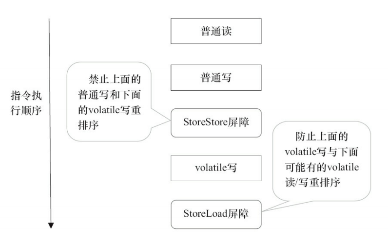

     **volatile读插入内存屏障后生成的指令序列示意图：**

     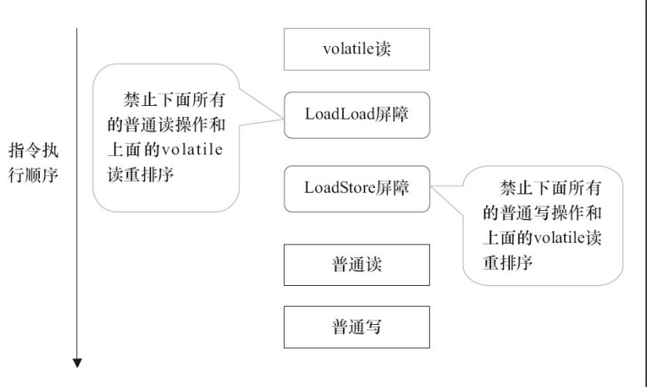

     

### 4.5、volatile和synchronized的区别?

- synchronized关键字能保证共享变量的原子性、有序性和可见性；volatile关键字只能保证可见性和有序性，并不保证原子性。
- volatile仅能使用在变量级别；synchronized则可以使用在方法和代码块上。
- volatile不会造成线程的阻塞；synchronized可能会造成线程的阻塞。


### 4.6、volatile使用场景

由于volatile变量只能保证可见性，**在不符合以下两条规则的运算场景中**，我们仍然要通过加锁（使用synchronized、java.util.concurrent中的锁或原子类）来保证原子性：

1. 运算结果并不依赖变量的当前值，或者能够确保只有单一的线程修改变量的值。

   - 前半句"运算结果并不依赖变量的当前值"，举个例子：

     ```java
     private volatile boolean running;
     
     /**
      * 典型的volatile使用问题：
      */
     public void start() {
         if(!running) { //设想A,B两个线程都看见running=false，进入到if中都是有可能的
             doStart();
             running = true;
         }
     }
     ```

   - 后半句"或者能够确保只有单一的线程修改变量的值"，举个例子：

     即上面的代码只有一个线程负责调用，比如在一个单线程的定时任务中：`new ScheduledThreadPoolExecutor(1)`

2. 变量不需要与其他的状态变量共同参与不变约束。

   意思就是volatile变量既不能像规则1那样依赖本身，也不能与其他共享变量组成组合的不变约束。


### 4.7、volatile的CPU缓存行(Cache Line)优化了解吗?

- **缓存行(Cache Line)**

  对计算机组成原理相对熟悉的小伙伴都知道，CPU 的速度比内存的速度高了几个数量级，为了 CPU 更快从内存中读取数据，设置了多级缓存机制，如下图所示：

  

  当 CPU 运算时，首先会从 L1 缓存查找所需要的数据，如果没有找到，再去 L2 缓存中去找，以此类推，直到从内存中获取数据，这也就意味着，越长的调用链，所耗费的执行时间也越长。那是不是可以从主内存拿数据的时候，顺便多拿一些呢？这样就可以避免频繁从主内存中获取数据了。聪明的计算机科学家已经想到了这个法子，这就是缓存行的由来。缓存是由多个缓存行组成的，而每个缓存行大小通常来说，大小为 64 字节(windows环境通过命令wmic cpu > d:/cpu.txt来查看DataWidth一栏的值，一般是64)，并且每个缓存行有效地引用主内存中的一块儿地址，CPU 每次从主内存中获取数据时，会将相邻的数据也一同拉取到缓存行中，这样当 CPU 执行运算时，就大大减少了与主内存的交互。

- **伪共享问题**

  当 CPU 执行完后，还需要将数据回写到内存上，以便于别的线程可以从主内存中获取最新的数据。假设两个线程都加载了相同的 Cache line 数据，会产生什么样的影响呢？下面我用一张图解释：

  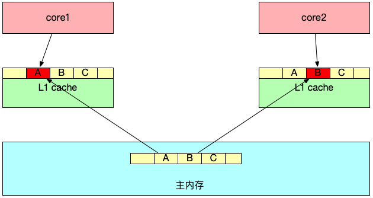

  数据 A、B、C 被加载到同一个 Cache line，假设线程 1 在 core1 中修改 A，线程 2 在 core2 中修改 B。

  线程 1 首先对 A 进行修改，这时 core1 会告知其它 CPU 核，当前引用同一地址的 Cache line 已经无效，随后 core2 发起修改 B，会导致 core1 将数据回写到主内存中，core2 这时会重新从主内存中读取该 Cache line 数据。

  可见，如果同一个 Cache line 的内容被多个线程读取，就会产生相互竞争，频繁回写主内存，降低了性能。

- **如何解决伪共享问题**

  要解决伪共享这个问题最简单的做法就是将线程间共享元素分开到不同的 Cache line 中，这种做法叫用空间换取时间，具体做法如下：

  ```java
  public final static class PaddingValue {
    // 前置填充对象
    protected long p1, p2, p3, p4, p5, p6, p7;
    // value 值
    protected volatile long value = 0L;
    // 后置填充对象
    protected long p9, p10, p11, p12, p13, p14, p15;
  }
  ```
  JDK1.8 有专门的注解 [@Contended](https://www.jianshu.com/p/7a0e3c42aa24) 来避免伪共享([更多请参考这篇文章](https://zhuanlan.zhihu.com/p/133229748))，为了更加直观，我使用了对象填充的方法，其中 protected long p1, p2, p3, p4, p5, p6, p7 作为前置填充对象，protected long p9, p10, p11, p12, p13, p14, p15作为后置填充对象，这样任意线程访问 PaddingValue 时，value 都处于不同的 Cache line 中，不会产生伪共享问题。这就是拿空间换时间的优化做法。

  具体代码见[CpuCacheLineFalseSharingExample](src/main/java/com/penglecode/xmodule/master4j/java/lang/thread/CpuCacheLineFalseSharingExample.java)


### 4.8、列举一下Java内存模型下一些“天然的”先行发生(Happens-Before)原则

- 程序次序规则（Program Order Rule）：在一个线程内，按照控制流顺序，书写在前面的操作先行发生于书写在后面的操作。注意，这里说的是控制流顺序而不是程序代码顺序，因为要考虑分支、循环等结构。
- 管程锁定规则（Monitor Lock Rule）：一个unlock操作先行发生于后面对同一个锁的lock操作。这里必须强调的是“同一个锁”，而“后面”是指时间上的先后。
- volatile变量规则（Volatile Variable Rule）：对一个volatile变量的写操作先行发生于后面对这个变量的读操作，这里的“后面”同样是指时间上的先后。
- 线程启动规则（Thread Start Rule）：Thread对象的start()方法先行发生于此线程的每一个动作。
- 线程终止规则（Thread Termination Rule）：线程中的所有操作都先行发生于对此线程的终止检测，我们可以通过Thread::join()方法是否结束、Thread::isAlive()的返回值等手段检测线程是否已经终止执行。
- 线程中断规则（Thread Interruption Rule）：对线程interrupt()方法的调用先行发生于被中断线程的代码检测到中断事件的发生，可以通过Thread::interrupted()方法检测到是否有中断发生。
- 对象终结规则（Finalizer Rule）：一个对象的初始化完成（构造函数执行结束）先行发生于它的finalize()方法的开始。
- 传递性（Transitivity）：如果操作A先行发生于操作B，操作B先行发生于操作C，那就可以得出操作A先行发生于操作C的结论。


## 5、Java并发包


### 5.1、Java魔法类Unsafe的功能介绍

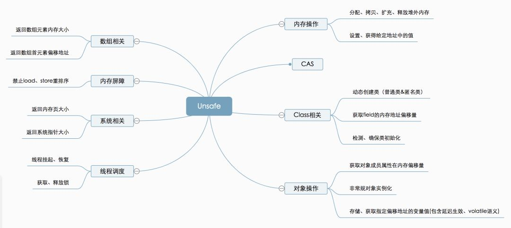

具体介绍及使用见[此处](https://segmentfault.com/a/1190000018161130)


### 5.2、LockSupport源码解析

```java
public class LockSupport {
    private LockSupport() {} // Cannot be instantiated.

    private static void setBlocker(Thread t, Object arg) {
        UNSAFE.putObject(t, parkBlockerOffset, arg);
    }
    
    /**
     * 返回提供给最近一次尚未解除阻塞的 park 方法调用的 blocker 对象。
     * 如果该调用不受阻塞，则返回 null。
     * 返回的值只是一个瞬间快照，即由于未解除阻塞或者在不同的 blocker 对象上受阻而具有的线程。
     */
    public static Object getBlocker(Thread t) {
        if (t == null)
            throw new NullPointerException();
        return UNSAFE.getObjectVolatile(t, parkBlockerOffset);
    }
    
    /**
     * 如果给定线程的许可尚不可用，则使其可用。
     * 如果线程在 park 上受阻塞，则它将解除其阻塞状态。
     * 否则，保证下一次调用 park 不会受阻塞。
     * 如果给定线程尚未启动，则无法保证此操作有任何效果。 
     * @param thread: 要执行 unpark 操作的线程；该参数为 null 表示此操作没有任何效果。
     */
    public static void unpark(Thread thread) {
        if (thread != null)
            UNSAFE.unpark(thread);
    }

    /**
     * 为了线程调度，在许可可用之前阻塞当前线程。 
     * 如果许可可用，则使用该许可，并且该调用立即返回；
     * 否则，为线程调度禁用当前线程，并在发生以下三种情况之一以前，使其处于休眠状态：
     *  1. 其他某个线程将当前线程作为目标调用 unpark
     *  2. 其他某个线程中断当前线程
     *  3. 该调用不合逻辑地（即毫无理由地）返回
     */
    public static void park() {
        UNSAFE.park(false, 0L);
    }

    /**
     * 和park()方法类似，不过增加了等待的相对时间
     */
    public static void parkNanos(long nanos) {
        if (nanos > 0)
            UNSAFE.park(false, nanos);
    }

    /**
     * 和park()方法类似，不过增加了等待的绝对时间
     */
    public static void parkUntil(long deadline) {
        UNSAFE.park(true, deadline);
    }
    
    /**
     * 和park()方法类似，只不过增加了暂停的同步对象
     * @param blocker 导致此线程暂停的同步对象
     * @since 1.6
     */
    public static void park(Object blocker) {
        Thread t = Thread.currentThread();
        setBlocker(t, blocker);
        UNSAFE.park(false, 0L);
        setBlocker(t, null);
    }
    
    /**
     * parkNanos(long nanos)方法类似，只不过增加了暂停的同步对象
     * @param blocker 导致此线程暂停的同步对象
     * @since 1.6
     */
    public static void parkNanos(Object blocker, long nanos) {
        if (nanos > 0) {
            Thread t = Thread.currentThread();
            setBlocker(t, blocker);
            UNSAFE.park(false, nanos);
            setBlocker(t, null);
        }
    }
    
    /**
     * parkUntil(long deadline)方法类似，只不过增加了暂停的同步对象
     * @param blocker 导致此线程暂停的同步对象
     * @since 1.6
     */
    public static void parkUntil(Object blocker, long deadline) {
        Thread t = Thread.currentThread();
        setBlocker(t, blocker);
        UNSAFE.park(true, deadline);
        setBlocker(t, null);
    }

    static final int nextSecondarySeed() {
        int r;
        Thread t = Thread.currentThread();
        if ((r = UNSAFE.getInt(t, SECONDARY)) != 0) {
            r ^= r << 13;   // xorshift
            r ^= r >>> 17;
            r ^= r << 5;
        }
        else if ((r = java.util.concurrent.ThreadLocalRandom.current().nextInt()) == 0)
            r = 1; // avoid zero
        UNSAFE.putInt(t, SECONDARY, r);
        return r;
    }

    // Hotspot implementation via intrinsics API
    private static final sun.misc.Unsafe UNSAFE;
    private static final long parkBlockerOffset;
    private static final long SEED;
    private static final long PROBE;
    private static final long SECONDARY;
    static {
        try {
            UNSAFE = sun.misc.Unsafe.getUnsafe();
            Class<?> tk = Thread.class;
            parkBlockerOffset = UNSAFE.objectFieldOffset
                (tk.getDeclaredField("parkBlocker"));
            SEED = UNSAFE.objectFieldOffset
                (tk.getDeclaredField("threadLocalRandomSeed"));
            PROBE = UNSAFE.objectFieldOffset
                (tk.getDeclaredField("threadLocalRandomProbe"));
            SECONDARY = UNSAFE.objectFieldOffset
                (tk.getDeclaredField("threadLocalRandomSecondarySeed"));
        } catch (Exception ex) { throw new Error(ex); }
    }
}
```


### 5.3、LockSupport使用总结

- 初始默认情况下，在调用线程上的许可是0，即没有可用的许可，因此调用park()会被阻塞。
- 在相同线程上连续多次调用unpark()最多获取到一次许可，不会叠加，也就是说跟调用一次unpark()的效果一样。
- 在相同线程上连续2次调用park()肯定会使该线程阻塞。
- 线程A调用park()阻塞住了，线程B可调用A线程的interrupt()方法使线程A响应中断并结束阻塞。
- LockSupport.park(Object blocker)方法中所传parkBlocker是用于记录线程是被谁阻塞的，可以通过LockSupport的getBlocker获取到阻塞的对象。用于监控和分析线程用的。


### 5.4、SMP、NUMA两种处理器结构

- **SMP(Symmetric Multi-Processor)：**即对称多处理器结构，指服务器中多个CPU对称工作，每个CPU访问内存地址所需时间相同。其主要特征是共享，包含对CPU，内存，I/O等进行共享。SMP的优点是能够保证内存一致性，缺点是这些共享的资源很可能成为性能瓶颈，随着CPU数量的增加，每个CPU都要访问相同的内存资源，可能导致内存访问冲突，可能会导致CPU资源的浪费。常用的PC机就属于这种。
- **NUMA(Non-Uniform Memory Access)：**非一致存储访问，将CPU分为CPU模块，每个CPU模块由多个CPU组成，并且具有独立的本地内存、I/O槽口等，模块之间可以通过互联模块相互访问，访问本地内存的速度将远远高于访问远地内存(系统内其它节点的内存)的速度，这也是非一致存储访问NUMA的由来。NUMA优点是可以较好地解决原来SMP系统的扩展问题，缺点是由于访问远地内存的延时远远超过本地内存，因此当CPU数量增加时，系统性能无法线性增加。


### 5.5、自旋锁、CLH锁、MCS锁

1. **自旋锁（SpinLock）：**多个线程，当一个线程尝试获取锁的时候，如果锁被占用，就在当前线程循环检查锁是否被释放，这个时候线程并没有进入休眠或者挂起。

   - **自旋锁代码实现：**下面是自旋锁的简单实现

     ```java
     import java.util.concurrent.atomic.AtomicReference;
     
     /**
      * 简单的自旋锁实现
      */
     public class SimpleSpinLock implements SimpleLock {
     
         private final AtomicReference<Thread> lockOwner = new AtomicReference<>();
     
         @Override
         public void lock() {
             Thread currentThread = Thread.currentThread();
             // 如果锁未被占用，则设置当前线程为锁的拥有者，设置成功返回true，否则返回false
             while(!lockOwner.compareAndSet(null, currentThread)) {
             }
         }
     
         @Override
         public void unlock() {
             Thread currentThread = Thread.currentThread();
             // 只有锁的拥有者才能释放锁，也就是说只有锁的拥有者调用此方法才会有效果
             lockOwner.compareAndSet(currentThread, null);
         }
     
     }
     ```

   - **自旋锁缺点：**

     1. 非公平锁，并不能保证线程获取锁的顺序。

     2. 保证各个CPU的缓存（L1、L2、L3、跨CPU Socket、主存）的数据一致性，通讯开销很大，在多处理器系统上更严重。

     

2. **CLH锁：**CLH(Craig, Landin, and Hagersten)(好吧，这是三个人的名字)，是一种基于链表的可扩展、高性能、公平的自旋锁，申请线程只在本地变量上自旋，它不断轮询前驱的状态，如果发现前驱释放了锁就结束自旋。

   - **CLH锁实现：**

     - 线程持有自己的node变量，node中有一个locked属性，true代表需要锁，false代表不需要锁。
     - 线程持有前驱的node引用，轮询前驱node的locked属性，true的时候自旋，false的时候代表前驱释放了锁，结束自旋。
     - tail始终指向最后加入的线程。

   - **CLH锁实现原理：**

     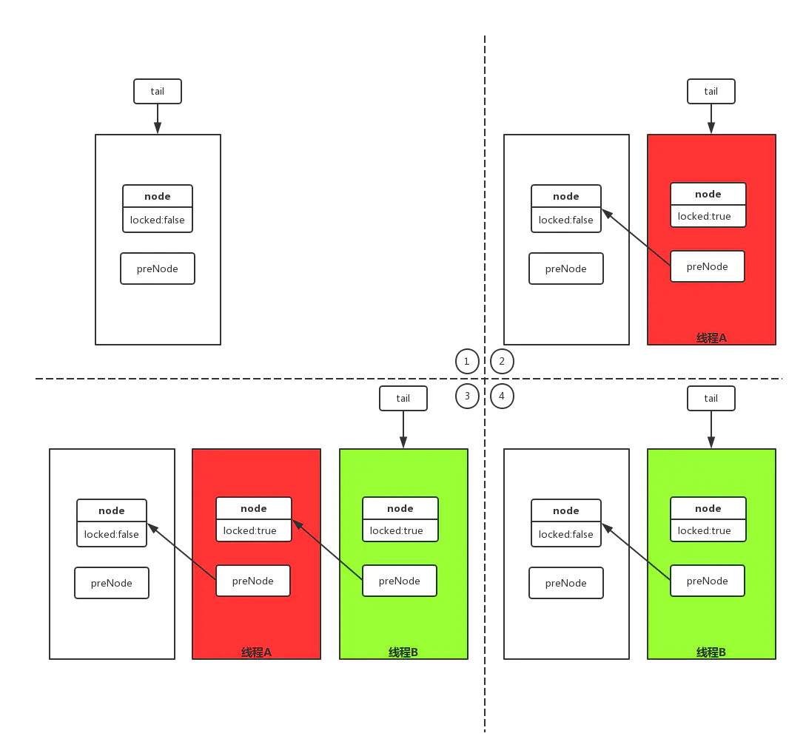

     1. 初始化的时候tail指向一个类似head的节点，此时node的locked属性为false，preNode为空。

     2. 当线程A进来的时候，线程A持有的node节点，node的locked属性为true，preNode指向之前的head节点。

     3. 当线程B进来的时候，线程B持有的node节点，node的locked属性为true，preNode指向线程A的node节点，线程B的node节点locked属性为true，线程A轮询线程B的node节点的locked状态，为true自旋。

     4. 线程A执行完后释放锁（修改locked属性为false），线程B轮询到线程A的node节点locked属性为false，结束自旋。

   - **CLH锁代码实现：**

     ```java
     import java.util.concurrent.atomic.AtomicReference;
     
     /**
      * 简单的CLH锁实现
      */
     public class SimpleCLHLock1 implements SimpleLock {
     
         //指向最后排队获取锁的线程
         private final AtomicReference<Node> tail;
     
         //当前线程持有的节点,使用ThreadLocal实现了变量的线程隔离
         private final ThreadLocal<Node> nodeHolder;
     
         //当前线程持有的节点的前驱节点，使用ThreadLocal实现了变量的线程隔离
         private final ThreadLocal<Node> prevHolder;
     
         public SimpleCLHLock1() {
             this.nodeHolder = ThreadLocal.withInitial(() -> new Node(true));
             this.prevHolder = new ThreadLocal<>();
             //初始化tail，指向一个node，类似一个head节点，并且该节点locked属性为false
             this.tail = new AtomicReference<>(new Node(false));
         }
     
         @Override
         public void lock() {
             //当前线程进来了，初始化一个代表当前线程的Node节点
             Node node = nodeHolder.get();
             /**
              * 设置当前线程所持有的Node节点，将其设为true代表当前线程期望获得锁
              * 注意此句不能放在ThreadLocal的initialValue()方法中，
              * 例如：ThreadLocal.withInitial(() -> new Node(true));
              * 这样会发生重排序，也即构造器内指令溢出：
              * 例如线程A执行上面new Node(true)时，true值还未设置到locked上时，
              * 紧接着排队在线程A后面的线程B已经走到了下面的
              * while(..)阻塞语句处了，发现它前面的node.locked为false，因而出现插队现象。
              */
             node.locked = true; //禁止指令重排序，不能省略此句
     
             //作为一个公平锁，当前线程需要排队，排到队尾去
             Node prev = tail.getAndSet(node);
             //旧的队尾(prev)将会是当前节点的前驱节点
             prevHolder.set(prev);
             /**
              * 只关注前驱节点的状态即可，就像排队一样，只关心前面的人到哪了，后面排队的人不需要管，与我无关。
              * 第一个获取锁的线程，不需要自旋等待毫无吹灰之力滴获取到了锁，
              * 因为初始化时tail中放的就是一个无获取锁需求的Node（见上面构造器中的最后一句）
              */
             while(prev.locked) {
                 /**
                  * 释放CPU，防止出现"CPU竞争暂歇性死锁"：
                  * 即当前线程正要执行unlock()方法里面的代码时没有多余的空闲CPU响应(执行代码)，
                  * 总共N个CPU全部被排在当前线程之后的N个线程占用(全部CPU都在执行忙等)
                  * 进而造成unlock()中的代码很长时间获得不到CPU时间，造成暂歇性死锁
                  * (可以注掉下面yield语句，同时解开两处关于node.hashCode()的打印语句，即可观察到现象)
                  */
                 Thread.yield(); //加上这句，此锁的并发性能大打折扣
             }
             //System.out.println(">>> " + node.hashCode());
         }
     
         @Override
         public void unlock() {
             //释放锁也很简单，就是将当前线程持有的Node的locked标志位设为false，标识当前线程已经使用完了锁了
             Node node = nodeHolder.get();
             node.locked = false;
             /**
              * 但是考虑到当前线程连续成功获取锁的情况，就会出现lock()方法中while()永远独占忙等，
              * 即出现死锁，解决办法以下两者选其一
              */
             //nodeHolder.set(new Node());
             nodeHolder.set(prevHolder.get()); //相比于上一句代码，此句更省内存及减轻GC压力
             //System.out.println("<<< " + node.hashCode());
         }
     
         private class Node {
     
             //默认不需要获取锁
             private volatile boolean locked;
     
             public Node(boolean locked) {
                 this.locked = locked;
             }
     
         }
     
     }
     ```

   - **CLH锁的优点：**

     - 是公平锁，FIFO
     - CLH队列锁的优点是空间复杂度低（如果有n个线程，L个锁，每个线程每次只获取一个锁，那么需要的存储空间是O（L+n）

   - **CLH锁的缺点：**

     是在NUMA系统结构下性能很差，在这种系统结构下，每个线程有自己的内存，如果前趋结点的内存位置比较远，自旋判断前趋结点的locked域，性能将大打折扣。

3. **MCS锁：**MCS锁可以解决上面的CLH锁的缺点，MCS 来自于其发明人名字的首字母： John Mellor-Crummey和Michael Scott。

   MCS Spinlock 是一种基于链表的可扩展、高性能、公平的自旋锁，申请线程只在本地变量上自旋，直接前驱负责通知其结束自旋（与CLH自旋锁不同的地方，不在轮询前驱的状态，而是由前驱主动通知），从而极大地减少了不必要的处理器缓存同步的次数，降低了总线和内存的开销。

   - **MCS锁的实现原理：**
   
     
   
     1. 每个线程持有一个自己的node，node有一个locked属性,true表示等待获取锁，false表示可以获取到锁，并且持有下一个node（后继者）的引用（可能存在）
   
     2. 线程在轮询自己node的locked状态，true表示锁被其他线程暂用，等待获取锁，自旋。
   
     3. 线程释放锁的时候，修改后继者（nextNode）的locked属性，通知后继者结束自旋。
   
   - **CLH锁代码实现：**
   
     暂无


### 5.6、AQS原理解析


1. **总体设计思想**

   AbstractQueuedSynchronizer又称队列同步器，简称AQS，是JUC框架的基石，没有之一。其核心是基于CLH锁队列算法的变种设计出来的基于模板设计模式的同步基础组件。为什么说是CLH锁队列的变体呢？传统的CLH锁队列设计思想是等待队列中的每个等待节点通过自旋检测监控前驱节点的锁状态，当等待队列节点规模大于CPU核数时由于众多节点上的自旋长期霸占CPU时间片会导致unlock释放锁的操作得不到及时执行，因而大多基于CLH锁队列思想设计的锁都得辅以休眠/唤醒机制来减轻CPU自旋，AQS也正是这么设计的。AQS队列内部维护的是一个FIFO的双向链表，这种结构的特点是每个数据结构都有两个指针，分别指向直接的后继节点和直接前驱节点。所以双向链表可以从任意一个节点开始很方便的访问前驱和后继。每个Node其实是由线程封装，当线程争抢锁失败后会封装成Node加入到ASQ队列中去。

2. **AQS底层实现的五要素**

   - **Node节点**

     Node节点类数据结构包含thread、waitStatus、prev、next、nextWaiter五个字段，这个五个字段的部分字段被两类队列(**等待队列**、**条件队列**)所共用。我们且称之为**等待节点**和**条件节点**。

     **等待节点**：即想获取锁的线程加入等待队列时的Node称谓，这时使用到了：thread(当前等待节点所持线程)、waitStatus(当前等待节点的等待状态)、prev(当前等待节点的前驱结点)、next(当前等待节点的后继节点)四个字段来完成等待队列的功能。其中等待状态waitStatus的枚举值只用到了(Node.CANCELLED、Node.SIGNAL、Node.PROPAGATE)

     **条件节点**：即通过Condition.await()挂起后加入到条件队列时的Node称谓，这时使用到了：thread(当前条件节点所持线程)、waitStatus(当前条件节点的等待状态)、nextWaiter(当前条件节点的后继节点)。其中等待状态waitStatus的枚举值只用到了(Node.CANCELLED、Node.CONDITION)

   - **队列**

     AQS中的队列分两类：

     1. **等待队列**，等待队列是一个FIFO的双向链表，它是AQS中最主要的队列，处于等待队列中的节点都持有一个当前线程，它们都想获取锁。等待队列的元素由Node节点类数据结构构成，且只用到了数据结构中的thread、waitStatus、prev、next四个字段。
     2. **条件队列**，条件队列是一个尾进头出的单向链表，它是AQS中由Condition形成的队列，调用了condition.await()方法的线程都被挂起并加入到条件队列中，而处于条件队列中的节点都持有一个当前线程，它们等待有其他线程在condtion上调用signal()或signalAll()唤醒它们，这样它们就可以摇身一变(见transferForSignal()方法)，变成等待队列的节点加入等待队列中，等待着获取锁。

     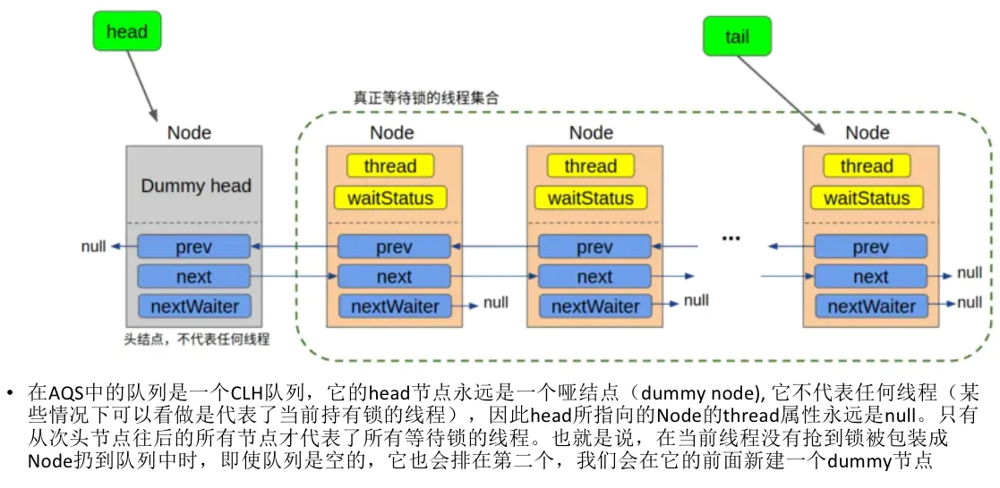

   - **CAS**

     用CAS保证并发修改的原子性，同一时刻只有一个线程能够修改成功。内部借助于Unsafe类实现，其实也可以采用AtomicReference类实现，当然AtomicReference内部也是采用Unsafe类实现的。

   - **自旋**

     用于保证线程不跳出指定的执行逻辑。

   - **LockSupport**

     由于不停的自旋会导致cpu的空转，非常损耗性能，所以引入LockSupport(内部借助Unsafe类实现，JVM底层由Posix线程库pthread中的mutex(互斥量)，condition(条件变量)来实现)，用于控制线程的休眠与唤醒。
     
   - **state共享变量**

     用于标识同步状态的状态变量

3. **AQS源码解析**

   https://www.cnblogs.com/waterystone/p/4920797.html **(推荐)**

   https://www.jianshu.com/p/c244abd588a8

4. AQS模板方法列表

   - **独占式同步组件主要方法：**

     |                            方法名                            | 方法描述                                                     | 子类是否重写<br /> |
     | :----------------------------------------------------------: | ------------------------------------------------------------ | :----------------: |
     |            public final void **acquire**(int arg)            | 独占式获取同步状态，如果当前线程获取同步状态成功，则由该方法返回，否则，将会进入同步队列等待，该方法将会调用重写的tryAcquire(int arg)方法 |         否         |
     |     public final void **acquireInterruptibly**(int arg)      | 与acquire(int arg)相同，但是该方法响应中断，当前线程未获取到同步状态而进入同步队列中，如果当前线程被中断，则该方法会抛出InterruptedException |         否         |
     | public final boolean **tryAcquireNanos**(int arg, long nanosTimeout) | 在acquireInterruptibly(int arg)基础上增加了超时限制，如果当前线程在超时实现内没有获取到同步状态，那么将会返回false，如果获取到了就返回true |         否         |
     |          protected boolean **tryAcquire**(int arg)           | 尝试获取资源，成功则返回true，失败则返回false。开发者需要覆写此方法，即对state变量的维护，通过调用getState()、setState()、compareAndSetState(int expect, int update)方法，从而实现对state变量的维护与访问。 |       **是**       |
     |          public final boolean **release**(int arg)           | 独占式释放同步状态，该方法会在释放同步状态后，将同步队列中第一个节点持有的线程唤醒 |         否         |
     |          protected boolean **tryRelease**(int arg)           | 尝试释放资源，成功则返回true，失败则返回false。即对state变量的维护，通过调用getState()、setState()、compareAndSetState(int expect, int update)方法，从而实现对state变量的维护与访问。 |       **是**       |

   - **共享式同步组件主要方法：**

     |                            方法名                            | 方法描述                                                     | 子类是否重写<br /> |
     | :----------------------------------------------------------: | ------------------------------------------------------------ | :----------------: |
     |         public final void **acquireShared**(int arg)         | 共享式的获取同步状态，如果当前线程未获取到同步状态，将会进入同步队列等待，与独占式获取的主要区别是在同一时刻可以有多个线程获取到同步状态。 |         否         |
     |  public final void **acquireSharedInterruptibly**(int arg)   | 与void acquireShared(int arg)相同，该方法响应中断            |         否         |
     | public final boolean **tryAcquireSharedNanos**(int arg, long nanosTimeout) | 在acquireSharedInterruptibly(int arg)的基础上增加了超时限制。如果当前线程在超时实现内没有获取到同步状态，那么将会返回false，如果获取到了就返回true |         否         |
     |         protected int **tryAcquireShared**(int arg)          | 尝试获取资源。负数表示失败；0表示成功，但没有剩余可用资源；正数表示成功，且有剩余资源。开发者需要覆写此方法，即对state变量的维护，通过调用getState()、setState()、compareAndSetState(int expect, int update)方法，从而实现对state变量的维护与访问。 |       **是**       |
     |       public final boolean **releaseShared**(int arg)        | 共享式释放同步状态，该方法会在释放同步状态后，将同步队列中后续节点持有的线程唤醒 |         否         |
     |       protected boolean **tryReleaseShared**(int arg)        | 尝试释放资源，如果释放后允许唤醒后续等待结点返回true，否则返回false。即对state变量的维护，通过调用getState()、setState()、compareAndSetState(int expect, int update)方法，从而实现对state变量的维护与访问。 |       **是**       |

   - **组件其他方法**

     |                  方法名                   | 方法描述                                                  | 子类是否重写 |
     | :---------------------------------------: | --------------------------------------------------------- | :----------: |
     | protected boolean **isHeldExclusively**() | 该线程是否正在独占资源。只有用到condition才需要去实现它。 |    **是**    |

     

5. **AQS要点解析**

   - **AQS节点状态waitStatus：**

     这里我们说下Node。Node结点是对每一个等待获取资源的线程的封装，其包含了需要同步的线程本身及其等待状态，如是否被阻塞、是否等待唤醒、是否已经被取消等。变量waitStatus则表示当前Node结点的等待状态，共有5种取值CANCELLED、SIGNAL、CONDITION、PROPAGATE、0。

     - **CANCELLED**(1)：表示当前结点已取消调度。当timeout或被中断（响应中断的情况下），会触发变更为此状态，进入该状态后的结点将不会再变化。
     - **SIGNAL**(-1)：表示后继结点在等待当前结点唤醒。后继结点入队时，会将前继结点的状态更新为SIGNAL。
     - **CONDITION**(-2)：表示结点等待在Condition上，当其他线程调用了Condition的signal()方法后，CONDITION状态的结点将**从等待队列转移到同步队列中**，等待获取同步锁。
     - **PROPAGATE**(-3)：共享模式下，前继结点不仅会唤醒其后继结点，同时也可能会唤醒后继的后继结点。
     - **0**：新结点入队时的默认状态。

     *注意，**负值表示结点处于有效等待状态，而正值表示结点已被取消。所以源码中很多地方用>0、<0来判断结点的状态是否正常**。*

     

   - **AQS加锁流程概述(独占模式)：**

     1. 先tryAcquire()尝试直接去获取资源，如果成功则直接返回，表示获取到锁了(这里体现了非公平锁，每个线程获取锁时会尝试直接抢占加塞一次)。

     2. 上面抢锁为没成功则调用addWaiter()方法将该线程加入等待队列的尾部，并标记为独占模式。

     3. 之后在acquireQueued()方法中通过自旋判断自己是否排在第二位，如果是则尝试通过tryAcquire()获取资源，如果获取到了即代表成功获取到了锁并设置自己为head节点；如果自己不是排在第二位或者排在第二位但是tryAcquire()获取不到资源，则自己在确保其前驱节点的状态为Node.SIGNAL后安心的休眠了，直到head节点释放锁的时候唤醒了排在第二位的节点，这样排在第二位的节点就可以获取到锁并成为了新的head节点。在这个方法里面，每个获取锁的线程只负责监视自己的前驱节点或者使自己所持线程睡眠。

     4. 使等待队列中排在第二位后面的节点在确保其前驱节点的状态为Node.SIGNAL后安心的休眠了。直到head节点释放锁的时候唤醒了排在第二位的节点，这样排在第二位的节点获取到了锁并成为了新的head节点。

        ***以上所述"第二位"指的是有效节点，不包括已取消的节点，即Node.waitStatus < 0***

   - **AQS解锁流程概述(独占模式)：**

     1. 先调用tryRelease()释放资源，如果释放成功(此处为独占模式，释放成功就是彻底释放，state变为0)，接着将head节点的后继节点唤醒。
     2. head后继节点醒了之后，在acquireQueued()中的自旋块中通过tryAcquire()获取到了锁，然后将自己设为head节点，这样原本排在第二位的节点就获取到了锁。

   - **AQS加锁流程概述(共享模式)：**

     1. 先调用tryAcquireShared()方法获取资源，该方法的返回值：负值代表获取失败；0代表获取成功，但没有剩余资源；正数表示获取成功，还有剩余资源，其他线程还可以去获取。

     2. 如果上面的tryAcquireShared()方法返回值小于0代表获取资源失败，那么继续执行doAcquireShared()进入等待队列，直到获取到资源为止才返回。

     3. 在doAcquireShared()方法中，先通过addWaiter()方法将该线程加入等待队列的尾部，并标记为共享模式。

     4. 之后在doAcquireShared()方法中通过自旋判断自己是否排在第二位，如果是则尝试通过tryAcquireShared()获取资源，如果获取到了即代表成功获取到了足量的共享锁并设置自己为head节点，同时如果还有剩余共享资源可供获取则唤醒后继节点起来获取(此举称之谓"扩散"，即每个获取足额资源的节点负责唤醒它的后继节点)；如果自己不是排在第二位或者排在第二位但是tryAcquireShared()获取不到资源，则自己在确保其前驱节点的状态为Node.SIGNAL后安心的休眠了，直到head节点释放锁的时候唤醒了排在第二位的节点，这样排在第二位的节点就可以获取到锁并成为了新的head节点。在这个方法里面，每个获取锁的线程只负责监视自己的前驱节点或者使自己所持线程睡眠或者唤醒它的后继节点起来获取资源。

        <u>**AQS共享模式加锁与独占模式加锁大同小异，唯一区别就是当前节点有唤醒(扩散)职责，即当前节点视资源余额情况唤醒它的后继节点起来获取锁资源，而在独占模式下仅仅head节点具有唤醒职责！**</u>

        ***以上所述"第二位"指的是有效节点，不包括已取消的节点，即Node.waitStatus < 0***

   - **AQS解锁流程概述(共享模式)：**

     1. 先调用tryReleaseShared()释放资源，如果释放成功(此处为共享模式，释放成功并不代表彻底释放，共享模式实质就是控制一定量的线程并发执行，那么拥有资源的线程在释放掉部分资源时就可以唤醒后继等待结点)，接着在doReleaseShared()方法中将head节点的后继节点唤醒。
     2. head后继节点醒了之后，在doAcquireShared()中的自旋块中通过tryAcquireShared()获取到了锁，然后将自己设为head节点，这样原本排在第二位的节点就获取到了锁。

   

6. **AQS实现原理的几个问答**

   - **如果堵塞期间线程中断了咋办？**

     首先线程的中断机制有两种：响应中断异常和响应中断信号(中断标识位)。在阻塞类方法中(Object.wait()、Thread.sleep()、LockSupport.park()等)只有LockSupport.park()是基于静默响应中断信号机制的，而AQS的底层实现中恰恰用的就是LockSupport.park()方法，AQS的做法是设置中断标识，但是不抛出中断异常（在acquireInterruptibly方法中会强制抛出中断异常）。

   - **如果我想实现公平锁和非公平锁呢？**

     其实所谓公平锁与非公平锁实现很简单，公平锁就是严格的按照FIFO，获取锁前先判断是否存在等待队列，如果不存在则直接获取锁，否在添加到等待队列自旋获取锁，而非公平锁则是在线程第一次获取锁时，直接获取锁。如果获取失败，则添加到队列，然后获取锁。

     ***AQS实现中主体是基于公平锁实现的，但非绝对公平，因为获取锁的时候上来先插个队尝试一下运气，如果获取到了算运气好，没获取到则去后面排队。***

   - **如果我想实现重入锁咋办呢？**

     通过保存持锁线程对象实现。

   - **如何按照某个条件指定线程唤醒？**

     通过条件队列实现，具体一个源码可以参考ReentrantLock

   - **如何实现共享锁与独占锁**

     共享模式获取锁逻辑跟独占模式比区别在于，共享模式获取锁后有剩余的话还会唤醒之后的节点。那么问题就来了，假如老大用完后释放了5个资源，而老二需要6个，老三需要1个，老四需要2个。老大先唤醒老二，老二一看资源不够，他是把资源让给老三呢，还是不让？答案是否定的！老二会继续park()等待其他线程释放资源，也更不会去唤醒老三和老四了。独占模式，同一时刻只有一个线程去执行，这样做未尝不可；但共享模式下，多个线程是可以同时执行的，现在因为老二的资源需求量大，而把后面量小的老三和老四也都卡住了。当然，这并不是问题，只是AQS保证严格按照入队顺序唤醒罢了（保证公平，但降低了并发）

     共享模式释放资源规则很简单：释放掉资源后，唤醒后继。跟独占模式下的release()相似，但有一点稍微需要注意：独占模式下的tryRelease()在完全释放掉资源（state=0）后，才会返回true去唤醒其他线程，这主要是基于独占下可重入的考量；而共享模式下的releaseShared()则没有这种要求，共享模式实质就是控制一定量的线程并发执行，那么拥有资源的线程在释放掉部分资源时就可以唤醒后继等待结点。

     

7. **基于AQS编写自定义同步组件注意事项**

   - **AQS中的同步队列：**不需要我们关心，其状态AQS会完整的帮我们维护不需要我们操半点心。

   - **AQS中的state变量：**state是留给开发者来维护的，那么state到底代表着什么呢？**其实这个state值的含义由开发者决定！**你可以认为state是可用的许可或者是当前获得锁的线程数。其实两者最终都能实现锁，但是有区别：因为含义不同，你在调用compareAndSetState(oldState, newState)方法的时候参数传的就不一样！如果你认为state是可用的许可，那么你得在new Sync()的时候给state设置一个初始值(独占锁得设为1)，为什么这样？因为state是int类型，不设初始值的情况下默认值是0，0即代表没有许可可用，刚一上来就没许可可用这个锁不就是个死锁了吗？；相反如果你认为state代表当前获得锁的线程数，那么就不需要初始化state值这么麻烦了！state必须由开发人员自己来实现。如对于一个独占式同步组件，可能我们会希望state的最大值为1，而对于一个共享式同步组件，我们会希望state变量的最大值是大于1的其他正整数。有时我们可能一次只获取一个许可，有时可能又会一次获取多个许可。因此，在开发者覆盖tryAcquire()、tryRelease()等方法时需要通过调用getState()、setState()、compareAndSetState(int expect, int update)等方法，实现对state变量的维护与访问。

     ***JUC的大多数框架都是基于AQS实现的，而且都是利用state记录线程的个数作为阻塞还是唤醒线程的依据例。***

   - **使用新的接口和实现包装同步组件：**在我们编写一个同步组件的时候，例如我们想实现一个独占锁，假设为Sync，其继承了AQS。只需要在Sync类中覆写tryAcquire和tryRelease即可，但是由于继承AQS的时候，会把tryAcquireShared、tryReleaseShared等共享锁方法也继承下来。而Sync并不会实现这些共享式同步组件的方法，因为Sync只是一个独占锁而已，从业务含义上，因此应该将这些方法屏蔽，从而防止用户误操作。按照最佳实现，屏蔽的方式是定义一个新的接口，假设用Mutex表示，这个接口只定义了独占锁相关方法，再编写一个类MutexImpl实现Mutex接口，而对于同步组件Sync类的操作，都封装在MutexImpl中。

   - **同步组件推荐定义为静态内部类：**因为某个同步组件通常是为实现特定的目的而实现，可能只适用于特定的场合。如果某个同步组件不具备通用性，我们应该将其定义为一个私有的静态内部类。结合第一点，我们编写的同步组件Sync应该是MutexImpl的一个私有的静态内部类。


### 5.7、AQS之Condition原理解析

1. **Condition要点解析**

   - 每个`Condition`实例对应一个尾进头出的单向链表(链表元素类型也是共用了Node类型)，称之为条件队列，整个队列有一个头指针`CondtionObject.firstWaiter`和一个尾指针`CondtionObject.lastWaiter`，通过后驱指针`Node.nextWaiter`连接起来。
   - 调用`Condition.await()`方法前当前线程必须持有锁，调用了`Condition.await()`方法后会向条件队列尾部添加一个节点，节点的数据结构和阻塞队列中的节点数据结构完全一样，只不过`nextWaiter == CONDITION`；然后保存并释放所持的所有锁，同时调用`LockSupport.park(this)`挂起当前线程。
   - 调用`Condition.signal()/signalAll()`方法前当前线程必须持有锁，调用了`Condition.signal()/signalAll()`方法后会唤醒条件队列中的头节点(`CondtionObject.firstWaiter`)，并将该节点转换成(`ConditionObject.transferForSignal()`)等待队列的节点加入等待队列的尾部，同时调用`LockSupport.unpark(node.thread)`唤醒节点所持线程，也就是上面因调用`Condition.await()`方法而挂起的线程被唤醒了，并进入了等待获取锁的状态。
   - **总体来说基于AQS实现的ReentrantLock及其Condition组合来实现基于等待/通知模式的线程之间通信机制完全是synchronized、Object.wait()、Object.notify()的翻版。**

2. **Condition源码解析**

   ```java
   public class ConditionObject implements Condition, java.io.Serializable {
       //条件队列的头节点
       private transient Node firstWaiter;
       //条件队列的尾结点
       private transient Node lastWaiter;
   
       public ConditionObject() { }
       
       public final void await() throws InterruptedException {
           // 响应中断
           if (Thread.interrupted())
               throw new InterruptedException();
   
           // 向条件队列添加一个尾节点
           Node node = addConditionWaiter();
   
           // 释放阻塞队列中的锁，及调用release方法释放锁，然后唤醒head节点的下一个节点
           int savedState = fullyRelease(node);
           int interruptMode = 0;
   
           // 判断该节点是否在阻塞队列中
           while (!isOnSyncQueue(node)) {
               // 如果不在阻塞队列中，就阻塞当前线程，等待 ConditionObject#signal 方法唤醒
               LockSupport.park(this);
               if ((interruptMode = checkInterruptWhileWaiting(node)) != 0)
                   break;
           }
   
           // 通过执行 ConditionObject#signal 方法唤醒节点后，继续往下执行，这时候需要重新获取锁
           if (acquireQueued(node, savedState) && interruptMode != THROW_IE)
               interruptMode = REINTERRUPT;
           if (node.nextWaiter != null) // clean up if cancelled
               unlinkCancelledWaiters();
           if (interruptMode != 0)
               reportInterruptAfterWait(interruptMode);
       }
       
       private Node addConditionWaiter() {
           Node t = lastWaiter;
           // If lastWaiter is cancelled, clean out.
           if (t != null && t.waitStatus != Node.CONDITION) {
               // 将条件队列中 `waitStatus != Node.CONDITION` 的节点删除
               unlinkCancelledWaiters();
               // 删除之后可能尾节点已经改变了，需要重新赋值
               t = lastWaiter;
           }
   
           Node node = new Node(Thread.currentThread(), Node.CONDITION);
           if (t == null)
               // 如果条件队列为空，则设置头指针
               firstWaiter = node;
           else
               // 如果条件队列不为空，让目前的尾节点的的后驱指针指向它
               t.nextWaiter = node;
           // 将当前节点设置为尾节点
           lastWaiter = node;
           return node;
       }
       
       public final void signal() {
           // 当前线程持有锁才能唤醒首节点
           if (!isHeldExclusively())
               throw new IllegalMonitorStateException();
   
           Node first = firstWaiter;
           if (first != null)
               // 唤醒首节点
               doSignal(first);
       }
       
       private void doSignal(Node first) {
           do {
               if ( (firstWaiter = first.nextWaiter) == null)
                   lastWaiter = null;
               // 脱离 Condition队列 首节点 help GC
               first.nextWaiter = null;
           } while (!transferForSignal(first) &&
                       (first = firstWaiter) != null);
       }
       
       final boolean transferForSignal(Node node) {
           //转换节点类型，即将条件节点转换为初始加入等待队列的等待节点
           if (!compareAndSetWaitStatus(node, Node.CONDITION, 0))
               return false;
   
   
           // 将Condition队列中的首节点添加到阻塞队列的尾部， enq方法返回的是入参的前驱节点， 
           // 这将会导致ConditionObject#await方法中的 `!isOnSyncQueue(node)` 不成立结束while循环
           Node p = enq(node);
           int ws = p.waitStatus;
           if (ws > 0 || !compareAndSetWaitStatus(p, ws, Node.SIGNAL))
               // 唤醒调用 ConditionObject#await 方法的线程
               LockSupport.unpark(node.thread);
           return true;
       }
   }
   ```


### 5.8、ReentrantLock原理解析

1. **可重入锁的实现原理：**

   - 将state定义为双重语义：

     1. 值0和1代表获得到锁的线程数，在独占模式下，也就是说0-代表锁可用，1-代表锁不可用。
     2. 大于1的值代表同一个线程连续获取锁的次数（也就是重入次数），**这是实现可重入的要素之一**。

   - 站在可重入的角度下，在初次获得锁的情况下使用AQS内部的exclusiveOwnerThread属性保存当前锁被谁持有，**这是实现可重入的要素之二**。

     

2. **公平锁与非公平锁的实现原理：**

   - **非公平锁**

     1. 首先抛开其他不看，AQS本身实现中就体现了AQS内部的锁机制是一个**非绝对公平**的锁队列，在acquire()方法中就可以看出来，上来先调用一次抢锁方法tryAcquire()，抢到锁就返回了，没抢到再去排队。这体现了非绝对公平性。
   
     2. ReentrantLock.NonfairSync的实现中也是同样的逻辑，上来就插队抢锁，而且还是插了两次队：
   
        ```java
        public class ReentrantLock implements Lock, java.io.Serializable {
            private static final long serialVersionUID = 7373984872572414699L;
            /** Synchronizer providing all implementation mechanics */
            private final Sync sync;
        
            /**
             * 独占锁基类，它的子类有NonfairSync和FairSync两个
             */
            abstract static class Sync extends AbstractQueuedSynchronizer {
                private static final long serialVersionUID = -5179523762034025860L;
        
                /**
                 * 留给NonfairSync和FairSync两个子类实现，等同Lock.lock()
                 */
                abstract void lock();
        
                /**
                 * 非公平锁的实现
                 * 这个方法是非公平锁的第二次插队抢锁
                 */
                final boolean nonfairTryAcquire(int acquires) {
                    final Thread current = Thread.currentThread();
                    int c = getState();
                    if (c == 0) {
                        if (compareAndSetState(0, acquires)) {
                            setExclusiveOwnerThread(current); //首次获得到锁时立即设置锁的独占线程
                            return true;
                        }
                    }
                    //发生了锁重入，由于是独占模式，所以下面if内无需考虑原子性问题
                    else if (current == getExclusiveOwnerThread()) {
                        int nextc = c + acquires;
                        if (nextc < 0) // overflow
                            throw new Error("Maximum lock count exceeded");
                        setState(nextc);
                        return true;
                    }
                    return false;
                }
                
                protected final boolean tryRelease(int releases) {
                    int c = getState() - releases;
                    if (Thread.currentThread() != getExclusiveOwnerThread())
                        throw new IllegalMonitorStateException();
                    //if过后，说明当前线程获得了锁，在独占模式下，下面操作无需考虑原子性问题
                    boolean free = false;
                    if (c == 0) {
                        free = true;
                        setExclusiveOwnerThread(null);
                    }
                    setState(c);
                    return free;
                }
            }
            
            /**
             * 非公平锁实现
             */
            static final class NonfairSync extends Sync {
                private static final long serialVersionUID = 7316153563782823691L;
        
                final void lock() {
                    if (compareAndSetState(0, 1)) //第一次插队抢锁
                        setExclusiveOwnerThread(Thread.currentThread()); //首次获得到锁时立即设置锁的独占线程
                    else
                        acquire(1); //第二次插队抢锁
                }
        
                protected final boolean tryAcquire(int acquires) {
                    return nonfairTryAcquire(acquires);
                }
            }
            
            /**
             * 公平锁实现
             */
            static final class FairSync extends Sync {
                private static final long serialVersionUID = -3000897897090466540L;
        
                final void lock() {
                    acquire(1);
                }
        
                /**
                 * Fair version of tryAcquire.  Don't grant access unless
                 * recursive call or no waiters or is first.
                 */
                protected final boolean tryAcquire(int acquires) {
                    final Thread current = Thread.currentThread();
                    int c = getState();
                    if (c == 0) {
                        if (!hasQueuedPredecessors() &&
                            compareAndSetState(0, acquires)) {
                            setExclusiveOwnerThread(current);
                            return true;
                        }
                    }
                    else if (current == getExclusiveOwnerThread()) {
                        int nextc = c + acquires;
                        if (nextc < 0)
                            throw new Error("Maximum lock count exceeded");
                        setState(nextc);
                        return true;
                    }
                    return false;
                }
            }
        }
        ```
     
   - **公平锁**
   
     公平锁体现在ReentrantLock.FairSync.tryAcquire()方法中，该方法中在每次检测到锁可用时都会调用`hasQueuedPredecessors()`方法检查自己是不是排在第一位，如果是排在第一位那么就获取锁，否则只能继续等下去，这里体现了绝对的公平性。但是性能损失是巨大的，即公平锁的吞吐量跟非公平锁相差很大。


### 5.9、Lock和synchronized的区别

1. **两者所处的层面不一样：**Lock是JDK1.5开始JUC包中提供的Lock接口类，它有很多实现，例如最经典的互斥锁实现ReentrantLock，而synchronized为Java的同步关键字，当我们使用它时即从JVM指令层面加锁（即monitorenter和monitorexit）
2. **加锁对象不一样：**synchronized可对实例方法、静态方法和代码块加锁，相对应的，加锁对象即是当前对象this、当前类对象Class、和synchronized()括号中所指对象。而Lock是基于AQS实现的，加锁对象固定为当前Thread实例。
3. **实现及灵活性不一样：**synchronized关键字时JVM提供的一种隐式锁，毫无疑问synchronized关键字是使用起来最便捷的加锁方式。而Lock是JUC框架下的显示锁，Lock确拥有了锁获取与释放的可操作性、可中断的获取锁以及超时获取锁等多种synchronized关键字所不具备的同步特性。最重要的是Lock的实现灵活多样可以实现公平锁和非公平锁，而synchronized只能是非公平锁。


### 5.10、使用ReentrantLock及Condition实现一个生产者消费者模型

```java
/**
 * 基于ReentrantLock及Condition实现的生产者消费者示例
 */
public class ProducerConsumerExample {

    public static interface BlockingQueue<E> {

        public void put(E element) throws InterruptedException;

        public E take() throws InterruptedException;

    }

    public static class BoundedBuffer<E> implements BlockingQueue<E> {

        private final Queue<E> queue;

        private final int capacity;

        private final Lock lock;

        //与生产者绑定的条件
        private final Condition notFull;

        //与消费者绑定的条件
        private final Condition notEmpty;

        public BoundedBuffer(int capacity) {
            this.capacity = capacity;
            this.queue = new LinkedList<>();
            this.lock = new ReentrantLock();
            this.notFull = this.lock.newCondition();
            this.notEmpty = this.lock.newCondition();
        }

        @Override
        public void put(E element) throws InterruptedException {
            lock.lock();
            try {
                while (queue.size() == capacity) { //缓冲区满了，则阻塞调用线程(生产者)使其等待
                    notFull.await();
                }
                queue.add(element); //某个生产者向缓冲区中新增一个元素
                notEmpty.signal(); //唤醒一个消费者来消费新增的元素
            } finally {
                lock.unlock();
            }
        }

        @Override
        public E take() throws InterruptedException {
            lock.lock();
            try {
                while (queue.size() == 0) { //缓冲区空了，则阻塞调用线程(消费者)使其等待
                    notEmpty.await();
                }
                E element = queue.poll(); //某个消费者从缓冲区中拿走一个元素
                notFull.signal(); //唤醒一个生产者来生产新的元素
                return element;
            } finally {
                lock.unlock();
            }
        }

    }

    static class Product {

        private Integer id;

        private String name;

        public Product(Integer id, String name) {
            this.id = id;
            this.name = name;
        }

        public Integer getId() {
            return id;
        }

        public void setId(Integer id) {
            this.id = id;
        }

        public String getName() {
            return name;
        }

        public void setName(String name) {
            this.name = name;
        }

        @Override
        public String toString() {
            return "Product{" +
                    "id=" + id +
                    ", name='" + name + '\'' +
                    '}';
        }
    }

    static class Producer implements Runnable {

        private final int produceCount;

        private final AtomicInteger idGenerator;

        private final BlockingQueue<Product> blockingQueue;

        public Producer(int produceCount, AtomicInteger idGenerator, BlockingQueue<Product> blockingQueue) {
            this.produceCount = produceCount;
            this.idGenerator = idGenerator;
            this.blockingQueue = blockingQueue;
        }

        @Override
        public void run() {
            for(int i = 0; i < produceCount; i++) {
                try {
                    int id = idGenerator.incrementAndGet();
                    Product product = new Product(id, "商品" + id);
                    blockingQueue.put(product);
                    System.out.println(String.format("【%s】>>> 生产了一个商品：%s", Thread.currentThread().getName(), product));
                } catch (InterruptedException e) {
                    e.printStackTrace();
                }
            }
        }

    }

    static class Consumer implements Runnable {

        private final BlockingQueue<Product> blockingQueue;

        private final AtomicInteger remainingCount;

        public Consumer(AtomicInteger remainingCount, BlockingQueue<Product> blockingQueue) {
            this.remainingCount = remainingCount;
            this.blockingQueue = blockingQueue;
        }

        @Override
        public void run() {
            while(true) {
                try {
                    /**
                     * 预先锁住一个名额，如果不这样，main方法结束不了
                     * (通过jstack查看线程栈，consumer线程全WAITING在take()方法处，而此时producer线程已经全部运行完毕并结束了)
                     */
                    int newRemainings = remainingCount.decrementAndGet();
                    if(newRemainings >= 0) {
                        Product product = blockingQueue.take();
                        System.out.println(String.format("【%s】<<< 消费了一个商品：%s", Thread.currentThread().getName(), product));
                    } else {
                        break;
                    }
                } catch (InterruptedException e) {
                    e.printStackTrace();
                }
            }
        }
    }

    public static void main(String[] args) throws InterruptedException {
        Random random = new Random();
        AtomicInteger idGenerator = new AtomicInteger(0);
        int bufferSize = 10; //缓冲区大小
        int totalProduceCount = 0; //总生产量
        BlockingQueue<Product> blockingQueue = new BoundedBuffer<>(bufferSize);

        int pThreads = 4; //生产者个数
        int cThreads = 8; //消费者个数
        Thread[] producers = new Thread[4];
        Thread[] consumers = new Thread[8];

        for(int i = 0; i < pThreads; i++) {
            int produceCount = 200 + random.nextInt(50);
            producers[i] = new Thread(new Producer(produceCount, idGenerator, blockingQueue));
            totalProduceCount += produceCount;
        }

        for(int i = 0; i < pThreads; i++) {
            producers[i].start(); //启动生产者线程
        }

        AtomicInteger remainingCount = new AtomicInteger(totalProduceCount); //剩余生产量

        for(int i = 0; i < cThreads; i++) {
            consumers[i] = new Thread(new Consumer(remainingCount, blockingQueue));
        }

        for(int i = 0; i < cThreads; i++) {
            consumers[i].start(); //启动消费者线程
        }

        for(int i = 0; i < pThreads; i++) {
            producers[i].join();
        }
        for(int i = 0; i < cThreads; i++) {
            consumers[i].join();
        }
        System.out.println("all done，totalProduceCount = " + totalProduceCount);
    }

}
```


### 5.11、CountDownLatch源码解析

**CountDownLatch是基于AQS的共享锁实现的**

它可以实现类似计数器的功能。比如有一个任务A，它要等待其他4个任务执行完毕之后才能执行，此时就可以利用CountDownLatch来实现这种功能了。

- **构造器**

  CountDownLatch和ReentrantLock一样，内部使用Sync继承AQS。构造函数很简单地传递计数值给Sync，并且设置了state。

  ```java
  /**
   * 实现CountDownLatch的自定义同步器
   */
  private static final class Sync extends AbstractQueuedSynchronizer {
  
      /**
       * 我们知道state的语义完全由开发者决定，根据使用场景来理解，此处state语义可理解为：
       * 待完成任务数，任务肯定一上来都是待完成的，所以需要在构造器中初始化state值
       */
      Sync(int count) {
          setState(count);
      }
      
      //返回待完成任务数
      int getCount() {
          return getState();
      }
      
      ...
  }
  
  public CountDownLatch(int count) {
      if (count < 0) throw new IllegalArgumentException("count < 0");
      this.sync = new Sync(count);
  }
  ```

- **调用await方法阻塞线程**

  CountDownLatch.await()方法：

  ```java
  /**
   * 从CountDownLatch的功能角度来说，调用await()方法是阻塞当前线程，等待count值减为0为止(苏醒继续执行当前线程)
   * 所以await()方法的实现必是一个获取锁的过程，而且是获取共享锁
   */
  public void await() throws InterruptedException {
      /**
       * 此处调用的是AQS的acquireSharedInterruptibly()方法，所传参数1其实没用到，
       * 其实很多情况下所传参数arg都是用不到，并不稀奇
       */
      sync.acquireSharedInterruptibly(1);
  }
  ```
  AQS的acquireSharedInterruptibly()方法：

  ```java
  public final void acquireSharedInterruptibly(int arg)
          throws InterruptedException {
      if (Thread.interrupted())
          throw new InterruptedException();
      //tryAcquireShared()方法：负数表示失败；0表示成功，但没有剩余可用资源；正数表示成功，且有剩余资源。
      if (tryAcquireShared(arg) < 0)
          doAcquireSharedInterruptibly(arg); //获取失败，则进入等待队列中了，排在初始虚拟head节点之后
  }
  ```
  CountDownLatch实现的tryAcquireShared()方法：

  ```cpp
  /**
   * 实现CountDownLatch的自定义同步器
   */
  private static final class Sync extends AbstractQueuedSynchronizer {
  
      /**
       * 这个获取锁的逻辑也很简单：
       * 如果当前state(剩余待完成任务数)为0，则获取锁成功，否则失败
       * 获取锁成功意味着调用CountDownLatch.await()方法导致阻塞的线程可以苏醒过来继续执行了
       */
      protected int tryAcquireShared(int acquires) { //很显然上面传的参数acquires=1没有使用到
         return (getState() == 0) ? 1 : -1;
      }
      
      ...
  }
  ```

- **调用countDown方法释放资源**

  ```cpp
  /**
   * 调用一次，可以理解为有个任务完成了
   */
  public void countDown() {
      sync.releaseShared(1);
  }
  ```
  AQS的releaseShared()方法：

  ```java
  public final boolean releaseShared(int arg) {
      if (tryReleaseShared(arg)) { //调用CountDownLatch.Sync.tryReleaseShared()方法，返回true代表释放成功
          doReleaseShared();
          return true;
      }
      return false;
  }
  ```
  CountDownLatch实现的tryReleaseShared()方法：

  ```java
  
  /**
   * 实现CountDownLatch的自定义同步器
   */
  private static final class Sync extends AbstractQueuedSynchronizer {
  
      /**
       * 这个方法实现咋一看有点迷糊人，感觉像是调用了该方法一次就将state值彻底减到0似的，
       * 其实不然，细看最后两行语句就知道了：调一次只会减1，不会多减
       */
      protected boolean tryReleaseShared(int releases) {
          // 在自旋中尝试递减一次当前state的值
          for (;;) {
              int c = getState(); //当前state值
              if (c == 0) //countDown()方法调的次数比state值还大，即多余的废调用返回false，即什么也不要做
                  return false;
              int nextc = c-1; //递减一次
              if (compareAndSetState(c, nextc)) //通过CAS完成类似i--操作
                  /**
                   * 一旦递减一次成功后，就返回了，返回true代表计数器减到0了，你可以认为是所有任务都完成了
                   * 返回false代表计数器的值还有待减空间，你可以认为是还有任务仍然未完成。
                   * 注意返回true时，上面的AQS的releaseShared()方法中的doReleaseShared()方法将会被执行
                   * 这就意味着排在第一位的初始虚拟head节点释放了锁，排在第二位的节点(即调用await()方法线程所属节点)
                   * 就获得到锁了，然后之前调用await()方法导致阻塞的线程苏醒了继续向下执行，整个流程完毕
                   */
                  return nextc == 0;
          }
      }
      
      ...
  }
  
  ```


### 5.12、Semaphore源码解析

**Semaphore信号量是基于AQS共享锁实现的**

`Semaphore`翻译成字面意思为 信号量，**Semaphore可以控同时访问的线程个数，通过 acquire() 获取一个许可，如果没有就等待，而 release() 释放一个许可**。适用于控制并发个数的场景，如控制某个资源池的并发使用情况。

```java
public class Semaphore implements java.io.Serializable {
    private static final long serialVersionUID = -3222578661600680210L;
    /** All mechanics via AbstractQueuedSynchronizer subclass */
    private final Sync sync;

    /**
     * 信号量的基于AQS的基础同步器
     */
    abstract static class Sync extends AbstractQueuedSynchronizer {
        private static final long serialVersionUID = 1192457210091910933L;
		
        //初始可用许可数
        Sync(int permits) {
            setState(permits);
        }
		//获取当前可用许可数
        final int getPermits() {
            return getState();
        }
		//非公平式获取指定数量的许可
        final int nonfairTryAcquireShared(int acquires) {
            for (;;) {
                int available = getState();
                int remaining = available - acquires;
                //如果remaining小于0，则短路直接返回负数，代表获取指定的{acquires}个许可失败
                //如果remaining大于等于0，则尝试CAS修改state，修改成功则代表获取锁成功，修改失败则进行下一轮重试
                if (remaining < 0 ||
                    compareAndSetState(available, remaining))
                    return remaining;
            }
        }
		//尝试释放指定数量的许可
        protected final boolean tryReleaseShared(int releases) {
            for (;;) {
                int current = getState();
                int next = current + releases;
                if (next < current) // overflow
                    throw new Error("Maximum permit count exceeded");
                //可以看出这里的实现是志在必得式释放资源，不释放成功不罢手
                if (compareAndSetState(current, next))
                    return true;
            }
        }
		//一次性消耗指定数量的许可
        final void reducePermits(int reductions) {
            for (;;) {
                int current = getState();
                int next = current - reductions;
                if (next > current) // underflow
                    throw new Error("Permit count underflow");
                if (compareAndSetState(current, next))
                    return;
            }
        }
		//一次性耗尽所有可用许可
        final int drainPermits() {
            for (;;) {
                int current = getState();
                if (current == 0 || compareAndSetState(current, 0))
                    return current;
            }
        }
    }

    /**
     * NonFair version
     */
    static final class NonfairSync extends Sync {
        private static final long serialVersionUID = -2694183684443567898L;

        NonfairSync(int permits) {
            super(permits);
        }
		
        /**
         * 通过不断重试来获取指定数量的许可
         */
        protected int tryAcquireShared(int acquires) {
            return nonfairTryAcquireShared(acquires);
        }
    }

    /**
     * 公平版本
     */
    static final class FairSync extends Sync {
        private static final long serialVersionUID = 2014338818796000944L;

        FairSync(int permits) {
            super(permits);
        }

        /**
         * 通过不断重试来获取指定数量的许可
         */
        protected int tryAcquireShared(int acquires) {
            for (;;) {
                //是否有其他线程正在排队?
                if (hasQueuedPredecessors())
                    return -1;
                //走到这里说明自己排在第一位，可以名正言顺(公平)的获取许可了
                int available = getState();
                int remaining = available - acquires;
                //如果remaining小于0，则短路直接返回负数，代表获取指定的{acquires}个许可失败
                //如果remaining大于等于0，则尝试CAS修改state，修改成功则代表获取锁成功，修改失败则进行下一轮重试
                if (remaining < 0 ||
                    compareAndSetState(available, remaining))
                    return remaining;
            }
        }
    }

    /**
     * 构造一个默认非公平的总共具有{permits}个许可的信号量
     */
    public Semaphore(int permits) {
        sync = new NonfairSync(permits);
    }

    /**
     * 构造一个总共具有{permits}个许可的信号量，其中fair参数可以指定是否公平获取许可
     */
    public Semaphore(int permits, boolean fair) {
        sync = fair ? new FairSync(permits) : new NonfairSync(permits);
    }

    /**
     * 获取一个许可，如果没有任何许可可用，则等待
     */
    public void acquire() throws InterruptedException {
        sync.acquireSharedInterruptibly(1);
    }

    /**
     * 获取一个许可，如果没有任何许可可用，则等待
     */
    public void acquireUninterruptibly() {
        sync.acquireShared(1);
    }

    /**
     * 尝试获取一个许可，若获取成功，则立即返回true，若获取失败，则立即返回false
     */
    public boolean tryAcquire() {
        return sync.nonfairTryAcquireShared(1) >= 0;
    }

    /**
     * 尝试获取一个许可，若在指定的时间内获取成功，则立即返回true，否则则立即返回false
     */
    public boolean tryAcquire(long timeout, TimeUnit unit)
        throws InterruptedException {
        return sync.tryAcquireSharedNanos(1, unit.toNanos(timeout));
    }

    /**
     * 释放一个许可
     */
    public void release() {
        sync.releaseShared(1);
    }

    /**
     * 获取指定数量的许可，如果许可数量不足则等待
     */
    public void acquire(int permits) throws InterruptedException {
        if (permits < 0) throw new IllegalArgumentException();
        sync.acquireSharedInterruptibly(permits);
    }

    /**
     * 获取指定数量的许可，如果许可数量不足则等待
     */
    public void acquireUninterruptibly(int permits) {
        if (permits < 0) throw new IllegalArgumentException();
        sync.acquireShared(permits);
    }

    /**
     * 尝试获取permits个许可，若获取成功，则立即返回true，若获取失败，则立即返回false
     */
    public boolean tryAcquire(int permits) {
        if (permits < 0) throw new IllegalArgumentException();
        return sync.nonfairTryAcquireShared(permits) >= 0;
    }

    /**
     * 尝试获取permits个许可，若在指定的时间内获取成功，则立即返回true，否则则立即返回false
     */
    public boolean tryAcquire(int permits, long timeout, TimeUnit unit)
        throws InterruptedException {
        if (permits < 0) throw new IllegalArgumentException();
        return sync.tryAcquireSharedNanos(permits, unit.toNanos(timeout));
    }

    /**
     * 释放给定数量的许可
     */
    public void release(int permits) {
        if (permits < 0) throw new IllegalArgumentException();
        sync.releaseShared(permits);
    }

    /**
     * 获取可用的许可数量
     */
    public int availablePermits() {
        return sync.getPermits();
    }

    /**
     * 耗尽所有许可
     */
    public int drainPermits() {
        return sync.drainPermits();
    }

    /**
     * 直接消耗掉指定数量的许可
     */
    protected void reducePermits(int reduction) {
        if (reduction < 0) throw new IllegalArgumentException();
        sync.reducePermits(reduction);
    }

    /**
     * 是否是FIFO公平获取许可
     */
    public boolean isFair() {
        return sync instanceof FairSync;
    }

    /**
     * 是否有线程正在等待获取许可?
     */
    public final boolean hasQueuedThreads() {
        return sync.hasQueuedThreads();
    }

    /**
     * 获取等待获取许可的线程数
     */
    public final int getQueueLength() {
        return sync.getQueueLength();
    }

    /**
     * 获取等待获取许可的线程集合
     */
    protected Collection<Thread> getQueuedThreads() {
        return sync.getQueuedThreads();
    }

}
```


### 5.13、CyclicBarrier源码解析

**CyclicBarrier是基于ReentrantLock及Condition实现的。**

`CyclicBarrier`字面意思回环栅栏，通过它可以实现让**一组线程**等待至某个状态之后再全部同时执行。叫做回环是因为当所有等待线程都被释放以后，CyclicBarrier可以被重用，即本组线程越过栅栏过后还可以重复之前过程，称之为回环。我们暂且把这个状态就叫做barrier，当调用await()方法之后，线程就处于barrier了。

使用场景：当所有任务线程都达到同一状态点时再同时运行，就像百米赛跑同一起跑线一样，这个起跑线就可以看做栅栏(barrier)

```java
public class CyclicBarrier {
    
    private static class Generation {
        boolean broken = false;
    }

    /** The lock for guarding barrier entry */
    private final ReentrantLock lock = new ReentrantLock();
    /** Condition to wait on until tripped */
    private final Condition trip = lock.newCondition();
    /** The number of parties */
    private final int parties;
    /* The command to run when tripped */
    private final Runnable barrierCommand;
    /** The current generation */
    private Generation generation = new Generation();

    /**
     * 当前在栅栏处等待的线程数
     */
    private int count;

    /**
     * 进入到下一个新栅栏，体现其回环特性
     */
    private void nextGeneration() {
        // signal completion of last generation
        trip.signalAll();
        // set up next generation
        count = parties;
        generation = new Generation();
    }

    /**
     * 设置栅栏的broken状态为true，然后唤醒所有等待线程，被唤醒的线程检测到broken=true，抛出BrokenBarrierException
     * 该方法只能在持有锁的情况下才能被调用
     */
    private void breakBarrier() {
        generation.broken = true;
        count = parties;
        trip.signalAll();
    }

    /**
     * Main barrier code, covering the various policies.
     */
    private int dowait(boolean timed, long nanos)
        throws InterruptedException, BrokenBarrierException,
               TimeoutException {
        final ReentrantLock lock = this.lock;
        lock.lock(); //首先要获得锁，因为调用trip.signalAll()需要在持有锁的情况下才可以
        try {
            final Generation g = generation;

            if (g.broken) //刚到栅栏处，遇到某些原因(reset、中断、超时等)导致栅栏broken
                throw new BrokenBarrierException();

            if (Thread.interrupted()) { //刚到栅栏处，本线程已经是中断状态，则break栅栏
                breakBarrier();
                throw new InterruptedException();
            }

            int index = --count;
            if (index == 0) {  // 最后一个到达栅栏的线程无需等待，直接唤醒其他已经等待在栅栏处的线程
                boolean ranAction = false;
                try {
                    final Runnable command = barrierCommand;
                    if (command != null)
                        command.run();
                    ranAction = true;
                    nextGeneration();
                    return 0;
                } finally {
                    if (!ranAction) //barrierCommand报了异常
                        breakBarrier();
                }
            }

            // 阻塞当前线程
            for (;;) {
                try {
                    if (!timed)
                        trip.await();
                    else if (nanos > 0L)
                        nanos = trip.awaitNanos(nanos);
                } catch (InterruptedException ie) {
                    if (g == generation && ! g.broken) { //在本代中，当前线程wait时发生中断，则break栅栏
                        breakBarrier();
                        throw ie;
                    } else {
                        // We're about to finish waiting even if we had not
                        // been interrupted, so this interrupt is deemed to
                        // "belong" to subsequent execution.
                        Thread.currentThread().interrupt();
                    }
                }

                if (g.broken) //当前线程醒了之后发现由于其他原因导致栅栏broken
                    throw new BrokenBarrierException();

                if (g != generation) //上面nextGeneration()被调用
                    return index;

                if (timed && nanos <= 0L) { //调用超时
                    breakBarrier();
                    throw new TimeoutException();
                }
            }
        } finally {
            lock.unlock();
        }
    }

    //最后一个到达栅栏的线程可以执行一个barrierAction
    public CyclicBarrier(int parties, Runnable barrierAction) {
        if (parties <= 0) throw new IllegalArgumentException();
        this.parties = parties;
        this.count = parties;
        this.barrierCommand = barrierAction;
    }

    public CyclicBarrier(int parties) {
        this(parties, null);
    }

    /**
     * 获取参与栅栏游戏的线程数
     */
    public int getParties() {
        return parties;
    }

    /**
     * 等待所有线程到达栅栏处，以下会导致等待结束：
     * 
     * 1、所有线程都正常到达栅栏处
     * 2、某线程A被中断，线程A是导致栅栏broken的罪魁祸首
     * 3、某线程调用了reset()方法
     * 
     * 总的来说就两方面：一是所有线程都正常到达栅栏处等待结束，二是由于某些异常导致栅栏broken等待结束
     */
    public int await() throws InterruptedException, BrokenBarrierException {
        try {
            return dowait(false, 0L);
        } catch (TimeoutException toe) {
            throw new Error(toe); // cannot happen
        }
    }

    /**
     * 等待所有线程到达栅栏处，以下会导致等待结束：
     * 
     * 1、所有线程都正常到达栅栏处
     * 2、某线程A被中断，线程A是导致栅栏broken的罪魁祸首
     * 3、某线程A调用await(long timeout, TimeUnit unit)发生超时，线程A是导致栅栏broken的罪魁祸首
     * 4、某线程调用了reset()方法
     * 
     * 总的来说就两方面：一是所有线程都正常到达栅栏处等待结束，二是由于某些异常导致栅栏broken等待结束
     */
    public int await(long timeout, TimeUnit unit)
        throws InterruptedException,
               BrokenBarrierException,
               TimeoutException {
        return dowait(true, unit.toNanos(timeout));
    }

    /**
     * 栅栏是否已破坏，以下情况会出现broken=true
     *
     * 1、某线程调用barrier.await(long timeout, TimeUnit unit)导致超时发生
     * 2、线程A调用线程B.interrupt()方法中断了线程B
     * 3、某线程调用了barrier.reset()方法
     */
    public boolean isBroken() {
        final ReentrantLock lock = this.lock;
        lock.lock();
        try {
            return generation.broken;
        } finally {
            lock.unlock();
        }
    }

    /**
     * 重置栅栏，即先breakBarrier()取消栅栏，然后开始下一轮新的栅栏
     */
    public void reset() {
        final ReentrantLock lock = this.lock;
        lock.lock();
        try {
            breakBarrier();   // break the current generation
            nextGeneration(); // start a new generation
        } finally {
            lock.unlock();
        }
    }

    /**
     * 获取正在等待的线程数
     */
    public int getNumberWaiting() {
        final ReentrantLock lock = this.lock;
        lock.lock();
        try {
            return parties - count;
        } finally {
            lock.unlock();
        }
    }
}
```


### 5.14、CyclicBarrier和CountDownLatch的区别

CyclicBarrier：N个线程之间相互等待，任何一个线程完成之前，所有的线程都必须等待

CountDownLatch：一个线程(或者多个)， 等待另外N个线程完成某个事情之后才能执行。


### 5.15、ReentrantReadWriteLock原理解析

读写锁(ReadWriteLock)其维护了一对相关的锁，一个用于读取操作，一个用于写入操作。只要没有writer线程获取到写入锁，读取锁可以由多个reader线程同时保持，也就是说写入锁是独占的。

1. **实现原理**

   <u>AQS只有一个状态state，它是32位的int类型，那么一个state如何表示多个读取锁与单个写入锁呢？</u>

   其实ReentrantReadWriteLock内部的基础同步器Sync中，将32位int类型的state按bit位等分为两半：高16位用于存储表示读取锁，低16位用于存储表示写入锁；由于2^16位代表的最大值是65536，即只能表示65536个状态值，因此：1、高16位用于表示最多可有65335个线程(0位不算,state=0代表初始状态，即没有线程获取读取锁)同时持有读取锁，但是读取锁也能重入啊，重入次数如何表示？答案是通过ThreadLocal保存当前拥有读取锁线程的重入次数；2、低16位仍然保存写入锁即独占锁的持锁状态和重入次数，即0表示未持写入锁，1表示持有写入锁，大于1表示写入锁重入次数。

   <u>AQS的一个32位的int类型状态state，如何与读取锁及写入锁相互转换呢？</u>

   1. 通过上面我们知道高16位表示读取锁，如何表示为0~65535之间的数呢？很简单：只需将state无符号右移16位即可，即：

      ```java
      static final int SHARED_SHIFT   = 16;
      //读锁计数，当前持有读锁的线程数
      static int sharedCount(int c)    { return c >>> SHARED_SHIFT; }
      ```

   2. 通过上面我们知道低16位表示写入锁，如何表示为0~65535之间的数呢？很简单：只需将state与16个1(即2^16 - 1 = 65535)求位与即可，即：

      ```java
      //写锁的掩码，用于状态的低16位有效值
      static final int EXCLUSIVE_MASK = (1 << SHARED_SHIFT) - 1;
      //写锁的计数，也就是它的重入次数
      static int exclusiveCount(int c) { return c & EXCLUSIVE_MASK; }
      ```

   我们知道读写锁的读锁实现肯定是基于共享锁的，写锁则是基于独占锁实现的，因此最后通过实现一个基于AQS的定制化的基础同步器Sync，并重写其获取/释放独占锁、共享锁的几个方法tryAcquire()、tryRelease()、tryAcquireShared()、tryReleaseShared()四个方法来实现的。

2. **实现要点**

   - 通过一个32位int类型的state的高低16位分别表示读锁状态和写锁状态。高16位表示当前有多少个线程持有读锁，每个持有读锁的线程的重入次数维护在线程的ThreadLocal中。低16位表示单个写锁(独占锁)的正常状态。
   - 读写锁的实现包含了公平版本和非公平版本两种，默认为非公平版本。维持其公平特性依然是依靠hasQueuedPredecessors()方法来判断当前节点是否排在第一位，即严格遵守先来后到顺序，仅在排在第一位的情况下才去获取锁。
   - 在非公平模式下，为尽量解决独占的写锁饥饿问题，获取读锁的线程在抢锁时会礼让写锁，怎么个礼让法呢？即当获取独占写锁的线程排在等待队列的第一位时，所有获取读锁的线程都不去争抢，将获取锁的机会礼让给获取写锁的线程。
   - 锁降级：重入还允许从写入锁降级为读取锁，其实现方式是：先获取写入锁，然后获取读取锁，最后释放写入锁。**但是，从读取锁升级到写入锁是不可能的**。
   - Condition支持：基于共享模式的读取锁是无法实现condition的；基于独占模式的写入锁是可以实现condition的，该实现的行为与 `ReentrantLock.newCondition()` 提供的 `Condition` 实现对 `ReentrantLock` 所做的行为相同。

3. **源码解析**

   ```java
   public class ReentrantReadWriteLock
           implements ReadWriteLock, java.io.Serializable {
       private static final long serialVersionUID = -6992448646407690164L;
       //内部读锁
       private final ReentrantReadWriteLock.ReadLock readerLock;
       //内部写锁
       private final ReentrantReadWriteLock.WriteLock writerLock;
       //基于AQS的同步器
       final Sync sync;
   
       //默认使用非公平锁实现
       public ReentrantReadWriteLock() {
           this(false);
       }
   
       //fair：true-使用公平锁实现，false-使用非公平锁实现
       public ReentrantReadWriteLock(boolean fair) {
           sync = fair ? new FairSync() : new NonfairSync();
           readerLock = new ReadLock(this);
           writerLock = new WriteLock(this);
       }
   
       public ReentrantReadWriteLock.WriteLock writeLock() { return writerLock; }
       public ReentrantReadWriteLock.ReadLock  readLock()  { return readerLock; }
   
       //基础同步器，其还有公平锁版和非公平锁版子类
       abstract static class Sync extends AbstractQueuedSynchronizer {
           private static final long serialVersionUID = 6317671515068378041L;
   
           //state分段而治的分段界限，由于state是int(32位)，所以一分为二，读锁和写锁各占一半bit位
           //其中读锁占据高16位，写锁占据低16位
           static final int SHARED_SHIFT   = 16;
           //由于读锁用高位部分，所以读锁个数加1，其实是状态值加 2^16
           static final int SHARED_UNIT    = (1 << SHARED_SHIFT);
           //写锁的可重入的最大次数、读锁允许的最大数量
           static final int MAX_COUNT      = (1 << SHARED_SHIFT) - 1;
           //写锁的掩码，用于状态的低16位有效值
           static final int EXCLUSIVE_MASK = (1 << SHARED_SHIFT) - 1;
   
           //读锁计数，当前持有读锁的线程数
           static int sharedCount(int c)    { return c >>> SHARED_SHIFT; }
           //写锁的计数，也就是它的重入次数
           static int exclusiveCount(int c) { return c & EXCLUSIVE_MASK; }
   
           /**
            * state高16位存储的是获取共享锁(读锁)的线程数(最大65535个线程)，
            * 但是每个读锁也是可重入的，可重入次数咋办呢？即用这个HoldCounter来表示
            * 每个读锁线程的可重入次数并存在ThreadLocal中
            */
           static final class HoldCounter {
               int count = 0;
               //使用id而不是引用是为了避免保留垃圾。注意这是个常量。
               final long tid = getThreadId(Thread.currentThread());
           }
   
           /**
            * 存储每个读锁线程的可重入次数
            */
           static final class ThreadLocalHoldCounter
               extends ThreadLocal<HoldCounter> {
               public HoldCounter initialValue() {
                   return new HoldCounter();
               }
           }
   
           /**
            * 保存当前线程重入读锁的次数的容器。在读锁重入次数为 0 时移除。
            */
           private transient ThreadLocalHoldCounter readHolds;
   
           /**
            * 最近一个成功获取读锁的线程的计数。这省却了ThreadLocal查找，
            * 通常情况下，下一个释放线程是最后一个获取线程。这不是 volatile 的，
            * 因为它仅用于试探的，线程进行缓存也是可以的
            * （因为判断是否是当前线程是通过线程id来比较的）。
            */
           private transient HoldCounter cachedHoldCounter;
   
           /**
            * firstReader是这样一个特殊线程：它是最后一个把 共享计数 从 0 改为 1 的
            * （在锁空闲的时候），而且从那之后还没有释放读锁的。如果不存在则为null。
            * firstReaderHoldCount 是 firstReader 的重入计数。
            *
            * firstReader 不能导致保留垃圾，因此在 tryReleaseShared 里设置为null，
            * 除非线程异常终止，没有释放读锁。
            *
            * 作用是在跟踪无竞争的读锁计数时非常便宜。
            *
            * firstReader及其计数firstReaderHoldCount是不会放入 readHolds 的。
            */
           private transient Thread firstReader = null;
           private transient int firstReaderHoldCount;
   
           Sync() {
               readHolds = new ThreadLocalHoldCounter();
               setState(getState()); // 确保 readHolds 的内存可见性，利用 volatile 写的内存语义。
           }
   
           /*
            * Acquires and releases use the same code for fair and
            * nonfair locks, but differ in whether/how they allow barging
            * when queues are non-empty.
            */
   
           /**
            * 返回读锁是否应该被阻塞，由子类(NonfairSync/FairSync)实现
            */
           abstract boolean readerShouldBlock();
   
           /**
            * 返回写锁是否应该被阻塞，由子类(NonfairSync/FairSync)实现
            */
           abstract boolean writerShouldBlock();
   
           //读过AQS源码的都知道，tryRelease()是尝试释放独占锁的方法
           protected final boolean tryRelease(int releases) {
               if (!isHeldExclusively()) //不是独占模式直接抛出锁异常
                   throw new IllegalMonitorStateException();
               //以下是释放releases值的独占锁，由于是独占，当前线程肯定持有锁，故下面代码是线程安全的
               int nextc = getState() - releases;
               boolean free = exclusiveCount(nextc) == 0; //完全释放了?
               if (free) //完全释放了则清除独占锁所持线程
                   setExclusiveOwnerThread(null);
               setState(nextc);
               return free;
           }
   		
           //读过AQS源码的都知道，tryAcquire()是尝试获取独占锁的方法
           protected final boolean tryAcquire(int acquires) {
               Thread current = Thread.currentThread(); //当前线程
               int c = getState(); //获取当前锁的状态
               int w = exclusiveCount(c); //独占锁的真实值
               if (c != 0) { // 状态不为0，表示锁被分配出去了。至于是独占锁还是共享锁，暂时不得而知
                   //此处是获取独占锁，w==0说明有读锁了，w!=0证明有写锁
                   //独占锁所持线程不是当前线程，则说明有读锁了
                   if (w == 0 || current != getExclusiveOwnerThread()) //综上两种情况，说明有读锁了，立马失败返回
                       return false;
                   if (w + exclusiveCount(acquires) > MAX_COUNT) //写锁重入次数溢出了?
                       throw new Error("Maximum lock count exceeded");
                   //说明没有超出限制，说明写锁可以重入
                   setState(c + acquires);
                   return true;
               }
               //走到这一步，证明还没有线程获取锁
               //writerShouldBlock()留给子类(FairSync和NonfairSync)实现，用于实现公平性策略。
               //如果是公平锁则writerShouldBlock()调用的是hasQueuedPredecessors()，返回true代表当前线程未排在第一位，返回false引起短路则尝试CAS获取锁
               //如果是非公平锁则writerShouldBlock()固定返回false，则尝试CAS获取锁
               if (writerShouldBlock() ||
                   !compareAndSetState(c, c + acquires)) //
                   return false;
               setExclusiveOwnerThread(current); //走到这一步则上面CAS肯定执行成功了
               return true;
           }
   
           //读过AQS源码的都知道，tryReleaseShared()是尝试释放共享锁的方法
           //unused指的是这个参数unused在这个tryReleaseShared()方法中没有使用过，也就是说调用此方法一次只能释放一个许可
           protected final boolean tryReleaseShared(int unused) {
               Thread current = Thread.currentThread();
               //如果当前有且仅有一个获取了读锁的线程且是当前线程
               if (firstReader == current) {
                   // assert firstReaderHoldCount > 0;
                   if (firstReaderHoldCount == 1) // 读锁的数量为1，没有重入
                       firstReader = null;
                   else
                       firstReaderHoldCount--; // 重入了，修改数量
               } else { // 读锁已经不是一个了
                   HoldCounter rh = cachedHoldCounter; // 获取最后一个缓存
                   if (rh == null || rh.tid != getThreadId(current)) //不是就从ThreadLocal中获取
                       rh = readHolds.get();
                   int count = rh.count; //获取读锁线程的数量
                   if (count <= 1) {
                       readHolds.remove(); //完全释放读锁
                       if (count <= 0)
                           throw unmatchedUnlockException();
                   }
                   --rh.count; //读锁数量递减
               }
               for (;;) {
                   int c = getState();
                   int nextc = c - SHARED_UNIT; // 读锁状态减1(其实就是减SHARED_UNIT)
                   if (compareAndSetState(c, nextc)) //CAS更新锁状态
                       //如果完全释放了则返回true，则执行AQS中的doReleaseShared()方法唤醒其他等待获取锁的线程
                       return nextc == 0;
               }
           }
   
           private IllegalMonitorStateException unmatchedUnlockException() {
               return new IllegalMonitorStateException(
                   "attempt to unlock read lock, not locked by current thread");
           }
   
           protected final int tryAcquireShared(int unused) {
               
               Thread current = Thread.currentThread(); //获取当前线程
               int c = getState(); //获取当前锁状态
               if (exclusiveCount(c) != 0 &&
                   getExclusiveOwnerThread() != current) //当前存在独占锁?
                   return -1; //直接以失败返回
               int r = sharedCount(c); //获取当前共享锁的真实状态值，r实际是当前持有共享锁的线程数量
               //1、如果当前是公平锁：当前线程排在第一位 && r没溢出 && 尝试获取读锁(注意读线程计数的单位是2^16)
               //1、如果当前是非公平锁：排在第一位的不是一个想获取写锁的线程(解决写锁饥饿的礼让行为) && r没溢出 && 尝试获取读锁(注意读线程计数的单位是2^16)
               if (!readerShouldBlock() &&
                   r < MAX_COUNT &&
                   compareAndSetState(c, c + SHARED_UNIT)) {
                   //获取读锁成功
                   
                   //注意下面对firstReader的处理：firstReader是不会放到readHolds里的
                   //这样，在读锁只有一个的情况下，就避免了查找readHolds
                   if (r == 0) { //是firstReader，计数不会放入readHolds
                       firstReader = current;
                       firstReaderHoldCount = 1;
                   } else if (firstReader == current) { //当前线程重入锁
                       firstReaderHoldCount++;
                   } else {
                       //非firstReader读锁重入计数更新
                       HoldCounter rh = cachedHoldCounter; //首先访问缓存
                       //最后一个HoldCounter是空或者不是本线程，就设置一个
                       if (rh == null || rh.tid != getThreadId(current))
                           //其实这一步做了两件事情，其实是先set了一个HoldCounter，然后在get之后设置给rh
                           cachedHoldCounter = rh = readHolds.get();
                       else if (rh.count == 0)
                           readHolds.set(rh);
                       rh.count++;
                   }
                   return 1;
               }
               //获取读锁失败，放到循环里重试
               return fullTryAcquireShared(current);
           }
   
           /**
            * 自旋获取锁
            */
           final int fullTryAcquireShared(Thread current) {
               
               HoldCounter rh = null;
               for (;;) {
                   int c = getState();
                   if (exclusiveCount(c) != 0) { //当前存在独占锁?
                       if (getExclusiveOwnerThread() != current) //当前线程不是独占锁拥有者?
                           return -1; //直接以失败返回
                       //else：写锁时自己其实就可以获取，其实就是锁降级（可以看做是一种特殊的重入锁）
                       
                   //到下面这个else if证明没有写锁
                   //readerShouldBlock()由FairSync和NonfairSync实现公平和非公平原则
                   // FairSync 判断是否前面有排队节点
                   // NonfairSync排队节点是否有写节点
                   } else if (readerShouldBlock()) { 
                       //第一个获取锁的是当前线程，证明可以重入
                       if (firstReader == current) {
                           // assert firstReaderHoldCount > 0;
                       } else {
                           //进去这里说明，firstReader不是当前线程，那就说明获取读锁的不止一个了，因为firstReader不可能为null
                           //获取最后一个获取读锁的HoldCounter
                           if (rh == null) {
                               rh = cachedHoldCounter;
                               if (rh == null || rh.tid != getThreadId(current)) {
                                   rh = readHolds.get();
                                   if (rh.count == 0)
                                       readHolds.remove();
                               }
                           }
                           //需要阻塞且是非重入(还未获取读锁的)，获取失败。
                           if (rh.count == 0)
                               return -1;
                       }
                   }
                   //写锁空闲且公平策略决定线程可以获取读锁
                   if (sharedCount(c) == MAX_COUNT) //读锁数量溢出
                       throw new Error("Maximum lock count exceeded");
                   if (compareAndSetState(c, c + SHARED_UNIT)) {
                       //申请读锁成功，下面的处理跟tryAcquireShared是类似的。
                       if (sharedCount(c) == 0) {
                           firstReader = current;
                           firstReaderHoldCount = 1;
                       } else if (firstReader == current) {
                           firstReaderHoldCount++;
                       } else {
                           //设定最后一次获取读锁的缓存
                           if (rh == null)
                               rh = cachedHoldCounter;
                           if (rh == null || rh.tid != getThreadId(current))
                               rh = readHolds.get();
                           else if (rh.count == 0)
                               readHolds.set(rh);
                           rh.count++;
                           cachedHoldCounter = rh; //缓存起来用于释放
                       }
                       return 1;
                   }
               }
           }
   
           /**
            * 实际是WriteLock的tryLock()方法，即WriteLock的乐观锁获取模式
            */
           final boolean tryWriteLock() {
               Thread current = Thread.currentThread();
               int c = getState();
               if (c != 0) {
                   int w = exclusiveCount(c);
                   if (w == 0 || current != getExclusiveOwnerThread())
                       return false;
                   if (w == MAX_COUNT)
                       throw new Error("Maximum lock count exceeded");
               }
               if (!compareAndSetState(c, c + 1))
                   return false;
               setExclusiveOwnerThread(current);
               return true;
           }
   
           /**
            * 实际是ReadLock的tryLock()方法，即ReadLock的乐观锁获取模式
            */
           final boolean tryReadLock() {
               Thread current = Thread.currentThread();
               for (;;) {
                   int c = getState();
                   if (exclusiveCount(c) != 0 &&
                       getExclusiveOwnerThread() != current)
                       return false;
                   int r = sharedCount(c);
                   if (r == MAX_COUNT)
                       throw new Error("Maximum lock count exceeded");
                   if (compareAndSetState(c, c + SHARED_UNIT)) {
                       if (r == 0) {
                           firstReader = current;
                           firstReaderHoldCount = 1;
                       } else if (firstReader == current) {
                           firstReaderHoldCount++;
                       } else {
                           HoldCounter rh = cachedHoldCounter;
                           if (rh == null || rh.tid != getThreadId(current))
                               cachedHoldCounter = rh = readHolds.get();
                           else if (rh.count == 0)
                               readHolds.set(rh);
                           rh.count++;
                       }
                       return true;
                   }
               }
           }
   		//是否是独占模式
           protected final boolean isHeldExclusively() {
               // While we must in general read state before owner,
               // we don't need to do so to check if current thread is owner
               return getExclusiveOwnerThread() == Thread.currentThread();
           }
   
           final ConditionObject newCondition() {
               return new ConditionObject();
           }
   
           //仅在独占模式下返回独占线程
           final Thread getOwner() {
               // Must read state before owner to ensure memory consistency
               return ((exclusiveCount(getState()) == 0) ?
                       null :
                       getExclusiveOwnerThread());
           }
   
           //获取共享线程数量
           final int getReadLockCount() {
               return sharedCount(getState());
           }
   
           //是否是写锁(独占锁)
           final boolean isWriteLocked() {
               return exclusiveCount(getState()) != 0;
           }
   
           final int getWriteHoldCount() {
               return isHeldExclusively() ? exclusiveCount(getState()) : 0;
           }
   
           final int getReadHoldCount() {
               if (getReadLockCount() == 0)
                   return 0;
   
               Thread current = Thread.currentThread();
               if (firstReader == current)
                   return firstReaderHoldCount;
   
               HoldCounter rh = cachedHoldCounter;
               if (rh != null && rh.tid == getThreadId(current))
                   return rh.count;
   
               int count = readHolds.get().count;
               if (count == 0) readHolds.remove();
               return count;
           }
   
           /**
            * Reconstitutes the instance from a stream (that is, deserializes it).
            */
           private void readObject(java.io.ObjectInputStream s)
               throws java.io.IOException, ClassNotFoundException {
               s.defaultReadObject();
               readHolds = new ThreadLocalHoldCounter();
               setState(0); // reset to unlocked state
           }
   
           final int getCount() { return getState(); }
       }
   
       /**
        * Sync的非公平锁实现
        */
       static final class NonfairSync extends Sync {
           private static final long serialVersionUID = -8159625535654395037L;
           final boolean writerShouldBlock() {
               return false; // 非公平锁模式下，不排队，一个字就是：抢
           }
           final boolean readerShouldBlock() {
               //非公平模式下，如果排在第一位的是写锁，那么读锁需要礼让写锁，避免写锁饥饿
               return apparentlyFirstQueuedIsExclusive();
           }
       }
   
       /**
        * Sync的公平锁实现
        */
       static final class FairSync extends Sync {
           private static final long serialVersionUID = -2274990926593161451L;
           final boolean writerShouldBlock() {
               return hasQueuedPredecessors();
           }
           final boolean readerShouldBlock() {
               return hasQueuedPredecessors();
           }
       }
   
       /**
        * 读锁实现
        */
       public static class ReadLock implements Lock, java.io.Serializable {
           private static final long serialVersionUID = -5992448646407690164L;
           private final Sync sync;
   
           protected ReadLock(ReentrantReadWriteLock lock) {
               sync = lock.sync;
           }
   
           public void lock() {
               sync.acquireShared(1);
           }
   
           public void lockInterruptibly() throws InterruptedException {
               sync.acquireSharedInterruptibly(1);
           }
   
           public boolean tryLock() {
               return sync.tryReadLock();
           }
   
           public boolean tryLock(long timeout, TimeUnit unit)
                   throws InterruptedException {
               return sync.tryAcquireSharedNanos(1, unit.toNanos(timeout));
           }
   
           public void unlock() {
               sync.releaseShared(1);
           }
   		//读锁不支持Condition
           public Condition newCondition() {
               throw new UnsupportedOperationException();
           }
   
       }
   
       /**
        * 写锁实现
        */
       public static class WriteLock implements Lock, java.io.Serializable {
           private static final long serialVersionUID = -4992448646407690164L;
           private final Sync sync;
   
           protected WriteLock(ReentrantReadWriteLock lock) {
               sync = lock.sync;
           }
   
           public void lock() {
               sync.acquire(1);
           }
   
           public void lockInterruptibly() throws InterruptedException {
               sync.acquireInterruptibly(1);
           }
   
           public boolean tryLock( ) {
               return sync.tryWriteLock();
           }
   
           public boolean tryLock(long timeout, TimeUnit unit)
                   throws InterruptedException {
               return sync.tryAcquireNanos(1, unit.toNanos(timeout));
           }
   
           public void unlock() {
               sync.release(1);
           }
   
           public Condition newCondition() {
               return sync.newCondition();
           }
   
           public boolean isHeldByCurrentThread() {
               return sync.isHeldExclusively();
           }
   
           public int getHoldCount() {
               return sync.getWriteHoldCount();
           }
       }
   
       ...
   
   }
   ```


### 5.16、读写锁ReadWriteLock的使用场景

总的来说读写锁适合读多写少的使用场景，例如项目启动时初始加载一些不常改动的配置项到内存中供程序使用，以提高程序性能等。

在读多的情况下，还得再次考虑是什么样的读取方式了：读取本地内存那是最理想的使用方式了，因为读取本地内存速度快reader线程的单个read操作十分快速，对锁的hold时间十分短暂。相反如果是读远程数据，那么就不一样了，在网络不佳的情况下read操作十分耗时，对锁的hold时间过长，由于读操作频繁，导致写操作饥渴现象十分严重。


### 5.17、线程池

1. **线程池：**

   线程池是专门管理、创建、销毁线程并执行给定任务的线程执行器，在JUC中其实现为**java.util.conurrent.ThreadPoolExecutor**

2. **使用线程池的好处：**

   对于服务端的程序，经常面对的是执行时间较短、工作内容较为单一的任务，需要服务端快速处理并返回接口。假若服务端每次接收到一个任务，就创建一个线程，然后执行，这种方式在原型阶段是不错的选择，但是面对成千上万的任务提交进服务器时，这个时候将会创建数以万记的线程，这很明显不是一个好的选择。**为什么呢？**

   - 第一，频繁的线程切换会使操作系统频繁的进行上下文切换，增加了系统的负载；
   - 第二，线程的创建和销毁是需要耗费系统资源的，这样子很明显浪费了系统资源。
   
   线程池技术很好的解决了这个问题，它预先创建一定数量的线程，用户不能直接控制线程的创建和销毁，重复使用固定或者较为固定数目的线程来完成任务的执行。这样做的好处：
   
   - 消除了频繁创建和销毁线程的系统资源开销；
   - 面对过量任务的提交能够平缓过多频繁的线程上下文切换。
   
3. **线程池的实现：**

   目前线程池的超级接口主要有3个接口，关系如下图所示：

   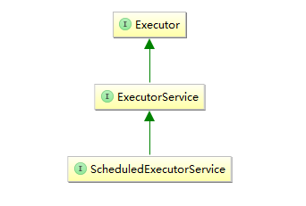

   其中：

   `Executor`是顶级接口，其只定义了一个execute方法，用于接受可以执行的任务。

   `ExecutorService`接口在Executor的基础上添加了一些生命周期方法，例如shutdown。

   `ScheduledExecutorService`则进行了一些功能性的扩展，可以在指定的时间、或者周期性的运行某个任务。

   通常情况下，Executor的实现，都包含了一个线程池(`thread pool`)和一个任务队列(`task queue`)。我们向executors中提交任务(Runnable或者Callable接口的实现类)，Executor会将提交的任务放入任务队列中。然后会从thread pool中选择一个空闲的线程来处理队列中的任务，如果线程池中的所有线程都在处理其他任务，那么等到某个线程率处理完自己的任务空闲下来的时候，再将任务队列中的任务交由其处理。下图展示了线程池的工作原理：

   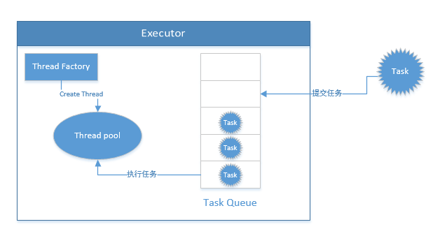

   从上图可以看到，我们提交的任务都会放到Executor内部维护的一个任务队列中，Executor会从thread pool中取出线程，来运行执行任务队列中的任务。而thread pool中的线程对象，是通过一个线程工厂对象来创建的。使用`Thread Factory`的原因是因为，通常一个线程池中的所有Thread对象的作用都是相同的，因此我们可能会希望按照某种相同的规则来创建线程，例如给线程池中的所有线程名字都起一个公共的前缀。

   事实上，JDK自带的executors的实现，都利用到了我们上述提到的概念：线程工厂，线程池以及任务队列， 如：`ThreadPoolExecutor`、`ScheduledThreadPoolExecutor`、`ForkJoinPool`。

   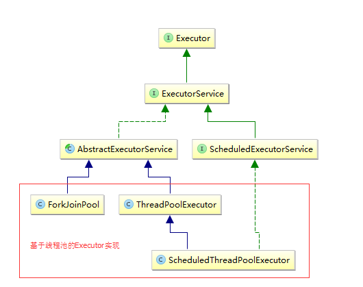


### 5.18、FutureTask原理解析

FutureTask类是为基于`AbstractExecutorService`这个集适配器模式与模板方法模式于一身的公共基础类而设计出来的，`AbstractExecutorService`类将带有Future返回值的`submit(Runnable)`和`submit(Callable)`适配成`execute(Runnable)`统一了任务入口，这样留下模板方法`execute(Runnable)`丢给子类`ThreadPoolExecutor`实现就可以了。

> **JDK1.8修改了FutureTask的实现，JKD1.8不再依赖AQS来实现，而是通过一个volatile变量state以及CAS操作来实现。**

1. **FutureTask实现原理**

   首先FutureTask将构造方法中传入进来的原始任务通过`RunnableAdapter`适配成一个Callable，统一了任务的类型。如果原始任务本身就是Callable类型则无需适配，直接使用，我们在此把统一后的任务称之为`Callable任务`

   我们知道提交一个任务给基于`AbstractExecutorService`基类实现的线程池，会返回一个Future，这个Future的实际类型就是FutureTask。这个FutureTask实现了FutureRunnable接口，既实现了了Future接口有实现了Runnable，这么办的原因是这个FutureTask最终是要丢给模板方法`execute(Runnable)`执行的，所以它必须是个Runnable类型。当调用FutureTask的get()方法时，可以阻塞当前线程，直到任务运行完毕，返回结果。整个调用链条如下所示：

   **workerThread**  ==调用==>   **futureTask.run()**   ==调用==>  **callable任务.call()**  ==调用==>   **原始task.run()**

   *如果提交的是Callable任务，则只有前面三个调用。*

   线程执行任务过程比较简单，即Callable任务被FutureTask代理执行，也即FutureTask的run()方法中调用了Callable任务的call()方法，结合FutureTask的state状态大致有以下四种运行路线：

   1. 任务正常执行并返回（**NEW -> COMPLETING -> NORMAL**）

      即Callable任务正常运行完毕后，会后得到一个结果，把结果存储在FutureTask实例的outcome属性中，同时把状态修改为NORMAL，表明任务已经执行完毕，这时调用futureTask.get()方法的线程结束阻塞并返回结果。

   2. 执行中出现异常（**NEW -> COMPLETING -> EXCEPTIONAL**）

      即Callable任务的call()方法运行过程中抛出异常，作为代理执行的FutureTask抓住了这个异常并把这个异常保存在outcome属性中，同时把状态修改为EXCEPTIONAL，表明任务因为异常而终止执行了，这时调用futureTask.get()方法的线程结束阻塞并抛出ExecutionException包装异常。

   3. 任务执行过程中被中断式取消（**NEW -> INTERRUPTING -> INTERRUPTED**）

      即在FutureTask的run()方法运行期间，调用了futureTask.cancel(true)方法取消FutureTask的执行，其实是调用了线程池提供的runner线程的interrupt()方法发出中断信号，同时吧状态修改为INTERRUPTED，这时调用futureTask.get()方法的线程结束阻塞并抛出InterruptedException异常。

   4. 任务执行过程中被非中断式取消（**NEW -> CANCELLED**）

      即在FutureTask的run()方法运行期间，调用了futureTask.cancel(false)方法取消FutureTask的执行，同时吧状态修改为CANCELLED，这时调用futureTask.get()方法的线程结束阻塞并抛出CancellationException异常。

2. **FutureTask要点解析**

   - **cancel()方法的响应**

     FutureTask的cancel()方法只有在原始Task的run()或call()方法内部加入了**响应中断逻辑的代码**才会真正落实cancel语义。

     *这里的**响应中断逻辑的代码**请参考[3.19、Java中中断线程的方式有哪些?]*

   - 

3. **FutureTask源码解析**

   ```java
   public class FutureTask<V> implements RunnableFuture<V> {
       /*
        * 修订备注：在JDK1.8中重新FutureTask的意图是想避免在执行取消的循环中runner还一直保持中断状态，
        * 所以想在取消的循环中重置runner的中断状态，但是又考虑到如下事实：程序员设计程序时可能使用中断
        * 作为task和caller之间的通信。所以贸然的清除中断标志，可能会给程序设计者带来不便，所以既然不能
        * 保证一定是cancel(true)导致的中断，那么就不清除了，最终将最后一行注释了。所以最终的结果还是让
        * runner保持中断状态。
        */
   
       /**
        * volatile修饰的state
        *
        * 可能的状态转化如下:
        * NEW -> COMPLETING -> NORMAL
        * NEW -> COMPLETING -> EXCEPTIONAL
        * NEW -> CANCELLED
        * NEW -> INTERRUPTING -> INTERRUPTED
        */
       private volatile int state;
       private static final int NEW          = 0;
       private static final int COMPLETING   = 1;
       private static final int NORMAL       = 2;
       private static final int EXCEPTIONAL  = 3;
       private static final int CANCELLED    = 4;
       private static final int INTERRUPTING = 5;
       private static final int INTERRUPTED  = 6;
   
       /** 
        * Callable任务
        * 如果原始任务是Runnable类型，那么会被适配成Callable(RunnableAdapter)并赋值给此callable成员变量
        * 如果原始就是Callable类型任务，那么原封不动赋值给此callable成员变量
        */
       private Callable<V> callable;
       /** 
        * outcome存储一个正常完成的任务结果或者中途发生的异常，并在调用get()时提供其值
        */
       private Object outcome; // 这个outcome完全在runner运行期间产生且仅由runner独写，所以不需要同步
       /**
        * 运行callable任务的线程，由线程池提供，在run()方法中通过CAS维护
        */
       private volatile Thread runner;
       /** 
        * 调用get()方法导致阻塞的等待队列，是一个链表，此处是等待队列的头节点
        */
       private volatile WaitNode waiters;
   
       /**
        * 任务完成时的上报的返回值
        * 任务正常结束，因异常、取消等结束的最终状态都是完成状态
        */
       @SuppressWarnings("unchecked")
       private V report(int s) throws ExecutionException {
           Object x = outcome;
           if (s == NORMAL)
               return (V)x;
           if (s >= CANCELLED)
               throw new CancellationException();
           throw new ExecutionException((Throwable)x);
       }
   
       public FutureTask(Callable<V> callable) {
           if (callable == null)
               throw new NullPointerException();
           this.callable = callable;
           this.state = NEW;       // volatile语义确保了callable的可见性
       }
   
       /**
        * 如果runnable任务正常结束，则将result作为结果返回
        */
       public FutureTask(Runnable runnable, V result) {
           this.callable = Executors.callable(runnable, result);
           this.state = NEW;       // volatile语义确保了callable的可见性
       }
   
       public boolean isCancelled() {
           return state >= CANCELLED;
       }
   
       public boolean isDone() {
           return state != NEW;
       }
   
       /**
        * 取消任务
        * mayInterruptIfRunning为true的话即通过线程中断机制来取消任务
        */
       public boolean cancel(boolean mayInterruptIfRunning) {
           if (!(state == NEW &&
                 UNSAFE.compareAndSwapInt(this, stateOffset, NEW,
                     mayInterruptIfRunning ? INTERRUPTING : CANCELLED)))
               /**
                * 如果任务是NEW初始状态并且CAS修改任务状态为中断/取消失败，则返回false
                * 这意味有其他持有该futureTask实例的线程并发成功的调用了cancel方法
                */
               return false;
           try {    // in case call to interrupt throws exception
               if (mayInterruptIfRunning) {
                   try {
                       Thread t = runner;
                       if (t != null)
                           t.interrupt();
                   } finally { // 迟延、禁止指令重排序的异步更新state为INTERRUPTED
                       UNSAFE.putOrderedInt(this, stateOffset, INTERRUPTED);
                   }
               }
           } finally {
               //唤醒调用get()方法阻塞的线程
               finishCompletion(); // 正常完成、异常、取消等因素导致的任务完成的收尾工作
           }
           return true;
       }
   
       /**
        * 获取任务的执行结果，如果任务仍在运行则阻塞当前线程
        */
       public V get() throws InterruptedException, ExecutionException {
           int s = state;
           if (s <= COMPLETING)
               s = awaitDone(false, 0L); //进入无限等待
           return report(s); //上报任务结果
       }
   
       /**
        * 获取任务的执行结果，如果任务仍在运行则阻塞当前线程
        */
       public V get(long timeout, TimeUnit unit)
           throws InterruptedException, ExecutionException, TimeoutException {
           if (unit == null)
               throw new NullPointerException();
           int s = state;
           if (s <= COMPLETING &&
               (s = awaitDone(true, unit.toNanos(timeout))) <= COMPLETING) //进入有限等待
               throw new TimeoutException();
           return report(s); //上报任务结果
       }
   
       /**
        * 留给子类的一个钩子函数
        */
       protected void done() { }
   
       /**
        * callable任务正常完成时设置任务返回值的
        */
       protected void set(V v) {
           if (UNSAFE.compareAndSwapInt(this, stateOffset, NEW, COMPLETING)) {
               outcome = v;
               UNSAFE.putOrderedInt(this, stateOffset, NORMAL); // final state
               finishCompletion();// 正常完成、异常、取消等因素导致的任务完成的收尾工作
           }
       }
   
       /**
        * callable任务发生异常时设置异常
        */
       protected void setException(Throwable t) {
           if (UNSAFE.compareAndSwapInt(this, stateOffset, NEW, COMPLETING)) {
               outcome = t;
               UNSAFE.putOrderedInt(this, stateOffset, EXCEPTIONAL); // final state
               finishCompletion();// 正常完成、异常、取消等因素导致的任务完成的收尾工作
           }
       }
   
       //FutureTask实现的Runnable的run()方法
       public void run() {
           if (state != NEW ||
               !UNSAFE.compareAndSwapObject(this, runnerOffset,
                                            null, Thread.currentThread()))
               //任务已开始、或者有worker thread正在执行该任务(包括自己重复执行)，则直接返回
               return;
           try {
               Callable<V> c = callable;
               if (c != null && state == NEW) {
                   V result;
                   boolean ran;
                   try {
                       /**
                        * 调用callable任务的call()方法
                        * 如果call正在执行过程中，有线程调用了cancel(true)，则：
                        * 1、如果call方法中程序响应了中断信号，则不会进入catch中，此时set(result)方法被执行
                        *    并修改state为NORMAL；同时另一边调用cancel(true)的线程也会修改state为INTERRUPTED
                        *    两边谁会先写入?最终state为什么状态不得而知!
                        * 2、如果call方法中程序未响应中断信号，则有大概率进入catch中，为什么说大概率?因为如果当前线程
                        *    在call()中正处于WAITING/TIME_WAITING状态时则会抛出异常，如果当前线程在call()正在进行
                        *    高耗时的单纯计算，则此时call()一时半会结束不了，而state在cancel(true)处被修改为
                        *    INTERRUPTED！也就是说：任务逻辑上被取消了(state被改成INTERRUPTED)，但是call()还在执行
                        *    
                        */
                       result = c.call();
                       ran = true;
                   } catch (Throwable ex) { //发生异常
                       result = null;
                       ran = false;
                       setException(ex);
                   }
                   if (ran)
                       set(result);
               }
           } finally {
               // 设置runner为null，阻止结束后再调用run()方法
               runner = null;
               // 重读state，防止中断泄漏
               int s = state;
               if (s >= INTERRUPTING)
                   handlePossibleCancellationInterrupt(s);
           }
       }
   
       /**
        * 专为ScheduledExecutorService线程池准备的，定时重复执行
        */
       protected boolean runAndReset() {
           if (state != NEW ||
               !UNSAFE.compareAndSwapObject(this, runnerOffset,
                                            null, Thread.currentThread()))
               return false;
           boolean ran = false;
           int s = state;
           try {
               Callable<V> c = callable;
               if (c != null && s == NEW) {
                   try {
                       c.call(); // don't set result
                       ran = true;
                   } catch (Throwable ex) {
                       setException(ex);
                   }
               }
           } finally {
               // runner must be non-null until state is settled to
               // prevent concurrent calls to run()
               runner = null;
               // state must be re-read after nulling runner to prevent
               // leaked interrupts
               s = state;
               if (s >= INTERRUPTING)
                   handlePossibleCancellationInterrupt(s);
           }
           return ran && s == NEW;
       }
   
       /**
        * 在任务逻辑上未标记为INTERRUPTED时，保持run()方法还未退出
        */
       private void handlePossibleCancellationInterrupt(int s) {
           // It is possible for our interrupter to stall before getting a
           // chance to interrupt us.  Let's spin-wait patiently.
           if (s == INTERRUPTING)
               while (state == INTERRUPTING)
                   Thread.yield(); // wait out pending interrupt
   
           // assert state == INTERRUPTED;
   
           // We want to clear any interrupt we may have received from
           // cancel(true).  However, it is permissible to use interrupts
           // as an independent mechanism for a task to communicate with
           // its caller, and there is no way to clear only the
           // cancellation interrupt.
           //
           // Thread.interrupted();
       }
   
       /**
        * get()方法导致阻塞的等待队列，是个单链表
        */
       static final class WaitNode {
           volatile Thread thread;
           volatile WaitNode next;
           WaitNode() { thread = Thread.currentThread(); }
       }
   
       /**
        * 唤醒并从等待队列中删除调用get()方法阻塞的线程
        */
       private void finishCompletion() {
           // assert state > COMPLETING;
           for (WaitNode q; (q = waiters) != null;) {
               if (UNSAFE.compareAndSwapObject(this, waitersOffset, q, null)) {
                   for (;;) {
                       Thread t = q.thread;
                       if (t != null) {
                           q.thread = null;
                           LockSupport.unpark(t);
                       }
                       WaitNode next = q.next;
                       if (next == null)
                           break;
                       q.next = null; // unlink to help gc
                       q = next;
                   }
                   break;
               }
           }
   
           done(); //调用完成钩子函数
   
           callable = null;        // to reduce footprint
       }
   
       /**
        * 调用get()方法时，任务未完成则阻塞直到完成为止
        */
       private int awaitDone(boolean timed, long nanos)
           throws InterruptedException {
           final long deadline = timed ? System.nanoTime() + nanos : 0L;
           WaitNode q = null;
           boolean queued = false;
           for (;;) {
               if (Thread.interrupted()) { //当前调用get()阻塞的线程被中断了(爷不等你了)
                   removeWaiter(q); //你不等结果了，清理出门
                   throw new InterruptedException();
               }
   
               int s = state;
               if (s > COMPLETING) { //如果state已是终态，就直接返回不需要取真等
                   if (q != null)
                       q.thread = null;
                   return s;
               }
               else if (s == COMPLETING) // 状态正在pendding中，我小等一下，相当于慢自旋
                   Thread.yield();
               else if (q == null) //来排队还没号，先取个号，且看下一波循环再说
                   q = new WaitNode();
               else if (!queued) //没入队列则CAS尝试入队列
                   queued = UNSAFE.compareAndSwapObject(this, waitersOffset,
                                                        q.next = waiters, q);
               else if (timed) { //如果有超时，则判断超时
                   nanos = deadline - System.nanoTime();
                   if (nanos <= 0L) { //超时时间(nanos)全花在前面代码执行上了
                       removeWaiter(q);
                       return state;
                   }
                   LockSupport.parkNanos(this, nanos);
               }
               else
                   LockSupport.park(this);
           }
       }
   
       /**
        * 从等待队列中移除等待节点
        * (神仙写的代码，有点懵)
        */
       private void removeWaiter(WaitNode node) {
           if (node != null) {
               node.thread = null;
               retry:
               for (;;) {          // restart on removeWaiter race
                   for (WaitNode pred = null, q = waiters, s; q != null; q = s) {
                       s = q.next;
                       if (q.thread != null)
                           pred = q;
                       else if (pred != null) {
                           pred.next = s;
                           if (pred.thread == null) // check for race
                               continue retry;
                       }
                       else if (!UNSAFE.compareAndSwapObject(this, waitersOffset,
                                                             q, s))
                           continue retry;
                   }
                   break;
               }
           }
       }
   
       // Unsafe mechanics
       private static final sun.misc.Unsafe UNSAFE;
       private static final long stateOffset;
       private static final long runnerOffset;
       private static final long waitersOffset;
       static {
           try {
               UNSAFE = sun.misc.Unsafe.getUnsafe();
               Class<?> k = FutureTask.class;
               stateOffset = UNSAFE.objectFieldOffset
                   (k.getDeclaredField("state"));
               runnerOffset = UNSAFE.objectFieldOffset
                   (k.getDeclaredField("runner"));
               waitersOffset = UNSAFE.objectFieldOffset
                   (k.getDeclaredField("waiters"));
           } catch (Exception e) {
               throw new Error(e);
           }
       }
   
   }
   ```


### 5.19、ThreadPoolExecutor原理解析

`ThreadPoolExecutor`是JUC线程池的默认实现，且是直接继承自`AbstractExecutorService`实现的

1. **ThreadPoolExecutor实现原理**

   `ThreadPoolExecutor`线程池通过一个AtomicInteger类型的ctl成员变量控制着整个线程池的当前线程数量和当前线程池的运行状态。即将ctl的高3位用于表示线程池的运行状态(共计5个状态），低29位用于表示线程池的线程数量。其中高3位用于表征线程池运行状态的分别是：

   - **RUNNING**

     **状态说明：**运行状态，高3位为111即-536870912(-1)（-1 << 29）。

     **状态切换：**线程池的初始化状态是RUNNING。换句话说，线程池被一旦被创建，就处于RUNNING状态，并且线程池中的任务数为0。

   - **SHUTDOWN**：

     **状态说明：**关闭状态，高3位为000即0(0)（0 << 29），在此状态下，线程池不再接受新任务，但是仍然处理阻塞队列中的任务。

     **状态切换：**调用线程池的shutdown()接口时，线程池由RUNNING -> SHUTDOWN。

   - **STOP**

     **状态说明：**停止状态，高3位为001即536870912(1)（1 << 29），在此状态下，线程池不再接受新任务，也不会处理阻塞队列中的任务，正在运行的任务也会停止。

     **状态切换：**调用线程池的shutdownNow()接口时，线程池由(RUNNING or SHUTDOWN ) -> STOP。

   - **TIDYING**

     **状态说明：**高3位为010即1073741824(2)（2 << 29），当所有的任务已终止，ctl记录的”任务数量”为0，线程池会变为TIDYING状态。当线程池变为TIDYING状态时，会执行钩子函数terminated()。terminated()在ThreadPoolExecutor类中是空的，若用户想在线程池变为TIDYING时，进行相应的处理；可以通过重载terminated()函数来实现。

     **状态切换：**当线程池在SHUTDOWN状态下，阻塞队列为空并且线程池中执行的任务也为空时，就会由 SHUTDOWN -> TIDYING。当线程池在STOP状态下，线程池中执行的任务为空时，就会由STOP -> TIDYING。

   - **TERMINATED**

     **状态说明：**终止状态，高3位为011即1610612736(3)（3 << 29），线程池彻底终止，就变成TERMINATED状态。

     **状态切换：**线程池处在TIDYING状态时，执行完terminated()之后，就会由 TIDYING -> TERMINATED。

   

   由于仅**RUNNING**状态代表线程池处于正常状态，将它的状态值设计为唯一的一个负数，在后面判断状态将会省时省力大有裨益。

   `ThreadPoolExecutor`线程池仅仅实现了父类`AbstractExecutorService`的`execute(Runnable)`方法，该方法大致逻辑概括起来有以下三种情况：

   1. 活动线程数小于corePoolSize时，通过创建新的Worker线程来执行新加入的任务。
   2. 活动线程数大于等于corePoolSize时，都是将新加的任务放到任务队列中去。
   3. 如果连任务队列都满了，那么会继续创建新的Worker线程去执行，如果线程数达到最大值maximumPoolSize就拒绝任务。

2. **ThreadPoolExecutor要点解析**

   - **ThreadPoolExecutor构造方法解析**

     ```java
     public ThreadPoolExecutor(int corePoolSize, 
                               int maximumPoolSize, 
                               long keepAliveTime, 
                               TimeUnit unit, 
                               BlockingQueue<Runnable> workQueue, 
                               RejectedExecutionHandler handler) {    
       this(corePoolSize, maximumPoolSize, keepAliveTime, unit, workQueue, Executors.defaultThreadFactory(), handler);}
     ```
     - **corePoolSize**：线程池中保活的核心线程数，可以为0，如果设置allowCoreThreadTimeOut=true，则此参数失效

     - **maximumPoolSize**：线程池中最大线程数，必须大于0

     - **keepAliveTime**：非核心线程空闲时的存活时间，如果allowCoreThreadTimeOut=false，则会最多保留corePoolSize个空闲线程；如果allowCoreThreadTimeOut=true，则不保留任何空闲线程

     - **unit**：keepAliveTime的时间单位

     - **workQueue**：存储任务的队列，JDK提供以下几种工作队列

       `ArrayBlockingQueue`：基于数组的有界阻塞队列，任务以FIFO顺序排序；

       `LinkedBlockingQueue`：基于链表的阻塞队列，任务以FIFO顺序排列，吞吐量优于ArrayBlockingQueue，在使用时需要注意，此阻塞队列在不设置大小的时候，默认的长度是`Integer.MAX_VALUE`；

       `PriorityBlockingQueue`：类似于LinkedBlockQueue，但其所含任务的排序不是FIFO，而是依据任务的自然排序顺序或者是构造函数的Comparator决定的顺序；

       `SynchronousQueue`：特殊的BlockingQueue，对其的操作必须是放和取交替完成的，典型的生产者-消费者模型，它不存储元素，每一次的插入必须要等另一个线程的移除操作完成。

     - **handler**：任务队列已经满了，并且worker线程数已经达到最大值时的饱和拒绝策略，默认取消并抛出RejectedExecutionException，ThreadPoolExecutor线程池提供了4中策略：

       `AbortPolicy`：拒绝提交，直接抛出异常，也是默认的饱和策略；

       `CallerRunsPolicy`：线程池还未关闭时，用调用者的线程执行任务；

       `DiscardPolicy`：丢掉提交任务；

       `DiscardOldestPolicy`：线程池还未关闭时，丢掉阻塞队列最久为处理的任务，并且执行当前任务。

   - **线程池的worker线程被回收的机制**

     ThreadPoolExecutor线程池的worker线程在适当的时候会被回收销毁，主要在以下两种情况下会被回收：

     - 在runWorker(worker)方法的while循环中，如果task.run()方法抛出异常，退出了while循环，则当前worker线程会被回收销毁。
     - 在runWorker(worker)方法的while循环中，如果while的循环推进条件getTask()方法返回null，退出了while循环，则当前worker线程会被回收销毁。其中getTask()方法会调用任务队列的`poll(keepAliveTime)`或`take()`阻塞方法获取一个新任务，返回null意味着任务队列为空，也就是说当前worker线程可以被回收销毁了。

3. **ThreadPoolExecutor源码解析**

   ```java
   public class ThreadPoolExecutor extends AbstractExecutorService {
       
       /**
        * ctl是整个类的核心，高3位存储着线程池的状态，低29位存储着整个线程池的worker线程数
        * 
        */
       private final AtomicInteger ctl = new AtomicInteger(ctlOf(RUNNING, 0));
       private static final int COUNT_BITS = Integer.SIZE - 3; //存储整个线程池的worker线程数所用的bit位数(低29位)
       private static final int CAPACITY   = (1 << COUNT_BITS) - 1; //最大worker线程数
   
       //RUNNING：运行状态，ctl的高3位为111，即-536870912(-1)（-1 << 29）
       private static final int RUNNING    = -1 << COUNT_BITS;
       //SHUTDOWN：关闭状态，高3位为000即0(0)（0 << 29），在此状态下，线程池不再接受新任务，但是仍然处理阻塞队列中的任务
       private static final int SHUTDOWN   =  0 << COUNT_BITS;
       /**
        * STOP：停止状态，高3位为001即536870912(1)（1 << 29），在此状态下，线程池不再接受新任务，
        * 也不会处理阻塞队列中的任务，正在运行的任务也会停止
        */
       private static final int STOP       =  1 << COUNT_BITS;
       /**
        * TIDYING：高3位为010即1073741824(2)（2 << 29），当所有的任务已终止，ctl记录的”任务数量”为0，
        * 线程池会变为TIDYING状态。当线程池变为TIDYING状态时，会执行钩子函数terminated()。terminated()在
        * ThreadPoolExecutor类中是空的，若用户想在线程池变为TIDYING时，进行相应的处理；
        * 可以通过重载terminated()函数来实现。
        */
       private static final int TIDYING    =  2 << COUNT_BITS;
       //TERMINATED：终止状态，高3位为011即1610612736(3)（3 << 29），线程池彻底终止，就变成TERMINATED状态
       private static final int TERMINATED =  3 << COUNT_BITS;
   
       //从ctl中提取运行状态值，即将ctl的低29位全部置为0
       private static int runStateOf(int c)     { return c & ~CAPACITY; }
       //从ctl中提取worker线程数，即将高3位全部置为0
       private static int workerCountOf(int c)  { return c & CAPACITY; }
       //将运行状态值与worker线程数合起来，即是ctl本身
       private static int ctlOf(int rs, int wc) { return rs | wc; }
   
       private static boolean runStateLessThan(int c, int s) {
           return c < s;
       }
   
       private static boolean runStateAtLeast(int c, int s) {
           return c >= s;
       }
   
       private static boolean isRunning(int c) {
           return c < SHUTDOWN;
       }
   
       //尝试一次CAS操作：递增一个worker线程数
       private boolean compareAndIncrementWorkerCount(int expect) {
           return ctl.compareAndSet(expect, expect + 1);
       }
   
       //尝试一次CAS操作：递减一个worker线程数
       private boolean compareAndDecrementWorkerCount(int expect) {
           return ctl.compareAndSet(expect, expect - 1);
       }
   
       //保证递减一个worker线程数
       private void decrementWorkerCount() {
           do {} while (! compareAndDecrementWorkerCount(ctl.get()));
       }
   
       //任务队列
       private final BlockingQueue<Runnable> workQueue;
   
       //同步锁
       private final ReentrantLock mainLock = new ReentrantLock();
   
       //存放worker线程的容器
       private final HashSet<Worker> workers = new HashSet<Worker>();
   
       //等待条件，以支持等待终止
       private final Condition termination = mainLock.newCondition();
   
       //追踪最大worker线程数，只能在持有mainLock锁的情况下递增
       private int largestPoolSize;
   
       //已完成的任务数量(包括各种状态的)，只在终结一个worker线程时累加统计一下
       //只能在持有mainLock锁的情况下递增
       private long completedTaskCount;
   
       //线程工厂
       private volatile ThreadFactory threadFactory;
   
       //拒绝执行任务的策略
       private volatile RejectedExecutionHandler handler;
   
       /**
        * worker线程空闲时间，如果worker线程数大于corePoolSize，当线程的空闲时间达到keepAliveTime值时，会将其销毁
        * 默认情况下会将最大空闲线程数保持在corePoolSize个，但是如果allowCoreThreadTimeOut=true的话，
        * 则会一个不留地销毁所有空闲线程
        */
       private volatile long keepAliveTime;
   
       /**
        * 默认为false，true则代表会一个不留地销毁所有空闲线程
        */
       private volatile boolean allowCoreThreadTimeOut;
   
       /**
        * 保活的核心线程数，仅在allowCoreThreadTimeOut=false时有效
        */
       private volatile int corePoolSize;
   
       /**
        * 最大worker线程数，最大不超过CAPACITY.
        */
       private volatile int maximumPoolSize;
   
       /**
        * 默认的拒绝策略：取消并抛出RejectedExecutionException
        */
       private static final RejectedExecutionHandler defaultHandler =
           new AbortPolicy();
   
       private static final RuntimePermission shutdownPerm = new RuntimePermission("modifyThread");
   
       private final AccessControlContext acc;
   
       /**
        * 执行任务(FutureTask)的worker线程
        */
       private final class Worker
           extends AbstractQueuedSynchronizer
           implements Runnable
       {
           private static final long serialVersionUID = 6138294804551838833L;
   
           //真正执行worker的Thread实例，由ThreadFactory创建
           final Thread thread;
           //创建Worker时携带的第一个要执行的任务
           Runnable firstTask;
           //该worker线程生命周期内完成的任务数
           volatile long completedTasks;
   
           Worker(Runnable firstTask) {
               setState(-1); // 在运行runWorker之前禁止中断
               this.firstTask = firstTask;
               this.thread = getThreadFactory().newThread(this);
           }
   
           /**
            * 代理运行runWorker()方法，在runWorker()方法中通过不断的去队列中getTask()来运行以维持该worker线程的生命
            * 如果getTask()获取不到任务了，那么该worker线程将被结束生命。
            */
           public void run() {
               runWorker(this);
           }
   
           //是否是独占模式，0-代表锁可用，1-代表锁不可用
           protected boolean isHeldExclusively() {
               return getState() != 0;
           }
   
           //获取独占锁
           protected boolean tryAcquire(int unused) {
               if (compareAndSetState(0, 1)) {
                   setExclusiveOwnerThread(Thread.currentThread());
                   return true;
               }
               return false;
           }
   
           //释放独占锁，由于锁还在本线程手里，下面代码无需考虑原子问题
           protected boolean tryRelease(int unused) {
               setExclusiveOwnerThread(null);
               setState(0);
               return true;
           }
   
           public void lock()        { acquire(1); }
           public boolean tryLock()  { return tryAcquire(1); }
           public void unlock()      { release(1); }
           public boolean isLocked() { return isHeldExclusively(); }
   
           //中断该worker线程
           void interruptIfStarted() {
               Thread t;
               if (getState() >= 0 && (t = thread) != null && !t.isInterrupted()) {
                   try {
                       t.interrupt();
                   } catch (SecurityException ignore) {
                   }
               }
           }
       }
   
       /*
        * Methods for setting control state
        */
   
       /**
        * 确保线程池的状态为targetState或者至少为targetState
        *
        * 即线程池的状态在未进一步转变成期望的targetState之前，尝试修改其为期望的targetState
        * 不管是当前线程修改的还是其他线程修改的，只要期望的targetState被设置过就行。
        */
       private void advanceRunState(int targetState) {
           for (;;) {
               int c = ctl.get();
               if (runStateAtLeast(c, targetState) ||
                   ctl.compareAndSet(c, ctlOf(targetState, workerCountOf(c))))
                   break;
           }
       }
   
       /**
        * 尝试终止该线程池，这个终止动作包含两步：先将线程池状态修改为TIDYING，再修改为TERMINATED
        */
       final void tryTerminate() {
           for (;;) {
               int c = ctl.get();
               if (isRunning(c) || //线程池正在RUNNING状态，肯定是不能终止的
                   runStateAtLeast(c, TIDYING) || //已经进入了终止流程了，无需重复终止
                   //调用了shutdown()方法，但是任务队列中还有任务未运行，是不能终止的
                   (runStateOf(c) == SHUTDOWN && ! workQueue.isEmpty())) 
                   return;
               //走到这里说明线程池的状态为SHUTDOWN，且任务队列是空的
               if (workerCountOf(c) != 0) { // 当前worker线程数大于0
                   interruptIdleWorkers(ONLY_ONE); //尝试中断一个空闲线程
                   return;
               }
   
               final ReentrantLock mainLock = this.mainLock;
               mainLock.lock();
               try {
                   if (ctl.compareAndSet(c, ctlOf(TIDYING, 0))) { //先尝试将线程池状态改为TIDYING
                       try {
                           terminated(); //执行一个留给子类扩展的钩子函数
                       } finally {
                           ctl.set(ctlOf(TERMINATED, 0)); //最终将线程池状态改为TERMINATED
                           termination.signalAll(); //唤醒调用threadPoolExecutor.awaitTermination()方法的线程
                       }
                       return;
                   }
               } finally {
                   mainLock.unlock();
               }
               // else retry on failed CAS
           }
       }
   
       /**
        * 如果有安全管理，确保调用者有权限调用shutdown()方法
        */
       private void checkShutdownAccess() {
           SecurityManager security = System.getSecurityManager();
           if (security != null) {
               security.checkPermission(shutdownPerm);
               final ReentrantLock mainLock = this.mainLock;
               mainLock.lock();
               try {
                   for (Worker w : workers)
                       security.checkAccess(w.thread);
               } finally {
                   mainLock.unlock();
               }
           }
       }
   
       /**
        * 中断所有worker线程，在shutdownNow()时调用此方法
        */
       private void interruptWorkers() {
           final ReentrantLock mainLock = this.mainLock;
           mainLock.lock();
           try {
               for (Worker w : workers)
                   w.interruptIfStarted();
           } finally {
               mainLock.unlock();
           }
       }
   
       /**
        * 中断空闲worker线程，注意该方法仅仅是中断空闲的线程
        * interruptIdleWorkers(true)仅在tryTerminate()方法中被调用一次
        * interruptIdleWorkers(false)仅在下面的interruptIdleWorkers()中被调用一次，
        * 而interruptIdleWorkers()又被在shutdown()、setCorePoolSize()、allowCoreThreadTimeOut()、
        * setMaximumPoolSize()、setKeepAliveTime()时调用一次
        */
       private void interruptIdleWorkers(boolean onlyOne) {
           final ReentrantLock mainLock = this.mainLock;
           mainLock.lock();
           try {
               for (Worker w : workers) {
                   Thread t = w.thread;
                   if (!t.isInterrupted() && w.tryLock()) { //tryLock()返回true则确保了w是空闲线程
                       try {
                           t.interrupt();
                       } catch (SecurityException ignore) {
                       } finally {
                           w.unlock();
                       }
                   }
                   if (onlyOne)
                       break;
               }
           } finally {
               mainLock.unlock();
           }
       }
   
       /**
        * 中断空闲worker线程，注意该方法仅仅是中断空闲的线程
        * 该方法在shutdown()、setCorePoolSize()、allowCoreThreadTimeOut()、
        * setMaximumPoolSize()、setKeepAliveTime()被调用一次
        */
       private void interruptIdleWorkers() {
           interruptIdleWorkers(false);
       }
   
       private static final boolean ONLY_ONE = true;
   
       /**
        * 拒绝任务，该方法仅在execute(Runnable)中被调用两次
        */
       final void reject(Runnable command) {
           handler.rejectedExecution(command, this);
       }
   
       /**
        * shutdown()方法的后置通知钩子函数
        */
       void onShutdown() {
       }
   
       /**
        * State check needed by ScheduledThreadPoolExecutor to
        * enable running tasks during shutdown.
        *
        * @param shutdownOK true if should return true if SHUTDOWN
        */
       final boolean isRunningOrShutdown(boolean shutdownOK) {
           int rs = runStateOf(ctl.get());
           return rs == RUNNING || (rs == SHUTDOWN && shutdownOK);
       }
   
       /**
        * 排干任务队列到指定List中并返回
        * 考虑到一些特殊的队列，例如DelayQueue等，其drainTo()方法可能执行失败
        * 所以得手动删除其中的元素
        */
       private List<Runnable> drainQueue() {
           BlockingQueue<Runnable> q = workQueue;
           ArrayList<Runnable> taskList = new ArrayList<Runnable>();
           q.drainTo(taskList);
           if (!q.isEmpty()) {
               for (Runnable r : q.toArray(new Runnable[0])) {
                   if (q.remove(r))
                       taskList.add(r);
               }
           }
           return taskList;
       }
   
       /**
        * 尝试添加一个worker线程到workers中去，如果成功则返回true
        * 调用该方法的地方很多，根据firstTask是否为null大致分为两类：
        * 第一类firstTask不为null，多在execute(Runnable)方法中即时执行任务
        * 第二类firstTask为null，多在保活corePoolSize个活动线程的逻辑中存在
        *
        * @param core - true代表要再次校验下当前rs状态与corePoolSize
        *               false代表要再次校验下当前rs状态与maximumPoolSize
        */
       private boolean addWorker(Runnable firstTask, boolean core) {
           //双重自旋重试，抢添加worker线程的资格
           retry:
           for (;;) {
               int c = ctl.get();
               int rs = runStateOf(c);
   
               /**
                * 此句可以改写成：
                * if (rs >= SHUTDOWN && (rs != SHUTDOWN || firstTask != null || workQueue.isEmpty()))
                * 即在线程池的当前状态rs至少是SHUTDOWN的前提下：
                * 1、rs已经进一步转变成STOP、TIDYING、TERMINATED之一，那么也没必要在增加worker线程了
                * 2、不满足1，则rs仍然是SHUTDOWN状态，此时firstTask不为null说明是"在路上"的新任务，
                *    按照约定shutdown()之后就不接受新任务了
                * 3、不满足1和2，则rs仍然是SHUTDOWN状态，workQueue都空了，也就没调用的必要了
                */
               if (rs >= SHUTDOWN && !(rs == SHUTDOWN && firstTask == null && !workQueue.isEmpty()))
                   return false;
   
               for (;;) {
                   int wc = workerCountOf(c);
                   if (wc >= CAPACITY || //当前worker线程数量溢出了
                       //当前worker线程数大于等于(核心线程数或者最大线程数)的话就返回失败
                       wc >= (core ? corePoolSize : maximumPoolSize))
                       return false;
                   if (compareAndIncrementWorkerCount(c)) //所有前置条件都满足了，尝试一次递增当前worker线程数
                       //如果尝试成功，则跳出双重自旋
                       break retry;
                   c = ctl.get();  // 重新检测状态
                   if (runStateOf(c) != rs) //线程池状态发生改变，跳出内循环并进行下一轮外循环
                       continue retry;
                   // 走到这里说明线程池状态rs没改变，但是worker线程数wc改变了，进行下一轮内循环
               }
           }
   
           //上面抢添加worker线程的资格已经成功了，接下来就要真正执行向workers中添加新的Worker了
           boolean workerStarted = false;
           boolean workerAdded = false;
           Worker w = null;
           try {
               w = new Worker(firstTask); //此处可能在ThreadFactory创建线程时出现异常
               final Thread t = w.thread;
               if (t != null) { //防止ThreadFactory.newThread返回null
                   final ReentrantLock mainLock = this.mainLock;
                   mainLock.lock();
                   try {
                       // Recheck while holding lock.
                       // Back out on ThreadFactory failure or if
                       // shut down before lock acquired.
                       int rs = runStateOf(ctl.get());
   					//如果rs为RUNNING 或者 某个地方调用了addWorker(null,true/false)，在SHUTDOWN状态下可以拒绝
                       //firstTask不为null的新任务，但不能拒绝firstTask为null的，因为后者是组件内特殊的保障性措施
                       if (rs < SHUTDOWN || (rs == SHUTDOWN && firstTask == null)) {
                           if (t.isAlive()) //新建worker线程的状态必须是NEW状态，即没调用过start()方法
                               throw new IllegalThreadStateException();
                           workers.add(w);
                           int s = workers.size();
                           //记录largestPoolSize，可以借此看看是否存在wc > maximumPoolSize这种极端情况
                           if (s > largestPoolSize)
                               largestPoolSize = s;
                           workerAdded = true;
                       }
                   } finally {
                       mainLock.unlock();
                   }
                   if (workerAdded) { //添加成功后再启动
                       t.start();
                       workerStarted = true; //启动成功了，则添加肯定也是成功的
                   }
               }
           } finally {
               if (! workerStarted) //启动失败了，workerAdded未必是true，有可能是发送异常直接到达此处
                   addWorkerFailed(w); //尝试删除新添加的w，如果w不为null的话
           }
           return workerStarted;
       }
   
       /**
        * 回滚已创建的Worker线程
        * - 从workers中删除新建的worker线程，如果存在的话
        * - 递减一个worker线程数
        * - 尝试做一次终结
        */
       private void addWorkerFailed(Worker w) {
           final ReentrantLock mainLock = this.mainLock;
           mainLock.lock();
           try {
               if (w != null)
                   workers.remove(w);
               decrementWorkerCount();
               tryTerminate();
           } finally {
               mainLock.unlock();
           }
       }
   
       /**
        * 指定的worker线程即将结束他的run()方法(正常死亡)，这里是对指定worker线程做一些清理工作
        *
        * @param w the worker
        * @param completedAbruptly true-如果worker线程是由于突发异常而死亡的，
        *                          false-是由于getTask()返回null即任务队列为空取不到任务运行而退役的
        */
       private void processWorkerExit(Worker w, boolean completedAbruptly) {
           if (completedAbruptly) // 如果是突发异常而死亡的则立马递减一次wc，否则已经在getTask()中做了一次递减了
               decrementWorkerCount();
   
           final ReentrantLock mainLock = this.mainLock;
           mainLock.lock();
           try {
               completedTaskCount += w.completedTasks; //临死前将该worker线程的所有完成任务数上报给线程池
               workers.remove(w);
           } finally {
               mainLock.unlock();
           }
   
           tryTerminate(); //尝试执行一次终结
   
           //以下逻辑是保证线程池中有必要数量的保活线程存在
           int c = ctl.get();
           //如果线程池的当前状态是RUNNING或者是SHUTDOWN，在这两种状态下是有必要保证足够的worker线程来保证任务的执行的
           if (runStateLessThan(c, STOP)) {
               if (!completedAbruptly) { //并且是getTask()为null即任务队列为空
                   int min = allowCoreThreadTimeOut ? 0 : corePoolSize;
                   //此时队列又不为空了，则线程池中至少保证存在一个worker线程
                   if (min == 0 && ! workQueue.isEmpty()) 
                       min = 1;
                   if (workerCountOf(c) >= min)
                       return; //线程池中当前worker线程数大于min则啥也不做，直接返回
               }
               addWorker(null, false); //添加一个空闲worker线程，以保持
           }
       }
   
       /**
        * Performs blocking or timed wait for a task, depending on
        * current configuration settings, or returns null if this worker
        * must exit because of any of:
        * 1. There are more than maximumPoolSize workers (due to
        *    a call to setMaximumPoolSize).
        * 2. The pool is stopped.
        * 3. The pool is shutdown and the queue is empty.
        * 4. This worker timed out waiting for a task, and timed-out
        *    workers are subject to termination (that is,
        *    {@code allowCoreThreadTimeOut || workerCount > corePoolSize})
        *    both before and after the timed wait, and if the queue is
        *    non-empty, this worker is not the last thread in the pool.
        *
        * @return task, 如果返回null，则说明没有任务可供执行，即供大于求，则当前worker线程必须销毁并将worker线程数量减1
        *               至于后续销毁操作将在processWorkerExit()方法中执行
        */
       private Runnable getTask() {
           boolean timedOut = false; // 最近一次调用队列超时模式的poll()方法仍然获取不到任务?
   
           for (;;) {
               int c = ctl.get();
               int rs = runStateOf(c);
   
               /**
                * 首先要明确：rs的状态至少是SHUTDOWN的话，那么不可能有新的任务被加入到任务队列中
                *
                * 1、rs为STOP则说明调用了shutdownNow()方法，该方法语义是不论任务队列中是否还有任务，
                *    都一概不予执行，所以返回null
                * 2、如果rs是SHUTDOWN状态，并且任务队列为空，则肯定返回null，因为此时不可能有新的任务被添加进来了
                */
               if (rs >= SHUTDOWN && (rs >= STOP || workQueue.isEmpty())) {
                   decrementWorkerCount();
                   return null;
               }
   
               int wc = workerCountOf(c);
   
               // 调用队列超时模式的poll()方法获取元素?
               boolean timed = allowCoreThreadTimeOut || wc > corePoolSize;
   			//如果(当前worker线程数比maximumPoolSize还大 or 最近一次调用队列超时模式的poll()方法仍然获取不到任务)
               //并且(当前worker线程数至少为2个 or 任务队列recheck仍然为空)
               //则说明当前worker线程是存在多余，需要被销毁，所以尝试一次compareAndDecrementWorkerCount(c)
               //尝试成功则返回null
               if ((wc > maximumPoolSize || (timed && timedOut))
                   && (wc > 1 || workQueue.isEmpty())) {
                   if (compareAndDecrementWorkerCount(c))
                       return null;
                   continue;
               }
   
               try {
                   Runnable r = timed ?
                       //超时版poll获取
                       workQueue.poll(keepAliveTime, TimeUnit.NANOSECONDS) :
                       //一直阻塞获取，如果take()方法返回则必定能取到非null的元素
                       workQueue.take();
                   if (r != null)
                       return r;
                   timedOut = true; //r为null，只可能在发生在超时版本的poll情况下
               } catch (InterruptedException retry) {
                   timedOut = false; //等待期间被中断，你不能算我未获取到元素，让我重来一次
               }
           }
       }
   
       /**
        * addWorker()方法new出了Worker线程并start()启动，
        * worker线程启动后运行的run()方法调用的就是runWorker(this)方法
        */
       final void runWorker(Worker w) {
           Thread wt = Thread.currentThread();
           Runnable task = w.firstTask; //这个task是FutureTask
           w.firstTask = null;
           //Worker的构造函数中抑制了线程中断setState(-1)，所以这里需要unlock从而允许中断
           w.unlock();
           //销毁当前worker线程的原因：true-因为异常而销毁，false-因为getTask()返回null(即任务队列为空)而销毁
           boolean completedAbruptly = true;
           try {
               //一旦退出while循环就意味当前worker线程需要销毁了
               while (task != null || (task = getTask()) != null) {
                   w.lock();
                   // If pool is stopping, ensure thread is interrupted;
                   // if not, ensure thread is not interrupted.  This
                   // requires a recheck in second case to deal with
                   // shutdownNow race while clearing interrupt
                   if ((runStateAtLeast(ctl.get(), STOP) ||
                        (Thread.interrupted() && runStateAtLeast(ctl.get(), STOP))) &&
                       !wt.isInterrupted())
                       wt.interrupt();
                   try {
                       beforeExecute(wt, task); //任务执行前的钩子函数，留给子类扩展
                       Throwable thrown = null;
                       try {
                           task.run();
                       } catch (RuntimeException x) {
                           thrown = x; throw x;
                       } catch (Error x) {
                           thrown = x; throw x;
                       } catch (Throwable x) {
                           thrown = x; throw new Error(x);
                       } finally {
                           afterExecute(task, thrown); //任务执行后的钩子函数，留给子类扩展
                       }
                   } finally {
                       task = null;
                       w.completedTasks++;
                       w.unlock();
                   }
               }
               completedAbruptly = false;
           } finally {
               processWorkerExit(w, completedAbruptly); //最后销毁当前worker线程
           }
       }
   
       public ThreadPoolExecutor(int corePoolSize,
                                 int maximumPoolSize,
                                 long keepAliveTime,
                                 TimeUnit unit,
                                 BlockingQueue<Runnable> workQueue,
                                 ThreadFactory threadFactory) {
           this(corePoolSize, maximumPoolSize, keepAliveTime, unit, workQueue,
                threadFactory, defaultHandler);
       }
   
       public ThreadPoolExecutor(int corePoolSize,
                                 int maximumPoolSize,
                                 long keepAliveTime,
                                 TimeUnit unit,
                                 BlockingQueue<Runnable> workQueue,
                                 RejectedExecutionHandler handler) {
           this(corePoolSize, maximumPoolSize, keepAliveTime, unit, workQueue,
                Executors.defaultThreadFactory(), handler);
       }
   
       /**
        * 创建线程池
        * corePoolSize - 线程池中保活的核心线程数，可以为0，如果设置allowCoreThreadTimeOut=true，则此参数失效
        * maximumPoolSize - 线程池中最大线程数，必须大于0
        * keepAliveTime - 当有worker线程空闲时，空闲时间超过这个值就会被销毁。如果allowCoreThreadTimeOut=false，
        *                 则会最多保留corePoolSize个空闲线程；如果allowCoreThreadTimeOut=true，则不保留任何空闲线程
        * unit - keepAliveTime的超时时间单位
        * workQueue - 存储任务的队列
        * handler - 任务超出处理能力的拒绝策略，默认取消并抛出RejectedExecutionException
        */
       public ThreadPoolExecutor(int corePoolSize,
                                 int maximumPoolSize,
                                 long keepAliveTime,
                                 TimeUnit unit,
                                 BlockingQueue<Runnable> workQueue,
                                 ThreadFactory threadFactory,
                                 RejectedExecutionHandler handler) {
           if (corePoolSize < 0 ||
               maximumPoolSize <= 0 ||
               maximumPoolSize < corePoolSize ||
               keepAliveTime < 0)
               throw new IllegalArgumentException();
           if (workQueue == null || threadFactory == null || handler == null)
               throw new NullPointerException();
           this.acc = System.getSecurityManager() == null ?
                   null :
                   AccessController.getContext();
           this.corePoolSize = corePoolSize;
           this.maximumPoolSize = maximumPoolSize;
           this.workQueue = workQueue;
           this.keepAliveTime = unit.toNanos(keepAliveTime);
           this.threadFactory = threadFactory;
           this.handler = handler;
       }
   
       /**
        * 重写AbstractExecutorService#execute(Runnable)
        */
       public void execute(Runnable command) {
           if (command == null)
               throw new NullPointerException();
           /*
            * 该方法大致逻辑概括起来有以下三种情况：
            *
            * 1. 活动线程数小于corePoolSize时，通过创建新的Worker线程来执行新加入的任务。
            * 2. 活动线程数大于等于corePoolSize时，都是将新加的任务放到任务队列中去。
            * 3. 如果连任务队列都满了，那么会继续创建新的Worker线程去执行，如果线程数达到最大值maximumPoolSize就拒绝任务。
            */
           int c = ctl.get();
           if (workerCountOf(c) < corePoolSize) {
               if (addWorker(command, true))
                   return;
               c = ctl.get();
           }
           if (isRunning(c) && workQueue.offer(command)) {
               int recheck = ctl.get();
               if (! isRunning(recheck) && remove(command))
                   reject(command);
               else if (workerCountOf(recheck) == 0)
                   addWorker(null, false);
           }
           else if (!addWorker(command, false)) //队列满了，再尝试创建新的线程来执行，如果再不行就拒绝
               reject(command);
       }
   
       /**
        * 将线程池状态改为SHUTDOWN，任务队列拒绝接受新任务，把已存在的任务执行完毕即终结
        */
       public void shutdown() {
           final ReentrantLock mainLock = this.mainLock;
           mainLock.lock();
           try {
               checkShutdownAccess();
               advanceRunState(SHUTDOWN);
               interruptIdleWorkers();
               onShutdown(); // hook for ScheduledThreadPoolExecutor
           } finally {
               mainLock.unlock();
           }
           tryTerminate();
       }
   
       /**
        * 将线程池状态改为STOP，尝试停止所有正在执行的任务，任务队列拒绝接受新任务，并返回任务队列中还未执行的任务
        */
       public List<Runnable> shutdownNow() {
           List<Runnable> tasks;
           final ReentrantLock mainLock = this.mainLock;
           mainLock.lock();
           try {
               checkShutdownAccess();
               advanceRunState(STOP);
               interruptWorkers();
               tasks = drainQueue();
           } finally {
               mainLock.unlock();
           }
           tryTerminate();
           return tasks;
       }
   
       //不是RUNNING状态便算shutdown了
       public boolean isShutdown() {
           return ! isRunning(ctl.get());
       }
   
       //指正在终结的几个状态：SHUTDOWN、STOP、TIDYING
       public boolean isTerminating() {
           int c = ctl.get();
           return ! isRunning(c) && runStateLessThan(c, TERMINATED);
       }
   
       //任务状态是否已终结(TERMINATED)
       public boolean isTerminated() {
           return runStateAtLeast(ctl.get(), TERMINATED);
       }
   
       //超时等待终结
       public boolean awaitTermination(long timeout, TimeUnit unit)
           throws InterruptedException {
           long nanos = unit.toNanos(timeout);
           final ReentrantLock mainLock = this.mainLock;
           mainLock.lock();
           try {
               for (;;) {
                   if (runStateAtLeast(ctl.get(), TERMINATED))
                       return true;
                   if (nanos <= 0)
                       return false;
                   nanos = termination.awaitNanos(nanos);
               }
           } finally {
               mainLock.unlock();
           }
       }
   
       /**
        * 垃圾回收前调用shutdown()方法
        */
       protected void finalize() {
           SecurityManager sm = System.getSecurityManager();
           if (sm == null || acc == null) {
               shutdown();
           } else {
               PrivilegedAction<Void> pa = () -> { shutdown(); return null; };
               AccessController.doPrivileged(pa, acc);
           }
       }
   
       public void setThreadFactory(ThreadFactory threadFactory) {
           if (threadFactory == null)
               throw new NullPointerException();
           this.threadFactory = threadFactory;
       }
   
       public ThreadFactory getThreadFactory() {
           return threadFactory;
       }
   
       public void setRejectedExecutionHandler(RejectedExecutionHandler handler) {
           if (handler == null)
               throw new NullPointerException();
           this.handler = handler;
       }
   
       public RejectedExecutionHandler getRejectedExecutionHandler() {
           return handler;
       }
   
       /**
        * 设置corePoolSize，值必须大于等于0
        */
       public void setCorePoolSize(int corePoolSize) {
           if (corePoolSize < 0)
               throw new IllegalArgumentException();
           int delta = corePoolSize - this.corePoolSize;
           this.corePoolSize = corePoolSize;
           if (workerCountOf(ctl.get()) > corePoolSize) //空闲worker缩容
               interruptIdleWorkers();
           else if (delta > 0) { //worker扩容
               int k = Math.min(delta, workQueue.size());
               while (k-- > 0 && addWorker(null, true)) {
                   if (workQueue.isEmpty())
                       break;
               }
           }
       }
   
       public int getCorePoolSize() {
           return corePoolSize;
       }
   
       /**
        * 尝试先启动一个核心线程
        */
       public boolean prestartCoreThread() {
           return workerCountOf(ctl.get()) < corePoolSize &&
               addWorker(null, true);
       }
   
       /**
        * 肯定保证启动一个核心线程
        */
       void ensurePrestart() {
           int wc = workerCountOf(ctl.get());
           if (wc < corePoolSize)
               addWorker(null, true);
           else if (wc == 0)
               addWorker(null, false);
       }
   
       /**
        * 启动所有核心线程
        */
       public int prestartAllCoreThreads() {
           int n = 0;
           while (addWorker(null, true))
               ++n;
           return n;
       }
   
       public boolean allowsCoreThreadTimeOut() {
           return allowCoreThreadTimeOut;
       }
   
       /**
        * 是否允许核心线程超时，如果是则超时时间keepAliveTime必须大于0
        */
       public void allowCoreThreadTimeOut(boolean value) {
           if (value && keepAliveTime <= 0)
               throw new IllegalArgumentException("Core threads must have nonzero keep alive times");
           if (value != allowCoreThreadTimeOut) {
               allowCoreThreadTimeOut = value;
               if (value)
                   interruptIdleWorkers();
           }
       }
   
       /**
        * 设置线程池的最大线程数
        */
       public void setMaximumPoolSize(int maximumPoolSize) {
           if (maximumPoolSize <= 0 || maximumPoolSize < corePoolSize)
               throw new IllegalArgumentException();
           this.maximumPoolSize = maximumPoolSize;
           if (workerCountOf(ctl.get()) > maximumPoolSize) //缩容
               interruptIdleWorkers();
       }
   
       public int getMaximumPoolSize() {
           return maximumPoolSize;
       }
   
       /**
        * 设置线程超时时间
        */
       public void setKeepAliveTime(long time, TimeUnit unit) {
           if (time < 0)
               throw new IllegalArgumentException();
           if (time == 0 && allowsCoreThreadTimeOut())
               throw new IllegalArgumentException("Core threads must have nonzero keep alive times");
           long keepAliveTime = unit.toNanos(time);
           long delta = keepAliveTime - this.keepAliveTime;
           this.keepAliveTime = keepAliveTime;
           if (delta < 0) //缩减了超时时间，尝试执行一次中断空闲
               interruptIdleWorkers();
       }
   
       public long getKeepAliveTime(TimeUnit unit) {
           return unit.convert(keepAliveTime, TimeUnit.NANOSECONDS);
       }
   
       public BlockingQueue<Runnable> getQueue() {
           return workQueue;
       }
   
       //尝试从任务队列中删除一个任务
       public boolean remove(Runnable task) {
           boolean removed = workQueue.remove(task);
           tryTerminate(); // In case SHUTDOWN and now empty
           return removed;
       }
   
       /**
        * 清理还在排队中就被取消的任务
        */
       public void purge() {
           final BlockingQueue<Runnable> q = workQueue;
           try {
               Iterator<Runnable> it = q.iterator();
               while (it.hasNext()) {
                   Runnable r = it.next();
                   if (r instanceof Future<?> && ((Future<?>)r).isCancelled())
                       it.remove();
               }
           } catch (ConcurrentModificationException fallThrough) {
               // Take slow path if we encounter interference during traversal.
               // Make copy for traversal and call remove for cancelled entries.
               // The slow path is more likely to be O(N*N).
               for (Object r : q.toArray())
                   if (r instanceof Future<?> && ((Future<?>)r).isCancelled())
                       q.remove(r);
           }
   
           tryTerminate(); // In case SHUTDOWN and now empty
       }
   
       public int getPoolSize() {
           final ReentrantLock mainLock = this.mainLock;
           mainLock.lock();
           try {
               // Remove rare and surprising possibility of
               // isTerminated() && getPoolSize() > 0
               return runStateAtLeast(ctl.get(), TIDYING) ? 0
                   : workers.size();
           } finally {
               mainLock.unlock();
           }
       }
   
       //获取活动线程数
       public int getActiveCount() {
           final ReentrantLock mainLock = this.mainLock;
           mainLock.lock();
           try {
               int n = 0;
               for (Worker w : workers)
                   if (w.isLocked())
                       ++n;
               return n;
           } finally {
               mainLock.unlock();
           }
       }
   
       //获取线程池worker线程数的曾经最大值
       public int getLargestPoolSize() {
           final ReentrantLock mainLock = this.mainLock;
           mainLock.lock();
           try {
               return largestPoolSize;
           } finally {
               mainLock.unlock();
           }
       }
   
       //获取所有已提交的任务数量(包括未完成的)
       public long getTaskCount() {
           final ReentrantLock mainLock = this.mainLock;
           mainLock.lock();
           try {
               long n = completedTaskCount;
               for (Worker w : workers) {
                   n += w.completedTasks;
                   if (w.isLocked())
                       ++n;
               }
               return n + workQueue.size();
           } finally {
               mainLock.unlock();
           }
       }
   
       //获取已完成任务数
       public long getCompletedTaskCount() {
           final ReentrantLock mainLock = this.mainLock;
           mainLock.lock();
           try {
               long n = completedTaskCount;
               for (Worker w : workers)
                   n += w.completedTasks;
               return n;
           } finally {
               mainLock.unlock();
           }
       }
   
   }
   ```


### 5.20、ThreadPoolExecutor工作过程

1. 线程池刚创建时，里面没有一个worker线程。任务队列是作为参数传进来的。不过，就算队列里面有任务，线程池也不会马上执行它们。除非调用了prestartAllCoreThreads()方法。

2. 当调用 execute() 方法添加一个任务时，线程池会做如下判断：

   - 如果正在运行的线程数量小于 corePoolSize，那么马上创建线程运行这个任务；
   - 如果正在运行的线程数量大于或等于corePoolSize，那么将这个任务放入队列；
   - 如果这时候队列满了，而且正在运行的线程数量小于maximumPoolSize，那么还是要创建非核心线程立刻运行这个任务；
   - 如果队列已经满了，而且正在运行的线程数量大于或等于maximumPoolSize，那么线程池会抛出异常RejectExecutionException。

3. 当一个worker线程完成任务时，它会从队列中getTask()取下一个任务来执行。getTask()方法中实现了线程的保活逻辑：

   - 如果设置了允许核心线程超时(allowCoreThreadTimeOut=true)

     那么当getTask()中poll超过keepAliveTime时间还未获取到任务时，尝试CAS递减线程数量，如果成功则getTask()返回null；

   - 如果设置了不允许核心线程超时(allowCoreThreadTimeOut=false)

     1. 若当前运行的线程数大于corePoolSize，且getTask()中poll超过keepAliveTime时间还未获取到任务时，尝试CAS递减线程数量，如果成功则getTask()返回null；
     2. 若当前运行的线程数小于等于corePoolSize，那么getTask()中将使用一直阻塞的take()方法获取任务，这个就是线程池保持corePoolSize个线程存活的原理所在。

   - 一旦getTask()返回null，那么该线程必将被回收。回收方法processWorkerExit()中又加入了保持存活必要数量线程的逻辑。


### 5.21、ScheduledThreadPoolExecutor原理解析

`ScheduledThreadPoolExecutor`继承自`ThreadPoolExecutor`，并实现了`ScheduledExecutorService`接口，其任务调度结果为`ScheduledFuture`，其实现类为`ScheduledFutureTask`，该类继承了`FutureTask`并实现了`RunnableScheduledFuture`。

`ScheduledFutureTask`实现了`Delayed`接口，也间接实现了`Compare`接口，这样使得`ScheduledFutureTask`在队列中变成了可排序的了，以延迟执行时间(Delayed.getDelay()方法)为排序准则，迟延执行时间最小的排在最前面，辅以自增序列号`sequenceNumber`来解决延迟执行时间一样的执行先后情况。

`ScheduledThreadPoolExecutor`的构造器屏蔽了一些`new ThreadPoolExecutor(..)`的设置，其中`corePoolSize`、`threadFactory`、`rejectedHandler`留给用户指定，其余参数进行了固定设置，例如`maximumPoolSize`固定为`Integer.MAX_VALUE`，`keepAliveTime`固定为0，`timeUnit`固定为纳秒级别，`workQueue`固定为内部实现的一个`DelayedWorkQueue`，这个队列在入队列的时候通过compareTo()方法保证了里面的元素按照getDelay()时间由小到大的排序，即最近一个到期需要执行的任务排在第一位。当线程池在getTask()方法中通过take()方法获取任务的时候，任务队列的第一个元素就是最近需要执行的那个。

`ScheduledThreadPoolExecutor#schedule(..)`方法都是一次性延时执行的任务；`ScheduledThreadPoolExecutor#scheduleAtFixedRate(..)`与`ScheduledThreadPoolExecutor#scheduleWithFixedDelay(..)`方法都是周期性执行的任务，执行这些方法都是先包装成`ScheduledFutureTask`然后通过`delayedExecute()`方法提交到`DelayedWorkQueue`延时任务队列中去了，延时任务队列的take()方法和普通的延迟队列一样，比如`DelayQueue`，等待队列头部元素剩余延迟时间过了之后，才能获取到值，这个机制保证了指定延时时间后执行任务的特性。`ScheduledFutureTask`放入延时队列中被take出来执行其`run()`方法，该`run()`方法重写`FutureTask`的`run()`方法，主要做的就是对一次性执行还是周期性执行做了区分，一次性执行的话就调用`FutureTask#run()`方法，周期性执行的话就调用`FutureTask#runAndReset()`方法，执行完之后，再次再次计算设置下次迟延执行时间，并将当前`ScheduledFutureTask`再次放入队列中进行下一次延时执行。


### 5.22、scheduleAtFixedRate()与scheduleWithFixedDelay()的区别

-  **scheduleAtFixedRate()：**

  是以上一个任务开始的时间计时，delay时间过去后，检测上一个任务是否执行完毕，如果上一个任务执行完毕，则当前任务立即执行，如果上一个任务没有执行完毕，则需要等上一个任务执行完毕后立即执行。

  其实际delay时间 = **MAX** ( delay时间，任务运行时间 )

- **scheduleWithFixedDelay()：**

  是以上一个任务结束时开始计时，period时间过去后，立即执行。

  其实际delay时间 = delay时间 + 程序运行时间

**所以总结一下就是：scheduleWithFixedDelay的实际迟延时间肯定包含了任务的运行时间，而scheduleAtFixedRate的实际迟延时间可能会包含任务的运行时间。**


### 5.23、Timer与ScheduledThreadPoolExecutor的区别

- Timer与TimerTask是JDK1.5之前就存在的定时调度任务类，比较老旧；而ScheduledThreadPoolExecutor与ScheduledFutureTask是JDK1.5开始提供的新的定时调度任务类。
- 从线程角度来说，Timer类是单线程模式，当某个TimerTask执行的比较久，就会严重影响到后续任务执行的准时性，无法实现类似于ScheduledExecutorService#scheduleWithFixedDelay()；而ScheduledThreadPoolExecutor是基于ThreadPoolExecutor实现的，是多线程模式，重用线程池中的多个worker线程来执行定时调度任务，各任务之间不会相互影响。
- 从对系统时间的敏感性来说，Timer调度是基于操作系统的绝对时间的，对操作系统时间敏感，一旦操作系统时间被修改，那么将直接影响TimerTask定时调度任务执行的精准度；而ScheduledThreadPoolExecutor是基于相对时间的，不受操作系统时间改变的影响。
- 从异常处理角度来说，Timer是单线程模式，且不会处理TimerTask抛出的异常，一旦发生异常，将导致整个Timer终止运行；而ScheduledThreadPoolExecutor是基于多线程的，单个任务出现异常不会影响到其他线程的运行。
- 从是否能获取任务结果的角度来说，TimerTask只是实现了Runnable接口，无法从TimerTask中获取执行结果；而ScheduledThreadPoolExecutor中执行的ScheduledFutureTask类继承自FutureTask能够通过Future获取执行结果。


### 5.24、阻塞队列

#### 5.24.1、阻塞队列定义

阻塞队列，关键字是阻塞，先理解阻塞的含义，在阻塞队列中，线程阻塞有这样的两种情况： 

1. 当队列中没有数据的情况下，消费者端的所有线程都会被自动阻塞（挂起），直到有数据放入队列。
2. 当队列中填满数据的情况下，生产者端的所有线程都会被自动阻塞（挂起），直到队列中有空的位置，线程被自动唤醒。

#### 5.24.2、阻塞队列主要方法

- **阻塞队列主要方法表：**

  | 方法类型 | 抛出异常  |  特殊值  | 一直阻塞 |       限时阻塞       |
  | :------: | :-------: | :------: | :------: | :------------------: |
  | 插入元素 |  add(e)   | offer(e) |  put(e)  | offer(e, time, unit) |
  | 移除元素 | remove()  |  poll()  |  take()  |   poll(time, unit)   |
  | 获取元素 | element() |  peek()  |    -     |          -           |

  - **抛出异常：**失败时抛出一个异常
  - **特殊值：**返回一个特殊值（null或false,视情况而定）
  - **一直阻塞：**在操作成功之前，一直阻塞
  - **限时阻塞：**在操作成功或失败之前，最大的阻塞时间

- **阻塞队列接口定义：**

  ```java
  public interface BlockingQueue<E> extends Queue<E> {
      /**
       * 将指定元素插入此队列中（如果立即可行且不会违反容量限制），成功时返回true，
       * 如果当前没有可用的空间，则抛出 IllegalStateException。
       * 如果该元素是NULL，则会抛出NullPointerException异常。
       */
      boolean add(E e);
  
      /**
       * 将指定元素插入此队列中（如果立即可行且不会违反容量限制），成功时返回true，
       * 如果当前没有可用的空间，则返回false。 
       */
      boolean offer(E e);
  
      /**
       * 将指定元素插入此队列中，将等待可用的空间（如果有必要），
       * 如果等待期间被中断则抛出InterruptedException
       */
      void put(E e) throws InterruptedException;
  
      /**
       * 可以设定等待的时间，如果在指定的时间内，还不能将指定元素放入队列中，则返回false
       * 如果等待期间被中断则抛出InterruptedException
       */
      boolean offer(E e, long timeout, TimeUnit unit)
          throws InterruptedException;
  
      /**
       * 取走队列中排在首位的对象，若队列为空，阻塞当前线程直到队列有新的数据被加入。
       * 如果等待期间被中断则抛出InterruptedException
       */
      E take() throws InterruptedException;
  
      /**
       * 取走队列中排在首位的对象，若队列为空，阻塞当前线程(指定时间)直到队列有新的数据被加入。
       * 如果指定时间内仍取不到数据则返回null
       * 如果等待期间被中断则抛出InterruptedException
       */
      E poll(long timeout, TimeUnit unit)
          throws InterruptedException;
  
      /**
       * 返回队列剩余容量
       */
      int remainingCapacity();
  
      /**
       * 从队列中删除指定元素，如果元素存在并被成功删除了则返回true，否则返回false
       */
      boolean remove(Object o);
  
      /**
       * 队列中是否包含指定元素
       */
      public boolean contains(Object o);
  
      /**
       * 将队列中的剩余元素转移到集合c中
       */
      int drainTo(Collection<? super E> c);
  
      /**
       * 将队列中最多maxElements个剩余元素转移到指定的集合c中
       */
      int drainTo(Collection<? super E> c, int maxElements);
  }
  ```

- **JUC阻塞队列的一些主要实现：**
  1. ArrayBlockingQueue ：由数组结构组成的有界阻塞队列。 
  2. LinkedBlockingQueue ：由链表结构组成的有界阻塞队列。 
  3. PriorityBlockingQueue ：支持优先级排序的无界阻塞队列。 
  4. DelayQueue：使用优先级队列实现的无界阻塞队列。
  5. SynchronousQueue：不存储元素的阻塞队列。 
  6. LinkedTransferQueue：由链表结构组成的无界阻塞队列。 
  7. LinkedBlockingDeque：由链表结构组成的双向阻塞队列。


#### 5.24.3、ArrayBlockingQueue

使用数组实现的有界阻塞队列。此队列按照先进先出（FIFO）的原则对元素进行排序。默认情况下不保证访问者公平的访问队列，所谓公平访问队列是指阻塞的所有生产者线程或消费者线程，当队列可用时，可以按照阻塞的先后顺序访问队列，即先阻塞的生产者线程，可以先往队列里插入元素，先阻塞的消费者线程，可以先从队列里获取元素。通常情况下为了保证公平性会降低吞吐量。我们可以使用以下代码创建一个公平的阻塞队列：

```java
ArrayBlockingQueue fairQueue = new  ArrayBlockingQueue(1000,true); 
```

**实现要点：**

- 使用数组存储队列元素。
- 使用putIndex、takeIndex来标识下一次放入元素或取出元素的位置，这样就避免了数组内元素的移动整理操作。
- 使用ReentrantLock来保证出/入队列的线程安全性。
- 使用ReentrantLock的Condition（notFull、notEmpty）的等待/唤醒机制来解决生产者线程与消费者线程之间的通信。
- 队列访问者(生产者线程、消费者线程)的访问公平性完全交由ReentrantLock实现。


#### 5.24.4、LinkedBlockingQueue

基于链表的阻塞队列，同ArrayListBlockingQueue类似，此队列按照先进先出（FIFO）的原则对 元素进行排序。**而LinkedBlockingQueue之所以能够高效的处理并发数据，还因为其对于生产者端和消费者端分别采用了独立的锁来控制数据同步，这也意味着在高并发的情况下生产者和消费者可以并行地操作队列中的数据，以此来提高整个队列的并发性能。** 
既然是链表，那么就可以看出这种阻塞队列含有链表的特性，那就是无界。但是实际上LinkedBlockingQueue是有界队列，默认大小是Integer的最大值，而也可以通过构造方法传入固定的capacity大小设置。 

**实现要点：**

- 基于单向链表存储元素。
- LinkedBlockingQueue中维持两把锁，一把锁用于入队，一把锁用于出队，这也就意味着，同一时刻，只能有一个线程执行入队，其余执行入队的线程将会被阻塞；同时，可以有另一个线程执行出队，其余执行出队的线程将会被阻塞，有效的避免了入队与出队时使用一把锁带来的竞争。换句话说，虽然入队和出队两个操作同时均只能有一个线程操作，但是可以一个入队线程和一个出队线程共同执行，也就意味着可能同时有两个线程在操作队列，那么为了维持线程安全，LinkedBlockingQueue使用一个AtomicInterger类型的变量表示当前队列中含有的元素个数，所以可以确保两个存/取线程之间操作底层队列是线程安全的。


#### 5.24.5、PriorityBlockingQueue

是一个支持优先级的无界队列，底层实现跟ArrayBlockingQueue很相似。默认情况下元素采取自然顺序升序排列。可以自定义实现 compareTo()方法来指定元素进行排序规则，或者初始化 PriorityBlockingQueue 时，指定构造参数Comparator来对元素进行排序。需要注意的是不能保证同优先级元素的顺序。 

**实现要点：**

- 基于数组存储元素，由于是无界的，所以底层必须适时扩容；
- 元素入队列时通过元素自身的可排序或者指定的Comparator来进行排序，从而保证优先级策略。
- 其他实现跟ArrayBlockingQueue基本相似。


#### 5.24.6、DelayQueue

是一个支持延时获取元素的无界阻塞队列。队列使用PriorityQueue来实现。队列中的元素必须实 现 Delayed 接口，在创建元素时可以指定多久才能从队列中获取当前元素。只有在延迟期满时才 能从队列中提取元素。我们可以将DelayQueue运用在以下应用场景： 

1. 缓存系统的设计：可以用 DelayQueue 保存缓存元素的有效期，使用一个线程循环查询 DelayQueue，一旦能从DelayQueue中获取元素时，表示缓存有效期到了。

2. 定时任务调度：使用 DelayQueue 保存当天将会执行的任务和执行时间，一旦从 DelayQueue 中获取到任务就开始执行，从比如 TimerQueue 就是使用 DelayQueue 实现的。 

**实现原理：**

- **队列元素**

  ```java
  public interface Delayed extends Comparable<Delayed> {
  
      /**
       * 返回元素的到期时间，小于等于0意味着元素到期了
       */
      long getDelay(TimeUnit unit);
  }
  ```

- **DelayQueue核心源码**

  ```java
  public class DelayQueue<E extends Delayed> extends AbstractQueue<E>
      implements BlockingQueue<E> {
  	//同步锁
      private final transient ReentrantLock lock = new ReentrantLock();
      //维护队列元素的优先级队列，这个队列是一个有序队列，在入队列时按照元素的getDelay()方法值排序，越小的越靠前
      private final PriorityQueue<E> q = new PriorityQueue<E>();
  
      //排在第一位获取队列头元素的线程
      private Thread leader = null;
  	//实现线程间wait/notify的condition
      private final Condition available = lock.newCondition();
  
      public DelayQueue() {}
  
      public DelayQueue(Collection<? extends E> c) {
          this.addAll(c);
      }
  
      public boolean add(E e) {
          return offer(e);
      }
  
      //插入一个元素进入，在入队列时按照元素的getDelay()方法值排序，越小的越靠前
      public boolean offer(E e) {
          final ReentrantLock lock = this.lock;
          lock.lock();
          try {
              q.offer(e);
              if (q.peek() == e) {
                  leader = null;
                  available.signal(); //唤醒等待线程
              }
              return true;
          } finally {
              lock.unlock();
          }
      }
  
      //插入一个元素进入，在入队列时按照元素的getDelay()方法值排序，越小的越靠前
      public void put(E e) {
          offer(e);
      }
  
      //插入一个元素进入，在入队列时按照元素的getDelay()方法值排序，越小的越靠前
      public boolean offer(E e, long timeout, TimeUnit unit) {
          return offer(e);
      }
  
      //获取并移除队列的头元素，如果队列为空则返回null
      //该方法不阻塞当前线程
      public E poll() {
          final ReentrantLock lock = this.lock;
          lock.lock();
          try {
              E first = q.peek();
              if (first == null || first.getDelay(NANOSECONDS) > 0)
                  return null;
              else
                  return q.poll();
          } finally {
              lock.unlock();
          }
      }
  
      //获取并移除队列的头元素，如果队列为空或者队列的头元素未到期则当前线程一直等待
      public E take() throws InterruptedException {
          final ReentrantLock lock = this.lock;
          lock.lockInterruptibly();
          try {
              for (;;) {
                  E first = q.peek();
                  if (first == null) //队列为空则一直等待
                      available.await();
                  else {
                      long delay = first.getDelay(NANOSECONDS);
                      if (delay <= 0) //头元素到期了，立即返回
                          return q.poll();
                      first = null; // don't retain ref while waiting
                      if (leader != null) //有人排在我前面，我得等待
                          available.await();
                      else { //否则我是第一个排队take的线程
                          Thread thisThread = Thread.currentThread();
                          leader = thisThread;
                          try {
                              available.awaitNanos(delay); //小等一会
                          } finally {
                              if (leader == thisThread)
                                  leader = null;
                          }
                      }
                  }
              }
          } finally {
              if (leader == null && q.peek() != null)
                  available.signal();
              lock.unlock();
          }
      }
  
      //获取并移除队列的头元素，如果队列为空或者队列的头元素未到期则当前线程一直等待
      public E poll(long timeout, TimeUnit unit) throws InterruptedException {
          long nanos = unit.toNanos(timeout);
          final ReentrantLock lock = this.lock;
          lock.lockInterruptibly();
          try {
              for (;;) {
                  E first = q.peek();
                  if (first == null) {
                      if (nanos <= 0)
                          return null;
                      else
                          nanos = available.awaitNanos(nanos);
                  } else {
                      long delay = first.getDelay(NANOSECONDS);
                      if (delay <= 0)
                          return q.poll();
                      if (nanos <= 0)
                          return null;
                      first = null; // don't retain ref while waiting
                      if (nanos < delay || leader != null)
                          nanos = available.awaitNanos(nanos);
                      else {
                          Thread thisThread = Thread.currentThread();
                          leader = thisThread;
                          try {
                              long timeLeft = available.awaitNanos(delay);
                              nanos -= delay - timeLeft;
                          } finally {
                              if (leader == thisThread)
                                  leader = null;
                          }
                      }
                  }
              }
          } finally {
              if (leader == null && q.peek() != null)
                  available.signal();
              lock.unlock();
          }
      }
  
      /**
       * 获取队列的头元素，但不删除，如果队列为空则返回null
       */
      public E peek() {
          final ReentrantLock lock = this.lock;
          lock.lock();
          try {
              return q.peek();
          } finally {
              lock.unlock();
          }
      }
  }
  ```

- **DelayQueue示例**

  ```java
  import java.time.Duration;
  import java.time.LocalDateTime;
  import java.time.format.DateTimeFormatter;
  import java.util.ArrayList;
  import java.util.Collections;
  import java.util.List;
  import java.util.concurrent.DelayQueue;
  import java.util.concurrent.Delayed;
  import java.util.concurrent.TimeUnit;
  
  /**
   * 延时队列DelayQueue示例
   *
   * 默认30分钟内未支付的订单将会被取消
   */
  public class DelayQueueExample {
  
      private static final long ORDER_EXPIRING_TIME_SECONDS = TimeUnit.MINUTES.toSeconds(30);
  
      static class AutoClosingOrder implements Delayed {
  
          private final String orderId;
  
          private final LocalDateTime orderTime;
  
          public AutoClosingOrder(String orderId, LocalDateTime orderTime) {
              this.orderId = orderId;
              this.orderTime = orderTime;
          }
  
          @Override
          public long getDelay(TimeUnit unit) {
              long deltaInSeconds = Duration.between(orderTime, LocalDateTime.now()).getSeconds();
              return unit.convert(ORDER_EXPIRING_TIME_SECONDS - deltaInSeconds, TimeUnit.SECONDS);
          }
  
          @Override
          public int compareTo(Delayed o) {
              AutoClosingOrder other = (AutoClosingOrder) o;
              return orderTime.compareTo(other.orderTime);
          }
  
          @Override
          public String toString() {
              return "AutoClosingOrder{" +
                      "orderId='" + orderId + '\'' +
                      ", orderTime=" + orderTime +
                      '}';
          }
      }
  
      public static void main(String[] args) throws InterruptedException {
          List<AutoClosingOrder> orderList = new ArrayList<>();
          LocalDateTime nowTime = LocalDateTime.now();
          for(int i = 0; i < 10; i++) {
              LocalDateTime orderTime = nowTime.minusSeconds(ORDER_EXPIRING_TIME_SECONDS - (i + 1) * 60);
              AutoClosingOrder order = new AutoClosingOrder(orderTime.format(DateTimeFormatter.ofPattern("yyyyMMddHHmmss")), orderTime);
              orderList.add(order);
          }
          Collections.sort(orderList);
          orderList.forEach(order -> {
              System.out.println(">>> 生成新的订单：" + order);
          });
  
          System.out.println("---------------------------------------------------------------------------------------------");
  
          DelayQueue<AutoClosingOrder> delayQueue = new DelayQueue<>(orderList);
          AutoClosingOrder expiredOrder;
          while((expiredOrder = delayQueue.take()) != null) {
              System.out.println("<<< 取消超时订单：" + expiredOrder);
          }
      }
  
  }
  ```
  输出：
  
  ```shell
  >>> 生成新的订单：AutoClosingOrder{orderId='20200909184009', orderTime=2020-09-09T18:40:09.357}
  >>> 生成新的订单：AutoClosingOrder{orderId='20200909184109', orderTime=2020-09-09T18:41:09.357}
  >>> 生成新的订单：AutoClosingOrder{orderId='20200909184209', orderTime=2020-09-09T18:42:09.357}
  >>> 生成新的订单：AutoClosingOrder{orderId='20200909184309', orderTime=2020-09-09T18:43:09.357}
  >>> 生成新的订单：AutoClosingOrder{orderId='20200909184409', orderTime=2020-09-09T18:44:09.357}
  >>> 生成新的订单：AutoClosingOrder{orderId='20200909184509', orderTime=2020-09-09T18:45:09.357}
  >>> 生成新的订单：AutoClosingOrder{orderId='20200909184609', orderTime=2020-09-09T18:46:09.357}
  >>> 生成新的订单：AutoClosingOrder{orderId='20200909184709', orderTime=2020-09-09T18:47:09.357}
  >>> 生成新的订单：AutoClosingOrder{orderId='20200909184809', orderTime=2020-09-09T18:48:09.357}
  >>> 生成新的订单：AutoClosingOrder{orderId='20200909184909', orderTime=2020-09-09T18:49:09.357}
  ---------------------------------------------------------------------------------------------
  <<< 取消超时订单：AutoClosingOrder{orderId='20200909184009', orderTime=2020-09-09T18:40:09.357}
  <<< 取消超时订单：AutoClosingOrder{orderId='20200909184109', orderTime=2020-09-09T18:41:09.357}
  <<< 取消超时订单：AutoClosingOrder{orderId='20200909184209', orderTime=2020-09-09T18:42:09.357}
  <<< 取消超时订单：AutoClosingOrder{orderId='20200909184309', orderTime=2020-09-09T18:43:09.357}
  <<< 取消超时订单：AutoClosingOrder{orderId='20200909184409', orderTime=2020-09-09T18:44:09.357}
  <<< 取消超时订单：AutoClosingOrder{orderId='20200909184509', orderTime=2020-09-09T18:45:09.357}
  <<< 取消超时订单：AutoClosingOrder{orderId='20200909184609', orderTime=2020-09-09T18:46:09.357}
  <<< 取消超时订单：AutoClosingOrder{orderId='20200909184709', orderTime=2020-09-09T18:47:09.357}
  <<< 取消超时订单：AutoClosingOrder{orderId='20200909184809', orderTime=2020-09-09T18:48:09.357}
  <<< 取消超时订单：AutoClosingOrder{orderId='20200909184909', orderTime=2020-09-09T18:49:09.357}
  ```


#### 5.24.7、SynchronousQueue

**是一个不存储元素的阻塞队列。每一个 put 操作必须等待一个 take 操作，否则不能继续添加元素。** SynchronousQueue 可以看成是一个传球手，负责把生产者线程处理的数据直接传递给消费者线程。队列本身并不存储任何元素，非常适合于传递性场景，比如在一个线程中使用的数据，传递给另外一个线程使用，SynchronousQueue内部使用dual双栈双队列算法，万变不离CAS+自旋的无锁设计，其吞吐量高于LinkedBlockingQueue和ArrayBlockingQueue。


#### 5.24.8、LinkedTransferQueue

是一个由链表结构组成的无界阻塞 TransferQueue 队列。相对于其他阻塞队列， LinkedTransferQueue多了 tryTransfer()和transfer()方法。 

1. transfer()方法：如果当前有消费者正在等待接收元素（消费者使用 take()方法或带时间限制的 poll()方法时），transfer()方法可以把生产者传入的元素立刻 transfer（传输）给消费者。如果没有消费者在等待接收元素，transfer()方法会将元素存放在队列的 tail 节点，并等到该元素被消费者消费了才返回。 
2. tryTransfer()方法：则是用来试探下生产者传入的元素是否能直接传给消费者。如果没有消费者等待接收元素，则返回 false。和 transfer()方法的区别是 tryTransfer()方法无论消费者是否接收，方法立即返回。而transfer方法是必须等到消费者消费了才返回。 
3. 对于带有时间限制的tryTransfer(E e, long timeout, TimeUnit unit)方法，则是试图把生产者传入的元素直接传给消费者，但是如果没有消费者消费该元素则等待指定的时间再返回，如果超时还没消费元素，则返回false，如果在超时时间内消费了元素，则返回true。 

当我们需要保证放入队列中的某个特定项目已被消费者take拿走时，可以使用LinkedTransferQueue。同样，我们可以使用此队列实现简单的背压算法（类似于reactor框架）。实际上，通过阻止生产者直到消费，消费者可以驱动所产生的消息流。


#### 5.24.9、LinkedBlockingDeque

是一个由链表结构组成的双向阻塞队列。所谓双向队列指的你可以从队列的两端插入和移出元素。 双端队列因为多了一个操作队列的入口，在多线程同时入队时，也就减少了一半的竞争。相比其他的阻塞队列，LinkedBlockingDeque 多了 addFirst，addLast，offerFirst，offerLast， peekFirst，peekLast 等方法，以 First 单词结尾的方法，表示插入，获取（peek）或移除双端队列的第一个元素。以 Last 单词结尾的方法，表示插入，获取或移除双端队列的最后一个元素。另外插入方法add等同于addLast，移除方法remove等效于removeFirst。但是take方法却等同于takeFirst，因此使用时还是用带有First和Last后的方法更清楚。 
在初始化 LinkedBlockingDeque 时可以设置容量防止其过渡膨胀。另外双向阻塞队列可以运用在 “工作窃取”模式中。 


## 5.25、ConcurrentHashMap的1.8版本和1.7版本的区别

- 1.8版本的ConcurrentHashMap更像一个优化过的线程安全的HashMap。
- JDK1.8取消了segment数组，直接用table保存数据，锁的粒度更小，减少并发冲突的概率。
- JDK1.8存储数据时采用了链表+红黑树的形式，纯链表的形式时间复杂度为O(n)，红黑树则为O（logn），性能提升很大。什么时候链表转红黑树？当key值相等的元素形成的链表中元素个数超过8个并且桶数组的大小(容量)大于64的时候。
- JDK1.8的实现降低锁的粒度，JDK1.7版本锁的粒度是基于Segment的，包含多个HashEntry，而JDK1.8锁的粒度就是HashEntry（首节点）
- JDK1.8版本的数据结构变得更加简单，使得操作也更加清晰流畅，因为已经使用synchronized来进行同步，所以不需要分段锁的概念，也就不需要Segment这种数据结构了，由于粒度的降低，实现的复杂度也增加了
- JDK1.8使用红黑树来优化链表，基于长度很长的链表的遍历是一个很漫长的过程，而红黑树的遍历效率是很快的，代替一定阈值的链表，这样形成一个最佳拍档
- JDK1.8为什么使用内置锁synchronized来代替重入锁ReentrantLock，我觉得有以下几点
  1. 因为粒度降低了，在相对而言的低粒度加锁方式，synchronized并不比ReentrantLock差，在粗粒度加锁中ReentrantLock可能通过Condition来控制各个低粒度的边界，更加的灵活，而在低粒度中，Condition的优势就没有了
  2. JVM的开发团队从来都没有放弃synchronized，而且基于JVM的synchronized优化空间更大，使用内嵌的关键字比使用API更加自然
  3. 在大量的数据操作下，对于JVM的内存压力，基于API的ReentrantLock会开销更多的内存，虽然不是瓶颈，但是也是一个选择依据


# 第二部分	JVM篇


## 1、内存区域


aaa


## 2、垃圾收集


### 2.1、怎么做JDK8的内存调优？

https://zhuanlan.zhihu.com/p/166131311


### 2.2、对象从新生代进入到老年代的条件有哪些？

1. **长期存活的对象**，对象在Survivor区中熬过了-XX:MaxTenuringThreshold次(CMS为6次，Parallel和G1均为15次)MinorGC仍然存活的对象
2. **大对象直接进入老年代**，这个阈值可由参数-XX:PretenureSizeThreshold决定
3. **分配担保**，Survivor 空间不够，老年代担保
4. **动态年龄判断**，如果在Survivor空间中相同年龄所有对象大小的总和大于Survivor空间的一半，年龄大于或等于该年龄的对象就可以直接进入老年代


### 2.3、触发Full GC的原因有哪些？

1. ##### System.gc()方法的调用

   此方法的调用是建议JVM进行Full GC，虽然只是建议而非一定，但很多情况下它会触发 Full GC，从而增加Full GC的频率，也即增加了间歇性停顿的次数。建议能不使用此方法就别使用，让虚拟机自己去管理它的内存，可通过通过-XX:+ DisableExplicitGC来禁止RMI调用System.gc()。

2. ##### 老年代担保失败

   新生代进行Minor GC时，另一个survivor空间放不下，对象只能放入老年代，而此时老年代也放不下则会触发Full GC

3. ##### CMS并发失败

   当时使用CMS作为老年代垃圾收集器的情况下，由于老年代浮动垃圾过多，空间过于散碎，没有足够连续内存来分配新对象，而不得不提前触发一次Full GC（此时老年代临时启用Serial Old GC进行空间整理）。

4. ##### 老年代空间不足

   当配置了大对象直接分配在老年代中**或者**新生代对象晋升到老年代（包括固定晋升年龄和动态晋升年龄两种情况），如果老年代空间不足，则会触发Full GC，如果Full GC之后空间依然不足，则抛出【java.lang.OutOfMemoryError: Java heap space】异常。


### 2.4、重要GC参数说明

1. ##### -XX:MaxTenuringThreshold

   设置熬过多少会Minor GC后可以晋升到老年代的阈值。只对SerialGC和ParNewGC有效，对ParallelGC无效，Parallel Scavenge则根据运行状态来决定（-XX:+UseAdaptiveSizePolicy）。

2. ##### -XX:PretenureSizeThreshold

   设置大对象直接进入年老代的阈值。只对SerialGC和ParNewGC有效，对ParallelGC无效。在ParallelGC中该值默认为0，即不指定最大的晋升大小，一切由运行情况决定（-XX:+UseAdaptiveSizePolicy）。

3. ##### -XX:MaxGCPauseMills

   设置GC的最大停顿时间，仅在使用Parallel Scavenge/G1收集器时才会生效，默认200毫秒。

4. ##### -XX:GCTimeRatio

   设置吞吐量大小，即用户程序运行时间占总时间的比例，默认为99，即允许1%的GC时间，仅在使用Parallel Scavenge收集器时才会生效。

5. ##### ParallelGCThreads

   设置并行GC时进行内存回收的线程数。

6. 


### 2.5、垃圾收集器的选择与调优

1. ##### 确定当前的垃圾选择器

   通过加入`-XX:+PrintCommandLineFlags`来确定当前使用的GC类型：

   ```shell
   -XX:InitialHeapSize=1052925824 -XX:MaxHeapSize=16846813184 -XX:+PrintCommandLineFlags -XX:+UseCompressedClassPointers -XX:+UseCompressedOops -XX:+UseParallelGC
   ```

   或者通过`java -XX:+PrintFlagsFinal -version`来确定当前使用的GC类型也行。

   最后参考以下对照表确认当前应用所使用的GC类型：

   - **-XX:+UseSerialGC**：Serial收集器串行回收+Serial Old收集器串行回收
   - **-XX:+UseParNewGC**：ParNew收集器并行回收+Serial Old收集器串行回收
   - **-XX:+UseParallelGC**：Parallel收集器并行回收+Serial Old收集器串行回收
   - **-XX:+UseParallelOldGC**：Parallel收集器并行回收+Parallel Old收集器并行回收
   - **-XX:+UseConcMarkSweepGC**：Serial收集器串行回收+CMS收集器并发回收(备用Serial Old收集器)
   - **-XX:+UseConcMarkSweepGC -XX:+UseParNewGC**：ParNew收集器并行回收+CMS收集器并发回收(备用Serial Old收集器)
   - **-XX:+UseG1GC**：G1收集器并发、并行执行内存回收

   当前垃圾收集器为：

   年轻代：Parallel收集器-复制算法、多线程、可控吞吐量

   老年代：Serial Old 收集器-标记整理、单线程、GC期间StopTheWorld

2. ##### 调优思路&参数&方案

   - **调优目的**：低停顿；少FGC；高吞吐；
   - **调优思路**：
     - 新生代大小适中。偏大会导致老年代过小，偏小会导致MinorGC过多，对象年龄涨的快，且没有足够survivor空间，这样对象还是容易跑到老年代，尽可能的让周期性对象在新生代收掉，比如某些对象只存活几分钟如Session，这些对象没必要留到老年代。一般建议在1/2到1/4个堆总内存大小；
     - survivor空间同理不能过大或者过小。过大会浪费内存空间，同时减小了eden和old空间，过小很可能出现老年代担保现象，导致对象被迫提前进入老年代；
     - 新生代存活周期MaxTenuringThreshold默认15，如果觉得15太长，可以缩短，让注定老年对象提前进入老年代；
   - **可调整参数**：
     - SurvivorRatio：新生代中Eden 区域与Survivor 区域的容量比值， 默认为8， 代表 Eden ：Survivor=8∶1
     - PretenureSizeThreshold：直接晋升到老年代的对象大小，设置这个参数后，大于这个参数的对象将直接在老年代分配
     - MaxTenuringThreshold：晋升到老年代的对象年龄。每个对象在坚持过一次Minor GC 之后，年龄就加1，当超过这个参数值时就进入老年代，最大15（对象头只分配了4位最大1111）
     - UseAdaptiveSizePolicy：动态调整Java 堆中各个区域的大小以及进入老年代的年龄
     - ParallelGCThreads：设置并行GC 时进行内存回收的线程数
     - GCTimeRatio：用户程序运行时间占总时间的比率，默认值为99，即允许1% 的GC 时间。仅在使用Parallel Scavenge 收集器时生效
     - MaxGCPauseMillis：设置GC 的最大停顿时间。仅在使用Parallel Scavenge/G1 收集器时生效
     - CMSInitiatingOccupancyFraction：设置CMS 收集器在老年代空间被使用多少后触发垃圾收集。默认值为68%
     - UseCMSCompactAtFullCollection：设置CMS 收集器在完成垃圾收集后是否要进行一次内存碎片整理，默认true
     - CMSFullGCsBeforeCompaction：设置CMS 收集器在进行若干次垃圾收集后再启动一次内存碎片整理，默认0
     - TargetSurvivorRatio：默认50，即survivor区对象目标使用率为50%。
   - **调优方案**：
     - 能在Minor GC解决的，不要留到Full GC阶段，新生代内存一般比老年代内存要小，因为对象存活率低，复制算法较快，因此新生代一般是占堆内存总大小的1/2 ~ 1/4之间为宜。
     - 堆内存的初始大小与总大小设置为一样的值，即-Xms和-Xmx设置同样大小值，避免内存调整。
     - -Xmn和SurvivorRatio，调整Eden和Survivor的大小，合适即可。通过工具多分析对象存活率和存活大小。
     - GC收集器调整，现在多核CPU时代，尽量使用并行垃圾收集器。jre8 server模式默认Parallel Scavenge + Parallel Old，可以调整为ParNew + CMS，降低停顿时间，如果效果还不尽人意，可以试试G1。


### 2.6、JVM产生"Stop The World"的场景

- 对象的移动过程中，为确保对象引用更新的正确性，JVM将暂停所有其他的线程，这种情况被称为“Stop-The-World”，导致系统全局停顿。出现这种情况的代表性GC算法有：**标记-复制算法**和**标记-整理算法**等。
- 所有收集器在GC Roots根节点枚举这一步骤时都是必须暂停用户线程的。现在可达性分析算法耗时最长的查找引用链的过程已经可以做到与用户线程一起并发进行， 但根节点枚举始终还是必须在一个能保障一致性的快照中才得以进行，为了生成这样一个快照，必须进行"Stop The World"。


### 2.10、强引用、软引用、弱引用、虚引用的区别

1. **强引用**：强引用是最传统的“引用”的定义，是指在程序代码之中普遍存在 的引用赋值，即类似“Object obj=new Object()”这种引用关系。无论任何 情况下，只要强引用关系还存在，垃圾收集器就永远不会回收掉被引用 的对象。

2. **软引用**：用来描述一些有用但是并非必需的对象。对于软引用关联着的对象，在系统将要发生内存溢出异常之前，将会把这些对象列进回收对象范围之中，进行第二次的回收。如果这次回收还没有足够的内存的话，才会抛出内存溢出异常。在JDK 1.2之后，提供了SoftReference类来实现软引用。

3. **弱引用**：也是用来描述非必须的对象，但是他的强度比软引用更弱一些，被弱引用关联的对象只能生存到下一次GC发生之前。当GC工作时，无论当前内存是否足够，都会回收掉纸杯弱引用关联的对象。在JDK 1.2之后，提供了WeakReference类来实现弱引用。

4. **虚引用**：也称为幽灵引用或者幻影引用，它是最弱的一种引用。一个对象是否有虚引用的存在，完全不会对其生存时间构成影响，也无法通过虚引用来取得一个对象实例。为一个对象设置虚引用关联的唯一目的就是能在这个对象被GC回收时收到一个系统通知。在JDK 1.2之后，提供了PhantomReference类来实现虚引用。


## 3、监控工具


aaa


## 4、class与字节码


aaa


## 5、类加载机制


### 5.1、类加载机制-双亲委托机制

先说说类加载机制的几个核心方法：

- ```java
  protected Class<?> loadClass(String name, boolean resolve): 加载类的入口方法
  ```

- ```java
  protected final Class<?> findLoadedClass(String name): 检测类是否已经被当前ClassLoader加载过了，未加载过返回null
  ```
- ```java
  protected Class<?> findClass(String name): 尝试在当前ClassLoader在管辖范围内(例如ExtClassLoader的管辖范围是<JAVA_HOME>/jre/lib/ext目录)加载该类，未发现抛出ClassNotFoundException
  ```

举个例子，例如：当jvm要加载用户自定义的类Test.class的时候，其加载流程如下所述：

1. 首先会到自定义加载器中查找，看是否已经加载过(**调用`findLoadedClass()`**)，如果已经加载过，则返回字节码。
2. 如果自定义加载器没有加载过，则询问上一层加载器(即AppClassLoader)是否已经加载过Test.class。
3. 如果没有加载过，则询问上一层加载器（ExtClassLoader）是否已经加载过。
4. 如果没有加载过，则继续询问上一层加载（BoopStrap ClassLoader）是否已经加载过。
5. 如果BoopStrap ClassLoader依然没有加载过，则到自己指定类加载路径下（"sun.boot.class.path"）查找(**调用`findClass()`**)是否有Test.class字节码，有则返回，没有通知(**这个通知是靠下级ClassLoader捕获parent.loadClass()方法的ClassNotFoundException异常来实现的**)下一层加载器ExtClassLoader到自己指定的类加载路径下（java.ext.dirs）查看。
6. 依次类推，最后到自定义类加载器指定的路径还没有找到Test.class字节码，则抛出异常`ClassNotFoundException`。
7. **如果Test.class依赖一些Java核心类库则不会使用自定义的类加载器加载，BoopStrap ClassLoader肯定会代为加载的。**
8. **如果Test.class依赖一些用户自定义的类(如BaseTest.java)则依然使用自定义的类加载器加载。**

**loadClass()源码：**

```java
protected Class<?> loadClass(String name, boolean resolve)
        throws ClassNotFoundException
    {
        synchronized (getClassLoadingLock(name)) {
            // 首先，检查是否已经加载过
            Class<?> c = findLoadedClass(name);
            if (c == null) {
                long t0 = System.nanoTime();
                try {
                    if (parent != null) {
                        //父加载器不为空,调用父加载器的loadClass
                        c = parent.loadClass(name, false);
                    } else {
                        //父加载器为空则,调用Bootstrap Classloader
                        c = findBootstrapClassOrNull(name);
                    }
                } catch (ClassNotFoundException e) {
                    // ClassNotFoundException thrown if class not found
                    // from the non-null parent class loader
                }

                if (c == null) {
                    // If still not found, then invoke findClass in order
                    // to find the class.
                    long t1 = System.nanoTime();
                    //父加载器没有找到，则调用findclass
                    c = findClass(name);

                    // this is the defining class loader; record the stats
                    sun.misc.PerfCounter.getParentDelegationTime().addTime(t1 - t0);
                    sun.misc.PerfCounter.getFindClassTime().addElapsedTimeFrom(t1);
                    sun.misc.PerfCounter.getFindClasses().increment();
                }
            }
            if (resolve) {
                //调用resolveClass()
                resolveClass(c);
            }
            return c;
        }
    }
```


### 5.2、遵守双亲委派模型自定义类加载器的步骤

1. **继承ClassLoader类**
2. **重写protected Class<?> findClass(String name)方法**
3. **在上面findClass()方法中调用defineClass()方法**

参考示例：[JarEntryClassLoader.java](src/main/java/com/penglecode/xmodule/master4j/java/lang/classloader/JarEntryClassLoader.java)、[ClassLoaderExample.java](src/main/java/com/penglecode/xmodule/master4j/java/lang/classloader/ClassLoaderExample.java)


### 5.3、使用双亲委派模型来组织类加载器之间的关系的好处是什么?

使用双亲委派模型来组织类加载器之间的关系，一个显而易见的好处就是Java中的类随着它的类加载器一起具备了一种带有优先级的层次 关系。例如类java.lang.Object，它存放在rt.jar之中，无论哪一个类加载器要加载这个类，最终都是委派给处于模型最顶端的启动类加载器进行加载，因此Object类在程序的各种类加载器环境中都能够保证是同一个类。反之，如果没有使用双亲委派模型，都由各个类加载器自行去加载的话，如果用户自己也编写了一个名为java.lang.Object的类，并放在程序的ClassPath中，那系统中就会出现多个不同的Object类，Java类型体系中最基础的行为也就无从保证，应用程序将会变得一片混乱，而且还带来安全问题。


### 5.4、ClassLoader如何卸载Class?

ClassLoader本身没有提供接口，也没有能力随意卸载Class，试想如果某个Class还有实例正在被使用，是不能卸载该Class的，这样的需求不应该是主动的而是被动的！言归正传，那么一个Class如何被卸载呢？JVM中的Class只有满足以下三个条件，才能被GC回收，也就是该Class被卸载（unload）：

- 该类所有的实例都已经被GC。
- 加载该类的ClassLoader实例已经被GC。
- 该类的java.lang.Class对象没有在任何地方被引用。

GC的时机我们是不可控的，那么同样的我们对于Class的卸载也是不可控的。


### 5.5、为什么说Java的SPI(Service Provider Interface)机制破坏了双亲委派模型?

SPI ，全称为 Service Provider Interface，是一种服务发现机制，它通过在ClassPath路径下的META-INF/services文件夹查找文件，自动加载文件里所定义的类。这一机制为很多框架扩展提供了可能，比如在JDBC中都使用到了SPI机制。就拿JDBC通过SPI机制自动加载驱动来说：java.sql.Driver和java.sql.DriverManager很明显都是Java核心类，都在rt.jar中，其加载职责由BootStrap ClassLoader来进行加载。但是各数据库厂商提供的各种驱动（例如com.mysql.jdbc.Driver）BootStrap ClassLoader启动类加载器是绝不可能认识及加载这些代码的，那该怎么办？为了解决这个困境，Java的设计团队只好引入了一个不太优雅的设计：线程上下文类加载器（Thread Context ClassLoader），引入这个上下文类加载器主要还是为了类加载能够够动态灵活。这个类加载器可以通过java.lang.Thread类的setContextClassLoader()方法进行设置， 如果创建线程时还未设置，它将会从父线程中继承一个，如果在应用程序的全局范围内都没有设置过的话，那这个类加载器默认就是ClassLoader.getSystemClassLoader()即应用程序类加载器。**所以，从逻辑上说，原本由引导类加载器（BootStrap ClassLoader）来加载的SPI接口实现类，就委托给子类来加载，从这一点上讲，确实是打破了双亲委派模型。但是最终委托的子类加载器(一般情况下是AppClassLoader)在加载SPI接口实现类的时候仍然遵循的是双亲委派模型的！**


### 5.6、双亲委派模型缺陷

- 在双亲委派模型中，子类加载器可以使用父类加载器已经加载出来的类，而父类加载器无法使用子类加载器加载出来的类。这就导致了双亲委派模型并不能解决所有的类加载器问题。
- 案例：**Java 提供了很多服务提供者接口(Service Provider Interface，SPI)，允许第三方为这些接口提供实现。常见的 SPI 有 JDBC、JNDI、JAXP 等，这些SPI的接口由核心类库提供，却由第三方实现，这样就存在一个问题：SPI 的接口是 Java 核心库的一部分，是由BootstrapClassLoader加载的；SPI实现的Java类一般是由AppClassLoader来加载的。BootstrapClassLoader是无法找到 SPI 的实现类的，因为它只加载Java的核心库。它也不能代理给AppClassLoader，因为它是最顶层的类加载器。也就是说，双亲委派模型并不能解决这个问题**


### 5.7、Java自带SPI机制ServiceLoader

Java自带SPI机制，是通过`ServiceLoader`来实现的，通常实现一个SPI机制的应用的步骤是这样的：

1. 定义一组接口 (这里是IPay接口)，并写出接口的一个或多个实现(例如这里的AliPay和WeiXinPay)。

   ```java
   public interface IPay {
       void pay(Map<String,Object> parameter);
   }
   
   public class AliPay implements IPay {
       @Override
       public void pay(Map<String, Object> parameter) {
           System.out.println("支付宝支付");
       }
   }
   
   public class WeiXinPay implements IPay {
       @Override
       public void pay(Map<String, Object> parameter) {
           System.out.println("微信支付");
       }
   }
   ```
   
2. 在 `src/main/resources/` 下建立 `/META-INF/services` 目录， 新增一个以接口(IPay)的全类名命名的文件(这里是`com.penglecode.xmodule.master4j.java.spi.IPay`)，内容是要应用的实现类（这里是`com.penglecode.xmodule.master4j.java.util.spi.AliPay`和`com.penglecode.xmodule.master4j.java.util.spi.WeiXinPay`，每行一个类）

3. 通过`ServiceLoader`来调用接口给定的实现类：

   ```java
   public class PaySPIExample {
   
       public static void main(String[] args) {
           ServiceLoader<IPay> pays = ServiceLoader.load(IPay.class);
           for (IPay pay : pays) {
               pay.pay(new HashMap<>());
           }
       }
   
   }
   ```

   输出：

   ```shell
   支付宝支付
   微信支付
   ```


其实ServiceLoader实现SPI的本质原理也并不是什么新鲜玩意，在`java.util.ServiceLoader.LazyIterator#hasNextService()`我们能看到：

```java
private boolean hasNextService() {
    if (nextName != null) {
        return true;
    }
    if (configs == null) {
        try {
            String fullName = PREFIX + service.getName();
            if (loader == null)
                configs = ClassLoader.getSystemResources(fullName);
            else
                configs = loader.getResources(fullName); //本质还是通过ClassLoader#getResources()方法来完成的
        } catch (IOException x) {
            fail(service, "Error locating configuration files", x);
        }
    }
    while ((pending == null) || !pending.hasNext()) {
        if (!configs.hasMoreElements()) {
            return false;
        }
        pending = parse(service, configs.nextElement());
    }
    nextName = pending.next();
    return true;
}
```

其是通过ClassLoader#getResources(String name)方法加载出SPI约定的配置文件的URL，然后通过URL读取文件的内容来实现的，也不是什么新鲜技术。鉴于Java自带SPI机制的缺陷，像Dubbo、Spring等框架都实现了自己的SPI机制而不是沿用Java自带的SPI机制。说了这么多我们通过示例来看看怎么实现的：

```java
import java.net.URL;
import java.util.Enumeration;

/**
 * SPI的原理实现示例
 *
 * 也就是ServiceLoader是如何获取到SPI接口列表的，具体见java.util.ServiceLoader.LazyIterator#hasNextService()
 * 最终调用的还是ClassLoader#getResources()方法
 */
public class SPIActualExample {


    public static void paySpiServiceTest() throws Exception {
        String spiServiceName = "META-INF/services/" + IPay.class.getName();
        ClassLoader classLoader = Thread.currentThread().getContextClassLoader();
        Enumeration<URL> serviceFiles = classLoader.getResources(spiServiceName);
        while(serviceFiles.hasMoreElements()) {
            URL url = serviceFiles.nextElement();
            System.out.println(url);
            //file:/C:/workbench/GIT/xmodule/xmodule-master4j-java/target/classes/META-INF/services/com.penglecode.xmodule.master4j.java.util.spi.IPay
        }
    }

    public static void springSpiServiceTest() throws Exception {
        String spiServiceName = "META-INF/" + "spring.factories";
        ClassLoader classLoader = Thread.currentThread().getContextClassLoader();
        Enumeration<URL> serviceFiles = classLoader.getResources(spiServiceName);
        while(serviceFiles.hasMoreElements()) {
            URL url = serviceFiles.nextElement();
            System.out.println(url);
            //jar:file:/C:/Users/Pengle/.m2/repository/org/springframework/boot/spring-boot/2.3.4.RELEASE/spring-boot-2.3.4.RELEASE.jar!/META-INF/spring.factories
            //jar:file:/C:/Users/Pengle/.m2/repository/org/springframework/boot/spring-boot-autoconfigure/2.3.4.RELEASE/spring-boot-autoconfigure-2.3.4.RELEASE.jar!/META-INF/spring.factories
            //jar:file:/C:/Users/Pengle/.m2/repository/org/springframework/spring-beans/5.2.9.RELEASE/spring-beans-5.2.9.RELEASE.jar!/META-INF/spring.factories
        }
    }

    public static void main(String[] args) throws Exception {
        paySpiServiceTest();
        springSpiServiceTest();
    }

}
```

**实现原理**

`ServiceLoader`实现了`Iterable`，采用迟延加载的策略，当应用程序首次调用静态方法`ServiceLoader#load(String name)`方法时将会生成一个新的`ServiceLoader`实例，当应用程序开始迭代`ServiceLoader`时才会懒加载读取 `META-INF/services/` 下的配置文档，从文档中读出接口的实现类并通过反射实例化一个实例并缓存在`ServiceLoader`的一个`LinkedHashMap`类型的成员变量`providers`中。至于如何加载`META-INF/services/`目录下的配置文件其实是通过ClassLoader#getResources(String name)方法来实现的，由此看出这也不是什么独门秘籍，因此像其他诸如Dubbo、Spring等框架都实现了自己的SPI机制，他们都是大同小异而已！

**总结**

JDK 内置的 SPI 机制本身有它的优点，但由于实现比较简单，也有不少缺点。

**优点**

使用 Java SPI 机制的优势是实现解耦，使得接口的定义与具体业务实现分离，而不是耦合在一起。应用程序可以根据实际业务情况启用或替换具体组件。

**缺点**

- 不能按需加载。虽然 ServiceLoader 做了延迟载入，但是基本只能通过遍历全部获取，也就是接口的实现类得全部载入并实例化一遍。如果你并不想用某些实现类，或者某些类实例化很耗时，它也被载入并实例化了，这就造成了浪费。
- 获取某个实现类的方式不够灵活，只能通过 Iterator 形式获取，不能根据某个参数来获取对应的实现类。
- 多个并发多线程使用 ServiceLoader 类的实例是不安全的。
- 加载不到实现类时抛出并不是真正原因的异常，错误很难定位。


## 6、线程安全与锁优化


### 6.1、Java中实现线程同步安全的方式有哪些？

- **互斥同步**：这类同步方式是基于重量级锁（`synchronized`关键字和JUC的`ReentrantLock`）实现的；
- **非阻塞同步**：这类同步是基于现有的CPU并发指令集（CAS，TAS等）辅以自旋重试的一种乐观锁来实现的；
- **无同步方案**：例如基于Java中的ThreadLocal来实现；


### 6.2、为什么要进行锁优化？

JAVA中的通常说的锁，指的就是`synchronized`关键字所代表的锁，它是个重量级锁，它最终是基于操作系统底层的互斥同步手段（互斥量）实现的，互斥同步对性能最大的影响是阻塞的实现，挂起线程和恢复线程的操作都需要转入内核态中完成，这些操作给Java虚拟机的并发性能带来了很大的压力，因为Java的线程是映射到操作系统1:1的原生内核线程之上的，如果要阻塞或唤醒一条线程，则需要操作系统来帮忙完成，这就不可避免地陷入用户态到核心态的转换中，进行这种状态转换需要耗费很多的处理器时间。


### 6.3、JAVA锁优化的手段

主要分为JVM层面和代码编程两个方面。

1. JVM层面：

   - 锁消除：即即时编译器(JIT)在运行时，对一些代码要求同步，但是对被检测到不可能存在共享数据竞争的锁进行消除。开启锁消除前提是java必须运行在server模式，同时必须开启逃逸分析：-server -XX:+DoEscapeAnalysis -XX:+EliminateLocks
   - 锁粗化：如果虚拟机探测到有这样一串零碎的操作都对同一个对象加锁，将会把加锁同步的范围扩展（粗化）到整个操作序列的外部，即取消对一连串零碎操作的细锁，这样只需要加锁一次就可以了。
   - 适时关闭偏向锁：在系统并发(竞争)较大的情况下，关闭偏向锁(-XX:-UseBiasedLocking)可以提升性能。

2. 代码编程层面：

   - 减少锁的粒度或持有的时间：比如尽量用synchronized(monitor)块来进行同步，而且块中把一些无需同步的操作移出去，比如在同步块中掺杂了日志记录，这些都可以挪出同步块中。
   - 锁分离：例如读写锁ReadWriteLock，读多写少的情况，可以提高性能。


### 6.3、JVM锁膨胀过程（简述）

1. 偏向锁可用会先尝试偏向锁；
2. 轻量级锁可用会先尝试轻量级锁；
3. 以上都失败，尝试自旋锁；
4. 再失败，重量级锁兜底；


### 6.4、JVM锁膨胀过程（详述）

- ##### 偏向锁的升级

  如果偏向锁可用，当线程访问代码块并获取锁对象时，会将当前线程的threadID通过CAS设置到锁对象头的Mark World字段中，因为偏向锁不会主动释放锁，因此以后同一线程再次获取锁的时候，需要比较当前线程的threadID和锁对象头中的threadID是否一致，如果一致，则无需使用CAS来加锁、解锁；如果不一致（其他线程，如线程2要竞争锁对象，而偏向锁不会主动释放因此还是存储的线程1的threadID），那么需要查看锁对象头Mark World字段中记录的threadID所对应的线程是否存活，如果没有存活，那么锁对象被重置为无锁状态，其它线程（线程2）可以竞争将其设置为偏向锁；如果存活，那么立刻查找该线程（线程1）的栈帧信息，如果还是需要继续持有这个锁对象，那么暂停当前线程1，撤销偏向锁，升级为轻量级锁，如果线程1不再使用该锁对象，那么将锁对象状态设为无锁状态，重新偏向新的线程。

- ##### 轻量级锁的升级

  线程1获取轻量级锁时会先把锁对象的对象头MarkWord复制一份到线程1的栈帧中创建的用于存储锁记录的空间（称为DisplacedMarkWord），然后使用CAS把对象头中的内容替换为线程1存储的锁记录（DisplacedMarkWord）的地址；

  如果在线程1复制对象头的同时（在线程1CAS之前），线程2也准备获取锁，复制了对象头到线程2的锁记录空间中，但是在线程2CAS的时候，发现线程1已经把对象头换了，线程2的CAS失败，那么线程2就尝试使用自旋锁来等待线程1释放锁。

  **如果自旋次数到了线程1还没有释放锁，或者线程1还在执行，线程2还在自旋等待，这时又有一个线程3过来竞争这个锁对象，那么这个时候轻量级锁就会膨胀为重量级锁**。重量级锁把除了拥有锁的线程都阻塞，防止CPU空转。

- ##### 不存在锁降级

  <u>**轻量级锁一旦膨胀为重量级锁就不会再降级为轻量级锁了；偏向锁升级为轻量级锁也不能再降级为偏向锁。一句话就是锁可以升级不可以降级，但是偏向锁状态可以被重置为无锁状态。**</u>


### 6.5、JVM锁膨胀过程（原理）

- ##### 偏向锁

  偏向锁也是JDK1.6中引入的锁优化，它的目的是消除数据在无竞争情况下的同步原语，进一步提高程序的运行性能。**如果说轻量级锁是在低竞争的情况下使用CAS操作去消除同步使用的互斥量，那偏向锁就是在无竞争的情况下把整个同步都消除掉，连CAS操作都不做了。**

  **偏向锁中的“偏”，就是偏心的“偏”、偏袒的“偏”。它的意思是这个锁会偏向于第一个获得它的线程，如果在接下来的执行过程中，该锁一直没有被其他的线程获取，则持有偏向锁的线程将永远不需要再进行同步。**

  当锁对象第一次被线程获取的时候，虚拟机将会把对象头中的标志位设置为“01”、把偏向模式设置为“1”，表示进入偏向模式。同时使用CAS操作把获取到这个锁的线程的ID记录在锁对象头的 Mark Word字段之中。如果CAS操作成功，持有偏向锁的线程以后每次进入这个锁相关的同步块时，**虚拟机都可以不再进行任何同步操作（例如加锁、解锁及对Mark Word的更新操作等）**。

  偏向锁只有遇到其他线程尝试竞争偏向锁时，持有偏向锁的线程才会释放锁，线程是不会主动释放偏向锁的。

  关于偏向锁的撤销，需要等待全局安全点，即在某个时间点上没有字节码正在执行时，它会先暂停拥有偏向锁的线程，然后判断锁对象是否处于被锁定状态。如果线程不处于活动状态，则将对象头设置成无锁状态，并撤销偏向锁，恢复到无锁（标志位为01）或轻量级锁（标志位为00）的状态。

  偏向锁在 JDK 6 及之后版本的 JVM 里是默认启用的。可以通过 JVM 参数关闭偏向锁：-XX:-UseBiasedLocking=false，关闭之后程序默认会进入轻量级锁状态。

- ##### 轻量级锁

  轻量级锁是JDK 1.6之中加入的新型锁机制。引入轻量级锁的主要目的是：在多线程竞争不激烈的前提下，减少传统的重量级锁使用操作系统互斥量产生的性能消耗。需要注意的是轻量级锁并不是取代重量级锁，而是在大多数情况下同步块并不会出现严重的竞争情况，所以引入轻量级锁可以减少重量级锁对线程的阻塞带来的开销。

  所以偏向锁是认为环境中不存在竞争情况，而轻量级锁则是认为环境中不存在竞争或者竞争不激烈，所以轻量级锁一般都只会有少数几个线程竞争锁对象，其他线程只需要稍微等待（自旋）下就可以获取锁，但是自旋次数有限制，如果自旋超过一定的次数，或者一个线程在持有锁，一个在自旋，又有第三个来访时，轻量级锁膨胀为重量级锁，重量级锁使除了拥有锁的线程以外的线程都阻塞，防止CPU空转。

  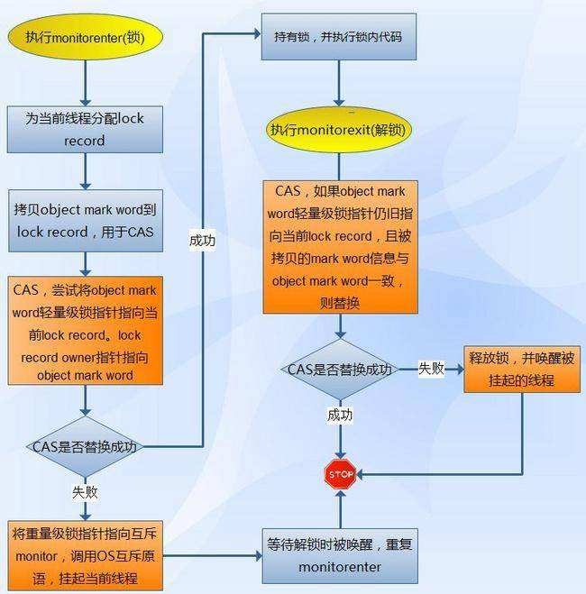

  - ##### 加锁

    在代码进入同步块的时候，如果此同步对象没有被锁定（锁标志位为“01”状态），虚拟机首先将在当前线程的栈帧中建立一个名为锁记录（Lock Record）的空间，用于存储锁对象目前的Mark Word的拷贝（官方把这份拷贝加了一个Displaced前缀，即Displaced Mark Word）。然后，虚拟机将使用CAS操作尝试将对象的Mark Word更新为指向Lock Record的指针。如果这个更新动作成功，那么这个线程就拥有了该对象的锁，并且对象Mark Word的锁标志位（Mark Word的最后2bit）将转变为“00”，即表示此对象处于轻量级锁定状态。如果这个更新操作失败了，虚拟机首先会检查对象的Mark Word是否指向当前线程的栈帧，如果是说明当前线程已经拥有了这个对象的锁，那就可以直接进入同步块继续执行，否则说明这个锁对象已经被其他线程抢占了。如果有两条以上的线程争用同一个锁，那轻量级锁就不再有效，要膨胀为重量级锁，锁标志的状态值变为“10”，Mark Word中存储的就是指向重量级锁（互斥量）的指针，前一个线程(即当前持有锁的线程)继续安全滴在同步块中执行代码，后一个抢锁的线程将会进入阻塞状态，直到当前持有锁的线程退出同步块时唤醒它。

  - ##### 解锁

    解锁过程也是通过CAS操作来进行的。如果对象的Mark Word仍然指向着线程的锁记录，那就用CAS操作把对象当前的Mark Word和线程中复制的Displaced Mark Word替换回来，如果替换成功，整个同步过程就完成了。如果替换失败，说明有其他线程尝试过获取该锁，那就要在释放锁的同时，唤醒被挂起的线程。

  - ##### 性能

    没有锁竞争时，轻量级锁用CAS操作替代互斥量的开销，性能较优。有锁竞争时，除了互斥量开销，还有CAS操作开销，所以性能较差。但是，一般情况下，在整个同步周期内都是不存在竞争的”，这是一个经验数据。

- ##### 重量级锁

  重量级锁是指当有一个线程获取锁之后，其余所有等待获取该锁的线程都会处于阻塞状态。

  重量级锁通过对象内部的监视器（monitor）实现，而其中 monitor 的本质是依赖于底层操作系统的 Mutex Lock 实现，操作系统实现线程之间的切换需要从用户态切换到内核态，切换成本非常高。

  简言之，就是所有的控制权都交给了操作系统，由操作系统来负责线程间的调度和线程的状态变更。而这样会出现频繁地对线程运行状态的切换，线程的挂起和唤醒，从而消耗大量的系统资源，导致性能低下。

  下面说下膨胀过程，直接上图：

  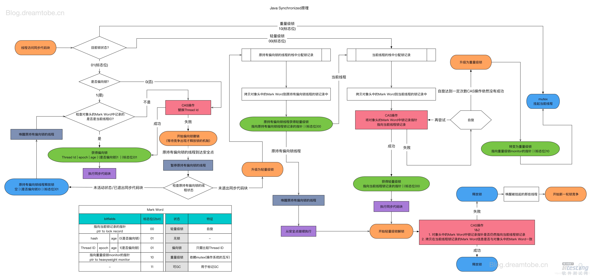


### 6.5、偏向锁和轻量级锁的区别

- 偏向锁仅在一个锁对象处于无锁状态标识下时才可以通过一个CAS操作来设置锁对象头上的`ThreadID`字段来获取偏向锁，在没有多线程竞争的情况下，后面该同一线程再次获取该锁的时候，就会连加锁、解锁这些步骤都省了，相当于无锁操作，极致地优化了实现同步的开销。
- 轻量级锁的获取及释放依赖多次 CAS 原子指令，而偏向锁只需要在置换 ThreadID 的时候依赖一次 CAS 原子指令即可。

