深入理解java虚拟机第3版

深入理解Java虚拟机：JVM高级特性与最佳实践（第3 版）周志明　著，第三版2019年面世，涉及到最高到JDK14版本的JVM相关内容。


# 第二部分　自动内存管理


## 第2章　Java内存区域与内存溢出异常

### 2.1　概述

对于从事C、C++程序开发的开发人员来说，在内存管理领域，他们既是拥有最高权力的“皇帝”，又是从事最基础工作的劳动人民——既 拥有每一个对象的“所有权”，又担负着每一个对象生命从开始到终结的 维护责任。

对于Java程序员来说，在虚拟机自动内存管理机制的帮助下，不再需要为每一个new操作去写配对的delete/free代码，不容易出现内存泄漏和内存溢出问题，看起来由虚拟机管理内存一切都很美好。不过，也正是因为Java程序员把控制内存的权力交给了Java虚拟机，一旦出现内存泄漏和溢出方面的问题，如果不了解虚拟机是怎样使用内存的，那排查 错误、修正问题将会成为一项异常艰难的工作。

本章是第二部分的第1章，笔者将从概念上介绍Java虚拟机内存的各个区域，讲解这些区域的作用、服务对象以及其中可能产生的问题， 这也是翻越虚拟机内存管理这堵围墙的第一步。

### 2.2　运行时数据区域

Java虚拟机在执行Java程序的过程中会把它所管理的内存划分为若干个不同的数据区域。这些区域有各自的用途，以及创建和销毁的时 间，有的区域随着虚拟机进程的启动而一直存在，有些区域则是依赖用户线程的启动和结束而建立和销毁。根据《Java虚拟机规范》的规定， Java虚拟机所管理的内存将会包括以下几个运行时数据区域，如图2-1所示：


#### 程序计数器

程序计数器（Program Counter Register）是一块较小的内存空间， 它可以看作是当前线程所执行的字节码的行号指示器。在Java虚拟机的 概念模型里[1]，字节码解释器工作时就是通过改变这个计数器的值来选 取下一条需要执行的字节码指令，它是程序控制流的指示器，分支、循环、跳转、异常处理、线程恢复等基础功能都需要依赖这个计数器来完成。

由于Java虚拟机的多线程是通过线程轮流切换、分配处理器执行时 间的方式来实现的，在任何一个确定的时刻，一个处理器（对于多核处 理器来说是一个内核）都只会执行一条线程中的指令。因此，为了线程 切换后能恢复到正确的执行位置，**每条线程都需要有一个独立的程序计 数器，各条线程之间计数器互不影响，独立存储，我们称这类内存区域 为“线程私有”的内存。**

#### Java虚拟机栈

与程序计数器一样，Java虚拟机栈（Java Virtual Machine Stack）也 是线程私有的，它的生命周期与线程相同。虚拟机栈描述的是Java方法 执行的线程内存模型：每个方法被执行的时候，Java虚拟机都会同步创 建一个栈帧[1]（Stack Frame）用于存储局部变量表、操作数栈、动态连 接、方法出口等信息。每一个方法被调用直至执行完毕的过程，就对应 着一个栈帧在虚拟机栈中从入栈到出栈的过程。

经常有人把Java内存区域笼统地划分为堆内存（Heap）和栈内存 （Stack），这种划分方式直接继承自传统的C、C++程序的内存布局结 构，在Java语言里就显得有些粗糙了，实际的内存区域划分要比这更复 杂。不过这种划分方式的流行也间接说明了程序员最关注的、与对象内 存分配关系最密切的区域是“堆”和“栈”两块。其中，“堆”在稍后笔者会 专门讲述，而“栈”通常就是指这里讲的虚拟机栈，或者更多的情况下只 是指虚拟机栈中局部变量表部分。

**在《Java虚拟机规范》中，对这个内存区域规定了两类异常状况： 如果线程请求的栈深度大于虚拟机所允许的深度，将抛出 StackOverflowError异常；如果Java虚拟机栈容量可以动态扩展，当栈扩展时无法申请到足够的内存会抛出OutOfMemoryError异常。**

HotSpot虚拟机的栈容量是不可以动态扩展的，以前的Classic虚拟机 倒是可以。所以由于本来就不可以动态扩展所以在HotSpot虚拟机上是不会由于虚拟机栈无法扩展而导 致OutOfMemoryError异常——只要线程申请栈空间成功了就不会有OOM，但是如果申请时就失败，仍然是会出现OOM异常的。

#### 本地方法栈

本地方法栈（Native Method Stacks）与虚拟机栈所发挥的作用是非 常相似的，其区别只是虚拟机栈为虚拟机执行Java方法（也就是字节 码）服务，而本地方法栈则是为虚拟机使用到的本地（Native）方法服务。

《Java虚拟机规范》对本地方法栈中方法使用的语言、使用方式与 数据结构并没有任何强制规定，因此具体的虚拟机可以根据需要自由实 现它，**甚至有的Java虚拟机（譬如Hot-Spot虚拟机）直接就把本地方法 栈和虚拟机栈合二为一。与虚拟机栈一样，本地方法栈也会在栈深度溢出或者栈扩展失败时分别抛出StackOverflowError和OutOfMemoryError 异常。**

#### Java堆

对于Java应用程序来说，Java堆（Java Heap）是虚拟机所管理的内存中最大的一块。Java堆是被所有线程共享的一块内存区域，在虚拟机 启动时创建。此内存区域的唯一目的就是存放对象实例，Java世界 里“几乎”所有的对象实例都在这里分配内存。在《Java虚拟机规范》中 对Java堆的描述是：“所有的对象实例以及数组都应当在堆上分配[1]”， 而这里笔者写的“几乎”是指从实现角度来看，随着Java语言的发展，现 在已经能看到些许迹象表明日后可能出现值类型的支持，即使只考虑现 在，由于即时编译技术的进步，尤其是逃逸分析技术的日渐强大，栈上 分配、标量替换[2]优化手段已经导致一些微妙的变化悄然发生，所以说 Java对象实例都分配在堆上也渐渐变得不是那么绝对了。

Java堆是垃圾收集器管理的内存区域，因此一些资料中它也被称 作“GC堆”（Garbage Collected Heap，幸好国内没翻译成“垃圾堆”）。从 回收内存的角度看，由于现代垃圾收集器大部分都是基于分代收集理论 设计的，所以Java堆中经常会出现“新生代”“老年代”“永久代”“Eden空 间”“From Survivor空间”“To Survivor空间”等名词**（新生代其中又包含一个Eden和两个Survivor）**，这些概念在本书后续 章节中还会反复登场亮相，在这里笔者想先说明的是这些区域划分仅仅 是一部分垃圾收集器的共同特性或者说设计风格而已，而非某个Java虚 拟机具体实现的固有内存布局，更不是《Java虚拟机规范》里对Java堆 的进一步细致划分。不少资料上经常写着类似于“Java虚拟机的堆内存 分为新生代、老年代、永久代、Eden、Survivor……”这样的内容。在十 年之前（以G1收集器的出现为分界），作为业界绝对主流的HotSpot虚 拟机，它内部的垃圾收集器全部都基于“经典分代”[3]来设计，需要新生 代、老年代收集器搭配才能工作，在这种背景下，上述说法还算是不会 产生太大歧义。但是到了今天，垃圾收集器技术与十年前已不可同日而 语，HotSpot里面也出现了不采用分代设计的新垃圾收集器，再按照上 面的提法就有很多需要商榷的地方了。不过无论从什么角度，无论如何划分，都不 会改变Java堆中存储内容的共性，无论是哪个区域，存储的都只能是对 象的实例，**将Java堆细分的目的只是为了更好地回收内存，或者更快地分配内存。**在本章中，我们仅仅针对内存区域的作用进行讨论，Java堆 中的上述各个区域的分配、回收等细节将会是下一章的主题。

根据《Java虚拟机规范》的规定，Java堆可以处于物理上不连续的 内存空间中，但在逻辑上它应该被视为连续的，这点就像我们用磁盘空 间去存储文件一样，并不要求每个文件都连续存放。但对于大对象（典 型的如数组对象），多数虚拟机实现出于实现简单、存储高效的考虑， 很可能会要求连续的内存空间。

Java堆既可以被实现成固定大小的，也可以是可扩展的，不过当前 主流的Java虚拟机都是按照可扩展来实现的（通过参数-Xmx和-Xms设 定）。如果在Java堆中没有内存完成实例分配，并且堆也无法再扩展 时，Java虚拟机将会抛出OutOfMemoryError异常。

#### 方法区

方法区（Method Area）与Java堆一样，是各个线程共享的内存区 域，它用于存储已被虚拟机加载的类型信息、常量、静态变量、即时编 译器编译后的代码缓存等数据。虽然《Java虚拟机规范》中把方法区描 述为堆的一个逻辑部分，但是它却有一个别名叫作“非堆”（NonHeap），目的是与Java堆区分开来。 

说到方法区，不得不提一下“永久代”这个概念，尤其是在JDK 8以 前，许多Java程序员都习惯在HotSpot虚拟机上开发、部署程序，很多人 都更愿意把方法区称呼为“永久代”（Permanent Generation），或将两者 混为一谈。本质上这两者并不是等价的，因为仅仅是当时的HotSpot虚 拟机设计团队选择把收集器的分代设计扩展至方法区，或者说使用永久代来实现方法区而已，这样使得HotSpot的垃圾收集器能够像管理Java堆 一样管理这部分内存，省去专门为方法区编写内存管理代码的工作。但 是对于其他虚拟机实现，譬如BEA JRockit、IBM J9等来说，是不存在 永久代的概念的。原则上如何实现方法区属于虚拟机实现细节，不受 《Java虚拟机规范》管束，并不要求统一。**但现在回头来看，当年使用 永久代来实现方法区的决定并不是一个好主意，这种设计导致了Java应 用更容易遇到内存溢出的问题（永久代有-XX:MaxPermSize的上限， 即使不设置也有默认大小，而J9和JRockit只要没有触碰到进程可用内存 的上限，例如32位系统中的4GB限制，就不会出问题），而且有极少数 方法（例如String::intern()）会因永久代的原因而导致不同虚拟机下有不 同的表现。当Oracle收购BEA获得了JRockit的所有权后，准备把JRockit 中的优秀功能，譬如Java Mission Control管理工具，移植到HotSpot虚拟 机时，但因为两者对方法区实现的差异而面临诸多困难。考虑到 HotSpot未来的发展，在JDK 6的时候HotSpot开发团队就有放弃永久 代，逐步改为采用本地内存（Native Memory）来实现方法区的计划了 ，到了JDK 7的HotSpot，已经把原本放在永久代的字符串常量池、静态变量等移出，而到了JDK 8，终于完全废弃了永久代的概念，改用与 JRockit、J9一样在本地内存中实现的元空间（Meta-space）来代替，把 JDK 7中永久代还剩余的内容（主要是类型信息）全部移到元空间中。**

#### 运行时常量池

运行时常量池（Runtime Constant Pool）是方法区的一部分。Class 文件中除了有类的版本、字段、方法、接口等描述信息外，还有一项信 息是常量池表（Constant Pool Table），用于存放编译期生成的各种字面 量与符号引用，这部分内容将在类加载后存放到方法区的运行时常量池中。


#### 直接内存

直接内存（Direct Memory）并不是虚拟机运行时数据区的一部分， 也不是《Java虚拟机规范》中定义的内存区域。但是这部分内存也被频繁地使用，而且也可能导致OutOfMemoryError异常出现，所以我们放到 这里一起讲解。

**在JDK 1.4中新加入了NIO（New Input/Output）类，引入了一种基 于通道（Channel）与缓冲区（Buffer）的I/O方式，它可以使用Native函数库直接分配堆外内存，然后通过一个存储在Java堆里面的DirectByteBuffer对象作为这块内存的引用进行操作。这样能在一些场景 中显著提高性能，因为避免了在Java堆和Native堆中来回复制数据。**

显然，本机直接内存的分配不会受到Java堆大小的限制，但是，既 然是内存，则肯定还是会受到本机总内存（包括物理内存、SWAP分区 或者分页文件）大小以及处理器寻址空间的限制，一般服务器管理员配 置虚拟机参数时，会根据实际内存去设置-Xmx等参数信息，但经常忽 略掉直接内存，使得各个内存区域总和大于物理内存限制（包括物理的 和操作系统级的限制），从而导致动态扩展时出现OutOfMemoryError异 常。

### 2.3　HotSpot虚拟机对象探秘

介绍完Java虚拟机的运行时数据区域之后，我们大致明白了Java虚拟机内存模型的概况，相信读者了解过内存中放了什么，也许就会更进一步想了解这些虚拟机内存中数据的其他细节，譬如它们是如何创建、如何布局以及如何访问的。对于这样涉及细节的问题，必须把讨论范围限定在具体的虚拟机和集中在某一个内存区域上才有意义。基于实用优先的原则，笔者以最常用的虚拟机HotSpot和最常用的内存区域Java堆为例，深入探讨一下HotSpot虚拟机在Java堆中对象分配、布局和访问的全过程。

#### 对象的创建

Java是一门面向对象的编程语言，Java程序运行过程中无时无刻都 有对象被创建出来。在语言层面上，创建对象通常（例外：复制、反序 列化）仅仅是一个new关键字而已，而在虚拟机中，对象（文中讨论的 对象限于普通Java对象，不包括数组和Class对象等）的创建又是怎样一 个过程呢？

当Java虚拟机遇到一条字节码new指令时，首先将去检查这个指令 的参数是否能在常量池中定位到一个类的符号引用，并且检查这个符号 引用代表的类是否已被加载、解析和初始化过。如果没有，那必须先执 行相应的类加载过程，本书第7章将探讨这部分细节。

#### 对象的创建步骤

1. 类加载检查。即new指令的目标(类的符号引用所代表的的类)类以及该类所依赖的子类是否被加载、解析和初始化过，如果没有，那必须先执行相应的类加载过程（即执行<cinit>方法）。
2. 对象内存分配。对象内存地址分配方式分为基于规整内存空间的"**指针碰撞**"方式和基于不规整内存空间的"**空闲列表**"方式。具体采用哪种方式取决于所采用的垃圾收集器是否带有空间压缩整理（Compact）的能力决定。因此，当使用 Serial、ParNew等带压缩整理过程的收集器时，系统采用的分配算法是**指针碰撞**，既简单又高效；而当使用CMS这种基于清除（Sweep）算法的收集器时，理论上就只能采用较为复杂的空闲列表来分配内存。对象内存分配并发保障方式：一是采用CAS配上失败重试的方式保证原子性。二是采用本地线程分配缓冲（Thread Local Allocation Buffer，TLAB）。
3. 对象初始值归零设置。对象内存分配完毕后，需要将对象的实例变量设置为零，这里的零即默认值。
4. 设置对象头。初始化零值完成之后，虚拟机要对对象进行必要的设置，例如这个对象是那个类的实例、如何才能找到类的元数据信息、对象的哈希吗、对象的 GC 分代年龄等信息。 这些信息存放在对象头中。 另外，根据虚拟机当前运行状态的不同，如是否启用偏向锁等，对象头会有不同的设置方式。
5. 执行构造器方法，即执行Class文件中的<init>()方法。

#### 压缩指针

在32位到64位的转变中，人们最大的获益是内存容量。在一个32位的系统中，内存地址的宽度就是32位，这就意味着，我们最大能获取的内存空间是2^32（也就是4G）字节。这个容量明显不够用！在一个64位的机器中，理论上，我们能获取到的内存容量是2^64字节，这是一个十分庞大的数字。可惜的是，这只是一个理论值，而现实中，因为有一堆有关硬件和软件的因素限制，我们能得到的内存要少得多。举个例了来说，最好的 linux 系统最多支持到16TB的内存，而且截止到现在 java11 也在正在研制最新一代的垃圾收集器 ZGC ，号称可以支持到 TB 几倍的且能保证 STW 时间不会太长，可能许多人会说“16TB好大呀”，但是和2^64比起来，它真的挺小的。好了，接下来，我们就谈谈compressed oops能帮我们做什么。

**是什么是OOP？**

在堆中，32位的对象引用（指针）占4个字节，而64位的对象引用占8个字节。64位JVM在支持更大堆的同时，由于对象引用变大却带来了性能问题：

1. **增加了GC开销：64位对象引用需要占用更多的堆空间，留给其他数据的空间将会减少，从而加快了GC的发生，更频繁的进行GC。**
2. **降低CPU缓存命中率：64位对象引用增大了，CPU能缓存的oop将会更少，从而降低了CPU缓存的效率。**

为了能够保持32位的性能，oop必须保留32位。那么，如何用32位oop来引用更大的堆内存呢？答案是——压缩指针（CompressedOops）。

OOP = “ordinary object pointer” 普通对象指针。 启用CompressOops后，会压缩的对象包括：

1. 对象头中的对象类型指针，称之为**Klass Pointer**；
2. 引用类型的字段（成员变量）；
3. 类中静态变量；
4. 引用类型数组；

当然，压缩也不是万能的，针对一些特殊类型的指针，JVM是不会优化的。 比如指向 PermGen的Class 对象指针，本地变量，堆栈元素，入参，返回值，NULL指针不会被压缩。

为了尽量减少对象的内存使用量，64 位 Java 虚拟机引入了压缩指针 的概念（对应虚拟机选项 -XX:+UseCompressedOops，默认开启），将堆中原本 64 位的 Java 对象指针压缩成 32 位的。使得对象头的大小从 16 字节降至 12 字节。当然，压缩指针不仅可以作用于对象头的类型指针，还可以作用于引用类型的字段，以及引用类型数组。

默认情况下，Java 虚拟机堆中对象的起始地址需要对齐至 8 的倍数（**内存对齐**）。不到 8N 个字节部分，会被自动填充，称之为对象间的填充（padding）。在默认情况下，Java 虚拟机中的 32 位压缩指针可以寻址到 2 的 35 次方个字节（**32位系统一共可以寻址4G个位置，每个位置8位，这些再当做32G个位置，所以一共是32G**），也就是 32GB 的地址空间（超过 32GB 则会关闭压缩指针）。在对压缩指针解引用时，需要将其左移 3 位，再加上一个固定偏移量，便可以得到能够寻址 32GB 地址空间的伪 64 位指针了。

**根据32位压缩指针计算内存的实际地址的公式近视为： `内存地址(字节单位) = jvm内存偏移量 + 指针 * 8`**

内存对齐不仅存在于对象与对象之间，也存在于对象中的字段之间。字段重排序遵循以下几个原则：

1. 如果一个字段占据 C 个字节，那么该字段的偏移量需要对齐至 NC。这里偏移量指的是字段地址与对象的起始地址差值。
2. 子类所继承字段的偏移量，需要与父类对应字段的偏移量保持一致。

字段内存对齐的其中一个原因，是让字段只出现在同一CPU的缓存行中。如果字段不是对齐的，那么就有可能出现跨缓存行的字段。也就是说，该字段的读取可能需要替换两个缓存行。如果做了内存对齐，CPU可以直接从地址0开始读取，一次就读取到想要的数据，不需要进行额外读取操作和运算操作，节省了运行时间。**我们用了空间换时间，这就是为什么我们需要内存对齐。**

**举个例子：**

环境：64bit机器开启压缩指针，默认按照8byte对齐。

Integer的例子中，对象头12byte，属性int value 4byte并按照4byte对齐，所以最终对象大小16byte。对象内的属性int value起始地址12，所以对象内不需要额外的padding，对象大小16byte，是8byte的整倍数，所以对象间也不需要额外的padding来对齐。

Long的例子中，对象头12byte，long value是8byte并按照8byte对齐，而对象头12byte从0byte~11byte，所以Long的实际存放地址是16~23byte，在long value和对象头之间需要4byte的padding（但这个padding不是对象头的，是后面的long value根据第一条对齐规则导致的，Integer例子中int value是4byte对齐，就不需要额外的padding）。填充之后，对象大小为24byte，是默认对齐8byte的整倍数，对象间不需要额外的padding。


**总结：**

- 64位机器，如果JVM堆大小在4G以下，直接砍掉高32位，避免了编码解码过程；
- 64位机器，如果JVM堆大小在4G以上32G以下，则启用UseCompressedOop；
- 64位机器，如果JVM堆大小大于32G，压指失效，使用原来的64位（所以说服务器内存太大不好......）。
- 对象间按照参数-XX:ObjectAlignmentInBytes的值对齐
- 对象中的属性按照属性本身的占用空间来计算对齐字节数，例如boolean按1字节对齐，int按4字节对齐，long按8字节对齐，Boolean在是否开启指针压缩的情况下按4字节或8字节对齐

#### 对象的内存布局

在HotSpot虚拟机里，对象在堆内存中的存储布局可以划分为三个部分：**对象头（Header）、实例数据（Instance Data）和对齐填充 （Padding）。**

```ruby
|---------------------------|-----------------|---------|
|       Object Header       |  Instance Data  | Padding |
|-----------|---------------|-----------------|---------|
| Mark Word | Klass Pointer | field1|filed2|  | Padding |
|-----------|---------------|-----------------|---------|
```

**1、对象头**

HotSpot虚拟机对象的对象头由以下几部分组成：

- 一类是用于存储对象自身的运行时数据，称之为**Mark World**，例如：哈希码(HashCode)、GC分代年龄、锁状态标志、线程持有的锁、偏向线程ID、偏向时间戳等信息。

  这部分数据的长度在32位和64位的虚拟机（未开启压缩指针）中分别为32个比特和64个比特，官方称它为“Mark Word”。对象需要存储的运行时数据很多，其实已经超出了32、64位Bitmap结构所能记录的最大限度，但对象头里的信息是与对象自身定义的数据无关的额外存储成本，**考虑到虚拟机的空间效率，Mark Word被设计成一个有着动态定义的数据结构，以便在极小的空间内存储尽量多的数据，根据对象的状态复用自己的存储空间**。例如在32位的HotSpot虚拟机中，如对象未被同步锁锁定的状态下，Mark Word的32个比特存储空间中的25个比特用于存储对象哈希码，4个比特用于存储对象分代年龄，2个比特用于存储锁标志位，1个比特固定为0，在其他状态（轻量级锁定、重量级锁定、GC标记、可偏向）下对象的存储内容如下表所示：

  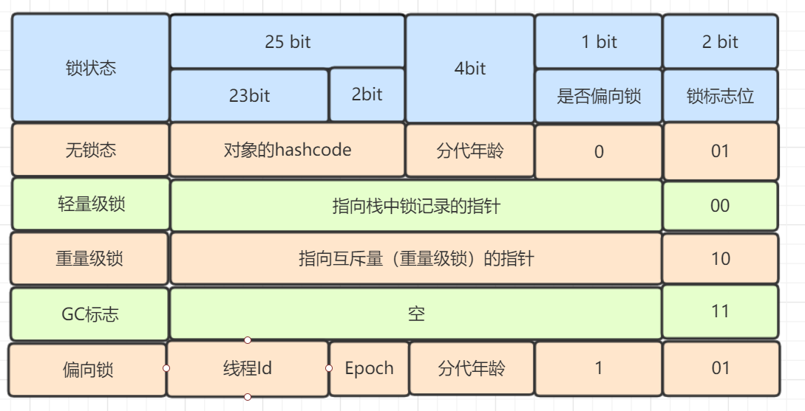

  由上图可知：最后三个比特位(2bit的锁标志 + 1bit的是否偏向锁)动态决定了整个Mark Word的动态存储机制。

- 另一类是对象类型指针，称之为**Klass Pointer**，即对象指向它的类型元数据的指针，Java虚拟机通过这个指针来确定该对象是哪个类的实例。

- 此外，如果对象是一个Java数组，那在对象头中还必须有一块用于记录数组长度的数据。

对象的第三部分是对齐填充，这并不是必然存在的，也没有特别的含义，它仅仅起着占位符的作用。**由于HotSpot虚拟机的自动内存管理系统要求对象起始地址必须是8字节的整数倍(可由-XX:ObjectAlignmentInBytes参数指定，默认为8)，换句话说就是任何对象的大小都必须是8字节的整数倍**。对象头部分已经被精心设计成正好是8字节的倍数（1倍或者2倍），因此，如果对象实例数据部分没有对齐的话，就需要通过对齐填充来补全。

**普通对象占用内存情况：**

|               | 32 位系统   | 64 位系统(-XX:+UseCompressedOops) | 64 位系统(-XX:-UseCompressedOops) |
| ------------- | ----------- | --------------------------------- | --------------------------------- |
| Mark Word     | 4 bytes     | 8 bytes                           | 8 bytes                           |
| Klass Pointer | 4 bytes     | 4 bytes                           | 8 bytes                           |
| **对象头**    | **8 bytes** | **12 bytes**(不含对齐补白)        | **16 bytes**                      |

**数组对象占用内存情况：**

|               | 32 位系统    | 64 位系统(-XX:+UseCompressedOops) | 64 位系统(-XX:-UseCompressedOops) |
| ------------- | ------------ | --------------------------------- | --------------------------------- |
| Mark Word     | 4 bytes      | 8 bytes                           | 8 bytes                           |
| Class Pointer | 4 bytes      | 4 bytes                           | 8 bytes                           |
| Length        | 4 bytes      | 4 bytes                           | 4 bytes                           |
| **对象头**    | **12 bytes** | **16 bytes**                      | **20 bytes**(不含对齐补白)        |

**2、实例数据**

| Type                                   | 32 位系统 | 64 位系统(-XX:+UseCompressedOops) | 64 位系统(-XX:-UseCompressedOops) |
| -------------------------------------- | --------- | --------------------------------- | --------------------------------- |
| double                                 | 8 bytes   | 8 bytes                           | 8 bytes                           |
| long                                   | 8 bytes   | 8 bytes                           | 8 bytes                           |
| float                                  | 4 bytes   | 4 bytes                           | 4 bytes                           |
| int                                    | 4 bytes   | 4 bytes                           | 4 bytes                           |
| char                                   | 2 bytes   | 2 bytes                           | 2 bytes                           |
| short                                  | 2 bytes   | 2 bytes                           | 2 bytes                           |
| byte                                   | 1 bytes   | 1 bytes                           | 1 bytes                           |
| boolean                                | 1 bytes   | 1 bytes                           | 1 bytes                           |
| oops(ordinary object pointers)包括数组 | 4 bytes   | 4 bytes                           | 8 bytes                           |

**3、对齐填充**

默认情况下，Java 虚拟机堆中对象的起始地址需要对齐至 8 的倍数（**内存对齐**）。不到 8N 个字节部分，会被自动填充，称之为对象间的填充（padding）。默认对齐字节数可以使用选项**-XX:ObjectAlignmentInBytes=num**设置，最小值为8，最大值为256。

#### 对象的访问定位

创建对象自然是为了后续使用该对象，我们的Java程序会通过栈上的reference数据来操作堆上的具体对象。由于reference类型在《Java虚拟机规范》里面只规定了它是一个指向对象的引用，并没有定义这个引用应该通过什么方式去定位、访问到堆中对象的具体位置，所以对象访问方式也是由虚拟机实现而定的，主流的访问方式主要有使用句柄和直接指针两种：

- 如果使用句柄访问的话，Java堆中将可能会划分出一块内存来作为句柄池，reference中存储的就是对象的句柄地址，而句柄中包含了对象实例数据与类型数据各自具体的地址信息，其结构如下图所示：


 

- 如果使用直接指针访问的话，Java堆中对象的内存布局就必须考虑如何放置访问类型数据的相关信息，reference中存储的直接就是对象地址，如果只是访问对象本身的话，**就不需要通过对象头中的对象类型指针(Klass Pointer)来多一次间接访问的开销**，其结构如下图所示：

  

  这两种对象访问方式各有优势，使用句柄来访问的最大好处就是reference中存储的是稳定句柄地址，在对象被移动（垃圾收集时移动对象是非常普遍的行为）时只会改变句柄中的实例数据指针，而reference本身不需要被修改。

  使用直接指针来访问最大的好处就是速度更快，它节省了一次指针定位的时间开销，由于对象访问在Java中非常频繁，因此这类开销积少成多也是一项极为可观的执行成本，**就本书讨论的主要虚拟机HotSpot而言，它主要使用第二种方式进行对象访问（有例外情况**，如果使用了Shenandoah收集器的话也会有一次额外的转发，具体可参见第3章）， 但从整个软件开发的范围来看，在各种语言、框架中使用句柄来访问的 情况也十分常见。

本节部分图参考https://www.cnblogs.com/jiangyang/p/11422732.html

### 2.4　实战：OutOfMemoryError异常

在《Java虚拟机规范》的规定里，除了程序计数器外，虚拟机内存的其他几个运行时区域都有发生OutOfMemoryError（下文称OOM）异常的可能，本节将通过若干实例来验证异常实际发生的代码场景，并且将初步介绍若干最基本的与自动内存管理子系统 相关的HotSpot虚拟机参数。 

本节实战的目的有两个：第一，通过代码验证《Java虚拟机规范》中描述的各个运行时区域储存的内容；第二，希望读者在工作中遇到实 际的内存溢出异常时，能根据异常的提示信息迅速得知是哪个区域的内存溢出，知道怎样的代码可能会导致这些区域内存溢出，以及出现这些异常后该如何处理。

#### Java堆溢出

Java堆用于储存对象实例，我们只要不断地创建对象，并且保证GC Roots到对象之间有可达路径来避免垃圾回收机制清除这些对象，那么 随着对象数量的增加，总容量触及最大堆的容量限制后就会产生内存溢出异常。

下面代码清单中限制Java堆的大小为20MB，不可扩展（将堆的最小 值-Xms参数与最大值-Xmx参数设置为一样即可避免堆自动扩展），通过参数-XX:+HeapDumpOnOutOfMemoryError可以让虚拟机在出现内存溢出异常的时候Dump出当前的内存堆转储快照以便进行事后分析 

```java
/**
 * VM Args：-Xms20m -Xmx20m -XX:+HeapDumpOnOutOfMemoryError
 * 
 * @author 	zzm
 */
public class HeapOOM {
	static class OOMObject {
	}

	public static void main(String[] args) {
		List<OOMObject> list = new ArrayList<OOMObject>();
		while (true) {
			list.add(new OOMObject());
		}
	}
}
```

运行结果：

```java
java.lang.OutOfMemoryError: Java heap space
Dumping heap to java_pid242876.hprof ...
Heap dump file created [27971911 bytes in 0.091 secs]
Exception in thread "main" java.lang.OutOfMemoryError: Java heap space
	at java.util.Arrays.copyOf(Arrays.java:3210)
	at java.util.Arrays.copyOf(Arrays.java:3181)
	at java.util.ArrayList.grow(ArrayList.java:265)
	at java.util.ArrayList.ensureExplicitCapacity(ArrayList.java:239)
	at java.util.ArrayList.ensureCapacityInternal(ArrayList.java:231)
	at java.util.ArrayList.add(ArrayList.java:462)
	at com.penglecode.xmodule.jvm.chapter2.oom.HeapOOM.main(HeapOOM.java:18)
```

Java堆内存的OutOfMemoryError异常是实际应用中最常见的内存溢
出异常情况。出现Java堆内存溢出时，异常堆栈信息“java.lang.OutOfMemoryError”会跟随进一步提示“Java heap space”。

要解决这个内存区域的异常，常规的处理方法是首先通过内存映像 分析工具（如Eclipse Memory Analyzer）对Dump出来的堆转储快照进行 分析。第一步首先应确认内存中导致OOM的对象是否是必要的，也就是要先分清楚到底是出现了**内存泄漏（Memory Leak）**还是**内存溢出（Memory Overflow）**。

**如果是内存泄漏**，可进一步通过工具查看泄漏对象到GC Roots的引用链，找到泄漏对象是通过怎样的引用路径、与哪些GC Roots相关联， 才导致垃圾收集器无法回收它们，根据泄漏对象的类型信息以及它到GC Roots引用链的信息，一般可以比较准确地定位到这些对象创建的位置，进而找出产生内存泄漏的代码的具体位置。

**如果不是内存泄漏**，换句话说就是内存中的对象确实都是必须存活的，那就应当检查Java虚拟机的堆参数（-Xmx与-Xms）设置，与机器 的内存对比，看看是否还有向上调整的空间。再从代码上检查是否存在某些对象生命周期过长、持有状态时间过长、存储结构设计不合理等情况，尽量减少程序运行期的内存消耗。

以上是处理Java堆内存问题的简略思路，处理这些问题所需要的知识、工具与经验是后面三章的主题，后面我们将会针对具体的虚拟机实 现、具体的垃圾收集器和具体的案例来进行分析，这里就先暂不展开。

#### 虚拟机栈和本地方法栈溢出

由于HotSpot虚拟机中并不区分虚拟机栈和本地方法栈，因此对于HotSpot来说，-Xoss参数（设置本地方法栈大小）虽然存在，但实际上是没有任何效果的，栈容量只能由-Xss参数来设定。关于虚拟机栈和本地方法栈，在《Java虚拟机规范》中描述了两种异常： 

1. 如果线程请求的栈深度大于虚拟机所允许的最大深度，将抛出 **StackOverflowError**异常。
2. 如果虚拟机的栈内存允许动态扩展，当扩展栈容量无法申请到足够的内存时，将抛出**OutOfMemoryError**异常。

《Java虚拟机规范》明确允许Java虚拟机实现自行选择是否支持栈的动态扩展，而HotSpot虚拟机的选择是不支持扩展，所以除非在创建 线程申请内存时就因无法获得足够内存而出现OutOfMemoryError异常， 否则在线程运行时是不会因为扩展而导致内存溢出的，只会因为栈容量无法容纳新的栈帧而导致StackOverflowError异常。

测试StackOverflowError异常：

1. 通过-Xss(即-XX:ThreadStackSize)参数逐步减少栈内存大小来触发StackOverflowError测试其对栈的深度的影响。

```java
/**
 * 通过-Xss(即-XX:ThreadStackSize)参数逐步减少栈内存大小来触发StackOverflowError测试其对栈的深度的影响。
 * 
 * 第一次设置栈内存大小为1MB：-XX:+PrintCommandLineFlags -Xss1m
 * 输出：java.lang.StackOverflowError, stack length: 18319
 * 
 * 第二次设置栈内存大小为256KB：-XX:+PrintCommandLineFlags -Xss256k
 * 输出：java.lang.StackOverflowError, stack length: 2470
 * 
 * 由上可以得出：增加栈内存大小可以增加栈的深度。
 * 
 * @author 	pengpeng
 * @date 	2020年6月18日 下午3:08:03
 */
public class StackOverflow1Example {

	private int stackLength = 1;
	
	public void stackLeak() {
		stackLength++;
		stackLeak();
	}
	
	public static void main(String[] args) {
		StackOverflow1Example example = new StackOverflow1Example();
		try {
			example.stackLeak();
		} catch (Throwable e) {
			System.err.println(String.format("%s, stack length: %s", e.getClass().getName(), example.stackLength));
		}
	}

}   
```

2. 在栈内存大小相同情况下，通过定义局部变量的多少来触发StackOverflowError测试其对栈的深度的影响。
```java
/**
 * 在栈内存大小相同情况下，通过定义局部变量的多少来触发StackOverflowError测试其对栈的深度的影响。
 * 
 * smallStackLeak()方法中未定义任何局部变量
 * 
 * largeStackLeak()方法中未定义大量局部变量
 * 
 * @author 	pengpeng
 * @date 	2020年6月18日 下午3:54:46
 */
public class StackOverflow2Example {

	private int stackLength = 1;
	
	public void smallStackLeak() {
		stackLength++;
		smallStackLeak();
	}
	
	@SuppressWarnings("unused")
	public void largeStackLeak() {
		stackLength++;
		String a1 = UUID.randomUUID().toString();
		String a2 = UUID.randomUUID().toString();
		String a3 = UUID.randomUUID().toString();
		String a4 = UUID.randomUUID().toString();
		String a5 = UUID.randomUUID().toString();
		String a6 = UUID.randomUUID().toString();
		String a7 = UUID.randomUUID().toString();
		String a8 = UUID.randomUUID().toString();
		String a9 = UUID.randomUUID().toString();
		String a10 = UUID.randomUUID().toString();
		String a11 = UUID.randomUUID().toString();
		String a12 = UUID.randomUUID().toString();
		String a13 = UUID.randomUUID().toString();
		String a14 = UUID.randomUUID().toString();
		String a15 = UUID.randomUUID().toString();
		largeStackLeak();
	}
	
	public static void main(String[] args) {
		StackOverflow2Example example = new StackOverflow2Example();
		try {
			//example.smallStackLeak(); // java.lang.StackOverflowError, stack length: 22968
			example.largeStackLeak(); // java.lang.StackOverflowError, stack length: 15092
		} catch (Throwable e) {
			System.err.println(String.format("%s, stack length: %s", e.getClass().getName(), example.stackLength));
		}
	}

}
```

实验结果表明：无论是由于栈帧太大还是虚拟机栈容量太小，当新的栈帧内存无法分配的时候，HotSpot虚拟机抛出的都是 **StackOverflowError**异常。可是如果在允许动态扩展栈容量大小的虚拟机上，相同代码则会导致不一样的情况。

**线程栈的大小是个双刃剑，如果设置过小，可能会出现栈溢出，特别是在该线程内有递归、大的循环时出现溢出的可能性更大，如果该值设置过大，就有影响到创建栈的数量，如果是多线程的应用，就会出现内存溢出的错误．**

**JVM可创建的最大线程数限制因素：线程堆栈大小 --> 进程的最大内存 --> 操作系统位数**

#### 方法区和运行时常量池溢出

由于运行时常量池是方法区的一部分，所以这两个区域的溢出测试可以放到一起进行。前面曾经提到HotSpot从JDK 7开始逐步“去永久 代”的计划，并在JDK 8中完全使用元空间来代替永久代的背景故事，在此我们就以测试代码来观察一下，使用“永久代”还是“元空间”来实现方法区，对程序有什么实际的影响。

String::intern()是一个本地方法，它的作用是如果字符串常量池中已 经包含一个等于此String对象的字符串，则返回代表池中这个字符串的 String对象的引用；否则，会将此String对象包含的字符串添加到常量池 中，并且返回此String对象的引用。在JDK 6或更早之前的HotSpot虚拟 机中，常量池都是分配在永久代中，我们可以通过-XX：PermSize和XX：MaxPermSize限制永久代的大小，即可间接限制其中常量池的容 量，具体实现如下面代码清单所示，**请读者测试时首先以JDK 6来运行代码**。
```java
/**
 * VM Args：-XX:PermSize=6M -XX:MaxPermSize=6M
 * 
 * @author 	zzm
 */
public class RuntimeConstantPoolOOM {
	
	public static void main(String[] args) {
		// 使用Set保持着常量池引用，避免Full GC回收常量池行为
		Set<String> set = new HashSet<String>();
		// 在short范围内足以让6MB的PermSize产生OOM了
		short i = 0;
		while (true) {
			set.add(String.valueOf(i++).intern());
		}
	}
}
```

运行结果：

```java
Exception in thread "main" java.lang.OutOfMemoryError: PermGen space    
	at java.lang.String.intern(Native Method)
	at org.fenixsoft.oom.RuntimeConstantPoolOOM.main(RuntimeConstantPoolOOM.java:
```

从运行结果中可以看到，运行时常量池溢出时，在OutOfMemoryError异常后面跟随的提示信息是“PermGen space”，说明 运行时常量池的确是属于方法区（即JDK 6的HotSpot虚拟机中的永久代）的一部分。

**而使用JDK 7或更高版本的JDK来运行这段程序并不会得到相同的结果，无论是在JDK 7中继续使用-XX:MaxPermSize参数或者在JDK 8 及以上版本使用-XX:MaxMetaspaceSize参数把方法区容量同样限制在6MB，也都不会重现JDK 6中的溢出异常，循环将一直进行下去，永不停歇[1]。出现这种变化，是因为自JDK 7起，原本存放在永久代的字符 串常量池被移至Java堆之中，所以在JDK 7及以上版本，限制方法区的 容量对该测试用例来说是毫无意义的。**这时候使用-Xmx参数限制最大 堆到6MB就能够看到以下两种运行结果之一，具体取决于哪里的对象分配时产生了溢出：

```java
// OOM异常一：
Exception in thread "main" java.lang.OutOfMemoryError: Java heap space   
	at java.base/java.lang.Integer.toString(Integer.java:440)
	at java.base/java.lang.String.valueOf(String.java:3058)
	at RuntimeConstantPoolOOM.main(RuntimeConstantPoolOOM.java:12)
// OOM异常二： 
Exception in thread "main" java.lang.OutOfMemoryError: Java heap space
	at java.base/java.util.HashMap.resize(HashMap.java:699)
	at java.base/java.util.HashMap.putVal(HashMap.java:658)
	at java.base/java.util.HashMap.put(HashMap.java:607)
	at java.base/java.util.HashSet.add(HashSet.java:220)
	at RuntimeConstantPoolOOM.main(RuntimeConstantPoolOOM.java from InputFileObject:14)
```

我们再来看看方法区的其他部分的内容，方法区的主要职责是用于 存放类型的相关信息，如类名、访问修饰符、常量池、字段描述、方法 描述等。对于这部分区域的测试，基本的思路是运行时产生大量的类去 填满方法区，直到溢出为止。虽然直接使用Java SE API也可以动态产生 类（如反射时的GeneratedConstructorAccessor和动态代理等），但在本次实验中操作起来比较麻烦。在下面代码清单里笔者借助了cglib直接操作字节码运行时生成了大量的动态类以产生OOM。

```java
/**
 * 在JDK7及其以下版本中设置VM Args：-XX:PermSize=10M -XX:MaxPermSize=10M，产生异常：java.lang.OutOfMemoryError: PermGen space
 * 
 * 在JDK8及其以上版本中:
 * 		1、如果未设MaxMetaspaceSize，则在内存较大的情况下运行大半天都未必能出现：java.lang.OutOfMemoryError: Metaspace
 * 		2、如果设置-XX:MaxMetaspaceSize=10m -XX:MetaspaceSize=10m，则会立马出现：java.lang.OutOfMemoryError: Metaspace
 * 
 * 建议：
 * 		1、MetaspaceSize和MaxMetaspaceSize设置一样大。
 * 		2、具体设置多大，建议稳定运行一段时间后通过jstat -gc pid确认且这个值大一些，对于大部分项目256m即可。
 * 
 * @author 	pengpeng
 * @date 	2020年6月18日 下午7:01:34
 */
public class MetaspaceOutOfMemoryExample {

	public static void main(String[] args) {
		while (true) {
			Enhancer enhancer = new Enhancer();
			enhancer.setSuperclass(OOMObject.class);
			enhancer.setUseCache(false);
			enhancer.setCallback(new MethodInterceptor() {
				public Object intercept(Object obj, Method method, Object[] args, MethodProxy proxy) throws Throwable {
					return proxy.invokeSuper(obj, args);
				}
			});
			enhancer.create();
		}
	}

	static class OOMObject {
	}

}
```

在JDK 8以后，永久代便完全退出了历史舞台，元空间作为其替代 者登场。在默认设置下，前面列举的那些正常的动态创建新类型的测试 用例已经很难再迫使虚拟机产生方法区的溢出异常了。不过为了让使用 者有预防实际应用里出现类似于代码清单2-9那样的破坏性的操作， HotSpot还是提供了一些参数作为元空间的防御措施，主要包括：

- -XX:MaxMetaspaceSize：设置元空间最大值，默认是-1，即不限 制，或者说只受限于本地内存大小。
- -XX:MetaspaceSize：指定元空间的初始空间大小，以字节为单 位，达到该值就会触发垃圾收集进行类型卸载，同时收集器会对该值进 行调整：如果释放了大量的空间，就适当降低该值；如果释放了很少的 空间，那么在不超过-XX：MaxMetaspaceSize（如果设置了的话）的情 况下，适当提高该值。
- -XX:MinMetaspaceFreeRatio：作用是在垃圾收集之后控制最小的 元空间剩余容量的百分比，可减少因为元空间不足导致的垃圾收集的频 率。
- -XX:MaxMetaspaceFreeRatio，用于控制最大的元空间 剩余容量的百分比。

**建议：**

1. MetaspaceSize和MaxMetaspaceSize设置一样大。
2. 具体设置多大，建议稳定运行一段时间后通过jstat -gc pid确认且这个值大一些，对于大部分项目256m即可。

#### 本机直接内存溢出

直接内存（Direct Memory）的容量大小可通过-XX:MaxDirectMemorySize参数来指定，如果不去指定，则默认与Java堆最大值（由-Xmx指定）一致，下面代码清单越过了DirectByteBuffer类直接通过反射获取Unsafe实例进行内存分配（Unsafe类的getUnsafe()方法指 定只有引导类加载器才会返回实例，体现了设计者希望只有虚拟机标准类库里面的类才能使用Unsafe的功能，在JDK 10时才将Unsafe的部分功能通过VarHandle开放给外部使用），因为虽然使用DirectByteBuffer分配内存也会抛出内存溢出异常，但它抛出异常时并没有真正向操作系统申请分配内存，而是通过计算得知内存无法分配就会在代码里手动抛出溢出异常，真正申请分配内存的方法是Unsafe::allocateMemory()。 

```java
import sun.misc.Unsafe;

import java.lang.reflect.Field;

/**
 * VM Args：-Xmx20M -XX:MaxDirectMemorySize=10M
 * 
 * @author 	zzm
 */
@SuppressWarnings("restriction")
public class DirectMemoryOOM {

	private static final int _1MB = 1024 * 1024;
	
	public static void main(String[] args) throws Exception {
		Field unsafeField = Unsafe.class.getDeclaredFields()[0];
		unsafeField.setAccessible(true);
		Unsafe unsafe = (Unsafe) unsafeField.get(null);
		while (true) {
			unsafe.allocateMemory(_1MB);
		}

	}

}
```

运行结果：

```java
Exception in thread "main" java.lang.OutOfMemoryError
	at sun.misc.Unsafe.allocateMemory(Native Method)
	at com.penglecode.xmodule.jvm.chapter2.oom.DirectMemoryOOM.main(DirectMemoryOOM.java:22)
```

由直接内存导致的内存溢出，一个明显的特征是在Heap Dump文件中不会看见有什么明显的异常情况，如果读者发现内存溢出之后产生的Dump文件很小，而程序中又直接或间接使用了DirectMemory（典型的间接使用就是NIO），那就可以考虑重点检查一下直接内存方面的原因了。

## 第3章　垃圾收集器与内存分配策略

Java与C++之间有一堵由内存动态分配和垃圾收集技术所围成的高墙，墙外面的人想进去，墙里面的人却想出来。

### 3.1　概述

说起垃圾收集（Garbage Collection，下文简称GC），有不少人把这 项技术当作Java语言的伴生产物。事实上，垃圾收集的历史远远比Java 久远，在1960年诞生于麻省理工学院的Lisp是第一门开始使用内存动态 分配和垃圾收集技术的语言。当Lisp还在胚胎时期时，其作者John McCarthy就思考过垃圾收集需要完成的三件事情： 

- 哪些内存需要回收？

- 什么时候回收？

- 如何回收？

经过半个世纪的发展，今天的内存动态分配与内存回收技术已经相 当成熟，一切看起来都进入了“自动化”时代，那为什么我们还要去了解 垃圾收集和内存分配？答案很简单：当需要排查各种内存溢出、内存泄 漏问题时，当垃圾收集成为系统达到更高并发量的瓶颈时，我们就必须对这些“自动化”的技术实施必要的监控和调节。

第2章介绍了Java内存运行时区域的各个部分，其中程序计数器、虚拟机栈、本地方法栈3个区域随线程而生，随线程而灭，栈中的 栈帧随着方法的进入和退出而有条不紊地执行着出栈和入栈操作。每一个栈帧中分配多少内存基本上是在类结构确定下来时就已知的（尽管在运行期会由即时编译器进行一些优化，但在基于概念模型的讨论里，大体上可以认为是编译期可知的），因此这几个区域的内存分配和回收都具备确定性，在这几个区域内就不需要过多考虑如何回收的问题，当方法结束或者线程结束时，内存自然就跟随着回收了。

而Java堆和方法区这两个区域则有着很显著的不确定性：一个接口的多个实现类需要的内存可能会不一样，一个方法所执行的不同条件分 支所需要的内存也可能不一样，只有处于运行期间，我们才能知道程序究竟会创建哪些对象，创建多少个对象，这部分内存的分配和回收是动态的。垃圾收集器所关注的正是这部分内存该如何管理，本文后续讨论中的“内存”分配与回收也仅仅特指这一部分内存。

### 3.2　对象已死？

在堆里面存放着Java世界中几乎所有的对象实例，垃圾收集器在对堆进行回收前，第一件事情就是要确定这些对象之中哪些还“存活”着， 哪些已经“死去”（“死去”即不可能再被任何途径使用的对象）了。

#### 引用计数算法

很多教科书判断对象是否存活的算法是这样的：在对象中添加一个引用计数器，每当有一个地方引用它时，计数器值就加一；当引用失效时，计数器值就减一；任何时刻计数器为零的对象就是不可能再被使用的。笔者面试过很多应届生和一些有多年工作经验的开发人员，他们对于这个问题给予的都是这个答案。

客观地说，引用计数算法（Reference Counting）虽然占用了一些额 外的内存空间来进行计数，但它的原理简单，判定效率也很高，在大多数情况下它都是一个不错的算法。也有一些比较著名的应用案例，例如微软COM（Component Object Model）技术、使用ActionScript 3的 FlashPlayer、Python语言以及在游戏脚本领域得到许多应用的Squirrel中 都使用了引用计数算法进行内存管理。**但是，在Java领域，至少主流的Java虚拟机里面都没有选用引用计数算法来管理内存，主要原因是，这个看似简单的算法有很多例外情况要考虑，必须要配合大量额外处理才能保证正确地工作，譬如单纯的引用计数就很难解决对象之间相互循环引用的问题。**

举个简单的例子，请看下面代码清单中的testGC()方法：对象objA和objB都有字段instance，赋值令objA.instance=objB及 objB.instance=objA，除此之外，这两个对象再无任何引用，实际上这两个对象已经不可能再被访问，但是它们因为互相引用着对方，导致它们的引用计数都不为零，引用计数算法也就无法回收它们。
```java
/**
 * testGC()方法执行后，objA和objB会不会被GC呢？
 * 
 * @author 	zzm
 */
@SuppressWarnings("unused")
public class ReferenceCountingGC {

	private Object instance;
	
	private static final int _1MB = 1024 * 1024;
	
	/**
	 * 这个成员属性的唯一意义就是占点内存，以便能在GC日志中看清楚是否有回收过
	 */
    private byte[] buffer = new byte[2 * _1MB];
    
    public static void testGC() {
		ReferenceCountingGC objA = new ReferenceCountingGC();
		ReferenceCountingGC objB = new ReferenceCountingGC();
		objA.instance = objB;
		objB.instance = objA;
		objA = null;
		objB = null;
		// 假设在这行发生GC，objA和objB是否能被回收？ 
		System.gc();
    }
    
}
```

运行结果：

```java
[Full GC (System) [Tenured: 0K->210K(10240K), 0.0149142 secs] 4603K->210K(19456K), 
[Perm : 2999K->2999K(21248K)], 0.0150007 secs] [Times: user=0.01 sys=0.00, real=0.02 secs]
Heap    
    def new generation   total 9216K, used 82K [0x00000000055e0000, 0x0000000005fe0000, 0x0000000005fe0000)     Eden space 8192K,   1% used [0x00000000055e0000, 0x00000000055f4850, 0x0000000005de0000)    
    from space 1024K,   0% used [0x0000000005de0000, 0x0000000005de0000, 0x0000000005ee0000)    
    to   space 1024K,   0% used [0x0000000005ee0000, 0x0000000005ee0000, 0x0000000005fe0000)    
    tenured generation   total 10240K, used 210K [0x0000000005fe0000, 0x00000000069e0000, 0x00000000069e0000)    
    the space 10240K,   2% used [0x0000000005fe0000, 0x0000000006014a18, 0x0000000006014c00, 0x00000000069e0000)    
    compacting perm gen  total 21248K, used 3016K [0x00000000069e0000, 0x0000000007ea0000, 0x000000000bde0000)    
    the space 21248K,  14% used [0x00000000069e0000, 0x0000000006cd2398, 0x0000000006cd2400, 0x0000000007ea0000)    
    No shared spaces configured.
```

从运行结果中可以清楚看到内存回收日志中包含“4603K->210K”， 意味着虚拟机并没有因为这两个对象互相引用就放弃回收它们，这也从 侧面说明了Java虚拟机并不是通过引用计数算法来判断对象是否存活 的。

#### 可达性分析算法

当前主流的商用程序语言（Java、C#，上溯至前面提到的古老的 Lisp）的内存管理子系统，都是通过可达性分析（Reachability Analysis）算法来判定对象是否存活的。**这个算法的基本思路就是通过一系列称为“GC Roots”的根对象作为起始节点集，从这些节点开始，根据引用关系向下搜索，搜索过程所走过的路径称为“引用链”（Reference Chain），如果某个对象到GC Roots间没有任何引用链相连，或者用图论的话来说就是从GC Roots到这个对象不可达时，则证明此对象是不可能再被使用的**。


在Java技术体系里面，固定可作为GC Roots的对象包括以下几种：

- 在虚拟机栈（栈帧中的本地变量表）中引用的对象，譬如各个线程被调用的方法堆栈中使用到的参数、局部变量、临时变量等。
- 在方法区中类静态属性引用的对象，譬如Java类的引用类型静态变量。
- 在方法区中常量引用的对象，譬如字符串常量池（String Table）里的引用。
- 在本地方法栈中JNI（即通常所说的Native方法）引用的对象。 
- Java虚拟机内部的引用，如基本数据类型对应的Class对象，一些常驻的异常对象（比如NullPointExcepiton、OutOfMemoryError）等，还有系统类加载器。
- 所有被同步锁（synchronized关键字）持有的对象。 
- 反映Java虚拟机内部情况的JMXBean、JVMTI中注册的回调、本地代码缓存等。

除了这些固定的GC Roots集合以外，根据用户所选用的垃圾收集器以及当前回收的内存区域不同，还可以有其他对象“临时性”地加入，共 同构成完整GC Roots集合。譬如后文将会提到的分代收集和局部回收 （Partial GC），如果只针对Java堆中某一块区域发起垃圾收集时（如最 典型的只针对新生代的垃圾收集），必须考虑到内存区域是虚拟机自己的实现细节（在用户视角里任何内存区域都是不可见的），更不是孤立封闭的，所以某个区域里的对象完全有可能被位于堆中其他区域的对象所引用，这时候就需要将这些关联区域的对象也一并加入GC Roots集合中去，才能保证可达性分析的正确性。

目前最新的几款垃圾收集器无一例外都具备了局部回收的特征， 为了避免GC Roots包含过多对象而过度膨胀，它们在实现上也做出了各 种优化处理。关于这些概念、优化技巧以及各种不同收集器实现等内 容，都将在本章后续内容中一一介绍。

#### 再谈引用

无论是通过引用计数算法判断对象的引用数量，还是通过可达性分析算法判断对象是否引用链可达，判定对象是否存活都和“引用”离不开 关系。在JDK 1.2版之前，Java里面的引用是很传统的定义：如果reference类型的数据中存储的数值代表的是另外一块内存的起始地址， 就称该reference数据是代表某块内存、某个对象的引用。这种定义并没有什么不对，只是现在看来有些过于狭隘了，一个对象在这种定义下只有“被引用”或者“未被引用”两种状态，对于描述一些“食之无味，弃之可惜”的对象就显得无能为力。譬如我们希望能描述一类对象：当内存空间还足够时，能保留在内存之中，如果内存空间在进行垃圾收集后仍然非常紧张，那就可以抛弃这些对象——很多系统的缓存功能都符合这样的应用场景。

在JDK 1.2版之后，Java对引用的概念进行了扩充，将引用分为强引 用（Strongly Reference）、软引用（Soft Reference）、弱引用（Weak Reference）和虚引用（Phantom Reference）4种，这4种引用强度依次逐渐减弱。

- **强引用**是最传统的“引用”的定义，是指在程序代码之中普遍存在的引用赋值，即类似“Object obj=new Object()”这种引用关系。无论任何情况下，只要强引用关系还存在，垃圾收集器就永远不会回收掉被引用的对象。
- **软引用**是用来描述一些还有用，但非必须的对象。只被软引用关联着的对象，在系统将要发生内存溢出异常前，会把这些对象列进回收范围之中进行第二次回收，如果这次回收还没有足够的内存，才会抛出内存溢出异常。在JDK 1.2版之后提供了SoftReference类来实现软引用。
- **弱引用**也是用来描述那些非必须对象，但是它的强度比软引用更弱一些，被弱引用关联的对象只能生存到下一次垃圾收集发生为止。当垃圾收集器开始工作，**无论当前内存是否足够(软引用则在内存不足的情况下才会触发回收)，都会回收掉只被弱引用关联的对象**。在JDK 1.2版之后提供了WeakReference类来实现弱引用。 
- **虚引用**也称为“幽灵引用”或者“幻影引用”，它是最弱的一种引用关系。一个对象是否有虚引用的存在，完全不会对其生存时间构成影响， 也无法通过虚引用来取得一个对象实例。**为一个对象设置虚引用关联的唯一目的只是为了能在这个对象被收集器回收时收到一个系统通知。**在JDK 1.2版之后提供了PhantomReference类来实现虚引用。

#### 生存还是死亡？

即使在可达性分析算法中判定为不可达的对象，也不是“非死不可”的，这时候它们暂时还处于“缓刑”阶段，要真正宣告一个对象死亡，至少要经历两次标记过程：如果对象在进行可达性分析后发现没有与GC Roots相连接的引用链，那它将会被第一次标记，随后进行一次筛 选，筛选的条件是此对象是否有必要执行finalize()方法。**假如对象没有覆盖finalize()方法，或者finalize()方法已经被虚拟机调用过，那么虚拟机将这两种情况都视为“没有必要执行”，这类对象将会被终结回收**。 

**如果这个对象被判定为确有必要执行finalize()方法**，那么该对象将会被放置在一个名为F-Queue的队列之中，并在稍后由一条由虚拟机自动建立的、低调度优先级的Finalizer线程去执行它们的finalize()方法。 这里所说的“执行”是指虚拟机会触发这个方法开始运行，但并不承诺一定会等待它运行结束。这样做的原因是，如果某个对象的finalize()方法执行缓慢，或者更极端地发生了死循环，将很可能导致F-Queue队列中的其他对象永久处于等待，甚至导致整个内存回收子系统的崩溃。finalize()方法是对象逃脱死亡命运的最后一次机会，稍后收集器将对FQueue中的对象进行第二次小规模的标记，**如果对象要在finalize()中成功拯救自己—只要重新与引用链上的任何一个对象建立关联即可，譬如把自己（this关键字）赋值给某个类变量或者对象的成员变量，那在第二次标记时它将被移出“即将回收”的集合；如果对象这时候还没有逃脱，那基本上它就真的要被回收了。** 下面代码清单中我们可以看到一 个对象的finalize()被执行，但是它仍然可以存活：

```java
/**
 * 此代码演示了两点： 
 * 1.对象可以在被GC时自我拯救。 
 * 2.这种自救的机会只有一次，因为一个对象的finalize()方法最多只会被系统自动调用一次
 * 
 * @author 	zzm
 */
public class FinalizeEscapeGC {

	public static FinalizeEscapeGC SAVE_HOOK = null;
	
	public void isAlive() {
		System.out.println("yes, i am still alive :)");
	}
	
	@Override
	protected void finalize() throws Throwable {
		super.finalize();
		System.out.println("finalize method executed!");
		FinalizeEscapeGC.SAVE_HOOK = this;
	}
	
	public static void main(String[] args) throws Throwable {
		SAVE_HOOK = new FinalizeEscapeGC();
		// 对象第一次成功拯救自己
		SAVE_HOOK = null;
		System.gc(); 
		// 因为Finalizer方法优先级很低，暂停0.5秒，以等待它
		Thread.sleep(500);
		if (SAVE_HOOK != null) {
			SAVE_HOOK.isAlive();
		} else {
			System.out.println("no, i am dead :(");
		}
		// 下面这段代码与上面的完全相同，但是这次自救却失败了(因为这个对象的finalize()方法已经被JVM调用过一次了)
		SAVE_HOOK = null;
		System.gc(); 
		// 因为Finalizer方法优先级很低，暂停0.5秒，以等待它
		Thread.sleep(500);
		if (SAVE_HOOK != null) {
			SAVE_HOOK.isAlive();
		} else {
			System.out.println("no, i am dead :(");
		}
	}

}
```

还有一点需要特别说明，上面关于对象死亡时finalize()方法的描述可能带点悲情的艺术加工，笔者并不鼓励大家使用这个方法来拯救对 象。相反，笔者建议大家尽量避免使用它，因为它并不能等同于C和C++语言中的析构函数，而是Java刚诞生时为了使传统C、C++程序员更容易接受Java所做出的一项妥协。它的运行代价高昂，不确定性大，无 法保证各个对象的调用顺序，如今已被官方明确声明为不推荐使用的语法。有些教材中描述它适合做“关闭外部资源”之类的清理性工作，这完全是对finalize()方法用途的一种自我安慰。finalize()能做的所有工作， 使用try-finally或者其他方式都可以做得更好、更及时，所以笔者建议大家完全可以忘掉Java语言里面的这个方法。

#### 回收方法区

有些人认为方法区（如HotSpot虚拟机中的元空间或者永久代）是没有垃圾收集行为的，《Java虚拟机规范》中提到过可以不要求虚拟机 在方法区中实现垃圾收集，事实上也确实有未实现或未能完整实现方法区类型卸载的收集器存在（如JDK 11时期的ZGC收集器就不支持类卸载），方法区垃圾收集的“性价比”通常也是比较低的：在Java堆中，尤其是在新生代中，对常规应用进行一次垃圾收集通常可以回收70%至99%的内存空间，相比之下，方法区回收囿于苛刻的判定条件，其区域垃圾收集的回收成果往往远低于此。

方法区的垃圾收集主要回收两部分内容：废弃的常量和不再使用的类型。回收废弃常量与回收Java堆中的对象非常类似。举个常量池中字 面量回收的例子，假如一个字符串“java”曾经进入常量池中，但是当前系统又没有任何一个字符串对象的值是“java”，换句话说，已经没有任何字符串对象引用常量池中的“java”常量，且虚拟机中也没有其他地方引用这个字面量。如果在这时发生内存回收，而且垃圾收集器判断确有必要的话，这个“java”常量就将会被系统清理出常量池。常量池中其他类（接口）、方法、字段的符号引用也与此类似。

**判定一个常量是否“废弃”还是相对简单，而要判定一个类型是否属于“不再被使用的类”的条件就比较苛刻了。需要同时满足下面三个条 件：**

- 该类所有的实例都已经被回收，也就是Java堆中不存在该类及其任何派生子类的实例。
- 加载该类的类加载器已经被回收，这个条件除非是经过精心设计的可替换类加载器的场景，如OSGi、JSP的重加载等，否则通常是很难达成的。
- 该类对应的java.lang.Class对象没有在任何地方被引用，无法在任何地方通过反射访问该类的方法。

Java虚拟机被允许对满足上述三个条件的无用类进行回收，这里说的仅仅是“被允许”，而并不是和对象一样，没有引用了就必然会回收。

**关于是否要对类型进行回收，HotSpot虚拟机提供了-Xnoclassgc参数进行控制**，还可以使用-verbose:class以及-XX:+TraceClassLoading、XX:+TraceClassUnLoading查看类加载和卸载信息，其中-verbose:class和-XX:+TraceClassLoading可以在Product版的虚拟机中使用，XX:+TraceClassUnLoading参数需要FastDebug版的虚拟机支持。 

**在大量使用反射、动态代理、CGLib等字节码框架，动态生成JSP 以及OSGi这类频繁自定义类加载器的场景中，通常都需要Java虚拟机具备类型卸载的能力，以保证不会对方法区造成过大的内存压力。**

### 3.3　垃圾收集算法

垃圾收集算法的实现涉及大量的程序细节，且各个平台的虚拟机操作内存的方法都有差异，在本节中我们暂不过多讨论算法实现，只重点 介绍分代收集理论和几种算法思想及其发展过程。如果读者对其中的理论细节感兴趣，推荐阅读Richard Jones撰写的《垃圾回收算法手册》的第2～4章的相关内容。

**从如何判定对象消亡的角度出发，垃圾收集算法可以划分为“引用计数式垃圾收集”（Reference Counting GC）和“追踪式垃圾收 集”（Tracing GC）两大类，这两类也常被称作“直接垃圾收集”和“间接垃圾收集”。**由于引用计数式垃圾收集算法在本书讨论到的主流Java虚 拟机中均未涉及，所以我们暂不把它作为正文主要内容来讲解，本节介绍的所有算法均属于追踪式垃圾收集的范畴。

#### 分代收集理论

当前商业虚拟机的垃圾收集器，大多数都遵循了“分代收集”（Generational Collection）的理论进行设计，分代收集名为理论， 实质是一套符合大多数程序运行实际情况的经验法则，它建立在两个分代假说之上：

- 弱分代假说（Weak Generational Hypothesis）：绝大多数对象都是朝生夕灭的。
- 强分代假说（Strong Generational Hypothesis）：熬过越多次垃圾收集过程的对象就越难以消亡。

**这两个分代假说共同奠定了多款常用的垃圾收集器的一致的设计原 则：收集器应该将Java堆划分出不同的区域，然后将回收对象依据其年龄（年龄即对象熬过垃圾收集过程的次数）分配到不同的区域之中存储。显而易见，如果一个区域中大多数对象都是朝生夕灭，难以熬过垃圾收集过程的话，那么把它们集中放在一起，每次回收时只关注如何保留少量存活而不是去标记那些大量将要被回收的对象，就能以较低代价回收到大量的空间；如果剩下的都是难以消亡的对象，那把它们集中放在一块，虚拟机便可以使用较低的频率来回收这个区域，这就同时兼顾了垃圾收集的时间开销和内存的空间有效利用。**

在Java堆划分出不同的区域之后，垃圾收集器才可以每次只回收其中某一个或者某些部分的区域——因而才有了“Minor GC”“Major GC”“Full GC”这样的回收类型的划分；也才能够针对不同的区域安排与里面存储对象存亡特征相匹配的垃圾收集算法——因而发展出了“标记复制算法”“标记-清除算法”“标记-整理算法”等针对性的垃圾收集算法。 这里笔者提前提及了一些新的名词，它们都是本章的重要角色，稍后都会逐一登场，现在读者只需要知道，这一切的出现都始于分代收集理论。

把分代收集理论具体放到现在的商用Java虚拟机里，设计者一般至少会把Java堆划分为新生代（Young Generation）和老年代（Old Generation）两个区域。顾名思义，在新生代中，每次垃圾收集时都
发现有大批对象死去，而每次回收后存活的少量对象，将会逐步晋升到老年代中存放。如果读者有兴趣阅读HotSpot虚拟机源码的话，会发现里面存在着一些名为“*Generation”的实现， 如“DefNewGeneration”和“ParNewGeneration”等，这些就是HotSpot的“分代式垃圾收集器框架”。原本HotSpot鼓励开发者尽量在这个框架内开发新的垃圾收集器，但除了最早期的两组四款收集器之外，后来的开发者并没有继续遵循。导致此事的原因有很多，最根本的是分代收集理论仍在不断发展之中，如何实现也有许多细节可以改进，被既定的代码框架约束反而不便。其实我们只要仔细思考一下，也很容易发现分代收集并非只是简单划分一下内存区域那么容易，它至少存在一个明显的困难： 对象不是孤立的，对象之间会存在跨代引用。

假如要现在进行一次只局限于新生代区域内的收集（Minor GC）， 但新生代中的对象是完全有可能被老年代所引用的，为了找出该区域中的存活对象，不得不在固定的GC Roots之外，再额外遍历整个老年代中所有对象来确保可达性分析结果的正确性，反过来也是一样。遍历整个老年代所有对象的方案虽然理论上可行，但无疑会为内存回收带来很大的性能负担。为了解决这个问题，就需要对分代收集理论添加第三条经验法则：

- 跨代引用假说（Intergenerational Reference Hypothesis）：跨代引用相对于同代引用来说仅占极少数。

这其实是可根据前两条假说逻辑推理得出的隐含推论：存在互相引用关系的两个对象，是应该倾向于同时生存或者同时消亡的。举个例 子，如果某个新生代对象存在跨代引用，由于老年代对象难以消亡，该引用会使得新生代对象在收集时同样得以存活，进而在年龄增长之后晋升到老年代中，这时跨代引用也随即被消除了。

依据这条假说，我们就不应再为了少量的跨代引用去扫描整个老年 代，也不必浪费空间专门记录每一个对象是否存在及存在哪些跨代引 用，只需在新生代上建立一个全局的数据结构（该结构被称为“记忆集”，Remembered Set），这个结构把老年代划分成若干小块，标识出老年代的哪一块内存会存在跨代引用。此后当发生Minor GC时，只有包含了跨代引用的小块内存里的对象才会被加入到GC Roots进行扫描。虽 然这种方法需要在对象改变引用关系（如将自己或者某个属性赋值）时维护记录数据的正确性，会增加一些运行时的开销，但比起收集时扫描整个老年代来说仍然是划算的。

#### 标记-清除算法

最早出现也是最基础的垃圾收集算法是“标记-清除”（MarkSweep）算法，在1960年由Lisp之父John McCarthy所提出。如它的名字一样，算法分为“标记”和“清除”两个阶段：首先标记出所有需要回收的对象，在标记完成后，统一回收掉所有被标记的对象，也可以反过来， 标记存活的对象，统一回收所有未被标记的对象。标记过程就是对象是否属于垃圾的判定过程，这在前一节讲述垃圾对象标记判定算法时其实已经介绍过了。

之所以说它是最基础的收集算法，是因为后续的收集算法大多都是以标记-清除算法为基础，对其缺点进行改进而得到的。它的主要缺点 有两个：第一个是执行效率不稳定，如果Java堆中包含大量对象，而且其中大部分是需要被回收的，这时必须进行大量标记和清除的动作，导致标记和清除两个过程的执行效率都随对象数量增长而降低；第二个是内存空间的碎片化问题，标记、清除之后会产生大量不连续的内存碎片，空间碎片太多可能会导致当以后在程序运行过程中需要分配较大对象时无法找到足够的连续内存而不得不提前触发另一次垃圾收集动作。

#### 标记-复制算法

标记-复制算法常被简称为复制算法。为了解决标记-清除算法面对大量可回收对象时执行效率低的问题，1969年Fenichel提出了一种称 为“半区复制”（Semispace Copying）的垃圾收集算法，它将可用内存按容量划分为大小相等的两块，每次只使用其中的一块。当这一块的内存用完了，就将还存活着的对象复制到另外一块上面，然后再把已使用过的内存空间一次清理掉。如果内存中多数对象都是存活的，这种算法将会产生大量的内存间复制的开销，但对于多数对象都是可回收的情况， 算法需要复制的就是占少数的存活对象，而且每次都是针对整个半区进行内存回收，分配内存时也就不用考虑有空间碎片的复杂情况，只要移动堆顶指针，按顺序分配即可。这样实现简单，运行高效，不过其缺陷也显而易见，这种复制回收算法的代价是将可用内存缩小为了原来的一 半，空间浪费未免太多了一点。

**现在的商用Java虚拟机大多都优先采用了这种收集算法去回收新生代**，IBM公司曾有一项专门研究对新生代“朝生夕灭”的特点做了更量化
的诠释——新生代中的对象有98%熬不过第一轮收集。因此并不需要按照1∶1的比例来划分新生代的内存空间。

**在1989年，Andrew Appel针对具备“朝生夕灭”特点的对象，提出了 一种更优化的半区复制分代策略，现在称为“Appel式回收”。HotSpot虚拟机的Serial、ParNew等新生代收集器均采用了这种策略来设计新生代的内存布局。Appel式回收的具体做法是把新生代分为一块较大的Eden空间和两块较小的Survivor空间，每次分配内存只使用Eden和其中一块Survivor。发生垃圾搜集时，将Eden和Survivor中仍然存活的对象一次性复制到另外一块Survivor空间上，然后直接清理掉Eden和已用过的那块Survivor空间。HotSpot虚拟机默认Eden和Survivor的大小比例是 8∶1，也即每次新生代中可用内存空间为整个新生代容量的90%（Eden 的80%加上一个Survivor的10%），只有一个Survivor空间，即10%的新生代是会被“浪费”的。当然，98%的对象可被回收仅仅是“普通场景”下测得的数据，任何人都没有办法百分百保证每次回收都只有不多于10% 的对象存活，因此Appel式回收还有一个充当罕见情况的“逃生门”的安全设计，当Survivor空间不足以容纳一次Minor GC之后存活的对象时， 就需要依赖其他内存区域（实际上大多就是老年代）进行分配担保（Handle Promotion）。** 

内存的分配担保好比我们去银行借款，如果我们信誉很好，在98%的情况下都能按时偿还，于是银行可能会默认我们下一次也能按时按量 地偿还贷款，只需要有一个担保人能保证如果我不能还款时，可以从他的账户扣钱，那银行就认为没有什么风险了。内存的分配担保也一样， 如果另外一块Survivor空间没有足够空间存放上一次新生代收集下来的存活对象，这些对象便将通过分配担保机制直接进入老年代，这对虚拟机来说就是安全的。关于对新生代进行分配担保的内容，在稍后的3.8.5节介绍垃圾收集器执行规则时还会再进行讲解。

#### 标记-整理算法

标记-复制算法在对象存活率较高时就要进行较多的复制操作，效率将会降低。更关键的是，如果不想浪费50%的空间，就需要有额外的 空间进行分配担保，以应对被使用的内存中所有对象都100%存活的极端情况，所以在老年代一般不能直接选用这种算法。

针对老年代对象的存亡特征，1974年Edward Lueders提出了另外一种有针对性的“标记-整理”（Mark-Compact）算法，其中的标记过程仍然与“标记-清除”算法一样，但后续步骤不是直接对可回收对象进行清理，而是让所有存活的对象都向内存空间一端移动，然后直接清理掉边界以外的内存。

标记-清除算法与标记-整理算法的本质差异在于前者是一种非移动式的回收算法，而后者是移动式的。是否移动回收后的存活对象是一项 优缺点并存的风险决策：

如果移动存活对象，尤其是在老年代这种每次回收都有大量对象存活区域，移动存活对象并更新所有引用这些对象的地方将会是一种极为负重的操作，而且这种对象移动操作必须全程暂停用户应用程序才能进行，这就更加让使用者不得不小心翼翼地权衡其弊端了，像这样的停顿被最初的虚拟机设计者形象地描述为“Stop The World”。 

但如果跟标记-清除算法那样完全不考虑移动和整理存活对象的话，弥散于堆中的存活对象导致的空间碎片化问题就只能依赖更为复杂的内存分配器和内存访问器来解决。譬如通过“分区空闲分配链表”来解决内存分配问题（计算机硬盘存储大文件就不要求物理连续的磁盘空 间，能够在碎片化的硬盘上存储和访问就是通过硬盘分区表实现的）。 内存的访问是用户程序最频繁的操作，甚至都没有之一，假如在这个环节上增加了额外的负担，势必会直接影响应用程序的吞吐量。

基于以上两点，是否移动对象都存在弊端，移动则内存回收时会更复杂，不移动则内存分配时会更复杂。从垃圾收集的停顿时间来看，不 移动对象停顿时间会更短，甚至可以不需要停顿，但是从整个程序的吞吐量来看，移动对象会更划算。此语境中，吞吐量的实质是赋值器 （Mutator，可以理解为使用垃圾收集的用户程序，本书为便于理解， 多数地方用“用户程序”或“用户线程”代替）与收集器的效率总和。即使不移动对象会使得收集器的效率提升一些，但因内存分配和访问相比垃圾收集频率要高得多，这部分的耗时增加，总吞吐量仍然是下降的。HotSpot虚拟机里面关注吞吐量的Parallel Scavenge收集器是基于标记-整理算法的，而关注延迟的CMS收集器则是基于标记-清除算法的，这也从侧面印证这点。

另外，还有一种“和稀泥式”解决方案可以不在内存分配和访问上增加太大额外负担，做法是让虚拟机平时多数时间都采用标记-清除算法，暂时容忍内存碎片的存在，直到内存空间的碎片化程度已经大到影响对象分配时，再采用标记-整理算法收集一次，以获得规整的内存空 间。前面提到的基于标记-清除算法的CMS收集器面临空间碎片过多时采用的就是这种处理办法。

### 3.4　HotSpot的算法细节实现

3.2、3.3节从理论原理上介绍了常见的对象存活判定算法和垃圾收集算法，Java虚拟机实现这些算法时，必须对算法的执行效率有严格的 考量，才能保证虚拟机高效运行。本章设置这部分内容主要是为了稍后介绍各款垃圾收集器时做前置知识铺垫，如果读者对这部分内容感到枯燥或者疑惑，不妨先跳过去，等后续遇到要使用它们的实际场景、实际问题时再结合问题，重新翻阅和理解。

#### 根节点枚举

我们以可达性分析算法中从GC Roots集合找引用链这个操作作为介绍虚拟机高效实现的第一个例子。固定可作为GC Roots的节点主要在全局性的引用（例如常量或类静态属性）与执行上下文（例如栈帧中的本地变量表）中，尽管目标明确，但查找过程要做到高效并非一件容易的事情，现在Java应用越做越庞大，光是方法区的大小就常有数百上千兆，里面的类、常量等更是恒河沙数，若要逐个检查以这里为起源的引用肯定得消耗不少时间。

迄今为止，所有收集器在根节点枚举这一步骤时都是必须暂停用户线程的，因此毫无疑问根节点枚举与之前提及的整理内存碎片一样会面 临相似的“Stop The World”的困扰。现在可达性分析算法耗时最长的查找引用链的过程已经可以做到与用户线程一起并发（具体见3.4.6节）， 但根节点枚举始终还是必须在一个能保障一致性的快照中才得以进行——这里“一致性”的意思是整个枚举期间执行子系统看起来就像被冻结在某个时间点上，不会出现分析过程中，根节点集合的对象引用关系还在不断变化的情况，若这点不能满足的话，分析结果准确性也就无法保证。这是导致垃圾收集过程必须停顿所有用户线程的其中一个重要原因，即使是号称停顿时间可控，或者（几乎）不会发生停顿的CMS、 G1、ZGC等收集器，枚举根节点时也是必须要停顿的。

由于目前主流Java虚拟机使用的都是准确式垃圾收集（这个概念在 第1章介绍Exact VM相对于Classic VM的改进时介绍过），所以当用户 线程停顿下来之后，其实并不需要一个不漏地检查完所有执行上下文和全局的引用位置，虚拟机应当是有办法直接得到哪些地方存放着对象引用的。在HotSpot的解决方案里，是使用一组称为OopMap的数据结构来达到这个目的。一旦类加载动作完成的时候，HotSpot就会把对象内什么偏移量上是什么类型的数据计算出来，在即时编译（见第11章）过程中，也会在特定的位置记录下栈里和寄存器里哪些位置是引用。这样收集器在扫描时就可以直接得知这些信息了，并不需要真正一个不漏地从方法区等GC Roots开始查找。

#### 安全点

在OopMap的协助下，HotSpot可以快速准确地完成GC Roots枚举， 但一个很现实的问题随之而来：可能导致引用关系变化，或者说导致OopMap内容变化的指令非常多，如果为每一条指令都生成对应的OopMap，那将会需要大量的额外存储空间，这样垃圾收集伴随而来的空间成本就会变得无法忍受的高昂。

实际上HotSpot也的确没有为每条指令都生成OopMap，前面已经提到，只是在“特定的位置”记录了这些信息，这些位置被称为安全点（Safepoint）。有了安全点的设定，也就决定了用户程序执行时并非在代码指令流的任意位置都能够停顿下来开始垃圾收集，而是强制要求必须执行到达安全点后才能够暂停。因此，安全点的选定既不能太少以至于让收集器等待时间过长，也不能太过频繁以至于过分增大运行时的内存负荷。安全点位置的选取基本上是以“是否具有让程序长时间执行的特征”为标准进行选定的，因为每条指令执行的时间都非常短暂，程序不太可能因为指令流长度太长这样的原因而长时间执行，“长时间执行”的最明显特征就是指令序列的复用，例如方法调用、循环跳转、异常跳转等都属于指令序列复用，所以只有具有这些功能的指令才会产生安全点。

对于安全点，另外一个需要考虑的问题是，如何在垃圾收集发生时让所有线程（这里其实不包括执行JNI调用的线程）都跑到最近的安全 点，然后停顿下来。这里有两种方案可供选择：抢先式中断（Preemptive Suspension）和主动式中断（Voluntary Suspension），抢 先式中断不需要线程的执行代码主动去配合，在垃圾收集发生时，系统 首先把所有用户线程全部中断，如果发现有用户线程中断的地方不在安全点上，就恢复这条线程执行，让它一会再重新中断，直到跑到安全点 上。现在几乎没有虚拟机实现采用抢先式中断来暂停线程响应GC事件。

而主动式中断的思想是当垃圾收集需要中断线程的时候，不直接对线程操作，仅仅简单地设置一个标志位，各个线程执行过程时会不停地主动去轮询这个标志，一旦发现中断标志为真时就自己在最近的安全点上主动中断挂起。轮询标志的地方和安全点是重合的，另外还要加上所有创建对象和其他需要在Java堆上分配内存的地方，这是为了检查是否即将要发生垃圾收集，避免没有足够内存分配新对象。

#### 安全区域

使用安全点的设计似乎已经完美解决如何停顿用户线程，让虚拟机进入垃圾回收状态的问题了，但实际情况却并不一定。安全点机制保证了程序执行时，在不太长的时间内就会遇到可进入垃圾收集过程的安全 点。但是，程序“不执行”的时候呢？所谓的程序不执行就是没有分配处理器时间，典型的场景便是用户线程处于Sleep状态或者Blocked状态， 这时候线程无法响应虚拟机的中断请求，不能再走到安全的地方去中断挂起自己，虚拟机也显然不可能持续等待线程重新被激活分配处理器时间。对于这种情况，就必须引入安全区域（Safe Region）来解决。

安全区域是指能够确保在某一段代码片段之中，引用关系不会发生变化，因此，在这个区域中任意地方开始垃圾收集都是安全的。我们也 可以把安全区域看作被扩展拉伸了的安全点。

当用户线程执行到安全区域里面的代码时，首先会标识自己已经进入了安全区域，那样当这段时间里虚拟机要发起垃圾收集时就不必去管 这些已声明自己在安全区域内的线程了。当线程要离开安全区域时，它要检查虚拟机是否已经完成了根节点枚举（或者垃圾收集过程中其他需要暂停用户线程的阶段），如果完成了，那线程就当作没事发生过，继续执行；否则它就必须一直等待，直到收到可以离开安全区域的信号为止。

#### 记忆集与卡表

讲解分代收集理论的时候，提到了为解决对象跨代引用所带来的问 题，垃圾收集器在新生代中建立了名为记忆集（Remembered Set）的数据结构，用以避免把整个老年代加进GC Roots扫描范围。事实上并不只是新生代、老年代之间才有跨代引用的问题，所有涉及部分区域收集 （Partial GC）行为的垃圾收集器，典型的如G1、ZGC和Shenandoah收集器，都会面临相同的问题，因此我们有必要进一步理清记忆集的原理和实现方式，以便在后续章节里介绍几款最新的收集器相关知识时能更好地理解。

记忆集是一种用于记录从非收集区域指向收集区域的指针集合的抽象数据结构。如果我们不考虑效率和成本的话，最简单的实现可以用非 收集区域中所有含跨代引用的对象数组来实现这个数据结构。

#### 写屏障

我们已经解决了如何使用记忆集来缩减GC Roots扫描范围的问题， 但还没有解决卡表元素如何维护的问题，例如它们何时变脏、谁来把它们变脏等。

卡表元素何时变脏的答案是很明确的——有其他分代区域中对象引用了本区域对象时，其对应的卡表元素就应该变脏，变脏时间点原则上 应该发生在引用类型字段赋值的那一刻。但问题是如何变脏，即如何在对象赋值的那一刻去更新维护卡表呢？假如是解释执行的字节码，那相对好处理，虚拟机负责每条字节码指令的执行，有充分的介入空间；但 在编译执行的场景中呢？经过即时编译后的代码已经是纯粹的机器指令流了，这就必须找到一个在机器码层面的手段，把维护卡表的动作放到每一个赋值操作之中。

在HotSpot虚拟机里是通过写屏障（Write Barrier）技术维护卡表状态的。先请读者注意将这里提到的“写屏障”，以及后面在低延迟收集器中会提到的“读屏障”与解决并发乱序执行问题中的“内存屏障”区分开来，避免混淆。写屏障可以看作在虚拟机层面对“引用类型字段赋值”这个动作的AOP切面，在引用对象赋值时会产生一个环形（Around）通知，供程序执行额外的动作，也就是说赋值的前后都在写屏障的覆盖范畴内。在赋值前的部分的写屏障叫作写前屏障（Pre-Write Barrier），在 赋值后的则叫作写后屏障（Post-Write Barrier）。HotSpot虚拟机的许多收集器中都有使用到写屏障，但直至G1收集器出现之前，其他收集器都只用到了写后屏障。

#### 并发的可达性分析

在3.2节中曾经提到了当前主流编程语言的垃圾收集器基本上都是 依靠可达性分析算法来判定对象是否存活的，可达性分析算法理论上要 求全过程都基于一个能保障一致性的快照中才能够进行分析，这意味着必须全程冻结用户线程的运行。在根节点枚举（见3.4.1节）这个步骤中，由于GC Roots相比起整个Java堆中全部的对象毕竟还算是极少数， 且在各种优化技巧（如OopMap）的加持下，它带来的停顿已经是非常短暂且相对固定（不随堆容量而增长）的了。可从GC Roots再继续往下遍历对象图，这一步骤的停顿时间就必定会与Java堆容量直接成正比例关系了：堆越大，存储的对象越多，对象图结构越复杂，要标记更多对象而产生的停顿时间自然就更长，这听起来是理所当然的事情。

要知道包含“标记”阶段是所有追踪式垃圾收集算法的共同特征，如果这个阶段会随着堆变大而等比例增加停顿时间，其影响就会波及几乎所有的垃圾收集器，同理可知，如果能够削减这部分停顿时间的话，那收益也将会是系统性的。

想解决或者降低用户线程的停顿，就要先搞清楚为什么必须在一个能保障一致性的快照上才能进行对象图的遍历？为了能解释清楚这个问 题，我们引入三色标记（Tri-color Marking）作为工具来辅助推导，把遍历对象图过程中遇到的对象，按照“是否访问过”这个条件标记成以下三种颜色：

- 白色：表示对象尚未被垃圾收集器访问过。显然在可达性分析刚刚开始的阶段，所有的对象都是白色的，若在分析结束的阶段，仍然是白色的对象，即代表不可达。
- 黑色：表示对象已经被垃圾收集器访问过，且这个对象的所有引用都已经扫描过。黑色的对象代表已经扫描过，它是安全存活的，如果有其他对象引用指向了黑色对象，无须重新扫描一遍。黑色对象不可能直接（不经过灰色对象）指向某个白色对象。
- 灰色：表示对象已经被垃圾收集器访问过，但这个对象上至少存在一个引用还没有被扫描过。

关于可达性分析的扫描过程，读者不妨发挥一下想象力，把它看作对象图上一股以灰色为波峰的波纹从黑向白推进的过程，如果用户线程此时是冻结的，只有收集器线程在工作，那不会有任何问题。但如果用户线程与收集器是并发工作呢？收集器在对象图上标记颜色，同时用户线程在修改引用关系——即修改对象图的结构，这样可能出现两种后果。一种是把原本消亡的对象错误标记为存活，这不是好事，但其实是可以容忍的，只不过产生了一点逃过本次收集的浮动垃圾而已，下次收集清理掉就好。另一种是把原本存活的对象错误标记为已消亡，这就是非常致命的后果了，程序肯定会因此发生错误。

### 3.5　经典垃圾收集器

如果说收集算法是内存回收的方法论，那垃圾收集器就是内存回收的实践者。《Java虚拟机规范》中对垃圾收集器应该如何实现并没有做 出任何规定，因此不同的厂商、不同版本的虚拟机所包含的垃圾收集器都可能会有很大差别，不同的虚拟机一般也都会提供各种参数供用户根据自己的应用特点和要求组合出各个内存分代所使用的收集器。

本节标题中“经典”二字并非情怀，它其实是讨论范围的限定语，这里讨论的是在JDK 7 Update 4之后（在这个版本中正式提供了商用的G1 收集器，此前G1仍处于实验状态）、JDK 11正式发布之前，OracleJDK中的HotSpot虚拟机所包含的全部可用的垃圾收集器。使用“经典”二字是为了与几款目前仍处于实验状态，但执行效果上有革命性改进的高性能低延迟收集器区分开来，这些经典的收集器尽管已经算不上是最先进的技术，但它们曾在实践中千锤百炼，足够成熟，基本上可认为是现在到未来两、三年内，能够在商用生产环境上放心使用的全部垃圾收集器了。各款经典收集器之间的关系如下图所示。


**图3-6展示了七种作用于不同分代的收集器，如果两个收集器之间存在连线（连线中的JDK9代表该组合自JDK9开始已经废弃了）就说明它们可以搭配使用，图中收集器所处的区域，则表示它是属于新生代收集器抑或是老年代收集器。接下来笔者将逐一介绍这些收集器的目标、特性、原理和使用场景，并重点分析CMS和G1这两款相对复杂而又广泛使用的收集器，深入了解它们的部分运作细节。**

在介绍这些收集器各自的特性之前，让我们先来明确一个观点：虽然我们会对各个收集器进行比较，但并非为了挑选一个最好的收集器出来，虽然垃圾收集器的技术在不断进步，但直到现在还没有最好的收集器出现，更加不存在“万能”的收集器，所以我们选择的只是对具体应用最合适的收集器。这点不需要多加论述就能证明：如果有一种放之四海皆准、任何场景下都适用的完美收集器存在，HotSpot虚拟机完全没必要实现那么多种不同的收集器了。

#### Serial收集器

Serial收集器是最基础、历史最悠久的收集器，曾经（在JDK 1.3.1 之前）是HotSpot虚拟机新生代收集器的唯一选择。大家只看名字就能 够猜到，这个收集器是一个单线程工作的收集器，但它的“单线程”的意义并不仅仅是说明它只会使用一个处理器或一条收集线程去完成垃圾收集工作，更重要的是强调在它进行垃圾收集时，必须暂停其他所有工作线程，直到它收集结束。“Stop The World”这个词语也许听起来很酷，但这项工作是由虚拟机在后台自动发起和自动完成的，在用户不可知、 不可控的情况下把用户的正常工作的线程全部停掉，这对很多应用来说都是不能接受的。读者不妨试想一下，要是你的电脑每运行一个小时就会暂停响应五分钟，你会有什么样的心情？图3-7示意了Serial/Serial Old收集器的运行过程。


对于“Stop The World”带给用户的恶劣体验，早期HotSpot虚拟机的 设计者们表示完全理解，但也同时表示非常委屈：“你妈妈在给你打扫房间的时候，肯定也会让你老老实实地在椅子上或者房间外待着，如果她一边打扫，你一边乱扔纸屑，这房间还能打扫完？”这确实是一个合情合理的矛盾，虽然垃圾收集这项工作听起来和打扫房间属于一个工种，但实际上肯定还要比打扫房间复杂得多！

从JDK 1.3开始，一直到现在最新的JDK 13，HotSpot虚拟机开发团队为消除或者降低用户线程因垃圾收集而导致停顿的努力一直持续进行 着，从Serial收集器到Parallel收集器，再到Concurrent Mark Sweep（CMS）和Garbage First（G1）收集器，最终至现在垃圾收集器的最前沿成果Shenandoah和ZGC等，我们看到了一个个越来越构思精巧，越来越优秀，也越来越复杂的垃圾收集器不断涌现，用户线程的停顿时间在持续缩短，但是仍然没有办法彻底消除（这里不去讨论RTSJ 中的收集器），探索更优秀垃圾收集器的工作仍在继续。

写到这里，笔者似乎已经把Serial收集器描述成一个最早出现，但目前已经老而无用，食之无味，弃之可惜的“鸡肋”了，但事实上，迄今为止，它依然是HotSpot虚拟机运行在客户端模式下的默认新生代收集器，有着优于其他收集器的地方，那就是简单而高效（与其他收集器的单线程相比），对于内存资源受限的环境，它是所有收集器里额外内存消耗（Memory Footprint）最小的；对于单核处理器或处理器核心数较少的环境来说，Serial收集器由于没有线程交互的开销，专心做垃圾收集自然可以获得最高的单线程收集效率。在用户桌面的应用场景以及近年来流行的部分微服务应用中，分配给虚拟机管理的内存一般来说并不会特别大，收集几十兆甚至一两百兆的新生代（仅仅是指新生代使用的内存，桌面应用甚少超过这个容量），垃圾收集的停顿时间完全可以控制在十几、几十毫秒，最多一百多毫秒以内，只要不是频繁发生收集，这点停顿时间对许多用户来说是完全可以接受的。**所以，Serial收集器对于运行在客户端模式下的虚拟机来说是一个很好的选择。**

#### ParNew收集器

ParNew收集器实质上是Serial收集器的多线程并行版本，除了同时使用多条线程进行垃圾收集之外，其余的行为包括Serial收集器可用的 所有控制参数（例如：-XX:SurvivorRatio、-XX:PretenureSizeThreshold、-XX:HandlePromotionFailure等）、收集算法、Stop The World、对象分配规则、回收策略等都与Serial收集器完全一致，在实现上这两种收集器也共用了相当多的代码。ParNew收集器的工作过程如图3-8所示。


ParNew收集器除了支持多线程并行收集之外，其他与Serial收集器相比并没有太多创新之处，但它却是不少运行在服务端模式下的HotSpot虚拟机，尤其是JDK 7之前的遗留系统中首选的新生代收集器， 其中有一个与功能、性能无关但其实很重要的原因是：除了Serial收集器外，目前只有它能与CMS收集器配合工作。 

在JDK 5发布时，HotSpot推出了一款在强交互应用中几乎可称为具有划时代意义的垃圾收集器——CMS收集器。这款收集器是HotSpot虚拟机中第一款真正意义上支持并发的垃圾收集器，它首次实现了让垃圾收集线程与用户线程（基本上）同时工作。

遗憾的是，CMS作为老年代的收集器，却无法与JDK 1.4.0中已经存在的新生代收集器Parallel Scavenge配合工作，所以在JDK 5中使用 CMS来收集老年代的时候，新生代只能选择ParNew或者Serial收集器中 的一个。ParNew收集器是激活CMS后（使用-XX:+UseConcMarkSweepGC选项）的默认新生代收集器，也可以使用-XX:+/-UseParNewGC选项来强制指定或者禁用它。

可以说直到CMS的出现才巩固了ParNew的地位，但成也萧何败也萧何，随着垃圾收集器技术的不断改进，更先进的G1收集器带着CMS 继承者和替代者的光环登场。G1是一个面向全堆的收集器，不再需要其他新生代收集器的配合工作。所以自JDK 9开始，ParNew加CMS收集器的组合就不再是官方推荐的服务端模式下的收集器解决方案了。官方希望它能完全被G1所取代，甚至还取消了ParNew加Serial Old以及Serial加CMS这两组收集器组合的支持（其实原本也很少人这样使用），并直接取消了-XX:+UseParNewGC参数(因为启用CMS收集器-XX:+UseCMSGC的话也只能搭配默认的ParNew收集器)，这意味着ParNew和CMS从此只能互相搭配使用，再也没有其他收集器能够和它们配合了。读者也可以理解为从此以后，ParNew合并入CMS，成为它专门处理新生代的组成部分。ParNew可以说是HotSpot虚拟机中第一款退出历史舞台的垃圾收集器。

ParNew收集器在单核心处理器的环境中绝对不会有比Serial收集器更好的效果，甚至由于存在线程交互的开销，该收集器在通过超线程 （Hyper-Threading）技术实现的伪双核处理器环境中都不能百分之百保证超越Serial收集器。当然，随着可以被使用的处理器核心数量的增加，ParNew对于垃圾收集时系统资源的高效利用还是很有好处的。它 默认开启的收集线程数与处理器核心数量相同，在处理器核心非常多（譬如32个，现在CPU都是多核加超线程设计，服务器达到或超过32个逻辑核心的情况非常普遍）的环境中，可以使用-XX:ParallelGCThreads参数来限制垃圾收集的线程数。

从ParNew收集器开始，后面还将会接触到若干款涉及“并发”和“并行”概念的收集器。在大家可能产生疑惑之前，有必要先解释清楚这两个名词。并行和并发都是并发编程中的专业名词，在谈论垃圾收集器的上下文语境中，它们可以理解为：

- 并行（Parallel）：并行描述的是多条垃圾收集器线程之间的关系，说明同一时间有多条这样的线程在协同工作，通常默认此时用户线程是处于等待状态。
- 并发（Concurrent）：并发描述的是垃圾收集器线程与用户线程之间的关系，说明同一时间垃圾收集器线程与用户线程都在运行。由于用户线程并未被冻结，所以程序仍然能响应服务请求，但由于垃圾收集器线程占用了一部分系统资源，此时应用程序的处理的吞吐量将受到一定影响。

#### Parallel Scavenge收集器

Parallel Scavenge收集器也是一款新生代收集器，它同样是基于标记-复制算法实现的收集器，也是能够并行收集的多线程收集器…… Parallel Scavenge的诸多特性从表面上看和ParNew非常相似，那它有什么特别之处呢？

Parallel Scavenge收集器的特点是它的关注点与其他收集器不同， CMS等收集器的关注点是尽可能地缩短垃圾收集时用户线程的停顿时 间，而Parallel Scavenge收集器的目标则是达到一个可控制的吞吐量（Throughput）。所谓吞吐量就是处理器用于运行用户代码的时间与处理器总消耗时间的比值，即：


如果虚拟机完成某个任务，用户代码加上垃圾收集总共耗费了100分钟，其中垃圾收集花掉1分钟，那吞吐量就是99%。停顿时间越短就 越适合需要与用户交互或需要保证服务响应质量的程序，良好的响应速度能提升用户体验；而高吞吐量则可以最高效率地利用处理器资源，尽快完成程序的运算任务，主要适合在后台运算而不需要太多交互的分析任务。

**Parallel Scavenge收集器提供了两个参数用于精确控制吞吐量，分别是控制最大垃圾收集停顿时间的-XX:MaxGCPauseMillis参数以及直接设置吞吐量大小的-XX:GCTimeRatio参数。**

-XX:MaxGCPauseMillis参数允许的值是一个大于0的毫秒数，收集器将尽力保证内存回收花费的时间不超过用户设定值。不过大家不要 异想天开地认为如果把这个参数的值设置得更小一点就能使得系统的垃圾收集速度变得更快，垃圾收集停顿时间缩短是以牺牲吞吐量和新生代空间为代价换取的：系统把新生代调得小一些，收集300MB新生代肯定比收集500MB快，但这也直接导致垃圾收集发生得更频繁，原来10秒收集一次、每次停顿100毫秒，现在变成5秒收集一次、每次停顿70毫秒。 停顿时间的确在下降，但吞吐量也降下来了。

-XX：GCTimeRatio参数的值则应当是一个大于0小于100的整数，也就是用户代码运行时间占总时间的百分比（**也就是吞吐量**）。譬如把此参数设置为19，那允许的最大垃圾收集时间就占总时间的5%（即 1/(1+19)），默认值为99，即允许最大1%（即1/(1+99)）的垃圾收集时间。

由于与吞吐量关系密切，Parallel Scavenge收集器也经常被称作“吞吐量优先收集器”。除上述两个参数之外，Parallel Scavenge收集器还**有一个参数-XX:+UseAdaptiveSizePolicy值得我们关注。这是一个开关参数，当这个参数被激活之后，就不需要人工指定新生代的大小（Xmn）、Eden与Survivor区的比例（-XX:SurvivorRatio）、晋升老年代 对象大小（-XX:PretenureSizeThreshold）等细节参数了，虚拟机会根据当前系统的运行情况收集性能监控信息，动态调整这些参数以提供最合适的停顿时间或者最大的吞吐量。这种调节方式称为垃圾收集的自适应的调节策略（GC Ergonomics）**。如果读者对于收集器运作不太了解，手工优化存在困难的话，使用Parallel Scavenge收集器配合自适应调节策略，把内存管理的调优任务交给虚拟机去完成也许是一个很不错的选择。只需要把基本的内存数据设置好（如-Xmx设置最大堆），然后使用-XX:MaxGCPauseMillis参数（更关注最大停顿时间）或-XX:GCTimeRatio（更关注吞吐量）参数给虚拟机设立一个优化目标，那具体细节参数的调节工作就由虚拟机完成了。自适应调节策略也是Parallel Scavenge收集器区别于ParNew收集器的一个重要特性。

#### Serial Old收集器

Serial Old是Serial收集器的老年代版本，它同样是一个单线程收集器，使用标记-整理算法。这个收集器的主要意义也是供客户端模式下 的HotSpot虚拟机使用。如果在服务端模式下，它也可能有两种用途： 一种是在JDK 5以及之前的版本中与Parallel Scavenge收集器搭配使用，另外一种就是作为CMS收集器发生失败时的后备预案，在并发收集发生Concurrent Mode Failure时使用。这两点都将在后面的内容中继续 讲解。Serial Old收集器的工作过程如图3-7所示。


#### Parallel Old收集器

Parallel Old是Parallel Scavenge收集器的老年代版本，支持多线程并发收集，基于标记-整理算法实现。这个收集器是直到JDK 6时才开始提供的，在此之前，新生代的Parallel Scavenge收集器一直处于相当尴尬的状态，原因是如果新生代选择了Parallel Scavenge收集器，老年代除了Serial Old（PS MarkSweep）收集器以外别无选择，其他表现良好的老年代收集器，如CMS无法与它配合工作。由于老年代Serial Old收集器在服务端应用性能上的“拖累”，使用Parallel Scavenge收集器也未必能在整体上获得吞吐量最大化的效果。同样，由于单线程的老年代收集中无法充分利用服务器多处理器的并行处理能力，在老年代内存空间很大而且硬件规格比较高级的运行环境中，这种组合的总吞吐量甚至不一定比ParNew加CMS的组合来得优秀。

直到Parallel Old收集器出现后，“吞吐量优先”收集器终于有了比较名副其实的搭配组合，在注重吞吐量或者处理器资源较为稀缺的场合，都可以优先考虑Parallel Scavenge加Parallel Old收集器这个组合。Parallel Old收集器的工作过程如图3-10所示。


#### CMS收集器

CMS（Concurrent Mark Sweep）收集器是一种以获取最短回收停顿时间为目标的收集器。目前很大一部分的Java应用集中在互联网网站或者基于浏览器的B/S系统的服务端上，这类应用通常都会较为关注服务的响应速度，希望系统停顿时间尽可能短，以给用户带来良好的交互体验。CMS收集器就非常符合这类应用的需求。

从名字（包含“Mark Sweep”）上就可以看出CMS收集器是基于标记-清除算法实现的，它的运作过程相对于前面几种收集器来说要更复杂一些，整个过程分为四个步骤，包括：

1. 初始标记（CMS initial mark） (需要Stop The World)

2. 并发标记（CMS concurrent mark） 

3. 重新标记（CMS remark）  (需要Stop The World)

4. 并发清除（CMS concurrent sweep） 

其中初始标记、重新标记这两个步骤仍然需要“Stop The World”。 初始标记仅仅只是标记一下GC Roots能直接关联到的对象，速度很快；并发标记阶段就是从GC Roots的直接关联对象开始遍历整个对象图的过程，这个过程耗时较长但是不需要停顿用户线程，可以与垃圾收集线程一起并发运行；而重新标记阶段则是为了修正并发标记期间，因用户程序继续运作而导致标记产生变动的那一部分对象的标记记录（详见3.4.6节中关于增量更新的讲解），这个阶段的停顿时间通常会比初始标记阶段稍长一些，但也远比并发标记阶段的时间短；最后是并发清除阶段，清理删除掉标记阶段判断的已经死亡的对象，由于不需要移动存活对象，所以这个阶段也是可以与用户线程同时并发的。

由于在整个过程中耗时最长的并发标记和并发清除阶段中，垃圾收集器线程都可以与用户线程一起工作，所以从总体上来说，CMS收集器 的内存回收过程是与用户线程一起并发执行的。通过图3-11可以比较清 楚地看到CMS收集器的运作步骤中并发和需要停顿的阶段。


CMS是一款优秀的收集器，它最主要的优点在名字上已经体现出来：并发收集、低停顿，一些官方公开文档里面也称之为“并发低停顿收集器”（Concurrent Low Pause Collector）。CMS收集器是HotSpot虚拟机追求低停顿的第一次成功尝试，但是它还远达不到完美的程度，至少有以下三个明显的缺点：

首先，CMS收集器对处理器资源非常敏感。事实上，面向并发设计的程序都对处理器资源比较敏感。在并发阶段，它虽然不会导致用户线 程停顿，但却会因为占用了一部分线程（或者说处理器的计算能力）而导致应用程序变慢，降低总吞吐量。CMS默认启动的回收线程数是（处理器核心数量+3）/ 4，也就是说，如果处理器核心数在四个或以上，并发回收时垃圾收集线程只占用不超过25%的处理器运算资源，并且会随着处理器核心数量的增加而下降。但是当处理器核心数量不足四个时，CMS对用户程序的影响就可能变得很大。如果应用本来的处理器负载就很高，还要分出一半的运算能力去执行收集器线程，就可能导致用户程序的执行速度忽然大幅降低。为了缓解这种情况，虚拟机提供了一种称为“增量式并发收集器”（Incremental Concurrent Mark Sweep/i-CMS）的CMS收集器变种，所做的事情和以前单核处理器年代PC机操作系统靠抢占式多任务来模拟多核并行多任务的思想一样，是在并发标记、清理的时候让收集器线程、用户线程交替运行，尽量减少垃圾收集线程的独占资源的时间，这样整个垃圾收集的过程会更长，但对用户程序的影响就会显得较少一些，直观感受是速度变慢的时间更多了，但速度下降幅度就没有那么明显。实践证明增量式的CMS收集器效果很一般，从JDK 7开始，i-CMS模式已经被声明为“deprecated”，即已过时不再提倡用户使用，到JDK 9发布后i-CMS模式被完全废弃。

然后，由于CMS收集器无法处理“浮动垃圾”（Floating Garbage）， 有可能出现“Concurrent Mode Failure”失败进而导致另一次完全“Stop The World”的**Full GC**的产生。在CMS的并发标记和并发清理阶段，用户线程是还在继续运行的，程序在运行自然就还会伴随有新的垃圾对象不断产生，但这一部分垃圾对象是出现在标记过程结束以后，CMS无法在当次收集中处理掉它们，只好留待下一次垃圾收集时再清理掉。这一部分垃圾就称为“浮动垃圾”。**同样也是由于在垃圾收集阶段用户线程还需要持续运行，那就还需要预留足够内存空间提供给用户线程使用，因此CMS收集器不能像其他收集器那样等待到老年代几乎完全被填满了再进行收集，必须预留一部分空间供并发收集时的程序运作使用。在JDK 5的默认设置下，CMS收集器当老年代使用了68%的空间后就会被激活， 这是一个偏保守的设置，如果在实际应用中老年代增长并不是太快，可以适当调高参数-XX:CMSInitiatingOccupancyFraction的值来提高CMS的触发百分比，降低内存回收频率，获取更好的性能。到了JDK 6时， CMS收集器的启动阈值就已经默认提升至92%（这个值是由MinHeapFreeRatio和CMSTriggerRatio间接计算出来的，因为默认的CMSInitiatingOccupancyFraction=-1）。但这又会更容易面临另 一种风险：要是CMS运行期间预留的内存无法满足程序分配新对象的需要，就会出现一次“并发失败”（Concurrent Mode Failure），这时候虚拟机将不得不启动后备预案：冻结用户线程的执行，临时启用Serial Old收集器来重新进行老年代的垃圾收集，但这样停顿时间就很长了。所以参数-XX:CMSInitiatingOccupancyFraction设置得太高将会很容易导致大量的并发失败产生，性能反而降低，用户应在生产环境中根据实际应用情况来权衡设置。**

还有最后一个缺点，在本节的开头曾提到，CMS是一款基于“标记清除”算法实现的收集器，如果读者对前面这部分介绍还有印象的话， 就可能想到这意味着收集结束时会有大量空间碎片产生。空间碎片过多时，将会给大对象分配带来很大麻烦，往往会出现老年代还有很多剩余空间，但就是无法找到足够大的连续空间来分配当前对象，而不得不提前触发一次Full GC的情况。为了解决这个问题，CMS收集器提供了一 个-XX：+UseCMSCompactAtFullCollection开关参数（默认是开启的， 此参数从JDK 9开始废弃），用于在CMS收集器不得不进行**Full GC**时开启内存碎片的合并整理过程，由于这个内存整理必须移动存活对象，（在Shenandoah和ZGC出现前）是无法并发的。这样空间碎片问题是解决了，但停顿时间又会变长，因此虚拟机设计者们还提供了另外一个参数-XX:CMSFullGCsBeforeCompaction（此参数从JDK 9开始废弃）， 这个参数的作用是要求CMS收集器在执行过若干次（数量由参数值决定）不整理空间的Full GC之后，下一次进入Full GC前会先进行碎片整理（默认值为0，表示每次进入Full GC时都进行碎片整理）。

#### Garbage First收集器

Garbage First（简称G1）收集器是垃圾收集器技术发展历史上的里程碑式的成果，它开创了收集器面向局部收集的设计思路和基于Region 的内存布局形式。早在JDK 7刚刚确立项目目标、Oracle公司制定的JDK 7 RoadMap里面，G1收集器就被视作JDK 7中HotSpot虚拟机的一项重要进化特征。从JDK 6 Update 14开始就有Early Access版本的G1收集器供开发人员实验和试用，但由此开始G1收集器的“实验状态”（Experimental）持续了数年时间，直至JDK 7 Update 4，Oracle才认为它达到足够成熟的商用程度，移除了“Experimental”的标识；到了JDK 8 Update 40的时候，G1提供并发的类卸载的支持，补全了其计划功能的后一块拼图。这个版本以后的G1收集器才被Oracle官方称为“全功能的垃圾收集器”（Fully-Featured Garbage Collector）。 

G1是一款主要面向服务端应用的垃圾收集器。HotSpot开发团队最初赋予它的期望是（在比较长期的）未来可以替换掉JDK 5中发布的 CMS收集器。现在这个期望目标已经实现过半了，JDK 9发布之日，G1宣告取代Parallel Scavenge加Parallel Old组合，成为服务端模式下的默认垃圾收集器，而CMS则沦落至被声明为不推荐使用（Deprecate）的收集器。如果对JDK 9及以上版本的HotSpot虚拟机使用参数-XX:+UseConcMarkSweepGC来开启CMS收集器的话，用户会收到一个警告信息，提示CMS未来将会被废弃：
```java
Java HotSpot(TM) 64-Bit Server VM warning: Option UseConcMarkSweepGC was deprecated in version 9.0 and will likely be removed in a future release.
```

但作为一款曾被广泛运用过的收集器，经过多个版本的开发迭代后，CMS（以及之前几款收集器）的代码与HotSpot的内存管理、执 行、编译、监控等子系统都有千丝万缕的联系，这是历史原因导致的， 并不符合职责分离的设计原则。为此，规划JDK 10功能目标时，HotSpot虚拟机提出了“统一垃圾收集器接口”，将内存回收的“行为”与“实现”进行分离，CMS以及其他收集器都重构成基于这套接口的一种实现。以此为基础，日后要移除或者加入某一款收集器，都会变得容易许多，风险也可以控制，这算是在为CMS退出历史舞台铺下最后的道路了。

作为CMS收集器的替代者和继承人，设计者们希望做出一款能够建立起“停顿时间模型”（Pause Prediction Model）的收集器，停顿时间模型的意思是能够支持指定在一个长度为M毫秒的时间片段内，消耗在垃圾收集上的时间大概率不超过N毫秒这样的目标，这几乎已经是实时Java（RTSJ）的中软实时垃圾收集器特征了。

那具体要怎么做才能实现这个目标呢？首先要有一个思想上的改变，在G1收集器出现之前的所有其他收集器，包括CMS在内，垃圾收集的目标范围要么是整个新生代（Minor GC），要么就是整个老年代（Major GC），再要么就是整个Java堆（Full GC）。而G1跳出了这个樊笼，它可以面向堆内存任何部分来组成回收集（Collection Set，一般 简称CSet）进行回收，衡量标准不再是它属于哪个分代，而是哪块内存中存放的垃圾数量最多，回收收益最大，这就是G1收集器的Mixed GC模式。

G1开创的基于Region的堆内存布局是它能够实现这个目标的关键。虽然G1也仍是遵循分代收集理论设计的，但其堆内存的布局与其他收 集器有非常明显的差异：G1不再坚持固定大小以及固定数量的分代区域划分，而是把连续的Java堆划分为多个大小相等的独立区域（Region），每一个Region都可以根据需要，扮演新生代的Eden空间、Survivor空间，或者老年代空间。收集器能够对扮演不同角色的Region采用不同的策略去处理，这样无论是新创建的对象还是已经存活了一段时间、熬过多次收集的旧对象都能获取很好的收集效果。

Region中还有一类特殊的Humongous区域，专门用来存储大对象。 G1认为只要大小超过了一个Region容量一半的对象即可判定为大对象。 每个Region的大小可以通过参数-XX:G1HeapRegionSize设定，取值范围为1MB～32MB，且应为2的N次幂。而对于那些超过了整个Region容量的超级大对象，将会被存放在N个连续的Humongous Region之中，G1的大多数行为都把Humongous Region作为老年代的一部分来进行看待，如图3-12所示。

虽然G1仍然保留新生代和老年代的概念，但新生代和老年代不再是固定的了，它们都是一系列区域（不需要连续）的动态集合。G1收集器之所以能建立可预测的停顿时间模型，是因为它将Region作为单次回收的最小单元，即每次收集到的内存空间都是Region大小的整数倍，这样可以有计划地避免在整个Java堆中进行全区域的垃圾收集。更具体的处理思路是让G1收集器去跟踪各个Region里面的垃圾堆积的“价值”大小，价值即回收所获得的空间大小以及回收所需时间的经验值，然后在后台维护一个优先级列表，每次根据用户设定允许的收集停顿时间（使用参数-XX:MaxGCPauseMillis指定，默认值是200毫秒），优先处理回收价值收益最大的那些Region，这也就是“Garbage First”名字的由来。这种使用Region划分内存空间，以及具有优先级的区域回收方式，保证了G1收集器在有限的时间内获取尽可能高的收集效率。


G1将堆内存“化整为零”的“解题思路”，看起来似乎没有太多令人惊讶之处，也完全不难理解，但其中的实现细节可是远远没有想象中那么 简单，否则就不会从2004年Sun实验室发表第一篇关于G1的论文后一直拖到2012年4月JDK 7 Update 4发布，用将近10年时间才倒腾出能够商用的G1收集器来。G1收集器至少有（不限于）以下这些关键的细节问题需要妥善解决：

- 譬如，将Java堆分成多个独立Region后，Region里面存在的跨Region引用对象如何解决？解决的思路我们已经知道（见3.3.1节和3.4.4 节）：使用记忆集避免全堆作为GC Roots扫描，但在G1收集器上记忆集的应用其实要复杂很多，它的每个Region都维护有自己的记忆集，这些记忆集会记录下别的Region指向自己的指针，并标记这些指针分别在哪些卡页的范围之内。G1的记忆集在存储结构的本质上是一种哈希表，Key是别的Region的起始地址，Value是一个集合，里面存储的元素是卡表的索引号。这种“双向”的卡表结构（卡表是“我指向谁”，这种结构还记录了“谁指向我”）比原来的卡表实现起来更复杂，同时由于Region数量比传统收集器的分代数量明显要多得多，因此G1收集器要比其他的传统垃圾收集器有着更高的内存占用负担。根据经验，G1至少要耗费大约相当于Java堆容量10%至20%的额外内存来维持收集器工作。
- 譬如，在并发标记阶段如何保证收集线程与用户线程互不干扰地运行？这里首先要解决的是用户线程改变对象引用关系时，必须保证其不能打破原本的对象图结构，导致标记结果出现错误，该问题的解决办法笔者已经抽出独立小节来讲解过（见3.4.6节）：CMS收集器采用增量更新算法实现，而G1收集器则是通过原始快照（SATB）算法来实现的。此外，垃圾收集对用户线程的影响还体现在回收过程中新创建对象的内存分配上，程序要继续运行就肯定会持续有新对象被创建，G1为每一个Region设计了两个名为TAMS（Top at Mark Start）的指针，把Region中的一部分空间划分出来用于并发回收过程中的新对象分配，并发回收时新分配的对象地址都必须要在这两个指针位置以上。G1收集器默认在这个地址以上的对象是被隐式标记过的，即默认它们是存活的，不纳入回收范围。与CMS中的“Concurrent Mode Failure”失败会导致Full GC类似，如果内存回收的速度赶不上内存分配的速度，G1收集器也要被迫冻结用户线程执行，导致Full GC而产生长时间“Stop The World”。 
- 譬如，怎样建立起可靠的停顿预测模型？用户通过-XX:MaxGCPauseMillis参数指定的停顿时间只意味着垃圾收集发生之前的期望值，但G1收集器要怎么做才能满足用户的期望呢？G1收集器的停顿预测模型是以衰减均值（Decaying Average）为理论基础来实现的，在垃圾收集过程中，G1收集器会记录每个Region的回收耗时、每个Region记忆集里的脏卡数量等各个可测量的步骤花费的成本，并分析得出平均值、标准偏差、置信度等统计信息。这里强调的“衰减平均值”是指它会比普通的平均值更容易受到新数据的影响，平均值代表整体平均状态，但衰减平均值更准确地代表“最近的”平均状态。换句话说，Region的统计状态越新越能决定其回收的价值。然后通过这些信息预测现在开始回收的话，由哪些Region组成回收集才可以在不超过期望停顿时间的约束下获得最高的收益。

如果我们不去计算用户线程运行过程中的动作（如使用写屏障维护记忆集的操作），G1收集器的运作过程大致可划分为以下四个步骤： 

- 初始标记（Initial Marking）：仅仅只是标记一下GC Roots能直接关联到的对象，并且修改TAMS指针的值，让下一阶段用户线程并发运 行时，能正确地在可用的Region中分配新对象。**这个阶段需要停顿线程，但耗时很短**，而且是借用进行Minor GC的时候同步完成的，所以G1收集器在这个阶段实际并没有额外的停顿。
- 并发标记（Concurrent Marking）：从GC Root开始对堆中对象进行可达性分析，递归扫描整个堆里的对象图，找出要回收的对象，**这阶段耗时较长，但可与用户程序并发执行**。当对象图扫描完成以后，还要重新处理SATB记录下的在并发时有引用变动的对象。
- 最终标记（Final Marking）：**对用户线程做另一个短暂的暂停**，用 于处理并发阶段结束后仍遗留下来的最后那少量的SATB记录。
- 筛选回收（Live Data Counting and Evacuation）：负责更新Region的统计数据，对各个Region的回收价值和成本进行排序，根据用户所期望的停顿时间来制定回收计划，可以自由选择任意多个Region构成回收集，然后把决定回收的那一部分Region的存活对象复制到空的Region中，再清理掉整个旧Region的全部空间。这里的操作涉及存活对象的移动，**是必须暂停用户线程，由多条收集器线程并行完成的**。

从上述阶段的描述可以看出，G1收集器除了并发标记外，其余阶段也是要完全暂停用户线程的，换言之，它并非纯粹地追求低延迟，官 方给它设定的目标是在延迟可控的情况下获得尽可能高的吞吐量，所以才能担当起“全功能收集器”的重任与期望。

从Oracle官方透露出来的信息可获知，回收阶段（Evacuation）其实本也有想过设计成与用户程序一起并发执行，但这件事情做起来比较复杂，考虑到G1只是回收一部分Region，停顿时间是用户可控制的，所以并不迫切去实现，而选择把这个特性放到了G1之后出现的低延迟垃圾收集器（即ZGC）中。另外，还考虑到G1不是仅仅面向低延迟，停顿用户线程能够最大幅度提高垃圾收集效率，为了保证吞吐量所以才选择了完全暂停用户线程的实现方案。通过图3-13可以比较清楚地看到G1收集器的运作步骤中并发和需要停顿的阶段。


毫无疑问，可以由用户指定期望的停顿时间是G1收集器很强大的一个功能，设置不同的期望停顿时间，可使得G1在不同应用场景中取得关注吞吐量和关注延迟之间的最佳平衡。不过，这里设置的“期望值”必须是符合实际的，不能异想天开，毕竟G1是要冻结用户线程来复制对象的，这个停顿时间再怎么低也得有个限度。它默认的停顿目标为两百毫秒，一般来说，回收阶段占到几十到一百甚至接近两百毫秒都很正常，但如果我们把停顿时间调得非常低，譬如设置为二十毫秒，很可能出现的结果就是由于停顿目标时间太短，导致每次选出来的回收集只占堆内存很小的一部分，收集器收集的速度逐渐跟不上分配器分配的速度，导致垃圾慢慢堆积。很可能一开始收集器还能从空闲的堆内存中获得一些喘息的时间，但应用运行时间一长就不行了，最终占满堆引发Full GC反而降低性能，所以通常把期望停顿时间设置为一两百毫秒或者两三百毫秒会是比较合理的。

从G1开始，最先进的垃圾收集器的设计导向都不约而同地变为追 求能够应付应用的内存分配速率（Allocation Rate），而不追求一次把 整个Java堆全部清理干净。这样，应用在分配，同时收集器在收集，只要收集的速度能跟得上对象分配的速度，那一切就能运作得很完美。这 种新的收集器设计思路从工程实现上看是从G1开始兴起的，所以说G1是收集器技术发展的一个里程碑。

G1收集器常会被拿来与CMS收集器互相比较，毕竟它们都非常关注停顿时间的控制，官方资料中将它们两个并称为“The Mostly Concurrent Collectors”。在未来，G1收集器最终还是要取代CMS的，而当下它们两者并存的时间里，分个高低优劣就无可避免。

相比CMS，G1的优点有很多，暂且不论可以指定最大停顿时间、分Region的内存布局、按收益动态确定回收集这些创新性设计带来的红 利，单从最传统的算法理论上看，G1也更有发展潜力。与CMS的“标记清除”算法不同，G1从整体来看是基于“标记-整理”算法实现的收集器，但从局部（两个Region之间）上看又是基于“标记-复制”算法实现，无论如何，这两种算法都意味着G1运作期间不会产生内存空间碎片，垃圾收集完成之后能提供规整的可用内存。这种特性有利于程序长时间运行，在程序为大对象分配内存时不容易因无法找到连续内存空间而提前触发下一次收集。

不过，G1相对于CMS仍然不是占全方位、压倒性优势的，从它出现几年仍不能在所有应用场景中代替CMS就可以得知这个结论。比起CMS，G1的弱项也可以列举出不少，如在用户程序运行过程中，G1无论是为了垃圾收集产生的内存占用（Footprint）还是程序运行时的额外执行负载（Overload）都要比CMS要高。

就内存占用来说，虽然G1和CMS都使用卡表来处理跨代指针，但G1的卡表实现更为复杂，而且堆中每个Region，无论扮演的是新生代还 是老年代角色，都必须有一份卡表，这导致G1的记忆集（和其他内存消耗）可能会占整个堆容量的20%乃至更多的内存空间；相比起来CMS的卡表就相当简单，只有唯一一份，而且只需要处理老年代到新生代的引用，反过来则不需要，由于新生代的对象具有朝生夕灭的不稳定性，引用变化频繁，能省下这个区域的维护开销是很划算的。

在执行负载的角度上，同样由于两个收集器各自的细节实现特点导致了用户程序运行时的负载会有不同，譬如它们都使用到写屏障，CMS 用写后屏障来更新维护卡表；而G1除了使用写后屏障来进行同样的（由于G1的卡表结构复杂，其实是更烦琐的）卡表维护操作外，为了 实现原始快照搜索（SATB）算法，还需要使用写前屏障来跟踪并发时的指针变化情况。相比起增量更新算法，原始快照搜索能够减少并发标记和重新标记阶段的消耗，避免CMS那样在最终标记阶段停顿时间过长的缺点，但是在用户程序运行过程中确实会产生由跟踪引用变化带来的额外负担。由于G1对写屏障的复杂操作要比CMS消耗更多的运算资源，所以CMS的写屏障实现是直接的同步操作，而G1就不得不将其实现为类似于消息队列的结构，把写前屏障和写后屏障中要做的事情都放到队列里，然后再异步处理。

以上的优缺点对比仅仅是针对G1和CMS两款垃圾收集器单独某方面的实现细节的定性分析，通常我们说哪款收集器要更好、要好上多少，往往是针对具体场景才能做的定量比较。按照笔者的实践经验，目前在小内存应用上CMS的表现大概率仍然要会优于G1，而在大内存应用上G1则大多能发挥其优势，这个优劣势的Java堆容量平衡点通常在6GB至8GB之间，当然，以上这些也仅是经验之谈，不同应用需要量体裁衣地实际测试才能得出最合适的结论，随着HotSpot的开发者对G1的不断优化，也会让对比结果继续向G1倾斜。

### 3.6　低延迟垃圾收集器

HotSpot的垃圾收集器从Serial发展到CMS再到G1，经历了逾二十年 时间，经过了数百上千万台服务器上的应用实践，已经被淬炼得相当成熟了，不过它们距离“完美”还是很遥远。怎样的收集器才算是“完美”呢？这听起来像是一道主观题，其实不然，完美难以实现，但是我们确实可以把它客观描述出来。

衡量垃圾收集器的三项最重要的指标是：内存占用（Footprint）、 吞吐量（Throughput）和延迟（Latency），三者共同构成了一个“不可能三角”。三者总体的表现会随技术进步而越来越好，但是要在这三个方面同时具有卓越表现的“完美”收集器是极其困难甚至是不可能的，一款优秀的收集器通常最多可以同时达成其中的两项。

**在内存占用、吞吐量和延迟这三项指标里，延迟的重要性日益凸显，越发备受关注。其原因是随着计算机硬件的发展、性能的提升，我们越来越能容忍收集器多占用一点点内存；硬件性能增长，对软件系统的处理能力是有直接助益的，硬件的规格和性能越高，也有助于降低收集器运行时对应用程序的影响，换句话说，吞吐量会更高。但对延迟则不是这样，硬件规格提升，准确地说是内存的扩大，对延迟反而会带来负面的效果，这点也是很符合直观思维的：虚拟机要回收完整的1TB的堆内存，毫无疑问要比回收1GB的堆内存耗费更多时间。由此，我们就不难理解为何延迟会成为垃圾收集器最被重视的性能指标了。现在我们来观察一下现在已接触过的垃圾收集器的停顿状况，如图3-14所示。**

图3-14中浅色阶段表示必须挂起用户线程，深色表示收集器线程与用户线程是并发工作的。由图3-14可见，在CMS和G1之前的全部收集器，其工作的所有步骤都会产生“Stop The World”式的停顿；CMS和G1分别使用增量更新和原始快照（见3.4.6节）技术，实现了标记阶段的并发，不会因管理的堆内存变大，要标记的对象变多而导致停顿时间随之增长。但是对于标记阶段之后的处理，仍未得到妥善解决。CMS使用标记-清除算法，虽然避免了整理阶段收集器带来的停顿，但是清除算法不论如何优化改进，在设计原理上避免不了空间碎片的产生，随着空间碎片不断淤积最终依然逃不过“Stop The World”的命运。G1虽然可以按更小的粒度进行回收，从而抑制整理阶段出现时间过长的停顿，但毕竟也还是要暂停的。


读者肯定也从图3-14中注意到了，最后的两款收集器，Shenandoah和ZGC，几乎整个工作过程全部都是并发的，只有初始标记、最终标记 这些阶段有短暂的停顿，这部分停顿的时间基本上是固定的，与堆的容量、堆中对象的数量没有正比例关系。实际上，它们都可以在任意可管理的（譬如现在ZGC只能管理4TB以内的堆）堆容量下，实现垃圾收集的停顿都不超过十毫秒这种以前听起来是天方夜谭、匪夷所思的目标。这两款目前仍处于实验状态的收集器，被官方命名为“低延迟垃圾收集器”（Low-Latency Garbage Collector或者Low-Pause-Time Garbage Collector）。 

#### Shenandoah收集器

在本书所出现的众多垃圾收集器里，Shenandoah大概是最“孤独”的 一个。现代社会竞争激烈，连一个公司里不同团队之间都存在“部门墙”，那Shenandoah作为第一款不由Oracle（包括以前的Sun）公司的虚拟机团队所领导开发的HotSpot垃圾收集器，不可避免地会受到一些来自“官方”的排挤。在笔者撰写这部分内容时，Oracle仍明确拒绝在OracleJDK 12中支持Shenandoah收集器，并执意在打包OracleJDK时通过条件编译完全排除掉了Shenandoah的代码，换句话说，Shenandoah是一款只有OpenJDK才会包含，而OracleJDK里反而不存在的收集器，“免费开源版”比“收费商业版”功能更多，这是相对罕见的状况。如果读者的项目要求用到Oracle商业支持的话，就不得不把Shenandoah排除在选择范围之外了。

最初Shenandoah是由RedHat公司独立发展的新型收集器项目，在2014年RedHat把Shenandoah贡献给了OpenJDK，并推动它成为OpenJDK 12的正式特性之一，也就是后来的JEP 189。这个项目的目标是实现一种能在任何堆内存大小下都可以把垃圾收集的停顿时间限制在十毫秒以内的垃圾收集器，该目标意味着相比CMS和G1，Shenandoah不仅要进行并发的垃圾标记，还要并发地进行对象清理后的整理动作。

从代码历史渊源上讲，比起稍后要介绍的有着Oracle正朔血统的ZGC，Shenandoah反而更像是G1的下一代继承者，它们两者有着相似的 堆内存布局，在初始标记、并发标记等许多阶段的处理思路上都高度一 致，甚至还直接共享了一部分实现代码，这使得部分对G1的打磨改进和Bug修改会同时反映在Shenandoah之上，而由于Shenandoah加入所带来的一些新特性，也有部分会出现在G1收集器中，譬如在并发失败后作为“逃生门”的Full GC，G1就是由于合并了Shenandoah的代码才获得多线程Full GC的支持。

那Shenandoah相比起G1又有什么改进呢？虽然Shenandoah也是使用基于Region的堆内存布局，同样有着用于存放大对象的Humongous Region，默认的回收策略也同样是优先处理回收价值最大的Region…… 但在管理堆内存方面，它与G1至少有三个明显的不同之处，最重要的当然是支持并发的整理算法，G1的回收阶段是可以多线程并行的，但却不能与用户线程并发，这点作为Shenandoah最核心的功能稍后笔者会着重讲解。其次，Shenandoah（目前）是默认不使用分代收集的，换言之，不会有专门的新生代Region或者老年代Region的存在，没有实现分代，并不是说分代对Shenandoah没有价值，这更多是出于性价比的权衡，基于工作量上的考虑而将其放到优先级较低的位置上。最后， Shenandoah摒弃了在G1中耗费大量内存和计算资源去维护的记忆集，改用名为“连接矩阵”（Connection Matrix）的全局数据结构来记录跨 Region的引用关系，降低了处理跨代指针时的记忆集维护消耗，也降低了伪共享问题（见3.4.4节）的发生概率。连接矩阵可以简单理解为一张二维表格，如果Region N有对象指向Region M，就在表格的N行M列中打上一个标记，如图3-15所示，如果Region 5中的对象Baz引用了Region 3的Foo，Foo又引用了Region 1的Bar，那连接矩阵中的5行3列、3行1列就应该被打上标记。在回收时通过这张表格就可以得出哪些Region之间产生了跨代引用。


Shenandoah收集器的工作过程大致可以划分为以下九个阶段（此处以Shenandoah在2016年发表的原始论文进行介绍。在最新版本的Shenandoah 2.0中，进一步强化了“部分收集”的特性，初始标记之前还 有Initial Partial、Concurrent Partial和Final Partial阶段，它们可以不太严谨地理解为对应于以前分代收集中的Minor GC的工作）：

- 初始标记（Initial Marking）：与G1一样，首先标记与GC Roots直接关联的对象，这个阶段仍是“Stop The World”的，但停顿时间与堆大小无关，只与GC Roots的数量相关。

- 并发标记（Concurrent Marking）：与G1一样，遍历对象图，标记出全部可达的对象，这个阶段是与用户线程一起并发的，时间长短取决于堆中存活对象的数量以及对象图的结构复杂程度。

- 最终标记（Final Marking）：与G1一样，处理剩余的SATB扫描， 并在这个阶段统计出回收价值最高的Region，将这些Region构成一组回收集（Collection Set）。**最终标记阶段也会有一小段短暂的停顿。**

- 并发清理（Concurrent Cleanup）：这个阶段用于清理那些整个区域内连一个存活对象都没有找到的Region（这类Region被称为Immediate Garbage Region）。

- 并发回收（Concurrent Evacuation）：并发回收阶段是Shenandoah与之前HotSpot中其他收集器的核心差异。在这个阶段，Shenandoah要把回收集里面的存活对象先复制一份到其他未被使用的Region之中。复制对象这件事情如果将用户线程冻结起来再做那是相当简单的，但如果两者必须要同时并发进行的话，就变得复杂起来了。其困难点是在移动 对象的同时，用户线程仍然可能不停对被移动的对象进行读写访问，移动对象是一次性的行为，但移动之后整个内存中所有指向该对象的引用都还是旧对象的地址，这是很难一瞬间全部改变过来的。对于并发回收阶段遇到的这些困难，Shenandoah将会通过读屏障和被称为“Brooks Pointers”的转发指针来解决（讲解完Shenandoah整个工作过程之后笔者还要再回头介绍它）。并发回收阶段运行的时间长短取决于回收集的大小。

- 初始引用更新（Initial Update Reference）：并发回收阶段复制对象结束后，还需要把堆中所有指向旧对象的引用修正到复制后的新地址，这个操作称为引用更新。引用更新的初始化阶段实际上并未做什么具体的处理，设立这个阶段只是为了建立一个线程集合点，确保所有并发回收阶段中进行的收集器线程都已完成分配给它们的对象移动任务而已。**初始引用更新时间很短，会产生一个非常短暂的停顿。**

- 并发引用更新（Concurrent Update Reference）：真正开始进行引用更新操作，这个阶段是与用户线程一起并发的，时间长短取决于内存中涉及的引用数量的多少。并发引用更新与并发标记不同，它不再需要沿着对象图来搜索，只需要按照内存物理地址的顺序，线性地搜索出引用类型，把旧值改为新值即可。

- 最终引用更新（Final Update Reference）：解决了堆中的引用更新后，还要修正存在于GC Roots中的引用。**这个阶段是Shenandoah的最后一次停顿，停顿时间只与GC Roots的数量相关。**

- 并发清理（Concurrent Cleanup）：经过并发回收和引用更新之后，整个回收集中所有的Region已再无存活对象，这些Region都变成Immediate Garbage Regions了，最后再调用一次并发清理过程来回收这些Region的内存空间，供以后新对象分配使用。

以上对Shenandoah收集器这九个阶段的工作过程的描述可能拆分得略为琐碎，读者只要抓住其中三个最重要的并发阶段（并发标记、并发回收、并发引用更新），就能比较容易理清Shenandoah是如何运作的了。图3-16中黄色的区域代表的是被选入回收集的Region，绿色部分就代表还存活的对象，蓝色就是用户线程可以用来分配对象的内存Region了。图3-16中不仅展示了Shenandoah三个并发阶段的工作过程，还能形象地表示出并发标记阶段如何找出回收对象确定回收集，并发回收阶段如何移动回收集中的存活对象，并发引用更新阶段如何将指向回收集中存活对象的所有引用全部修正，此后回收集便不存在任何引用可达的存活对象了。


学习了Shenandoah收集器的工作过程，我们再来聊一下Shenandoah用以支持并行整理的核心概念——Brooks Pointer。“Brooks”是一个人的名字。1984年，Rodney A.Brooks在论文《Trading Data Space for Reduced Time and Code Space in Real-Time Garbage Collection on Stock Hardware》中提出了使用转发指针（Forwarding Pointer，也常被称为Indirection Pointer）来实现对象移动与用户程序并发的一种解决方案。此前，要做类似的并发操作，通常是在被移动对象原有的内存上设置保护陷阱（Memory Protection Trap），一旦用户程序访问到归属于旧对象的内存空间就会产生自陷中段，进入预设好的异常处理器中，再由其中的代码逻辑把访问转发到复制后的新对象上。虽然确实能够实现对象移动与用户线程并发，但是如果没有操作系统层面的直接支持，这种方案将导致用户态频繁切换到核心态，代价是非常大的，不能频繁使用。

Brooks提出的新方案不需要用到内存保护陷阱，而是在原有对象布局结构的最前面统一增加一个新的引用字段，在正常不处于并发移动的 情况下，该引用指向对象自己。

从结构上来看，Brooks提出的转发指针与某些早期Java虚拟机使用过的句柄定位（关于对象定位详见第2章）有一些相似之处，两者都是 一种间接性的对象访问方式，差别是句柄通常会统一存储在专门的句柄池中，而转发指针是分散存放在每一个对象头前面。

有了转发指针之后，有何收益暂且不论，所有间接对象访问技术的缺点都是相同的，也是非常显著的——每次对象访问会带来一次额外的 转向开销，尽管这个开销已经被优化到只有一行汇编指令的程度。不过，毕竟对象定位会被频繁使用到，这仍是一笔不可忽视的执行成本，只是它比起内存保护陷阱的方案已经好了很多。转发指针加入后带来的收益自然是当对象拥有了一份新的副本时，只需要修改一处指针的值，即旧对象上转发指针的引用位置，使其指向新对象，便可将所有对该对象的访问转发到新的副本上。这样只要旧对象的内存仍然存在，未被清理掉，虚拟机内存中所有通过旧引用地址访问的代码便仍然可用，都会被自动转发到新对象上继续工作。

需要注意，Brooks形式的转发指针在设计上决定了它是必然会出现多线程竞争问题的，如果收集器线程与用户线程发生的只是并发读取， 那无论读到旧对象还是新对象上的字段，返回的结果都应该是一样的，这个场景还可以有一些“偷懒”的处理余地；但如果发生的是并发写入， 就一定必须保证写操作只能发生在新复制的对象上，而不是写入旧对象的内存中。所以这里必须针对转发指针的访问操作采取同步措施，让收集器线程或者用户线程对转发指针的访问只有其中之一能够成功，另外一个必须等待，避免两者交替进行。实际上Shenandoah收集器是通过比较并交换（Compare And Swap，CAS）操作来保证并发时对象的访问正确性的。

转发指针另一点必须注意的是执行频率的问题，尽管通过对象头上的Brooks Pointer来保证并发时原对象与复制对象的访问一致性，这件事情只从原理上看是不复杂的，但是“对象访问”这四个字的分量是非常重的，对于一门面向对象的编程语言来说，对象的读取、写入，对象的比较，为对象哈希值计算，用对象加锁等，这些操作都属于对象访问的范 畴，它们在代码中比比皆是，要覆盖全部对象访问操作，Shenandoah不得不同时设置读、写屏障去拦截。

之前介绍其他收集器时，或者是用于维护卡表，或者是用于实现并发标记，写屏障已被使用多次，累积了不少的处理任务了，这些写屏障 有相当一部分在Shenandoah收集器中依然要被使用到。除此以外，为了实现Brooks Pointer，Shenandoah在读、写屏障中都加入了额外的转发处理，尤其是使用读屏障的代价，这是比写屏障更大的。代码里对象读取的出现频率要比对象写入的频率高出很多，读屏障数量自然也要比写屏障多得多，所以读屏障的使用必须更加谨慎，不允许任何的重量级操作。Shenandoah是本书中第一款使用到读屏障的收集器，它的开发者也意识到数量庞大的读屏障带来的性能开销会是Shenandoah被诟病的关键点之一，所以计划在JDK 13中将Shenandoah的内存屏障模型改进为基于引用访问屏障（Load Reference Barrier）的实现，所谓“引用访问屏障”是指内存屏障只拦截对象中数据类型为引用类型的读写操作，而不去管原生数据类型等其他非引用字段的读写，这能够省去大量对原生类型、对象比较、对象加锁等场景中设置内存屏障所带来的消耗。

最后来谈谈Shenandoah在实际应用中的性能表现，Shenandoah的开发团队或者其他第三方测试者在网上都公布了一系列测试，结果各有差异。笔者在此选择展示了一份RedHat官方在2016年所发表的Shenandoah实现论文中给出的应用实测数据，测试内容是使用ElasticSearch对200GB的维基百科数据进行索引，如表3-2所示。从结果来看，应该说2016年做该测试时的Shenandoah并没有完全达成预定目标，停顿时间比其他几款收集器确实有了质的飞跃，但也并未实现最大停顿时间控制在十毫秒以内的目标，而吞吐量方面则出现了很明显的下降，其总运行时间是所有测试收集器中最长的。读者可以从这个官方的测试结果来对Shenandoah的弱项（高运行负担使得吞吐量下降）和强项（低延迟时间）建立量化的概念，并对比一下稍后介绍的ZGC的测试结果。


#### ZGC收集器

ZGC（“Z”并非什么专业名词的缩写，这款收集器的名字就叫作Z Garbage Collector）是一款在JDK 11中新加入的具有实验性质的低延迟垃圾收集器，是由Oracle公司研发的。2018年Oracle创建了JEP 333将ZGC提交给OpenJDK，推动其进入OpenJDK 11的发布清单之中。

ZGC和Shenandoah的目标是高度相似的，都希望在尽可能对吞吐量影响不太大的前提下，实现在任意堆内存大小下都可以把垃圾收集的 停顿时间限制在十毫秒以内的低延迟。但是ZGC和Shenandoah的实现思路又是差异显著的，如果说RedHat公司开发的Shenandoah像是Oracle的G1收集器的实际继承者的话，那Oracle公司开发的ZGC就更像是Azul System公司独步天下的PGC（Pauseless GC）和C4（Concurrent Continuously Compacting Collector）收集器的同胞兄弟。

早在2005年，运行在Azul VM上的PGC就已经实现了标记和整理阶段都全程与用户线程并发运行的垃圾收集，而运行在Zing VM上的C4收 集器是PGC继续演进的产物，主要增加了分代收集支持，大幅提升了收集器能够承受的对象分配速度。无论从算法还是实现原理上来讲，PGC和C4肯定算是一脉相承的，而ZGC虽然并非Azul公司的产品，但也应视为这条脉络上的另一个节点，因为ZGC几乎所有的关键技术上，与PGC和C4都只存在术语称谓上的差别，实质内容几乎是一模一样的。相信到这里读者应该已经对Java虚拟机收集器常见的专业术语都有所了解了，如果不避讳专业术语的话，我们可以给ZGC下一个这样的定义来概括它的主要特征：ZGC收集器是一款基于Region内存布局的，（暂时）不设分代的，使用了读屏障、染色指针和内存多重映射等技术来实现可并发的**标记-整理算法**的，以低延迟为首要目标的一款垃圾收集器。接下来，笔者将逐项来介绍ZGC的这些技术特点。

首先从ZGC的内存布局说起。与Shenandoah和G1一样，ZGC也采用基于Region的堆内存布局，但与它们不同的是，ZGC的Region（在一些官方资料中将它称为Page或者ZPage，本章为行文一致继续称为Region）具有动态性——动态创建和销毁，以及动态的区域容量大小。在x64硬件平台下，ZGC的Region可以具有如图3-19所示的大、中、小 三类容量：

- 小型Region（Small Region）：容量固定为2MB，用于放置小于256KB的小对象。

- 中型Region（Medium Region）：容量固定为32MB，用于放置大于等于256KB但小于4MB的对象。

- 大型Region（Large Region）：容量不固定，可以动态变化，但必须为2MB的整数倍，用于放置4MB或以上的大对象。每个大型Region中只会存放一个大对象，这也预示着虽然名字叫作“大型Region”，但它的实际容量完全有可能小于中型Region，最小容量可低至4MB。大型Region在ZGC的实现中是不会被重分配（重分配是ZGC的一种处理动作，用于复制对象的收集器阶段，稍后会介绍到）的，因为复制一个大对象的代价非常高昂。

接下来是ZGC的核心问题——并发整理算法的实现。Shenandoah使用转发指针和读屏障来实现并发整理，ZGC虽然同样用到了读屏障，但用的却是一条与Shenandoah完全不同，更加复杂精巧的解题思路。 

ZGC收集器有一个标志性的设计是它采用的染色指针技术（Colored Pointer，其他类似的技术中可能将它称为Tag Pointer或者Version Pointer）。从前，如果我们要在对象上存储一些额外的、只供收集器或者虚拟机本身使用的数据，通常会在对象头中增加额外的存储字段（详见2.3.2节的内容），如对象的哈希码、分代年龄、锁记录等就是这样存储的。这种记录方式在有对象访问的场景下是很自然流畅的， 不会有什么额外负担。但如果对象存在被移动过的可能性，即不能保证对象访问能够成功呢？又或者有一些根本就不会去访问对象，但又希望得知该对象的某些信息的应用场景呢？能不能从指针或者与对象内存无关的地方得到这些信息，譬如是否能够看出来对象被移动过？这样的要求并非不合理的刁难，先不去说并发移动对象可能带来的可访问性问题，此前我们就遇到过这样的要求——追踪式收集算法的标记阶段就可能存在只跟指针打交道而不必涉及指针所引用的对象本身的场景。例如对象标记的过程中需要给对象打上三色标记（见3.4.6节），这些标记本质上就只和对象的引用有关，而与对象本身无关——某个对象只有它的引用关系能决定它存活与否，对象上其他所有的属性都不能够影响它的存活判定结果。HotSpot虚拟机的几种收集器有不同的标记实现方案，有的把标记直接记录在对象头上（如Serial收集器），有的把标记记录在与对象相互独立的数据结构上（如G1、Shenandoah使用了一种相当于堆内存的1/64大小的，称为BitMap的结构来记录标记信息），而ZGC的染色指针是最直接的、最纯粹的，它直接把标记信息记在引用对象的指针上，这时，与其说可达性分析是遍历对象图来标记对象，还不如说是遍历“引用图”来标记“引用”了。

染色指针是一种直接将少量额外的信息存储在指针上的技术，可是为什么指针本身也可以存储额外信息呢？在64位系统中，理论可以访问 的内存高达16EB（2的64次幂）字节。实际上，基于需求（用不到那么多内存）、性能（地址越宽在做地址转换时需要的页表级数越多）和成本（消耗更多晶体管）的考虑，在AMD64架构中只支持到52位（4PB）的地址总线和48位（256TB）的虚拟地址空间，所以目前64位的硬件实际能够支持的最大内存只有256TB。此外，操作系统一侧也还会施加自己的约束，64位的Linux则分别支持47位（128TB）的进程虚拟地址空间和46位（64TB）的物理地址空间，64位的Windows系统甚至只支持44位（16TB）的物理地址空间。

尽管Linux下64位指针的高18位不能用来寻址，但剩余的46位指针所能支持的64TB内存在今天仍然能够充分满足大型服务器的需要。鉴 于此，ZGC的染色指针技术继续盯上了这剩下的46位指针宽度，将其高4位提取出来存储四个标志信息。通过这些标志位，虚拟机可以直接从指针中看到其引用对象的三色标记状态、是否进入了重分配集（即被移动过）、是否只能通过finalize()方法才能被访问到，如图3-20所示。当然，由于这些标志位进一步压缩了原本就只有46位的地址空间，也直接导致ZGC能够管理的内存不可以超过4TB（2的42次幂）。


虽然染色指针有4TB的内存限制，不能支持32位平台，不能支持压缩指针（-XX:+UseCompressedOops）等诸多约束，但它带来的收益也是非常可观的，在JEP 333的描述页中，ZGC的设计者Per Liden在“描述”小节里花了全文过半的篇幅来陈述染色指针的三大优势：

- 染色指针可以使得一旦某个Region的存活对象被移走之后，这个Region立即就能够被释放和重用掉，而不必等待整个堆中所有指向该Region的引用都被修正后才能清理。这点相比起Shenandoah是一个颇大的优势，使得理论上只要还有一个空闲Region，ZGC就能完成收集，而Shenandoah需要等到引用更新阶段结束以后才能释放回收集中的Region，这意味着堆中几乎所有对象都存活的极端情况，需要1∶1复制对象到新Region的话，就必须要有一半的空闲Region来完成收集。至于为什么染色指针能够导致这样的结果，笔者将在后续解释其“自愈”特性的时候进行解释。
- 染色指针可以大幅减少在垃圾收集过程中内存屏障的使用数量，设置内存屏障，尤其是写屏障的目的通常是为了记录对象引用的变动情况，如果将这些信息直接维护在指针中，显然就可以省去一些专门的记录操作。实际上，到目前为止ZGC都并未使用任何写屏障，只使用了读屏障（一部分是染色指针的功劳，一部分是ZGC现在还不支持分代收集，天然就没有跨代引用的问题）。内存屏障对程序运行时性能的损耗在前面章节中已经讲解过，能够省去一部分的内存屏障，显然对程序运行效率是大有裨益的，所以ZGC对吞吐量的影响也相对较低。
- 染色指针可以作为一种可扩展的存储结构用来记录更多与对象标记、重定位过程相关的数据，以便日后进一步提高性能。现在Linux下的64位指针还有前18位并未使用，它们虽然不能用来寻址，却可以通过其他手段用于信息记录。如果开发了这18位，既可以腾出已用的4个标志位，将ZGC可支持的最大堆内存从4TB拓展到64TB，也可以利用其余位置再存储更多的标志，譬如存储一些追踪信息来让垃圾收集器在移动对象时能将低频次使用的对象移动到不常访问的内存区域。

不过，要顺利应用染色指针有一个必须解决的前置问题：Java虚拟机作为一个普普通通的进程，这样随意重新定义内存中某些指针的其中 几位，操作系统是否支持？处理器是否支持？这是很现实的问题，无论中间过程如何，程序代码最终都要转换为机器指令流交付给处理器去执行，处理器可不会管指令流中的指针哪部分存的是标志位，哪部分才是真正的寻址地址，只会把整个指针都视作一个内存地址来对待。这个问题在Solaris/SPARC平台上比较容易解决，因为SPARC硬件层面本身就支持虚拟地址掩码，设置之后其机器指令直接就可以忽略掉染色指针中的标志位。但在x86-64平台上并没有提供类似的黑科技，ZGC设计者就只能采取其他的补救措施了，这里面的解决方案要涉及虚拟内存映射技术。

接下来，我们来学习ZGC收集器是如何工作的。ZGC的运作过程大致可划分为以下四个大的阶段。全部四个阶段都是可以并发执行的，仅 是两个阶段中间会存在短暂的停顿小阶段，这些小阶段，譬如初始化GC Root直接关联对象的Mark Start，与之前G1和Shenandoah的Initial Mark阶段并没有什么差异，笔者就不再单独解释了。ZGC的运作过程具体如图3-22所示。


- 并发标记（Concurrent Mark）：与G1、Shenandoah一样，并发标记是遍历对象图做可达性分析的阶段，前后也要经过类似于G1、 Shenandoah的初始标记、最终标记（尽管ZGC中的名字不叫这些）的短暂停顿，而且这些停顿阶段所做的事情在目标上也是相类似的。与G1、Shenandoah不同的是，ZGC的标记是在指针上而不是在对象上进行的，标记阶段会更新染色指针中的Marked 0、Marked 1标志位。
- 并发预备重分配（Concurrent Prepare for Relocate）：这个阶段需要根据特定的查询条件统计得出本次收集过程要清理哪些Region，将这些Region组成重分配集（Relocation Set）。重分配集与G1收集器的回收集（Collection Set）还是有区别的，ZGC划分Region的目的并非为了像G1那样做收益优先的增量回收。相反，ZGC每次回收都会扫描所有的Region，用范围更大的扫描成本换取省去G1中记忆集的维护成本。因此，ZGC的重分配集只是决定了里面的存活对象会被重新复制到其他的Region中，里面的Region会被释放，而并不能说回收行为就只是针对这个集合里面的Region进行，因为标记过程是针对全堆的。此外，在JDK 12的ZGC中开始支持的类卸载以及弱引用的处理，也是在这个阶段中完成的。
- 并发重分配（Concurrent Relocate）：重分配是ZGC执行过程中的 核心阶段，这个过程要把重分配集中的存活对象复制到新的Region上，并为重分配集中的每个Region维护一个转发表（Forward Table），记录从旧对象到新对象的转向关系。得益于染色指针的支持，ZGC收集器能仅从引用上就明确得知一个对象是否处于重分配集之中，如果用户线程此时并发访问了位于重分配集中的对象，这次访问将会被预置的内存屏障所截获，然后立即根据Region上的转发表记录将访问转发到新复制的对象上，并同时修正更新该引用的值，使其直接指向新对象，ZGC将这种行为称为指针的“自愈”（Self-Healing）能力。这样做的好处是只有第一次访问旧对象会陷入转发，也就是只慢一次，对比Shenandoah的Brooks转发指针，那是每次对象访问都必须付出的固定开销，简单地说 就是每次都慢，因此ZGC对用户程序的运行时负载要比Shenandoah来得 更低一些。还有另外一个直接的好处是由于染色指针的存在，一旦重分配集中某个Region的存活对象都复制完毕后，这个Region就可以立即释放用于新对象的分配（但是转发表还得留着不能释放掉），哪怕堆中还有很多指向这个对象的未更新指针也没有关系，这些旧指针一旦被使用，它们都是可以自愈的。
- 并发重映射（Concurrent Remap）：重映射所做的就是修正整个堆中指向重分配集中旧对象的所有引用，这一点从目标角度看是与 Shenandoah并发引用更新阶段一样的，但是ZGC的并发重映射并不是一个必须要“迫切”去完成的任务，因为前面说过，即使是旧引用，它也是可以自愈的，最多只是第一次使用时多一次转发和修正操作。重映射清理这些旧引用的主要目的是为了不变慢（还有清理结束后可以释放转发表这样的附带收益），所以说这并不是很“迫切”。因此，ZGC很巧妙地把并发重映射阶段要做的工作，合并到了下一次垃圾收集循环中的并发标记阶段里去完成，反正它们都是要遍历所有对象的，这样合并就节省了一次遍历对象图的开销。一旦所有指针都被修正之后，原来记录新旧对象关系的转发表就可以释放掉了。

ZGC的设计理念与Azul System公司的PGC和C4收集器一脉相承，是迄今垃圾收集器研究的最前沿成果，它与Shenandoah一样做到了几乎整个收集过程都全程可并发，短暂停顿也只与GC Roots大小相关而与堆内存大小无关，因而同样实现了任何堆上停顿都小于十毫秒的目标。

相比G1、Shenandoah等先进的垃圾收集器，ZGC在实现细节上做了一些不同的权衡选择，譬如G1需要通过写屏障来维护记忆集，才能处理跨代指针，得以实现Region的增量回收。记忆集要占用大量的内存空间，写屏障也对正常程序运行造成额外负担，这些都是权衡选择的代价。ZGC就完全没有使用记忆集，它甚至连分代都没有，连像CMS中那样只记录新生代和老年代间引用的卡表也不需要，因而完全没有用到写屏障，所以给用户线程带来的运行负担也要小得多。可是，必定要有优有劣才会称作权衡，ZGC的这种选择也限制了它能承受的对象分配速率不会太高，可以想象以下场景来理解ZGC的这个劣势：ZGC准备要 对一个很大的堆做一次完整的并发收集，假设其全过程要持续十分钟以上（请读者切勿混淆并发时间与停顿时间，ZGC立的Flag是停顿时间不超过十毫秒），在这段时间里面，由于应用的对象分配速率很高，将创造大量的新对象，这些新对象很难进入当次收集的标记范围，通常就只能全部当作存活对象来看待——尽管其中绝大部分对象都是朝生夕灭的，这就产生了大量的浮动垃圾。如果这种高速分配持续维持的话，每 一次完整的并发收集周期都会很长，回收到的内存空间持续小于期间并发产生的浮动垃圾所占的空间，堆中剩余可腾挪的空间就越来越小了。 目前唯一的办法就是尽可能地增加堆容量大小，获得更多喘息的时间。 但是若要从根本上提升ZGC能够应对的对象分配速率，还是需要引入分代收集，让新生对象都在一个专门的区域中创建，然后专门针对这个区域进行更频繁、更快的收集。Azul的C4收集器实现了分代收集后，能够应对的对象分配速率就比不分代的PGC收集器提升了十倍之多。 

ZGC还有一个常在技术资料上被提及的优点是支持“NUMAAware”的内存分配。NUMA（Non-Uniform Memory Access，非统一内存访问架构）是一种为多处理器或者多核处理器的计算机所设计的内存架构。由于摩尔定律逐渐失效，现代处理器因频率发展受限转而向多核 方向发展，以前原本在北桥芯片中的内存控制器也被集成到了处理器内核中，这样每个处理器核心所在的裸晶（DIE）都有属于自己内存管理器所管理的内存，如果要访问被其他处理器核心管理的内存，就必须通过Inter-Connect通道来完成，这要比访问处理器的本地内存慢得多。 在NUMA架构下，ZGC收集器会优先尝试在请求线程当前所处的处理器的本地内存上分配对象，以保证高效内存访问。在ZGC之前的收集器就只有针对吞吐量设计的Parallel Scavenge支持NUMA内存分配，如今ZGC也成为另外一个选择。

在性能方面，尽管目前还处于实验状态，还没有完成所有特性，稳定性打磨和性能调优也仍在进行，但即使是这种状态下的ZGC，其性能表现已经相当亮眼，从官方给出的测试结果来看，用“令人震惊的、革命性的ZGC”来形容都不为过。

图3-23和图3-24是ZGC与Parallel Scavenge、G1三款收集器通过SPECjbb 2015的测试结果。在ZGC的“弱项”吞吐量方面，以低延迟为首要目标的ZGC已经达到了以高吞吐量为目标Parallel Scavenge的99%，直接超越了G1。如果将吞吐量测试设定为面向SLA（Service Level Agreements）应用的“Critical Throughput”的话，ZGC的表现甚至还反超了Parallel Scavenge收集器。

而在ZGC的强项停顿时间测试上，它就毫不留情地与Parallel Scavenge、G1拉开了两个数量级的差距。不论是平均停顿，还是95%停顿、99%停顿、99.9%停顿，抑或是最大停顿时间，ZGC均能毫不费劲地控制在十毫秒之内，以至于把它和另外两款停顿数百近千毫秒的收集 器放到一起对比，就几乎显示不了ZGC的柱状条（图3-24a），必须把结果的纵坐标从线性尺度调整成对数尺度（图3-24b，纵坐标轴的尺度是对数增长的）才能观察到ZGC的测试结果。


ZGC原本是Oracle作为一项商业特性（如同JFR、JMC这些功能）来设计和实现的，只不过在它横空出世的JDK 11时期，正好适逢Oracle 调整许可证授权，把所有商业特性都开源给了OpenJDK（详情见第1章 Java发展史），所以用户对其商业性并没有明显的感知。ZGC有着令所有开发人员趋之若鹜的优秀性能，让以前大多数人只是听说，但从未用过的“Azul式的垃圾收集器”一下子飞入寻常百姓家，笔者相信它完全成熟之后，将会成为服务端、大内存、低延迟应用的首选收集器的有力竞争者。

### 3.7　选择合适的垃圾收集器

HotSpot虚拟机提供了种类繁多的垃圾收集器，选择太多反而令人踌躇难决，若只挑最先进的显然不可能满足全部应用场景，但只用一 句“必须因地制宜，按需选用”又未免有敷衍的嫌疑，本节我们就来探讨一下如何选择合适的垃圾收集器。

#### Epsilon收集器

在G1、Shenandoah或者ZGC这些越来越复杂、越来越先进的垃圾收集器相继出现的同时，也有一个“反其道而行”的新垃圾收集器出现在 JDK 11的特征清单中——Epsilon，这是一款以不能够进行垃圾收集为“卖点”的垃圾收集器，这种话听起来第一感觉就十分违反逻辑，这种“不干活”的收集器要它何用？

Epsilon收集器由RedHat公司在JEP 318中提出，在此提案里Epsilon被形容成一个无操作的收集器（A No-Op Garbage Collector），而事实上只要Java虚拟机能够工作，垃圾收集器便不可能是真正“无操作”的。 原因是“垃圾收集器”这个名字并不能形容它全部的职责，更贴切的名字应该是本书为这一部分所取的标题——“自动内存管理子系统”。一个垃圾收集器除了垃圾收集这个本职工作之外，它还要负责堆的管理与布局、对象的分配、与解释器的协作、与编译器的协作、与监控子系统协作等职责，其中至少堆的管理和对象的分配这部分功能是Java虚拟机能够正常运作的必要支持，是一个最小化功能的垃圾收集器也必须实现的内容。从JDK 10开始，为了隔离垃圾收集器与Java虚拟机解释、编译、监控等子系统的关系，RedHat提出了垃圾收集器的统一接口，即JEP 304提案，Epsilon是这个接口的有效性验证和参考实现，同时也用于需要剥离垃圾收集器影响的性能测试和压力测试。

在实际生产环境中，不能进行垃圾收集的Epsilon也仍有用武之地。很长一段时间以来，Java技术体系的发展重心都在面向长时间、大规模的企业级应用和服务端应用，尽管也有移动平台（指Java ME而不是Android）和桌面平台的支持，但使用热度上与前者相比要逊色不少。 可是近年来大型系统从传统单体应用向微服务化、无服务化方向发展的趋势已越发明显，Java在这方面比起Golang等后起之秀来确实有一些先天不足，使用率正渐渐下降。传统Java有着内存占用较大，在容器中启动时间长，即时编译需要缓慢优化等特点，这对大型应用来说并不是什么太大的问题，但对短时间、小规模的服务形式就有诸多不适。为了应对新的技术潮流，最近几个版本的JDK逐渐加入了提前编译、面向应用的类数据共享等支持。Epsilon也是有着类似的目标，如果读者的应用只要运行数分钟甚至数秒，只要Java虚拟机能正确分配内存，在堆耗尽之前就会退出，那显然运行负载极小、没有任何回收行为的Epsilon便是很恰当的选择。

#### 收集器的权衡

如果算上Epsilon，本书中已经介绍过十款HotSpot虚拟机的垃圾收集器了，此外还涉及Azul System公司的PGC、C4等收集器，再加上本章中并没有出现，但其实也颇为常用的OpenJ9中的垃圾收集器，把这些收集器罗列出来就仿佛是一幅琳琅画卷、一部垃圾收集的技术演进史。现在可能有读者要犯选择困难症了，**我们应该如何选择一款适合自己应用的收集器呢？这个问题的答案主要受以下三个因素影响：**

- 应用程序的主要关注点是什么？如果是数据分析、科学计算类的任务，目标是能尽快算出结果，那吞吐量就是主要关注点；如果是SLA应用，那停顿时间直接影响服务质量，严重的甚至会导致事务超时，这样延迟就是主要关注点；而如果是客户端应用或者嵌入式应用，那垃圾收集的内存占用则是不可忽视的。
- 运行应用的基础设施如何？譬如硬件规格，要涉及的系统架构是x86-32/64、SPARC还是ARM/Aarch64；处理器的数量多少，分配内存的大小；选择的操作系统是Linux、Solaris还是Windows等。
- 使用JDK的发行商是什么？版本号是多少？是ZingJDK/Zulu、OracleJDK、Open-JDK、OpenJ9抑或是其他公司的发行版？该JDK对应了《Java虚拟机规范》的哪个版本？

一般来说，收集器的选择就从以上这几点出发来考虑。举个例子，假设某个直接面向用户提供服务的B/S系统准备选择垃圾收集器，一般来说延迟时间是这类应用的主要关注点，那么：

- 如果你有充足的预算但没有太多调优经验，那么一套带商业技术支持的专有硬件或者软件解决方案是不错的选择，Azul公司以前主推的Vega系统和现在主推的Zing VM是这方面的代表，这样你就可以使用传说中的C4收集器了。
- 如果你虽然没有足够预算去使用商业解决方案，但能够掌控软硬件型号，使用较新的版本，同时又特别注重延迟，那ZGC很值得尝试。
- 如果你对还处于实验状态的收集器的稳定性有所顾虑，或者应用必须运行在Windows操作系统下，那ZGC就无缘了，试试Shenandoah吧。
- 如果你接手的是遗留系统，软硬件基础设施和JDK版本都比较落后，那就根据内存规模衡量一下，对于大概4GB到6GB以下的堆内存，CMS一般能处理得比较好，而对于更大的堆内存，可重点考察一下G1。

当然，以上都是仅从理论出发的分析，实战中切不可纸上谈兵，根据系统实际情况去测试才是选择收集器的最终依据。

#### 虚拟机及垃圾收集器日志

阅读分析虚拟机和垃圾收集器的日志是处理Java虚拟机内存问题必备的基础技能，垃圾收集器日志是一系列人为设定的规则，多少有点随开发者编码时的心情而定，没有任何的“业界标准”可言，换句话说，每个收集器的日志格式都可能不一样。除此以外还有一个麻烦，在JDK 9 以前，HotSpot并没有提供统一的日志处理框架，虚拟机各个功能模块的日志开关分布在不同的参数上，日志级别、循环日志大小、输出格式、重定向等设置在不同功能上都要单独解决。直到JDK 9，这种混乱不堪的局面才终于消失，HotSpot所有功能的日志都收归到了“-Xlog”参数上，这个参数的能力也相应被极大拓展了：
```java
-Xlog[:[selector][:[output][:[decorators][:output-options]]]]
```

命令行中最关键的参数是选择器（Selector），它由标签（Tag）和日志级别（Level）共同组成。标签可理解为虚拟机中某个功能模块的名字，它告诉日志框架用户希望得到虚拟机哪些功能的日志输出。垃圾收集器的标签名称为“gc”，由此可见，垃圾收集器日志只是HotSpot众多功能日志的其中一项，全部支持的功能模块标签名如下所示：
```java
add，age，alloc，annotation，aot，arguments，attach，barrier，biasedlocking，blocks，bot，breakpoint，bytecode，census，class，classhisto，cleanup，compaction，comparator，constraints，constantpool，coops，cpu，cset，data，defaultmethods，dump，ergo，event，exceptions，exit，fingerprint，freelist，gc，hashtables，heap，humongous，ihop，iklass，init，itables，jfr，jni，jvmti，liveness，load，loader，logging，mark，marking，metadata，metaspace，method，mmu，modules，monitorinflation，monitormismatch，nmethod，normalize，objecttagging，obsolete，oopmap，os，pagesize，parser，patch，path，phases，plab，preorder，promotion，protectiondomain，purge，redefine，ref，refine，region，remset，resolve，safepoint，scavenge，scrub，setting，stackmap，stacktrace，stackwalk，start，startuptime，state，stats，stringdedup，stringtable，subclass，survivor，sweep，system，task，thread，time，timer，tlab，unload，update，verification，verify，vmoperation，vtables，workgang
```

日志级别从低到高，共有Trace，Debug，Info，Warning，Error，Off六种级别，日志级别决定了输出信息的详细程度，默认级别为Info，HotSpot的日志规则与Log4j、SLF4j这类Java日志框架大体上是一致的。 另外，还可以使用修饰器（Decorator）来要求每行日志输出都附加上额外的内容，支持附加在日志行上的信息包括：

- time：当前日期和时间。
- timemillis：当前时间的毫秒数，相当于System.currentTimeMillis() 的输出。
- timenanos：当前时间的纳秒数，相当于System.nanoTime()的输出。
- uptime：虚拟机启动到现在经过的时间，以秒为单位。
- uptimemillis：虚拟机启动到现在经过的毫秒数。
- uptimenanos：虚拟机启动到现在经过的纳秒数。
- pid：进程ID。
- tid：线程ID。
- level：日志级别。
- tags：日志输出的标签集。

如果不指定，默认值是uptime、level、tags这三个，此时日志输出 类似于以下形式：
```java
[3.080s][info][gc,cpu] GC(5) User=0.03s Sys=0.00s Real=0.01s
```

下面笔者举几个例子，展示在JDK 9统一日志框架前、后是如何获得垃圾收集器过程的相关信息，以下均以JDK 9的G1收集器（JDK 9下默认收集器就是G1，所以命令行中没有指定收集器）为例。

1）查看GC基本信息，在JDK 9之前使用-XX:+PrintGC，JDK 9后使用-Xlog:gc：
```java
bash-3.2$ java -Xlog:gc GCTest
[0.222s][info][gc] Using G1
[2.825s][info][gc] GC(0) Pause Young (G1 Evacuation Pause) 26M->5M(256M) 355.623ms
[3.096s][info][gc] GC(1) Pause Young (G1 Evacuation Pause) 14M->7M(256M) 50.030ms
[3.385s][info][gc] GC(2) Pause Young (G1 Evacuation Pause) 17M->10M(256M) 40.576ms
```
2）查看GC详细信息，在JDK 9之前使用-XX：+PrintGCDetails，在 JDK 9之后使用-Xlog:gc\*，用通配符\*将GC标签下所有细分过程都打 印出来，如果把日志级别调整到Debug或者Trace（基于版面篇幅考虑，例子中并没有），还将获得更多细节信息：
```java
bash-3.2$ java -Xlog:gc* GCTest 
[0.233s][info][gc,heap] Heap region size: 1M
[0.383s][info][gc ] Using G1 
[0.383s][info][gc,heap,coops] Heap address: 0xfffffffe50400000, size: 4064 MB, 
Compressed Oops mode: Non-zero based: 0xfffffffe50000000, 
Oop shift amount: 3
[3.064s][info][gc,start ] GC(0) Pause Young (G1 Evacuation Pause) gc,task ] GC(0) Using 23 workers of 23 for evacuation
[3.420s][info][gc,phases ] GC(0) Pre Evacuate Collection Set: 0.2ms
[3.421s][info][gc,phases ] GC(0) Evacuate Collection Set: 348.0ms gc,phases ] GC(0) Post Evacuate Collection Set: 6.2ms 
[3.421s][info][gc,phases ] GC(0) Other: 2.8ms gc,heap ] GC(0) Eden regions: 24->0(9) 
[3.421s][info][gc,heap ] GC(0) Survivor regions: 0->3(3) 
[3.421s][info][gc,heap ] GC(0) Old regions: 0->2 
[3.421s][info][gc,heap ] GC(0) Humongous regions: 2->1 
[3.421s][info][gc,metaspace ] GC(0) Metaspace: 4719K->4719K(1056768K) 
[3.421s][info][gc ] GC(0) Pause Young (G1 Evacuation Pause) 26M->5M(256M) 357.743ms [3.422s][info][gc,cpu ] GC(0) User=0.70s Sys=5.13s Real=0.36s
[3.648s][info][gc,start ] GC(1) Pause Young (G1 Evacuation Pause) 
[3.648s][info][gc,task ] GC(1) Using 23 workers of 23 for evacuation 
[3.699s][info][gc,phases ] GC(1) Pre Evacuate Collection Set: 0.3ms 
gc,phases ] GC(1) Evacuate Collection Set: 45.6ms
gc,phases ] GC(1) Post Evacuate Collection Set: 3.4ms 
gc,phases ] GC(1) Other: 1.7ms 
gc,heap ] GC(1) Eden regions: 9->0(10) 
[3.699s][info][gc,heap ] GC(1) Survivor regions: 3->2(2) 
[3.699s][info][gc,heap ] GC(1) Old regions: 2->5 
[3.700s][info][gc,heap ] GC(1) Humongous regions: 1->1 
[3.700s][info][gc,metaspace ] GC(1) Metaspace: 4726K->4726K(1056768K) 
[3.700s][info][gc ] GC(1) Pause Young (G1 Evacuation Pause) 14M->7M(256M) 51.872ms
[3.700s][info][gc,cpu ] GC(1) User=0.56s Sys=0.46s Real=0.05s
```

3）查看GC前后的堆、方法区可用容量变化，在JDK 9之前使用XX：+PrintHeapAtGC，JDK 9之后使用-Xlog:gc+heap=debug

4）查看GC过程中用户线程并发时间以及停顿的时间，在JDK 9之 前使用-XX:+PrintGCApplicationConcurrentTime以及-XX:+PrintGCApplicationStoppedTime，JDK 9之后使用-Xlog:safepoint

5）查看收集器Ergonomics机制（自动设置堆空间各分代区域大 小、收集目标等内容，从Parallel收集器开始支持）自动调节的相关信 息。在JDK 9之前使用-XX:+PrintAdaptive-SizePolicy，JDK 9之后使用Xlog:gc+ergo*=trace

6）查看熬过收集后剩余对象的年龄分布信息，在JDK 9前使用XX:+PrintTenuringDistribution，JDK 9之后使用-Xlog:gc+age=trace

囿于篇幅原因，不再一一列举，表3-3给出了全部在JDK 9中被废弃的日志相关参数及它们在JDK 9后使用-Xlog的代替配置形式。

|                    JDK9前日志参数                     |                        JDK9后日志参数                        |
| :---------------------------------------------------: | :----------------------------------------------------------: |
|                  G1PrintHeapRegions                   |                     Xlog:gc+region=trace                     |
|               G1PrintRegionLivenessInfo               |                    Xlog:gc+liveness=trace                    |
|                  G1SummarizeConcMark                  |                    Xlog:gc+marking=trace                     |
|                 G1SummarizeRSetStats                  |                    Xlog:gc+remset*=trace                     |
| GCLogFileSize,NumberOfGCLogFiles,UseGCLogFileRotation | Xlog:gc*file=<file>::filecount=<count>,filesize=<file size in kb> |
|                PrintAdaptiveSizePolicy                |                     Xlog:gc+ergo*=trace                      |
|            PrintClassHistogramAfterFullGC             |                    Xlog:classhisto*=trace                    |
|            PrintClassHistogramBeforeFullGC            |                    Xlog:classhisto*=trace                    |
|           PrintGCApplicationConcurrentTime            |                        Xlog:safepoint                        |
|             PrintGCApplicationStoppedTime             |                        Xlog:safepoint                        |
|                   PrintGCDateStamps                   |               使用time修饰，例如: Xlog:gc:time               |
|                 PrintGCTaskTimeStamps                 |                      Xlog:gc+task=trace                      |
|                   PrintGCTimeStamps                   |             使用uptime修饰，例如: Xlog:gc:uptime             |
|                     PrintHeapAtGC                     |                      Xlog:gc+heap=debug                      |
|                 PrintHeapAtGCExtended                 |                      Xlog:gc+heap=trace                      |
|                   PrintJNIGCStalls                    |                      Xlog:gc+jni=debug                       |
|                     PrintOldPLAB                      |                      Xlog:gc+plab=trace                      |
|              PrintParallelOldGCPhaseTime              |                     Xlog:gc+phases=trace                     |
|                       PrintPLAB                       |                      Xlog:gc+plab=trace                      |
|                 PrintPromotionFailure                 |                   Xlog:gc+promotion=debug                    |
|                   PrintReferenceGC                    |                      Xlog:gc+ref=debug                       |
|          PrintStringDeduplicationStatistics           |                     Xlog:gc+stringdedup                      |
|                    PrintTaskqueue                     |                   Xlog:gc+task+stats=trace                   |
|               PrintTenuringDistribution               |                      Xlog:gc+age=trace                       |
|                 PrintTerminationStats                 |                   Xlog:gc+task+stats=debug                   |
|                       PrintTLAB                       |                      Xlog:gc+tlab=trace                      |
|                TraceAdaptiveGCBoundary                |                     Xlog:heap+ergo=debug                     |
|                 TraceDynamicGCThreads                 |                      Xlog:gc+task=trace                      |
|           TraceMetadataHumongousAllocation            |                Xlog:gc+metaspace+alloc=debug                 |
|                 G1TraceConcRefinement                 |                     Xlog:gc+refine=debug                     |
|          G1TraceEagerReclaimHumongousObjects          |                   Xlog:gc+humongous=debug                    |
|           G1TraceStringSymbolTableScrubbing           |                  Xlog:gc+stringtable=trace                   |


#### 垃圾收集器参数总结

HotSpot虚拟机中的各种垃圾收集器到此全部介绍完毕，在描述过程中提到了很多虚拟机非稳定的运行参数，下面表3-4中整理了这些参数，供读者实践时参考。

|              参数              |                             描述                             |
| :----------------------------: | :----------------------------------------------------------: |
|          UseSerialGC           | 虚拟机运行在Client模式下的默认值，打开此开关后，使用Serial + Serial Old的收集器组合进行内存回收 |
|          UseParNewGC           | 打开此开关后，使用ParNew + Serial Old的收集器组合进行内存回收，在JDK9中已经不再支持 |
|       UseConcMarkSweepGC       | 打开此开关后，使用ParNew + CMS + Serial Old的收集器组合进行内存回收，其中Serial Old将会在CMS回收遇到“Concurrent Mode Failure”错误时的后备垃圾收集器使用 |
|       **UseParallelGC**        | **JDK9之前虚拟机运行在server模式下的默认值**，打开此开关后，使用Parallel Scavenge + Serial Old 的收集器组合进行内存回收 |
|        UseParallelOldGC        | 打开此开关后，使用Parallel Scavenge + Parallel Old 的收集器组合进行内存回收 |
|         SurvivorRatio          | 新生代中Eden区与Survivor区的容量比，默认为8，代表Eden : Survivor = 8:1 |
|     PretenureSizeThreshold     | 直接晋升到老年代的对象大小，设置此参数后，大于这个参数值的对象将直接在老年代分配 |
|      MaxTenuringThreshold      | 晋升到老年代的对象年龄，每个对象在坚持过MinorGC之后，年龄将会增加1，超过这个值时对象将会进入老年代 |
|     UseAdaptiveSizePolicy      |      动态调整Java堆中各个区域的大小以及进入老年代的年龄      |
|     HandlePromotionFailure     | 是否允许分配担保失败，即老年代的剩余空间不足以应付新生代的整个Eden区和Survivor区的所有对象都存活的极端情况 |
|       ParallelGCThreads        |               设置并行GC时进行内存回收的线程数               |
|          GCTimeRatio           | 设置吞吐量大小，即用户程序运行时间占总时间的比例，默认为99，即允许1%的GC时间，仅在使用Parallel Scavenge收集器时才会生效 |
|        MaxGCPauseMillis        | 设置GC的最大停顿时间，仅在使用Parallel Scavenge/G1收集器时才会生效 |
| CMSInitiatingOccupancyFraction | 设置CMS收集器在老年代空间达到多少时触发垃圾回收，默认为68%，仅在使用CMS收集器时才会生效 |
| UseCMSCompactAtFullCollection  | 设置CMS收集器在完成垃圾回收之后是否要进行一次内存碎片整理，，仅在使用CMS收集器时才会生效，此参数从JDK9开始废弃 |
|          **UseG1GC**           |        使用G1收集器，**这是JDK9后server模式的默认值**        |
|        G1HeapRegionSize        |                 设置Region的大小，并非最终值                 |
|        MaxGCPauseMillis        |    设置G1收集过程的目标时间，默认值为200ms，不是硬性条件     |
|        G1NewSizePercent        |                     新生代最小值，默认5%                     |
|      G1MaxNewSizePercent       |                    新生代最大值，默认60%                     |
|         ConcGCThreads          | 并发标记、并发整理的执行线程数，对不同的收集器，有不同的含义 |
| InitiatingHeapOccupancyPercent |        设置触发标记周期的Java堆占用率阈值，默认45%，         |
|             UseZGC             | 使用ZGC收集器，目前仍要配合-XX:UnlockExperimentalVMOptions使用 |
|            UseNUMA             | 启用NUMA内存分配支持，目前只有Parallel和ZGC支持，以后G1收集器也可能支持该选项 |

### 3.8　实战：内存分配与回收策略

Java技术体系的自动内存管理，最根本的目标是自动化地解决两个问题：自动给对象分配内存以及自动回收分配给对象的内存。关于回收 内存这方面，笔者已经使用了大量篇幅去介绍虚拟机中的垃圾收集器体系以及运作原理，现在我们来探讨一下关于给对象分配内存的那些事儿。

对象的内存分配，从概念上讲，应该都是在堆上分配（而实际上也有可能经过即时编译后被拆散为标量类型并间接地在栈上分配）。在 经典分代的设计下，新生对象通常会分配在新生代中，少数情况下（例如对象大小超过一定阈值）也可能会直接分配在老年代。对象分配的规则并不是固定的，《Java虚拟机规范》并未规定新对象的创建和存储细 节，这取决于虚拟机当前使用的是哪一种垃圾收集器，以及虚拟机中与内存相关的参数的设定。

接下来的几小节内容，笔者将会讲解若干最基本的内存分配原则，并通过代码去验证这些原则。本节出现的代码如无特别说明，均使用 HotSpot虚拟机，以客户端模式运行。由于并未指定收集器组合，因此，本节验证的实际是使用Serial加Serial Old客户端默认收集器组合下的内存分配和回收的策略，这种配置和收集器组合也许是开发人员做研发时的默认组合（其实现在研发时很多也默认用服务端虚拟机了），但在生产环境中一般不会这样用，所以大家主要去学习的是分析方法，而列举的分配规则反而只是次要的。读者也不妨根据自己项目中使用的收集器编写一些程序去实践验证一下使用其他几种收集器的内存分配规则。

#### 对象优先在Eden分配

大多数情况下，对象在新生代Eden区中分配。当Eden区没有足够空间进行分配时，虚拟机将发起一次Minor GC。 

HotSpot虚拟机提供了-XX:+PrintGCDetails这个收集器日志参数， 告诉虚拟机在发生垃圾收集行为时打印内存回收日志，并且在进程退出 的时候输出当前的内存各区域分配情况。在实际的问题排查中，收集器日志常会打印到文件后通过工具进行分析，不过本节实验的日志并不多，直接阅读就能看得很清楚。

在代码清单3-7的testAllocation()方法中，尝试分配三个2MB大小和一个4MB大小的对象，在运行时通过-Xms20M、-Xmx20M、-Xmn10M这三个参数限制了Java堆大小为20MB，不可扩展，其中10MB分配给新生代，剩下的10MB分配给老年代。-XX:SurvivorRatio=8决定了新生代中Eden区与一个Survivor区的空间比例是8∶1，从输出的结果也清晰地看到“eden space 8192K、from space 1024K、to space 1024K”的信息， 新生代总可用空间为9216KB（Eden区+1个Survivor区的总容量）。

执行testAllocation()中分配allocation4对象的语句时会发生一次Minor GC，这次回收的结果是新生代6651KB变为148KB，而总内存占用量则几乎没有减少（因为allocation1、2、3三个对象都是存活的，虚拟机几乎没有找到可回收的对象）。产生这次垃圾收集的原因是为allocation4分配内存时，发现Eden已经被占用了6MB，剩余空间已不足以分配allocation4所需的4MB内存，因此发生Minor GC。垃圾收集期间虚拟机又发现已有的三个2MB大小的对象全部无法放入Survivor空间（Survivor空间只有1MB大小），所以只好通过分配担保机制提前转移到老年代去。

这次收集结束后，4MB的allocation4对象顺利分配在Eden中。因此 程序执行完的结果是Eden占用4MB（被allocation4占用），Survivor空闲，老年代被占用6MB（被allocation1、2、3占用）。通过GC日志可以证实这一点。

代码清单3-7　新生代Minor GC
```java
private static final int _1MB = 1024 * 1024;
/** 
 * VM参数：-verbose:gc -Xms20M -Xmx20M -Xmn10M -XX:+PrintGCDetails XX:SurvivorRatio=8 
 */
public static void testAllocation() {    
    byte[] allocation1, allocation2, allocation3, allocation4;    
    allocation1 = new byte[2 * _1MB];    
    allocation2 = new byte[2 * _1MB];    
    allocation3 = new byte[2 * _1MB];    
    allocation4 = new byte[4 * _1MB];  // 出现一次Minor GC 
}
```

运行结果：

```java
[GC [DefNew: 6651K->148K(9216K), 0.0070106 secs] 6651K->6292K(19456K), 0.0070426 secs] [Times: user=0.00 sys=0.00, real=0.00 secs] 
Heap    
    def new generation   total 9216K, used 4326K [0x029d0000, 0x033d0000, 0x033d0000)        
     	eden space 8192K,  51% used [0x029d0000, 0x02de4828, 0x031d0000)        
        from space 1024K,  14% used [0x032d0000, 0x032f5370, 0x033d0000)        
        to   space 1024K,   0% used [0x031d0000, 0x031d0000, 0x032d0000)    
        tenured generation   total 10240K, used 6144K [0x033d0000, 0x03dd0000, 0x03dd0000)            
        the space 10240K,  60% used [0x033d0000, 0x039d0030, 0x039d0200, 0x03dd0000)    
        compacting perm gen  total 12288K, used 2114K [0x03dd0000, 0x049d0000, 0x07dd0000)            
        the space 12288K,  17% used [0x03dd0000, 0x03fe0998, 0x03fe0a00, 0x049d0000) 
No shared spaces configured.
```

#### 大对象直接进入老年代

大对象就是指需要大量连续内存空间的Java对象，最典型的大对象便是那种很长的字符串，或者元素数量很庞大的数组，本节例子中的byte[]数组就是典型的大对象。大对象对虚拟机的内存分配来说就是一个不折不扣的坏消息，比遇到一个大对象更加坏的消息就是遇到一群“朝生夕灭”的“短命大对象”，我们写程序的时候应注意避免。在Java虚拟机中要避免大对象的原因是，在分配空间时，它容易导致内存明明还有不少空间时就提前触发垃圾收集，以获取足够的连续空间才能安置好它们，而当复制对象时，大对象就意味着高额的内存复制开销。HotSpot虚拟机提供了-XX:PretenureSizeThreshold参数，指定大于该设置值的对象直接在老年代分配，这样做的目的就是避免在Eden区及两个Survivor区之间来回复制，产生大量的内存复制操作。

执行代码清单3-8中的testPretenureSizeThreshold()方法后，我们看到Eden空间几乎没有被使用，而老年代的10MB空间被使用了40%，也就是4MB的allocation对象直接就分配在老年代中，这是因为-XX:PretenureSizeThreshold被设置为3MB（就是3145728，这个参数单位是kb），因此超过3MB的对象都会直接在老年代进行分配。
```java
private static final int _1MB = 1024 * 1024;
/** 
 * VM参数：-verbose:gc -Xms20M -Xmx20M -Xmn10M -XX:+PrintGCDetails XX:SurvivorRatio=8 
 * -XX:PretenureSizeThreshold=3145728 
 */ 
public static void testPretenureSizeThreshold() {    
    byte[] allocation;    allocation = new byte[4 * _1MB];  //直接分配在老年代中
}
```

运行结果：

```java
Heap    
    def new generation   total 9216K, used 671K [0x029d0000, 0x033d0000, 0x033d0000)        
    eden space 8192K,   8% used [0x029d0000, 0x02a77e98, 0x031d0000)        
    from space 1024K,   0% used [0x031d0000, 0x031d0000, 0x032d0000)        
    to   space 1024K,   0% used [0x032d0000, 0x032d0000, 0x033d0000)    
    tenured generation   total 10240K, used 4096K [0x033d0000, 0x03dd0000, 0x03dd0000)            
    the space 10240K,  40% used [0x033d0000, 0x037d0010, 0x037d0200, 0x03dd0000)    
    compacting perm gen  total 12288K, used 2107K [0x03dd0000, 0x049d0000, 0x07dd0000)            
    the space 12288K,  17% used [0x03dd0000, 0x03fdefd0, 0x03fdf000, 0x049d0000) 
No shared spaces configured.
```

#### 长期存活的对象将进入老年代

HotSpot虚拟机中多数收集器都采用了分代收集来管理堆内存，那内存回收时就必须能决策哪些存活对象应当放在新生代，哪些存活对象放在老年代中。为做到这点，虚拟机给每个对象定义了一个对象年龄（Age）计数器，存储在对象头中（详见第2章）。对象通常在Eden区里诞生，如果经过第一次Minor GC后仍然存活，并且能被Survivor容纳的话，该对象会被移动到Survivor空间中，并且将其对象年龄设为1岁。 对象在Survivor区中每熬过一次Minor GC，年龄就增加1岁，当它的年龄增加到一定程度（默认为15），就会被晋升到老年代中。对象晋升老年代的年龄阈值，可以通过参数-XX:MaxTenuringThreshold设置。

#### 动态对象年龄判定

为了能更好地适应不同程序的内存状况，HotSpot虚拟机并不是永远要求对象的年龄必须达到-XX:MaxTenuringThreshold才能晋升老年代，如果在Survivor空间中相同年龄所有对象大小的总和大于Survivor空间的一半，年龄大于或等于该年龄的对象就可以直接进入老年代，无须等到-XX:MaxTenuringThreshold中要求的年龄。

#### 空间分配担保

在发生Minor GC之前，虚拟机必须先检查老年代最大可用的连续空间是否大于新生代所有对象总空间，如果这个条件成立，那这一次Minor GC可以确保是安全的。如果不成立，则虚拟机会先查看-XX:HandlePromotionFailure参数的设置值是否允许担保失败（Handle Promotion Failure）；如果允许，那会继续检查老年代最大可用的连续空间是否大于历次晋升到老年代对象的平均大小，如果大于，将尝试进行一次Minor GC，尽管这次Minor GC是有风险的；如果小于，或者XX:HandlePromotionFailure设置不允许冒险，那这时就要改为进行一次Full GC。

**-XX:HandlePromotionFailure这个参数在JDK7之后就被废弃了，只要老年代的连续空间大于新生代对象的总大小或者历次晋升到老年代的对象的平均大小就进行`MinorGC`，否则`FullGC`**

解释一下“冒险”是冒了什么风险：前面提到过，新生代使用复制收集算法，但为了内存利用率，只使用其中一个Survivor空间来作为轮换备份，因此当出现大量对象在Minor GC后仍然存活的情况——最极端的情况就是内存回收后新生代中所有对象都存活，需要老年代进行分配担保，把Survivor无法容纳的对象直接送入老年代，这与生活中贷款担保类似。老年代要进行这样的担保，前提是老年代本身还有容纳这些对象的剩余空间，但一共有多少对象会在这次回收中活下来在实际完成内存回收之前是无法明确知道的，所以只能取之前每一次回收晋升到老年代对象容量的平均大小作为经验值，与老年代的剩余空间进行比较，决定是否进行Full GC来让老年代腾出更多空间。

取历史平均值来比较其实仍然是一种赌概率的解决办法，也就是说假如某次Minor GC存活后的对象突增，远远高于历史平均值的话，依然会导致担保失败。如果出现了担保失败，那就只好老老实实地重新发起一次Full GC，这样停顿时间就很长了。虽然担保失败时绕的圈子是最大的，但通常情况下都还是会将-XX:HandlePromotionFailure开关打开，避免Full GC过于频繁。

在JDK 6 Update 24之后，这个测试结果就有了差异，-XX: HandlePromotionFailure参数不会再影响到虚拟机的空间分配担保策略， 观察OpenJDK中的源码变化，虽然源码中还定义了XX:HandlePromotionFailure参数，但是在实际虚拟机中已经不会再使 用它。JDK 6 Update 24之后的规则变为**只要老年代的连续空间大于新生代对象总大小或者历次晋升的平均大小，就会进行Minor GC，否则将进行Full GC**。

### 3.9　本章小结

#### 各种GC对比

本章介绍了垃圾收集的算法、若干款HotSpot虚拟机中提供的垃圾收集器的特点以及运作原理。通过代码实例验证了Java虚拟机中自动内存分配及回收的主要规则。

垃圾收集器在许多场景中都是影响系统停顿时间和吞吐能力的重要因素之一，虚拟机之所以提供多种不同的收集器以及大量的调节参数，就是因为只有根据实际应用需求、实现方式选择最优的收集方式才能获取最好的性能。没有固定收集器、参数组合，没有最优的调优方法，虚拟机也就没有什么必然的内存回收行为。因此学习虚拟机内存知识，如果要到实践调优阶段，必须了解每个具体收集器的行为、优势劣势、调节参数。在接下来的两章中，作者将会介绍内存分析的工具和一些具体调优的案例。

现在我们回过头来对比一下本章介绍的各种垃圾收集：

注：**并行**-指的是垃圾收集器本身内部是否是多线程并发收集，**并发**-指的是垃圾收集线程和用户线程是否能并发运行。

|      GC名称       | 线程模型 | 并行 | 并发 | 适用分代 |       GC算法       | Stop The Wolrd | 起源JDK版本 | 关注点 | 摘要                                                         |
| :---------------: | :------: | :--: | :--: | :------: | :----------------: | :------------: | :---------: | :----: | :----------------------------------------------------------- |
|      Serial       |  单线程  |  否  |  否  |  新生代  |    标记复制算法    |     完全会     |  最为古老   |   -    | 使用JVM参数-XX:+UseSerialGC启用，新生代和老年代将分别使用Serial和Serial Old收集器组合。HotSpot虚拟机Client模式下的默认新生代收集器，适合在处理器核数很少(例如单核或双核)或者一些桌面应用程序的中使用。 |
|      ParNew       |  多线程  |  是  |  否  |  新生代  |    标记复制算法    |     完全会     |   JDK1.3    |  延迟  | 使用JVM参数-XX:+UseParNewGC启用，新生代和老年代将分别使用ParNew和Serial Old收集器组合。如果启用CMS收集器-XX:+UseConcMarkSweepGC那么新生代将默认启用ParNew收集器。ParNew是JDK7之前许多运行在Server模式下的虚拟机中首选的新生代收集器。JDK9开始取消ParNew+Serial Old组合，即取消了-XX:UseParNewGC参数，此时ParNew只能与CMS搭配使用，启用CMS收集器将默认启用ParNew。 |
| Parallel Scavenge |  多线程  |  是  |  否  |  新生代  |    标记复制算法    |     完全会     |   JDK1.4    | 吞吐量 | 使用JVM参数-XX:+UseParallelGC启用，新生代和老年代将分别使用Parallel Scavenge和Parallel Old收集器组合。该组合是JDK7~JDK8的默认首选GC收集器。它以吞吐量可控闻名，也称之为“吞吐量优先收集器”。 |
|    Serial Old     |  单线程  |  否  |  否  |  老年代  |    标记整理算法    |     完全会     |  最为古老   |   -    | 是启用Serial收集器(-XX:UseSerialGC)后老年代的默认收集器，可配合Parallel Scavenge和ParNew组合使用，其中JDK9开始取消ParNew+Serial Old组合。适合在处理器核数很少(例如单核或双核)或者一些桌面应用程序的中使用。 |
|   Parallel Old    |  多线程  |  是  |  否  |  老年代  |    标记整理算法    |     完全会     |    JDK6     |  延迟  | 是启用Parallel Scavenge收集器(-XX:UseParallelGC)后老年代的默认收集器，且只能与Parallel Scavenge收集器组合使用。 |
|        CMS        |  多线程  |  是  |  是  |  老年代  | 标记清除/整理算法  |     部分会     |    JDK5     |  延迟  | 使用JVM参数-XX:+UseConcMarkSweepGC启用，作为老年代的一款优秀收集器它配合ParNew和Serial收集器组合工作，其中JDK9开始取消了CMS+Serial的组合。由于“Concurrent Mode Failure”将会触发Full GC，将会导致更长停顿时间。到JDK9开始被标记为不推荐的垃圾收集器而被G1取代。 |
|        G1         |  多线程  |  是  |  是  |   全代   | 标记复制和整理算法 |     部分会     |    JDK7     |  延迟  | 使用JVM参数-XX:+UseG1GC启用，新生代和老年代都将使用G1收集器。自JDK9开始，G1宣告取代Parallel Scavenge + Parallel Old的默认组合，成为server模式下的默认垃圾收集器。G1跳出传统分代的樊笼，该用Region堆内存布局实现基于"停顿时间模型"的垃圾收集器，实现了在一段JVM运行时间段内因垃圾回收导致的停顿时间可控(通过-XX:MaxGCPauseMillis设置，默认200毫秒)，使得G1收集器能通过可控的停顿时间能达到吞吐量与延迟之间的最佳平衡。G1收集器本身工作时会占用不少的堆内存，在小内存情况下表现的不会比CMS好。 |
|    Shenandoah     |  多线程  |  是  |  是  |   全代   | 标记复制和整理算法 |     部分会     |  OpenJDK12  |  延迟  | Shenandoah是一款只有OpenJDK12开始才有的收集器，是一款对G1收集器设计思想做了继承及改进的低延迟垃圾收集器，完全废弃了分代收集理论，即Region不分新生代和老年代等。做到了回收整理阶段也可以与用户线程并发执行。优点：低延迟；缺点：高运行负担使得吞吐量下降；使用大量的读写屏障，尤其是读屏障，增大了系统的性能开销； |
|        ZGC        |  多线程  |  是  |  是  |   全代   |    标记整理算法    |    少部分会    |    JDK11    |  延迟  | 使用JVM参数-XX:+UseZGCGC启用。ZGC收集器是一款基于动态大小Region内存布局的，（暂时）不设分代的，使用了读屏障、染色指针和内存多重映射等技术来实现可并发的标记-整理算法的，以低延迟为首要目标的一款垃圾收集器。从目前官方的测试数据看ZGC，结果是令人震惊的革命性的：延迟与其他GC收集器存在数量级上的差距，绝对能控制在几毫秒以内，同时吞吐量也不必其他GC收集器逊色。由于ZGC是面向低延迟、大内存的，延迟低的同时是整个回收过程的漫长，在这漫长的回收过程中会又会并发的产生大量的浮动垃圾，最终会造成回收速度跟不上分配速度。 |

#### 对象从年轻代进入到老年代的条件有哪些？

- **长期存活的对象**，对象在Survivor区中熬过了-XX:MaxTenuringThreshold次(CMS为6次，Parallel和G1均为15次)MinorGC仍然存活的对象
- **大对象直接进入老年代**，这个阈值可由参数-XX:PretenureSizeThreshold决定
- **分配担保**，Survivor 空间不够，老年代担保
- **动态年龄判断**，如果在Survivor空间中相同年龄所有对象大小的总和大于Survivor空间的一半，年龄大于或等于该年龄的对象就可以直接进入老年代

#### 重要GC参数说明

1. **-XX:MaxTenuringThreshold**

   -XX:MaxTenuringThreshold只对SerialGC和ParNewGC有效，对ParallelGC无效。存活次数在串行和ParNew方式中可通过-XX:MaxTenuringThreshold来设置，ParallelScavenge则根据运行状态来决定。

2. **-XX:PretenureSizeThreshold**

   -XX:PretenureSizeThreshold，设置大对象直接进入年老代的阈值。-XX:PretenureSizeThreshold只SerialGC和ParNewGC有效，对ParallelGC无效。默认该值为0，即不指定最大的晋升大小，一切由运行情况决定。

## 第4章　虚拟机性能监控、故障处理工具

Java与C++之间有一堵由内存动态分配和垃圾收集技术所围成的高墙，墙外面的人想进去，墙里面的人却想出来。

### 4.1　概述

经过前面两章对于虚拟机内存分配与回收技术各方面的介绍，相信读者已经建立了一个比较系统、完整的理论基础。理论总是作为指导实 践的工具，把这些知识应用到实际工作中才是我们的最终目的。接下来的两章，我们将从实践的角度去认识虚拟机内存管理的世界。

给一个系统定位问题的时候，知识、经验是关键基础，数据是依据，工具是运用知识处理数据的手段。这里说的数据包括但不限于异常堆栈、虚拟机运行日志、垃圾收集器日志、线程快照 （threaddump/javacore文件）、堆转储快照（heapdump/hprof文件）等。恰当地使用虚拟机故障处理、分析的工具可以提升我们分析数据、定位并解决问题的效率，但我们在学习工具前，也应当意识到工具永远都是 知识技能的一层包装，没有什么工具是“秘密武器”，拥有了就能“包治百病”。

### 4.2　基础故障处理工具

Java开发人员肯定都知道JDK的bin目录中有java.exe、javac.exe这两个命令行工具，但并非所有程序员都了解过JDK的bin目录下其他各种小工具的作用。随着JDK版本的更迭，这些小工具的数量和功能也在不知不觉地增加与增强。除了编译和运行Java程序外，打包、部署、签名、调试、监控、运维等各种场景都可能会用到它们，这些工具如图4-1所 示。


在本章，笔者将介绍这些工具中的一部分，主要是用于监视虚拟机运行状态和进行故障处理的工具。这些故障处理工具并不单纯是被Oracle公司作为“礼物”附赠给JDK的使用者，根据软件可用性和授权的不同，可以把它们划分成三类：

- 商业授权工具：主要是JMC（Java Mission Control）及它要使用到的JFR（Java Flight Recorder），JMC这个原本来自于JRockit的运维监控套件从JDK 7 Update 40开始就被集成到OracleJDK中，JDK 11之前都无须独立下载，但是在商业环境中使用它则是要付费的。

- 正式支持工具：这一类工具属于被长期支持的工具，不同平台、不同版本的JDK之间，这类工具可能会略有差异，但是不会出现某一个工具突然消失的情况。

- 实验性工具：这一类工具在它们的使用说明中被声明为“没有技术支持，并且是实验性质的”（Unsupported and Experimental）产品，日后可能会转正，也可能会在某个JDK版本中无声无息地消失。但事实上它们通常都非常稳定而且功能强大，也能在处理应用程序性能问题、定位故障时发挥很大的作用。

读者如果比较细心的话，还可能会注意到这些工具程序大多数体积都异常小。假如之前没注意到，现在不妨再看看图4-1中的最后一列“大小”，各个工具的体积基本上都稳定在21KB左右。并非JDK开发团队刻意把它们制作得如此精炼、统一，而是因为这些命令行工具大多仅是一层薄包装而已，真正的功能代码是实现在JDK的工具类库中的，读者把图4-1和图4-2两张图片对比一下就可以看得很清楚。假如读者使用的是Linux版本的JDK，还可以发现这些工具中不少是由Shell脚本直接写成，可以用文本编辑器打开并编辑修改它们。


JDK开发团队选择采用Java语言本身来实现这些故障处理工具是有特别用意的：当应用程序部署到生产环境后，无论是人工物理接触到服 务器还是远程Telnet到服务器上都可能会受到限制。借助这些工具类库里面的接口和实现代码，开发者可以选择直接在应用程序中提供功能强大的监控分析功能。

本章所讲解的工具大多基于Windows平台下的JDK进行演示，如果读者选用的JDK版本、操作系统不同，那么工具不仅可能数量上有所差别，同一个工具所支持的功能范围和效果都可能会不一样。本章提及的工具，如无特别说明，是JDK5中就已经存在的，但为了避免运行环境带来的差异和兼容性问题，建议读者使用更高版本的JDK来验证本章介绍的内容。通常高版本JDK的工具有可能向下兼容运行于低版本JDK的虚拟机上的程序，反之则一般不行。

**注意**：如果读者在工作中需要监控运行于JDK 5的虚拟机之上的程序，在程序启动时请添加参数“-Dcom.sun.management.jmxremote”开 启JMX管理功能，否则由于大部分工具都是基于或者要用到JMX（包括下一节的可视化工具），它们都将无法使用，如果被监控程序运行于 JDK 6或以上版本的虚拟机之上，那JMX管理默认是开启的，虚拟机启动时无须再添加任何参数。

#### jps：虚拟机进程状况工具

JDK的很多小工具的名字都参考了UNIX命令的命名方式， jps（JVM Process Status Tool）是其中的典型。除了名字像UNIX的ps命令之外，它的功能也和ps命令类似：可以列出正在运行的虚拟机进程，并显示虚拟机执行主类（Main Class，main()函数所在的类）名称以及这些进程的本地虚拟机唯一ID（LVMID，Local Virtual Machine Identifier）。虽然功能比较单一，但它绝对是使用频率最高的JDK命令行工具，因为其他的JDK工具大多需要输入它查询到的LVMID来确定要监控的是哪一个虚拟机进程。**对于本地虚拟机进程来说，LVMID与操 作系统的进程ID（PID，Process Identifier）是一致的**，使用Windows的任务管理器或者UNIX的ps命令也可以查询到虚拟机进程的LVMID，但如果同时启动了多个虚拟机进程，无法根据进程名称定位时，那就必须依赖jps命令显示主类的功能才能区分了。

jps命令格式：

```shell
usage: jps [-help]
       jps [-q] [-mlvV] [<hostid>]

Definitions:
    <hostid>:      <hostname>[:<port>]
```

**其中如果指定hostid(hostname:port)则是通过RMI来查看远程机器上的JVM状态信息。**

示例：

1、列出主类信息

```shell
C:\Users\Pengle>jps -l
10436 com.penglecode.xmodule.master4j.jvm.examples.boot.JvmExampleApplication
8888 sun.tools.jps.Jps
16396

C:\Users\Pengle>jps -lvm
12784 com.penglecode.xmodule.master4j.jvm.chapter3.gc.GcMXBeanExample -Xmx2048m -Xms2048m -Xmn1024m -XX:+UseConcMarkSweepGC -XX:+PrintFlagsFinal -XX:+PrintCommandLineFlags -javaagent:C:\workbench\Program Files\ideaIU-2020.1.3\lib\idea_rt.jar=27645:C:\workbench\Program Files\ideaIU-2020.1.3\bin -Dfile.encoding=UTF-8
2788 sun.tools.jps.Jps -lvm -Denv.class.path=.;C:\Program Files\Java\jdk1.8.0_241\lib -Dapplication.home=C:\Program Files\Java\jdk1.8.0_241 -Xms8m
9956 org.jetbrains.idea.maven.server.RemoteMavenServer36 -Djava.awt.headless=true -Dmaven.defaultProjectBuilder.disableGlobalModelCache=true -Xmx768m -Didea.maven.embedder.version=3.6.3 -Dmaven.ext.class.path=C:\workbench\Program Files\ideaIU-2020.1.3\plugins\maven\lib\maven-event-listener.jar -Dfile.encoding=GBK
24056  exit -Xms2048m -Xmx2048m -Xmn1024m -Xverify:none -XX:ReservedCodeCacheSize=240m -XX:+UseConcMarkSweepGC -XX:SoftRefLRUPolicyMSPerMB=50 -ea -XX:CICompilerCount=2 -Dsun.io.useCanonPrefixCache=false -Djdk.http.auth.tunneling.disabledSchemes="" -XX:+HeapDumpOnOutOfMemoryError -XX:-OmitStackTraceInFastThrow -Djdk.attach.allowAttachSelf=true -Dkotlinx.coroutines.debug=off -Djdk.module.illegalAccess.silent=true -javaagent:C:\Users\Public\.jetbrains\jetbrains-agent-v3.2.1.c46b.ed7=by https://zhile.io -Djb.vmOptionsFile=C:\Users\Pengle\AppData\Roaming\JetBrains\IntelliJIdea2020.1\idea64.exe.vmoptions -Djava.library.path=C:\workbench\Program Files\ideaIU-2020.1.3\jbr\\bin;C:\workbench\Program Files\ideaIU-2020.1.3\jbr\\bin\server -Didea.jre.check=true -Dide.native.launcher=true -Didea.paths.selector=IntelliJIdea2020.1 -XX:ErrorFile=C:\Users\Pengle\java_error_in_idea_%p.log -XX:HeapDumpPath=C:\Users\Pengle\java_error_in_idea.hprof
18604 org.jetbrains.jps.cmdline.Launcher C:/workbench/Program Files/ideaIU-2020.1.3/lib/oro-2.0.8.jar;C:/workbench/Program Files/ideaIU-2020.1.3/lib/gson-2.8.6.jar;C:/workbench/Program Files/ideaIU-2020.1.3/lib/jdom.jar;C:/workbench/Program Files/ideaIU-2020.1.3/lib/maven-resolver-util-1.3.3.jar;C:/workbench/Program Files/ideaIU-2020.1.3/plugins/java/lib/jps-builders.jar;C:/workbench/Program Files/ideaIU-2020.1.3/lib/platform-api.jar;C:/workbench/Program Files/ideaIU-2020.1.3/lib/trove4j.jar;C:/workbench/Program Files/ideaIU-2020.1.3/lib/maven-resolver-spi-1.3.3.jar;C:/workbench/Program Files/ideaIU-2020.1.3/lib/plexus-utils-3.2.0.jar;C:/workbench/Program Files/ideaIU-2020.1.3/lib/plexus-interpolation-1.25.jar;C:/workbench/Program Files/ideaIU-2020.1.3/lib/plexus-component-annotations-1.7.1.jar;C:/workbench/Program Files/ideaIU-2020.1.3/lib/commons-logging-1.2.jar;C:/workbench/Program Files/ideaIU-2020.1.3/lib/netty-transport-4.1.47.Final.jar;C:/workbench/Program Files/ideaIU-2020.1.3/lib/maven-model-3.6.1.jar;C:/w -Xmx700m -Djava.awt.headless=true -Djava.endorsed.dirs="" -Djdt.compiler.useSingleThread=true -Dpreload.project.path=C:/workbench/Java/IdeaProjects/projects1 -Dpreload.config.path=C:/Users/Pengle/AppData/Roaming/JetBrains/IntelliJIdea2020.1/options -Dcompile.parallel=true -Drebuild.on.dependency.change=true -Dio.netty.initialSeedUniquifier=2217845205394627448 -Dfile.encoding=GBK -Duser.language=zh -Duser.country=CN -Didea.paths.selector=IntelliJIdea2020.1 -Didea.home.path=C:\workbench\Program Files\ideaIU-2020.1.3 -Didea.config.path=C:\Users\Pengle\AppData\Roaming\JetBrains\IntelliJIdea2020.1 -Didea.plugins.path=C:\Users\Pengle\AppData\Roaming\JetBrains\IntelliJIdea2020.1\plugins -Djps.log.dir=C:/Users/Pengle/AppData/Local/JetBrains/IntelliJIdea2020.1/log/build-log -Djps.fallback.jdk.home=C:/workbench/Program Files/ideaIU-2020.1.3/jbr -Djps.fallback.jdk.version=11.0.7 -Dio.netty.noUnsafe=true -Djava.io.tmpdir=C:/Users/Pengle/AppData/Local/JetBrains/IntelliJIdea2020.1/compile-server/projects1_745d2e4d/_temp_ -
```

2、列出JVM启动参数

```shell
C:\Users\Pengle>jps -v
10436 JvmExampleApplication -agentlib:jdwp=transport=dt_socket,suspend=y,address=localhost:55841 -XX:+PrintCommandLineFlags -Xmx1024m -Xms1024m -Xmn512m -javaagent:C:\workbench\Program Files\eclipse-202003\configuration\org.eclipse.osgi\411\0\.cp\lib\javaagent-shaded.jar -Dfile.encoding=UTF-8

4120 Jps -Denv.class.path=.;C:\Program Files\Java\jdk1.8.0_241\lib\dt.jar;C:\Program Files\Java\jdk1.8.0_241\lib\tools.jar; -Dapplication.home=C:\Program Files\Java\jdk1.8.0_241 -Xms8m

16396  -Dosgi.requiredJavaVersion=1.8 -Dosgi.instance.area.default=@user.home/eclipse-workspace -XX:+UseG1GC -XX:+UseStringDeduplication -Dosgi.requiredJavaVersion=1.8 -Dosgi.dataAreaRequiresExplicitInit=true -Xms256m -Xmx2048m -Dosgi.requiredJavaVersion=1.8 -Dosgi.instance.area.default=@user.home/eclipse-workspace -XX:+UseG1GC -XX:+UseStringDeduplication -Dosgi.requiredJavaVersion=1.8 -Dosgi.dataAreaRequiresExplicitInit=true -Xms256m -Xmx2048m
```

jps还可以通过RMI协议查询开启了RMI服务的远程虚拟机进程状态，参数hostid为RMI注册表中注册的主机名。jps的其他常用选项见表4-1。

| 选项 | 作用                                             |
| :--: | :----------------------------------------------- |
|  -q  | 只输出LVMID，省略主类的名称                      |
|  -m  | 输出虚拟机进程启动时传递给主类main()方法的参数   |
|  -l  | 输出主类名称，如果是以jar包启动则输出jar包的路径 |
|  -v  | 输出虚拟机进程启动时的JVM参数                    |

#### jstat：虚拟机统计信息监视工具

jstat（JVM Statistics Monitoring Tool）是用于监视虚拟机各种运行状态信息的命令行工具。它可以显示本地或者远程虚拟机进程中的类加载、内存、垃圾收集、即时编译等运行时数据，在没有GUI图形界面、只提供了纯文本控制台环境的服务器上，它将是运行期定位虚拟机性能问题的常用工具。

jstat命令格式为：

```shell
Usage: jstat -help|-options
       jstat -<option> [-t] [-h<lines>] <vmid> [<interval> [<count>]]

Definitions:
  <option>      An option reported by the -options option
  <vmid>        Virtual Machine Identifier. A vmid takes the following form:
                     <lvmid>[@<hostname>[:<port>]]
                Where <lvmid> is the local vm identifier for the target
                Java virtual machine, typically a process id; <hostname> is
                the name of the host running the target Java virtual machine;
                and <port> is the port number for the rmiregistry on the
                target host. See the jvmstat documentation for a more complete
                description of the Virtual Machine Identifier.
  <lines>       Number of samples between header lines.
  <interval>    Sampling interval. The following forms are allowed:
                    <n>["ms"|"s"]
                Where <n> is an integer and the suffix specifies the units as
                milliseconds("ms") or seconds("s"). The default units are "ms".
  <count>       Number of samples to take before terminating.
  -J<flag>      Pass <flag> directly to the runtime system.
```

对于命令格式中的VMID与LVMID需要特别说明一下：如果是本地虚拟机进程，VMID与LVMID是一致的；如果是远程虚拟机进程，那 VMID的格式应当是：

```shell
[protocol:][//]lvmid[@hostname[:port]/servername]
```

参数interval和count代表查询间隔和次数，如果省略这2个参数，说 明只查询一次。假设需要每250毫秒查询一次进程2764垃圾收集状况， 一共查询20次，那命令应当是：

```shell
jstat -gc 2764 250 20
```

选项option代表用户希望查询的虚拟机信息，主要分为三类：类加载、垃圾收集、运行期编译状况。详细请参考表4-2中的描述。

 

jstat监视选项众多，囿于版面原因无法逐一演示，这里举一个在命令行下启动一个SpringBoot服务的GC状况的例子，用以演示如何查看监视结果。监视参数与输出结果如代码清单4-1所示

下面示例演示了通过jstat对应用的GC状况进行采样(每5000毫秒采样一次，共采样5次)

(注：使用OracleJDK8运行，启动时附加JVM参数为：-XX:+PrintCommandLineFlags -Xmx1024m -Xms1024m -Xmn512m)
由于在HotSpot VM里，JDK8默认使用并行系的收集器（UseParallelGC / UseParallelOldGC）默认开启-XX:+UseAdaptiveSizePolicy，这个配置会在每次Minor GC之后对From和To区进行自适应分配大小，而SurvivorRatio使用默认值8将会失效。所以下面的EC / S0C = 6而非8


S0C：Survivor0的大小 
S1C：Survivor1的大小
S0U：Survivor0的使用大小
S1U：Survivor1的使用大小
EC：Eden区的大小
EU：Eden区的使用大小
OC：老年代大小
OU：老年代使用大小
MC：元数据区大小
MU：元数据区使用大小
CCSC：压缩类空间大小
CCSU：压缩类空间使用大小
YGC：年轻代垃圾回收次数
YGCT：年轻代垃圾回收消耗时间
FGC：老年代垃圾回收次数
FGCT：老年代垃圾回收消耗时间
GCT：垃圾回收消耗总时间

通过gcutil选项监控已使用空间占比的示例：


S0：Survivor0当前使用比例
S1：Survivor1当前使用比例
E：Eden区使用比例
O：老年代使用比例
M：元数据区使用比例
CCS：压缩使用比例
YGC：年轻代垃圾回收次数
FGC：老年代垃圾回收次数
FGCT：老年代垃圾回收消耗时间
GCT：垃圾回收消耗总时间

通过gccause选项查看上一次GC的原因示例：


LGCC：上一次GC的原因，是G1垃圾回收器回收
GCC ：当前GC的原因

更多选项示例请参考：https://www.cnblogs.com/parryyang/p/5772484.html

#### jinfo：Java配置信息工具

**jinfo（Configuration Info for Java）的作用是实时查看和调整虚拟机各项参数。使用jps命令的-v参数可以查看虚拟机启动时显式指定的参数列表，但如果想知道未被显式指定的参数的系统默认值，除了去找资料外，就只能使用jinfo的-flag选项进行查询了（如果只限于JDK 6或以上版本的话，使用java-XX:+PrintFlagsFinal查看参数默认值也是一个很好的选择）**。jinfo还可以使用-sysprops选项把虚拟机进程的 System.getProperties()的内容打印出来。这个命令在JDK 5时期已经随着 Linux版的JDK发布，当时只提供了信息查询的功能，JDK 6之后，jinfo 在Windows和Linux平台都有提供，并且加入了在运行期修改部分参数值的能力（可以使用-flag[+|-]name或者-flag name=value在运行期修改一部分运行期可写的虚拟机参数值）。在JDK 6中，jinfo对于Windows平台功能仍然有较大限制，只提供了最基本的-flag选项。

jinfo命令格式：

```shell
C:\Users\Pengle>jinfo -help
Usage:
    jinfo [option] <pid>
        (to connect to running process)
    jinfo [option] <executable <core>
        (to connect to a core file)
    jinfo [option] [server_id@]<remote server IP or hostname>
        (to connect to remote debug server)

where <option> is one of:
    -flag <name>         to print the value of the named VM flag
    -flag [+|-]<name>    to enable or disable the named VM flag
    -flag <name>=<value> to set the named VM flag to the given value
    -flags               to print VM flags
    -sysprops            to print Java system properties
    <no option>          to print both of the above
    -h | -help           to print this help message
```

查看当前显示指定的VM参数及CommandLine参数：

```shell
C:\Users\Pengle>jinfo -flags 16732
Attaching to process ID 16732, please wait...
Debugger attached successfully.
Server compiler detected.
JVM version is 25.241-b07

Non-default VM flags: -XX:CICompilerCount=4 -XX:InitialHeapSize=1073741824 -XX:MaxHeapSize=1073741824 -XX:MaxNewSize=536870912 -XX:MinHeapDeltaBytes=524288 -XX:NewSize=536870912 -XX:OldSize=536870912 -XX:+PrintCommandLineFlags -XX:+UseCompressedClassPointers -XX:+UseCompressedOops -XX:+UseFastUnorderedTimeStamps -XX:-UseLargePagesIndividualAllocation -XX:+UseParallelGC

Command line:  -agentlib:jdwp=transport=dt_socket,suspend=y,address=localhost:61009 -XX:+PrintCommandLineFlags -Xmx1024m -Xms1024m -Xmn512m -javaagent:C:\workbench\Program Files\eclipse-202003\configuration\org.eclipse.osgi\411\0\.cp\lib\javaagent-shaded.jar -Dfile.encoding=UTF-8
```

查看系统属性：

```shell
C:\Users\Pengle>jinfo -sysprops 16732
Attaching to process ID 16732, please wait...
Debugger attached successfully.
Server compiler detected.
JVM version is 25.241-b07
java.runtime.name = Java(TM) SE Runtime Environment
java.vm.version = 25.241-b07
sun.boot.library.path = C:\Program Files\Java\jdk1.8.0_241\jre\bin
nacos.logging.default.config.enabled = false
java.vendor.url = http://java.oracle.com/
java.vm.vendor = Oracle Corporation
path.separator = ;
file.encoding.pkg = sun.io
java.vm.name = Java HotSpot(TM) 64-Bit Server VM
sun.os.patch.level =
sun.java.launcher = SUN_STANDARD
user.script =
user.country = CN
user.dir = C:\workbench\GIT\xmodule\xmodule-master4j-jvm
java.vm.specification.name = Java Virtual Machine Specification
```

查看某个特定VM参数：

```shell
C:\Users\Pengle>jinfo -flag UseAdaptiveSizePolicy 16732
-XX:+UseAdaptiveSizePolicy

C:\Users\Pengle>jinfo -flag SurvivorRatio 16732
-XX:SurvivorRatio=8
```

#### jmap：Java内存映像工具

jmap（Memory Map for Java）命令用于生成堆转储快照（一般称为 heapdump或dump文件）。如果不使用jmap命令，要想获取Java堆转储 快照也还有一些比较“暴力”的手段：譬如在第2章中用过的-XX:+HeapDumpOnOutOfMemoryError参数，可以让虚拟机在内存溢出异常出现之后自动生成堆转储快照文件，通过-XX:+HeapDumpOnCtrlBreak参数则可以使用[Ctrl]+[Break]键让虚拟机生成堆转储快照文件，又或者在Linux系统下通过Kill-3命令发送进程退出信号“恐吓”一下虚拟机，也能顺利拿到堆转储快照。

**jmap的作用并不仅仅是为了获取堆转储快照，它还可以查询finalize执行队列、Java堆和方法区的详细信息，如空间使用率、当前用的是哪种收集器等。**

和jinfo命令一样，jmap有部分功能在Windows平台下是受限的，除了生成堆转储快照的-dump选项和用于查看每个类的实例、空间占用统计的-histo选项在所有操作系统中都可以使用之外，其余选项都只能在Linux/Solaris中使用。

jmap命令格式：

```shell
C:\Users\Pengle>jmap -help
Usage:
    jmap [option] <pid>
        (to connect to running process)
    jmap [option] <executable <core>
        (to connect to a core file)
    jmap [option] [server_id@]<remote server IP or hostname>
        (to connect to remote debug server)

where <option> is one of:
    <none>               to print same info as Solaris pmap
    -heap                to print java heap summary
    -histo[:live]        to print histogram of java object heap; if the "live"
                         suboption is specified, only count live objects
    -clstats             to print class loader statistics
    -finalizerinfo       to print information on objects awaiting finalization
    -dump:<dump-options> to dump java heap in hprof binary format
                         dump-options:
                           live         dump only live objects; if not specified,
                                        all objects in the heap are dumped.
                           format=b     binary format
                           file=<file>  dump heap to <file>
                         Example: jmap -dump:live,format=b,file=heap.bin <pid>
    -F                   force. Use with -dump:<dump-options> <pid> or -histo
                         to force a heap dump or histogram when <pid> does not
                         respond. The "live" suboption is not supported
                         in this mode.
    -h | -help           to print this help message
    -J<flag>             to pass <flag> directly to the runtime system
```

option选项的合法值与具体含义如下表所示。 


通过jmap查看堆详细信息：

```shell
C:\Users\Pengle>jmap -heap 16732
Attaching to process ID 16732, please wait...
Debugger attached successfully.
Server compiler detected.
JVM version is 25.241-b07

using thread-local object allocation.
Parallel GC with 8 thread(s)

Heap Configuration:
   MinHeapFreeRatio         = 0
   MaxHeapFreeRatio         = 100
   MaxHeapSize              = 1073741824 (1024.0MB)
   NewSize                  = 536870912 (512.0MB)
   MaxNewSize               = 536870912 (512.0MB)
   OldSize                  = 536870912 (512.0MB)
   NewRatio                 = 2
   SurvivorRatio            = 8
   MetaspaceSize            = 21807104 (20.796875MB)
   CompressedClassSpaceSize = 1073741824 (1024.0MB)
   MaxMetaspaceSize         = 17592186044415 MB
   G1HeapRegionSize         = 0 (0.0MB)

Heap Usage:
PS Young Generation
Eden Space:
   capacity = 402653184 (384.0MB)
   used     = 161395720 (153.91895294189453MB)
   free     = 241257464 (230.08104705810547MB)
   40.0830606619517% used
From Space:
   capacity = 67108864 (64.0MB)
   used     = 0 (0.0MB)
   free     = 67108864 (64.0MB)
   0.0% used
To Space:
   capacity = 67108864 (64.0MB)
   used     = 0 (0.0MB)
   free     = 67108864 (64.0MB)
   0.0% used
PS Old Generation
   capacity = 536870912 (512.0MB)
   used     = 22179968 (21.1524658203125MB)
   free     = 514690944 (490.8475341796875MB)
   4.131340980529785% used

16890 interned Strings occupying 1595520 bytes.
```

通过jmap查看每个class的实例数目,内存占用,类全名信息. VM的内部类名字开头会加上前缀”*”. 如果live子参数加上后,只统计活的对象数量：

```shell
C:\Users\Pengle>jmap -histo:live 16732

 num     #instances         #bytes  class name
----------------------------------------------
   1:         37559        3784104  [C
   2:          6918        3685944  [B
   3:         37394         897456  java.lang.String
   4:          8003         888464  java.lang.Class
   5:          7924         697312  java.lang.reflect.Method
   6:         20865         667680  java.util.concurrent.ConcurrentHashMap$Node
   7:          7331         386248  [Ljava.lang.Object;
   8:          7292         291680  java.util.LinkedHashMap$Entry
   9:          3278         267456  [Ljava.util.HashMap$Node;
  10:          6889         220448  java.util.HashMap$Node
  11:          4394         199960  [I
  12:          3505         196280  java.util.LinkedHashMap
  13:           109         188896  [Ljava.util.concurrent.ConcurrentHashMap$Node;
  14:         11609         185744  java.lang.Object
  15:          5725         133224  [Ljava.lang.Class;
  16:          3559          85416  org.springframework.core.MethodClassKey
  17:          1886          75440  java.lang.ref.Finalizer
  18:          1600          64000  java.util.TreeMap$Entry
  19:          1575          63000  java.lang.ref.SoftReference
  20:          1114          62384  java.lang.invoke.MemberName
  21:          2315          55560  java.util.ArrayList
  22:          1112          53376  java.util.HashMap
  23:          1404          44928  java.util.Hashtable$Entry
  24:           937          43808  [Ljava.lang.String;
```

通过jmap dump出内存快照，然后用Eclipse MAT分析：

```shell
C:\Users\Pengle>jmap -dump:file=d:/jmap.hprof 16732
Dumping heap to D:\jmap.hprof ...
Heap dump file created
```

#### jhat：虚拟机堆转储快照分析工具

不建议用，直接用更专业的Eclipse MAT来分析内存快照吧。

#### jstack：Java堆栈跟踪工具

jstack（Stack Trace for Java）命令用于生成虚拟机当前时刻的线程快照（一般称为threaddump或者javacore文件）。线程快照就是当前虚拟机内每一条线程正在执行的方法堆栈的集合，**生成线程快照的目的通常是定位线程出现长时间停顿的原因，如线程间死锁、死循环、请求外部资源导致的长时间挂起等，都是导致线程长时间停顿的常见原因**。线程出现停顿时通过jstack来查看各个线程的调用堆栈，就可以获知没有响应的线程到底在后台做些什么事情，或者等待着什么资源。

jstack命令格式：

```shell
C:\Users\Pengle>jstack -help
Usage:
    jstack [-l] <pid>
        (to connect to running process)
    jstack -F [-m] [-l] <pid>
        (to connect to a hung process)
    jstack [-m] [-l] <executable> <core>
        (to connect to a core file)
    jstack [-m] [-l] [server_id@]<remote server IP or hostname>
        (to connect to a remote debug server)

Options:
    -F  to force a thread dump. Use when jstack <pid> does not respond (process is hung)
    -m  to print both java and native frames (mixed mode)
    -l  long listing. Prints additional information about locks
    -h or -help to print this help message
```


例如将当前应用的实时堆栈信息dump到一个本地文件：

```shell
C:\Users\Pengle>jstack -l 16168 > d:/jstack-dump.log
```

从JDK 5起，java.lang.Thread类新增了一个getAllStackTraces()方法用于获取虚拟机中所有线程的StackTraceElement对象。使用这个方法可以通过简单的几行代码完成jstack的大部分功能，在实际项目中不妨调用这个方法做个管理员页面，可以随时使用浏览器来查看线程堆栈，如代码清单4-5所示，这也算是笔者的一个小经验。

代码清单4-5　查看线程状况的JSP页面

```jsp
<%@ page import="java.util.Map"%>
<html> 
    <head> <title>服务器线程信息</title> </head> 
    <body> 
        <pre> 
        <%    
			for (Map.Entry<Thread, StackTraceElement[]> stackTrace : Thread.getAllStackTraces().entrySet()){ 
                Thread thread = (Thread) stackTrace.getKey();        
                StackTraceElement[] stack = (StackTraceElement[]) stackTrace.getValue();        
                if (thread.equals(Thread.currentThread())) {            
                    continue;        
                }        
                out.print("\n线程：" + thread.getName() + "\n");        
                for (StackTraceElement element : stack) {            
                    out.print("\t"+element+"\n");        
                }    
            } 
		%> 
		</pre> 
    </body> 
</html>
```

**下面讲解一个通过jstack定位死循环的例子**

我们假设死循环内部代码执行的很快没有出现一些资源处理上的等待，这样基本可以出现CPU使用率飙升的情况，**通过CPU飙升定位到是哪个进程的哪个线程在作怪是本次示例的关键所在！**

我们通过一个Restful请求触发一个死循环：

```java
@Component
public class JstackAgainstUsageExample {

	/**
	 * 触发一个死循环
	 */
	@Async
	public void tryEndlessLoop() {
		System.out.println("try endlessloop for jstack usage...");
		long lastTimeMillis = 0;
		do {
			lastTimeMillis = System.currentTimeMillis();
		} while (lastTimeMillis <= System.currentTimeMillis());
		System.err.println("clock is moving backwards...");
	}
}

@RestController
@RequestMapping("/api/example/jstack")
public class JstackAgainstUsageController {

	@Autowired
	private JstackAgainstUsageExample example;
	
	@GetMapping(value="/try-endlessloop", produces=MediaType.APPLICATION_JSON_VALUE)
	public Object tryEndlessLoop() {
		example.tryEndlessLoop();
		return Result.success().build();
	}
	
}
```

基于SpringBoot的以上核心代码，我们打个jar包部署到Linux系统上进行测试，触发死循环后通过top命令查看CPU情况：

```shell
[root@localhost apps]# top
top - 13:46:29 up  1:32,  2 users,  load average: 1.00, 0.79, 0.78
Tasks: 132 total,   2 running, 130 sleeping,   0 stopped,   0 zombie
%Cpu(s): 22.4 us,  0.3 sy,  0.0 ni, 77.2 id,  0.0 wa,  0.0 hi,  0.1 si,  0.0 st
KiB Mem :  3880008 total,  2022836 free,  1154552 used,   702620 buff/cache
KiB Swap:  2097148 total,  2097148 free,        0 used.  2490460 avail Mem 

  PID USER      PR  NI    VIRT    RES    SHR S  %CPU %MEM     TIME+ COMMAND                                                                                           
 7072 root      20   0 4661392 507576  13548 S 100.0 13.1   5:28.94 java                                      2007 polkitd   20   0 2005584 381976  19640 S   1.7  9.8   1:09.87 mysqld                                    7190 root      20   0  162020   2268   1584 R   0.3  0.1   0:00.43 top                                         1 root      20   0  193656   6784   4176 S   0.0  0.2   0:04.33 systemd                                     2 root      20   0       0      0      0 S   0.0  0.0   0:00.01 kthreadd                                     4 root       0 -20       0      0      0 S   0.0  0.0   0:00.00 kworker/0:0H                                 6 root      20   0       0      0      0 S   0.0  0.0   0:00.60 ksoftirqd/0                                 7 root      rt   0       0      0      0 S   0.0  0.0   0:00.11 migration/0                                 8 root      20   0       0      0      0 S   0.0  0.0   0:00.00 rcu_bh                                       9 root      20   0       0      0      0 S   0.0  0.0   0:01.15 rcu_sched                                  10 root       0 -20       0      0      0 S   0.0  0.0   0:00.00 lru-add-drain
```

**使用jstack输出7072号进程的信息：jstack -l 7072 > jstack-7072.log**

**再使用top命令检查7072号进程中的线程信息：top -p 7072 -H**

```shell
[root@localhost apps]# top -p 7072 -H
top - 13:50:06 up  1:36,  2 users,  load average: 1.07, 0.94, 0.85
Threads:  41 total,   1 running,  40 sleeping,   0 stopped,   0 zombie
%Cpu(s): 22.6 us,  0.3 sy,  0.0 ni, 77.0 id,  0.0 wa,  0.0 hi,  0.1 si,  0.0 st
KiB Mem :  3880008 total,  2020320 free,  1157040 used,   702648 buff/cache
KiB Swap:  2097148 total,  2097148 free,        0 used.  2487972 avail Mem 

  PID USER      PR  NI    VIRT    RES    SHR S %CPU %MEM     TIME+ COMMAND                                                                                            
 7151 root      20   0 4664476 508004  13696 R 99.7 13.1   8:41.13 java                                      7089 root      20   0 4664476 508004  13696 S  0.3 13.1   0:01.02 java                                      7072 root      20   0 4664476 508004  13696 S  0.0 13.1   0:00.00 java                                      7073 root      20   0 4664476 508004  13696 S  0.0 13.1   0:06.49 java                                      7074 root      20   0 4664476 508004  13696 S  0.0 13.1   0:00.08 java                                      7075 root      20   0 4664476 508004  13696 S  0.0 13.1   0:00.08 java                                      7076 root      20   0 4664476 508004  13696 S  0.0 13.1   0:00.09 java                                      7077 root      20   0 4664476 508004  13696 S  0.0 13.1   0:00.07 java                                      7078 root      20   0 4664476 508004  13696 S  0.0 13.1   0:00.21 java
```

上图中第一个CPU奇高的线程ID 7151是十进制的，而jstack输出的线程号是十六进制的，需做转换(Linux命令行下输入printf "%x" 7151或者使用windows计算器程序员模式)得出十六进制：1bef，然后在刚刚得到的线程堆栈(jstack-7072.log)中查找1bef即可定位到导致CPU占用过高的代码：


**下面讲解一个通过jstack定位死锁的例子**

从JDK7开始jstack就能直接检测出java范畴内的死锁。本例代码如下所示：

```java
@RestController
@RequestMapping("/api/example/jstack")
public class JstackAgainstUsageController {

	@Autowired
	private JstackAgainstUsageExample example;
	
	@GetMapping(value="/try-deadlock", produces=MediaType.APPLICATION_JSON_VALUE)
	public Object tryDeadLock() {
		example.tryDeadLock();
		return Result.success().build();
	}
	
}

@Component
public class JstackAgainstUsageExample {

	private final Object monitor1 = new Object();
	
	private final Object monitor2 = new Object();
	
	protected void tryLock1() {
		synchronized (monitor1) {
			/*
			 * 暂停一下，以确保tryLock1()中获取到锁monitor1的同时tryLock2()中获取到锁monitor2
			 * 这样在一次运行中就能产生出个死锁示例
			 */
			LockSupport.parkNanos(TimeUnit.MILLISECONDS.toNanos(200));
			synchronized (monitor2) {
				System.out.println("do something after acquired lock : monitor1 and monitor2");
			}
		}
	}
	
	protected void tryLock2() {
		synchronized (monitor2) {
            /*
			 * 暂停一下，以确保tryLock2()中获取到锁monitor2的同时tryLock1()中获取到锁monitor1
			 * 这样在一次运行中就能产生出个死锁示例
			 */
			LockSupport.parkNanos(TimeUnit.MILLISECONDS.toNanos(200));
			synchronized (monitor1) {
				System.out.println("do something after acquired lock : monitor2 and monitor1");
			}
		}
	}
	
	/**
	 * 触发一个死锁
	 */
	public void tryDeadLock() {
		System.out.println("try deadlock for jstack usage...");
		new Thread(this::tryLock1).start();
		new Thread(this::tryLock2).start();
	}
}
```

我们通过一个Restful请求触发一个死锁，然后使用jstack查看堆栈信息：jstack -l 21304 > d:/jstack-dump.log

我们发现两个等待获取锁的堆栈信息：

```java
2020-07-09 14:44:53
Full thread dump Java HotSpot(TM) 64-Bit Server VM (25.241-b07 mixed mode):

"Thread-5" #38 daemon prio=5 os_prio=0 tid=0x0000000019abb000 nid=0x3690 waiting for monitor entry [0x00000000290af000]
   java.lang.Thread.State: BLOCKED (on object monitor)
	at com.penglecode.xmodule.master4j.jvm.chapter4.jstack.JstackAgainstUsageExample.tryLock2(JstackAgainstUsageExample.java:43)
	- waiting to lock <0x00000000e273af78> (a java.lang.Object)
	- locked <0x00000000e273af88> (a java.lang.Object)
	at com.penglecode.xmodule.master4j.jvm.chapter4.jstack.JstackAgainstUsageExample$$Lambda$525/982704765.run(Unknown Source)
	at java.lang.Thread.run(Thread.java:748)

   Locked ownable synchronizers:
	- None

"Thread-4" #37 daemon prio=5 os_prio=0 tid=0x0000000019aba800 nid=0x1bc4 waiting for monitor entry [0x0000000022e5f000]
   java.lang.Thread.State: BLOCKED (on object monitor)
	at com.penglecode.xmodule.master4j.jvm.chapter4.jstack.JstackAgainstUsageExample.tryLock1(JstackAgainstUsageExample.java:30)
	- waiting to lock <0x00000000e273af88> (a java.lang.Object)
	- locked <0x00000000e273af78> (a java.lang.Object)
	at com.penglecode.xmodule.master4j.jvm.chapter4.jstack.JstackAgainstUsageExample$$Lambda$524/422511039.run(Unknown Source)
	at java.lang.Thread.run(Thread.java:748)

   Locked ownable synchronizers:
	- None
```

然后在堆栈dump文件的最下面发现了jstack检测到的Java级别的死锁提示：

```java

Found one Java-level deadlock:
=============================
"Thread-5":
  waiting to lock monitor 0x00000000199b6ab8 (object 0x00000000e273af78, a java.lang.Object),
  which is held by "Thread-4"
"Thread-4":
  waiting to lock monitor 0x000000001c520d58 (object 0x00000000e273af88, a java.lang.Object),
  which is held by "Thread-5"

Java stack information for the threads listed above:
===================================================
"Thread-5":
	at com.penglecode.xmodule.master4j.jvm.chapter4.jstack.JstackAgainstUsageExample.tryLock2(JstackAgainstUsageExample.java:43)
	- waiting to lock <0x00000000e273af78> (a java.lang.Object)
	- locked <0x00000000e273af88> (a java.lang.Object)
	at com.penglecode.xmodule.master4j.jvm.chapter4.jstack.JstackAgainstUsageExample$$Lambda$525/982704765.run(Unknown Source)
	at java.lang.Thread.run(Thread.java:748)
"Thread-4":
	at com.penglecode.xmodule.master4j.jvm.chapter4.jstack.JstackAgainstUsageExample.tryLock1(JstackAgainstUsageExample.java:30)
	- waiting to lock <0x00000000e273af88> (a java.lang.Object)
	- locked <0x00000000e273af78> (a java.lang.Object)
	at com.penglecode.xmodule.master4j.jvm.chapter4.jstack.JstackAgainstUsageExample$$Lambda$524/422511039.run(Unknown Source)
	at java.lang.Thread.run(Thread.java:748)

Found 1 deadlock.
```

#### 基础工具总结

下面表4-5～表4-14中罗列了JDK附带的全部（包括曾经存在但已经在最新版本中被移除的）工具及其简要用途，限于篇幅，本节只讲解了 6个常用的命令行工具。笔者选择这几个工具除了因为它们是最基础的命令外，还因为它们已经有很长的历史，能适用于大多数读者工作、学习中使用的JDK版本。在高版本的JDK中，这些工具大多已有了功能更为强大的替代品，譬如JCMD、JHSDB的命令行模式，但使用方法也是相似的，无论JDK发展到了什么版本，学习这些基础的工具命令并不会过时和浪费。

- 基础工具：用于支持基本的程序创建和运行（见表4-5）


- 安全：用于程序签名、设置安全测试等（见表4-6）


- 国际化：用于创建本地语言文件（见表4-7） 


- 远程方法调用：用于跨Web或网络的服务交互（见表4-8） 


- 性能监控和故障处理：用于监控分析Java虚拟机运行信息，排查问题（见表4-12） 


### 4.3　可视化故障处理工具

JDK中除了附带大量的命令行工具外，还提供了几个功能集成度更高的可视化工具，用户可以使用这些可视化工具以更加便捷的方式进行 进程故障诊断和调试工作。这类工具主要包括JConsole、JHSDB、VisualVM和JMC四个。其中，JConsole是最古老，早在JDK 5时期就已经存在的虚拟机监控工具，而JHSDB虽然名义上是JDK 9中才正式提供，但之前已经以sa-jdi.jar包里面的HSDB（可视化工具）和CLHSDB（命令行工具）的形式存在了很长一段时间。它们两个都是 JDK的正式成员，随着JDK一同发布，无须独立下载，使用也是完全免费的。

VisualVM在JDK 6 Update 7中首次发布，直到JRockit Mission Control与OracleJDK的融合工作完成之前，它都曾是Oracle主力推动的多合一故障处理工具，现在它已经从OracleJDK中分离出来，成为一个独立发展的开源项目。VisualVM已不是JDK中的正式成员，但仍是可以免费下载、使用的。

Java Mission Control，曾经是大名鼎鼎的来自BEA公司的图形化诊断工具，随着BEA公司被Oracle收购，它便被融合进OracleJDK之中。在 JDK 7 Update 40时开始随JDK一起发布，后来Java SE Advanced产品线建立，Oracle明确区分了Oracle OpenJDK和OracleJDK的差别，JMC从JDK 11开始又被移除出JDK。虽然在2018年Oracle将JMC开源并交付给OpenJDK组织进行管理，但开源并不意味着免费使用，JMC需要与HotSpot内部的“飞行记录仪”（Java Flight Recorder，JFR）配合才能工作，而在JDK 11以前，JFR的开启必须解锁OracleJDK的商业特性支持（使用JCMD的VM.unlock_commercial_features或启动时加入-XX: +UnlockCommercialFeatures参数），所以这项功能在生产环境中仍然是需要付费才能使用的商业特性。

为避免本节讲解的内容变成对软件说明文档的简单翻译，笔者准备了一些代码样例，大多数是笔者特意编写的反面教材。稍后将会使用几 款工具去监控、分析这些代码存在的问题，算是本节简单的实战演练。读者可以把在可视化工具观察到的数据、现象，与前面两章中讲解的理论知识进行互相验证。

#### JHSDB：基于服务性代理的调试工具

JDK中提供了JCMD和JHSDB两个集成式的多功能工具箱，它们不仅整合了上一节介绍到的所有基础工具所能提供的专项功能，而且由于 有着“后发优势”，能够做得往往比之前的老工具们更好、更强大，表415所示是JCMD、JHSDB与原基础工具实现相同功能的简要对比。


本节的主题是可视化的故障处理，所以JCMD及JHSDB的命令行模式就不再作重点讲解了，读者可参考上一节的基础命令，再借助它们在 JCMD和JHSDB中的help去使用，相信是很容易举一反三、触类旁通的。接下来笔者要通过一个实验来讲解JHSDB的图形模式下的功能。

JHSDB是一款基于服务性代理（Serviceability Agent，SA）实现的进程外调试工具。服务性代理是HotSpot虚拟机中一组用于映射Java虚拟机运行信息的、主要基于Java语言（含少量JNI代码）实现的API集合。 服务性代理以HotSpot内部的数据结构为参照物进行设计，把这些C++的数据抽象出Java模型对象，相当于HotSpot的C++代码的一个镜像。通过服务性代理的API，可以在一个独立的Java虚拟机的进程里分析其他HotSpot虚拟机的内部数据，或者从HotSpot虚拟机进程内存中dump出来的转储快照里还原出它的运行状态细节。服务性代理的工作原理跟Linux上的GDB或者Windows上的Windbg是相似的。本次，我们要借助JHSDB来分析一下代码清单4-6中的代码，并通过实验来回答一个简单问题：staticObj、instanceObj、localObj这三个变量本身（而不是它们所指向的对象）存放在哪里？

代码清单4-6　JHSDB测试代码

```java
/** 
 * staticObj、instanceObj、localObj存放在哪里？ 
 */ 
public class JHSDB_TestCase {
    
    static class Test {        
        static ObjectHolder staticObj = new ObjectHolder();   
        ObjectHolder instanceObj = new ObjectHolder();
        
        void foo() {           
            ObjectHolder localObj = new ObjectHolder();            
            System.out.println("done");    // 这里设一个断点        
        }    
    }
    
    private static class ObjectHolder {}
    
    public static void main(String[] args) {        
        Test test = new JHSDB_TestCase.Test();        
        test.foo();    
    } 
}
```

答案读者当然都知道：staticObj随着Test的类型信息存放在方法区，instanceObj随着Test的对象实例存放在Java堆，localObject则是存放在foo()方法栈帧的局部变量表中。这个答案是通过前两章学习的理论知识得出的，现在要做的是通过JHSDB来实践验证这一点。

首先，我们要确保这三个变量已经在内存中分配好，然后将程序暂停下来，以便有空隙进行实验，这只要把断点设置在代码中加粗的打印 语句上，然后在调试模式下运行程序即可。由于JHSDB本身对压缩指针的支持存在很多缺陷，建议用64位系统的读者在实验时禁用压缩指针，另外为了后续操作时可以加快在内存中搜索对象的速度，也建议读者限制一下Java堆的大小。本例中，笔者采用的运行参数如下：

-Xmx10m -XX:+UseSerialGC -XX:-UseCompressedOops

程序执行后通过jps查询到测试程序的进程ID，具体如下：

```shell
C:\Program Files\Java\adoptopenjdk-11.0.7_10\bin>jps
14308 XMLServerLauncher
15060 JHSDBTestExample
27668 Jps
21932
```

通过以下命令启动JHSDB可视化界面(注意jhsdb是JDK9以后才有的，所以本例中使用了adoptopenjdk-11)：


阅读代码清单4-6可知，运行至断点位置一共会创建三个ObjectHolder对象的实例，只要是对象实例必然会在Java堆中分配，既然我们要查找引用这三个对象的指针存放在哪里，不妨从这三个对象开始着手，先把它们从Java堆中找出来。

首先点击菜单中的Tools->Heap Parameters，结果如图4-5所示，因为笔者的运行参数中指定了使用的是Serial收集器，图中我们看到了典型的Serial的分代内存布局，Heap Parameters窗口中清楚列出了新生代的 Eden、S1、S2和老年代的容量（单位为字节）以及它们的虚拟内存地址起止范围。


如果读者实践时不指定收集器，即使用JDK默认的G1的话，得到的信息应该类似如下所示：

```shell
Heap Parameters: garbage-first heap [0x00007f32c7800000, 0x00007f32c8200000] region size 1024K
```

请读者注意一下图中各个区域的内存地址范围，后面还要用到它们。打开Windows->Console窗口，使用scanoops命令在Java堆的新生代 （从Eden起始地址到To Survivor结束地址）范围内查找ObjectHolder的实例，结果如下所示：

```shell
hsdb> scanoops 0x0000029f3a200000 0x0000029f3a500000 com/penglecode/xmodule/master4j/jvm/chapter4/jhsdb/JHSDBTestExample$ObjectHolder
```

由于笔者使用的是adoptopenjdk11，按照《深入理解JAVA虚拟机第三步》后续步骤进行时出现错误，估计是openjdk本身的bug，后续示例没继续实践了。

**从《Java虚拟机规范》所定义的概念模型来看，所有Class相关的信息都应该存放在方法区之中，但方法区该如何实现，《Java虚拟机规 范》并未做出规定，这就成了一件允许不同虚拟机自己灵活把握的事情。JDK 7及其以后版本的HotSpot虚拟机选择把静态变量与类型在Java语言一端的映射Class对象存放在一起，存储于Java堆之中，从我们的实验中也明确验证了这一点。**

#### JConsole：Java监视与管理控制台

JConsole（Java Monitoring and Management Console）是一款基于 JMX（Java Management Extensions）的可视化监视、管理工具。它的主要功能是通过JMX的MBean（Managed Bean）对系统进行信息收集和参数动态调整。JMX是一种开放性的技术，不仅可以用在虚拟机本身的管理上，还可以运行于虚拟机之上的软件中，典型的如中间件大多也基于JMX来实现管理与监控。虚拟机对JMX MBean的访问也是完全开放的，可以使用代码调用API、支持JMX协议的管理控制台，或者其他符合JMX规范的软件进行访问。

1.启动JConsole

通过JDK/bin目录下的jconsole.exe启动JCon-sole后，会自动搜索出本机运行的所有虚拟机进程，而不需要用户自己使用jps来查询，如图4-10所示。双击选择其中一个进程便可进入主界面开始监控。JMX支持跨服务器的管理，也可以使用下面的“远程进程”功能来连接远程服务器， 对远程虚拟机进行监控。

本例中笔者通过远程RMI来监控远程的一个应用如图4-10所示。双击它进入JConsole主界面，可以看到主界面 里共包括“概述”“内存”“线程”“类”“VM摘要”“MBean”六个页签，如图4-11所示。


“概述”页签里显示的是整个虚拟机主要运行数据的概览信息，包括“堆内存使用情况”“线程”“类”“CPU使用情况”四项信息的曲线图，这
些曲线图是后面“内存”“线程”“类”页签的信息汇总，具体内容将在稍后介绍。

2.内存监控

“内存”页签的作用相当于可视化的jstat命令，用于监视被收集器管 理的虚拟机内存（被收集器直接管理的Java堆和被间接管理的方法区） 的变化趋势。


3.线程监控 

如果说JConsole的“内存”页签相当于可视化的jstat命令的话，那“线 程”页签的功能就相当于可视化的jstack命令了，遇到线程停顿的时候可 以使用这个页签的功能进行分析。前面讲解jstack命令时提到线程长时 间停顿的主要原因有等待外部资源（数据库连接、网络资源、设备资源 等）、死循环、锁等待等。


#### JVisualVM：多合-故障处理工具

VisualVM（All-in-One Java Troubleshooting Tool）是功能最强大的运行监视和故障处理程序之一，曾经在很长一段时间内是Oracle官方主力发展的虚拟机故障处理工具。Oracle曾在VisualVM的软件说明中写上了“All-in-One”的字样，预示着它除了常规的运行监视、故障处理外，还将提供其他方面的能力，譬如性能分析（Profiling）。VisualVM的性能分析功能比起JProfiler、YourKit等专业且收费的Profiling工具都不遑多让。而且相比这些第三方工具，VisualVM还有一个很大的优点：不需要被监视的程序基于特殊Agent去运行，因此它的通用性很强，对应用程序实际性能的影响也较小，使得它可以直接应用在生产环境中。这个优点是JProfiler、YourKit等工具无法与之媲美的。 

1.VisualVM兼容范围与插件安装

VisualVM基于NetBeans平台开发工具，所以一开始它就具备了通过插件扩展功能的能力，有了插件扩展支持，VisualVM可以做到：

- 显示虚拟机进程以及进程的配置、环境信息（jps、jinfo）。
- 监视应用程序的处理器、垃圾收集、堆、方法区以及线程的信息（jstat、jstack）。
- dump以及分析堆转储快照（jmap、jhat）。
- **方法级的程序运行性能分析，找出被调用最多、运行时间最长的方法。**
- 离线程序快照：收集程序的运行时配置、线程dump、内存dump等信息建立一个快照，可以将快照发送开发者处进行Bug反馈。
- 其他插件带来的无限可能性。

VisualVM在JDK 6 Update 7中首次发布，但并不意味着它只能监控运行于JDK 6上的程序，它具备很优秀的向下兼容性，甚至能向下兼容 至2003年发布的JDK 1.4.2版本，这对无数处于已经完成实施、正在维护的遗留项目很有意义。当然，也并非所有功能都能完美地向下兼容， 主要功能的兼容性见表4-16所示。 


首次启动VisualVM后，读者先不必着急找应用程序进行监测，初始状态下的VisualVM并没有加载任何插件，虽然基本的监视、线程面板的功能主程序都以默认插件的形式提供，但是如果不在VisualVM上装任何扩展插件，就相当于放弃它最精华的功能，和没有安装任何应用 软件的操作系统差不多。

VisualVM的插件可以手工进行安装，在网站上下载nbm包后，点击“工具->插件->已下载”菜单，然后在弹出对话框中指定nbm包路径便 可完成安装。独立安装的插件存储在VisualVM的根目录，譬如JDK 9之前自带的VisulalVM，插件安装后是放在JDK_HOME/lib/visualvm中的。手工安装插件并不常用，VisualVM的自动安装功能已可找到大多数所需的插件，在有网络连接的环境下，点击“工具->插件菜单”，弹出如图 4-17所示的插件页签，在页签的“可用插件”及“已安装”中列举了当前版本VisualVM可以使用的全部插件，选中插件后在右边窗口会显示这个插件的基本信息，如开发者、版本、功能描述等。


读者可根据自己的工作需要和兴趣选择合适的插件，然后点击“安 装”按钮，弹出如图4-18所示的下载进度窗口，跟着提示操作即可完成 安装。

**通过VisualVM远程监控JVM**

VisualVM远程监控JVM主要依靠JMX（Java Management Extensions，即Java管理扩展）和jstatd来实现实现远程监控的，其都是基于RMI（远程过程调用）协议的。其中JMX直接与指定应用执行交互，而jstatd作为一个独立的Server运行在应用所在机器上，能自动发现所在主机上的各个JVM进程进而进行监控的。

- 启用JMX远程监控仅需在应用的启动命令后面追加如下启动参数(加粗部分)即可：

  java -server **-Dcom.sun.management.jmxremote.rmi.port=1099 -Dcom.sun.management.jmxremote=true -Dcom.sun.management.jmxremote.port=1099 -Dcom.sun.management.jmxremote.s**
  **sl=false -Dcom.sun.management.jmxremote.authenticate=false -Dcom.sun.management.jmxremote.local.only=false -Djava.rmi.server.hostname=192.168.137.105** -XX:+PrintCommand
  LineFlags -Xmx1024m -Xms1024m -Xmn512m -jar xmodule-master4j-jvm.jar

- 启用jstatd远程监控需要在远程主机或docker容器中做以下配置即可：

  vi $JAVA_HOME/jre/lib/security/java.policy在该policy文件末尾 }; 前添加：**permission java.security.AllPermission;**

  启动jstatd服务：**jstatd -J-Djava.security.policy=jstatd.all.policy -J-Djava.rmi.server.hostname=192.168.137.105 -p 1100**，其中hostname为远程主机的真实ip地址，-p参数是为了另指一个RMI端口，因为上面JMX已经使用了默认的RMI端口1099了，所以此处需要另指端口否则会报reject错误。

**以上通过JMX方式就能监控绝大部分的需求，但是除了最重要GC模块：Visual GC，Visual GC的正常工作是需要依赖于jstatd的，所以上面两个都需要进行启用。**

打开VisualVM，主界面->远程，右击"添加远程主机"（**主机名输入上面的192.168.137.105，点开"高级设置"，需要设置jstatd的配置，注意修改jstatd的端口为1100而非1099**）,最后"确定"后会立即列出远程主机上的各个JVM进程列表，如下图所示：


点击上面某个JVM进程节点(如Jstatd)，会有短暂的卡顿，应该是在点击的时候初始化监控所致。本例中我们运行了一个样例应用：xmodule-master4j-jvm.jar，如上图所示，我们双击后如下图所示：


上图展示了"概述"信息。


上图展示了"监视"，即CPU、堆、类、线程四个大方面的监控信息，但是CPU却不受支持，大概原因是此监控是单纯基于jstatd的，所以无法展示CPU。


上图展示了"Visual GC"有关GC方面的监控信息。

由于上面无法展示较为重要的CPU监控信息，为此，我选中远程节点"192.168.137.105"右击"添加JXM连接"：在对话框中输入JMX连接的RMI地址：192.168.137.105:1099，并且勾选"不要求SSL连接"，然后"确定"后如下图所示：


同一个应用出现两个监控节点，仔细观察可以看出他们的图标ICON不一样，前者是基于jstatd的，后者是基于JMX的。

点击基于JMX的"xmodule-master4j-jvm.jar"，如下图所示，其中CPU监控信息可以看见了，Visual GC信息也可以看见了，非常完美：


点击"JConsole Plugins"标签发现是个空面板，需要对VisualVM JConsole Plugins进行一些配置才能使用JConsole插件：

1、下载JDK demos(例如jdk-8u251-windows-x64-demos.zip)并释放到JAVA_HOME目录下

2、配置JConsole，点击Add，如图找到，选中它：


3、重启VisualVM，JConsole就可以使用了，如下图所示：


**至此，所有的监控准备工作已经就绪了，接下来就一些常用的功能进行介绍。**

**1、概述**

- 查看当前JVM的进程ID，也即PID。
- 应用运行的JDK信息及JVM信息等。
- 应用启动的JVM参数及系统参数等。

**2、监视**

- 展示应用的CPU、堆、类、线程等实时信息。
- 此处可以dump堆转储快照以及执行GC。

**3、线程**

VisualVM将线程的状态分为五种：运行、休眠、等待、驻留、监视，与Thread类中的线程状态对应如下：

| VisualVM线程状态 | 描述                                                         |
| ---------------- | ------------------------------------------------------------ |
| Running：运行    | 处于这种状态的线程对于操作系统而言，要么是正在占用CPU时间片运行的线程，要么是已经就绪的线程，只要有CPU时间片分配到，就可以直接运行，对应Java中Runnable状态。 |
| Sleeping：休眠   | 处于睡眠状态的线程，通过调用Thread.sleep()方法让线程进行这种状态，此种状态的线程不占用CPU，但是不释放锁资源。 |
| Wait：等待       | 通过调用Object.wait()、Thread.join()等方法让线程进入这种状态，这种状态的线程不仅会让出CPU资源，也会让出所占用的锁资源。 |
| Park：驻留       | 通过调用LockSupport类中的一些列park方法进行此种状态。这种状态是线程没有占用锁，但是可以直接让线程让出CPU，其他的方法都提到了锁的概念。 |
| Monitor：监视    | 通过抢占synchronized中的锁而进入的状态。                     |

**4、抽样器**

- 对CPU进行抽样，查看热点方法、线程的CPU时间等。
- 对内存进行抽样，查看哪些类的实例内存占比及实例个数。

**5、Visual GC**

- 展示JIT即时编译次数及耗时。
- 展示已加载类个数及卸载个数和耗时。
- 展示堆中总的GC次数、GC耗时及最近一次GC原因。
- 展示Eden区、Old区等GC次数、GC耗时。

#### Java Mission Control：可持续在线的监控工具

除了大家熟知的面向通用计算（General Purpose Computing）可免费使用的Java SE外，Oracle公司还开辟过带商业技术支持的Oracle Java SE Support和面向独立软件供应商（ISV）的Oracle Java SE Advanced & Suite产品线。

除去带有7×24小时的技术支持以及可以为企业专门定制安装包这些非技术类的增强服务外，Oracle Java SE Advanced & Suite与普通 Oracle Java SE在功能上的主要差别是前者包含了一系列的监控、管理工具，譬如用于企业JRE定制管理的AMC（Java Advanced Management Console）控制台、JUT（Java Usage Tracker）跟踪系统，用于持续收集数据的JFR（Java Flight Recorder）飞行记录仪和用于监控Java虚拟机的 JMC（Java Mission Control）。这些功能全部都是需要商业授权才能在生产环境中使用，但根据Oracle Binary Code协议，在个人开发环境中， 允许免费使用JMC和JFR，本节笔者将简要介绍它们的原理和使用。

JMC最初是BEA公司的产品，因此并没有像VisualVM那样一开始就基于自家的Net-Beans平台来开发，而是选择了由IBM捐赠的Eclipse RCP作为基础框架，现在的JMC不仅可以下载到独立程序，更常见的是作为Eclipse的插件来使用。JMC与虚拟机之间同样采取JMX协议进行通信， JMC一方面作为JMX控制台，显示来自虚拟机MBean提供的数据；另一方面作为JFR的分析工具，展示来自JFR的数据。启动后JMC的主界面如图4-24所示。


## 第5章　调优案例分析与实战

Java与C++之间有一堵由内存动态分配和垃圾收集技术所围成的高墙，墙外面的人想进去，墙里面的人却想出来。

### 5.1　概述

在前面3章笔者系统性地介绍了处理Java虚拟机内存问题的知识与工具，在处理应用中的实际问题时，除了知识与工具外，经验同样是一 个很重要的因素。在本章，将会与读者分享若干较有代表性的实际案例。

考虑到虚拟机的故障处理与调优主要面向各类服务端应用，而大多数Java程序员较少有机会直接接触生产环境的服务器，因此本章还准备了一个所有开发人员都能够进行“亲身实战”的练习，希望大家通过实践能获得故障处理、调优的经验。

### 5.2　案例分析

本章中的案例一部分来源于笔者处理过的实际问题，还有另一部分来源于网上有特色和代表性的案例总结。出于对客户商业信息保护的原因，在不影响前后逻辑的前提下，笔者对实际环境和用户业务做了一些屏蔽和精简。

本章内容将着重考虑如何在应用部署层面去解决问题，有不少案例中的问题的确可以在设计和开发阶段就先行避免，但这并不是本书要讨 论的话题。也有一些问题可以直接通过升级硬件或者使用最新JDK版本 里的新技术去解决，但我们同时也会探讨如何在不改变已有软硬件版本和规格的前提下，调整部署和配置策略去解决或者缓解问题。

#### 大内存硬件上的程序部署策略

这是笔者很久之前处理过的一个案例，但今天仍然具有代表性。一个15万PV/日左右的在线文档类型网站最近更换了硬件系统，服务器的 硬件为四路志强处理器、16GB物理内存，操作系统为64位CentOS 5.4， Resin作为Web服务器。整个服务器暂时没有部署别的应用，所有硬件资源都可以提供给这访问量并不算太大的文档网站使用。软件版本选用的是64位的JDK 5，管理员启用了一个虚拟机实例，使用-Xmx和-Xms参数将Java堆大小固定在12GB。使用一段时间后发现服务器的运行效果十分不理想，网站经常不定期出现长时间失去响应。

监控服务器运行状况后发现网站失去响应是由垃圾收集停顿所导致的，在该系统软硬件条件下，HotSpot虚拟机是以服务端模式运行，默 认使用的是吞吐量优先收集器，回收12GB的Java堆，一次Full GC的停顿时间就高达14秒。由于程序设计的原因，访问文档时会把文档从磁盘提取到内存中，导致内存中出现很多由文档序列化产生的大对象，这些大对象大多在分配时就直接进入了老年代，没有在Minor GC中被清理掉。这种情况下即使有12GB的堆，内存也很快会被消耗殆尽，由此导致每隔几分钟出现十几秒的停顿，令网站开发、管理员都对使用Java技术开发网站感到很失望。

分析此案例的情况，程序代码问题这里不延伸讨论，程序部署上的主要问题显然是过大的堆内存进行回收时带来的长时间的停顿。经调查，更早之前的硬件使用的是32位操作系统，给HotSpot虚拟机只分配了1.5GB的堆内存，当时用户确实感觉到使用网站比较缓慢，但还不至于发生长达十几秒的明显停顿，后来将硬件升级到64位系统、16GB内存希望能提升程序效能，却反而出现了停顿问题，尝试过将Java堆分配的内存重新缩小到1.5GB或者2GB，这样的确可以避免长时间停顿，但是在硬件上的投资就显得非常浪费。

每一款Java虚拟机中的每一款垃圾收集器都有自己的应用目标与最适合的应用场景，如果在特定场景中选择了不恰当的配置和部署方式，自然会事倍功半。目前单体应用在较大内存的硬件上主要的部署方式有两种：

1. 通过一个单独的Java虚拟机实例来管理大量的Java堆内存。
2. 同时使用若干个Java虚拟机，建立逻辑集群来利用硬件资源。

此案例中的管理员采用了第一种部署方式。对于用户交互性强、对停顿时间敏感、内存又较大的系统，并不是一定要使用Shenandoah、ZGC这些明确以控制延迟为目标的垃圾收集器才能解决问题（当然不可否认，如果情况允许的话，这是最值得考虑的方案），使用Parallel Scavenge/Old收集器，并且给Java虚拟机分配较大的堆内存也是有很多运行得很成功的案例的，但前提是必须把应用的Full GC频率控制得足够低，至少要低到不会在用户使用过程中发生，譬如十几个小时乃至一整天都不出现一次Full GC，这样可以通过在深夜执行定时任务的方式触发Full GC甚至是自动重启应用服务器来保持内存可用空间在一个稳定的水平。

**控制Full GC频率的关键是老年代的相对稳定**，这主要取决于应用中绝大多数对象能否符合“朝生夕灭”的原则，即大多数对象的生存时间不应当太长，尤其是不能有成批量的、长生存时间的大对象产生，这样才能保障老年代空间的稳定。

在许多网站和B/S形式的应用里，多数对象的生存周期都应该是请求级或者页面级的，会话级和全局级的长生命对象相对较少。只要代码写得合理，实现在超大堆中正常使用没有Full GC应当并不困难，这样的话，使用超大堆内存时，应用响应速度才可能会有所保证。除此之外，如果读者计划使用单个Java虚拟机实例来管理大内存，还需要考虑下面可能面临的问题：

- 回收大块堆内存而导致的长时间停顿，自从G1收集器的出现，增量回收得到比较好的应用，这个问题有所缓解，但要到ZGC和Shenandoah收集器成熟之后才得到相对彻底地解决。
- 大内存必须有64位Java虚拟机的支持，但由于压缩指针、处理器缓存行容量（Cache Line）等因素，64位虚拟机的性能测试结果普遍略低于相同版本的32位虚拟机。
- 必须保证应用程序足够稳定，因为这种大型单体应用要是发生了堆内存溢出，几乎无法产生堆转储快照（要产生十几GB乃至更大的快 照文件），哪怕成功生成了快照也难以进行分析；如果确实出了问题要进行诊断，可能就必须应用JMC这种能够在生产环境中进行的运维工具。
- 相同的程序在64位虚拟机中消耗的内存一般比32位虚拟机要大，这是由于指针膨胀，以及数据类型对齐补白等因素导致的，可以开启 （默认即开启）压缩指针功能来缓解。

鉴于上述这些问题，现阶段仍然有一些系统管理员选择第二种方式来部署应用：同时使用若干个虚拟机建立逻辑集群来利用硬件资源。做 法是在一台物理机器上启动多个应用服务器进程，为每个服务器进程分配不同端口，然后在前端搭建一个负载均衡器，以反向代理的方式来分配访问请求。这里无须太在意均衡器转发所消耗的性能，即使是使用第一个部署方案，多数应用也不止有一台服务器，因此应用中前端的负载均衡器总是免不了的。

考虑到我们在一台物理机器上建立逻辑集群的目的仅仅是尽可能利用硬件资源，并不是要按职责、按领域做应用拆分，也不需要考虑状态 保留、热转移之类的高可用性需求，不需要保证每个虚拟机进程有绝对准确的均衡负载，因此使用无Session复制的亲合式集群是一个相当合适的选择。仅仅需要保障集群具备亲合性，也就是均衡器按一定的规则算法（譬如根据Session ID分配）将一个固定的用户请求永远分配到一个固定的集群节点进行处理即可，这样程序开发阶段就几乎不必为集群环境做任何特别的考虑。

当然，第二种部署方案也不是没有缺点的，如果读者计划使用逻辑集群的方式来部署程序，可能会遇到下面这些问题：

- 节点竞争全局的资源，最典型的就是磁盘竞争，各个节点如果同时访问某个磁盘文件的话（尤其是并发写操作容易出现问题），很容易导致I/O异常。
- 很难最高效率地利用某些资源池，譬如连接池，一般都是在各个节点建立自己独立的连接池，这样有可能导致一些节点的连接池已经满了，而另外一些节点仍有较多空余。尽管可以使用集中式的JNDI来解决，但这个方案有一定复杂性并且可能带来额外的性能代价。
- 如果使用32位Java虚拟机作为集群节点的话，各个节点仍然不可避免地受到32位的内存限制，在32位Windows平台中每个进程只能使用2GB的内存，考虑到堆以外的内存开销，堆最多一般只能开到1.5GB。 在某些Linux或UNIX系统（如Solaris）中，可以提升到3GB乃至接近4GB的内存，但32位中仍然受最高4GB（2的32次幂）内存的限制。
- 大量使用本地缓存（如大量使用HashMap作为K/V缓存）的应用， 在逻辑集群中会造成较大的内存浪费，因为每个逻辑节点上都有一份缓存，这时候可以考虑把本地缓存改为集中式缓存。

介绍完这两种部署方式，重新回到这个案例之中，最后的部署方案并没有选择升级JDK版本，而是调整为建立5个32位JDK的逻辑集群，每 个进程按2GB内存计算（其中堆固定为1.5GB），占用了10GB内存。另外建立一个Apache服务作为前端均衡代理作为访问门户。考虑到用户对响应速度比较关心，并且文档服务的主要压力集中在磁盘和内存访问，处理器资源敏感度较低，因此改为CMS收集器进行垃圾回收。部署方式调整后，服务再没有出现长时间停顿，速度比起硬件升级前有较大提升。

#### 集群间同步导致的内存溢出

一个基于B/S的MIS系统，硬件为两台双路处理器、8GB内存的HP小型机，应用中间件是WebLogic 9.2，每台机器启动了3个WebLogic实 例，构成一个6个节点的亲合式集群。由于是亲合式集群，节点之间没有进行Session同步，但是有一些需求要实现部分数据在各个节点间共享。最开始这些数据是存放在数据库中的，但由于读写频繁、竞争很激烈，性能影响较大，后面使用JBossCache构建了一个全局缓存。全局缓存启用后，服务正常使用了一段较长的时间。但在最近不定期出现多次的内存溢出问题。

在内存溢出异常不出现的时候，服务内存回收状况一直正常，每次内存回收后都能恢复到一个稳定的可用空间。开始怀疑是程序某些不常 用的代码路径中存在内存泄漏，但管理员反映最近程序并未更新、升级过，也没有进行什么特别操作。只好让服务带着-XX:+HeapDumpOnOutOfMemoryError参数运行了一段时间。在最近一次溢出之后，管理员发回了堆转储快照，发现里面存在着大量的org.jgroups.protocols.pbcast.NAKACK对象。

JBossCache是基于自家的JGroups进行集群间的数据通信，JGroups使用协议栈的方式来实现收发数据包的各种所需特性自由组合，数据包接收和发送时要经过每层协议栈的up()和down()方法，其中的NAKACK栈用于保障各个包的有效顺序以及重发。

由于信息有传输失败需要重发的可能性，在确认所有注册在GMS（Group Membership Service）的节点都收到正确的信息前，发送 的信息必须在内存中保留。而此MIS的服务端中有一个负责安全校验的全局过滤器，每当接收到请求时，均会更新一次最后操作时间，并且将这个时间同步到所有的节点中去，使得一个用户在一段时间内不能在多台机器上重复登录。在服务使用过程中，往往一个页面会产生数次乃至数十次的请求，因此这个过滤器导致集群各个节点之间网络交互非常频繁。当网络情况不能满足传输要求时，重发数据在内存中不断堆积，很快就产生了内存溢出。

这个案例中的问题，既有JBossCache的缺陷，也有MIS系统实现方式上的缺陷。JBoss-Cache官方的邮件讨论组中讨论过很多次类似的内存 溢出异常问题，据说后续版本也有了改进。而更重要的缺陷是，这一类被集群共享的数据要使用类似JBossCache这种非集中式的集群缓存来同步的话，可以允许读操作频繁，因为数据在本地内存有一份副本，读取的动作不会耗费多少资源，但不应当有过于频繁的写操作，会带来很大的网络同步的开销。

#### 堆外内存导致的溢出错误

这是一个学校的小型项目：基于B/S的电子考试系统，为了实现客户端能实时地从服务器端接收考试数据，系统使用了逆向AJAX技术 （也称为Comet或者Server Side Push），选用CometD 1.1.1作为服务端推送框架，服务器是Jetty 7.1.4，硬件为一台很普通PC机，Core i5 CPU， 4GB内存，运行32位Windows操作系统。

测试期间发现服务端不定时抛出内存溢出异常，服务不一定每次都出现异常，但假如正式考试时崩溃一次，那估计整场电子考试都会乱套。网站管理员尝试过把堆内存调到最大，32位系统最多到1.6GB基本无法再加大了，而且开大了基本没效果，抛出内存溢出异常好像还更加频繁。加入-XX:+HeapDumpOnOutOfMemoryError参数，居然也没有任何反应，抛出内存溢出异常时什么文件都没有产生。无奈之下只好挂着jstat紧盯屏幕，发现垃圾收集并不频繁，Eden区、Survivor区、老年代以及方法区的内存全部都很稳定，压力并不大，但就是照样不停抛出内存溢出异常。最后，在内存溢出后从系统日志中找到异常堆栈如代码清单如下所示。

```java
[org.eclipse.jetty.util.log] handle failed java.lang.OutOfMemoryError: null 
    at sun.misc.Unsafe.allocateMemory(Native Method) 
    at java.nio.DirectByteBuffer.<init>(DirectByteBuffer.java:99) 
    at java.nio.ByteBuffer.allocateDirect(ByteBuffer.java:288) 
    at org.eclipse.jetty.io.nio.DirectNIOBuffer.<init> 
    ……

```

如果认真阅读过本书第2章，看到异常堆栈应该就清楚这个抛出内存溢出异常是怎么回事了。我们知道操作系统对每个进程能管理的内存 是有限制的，这台服务器使用的32位Windows平台的限制是2GB，其中划了1.6GB给Java堆，而Direct Memory耗用的内存并不算入这1.6GB的堆之内，因此它最大也只能在剩余的0.4GB空间中再分出一部分而已。在此应用中导致溢出的关键是垃圾收集进行时，虚拟机虽然会对直接内存进行回收，但是直接内存却不能像新生代、老年代那样，发现空间不足了就主动通知收集器进行垃圾回收，它只能等待老年代满后Full GC出现后，“顺便”帮它清理掉内存的废弃对象。否则就不得不一直等到抛出内存溢出异常时，先捕获到异常，再在Catch块里面通过System.gc()命令来触发垃圾收集。但如果Java虚拟机再打开了-XX:+DisableExplicitGC开关，禁止了人工触发垃圾收集的话，那就只能眼睁睁看着堆中还有许多空闲内存，自己却不得不抛出内存溢出异常了。而本案例中使用的CometD 1.1.1框架，正好有大量的NIO操作需要使用到直接内存。

从实践经验的角度出发，在处理小内存或者32位的应用问题时，除了Java堆和方法区之外，我们注意到下面这些区域还会占用较多的内存，这里所有的内存总和受到操作系统进程最大内存的限制：

- 直接内存：可通过-XX:MaxDirectMemorySize调整大小，内存不足时抛出OutOfMemoryError或者OutOfMemoryError：Direct buffer memory。
- 线程堆栈：可通过-Xss调整大小，内存不足时抛出StackOverflowError（如果线程请求的栈深度大于虚拟机所允许的深度）或者OutOfMemoryError（如果Java虚拟机栈容量可以动态扩展，当栈扩展时无法申请到足够的内存）。
- Socket缓存区：每个Socket连接都Receive和Send两个缓存区，分别占大约37KB和25KB内存，连接多的话这块内存占用也比较可观。如果无法分配，可能会抛出IOException：Too many open files异常。
- JNI代码：如果代码中使用了JNI调用本地库，那本地库使用的内存也不在堆中，而是占用Java虚拟机的本地方法栈和本地内存的。
- 虚拟机和垃圾收集器：虚拟机、垃圾收集器的工作也是要消耗一定数量的内存的。

#### 由安全点导致长时间停顿

有一个比较大的承担公共计算任务的离线HBase集群，运行在JDK 8上，使用G1收集器。每天都有大量的MapReduce或Spark离线分析任务对其进行访问，同时有很多其他在线集群Replication过来的数据写入，因为集群读写压力较大，而离线分析任务对延迟又不会特别敏感，所以将-XX:MaxGCPauseMillis参数设置到了500毫秒。不过运行一段时间后发现垃圾收集的停顿经常达到3秒以上，而且实际垃圾收集器进行回收的动作就只占其中的几百毫秒，现象如以下日志所示。

```shell
[Times: user=1.51 sys=0.67, real=0.14 secs] 2019-06-25T 12:12:43.376+0800: 3448319.277: Total time for which application threads were stopped: 2.2645818 seconds
```

考虑到不是所有读者都了解计算机体系和操作系统原理，笔者先解 释一下user、sys、real这三个时间的概念：

- user：进程执行用户态代码所耗费的处理器时间。
- sys：进程执行核心态代码所耗费的处理器时间。
- real：执行动作从开始到结束耗费的时钟时间。

请注意，前面两个是处理器时间，而最后一个是时钟时间，它们的区别是处理器时间代表的是线程占用处理器一个核心的耗时计数，而时 钟时间就是现实世界中的时间计数。如果是单核单线程的场景下，这两者可以认为是等价的，但如果是多核环境下，同一个时钟时间内有多少处理器核心正在工作，就会有多少倍的处理器时间被消耗和记录下来。

在垃圾收集调优时，我们主要依据real时间为目标来优化程序，因为最终用户只关心发出请求到得到响应所花费的时间，也就是响应速度，而不太关心程序到底使用了多少个线程或者处理器来完成任务。

日志显示这次垃圾收集一共花费了0.14秒，但其中用户线程却足足停顿了有2.26秒，两者差距已经远远超出了正常的TTSP（Time To
Safepoint）耗时的范畴。所以先加入参数-XX:+PrintSafepointStatistics 和-XX:PrintSafepointStatisticsCount=1去查看安全点日志，具体如下所示：

```shell
vmop    [threads: total initially_running wait_to_block] 65968.203: ForceAsyncSafepoint [931   1   2] 
[time: spin block sync cleanup vmop] page_trap_count [2255  0  2255 11  0]  1
```

**日志显示当前虚拟机的操作（VM Operation，VMOP）是等待所有用户线程进入到安全点，但是有两个线程特别慢，导致发生了很长时间的自旋等待。**日志中的2255毫秒自旋（Spin）时间就是指由于部分线程已经走到了安全点，但还有一些特别慢的线程并没有到，所以垃圾收集线程无法开始工作，只能空转（自旋）等待。

解决问题的第一步是把这两个特别慢的线程给找出来，这个倒不困难，添加-XX:+SafepointTimeout和-XX:SafepointTimeoutDelay=2000 两个参数，让虚拟机在等到线程进入安全点的时间超过2000毫秒时就认定为超时，这样就会输出导致问题的线程名称，得到的日志如下所示：

```shell
# SafepointSynchronize::begin: Timeout detected: 
# SafepointSynchronize::begin: Timed out while spinning to reach a safepoint. 
# SafepointSynchronize::begin: Threads which did not reach the safepoint: 
# "RpcServer.listener,port=24600" 
#32 daemon prio=5 os_prio=0 tid=0x00007f4c14b22840  nid=0xa621 runnable [0x0000000000000000] java.lang.Thread.State: RUNNABLE 
# SafepointSynchronize::begin: (End of list)
```

从错误日志中顺利得到了导致问题的线程名称为“RpcServer.listener，port=24600”。但是为什么它们会出问题呢？有什么因素可以阻止线程进入安全点？在第3章关于安全点的介绍中，我们已经知道安全点是以“是否具有让程序长时间执行的特征”为原则进行选定的，所以方法调用、循环跳转、异常跳转这些位置都可能会设置有安全点，但是HotSpot虚拟机为了避免安全点过多带来过重的负担，对循环还有一项优化措施，认为循环次数较少的话，执行时间应该也不会太长，所以使用int类型或范围更小的数据类型作为索引值的循环默认是不会被放置安全点的。这种循环被称为可数循环（Counted Loop），相对应地，使用long或者范围更大的数据类型作为索引值的循环就被称为不可数循环（Uncounted Loop），将会被放置安全点。通常情况下这个优化措施是可行的，但循环执行的时间不单单是由其次数决定，如果循环体单次执行就特别慢，那即使是可数循环也可能会耗费很多的时间。

HotSpot原本提供了-XX:+UseCountedLoopSafepoints参数去强制在可数循环中也放置安全点，不过这个参数在JDK 8下有Bug，有导致虚拟机崩溃的风险，所以就不得不找到RpcServer线程里面的缓慢代码来进行修改。最终查明导致这个问题是HBase中一个连接超时清理的函数，由于集群会有多个MapReduce或Spark任务进行访问，而每个任务又会同时起多个Mapper/Reducer/Executer，其每一个都会作为一个HBase的客户端，这就导致了同时连接的数量会非常多。更为关键的是，清理连接的索引值就是int类型，所以这是一个可数循环，HotSpot不会在循环中插入安全点。当垃圾收集发生时，如果RpcServer的Listener线程刚好执行到该函数里的可数循环时，则必须等待循环全部跑完才能进入安全点，此时其他线程也必须一起等着，所以从现象上看就是长时间的停顿。找到了问题，解决起来就非常简单了，把循环索引的数据类型从int改为long即可，但如果不具备安全点和垃圾收集的知识，这种问题是很难处理的。


# 第三部分　虚拟机执行子系统


## 第6章　类文件结构

代码编译的结果从本地机器码转变为字节码，是存储格式发展的一小步，却是编程语言发展的一大步。

### 6.1　概述

曾记得在第一堂计算机程序课上老师就讲过：“计算机只认识0和1，所以我们写的程序需要被编译器翻译成由0和1构成的二进制格式才能被计算机执行。”十多年过去了，今天的计算机仍然只能识别0和1，但由于最近十年内虚拟机以及大量建立在虚拟机之上的程序语言如雨后春笋般出现并蓬勃发展，把我们编写的程序编译成二进制本地机器码（Native Code）已不再是唯一的选择，越来越多的程序语言选择了与操作系统和机器指令集无关的、平台中立的格式作为程序编译后的存储格式。

### 6.2　无关性的基石

如果全世界所有计算机的指令集就只有x86一种，操作系统就只有Windows一种，那也许就不会有Java语言的出现。Java在刚刚诞生之时曾经提出过一个非常著名的宣传口号“一次编写，到处运行（Write Once，Run Anywhere）”，这句话充分表达了当时软件开发人员对冲破平台界限的渴求。在每时每刻都充满竞争的IT业界，不可能只有Wintel存在，我们也不希望出现只有Wintel而没有竞争者的世界，各种不同的硬件体系结构、各种不同的操作系统肯定将会长期并存发展。“与平台无关”的理想最终只有实现在操作系统以上的应用层：Oracle公司以及其他虚拟机发行商发布过许多可以运行在各种不同硬件平台和操作系统上的Java虚拟机，这些虚拟机都可以载入和执行同一种平台无关的字节码，从而实现了程序的“一次编写，到处运行”。

各种不同平台的Java虚拟机，以及所有平台都统一支持的程序存储格式——字节码（Byte Code）是构成平台无关性的基石，但本节标题中笔者刻意省略了“平台”二字，那是因为笔者注意到虚拟机的另外一种中立特性——语言无关性正在越来越被开发者所重视。直到今天，或许还有相当一部分程序员认为Java虚拟机执行Java程序是一件理所当然和天经地义的事情。但在Java技术发展之初，设计者们就曾经考虑过并实现了让其他语言运行在Java虚拟机之上的可能性，他们在发布规范文档的时候，也刻意把Java的规范拆分成了《Java语言规范》（The Java Language Specification）及《Java虚拟机规范》（The Java Virtual Machine Specification）两部分。并且早在1997年发表的第一版《Java虚 拟机规范》中就曾经承诺过：“在未来，我们会对Java虚拟机进行适当的扩展，以便更好地支持其他语言运行于Java虚拟机之上”（In the future，we will consider bounded extensions to the Java virtual machine to provide better support for other languages）。Java虚拟机发展到今天，尤 其是在2018年，基于HotSpot扩展而来的GraalVM公开之后，当年的虚拟机设计者们已经基本兑现了这个承诺。

时至今日，商业企业和开源机构已经在Java语言之外发展出一大批运行在Java虚拟机之上的语言，如Kotlin、Clojure、Groovy、JRuby、 JPython、Scala等。相比起基数庞大的Java程序员群体，使用过这些语言的开发者可能还不是特别多，但是听说过的人肯定已经不少，随着时间的推移，谁能保证日后Java虚拟机在语言无关性上的优势不会赶上甚至超越它在平台无关性上的优势呢？

实现语言无关性的基础仍然是虚拟机和字节码存储格式。Java虚拟机不与包括Java语言在内的任何程序语言绑定，它只与“Class文件”这种特定的二进制文件格式所关联，Class文件中包含了Java虚拟机指令集、 符号表以及若干其他辅助信息。基于安全方面的考虑，《Java虚拟机规范》中要求在Class文件必须应用许多强制性的语法和结构化约束，但图灵完备的字节码格式，保证了任意一门功能性语言都可以表示为一个能 被Java虚拟机所接受的有效的Class文件。作为一个通用的、与机器无关 的执行平台，任何其他语言的实现者都可以将Java虚拟机作为他们语言的运行基础，以Class文件作为他们产品的交付媒介。例如，使用Java编译器可以把Java代码编译为存储字节码的Class文件，使用JRuby等其他语言的编译器一样可以把它们的源程序代码编译成Class文件。虚拟机丝毫不关心Class的来源是什么语言，它与程序语言之间的关系如图6-1所示。

Java语言中的各种语法、关键字、常量变量和运算符号的语义最终都会由多条字节码指令组合来表达，这决定了字节码指令所能提供的语言描述能力必须比Java语言本身更加强大才行。因此，有一些Java语言本身无法有效支持的语言特性并不代表在字节码中也无法有效表达出来，这为其他程序语言实现一些有别于Java的语言特性提供了发挥空间。


### 6.3　Class类文件的结构

解析Class文件的数据结构是本章的最主要内容。笔者曾经在前言中阐述过本书的写作风格：力求在保证逻辑准确的前提下，用尽量通俗的语言和案例去讲述虚拟机中与开发关系最为密切的内容。但是，对文件格式、结构方面的学习，有点类似于“读字典”，读者阅读本章时，大概会不可避免地感到比较枯燥，但这部分内容又是Java虚拟机的重要基础之一，是了解虚拟机的必经之路，如果想比较深入地学习虚拟机相关知识，这部分是无法回避的。

Java技术能够一直保持着非常良好的向后兼容性，Class文件结构的稳定功不可没，任何一门程序语言能够获得商业上的成功，都不可能去做升级版本后，旧版本编译的产品就不再能够运行这种事情。本章所讲述的关于Class文件结构的内容，绝大部分都是在第一版的《Java虚拟机规范》（1997年发布，对应于JDK 1.2时代的Java虚拟机）中就已经定义好的，内容虽然古老，但时至今日，Java发展经历了十余个大版本、无数小更新，那时定义的Class文件格式的各项细节几乎没有出现任何改变。尽管不同版本的《Java虚拟机规范》对Class文件格式进行了几次更新，但基本上只是在原有结构基础上新增内容、扩充功能，并未对已定义的内容做出修改。

**注意**任何一个Class文件都对应着唯一的一个类或接口的定义信息，但是反过来说，类或接口并不一定都得定义在文件里（譬如类或接口也可以动态生成，直接送入类加载器中）。本章中，笔者只是通俗地将任意一个有效的类或接口所应当满足的格式称为“Class文件格式”，实际上它完全不需要以磁盘文件的形式存在。

Class文件是一组以8个字节为基础单位的二进制流，各个数据项目严格按照顺序紧凑地排列在文件之中，中间没有添加任何分隔符，这使得整个Class文件中存储的内容几乎全部是程序运行的必要数据，没有空隙存在。当遇到需要占用8个字节以上空间的数据项时，则会按照高位在前的方式分割成若干个8个字节进行存储。

根据《Java虚拟机规范》的规定，Class文件格式采用一种类似于C 语言结构体的伪结构来存储数据，这种伪结构中只有两种数据类
型：“无符号数”和“表”。后面的解析都要以这两种数据类型为基础，所以这里笔者必须先解释清楚这两个概念。

- 无符号数属于基本的数据类型，以u1、u2、u4、u8来分别代表1个 字节、2个字节、4个字节和8个字节的无符号数，无符号数可以用来描述数字、索引引用、数量值或者按照UTF-8编码构成字符串值。
- 表是由多个无符号数或者其他表作为数据项构成的复合数据类型，为了便于区分，所有表的命名都习惯性地以“_info”结尾。表用于描述有层次关系的复合结构的数据，整个Class文件本质上也可以视作是一张表，这张表由表6-1所示的数据项按严格顺序排列构成。

表6-1　Class文件格式

| **类型**       | **名称**            | **数量**                |
| -------------- | ------------------- | ----------------------- |
| u4             | magic               | 1                       |
| u2             | minor_version       | 1                       |
| u2             | major_version       | 1                       |
| u2             | constant_pool_count | 1                       |
| cp_info        | constant_pool       | constant_pool_count - 1 |
| u2             | access_flags        | 1                       |
| u2             | this_class          | 1                       |
| u2             | super_class         | 1                       |
| u2             | interfaces_count    | 1                       |
| u2             | interfaces          | interfaces_count        |
| u2             | fields_count        | 1                       |
| field_info     | fields              | fields_count            |
| u2             | methods_count       | 1                       |
| method_info    | methods             | methods_count           |
| u2             | attribute_count     | 1                       |
| attribute_info | attributes          | attributes_count        |

本节结束之前，笔者需要再强调一次，Class的结构不像XML等描述语言，由于它没有任何分隔符号，所以在表6-1中的数据项，无论是顺序还是数量，甚至于数据存储的字节序（Byte Ordering，Class文件中字节序为Big-Endian）这样的细节，都是被严格限定的，哪个字节代表什么含义，长度是多少，先后顺序如何，全部都不允许改变。接下来，我们将一起看看这个表中各个数据项的具体含义。

#### 魔数与Class文件的版本

每个Class文件的头4个字节被称为魔数（Magic Number），它的唯一作用是确定这个文件是否为一个能被虚拟机接受的Class文件。不仅是Class文件，很多文件格式标准中都有使用魔数来进行身份识别的习惯，譬如图片格式，如GIF或者JPEG等在文件头中都存有魔数。使用魔数而不是扩展名来进行识别主要是基于安全考虑，因为文件扩展名可以随意改动。文件格式的制定者可以自由地选择魔数值，只要这个魔数值还没有被广泛采用过而且不会引起混淆。Class文件的魔数取得很有“浪漫气息”，值为0xCAFEBABE（咖啡宝贝？）。这个魔数值在Java还被称 作“Oak”语言的时候（大约是1991年前后）就已经确定下来了。它还有一段很有趣的历史，据Java开发小组最初的关键成员Patrick Naughton所 说：“我们一直在寻找一些好玩的、容易记忆的东西，选择0xCAFEBABE是因为它象征着著名咖啡品牌Peet’s Coffee深受欢迎的Baristas咖啡。”这个魔数似乎也预示着日后“Java”这个商标名称的出现。

紧接着魔数的4个字节存储的是Class文件的版本号：第5和第6个字节是次版本号（Minor Version），第7和第8个字节是主版本号（Major Version）。Java的版本号是从45开始的，JDK 1.1之后的每个JDK大版本发布主版本号向上加1（JDK 1.0～1.1使用了45.0～45.3的版本号），**高版本的JDK能向下兼容以前版本的Class文件，但不能运行以后版本的Class文件，因为《Java虚拟机规范》在Class文件校验部分明确要求了即使文件格式并未发生任何变化，虚拟机也必须拒绝执行超过其版本号的Class文件**。

例如，JDK 1.1能支持版本号为45.0～45.65535的Class文件，无法执行版本号为46.0以上的Class文件，而JDK 1.2则能支持45.0～46.65535的Class文件。目前最新的JDK版本为13，可生成的Class文件主版本号最大值为57.0。

代码清单6-1　简单的Java代码

```java
public class TestClass {

	private int m;
	
	public int inc() {
		return m + 1;
	}
	
}
```

图6-2显示的是使用十六进制编辑器WinHex打开这个Class文件的结 果，可以清楚地看见开头4个字节的十六进制表示是0xCAFEBABE，代 表次版本号的第5个和第6个字节值为0x0000，而主版本号的值为0x0032，也即是十进制的50，该版本号说明这个是可以被JDK 6或以上版本虚拟机执行的Class文件。


#### 常量池

紧接着主、次版本号之后的是常量池入口，常量池可以比喻为Class文件里的资源仓库，它是Class文件结构中与其他项目关联最多的数据，通常也是占用Class文件空间最大的数据项目之一，另外，它还是在Class文件中第一个出现的表类型数据项目。

由于常量池中常量的数量是不固定的，所以在常量池的入口需要放置一项u2类型的数据，代表常量池容量计数值（constant_pool_count）。与Java中语言习惯不同，这个容量计数是从1而不是0开始的，如图6-3所示，常量池容量（偏移地址：0x00000008）为十六进制数0x0016，即十进制的22，这就代表常量池中有21项常量， 索引值范围为1～21。在Class文件格式规范制定之时，设计者将第0项常量空出来是有特殊考虑的，这样做的目的在于，如果后面某些指向常量池的索引值的数据在特定情况下需要表达“不引用任何一个常量池项目”的含义，可以把索引值设置为0来表示。Class文件结构中只有常量池 的容量计数是从1开始，对于其他集合类型，包括接口索引集合、字段表集合、方法表集合等的容量计数都与一般习惯相同，是从0开始。


常量池中主要存放两大类常量：字面量（Literal）和符号引用 （Symbolic References）。字面量比较接近于Java语言层面的常量概念，如文本字符串、被声明为final的常量值等。而符号引用则属于编译原理方面的概念，主要包括下面几类常量：

- 被模块导出或者开放的包（Package） 
- 类和接口的全限定名（Fully Qualified Name）
- 字段的名称和描述符（Descriptor）
- 方法的名称和描述符
- 方法句柄和方法类型（Method Handle、Method Type、Invoke Dynamic）
- 动态调用点和动态常量（Dynamically-Computed Call Site、 Dynamically-Computed Constant）

Java代码在进行Javac编译的时候，并不像C和C++那样有“连接”这一步骤，而是在虚拟机加载Class文件的时候进行动态连接（具体见第7章）。也就是说，在Class文件中不会保存各个方法、字段最终在内存中的布局信息，这些字段、方法的符号引用不经过虚拟机在运行期转换的话是无法得到真正的内存入口地址，也就无法直接被虚拟机使用的。当虚拟机做类加载时，将会从常量池获得对应的符号引用，再在类创建时或运行时解析、翻译到具体的内存地址之中。关于类的创建和动态连接的内容，在下一章介绍虚拟机类加载过程时再详细讲解。

常量池中每一项常量都是一个表，最初常量表中共有11种结构各不相同的表结构数据，后来为了更好地支持动态语言调用，额外增加了4种动态语言相关的常量，为了支持Java模块化系统（Jigsaw），又加入了CONSTANT_Module_info和CONSTANT_Package_info两个常量， 所以截至JDK 13，常量表中分别有17种不同类型的常量。

## 第7章　虚拟机类加载机制

代码编译的结果从本地机器码转变为字节码，是存储格式发展的一小步，却是编程语言发展的一大步。

### 7.1　概述

上一章我们学习了Class文件存储格式的具体细节，在Class文件中描述的各类信息，最终都需要加载到虚拟机中之后才能被运行和使用。而虚拟机如何加载这些Class文件，Class文件中的信息进入到虚拟机后会发生什么变化，这些都是本章将要讲解的内容。

Java虚拟机把描述类的数据从Class文件加载到内存，并对数据进行校验、转换解析和初始化，最终形成可以被虚拟机直接使用的Java类型，这个过程被称作虚拟机的类加载机制。与那些在编译时需要进行连接的语言不同，在Java语言里面，类型的加载、连接和初始化过程都是在程序运行期间完成的，这种策略让Java语言进行提前编译会面临额外的困难，也会让类加载时稍微增加一些性能开销，但是却为Java应用提供了极高的扩展性和灵活性，Java天生可以动态扩展的语言特性就是依赖运行期动态加载和动态连接这个特点实现的。例如，编写一个面向接口的应用程序，可以等到运行时再指定其实际的实现类，用户可以通过Java预置的或自定义类加载器，让某个本地的应用程序在运行时从网络或其他地方上加载一个二进制流作为其程序代码的一部分。这种动态组装应用的方式目前已广泛应用于Java程序之中，从最基础的Applet、JSP到相对复杂的OSGi技术，都依赖着Java语言运行期类加载才得以诞生。

为了避免语言表达中可能产生的偏差，在正式开始本章以前，笔者先设立两个语言上的约定：

第一，在实际情况中，每个Class文件都有代表着Java语言中的一个类或接口的可能，后文中直接对“类型”的描述都同时蕴含着类和接口的 可能性，而需要对类和接口分开描述的场景，笔者会特别指明；

第二，与前面介绍Class文件格式时的约定一致，本章所提到的“Class文件”也并非特指某个存在于具体磁盘中的文件，而应当是一串二进制字节流，无论其以何种形式存在，包括但不限于磁盘文件、网络、数据库、内存或者动态产生等。

### 7.2　类加载的时机

一个类型从被加载到虚拟机内存中开始，到卸载出内存为止，它的整个生命周期将会经历加载（Loading）、验证（Verification）、准备 （Preparation）、解析（Resolution）、初始化（Initialization）、使用 （Using）和卸载（Unloading）七个阶段，其中验证、准备、解析三个部分统称为连接（Linking）。这七个阶段的发生顺序如图7-1所示。


图7-1中，加载、验证、准备、初始化和卸载这五个阶段的顺序是确定的，类型的加载过程必须按照这种顺序按部就班地开始，而解析阶段则不一定：它在某些情况下可以在初始化阶段之后再开始，这是为了支持Java语言的运行时绑定特性（也称为动态绑定或晚期绑定）。请注意，这里笔者写的是按部就班地“开始”，而不是按部就班地“进行”或按部就班地“完成”，强调这点是因为这些阶段通常都是互相交叉地混合进行的，会在一个阶段执行的过程中调用、激活另一个阶段。

关于在什么情况下需要开始类加载过程的第一个阶段“加载”， 《Java虚拟机规范》中并没有进行强制约束，这点可以交给虚拟机的具体实现来自由把握。**但是对于初始化阶段，《Java虚拟机规范》则是严格规定了有且只有六种情况必须立即对类进行“初始化”（而加载、验证、准备自然需要在此之前开始）：**

1. 遇到new、getstatic、putstatic或invokestatic这四条字节码指令时，如果类型没有进行过初始化，则需要先触发其初始化阶段。能够生 成这四条指令的典型Java代码场景有：

   - 使用new关键字实例化对象的时候。
   - 读取或设置一个类型的静态字段（被final修饰、已在编译期把结果放入常量池的静态字段除外）的时候。
   - 调用一个类型的静态方法的时候。
2. 使用java.lang.reflect包的方法对类型进行反射调用的时候，如果类型没有进行过初始化，则需要先触发其初始化。
3. 当初始化类的时候，如果发现其父类还没有进行过初始化，则需要先触发其父类的初始化。
4. 当虚拟机启动时，用户需要指定一个要执行的主类（包含main() 方法的那个类），虚拟机会先初始化这个主类。
5. 当使用JDK 7新加入的动态语言支持时，如果一个java.lang.invoke.MethodHandle实例最后的解析结果为REF_getStatic、 REF_putStatic、REF_invokeStatic、REF_newInvokeSpecial四种类型的方法句柄，并且这个方法句柄对应的类没有进行过初始化，则需要先触发其初始化。
6. 当一个接口中定义了JDK 8新加入的默认方法（被default关键字修饰的接口方法）时，如果有这个接口的实现类发生了初始化，那该接口要在其之前被初始化。

对于这六种会触发类型进行初始化的场景，《Java虚拟机规范》中使用了一个非常强烈的限定语——“有且只有”，这六种场景中的行为称为对一个类型进行主动引用。除此之外，所有引用类型的方式都不会触发初始化，称为被动引用。下面举三个例子来说明何为被动引用，分别见代码清单7-1、代码清单7-2和代码清单7-3。

代码清单7-1　被动引用的例子之一

```java
package org.fenixsoft.classloading;

/** 
 * 被动使用类字段演示一：
 * 通过子类引用父类的静态字段，不会导致子类初始化
 **/
public class SuperClass {
    static {        
        System.out.println("SuperClass init!");    
    }
    public static int value = 123; 
}

public class SubClass extends SuperClass {
    static {        
        System.out.println("SubClass init!");    
    } 
}

/** 
 * 非主动使用类字段演示
 * 在Hotspot虚拟机中加入-XX:+TraceClassLoading参数会打印出：
 *      [Loaded org.fenixsoft.classloading.SuperClass 。。。
 *      [Loaded org.fenixsoft.classloading.SubClass 。。。
 *
 *  请注意打印出Loaded了该类并不代表初始化了该类！！！Loaded该类仅仅是表明JVM加载了该类，并不代表要初始化该类！！！
 **/ 
public class NotInitialization {
    public static void main(String[] args) {    
        System.out.println(SubClass.value);    
    }
}
```

**上述代码运行之后，只会输出“SuperClass init！”，而不会输出“SubClass init”。对于静态字段，只有直接定义这个字段的类才会被初始化，因此通过其子类来引用父类中定义的静态字段，只会触发父类的初始化而不会触发子类的初始化。至于是否要触发子类的加载和验证阶段，在《Java虚拟机规范》中并未明确规定，所以这点取决于虚拟机的具体实现。对于HotSpot虚拟机来说，可通过-XX:+TraceClassLoading参数观察到此操作是会导致子类加载的。**

代码清单7-2　被动引用的例子之二

```java
package org.fenixsoft.classloading;
/** 
 * 被动使用类字段演示二： 
 * 通过数组定义来引用类，不会触发此类的初始化 
 **/ 
public class NotInitialization {
    public static void main(String[] args) {        
        SuperClass[] sca = new SuperClass[10];    
    }
}
```

为了节省版面，这段代码复用了代码清单7-1中的SuperClass，运行之后发现没有输出“SuperClass init！”，说明并没有触发类org.fenixsoft.classloading.SuperClass的初始化阶段。但是这段代码里面触发了另一个名为“[Lorg.fenixsoft.classloading.SuperClass”的类的初始化阶段，对于用户代码来说，这并不是一个合法的类型名称，它是一个由虚拟机自动生成的、直接继承于java.lang.Object的子类，创建动作由字节码指令newarray触发。

这个类代表了一个元素类型为org.fenixsoft.classloading.SuperClass的一维数组，数组中应有的属性和方法（用户可直接使用的只有被修饰为public的length属性和clone()方法）都实现在这个类里。Java语言中对数组的访问要比C/C++相对安全，很大程度上就是因为这个类包装了数组元素的访问，而C/C++中则是直接翻译为对数组指针的移动。在Java语言里，当检查到发生数组越界时会抛出java.lang.ArrayIndexOutOfBoundsException异常，避免了直接造成非法内存访问。

代码清单7-3　被动引用的例子之三

```java
package org.fenixsoft.classloading;

/** 
 * 被动使用类字段演示三： 
 * 常量在编译阶段会存入调用类的常量池中，本质上没有直接引用到定义常量的类，因此不会触发定义常量的类的初始化 
 **/ 
public class ConstClass {
    static {        
        System.out.println("ConstClass init!");    
    }
    
    public static final String HELLOWORLD = "hello world"; 
    
}

/** 
 * 非主动使用类字段演示 
 **/ 
public class NotInitialization {
    public static void main(String[] args) {        
        System.out.println(ConstClass.HELLOWORLD);    
    } 
}
```

上述代码运行之后，也没有输出“ConstClass init！”，这是因为虽然在Java源码中确实引用了ConstClass类的常量HELLOWORLD，但其实 在编译阶段通过常量传播优化，已经将此常量的值“hello world”直接存储在NotInitialization类的常量池中，以后NotInitialization对常量 ConstClass.HELLOWORLD的引用，实际都被转化为NotInitialization类对自身常量池的引用了。也就是说，实际上NotInitialization的Class文件之中并没有ConstClass类的符号引用入口，这两个类在编译成Class文件后就已不存在任何联系了。

接口的加载过程与类加载过程稍有不同，针对接口需要做一些特殊说明：接口也有初始化过程，这点与类是一致的，上面的代码都是用静态语句块“static{}”来输出初始化信息的，而接口中不能使用“static{}”语句块，但编译器仍然会为接口生成“<clinit>()”类构造器，用于初始化接口中所定义的成员变量。接口与类真正有所区别的是前面讲述的六种“有且仅有”需要触发初始化场景中的第三种：当一个类在初始化时，要求其父类全部都已经初始化过了，但是一个接口在初始化时，并不要求其父接口全部都完成了初始化，只有在真正使用到父接口的时候（如引用接口中定义的常量）才会初始化。

### 7.3　类加载的过程

接下来我们会详细了解Java虚拟机中类加载的全过程，即加载、验证、准备、解析和初始化这五个阶段所执行的具体动作。

#### 加载

“加载”（Loading）阶段是整个“类加载”（Class Loading）过程中的一个阶段，希望读者没有混淆这两个看起来很相似的名词。在加载阶段，Java虚拟机需要完成以下三件事情：

1. 通过一个类的全限定名来获取定义此类的二进制字节流。
2. 将这个字节流所代表的静态存储结构转化为方法区的运行时数据结构。
3. 在内存中生成一个代表这个类的java.lang.Class对象，作为方法区这个类的各种数据的访问入口。

《Java虚拟机规范》对这三点要求其实并不是特别具体，留给虚拟机实现与Java应用的灵活度都是相当大的。例如“通过一个类的全限定名来获取定义此类的二进制字节流”这条规则，它并没有指明二进制字节流必须得从某个Class文件中获取，确切地说是根本没有指明要从哪里获取、如何获取。仅仅这一点空隙，Java虚拟机的使用者们就可以在加载阶段搭构建出一个相当开放广阔的舞台，Java发展历程中，充满创造力的开发人员则在这个舞台上玩出了各种花样，许多举足轻重的Java技术都建立在这一基础之上，例如：

- 从ZIP压缩包中读取，这很常见，最终成为日后JAR、EAR、WAR格式的基础。
- 从网络中获取，这种场景最典型的应用就是Web Applet。
- 运行时计算生成，这种场景使用得最多的就是动态代理技术，在 java.lang.reflect.Proxy中，就是用了ProxyGenerator.generateProxyClass() 来为特定接口生成形式为“*$Proxy”的代理类的二进制字节流。 
- 由其他文件生成，典型场景是JSP应用，由JSP文件生成对应的Class文件。
- 从数据库中读取，这种场景相对少见些，例如有些中间件服务器（如SAP Netweaver）可以选择把程序安装到数据库中来完成程序代码在集群间的分发。
- 可以从加密文件中获取，这是典型的防Class文件被反编译的保护措施，通过加载时解密Class文件来保障程序运行逻辑不被窥探。
- 等等。。。

相对于类加载过程的其他阶段，非数组类型的加载阶段（准确地说，是加载阶段中获取类的二进制字节流的动作）是开发人员可控性最强的阶段。加载阶段既可以使用Java虚拟机里内置的引导类加载器来完成，也可以由用户自定义的类加载器去完成，开发人员通过定义自己的类加载器去控制字节流的获取方式（重写一个类加载器的findClass()或loadClass()方法），实现根据自己的想法来赋予应用程序获取运行代码的动态性。

**对于数组类而言，情况就有所不同，数组类本身不通过类加载器创建，它是由Java虚拟机直接在内存中动态构造出来的。但数组类与类加 载器仍然有很密切的关系，因为数组类的元素类型（Element Type，指的是数组去掉所有维度的类型）最终还是要靠类加载器来完成加载，一个数组类（下面简称为C）创建过程遵循以下规则：**

- 如果数组的组件类型（Component Type，指的是数组去掉一个维度的类型，注意和前面的元素类型区分开来）是引用类型，那就递归采用本节中定义的加载过程去加载这个组件类型，数组C将被标识在加载该组件类型的类加载器的类名称空间上（这点很重要，在7.4节会介绍，一个类型必须与类加载器一起确定唯一性）。
- 如果数组的组件类型不是引用类型（例如int[]数组的组件类型为 int），Java虚拟机将会把数组C标记为与引导类加载器关联。
- 数组类的可访问性与它的组件类型的可访问性一致，如果组件类型不是引用类型，它的数组类的可访问性将默认为public，可被所有的类和接口访问到。

加载阶段结束后，Java虚拟机外部的二进制字节流就按照虚拟机所设定的格式存储在方法区之中了，方法区中的数据存储格式完全由虚拟 机实现自行定义，《Java虚拟机规范》未规定此区域的具体数据结构。类型数据妥善安置在方法区之后，会在Java堆内存中实例化一个java.lang.Class类的对象，这个对象将作为程序访问方法区中的类型数据的外部接口。

**加载阶段与连接阶段的部分动作（如一部分字节码文件格式验证动作）是交叉进行的，加载阶段尚未完成，连接阶段可能已经开始，但这 些夹在加载阶段之中进行的动作，仍然属于连接阶段的一部分，这两个阶段的开始时间仍然保持着固定的先后顺序。**

#### 验证

验证是连接阶段的第一步，这一阶段的目的是确保Class文件的字节流中包含的信息符合《Java虚拟机规范》的全部约束要求，保证这些信息被当作代码运行后不会危害虚拟机自身的安全。

Java语言本身是相对安全的编程语言（起码对于C/C++来说是相对安全的），使用纯粹的Java代码无法做到诸如访问数组边界以外的数据、将一个对象转型为它并未实现的类型、跳转到不存在的代码行之类的事情，如果尝试这样去做了，编译器会毫不留情地抛出异常、拒绝编译。但前面也曾说过，Class文件并不一定只能由Java源码编译而来，它可以使用包括靠键盘0和1直接在二进制编辑器中敲出Class文件在内的任何途径产生。上述Java代码无法做到的事情在字节码层面上都是可以实现的，至少语义上是可以表达出来的。Java虚拟机如果不检查输入的字节流，对其完全信任的话，很可能会因为载入了有错误或有恶意企图的字节码流而导致整个系统受攻击甚至崩溃，所以验证字节码是Java虚拟机保护自身的一项必要措施。

验证阶段是非常重要的，这个阶段是否严谨，直接决定了Java虚拟机是否能承受恶意代码的攻击，从代码量和耗费的执行性能的角度上讲，验证阶段的工作量在虚拟机的类加载过程中占了相当大的比重。但是《Java虚拟机规范》的早期版本（第1、2版）对这个阶段的检验指导是相当模糊和笼统的，规范中仅列举了一些对Class文件格式的静态和结构化的约束，要求虚拟机验证到输入的字节流如不符合Class文件格式的约束，就应当抛出一个java.lang.VerifyError异常或其子类异常，但具体应当检查哪些内容、如何检查、何时进行检查等，都没有足够具体的要求和明确的说明。直到2011年《Java虚拟机规范（Java SE 7版）》出版，规范中大幅增加了验证过程的描述（篇幅从不到10页增加到130 页），这时验证阶段的约束和验证规则才变得具体起来。受篇幅所限，本书中无法逐条规则去讲解，但从整体上看，**验证阶段大致上会完成下面四个阶段的检验动作：文件格式验证、元数据验证、字节码验证和符号引用验证。**

**1.文件格式验证**

第一阶段要验证字节流是否符合Class文件格式的规范，并且能被当前版本的虚拟机处理。这一阶段可能包括下面这些验证点：

- 是否以魔数0xCAFEBABE开头。
- 主、次版本号是否在当前Java虚拟机接受范围之内。
- 常量池的常量中是否有不被支持的常量类型（检查常量tag标志）。
- 指向常量的各种索引值中是否有指向不存在的常量或不符合类型的常量。
- CONSTANT_Utf8_info型的常量中是否有不符合UTF-8编码的数据。
- Class文件中各个部分及文件本身是否有被删除的或附加的其他信息。
- 等等。。。

实际上第一阶段的验证点还远不止这些，上面所列的只是从HotSpot虚拟机源码[1]中摘抄的一小部分内容，该验证阶段的主要目的是保证输入的字节流能正确地解析并存储于方法区之内，格式上符合描述一个Java类型信息的要求。这阶段的验证是基于二进制字节流进行的只有通过了这个阶段的验证之后，这段字节流才被允许进入Java虚拟机内存的方法区中进行存储，所以后面的三个验证阶段全部是基于方法区的存储结构上进行的，不会再直接读取、操作字节流了。

**2.元数据验证**

第二阶段是对字节码描述的信息进行语义分析，以保证其描述的信息符合《Java语言规范》的要求，这个阶段可能包括的验证点如下：

- 这个类是否有父类（除了java.lang.Object之外，所有的类都应当有父类）。
- 这个类的父类是否继承了不允许被继承的类（被final修饰的类）。
- 如果这个类不是抽象类，是否实现了其父类或接口之中要求实现的所有方法。
- 类中的字段、方法是否与父类产生矛盾（例如覆盖了父类的final字段，或者出现不符合规则的方法重载，例如方法参数都一致，但返回值类型却不同等）。
- 等等。。。

第二阶段的主要目的是对类的元数据信息进行语义校验，保证不存在与《Java语言规范》定义相悖的元数据信息。

**3.字节码验证**

第三阶段是整个验证过程中最复杂的一个阶段，主要目的是通过数据流分析和控制流分析，确定程序语义是合法的、符合逻辑的。在第二阶段对元数据信息中的数据类型校验完毕以后，这阶段就要对类的方法体（Class文件中的Code属性）进行校验分析，保证被校验类的方法在运行时不会做出危害虚拟机安全的行为，例如：

- 保证任意时刻操作数栈的数据类型与指令代码序列都能配合工作，例如不会出现类似于“在操作栈放置了一个int类型的数据，使用时却按long类型来加载入本地变量表中”这样的情况。
- 保证任何跳转指令都不会跳转到方法体以外的字节码指令上。
- 保证方法体中的类型转换总是有效的，例如可以把一个子类对象赋值给父类数据类型，这是安全的，但是把父类对象赋值给子类数据类型，甚至把对象赋值给与它毫无继承关系、完全不相干的一个数据类型，则是危险和不合法的。
- 等等。。。

如果一个类型中有方法体的字节码没有通过字节码验证，那它肯定是有问题的；但如果一个方法体通过了字节码验证，也仍然不能保证它 一定就是安全的。即使字节码验证阶段中进行了再大量、再严密的检查，也依然不能保证这一点。这里涉及了离散数学中一个很著名的问题——“停机问题”（Halting Problem），即不能通过程序准确地检查出程序是否能在有限的时间之内结束运行。在我们讨论字节码校验的上下文语境里，通俗一点的解释是通过程序去校验程序逻辑是无法做到绝对 准确的，不可能用程序来准确判定一段程序是否存在Bug。

由于数据流分析和控制流分析的高度复杂性，Java虚拟机的设计团队为了避免过多的执行时间消耗在字节码验证阶段中，在JDK 6之后的Javac编译器和Java虚拟机里进行了一项联合优化，把尽可能多的校验辅助措施挪到Javac编译器里进行。具体做法是给方法体Code属性的属性表中新增加了一项名为“StackMapTable”的新属性，这项属性描述了方法体所有的基本块（Basic Block，指按照控制流拆分的代码块）开始时本地变量表和操作栈应有的状态，在字节码验证期间，Java虚拟机就不需要根据程序推导这些状态的合法性，只需要检查StackMapTable属性中的记录是否合法即可。这样就将字节码验证的类型推导转变为类型检查，从而节省了大量校验时间。理论上StackMapTable属性也存在错误或被篡改的可能，所以是否有可能在恶意篡改了Code属性的同时，也生成相应的StackMapTable属性来骗过虚拟机的类型校验，则是虚拟机设计者们需要仔细思考的问题。

JDK 6的HotSpot虚拟机中提供了-XX:-UseSplitVerifier选项来关闭 掉这项优化，或者使用参数-XX:+FailOverToOldVerifier要求在类型校验失败的时候退回到旧的类型推导方式进行校验。而到了JDK 7之后，尽管虚拟机中仍然保留着类型推导验证器的代码，但是对于主版本号大于50（对应JDK 6）的Class文件，使用类型检查来完成数据流分析校验则是唯一的选择，不允许再退回到原来的类型推导的校验方式。

**4.符号引用验证**

最后一个阶段的校验行为发生在虚拟机将符号引用转化为直接引用的时候，这个转化动作将在连接的第三阶段——解析阶段中发生。符号引用验证可以看作是对类自身以外（常量池中的各种符号引用）的各类信息进行匹配性校验，通俗来说就是，该类是否缺少或者被禁止访问它依赖的某些外部类、方法、字段等资源。本阶段通常需要校验下列内容：

- 符号引用中通过字符串描述的全限定名是否能找到对应的类。
- 在指定类中是否存在符合方法的字段描述符及简单名称所描述的方法和字段。
- 符号引用中的类、字段、方法的可访问性（private、protected、 public、<package>）是否可被当前类访问。
- 等等。。。

符号引用验证的主要目的是确保解析行为能正常执行，如果无法通过符号引用验证，Java虚拟机将会抛出一个java.lang.IncompatibleClassChangeError的子类异常，典型的如： java.lang.IllegalAccessError、java.lang.NoSuchFieldError、 java.lang.NoSuchMethodError等。

验证阶段对于虚拟机的类加载机制来说，是一个非常重要的、但却不是必须要执行的阶段，因为验证阶段只有通过或者不通过的差别，只 要通过了验证，其后就对程序运行期没有任何影响了。如果程序运行的全部代码（包括自己编写的、第三方包中的、从外部加载的、动态生成的等所有代码）都已经被反复使用和验证过，在生产环境的实施阶段就可以考虑使用-Xverify:none参数来关闭大部分的类验证措施，以缩短虚拟机类加载的时间。

#### 准备

准备阶段是正式为类中定义的变量（即静态变量，被static修饰的变量）分配内存并设置类变量初始值的阶段，从概念上讲，这些变量所使用的内存都应当在方法区中进行分配，但必须注意到方法区本身是一个逻辑上的区域，在JDK 7及之前，HotSpot使用永久代来实现方法区时，实现是完全符合这种逻辑概念的；而在JDK 8及之后，类变量则会随着Class对象一起存放在Java堆中，这时候“类变量在方法区”就完全是一种对逻辑概念的表述了，关于这部分内容，笔者已在4.3.1节介绍并且验证过。

关于准备阶段，还有两个容易产生混淆的概念笔者需要着重强调，首先是这时候进行内存分配的仅包括类变量，而不包括实例变量，实例变量将会在对象实例化时随着对象一起分配在Java堆中。其次是这里所说的初始值“通常情况”下是数据类型的零值，假设一个类变量的定义为：
```java
public static int value = 123;
```

那变量value在准备阶段过后的初始值为0而不是123，因为这时尚未开始执行任何Java方法，而把value赋值为123的putstatic指令是程序被编译后，存放于类构造器<clinit>()方法之中，所以把value赋值为123的动作要到类的初始化阶段才会被执行。表7-1列出了Java中所有基本数据类型的零值。


上面提到在“通常情况”下初始值是零值，那言外之意是相对的会有某些“特殊情况”：如果类字段的字段属性表中存在ConstantValue属性， 那在准备阶段变量值就会被初始化为ConstantValue属性所指定的初始值，假设上面类变量value的定义修改为：
```java
public static final int value = 123;
```

编译时Javac将会为value生成ConstantValue属性，在准备阶段虚拟机就会根据ConstantValue的设置将value赋值为123。**也就是说常量值在准备阶段就定下来了。**

#### 解析

解析阶段是Java虚拟机将常量池内的符号引用替换为直接引用的过程，符号引用在第6章讲解Class文件格式的时候已经出现过多次，在Class文件中它以CONSTANT_Class_info、CONSTANT_Fieldref_info、 CONSTANT_Methodref_info等类型的常量出现，那解析阶段中所说的直接引用与符号引用又有什么关联呢？

- 符号引用（Symbolic References）：符号引用以一组符号来描述所引用的目标，符号可以是任何形式的字面量，只要使用时能无歧义地定位到目标即可。符号引用与虚拟机实现的内存布局无关，引用的目标并不一定是已经加载到虚拟机内存当中的内容。各种虚拟机实现的内存布局可以各不相同，但是它们能接受的符号引用必须都是一致的，因为符号引用的字面量形式明确定义在《Java虚拟机规范》的Class文件格式中。
- 直接引用（Direct References）：直接引用是可以直接指向目标的指针、相对偏移量或者是一个能间接定位到目标的句柄。直接引用是和虚拟机实现的内存布局直接相关的，同一个符号引用在不同虚拟机实例上翻译出来的直接引用一般不会相同。如果有了直接引用，那引用的目标必定已经在虚拟机的内存中存在。

《Java虚拟机规范》之中并未规定解析阶段发生的具体时间，只要求了在执行anewarray、checkcast、getfield、getstatic、instanceof、 invokedynamic、invokeinterface、invokespecial、invokestatic、 invokevirtual、ldc、ldc_w、ldc2_w、multianewarray、new、putfield和putstatic这17个用于操作符号引用的字节码指令之前，先对它们所使用的符号引用进行解析。**所以虚拟机实现可以根据需要来自行判断，到底是在类被加载器加载时就对常量池中的符号引用进行解析，还是等到一个符号引用将要被使用前才去解析它。**

类似地，对方法或者字段的访问，也会在解析阶段中对它们的可访问性（public、protected、private、<package>）进行检查，至于其中的约束规则已经是Java语言的基本常识，笔者就不再赘述了。

对同一个符号引用进行多次解析请求是很常见的事情，除invokedynamic指令以外，虚拟机实现可以对第一次解析的结果进行缓存，譬如在运行时直接引用常量池中的记录，并把常量标识为已解析状态，从而避免解析动作重复进行。无论是否真正执行了多次解析动作， Java虚拟机都需要保证的是在同一个实体中，如果一个符号引用之前已经被成功解析过，那么后续的引用解析请求就应当一直能够成功；同样 地，如果第一次解析失败了，其他指令对这个符号的解析请求也应该收到相同的异常，哪怕这个请求的符号在后来已成功加载进Java虚拟机内存之中。

不过对于invokedynamic指令，上面的规则就不成立了。当碰到某个前面已经由invokedynamic指令触发过解析的符号引用时，并不意味着这个解析结果对于其他invokedynamic指令也同样生效。因为invokedynamic指令的目的本来就是用于动态语言支持，它对应的引用称为“动态调用点限定符（Dynamically-Computed Call Site Specifier）”， 这里“动态”的含义是指必须等到程序实际运行到这条指令时，解析动作才能进行。相对地，其余可触发解析的指令都是“静态”的，可以在刚刚完成加载阶段，还没有开始执行代码时就提前进行解析。

**解析动作主要针对类或接口、字段、类方法、接口方法、方法类型、方法句柄和调用点限定符这7类符号引用进行，分别对应于常量池的CONSTANT_Class_info、CONSTANT_Fieldref_info、 CONSTANT_Methodref_info、CONSTANT_InterfaceMethodref_info、 CONSTANT_MethodType_info、CONSTANT_MethodHandle_info、 CONSTANT_Dyna-mic_info和CONSTANT_InvokeDynamic_info 8种常量类型。**

#### 初始化

类的初始化阶段是类加载过程的最后一个步骤，之前介绍的几个类加载的动作里，除了在加载阶段用户应用程序可以通过自定义类加载器的方式局部参与外，其余动作都完全由Java虚拟机来主导控制。直到初始化阶段，Java虚拟机才真正开始执行类中编写的Java程序代码，将主导权移交给应用程序。

进行准备阶段时，变量已经赋过一次系统要求的初始零值，而在初始化阶段，则会根据程序员通过程序编码制定的主观计划去初始化类变量和其他资源。我们也可以从另外一种更直接的形式来表达：**初始化阶段就是执行类构造器<clinit>()方法的过程**。<clinit>()并不是程序员在 Java代码中直接编写的方法，它是Javac编译器的自动生成物，但我们非常有必要了解这个方法具体是如何产生的，以及<clinit>()方法执行过程中各种可能会影响程序运行行为的细节，这部分比起其他类加载过程更贴近于普通的程序开发人员的实际工作。

- **<clinit>()方法是由编译器自动收集类中的所有类变量的赋值动作和静态语句块（static{}块）中的语句合并产生的，编译器收集的顺序是由语句在源文件中出现的顺序决定的，静态语句块中只能访问到定义在静态语句块之前的变量，定义在它之后的变量，在前面的静态语句块可以赋值，但是不能访问**，如代码清单7-5所示。

  代码清单7-5　非法前向引用变量

  ```java
  public class Test {    
      static {        
          i = 0;  //  给变量复制可以正常编译通过        
          System.out.print(i);  // 这句编译器会提示“非法向前引用”    
      }    
      
      static int i = 1; 
  }
  ```
  
- <clinit>()方法与类的构造函数（即在虚拟机视角中的实例构造器 <init>()方法）不同，它不需要显式地调用父类构造器，Java虚拟机会保证在子类的<clinit>()方法执行前，父类的<clinit>()方法已经执行完毕。 因此在Java虚拟机中第一个被执行的<clinit>()方法的类型肯定是java.lang.Object。 

- 由于父类的<clinit>()方法先执行，也就意味着父类中定义的静态语句块要优先于子类的变量赋值操作，如代码清单7-6中，字段B的值将会是2而不是1。

  代码清单7-6　<clinit>()方法执行顺序

  ```java
  static class Parent {    
      public static int A = 1;    
      static {        
          A = 2;    
      } 
  }
  
  static class Sub extends Parent {    
      public static int B = A; 
  }
  
  public static void main(String[] args) {    
      System.out.println(Sub.B); 
  }
  ```

- <clinit>()方法对于类或接口来说并不是必需的，如果一个类中没有静态语句块，也没有对变量的赋值操作，那么编译器可以不为这个类生成<clinit>()方法。

- 接口中不能使用静态语句块，但仍然有变量初始化的赋值操作， 因此接口与类一样都会生成<clinit>()方法。但接口与类不同的是，执行接口的<clinit>()方法不需要先执行父接口的<clinit>()方法，因为只有当父接口中定义的变量被使用时，父接口才会被初始化。此外，接口的实现类在初始化时也一样不会执行接口的<clinit>()方法。

  **因为接口只能定义常量(public static final)，而常量是在准备阶段其值就定下来的，而且对其访问虚拟机也做了优化：即可以在接口类未执行类加载的情况下单独访问其上的常量。**

- Java虚拟机必须保证一个类的<clinit>()方法在多线程环境中被正确 地加锁同步，如果多个线程同时去初始化一个类，那么只会有其中一个 线程去执行这个类的<clinit>()方法，其他线程都需要阻塞等待，直到活 动线程执行完毕<clinit>()方法。如果在一个类的<clinit>()方法中有耗时 很长的操作，那就可能造成多个进程阻塞，在实际应用中这种阻塞往 往是很隐蔽的。代码清单7-7演示了这种场景。

  代码清单7-7　字段解析

  ```java
  static class DeadLoopClass {    
    static {        
          // 如果不加上这个if语句，编译器将提示“Initializer does not complete normally”           并拒绝编译        		if (true) {            
        	System.out.println(Thread.currentThread() + "init DeadLoopClass");            
          	while (true) {            
              }        
         }    
      } 
  }
  
  public static void main(String[] args) {    
      Runnable script = new Runnable() {        
          public void run() {            
              System.out.println(Thread.currentThread() + "start");            
              DeadLoopClass dlc = new DeadLoopClass();            
              System.out.println(Thread.currentThread() + " run over");        
          }    
      };
    	Thread thread1 = new Thread(script);    
      Thread thread2 = new Thread(script);    
      thread1.start();    
      thread2.start(); 
  }
  ```

  运行结果如下，一条线程在死循环以模拟长时间操作，另外一条线 程在阻塞等待：

  ```java
  Thread[Thread-0,5,main]start 
  Thread[Thread-1,5,main]start 
  Thread[Thread-0,5,main]init DeadLoopClass
  ```

  需要注意，其他线程虽然会被阻塞，但如果执行＜clinit＞()方法的那条线程退出＜clinit＞()方法后，其他线程唤醒后则不会再次进入＜clinit ＞()方法。同一个类加载器下，一个类型只会被初始化一次。

### 7.4　类加载器

Java虚拟机设计团队有意把类加载阶段中的“通过一个类的全限定名来获取描述该类的二进制字节流”这个动作放到Java虚拟机外部去实 现，以便让应用程序自己决定如何去获取所需的类。实现这个动作的代码被称为“类加载器”（Class Loader）。

类加载器可以说是Java语言的一项创新，它是早期Java语言能够快速流行的重要原因之一。类加载器最初是为了满足Java Applet的需求而 设计出来的，在今天用在浏览器上的Java Applet技术基本上已经被淘汰，但类加载器却在类层次划分、OSGi、程序热部署、代码加密等领域大放异彩，成为Java技术体系中一块重要的基石，可谓是失之桑榆，收之东隅。

#### 类与类加载器

类加载器虽然只用于实现类的加载动作，但它在Java程序中起到的作用却远超类加载阶段。对于任意一个类，都必须由加载它的类加载器 和这个类本身一起共同确立其在Java虚拟机中的唯一性，每一个类加载器，都拥有一个独立的类名称空间。**这句话可以表达得更通俗一些：比较两个类是否“相等”，只有在这两个类是由同一个类加载器加载的前提下才有意义，否则，即使这两个类来源于同一个Class文件，被同一个Java虚拟机加载，只要加载它们的类加载器不同，那这两个类就必定不相等。**

这里所指的“相等”，包括代表类的Class对象的equals()方法、isAssignableFrom()方法、isInstance()方法的返回结果，也包括了使用instanceof关键字做对象所属关系判定等各种情况。如果没有注意到类加载器的影响，在某些情况下可能会产生具有迷惑性的结果，代码清单78中演示了不同的类加载器对instanceof关键字运算的结果的影响。

代码清单7-8　不同的类加载器对instanceof关键字运算的结果的影响

```java
/** 
 * 类加载器与instanceof关键字演示 
 * 
 * @author zzm 
 */ 
public class ClassLoaderTest {
    public static void main(String[] args) throws Exception {
        ClassLoader myLoader = new ClassLoader() {            @Override            
            public Class<?> loadClass(String name) throws ClassNotFoundException {                
                try {                    
                    String fileName = name.substring(name.lastIndexOf(".") + 1)+".class";                    					 InputStream is = getClass().getResourceAsStream(fileName);                    
                    if (is == null) {                        
                        return super.loadClass(name);                    
                    }                    
                    byte[] b = new byte[is.available()];                    
                    is.read(b);                    
                    return defineClass(name, b, 0, b.length);                
                } catch (IOException e) {                    
                    throw new ClassNotFoundException(name);
                }            
            }        
        };
        Object obj = myLoader.loadClass("org.fenixsoft.classloading.ClassLoaderTest").newInstance();
        System.out.println(obj.getClass());        
        System.out.println(obj instanceof org.fenixsoft.classloading.ClassLoaderTest);    
    } 
}
```

运行结果：

```java
class org.fenixsoft.classloading.ClassLoaderTest 
false
```

代码清单7-8中构造了一个简单的类加载器，尽管它极为简陋，但是对于这个演示来说已经足够。它可以加载与自己在同一路径下的Class文件，我们使用这个类加载器去加载了一个名 为“org.fenixsoft.classloading.ClassLoaderTest”的类，并实例化了这个类的对象。

两行输出结果中，从第一行可以看到这个对象确实是类org.fenixsoft.classloading.ClassLoaderTest实例化出来的，但在第二行的输出中却发现这个对象与类org.fenixsoft.classloading.ClassLoaderTest做所属类型检查的时候返回了false。这是因为Java虚拟机中同时存在了两个ClassLoaderTest类，一个是由虚拟机的应用程序类加载器所加载的，另外一个是由我们自定义的类加载器加载的，虽然它们都来自同一个Class文件，但在Java虚拟机中仍然是两个互相独立的类，做对象所属类型检查时的结果自然为false。

#### 双亲委派模型

**首先这个翻译不是很专业，应该叫委派模型或父委派模型，请不要理解成"委派给父母"什么的...**

站在Java虚拟机的角度来看，只存在两种不同的类加载器：一种是启动类加载器（Bootstrap ClassLoader），这个类加载器使用C++语言实现，是虚拟机自身的一部分；另外一种就是其他所有的类加载器，这些类加载器都由Java语言实现，独立存在于虚拟机外部，并且全都继承自抽象类java.lang.ClassLoader。

站在Java开发人员的角度来看，类加载器就应当划分得更细致一些。自JDK 1.2以来，Java一直保持着三层类加载器、双亲委派的类加载架构，尽管这套架构在Java模块化系统出现后有了一些调整变动，但依然未改变其主体结构，我们将在7.5节中专门讨论模块化系统下的类加载器。

本节内容将针对JDK 8及之前版本的Java来介绍什么是三层类加载器，以及什么是双亲委派模型。对于这个时期的Java应用，绝大多数Java程序都会使用到以下3个系统提供的类加载器来进行加载。

- **启动类加载器（Bootstrap ClassLoader）**：前面已经介绍过，这个类加载器负责加载存放在<JAVA_HOME>\lib目录，或者被Xbootclasspath参数所指定的路径中存放的，而且是Java虚拟机能够识别的（按照文件名识别，如rt.jar、tools.jar，名字不符合的类库即使放在lib目录中也不会被加载）类库加载到虚拟机的内存中。启动类加载器无法被Java程序直接引用，用户在编写自定义类加载器时，如果需要把加载请求委派给引导类加载器去处理，那直接使用null代替即可，代码清单7-9展示的就是java.lang.ClassLoader.getClassLoader()方法的代码片段，其中的注释和代码实现都明确地说明了以null值来代表引导类加载器的约定规则。

  代码清单7-9　ClassLoader.getClassLoader()方法的代码片段

  ```java
  /** Returns the class loader for the class.  Some implementations may use null to represent the bootstrap class loader. This method will return  null in such implementations if this class was loaded by the bootstrap class loader. 
  */ 
  public ClassLoader getClassLoader() {
      ClassLoader cl = getClassLoader0();    
      if (cl == null)        
          return null;    
      SecurityManager sm = System.getSecurityManager();    
      if (sm != null) {        
          ClassLoader ccl = ClassLoader.getCallerClassLoader();        
          if (ccl != null && ccl != cl && !cl.isAncestor(ccl)) {            			                                 sm.checkPermission(SecurityConstants.GET_CLASSLOADER_PERMISSION);        
          }    
      }    
      return cl; 
  }
  ```
**也就是说如果你的自定义ClassLoader类重写了getClassLoader()方法并返回null，则代表着使用Bootstrap ClassLoader来委派加载**

- **扩展类加载器（Extension ClassLoader）**：这个类加载器是在类 sun.misc.Launcher$ExtClassLoader中以Java代码的形式实现的。它负责加载<JAVA_HOME>\lib\ext目录中，或者被java.ext.dirs系统变量所指定的路径中所有的类库。根据“扩展类加载器”这个名称，就可以推断出这是一种Java系统类库的扩展机制，JDK的开发团队允许用户将具有通用性的类库放置在ext目录里以扩展Java SE的功能，**在JDK 9之后，这种扩展机制被模块化带来的天然的扩展能力所取代**。由于扩展类加载器是由Java代码实现的，开发者可以直接在程序中使用扩展类加载器来加载Class文件。

- **应用程序类加载器（Application ClassLoader）**：这个类加载器由 sun.misc.Launcher$AppClassLoader来实现。由于应用程序类加载器是ClassLoader类中的getSystemClassLoader()方法的返回值，所以有些场合中也称它为“系统类加载器”。它负责加载用户类路径（ClassPath）上所有的类库，开发者同样可以直接在代码中使用这个类加载器。如果应用程序中没有自定义过自己的类加载器，一般情况下这个就是程序中默认的类加载器。

  

JDK 9之前的Java应用都是由这三种类加载器互相配合来完成加载的，如果用户认为有必要，还可以加入自定义的类加载器来进行拓展，典型的如增加除了磁盘位置之外的Class文件来源，或者通过类加载器实现类的隔离、重载等功能。这些类加载器之间的协作关系“通常”会如图 7-2所示。

图7-2中展示的各种类加载器之间的层次关系被称为类加载器的“双亲委派模型（Parents Delegation Model）”。双亲委派模型要求除了顶层的启动类加载器外，其余的类加载器都应有自己的父类加载器。不过这里类加载器之间的父子关系一般不是以继承（Inheritance）的关系来实现的，而是通常使用组合（Composition）关系来复用父加载器的代码。**即ClassLoader.getParent()返回。**

读者可能注意到前面描述这种类加载器协作关系时，笔者专门用双引号强调这是“通常”的协作关系。类加载器的双亲委派模型在JDK 1.2
时期被引入，并被广泛应用于此后几乎所有的Java程序中，但它并不是一个具有强制性约束力的模型，而是Java设计者们推荐给开发者的一种类加载器实现的最佳实践。

**双亲委派模型的工作过程是：如果一个类加载器收到了类加载的请求，它首先不会自己去尝试加载这个类，而是把这个请求委派给父类加 载器去完成，每一个层次的类加载器都是如此，因此所有的加载请求最终都应该传送到最顶层的启动类加载器中，只有当父加载器反馈自己无法完成这个加载请求（它的搜索范围中没有找到所需的类）时，子加载器才会尝试自己去完成加载。**

使用双亲委派模型来组织类加载器之间的关系，一个显而易见的好 处就是Java中的类随着它的类加载器一起具备了一种带有优先级的层次 关系。例如类java.lang.Object，它存放在rt.jar之中，无论哪一个类加载器要加载这个类，最终都是委派给处于模型最顶端的启动类加载器进行加载，因此Object类在程序的各种类加载器环境中都能够保证是同一个类。反之，如果没有使用双亲委派模型，都由各个类加载器自行去加载的话，如果用户自己也编写了一个名为java.lang.Object的类，并放在程序的ClassPath中，那系统中就会出现多个不同的Object类，Java类型体系中最基础的行为也就无从保证，应用程序将会变得一片混乱。如果读者有兴趣的话，可以尝试去写一个与rt.jar类库中已有类重名的Java类，将会发现它可以正常编译，但永远无法被加载运行。

**概括一下，使用双亲委派模型的好处就是在架构上确保一个确定的类在程序的各种类加载器环境中都能保证是同一个类。**

双亲委派模型对于保证Java程序的稳定运作极为重要，但它的实现却异常简单，用以实现双亲委派的代码只有短短十余行，全部集中在java.lang.ClassLoader的loadClass()方法之中，如代码清单7-10所示。

代码清单7-10　双亲委派模型的实现
```java
protected synchronized Class<?> loadClass(String name, boolean resolve) throws ClassNotFoundException {    	     // 首先，检查请求的类是否已经被加载过了    
    Class c = findLoadedClass(name);    
    if (c == null) {        
        try {        
            if (parent != null) {            
                c = parent.loadClass(name, false);        
            } else {            
                c = findBootstrapClassOrNull(name);        
            }        
        } catch (ClassNotFoundException e) {
            // 如果父类加载器抛出ClassNotFoundException            
            // 说明父类加载器无法完成加载请求        
        }        
        if (c == null) {            
            // 在父类加载器无法加载时            
            // 再调用本身的findClass方法来进行类加载            
            c = findClass(name);        
        }    
    }    
    if (resolve) {        
        resolveClass(c);    
    }    
    return c; 
}
```

这段代码的逻辑清晰易懂：先检查请求加载的类型是否已经被加载过，若没有则调用父加载器的loadClass()方法，若父加载器为空则默认 使用启动类加载器作为父加载器。假如父类加载器加载失败，抛出ClassNotFoundException异常的话，才调用自己的findClass()方法尝试进行加载。

这里只限于HotSpot，像MRP、Maxine这些虚拟机，整个虚拟机本身都是由Java编写的，自然Boot-strap ClassLoader也是由Java语言而不是C++实现的。退一步说，除了HotSpot外的其他两个高性能虚拟机JRockit 和J9都有一个代表Bootstrap ClassLoader的Java类存在，但是关键方法的实现仍然是使用JNI回调到C（而不是C++）的实现上，这个Bootstrap ClassLoader的实例也无法被用户获取到。在JDK 9以后，HotSpot虚拟机也采用了类似的虚拟机与Java类互相配合来实现Bootstrap ClassLoader的方式，所以在JDK 9后HotSpot也有一个无法获取实例的代表Bootstrap ClassLoader的Java类存在了。

即使自定义了自己的类加载器，强行用defineClass()方法去加载一个以“java.lang”开头的类也不会成功。如果读者尝试这样做的话，将会收到一个由Java虚拟机内部抛出的“java.lang.SecurityException：Prohibited package name：java.lang”异常。

#### 破坏双亲委派模型

上文提到过双亲委派模型并不是一个具有强制性约束的模型，而是Java设计者推荐给开发者们的类加载器实现方式。在Java的世界中大部分的类加载器都遵循这个模型，但也有例外的情况，直到Java模块化出现为止，双亲委派模型主要出现过3次较大规模“被破坏”的情况。

双亲委派模型的第一次“被破坏”其实发生在双亲委派模型出现之前——即JDK 1.2面世以前的“远古”时代。由于双亲委派模型在JDK 1.2之后才被引入，但是类加载器的概念和抽象类java.lang.ClassLoader则在Java的第一个版本中就已经存在，面对已经存在的用户自定义类加载器的代码，Java设计者们引入双亲委派模型时不得不做出一些妥协，为了兼容这些已有代码，无法再以技术手段避免loadClass()被子类覆盖的可能性，只能在JDK 1.2之后的java.lang.ClassLoader中添加一个新的protected方法findClass()，并引导用户编写的类加载逻辑时尽可能去重写这个方法，而不是在loadClass()中编写代码。上节我们已经分析过loadClass()方法，双亲委派的具体逻辑就实现在这里面，按照loadClass() 方法的逻辑，如果父类加载失败，会自动调用自己的findClass()方法来完成加载，这样既不影响用户按照自己的意愿去加载类，又可以保证新写出来的类加载器是符合双亲委派规则的。

双亲委派模型的第二次“被破坏”是由这个模型自身的缺陷导致的，双亲委派很好地解决了各个类加载器协作时基础类型的一致性问题（越基础的类由越上层的加载器进行加载），基础类型之所以被称为“基础”，是因为它们总是作为被用户代码继承、调用的API存在，但程序设 计往往没有绝对不变的完美规则，如果有基础类型又要调用回用户的代码，那该怎么办呢？

这并非是不可能出现的事情，一个典型的例子便是JNDI服务， JNDI现在已经是Java的标准服务，它的代码由启动类加载器来完成加载（在JDK 1.3时加入到rt.jar的），肯定属于Java中很基础的类型了。但JNDI存在的目的就是对资源进行查找和集中管理，它需要调用由其他厂商实现并部署在应用程序的ClassPath下的JNDI服务提供者接口（Service Provider Interface，SPI）的代码，现在问题来了，启动类加载器是绝不可能认识、加载这些代码的，那该怎么办？

为了解决这个困境，Java的设计团队只好引入了一个不太优雅的设计：线程上下文类加载器（Thread Context ClassLoader）。这个类加载器可以通过java.lang.Thread类的setContextClassLoader()方法进行设置，如果创建线程时还未设置，它将会从父线程中继承一个，如果在应用程序的全局范围内都没有设置过的话，那这个类加载器默认就是应用程序类加载器。

有了线程上下文类加载器，程序就可以做一些“舞弊”的事情了。JNDI服务使用这个线程上下文类加载器去加载所需的SPI服务代码，这是一种父类加载器去请求子类加载器完成类加载的行为，这种行为实际上是打通了双亲委派模型的层次结构来逆向使用类加载器，已经违背了双亲委派模型的一般性原则，但也是无可奈何的事情。Java中涉及SPI的加载基本上都采用这种方式来完成，例如JNDI、JDBC、JCE、JAXB 和JBI等。不过，当SPI的服务提供者多于一个的时候，代码就只能根据具体提供者的类型来硬编码判断，为了消除这种极不优雅的实现方式，在JDK 6时，JDK提供了java.util.ServiceLoader类，以META-INF/services中的配置信息，辅以责任链模式，这才算是给SPI的加载提供了一种相对合理的解决方案。

双亲委派模型的第三次“被破坏”是由于用户对程序动态性的追求而导致的，这里所说的“动态性”指的是一些非常“热”门的名词：代码热替换（Hot Swap）、模块热部署（Hot Deployment）等。说白了就是希望Java应用程序能像我们的电脑外设那样，接上鼠标、U盘，不用重启机器就能立即使用，鼠标有问题或要升级就换个鼠标，不用关机也不用重启。对于个人电脑来说，重启一次其实没有什么大不了的，但对于一些生产系统来说，关机重启一次可能就要被列为生产事故，这种情况下热部署就对软件开发者，尤其是大型系统或企业级软件开发者具有很大的吸引力。

早在2008年，在Java社区关于模块化规范的第一场战役里，由 Sun/Oracle公司所提出的JSR-294、JSR-277规范提案就曾败给以IBM公司主导的JSR-291（即OSGi R4.2）提案。尽管Sun/Oracle并不甘心就此失去Java模块化的主导权，随即又再拿出Jigsaw项目迎战，但此时OSGi已经站稳脚跟，成为业界“事实上”的Java模块化标准。曾经在很长一段时间内，IBM凭借着OSGi广泛应用基础让Jigsaw吃尽苦头，其影响一直持续到Jigsaw随JDK 9面世才算告一段落。而且即使Jigsaw现在已经是Java的标准功能了，它仍需小心翼翼地避开OSGi运行期动态热部署上的优势，仅局限于静态地解决模块间封装隔离和访问控制的问题，这部分内容笔者在7.5节中会继续讲解，现在我们先来简单看一看OSGi是如何通过类加载器实现热部署的。

### 7.5　Java模块化系统

在JDK 9中引入的Java模块化系统（Java Platform Module System，JPMS）是对Java技术的一次重要升级，为了能够实现模块化的关键目标——可配置的封装隔离机制，Java虚拟机对类加载架构也做出了相应的变动调整，才使模块化系统得以顺利地运作。JDK 9的模块不仅仅像之前的JAR包那样只是简单地充当代码的容器，除了代码外，Java的模块定义还包含以下内容：

- 依赖其他模块的列表。
- 导出的包列表，即其他模块可以使用的列表。
- 开放的包列表，即其他模块可反射访问模块的列表。
- 使用的服务列表。
- 提供服务的实现列表。

可配置的封装隔离机制首先要解决JDK 9之前基于类路径（ClassPath）来查找依赖的可靠性问题。此前，如果类路径中缺失了运行时依赖的类型，那就只能等程序运行到发生该类型的加载、链接时才会报出运行的异常。而在JDK 9以后，如果启用了模块化进行封装，模块就可以声明对其他模块的显式依赖，这样Java虚拟机就能够在启动时验证应用程序开发阶段设定好的依赖关系在运行期是否完备，如有缺失那就直接启动失败，从而避免了很大一部分由于类型依赖而引发的运行时异常。

可配置的封装隔离机制还解决了原来类路径上跨JAR文件的public 类型的可访问性问题。JDK 9中的public类型不再意味着程序的所有地方 的代码都可以随意访问到它们，模块提供了更精细的可访问性控制，必须明确声明其中哪一些public的类型可以被其他哪一些模块访问，这种访问控制也主要是在类加载过程中完成的，具体内容笔者在前文对解析阶段的讲解中已经介绍过。

#### 模块的兼容性

为了使可配置的封装隔离机制能够兼容传统的类路径查找机制， JDK 9提出了与“类路径”（ClassPath）相对应的“模块路径”（ModulePath）的概念。简单来说，就是某个类库到底是模块还是传统的JAR包，只取决于它存放在哪种路径上。只要是放在类路径上的JAR文件，无论其中是否包含模块化信息（是否包含了module-info.class 文件），它都会被当作传统的JAR包来对待；相应地，只要放在模块路径上的JAR文件，即使没有使用JMOD后缀，甚至说其中并不包含module-info.class文件，它也仍然会被当作一个模块来对待。

模块化系统将按照以下规则来保证使用传统类路径依赖的Java程序可以不经修改地直接运行在JDK 9及以后的Java版本上，即使这些版本的JDK已经使用模块来封装了Java SE的标准类库，模块化系统的这套规则也仍然保证了传统程序可以访问到所有标准类库模块中导出的包。

- JAR文件在类路径的访问规则：所有类路径下的JAR文件及其他资源文件，都被视为自动打包在一个匿名模块（Unnamed Module）里，这个匿名模块几乎是没有任何隔离的，它可以看到和使用类路径上所有的包、JDK系统模块中所有的导出包，以及模块路径上所有模块中导出的包。
- 模块在模块路径的访问规则：模块路径下的具名模块（Named Module）只能访问到它依赖定义中列明依赖的模块和包，匿名模块里所有的内容对具名模块来说都是不可见的，即具名模块看不见传统JAR包的内容。
- JAR文件在模块路径的访问规则：如果把一个传统的、不包含模块定义的JAR文件放置到模块路径中，它就会变成一个自动模块（Automatic Module）。尽管不包含module-info.class，但自动模块将默认依赖于整个模块路径中的所有模块，因此可以访问到所有模块导出的包，自动模块也默认导出自己所有的包。

以上3条规则保证了即使Java应用依然使用传统的类路径，升级到 JDK 9对应用来说几乎（类加载器上的变动还是可能会导致少许可见的
影响，将在下节介绍）不会有任何感觉，项目也不需要专门为了升级 JDK版本而去把传统JAR包升级成模块。

除了向后兼容性外，随着JDK 9模块化系统的引入，更值得关注的是它本身面临的模块间的管理和兼容性问题：如果同一个模块发行了多个不同的版本，那只能由开发者在编译打包时人工选择好正确版本的模块来保证依赖的正确性。Java模块化系统目前不支持在模块定义中加入版本号来管理和约束依赖，本身也不支持多版本号的概念和版本选择功能。前面这句话引来过很多的非议，但它确实是Oracle官方对模块化系统的明确的目标说明。我们不论是在Java命令、Java类库的API抑或是《Java虚拟机规范》定义的Class文件格式里都能轻易地找到证据，表明模块版本应是编译、加载、运行期间都可以使用的。譬如输入“java-list-modules”，会得到明确带着版本号的模块列表：
```shell
java.base@12.0.1 
java.compiler@12.0.1 
java.datatransfer@12.0.1 
java.desktop@12.0.1 
java.instrument@12.0.1 
java.logging@12.0.1 
java.management@12.0.1 
....
```

在JDK 9时加入Class文件格式的Module属性，里面有module_version_index这样的字段，用户可以在编译时使用“javac-module-version”来指定模块版本，在Java类库API中也存在 java.lang.module.ModuleDescriptor.Version这样的接口可以在运行时获取到模块的版本号。这一切迹象都证明了Java模块化系统对版本号的支持本可以不局限在编译期。而官方却在Jigsaw的规范文件、JavaOne大会的宣讲和与专家的讨论列表中，都反复强调“JPMS的目的不是代替OSGi”，“JPMS不支持模块版本”这样的话语。

Oracle给出的理由是希望维持一个足够简单的模块化系统，避免技术过于复杂。但结合JCP执行委员会关于的Jigsaw投票中Oracle与IBM、 RedHat的激烈冲突，实在很难让人信服这种设计只是单纯地基于技术原因，而不是厂家之间互相博弈妥协的结果。Jigsaw仿佛在刻意地给OSGi让出一块生存空间，以换取IBM支持或者说不去反对Jigsaw，其代价就是几乎宣告Java模块化系统不可能拥有像OSGi那样支持多版本模块并存、支持运行时热替换、热部署模块的能力，可这却往往是一个应用进行模块化的最大驱动力所在。如果要在JDK 9之后实现这种目的，就只能将OSGi和JPMS混合使用，如图7-4所示，这无疑带来了更高的复杂度。模块的运行时部署、替换能力没有内置在Java模块化系统和Java虚拟机之中，仍然必须通过类加载器去实现，实在不得不说是一个缺憾。

其实Java虚拟机内置的JVMTI接口（java.lang.instrument.Instrumentation）提供了一定程度的运行时修改类的能力（RedefineClass、RetransformClass），但这种修改能力会受到很多限制，不可能直接用来实现OSGi那样的热替换和多版本并存，用在IntelliJ IDE、Eclipse这些IDE上做HotSwap（是指IDE编辑方法的代码后不需要重启即可生效）倒是非常的合适。也曾经有一个研究性项目 Dynamic Code Evolution VM（DECVM）探索过在虚拟机内部支持运行时类型替换的可行性，允许任意修改已加载到内存中的Class，并不损失任何性能，但可惜已经很久没有更新了，最新版只支持到JDK 7。


#### 模块化下的类加载器

为了保证兼容性，JDK 9并没有从根本上动摇从JDK 1.2以来运行了二十年之久的三层类加载器架构以及双亲委派模型。但是为了模块化系 统的顺利施行，模块化下的类加载器仍然发生了一些应该被注意到变动，主要包括以下几个方面。

首先，是扩展类加载器（Extension Class Loader）被平台类加载器（Platform Class Loader）取代。这其实是一个很顺理成章的变动，既然整个JDK都基于模块化进行构建（原来的rt.jar和tools.jar被拆分成数十个JMOD文件），其中的Java类库就已天然地满足了可扩展的需求，那自然无须再保留<JAVA_HOME>\lib\ext目录，此前使用这个目录或者java.ext.dirs系统变量来扩展JDK功能的机制已经没有继续存在的价值了，用来加载这部分类库的扩展类加载器也完成了它的历史使命。类似地，在新版的JDK中也取消了<JAVA_HOME>\jre目录，因为随时可以组合构建出程序运行所需的JRE来，譬如假设我们只使用java.base模块中的类型，那么随时可以通过以下命令打包出一个“JRE”：

```shell
jlink -p $JAVA_HOME/jmods --add-modules java.base --output jre
```

其次，平台类加载器和应用程序类加载器都不再派生自 java.net.URLClassLoader，如果有程序直接依赖了这种继承关系，或者依赖了URLClassLoader类的特定方法，那代码很可能会在JDK 9及更高版本的JDK中崩溃。现在启动类加载器、平台类加载器、应用程序类加载器全都继承于jdk.internal.loader.BuiltinClassLoader，在BuiltinClassLoader中实现了新的模块化架构下类如何从模块中加载的逻辑，以及模块中资源可访问性的处理。两者的前后变化如图7-5和7-6所示。


另外，读者可能已经注意到图7-6中有“BootClassLoader”存在，启动 类加载器现在是在Java虚拟机内部和Java类库共同协作实现的类加载器，尽管有了BootClassLoader这样的Java类，但为了与之前的代码保持兼容，所有在获取启动类加载器的场景（譬如Object.class.getClassLoader()）中仍然会返回null来代替，而不会得到BootClassLoader的实例。


最后，JDK 9中虽然仍然维持着三层类加载器和双亲委派的架构，但类加载的委派关系也发生了变动。当平台及应用程序类加载器收到类加载请求，在委派给父加载器加载前，要先判断该类是否能够归属到某一个系统模块中，如果可以找到这样的归属关系，就要优先委派给负责那个模块的加载器完成加载，也许这可以算是对双亲委派的第四次破坏。在JDK 9以后的三层类加载器的架构如图7-7所示，请读者对照图72进行比较。

在Java模块化系统明确规定了三个类加载器负责各自加载的模块，即前面所说的归属关系，如下所示。

- 启动类加载器负责加载的模块：

  ```shell
  java.base                        java.security.sasl 
  java.datatransfer                java.xml 
  java.desktop                     jdk.httpserver 
  java.instrument                  jdk.internal.vm.ci 
  java.logging                     jdk.management
  java.management                  jdk.management.agent 
  java.management.rmi              jdk.naming.rmi 
  java.naming                      jdk.net 
  java.prefs                       jdk.sctp 
  java.rmi                         jdk.unsupported
  
  ```

- 平台类加载器负责加载的模块：

  ```shell
  java.activation*                jdk.accessibility 
  java.compiler*                  jdk.charsets 
  java.corba*                     jdk.crypto.cryptoki 
  java.scripting                  jdk.crypto.ec 
  java.se                         jdk.dynalink 
  java.se.ee                      jdk.incubator.httpclient 
  java.security.jgss              jdk.internal.vm.compiler* 
  java.smartcardio                jdk.jsobject 
  java.sql                        jdk.localedata 
  java.sql.rowset                 jdk.naming.dns 
  java.transaction*               jdk.scripting.nashorn 
  java.xml.bind*                  jdk.security.auth 
  java.xml.crypto                 jdk.security.jgss 
  java.xml.ws*                    jdk.xml.dom 
  java.xml.ws.annotation*         jdk.zipfs
  
  ```

- 应用程序类加载器负责加载的模块：

  ```shell
  jdk.aot                         jdk.jdeps jdk.attach                      
  jdk.jdi jdk.compiler            jdk.jdwp.agent 
  jdk.editpad                     jdk.jlink 
  jdk.hotspot.agent               jdk.jshell 
  jdk.internal.ed                 jdk.jstatd 
  jdk.internal.jvmstat            jdk.pack 
  jdk.internal.le                 jdk.policytool 
  jdk.internal.opt                jdk.rmic 
  jdk.jartool                     jdk.scripting.nashorn.shell 
  jdk.javadoc                     jdk.xml.bind* 
  jdk.jcmd                        jdk.xml.ws* 
  jdk.jconsole
  ```


### 7.6　本章小结

本章介绍了类加载过程的“加载”“验证”“准备”“解析”和“初始化”这5个阶段中虚拟机进行了哪些动作，还介绍了类加载器的工作原理及其对虚拟机的意义。

经过第6、7章的讲解，相信读者已经对如何在Class文件中定义类，以及如何将类加载到虚拟机之中这两个问题有了一个比较系统的了解，第8章我们将探索Java虚拟机的执行引擎，一起来看看虚拟机如何执行定义在Class文件里的字节码。

## 第8章　虚拟机字节码执行引擎

代码编译的结果从本地机器码转变为字节码，是存储格式发展的一小步，却是编程语言发展的一大步。

### 8.1　概述

执行引擎是Java虚拟机核心的组成部分之一。“虚拟机”是一个相对于“物理机”的概念，这两种机器都有代码执行能力，其区别是物理机的 执行引擎是直接建立在处理器、缓存、指令集和操作系统层面上的，而虚拟机的执行引擎则是由软件自行实现的，因此可以不受物理条件制约地定制指令集与执行引擎的结构体系，能够执行那些不被硬件直接支持的指令集格式。

在《Java虚拟机规范》中制定了Java虚拟机字节码执行引擎的概念模型，这个概念模型成为各大发行商的Java虚拟机执行引擎的统一外观 （Facade）。在不同的虚拟机实现中，执行引擎在执行字节码的时候，通常会有解释执行（通过解释器执行）和编译执行（通过即时编译器产生本地代码执行）两种选择，也可能两者兼备，还可能会有同时包含几个不同级别的即时编译器一起工作的执行引擎。但从外观上来看，所有的Java虚拟机的执行引擎输入、输出都是一致的：输入的是字节码二进制流，处理过程是字节码解析执行的等效过程，输出的是执行结果，本章将主要从概念模型的角度来讲解虚拟机的方法调用和字节码执行。

### 8.2　运行时栈帧结构

Java虚拟机以方法作为最基本的执行单元，“栈帧”（Stack Frame）则是用于支持虚拟机进行方法调用和方法执行背后的数据结构，它也是 虚拟机运行时数据区中的虚拟机栈（Virtual Machine Stack）的栈元素。栈帧存储了方法的局部变量表、操作数栈、动态连接和方法返回地址等信息，如果读者认真阅读过第6章，应该能从Class文件格式的方法表中找到以上大多数概念的静态对照物。每一个方法从调用开始至执行结束的过程，都对应着一个栈帧在虚拟机栈里面从入栈到出栈的过程。

**每一个栈帧都包括了局部变量表、操作数栈、动态连接、方法返回地址和一些额外的附加信息**。在编译Java程序源码的时候，栈帧中需要 多大的局部变量表，需要多深的操作数栈就已经被分析计算出来，并且写入到方法表的Code属性之中。换言之，一个栈帧需要分配多少内存，并不会受到程序运行期变量数据的影响，而仅仅取决于程序源码和具体的虚拟机实现的栈内存布局形式。

一个线程中的方法调用链可能会很长，以Java程序的角度来看，同一时刻、同一条线程里面，在调用堆栈的所有方法都同时处于执行状态。而对于执行引擎来讲，在活动线程中，只有位于栈顶的方法才是在运行的，只有位于栈顶的栈帧才是生效的，其被称为“当前栈帧”（Current Stack Frame），与这个栈帧所关联的方法被称为“当前方法”（Current Method）。执行引擎所运行的所有字节码指令都只针对当前栈帧进行操作，在概念模型上。

#### 局部变量表

局部变量表（Local Variables Table）是一组变量值的存储空间，用于存放方法参数和方法内部定义的局部变量。在Java程序被编译为Class文件时，就在方法的Code属性的max_locals数据项中确定了该方法所需分配的局部变量表的最大容量。

局部变量表的容量以变量槽（Variable Slot）为最小单位，《Java虚拟机规范》中并没有明确指出一个变量槽应占用的内存空间大小，只是很有导向性地说到每个变量槽都应该能存放一个boolean、byte、char、 short、int、float、reference或returnAddress类型的数据，这8种数据类型，都可以使用32位或更小的物理内存来存储，但这种描述与明确指出“每个变量槽应占用32位长度的内存空间”是有本质差别的，它允许变量槽的长度可以随着处理器、操作系统或虚拟机实现的不同而发生变 化，保证了即使在64位虚拟机中使用了64位的物理内存空间去实现一个变量槽，虚拟机仍要使用对齐和补白的手段让变量槽在外观上看起来与32位虚拟机中的一致。

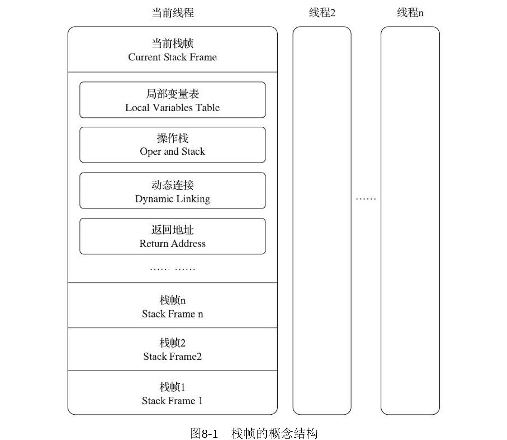

既然前面提到了Java虚拟机的数据类型，在此对它们再简单介绍一下。一个变量槽可以存放一个32位以内的数据类型，Java中占用不超过32位存储空间的数据类型有boolean、byte、char、short、int、float、 reference和returnAddress这8种类型。前面6种不需要多加解释，读者可以按照Java语言中对应数据类型的概念去理解它们（仅是这样理解而已，Java语言和Java虚拟机中的基本数据类型是存在本质差别的），而第7种reference类型表示对一个对象实例的引用，《Java虚拟机规范》既没有说明它的长度，也没有明确指出这种引用应有怎样的结构。但是一般来说，虚拟机实现至少都应当能通过这个引用做到两件事情，一是从根据引用直接或间接地查找到对象在Java堆中的数据存放的起始地址或索引，二是根据引用直接或间接地查找到对象所属数据类型在方法区中的存储的类型信息，否则将无法实现《Java语言规范》中定义的语法约定。第8种returnAddress类型目前已经很少见了，它是为字节码指令jsr、jsr_w和ret服务的，指向了一条字节码指令的地址，某些很古老的 Java虚拟机曾经使用这几条指令来实现异常处理时的跳转，但现在也已经全部改为采用异常表来代替了。

对于64位的数据类型，Java虚拟机会以高位对齐的方式为其分配两个连续的变量槽空间。Java语言中明确的64位的数据类型只有long和 double两种。这里把long和double数据类型分割存储的做法与“long和 double的非原子性协定”中允许把一次long和double数据类型读写分割为两次32位读写的做法有些类似，读者阅读到本书关于Java内存模型的内容时可以进行对比。不过，由于局部变量表是建立在线程堆栈中的，属于线程私有的数据，无论读写两个连续的变量槽是否为原子操作，都不会引起数据竞争和线程安全问题。

Java虚拟机通过索引定位的方式使用局部变量表，索引值的范围是从0开始至局部变量表最大的变量槽数量。如果访问的是32位数据类型 的变量，索引N就代表了使用第N个变量槽，如果访问的是64位数据类型的变量，则说明会同时使用第N和N+1两个变量槽。对于两个相邻的共同存放一个64位数据的两个变量槽，虚拟机不允许采用任何方式单独访问其中的某一个，《Java虚拟机规范》中明确要求了如果遇到进行这种操作的字节码序列，虚拟机就应该在类加载的校验阶段中抛出异常。

当一个方法被调用时，Java虚拟机会使用局部变量表来完成参数值到参数变量列表的传递过程，即实参到形参的传递。如果执行的是实例 方法（没有被static修饰的方法），那局部变量表中第0位索引的变量槽默认是用于传递方法所属对象实例的引用，在方法中可以通过关键 字“this”来访问到这个隐含的参数。其余参数则按照参数表顺序排列，占用从1开始的局部变量槽，参数表分配完毕后，再根据方法体内部定义的变量顺序和作用域分配其余的变量槽。

**栈帧中的局部变量表中的槽位是可以重用的，如果一个局部变量过了其作用域，那么在其作用域之后申明的新的局部变量就很有可能复用过期局部变量的槽位，从而达到节省资源的目的**

为了尽可能节省栈帧耗用的内存空间，局部变量表中的变量槽是可以重用的，方法体中定义的变量，其作用域并不一定会覆盖整个方法体，如果当前字节码PC计数器的值已经超出了某个变量的作用域，那这个变量对应的变量槽就可以交给其他变量来重用。不过，这样的设计除了节省栈帧空间以外，还会伴随有少量额外的副作用，例如在某些情况下变量槽的复用会直接影响到系统的垃圾收集行为，请看代码清单81、代码清单8-2和代码清单8-3的3个演示。 

代码清单8-1　局部变量表槽复用对垃圾收集的影响之一
```java
public static void main(String[] args)() {    
    byte[] placeholder = new byte[64 * 1024 * 1024];    
    System.gc(); 
}
```

代码清单8-1中的代码很简单，向内存填充了64MB的数据，然后通知虚拟机进行垃圾收集。我们在虚拟机运行参数中加上“-verbose：gc”来看看垃圾收集的过程，发现在System.gc()运行后并没有回收掉这64MB的内存，下面是运行的结果：
```shell
[GC 66846K->65824K(125632K), 0.0032678 secs] 
[Full GC 65824K->65746K(125632K), 0.0064131 secs]
```

代码清单8-1的代码没有回收掉placeholder所占的内存是能说得过去，因为在执行System.gc()时，变量placeholder还处于作用域之内，虚拟机自然不敢回收掉placeholder的内存。那我们把代码修改一下，变成代码清单8-2的样子。

代码清单8-2　局部变量表Slot复用对垃圾收集的影响之二
```java
public static void main(String[] args)() {    
    {        
        byte[] placeholder = new byte[64 * 1024 * 1024];    
    }    
    System.gc(); 
}
```

加入了花括号之后，placeholder的作用域被限制在花括号以内，从代码逻辑上讲，在执行System.gc()的时候，placeholder已经不可能再被访问了，但执行这段程序，会发现运行结果如下，还是有64MB的内存没有被回收掉，这又是为什么呢？
```shell
[GC 66846K->65888K(125632K), 0.0009397 secs] 
[Full GC 65888K->65746K(125632K), 0.0051574 secs]
```

在解释为什么之前，我们先对这段代码进行第二次修改，在调用System.gc()之前加入一行“int a=0；”，变成代码清单8-3的样子。

代码清单8-3　局部变量表Slot复用对垃圾收集的影响之三
```java
public static void main(String[] args)() {    
    {        
        byte[] placeholder = new byte[64 * 1024 * 1024];    
    }    
    int a = 0;    
    System.gc(); 
}
```

这个修改看起来很莫名其妙，但运行一下程序，却发现这次内存真的被正确回收了：
```shell
[GC 66401K->65778K(125632K), 0.0035471 secs] 
[Full GC 65778K->218K(125632K), 0.0140596 secs]
```

代码清单8-1至8-3中，placeholder能否被回收的根本原因就是：局部变量表中的变量槽是否还存有关于placeholder数组对象的引用。第一次修改中，代码虽然已经离开了placeholder的作用域，但在此之后，再没有发生过任何对局部变量表的读写操作，placeholder原本所占用的变量槽还没有被其他变量所复用，所以作为GC Roots一部分的局部变量表仍然保持着对它的关联。这种关联没有被及时打断，绝大部分情况下影响都很轻微。**但如果遇到一个方法，其后面的代码有一些耗时很长的操作，而前面又定义了占用了大量内存但实际上已经不会再使用的变量，手动将其设置为null值（用来代替那句int a=0，把变量对应的局部变量槽清空）便不见得是一个绝对无意义的操作，这种操作可以作为一种在极特殊情形（对象占用内存大、此方法的栈帧长时间不能被回收、方法调用次数达不到即时编译器的编译条件）下的“奇技”来使用。**Java语言的一本非常著名的书籍《Practical Java》中将把“不使用的对象应手动赋值为null”作为一条推荐的编码规则（笔者并不认同这条规则），但是并没有解释具体原因，很长时间里都有读者对这条规则感到疑惑。

虽然代码清单8-1至8-3的示例说明了赋null操作在某些极端情况下确实是有用的，但笔者的观点是不应当对赋null值操作有什么特别的依 赖，更没有必要把它当作一个普遍的编码规则来推广。原因有两点，从编码角度讲，以恰当的变量作用域来控制变量回收时间才是最优雅的解决方法，如代码清单8-3那样的场景除了做实验外几乎毫无用处。更关键的是，从执行角度来讲，使用赋null操作来优化内存回收是建立在对字节码执行引擎概念模型的理解之上的，在第6章介绍完字节码之后， 笔者在末尾还撰写了一个小结“公有设计、私有实现”（6.5节）来强调概念模型与实际执行过程是外部看起来等效，内部看上去则可以完全不同。当虚拟机使用解释器执行时，通常与概念模型还会比较接近，但经过即时编译器施加了各种编译优化措施以后，两者的差异就会非常大，只保证程序执行的结果与概念一致。**在实际情况中，即时编译才是虚拟机执行代码的主要方式，赋null值的操作在经过即时编译优化后几乎是一定会被当作无效操作消除掉的，这时候将变量设置为null就是毫无意义的行为。字节码被即时编译为本地代码后，对GC Roots的枚举也与解释执行时期有显著差别，以前面的例子来看，经过第一次修改的代码清单8-2在经过即时编译后，System.gc()执行时就可以正确地回收内存，根本无须写成代码清单8-3的样子。**

关于局部变量表，还有一点可能会对实际开发产生影响，就是局部变量不像前面介绍的类变量那样存在“准备阶段”。通过第7章的学习，我们已经知道类的字段变量有两次赋初始值的过程，一次在准备阶段，赋予系统初始值；另外一次在初始化阶段，赋予程序员定义的初始值。因此即使在初始化阶段程序员没有为类变量赋值也没有关系，类变量仍然具有一个确定的初始值，不会产生歧义。但局部变量就不一样了，如果一个局部变量定义了但没有赋初始值，那它是完全不能使用的。所以不要认为Java中任何情况下都存在诸如整型变量默认为0、布尔型变量默认为false等这样的默认值规则。如代码清单8-4所示，这段代码在Java中其实并不能运行（但是在其他语言，譬如C和C++中类似的代码是可以运行的），所幸编译器能在编译期间就检查到并提示出这一点，即便编译能通过或者手动生成字节码的方式制造出下面代码的效果，字节码校验的时候也会被虚拟机发现而导致类加载失败。

#### 操作数栈

操作数栈（Operand Stack）也常被称为操作栈，它是一个后入先出 （Last In First Out，LIFO）栈。同局部变量表一样，操作数栈的最大深度也在编译的时候被写入到Code属性的max_stacks数据项之中。操作数栈的每一个元素都可以是包括long和double在内的任意Java数据类型。32位数据类型所占的栈容量为1，64位数据类型所占的栈容量为2。 Javac编译器的数据流分析工作保证了在方法执行的任何时候，操作数栈的深度都不会超过在max_stacks数据项中设定的最大值。

当一个方法刚刚开始执行的时候，这个方法的操作数栈是空的，在方法的执行过程中，会有各种字节码指令往操作数栈中写入和提取内容，也就是出栈和入栈操作。譬如在做算术运算的时候是通过将运算涉及的操作数栈压入栈顶后调用运算指令来进行的，又譬如在调用其他方法的时候是通过操作数栈来进行方法参数的传递。举个例子，例如整数加法的字节码指令iadd，这条指令在运行的时候要求操作数栈中最接近栈顶的两个元素已经存入了两个int型的数值，当执行这个指令时，会把这两个int值出栈并相加，然后将相加的结果重新入栈。

操作数栈中元素的数据类型必须与字节码指令的序列严格匹配，在编译程序代码的时候，编译器必须要严格保证这一点，在类校验阶段的数据流分析中还要再次验证这一点。再以上面的iadd指令为例，这个指令只能用于整型数的加法，它在执行时，最接近栈顶的两个元素的数据类型必须为int型，不能出现一个long和一个float使用iadd命令相加的情况。

另外在概念模型中，两个不同栈帧作为不同方法的虚拟机栈的元素，是完全相互独立的。但是在大多虚拟机的实现里都会进行一些优化处理，令两个栈帧出现一部分重叠。让下面栈帧的部分操作数栈与上面栈帧的部分局部变量表重叠在一起，这样做不仅节约了一些空间，更重要的是在进行方法调用时就可以直接共用一部分数据，无须进行额外的参数复制传递了，重叠的过程如图8-2所示。

Java虚拟机的解释执行引擎被称为“基于栈的执行引擎”，里面的“栈”就是操作数栈。后文会对基于栈的代码执行过程进行更详细的讲解，介绍它与更常见的基于寄存器的执行引擎有哪些差别。

#### 动态连接

每个栈帧都包含一个指向运行时常量池中该栈帧所属方法的引用，持有这个引用是为了支持方法调用过程中的动态连接（Dynamic Linking）。通过第6章的讲解，我们知道Class文件的常量池中存有大量的符号引用，字节码中的方法调用指令就以常量池里指向方法的符号引用作为参数。这些符号引用一部分会在类加载阶段或者第一次使用的时候就被转化为直接引用，这种转化被称为静态解析。另外一部分将在每一次运行期间都转化为直接引用，这部分就称为动态连接。关于这两个转化过程的具体过程，将在8.3节中再详细讲解。 

#### 方法返回地址

当一个方法开始执行后，只有两种方式退出这个方法。第一种方式是执行引擎遇到任意一个方法返回的字节码指令，这时候可能会有返回 值传递给上层的方法调用者（调用当前方法的方法称为调用者或者主调方法），方法是否有返回值以及返回值的类型将根据遇到何种方法返回指令来决定，这种退出方法的方式称为“正常调用完成”（Normal Method Invocation Completion）。

另外一种退出方式是在方法执行的过程中遇到了异常，并且这个异常没有在方法体内得到妥善处理。无论是Java虚拟机内部产生的异常，还是代码中使用athrow字节码指令产生的异常，只要在本方法的异常表中没有搜索到匹配的异常处理器，就会导致方法退出，这种退出方法的方式称为“异常调用完成（Abrupt Method Invocation Completion）”。**一个方法使用异常完成出口的方式退出，是不会给它的上层调用者提供任何返回值的。**

无论采用何种退出方式，在方法退出之后，都必须返回到最初方法被调用时的位置，程序才能继续执行，方法返回时可能需要在栈帧中保存一些信息，用来帮助恢复它的上层主调方法的执行状态。一般来说，方法正常退出时，主调方法的PC计数器的值就可以作为返回地址，栈帧中很可能会保存这个计数器值。而方法异常退出时，返回地址是要通过异常处理器表来确定的，栈帧中就一般不会保存这部分信息。

方法退出的过程实际上等同于把当前栈帧出栈，因此退出时可能执行的操作有：恢复上层方法的局部变量表和操作数栈，把返回值（如果有的话）压入调用者栈帧的操作数栈中，调整PC计数器的值以指向方法调用指令后面的一条指令等。笔者这里写的“可能”是由于这是基于概念模型的讨论，只有具体到某一款Java虚拟机实现，会执行哪些操作才能确定下来。

#### 附加信息

《Java虚拟机规范》允许虚拟机实现增加一些规范里没有描述的信息到栈帧之中，例如与调试、性能收集相关的信息，这部分信息完全取 决于具体的虚拟机实现，这里不再详述。在讨论概念时，一般会把动态连接、方法返回地址与其他附加信息全部归为一类，称为栈帧信息。

### 8.3　方法调用

方法调用并不等同于方法中的代码被执行，方法调用阶段唯一的任务就是确定被调用方法的版本（即调用哪一个方法），暂时还未涉及方法内部的具体运行过程。在程序运行时，进行方法调用是最普遍、最频繁的操作之一，但第7章中已经讲过，Class文件的编译过程中不包含传统程序语言编译的连接步骤，一切方法调用在Class文件里面存储的都只是符号引用，而不是方法在实际运行时内存布局中的入口地址（也就是之前说的直接引用）。这个特性给Java带来了更强大的动态扩展能力，但也使得Java方法调用过程变得相对复杂，某些调用需要在类加载期间，甚至到运行期间才能确定目标方法的直接引用。

#### 解析

承接前面关于方法调用的话题，所有方法调用的目标方法在Class文件里面都是一个常量池中的符号引用，在类加载的解析阶段，会将其中的一部分符号引用转化为直接引用，这种解析能够成立的前提是：方法在程序真正运行之前就有一个可确定的调用版本，并且这个方法的调用版本在运行期是不可改变的。换句话说，调用目标在程序代码写好、编译器进行编译那一刻就已经确定下来。这类方法的调用被称为解析（Resolution）。

**在Java语言中符合“编译期可知，运行期不可变”这个要求的方法，主要有静态方法和私有方法两大类**，前者与类型直接关联，后者在外部 不可被访问，这两种方法各自的特点决定了它们都不可能通过继承或别的方式重写出其他版本，因此它们都适合在类加载阶段进行解析。

调用不同类型的方法，字节码指令集里设计了不同的指令。在Java虚拟机支持以下5条方法调用字节码指令，分别是：

- invokestatic。用于调用静态方法。 
- invokespecial。用于调用实例构造器<init>()方法、私有方法和父类中的方法。
- invokevirtual。用于调用所有的虚方法。
- invokeinterface。用于调用接口方法，会在运行时再确定一个实现该接口的对象。
- invokedynamic。先在运行时动态解析出调用点限定符所引用的方法，然后再执行该方法。前面4条调用指令，分派逻辑都固化在Java虚拟机内部，而invokedynamic指令的分派逻辑是由用户设定的引导方法来决定的。

**只要能被invokestatic和invokespecial指令调用的方法，都可以在解析阶段中确定唯一的调用版本，Java语言里符合这个条件的方法共有静态方法、私有方法、实例构造器、父类方法4种，再加上被final修饰的方法（尽管它使用invokevirtual指令调用），这5种方法调用会在类加载的时候就可以把符号引用解析为该方法的直接引用**。这些方法统称为“非虚方法”（Non-Virtual Method），与之相反，其他方法就被称为“虚方法”（Virtual Method）。

代码清单8-5演示了一种常见的解析调用的例子，该样例中，静态方法sayHello()只可能属于类型StaticResolution，没有任何途径可以覆盖或隐藏这个方法。

代码清单8-5　方法静态解析演示
```java
/** 
 * 方法静态解析演示 
 * 
 * @author zzm 
 */ 
public class StaticResolution {
    public static void sayHello() {        
        System.out.println("hello world");    
    }
    public static void main(String[] args) {        
        StaticResolution.sayHello();    
    }
}
```

使用javap命令查看这段程序对应的字节码，会发现的确是通过invokestatic命令来调用sayHello()方法，而且其调用的方法版本已经在编 译时就明确以常量池项的形式固化在字节码指令的参数之中（代码里的31号常量池项）：
```java
javap -verbose StaticResolution 
public static void main(java.lang.String[]);    
	Code:        
		Stack=0, Locals=1, Args_size=1        
    	0:   invokestatic    #31; //Method sayHello:()V        
		3:   return    
    LineNumberTable:        
		line 15: 0        
    	line 16: 3
```

Java中的非虚方法除了使用invokestatic、invokespecial调用的方法之外还有一种，就是被final修饰的实例方法。虽然由于历史设计的原因，final方法是使用invokevirtual指令来调用的，但是因为它也无法被覆盖，没有其他版本的可能，所以也无须对方法接收者进行多态选择，又或者说多态选择的结果肯定是唯一的。在《Java语言规范》中明确定义了被final修饰的方法是一种非虚方法。

解析调用一定是个静态的过程，在编译期间就完全确定，在类加载的解析阶段就会把涉及的符号引用全部转变为明确的直接引用，不必延 迟到运行期再去完成。而另一种主要的方法调用形式：分派（Dispatch）调用则要复杂许多，它可能是静态的也可能是动态的，按照分派依据的宗量数可分为单分派和多分派。这两类分派方式两两组合就构成了静态单分派、静态多分派、动态单分派、动态多分派4种分派组合情况，下面我们来看看虚拟机中的方法分派是如何进行的。

#### 分派

众所周知，Java是一门面向对象的程序语言，因为Java具备面向对象的3个基本特征：继承、封装和多态。本节讲解的分派调用过程将会 揭示多态性特征的一些最基本的体现，如“重载”和“重写”在Java虚拟机之中是如何实现的，这里的实现当然不是语法上该如何写，我们关心的依然是虚拟机如何确定正确的目标方法。

**1.静态分派** 

在开始讲解静态分派前，笔者先声明一点，“分派”（Dispatch） 这个词本身就具有动态性，一般不应用在静态语境之中，这部分原本在英文原版的《Java虚拟机规范》和《Java语言规范》里的说法都是“Method Overload Resolution”，即应该归入8.2节的“解析”里去讲解， 但部分其他外文资料和国内翻译的许多中文资料都将这种行为称为“静态分派”，所以笔者在此特别说明一下，以免读者阅读英文资料时遇到 这两种说法产生疑惑。

为了解释静态分派和重载（Overload），笔者准备了一段经常出现在面试题中的程序代码，读者不妨先看一遍，想一下程序的输出结果是什么。后面的话题将围绕这个类的方法来编写重载代码，以分析虚拟机和编译器确定方法版本的过程。程序如代码清单8-6所示。

代码清单8-6　方法静态分派演示
```java
package org.fenixsoft.polymorphic;
/** 
 * 方法静态分派演示 
 * @author zzm 
 */ 
public class StaticDispatch {
    static abstract class Human {    }
    static class Man extends Human {    }
    static class Woman extends Human {    }
    public void sayHello(Human guy) {        
        System.out.println("hello,guy!");    
    }
    public void sayHello(Man guy) {        
        System.out.println("hello,gentleman!");    
    }
    public void sayHello(Woman guy) {        
        System.out.println("hello,lady!");    
    }
    public static void main(String[] args) {        
        Human man = new Man();        
        Human woman = new Woman();        
        StaticDispatch sr = new StaticDispatch();        
        sr.sayHello(man);        
        sr.sayHello(woman);    
    } 
}
```

运行结果：

```shell
hello,guy! 
hello,guy!
```

代码清单8-6中的代码实际上是在考验阅读者对重载的理解程度，相信对Java稍有经验的程序员看完程序后都能得出正确的运行结果，但 为什么虚拟机会选择执行参数类型为Human的重载版本呢？在解决这个问题之前，我们先通过如下代码来定义两个关键概念：
```java
Human man = new Man();
```

我们把上面代码中的“Human”称为变量的“静态类型”（Static Type），或者叫“外观类型”（Apparent Type），后面的“Man”则被称为变量的“实际类型”（Actual Type）或者叫“运行时类型”（Runtime Type）。静态类型和实际类型在程序中都可能会发生变化，区别是静态类型的变化仅仅在使用时发生，变量本身的静态类型不会被改变，并且最终的静态类型是在编译期可知的；而实际类型变化的结果在运行期才 可确定，编译器在编译程序的时候并不知道一个对象的实际类型是什么。笔者猜想上面这段话读者大概会不太好理解，那不妨通过一段实际例子来解释，譬如有下面的代码：
```java
// 实际类型变化 
Human human = (new Random()).nextBoolean() ? new Man() : new Woman();
// 静态类型变化 
sr.sayHello((Man) human) 
sr.sayHello((Woman) human)
```

对象human的实际类型是可变的，编译期间它完全是个“薛定谔的人”，到底是Man还是Woman，必须等到程序运行到这行的时候才能确定。而human的静态类型是Human，也可以在使用时（如sayHello()方法中的强制转型）临时改变这个类型，但这个改变仍是在编译期是可知的，两次sayHello()方法的调用，在编译期完全可以明确转型的是Man还是Woman。

解释清楚了静态类型与实际类型的概念，我们就把话题再转回到代码清单8-6的样例代码中。main()里面的两次sayHello()方法调用，在方法接收者已经确定是对象“sr”的前提下，使用哪个重载版本，就完全取决于传入参数的数量和数据类型。**代码中故意定义了两个静态类型相同，而实际类型不同的变量，但虚拟机（或者准确地说是编译器）在重载时是通过参数的静态类型而不是实际类型作为判定依据的**。由于静态类型在编译期可知，所以在编译阶段，Javac编译器就根据参数的静态类型决定了会使用哪个重载版本，因此选择了sayHello(Human)作为调用目标，并把这个方法的符号引用写到main()方法里的两条invokevirtual指令的参数中。

所有依赖静态类型来决定方法执行版本的分派动作，都称为静态分派。静态分派的最典型应用表现就是方法重载。静态分派发生在编译阶 段，因此确定静态分派的动作实际上不是由虚拟机来执行的，这点也是为何一些资料选择把它归入“解析”而不是“分派”的原因。

需要注意Javac编译器虽然能确定出方法的重载版本，但在很多情况下这个重载版本并不是“唯一”的，往往只能确定一个“相对更合适的”版本。这种模糊的结论在由0和1构成的计算机世界中算是个比较稀罕的事件，产生这种模糊结论的主要原因是字面量天生的模糊性，它不 需要定义，所以字面量就没有显式的静态类型，它的静态类型只能通过语言、语法的规则去理解和推断。代码清单8-7演示了何谓“更加合适的”版本。

代码清单8-7　重载方法匹配优先级
```java
package org.fenixsoft.polymorphic;
public class Overload {
    public static void sayHello(Object arg) {        
        System.out.println("hello Object");    
    }
    public static void sayHello(int arg) {        
        System.out.println("hello int");    
    }
    public static void sayHello(long arg) {        
        System.out.println("hello long");    
    }
    public static void sayHello(Character arg) {        
        System.out.println("hello Character");    
    }
    public static void sayHello(char arg) {        
        System.out.println("hello char");    
    }
    public static void sayHello(char... arg) {        
        System.out.println("hello char ...");    
    }
    public static void sayHello(Serializable arg) {        
        System.out.println("hello Serializable");    
    }
    public static void main(String[] args) {        
        sayHello('a');    
    } 
}
```
上面的代码运行后会输出：
```shell
hello char
```

这很好理解，'a'是一个char类型的数据，自然会寻找参数类型为char的重载方法，如果注释掉sayHello(char arg)方法，那输出会变为：

```shell
hello int
```

这时发生了一次自动类型转换，'a'除了可以代表一个字符串，还可 以代表数字97（字符'a'的Unicode数值为十进制数字97），因此参数类型为int的重载也是合适的。我们继续注释掉sayHello(int arg)方法，那输出会变为：

```shell
hello long
```

这时发生了两次自动类型转换，'a'转型为整数97之后，进一步转型为长整数97L，匹配了参数类型为long的重载。笔者在代码中没有写其 他的类型如float、double等的重载，不过实际上自动转型还能继续发生多次，按照char>int>long>float>double的顺序转型进行匹配，但不会匹配到byte和short类型的重载，因为char到byte或short的转型是不安全的。我们继续注释掉sayHello(long arg)方法，那输出会变为：

```shell
hello Character
```

这时发生了一次自动装箱，'a'被包装为它的封装类型java.lang.Character，所以匹配到了参数类型为Character的重载，继续注释掉sayHello(Character arg)方法，那输出会变为：

```shell
hello Serializable
```

这个输出可能会让人摸不着头脑，一个字符或数字与序列化有什么关系？出现hello Serializable，是因为java.lang.Serializable是 java.lang.Character类实现的一个接口，当自动装箱之后发现还是找不到装箱类，但是找到了装箱类所实现的接口类型，所以紧接着又发生一次自动转型。char可以转型成int，但是Character是绝对不会转型为Integer的，它只能安全地转型为它实现的接口或父类。Character还实现了另外一个接口java.lang.Comparable<Character>，如果同时出现两个参数分别为Serializable和Comparable<Character>的重载方法，那它们在此时的优先级是一样的。编译器无法确定要自动转型为哪种类型，会提示“类型模糊”（Type Ambiguous），并拒绝编译。程序必须在调用时显式地指定字面量的静态类型，如：sayHello((Comparable<Character>)'a')，才能编译通过。但是如果读者愿意花费一点时间，绕过Javac编译器，自己去构造出表达相同语义的字节码，将会发现这是能够通过Java虚拟机的类加载校验，而且能够被Java虚拟机正常执行的，但是会选择Serializable还是Comparable<Character>的重载方法则并不能事先确定，这是《Java虚拟机规范》所允许的，在第7章介绍接口方法解析过程时曾经提到过。

下面继续注释掉sayHello(Serializable arg)方法，输出会变为：

```shell
hello Object
```

这时是char装箱后转型为父类了，如果有多个父类，那将在继承关系中从下往上开始搜索，越接上层的优先级越低。即使方法调用传入的 参数值为null时，这个规则仍然适用。我们把sayHello(Object arg)也注释掉，输出将会变为：

```shell
hello char ...
```

7个重载方法已经被注释得只剩1个了，可见变长参数的重载优先级是最低的，这时候字符'a'被当作了一个char[]数组的元素。笔者使用的是char类型的变长参数，读者在验证时还可以选择int类型、Character类型、Object类型等的变长参数重载来把上面的过程重新折腾一遍。但是要注意的是，有一些在单个参数中能成立的自动转型，如char转型为int，在变长参数中是不成立的。

代码清单8-7演示了编译期间选择静态分派目标的过程，这个过程也是Java语言实现方法重载的本质。演示所用的这段程序无疑是属于很极端的例子，除了用作面试题为难求职者之外，在实际工作中几乎不可能存在任何有价值的用途，笔者拿来做演示仅仅是用于讲解重载时目标方法选择的过程，对绝大多数下进行这样极端的重载都可算作真正的“关于茴香豆的茴有几种写法的研究”。无论对重载的认识有多么深刻，一个合格的程序员都不应该在实际应用中写这种晦涩的重载代码。

另外还有一点读者可能比较容易混淆：笔者讲述的解析与分派这两者之间的关系并不是二选一的排他关系，它们是在不同层次上去筛选、确定目标方法的过程。例如前面说过静态方法会在编译期确定、在类加载期就进行解析，而静态方法显然也是可以拥有重载版本的，选择重载版本的过程也是通过静态分派完成的。

**2.动态分派**

了解了静态分派，我们接下来看一下Java语言里动态分派的实现过程，它与Java语言多态性的另外一个重要体现——重写（Override）有着很密切的关联。我们还是用前面的Man和Woman一起sayHello的例子来讲解动态分派，请看代码清单8-8中所示的代码。

代码清单8-8　方法动态分派演示

```java
package org.fenixsoft.polymorphic;
/** 
 * 方法动态分派演示 
 * @author zzm 
 */ 
public class DynamicDispatch {
    static abstract class Human {        
        protected abstract void sayHello();    
    }
    static class Man extends Human {        
        @Override        
        protected void sayHello() {            
            System.out.println("man say hello");        
        }    
    }
    static class Woman extends Human {        
        @Override        
        protected void sayHello() {            
            System.out.println("woman say hello");        
        }    
    }
    public static void main(String[] args) {        
        Human man = new Man();        
        Human woman = new Woman();        
        man.sayHello();        
        woman.sayHello();        
        man = new Woman();        
        man.sayHello();    
    } 
}
```

运行结果：

```shell
man say hello 
woman say hello 
woman say hello
```

这个运行结果相信不会出乎任何人的意料，对于习惯了面向对象思维的Java程序员们会觉得这是完全理所当然的结论。我们现在的问题还 是和前面的一样，Java虚拟机是如何判断应该调用哪个方法的？

显然这里选择调用的方法版本是不可能再根据静态类型来决定的， 因为静态类型同样都是Human的两个变量man和woman在调用sayHello() 方法时产生了不同的行为，甚至变量man在两次调用中还执行了两个不同的方法。导致这个现象的原因很明显，是因为这两个变量的实际类型不同，Java虚拟机是如何根据实际类型来分派方法执行版本的呢？我们使用javap命令输出这段代码的字节码，尝试从中寻找答案，输出结果如代码清单8-9所示。

代码清单8-9　main()方法的字节码

```java
public static void main(java.lang.String[]);    
Code:        
Stack=2, Locals=3, Args_size=1         
    0:   new     #16; //class org/fenixsoft/polymorphic/DynamicDispatch$Man         
	3:   dup         
    4:   invokespecial   #18; //Method org/fenixsoft/polymorphic/Dynamic Dispatch$Man."<init>":()V         	   
    7:   astore_1         
    8:   new     #19; //class org/fenixsoft/polymorphic/DynamicDispatch$Woman        
   11:  dup        
   12:  invokespecial   #21; //Method org/fenixsoft/polymorphic/DynamicDispatch$Woman."<init>":()V           
   15:  astore_2        
   16:  aload_1        
   17:  invokevirtual   #22; //Method org/fenixsoft/polymorphic/Dynamic Dispatch$Human.sayHello:()V        
   20:  aload_2        
   21:  invokevirtual   #22; //Method org/fenixsoft/polymorphic/Dynamic Dispatch$Human.sayHello:()V        
   24:  new     #19; //class org/fenixsoft/polymorphic/DynamicDispatch$Woman        
   27:  dup        
   28:  invokespecial   #21; //Method org/fenixsoft/polymorphic/DynamicDispatch$Woman."<init>":()V        
   31:  astore_1        
   32:  aload_1        
   33:  invokevirtual   #22; //Method org/fenixsoft/polymorphic/Dynamic Dispatch$Human.sayHello:()V        
   36:  return
```

0～15行的字节码是准备动作，作用是建立man和woman的内存空间、调用Man和Woman类型的实例构造器，将这两个实例的引用存放在第1、2个局部变量表的变量槽中，这些动作实际对应了Java源码中的这两行：

```java
Human man = new Man(); 
Human woman = new Woman();
```

接下来的16～21行是关键部分，16和20行的aload指令分别把刚刚创建的两个对象的引用压到栈顶，这两个对象是将要执行的sayHello()方法的所有者，称为接收者（Receiver）；17和21行是方法调用指令，这两条调用指令单从字节码角度来看，无论是指令（都是invokevirtual）还是参数（都是常量池中第22项的常量，注释显示了这个常量是Human.sayHello()的符号引用）都完全一样，但是这两句指令最终执行的目标方法并不相同。那看来解决问题的关键还必须从invokevirtual指令本身入手，要弄清楚它是如何确定调用方法版本、如何实现多态查找来着手分析才行。根据《Java虚拟机规范》，invokevirtual指令的运行时解析过程大致分为以下几步：

1. 找到操作数栈顶的第一个元素所指向的对象的实际类型，记作C。
2. 如果在类型C中找到与常量中的描述符和简单名称都相符的方法，则进行访问权限校验，如果通过则返回这个方法的直接引用，查找 过程结束；不通过则返回java.lang.IllegalAccessError异常。
3. 否则，按照继承关系从下往上依次对C的各个父类进行第二步的搜索和验证过程。
4. 如果始终没有找到合适的方法，则抛出java.lang.AbstractMethodError异常。

**正是因为invokevirtual指令执行的第一步就是在运行期确定接收者的实际类型，所以两次调用中的invokevirtual指令并不是把常量池中方法的符号引用解析到直接引用上就结束了，还会根据方法接收者的实际类型来选择方法版本，这个过程就是Java语言中方法重写的本质。我们把这种在运行期根据实际类型确定方法执行版本的分派过程称为动态分派。**

既然这种多态性的根源在于虚方法调用指令invokevirtual的执行逻辑，那自然我们得出的结论就只会对方法有效，对字段是无效的，因为字段不使用这条指令。事实上，在Java里面只有虚方法存在，字段永远不可能是虚的，换句话说，字段永远不参与多态，哪个类的方法访问某个名字的字段时，该名字指的就是这个类能看到的那个字段。当子类声明了与父类同名的字段时，虽然在子类的内存中两个字段都会存在，但是子类的字段会遮蔽父类的同名字段。为了加深理解，笔者又编撰了一份“劣质面试题式”的代码片段，请阅读代码清单8-10，思考运行后会输出什么结果。

```java
package org.fenixsoft.polymorphic;
/** 
 * 字段不参与多态 
 * @author zzm 
 */ 
public class FieldHasNoPolymorphic {
    static class Father {        
        public int money = 1;
        public Father() {            
            money = 2;            
            showMeTheMoney();        
        }
        public void showMeTheMoney() {            
            System.out.println("I am Father, i have $" + money);        
        }    
    }
    static class Son extends Father {        
        public int money = 3;
        public Son() {            
            money = 4;            
            showMeTheMoney();        
        }
        public void showMeTheMoney() {            
            System.out.println("I am Son,  i have $" + money);        
        }    
    }
    public static void main(String[] args) {        
        Father gay = new Son();        
        System.out.println("This gay has $" + gay.money);    
    } 
}
```

运行后输出结果为：

```shell
I am Son, i have $0
I am Son, i have $4
This gay has $2
```

输出两句都是“I am Son”，这是因为Son类在创建的时候，首先隐式调用了Father的构造函数，而Father构造函数中对showMeTheMoney()的调用是一次虚方法调用，实际执行的版本是Son::showMeTheMoney()方法，所以输出的是“I am Son”，这点经过前面的分析相信读者是没有疑问的了。而这时候虽然父类的money字段已经被初始化成2了，但Son::showMeTheMoney()方法中访问的却是子类的money字段，这时候结果自然还是0，因为它要到子类的构造函数执行时才会被初始化。main()的最后一句通过静态类型访问到了父类中的money，输出了2。

**3.单分派与多分派**

方法的接收者与方法的参数统称为方法的宗量，这个定义最早应该来源于著名的《Java与模式》一书。根据分派基于多少种宗量，可以将 分派划分为单分派和多分派两种。单分派是根据一个宗量对目标方法进行选择，多分派则是根据多于一个宗量对目标方法进行选择。

单分派和多分派的定义读起来拗口，从字面上看也比较抽象，不过对照着实例看并不难理解其含义，代码清单8-11中举了一个Father和Son一起来做出“一个艰难的决定”的例子。

代码清单8-11　单分派和多分派

```java
/** 
 * 单分派、多分派演示 
 * @author zzm 
 */ 
public class Dispatch {
    static class QQ {}    
    static class _360 {}
    
    public static class Father {        
        public void hardChoice(QQ arg) {            
            System.out.println("father choose qq");        
        }
        public void hardChoice(_360 arg) {            
            System.out.println("father choose 360");        
        }    
    }
    
    public static class Son extends Father {        
        public void hardChoice(QQ arg) {
            System.out.println("son choose qq");        
        }
        public void hardChoice(_360 arg) {            
            System.out.println("son choose 360");        
        }    
    }
    
    public static void main(String[] args) {        
        Father father = new Father();        
        Father son = new Son();        
        father.hardChoice(new _360());        
        son.hardChoice(new QQ());    
    } 
}
```

运行结果：

```shell
father choose 360 
son choose qq
```

在main()里调用了两次hardChoice()方法，这两次hardChoice()方法的选择结果在程序输出中已经显示得很清楚了。我们关注的首先是编译阶段中编译器的选择过程，也就是静态分派的过程。这时候选择目标方法的依据有两点：一是静态类型是Father还是Son，二是方法参数是QQ还是360。这次选择结果的最终产物是产生了两条invokevirtual指令，两条指令的参数分别为常量池中指向Father::hardChoice(360)及 Father::hardChoice(QQ)方法的符号引用。因为是根据两个宗量进行选择，**所以Java语言的静态分派属于多分派类型。**

再看看运行阶段中虚拟机的选择，也就是动态分派的过程。在执行“son.hardChoice(new QQ())”这行代码时，更准确地说，是在执行这行 代码所对应的invokevirtual指令时，由于编译期已经决定目标方法的签名必须为hardChoice(QQ)，虚拟机此时不会关心传递过来的参数“QQ”到底是“腾讯QQ”还是“奇瑞QQ”，因为这时候参数的静态类型、实际类型都对方法的选择不会构成任何影响，唯一可以影响虚拟机选择的因素只有该方法的接受者的实际类型是Father还是Son。因为只有一个宗量作为选择依据，**所以Java语言的动态分派属于单分派类型。**

根据上述论证的结果，我们可以总结一句：如今（直至本书编写的 Java 12和预览版的Java 13）的**Java语言是一门静态多分派、动态单分派的语言**。强调“如今的Java语言”是因为这个结论未必会恒久不变，C#在3.0及之前的版本与Java一样是动态单分派语言，但在C#4.0中引入了dynamic类型后，就可以很方便地实现动态多分派。JDK 10时Java语法中新出现var关键字，但请读者切勿将其与C#中的dynamic类型混淆，事实上Java的var与C#的var才是相对应的特性，它们与dynamic有着本质的区别：var是在编译时根据声明语句中赋值符右侧的表达式类型来静态地推断类型，这本质是一种语法糖；而dynamic在编译时完全不关心类型是什么，等到运行的时候再进行类型判断。Java语言中与C#的dynamic类型功能相对接近（只是接近，并不是对等的）的应该是在JDK 9时通过JEP 276引入的jdk.dynalink模块，使用jdk.dynalink可以实现在表达式中使用动态类型，Javac编译器会将这些动态类型的操作翻译为invokedynamic指令的调用点。

按照目前Java语言的发展趋势，它并没有直接变为动态语言的迹象，而是通过内置动态语言（如JavaScript）执行引擎、加强与其他Java 虚拟机上动态语言交互能力的方式来间接地满足动态性的需求。但是作为多种语言共同执行平台的Java虚拟机层面上则不是如此，早在JDK 7中实现的JSR-292里面就已经开始提供对动态语言的方法调用支持了，JDK 7中新增的invokedynamic指令也成为最复杂的一条方法调用的字节码指令，稍后笔者将在本章中专门开一节来讲解这个与Java调用动态语言密切相关的特性。

**4.虚拟机动态分派的实现**

前面介绍的分派过程，作为对Java虚拟机概念模型的解释基本上已经足够了，它已经解决了虚拟机在分派中“会做什么”这个问题。但如果问Java虚拟机“具体如何做到”的，答案则可能因各种虚拟机的实现不同会有些差别。

动态分派是执行非常频繁的动作，而且动态分派的方法版本选择过程需要运行时在接收者类型的方法元数据中搜索合适的目标方法，因此，Java虚拟机实现基于执行性能的考虑，真正运行时一般不会如此频繁地去反复搜索类型元数据。面对这种情况，一种基础而且常见的优化手段是为类型在方法区中建立一个虚方法表（Virtual Method Table，也称为vtable，与此对应的，在invokeinterface执行时也会用到接口方法表——Interface Method Table，简称itable），使用虚方法表索引来代替元数据查找以提高性能。我们先看看代码清单8-11所对应的虚方法表结构示例，如图8-3所示。

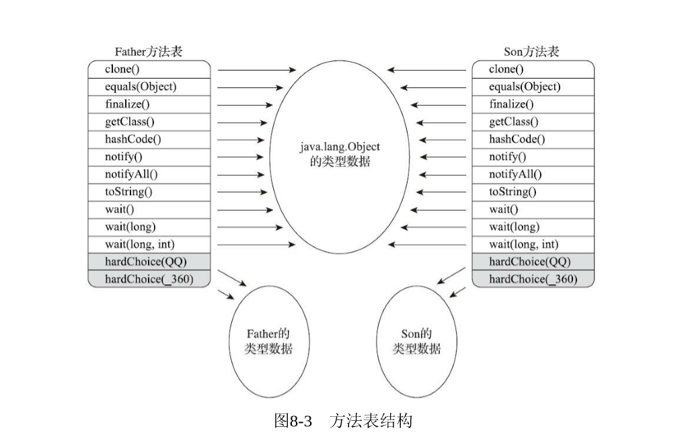

虚方法表中存放着各个方法的实际入口地址。如果某个方法在子类中没有被重写，那子类的虚方法表中的地址入口和父类相同方法的地址入口是一致的，都指向父类的实现入口。如果子类中重写了这个方法，子类虚方法表中的地址也会被替换为指向子类实现版本的入口地址。在图8-3中，Son重写了来自Father的全部方法，因此Son的方法表没有指向Father类型数据的箭头。但是Son和Father都没有重写来自Object的方法，所以它们的方法表中所有从Object继承来的方法都指向了Object的数据类型。

为了程序实现方便，具有相同签名的方法，在父类、子类的虚方法表中都应当具有一样的索引序号，这样当类型变换时，仅需要变更查找 的虚方法表，就可以从不同的虚方法表中按索引转换出所需的入口地址。虚方法表一般在类加载的连接阶段进行初始化，准备了类的变量初始值后，虚拟机会把该类的虚方法表也一同初始化完毕。

上文中笔者提到了查虚方法表是分派调用的一种优化手段，由于Java对象里面的方法默认（即不使用final修饰）就是虚方法，虚拟机除了使用虚方法表之外，为了进一步提高性能，还会使用类型继承关系分析（Class Hierarchy Analysis，CHA）、守护内联（Guarded Inlining）、内联缓存（Inline Cache）等多种非稳定的激进优化来争取更大的性能空间，关于这几种优化技术的原理和运作过程，读者可以参考第11章中的相关内容。

### 8.4　动态类型语言支持

Java虚拟机的字节码指令集的数量自从Sun公司的第一款Java虚拟机问世至今，二十余年间只新增过一条指令，它就是随着JDK 7的发布的 字节码首位新成员——invokedynamic指令。这条新增加的指令是JDK 7 的项目目标：实现动态类型语言（Dynamically Typed Language）支持而进行的改进之一，也是为JDK 8里可以顺利实现Lambda表达式而做的技术储备。在本节中，我们将详细了解动态语言支持这项特性出现的前因后果和它的意义与价值。

#### 动态类型语言

在介绍Java虚拟机的动态类型语言支持之前，我们要先弄明白动态类型语言是什么？它与Java语言、Java虚拟机有什么关系？了解Java虚拟机提供动态类型语言支持的技术背景，对理解这个语言特性是非常有必要的。

何谓动态类型语言？动态类型语言的关键特征是它的类型检查的主体过程是在运行期而不是编译期进行的，满足这个特征的语言有很多，常用的包括：APL、Clojure、Erlang、Groovy、JavaScript、Lisp、 Lua、PHP、Prolog、Python、Ruby、Smalltalk、Tcl，等等。那相对地，在编译期就进行类型检查过程的语言，譬如C++和Java等就是最常用的静态类型语言。

了解了动态类型和静态类型语言的区别后，也许读者的下一个问题就是动态、静态类型语言两者谁更好，或者谁更加先进呢？这种比较不会有确切答案，它们都有自己的优点，选择哪种语言是需要权衡的事情。静态类型语言能够在编译期确定变量类型，最显著的好处是编译器可以提供全面严谨的类型检查，这样与数据类型相关的潜在问题就能在编码时被及时发现，利于稳定性及让项目容易达到更大的规模。而动态类型语言在运行期才确定类型，这可以为开发人员提供极大的灵活性，某些在静态类型语言中要花大量臃肿代码来实现的功能，由动态类型语言去做可能会很清晰简洁，清晰简洁通常也就意味着开发效率的提升。

#### Java与动态类型

现在我们回到本节的主题，来看看Java语言、Java虚拟机与动态类型语言之间有什么关系。Java虚拟机毫无疑问是Java语言的运行平台， 但它的使命并不限于此，早在1997年出版的《Java虚拟机规范》第1版中就规划了这样一个愿景：“在未来，我们会对Java虚拟机进行适当的扩展，以便更好地支持其他语言运行于Java虚拟机之上。”而目前确实已经有许多动态类型语言运行于Java虚拟机之上了，如Clojure、 Groovy、Jython和JRuby等，能够在同一个虚拟机之上可以实现静态类型语言的严谨与动态类型语言的灵活，这的确是一件很美妙的事情。

但遗憾的是Java虚拟机层面对动态类型语言的支持一直都还有所欠缺，主要表现在方法调用方面：JDK 7以前的字节码指令集中，4条方法 调用指令（invokevirtual、invokespecial、invokestatic、invokeinterface）的第一个参数都是被调用的方法的符号引用（CONSTANT_Methodref_info或者CONSTANT_InterfaceMethodref_info 常量），前面已经提到过，方法的符号引用在编译时产生，而动态类型语言只有在运行期才能确定方法的接收者。这样，在Java虚拟机上实现的动态类型语言就不得不使用“曲线救国”的方式（如编译时留个占位符类型，运行时动态生成字节码实现具体类型到占位符类型的适配）来实现，但这样势必会让动态类型语言实现的复杂度增加，也会带来额外的性能和内存开销。内存开销是很显而易见的，方法调用产生的那一大堆的动态类就摆在那里。而其中最严重的性能瓶颈是在于动态类型方法调用时，由于无法确定调用对象的静态类型，而导致的方法内联无法有效进行。在第11章里我们会讲到方法内联的重要性，它是其他优化措施的基础，也可以说是最重要的一项优化。尽管也可以想一些办法（譬如调用点缓存）尽量缓解支持动态语言而导致的性能下降，但这种改善毕竟不是本质的。

#### java.lang.invoke包

JDK 7时新加入的java.lang.invoke包是JSR 292的一个重要组成部分，这个包的主要目的是在之前单纯依靠符号引用来确定调用的目标方法这条路之外，提供一种新的动态确定目标方法的机制，称为“方法句柄”（Method Handle）。这个表达听起来也不好懂？那不妨把方法句柄与C/C++中的函数指针（Function Pointer），或者C#里面的委派（Delegate）互相类比一下来理解。举个例子，如果我们要实现一个带谓词（谓词就是由外部传入的排序时比较大小的动作）的排序函数，在 C/C++中的常用做法是把谓词定义为函数，用函数指针来把谓词传递到排序方法，像这样：

```c++
void sort(int list[], const int size, int (*compare)(int, int))
```

但在Java语言中做不到这一点，没有办法单独把一个函数作为参数 进行传递。普遍的做法是设计一个带有compare()方法的Comparator接 口，以实现这个接口的对象作为参数，例如Java类库中的 Collections::sort()方法就是这样定义的：

```java
void sort(List list, Comparator c)
```

不过，在拥有方法句柄之后，Java语言也可以拥有类似于函数指针或者委托的方法别名这样的工具了。代码清单8-12演示了方法句柄的基 本用法，无论obj是何种类型（临时定义的ClassA抑或是实现PrintStream接口的实现类System.out），都可以正确调用到println()方法。

代码清单8-12　方法句柄演示

```java
import static java.lang.invoke.MethodHandles.lookup;
import java.lang.invoke.MethodHandle; 
import java.lang.invoke.MethodType;
/** 
 * JSR 292 MethodHandle基础用法演示 
 * @author zzm
 */ 
public class MethodHandleTest {
    static class ClassA {        
        public void println(String s) {            
            System.out.println(s);        
        }    
    }
    public static void main(String[] args) throws Throwable {        
        Object obj = System.currentTimeMillis() % 2 == 0 ? System.out : new ClassA();        
        // 无论obj最终是哪个实现类，下面这句都能正确调用到println方法。        
        getPrintlnMH(obj).invokeExact("icyfenix");    
    }
    private static MethodHandle getPrintlnMH(Object reveiver) throws Throwable {        
        // MethodType：代表“方法类型”，包含了方法的返回值（methodType()的第一个参数）和           具体参数（methodType()第二个及以后的参数）。        
        MethodType mt = MethodType.methodType(void.class, String.class);        
        // lookup()方法来自于MethodHandles.lookup，这句的作用是在指定类中查找符合给定的方法           名称、方法类型，并且符合调用权限的方法句柄。        
        // 因为这里调用的是一个虚方法，按照Java语言的规则，方法第一个参数是隐式的，代表该方法的接            收者，也即this指向的对象，这个参数以前是放在参数列表中进行传递，现在提供了bindTo()           方法来完成这件事情。        
        return lookup().findVirtual(reveiver.getClass(), "println", mt).bindTo(reveiver);    
    } 
}
```

方法getPrintlnMH()中实际上是模拟了invokevirtual指令的执行过程，只不过它的分派逻辑并非固化在Class文件的字节码上，而是通过一 个由用户设计的Java方法来实现。而这个方法本身的返回值 （MethodHandle对象），可以视为对最终调用方法的一个“引用”。以此为基础，有了MethodHandle就可以写出类似于C/C++那样的函数声明了：
```java
void sort(List list, MethodHandle compare)
```

从上面的例子看来，使用MethodHandle并没有多少困难，不过看完它的用法之后，读者大概就会产生疑问，相同的事情，用反射不是早就可以实现了吗？

确实，仅站在Java语言的角度看，MethodHandle在使用方法和效果上与Reflection有众多相似之处。不过，它们也有以下这些区别：

- **Reflection和MethodHandle机制本质上都是在模拟方法调用，但是Reflection是在模拟Java代码层次的方法调用，而MethodHandle是在模拟字节码层次的方法调用。**在MethodHandles.Lookup上的3个方法findStatic()、findVirtual()、findSpecial()正是为了对应于invokestatic、invokevirtual（以及invokeinterface）和invokespecial这几条字节码指令的执行权限校验行为，而这些底层细节在使用Reflection API时是不需要关心的。
- Reflection中的java.lang.reflect.Method对象远比MethodHandle机制中的java.lang.invoke.MethodHandle对象所包含的信息来得多。前者是方法在Java端的全面映像，包含了方法的签名、描述符以及方法属性表中各种属性的Java端表示方式，还包含执行权限等的运行期信息。而后者仅包含执行该方法的相关信息。用开发人员通俗的话来讲，Reflection是重量级，而MethodHandle是轻量级。
- 由于MethodHandle是对字节码的方法指令调用的模拟，那理论上虚拟机在这方面做的各种优化（如方法内联），在MethodHandle上也应当可以采用类似思路去支持（但目前实现还在继续完善中），而通过反射去调用方法则几乎不可能直接去实施各类调用点优化措施。

MethodHandle与Reflection除了上面列举的区别外，最关键的一点还在于去掉前面讨论施加的前提“仅站在Java语言的角度看”之后： Reflection API的设计目标是只为Java语言服务的，而MethodHandle则设计为可服务于所有Java虚拟机之上的语言，其中也包括了Java语言而已，而且Java在这里并不是主角。

#### invokedynamic指令 

8.4节一开始就提到了JDK 7为了更好地支持动态类型语言，引入了第五条方法调用的字节码指令invokedynamic，之后却一直没有再提起它，甚至把代码清单8-12使用MethodHandle的示例代码反编译后也完全找不到invokedynamic的身影，这实在与invokedynamic作为Java诞生以来唯一一条新加入的字节码指令的地位不相符，那么invokedynamic到底有什么应用呢？

某种意义上可以说invokedynamic指令与MethodHandle机制的作用是一样的，都是为了解决原有4条“invoke*”指令方法分派规则完全固化在虚拟机之中的问题，把如何查找目标方法的决定权从虚拟机转嫁到具体用户代码之中，让用户（广义的用户，包含其他程序语言的设计者）有更高的自由度。而且，它们两者的思路也是可类比的，都是为了达成同一个目的，只是一个用上层代码和API来实现，另一个用字节码和Class中其他属性、常量来完成。因此，如果前面MethodHandle的例子看懂了，相信读者理解invokedynamic指令并不困难。

每一处含有invokedynamic指令的位置都被称作“动态调用点（Dynamically-Computed Call Site）”，这条指令的第一个参数不再是代表方法符号引用的CONSTANT_Methodref_info常量，而是变为JDK 7时新加入的CONSTANT_InvokeDynamic_info常量，从这个新常量中可以得到3项信息：引导方法（Bootstrap Method，该方法存放在新增的BootstrapMethods属性中）、方法类型（MethodType）和名称。引导方法是有固定的参数，并且返回值规定是java.lang.invoke.CallSite对象，这个对象代表了真正要执行的目标方法调用。根据CONSTANT_InvokeDynamic_info常量中提供的信息，虚拟机可以找到并且执行引导方法，从而获得一个CallSite对象，最终调用到要执行的目标方法上。

#### 实战：掌控方法分派规则

invokedynamic指令与此前4条传统的“invoke*”指令的最大区别就是它的分派逻辑不是由虚拟机决定的，而是由程序员决定。在介绍Java虚拟机动态语言支持的最后一节中，笔者希望通过一个简单例子（如代码 清单8-15所示），帮助读者理解程序员可以掌控方法分派规则之后，我们能做什么以前无法做到的事情。

代码清单8-15　方法调用问题

```java
class GrandFather {    
    void thinking() {        
        System.out.println("i am grandfather");    
    } 
}
class Father extends GrandFather {    
    void thinking() {        
        System.out.println("i am father");    
    } 
}
class Son extends Father {    
    void thinking() {       
        // 请读者在这里填入适当的代码（不能修改其他地方的代码）       
        // 实现调用祖父类的thinking()方法，打印"i am grandfather"   
    } 
}
```

在Java程序中，可以通过“super”关键字很方便地调用到父类中的方法，但如果要访问祖类的方法呢？读者在往下阅读本书提供的解决方案之前，不妨自己思考一下，在JDK 7之前有没有办法解决这个问题。

在拥有invokedynamic和java.lang.invoke包之前，使用纯粹的Java语言很难处理这个问题（使用ASM等字节码工具直接生成字节码当然还是可以处理的，但这已经是在字节码而不是Java语言层面来解决问题了），原因是在Son类的thinking()方法中根本无法获取到一个实际类型是GrandFather的对象引用，而invokevirtual指令的分派逻辑是固定的， 只能按照方法接收者的实际类型进行分派，这个逻辑完全固化在虚拟机中，程序员无法改变。如果是JDK 7 Update 9之前，使用代码清单8-16 中的程序就可以直接解决该问题。

代码清单8-16　使用MethodHandle来解决问题

```java
import static java.lang.invoke.MethodHandles.lookup;
import java.lang.invoke.MethodHandle; 
import java.lang.invoke.MethodType;
class Test {

    class GrandFather {    
        void thinking() {        
            System.out.println("i am grandfather");    
        } 
    }

    class Father extends GrandFather {    
        void thinking() {        
            System.out.println("i am father");    
        } 
    }

    class Son extends Father {    
        void thinking() {        
            try {                
                MethodType mt = MethodType.methodType(void.class);                
                MethodHandle mh = lookup().findSpecial(GrandFather.class, "thinking", mt, getClass());                
                mh.invoke(this);            
            } catch (Throwable e) {            
            }        
        }    
    }
    
    public static void main(String[] args) {        
        (new Test().new Son()).thinking();    
    } 
}
```

使用JDK 7 Update 9之前的HotSpot虚拟机运行，会得到如下运行结果：

```shell
i am grandfather
```

但是这个逻辑在JDK 7 Update 9之后被视作一个潜在的安全性缺陷修正了，原因是必须保证findSpecial()查找方法版本时受到的访问约束 （譬如对访问控制的限制、对参数类型的限制）应与使用invokespecial指令一样，两者必须保持精确对等，包括在上面的场景中它只能访问到其直接父类中的方法版本。所以在JDK 7 Update 10修正之后，运行以上代码只能得到如下结果：
```shell
i am father
```

由于本书的第2版是基于早期版本的JDK 7撰写的，所以印刷之后才发布的JDK更新就很难再及时地同步修正了，这导致不少读者重现这段 代码的运行结果时产生了疑惑，也收到了很多热心读者的邮件，在此一并感谢。

那在新版本的JDK中，上面的问题是否能够得到解决呢？答案是可以的，如果读者去查看MethodHandles.Lookup类的代码，将会发现需要进行哪些访问保护，在该API实现时是预留了后门的。访问保护是通过一个allowedModes的参数来控制，而且这个参数可以被设置成“TRUSTED”来绕开所有的保护措施。尽管这个参数只是在Java类库本身使用，没有开放给外部设置，但我们通过反射可以轻易打破这种限制。由此，我们可以把代码清单8-16中子类的thinking()方法修改为如下所示的代码来解决问题：
```java
void thinking() {    
    try {        
        MethodType mt = MethodType.methodType(void.class);        
        Field lookupImpl = MethodHandles.Lookup.class.getDeclaredField("IMPL_LOOKUP");        
        lookupImpl.setAccessible(true);        
        MethodHandle mh = ((MethodHandles.Lookup) lookupImpl.get(null)).findSpecial(GrandFather.class,"thinking", mt, GrandFather.class);        
        mh.invoke(this);    
    } catch (Throwable e) {    } 
}
```

运行以上代码，在目前所有JDK版本中均可获得如下结果：
```shell
i am grandfather
```

### 8.5　基于栈的字节码解释执行引擎

关于Java虚拟机是如何调用方法、进行版本选择的内容已经全部讲解完毕，从本节开始，我们来探讨虚拟机是如何执行方法里面的字节码 指令的。概述中曾提到过，许多Java虚拟机的执行引擎在执行Java代码的时候都有解释执行（通过解释器执行）和编译执行（通过即时编译器产生本地代码执行）两种选择，在本节中，我们将会分析在概念模型下的Java虚拟机解释执行字节码时，其执行引擎是如何工作的。笔者在本章多次强调了“概念模型”，是因为实际的虚拟机实现，譬如HotSpot的模板解释器工作的时候，并不是按照下文中的动作一板一眼地进行机械式计算，而是动态产生每条字节码对应的汇编代码来运行，这与概念模型中执行过程的差异很大，但是结果却能保证是一致的。

#### 解释执行

Java语言经常被人们定位为“解释执行”的语言，在Java初生的JDK 1.0时代，这种定义还算是比较准确的，但当主流的虚拟机中都包含了即时编译器后，Class文件中的代码到底会被解释执行还是编译执行，就成了只有虚拟机自己才能准确判断的事。再后来，Java也发展出可以直接生成本地代码的编译器（如Jaotc、GCJ，Excelsior JET），而 C/C++语言也出现了通过解释器执行的版本（如CINT），这时候再笼统地说“解释执行”，对于整个Java语言来说就成了几乎是没有意义的概念，只有确定了谈论对象是某种具体的Java实现版本和执行引擎运行模式时，谈解释执行还是编译执行才会比较合理确切。

无论是解释还是编译，也无论是物理机还是虚拟机，对于应用程序，机器都不可能如人那样阅读、理解，然后获得执行能力。大部分的 程序代码转换成物理机的目标代码或虚拟机能执行的指令集之前，都需要经过图8-4中的各个步骤。如果读者对大学编译原理的相关课程还有印象的话，很容易就会发现图8-4中下面的那条分支，就是传统编译原理中程序代码到目标机器代码的生成过程；而中间的那条分支，自然就是解释执行的过程。

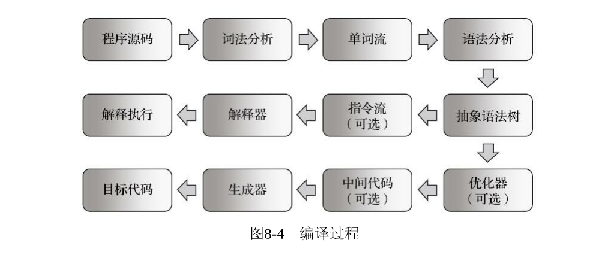

如今，基于物理机、Java虚拟机，或者是非Java的其他高级语言虚拟机（HLLVM）的代码执行过程，大体上都会遵循这种符合现代经典编译原理的思路，在执行前先对程序源码进行词法分析和语法分析处理，把源码转化为抽象语法树（Abstract Syntax Tree，AST）。对于一 门具体语言的实现来说，词法、语法分析以至后面的优化器和目标代码生成器都可以选择独立于执行引擎，形成一个完整意义的编译器去实现，这类代表是C/C++语言。也可以选择把其中一部分步骤（如生成抽象语法树之前的步骤）实现为一个半独立的编译器，这类代表是Java语言。又或者把这些步骤和执行引擎全部集中封装在一个封闭的黑匣子之中，如大多数的JavaScript执行引擎。

在Java语言中，Javac编译器完成了程序代码经过词法分析、语法分析到抽象语法树，再遍历语法树生成线性的字节码指令流的过程。因为 这一部分动作是在Java虚拟机之外进行的，而解释器在虚拟机的内部， 所以Java程序的编译就是半独立的实现。

#### 基于栈的指令集与基于寄存器的指令集

Javac编译器输出的字节码指令流，基本上是一种基于栈的指令集架构（Instruction Set Architecture，ISA），字节码指令流里面的指令大部分都是零地址指令，它们依赖操作数栈进行工作。与之相对的另外一套常用的指令集架构是基于寄存器的指令集，最典型的就是x86的二地址指令集，如果说得更通俗一些就是现在我们主流PC机中物理硬件直接支持的指令集架构，这些指令依赖寄存器进行工作。那么，基于栈的指令集与基于寄存器的指令集这两者之间有什么不同呢？

举个最简单的例子，分别使用这两种指令集去计算“1+1”的结果， 基于栈的指令集会是这样子的：
```shell
iconst_1 
iconst_1 
iadd 
istore_0
```

两条iconst_1指令连续把两个常量1压入栈后，iadd指令把栈顶的两个值出栈、相加，然后把结果放回栈顶，最后istore_0把栈顶的值放到局部变量表的第0个变量槽中。这种指令流中的指令通常都是不带参数的，使用操作数栈中的数据作为指令的运算输入，指令的运算结果也存储在操作数栈之中。而如果用基于寄存器的指令集，那程序可能会是这个样子：
```shell
mov  eax, 1 
add  eax, 1
```

mov指令把EAX寄存器的值设为1，然后add指令再把这个值加1， 结果就保存在EAX寄存器里面。这种二地址指令是x86指令集中的主流，每个指令都包含两个单独的输入参数，依赖于寄存器来访问和存储数据。

了解了基于栈的指令集与基于寄存器的指令集的区别后，读者可能会有个进一步的疑问，这两套指令集谁更好一些呢？

应该说，既然两套指令集会同时并存和发展，那肯定是各有优势的，如果有一套指令集全面优于另外一套的话，就是直接替代而不存在选择的问题了。

基于栈的指令集主要优点是可移植，因为寄存器由硬件直接提供，程序直接依赖这些硬件寄存器则不可避免地要受到硬件的约束。例如现在32位80x86体系的处理器能提供了8个32位的寄存器，而ARMv6体系的处理器（在智能手机、数码设备中相当流行的一种处理器）则提 供了30个32位的通用寄存器，其中前16个在用户模式中可以使用。如果使用栈架构的指令集，用户程序不会直接用到这些寄存器，那就可以由虚拟机实现来自行决定把一些访问最频繁的数据（程序计数器、栈顶缓存等）放到寄存器中以获取尽量好的性能，这样实现起来也更简单一些。栈架构的指令集还有一些其他的优点，如代码相对更加紧凑（字节码中每个字节就对应一条指令，而多地址指令集中还需要存放参数）、 编译器实现更加简单（不需要考虑空间分配的问题，所需空间都在栈上操作）等。

栈架构指令集的主要缺点是理论上执行速度相对来说会稍慢一些， 所有主流物理机的指令集都是寄存器架构也从侧面印证了这点。不过 这里的执行速度是要局限在解释执行的状态下，如果经过即时编译器输出成物理机上的汇编指令流，那就与虚拟机采用哪种指令集架构没有什么关系了。

在解释执行时，栈架构指令集的代码虽然紧凑，但是完成相同功能所需的指令数量一般会比寄存器架构来得更多，因为出栈、入栈操作本身就产生了相当大量的指令。更重要的是栈实现在内存中，频繁的栈访问也就意味着频繁的内存访问，相对于处理器来说，内存始终是执行速度的瓶颈。尽管虚拟机可以采取栈顶缓存的优化方法，把最常用的操作映射到寄存器中避免直接内存访问，但这也只是优化措施而不是解决本质问题的方法。**因此由于指令数量和内存访问的原因，导致了栈架构指令集的执行速度会相对慢上一点。**

#### 基于栈的解释器执行过程

关于栈架构执行引擎的必要前置知识已经全部讲解完毕了，本节笔者准备了一段Java代码，以便向读者实际展示在虚拟机里字节码是如何执行的。前面笔者曾经举过一个计算“1+1”的例子，那种小学一年级的算数题目显然太过简单了，给聪明的读者练习的题目起码……嗯，笔者准备的是四则运算加减乘除法，大概能达到三年级左右的数学水平，请看代码清单8-17。

代码清单8-17　一段简单的算术代码
```java
public int calc() {    
    int a = 100;    
    int b = 200;    
    int c = 300;    
    return (a + b) * c; 
}
```

这段代码从Java语言的角度没有任何谈论的必要，直接使用javap命 令看看它的字节码指令，如代码清单8-18所示
```java
public int calc();    
	Code:        
		Stack=2, Locals=4, Args_size=1         
            0:   bipush  100         
            2:   istore_1         
            3:   sipush  200         
            6:   istore_2         
            7:   sipush  300        
            10:  istore_3        
            11:  iload_1       
            12:  iload_2        
            13:  iadd        
            14:  iload_3        
            15:  imul        
            16:  ireturn
}
```

javap提示这段代码需要深度为2的操作数栈和4个变量槽的局部变量空间，笔者就根据这些信息画了图8-5至图8-11共7张图片，来描述代码清单8-13执行过程中的代码、操作数栈和局部变量表的变化情况。

略

再次强调上面的执行过程仅仅是一种概念模型，虚拟机最终会对执行过程做出一系列优化来提高性能，实际的运作过程并不会完全符合概念模型的描述。更确切地说，实际情况会和上面描述的概念模型差距非常大，差距产生的根本原因是虚拟机中解析器和即时编译器都会对输入的字节码进行优化，即使解释器中也不是按照字节码指令去逐条执行的。例如在HotSpot虚拟机中，就有很多以“fast_”开头的非标准字节码指令用于合并、替换输入的字节码以提升解释执行性能，即时编译器的优化手段则更是花样繁多。

不过我们从这段程序的执行中也可以看出栈结构指令集的一般运行 过程，整个运算过程的中间变量都以操作数栈的出栈、入栈为信息交换途径，符合我们在前面分析的特点。

### 8.6　本章小结

本章中，我们分析了虚拟机在执行代码时，如何找到正确的方法，如何执行方法内的字节码，以及执行代码时涉及的内存结构。在第6～8 章里面，我们针对Java程序是如何存储的、如何载入（创建）的，以及如何执行的问题，把相关知识系统地介绍了一遍，第9章我们将一起看看这些理论知识在具体开发之中的典型应用。

## 第9章　类加载及执行子系统的案例与实战

代码编译的结果从本地机器码转变为字节码，是存储格式发展的一 小步，却是编程语言发展的一大步。

### 9.1　概述

在Class文件格式与执行引擎这部分里，用户的程序能直接参与的内容并不太多，Class文件以何种格式存储，类型何时加载、如何连接，以及虚拟机如何执行字节码指令等都是由虚拟机直接控制的行为，用户程序无法对其进行改变。能通过程序进行操作的，主要是字节码生成与类加载器这两部分的功能，但仅仅在如何处理这两点上，就已经出现了许多值得欣赏和借鉴的思路，这些思路后来成为许多常用功能和程序实现的基础。在本章中，我们将看一下前面所学的知识在实际开发之中是如何应用的。

### 9.2　案例分析

在案例分析部分，笔者准备了4个例子，关于类加载器和字节码的案例各有两个。并且这两个领域的案例中又各有一个案例是大多数Java开发人员都使用过的工具或技术，另外一个案例虽然不一定每个人都使用过，但却能特别精彩地演绎出这个领域中的技术特性。希望后面的案例能引起读者的思考，并给读者的日常工作带来灵感。

#### Tomcat：正统的类加载器架构

主流的Java Web服务器，如Tomcat、Jetty、WebLogic、WebSphere或其他笔者没有列举的服务器，都实现了自己定义的类加载器，而且一般还都不止一个。因为一个功能健全的Web服务器，都要解决如下的这些问题：

- 部署在同一个服务器上的两个Web应用程序所使用的Java类库可以实现相互隔离。这是最基本的需求，两个不同的应用程序可能会依赖同一个第三方类库的不同版本，不能要求每个类库在一个服务器中只能有一份，服务器应当能够保证两个独立应用程序的类库可以互相独立使用。
- 部署在同一个服务器上的两个Web应用程序所使用的Java类库可以互相共享。这个需求与前面一点正好相反，但是也很常见，例如用户可能有10个使用Spring组织的应用程序部署在同一台服务器上，如果把10份Spring分别存放在各个应用程序的隔离目录中，将会是很大的资源浪费——这主要倒不是浪费磁盘空间的问题，而是指类库在使用时都要被加载到服务器内存，如果类库不能共享，虚拟机的方法区就会很容易出现过度膨胀的风险。
- 服务器需要尽可能地保证自身的安全不受部署的Web应用程序影响。目前，有许多主流的Java Web服务器自身也是使用Java语言来实现的。因此服务器本身也有类库依赖的问题，一般来说，基于安全考虑， 服务器所使用的类库应该与应用程序的类库互相独立。
- 支持JSP应用的Web服务器，十有八九都需要支持HotSwap功能。 我们知道JSP文件最终要被编译成Java的Class文件才能被虚拟机执行， 但JSP文件由于其纯文本存储的特性，被运行时修改的概率远大于第三方类库或程序自己的Class文件。而且ASP、PHP和JSP这些网页应用也把修改后无须重启作为一个很大的“优势”来看待，因此“主流”的Web服务器都会支持JSP生成类的热替换，当然也有“非主流”的，如运行在生产模式（Production Mode）下的WebLogic服务器默认就不会处理JSP文件的变化。

由于存在上述问题，在部署Web应用时，单独的一个ClassPath就不能满足需求了，所以各种Web服务器都不约而同地提供了好几个有着不同含义的ClassPath路径供用户存放第三方类库，这些路径一般会 以“lib”或“classes”命名。被放置到不同路径中的类库，具备不同的访问范围和服务对象，通常每一个目录都会有一个相应的自定义类加载器去加载放置在里面的Java类库。现在笔者就以Tomcat服务器为例，与读者一同分析Tomcat具体是如何规划用户类库结构和类加载器的。

在Tomcat目录结构中，可以设置3组目录（/common/*、/server/* 和/shared/*，但默认不一定是开放的，可能只有/lib/*目录存在）用于存 放Java类库，另外还应该加上Web应用程序自身的“/WEB-INF/*”目录， 一共4组。把Java类库放置在这4组目录中，每一组都有独立的含义，分别是：

- 放置在/common目录中。类库可被Tomcat和所有的Web应用程序共同使用。
- 放置在/server目录中。类库可被Tomcat使用，对所有的Web应用程序都不可见。
- 放置在/shared目录中。类库可被所有的Web应用程序共同使用，但对Tomcat自己不可见。
- 放置在/WebApp/WEB-INF目录中。类库仅仅可以被该Web应用程序使用，对Tomcat和其他Web应用程序都不可见。

**以上目录在较新版本的Tomcat中并不存在，例如在Tomcat 8中仅存在一个lib目录，这个目录就是指/common目录，/server和/shared目录被省略了，但是确是可以配置，见$CATALINA_HOME/conf/catalina.properties中的配置：common.loader，server.loader，shared.loader三个配置。**

为了支持这套目录结构，并对目录里面的类库进行加载和隔离，Tomcat自定义了多个类加载器，这些类加载器按照经典的双亲委派模型来实现，其关系如图9-1所示。

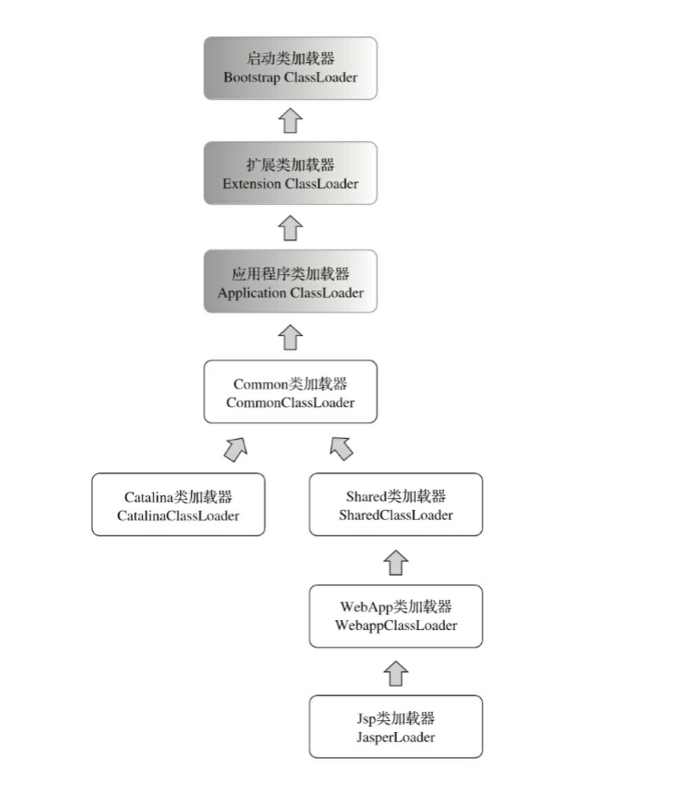

灰色背景的3个类加载器是JDK（以JDK 9之前经典的三层类加载器为例）默认提供的类加载器，这3个加载器的作用在第7章中已经介绍过了。而Common类加载器、Catalina类加载器（也称为Server类加载器）、Shared类加载器和Webapp类加载器则是Tomcat自己定义的类加载器，它们分别加载/common/*、/server/*、/shared/*和/WebApp/WEBINF/*中的Java类库。其中WebApp类加载器和JSP类加载器通常还会存在多个实例，每一个Web应用程序对应一个WebApp类加载器，每一个 JSP文件对应一个JasperLoader类加载器。

从图9-1的委派关系中可以看出，Common类加载器能加载的类都可以被Catalina类加载器和Shared类加载器使用，而Catalina类加载器和Shared类加载器自己能加载的类则与对方相互隔离。WebApp类加载器可以使用Shared类加载器加载到的类，但各个WebApp类加载器实例之间相互隔离。而JasperLoader的加载范围仅仅是这个JSP文件所编译出来的那一个Class文件，它存在的目的就是为了被丢弃：当服务器检测到 JSP文件被修改时，会替换掉目前的JasperLoader的实例，并通过再建立一个新的JSP类加载器来实现JSP文件的HotSwap功能。

本例中的类加载结构在Tomcat 6以前是它默认的类加载器结构，在Tomcat 6及之后的版本简化了默认的目录结构，只有指定了tomcat/conf/catalina.properties配置文件的server.loader和share.loader项后才会真正建立Catalina类加载器和Shared类加载器的实例，否则会用到这两个类加载器的地方都会用Common类加载器的实例代替，而默认的配置文件中并没有设置这两个loader项，所以Tomcat 6之后也顺理成章地把/common、/server和/shared这3个目录默认合并到一起变成1个/lib目 录，这个目录里的类库相当于以前/common目录中类库的作用，是Tomcat的开发团队为了简化大多数的部署场景所做的一项易用性改进。如果默认设置不能满足需要，用户可以通过修改配置文件指定server.loader和share.loader的方式重新启用原来完整的加载器架构。

Tomcat加载器的实现清晰易懂，并且采用了官方推荐的“正统”的使用类加载器的方式。如果读者阅读完上面的案例后，毫不费力就能完全 理解Tomcat设计团队这样布置加载器架构的用意，这就说明你已经大致掌握了类加载器“主流”的使用方式，那么笔者不妨再提一个问题让各位读者思考一下：前面曾经提到过一个场景，如果有10个Web应用程序都是用Spring来进行组织和管理的话，可以把Spring放到Common或Shared目录下让这些程序共享。Spring要对用户程序的类进行管理，自然要能访问到用户程序的类，而用户的程序显然是放在/WebApp/WEB-INF目录中的。那么被Common类加载器或Shared类加载器加载的Spring如何访问并不在其加载范围内的用户程序呢？如果你读懂了本书第7章的相关内容，相信回答这个问题一定会毫不费力。

#### OSGi：灵活的类加载器架构

曾经在Java程序社区中流传着这么一个观点：“学习Java EE规范，推荐去看JBoss源码；学习类加载器的知识，就推荐去看OSGi源码。”尽 管“Java EE规范”和“类加载器的知识”并不是一个对等的概念，不过，既然这个观点能在部分程序员群体中流传开来，也从侧面说明了OSGi对类加载器的运用确实有其独到之处。

OSGi（Open Service Gateway Initiative）是OSGi联盟（OSGi Alliance）制订的一个基于Java语言的动态模块化规范（在JDK 9引入的 JPMS是静态的模块系统），这个规范最初由IBM、爱立信等公司联合发起，在早期连Sun公司都有参与。目的是使服务提供商通过住宅网关为各种家用智能设备提供服务，后来这个规范在Java的其他技术领域也有相当不错的发展，现在已经成为Java世界中“事实上”的动态模块化标准，并且已经有了Equinox、Felix等成熟的实现。根据OSGi联盟主页上的宣传资料，OSGi现在的重点应用在智慧城市、智慧农业、工业4.0这些地方，而在传统Java程序员中最知名的应用案例可能就数Eclipse IDE了，另外，还有许多大型的软件平台和中间件服务器都基于或声明将会基于OSGi规范来实现，如IBM Jazz平台、GlassFish服务器、JBoss OSGi 等。

OSGi中的每个模块（称为Bundle）与普通的Java类库区别并不太大，两者一般都以JAR格式进行封装，并且内部存储的都是Java的Package和Class。但是一个Bundle可以声明它所依赖的Package（通过Import-Package描述），也可以声明它允许导出发布的Package（通过 Export-Package描述）。在OSGi里面，Bundle之间的依赖关系从传统的上层模块依赖底层模块转变为平级模块之间的依赖，而且类库的可见性能得到非常精确的控制，一个模块里只有被Export过的Package才可能被外界访问，其他的Package和Class将会被隐藏起来。

以上这些静态的模块化特性原本也是OSGi的核心需求之一，不过它和后来出现的Java的模块化系统互相重叠了，所以OSGi现在着重向动 态模块化系统的方向发展。在今天，通常引入OSGi的主要理由是基于OSGi架构的程序很可能（只是很可能，并不是一定会，需要考虑热插拔后的内存管理、上下文状态维护问题等复杂因素）会实现模块级的热插拔功能，当程序升级更新或调试除错时，可以只停用、重新安装然后启用程序的其中一部分，这对大型软件、企业级程序开发来说是一个非常有诱惑力的特性，譬如Eclipse中安装、卸载、更新插件而不需要重启动，就使用到了这种特性。

OSGi之所以能有上述诱人的特点，必须要归功于它灵活的类加载器架构。OSGi的Bundle类加载器之间只有规则，没有固定的委派关系。 例如，某个Bundle声明了一个它依赖的Package，如果有其他Bundle声明了发布这个Package后，那么所有对这个Package的类加载动作都会委派给发布它的Bundle类加载器去完成。不涉及某个具体的Package时，各个Bundle加载器都是平级的关系，只有具体使用到某个Package和Class的时候，才会根据Package导入导出定义来构造Bundle间的委派和依赖。

另外，一个Bundle类加载器为其他Bundle提供服务时，会根据Export-Package列表严格控制访问范围。如果一个类存在于Bundle的类 库中但是没有被Export，那么这个Bundle的类加载器能找到这个类，但不会提供给其他Bundle使用，而且OSGi框架也不会把其他Bundle的类加载请求分配给这个Bundle来处理。

我们可以举一个更具体些的简单例子来解释上面的规则，假设存在 Bundle A、Bundle B、Bundle C3个模块，并且这3个Bundle定义的依赖关系如下所示。

- Bundle A：声明发布了packageA，依赖了java.*的包；
- Bundle B：声明依赖了packageA和packageC，同时也依赖了java.* 的包；
- Bundle C：声明发布了packageC，依赖了packageA。

那么，这3个Bundle之间的类加载器及父类加载器之间的关系如图9-2所示。

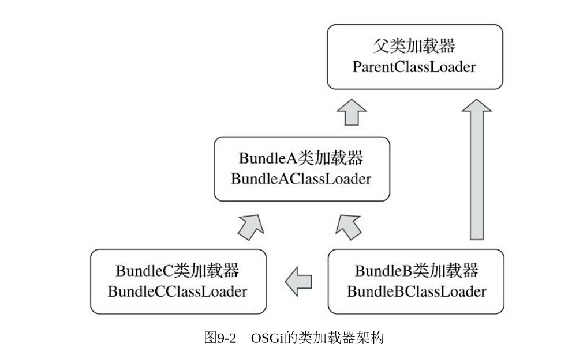

由于没有涉及具体的OSGi实现，图9-2中的类加载器都没有指明具体的加载器实现，它只是一个体现了加载器之间关系的概念模型，并且 只是体现了OSGi中最简单的加载器委派关系。一般来说，在OSGi里， 加载一个类可能发生的查找行为和委派关系会远远比图9-2中显示的复杂，类加载时可能进行的查找规则如下：

- 以java.*开头的类，委派给父类加载器加载。
- 否则，委派列表名单内的类，委派给父类加载器加载。
- 否则，Import列表中的类，委派给Export这个类的Bundle的类加载器加载。
- 否则，查找当前Bundle的Classpath，使用自己的类加载器加载。
- 否则，查找是否在自己的Fragment Bundle中，如果是则委派给Fragment Bundle的类加载器加载。
- 否则，查找Dynamic Import列表的Bundle，委派给对应Bundle的类加载器加载。
- 否则，类查找失败。

从图9-2中还可以看出，在OSGi中，加载器之间的关系不再是双亲委派模型的树形结构，而是已经进一步发展成一种更为复杂的、运行时才能确定的网状结构。这种网状的类加载器架构在带来更优秀的灵活性的同时，也可能会产生许多新的隐患。笔者曾经参与过将一个非OSGi 的大型系统向Equinox OSGi平台迁移的项目，由于项目规模和历史原因，代码模块之间的依赖关系错综复杂，勉强分离出各个模块的Bundle后，发现在高并发环境下经常出现死锁。我们很容易就找到了死锁的原因：如果出现了Bundle A依赖Bundle B的Package B，而Bundle B又依赖了Bundle A的Package A，这两个Bundle进行类加载时就有很高的概率发生死锁。具体情况是当Bundle A加载Package B的类时，首先需要锁定当前类加载器的实例对象（java.lang.ClassLoader.loadClass()是一个同步方法），然后把请求委派给Bundle B的加载器处理，但如果这时Bundle B也正好想加载Package A的类，它会先锁定自己的加载器再去请求Bundle A的加载器处理，这样两个加载器都在等待对方处理自己的请求，而对方处理完之前自己又一直处于同步锁定的状态，因此它们就互相死锁， 永远无法完成加载请求了。Equinox的Bug List中有不少关于这类问题的Bug，也提供了一个以牺牲性能为代价的解决方案——用户可以启用osgi.classloader.singleThreadLoads参数来按单线程串行化的方式强制进行类加载动作。在JDK 7时才终于出现了JDK层面的解决方案，类加载器架构进行了一次专门的升级，在ClassLoader中增加了registerAsParallelCapable方法对可并行的类加载进行注册声明，把锁的 级别从ClassLoader对象本身，降低为要加载的类名这个级别，目的是从底层避免以上这类死锁出现的可能。

总体来说，OSGi描绘了一个很美好的模块化开发的目标，而且定义了实现这个目标所需的各种服务，同时也有成熟框架对其提供实现支 持。对于单个虚拟机下的应用，从开发初期就建立在OSGi上是一个很不错的选择，这样便于约束依赖。但并非所有的应用都适合采用OSGi 作为基础架构，OSGi在提供强大功能的同时，也引入了额外而且非常高的复杂度，带来了额外的风险。

#### 字节码生成技术与动态代理的实现

“字节码生成”并不是什么高深的技术，读者在看到“字节码生成”这个标题时也先不必去想诸如Javassist、CGLib、ASM之类的字节码类 库，因为JDK里面的Javac命令就是字节码生成技术的“老祖宗”，并且Javac也是一个由Java语言写成的程序，它的代码存放在OpenJDK的 jdk.compiler\share\classes\com\sun\tools\javac目录中。要深入从Java源码到字节码编译过程，阅读Javac的源码是个很好的途径，不过Javac对于我们这个例子来说太过庞大了。在Java世界里面除了Javac和字节码类库外，使用到字节码生成的例子比比皆是，如Web服务器中的JSP编译器，编译时织入的AOP框架，还有很常用的动态代理技术，甚至在使用反射的时候虚拟机都有可能会在运行时生成字节码来提高执行速度。我们选择其中相对简单的动态代理技术来讲解字节码生成技术是如何影响程序运作的。

相信许多Java开发人员都使用过动态代理，即使没有直接使用过java.lang.reflect.Proxy或实现过java.lang.reflect.InvocationHandler接口， 应该也用过Spring来做过Bean的组织管理。如果使用过Spring，那大多数情况应该已经不知不觉地用到动态代理了，因为如果Bean是面向接口编程，那么在Spring内部都是通过动态代理的方式来对Bean进行增强的。动态代理中所说的“动态”，是针对使用Java代码实际编写了代理类的“静态”代理而言的，它的优势不在于省去了编写代理类那一点编码工作量，而是实现了可以在原始类和接口还未知的时候，就确定代理类的代理行为，当代理类与原始类脱离直接联系后，就可以很灵活地重用于不同的应用场景之中。

代码清单9-1演示了一个最简单的动态代理的用法，原始的代码逻辑是打印一句“hello world”，代理类的逻辑是在原始类方法执行前打印 一句“welcome”。我们先看一下代码，然后再分析JDK是如何做到的。
```java
public class DynamicProxyTest {
    
    interface IHello {        
        void sayHello();
    }
    static class Hello implements IHello {        
        @Override        public void sayHello() {            
            System.out.println("hello world");        
        }    
    }
    
    static class DynamicProxy implements InvocationHandler {
        Object originalObj;
        Object bind(Object originalObj) {            
            this.originalObj = originalObj;            
            return Proxy.newProxyInstance(originalObj.getClass().getClassLoader(), originalObj.getClass().getInterfaces(), this);        
        }
        @Override        
        public Object invoke(Object proxy, Method method, Object[] args) throws Throwable {            
            System.out.println("welcome");            
            return method.invoke(originalObj, args);        
        }    
    }
    
    public static void main(String[] args) {        
        IHello hello = (IHello) new DynamicProxy().bind(new Hello());        
        hello.sayHello();    
    } 
}
```

运行结果如下：
```shell
welcome 
hello world
```
在上述代码里，唯一的“黑匣子”就是Proxy::newProxyInstance()方法，除此之外再没有任何特殊之处。这个方法返回一个实现了IHello的接口，并且代理了new Hello()实例行为的对象。跟踪这个方法的源码，可以看到程序进行过验证、优化、缓存、同步、生成字节码、显式类加载等操作，前面的步骤并不是我们关注的重点，这里只分析它最后调用sun.misc.ProxyGenerator::generateProxyClass()方法来完成生成字节码的动作，这个方法会在运行时产生一个描述代理类的字节码byte[]数组。 如果想看一看这个在运行时产生的代理类中写了些什么，可以在main() 方法中加入下面这句：
```java
System.getProperties().put("sun.misc.ProxyGenerator.saveGeneratedFiles", "true");
```

加入这句代码后再次运行程序，磁盘中将会产生一个名为“$Proxy0.class”的代理类Class文件，反编译后可以看见如代码清单9-2 所示的内容：

代码清单9-2　反编译的动态代理类的代码
```java
package org.fenixsoft.bytecode;
import java.lang.reflect.InvocationHandler; 
import java.lang.reflect.Method; 
import java.lang.reflect.Proxy; 
import java.lang.reflect.UndeclaredThrowableException;
public final class $Proxy0 extends Proxy    implements DynamicProxyTest.IHello {    
    private static Method m3;    
    private static Method m1;    
    private static Method m0;    
    private static Method m2;
    public $Proxy0(InvocationHandler paramInvocationHandler)        throws    {        
        super(paramInvocationHandler);    
    }
    public final void sayHello() throws    {        
        try {            
            this.h.invoke(this, m3, null);            
            return;       
        } catch (RuntimeException localRuntimeException) {           
            throw localRuntimeException;        
        } catch (Throwable localThrowable) {            
            throw new UndeclaredThrowableException(localThrowable);        
        }    
    }
    // 此处由于版面原因，省略equals()、hashCode()、toString()3个方法的代码    // 这3个方法的内容与sayHello()非常相似。
    static    {        
        try {           
            m3 = Class.forName("org.fenixsoft.bytecode.DynamicProxyTest$IHello").getMethod("sayHello",
 new Class[0]);            
            m1 = Class.forName("java.lang.Object").getMethod("equals", new Class[] { 
                Class.forName("java.lang.Object") });            
            m0 = Class.forName("java.lang.Object").getMethod("hashCode", new Class[0]);            
            m2 = Class.forName("java.lang.Object").getMethod("toString", new Class[0]);            
            return;        
        } catch (NoSuchMethodException localNoSuchMethodException) {            
            throw new NoSuchMethodError(localNoSuchMethodException.getMessage());        
        } catch (ClassNotFoundException localClassNotFoundException) {            
            throw new NoClassDefFoundError(localClassNotFoundException.getMessage());        
        }    
    } 
}
```

这个代理类的实现代码也很简单，它为传入接口中的每一个方法，以及从java.lang.Object中继承来的equals()、hashCode()、toString()方法都生成了对应的实现，并且统一调用了InvocationHandler对象的invoke() 方法（代码中的“this.h”就是父类Proxy中保存的InvocationHandler实例变量）来实现这些方法的内容，各个方法的区别不过是传入的参数和Method对象有所不同而已，所以无论调用动态代理的哪一个方法，实际上都是在执行InvocationHandler::invoke()中的代理逻辑。

这个例子中并没有讲到generateProxyClass()方法具体是如何产生代理类“$Proxy0.class”的字节码的，大致的生成过程其实就是根据Class文件的格式规范去拼装字节码，但是在实际开发中，以字节为单位直接拼装出字节码的应用场合很少见，这种生成方式也只能产生一些高度模板化的代码。对于用户的程序代码来说，如果有要大量操作字节码的需求，还是使用封装好的字节码类库比较合适。如果读者对动态代理的字节码拼装过程确实很感兴趣，可以在OpenJDK的 java.base\share\classes\java\lang\reflect目录下找到sun.misc.ProxyGenerator的源码。

#### Backport工具：Java的时光机器

一般来说，以“做项目”为主的软件公司比较容易更新技术，在下一个项目中换一个技术框架、升级到最时髦的JDK版本，甚至把Java换成C#、Golang来开发都是有可能的。但是当公司发展壮大，技术有所积累，逐渐成为以“做产品”为主的软件公司后，自主选择技术的权利就会逐渐丧失，因为之前积累的代码和技术都是用真金白银砸出来的，一个稳健的团队也不会随意地改变底层的技术。然而在飞速发展的程序设计领域，新技术总是日新月异层出不穷，偏偏这些新技术又如鲜花之于蜜蜂一样，对程序员们散发着天然的吸引力。

在Java世界里，每一次JDK大版本的发布，都会伴随着规模不等或大或小的技术革新，而对Java程序编写习惯改变最大的，肯定是那些对Java语法做出重大改变的版本，譬如JDK 5时加入的自动装箱、泛型、动态注解、枚举、变长参数、遍历循环（foreach循环）；譬如JDK 8时加入的Lambda表达式、Stream API、接口默认方法等。事实上在没有这些语法特性的年代，Java程序也照样能写，但是现在回头看来，上述每 一种语法的改进几乎都是“必不可少”的，如同用惯了32寸液晶、4K分辨率显示器的程序员，就很难再在19寸显示器、1080P分辨率的显示器上编写代码了。但假如公司“不幸”因为要保护现有投资、维持程序结构稳定等，必须使用JDK 5或者JDK 8以前的版本呢？幸好，我们没有办法把 19寸显示器变成32寸的，但却可以跨越JDK版本之间的沟壑，把高版本JDK中编写的代码放到低版本JDK环境中去部署使用。为了解决这个问题，一种名为“Java逆向移植”的工具（Java Backporting Tools）应运而 生，Retrotranslator和Retrolambda是这类工具中的杰出代表。

Retrotranslator的作用是将JDK 5编译出来的Class文件转变为可以在JDK 1.4或1.3上部署的版本，它能很好地支持自动装箱、泛型、动态注解、枚举、变长参数、遍历循环、静态导入这些语法特性，甚至还可以支持JDK 5中新增的集合改进、并发包及对泛型、注解等的反射操作。Retrolambda的作用与Retrotranslator是类似的，目标是将JDK 8的 Lambda表达式和try-resources语法转变为可以在JDK 5、JDK 6、JDK 7 中使用的形式，同时也对接口默认方法提供了有限度的支持。

了解了Retrotranslator和Retrolambda这种逆向移植工具的作用以后，相信读者更关心的是它是怎样做到的？要想知道Backporting工具如何在旧版本JDK中模拟新版本JDK的功能，首先要搞清楚JDK升级中会提供哪些新的功能。JDK的每次升级新增的功能大致可以分为以下五类：

- 对Java类库API的代码增强。譬如JDK 1.2时代引入的java.util.Collections等一系列集合类，在JDK 5时代引入的java.util.concurrent并发包、在JDK 7时引入的java.lang.invoke包，等等。
- 在前端编译器层面做的改进。这种改进被称作语法糖，如自动装箱拆箱，实际上就是Javac编译器在程序中使用到包装对象的地方自动插入了很多Integer.valueOf()、Float.valueOf()之类的代码；变长参数在编译之后就被自动转化成了一个数组来完成参数传递；泛型的信息则在编译阶段就已经被擦除掉了（但是在元数据中还保留着），相应的地方被编译器自动插入了类型转换代码。
- 需要在字节码中进行支持的改动。如JDK 7里面新加入的语法特性——动态语言支持，就需要在虚拟机中新增一条invokedynamic字节码指令来实现相关的调用功能。不过字节码指令集一直处于相对稳定的状态，这种要在字节码层面直接进行的改动是比较少见的。
- 需要在JDK整体结构层面进行支持的改进，典型的如JDK 9时引入的Java模块化系统，它就涉及了JDK结构、Java语法、类加载和连接 过程、Java虚拟机等多个层面。
- 集中在虚拟机内部的改进。如JDK 5中实现的JSR-133规范重 新定义的Java内存模型（Java Memory Model，JMM），以及在JDK 7、 JDK 11、JDK 12中新增的G1、ZGC和Shenandoah收集器之类的改动， 这种改动对于程序员编写代码基本是透明的，只会在程序运行时产生影响。

上述的5类新功能中，逆向移植工具能比较完美地模拟了前两类， 从第3类开始就逐步深入地涉及了直接在虚拟机内部实现的改进了，这 些功能一般要么是逆向移植工具完全无能为力，要么是不能完整地或者在比较良好的运行效率上完成全部模拟。想想这也挺合理的，如果在语法糖和类库层面可以完美解决的问题，Java虚拟机设计团队也没有必要 舍近求远地改动处于JDK底层的虚拟机嘛。

在能够较好模拟的前两类功能中，第一类模拟相对更容易实现一些，如JDK 5引入的java.util.concurrent包，实际是由多线程编程的大师Doug Lea开发的一套并发包，在JDK 5出现之前就已经存在（那时候名字叫作dl.util.concurrent，引入JDK时由作者和JDK开发团队共同进行了一些改进），所以要在旧的JDK中支持这部分功能，以独立类库的方式 便可实现。Retrotranslator中就附带了一个名叫“backport-utilconcurrent.jar”的类库（由另一个名为“Backport to JSR 166”的项目所提 供）来代替JDK 5的并发包。

至于第二类JDK在编译阶段进行处理的那些改进，Retrotranslator则 是使用ASM框架直接对字节码进行处理。由于组成Class文件的字节码 指令数量并没有改变，所以无论是JDK 1.3、JDK 1.4还是JDK 5，能用 字节码表达的语义范围应该是一致的。当然，肯定不会是简单地把Class 的文件版本号从49.0改回48.0就能解决问题了，虽然字节码指令的数量 没有变化，但是元数据信息和一些语法支持的内容还是要做相应的修改。

以枚举为例，尽管在JDK 5中增加了enum关键字，但是Class文件常量池的CONSTANT_Class_info类型常量并没有发生任何语义变化，仍然 是代表一个类或接口的符号引用，没有加入枚举，也没有增加 过“CONSTANT_Enum_info”之类的“枚举符号引用”常量。所以使用 enum关键字定义常量，尽管从Java语法上看起来与使用class关键字定义 类、使用interface关键字定义接口是同一层次的，但实际上这是由Javac 编译器做出来的假象，从字节码的角度来看，枚举仅仅是一个继承于 java.lang.Enum、自动生成了values()和valueOf()方法的普通Java类而已。

Retrotranslator对枚举所做的主要处理就是把枚举类的父类 从“java.lang.Enum”替换为它运行时类库中包含的“net.sf.retrotranslator.runtime.java.lang.Enum_”，然后再在类和字段的 访问标志中抹去ACC_ENUM标志位。当然，这只是处理的总体思路，具体的实现要比上面说的复杂得多。可以想象既然两个父类实现都不一 样，values()和valueOf()的方法自然需要重写，常量池需要引入大量新的 来自父类的符号引用，这些都是实现细节。

用Retrolambda模拟JDK 8的Lambda表达式属于涉及字节码改动的第三类情况，Java为支持Lambda会用到新的invokedynamic字节码指令， 但幸好这并不是必须的，只是基于效率的考量。在JDK 8之前，Lambda 表达式就已经被其他运行在Java虚拟机的编程语言（如Scala）广泛使用了，那时候是怎么生成字节码的现在照着做就是，不使用 invokedynamic，除了牺牲一点效率外，可行性方面并没有太大的障碍。

Retrolambda的Backport过程实质上就是生成一组匿名内部类来代替 Lambda，里面会做一些优化措施，譬如采用单例来保证无状态的 Lambda表达式不会重复创建匿名类的对象。有一些Java IDE工具，如 IntelliJ IDEA和Eclipse里会包含将此过程反过来使用的功能特性，在低版本Java里把匿名内部类显示成Lambda语法的样子，实际存在磁盘上的源码还是匿名内部类形式的，只是在IDE里可以把它显示为Lambda表达 式的语法，让人阅读起来比较简洁而已。

### 9.3　实战：自己动手实现远程执行功能

略

### 9.4　本章小结

第6章至第9章介绍了Class文件格式、类加载及虚拟机执行引擎这几部分内容，这些内容是虚拟机中必不可少的组成部分，了解了虚拟机如何执行程序，才能更好地理解怎样才能写出优秀的代码。

关于虚拟机执行子系统的介绍就到此为止，通过这4章的讲解，我们描绘了一个虚拟机应该是怎样运行Class文件的概念模型的，对于具体 到某个虚拟机的实现，为了使实现简单清晰，或者为了更快的运行速度，在虚拟机内部的运作与概念模型可能会有非常大的差异，但从最终的执行结果来看应该是一致的。从第10章开始，我们将把目光从概念模型转到具体实现，去探索虚拟机在语法上和运行性能上，是如何对程序编写做出各种优化的。

# 第四部分　程序编译与代码优化

- 第10章　前端编译与优化
- 第11章　后端编译与优化

## 第10章　前端编译与优化

从计算机程序出现的第一天起，对效率的追逐就是程序员天生的坚定信仰，这个过程犹如一场没有终点、永不停歇的F1方程式竞赛，程序员是车手，技术平台则是在赛道上飞驰的赛车。

### 10.1　概述

在Java技术下谈“编译期”而没有具体上下文语境的话，其实是一句很含糊的表述，因为它可能是指一个前端编译器（叫“编译器的前端”更 准确一些）把*.java文件转变成*.class文件的过程；也可能是指Java虚拟机的即时编译器（常称JIT编译器，Just In Time Compiler）运行期把字节码转变成本地机器码的过程；还可能是指使用静态的提前编译器（常称AOT编译器，Ahead Of Time Compiler）直接把程序编译成与目标机器指令集相关的二进制代码的过程。下面笔者列举了这3类编译过程里一些比较有代表性的编译器产品：

- 前端编译器：JDK的Javac、Eclipse JDT中的增量式编译器 （ECJ）。
- 即时编译器：HotSpot虚拟机的C1、C2编译器，Graal编译器。
- 提前编译器：JDK的Jaotc、GNU Compiler for the Java（GCJ）、 Excelsior JET。

这3类过程中最符合普通程序员对Java程序编译认知的应该是第一类，本章标题中的“前端”指的也是这种由前端编译器完成的编译行为。 在本章后续的讨论里，笔者提到的全部“编译期”和“编译器”都仅限于第一类编译过程，我们会把第二、三类编译过程留到第11章中去讨论。限制了“编译期”的范围后，我们对于“优化”二字的定义也需要放宽一些， 因为Javac这类前端编译器对代码的运行效率几乎没有任何优化措施可言（在JDK 1.3之后，Javac的-O优化参数就不再有意义），哪怕是编译器真的采取了优化措施也不会产生什么实质的效果。因为Java虚拟机设计团队选择把对性能的优化全部集中到运行期的即时编译器中，这样可以让那些不是由Javac产生的Class文件（如JRuby、Groovy等语言的Class文件）也同样能享受到编译器优化措施所带来的性能红利。但是，如果把“优化”的定义放宽，把对开发阶段的优化也计算进来的话，Javac确实是做了许多针对Java语言编码过程的优化措施来降低程序员的编码复杂度、提高编码效率。相当多新生的Java语法特性，都是靠编译器的“语法糖”来实现，而不是依赖字节码或者Java虚拟机的底层改进来支持。 **我们可以这样认为，Java中即时编译器在运行期的优化过程，支撑了程序执行效率的不断提升；而前端编译器在编译期的优化过程，则是支撑着程序员的编码效率和语言使用者的幸福感的提高。**

### 10.2　Javac编译器

分析源码是了解一项技术的实现内幕最彻底的手段，Javac编译器不像HotSpot虚拟机那样使用C++语言（包含少量C语言）实现，它本身 就是一个由Java语言编写的程序，这为纯Java的程序员了解它的编译过程带来了很大的便利。

#### Javac的源码与调试

在JDK 6以前，Javac并不属于标准Java SE API的一部分，它的实现代码单独存放在tools.jar中，要在程序中使用的话就必须把这个库放到类路径上。在JDK 6发布时通过了JSR 199编译器API的提案，使得Javac编译器的实现代码晋升成为标准Java类库之一，它的源码就改为放在JDK_SRC_HOME/langtools/src/share/classes/com/sun/tools/javac中。到了JDK 9时，整个JDK所有的Java类库都采用模块化进行重构划分，Javac编译器就被挪到了jdk.compiler模块（路径为： JDK_SRC_HOME/src/jdk.compiler/share/classes/com/sun/tools/javac）里 面。虽然程序代码的内容基本没有变化，但由于本节的主题是源码解析，不可避免地会涉及大量的路径和包名，这就要选定JDK版本来讨论了，本次笔者将会以JDK 9之前的代码结构来进行讲解。

Javac编译器除了JDK自身的标准类库外，就只引用了JDK_SRC_HOME/langtools/src/share/classes/com/sun/\*里面的代码，所以我们的代码编译环境建立时基本无须处理依赖关系，相当简单便捷。以Eclipse IDE作为开发工具为例，先建立一个名为“Compiler_javac”的Java 工程，然后把JDK_SRC_HOME/langtools/src/share/classes/com/sun/*目录下的源文件全部复制到工程的源码目录中。

导入了Javac的源码后，就可以运行com.sun.tools.javac.Main的main() 方法来执行编译了，可以使用的参数与命令行中使用的Javac命令没有任何区别，编译的文件与参数在Eclipse的“Debug Configurations”面板中的“Arguments”页签中指定。

《Java虚拟机规范》中严格定义了Class文件格式的各种细节，可是对如何把Java源码编译为Class文件却描述得相当宽松。规范里尽管有专门的一章名为“Compiling for the Java Virtual Machine”，但这章也仅仅是以举例的形式来介绍怎样的Java代码应该被转换为怎样的字节码，并没有使用编译原理中常用的描述工具（如文法、生成式等）来对Java源码编译过程加以约束。这是给了Java前端编译器较大的实现灵活性，但也导致Class文件编译过程在某种程度上是与具体的JDK或编译器实现相关的，譬如在一些极端情况下，可能会出现某些代码在Javac编译器可以编译，但是ECJ编译器就不可以编译的问题（反过来也有可能，后文中将会给出一些这样的例子）。

从Javac代码的总体结构来看，编译过程大致可以分为1个准备过程和3个处理过程，它们分别如下所示。

1. 准备过程：初始化插入式注解处理器。

2. 解析与填充符号表过程，包括：1、词法、语法分析。将源代码的字符流转变为标记集合，构造出抽象语法树。2、填充符号表。产生符号地址和符号信息。

3. 插入式注解处理器的注解处理过程：插入式注解处理器的执行阶段，本章的实战部分会设计一个插入式注解处理器来影响Javac的编译行为。

4. 分析与字节码生成过程，包括：

   - 标注检查。对语法的静态信息进行检查。
   - 数据流及控制流分析。对程序动态运行过程进行检查。
   - 解语法糖。将简化代码编写的语法糖还原为原有的形式。
   - 字节码生成。将前面各个步骤所生成的信息转化成字节码。

上述3个处理过程里，执行插入式注解时又可能会产生新的符号，如果有新的符号产生，就必须转回到之前的解析、填充符号表的过程中 重新处理这些新符号，从总体来看，三者之间的关系与交互顺序如图10-4所示。

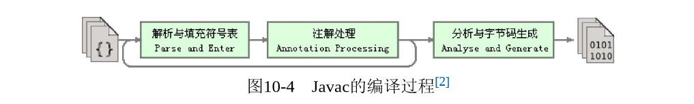

我们可以把上述处理过程对应到代码中，Javac编译动作的入口是 com.sun.tools.javac.main.JavaCompiler类，上述3个过程的代码逻辑集中在这个类的compile()和compile2()方法里，其中主体代码如图10-5所示，整个编译过程主要的处理由图中标注的8个方法来完成。

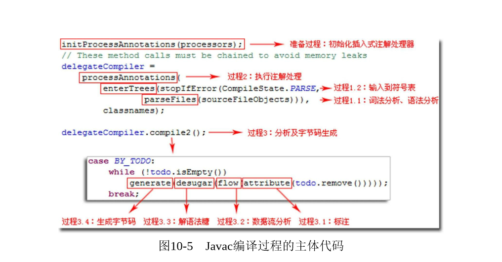

#### 解析与填充符号表

解析过程由图10-5中的parseFiles()方法（图10-5中的过程1.1）来完成，解析过程包括了经典程序编译原理中的词法分析和语法分析两个步骤。

**1.词法、语法分析** 

词法分析是将源代码的字符流转变为标记（Token）集合的过程， 单个字符是程序编写时的最小元素，但标记才是编译时的最小元素。关 键字、变量名、字面量、运算符都可以作为标记，如“int a=b+2”这句代 码中就包含了6个标记，分别是int、a、=、b、+、2，虽然关键字int由3 个字符构成，但是它只是一个独立的标记，不可以再拆分。在Javac的源码中，词法分析过程由com.sun.tools.javac.parser.Scanner类来实现。

语法分析是根据标记序列构造抽象语法树的过程，抽象语法树（Abstract Syntax Tree，AST）是一种用来描述程序代码语法结构的树形表示方式，抽象语法树的每一个节点都代表着程序代码中的一个语法结构（Syntax Construct），例如包、类型、修饰符、运算符、接口、返回值甚至连代码注释等都可以是一种特定的语法结构。

图10-6是Eclipse AST View插件分析出来的某段代码的抽象语法树视图，读者可以通过这个插件工具生成的可视化界面对抽象语法树有一 个直观的认识。在Javac的源码中，语法分析过程由 com.sun.tools.javac.parser.Parser类实现，这个阶段产出的抽象语法树是 以com.sun.tools.javac.tree.JCTree类表示的。

经过词法和语法分析生成语法树以后，编译器就不会再对源码字符 流进行操作了，后续的操作都建立在抽象语法树之上。

**2.填充符号表**

完成了语法分析和词法分析之后，下一个阶段是对符号表进行填充的过程，也就是图10-5中enterTrees()方法（图10-5中注释的过程1.2）要做的事情。符号表（Symbol Table）是由一组符号地址和符号信息构成 的数据结构，读者可以把它类比想象成哈希表中键值对的存储形式（实际上符号表不一定是哈希表实现，可以是有序符号表、树状符号表、栈结构符号表等各种形式）。符号表中所登记的信息在编译的不同阶段都要被用到。譬如在语义分析的过程中，符号表所登记的内容将用于语义检查（如检查一个名字的使用和原先的声明是否一致）和产生中间代码，在目标代码生成阶段，当对符号名进行地址分配时，符号表是地址分配的直接依据。

在Javac源代码中，填充符号表的过程由 com.sun.tools.javac.comp.Enter类实现，该过程的产出物是一个待处理列表，其中包含了每一个编译单元的抽象语法树的顶级节点，以及 package-info.java（如果存在的话）的顶级节点。

#### 注解处理器

JDK 5之后，Java语言提供了对注解（Annotations）的支持，注解在设计上原本是与普通的Java代码一样，都只会在程序运行期间发挥作 用的。但在JDK 6中又提出并通过了JSR-269提案，该提案设计了一组被称为“插入式注解处理器”的标准API，可以提前至编译期对代码中的 特定注解进行处理，从而影响到前端编译器的工作过程。我们可以把插入式注解处理器看作是一组编译器的插件，当这些插件工作时，允许读取、修改、添加抽象语法树中的任意元素。如果这些插件在处理注解期间对语法树进行过修改，编译器将回到解析及填充符号表的过程重新处理，直到所有插入式注解处理器都没有再对语法树进行修改为止，每一次循环过程称为一个轮次（Round），这也就对应着图10-4的那个回环过程。

有了编译器注解处理的标准API后，程序员的代码才有可能干涉编译器的行为，由于语法树中的任意元素，甚至包括代码注释都可以在插件中被访问到，所以通过插入式注解处理器实现的插件在功能上有很大的发挥空间。只要有足够的创意，程序员能使用插入式注解处理器来实现许多原本只能在编码中由人工完成的事情。**譬如Java著名的编码效率工具Lombok，它可以通过注解来实现自动产生getter/setter方法、进行空置检查、生成受查异常表、产生equals()和hashCode()方法，等等，帮助开发人员消除Java的冗长代码，这些都是依赖插入式注解处理器来实现的**，本章最后会设计一个如何使用插入式注解处理器的简单实战。

在Javac源码中，插入式注解处理器的初始化过程是在initPorcessAnnotations()方法中完成的，而它的执行过程则是在processAnnotations()方法中完成。这个方法会判断是否还有新的注解处理器需要执行，如果有的话，通过com.sun.tools.javac.processing.JavacProcessingEnvironment类的doProcessing()方法来生成一个新的JavaCompiler对象，对编译的后续步骤进行处理。

#### 语义分析与字节码生成

经过语法分析之后，编译器获得了程序代码的抽象语法树表示，抽象语法树能够表示一个结构正确的源程序，但无法保证源程序的语义是符合逻辑的。而语义分析的主要任务则是对结构上正确的源程序进行上下文相关性质的检查，譬如进行类型检查、控制流检查、数据流检查，等等。

**1.标注检查**

Javac在编译过程中，语义分析过程可分为标注检查和数据及控制流分析两个步骤，分别由图10-5的attribute()和flow()方法（分别对应图 10-5中的过程3.1和过程3.2）完成。

标注检查步骤要检查的内容包括诸如变量使用前是否已被声明、变 量与赋值之间的数据类型是否能够匹配，等等，刚才3个变量定义的例 子就属于标注检查的处理范畴。在标注检查中，还会顺便进行一个称为常量折叠（Constant Folding）的代码优化，这是Javac编译器会对源代码 做的极少量优化措施之一（代码优化几乎都在即时编译器中进行）。如果我们在Java代码中写下如下所示的变量定义：
```java
int a = 1 + 2;
```

则在抽象语法树上仍然能看到字面量“1”“2”和操作符“+”号，但是在经过常量折叠优化之后，它们将会被折叠为字面量“3”，如图10-7所
示，这个插入式表达式（Infix Expression）的值已经在语法树上标注出来了（ConstantExpressionValue：3）。由于编译期间进行了常量折叠，所以在代码里面定义“a=1+2”比起直接定义“a=3”来，并不会增加程序运行期哪怕仅仅一个处理器时钟周期的处理工作量。

标注检查步骤在Javac源码中的实现类是 com.sun.tools.javac.comp.Attr类和com.sun.tools.javac.comp.Check类。

**2.数据及控制流分析**

数据流分析和控制流分析是对程序上下文逻辑更进一步的验证，它可以检查出诸如程序局部变量在使用前是否有赋值、方法的每条路径是 否都有返回值、是否所有的受查异常都被正确处理了等问题。编译时期的数据及控制流分析与类加载时的数据及控制流分析的目的基本上可以看作是一致的，但校验范围会有所区别，有一些校验项只有在编译期或运行期才能进行。下面举一个关于final修饰符的数据及控制流分析的例 子，见代码清单10-1所示。

代码清单10-1　final语义校验
```java
// 方法一带有final修饰 
public void foo(final int arg) {    
    final int var = 0;    
    // do something 
}
// 方法二没有final修饰 
public void foo(int arg) {    
    int var = 0;    
    // do something 
}
```

在这两个foo()方法中，一个方法的参数和局部变量定义使用了final修饰符，另外一个则没有，在代码编写时程序肯定会受到final修饰符的 影响，不能再改变arg和var变量的值，但是如果观察这两段代码编译出来的字节码，会发现它们是没有任何一点区别的，每条指令，甚至每个字节都一模一样。通过第6章对Class文件结构的讲解我们已经知道，局部变量与类的字段（实例变量、类变量）的存储是有显著差别的，局部变量在常量池中并没有CONSTANT_Fieldref_info的符号引用，自然就不可能存储有访问标志（access_flags）的信息，甚至可能连变量名称都不一定会被保留下来（这取决于编译时的编译器的参数选项），自然在Class文件中就不可能知道一个局部变量是不是被声明为final了。因此，可以肯定地推断出把局部变量声明为final，对运行期是完全没有影响的，变量的不变性仅仅由Javac编译器在编译期间来保障，这就是一个只能在编译期而不能在运行期中检查的例子。在Javac的源码中，数据及控制流分析的入口是图10-5中的flow()方法（图10-5中的过程3.2）， 具体操作由com.sun.tools.javac.comp.Flow类来完成。

**3.解语法糖**

语法糖（Syntactic Sugar），也称糖衣语法，是由英国计算机科学家Peter J.Landin发明的一种编程术语，指的是在计算机语言中添加的某种语法，这种语法对语言的编译结果和功能并没有实际影响，但是却能更方便程序员使用该语言。通常来说使用语法糖能够减少代码量、增加程序的可读性，从而减少程序代码出错的机会。

Java在现代编程语言之中已经属于“低糖语言”（相对于C#及许多其他Java虚拟机语言来说），尤其是JDK 5之前的Java。“低糖”的语法让 Java程序实现相同功能的代码量往往高于其他语言，通俗地说就是会显得比较“啰嗦”，这也是Java语言一直被质疑是否已经“落后”了的一个浮于表面的理由。

Java中最常见的语法糖包括了前面提到过的泛型（其他语言中泛型并不一定都是语法糖实现，如C#的泛型就是直接由CLR支持的）、变长 参数、自动装箱拆箱，等等，Java虚拟机运行时并不直接支持这些语法，它们在编译阶段被还原回原始的基础语法结构，这个过程就称为解语法糖。Java的这些语法糖是如何实现的、被分解后会是什么样子，都将在10.3节中详细讲述。 

在Javac的源码中，解语法糖的过程由desugar()方法触发，在com.sun.tools.javac.comp.TransTypes类和com.sun.tools.javac.comp.Lower 类中完成。

**4.字节码生成**

字节码生成是Javac编译过程的最后一个阶段，在Javac源码里面由com.sun.tools.javac.jvm.Gen类来完成。字节码生成阶段不仅仅是把前面各个步骤所生成的信息（语法树、符号表）转化成字节码指令写到磁盘中，编译器还进行了少量的代码添加和转换工作。

例如前文多次登场的实例构造器<init>()方法和类构造器<clinit>()方法就是在这个阶段被添加到语法树之中的。请注意这里的实例构造器并不等同于默认构造函数，如果用户代码中没有提供任何构造函数，那编译器将会添加一个没有参数的、可访问性（public、protected、private或 <package>）与当前类型一致的默认构造函数，这个工作在填充符号表阶段中就已经完成。<init>()和<clinit>()这两个构造器的产生实际上是一种代码收敛的过程，编译器会把语句块（对于实例构造器而言是“{}”块，对于类构造器而言是“static{}”块）、变量初始化（实例变量和类变量）、调用父类的实例构造器（仅仅是实例构造器，<clinit>()方法中无须调用父类的<clinit>()方法，Java虚拟机会自动保证父类构造器的正确执行，但在<clinit>()方法中经常会生成调用java.lang.Object的<init>()方法的代码）等操作收敛到<init>()和<clinit>()方法之中，并且保证无论源码中出现的顺序如何，都一定是按先执行父类的实例构造器， 然后初始化变量，最后执行语句块的顺序进行，上面所述的动作由Gen::normalizeDefs()方法来实现。除了生成构造器以外，还有其他的一些代码替换工作用于优化程序某些逻辑的实现方式，如把字符串的加操作替换为StringBuffer或StringBuilder（取决于目标代码的版本是否大于或等于JDK 5）的append()操作，等等。

完成了对语法树的遍历和调整之后，就会把填充了所有所需信息的符号表交到com.sun.tools.javac.jvm.ClassWriter类手上，由这个类的 writeClass()方法输出字节码，生成最终的Class文件，到此，整个编译过程宣告结束。

### 10.3　Java语法糖的味道

几乎所有的编程语言都或多或少提供过一些语法糖来方便程序员的代码开发，这些语法糖虽然不会提供实质性的功能改进，但是它们或能 提高效率，或能提升语法的严谨性，或能减少编码出错的机会。现在也有一种观点认为语法糖并不一定都是有益的，大量添加和使用含糖的语法，容易让程序员产生依赖，无法看清语法糖的糖衣背后，程序代码的真实面目。

总而言之，语法糖可以看作是前端编译器实现的一些“小把戏”，这些“小把戏”可能会使效率得到“大提升”，但我们也应该去了解这些“小把戏”背后的真实面貌，那样才能利用好它们，而不是被它们所迷惑。

#### 泛型

泛型的本质是参数化类型（Parameterized Type）或者参数化多态（Parametric Polymorphism）的应用，即可以将操作的数据类型指定为方法签名中的一种特殊参数，这种参数类型能够用在类、接口和方法的创建中，分别构成泛型类、泛型接口和泛型方法。泛型让程序员能够针对泛化的数据类型编写相同的算法，这极大地增强了编程语言的类型系统及抽象能力。

在2004年，Java和C#两门语言于同一年更新了一个重要的大版本， 即Java 5.0和C#2.0，在这个大版本中，两门语言又不约而同地各自添加了泛型的语法特性。不过，两门语言对泛型的实现方式却选择了截然不同的路径。本来Java和C#天生就存在着比较和竞争，泛型这个两门语言在同一年、同一个功能上做出的不同选择，自然免不了被大家对比审视一番，其结论是Java的泛型直到今天依然作为Java语言不如C#语言好用的“铁证”被众人嘲讽。笔者在本节介绍Java泛型时，并不会去尝试推翻这个结论，相反甚至还会去举例来揭示Java泛型的缺陷所在，但同时也 必须向不了解Java泛型机制和历史的读者说清楚，Java选择这样的泛型实现，是出于当时语言现状的权衡，而不是语言先进性或者设计者水平不如C#之类的原因。

**1.Java与C#的泛型** 

Java选择的泛型实现方式叫作“类型擦除式泛型”（Type Erasure Generics），而C#选择的泛型实现方式是“具现化式泛型”（Reified Generics）。具现化和特化、偏特化这些名词最初都是源于C++模版语法中的概念，如果读者本身不使用C++的话，在本节的阅读中可不必太纠结其概念定义，把它当一个技术名词即可，只需要知道C#里面泛型无论在程序源码里面、编译后的中间语言表示（Intermediate Language， 这时候泛型是一个占位符）里面，抑或是运行期的CLR里面都是切实存在的，List<int>与List<string>就是两个不同的类型，它们由系统在运行期生成，有着自己独立的虚方法表和类型数据。而Java语言中的泛型则不同，它只在程序源码中存在，在编译后的字节码文件中，全部泛型都被替换为原来的裸类型（Raw Type，稍后我们会讲解裸类型具体是什么）了，并且在相应的地方插入了强制转型代码，因此对于运行期的Java语言来说，ArrayList<int>与ArrayList<String>其实是同一个类型， 由此读者可以想象“类型擦除”这个名字的含义和来源，这也是为什么笔者会把Java泛型安排在语法糖里介绍的原因。

读者虽然无须纠结概念，但却要关注这两种实现方式会给使用者带来什么样的影响。Java的泛型确实在实际使用中会有一些限制，如果读 者是一名C#开发人员，可能很难想象代码清单10-2中的Java代码都是不合法的。

代码清单10-2　Java中不支持的泛型用法
```java
public class TypeErasureGenerics<E> {    
    public void doSomething(Object item) {        
        if (item instanceof E) {   // 不合法，无法对泛型进行实例判断            
            ...        
        }        
        E newItem = new E();       // 不合法，无法使用泛型创建对象        
        E[] itemArray = new E[10]; // 不合法，无法使用泛型创建数组    
    } 
}
```

上面这些是Java泛型在编码阶段产生的不良影响，如果说这种使用层次上的差别还可以通过多写几行代码、方法中多加一两个类型参数来解决的话，性能上的差距则是难以用编码弥补的。C#2.0引入了泛型之后，带来的显著优势之一便是对比起Java在执行性能上的提高，因为在使用平台提供的容器类型（如List<T>，Dictionary<TKey，TValue>） 时，无须像Java里那样不厌其烦地拆箱和装箱，如果在Java中要避免这种损失，就必须构造一个与数据类型相关的容器类（譬如 IntFloatHashMap这样的容器）。显然，这除了引入更多代码造成复杂度提高、复用性降低之外，更是丧失了泛型本身的存在价值。

Java的类型擦除式泛型无论在使用效果上还是运行效率上，几乎是全面落后于C#的具现化式泛型，而它的唯一优势是在于实现这种泛型的 影响范围上：擦除式泛型的实现几乎只需要在Javac编译器上做出改进即可，不需要改动字节码、不需要改动Java虚拟机，也保证了以前没有使用泛型的库可以直接运行在Java 5.0之上。但这种听起来节省工作量甚至可以说是有偷工减料嫌疑的优势就显得非常短视，真的能在当年Java实现泛型的利弊权衡中胜出吗？答案的确是它胜出了，但我们必须在那时的泛型历史背景中去考虑不同实现方式带来的代价。

**2.泛型的历史背景**

泛型思想早在C++语言的模板（Template）功能中就开始生根发芽，而在Java语言中加入泛型的首次尝试是出现在1996年。Martin Odersky（后来Scala语言的缔造者）当时是德国卡尔斯鲁厄大学编程理论的教授，他想设计一门能够支持函数式编程的程序语言，又不想从头把编程语言的所有功能都再做一遍，所以就注意到了刚刚发布一年的Java，并在它上面实现了函数式编程的3大特性：泛型、高阶函数和模式匹配，形成了Scala语言的前身Pizza语言。后来，Java的开发团队找到了Martin Odersky，表示对Pizza语言的泛型功能很感兴趣，他们就一起建立了一个叫作“Generic Java”的新项目，目标是把Pizza语言的泛型单独拎出来移植到Java语言上，其最终成果就是Java 5.0中的那个泛型实现，但是移植的过程并不是一开始就朝着类型擦除式泛型去的，事实上Pizza语言中的泛型更接近于现在C#的泛型。Martin Odersky自己在采访自述中提到，进行Generic Java项目的过程中他受到了重重约束，甚至多次让他感到沮丧，最紧、最难的约束来源于被迫要完全向后兼容无泛型Java，即保证“二进制向后兼容性”（Binary Backwards Compatibility）。二进制向后兼容性是明确写入《Java语言规范》中的对Java使用者的严肃承诺，譬如一个在JDK 1.2中编译出来的Class文 件，必须保证能够在JDK 12乃至以后的版本中也能够正常运行。这样，既然Java到1.4.2版之前都没有支持过泛型，而到Java 5.0突然要支持泛型了，还要让以前编译的程序在新版本的虚拟机还能正常运行，就意味着以前没有的限制不能突然间冒出来。

举个例子，在没有泛型的时代，由于Java中的数组是支持协变（Covariant）的，对应的集合类也可以存入不同类型的元素，类似于代码清单10-3这样的代码尽管不提倡，但是完全可以正常编译成Class文件。

代码清单10-3　以下代码可正常编译为Class
```java
Object[] array = new String[10]; 
array[0] = 10;                     // 编译期不会有问题，运行时会报错

ArrayList things = new ArrayList(); 
things.add(Integer.valueOf(10));   //编译、运行时都不会报错 
things.add("hello world");
```

为了保证这些编译出来的Class文件可以在Java 5.0引入泛型之后继续运行，设计者面前大体上有两条路可以选择：

1. 需要泛型化的类型（主要是容器类型），以前有的就保持不变，然后平行地加一套泛型化版本的新类型。
2. 直接把已有的类型泛型化，即让所有需要泛型化的已有类型都原地泛型化，不添加任何平行于已有类型的泛型版。

在这个分叉路口，C#走了第一条路，添加了一组 System.Collections.Generic的新容器，以前的System.Collections以及 System.Collections.Specialized容器类型继续存在。C#的开发人员很快就接受了新的容器，倒也没出现过什么不适应的问题，唯一的不适大概是许多.NET自身的标准库已经把老容器类型当作方法的返回值或者参数使用，这些方法至今还保持着原来的老样子。

但如果相同的选择出现在Java中就很可能不会是相同的结果了，要知道当时.NET才问世两年，而Java已经有快十年的历史了，再加上各自 流行程度的不同，两者遗留代码的规模根本不在同一个数量级上。而且更大的问题是Java并不是没有做过第一条路那样的技术决策，在JDK 1.2 时，遗留代码规模尚小，Java就引入过新的集合类，并且保留了旧集合类不动。这导致了直到现在标准类库中还有Vector（老）和 ArrayList（新）、有Hashtable（老）和HashMap（新）等两套容器代码并存，如果当时再摆弄出像Vector（老）、ArrayList（新）、 Vector<T>（老但有泛型）、ArrayList<T>（新且有泛型）这样的容器集合，可能叫骂声会比今天听到的更响更大。

到了这里，相信读者已经能稍微理解为什么当时Java只能选择第二条路了。但第二条路也并不意味着一定只能使用类型擦除来实现，如果 当时有足够的时间好好设计和实现，是完全有可能做出更好的泛型系统的，否则也不会有今天的Valhalla项目来还以前泛型偷懒留下的技术债了。下面我们就来看看当时做的类型擦除式泛型的实现时到底哪里偷懒了，又带来了怎样的缺陷。

**3.类型擦除**

我们继续以ArrayList为例来介绍Java泛型的类型擦除具体是如何实现的。由于Java选择了第二条路，直接把已有的类型泛型化。要让所有
需要泛型化的已有类型，譬如ArrayList，原地泛型化后变成了 ArrayList<T>，而且保证以前直接用ArrayList的代码在泛型新版本里必须还能继续用这同一个容器，这就必须让所有泛型化的实例类型，譬如ArrayList<Integer>、ArrayList<String>这些全部自动成为ArrayList的子类型才能可以，否则类型转换就是不安全的。由此就引出了“裸类型”（Raw Type）的概念，裸类型应被视为所有该类型泛型化实例的共同父类型（Super Type），只有这样，像代码清单10-4中的赋值才是被系统允许的从子类到父类的安全转型。

代码清单10-4　裸类型赋值
```java
ArrayList<Integer> ilist = new ArrayList<Integer>(); 
ArrayList<String> slist = new ArrayList<String>(); 
ArrayList list; // 裸类型 
list = ilist; 
list = slist;
```

接下来的问题是该如何实现裸类型。这里又有了两种选择：一种是在运行期由Java虚拟机来自动地、真实地构造出ArrayList<Integer>这样的类型，并且自动实现从ArrayList<Integer>派生自ArrayList的继承关系来满足裸类型的定义；另外一种是索性简单粗暴地直接在编译时把ArrayList<Integer>还原回ArrayList，只在元素访问、修改时自动插入一 些强制类型转换和检查指令，这样看起来也是能满足需要，这两个选择的最终结果大家已经都知道了。代码清单10-5是一段简单的Java泛型例子，我们可以看一下它编译后的实际样子是怎样的。

代码清单10-5　泛型擦除前的例子
```java
public static void main(String[] args) {    
    Map<String, String> map = new HashMap<String, String>();    
    map.put("hello", "你好");    
    map.put("how are you?", "吃了没？");    
    System.out.println(map.get("hello"));    
    System.out.println(map.get("how are you?")); 
}
```

把这段Java代码编译成Class文件，然后再用字节码反编译工具进行反编译后，将会发现泛型都不见了，程序又变回了Java泛型出现之前的 写法，泛型类型都变回了裸类型，只在元素访问时插入了从Object到 String的强制转型代码，如代码清单10-6所示。

代码清单10-6　泛型擦除后的例子
```java
public static void main(String[] args) {    
    Map map = new HashMap();    
    map.put("hello", "你好");    
    map.put("how are you?", "吃了没？");    
    System.out.println((String) map.get("hello"));    
    System.out.println((String) map.get("how are you?")); 
}
```

类型擦除带来的缺陷前面已经提到过一些，为了系统性地讲述，笔者在此再举3个例子，把前面与C#对比时简要提及的擦除式泛型的缺陷 做更具体的说明。

首先，使用擦除法实现泛型直接导致了对原始类型（Primitive Types）数据的支持又成了新的麻烦，譬如将代码清单10-2稍微修改一 下，变成代码清单10-7这个样子。

代码清单10-7　原始类型的泛型（目前的Java不支持）
```java
ArrayList<int> ilist = new ArrayList<int>(); 
ArrayList<long> llist = new ArrayList<long>(); 
ArrayList list; 
list = ilist; 
list = llist;
```

这种情况下，一旦把泛型信息擦除后，到要插入强制转型代码的地方就没办法往下做了，因为不支持int、long与Object之间的强制转型。当时Java给出的解决方案一如既往的简单粗暴：既然没法转换那就索性别支持原生类型的泛型了吧，你们都用ArrayList<Integer>、 ArrayList<Long>，反正都做了自动的强制类型转换，遇到原生类型时把装箱、拆箱也自动做了得了。这个决定后面导致了无数构造包装类和装箱、拆箱的开销，成为Java泛型慢的重要原因，也成为今天Valhalla项目要重点解决的问题之一。

第二，运行期无法取到泛型类型信息，会让一些代码变得相当啰嗦，譬如代码清单10-2中罗列的几种Java不支持的泛型用法，都是由于运行期Java虚拟机无法取得泛型类型而导致的。像代码清单10-8这样， 我们去写一个泛型版本的从List到数组的转换方法，由于不能从List中取得参数化类型T，所以不得不从一个额外参数中再传入一个数组的组件
类型进去，实属无奈。

代码清单10-8　不得不加入的类型参数
```java
public static <T> T[] convert(List<T> list, Class<T> componentType) {    
    T[] array = (T[])Array.newInstance(componentType, list.size());    
    ... 
}
```

最后，笔者认为通过擦除法来实现泛型，还丧失了一些面向对象思想应有的优雅，带来了一些模棱两可的模糊状况，例如代码清单10-9的 例子。

代码清单10-9　当泛型遇见重载1
```java
public class GenericTypes {
    public static void method(List<String> list) {        
        System.out.println("invoke method(List<String> list)");    
    }
    public static void method(List<Integer> list) {        
        System.out.println("invoke method(List<Integer> list)");    
    } 
}
```

请读者思考一下，上面这段代码是否正确，能否编译执行？也许你已经有了答案，这段代码是不能被编译的，因为参数List<Integer>和 List<String>编译之后都被擦除了，变成了同一种的裸类型List，类型擦除导致这两个方法的特征签名变得一模一样。初步看来，无法重载的原因已经找到了，但是真的就是如此吗？其实这个例子中泛型擦除成相同的裸类型只是无法重载的其中一部分原因，请再接着看一看代码清单10-10中的内容。

代码清单10-10　当泛型遇见重载2
```java
public class GenericTypes {
    public static String method(List<String> list) {        
        System.out.println("invoke method(List<String> list)");        
        return "";    
    }
    public static int method(List<Integer> list) {        
        System.out.println("invoke method(List<Integer> list)");        
        return 1;    
    }
    public static void main(String[] args) {        
        method(new ArrayList<String>());        
        method(new ArrayList<Integer>());    
    } 
}
```

执行结果：
```shell
invoke method(List<String> list) 
invoke method(List<Integer> list)
```

代码清单10-9与代码清单10-10的差别，是两个method()方法添加了不同的返回值，由于这两个返回值的加入，方法重载居然成功了，即这 段代码可以被编译和执行了。这是我们对Java语言中返回值不参与重载选择的基本认知的挑战吗？

代码清单10-10中的重载当然不是根据返回值来确定的，之所以这次能编译和执行成功，是因为两个method()方法加入了不同的返回值后 才能共存在一个Class文件之中。第6章介绍Class文件方法表（method_info）的数据结构时曾经提到过，方法重载要求方法具备不同的特征签名，返回值并不包含在方法的特征签名中，所以返回值不参与重载选择，但是在Class文件格式之中，只要描述符不是完全一致的两个方法就可以共存。也就是说两个方法如果有相同的名称和特征签名，但返回值不同，那它们也是可以合法地共存于一个Class文件中的。

从上面的例子中可以看到擦除法对实际编码带来的不良影响，由于 List<String>和List<Integer>擦除后是同一个类型，我们只能添加两个并 不需要实际使用到的返回值才能完成重载，这是一种毫无优雅和美感可 言的解决方案，并且存在一定语意上的混乱，**譬如上面脚注中提到的， 必须用JDK 6的Javac才能编译成功，其他版本或者是ECJ编译器都有可能拒绝编译**

**4.值类型与未来的泛型**

在2014年，刚好是Java泛型出现的十年之后，Oracle建立了一个名为Valhalla的语言改进项目，希望改进Java语言留下的各种缺陷（解决泛型的缺陷就是项目主要目标其中之一）。原本这个项目是计划在 JDK 10中完成的，但在笔者撰写本节时（2019年8月，下个月JDK 13正 式版都要发布了）也只有少部分目标（譬如VarHandle）顺利实现并发布出去。它现在的技术预览版LW2（L-World 2）是基于未完成的 JDK 14 EarlyAccess来运行的，所以本节内容很可能在将来会发生变动，请读者阅读时多加注意。

在Valhalla项目中规划了几种不同的新泛型实现方案，被称为Model 1到Model 3，在这些新的泛型设计中，泛型类型有可能被具现化，也有可能继续维持类型擦除以保持兼容（取决于采用哪种实现方案），即使是继续采用类型擦除的方案，泛型的参数化类型也可以选择不被完全地擦除掉，而是相对完整地记录在Class文件中，能够在运行期被使用，也可以指定编译器默认要擦除哪些类型。相对于使用不同方式实现泛型，目前比较明确的是未来的Java应该会提供“值类型”（Value Type）的语言层面的支持。

说起值类型，这点也是C#用户攻讦Java语言的常用武器之一，C#并没有Java意义上的原生数据类型，在C#中使用的int、bool、double关键字其实是对应了一系列在.NET框架中预定义好的结构体（Struct），如 Int32、Boolean、Double等。在C#中开发人员也可以定义自己值类型，只要继承于ValueType类型即可，而ValueType也是统一基类Object的子类，所以并不会遇到Java那样int不自动装箱就无法转型为Object的尴尬。

值类型可以与引用类型一样，具有构造函数、方法或是属性字段， 等等，而它与引用类型的区别在于它在赋值的时候通常是整体复制，而 不是像引用类型那样传递引用的。更为关键的是，值类型的实例很容易实现分配在方法的调用栈上的，这意味着值类型会随着当前方法的退出 而自动释放，不会给垃圾收集子系统带来任何压力。

在Valhalla项目中，Java的值类型方案被称为“内联类型”，计划通过 一个新的关键字inline来定义，字节码层面也有专门与原生类型对应的 以Q开头的新的操作码（譬如iload对应qload）来支撑。现在的预览版可 以通过一个特制的解释器来保证这些未来可能加入的字节码指令能够被 执行，要即时编译的话，现在只支持C2编译器。即时编译器场景中是使 用逃逸分析优化（见第11章）来处理内联类型的，通过编码时标注以及 内联类实例所具备的不可变性，可以很好地解决逃逸分析面对传统引用 类型时难以判断（没有足够的信息，或者没有足够的时间做全程序分 析）对象是否逃逸的问题。

#### 自动装箱、拆箱与遍历循环

就纯技术的角度而论，自动装箱、自动拆箱与遍历循环（for-each 循环）这些语法糖，无论是实现复杂度上还是其中蕴含的思想上都不能 和10.3.1节介绍的泛型相提并论，两者涉及的难度和深度都有很大差距。专门拿出一节来讲解它们只是因为这些是Java语言里面被使用最多的语法糖。我们通过代码清单10-11和代码清单10-12中所示的代码来看看这些语法糖在编译后会发生什么样的变化。

代码清单10-11　自动装箱、拆箱与遍历循环
```java
public static void main(String[] args) {    
    List<Integer> list = Arrays.asList(1, 2, 3, 4);    
    int sum = 0;    
    for (int i : list) {        
        sum += i;    
    }    
    System.out.println(sum); 
}
```

代码清单10-12　自动装箱、拆箱与遍历循环编译之后
```java
public static void main(String[] args) {    
    List list = Arrays.asList( new Integer[] {        
        Integer.valueOf(1),        
        Integer.valueOf(2),        
        Integer.valueOf(3),        
        Integer.valueOf(4) 
    });
    int sum = 0;    
    for (Iterator localIterator = list.iterator(); localIterator.hasNext(); ) {        
        int i = ((Integer)localIterator.next()).intValue();        
        sum += i;    
    }    
    System.out.println(sum); 
}
```

代码清单10-11中一共包含了泛型、自动装箱、自动拆箱、遍历循环与变长参数5种语法糖，代码清单10-12则展示了它们在编译前后发生 的变化。泛型就不必说了，自动装箱、拆箱在编译之后被转化成了对应的包装和还原方法，如本例中的Integer.valueOf()与Integer.intValue()方
法，而遍历循环则是把代码还原成了迭代器的实现，这也是为何遍历循环需要被遍历的类实现Iterable接口的原因。最后再看看变长参数，它在调用的时候变成了一个数组类型的参数，在变长参数出现之前，程序员的确也就是使用数组来完成类似功能的。

这些语法糖虽然看起来很简单，但也不见得就没有任何值得我们特 别关注的地方，代码清单10-13演示了自动装箱的一些错误用法。

代码清单10-13　自动装箱的陷阱
```java
public static void main(String[] args) {    
    Integer a = 1;    
    Integer b = 2;    
    Integer c = 3;    
    Integer d = 3;    
    Integer e = 321;    
    Integer f = 321;    
    Long g = 3L;    
    System.out.println(c == d);    //true
    System.out.println(e == f);    //false
    System.out.println(c == (a + b));    //true
    System.out.println(c.equals(a + b));    //true
    System.out.println(g == (a + b));    //true  <=> System.out.println(g == (long)(a + b))
    System.out.println(g.equals(a + b));  //false
}
```

读者阅读完代码清单10-13，不妨思考两个问题：一是这6句打印语句的输出是什么？二是这6句打印语句中，解除语法糖后参数会是什么 样子？这两个问题的答案都很容易试验出来，笔者就暂且略去答案，希望不能立刻做出判断的读者自己上机实践一下。无论读者的回答是否正确，鉴于包装类的“==”运算在不遇到算术运算的情况下不会自动拆箱，以及它们equals()方法不处理数据转型的关系，笔者建议在实际编码中尽量避免这样使用自动装箱与拆箱。

#### 条件编译

许多程序设计语言都提供了条件编译的途径，如C、C++中使用预处理器指示符（#ifdef）来完成条件编译。C、C++的预处理器最初的任 务是解决编译时的代码依赖关系（如极为常用的#include预处理命令），而在Java语言之中并没有使用预处理器，因为Java语言天然的编 译方式（编译器并非一个个地编译Java文件，而是将所有编译单元的语法树顶级节点输入到待处理列表后再进行编译，因此各个文件之间能够互相提供符号信息）就无须使用到预处理器。那Java语言是否有办法实现条件编译呢？

Java语言当然也可以进行条件编译，方法就是使用条件为常量的if语句。如代码清单10-14所示，该代码中的if语句不同于其他Java代码， 它在编译阶段就会被“运行”，生成的字节码之中只包括“System.out.println("block 1")；”一条语句，并不会包含if语句及另外一个分子中的“System.out.println("block 2")；” 

代码清单10-14　Java语言的条件编译
```java
public static void main(String[] args) {    
    if (true) {        
        System.out.println("block 1");    
    } else {        
        System.out.println("block 2");    
    } 
}
```

该代码编译后Class文件的反编译结果：
```java
public static void main(String[] args) {    
     System.out.println("block 1"); 
}
```

只能使用条件为常量的if语句才能达到上述效果，如果使用常量与其他带有条件判断能力的语句搭配，则可能在控制流分析中提示错误， 被拒绝编译，如代码清单10-15所示的代码就会被编译器拒绝编译。

代码清单10-15　不能使用其他条件语句来完成条件编译
```java
public static void main(String[] args) {    
    // 编译器将会提示“Unreachable code”    
    while (false) {        
        System.out.println("");    
    } 
}
```

Java语言中条件编译的实现，也是Java语言的一颗语法糖，根据布尔常量值的真假，编译器将会把分支中不成立的代码块消除掉，这一工 作将在编译器解除语法糖阶段（com.sun.tools.javac.comp.Lower类中）完成。由于这种条件编译的实现方式使用了if语句，所以它必须遵循最基本的Java语法，只能写在方法体内部，因此它只能实现语句基本块（Block）级别的条件编译，而没有办法实现根据条件调整整个Java类的结构。

除了本节中介绍的泛型、自动装箱、自动拆箱、遍历循环、变长参数和条件编译之外，Java语言还有不少其他的语法糖，如内部类、枚举 类、断言语句、数值字面量、对枚举和字符串的switch支持、try语句中定义和关闭资源（这3个从JDK 7开始支持）、Lambda表达式（从JDK 8 开始支持，Lambda不能算是单纯的语法糖，但在前端编译器中做了大量的转换工作），等等，读者可以通过跟踪Javac源码、反编译Class文件等方式了解它们的本质实现，囿于篇幅，笔者就不再一一介绍了。

### 10.4　实战：插入式注解处理器

Java的编译优化部分在本书中并没有像前面两部分那样设置独立的、整章篇幅的实战，因为我们开发程序，考虑的主要还是程序会如何运行，较少会涉及针对程序编译的特殊需求。也正因如此，在JDK的编译子系统里面，暴露给用户直接控制的功能相对很少，除了第11章会介绍的虚拟机即时编译的若干相关参数以外，我们就只有使用JSR-296中定义的插入式注解处理器API来对Java编译子系统的行为施加影响。

但是笔者丝毫不认为相对于前两部分介绍的内存管理子系统和字节码执行子系统，编译子系统就不那么重要了。一套编程语言中编译子系 统的优劣，很大程度上决定了程序运行性能的好坏和编码效率的高低，尤其在Java语言中，运行期即时编译与虚拟机执行子系统非常紧密地互相依赖、配合运作（第11章我们将主要讲解这方面的内容）。了解JDK如何编译和优化代码，有助于我们写出适合Java虚拟机自优化的程序。话题说远了，下面我们回到本章的实战中来，看看插入式注解处理器API能为我们实现什么功能。

示例略

### 10.5　本章小结

在本章中，我们从Javac编译器源码实现的层次上学习了Java源代码 编译为字节码的过程，分析了Java语言中泛型、主动装箱拆箱、条件编 译等多种语法糖的前因后果，并实战练习了如何使用插入式注解处理器 来完成一个检查程序命名规范的编译器插件。如本章概述中所说的，在 前端编译器中，“优化”手段主要用于提升程序的编码效率，之所以把 Javac这类将Java代码转变为字节码的编译器称作“前端编译器”，是因为 它只完成了从程序到抽象语法树或中间字节码的生成，而在此之后，还 有一组内置于Java虚拟机内部的“后端编译器”来完成代码优化以及从字 节码生成本地机器码的过程，即前面多次提到的即时编译器或提前编译 器，这个后端编译器的编译速度及编译结果质量高低，是衡量Java虚拟机性能最重要的一个指标。在第11章中，我们将会一探后端编译器的运 作和优化过程。

## 第11章　后端编译与优化

从计算机程序出现的第一天起，对效率的追逐就是程序员天生的坚定信仰，这个过程犹如一场没有终点、永不停歇的F1方程式竞赛，程序 员是车手，技术平台则是在赛道上飞驰的赛车。

### 11.1　概述

如果我们把字节码看作是程序语言的一种中间表示形式 （Intermediate Representation，IR）的话，那编译器无论在何时、在何种状态下把Class文件转换成与本地基础设施（硬件指令集、操作系统）相关的二进制机器码，它都可以视为整个编译过程的后端。如果读者阅 读过本书的第2版，可能会发现本章的标题已经从“运行期编译与优化”悄然改成了“后端编译与优化”，这是因为在2012年的Java世界里，虽 然提前编译（Ahead Of Time，AOT）早已有所应用，但相对而言，即时编译（Just In Time，JIT）才是占绝对主流的编译形式。不过，最近几年编译技术发展出现了一些微妙的变化，提前编译不仅逐渐被主流 JDK所支持，而且在Java编译技术的前沿研究中又重新成了一个热门的话题，所以再继续只提“运行期”和“即时编译”就显得不够全面了，在本章中它们两者都是主角。

无论是提前编译器抑或即时编译器，都不是Java虚拟机必需的组成部分，《Java虚拟机规范》中从来没有规定过虚拟机内部必须要包含这些编译器，更没有限定或指导这些编译器应该如何去实现。但是，后端编译器编译性能的好坏、代码优化质量的高低却是衡量一款商用虚拟机优秀与否的关键指标之一，它们也是商业Java虚拟机中的核心，是最能体现技术水平与价值的功能。在本章中，我们将走进Java虚拟机的内部，探索后端编译器的运作过程和原理。

既然《Java虚拟机规范》没有具体的约束规则去限制后端编译器应该如何实现，那这部分功能就完全是与虚拟机具体实现相关的内容，如 无特殊说明，本章中所提及的即时编译器都是特指HotSpot虚拟机内置的即时编译器，虚拟机也是特指HotSpot虚拟机。不过，本章虽然有大量的内容涉及了特定的虚拟机和编译器的实现层面，但主流Java虚拟机中后端编译器的行为会有很多相似相通之处，因此对其他虚拟机来说也具备一定的类比参考价值。

### 11.2　即时编译器

目前主流的两款商用Java虚拟机（HotSpot、OpenJ9）里，Java程序最初都是通过解释器（Interpreter）进行解释执行的，当虚拟机发现某个方法或代码块的运行特别频繁，就会把这些代码认定为“热点代码”（Hot Spot Code），为了提高热点代码的执行效率，在运行时，虚拟机将会把这些代码编译成本地机器码，并以各种手段尽可能地进行代码优化，运行时完成这个任务的后端编译器被称为即时编译器。本节我们将会了解HotSpot虚拟机内的即时编译器的运作过程，此外，我们还将解决以下几个问题：

- 为何HotSpot虚拟机要使用解释器与即时编译器并存的架构？ 
- 为何HotSpot虚拟机要实现两个（或三个）不同的即时编译器？ 
- 程序何时使用解释器执行？何时使用编译器执行？ 
- 哪些程序代码会被编译为本地代码？如何编译本地代码？ 
- 如何从外部观察到即时编译器的编译过程和编译结果？

#### 解释器与编译器

尽管并不是所有的Java虚拟机都采用解释器与编译器并存的运行架构，但目前主流的商用Java虚拟机，譬如HotSpot、OpenJ9等，内部都同时包含解释器与编译器，解释器与编译器两者各有优势：当程序需要迅速启动和执行的时候，解释器可以首先发挥作用，省去编译的时间，立即运行。当程序启动后，随着时间的推移，编译器逐渐发挥作用，把越来越多的代码编译成本地代码，这样可以减少解释器的中间损耗，获得更高的执行效率。当程序运行环境中内存资源限制较大，可以使用解释执行节约内存（如部分嵌入式系统中和大部分的JavaCard应用中就只有解释器的存在），反之可以使用编译执行来提升效率。同时，解释器还可以作为编译器激进优化时后备的“逃生门”（如果情况允许， HotSpot虚拟机中也会采用不进行激进优化的客户端编译器充当“逃生 门”的角色），让编译器根据概率选择一些不能保证所有情况都正确， 但大多数时候都能提升运行速度的优化手段，当激进优化的假设不成立，如加载了新类以后，类型继承结构出现变化、出现“罕见陷阱”（Uncommon Trap）时可以通过逆优化（Deoptimization）退回到解释状态继续执行，因此在整个Java虚拟机执行架构里，解释器与编译器经常是相辅相成地配合工作，其交互关系如图11-1所示。

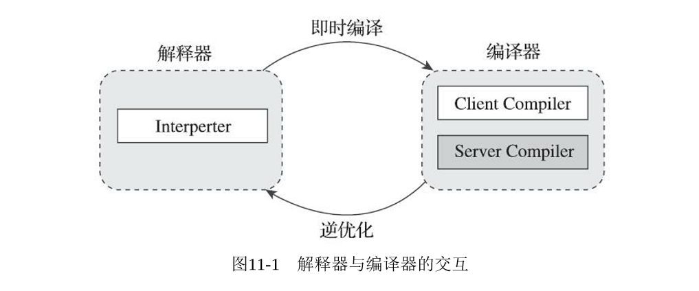

HotSpot虚拟机中内置了两个（或三个）即时编译器，其中有两个编译器存在已久，分别被称为“客户端编译器”（Client Compiler）和“服务端编译器”（Server Compiler），或者简称为C1编译器和C2编译器 （部分资料和JDK源码中C2也叫Opto编译器），第三个是在JDK 10时才出现的、长期目标是代替C2的Graal编译器。Graal编译器目前还处于实验状态，本章将安排出专门的小节对它讲解与实战，在本节里，我们将重点关注传统的C1、C2编译器的工作过程。

在分层编译（Tiered Compilation）的工作模式出现以前，HotSpot虚拟机通常是采用解释器与其中一个编译器直接搭配的方式工作，程序使用哪个编译器，只取决于虚拟机运行的模式，HotSpot虚拟机会根据自身版本与宿主机器的硬件性能自动选择运行模式，用户也可以使用“-client”或“-server”参数去强制指定虚拟机运行在客户端模式还是服务端模式。

无论采用的编译器是客户端编译器还是服务端编译器，解释器与编译器搭配使用的方式在虚拟机中被称为“混合模式”（Mixed Mode），**用户也可以使用参数“-Xint”强制虚拟机运行于“解释模式”（Interpreted Mode）**，这时候编译器完全不介入工作，全部代码都使用解释方式执行。另外，**也可以使用参数“-Xcomp”强制虚拟机运行于“编译模式”（Compiled Mode）**，这时候将优先采用编译方式执行程序，但是解释器仍然要在编译无法进行的情况下介入执行过程。可以通过虚拟机的“-version”命令的输出结果显示出这三种模式，内容如代码清单11-1所 示，请读者注意黑体字部分。

代码清单11-1　虚拟机执行模式
```java
$java -version 
    java version "11.0.3" 2019-04-16 LTS 
    Java(TM) SE Runtime Environment 18.9 (build 11.0.3+12-LTS) 
    Java HotSpot(TM) 64-Bit Server VM 18.9 (build 11.0.3+12-LTS, mixed mode)
    
$java -Xint -version 
    java version "11.0.3" 2019-04-16 LTS 
    Java(TM) SE Runtime Environment 18.9 (build 11.0.3+12-LTS) 
    Java HotSpot(TM) 64-Bit Server VM 18.9 (build 11.0.3+12-LTS, interpreted mode)
    
$java -Xcomp -version 
    java version "11.0.3" 2019-04-16 LTS 
    Java(TM) SE Runtime Environment 18.9 (build 11.0.3+12-LTS) 
    Java HotSpot(TM) 64-Bit Server VM 18.9 (build 11.0.3+12-LTS, compiled mode)
```

由于即时编译器编译本地代码需要占用程序运行时间，通常要编译出优化程度越高的代码，所花费的时间便会越长；而且想要编译出优化 程度更高的代码，解释器可能还要替编译器收集性能监控信息，这对解释执行阶段的速度也有所影响。为了在程序启动响应速度与运行效率之间达到最佳平衡，HotSpot虚拟机在编译子系统中加入了分层编译的功能，分层编译的概念其实很早就已经提出，但直到JDK 6时期才被初步实现，后来一直处于改进阶段，最终在JDK 7的服务端模式虚拟机中作为默认编译策略被开启。分层编译根据编译器编译、优化的规模与耗时，划分出不同的编译层次，其中包括：

- 第0层。程序纯解释执行，并且解释器不开启性能监控功能 （Profiling）。 
- 第1层。使用客户端编译器将字节码编译为本地代码来运行，进行简单可靠的稳定优化，不开启性能监控功能。
- 第2层。仍然使用客户端编译器执行，仅开启方法及回边次数统计等有限的性能监控功能。
- 第3层。仍然使用客户端编译器执行，开启全部性能监控，除了第2层的统计信息外，还会收集如分支跳转、虚方法调用版本等全部的统计信息。
- 第4层。使用服务端编译器将字节码编译为本地代码，相比起客户端编译器，服务端编译器会启用更多编译耗时更长的优化，还会根据性能监控信息进行一些不可靠的激进优化。

以上层次并不是固定不变的，根据不同的运行参数和版本，虚拟机可以调整分层的数量。各层次编译之间的交互、转换关系如图11-2所示。

实施分层编译后，解释器、客户端编译器和服务端编译器就会同时工作，热点代码都可能会被多次编译，用客户端编译器获取更高的编译 速度，用服务端编译器来获取更好的编译质量，在解释执行的时候也无须额外承担收集性能监控信息的任务，而在服务端编译器采用高复杂度的优化算法时，客户端编译器可先采用简单优化来为它争取更多的编译时间。

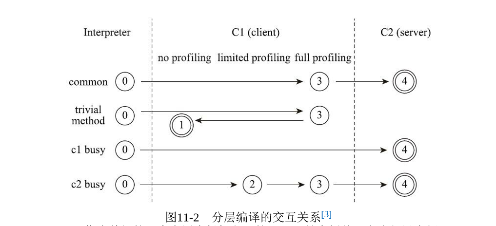

#### 编译对象与触发条件

在本章概述中提到了在运行过程中会被即时编译器编译的目标是“热点代码”，这里所指的热点代码主要有两类，包括：

- 被多次调用的方法。
- 被多次执行的循环体。

前者很好理解，一个方法被调用得多了，方法体内代码执行的次数自然就多，它成为“热点代码”是理所当然的。而后者则是为了解决当一 个方法只被调用过一次或少量的几次，但是方法体内部存在循环次数较多的循环体，这样循环体的代码也被重复执行多次，因此这些代码也应该认为是“热点代码”。

对于这两种情况，编译的目标对象都是整个方法体，而不会是单独的循环体。第一种情况，由于是依靠方法调用触发的编译，那编译器理 所当然地会以整个方法作为编译对象，这种编译也是虚拟机中标准的即时编译方式。而对于后一种情况，尽管编译动作是由循环体所触发的，热点只是方法的一部分，但编译器依然必须以整个方法作为编译对象，只是执行入口（从方法第几条字节码指令开始执行）会稍有不同，编译时会传入执行入口点字节码序号（Byte Code Index，BCI）。这种编译方式因为编译发生在方法执行的过程中，因此被很形象地称为“栈上替换”（On Stack Replacement，OSR），即方法的栈帧还在栈上，方法就被替换了。

读者可能还会有疑问，在上面的描述里，无论是“多次执行的方法”，还是“多次执行的代码块”，所谓“多次”只定性不定量，并不是一个具体严谨的用语，那到底多少次才算“多次”呢？还有一个问题，就是 Java虚拟机是如何统计某个方法或某段代码被执行过多少次的呢？解决了这两个问题，也就解答了即时编译被触发的条件。

要知道某段代码是不是热点代码，是不是需要触发即时编译，这个行为称为“热点探测”（Hot Spot Code Detection），其实进行热点探测并不一定要知道方法具体被调用了多少次，目前主流的热点探测判定方式有两种，分别是：

- 基于采样的热点探测（Sample Based Hot Spot Code Detection）。采用这种方法的虚拟机会周期性地检查各个线程的调用栈顶，如果发现某个（或某些）方法经常出现在栈顶，那这个方法就是“热点方法”。基于采样的热点探测的好处是实现简单高效，还可以很容易地获取方法调用关系（将调用堆栈展开即可），缺点是很难精确地确认一个方法的热度，容易因为受到线程阻塞或别的外界因素的影响而扰乱热点探测。
- 基于计数器的热点探测（Counter Based Hot Spot Code Detection）。采用这种方法的虚拟机会为每个方法（甚至是代码块）建立计数器，统计方法的执行次数，如果执行次数超过一定的阈值就认为它是“热点方法”。这种统计方法实现起来要麻烦一些，需要为每个方法建立并维护计数器，而且不能直接获取到方法的调用关系。但是它的统计结果相对来说更加精确严谨。

这两种探测手段在商用Java虚拟机中都有使用到，譬如J9用过第一种采样热点探测，而在HotSpot虚拟机中使用的是第二种基于计数器的 热点探测方法，为了实现热点计数，HotSpot为每个方法准备了两类计数器：方法调用计数器（Invocation Counter）和回边计数器（Back Edge Counter，“回边”的意思就是指在循环边界往回跳转）。当虚拟机运行参数确定的前提下，这两个计数器都有一个明确的阈值，计数器阈值一旦溢出，就会触发即时编译。

**我们首先来看看方法调用计数器。顾名思义，这个计数器就是用于统计方法被调用的次数，它的默认阈值在客户端模式下是1500次，在服务端模式下是10000次，这个阈值可以通过虚拟机参数-XX:CompileThreshold来人为设定。当一个方法被调用时，虚拟机会先检查该方法是否存在被即时编译过的版本，如果存在，则优先使用编译后的本地代码来执行。如果不存在已被编译过的版本，则将该方法的调用计 数器值加一，然后判断方法调用计数器与回边计数器值之和是否超过方法调用计数器的阈值。一旦已超过阈值的话，将会向即时编译器提交一个该方法的代码编译请求。**

如果没有做过任何设置，执行引擎默认不会同步等待编译请求完成，而是继续进入解释器按照解释方式执行字节码，直到提交的请求被 即时编译器编译完成。当编译工作完成后，这个方法的调用入口地址就会被系统自动改写成新值，下一次调用该方法时就会使用已编译的版本了，整个即时编译的交互过程如图11-3所示。

**在默认设置下，方法调用计数器统计的并不是方法被调用的绝对次数，而是一个相对的执行频率，即一段时间之内方法被调用的次数。当 超过一定的时间限度，如果方法的调用次数仍然不足以让它提交给即时编译器编译，那该方法的调用计数器就会被减少一半，这个过程被称为方法调用计数器热度的衰减（Counter Decay），而这段时间就称为此方法统计的半衰周期（Counter Half Life Time），进行热度衰减的动作是在虚拟机进行垃圾收集时顺便进行的，可以使用虚拟机参数-XX:UseCounterDecay来关闭热度衰减，让方法计数器统计方法调用的绝对次数，这样只要系统运行时间足够长，程序中绝大部分方法都会被编译成本地代码。另外还可以使用-XX:CounterHalfLifeTime参数设置半衰周期的时间，单位是秒。**

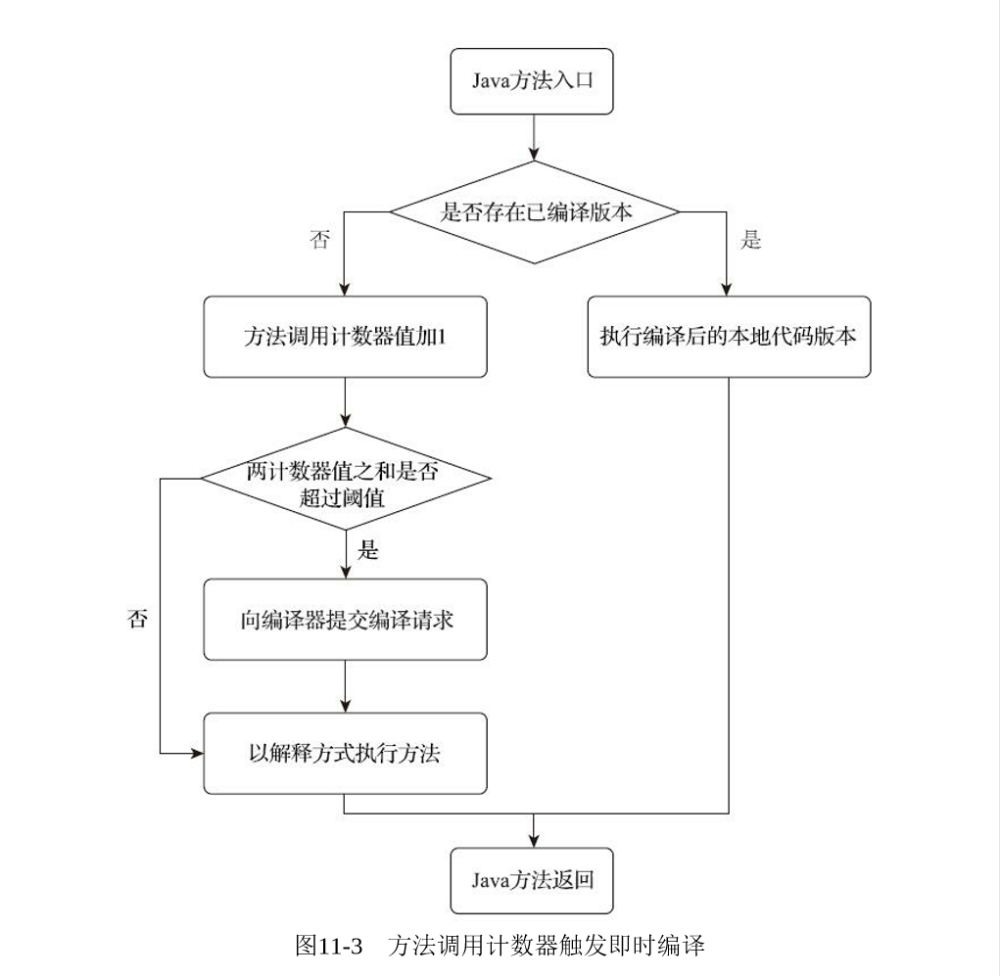

现在我们再来看看另外一个计数器——回边计数器，它的作用是统计一个方法中循环体代码执行的次数，在字节码中遇到控制流向后跳 转的指令就称为“回边（Back Edge）”，很显然建立回边计数器统计的目的是为了触发栈上的替换编译。

关于回边计数器的阈值，虽然HotSpot虚拟机也提供了一个类似于方法调用计数器阈值-XX:CompileThreshold的参数-XX:BackEdgeThreshold供用户设置，但是当前的HotSpot虚拟机实际上并未使用此参数，我们必须设置另外一个参数-XX:OnStackReplacePercentage来间接调整回边计数器的阈值，其计算公式有如下两种。

- 虚拟机运行在客户端模式下，回边计数器阈值计算公式为：方法调用计数器阈值（-XX:CompileThreshold）乘以OSR比率（-XX: OnStackReplacePercentage）除以100。其中-XX:OnStackReplacePercentage默认值为933，如果都取默认值，那客户端模式虚拟机的回边计数器的阈值为13995。
- 虚拟机运行在服务端模式下，回边计数器阈值的计算公式为：方法调用计数器阈值（-XX:CompileThreshold）乘以（OSR比率（-XX:OnStackReplacePercentage）减去解释器监控比率（-XX:InterpreterProfilePercentage）的差值）除以100。其中-XX:OnStack ReplacePercentage默认值为140，-XX:InterpreterProfilePercentage默认值为33，如果都取默认值，那服务端模式虚拟机回边计数器的阈值为 10700。

当解释器遇到一条回边指令时，会先查找将要执行的代码片段是否有已经编译好的版本，如果有的话，它将会优先执行已编译的代码，否则就把回边计数器的值加一，然后判断方法调用计数器与回边计数器值之和是否超过回边计数器的阈值。当超过阈值的时候，将会提交一个栈上替换编译请求，并且把回边计数器的值稍微降低一些，以便继续在解释器中执行循环，等待编译器输出编译结果，整个执行过程如图11-4所示。

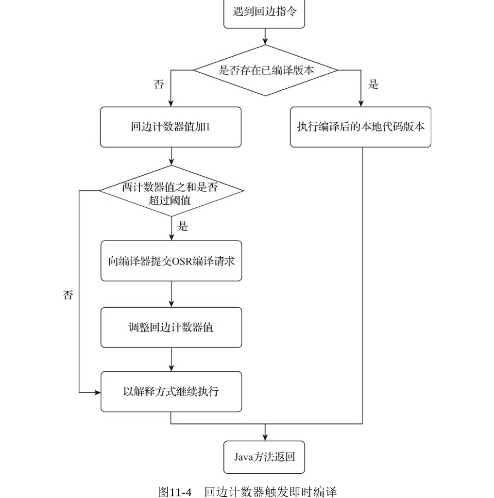

**与方法计数器不同，回边计数器没有计数热度衰减的过程，因此这个计数器统计的就是该方法循环执行的绝对次数。当计数器溢出的时候，它还会把方法计数器的值也调整到溢出状态，这样下次再进入该方法的时候就会执行标准编译过程。**

#### 编译过程

在默认条件下，无论是方法调用产生的标准编译请求，还是栈上替换编译请求，虚拟机在编译器还未完成编译之前，都仍然将按照解释方 式继续执行代码，而编译动作则在后台的编译线程中进行。用户可以通过参数-XX:-BackgroundCompilation来禁止后台编译，后台编译被禁止后，当达到触发即时编译的条件时，执行线程向虚拟机提交编译请求以后将会一直阻塞等待，直到编译过程完成再开始执行编译器输出的本地代码。

那在后台执行编译的过程中，编译器具体会做什么事情呢？服务端编译器和客户端编译器的编译过程是有所差别的。对于客户端编译器来 说，它是一个相对简单快速的三段式编译器，主要的关注点在于局部性的优化，而放弃了许多耗时较长的全局优化手段。

在第一个阶段，一个平台独立的前端将字节码构造成一种高级中间代码表示（High-Level Intermediate Representation，HIR，即与目标机器 指令集无关的中间表示）。HIR使用静态单分配（Static Single Assignment，SSA）的形式来代表代码值，这可以使得一些在HIR的构造过程之中和之后进行的优化动作更容易实现。在此之前编译器已经会在字节码上完成一部分基础优化，如方法内联、常量传播等优化将会在字节码被构造成HIR之前完成。

在第二个阶段，一个平台相关的后端从HIR中产生低级中间代码表示（Low-Level Intermediate Representation，LIR，即与目标机器指令集相关的中间表示），而在此之前会在HIR上完成另外一些优化，如空值检查消除、范围检查消除等，以便让HIR达到更高效的代码表示形式。

最后的阶段是在平台相关的后端使用线性扫描算法（Linear Scan Register Allocation）在LIR上分配寄存器，并在LIR上做窥孔 （Peephole）优化，然后产生机器代码。客户端编译器大致的执行过程如图11-5所示。

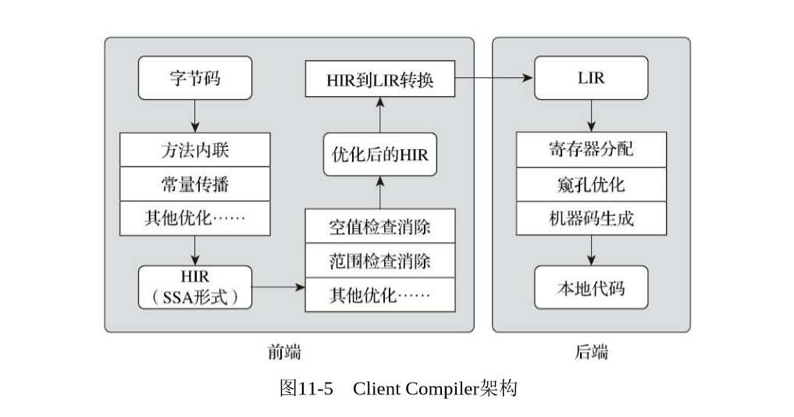

而服务端编译器则是专门面向服务端的典型应用场景，并为服务端的性能配置针对性调整过的编译器，也是一个能容忍很高优化复杂度的 高级编译器，几乎能达到GNU C++编译器使用-O2参数时的优化强度。 它会执行大部分经典的优化动作，如：无用代码消除（Dead Code Elimination）、循环展开（Loop Unrolling）、循环表达式外提（Loop Expression Hoisting）、消除公共子表达式（Common Subexpression Elimination）、常量传播（Constant Propagation）、基本块重排序 （Basic Block Reordering）等，还会实施一些与Java语言特性密切相关的优化技术，如范围检查消除（Range Check Elimination）、空值检查消除（Null Check Elimination，不过并非所有的空值检查消除都是依赖编译器优化的，有一些是代码运行过程中自动优化了）等。另外，还可能根据解释器或客户端编译器提供的性能监控信息，进行一些不稳定的预测性激进优化，如守护内联（Guarded Inlining）、分支频率预测 （Branch Frequency Prediction）等，本章的下半部分将会挑选上述的一 部分优化手段进行分析讲解，在此就先不做展开。

服务端编译采用的寄存器分配器是一个全局图着色分配器，它可以充分利用某些处理器架构（如RISC）上的大寄存器集合。以即时编译 的标准来看，服务端编译器无疑是比较缓慢的，但它的编译速度依然远 远超过传统的静态优化编译器，而且它相对于客户端编译器编译输出的代码质量有很大提高，可以大幅减少本地代码的执行时间，从而抵消掉额外的编译时间开销，所以也有很多非服务端的应用选择使用服务端模式的HotSpot虚拟机来运行。

### 11.3　提前编译器

提前编译在Java技术体系中并不是新事物。1996年JDK 1.0发布， Java有了正式的运行环境，第一个可以使用外挂即时编译器的Java版本 是1996年7月发布的JDK 1.0.2，而Java提前编译器的诞生并没有比这晚多少。仅几个月后，IBM公司就推出了第一款用于Java语言的提前编译器（IBM High Performance Compiler for Java）。在1998年，GNU组织公布了著名的GCC家族（GNU Compiler Collection）的新成员GNU Compiler for Java（GCJ，2018年从GCC家族中除名），这也是一款Java 的提前编译器，而且曾经被广泛应用。在OpenJDK流行起来之前，各种Linux发行版带的Java实现通常就是GCJ。

但是提前编译很快又在Java世界里沉寂了下来，因为当时Java的一个核心优势是平台中立性，其宣传口号是“一次编译，到处运行”，这与 平台相关的提前编译在理念上就是直接冲突的。GCJ出现之后在长达15 年的时间里，提前编译这条故事线上基本就再没有什么大的新闻和进展了。类似的状况一直持续至2013年，直到在Android的世界里，剑走偏锋使用提前编译的ART（Android Runtime）横空出世。ART一诞生马上 就把使用即时编译的Dalvik虚拟机按在地上使劲蹂躏，仅经过Android 4.4一个版本的短暂交锋之后，ART就迅速终结了Dalvik的性命，把它从Android系统里扫地出门。

尽管Android并不能直接等同于Java，但两者毕竟有着深厚渊源，提 前编译在Android上的革命与崛起也震撼到了Java世界。在某些领域、某 些人眼里，只要能获得更好的执行性能，什么平台中立性、字节膨胀 、动态扩展，一切皆可舍弃，唯一的问题就只有“提前编译真的会是 获得更高性能的银弹吗？” 

### 11.4　编译器优化技术

经过前面对即时编译、提前编译的讲解，读者应该已经建立起一个 认知：编译器的目标虽然是做由程序代码翻译为本地机器码的工作，但 其实难点并不在于能不能成功翻译出机器码，输出代码优化质量的高低 才是决定编译器优秀与否的关键。在本章之前的内容里出现过许多优化 措施的专业名词，有一些是编译原理中的基础知识，譬如方法内联，只 要是计算机专业毕业的读者至少都有初步的概念；但也有一些专业性比 较强的名词，譬如逃逸分析，可能不少读者只听名字很难想象出来这个 优化会做什么事情。本节将介绍几种HotSpot虚拟机的即时编译器在生成代码时采用的代码优化技术，以小见大，见微知著，让读者对编译器代码优化有整体理解。

#### 优化技术概览

OpenJDK的官方Wiki上，HotSpot虚拟机设计团队列出了一个相对 比较全面的、即时编译器中采用的优化技术列表[1]，如表11-1所示，其 中有不少经典编译器的优化手段，也有许多针对Java语言，或者说针对 运行在Java虚拟机上的所有语言进行的优化。本节先对这些技术进行概 览，在后面几节中，将挑选若干最重要或最典型的优化，与读者一起看 看优化前后的代码发生了怎样的变化。

# 第五部分　高效并发

- 第12章　Java内存模型与线程
- 第13章　线程安全与锁优化

## 第12章　Java内存模型与线程

并发处理的广泛应用是Amdahl定律代替摩尔定律成为计算机性能发展源动力的根本原因，也是人类压榨计算机运算能力的最有力武器。Amdahl定律通过系统中并行化与串行化的比重来描述多处理器系统能获得的运算加速能力，摩尔定律则用于描述处理器晶体管数量与运行效率之间的发展关系。这两个定律的更替代表了近年来硬件发展从追求处理器频率到追求多核心并行处理的发展过程。

### 12.1　概述

多任务处理在现代计算机操作系统中几乎已是一项必备的功能了。 在许多场景下，让计算机同时去做几件事情，不仅是因为计算机的运算能力强大了，还有一个很重要的原因是计算机的运算速度与它的存储和通信子系统的速度差距太大，大量的时间都花费在磁盘I/O、网络通信或者数据库访问上。如果不希望处理器在大部分时间里都处于等待其他资源的空闲状态，就必须使用一些手段去把处理器的运算能力“压榨”出来，否则就会造成很大的性能浪费，而让计算机同时处理几项任务则是最容易想到，也被证明是非常有效的“压榨”手段。

除了充分利用计算机处理器的能力外，一个服务端要同时对多个客户端提供服务，则是另一个更具体的并发应用场景。衡量一个服务性能 的高低好坏，每秒事务处理数（Transactions Per Second，TPS）是重要的指标之一，它代表着一秒内服务端平均能响应的请求总数，而TPS值与程序的并发能力又有非常密切的关系。对于计算量相同的任务，程序线程并发协调得越有条不紊，效率自然就会越高；反之，线程之间频繁争用数据，互相阻塞甚至死锁，将会大大降低程序的并发能力。

服务端的应用是Java语言最擅长的领域之一，这个领域的应用占了 Java应用中最大的一块份额，不过如何写好并发应用程序却又是服务端程序开发的难点之一，处理好并发方面的问题通常需要更多的编码经验来支持。幸好Java语言和虚拟机提供了许多工具，把并发编程的门槛降低了不少。各种中间件服务器、各类框架也都努力地替程序员隐藏尽可能多的线程并发细节，使得程序员在编码时能更关注业务逻辑，而不是花费大部分时间去关注此服务会同时被多少人调用、如何处理数据争用、协调硬件资源。但是无论语言、中间件和框架再如何先进，开发人员都不应期望它们能独立完成所有并发处理的事情，了解并发的内幕仍然是成为一个高级程序员不可缺少的课程。

“高效并发”是本书讲解Java虚拟机的最后一个部分，将会向读者介绍虚拟机如何实现多线程、多线程之间由于共享和竞争数据而导致的一 系列问题及解决方案。

### 12.2　硬件的效率与一致性

在正式讲解Java虚拟机并发相关的知识之前，我们先花费一点时间去了解一下物理计算机中的并发问题。物理机遇到的并发问题与虚拟机 中的情况有很多相似之处，物理机对并发的处理方案对虚拟机的实现也有相当大的参考意义。

“让计算机并发执行若干个运算任务”与“更充分地利用计算机处理器的效能”之间的因果关系，看起来理所当然，实际上它们之间的关系并没有想象中那么简单，其中一个重要的复杂性的来源是绝大多数的运算任务都不可能只靠处理器“计算”就能完成。处理器至少要与内存交互，如读取运算数据、存储运算结果等，这个I/O操作就是很难消除的 （无法仅靠寄存器来完成所有运算任务）。由于计算机的存储设备与处 理器的运算速度有着几个数量级的差距，所以现代计算机系统都不得不加入一层或多层读写速度尽可能接近处理器运算速度的高速缓存 （Cache）来作为内存与处理器之间的缓冲：将运算需要使用的数据复制到缓存中，让运算能快速进行，当运算结束后再从缓存同步回内存之中，这样处理器就无须等待缓慢的内存读写了。

基于高速缓存的存储交互很好地解决了处理器与内存速度之间的矛盾，但是也为计算机系统带来更高的复杂度，它引入了一个新的问题：缓存一致性（Cache Coherence）。在多路处理器系统中，每个处理器都有自己的高速缓存，而它们又共享同一主内存（Main Memory），这种系统称为共享内存多核系统（Shared Memory Multiprocessors System），如图12-1所示。当多个处理器的运算任务都涉及同一块主内存区域时，将可能导致各自的缓存数据不一致。如果真的发生这种情况，那同步回到主内存时该以谁的缓存数据为准呢？为了解决一致性的问题，需要各个处理器访问缓存时都遵循一些协议，在读写时要根据协议来进行操作，这类协议有MSI、MESI（Illinois Protocol）、MOSI、 Synapse、Firefly及Dragon Protocol等。从本章开始，我们将会频繁见到“内存模型”一词，它可以理解为在特定的操作协议下，对特定的内存或高速缓存进行读写访问的过程抽象。不同架构的物理机器可以拥有不一样的内存模型，而Java虚拟机也有自己的内存模型，并且与这里介绍的内存访问操作及硬件的缓存访问操作具有高度的可类比性。

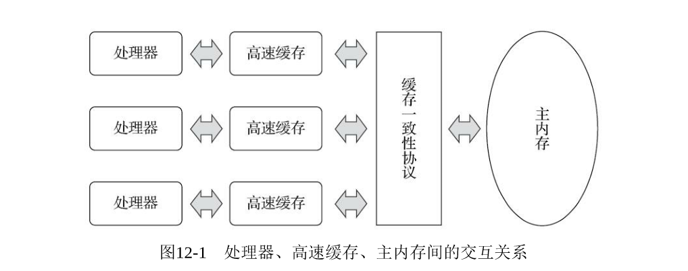

除了增加高速缓存之外，为了使处理器内部的运算单元能尽量被充分利用，处理器可能会对输入代码进行乱序执行（Out-Of-Order Execution）优化，处理器会在计算之后将乱序执行的结果重组，保证该结果与顺序执行的结果是一致的，但并不保证程序中各个语句计算的先后顺序与输入代码中的顺序一致，因此如果存在一个计算任务依赖另外一个计算任务的中间结果，那么其顺序性并不能靠代码的先后顺序来保证。与处理器的乱序执行优化类似，Java虚拟机的即时编译器中也有指令重排序（Instruction Reorder）优化。

### 12.3　Java内存模型

《Java虚拟机规范》中曾试图定义一种“Java内存模型”（Java Memory Model，JMM）来屏蔽各种硬件和操作系统的内存访问差异， 以实现让Java程序在各种平台下都能达到一致的内存访问效果。在此之前，主流程序语言（如C和C++等）直接使用物理硬件和操作系统的内存模型。因此，由于不同平台上内存模型的差异，有可能导致程序在一套平台上并发完全正常，而在另外一套平台上并发访问却经常出错，所以在某些场景下必须针对不同的平台来编写程序。

定义Java内存模型并非一件容易的事情，这个模型必须定义得足够严谨，才能让Java的并发内存访问操作不会产生歧义；但是也必须定义得足够宽松，使得虚拟机的实现能有足够的自由空间去利用硬件的各种特性（寄存器、高速缓存和指令集中某些特有的指令）来获取更好的执行速度。经过长时间的验证和修补，直至JDK 5（实现了JSR-133）发布后，Java内存模型才终于成熟、完善起来了。

#### 主内存与工作内存

Java内存模型的主要目的是定义程序中各种变量的访问规则，即关注在虚拟机中把变量值存储到内存和从内存中取出变量值这样的底层细节。**此处的变量（Variables）与Java编程中所说的变量有所区别，它包括了实例字段、静态字段和构成数组对象的元素，但是不包括局部变量与方法参数，因为后者是线程私有的，不会被共享，自然就不会存在竞争问题。**为了获得更好的执行效能，Java内存模型并没有限制执行引擎使用处理器的特定寄存器或缓存来和主内存进行交互，也没有限制即时编译器是否要进行调整代码执行顺序这类优化措施。

**Java内存模型规定了所有的变量都存储在主内存（Main Memory）中（此处的主内存与介绍物理硬件时提到的主内存名字一样，两者也可以类比，但物理上它仅是虚拟机内存的一部分）。每条线程还有自己的工作内存（Working Memory，可与前面讲的处理器高速缓存类比），线程的工作内存中保存了被该线程使用的变量的主内存副本(有部分读者会对这段描述中的“副本”提出疑问，如“假设线程中访问 一个10MB大小的对象，也会把这10MB的内存复制一份出来吗？”，事 实上并不会如此，这个对象的引用、对象中某个在线程访问到的字段是 有可能被复制的，但不会有虚拟机把整个对象复制一次。)，线程对变量的所有操作（读取、赋值等）都必须在工作内存中进行，而不能直接读写主内存中的数据。不同的线程之间也无法直接访问对方工作内存中的变量，线程间变量值的传递均需要通过主内存来完成，线程、主内存、工作内存三者的交互关系如图12-2所示，注意与图12-1进行对比。**

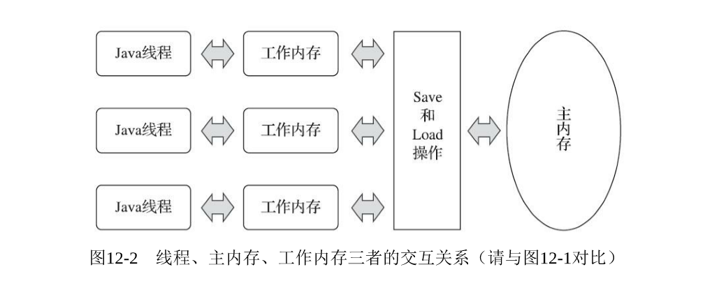

这里所讲的主内存、工作内存与第2章所讲的Java内存区域中的Java 堆、栈、方法区等并不是同一个层次的对内存的划分，这两者基本上是没有任何关系的。如果两者一定要勉强对应起来，那么从变量、主内存、工作内存的定义来看，主内存主要对应于Java堆中的对象实例数据部分，而工作内存则对应于虚拟机栈中的部分区域。从更基础的层次上说，主内存直接对应于物理硬件的内存，而为了获取更好的运行速度，虚拟机（或者是硬件、操作系统本身的优化措施）可能会让工作内存优先存储于寄存器和高速缓存中，因为程序运行时主要访问的是工作内存。

#### 内存间交互操作

关于主内存与工作内存之间具体的交互协议，即一个变量如何从主内存拷贝到工作内存、如何从工作内存同步回主内存这一类的实现细 节，Java内存模型中定义了以下8种操作来完成。Java虚拟机实现时必须保证下面提及的每一种操作都是原子的、不可再分的（对于double和long类型的变量来说，load、store、read和write操作在某些平台上允许有例外，这个问题在12.3.4节会专门讨论）。

1. lock（锁定）：作用于主内存的变量，它把一个变量标识为一条线程独占的状态。
2. unlock（解锁）：作用于主内存的变量，它把一个处于锁定状态的变量释放出来，释放后的变量才可以被其他线程锁定。
3. read（读取）：作用于主内存的变量，它把一个变量的值从主内存传输到线程的工作内存中，以便随后的load动作使用。
4. load（载入）：作用于工作内存的变量，它把read操作从主内存中得到的变量值放入工作内存的变量副本中。
5. use（使用）：作用于工作内存的变量，它把工作内存中一个变量的值传递给执行引擎，每当虚拟机遇到一个需要使用变量的值的字节码指令时将会执行这个操作。
6. assign（赋值）：作用于工作内存的变量，它把一个从执行引擎接收的值赋给工作内存的变量，每当虚拟机遇到一个给变量赋值的字节码指令时执行这个操作。
7. store（存储）：作用于工作内存的变量，它把工作内存中一个变量的值传送到主内存中，以便随后的write操作使用。
8. write（写入）：作用于主内存的变量，它把store操作从工作内存中得到的变量的值放入主内存的变量中。 

如果要把一个变量从主内存拷贝到工作内存，那就要按顺序执行read和load操作，如果要把变量从工作内存同步回主内存，就要按顺序 执行store和write操作。注意，**Java内存模型只要求上述两个操作必须按顺序执行，但不要求是连续执行。也就是说read与load之间、store与 write之间是可插入其他指令的，如对主内存中的变量a、b进行访问时， 一种可能出现的顺序是read a、read b、load b、load a。**除此之外，Java 内存模型还规定了在执行上述8种基本操作时必须满足如下规则：

- 不允许read和load、store和write操作之一单独出现，即不允许一个变量从主内存读取了但工作内存不接受，或者工作内存发起回写了但主内存不接受的情况出现。
- 不允许一个线程丢弃它最近的assign操作，即变量在工作内存中改变了之后必须把该变化同步回主内存。
- 不允许一个线程无原因地（没有发生过任何assign操作）把数据从线程的工作内存同步回主内存中。
- 一个新的变量只能在主内存中“诞生”，不允许在工作内存中直接使用一个未被初始化（load或assign）的变量，换句话说就是对一个变量实施use之前必须先执行load，对一个变量实施store之前必须先执行assign操作。
- 一个变量在同一个时刻只允许一条线程对其进行lock操作，但lock操作可以被同一条线程重复执行多次，多次执行lock后，只有执行相同次数的unlock操作，变量才会被解锁。
- 如果对一个变量执行lock操作，那将会清空工作内存中此变量的值，在执行引擎使用这个变量前，需要重新执行load或assign操作以初始化变量的值。
- 如果一个变量事先没有被lock操作锁定，那就不允许对它执行unlock操作，也不允许去unlock一个被其他线程锁定的变量。
- 对一个变量执行unlock操作之前，必须先把此变量同步回主内存中（执行store、write操作）。  

这8种内存访问操作以及上述规则限定，再加上稍后会介绍的专门针对volatile的一些特殊规定，就已经能准确地描述出Java程序中哪些内存访问操作在并发下才是安全的。这种定义相当严谨，但也是极为烦琐，实践起来更是无比麻烦。可能部分读者阅读到这里已经对多线程开发产生恐惧感了，后来Java设计团队大概也意识到了这个问题，将Java内存模型的操作简化为read、write、lock和unlock四种，但这只是语言描述上的等价化简，Java内存模型的基础设计并未改变，即使是这四操作种，对于普通用户来说阅读使用起来仍然并不方便。不过读者对此无须过分担忧，除了进行虚拟机开发的团队外，大概没有其他开发人员会以这种方式来思考并发问题，我们只需要理解Java内存模型的定义即可。12.3.6节将介绍这种定义的一个等效判断原则——先行发生原则，用来确定一个操作在并发环境下是否安全的。

#### 对于volatile型变量的特殊规则

关键字volatile可以说是Java虚拟机提供的最轻量级的同步机制，但是它并不容易被正确、完整地理解，以至于许多程序员都习惯去避免使 用它，遇到需要处理多线程数据竞争问题的时候一律使用synchronized来进行同步。了解volatile变量的语义对后面理解多线程操作的其他特性很有意义，在本节中我们将多花费一些篇幅介绍volatile到底意味着什么。

Java内存模型为volatile专门定义了一些特殊的访问规则，在介绍这些比较拗口的规则定义之前，先用一些不那么正式，但通俗易懂的语言 来介绍一下这个关键字的作用。

当一个变量被定义成volatile之后，它将具备两项特性：第一项是保证此变量对所有线程的可见性，这里的“可见性”是指当一条线程修改了这个变量的值，新值对于其他线程来说是可以立即得知的。而普通变量并不能做到这一点，普通变量的值在线程间传递时均需要通过主内存来完成。比如，线程A修改一个普通变量的值，然后向主内存进行回写，另外一条线程B在线程A回写完成了之后再对主内存进行读取操作，新变量值才会对线程B可见。

关于volatile变量的可见性，经常会被开发人员误解，他们会误以为下面的描述是正确的：“volatile变量对所有线程是立即可见的，对volatile变量所有的写操作都能立刻反映到其他线程之中。换句话说，volatile变量在各个线程中是一致的，所以基于volatile变量的运算在并发下是线程安全的”。这句话的论据部分并没有错，但是由其论据并不能得出“基于volatile变量的运算在并发下是线程安全的”这样的结论。volatile变量在各个线程的工作内存中是不存在一致性问题的（从物理存储的角度看，各个线程的工作内存中volatile变量也可以存在不一致的情况，但由于每次使用之前都要先刷新，执行引擎看不到不一致的情况， 因此可以认为不存在一致性问题），但是Java里面的运算操作符并非原子操作，这导致volatile变量的运算在并发下一样是不安全的。

由于volatile变量只能保证可见性，在不符合以下两条规则的运算场景中，我们仍然要通过加锁（使用synchronized、java.util.concurrent中的锁或原子类）来保证原子性：

- 运算结果并不依赖变量的当前值，或者能够确保只有单一的线程修改变量的值。
- 变量不需要与其他的状态变量共同参与不变约束。

而在像代码清单12-3所示的这类场景中就很适合使用volatile变量来控制并发，当shutdown()方法被调用时，能保证所有线程中执行的 doWork()方法都立即停下来。

代码清单12-3　volatile的使用场景
```java
volatile boolean shutdownRequested;

public void shutdown() {    
    shutdownRequested = true; 
}
public void doWork() {    
    while (!shutdownRequested) {        
        // 代码的业务逻辑    
    } 
}
```

使用volatile变量的第二个语义是禁止指令重排序优化，普通的变量仅会保证在该方法的执行过程中所有依赖赋值结果的地方都能获取到正确的结果，而不能保证变量赋值操作的顺序与程序代码中的执行顺序一致。因为在同一个线程的方法执行过程中无法感知到这点，这就是Java内存模型中描述的所谓“线程内表现为串行的语义”（Within-Thread AsIf-Serial Semantics）。

上面描述仍然比较拗口难明，我们还是继续通过一个例子来看看为何指令重排序会干扰程序的并发执行。演示程序如代码清单12-4所示。

代码清单12-4　指令重排序
```java
Map configOptions; 
char[] configText; 
// 此变量必须定义为volatile 
volatile boolean initialized = false;
// 假设以下代码在线程A中执行 
// 模拟读取配置信息，当读取完成后 
// 将initialized设置为true,通知其他线程配置可用 
configOptions = new HashMap(); 
configText = readConfigFile(fileName); 
processConfigOptions(configText, configOptions); 
initialized = true;
// 假设以下代码在线程B中执行 
// 等待initialized为true，代表线程A已经把配置信息初始化完成 
while (!initialized) {    
    sleep(); 
} 
// 使用线程A中初始化好的配置信息 
doSomethingWithConfig();
```

代码清单12-4中所示的程序是一段伪代码，其中描述的场景是开发中常见配置读取过程，只是我们在处理配置文件时一般不会出现并发， 所以没有察觉这会有问题。读者试想一下，如果定义initialized变量时没有使用volatile修饰，就可能会由于指令重排序的优化，导致位于线程A中最后一条代码“initialized=true”被提前执行（这里虽然使用Java作为伪代码，但所指的重排序优化是机器级的优化操作，提前执行是指这条语句对应的汇编代码被提前执行），这样在线程B中使用配置信息的代码就可能出现错误，而volatile关键字则可以避免此类情况的发生。

指令重排序是并发编程中最容易导致开发人员产生疑惑的地方之 一，除了上面伪代码的例子之外，笔者再举一个可以实际操作运行的例子来分析volatile关键字是如何禁止指令重排序优化的。代码清单12-5所示是一段标准的双锁检测（Double Check Lock，DCL）单例代码，可以观察加入volatile和未加入volatile关键字时所生成的汇编代码的差别 （如何获得即时编译的汇编代码？请参考第4章关于HSDIS插件的介绍）。

代码清单12-5　DCL单例模式
```java
public class Singleton {
    
    private volatile static Singleton instance;
    
    public static Singleton getInstance() {        
        if (instance == null) {            
            synchronized (Singleton.class) {                
                if (instance == null) {                    
                    instance = new Singleton();                
                }            
            }        
        }        
        return instance;    
    }
    public static void main(String[] args) {            
        Singleton.getInstance();    
    } 
}
```

编译后，这段代码对instance变量赋值的部分如代码清单12-6所示。 

代码清单12-6　对instance变量赋值
```shell
0x01a3de0f: mov    $0x3375cdb0,%esi     ;...beb0cd75 33                                         
										;  {oop('Singleton')} 
0x01a3de14: mov    %eax,0x150(%esi)     ;...89865001 0000 
0x01a3de1a: shr    $0x9,%esi            ;...c1ee09 
0x01a3de1d: movb   $0x0,0x1104800(%esi) ;...c6860048 100100
0x01a3de24: lock addl $0x0,(%esp)       ;...f0830424 00                                        
										;*putstatic instance                                        
										; - Singleton::getInstance@24
```

通过对比发现，关键变化在于有volatile修饰的变量，赋值后（前面 mov%eax，0x150(%esi)这句便是赋值操作）多执行了一个“lock addl$0x0，(%esp)”操作，这个操作的作用相当于一个内存屏障 （Memory Barrier或Memory Fence，指重排序时不能把后面的指令重排序到内存屏障之前的位置，注意不要与第3章中介绍的垃圾收集器用于捕获变量访问的内存屏障互相混淆），只有一个处理器访问内存时，并不需要内存屏障；但如果有两个或更多处理器访问同一块内存，且其中有一个在观测另一个，就需要内存屏障来保证一致性了。

这句指令中的“addl$0x0，(%esp)”（把ESP寄存器的值加0）显然是一个空操作，之所以用这个空操作而不是空操作专用指令nop，是因为IA32手册规定lock前缀不允许配合nop指令使用。这里的关键在于lock前缀，查询IA32手册可知，它的作用是将本处理器的缓存写入了内存，该写入动作也会引起别的处理器或者别的内核无效化（Invalidate）其缓存，这种操作相当于对缓存中的变量做了一次前面介绍Java内存模式中所说的“store和write”操作。所以通过这样一个空操作，可让前面volatile变量的修改对其他处理器立即可见。

那为何说它禁止指令重排序呢？从硬件架构上讲，指令重排序是指处理器采用了允许将多条指令不按程序规定的顺序分开发送给各个相应 的电路单元进行处理。但并不是说指令任意重排，处理器必须能正确处理指令依赖情况保障程序能得出正确的执行结果。譬如指令1把地址A中的值加10，指令2把地址A中的值乘以2，指令3把地址B中的值减去3，这时指令1和指令2是有依赖的，它们之间的顺序不能重排—— (A+10)*2与A*2+10显然不相等，但指令3可以重排到指令1、2之前或者中间，只要保证处理器执行后面依赖到A、B值的操作时能获取正确的A和B值即可。所以在同一个处理器中，重排序过的代码看起来依然是有序的。因此，lock addl$0x0，(%esp)指令把修改同步到内存时，意味着所有之前的操作都已经执行完成，这样便形成了“指令重排序无法越过内存屏障”的效果。

解决了volatile的语义问题，再来看看在众多保障并发安全的工具中选用volatile的意义——它能让我们的代码比使用其他的同步工具更快 吗？在某些情况下，volatile的同步机制的性能确实要优于锁（使用synchronized关键字或java.util.concurrent包里面的锁），但是由于虚拟机对锁实行的许多消除和优化，使得我们很难确切地说volatile就会比synchronized快上多少。如**果让volatile自己与自己比较，那可以确定一个原则：volatile变量读操作的性能消耗与普通变量几乎没有什么差别， 但是写操作则可能会慢上一些，因为它需要在本地代码中插入许多内存屏障指令来保证处理器不发生乱序执行。**不过即便如此，大多数场景下volatile的总开销仍然要比锁来得更低。我们在volatile与锁中选择的唯一判断依据仅仅是volatile的语义能否满足使用场景的需求。

本节的最后，我们再回头来看看Java内存模型中对volatile变量定义的特殊规则的定义。假定T表示一个线程，V和W分别表示两个volatile 型变量，那么在进行read、load、use、assign、store和write操作时需要满足如下规则：

- 只有当线程T对变量V执行的前一个动作是load的时候，线程T才能对变量V执行use动作；并且，只有当线程T对变量V执行的后一个动作是use的时候，线程T才能对变量V执行load动作。线程T对变量V的use动作可以认为是和线程T对变量V的load、read动作相关联的，必须连续且一起出现。这条规则要求在工作内存中，每次使用V前都必须先从主内存获取最新的值，用于保证能看见其他线程对变量V所做的修改。 
- 只有当线程T对变量V执行的前一个动作是assign的时候，线程T才能对变量V执行store动作；并且，只有当线程T对变量V执行的后一个动作是store的时候，线程T才能对变量V执行assign动作。线程T对变量V的assign动作可以认为是和线程T对变量V的store、write动作相关联的，必须连续且一起出现。这条规则要求在工作内存中，每次修改V后都必须立刻同步回主内存中，用于保证其他线程可以看到自己对变量V所做的修改。
- 假定动作A是线程T对变量V实施的use或assign动作，假定动作F是和动作A相关联的load或store动作，假定动作P是和动作F相应的对变量V的read或write动作；与此类似，假定动作B是线程T对变量W实施的use 或assign动作，假定动作G是和动作B相关联的load或store动作，假定动作Q是和动作G相应的对变量W的read或write动作。如果A先于B，那么P先于Q。这条规则要求volatile修饰的变量不会被指令重排序优化，从而保证 代码的执行顺序与程序的顺序相同。

#### 针对long和double型变量的特殊规则

Java内存模型要求lock、unlock、read、load、assign、use、store、 write这八种操作都具有原子性，但是对于64位的数据类型（long和double），在模型中特别定义了一条宽松的规定：允许虚拟机将没有被volatile修饰的64位数据的读写操作划分为两次32位的操作来进行，即允许虚拟机实现自行选择是否要保证64位数据类型的load、store、read和 write这四个操作的原子性，这就是所谓的“long和double的非原子性协定”（Non-Atomic Treatment of double and long Variables）。 

如果有多个线程共享一个并未声明为volatile的long或double类型的变量，并且同时对它们进行读取和修改操作，那么某些线程可能会读取到一个既不是原值，也不是其他线程修改值的代表了“半个变量”的数值。不过这种读取到“半个变量”的情况是非常罕见的，经过实际测试，在目前主流平台下商用的64位Java虚拟机中并不会出现非原子性访问行为，但是对于32位的Java虚拟机，譬如比较常用的32位x86平台下的HotSpot虚拟机，对long类型的数据确实存在非原子性访问的风险。从JDK 9起，HotSpot增加了一个实验性的参数-XX:+AlwaysAtomicAccesses（这是JEP 188对Java内存模型更新的一部分内容）来约束虚拟机对所有数据类型进行原子性的访问。而针对double类型，由于现代中央处理器中一般都包含专门用于处理浮点数据的浮点运算器（Floating Point Unit，FPU），用来专门处理单、双精度的浮点数据，所以哪怕是32位虚拟机中通常也不会出现非原子性访问的问题，实际测试也证实了这一点。**笔者的看法是，在实际开发中，除非该数据有明确可知的线程竞争，否则我们在编写代码时一般不需要因为这个原因刻意把用到的long和double变量专门声明为volatile。** 

#### 原子性、可见性与有序性

介绍完Java内存模型的相关操作和规则后，我们再整体回顾一下这个模型的特征。Java内存模型是围绕着在并发过程中如何处理原子性、 可见性和有序性这三个特征来建立的，我们逐个来看一下哪些操作实现了这三个特性。

**1.原子性（Atomicity）** 

由Java内存模型来直接保证的原子性变量操作包括read、load、 assign、use、store和write这六个，我们大致可以认为，基本数据类型的访问、读写都是具备原子性的（例外就是long和double的非原子性协定，读者只要知道这件事情就可以了，无须太过在意这些几乎不会发生的例外情况）。

如果应用场景需要一个更大范围的原子性保证（经常会遇到）， Java内存模型还提供了lock和unlock操作来满足这种需求，尽管虚拟机 未把lock和unlock操作直接开放给用户使用，但是却提供了更高层次的字节码指令monitorenter和monitorexit来隐式地使用这两个操作。这两个字节码指令反映到Java代码中就是同步块——synchronized关键字，因此在synchronized块之间的操作也具备原子性。

**2.可见性（Visibility）**

可见性就是指当一个线程修改了共享变量的值时，其他线程能够立即得知这个修改。上文在讲解volatile变量的时候我们已详细讨论过这一 点。Java内存模型是通过在变量修改后将新值同步回主内存，在变量读取前从主内存刷新变量值这种依赖主内存作为传递媒介的方式来实现可见性的，无论是普通变量还是volatile变量都是如此。普通变量与volatile 变量的区别是，volatile的特殊规则保证了新值能立即同步到主内存，以及每次使用前立即从主内存刷新。因此我们可以说volatile保证了多线程操作时变量的可见性，而普通变量则不能保证这一点。

除了volatile之外，Java还有两个关键字能实现可见性，它们是synchronized和final。同步块的可见性是由“对一个变量执行unlock操作之前，必须先把此变量同步回主内存中（执行store、write操作）”这条规则获得的。而final关键字的可见性是指：被final修饰的字段在构造器中一旦被初始化完成，并且构造器没有把“this”的引用传递出去（this引用逃逸是一件很危险的事情，其他线程有可能通过这个引用访问到“初始化了一半”的对象），那么在其他线程中就能看见final字段的值。如代码清单12-7所示，变量i与j都具备可见性，它们无须同步就能被其他线程正确访问。

代码清单12-7　final与可见性
```java
public static final int i;
public final int j;
static {    
    i = 0;    // 省略后续动作 
}
{    
    // 也可以选择在构造函数中初始化    
    j = 0;    
    // 省略后续动作 
}
```

**3.有序性（Ordering）**

Java内存模型的有序性在前面讲解volatile时也比较详细地讨论过了，Java程序中天然的有序性可以总结为一句话：如果在本线程内观 察，所有的操作都是有序的；如果在一个线程中观察另一个线程，所有的操作都是无序的。前半句是指“线程内似表现为串行的语义”（WithinThread As-If-Serial Semantics），后半句是指“指令重排序”现象和“工作内存与主内存同步延迟”现象。

Java语言提供了volatile和synchronized两个关键字来保证线程之间操作的有序性，volatile关键字本身就包含了禁止指令重排序的语义，而synchronized则是由“一个变量在同一个时刻只允许一条线程对其进行lock操作”这条规则获得的，这个规则决定了持有同一个锁的两个同步块只能串行地进入。

介绍完并发中三种重要的特性，读者是否发现synchronized关键字在需要这三种特性的时候都可以作为其中一种的解决方案？看起来 很“万能”吧？的确，绝大部分并发控制操作都能使用synchronized来完成。synchronized的“万能”也间接造就了它被程序员滥用的局面，越“万 能”的并发控制，通常会伴随着越大的性能影响，关于这一点我们将在下一章讲解虚拟机锁优化时再细谈。

#### 先行发生原则

如果Java内存模型中所有的有序性都仅靠volatile和synchronized来完成，那么有很多操作都将会变得非常啰嗦，但是我们在编写Java并发代码的时候并没有察觉到这一点，这是因为Java语言中有一个“先行发生”（Happens-Before）的原则。这个原则非常重要，它是判断数据是否存在竞争，线程是否安全的非常有用的手段。依赖这个原则，我们可以通过几条简单规则一揽子解决并发环境下两个操作之间是否可能存在冲突的所有问题，而不需要陷入Java内存模型苦涩难懂的定义之中。

现在就来看看“先行发生”原则指的是什么。先行发生是Java内存模型中定义的两项操作之间的偏序关系，比如说操作A先行发生于操作B，其实就是说在发生操作B之前，操作A产生的影响能被操作B观察到，“影响”包括修改了内存中共享变量的值、发送了消息、调用了方法 等。这句话不难理解，但它意味着什么呢？我们可以举个例子来说明一下。如代码清单12-8所示的这三条伪代码。

代码清单12-8　先行发生原则示例1
```java
// 以下操作在线程A中执行 
i = 1;
// 以下操作在线程B中执行 
j = i;
// 以下操作在线程C中执行 
i = 2;
```

假设线程A中的操作“i=1”先行发生于线程B的操作“j=i”，那我们就可以确定在线程B的操作执行后，变量j的值一定是等于1，得出这个结论的依据有两个：一是根据先行发生原则，“i=1”的结果可以被观察到；二是线程C还没登场，线程A操作结束之后没有其他线程会修改变 量i的值。现在再来考虑线程C，我们依然保持线程A和B之间的先行发 生关系，而C出现在线程A和B的操作之间，但是C与B没有先行发生关 系，那j的值会是多少呢？答案是不确定！1和2都有可能，因为线程C对变量i的影响可能会被线程B观察到，也可能不会，这时候线程B就存在读取到过期数据的风险，不具备多线程安全性。

下面是Java内存模型下一些“天然的”先行发生关系，这些先行发生关系无须任何同步器协助就已经存在，可以在编码中直接使用。如果两 个操作之间的关系不在此列，并且无法从下列规则推导出来，则它们就没有顺序性保障，虚拟机可以对它们随意地进行重排序。

- **程序次序规则（Program Order Rule）**：在一个线程内，按照控制流顺序，书写在前面的操作先行发生于书写在后面的操作。注意，这里说的是控制流顺序而不是程序代码顺序，因为要考虑分支、循环等结构。
- **管程锁定规则（Monitor Lock Rule）**：一个unlock操作先行发生于后面对同一个锁的lock操作。这里必须强调的是“同一个锁”，而“后面”是指时间上的先后。
- **volatile变量规则（Volatile Variable Rule）**：对一个volatile变量的写操作先行发生于后面对这个变量的读操作，这里的“后面”同样是指时间上的先后。
- **线程启动规则（Thread Start Rule）**：Thread对象的start()方法先行发生于此线程的每一个动作。
- **线程终止规则（Thread Termination Rule）**：线程中的所有操作都先行发生于对此线程的终止检测，我们可以通过Thread::join()方法是否结束、Thread::isAlive()的返回值等手段检测线程是否已经终止执行。
- **线程中断规则（Thread Interruption Rule）**：对线程interrupt()方法的调用先行发生于被中断线程的代码检测到中断事件的发生，可以通过Thread::interrupted()方法检测到是否有中断发生。
- **对象终结规则（Finalizer Rule）**：一个对象的初始化完成（构造函数执行结束）先行发生于它的finalize()方法的开始。
- **传递性（Transitivity）**：如果操作A先行发生于操作B，操作B先行发生于操作C，那就可以得出操作A先行发生于操作C的结论

Java语言无须任何同步手段保障就能成立的先行发生规则有且只有上面这些，下面演示一下如何使用这些规则去判定操作间是否具备顺序 性，对于读写共享变量的操作来说，就是线程是否安全。读者还可以从下面这个例子中感受一下“时间上的先后顺序”与“先行发生”之间有什么不同。演示例子如代码清单12-9所示。 

代码清单12-9　先行发生原则示例2
```java
private int value = 0;

pubilc void setValue(int value){    
    this.value = value; 
}
public int getValue(){    
    return value; 
}
```

代码清单12-9中显示的是一组再普通不过的getter/setter方法，假设存在线程A和B，线程A先（时间上的先后）调用了setValue(1)，然后线程B调用了同一个对象的getValue()，那么线程B收到的返回值是什么？

我们依次分析一下先行发生原则中的各项规则。由于两个方法分别由线程A和B调用，不在一个线程中，所以程序次序规则在这里不适用；由于没有同步块，自然就不会发生lock和unlock操作，所以管程锁定规则不适用；由于value变量没有被volatile关键字修饰，所以volatile变量规则不适用；后面的线程启动、终止、中断规则和对象终结规则也和这里完全没有关系。因为没有一个适用的先行发生规则，所以最后一条传递性也无从谈起，因此我们可以判定，尽管线程A在操作时间上先于线程B，但是无法确定线程B中getValue()方法的返回结果，换句话说，这里面的操作不是线程安全的。

那怎么修复这个问题呢？我们至少有两种比较简单的方案可以选择：要么把getter/setter方法都定义为synchronized方法，这样就可以套用管程锁定规则；要么把value定义为volatile变量，由于setter方法对value的修改不依赖value的原值，满足volatile关键字使用场景，这样就可以套用volatile变量规则来实现先行发生关系。

通过上面的例子，我们可以得出结论：一个操作“时间上的先发生”不代表这个操作会是“先行发生”。那如果一个操作“先行发生”，是否就能推导出这个操作必定是“时间上的先发生”呢？很遗憾，这个推论也是不成立的。一个典型的例子就是多次提到的“指令重排序”，演示例子如代码清单12-10所示。

代码清单12-10　先行发生原则示例3
```java
// 以下操作在同一个线程中执行
int i = 1;
int j = 2;
```

代码清单12-10所示的两条赋值语句在同一个线程之中，根据程序次序规则，“int i=1”的操作先行发生于“int j=2”，但是“int j=2”的代码完 全可能先被处理器执行，这并不影响先行发生原则的正确性，因为我们在这条线程之中没有办法感知到这一点。

**上面两个例子综合起来证明了一个结论：时间先后顺序与先行发生原则之间基本没有因果关系，所以我们衡量并发安全问题的时候不要受时间顺序的干扰，一切必须以先行发生原则为准。**

### 12.4　Java与线程

并发不一定要依赖多线程（如PHP中很常见的多进程并发），但是在Java里面谈论并发，基本上都与线程脱不开关系。既然本书探讨的是 Java虚拟机的特性，那讲到Java线程，我们就从Java线程在虚拟机中的 实现开始讲起。

#### 线程的实现

我们知道，线程是比进程更轻量级的调度执行单位，线程的引入，可以把一个进程的资源分配和执行调度分开，各个线程既可以共享进程资源（内存地址、文件I/O等），又可以独立调度。目前线程是Java里面进行处理器资源调度的最基本单位，不过如果日后Loom项目能成功为Java引入纤程（Fiber）的话，可能就会改变这一点。

主流的操作系统都提供了线程实现，Java语言则提供了在不同硬件和操作系统平台下对线程操作的统一处理，每个已经调用过start()方法且还未结束的java.lang.Thread类的实例就代表着一个线程。我们注意到Thread类与大部分的Java类库API有着显著差别，它的所有关键方法都被声明为Native。在Java类库API中，一个Native方法往往就意味着这个方法没有使用或无法使用平台无关的手段来实现（当然也可能是为了执行效率而使用Native方法，不过通常最高效率的手段也就是平台相关的手段）。正因为这个原因，本节的标题被定为“线程的实现”而不是“Java线程的实现”，在稍后介绍的实现方式中，我们也先把Java的技术背景放下，以一个通用的应用程序的角度来看看线程是如何实现的。

实现线程主要有三种方式：使用内核线程实现（1:1实现），使用用户线程实现（1:N实现），使用用户线程加轻量级进程混合实现（N:M实现）。

**1.内核线程实现** 

使用内核线程实现的方式也被称为1:1实现。内核线程（KernelLevel Thread，KLT）就是直接由操作系统内核（Kernel，下称内核）支持的线程，这种线程由内核来完成线程切换，内核通过操纵调度器（Scheduler）对线程进行调度，并负责将线程的任务映射到各个处理器 上。每个内核线程可以视为内核的一个分身，这样操作系统就有能力同时处理多件事情，支持多线程的内核就称为多线程内核（Multi-Threads Kernel）。

程序一般不会直接使用内核线程，而是使用内核线程的一种高级接口——轻量级进程（Light Weight Process，LWP），轻量级进程就是我们通常意义上所讲的线程，由于每个轻量级进程都由一个内核线程支持，因此只有先支持内核线程，才能有轻量级进程。这种轻量级进程与内核线程之间1:1的关系称为一对一的线程模型，如图12-3所示。

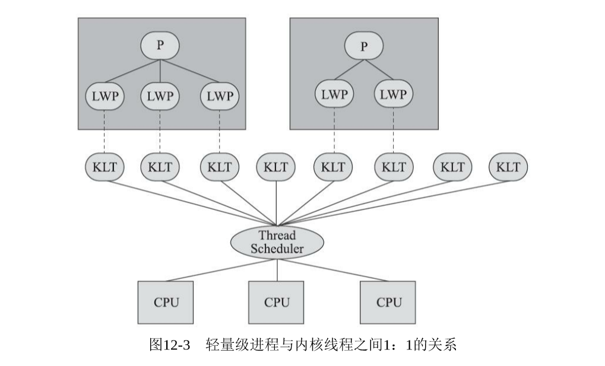

由于内核线程的支持，每个轻量级进程都成为一个独立的调度单元，即使其中某一个轻量级进程在系统调用中被阻塞了，也不会影响整 个进程继续工作。轻量级进程也具有它的局限性：首先，由于是基于内核线程实现的，所以各种线程操作，如创建、析构及同步，都需要进行系统调用。而系统调用的代价相对较高，需要在用户态（User Mode）和内核态（Kernel Mode）中来回切换。其次，每个轻量级进程都需要有一个内核线程的支持，因此轻量级进程要消耗一定的内核资源（如内核线程的栈空间），因此一个系统支持轻量级进程的数量是有限的。

**2.用户线程实现** 

使用用户线程实现的方式被称为1:N实现。广义上来讲，一个线程只要不是内核线程，都可以认为是用户线程（User Thread，UT）的
一种，因此从这个定义上看，轻量级进程也属于用户线程，但轻量级进程的实现始终是建立在内核之上的，许多操作都要进行系统调用，因此效率会受到限制，并不具备通常意义上的用户线程的优点。

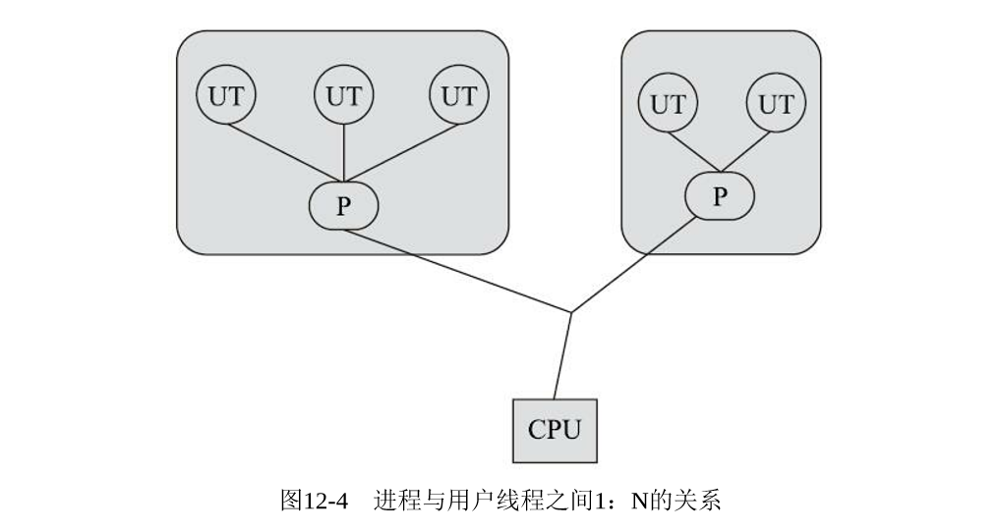

而狭义上的用户线程指的是完全建立在用户空间的线程库上，系统内核不能感知到用户线程的存在及如何实现的。用户线程的建立、同步、销毁和调度完全在用户态中完成，不需要内核的帮助。如果程序实现得当，这种线程不需要切换到内核态，因此操作可以是非常快速且低消耗的，也能够支持规模更大的线程数量，部分高性能数据库中的多线程就是由用户线程实现的。这种进程与用户线程之间1:N的关系称为一对多的线程模型，如图12-4所示。

用户线程的优势在于不需要系统内核支援，劣势也在于没有系统内核的支援，所有的线程操作都需要由用户程序自己去处理。线程的创建、销毁、切换和调度都是用户必须考虑的问题，而且由于操作系统只把处理器资源分配到进程，那诸如“阻塞如何处理”“多处理器系统中如何将线程映射到其他处理器上”这类问题解决起来将会异常困难，甚至有些是不可能实现的。因为使用用户线程实现的程序通常都比较复杂，除了有明确的需求外（譬如以前在不支持多线程的操作系统中的多线程程序、需要支持大规模线程数量的应用），一般的应用程序都不倾向使用用户线程。Java、Ruby等语言都曾经使用过用户线程，最终又都放弃了使用它。但是近年来许多新的、以高并发为卖点的编程语言又普遍支持了用户线程，譬如Golang、Erlang等，使得用户线程的使用率有所回升。

**3.混合实现**

线程除了依赖内核线程实现和完全由用户程序自己实现之外，还有 一种将内核线程与用户线程一起使用的实现方式，被称为N:M实现。 在这种混合实现下，既存在用户线程，也存在轻量级进程。用户线程还是完全建立在用户空间中，因此用户线程的创建、切换、析构等操作依然廉价，并且可以支持大规模的用户线程并发。而操作系统支持的轻量级进程则作为用户线程和内核线程之间的桥梁，这样可以使用内核提供的线程调度功能及处理器映射，并且用户线程的系统调用要通过轻量级进程来完成，这大大降低了整个进程被完全阻塞的风险。在这种混合模式中，用户线程与轻量级进程的数量比是不定的，是N:M的关系，如图12-5所示，这种就是多对多的线程模型。

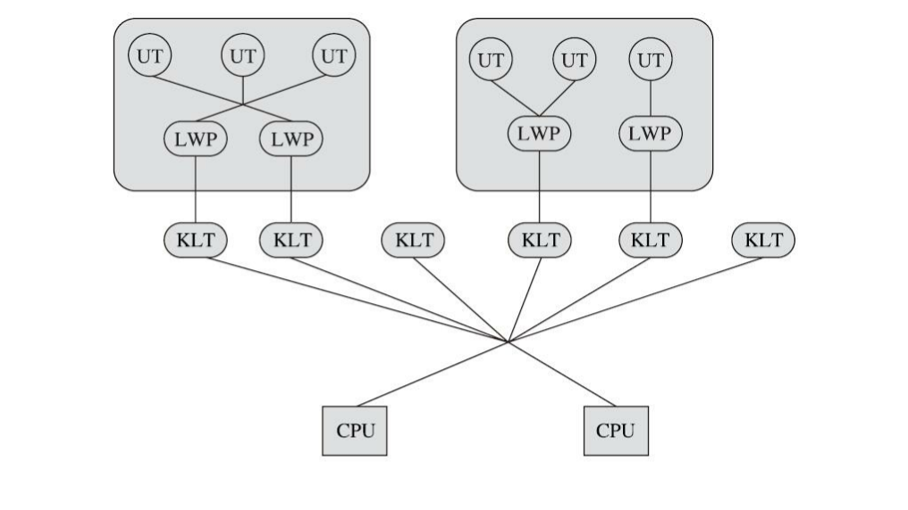

许多UNIX系列的操作系统，如Solaris、HP-UX等都提供了M：N的 线程模型实现。在这些操作系统上的应用也相对更容易应用M：N的线 程模型。

**4.Java线程的实现**

Java线程如何实现并不受Java虚拟机规范的约束，这是一个与具体虚拟机相关的话题。Java线程在早期的Classic虚拟机上（JDK 1.2以 前），是基于一种被称为“绿色线程”（Green Threads）的用户线程实现的，但从JDK 1.3起，“主流”平台上的“主流”商用Java虚拟机的线程模型普遍都被替换为基于操作系统原生线程模型来实现，即采用1:1的线程模型。

**以HotSpot为例，它的每一个Java线程都是直接映射到一个操作系统原生线程来实现的，而且中间没有额外的间接结构，所以HotSpot自己是不会去干涉线程调度的（可以设置线程优先级给操作系统提供调度建议），全权交给底下的操作系统去处理，所以何时冻结或唤醒线程、该给线程分配多少处理器执行时间、该把线程安排给哪个处理器核心去执行等，都是由操作系统完成的，也都是由操作系统全权决定的。**

前面强调是两个“主流”，那就说明肯定还有例外的情况，这里举两个比较著名的例子，一个是用于Java ME的CLDC HotSpot Implementation（CLDC-HI，介绍可见第1章）。它同时支持两种线程模型，默认使用1:N由用户线程实现的线程模型，所有Java线程都映射到一个内核线程上；不过它也可以使用另一种特殊的混合模型，Java线程仍然全部映射到一个内核线程上，但当Java线程要执行一个阻塞调用时，CLDC-HI会为该调用单独开一个内核线程，并且调度执行其他Java线程，等到那个阻塞调用完成之后再重新调度之前的Java线程继续执行。

**另外一个例子是在Solaris平台的HotSpot虚拟机，由于操作系统的线程特性本来就可以同时支持1:1（通过Bound Threads或Alternate Libthread实现）及N:M（通过LWP/Thread Based Synchronization实 现）的线程模型，因此Solaris版的HotSpot也对应提供了两个平台专有的虚拟机参数，即-XX:+UseLWPSynchronization（默认值）和-XX:+UseBoundThreads来明确指定虚拟机使用哪种线程模型。**

操作系统支持怎样的线程模型，在很大程度上会影响上面的Java虚拟机的线程是怎样映射的，这一点在不同的平台上很难达成一致，因此 《Java虚拟机规范》中才不去限定Java线程需要使用哪种线程模型来实现。线程模型只对线程的并发规模和操作成本产生影响，对Java程序的编码和运行过程来说，这些差异都是完全透明的。

#### Java线程调度

线程调度是指系统为线程分配处理器使用权的过程，调度主要方式有两种，分别是协同式（Cooperative Threads-Scheduling）线程调度和抢占式（Preemptive Threads-Scheduling）线程调度。

如果使用协同式调度的多线程系统，线程的执行时间由线程本身来控制，线程把自己的工作执行完了之后，要主动通知系统切换到另外一 个线程上去。协同式多线程的最大好处是实现简单，而且由于线程要把自己的事情干完后才会进行线程切换，切换操作对线程自己是可知的， 所以一般没有什么线程同步的问题。Lua语言中的“协同例程”就是这类实现。它的坏处也很明显：线程执行时间不可控制，甚至如果一个线程的代码编写有问题，一直不告知系统进行线程切换，那么程序就会一直阻塞在那里。很久以前的Windows 3.x系统就是使用协同式来实现多进程多任务的，那是相当不稳定的，只要有一个进程坚持不让出处理器执行时间，就可能会导致整个系统崩溃。

如果使用抢占式调度的多线程系统，那么每个线程将由系统来分配执行时间，线程的切换不由线程本身来决定。譬如在Java中，有Thread::yield()方法可以主动让出执行时间，但是如果想要主动获取执行时间，线程本身是没有什么办法的。在这种实现线程调度的方式下，线程的执行时间是系统可控的，也不会有一个线程导致整个进程甚至整个系统阻塞的问题。**Java使用的线程调度方式就是抢占式调度**。与前面所说的Windows 3.x的例子相对，在Windows 9x/NT内核中就是使用抢占式来实现多进程的，当一个进程出了问题，我们还可以使用任务管理器把这个进程杀掉，而不至于导致系统崩溃。

虽然说Java线程调度是系统自动完成的，但是我们仍然可以“建议”操作系统给某些线程多分配一点执行时间，另外的一些线程则可以少分配一点——这项操作是通过设置线程优先级来完成的。Java语言一共设置了10个级别的线程优先级（Thread.MIN_PRIORITY至Thread.MAX_PRIORITY）。在两个线程同时处于Ready状态时，优先级越高的线程越容易被系统选择执行。

不过，线程优先级并不是一项稳定的调节手段，很显然因为主流虚拟机上的Java线程是被映射到系统的原生线程上来实现的，所以线程调 度最终还是由操作系统说了算。尽管现代的操作系统基本都提供线程优先级的概念，但是并不见得能与Java线程的优先级一一对应，如Solaris 中线程有2147483648（2的31次幂）种优先级，但Windows中就只有七种优先级。如果操作系统的优先级比Java线程优先级更多，那问题还比较好处理，中间留出一点空位就是了，但对于比Java线程优先级少的系统，就不得不出现几个线程优先级对应到同一个操作系统优先级的情况了。表12-1显示了Java线程优先级与Windows线程优先级之间的对应关系，Windows平台的虚拟机中使用了除THREAD_PRIORITY_IDLE之外的其余6种线程优先级，因此在Windows下设置线程优先级为1和2、3和 4、6和7、8和9的效果是完全相同的。 

表12-1　Java线程优先级与各平台线程优先级之间的对应关系

| Java 线程优先级 | Linux | Windows                          | Apple | Bsd  | Solaris |
| :-------------: | :---: | -------------------------------- | :---: | :--: | :-----: |
|        1        |   4   | THREAD_PRIORITY_LOWEST(-2)       |  27   |  0   |    0    |
|        2        |   3   | THREAD_PRIORITY_LOWEST(-2)       |  28   |  3   |   32    |
|        3        |   2   | THREAD_PRIORITY_BELOW_NORMAL(-1) |  29   |  6   |   64    |
|        4        |   1   | THREAD_PRIORITY_BELOW_NORMAL(-1) |  30   |  10  |   96    |
|        5        |   0   | THREAD_PRIORITY_NORMAL(0)        |  31   |  15  |   127   |
|        6        |  -1   | THREAD_PRIORITY_NORMAL(0)        |  32   |  18  |   127   |
|        7        |  -2   | THREAD_PRIORITY_ABOVE_NORMAL(1)  |  33   |  21  |   127   |
|        8        |  -3   | THREAD_PRIORITY_ABOVE_NORMAL(1)  |  34   |  25  |   127   |
|        9        |  -4   | THREAD_PRIORITY_HIGHEST(2)       |  35   |  28  |   127   |
|       10        |  -5   | THREAD_PRIORITY_HIGHEST(2)       |  36   |  31  |   127   |

线程优先级并不是一项稳定的调节手段，这不仅仅体现在某些操作系统上不同的优先级实际会变得相同这一点上，还有其他情况让我们不 能过于依赖线程优先级：优先级可能会被系统自行改变，例如在Windows系统中存在一个叫“优先级推进器”的功能（Priority Boosting， 当然它可以被关掉），大致作用是当系统发现一个线程被执行得特别频繁时，可能会越过线程优先级去为它分配执行时间，从而减少因为线程频繁切换而带来的性能损耗。因此，我们并不能在程序中通过优先级来完全准确判断一组状态都为Ready的线程将会先执行哪一个。

#### Java线程状态转换

Java语言定义了6种线程状态，在任意一个时间点中，一个线程只能有且只有其中的一种状态，并且可以通过特定的方法在不同状态之间转换。这6种状态分别是：

1. **新建（New）**：创建后尚未启动的线程处于这种状态。
2. **运行（Runnable）**：包括操作系统线程状态中的Running和Ready， 也就是处于此状态的线程有可能正在执行，也有可能正在等待着操作系统为它分配执行时间。
3. **无限期等待（Waiting）**：处于这种状态的线程不会被分配处理器执行时间，它们要等待被其他线程显式唤醒。以下方法会让线程陷入无限期的等待状态：

   - 没有设置Timeout参数的Object::wait()方法；
   - 没有设置Timeout参数的Thread::join()方法；
   - LockSupport::park()方法。
4. **限期等待（Timed Waiting）**：处于这种状态的线程也不会被分配处理器执行时间，不过无须等待被其他线程显式唤醒，在一定时间之后它们会由系统自动唤醒。以下方法会让线程进入限期等待状态：
   - Thread::sleep()方法；
   - 设置了Timeout参数的Object::wait()方法；
   - 设置了Timeout参数的Thread::join()方法；
   - LockSupport::parkNanos()方法；
   - LockSupport::parkUntil()方法。
5. **阻塞（Blocked）**：线程被阻塞了，**“阻塞状态”与“等待状态”的区别是“阻塞状态”在等待着获取到一个排它锁**，这个事件将在另外一个线程放弃这个锁的时候发生；而“等待状态”则是在等待一段时间，或者唤醒动作的发生。**在程序等待进入同步区域的时候，线程将进入这种状态。**
6. **结束（Terminated）**：已终止线程的线程状态，线程已经结束执行。

上述6种状态在遇到特定事件发生的时候将会互相转换，它们的转换关系如图12-6所示。

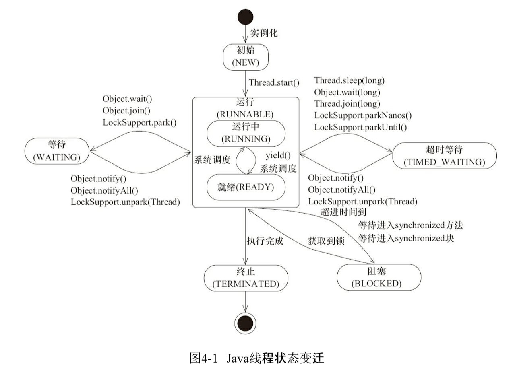

### 12.5　Java与协程

在Java时代的早期，Java语言抽象出来隐藏了各种操作系统线程差异性的统一线程接口，这曾经是它区别于其他编程语言的一大优势。在 此基础上，涌现过无数多线程的应用与框架，譬如在网页访问时， HTTP请求可以直接与Servlet API中的一条处理线程绑定在一起，以“一 对一服务”的方式处理由浏览器发来的信息。语言与框架已经自动屏蔽了相当多同步和并发的复杂性，对于普通开发者而言，几乎不需要专门针对多线程进行学习训练就能完成一般的并发任务。时至今日，这种便捷的并发编程方式和同步的机制依然在有效地运作着，但是在某些场景 下，却也已经显现出了疲态。

#### 内核线程的局限

笔者可以通过一个具体场景来解释目前Java线程面临的困境。今天对Web应用的服务要求，不论是在请求数量上还是在复杂度上，与十多 年前相比已不可同日而语，这一方面是源于业务量的增长，另一方面来自于为了应对业务复杂化而不断进行的服务细分。现代B/S系统中一次对外部业务请求的响应，往往需要分布在不同机器上的大量服务共同协作来实现，这种服务细分的架构在减少单个服务复杂度、增加复用性的同时，也不可避免地增加了服务的数量，缩短了留给每个服务的响应时间。这要求每一个服务都必须在极短的时间内完成计算，这样组合多个服务的总耗时才不会太长；也要求每一个服务提供者都要能同时处理数量更庞大的请求，这样才不会出现请求由于某个服务被阻塞而出现等待。

Java目前的并发编程机制就与上述架构趋势产生了一些矛盾，1:1 的内核线程模型是如今Java虚拟机线程实现的主流选择，但是这种映射 到操作系统上的线程天然的缺陷是切换、调度成本高昂，系统能容纳的线程数量也很有限。以前处理一个请求可以允许花费很长时间在单体应用中，具有这种线程切换的成本也是无伤大雅的，但现在在每个请求本身的执行时间变得很短、数量变得很多的前提下，用户线程切换的开销甚至可能会接近用于计算本身的开销，这就会造成严重的浪费。

传统的Java Web服务器的线程池的容量通常在几十个到两百之间， 当程序员把数以百万计的请求往线程池里面灌时，系统即使能处理得过来，但其中的切换损耗也是相当可观的。现实的需求在迫使Java去研究新的解决方案，同大家又开始怀念以前绿色线程的种种好处，绿色线程已随着Classic虚拟机的消失而被尘封到历史之中，它还会有重现天日的一天吗？

#### 协程的复苏

经过前面对不同线程实现方式的铺垫介绍，我们已经明白了各种线程实现方式的优缺点，所以多数读者看到笔者写“因为映射到了系统的 内核线程中，所以切换调度成本会比较高昂”时并不会觉得有什么问题，但相信还是有一部分治学特别严谨的读者会提问：为什么内核线程调度切换起来成本就要更高？

内核线程的调度成本主要来自于用户态与核心态之间的状态转换， 而这两种状态转换的开销主要来自于响应中断、保护和恢复执行现场的成本。请读者试想以下场景，假设发生了这样一次线程切换：
```shell
线程A -> 系统中断 -> 线程B
```

处理器要去执行线程A的程序代码时，并不是仅有代码程序就能跑得起来，程序是数据与代码的组合体，代码执行时还必须要有上下文数 据的支撑。而这里说的“上下文”，以程序员的角度来看，是方法调用过程中的各种局部的变量与资源；以线程的角度来看，是方法的调用栈中存储的各类信息；而以操作系统和硬件的角度来看，则是存储在内存、 缓存和寄存器中的一个个具体数值。**物理硬件的各种存储设备和寄存器是被操作系统内所有线程共享的资源，当中断发生，从线程A切换到线程B去执行之前，操作系统首先要把线程A的上下文数据妥善保管好， 然后把寄存器、内存分页等恢复到线程B挂起时候的状态，这样线程B被重新激活后才能仿佛从来没有被挂起过。这种保护和恢复现场的工作，免不了涉及一系列数据在各种寄存器、缓存中的来回拷贝，当然不可能是一种轻量级的操作。**

如果说内核线程的切换开销是来自于保护和恢复现场的成本，那如果改为采用用户线程，这部分开销就能够省略掉吗？答案是“不能”。但 是，一旦把保护、恢复现场及调度的工作从操作系统交到程序员手上， 那我们就可以打开脑洞，通过玩出很多新的花样来缩减这些开销。

有一些古老的操作系统（譬如DOS）是单人单工作业形式的，天生就不支持多线程，自然也不会有多个调用栈这样的基础设施。而早在那样的蛮荒时代，就已经出现了今天被称为栈纠缠（Stack Twine）的、由用户自己模拟多线程、自己保护恢复现场的工作模式。其大致的原理是通过在内存里划出一片额外空间来模拟调用栈，只要其他“线程”中方法 压栈、退栈时遵守规则，不破坏这片空间即可，这样多段代码执行时就会像相互缠绕着一样，非常形象。

到后来，操作系统开始提供多线程的支持，靠应用自己模拟多线程的做法自然是变少了许多，但也并没有完全消失，而是演化为用户线程 继续存在。由于最初多数的用户线程是被设计成协同式调度 （Cooperative Scheduling）的，所以它有了一个别名——“协程”（Coroutine）。又由于这时候的协程会完整地做调用栈的保护、恢复工作，所以今天也被称为“有栈协程”（Stackfull Coroutine），起这样的名字是为了便于跟后来的“无栈协程”（Stackless Coroutine）区分开。 无栈协程不是本节的主角，不过还是可以简单提一下它的典型应用，即各种语言中的await、async、yield这类关键字。无栈协程本质上是一种有限状态机，状态保存在闭包里，自然比有栈协程恢复调用栈要轻量得多，但功能也相对更有限。

协程的主要优势是轻量，无论是有栈协程还是无栈协程，都要比传统内核线程要轻量得多。如果进行量化的话，那么如果不显式设置-Xss 或-XX:ThreadStackSize，则在64位Linux上HotSpot的线程栈容量默认是1MB，此外内核数据结构（Kernel Data Structures）还会额外消耗16KB内存。与之相对的，一个协程的栈通常在几百个字节到几KB之 间，所以Java虚拟机里线程池容量达到两百就已经不算小了，而很多支持协程的应用中，同时并存的协程数量可数以十万计。

协程当然也有它的局限，需要在应用层面实现的内容（调用栈、调度器这些）特别多，这个缺点就不赘述了。除此之外，协程在最初，甚 至在今天很多语言和框架中会被设计成协同式调度，这样在语言运行平台或者框架上的调度器就可以做得非常简单。不过有不少资料上显示， 既然取了“协程”这样的名字，它们之间就一定以协同调度的方式工作。 笔者并没有查证到这种“规定”的出处，只能说这种提法在今天太过狭隘 了，非协同式、可自定义调度的协程的例子并不少见，而协同调度的优点与不足在12.4.2节已经介绍过。

具体到Java语言，还会有一些别的限制，譬如HotSpot这样的虚拟机，Java调用栈跟本地调用栈是做在一起的。如果在协程中调用了本地 方法，还能否正常切换协程而不影响整个线程？另外，如果协程中遇传统的线程同步措施会怎样？譬如Kotlin提供的协程实现，一旦遭遇 synchronize关键字，那挂起来的仍将是整个线程。

#### Java的解决方案

对于有栈协程，有一种特例实现名为纤程（Fiber），这个词最早是来自微软公司，后来微软还推出过系统层面的纤程包来方便应用做现场保存、恢复和纤程调度。OpenJDK在2018年创建了Loom项目，这是Java用来应对本节开篇所列场景的官方解决方案，根据目前公开的信息，如无意外，日后该项目为Java语言引入的、与现在线程模型平行的新并发编程机制中应该也会采用“纤程”这个名字，不过这显然跟微软是没有任何关系的。从Oracle官方对“什么是纤程”的解释里可以看出，它就是一种典型的有栈协程。

Loom项目背后的意图是重新提供对用户线程的支持，但与过去的绿色线程不同，这些新功能不是为了取代当前基于操作系统的线程实现，而是会有两个并发编程模型在Java虚拟机中并存，可以在程序中同时使用。新模型有意地保持了与目前线程模型相似的API设计，它们甚至可以拥有一个共同的基类，这样现有的代码就不需要为了使用纤程而进行过多改动，甚至不需要知道背后采用了哪个并发编程模型。Loom团队在JVMLS 2018大会上公布了他们对Jetty基于纤程改造后的测试结果，同样在5000QPS的压力下，以容量为400的线程池的传统模式和每个请求配以一个纤程的新并发处理模式进行对比，前者的请求响应延迟在10000至20000毫秒之间，而后者的延迟普遍在200毫秒以下，具体结果如图12-8所示。

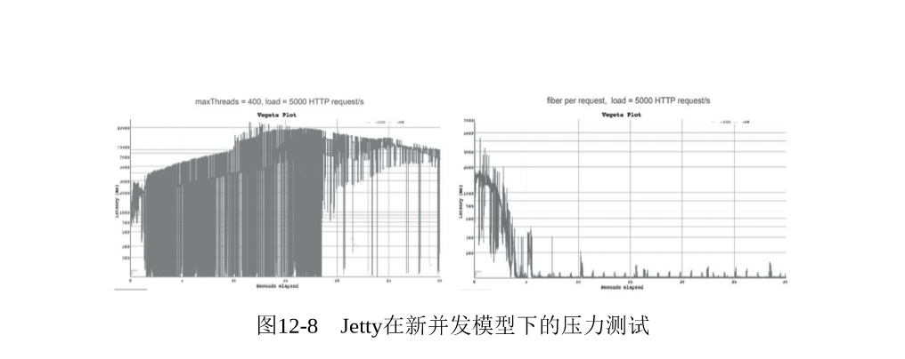

在新并发模型下，一段使用纤程并发的代码会被分为两部分——执行过程（Continuation）和调度器（Scheduler）。执行过程主要用于维护执行现场，保护、恢复上下文状态，而调度器则负责编排所有要执行的代码的顺序。将调度程序与执行过程分离的好处是，用户可以选择自行控制其中的一个或者多个，而且Java中现有的调度器也可以被直接重用。事实上，Loom中默认的调度器就是原来已存在的用于任务分解的Fork/Join池（JDK 7中加入的ForkJoinPool）。

Loom项目目前仍然在进行当中，还没有明确的发布日期，上面笔者介绍的内容日后都有被改动的可能。如果读者现在就想尝试协程，那 可以在项目中使用Quasar协程库，这是一个不依赖Java虚拟机的独立实现的协程库。不依赖虚拟机来实现协程是完全可能的，Kotlin语言的协程就已经证明了这一点。Quasar的实现原理是字节码注入，在字节码层面对当前被调用函数中的所有局部变量进行保存和恢复。这种不依赖 Java虚拟机的现场保护虽然能够工作，但很影响性能，对即时编译器的干扰也非常大，而且必须要求用户手动标注每一个函数是否会在协程上下文被调用，这些都是未来Loom项目要解决的问题。

### 12.6　本章小结

本章中，我们了解了虚拟机Java内存模型的结构及操作，并且讲解 了原子性、可见性、有序性在Java内存模型中的体现，介绍了先行发生 原则的规则及使用。另外，我们还了解了线程在Java语言之中是如何实 现的，以及代表Java未来多线程发展的新并发模型的工作原理。 

关于“高效并发”这个话题，在本章中主要介绍了虚拟机如何实 现“并发”，在下一章中，我们的主要关注点将是虚拟机如何实现“高 效”，以及虚拟机对我们编写的并发代码提供了什么样的优化手段。

## 第13章　线程安全与锁优化

并发处理的广泛应用是Amdahl定律代替摩尔定律成为计算机性能 发展源动力的根本原因，也是人类压榨计算机运算能力的最有力武器。

### 13.1　概述

在软件业发展的初期，程序编写都是以算法为核心的，程序员会把数据和过程分别作为独立的部分来考虑，数据代表问题空间中的客体， 程序代码则用于处理这些数据，这种思维方式直接站在计算机的角度去抽象问题和解决问题，被称为面向过程的编程思想。与此相对，面向对象的编程思想则站在现实世界的角度去抽象和解决问题，它把数据和行为都看作对象的一部分，这样可以让程序员能以符合现实世界的思维方式来编写和组织程序。

面向对象的编程思想极大地提升了现代软件开发的效率和软件可以达到的规模，但是现实世界与计算机世界之间不可避免地存在一些差 异。例如，人们很难想象现实中的对象在一项工作进行期间，会被不停地中断和切换，对象的属性（数据）可能会在中断期间被修改和变脏，而这些事件在计算机世界中是再普通不过的事情。有时候，良好的设计原则不得不向现实做出一些妥协，我们必须保证程序在计算机中正确无误地运行，然后再考虑如何将代码组织得更好，让程序运行得更快。对于本章的主题“高效并发”来说，首先需要保证并发的正确性，然后在此基础上来实现高效。本章就先从如何保证并发的正确性及如何实现线程安全说起。

### 13.2　线程安全

“线程安全”这个名称，相信稍有经验的程序员都听说过，甚至在代码编写和走查的时候可能还会经常挂在嘴边，但是如何找到一个不太拗 口的概念来定义线程安全却不是一件容易的事情。笔者尝试在网上搜索它的概念，找到的是类似于“如果一个对象可以安全地被多个线程同时使用，那它就是线程安全的”这样的定义——并不能说它不正确，但是它没有丝毫可操作性，无法从中获取到任何有用的信息。

笔者认为《Java并发编程实战（Java Concurrency In Practice）》的作者Brian Goetz为“线程安全”做出了一个比较恰当的定义：“当多个线程同时访问一个对象时，如果不用考虑这些线程在运行时环境下的调度和交替执行，也不需要进行额外的同步，或者在调用方进行任何其他的协调操作，调用这个对象的行为都可以获得正确的结果，那就称这个对象是线程安全的。”

这个定义就很严谨而且有可操作性，它要求线程安全的代码都必须具备一个共同特征：代码本身封装了所有必要的正确性保障手段（如互 斥同步等），令调用者无须关心多线程下的调用问题，更无须自己实现任何措施来保证多线程环境下的正确调用。这点听起来简单，但其实并不容易做到，在许多场景中，我们都会将这个定义弱化一些。如果把“调用这个对象的行为”限定为“单次调用”，这个定义的其他描述能够成立的话，那么就已经可以称它是线程安全了。为什么要弱化这个定义？现在先暂且放下这个问题，稍后再详细探讨。

#### Java语言中的线程安全

我们已经有了线程安全的一个可操作的定义，那接下来就讨论一下：在Java语言中，线程安全具体是如何体现的？有哪些操作是线程安 全的？我们这里讨论的线程安全，将以多个线程之间存在共享数据访问为前提。因为如果根本不存在多线程，又或者一段代码根本不会与其他线程共享数据，那么从线程安全的角度上看，程序是串行执行还是多线程执行对它来说是没有什么区别的。

为了更深入地理解线程安全，在这里我们可以不把线程安全当作一个非真即假的二元排他选项来看待，而是按照线程安全的“安全程度”由 强至弱来排序，我们可以将Java语言中各种操作共享的数据分为以下五类：不可变、绝对线程安全、相对线程安全、线程兼容和线程对立。

**1.不可变**

在Java语言里面（特指JDK 5以后，即Java内存模型被修正之后的 Java语言），不可变（Immutable）的对象一定是线程安全的，无论是对象的方法实现还是方法的调用者，都不需要再进行任何线程安全保障措施。在第10章里我们讲解“final关键字带来的可见性”时曾经提到过这一点：只要一个不可变的对象被正确地构建出来（即没有发生this引用逃逸的情况），那其外部的可见状态永远都不会改变，永远都不会看到它在多个线程之中处于不一致的状态。“不可变”带来的安全性是最直接、最纯粹的。

Java语言中，如果多线程共享的数据是一个基本数据类型，那么只要在定义时使用final关键字修饰它就可以保证它是不可变的。如果共享 数据是一个对象，由于Java语言目前暂时还没有提供值类型的支持，那就需要对象自行保证其行为不会对其状态产生任何影响才行。如果读者没想明白这句话所指的意思，不妨类比java.lang.String类的对象实例， 它是一个典型的不可变对象，用户调用它的substring()、replace()和concat()这些方法都不会影响它原来的值，只会返回一个新构造的字符串对象。

保证对象行为不影响自己状态的途径有很多种，最简单的一种就是把对象里面带有状态的变量都声明为final，这样在构造函数结束之后， 它就是不可变的，例如代码清单13-1中所示的java.lang.Integer构造函数，它通过将内部状态变量value定义为final来保障状态不变。

代码清单13-1　JDK中Integer类的构造函数

```java
/** 
 * The value of the <code>Integer</code>. 
 * @serial 
 */
private final int value;
/** 
 * Constructs a newly allocated <code>Integer</code> object that 
 * represents the specified <code>int</code> value. 
 * 
 * @param   value   the value to be represented by the 
 * <code>Integer</code> object. 
 */ 
public Integer(int value) {    
    this.value = value; 
}
```

**在Java类库API中符合不可变要求的类型，除了上面提到的String之外，常用的还有枚举类型及java.lang.Number的部分子类，如Long和 Double等数值包装类型、BigInteger和BigDecimal等大数据类型**。但同为Number子类型的原子类AtomicInteger和AtomicLong则是可变的，读者不妨看看这两个原子类的源码，想一想为什么它们要设计成可变的。

**2.绝对线程安全**

绝对的线程安全能够完全满足Brian Goetz给出的线程安全的定义， 这个定义其实是很严格的，一个类要达到“不管运行时环境如何，调用 者都不需要任何额外的同步措施”可能需要付出非常高昂的，甚至不切实际的代价。在Java API中标注自己是线程安全的类，大多数都不是绝对的线程安全。我们可以通过Java API中一个不是“绝对线程安全”的“线程安全类型”来看看这个语境里的“绝对”究竟是什么意思。

如果说java.util.Vector是一个线程安全的容器，相信所有的Java程序员对此都不会有异议，因为它的add()、get()和size()等方法都是被 synchronized修饰的，尽管这样效率不高，但保证了具备原子性、可见性和有序性。不过，即使它所有的方法都被修饰synchronized，也不意味着调用它的时候就永远都不再需要同步手段了，请看看代码清单
13-2中的测试代码。

代码清单13-2　对Vector线程安全的测试
```java
private static Vector<Integer> vector = new Vector<Integer>();

public static void main(String[] args) {    
    while (true) {        
        for (int i = 0; i < 10; i++) {            
            vector.add(i);        
        }
        Thread removeThread = new Thread(new Runnable() {            
            @Override            
            public void run() {                
                for (int i = 0; i < vector.size(); i++) {                    
                    vector.remove(i);                
                }            
            }        
        });
        
        Thread printThread = new Thread(new Runnable() {            
            @Override            
            public void run() {                
                for (int i = 0; i < vector.size(); i++) {                    
                    System.out.println((vector.get(i)));                
                }            
            }        
        });
        
        removeThread.start();        
        printThread.start();
        //不要同时产生过多的线程，否则会导致操作系统假死        
        while (Thread.activeCount() > 20);    
    } 
}
```

很明显，尽管这里使用到的Vector的get()、remove()和size()方法都是同步的，但是在多线程的环境中，如果不在方法调用端做额外的同步措施，使用这段代码仍然是不安全的。因为如果另一个线程恰好在错误的时间里删除了一个元素，导致序号i已经不再可用，再用i访问数组就会抛出一个ArrayIndexOutOfBoundsException异常。如果要保证这段代码能正确执行下去，我们不得不把removeThread和printThread的定义改成代码清单13-3所示的这样。

代码清单13-3　必须加入同步保证Vector访问的线程安全性
```java
Thread removeThread = new Thread(new Runnable() {    
    @Override    
    public void run() {        
        synchronized (vector) {            
            for (int i = 0; i < vector.size(); i++) {                
                vector.remove(i);            
            }        
        }    
    } 
});

Thread printThread = new Thread(new Runnable() {    
    @Override    
    public void run() {        
        synchronized (vector) {            
            for (int i = 0; i < vector.size(); i++) {                
                System.out.println((vector.get(i)));            
            }        
        }    
    } 
});
```

假如Vector一定要做到绝对的线程安全，那就必须在它内部维护一组一致性的快照访问才行，每次对其中元素进行改动都要产生新的快 照，这样要付出的时间和空间成本都是非常大的。

**3.相对线程安全**

相对线程安全就是我们通常意义上所讲的线程安全，它需要保证对这个对象单次的操作是线程安全的，我们在调用的时候不需要进行额外 的保障措施，但是对于一些特定顺序的连续调用，就可能需要在调用端使用额外的同步手段来保证调用的正确性。代码清单13-2和代码清单133就是相对线程安全的案例。

在Java语言中，大部分声称线程安全的类都属于这种类型，例如Vector、HashTable、Collections的synchronizedCollection()方法包装的集合等。

**4.线程兼容**

线程兼容是指对象本身并不是线程安全的，但是可以通过在调用端正确地使用同步手段来保证对象在并发环境中可以安全地使用。我们平 常说一个类不是线程安全的，通常就是指这种情况。Java类库API中大部分的类都是线程兼容的，如与前面的Vector和HashTable相对应的集合类ArrayList和HashMap等。 

**5.线程对立**

线程对立是指不管调用端是否采取了同步措施，都无法在多线程环境中并发使用代码。由于Java语言天生就支持多线程的特性，线程对立 这种排斥多线程的代码是很少出现的，而且通常都是有害的，应当尽量避免。

一个线程对立的例子是Thread类的suspend()和resume()方法。如果有两个线程同时持有一个线程对象，一个尝试去中断线程，一个尝试去恢复线程，在并发进行的情况下，无论调用时是否进行了同步，目标线程都存在死锁风险——假如suspend()中断的线程就是即将要执行resume()的那个线程，那就肯定要产生死锁了。也正是这个原因， suspend()和resume()方法都已经被声明废弃了。常见的线程对立的操作还有System.setIn()、Sytem.setOut()和System.runFinalizersOnExit()等。 

#### 线程安全的实现方法

了解过什么是线程安全之后，紧接着的一个问题就是我们应该如何实现线程安全。这听起来似乎是一件由代码如何编写来决定的事情，不 应该出现在讲解Java虚拟机的书里。确实，如何实现线程安全与代码编写有很大的关系，但虚拟机提供的同步和锁机制也起到了至关重要的作用。在本节中，如何编写代码实现线程安全，以及虚拟机如何实现同步与锁这两方面都会涉及，相对而言更偏重后者一些，只要读者明白了Java虚拟机线程安全措施的原理与运作过程，自己再去思考代码如何编写就不是一件困难的事情了。

**1.互斥同步**

互斥同步（Mutual Exclusion & Synchronization）是一种最常见也是最主要的并发正确性保障手段。同步是指在多个线程并发访问共享数据时，保证共享数据在同一个时刻只被一条（或者是一些，当使用信号量的时候）线程使用。而互斥是实现同步的一种手段，临界区（Critical Section）、互斥量（Mutex）和信号量（Semaphore）都是常见的互斥实现方式。因此在“互斥同步”这四个字里面，互斥是因，同步是果；互斥是方法，同步是目的。

在Java里面，最基本的互斥同步手段就是synchronized关键字，这是一种块结构（Block Structured）的同步语法。synchronized关键字经过Javac编译之后，会在同步块的前后分别形成monitorenter和monitorexit这两个字节码指令。这两个字节码指令都需要一个reference类型的参数来指明要锁定和解锁的对象。如果Java源码中的synchronized明确指定了对象参数，那就以这个对象的引用作为reference；如果没有明确指定，那 将根据synchronized修饰的方法类型（如实例方法或类方法），来决定是取代码所在的对象实例还是取类型对应的Class对象来作为线程要持有的锁。

**根据《Java虚拟机规范》的要求，在执行monitorenter指令时，首先要去尝试获取对象的锁。如果这个对象没被锁定，或者当前线程已经持有了那个对象的锁，就把锁的计数器的值增加一，而在执行monitorexit指令时会将锁计数器的值减一。一旦计数器的值为零，锁随即就被释放了。如果获取对象锁失败，那当前线程就应当被阻塞等待，直到请求锁定的对象被持有它的线程释放为止。**

从功能上看，根据以上《Java虚拟机规范》对monitorenter和monitorexit的行为描述，我们可以得出两个关于synchronized的直接推 论，这是使用它时需特别注意的：

- 被synchronized修饰的同步块对同一条线程来说是可重入的。这意味着同一线程反复进入同步块也不会出现自己把自己锁死的情况。
- 被synchronized修饰的同步块在持有锁的线程执行完毕并释放锁之前，会无条件地阻塞后面其他线程的进入。这意味着无法像处理某些数据库中的锁那样，强制已获取锁的线程释放锁；也无法强制正在等待锁的线程中断等待或超时退出。

从执行成本的角度看，持有锁是一个重量级（Heavy-Weight）的操作。在第10章中我们知道了在主流Java虚拟机实现中，Java的线程是映射到操作系统的原生内核线程之上的，如果要阻塞或唤醒一条线程，则需要操作系统来帮忙完成，这就不可避免地陷入用户态到核心态的转换中，进行这种状态转换需要耗费很多的处理器时间。尤其是对于代码特别简单的同步块（譬如被synchronized修饰的getter()或setter()方法），状态转换消耗的时间甚至会比用户代码本身执行的时间还要长。因此才说，synchronized是Java语言中一个重量级的操作，有经验的程序员都只会在确实必要的情况下才使用这种操作。而虚拟机本身也会进行一些优化，譬如在通知操作系统阻塞线程之前加入一段自旋等待过程，以避免频繁地切入核心态之中。稍后我们会专门介绍Java虚拟机锁优化的措施。

从上面的介绍中我们可以看到synchronized的局限性，除了synchronized关键字以外，自JDK 5起（实现了JSR 166），Java类库中新提供了java.util.concurrent包（下文称J.U.C包），其中的 java.util.concurrent.locks.Lock接口便成了Java的另一种全新的互斥同步手段。基于Lock接口，用户能够以非块结构（Non-Block Structured）来实现互斥同步，从而摆脱了语言特性的束缚，改为在类库层面去实现同步，这也为日后扩展出不同调度算法、不同特征、不同性能、不同语义的各种锁提供了广阔的空间。

重入锁（ReentrantLock）是Lock接口最常见的一种实现，顾名思义，它与synchronized一样是可重入的。在基本用法上，ReentrantLock也与synchronized很相似，只是代码写法上稍有区别而已。不过，ReentrantLock与synchronized相比增加了一些高级功能，主要有以下三项：等待可中断、可实现公平锁及锁可以绑定多个条件。

- **等待可中断**：是指当持有锁的线程长期不释放锁的时候，正在等待的线程可以选择放弃等待，改为处理其他事情。可中断特性对处理执行时间非常长的同步块很有帮助。
- **公平锁**：是指多个线程在等待同一个锁时，必须按照申请锁的时间顺序来依次获得锁；而非公平锁则不保证这一点，在锁被释放时，任何一个等待锁的线程都有机会获得锁。synchronized中的锁是非公平的，ReentrantLock在默认情况下也是非公平的，但可以通过带布尔值的构造函数要求使用公平锁。不过一旦使用了公平锁，将会导致ReentrantLock的性能急剧下降，会明显影响吞吐量。
- **锁绑定多个条件**：是指一个ReentrantLock对象可以同时绑定多个Condition对象。在synchronized中，锁对象的wait()跟它的notify()或者notifyAll()方法配合可以实现一个隐含的条件，如果要和多于一个的条件关联的时候，就不得不额外添加一个锁；而ReentrantLock则无须这样做，多次调用newCondition()方法即可。 

如果需要使用上述功能，使用ReentrantLock是一个很好的选择，那如果是基于性能考虑呢？synchronized对性能的影响，尤其在JDK 5之前是很显著的，为此在JDK 6中还专门进行过针对性的优化。以synchronized和ReentrantLock的性能对比为例，Brian Goetz对这两种锁在JDK 5、单核处理器及双Xeon处理器环境下做了一组吞吐量对比的实验，实验结果如图13-1和图13-2所示。

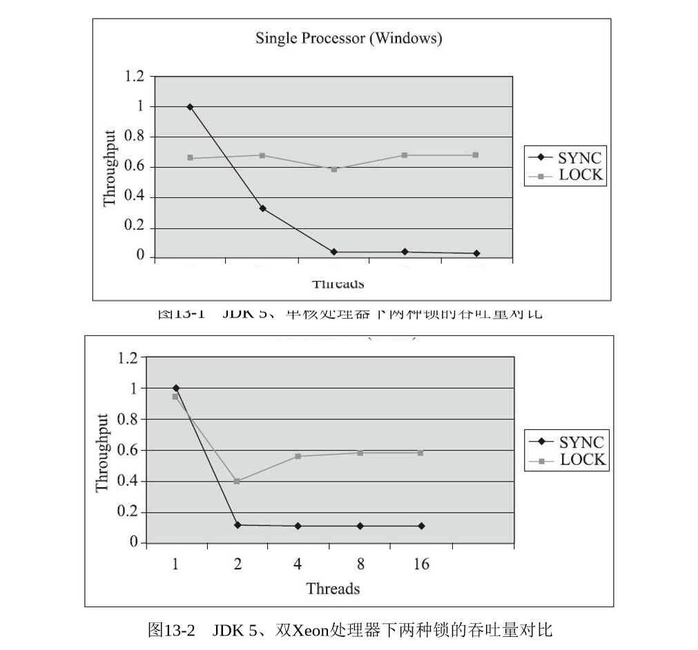

从图13-1和图13-2中可以看出，多线程环境下synchronized的吞吐量下降得非常严重，而ReentrantLock则能基本保持在同一个相对稳定的水平上。但与其说ReentrantLock性能好，倒不如说当时的synchronized有非常大的优化余地，后续的技术发展也证明了这一点。当JDK 6中加入了大量针对synchronized锁的优化措施（下一节我们就会讲解这些优化措施）之后，相同的测试中就发现synchronized与ReentrantLock的性能基本上能够持平。相信现在阅读本书的读者所开发的程序应该都是使用 JDK 6或以上版本来部署的，所以性能已经不再是选择synchronized或者ReentrantLock的决定因素。

根据上面的讨论，ReentrantLock在功能上是synchronized的超集， 在性能上又至少不会弱于synchronized，那synchronized修饰符是否应该被直接抛弃，不再使用了呢？当然不是，基于以下理由，笔者仍然推荐在synchronized与ReentrantLock都可满足需要时优先使用synchronized：

- synchronized是在Java语法层面的同步，足够清晰，也足够简单。 每个Java程序员都熟悉synchronized，但J.U.C中的Lock接口则并非如此。因此在只需要基础的同步功能时，更推荐synchronized。
- Lock应该确保在finally块中释放锁，否则一旦受同步保护的代码块中抛出异常，则有可能永远不会释放持有的锁。这一点必须由程序员自己来保证，而使用synchronized的话则可以由Java虚拟机来确保即使出现异常，锁也能被自动释放。
- 尽管在JDK 5时代ReentrantLock曾经在性能上领先过synchronized，但这已经是十多年之前的胜利了。从长远来看，Java虚拟机更容易针对synchronized来进行优化，因为Java虚拟机可以在线程和对象的元数据中记录synchronized中锁的相关信息，而使用J.U.C中的Lock的话，Java虚拟机是很难得知具体哪些锁对象是由特定线程锁持有的。

**2.非阻塞同步**

互斥同步面临的主要问题是进行线程阻塞和唤醒所带来的性能开销，因此这种同步也被称为阻塞同步（Blocking Synchronization）。从 解决问题的方式上看，互斥同步属于一种悲观的并发策略，其总是认为只要不去做正确的同步措施（例如加锁），那就肯定会出现问题，无论共享的数据是否真的会出现竞争，它都会进行加锁（这里讨论的是概念模型，实际上虚拟机会优化掉很大一部分不必要的加锁），这将会导致用户态到核心态转换、维护锁计数器和检查是否有被阻塞的线程需要被唤醒等开销。随着硬件指令集的发展，我们已经有了另外一个选择：基于冲突检测的乐观并发策略，通俗地说就是不管风险，先进行操作，如果没有其他线程争用共享数据，那操作就直接成功了；如果共享的数据的确被争用，产生了冲突，那再进行其他的补偿措施，最常用的补偿措施是不断地重试，直到出现没有竞争的共享数据为止。这种乐观并发策略的实现不再需要把线程阻塞挂起，因此这种同步操作被称为非阻塞同步（Non-Blocking Synchronization），使用这种措施的代码也常被称为无锁（Lock-Free）编程。

为什么笔者说使用乐观并发策略需要“硬件指令集的发展”？因为我们必须要求操作和冲突检测这两个步骤具备原子性。靠什么来保证原子 性？如果这里再使用互斥同步来保证就完全失去意义了，所以我们只能 靠硬件来实现这件事情，硬件保证某些从语义上看起来需要多次操作的行为可以只通过一条处理器指令就能完成，这类指令常用的有：

- 测试并设置（Test-and-Set）；
- 获取并增加（Fetch-and-Increment）；
- 交换（Swap）；
- 比较并交换（Compare-and-Swap，下文称CAS）；
- 加载链接/条件储存（Load-Linked/Store-Conditional，下文称 LL/SC）。

其中，前面的三条是20世纪就已经存在于大多数指令集之中的处理器指令，后面的两条是现代处理器新增的，而且这两条指令的目的和功 能也是类似的。在IA64、x86指令集中有用cmpxchg指令完成的CAS功能，在SPARC-TSO中也有用casa指令实现的，而在ARM和PowerPC架构 下，则需要使用一对ldrex/strex指令来完成LL/SC的功能。因为Java里最终暴露出来的是CAS操作，所以我们以CAS指令为例进行讲解。

**CAS指令需要有三个操作数，分别是内存位置（在Java中可以简单地理解为变量的内存地址，用V表示）、旧的预期值（用A表示）和准备设置的新值（用B表示）。CAS指令执行时，当且仅当V符合A时，处理器才会用B更新V的值，否则它就不执行更新。但是，不管是否更新了V的值，都会返回V的旧值，上述的处理过程是一个原子操作，执行期间不会被其他线程中断。**

在JDK 5之后，Java类库中才开始使用CAS操作，该操作由sun.misc.Unsafe类里面的compareAndSwapInt()和compareAndSwapLong() 等几个方法包装提供。HotSpot虚拟机在内部对这些方法做了特殊处理，即时编译出来的结果就是一条平台相关的处理器CAS指令，没有方法调用的过程，或者可以认为是无条件内联进去了。不过由于Unsafe类在设计上就不是提供给用户程序调用的（Unsafe::getUnsafe()的代码中限制了只有启动类加载器（Bootstrap ClassLoader）加载的Class才能访问它），因此在JDK 9之前只有Java类库可以使用CAS，譬如J.U.C包里面的整数原子类，其中的compareAndSet()和getAndIncrement()等方法都使用了Unsafe类的CAS操作来实现。而如果用户程序也有使用CAS操作的需求，那要么就采用反射手段突破Unsafe的访问限制，要么就只能通过Java类库API来间接使用它。直到JDK 9之后，Java类库才在VarHandle类里开放了面向用户程序使用的CAS操作。

下面笔者将用一段在前面章节中没有解决的问题代码来介绍如何通过CAS操作避免阻塞同步。测试的代码如代码清单12-1所示，为了节省 版面笔者就不重复贴到这里了。这段代码里我们曾经通过20个线程自增10000次的操作来证明volatile变量不具备原子性，那么如何才能让它具备原子性呢？之前我们的解决方案是把race++操作或increase()方法用同步块包裹起来，这毫无疑问是一个解决方案，但是如果改成代码清单 13-4所示的写法，效率将会提高许多。

代码清单13-4　Atomic的原子自增运算
```java
/** 
 * Atomic变量自增运算测试 
 * 
 * @author zzm 
 */ 
public class AtomicTest {
    public static AtomicInteger race = new AtomicInteger(0);
    
    public static void increase() {        
        race.incrementAndGet();    
    }
    
    private static final int THREADS_COUNT = 20;
    
    public static void main(String[] args) throws Exception {        
        Thread[] threads = new Thread[THREADS_COUNT];        
        for (int i = 0; i < THREADS_COUNT; i++) {
            threads[i] = new Thread(new Runnable() {                
                @Override                
                public void run() {                    
                    for (int i = 0; i < 10000; i++) {                        
                        increase();                    
                    }                
                }            
            });            
            threads[i].start();        
        }        
        while (Thread.activeCount() > 1)            
            Thread.yield();
        System.out.println(race);    
    } 
}
```

运行结果如下：
```shell
200000
```

使用AtomicInteger代替int后，程序输出了正确的结果，这一切都要归功于incrementAndGet()方法的原子性。它的实现其实非常简单，如代码清单13-5所示。

代码清单13-5　incrementAndGet()方法的JDK源码
```java
/** 
 * Atomically increment by one the current value. 
 * @return the updated value 
 */ 
public final int incrementAndGet() {    
    for (;;) {        
        int current = get();        
        int next = current + 1;        
        if (compareAndSet(current, next))            
            return next;    
    } 
}
```

incrementAndGet()方法在一个无限循环中，不断尝试将一个比当前值大一的新值赋值给自己。如果失败了，那说明在执行CAS操作的时 候，旧值已经发生改变，于是再次循环进行下一次操作，直到设置成功为止。

尽管CAS看起来很美好，既简单又高效，但显然这种操作无法涵盖互斥同步的所有使用场景，并且CAS从语义上来说并不是真正完美的，它存在一个逻辑漏洞：如果一个变量V初次读取的时候是A值，并且在准备赋值的时候检查到它仍然为A值，那就能说明它的值没有被其他线程改变过了吗？这是不能的，因为如果在这段期间它的值曾经被改成B，后来又被改回为A，那CAS操作就会误认为它从来没有被改变过。 这个漏洞称为CAS操作的“ABA问题”。J.U.C包为了解决这个问题，提供了一个带有标记的原子引用类AtomicStampedReference，它可以通过控制变量值的版本来保证CAS的正确性。不过目前来说这个类处于相当鸡肋的位置，大部分情况下ABA问题不会影响程序并发的正确性，如果需要解决ABA问题，改用传统的互斥同步可能会比原子类更为高效。

**3.无同步方案**

要保证线程安全，也并非一定要进行阻塞或非阻塞同步，同步与线程安全两者没有必然的联系。同步只是保障存在共享数据争用时正确性 的手段，如果能让一个方法本来就不涉及共享数据，那它自然就不需要任何同步措施去保证其正确性，因此会有一些代码天生就是线程安全的，笔者简单介绍其中的两类。

可重入代码（Reentrant Code）：这种代码又称纯代码（Pure Code），是指可以在代码执行的任何时刻中断它，转而去执行另外一段代码（包括递归调用它本身），而在控制权返回后，原来的程序不会出现任何错误，也不会对结果有所影响。在特指多线程的上下文语境里（不涉及信号量等因素），我们可以认为可重入代码是线程安全代码的一个真子集，这意味着相对线程安全来说，可重入性是更为基础的特性，它可以保证代码线程安全，即所有可重入的代码都是线程安全的， 但并非所有的线程安全的代码都是可重入的。

可重入代码有一些共同的特征，例如，不依赖全局变量、存储在堆上的数据和公用的系统资源，用到的状态量都由参数中传入，不调用非 可重入的方法等。我们可以通过一个比较简单的原则来判断代码是否具备可重入性：如果一个方法的返回结果是可以预测的，只要输入了相同的数据，就都能返回相同的结果，那它就满足可重入性的要求，当然也就是线程安全的。

线程本地存储（Thread Local Storage）：如果一段代码中所需要的数据必须与其他代码共享，那就看看这些共享数据的代码是否能保证在同一个线程中执行。如果能保证，我们就可以把共享数据的可见范围限制在同一个线程之内，这样，无须同步也能保证线程之间不出现数据争用的问题。

符合这种特点的应用并不少见，大部分使用消费队列的架构模式 （如“生产者-消费者”模式）都会将产品的消费过程限制在一个线程中消费完，其中最重要的一种应用实例就是经典Web交互模型中的“一个请求对应一个服务器线程”（Thread-per-Request）的处理方式，这种处理方式的广泛应用使得很多Web服务端应用都可以使用线程本地存储来解决线程安全问题。

Java语言中，如果一个变量要被多线程访问，可以使用volatile关键字将它声明为“易变的”；如果一个变量只要被某个线程独享，Java中就 没有类似C++中__declspec(thread)这样的关键字去修饰，不过我们还是可以通过java.lang.ThreadLocal类来实现线程本地存储的功能。每一个线程的Thread对象中都有一个ThreadLocalMap对象，这个对象存储了一组以ThreadLocal.threadLocalHashCode为键，以本地线程变量为值的K-V值对，ThreadLocal对象就是当前线程的ThreadLocalMap的访问入口，每一个ThreadLocal对象都包含了一个独一无二的threadLocalHashCode值， 使用这个值就可以在线程K-V值对中找回对应的本地线程变量。

### 13.3　锁优化

高效并发是从JDK 5升级到JDK 6后一项重要的改进项，HotSpot虚拟机开发团队在这个版本上花费了大量的资源去实现各种锁优化技术， 如适应性自旋（Adaptive Spinning）、锁消除（Lock Elimination）、锁膨胀（Lock Coarsening）、轻量级锁（Lightweight Locking）、偏向锁 （Biased Locking）等，这些技术都是为了在线程之间更高效地共享数据及解决竞争问题，从而提高程序的执行效率。

#### 自旋锁与自适应自旋

**前面我们讨论互斥同步的时候，提到了互斥同步对性能最大的影响是阻塞的实现，挂起线程和恢复线程的操作都需要转入内核态中完成， 这些操作给Java虚拟机的并发性能带来了很大的压力**。同时，虚拟机的开发团队也注意到在许多应用上，共享数据的锁定状态只会持续很短的一段时间，为了这段时间去挂起和恢复线程并不值得。现在绝大多数的个人电脑和服务器都是多路（核）处理器系统，如果物理机器有一个以上的处理器或者处理器核心，能让两个或以上的线程同时并行执行，我们就可以让后面请求锁的那个线程“稍等一会”，但不放弃处理器的执行时间，看看持有锁的线程是否很快就会释放锁。为了让线程等待，我们只须让线程执行一个忙循环（自旋），这项技术就是所谓的自旋锁。

**一句话，自旋锁就是解决线程锁等待带来的线程挂起和恢复等开销，让处于锁等待的线程执行一个忙等(自旋)**

自旋锁在JDK 1.4.2中就已经引入，只不过默认是关闭的，可以使用-XX:+UseSpinning参数来开启，在JDK 6中就已经改为默认开启了。自旋等待不能代替阻塞，且先不说对处理器数量的要求，自旋等待本身虽然避免了线程切换的开销，但它是要占用处理器时间的，所以如果锁被占用的时间很短，自旋等待的效果就会非常好，反之如果锁被占用的时间很长，那么自旋的线程只会白白消耗处理器资源，而不会做任何有价值的工作，这就会带来性能的浪费。因此自旋等待的时间必须有一定的限度，如果自旋超过了限定的次数仍然没有成功获得锁，就应当使用传统的方式去挂起线程。自旋次数的默认值是十次，用户也可以使用参数-XX:PreBlockSpin来自行更改。 

不过无论是默认值还是用户指定的自旋次数，对整个Java虚拟机中所有的锁来说都是相同的。在JDK 6中对自旋锁的优化，引入了自适应 的自旋。自适应意味着自旋的时间不再是固定的了，而是由前一次在同一个锁上的自旋时间及锁的拥有者的状态来决定的。如果在同一个锁对象上，自旋等待刚刚成功获得过锁，并且持有锁的线程正在运行中，那么虚拟机就会认为这次自旋也很有可能再次成功，进而允许自旋等待持续相对更长的时间，比如持续100次忙循环。另一方面，如果对于某个锁，自旋很少成功获得过锁，那在以后要获取这个锁时将有可能直接省略掉自旋过程，以避免浪费处理器资源。有了自适应自旋，随着程序运行时间的增长及性能监控信息的不断完善，虚拟机对程序锁的状况预测就会越来越精准，虚拟机就会变得越来越“聪明”了。

**由于自适应自旋的存在，诸如-XX:+UseSpinning、-XX:PreBlockSpin等控制自旋锁的参数都JDK1.6中被移除了**

#### 锁消除

锁消除是指虚拟机即时编译器在运行时，对一些代码要求同步，但是对被检测到不可能存在共享数据竞争的锁进行消除。锁消除的主要判 定依据来源于逃逸分析的数据支持（第11章已经讲解过逃逸分析技术），如果判断到一段代码中，在堆上的所有数据都不会逃逸出去被其 他线程访问到，那就可以把它们当作栈上数据对待，认为它们是线程私有的，同步加锁自然就无须再进行。

也许读者会有疑问，变量是否逃逸，对于虚拟机来说是需要使用复杂的过程间分析才能确定的，但是程序员自己应该是很清楚的，怎么会 在明知道不存在数据争用的情况下还要求同步呢？这个问题的答案是：有许多同步措施并不是程序员自己加入的，同步的代码在Java程序中出现的频繁程度也许超过了大部分读者的想象。我们来看看如代码清单13-6所示的例子，这段非常简单的代码仅仅是输出三个字符串相加的结果，无论是源代码字面上，还是程序语义上都没有进行同步。

代码清单13-6　一段看起来没有同步的代码
```java
public String concatString(String s1, String s2, String s3) {    
    return s1 + s2 + s3; 
}
```

我们也知道，由于String是一个不可变的类，对字符串的连接操作总是通过生成新的String对象来进行的，因此Javac编译器会对String连接做自动优化。在JDK 5之前，字符串加法会转化为StringBuffer对象的连续append()操作，在JDK 5及以后的版本中，会转化为StringBuilder对象的连续append()操作。即代码清单13-6所示的代码可能会变成代码清单13-7所示的样子。

代码清单13-7　Javac转化后的字符串连接操作
```java
public String concatString(String s1, String s2, String s3) {    
    StringBuffer sb = new StringBuffer();    
    sb.append(s1);    
    sb.append(s2);
    sb.append(s3);    
    return sb.toString(); 
}
```

现在大家还认为这段代码没有涉及同步吗？每个StringBuffer.append()方法中都有一个同步块，锁就是sb对象。虚拟机观察变量sb，经过逃逸分析后会发现它的动态作用域被限制在concatString()方法内部。也就是sb的所有引用都永远不会逃逸到 concatString()方法之外，其他线程无法访问到它，所以这里虽然有锁，但是可以被安全地消除掉。**在解释执行时这里仍然会加锁，但在经过服务端编译器的即时编译之后，这段代码就会忽略所有的同步措施而直接执行。**

客观地说，既然谈到锁消除与逃逸分析，那虚拟机就不可能是JDK 5之前的版本，所以实际上会转化为非线程安全的StringBuilder来完成字符串拼接，并不会加锁。但是这也不影响笔者用这个例子证明Java对象中同步的普遍性。

#### 锁粗化

原则上，我们在编写代码的时候，总是推荐将同步块的作用范围限制得尽量小——只在共享数据的实际作用域中才进行同步，这样是为了 使得需要同步的操作数量尽可能变少，即使存在锁竞争，等待锁的线程也能尽可能快地拿到锁。

大多数情况下，上面的原则都是正确的，但是如果一系列的连续操作都对同一个对象反复加锁和解锁，甚至加锁操作是出现在循环体之中 的，那即使没有线程竞争，频繁地进行互斥同步操作也会导致不必要的性能损耗。

代码清单13-7所示连续的append()方法就属于这类情况。如果虚拟机探测到有这样一串零碎的操作都对同一个对象加锁，将会把加锁同步 的范围扩展（粗化）到整个操作序列的外部，以代码清单13-7为例，就是扩展到第一个append()操作之前直至最后一个append()操作之后，这样只需要加锁一次就可以了。

#### 轻量级锁

轻量级锁是JDK 6时加入的新型锁机制，它名字中的“轻量级”是相对于使用操作系统互斥量来实现的传统锁而言的，因此传统的锁机制就 被称为“重量级”锁。不过，需要强调一点，**轻量级锁并不是用来代替重量级锁的，它设计的初衷是在没有多线程竞争的前提下，减少传统的重量级锁使用操作系统互斥量产生的性能消耗。**

要理解轻量级锁，以及后面会讲到的偏向锁的原理和运作过程，必须要对HotSpot虚拟机对象的内存布局（尤其是对象头部分）有所了解。HotSpot虚拟机的对象头（Object Header）分为两部分，第一部分用于存储对象自身的运行时数据，如哈希码（HashCode）、GC分代年龄 （Generational GC Age）等。这部分数据的长度在32位和64位的Java虚拟机中分别会占用32个或64个比特，官方称它为“Mark Word”。这部分是实现轻量级锁和偏向锁的关键。另外一部分用于存储指向方法区对象类型数据的指针，如果是数组对象，还会有一个额外的部分用于存储数组长度。这些对象内存布局的详细内容，我们已经在第2章中学习过， 在此不再赘述，只针对锁的角度做进一步细化。

由于对象头信息是与对象自身定义的数据无关的额外存储成本，考虑到Java虚拟机的空间使用效率，**Mark Word被设计成一个非固定的动态数据结构**，以便在极小的空间内存储尽量多的信息。**它会根据对象的状态复用自己的存储空间**。例如在32位的HotSpot虚拟机中，对象未被锁定的状态下，Mark Word的32个比特空间里的25个比特将用于存储对象哈希码，4个比特用于存储对象分代年龄，2个比特用于存储锁标志位，还有1个比特固定为0（这表示未进入偏向模式）。对象除了未被锁定的正常状态外，还有轻量级锁定、重量级锁定、GC标记、可偏向等几种不同状态，这些状态下对象头的存储内容如表13-1所示。

表13-1　HotSpot虚拟机对象头Mark Word

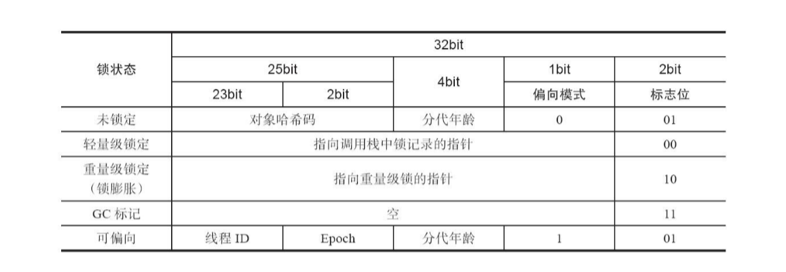

我们简单回顾了对象的内存布局后，接下来就可以介绍轻量级锁的工作过程了：在代码即将进入同步块的时候，如果此同步对象没有被锁 定（锁标志位为“01”状态），虚拟机首先将在当前线程的栈帧中建立一个名为锁记录（Lock Record）的空间，用于存储锁对象目前的Mark Word的拷贝（官方为这份拷贝加了一个Displaced前缀，即Displaced Mark Word），这时候线程堆栈与对象头的状态如图13-3所示。

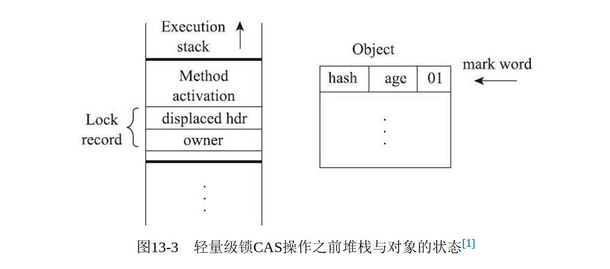

然后，虚拟机将使用CAS操作尝试把对象的Mark Word更新为指向 Lock Record的指针。如果这个更新动作成功了，即代表该线程拥有了这个对象的锁，并且对象Mark Word的锁标志位（Mark Word的最后两个比特）将转变为“00”，表示此对象处于轻量级锁定状态。这时候线程堆栈与对象头的状态如图13-4所示。

**如果这个更新操作失败了，那就意味着至少存在一条线程与当前线程竞争获取该对象的锁。虚拟机首先会检查对象的Mark Word是否指向当前线程的栈帧，如果是，说明当前线程已经拥有了这个对象的锁，那直接进入同步块继续执行就可以了，否则就说明这个锁对象已经被其他线程抢占了。如果出现两条以上的线程争用同一个锁的情况，那轻量级锁就不再有效，必须要膨胀为重量级锁，锁标志的状态值变为“10”，此时Mark Word中存储的就是指向重量级锁（互斥量）的指针，后面等待锁的线程也必须进入阻塞状态。**

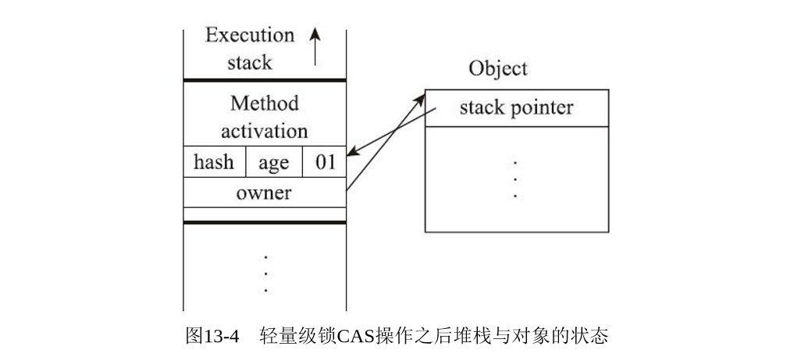

上面描述的是轻量级锁的加锁过程，它的解锁过程也同样是通过CAS操作来进行的，如果对象的Mark Word仍然指向线程的锁记录，那就用CAS操作把对象当前的Mark Word和线程中复制的Displaced Mark Word替换回来。假如能够成功替换，那整个同步过程就顺利完成了；如果替换失败，则说明有其他线程尝试过获取该锁，就要在释放锁的同时，唤醒被挂起的线程。

轻量级锁能提升程序同步性能的依据是“对于绝大部分的锁，在整个同步周期内都是不存在竞争的”这一经验法则。如果没有竞争，轻量级锁便通过CAS操作成功避免了使用互斥量的开销；但如果确实存在锁竞争，除了互斥量的本身开销外，还额外发生了CAS操作的开销。因此在有竞争的情况下，轻量级锁反而会比传统的重量级锁更慢。

#### 偏向锁

偏向锁也是JDK 6中引入的一项锁优化措施，它的目的是消除数据在无竞争情况下的同步原语，进一步提高程序的运行性能。如果说轻量 级锁是在无竞争的情况下使用CAS操作去消除同步使用的互斥量，那偏向锁就是在无竞争的情况下把整个同步都消除掉，连CAS操作都不去做了。

**偏向锁中的“偏”，就是偏心的“偏”、偏袒的“偏”。它的意思是这个锁会偏向于第一个获得它的线程，如果在接下来的执行过程中，该锁一直没有被其他的线程获取，则持有偏向锁的线程将永远不需要再进行同步。**

如果读者理解了前面轻量级锁中关于对象头Mark Word与线程之间的操作过程，那偏向锁的原理就会很容易理解。假设当前虚拟机启用了 偏向锁（启用参数-XX:+UseBiasedLocking，这是自JDK 6起HotSpot虚拟机的默认值），那么当锁对象第一次被线程获取的时候，虚拟机将会把对象头中的标志位设置为“01”、把偏向模式设置为“1”，表示进入偏向模式。同时使用CAS操作把获取到这个锁的线程的ID记录在对象的 Mark Word之中。如果CAS操作成功，持有偏向锁的线程以后每次进入这个锁相关的同步块时，虚拟机都可以不再进行任何同步操作（例如加锁、解锁及对Mark Word的更新操作等）。

一旦出现另外一个线程去尝试获取这个锁的情况，偏向模式就马上宣告结束。根据锁对象目前是否处于被锁定的状态决定是否撤销偏向 （偏向模式设置为“0”），撤销后标志位恢复到未锁定（标志位 为“01”）或轻量级锁定（标志位为“00”）的状态，后续的同步操作就按照上面介绍的轻量级锁那样去执行。偏向锁、轻量级锁的状态转化及对象Mark Word的关系如图13-5所示。

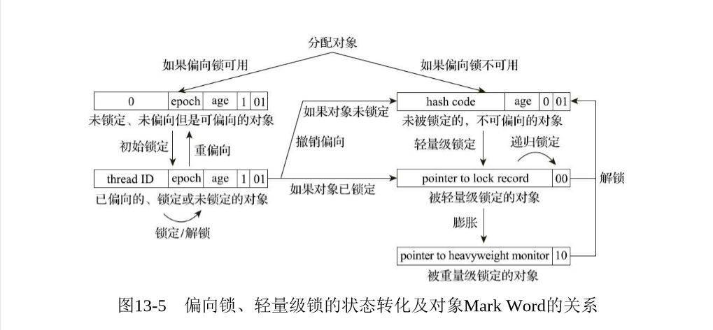

细心的读者看到这里可能会发现一个问题：当对象进入偏向状态的时候，Mark Word大部分的空间（23个比特）都用于存储持有锁的线程ID了，这部分空间占用了原有存储对象哈希码的位置，那原来对象的哈希码怎么办呢？

在Java语言里面一个对象如果计算过哈希码，就应该一直保持该值不变（强烈推荐但不强制，因为用户可以重载hashCode()方法按自己的 意愿返回哈希码），否则很多依赖对象哈希码的API都可能存在出错风险。而作为绝大多数对象哈希码来源的Object::hashCode()方法，返回的是对象的一致性哈希码（Identity Hash Code），这个值是能强制保证不变的，它通过在对象头中存储计算结果来保证第一次计算之后，再次调用该方法取到的哈希码值永远不会再发生改变。因此，在Java语言里面一个对象如果计算过哈希码，就应该一直保持该值 不变（强烈推荐但不强制，因为用户可以重载hashCode()方法按自己的 意愿返回哈希码），否则很多依赖对象哈希码的API都可能存在出错风 险。而作为绝大多数对象哈希码来源的Object::hashCode()方法，返回的是对象的一致性哈希码（Identity Hash Code），这个值是能强制保证不变的，它通过在对象头中存储计算结果来保证第一次计算之后，再次调用该方法取到的哈希码值永远不会再发生改变。因此，当一个对象已经计算过一致性哈希码后，它就再也无法进入偏向锁状态了；而当一个对 象当前正处于偏向锁状态，又收到需要计算其一致性哈希码请求时(注意，这里说的计算请求应来自于对Object::hashCode()或者System::identityHashCode(Object)方法的调用，如果重写了对象的hashCode()方法，计算哈希码时并不会产生这里所说的请求)， 它的偏向状态会被立即撤销，并且锁会膨胀为重量级锁。**在重量级锁的 实现中，对象头指向了重量级锁的位置，代表重量级锁的ObjectMonitor 类里有字段可以记录非加锁状态（标志位为“01”）下的Mark Word，其 中自然可以存储原来的哈希码。在重量级锁的实现中，对象头指向了重量级锁的位置，代表重量级锁的ObjectMonitor类里有字段可以记录非加锁状态（标志位为“01”）下的Mark Word，其中自然可以存储原来的哈希码。**

偏向锁可以提高带有同步但无竞争的程序性能，但它同样是一个带有效益权衡（Trade Off）性质的优化，也就是说它并非总是对程序运行有利。如果程序中大多数的锁都总是被多个不同的线程访问，那偏向模式就是多余的。在具体问题具体分析的前提下，有时候使用参数-XX:UseBiasedLocking来禁止偏向锁优化反而可以提升性能。

### 13.4　本章小结

本章介绍了线程安全所涉及的概念和分类、同步实现的方式及虚拟 机的底层运作原理，并且介绍了虚拟机为实现高效并发所做的一系列锁优化措施。能够写出高性能、高伸缩性的并发程序是一门艺术，而了解并发在系统底层是如何实现的，则是掌握这门艺术的前提条件，也是成长为高 级程序员的必备知识之一。

**本节中的锁特指synchronized**

#### 锁膨胀

JVM中的获取锁的优化方法和获取锁的步骤：

1. 偏向锁可用会先尝试偏向锁
2. 轻量级锁可用会先尝试轻量级锁
3. 以上都失败，尝试自旋锁
4. 再失败，重量级锁兜底

#### 锁优化

主要分为JVM层面和代码编程两个方面。

1. JVM层面：

   - 锁消除：即即时编译器(JIT)在运行时，对一些代码要求同步，但是对被检测到不可能存在共享数据竞争的锁进行消除。开启锁消除前提是java必须运行在server模式，同时必须开启逃逸分析：-server -XX:+DoEscapeAnalysis -XX:+EliminateLocks
   - 锁粗化：如果虚拟机探测到有这样一串零碎的操作都对同一个对象加锁，将会把加锁同步的范围扩展（粗化）到整个操作序列的外部，即取消对一连串零碎操作的细锁，这样只需要加锁一次就可以了。
   - 适时关闭偏向锁：在系统并发(竞争)较大的情况下，关闭偏向锁(-XX:-UseBiasedLocking)可以提升性能。
2. 代码编程层面：

   - 减少锁的粒度或持有的时间：比如尽量用synchronized(monitor)块来进行同步，而且块中把一些无需同步的操作移出去，比如在同步块中掺杂了日志记录，这些都可以挪出同步块中。
   - 锁分离：例如读写锁ReadWriteLock，读多写少的情况，可以提高性能。

#### 锁升级

- 偏向锁的升级

  如果偏向锁可用，当线程1访问代码块并获取锁对象时，会在java对象头和栈帧中记录偏向的锁的threadID，因为偏向锁不会主动释放锁，因此以后线程1再次获取锁的时候，需要比较当前线程的threadID和Java对象头中的threadID是否一致，如果一致（还是线程1获取锁对象），则无需使用CAS来加锁、解锁；如果不一致（其他线程，如线程2要竞争锁对象，而偏向锁不会主动释放因此还是存储的线程1的threadID），那么需要查看Java对象头中记录的线程1是否存活，如果没有存活，那么锁对象被重置为无锁状态，其它线程（线程2）可以竞争将其设置为偏向锁；如果存活，那么立刻查找该线程（线程1）的栈帧信息，如果还是需要继续持有这个锁对象，那么暂停当前线程1，撤销偏向锁，升级为轻量级锁，如果线程1不再使用该锁对象，那么将锁对象状态设为无锁状态，重新偏向新的线程。
  
- 轻量级锁的升级

  线程1获取轻量级锁时会先把锁对象的对象头MarkWord复制一份到线程1的栈帧中创建的用于存储锁记录的空间（称为DisplacedMarkWord），然后使用CAS把对象头中的内容替换为线程1存储的锁记录（DisplacedMarkWord）的地址；

  如果在线程1复制对象头的同时（在线程1CAS之前），线程2也准备获取锁，复制了对象头到线程2的锁记录空间中，但是在线程2CAS的时候，发现线程1已经把对象头换了，线程2的CAS失败，那么线程2就尝试使用自旋锁来等待线程1释放锁。

  **如果自旋次数到了线程1还没有释放锁，或者线程1还在执行，线程2还在自旋等待，这时又有一个线程3过来竞争这个锁对象，那么这个时候轻量级锁就会膨胀为重量级锁**。重量级锁把除了拥有锁的线程都阻塞，防止CPU空转。

  

- **不存在锁降级**

  轻量级锁一旦膨胀为重量级锁就不会再降级为轻量级锁了；偏向锁升级为轻量级锁也不能再降级为偏向锁。一句话就是锁可以升级不可以降级，但是偏向锁状态可以被重置为无锁状态。