# 深入理解java虚拟机第3版
深入理解Java虚拟机：JVM高级特性与最佳实践（第3 版）周志明　著，第三版2019年面世，涉及到最高到JDK14版本的JVM相关内容。


# 第二部分　自动内存管理


## 第2章　Java内存区域与内存溢出异常

### 2.1　概述

对于从事C、C++程序开发的开发人员来说，在内存管理领域，他们既是拥有最高权力的“皇帝”，又是从事最基础工作的劳动人民——既 拥有每一个对象的“所有权”，又担负着每一个对象生命从开始到终结的 维护责任。

对于Java程序员来说，在虚拟机自动内存管理机制的帮助下，不再需要为每一个new操作去写配对的delete/free代码，不容易出现内存泄漏和内存溢出问题，看起来由虚拟机管理内存一切都很美好。不过，也正是因为Java程序员把控制内存的权力交给了Java虚拟机，一旦出现内存泄漏和溢出方面的问题，如果不了解虚拟机是怎样使用内存的，那排查 错误、修正问题将会成为一项异常艰难的工作。

本章是第二部分的第1章，笔者将从概念上介绍Java虚拟机内存的各个区域，讲解这些区域的作用、服务对象以及其中可能产生的问题， 这也是翻越虚拟机内存管理这堵围墙的第一步。

### 2.2　运行时数据区域

Java虚拟机在执行Java程序的过程中会把它所管理的内存划分为若干个不同的数据区域。这些区域有各自的用途，以及创建和销毁的时 间，有的区域随着虚拟机进程的启动而一直存在，有些区域则是依赖用户线程的启动和结束而建立和销毁。根据《Java虚拟机规范》的规定， Java虚拟机所管理的内存将会包括以下几个运行时数据区域，如图2-1所示：


#### 程序计数器

程序计数器（Program Counter Register）是一块较小的内存空间， 它可以看作是当前线程所执行的字节码的行号指示器。在Java虚拟机的 概念模型里[1]，字节码解释器工作时就是通过改变这个计数器的值来选 取下一条需要执行的字节码指令，它是程序控制流的指示器，分支、循环、跳转、异常处理、线程恢复等基础功能都需要依赖这个计数器来完成。

由于Java虚拟机的多线程是通过线程轮流切换、分配处理器执行时 间的方式来实现的，在任何一个确定的时刻，一个处理器（对于多核处 理器来说是一个内核）都只会执行一条线程中的指令。因此，为了线程 切换后能恢复到正确的执行位置，每条线程都需要有一个独立的程序计 数器，各条线程之间计数器互不影响，独立存储，我们称这类内存区域 为“线程私有”的内存。

#### Java虚拟机栈

与程序计数器一样，Java虚拟机栈（Java Virtual Machine Stack）也 是线程私有的，它的生命周期与线程相同。虚拟机栈描述的是Java方法 执行的线程内存模型：每个方法被执行的时候，Java虚拟机都会同步创 建一个栈帧[1]（Stack Frame）用于存储局部变量表、操作数栈、动态连 接、方法出口等信息。每一个方法被调用直至执行完毕的过程，就对应 着一个栈帧在虚拟机栈中从入栈到出栈的过程。

经常有人把Java内存区域笼统地划分为堆内存（Heap）和栈内存 （Stack），这种划分方式直接继承自传统的C、C++程序的内存布局结 构，在Java语言里就显得有些粗糙了，实际的内存区域划分要比这更复 杂。不过这种划分方式的流行也间接说明了程序员最关注的、与对象内 存分配关系最密切的区域是“堆”和“栈”两块。其中，“堆”在稍后笔者会 专门讲述，而“栈”通常就是指这里讲的虚拟机栈，或者更多的情况下只 是指虚拟机栈中局部变量表部分。

**在《Java虚拟机规范》中，对这个内存区域规定了两类异常状况： 如果线程请求的栈深度大于虚拟机所允许的深度，将抛出 StackOverflowError异常；如果Java虚拟机栈容量可以动态扩展，当栈扩展时无法申请到足够的内存会抛出OutOfMemoryError异常。**

HotSpot虚拟机的栈容量是不可以动态扩展的，以前的Classic虚拟机 倒是可以。所以由于本来就不可以动态扩展所以在HotSpot虚拟机上是不会由于虚拟机栈无法扩展而导 致OutOfMemoryError异常——只要线程申请栈空间成功了就不会有OOM，但是如果申请时就失败，仍然是会出现OOM异常的。

#### 本地方法栈

本地方法栈（Native Method Stacks）与虚拟机栈所发挥的作用是非 常相似的，其区别只是虚拟机栈为虚拟机执行Java方法（也就是字节 码）服务，而本地方法栈则是为虚拟机使用到的本地（Native）方法服务。

《Java虚拟机规范》对本地方法栈中方法使用的语言、使用方式与 数据结构并没有任何强制规定，因此具体的虚拟机可以根据需要自由实 现它，**甚至有的Java虚拟机（譬如Hot-Spot虚拟机）直接就把本地方法 栈和虚拟机栈合二为一。与虚拟机栈一样，本地方法栈也会在栈深度溢出或者栈扩展失败时分别抛出StackOverflowError和OutOfMemoryError 异常。**

#### Java堆

对于Java应用程序来说，Java堆（Java Heap）是虚拟机所管理的内 存中最大的一块。Java堆是被所有线程共享的一块内存区域，在虚拟机 启动时创建。此内存区域的唯一目的就是存放对象实例，Java世界 里“几乎”所有的对象实例都在这里分配内存。在《Java虚拟机规范》中 对Java堆的描述是：“所有的对象实例以及数组都应当在堆上分配[1]”， 而这里笔者写的“几乎”是指从实现角度来看，随着Java语言的发展，现 在已经能看到些许迹象表明日后可能出现值类型的支持，即使只考虑现 在，由于即时编译技术的进步，尤其是逃逸分析技术的日渐强大，栈上 分配、标量替换[2]优化手段已经导致一些微妙的变化悄然发生，所以说 Java对象实例都分配在堆上也渐渐变得不是那么绝对了。

Java堆是垃圾收集器管理的内存区域，因此一些资料中它也被称 作“GC堆”（Garbage Collected Heap，幸好国内没翻译成“垃圾堆”）。从 回收内存的角度看，由于现代垃圾收集器大部分都是基于分代收集理论 设计的，所以Java堆中经常会出现“新生代”“老年代”“永久代”“Eden空 间”“From Survivor空间”“To Survivor空间”等名词**（新生代其中又包含一个Eden和两个Survivor）**，这些概念在本书后续 章节中还会反复登场亮相，在这里笔者想先说明的是这些区域划分仅仅 是一部分垃圾收集器的共同特性或者说设计风格而已，而非某个Java虚 拟机具体实现的固有内存布局，更不是《Java虚拟机规范》里对Java堆 的进一步细致划分。不少资料上经常写着类似于“Java虚拟机的堆内存 分为新生代、老年代、永久代、Eden、Survivor……”这样的内容。在十 年之前（以G1收集器的出现为分界），作为业界绝对主流的HotSpot虚 拟机，它内部的垃圾收集器全部都基于“经典分代”[3]来设计，需要新生 代、老年代收集器搭配才能工作，在这种背景下，上述说法还算是不会 产生太大歧义。但是到了今天，垃圾收集器技术与十年前已不可同日而 语，HotSpot里面也出现了不采用分代设计的新垃圾收集器，再按照上 面的提法就有很多需要商榷的地方了。不过无论从什么角度，无论如何划分，都不 会改变Java堆中存储内容的共性，无论是哪个区域，存储的都只能是对 象的实例，**将Java堆细分的目的只是为了更好地回收内存，或者更快地分配内存。**在本章中，我们仅仅针对内存区域的作用进行讨论，Java堆 中的上述各个区域的分配、回收等细节将会是下一章的主题。

根据《Java虚拟机规范》的规定，Java堆可以处于物理上不连续的 内存空间中，但在逻辑上它应该被视为连续的，这点就像我们用磁盘空 间去存储文件一样，并不要求每个文件都连续存放。但对于大对象（典 型的如数组对象），多数虚拟机实现出于实现简单、存储高效的考虑， 很可能会要求连续的内存空间。

Java堆既可以被实现成固定大小的，也可以是可扩展的，不过当前 主流的Java虚拟机都是按照可扩展来实现的（通过参数-Xmx和-Xms设 定）。如果在Java堆中没有内存完成实例分配，并且堆也无法再扩展 时，Java虚拟机将会抛出OutOfMemoryError异常。

#### 方法区

方法区（Method Area）与Java堆一样，是各个线程共享的内存区 域，它用于存储已被虚拟机加载的类型信息、常量、静态变量、即时编 译器编译后的代码缓存等数据。虽然《Java虚拟机规范》中把方法区描 述为堆的一个逻辑部分，但是它却有一个别名叫作“非堆”（NonHeap），目的是与Java堆区分开来。 

说到方法区，不得不提一下“永久代”这个概念，尤其是在JDK 8以 前，许多Java程序员都习惯在HotSpot虚拟机上开发、部署程序，很多人 都更愿意把方法区称呼为“永久代”（Permanent Generation），或将两者 混为一谈。本质上这两者并不是等价的，因为仅仅是当时的HotSpot虚 拟机设计团队选择把收集器的分代设计扩展至方法区，或者说使用永久 代来实现方法区而已，这样使得HotSpot的垃圾收集器能够像管理Java堆 一样管理这部分内存，省去专门为方法区编写内存管理代码的工作。但 是对于其他虚拟机实现，譬如BEA JRockit、IBM J9等来说，是不存在 永久代的概念的。原则上如何实现方法区属于虚拟机实现细节，不受 《Java虚拟机规范》管束，并不要求统一。**但现在回头来看，当年使用 永久代来实现方法区的决定并不是一个好主意，这种设计导致了Java应 用更容易遇到内存溢出的问题（永久代有-XX:MaxPermSize的上限， 即使不设置也有默认大小，而J9和JRockit只要没有触碰到进程可用内存 的上限，例如32位系统中的4GB限制，就不会出问题），而且有极少数 方法（例如String::intern()）会因永久代的原因而导致不同虚拟机下有不 同的表现。当Oracle收购BEA获得了JRockit的所有权后，准备把JRockit 中的优秀功能，譬如Java Mission Control管理工具，移植到HotSpot虚拟 机时，但因为两者对方法区实现的差异而面临诸多困难。考虑到 HotSpot未来的发展，在JDK 6的时候HotSpot开发团队就有放弃永久 代，逐步改为采用本地内存（Native Memory）来实现方法区的计划了 ，到了JDK 7的HotSpot，已经把原本放在永久代的字符串常量池、静态变量等移出，而到了JDK 8，终于完全废弃了永久代的概念，改用与 JRockit、J9一样在本地内存中实现的元空间（Meta-space）来代替，把 JDK 7中永久代还剩余的内容（主要是类型信息）全部移到元空间中。**

#### 运行时常量池

运行时常量池（Runtime Constant Pool）是方法区的一部分。Class 文件中除了有类的版本、字段、方法、接口等描述信息外，还有一项信 息是常量池表（Constant Pool Table），用于存放编译期生成的各种字面 量与符号引用，这部分内容将在类加载后存放到方法区的运行时常量池 中。


#### 直接内存

直接内存（Direct Memory）并不是虚拟机运行时数据区的一部分， 也不是《Java虚拟机规范》中定义的内存区域。但是这部分内存也被频繁地使用，而且也可能导致OutOfMemoryError异常出现，所以我们放到 这里一起讲解。

**在JDK 1.4中新加入了NIO（New Input/Output）类，引入了一种基 于通道（Channel）与缓冲区（Buffer）的I/O方式，它可以使用Native函数库直接分配堆外内存，然后通过一个存储在Java堆里面的DirectByteBuffer对象作为这块内存的引用进行操作。这样能在一些场景 中显著提高性能，因为避免了在Java堆和Native堆中来回复制数据。**

显然，本机直接内存的分配不会受到Java堆大小的限制，但是，既 然是内存，则肯定还是会受到本机总内存（包括物理内存、SWAP分区 或者分页文件）大小以及处理器寻址空间的限制，一般服务器管理员配 置虚拟机参数时，会根据实际内存去设置-Xmx等参数信息，但经常忽 略掉直接内存，使得各个内存区域总和大于物理内存限制（包括物理的 和操作系统级的限制），从而导致动态扩展时出现OutOfMemoryError异 常。

### 2.3　HotSpot虚拟机对象探秘

介绍完Java虚拟机的运行时数据区域之后，我们大致明白了Java虚拟机内存模型的概况，相信读者了解过内存中放了什么，也许就会更进一步想了解这些虚拟机内存中数据的其他细节，譬如它们是如何创建、如何布局以及如何访问的。对于这样涉及细节的问题，必须把讨论范围限定在具体的虚拟机和集中在某一个内存区域上才有意义。基于实用优先的原则，笔者以最常用的虚拟机HotSpot和最常用的内存区域Java堆为例，深入探讨一下HotSpot虚拟机在Java堆中对象分配、布局和访问的全过程。

#### 对象的创建

Java是一门面向对象的编程语言，Java程序运行过程中无时无刻都 有对象被创建出来。在语言层面上，创建对象通常（例外：复制、反序 列化）仅仅是一个new关键字而已，而在虚拟机中，对象（文中讨论的 对象限于普通Java对象，不包括数组和Class对象等）的创建又是怎样一 个过程呢？

当Java虚拟机遇到一条字节码new指令时，首先将去检查这个指令 的参数是否能在常量池中定位到一个类的符号引用，并且检查这个符号 引用代表的类是否已被加载、解析和初始化过。如果没有，那必须先执 行相应的类加载过程，本书第7章将探讨这部分细节。

#### 对象的创建步骤

1. 类加载检查。即new指令的目标(类的符号引用所代表的的类)类以及该类所依赖的子类是否被加载、解析和初始化过，如果没有，那必须先执 行相应的类加载过程。
2. 对象内存分配。对象内存地址分配方式分为基于规整内存空间的"指针碰撞"方式和基于不规整内存空间的"空闲列表"方式。具体采用哪种方式取决于所采用的垃圾收集器是否带有空间压缩整理（Compact）的能力决定。因此，当使用 Serial、ParNew等带压缩整理过程的收集器时，系统采用的分配算法是指针碰撞，既简单又高效；而当使用CMS这种基于清除（Sweep）算法的收集器时，理论上就只能采用较为复杂的空闲列表来分配内存。对象内存分配并发保障方式：一是采用CAS配上失败重试的方式保证原子性。二是采用本地线程分配缓冲（Thread Local Allocation Buffer，TLAB）。
3. 对象初始值归零设置。对象内存分配完毕后，需要将对象的实例变量设置为零，这里的零即默认值。
4. 执行构造器方法，即执行Class文件中的<init>()方法。

#### 对象的内存布局

在HotSpot虚拟机里，对象在堆内存中的存储布局可以划分为三个部分：对象头（Header）、实例数据（Instance Data）和对齐填充 （Padding）。

HotSpot虚拟机对象的对象头部分包括以下几类信息：

- 一类是用于存储对象自身的运行时数据，例如：哈希码(HashCode)、GC分代年龄、锁状态标志、线程持有的锁、偏向线程ID、偏向时间戳等信息。
- 另一类是对象类型指针，即对象指向它的类型元数据的指 针，Java虚拟机通过这个指针来确定该对象是哪个类的实例。
- 此外，如果对象是一个Java数组，那在对象头中还必须有一块用于记录数组长度的数据。

对象的第三部分是对齐填充，这并不是必然存在的，也没有特别的 含义，它仅仅起着占位符的作用。**由于HotSpot虚拟机的自动内存管理系统要求对象起始地址必须是8字节的整数倍，换句话说就是任何对象的大小都必须是8字节的整数倍**。对象头部分已经被精心设计成正好是8字节的倍数（1倍或者2倍），因此，如果对象实例数据部分没有对齐的 话，就需要通过对齐填充来补全。

#### 对象的访问定位

创建对象自然是为了后续使用该对象，我们的Java程序会通过栈上 的reference数据来操作堆上的具体对象。由于reference类型在《Java虚 拟机规范》里面只规定了它是一个指向对象的引用，并没有定义这个引 用应该通过什么方式去定位、访问到堆中对象的具体位置，所以对象访 问方式也是由虚拟机实现而定的，主流的访问方式主要有使用句柄和直接指针两种：

- 如果使用句柄访问的话，Java堆中将可能会划分出一块内存来作为 句柄池，reference中存储的就是对象的句柄地址，而句柄中包含了对象 实例数据与类型数据各自具体的地址信息，其结构如下图所示：


 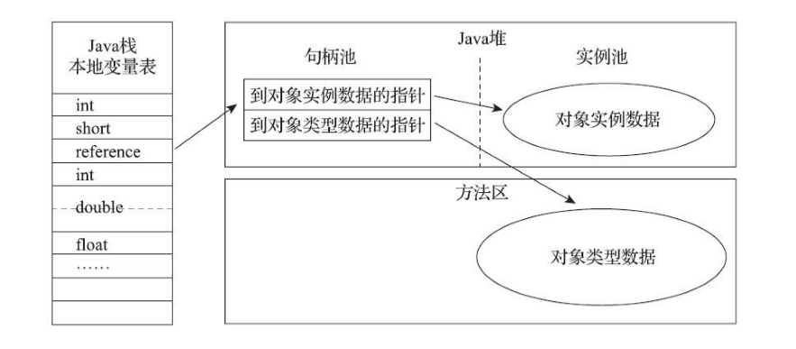

- 如果使用直接指针访问的话，Java堆中对象的内存布局就必须考虑 如何放置访问类型数据的相关信息，reference中存储的直接就是对象地址，如果只是访问对象本身的话，**就不需要通过对象头中的对象类型指针来多一次间接访问的开销**，其结构如下图所示：

  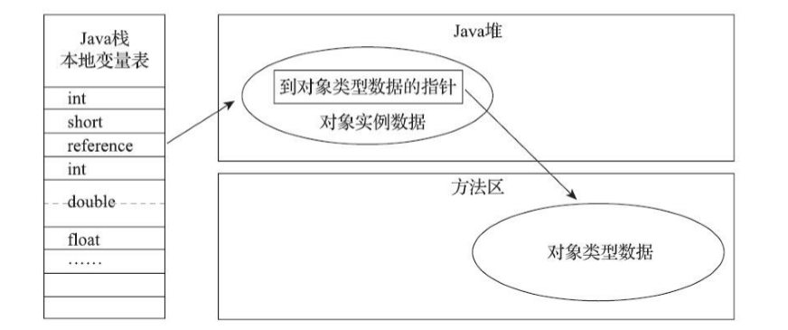

  这两种对象访问方式各有优势，使用句柄来访问的最大好处就是reference中存储的是稳定句柄地址，在对象被移动（垃圾收集时移动对象是非常普遍的行为）时只会改变句柄中的实例数据指针，而reference本身不需要被修改。

  使用直接指针来访问最大的好处就是速度更快，它节省了一次指针定位的时间开销，由于对象访问在Java中非常频繁，因此这类开销积少成多也是一项极为可观的执行成本，就本书讨论的主要虚拟机HotSpot 而言，它主要使用第二种方式进行对象访问（有例外情况，如果使用了Shenandoah收集器的话也会有一次额外的转发，具体可参见第3章）， 但从整个软件开发的范围来看，在各种语言、框架中使用句柄来访问的 情况也十分常见。

### 2.4　实战：OutOfMemoryError异常

在《Java虚拟机规范》的规定里，除了程序计数器外，虚拟机内存的其他几个运行时区域都有发生OutOfMemoryError（下文称OOM）异常的可能，本节将通过若干实例来验证异常实际发生的代码场景，并且将初步介绍若干最基本的与自动内存管理子系统 相关的HotSpot虚拟机参数。 

本节实战的目的有两个：第一，通过代码验证《Java虚拟机规范》中描述的各个运行时区域储存的内容；第二，希望读者在工作中遇到实 际的内存溢出异常时，能根据异常的提示信息迅速得知是哪个区域的内存溢出，知道怎样的代码可能会导致这些区域内存溢出，以及出现这些异常后该如何处理。

#### Java堆溢出

Java堆用于储存对象实例，我们只要不断地创建对象，并且保证GC Roots到对象之间有可达路径来避免垃圾回收机制清除这些对象，那么 随着对象数量的增加，总容量触及最大堆的容量限制后就会产生内存溢出异常。

下面代码清单中限制Java堆的大小为20MB，不可扩展（将堆的最小 值-Xms参数与最大值-Xmx参数设置为一样即可避免堆自动扩展），通过参数-XX:+HeapDumpOnOutOf-MemoryError可以让虚拟机在出现内存溢出异常的时候Dump出当前的内存堆转储快照以便进行事后分析 

```java
/**
 * VM Args：-Xms20m -Xmx20m -XX:+HeapDumpOnOutOfMemoryError
 * 
 * @author 	zzm
 */
public class HeapOOM {
	static class OOMObject {
	}

	public static void main(String[] args) {
		List<OOMObject> list = new ArrayList<OOMObject>();
		while (true) {
			list.add(new OOMObject());
		}
	}
}
```

运行结果：

```java
java.lang.OutOfMemoryError: Java heap space
Dumping heap to java_pid242876.hprof ...
Heap dump file created [27971911 bytes in 0.091 secs]
Exception in thread "main" java.lang.OutOfMemoryError: Java heap space
	at java.util.Arrays.copyOf(Arrays.java:3210)
	at java.util.Arrays.copyOf(Arrays.java:3181)
	at java.util.ArrayList.grow(ArrayList.java:265)
	at java.util.ArrayList.ensureExplicitCapacity(ArrayList.java:239)
	at java.util.ArrayList.ensureCapacityInternal(ArrayList.java:231)
	at java.util.ArrayList.add(ArrayList.java:462)
	at com.penglecode.xmodule.jvm.chapter2.oom.HeapOOM.main(HeapOOM.java:18)
```

Java堆内存的OutOfMemoryError异常是实际应用中最常见的内存溢
出异常情况。出现Java堆内存溢出时，异常堆栈信息“java.lang.OutOfMemoryError”会跟随进一步提示“Java heap space”。

要解决这个内存区域的异常，常规的处理方法是首先通过内存映像 分析工具（如Eclipse Memory Analyzer）对Dump出来的堆转储快照进行 分析。第一步首先应确认内存中导致OOM的对象是否是必要的，也就是要先分清楚到底是出现了**内存泄漏（Memory Leak）**还是**内存溢出（Memory Overflow）**。

如果是内存泄漏，可进一步通过工具查看泄漏对象到GC Roots的引 用链，找到泄漏对象是通过怎样的引用路径、与哪些GC Roots相关联， 才导致垃圾收集器无法回收它们，根据泄漏对象的类型信息以及它到GC Roots引用链的信息，一般可以比较准确地定位到这些对象创建的位置，进而找出产生内存泄漏的代码的具体位置。

如果不是内存泄漏，换句话说就是内存中的对象确实都是必须存活的，那就应当检查Java虚拟机的堆参数（-Xmx与-Xms）设置，与机器 的内存对比，看看是否还有向上调整的空间。再从代码上检查是否存在某些对象生命周期过长、持有状态时间过长、存储结构设计不合理等情况，尽量减少程序运行期的内存消耗。

以上是处理Java堆内存问题的简略思路，处理这些问题所需要的知识、工具与经验是后面三章的主题，后面我们将会针对具体的虚拟机实 现、具体的垃圾收集器和具体的案例来进行分析，这里就先暂不展开。

#### 虚拟机栈和本地方法栈溢出

由于HotSpot虚拟机中并不区分虚拟机栈和本地方法栈，因此对于HotSpot来说，-Xoss参数（设置本地方法栈大小）虽然存在，但实际上是没有任何效果的，栈容量只能由-Xss参数来设定。关于虚拟机栈和本地方法栈，在《Java虚拟机规范》中描述了两种异常： 

1. 如果线程请求的栈深度大于虚拟机所允许的最大深度，将抛出 **StackOverflowError**异常。
2. 如果虚拟机的栈内存允许动态扩展，当扩展栈容量无法申请到足够的内存时，将抛出**OutOfMemoryError**异常。

《Java虚拟机规范》明确允许Java虚拟机实现自行选择是否支持栈的动态扩展，而HotSpot虚拟机的选择是不支持扩展，所以除非在创建 线程申请内存时就因无法获得足够内存而出现OutOfMemoryError异常， 否则在线程运行时是不会因为扩展而导致内存溢出的，只会因为栈容量无法容纳新的栈帧而导致StackOverflowError异常。

测试StackOverflowError异常：

1. 通过-Xss(即-XX:ThreadStackSize)参数逐步减少栈内存大小来触发StackOverflowError测试其对栈的深度的影响。

```java
/**
 * 通过-Xss(即-XX:ThreadStackSize)参数逐步减少栈内存大小来触发StackOverflowError测试其对栈的深度的影响。
 * 
 * 第一次设置栈内存大小为1MB：-XX:+PrintCommandLineFlags -Xss1m
 * 输出：java.lang.StackOverflowError, stack length: 18319
 * 
 * 第二次设置栈内存大小为256KB：-XX:+PrintCommandLineFlags -Xss256k
 * 输出：java.lang.StackOverflowError, stack length: 2470
 * 
 * 由上可以得出：增加栈内存大小可以增加栈的深度。
 * 
 * @author 	pengpeng
 * @date 	2020年6月18日 下午3:08:03
 */
public class StackOverflow1Example {

	private int stackLength = 1;
	
	public void stackLeak() {
		stackLength++;
		stackLeak();
	}
	
	public static void main(String[] args) {
		StackOverflow1Example example = new StackOverflow1Example();
		try {
			example.stackLeak();
		} catch (Throwable e) {
			System.err.println(String.format("%s, stack length: %s", e.getClass().getName(), example.stackLength));
		}
	}

}   
```

2. 在栈内存大小相同情况下，通过定义局部变量的多少来触发StackOverflowError测试其对栈的深度的影响。
```java
/**
 * 在栈内存大小相同情况下，通过定义局部变量的多少来触发StackOverflowError测试其对栈的深度的影响。
 * 
 * smallStackLeak()方法中未定义任何局部变量
 * 
 * largeStackLeak()方法中未定义大量局部变量
 * 
 * @author 	pengpeng
 * @date 	2020年6月18日 下午3:54:46
 */
public class StackOverflow2Example {

	private int stackLength = 1;
	
	public void smallStackLeak() {
		stackLength++;
		smallStackLeak();
	}
	
	@SuppressWarnings("unused")
	public void largeStackLeak() {
		stackLength++;
		String a1 = UUID.randomUUID().toString();
		String a2 = UUID.randomUUID().toString();
		String a3 = UUID.randomUUID().toString();
		String a4 = UUID.randomUUID().toString();
		String a5 = UUID.randomUUID().toString();
		String a6 = UUID.randomUUID().toString();
		String a7 = UUID.randomUUID().toString();
		String a8 = UUID.randomUUID().toString();
		String a9 = UUID.randomUUID().toString();
		String a10 = UUID.randomUUID().toString();
		String a11 = UUID.randomUUID().toString();
		String a12 = UUID.randomUUID().toString();
		String a13 = UUID.randomUUID().toString();
		String a14 = UUID.randomUUID().toString();
		String a15 = UUID.randomUUID().toString();
		largeStackLeak();
	}
	
	public static void main(String[] args) {
		StackOverflow2Example example = new StackOverflow2Example();
		try {
			//example.smallStackLeak(); // java.lang.StackOverflowError, stack length: 22968
			example.largeStackLeak(); // java.lang.StackOverflowError, stack length: 15092
		} catch (Throwable e) {
			System.err.println(String.format("%s, stack length: %s", e.getClass().getName(), example.stackLength));
		}
	}

}
```

实验结果表明：无论是由于栈帧太大还是虚拟机栈容量太小，当新的栈帧内存无法分配的时候，HotSpot虚拟机抛出的都是 **StackOverflowError**异常。可是如果在允许动态扩展栈容量大小的虚拟机上，相同代码则会导致不一样的情况。

**线程栈的大小是个双刃剑，如果设置过小，可能会出现栈溢出，特别是在该线程内有递归、大的循环时出现溢出的可能性更大，如果该值设置过大，就有影响到创建栈的数量，如果是多线程的应用，就会出现内存溢出的错误．**

**JVM可创建的最大线程数限制因素：线程堆栈大小 --> 进程的最大内存 --> 操作系统位数**

#### 方法区和运行时常量池溢出

由于运行时常量池是方法区的一部分，所以这两个区域的溢出测试可以放到一起进行。前面曾经提到HotSpot从JDK 7开始逐步“去永久 代”的计划，并在JDK 8中完全使用元空间来代替永久代的背景故事，在此我们就以测试代码来观察一下，使用“永久代”还是“元空间”来实现方法区，对程序有什么实际的影响。

String::intern()是一个本地方法，它的作用是如果字符串常量池中已 经包含一个等于此String对象的字符串，则返回代表池中这个字符串的 String对象的引用；否则，会将此String对象包含的字符串添加到常量池 中，并且返回此String对象的引用。在JDK 6或更早之前的HotSpot虚拟 机中，常量池都是分配在永久代中，我们可以通过-XX：PermSize和XX：MaxPermSize限制永久代的大小，即可间接限制其中常量池的容 量，具体实现如下面代码清单所示，**请读者测试时首先以JDK 6来运行代码**。
```java
/**
 * VM Args：-XX:PermSize=6M -XX:MaxPermSize=6M
 * 
 * @author 	zzm
 */
public class RuntimeConstantPoolOOM {
	
	public static void main(String[] args) {
		// 使用Set保持着常量池引用，避免Full GC回收常量池行为
		Set<String> set = new HashSet<String>();
		// 在short范围内足以让6MB的PermSize产生OOM了
		short i = 0;
		while (true) {
			set.add(String.valueOf(i++).intern());
		}
	}
}
```

运行结果：

```java
Exception in thread "main" java.lang.OutOfMemoryError: PermGen space    
	at java.lang.String.intern(Native Method)
	at org.fenixsoft.oom.RuntimeConstantPoolOOM.main(RuntimeConstantPoolOOM.java:
```

从运行结果中可以看到，运行时常量池溢出时，在OutOfMemoryError异常后面跟随的提示信息是“PermGen space”，说明 运行时常量池的确是属于方法区（即JDK 6的HotSpot虚拟机中的永久代）的一部分。

**而使用JDK 7或更高版本的JDK来运行这段程序并不会得到相同的结果，无论是在JDK 7中继续使用-XX：MaxPermSize参数或者在JDK 8 及以上版本使用-XX：MaxMeta-spaceSize参数把方法区容量同样限制在6MB，也都不会重现JDK 6中的溢出异常，循环将一直进行下去，永不 停歇[1]。出现这种变化，是因为自JDK 7起，原本存放在永久代的字符 串常量池被移至Java堆之中，所以在JDK 7及以上版本，限制方法区的 容量对该测试用例来说是毫无意义的。**这时候使用-Xmx参数限制最大 堆到6MB就能够看到以下两种运行结果之一，具体取决于哪里的对象分配时产生了溢出：

```java
// OOM异常一：
Exception in thread "main" java.lang.OutOfMemoryError: Java heap space   
	at java.base/java.lang.Integer.toString(Integer.java:440)
	at java.base/java.lang.String.valueOf(String.java:3058)
	at RuntimeConstantPoolOOM.main(RuntimeConstantPoolOOM.java:12)
// OOM异常二： 
Exception in thread "main" java.lang.OutOfMemoryError: Java heap space
	at java.base/java.util.HashMap.resize(HashMap.java:699)
	at java.base/java.util.HashMap.putVal(HashMap.java:658)
	at java.base/java.util.HashMap.put(HashMap.java:607)
	at java.base/java.util.HashSet.add(HashSet.java:220)
	at RuntimeConstantPoolOOM.main(RuntimeConstantPoolOOM.java from InputFileObject:14)
```

我们再来看看方法区的其他部分的内容，方法区的主要职责是用于 存放类型的相关信息，如类名、访问修饰符、常量池、字段描述、方法 描述等。对于这部分区域的测试，基本的思路是运行时产生大量的类去 填满方法区，直到溢出为止。虽然直接使用Java SE API也可以动态产生 类（如反射时的GeneratedConstructorAccessor和动态代理等），但在本 次实验中操作起来比较麻烦。在下面代码清单里笔者借助了cglib直接操作字节码运行时生成了大量的动态类以产生OOM。

```java
/**
 * 在JDK7及其以下版本中设置VM Args：-XX:PermSize=10M -XX:MaxPermSize=10M，产生异常：java.lang.OutOfMemoryError: PermGen space
 * 
 * 在JDK8及其以上版本中:
 * 		1、如果未设MaxMetaspaceSize，则在内存较大的情况下运行大半天都未必能出现：java.lang.OutOfMemoryError: Metaspace
 * 		2、如果设置-XX:MaxMetaspaceSize=10m -XX:MetaspaceSize=10m，则会立马出现：java.lang.OutOfMemoryError: Metaspace
 * 
 * 建议：
 * 		1、MetaspaceSize和MaxMetaspaceSize设置一样大。
 * 		2、具体设置多大，建议稳定运行一段时间后通过jstat -gc pid确认且这个值大一些，对于大部分项目256m即可。
 * 
 * @author 	pengpeng
 * @date 	2020年6月18日 下午7:01:34
 */
public class MetaspaceOutOfMemoryExample {

	public static void main(String[] args) {
		while (true) {
			Enhancer enhancer = new Enhancer();
			enhancer.setSuperclass(OOMObject.class);
			enhancer.setUseCache(false);
			enhancer.setCallback(new MethodInterceptor() {
				public Object intercept(Object obj, Method method, Object[] args, MethodProxy proxy) throws Throwable {
					return proxy.invokeSuper(obj, args);
				}
			});
			enhancer.create();
		}
	}

	static class OOMObject {
	}

}
```

在JDK 8以后，永久代便完全退出了历史舞台，元空间作为其替代 者登场。在默认设置下，前面列举的那些正常的动态创建新类型的测试 用例已经很难再迫使虚拟机产生方法区的溢出异常了。不过为了让使用 者有预防实际应用里出现类似于代码清单2-9那样的破坏性的操作， HotSpot还是提供了一些参数作为元空间的防御措施，主要包括：

- -XX:MaxMetaspaceSize：设置元空间最大值，默认是-1，即不限 制，或者说只受限于本地内存大小。
- -XX:MetaspaceSize：指定元空间的初始空间大小，以字节为单 位，达到该值就会触发垃圾收集进行类型卸载，同时收集器会对该值进 行调整：如果释放了大量的空间，就适当降低该值；如果释放了很少的 空间，那么在不超过-XX：MaxMetaspaceSize（如果设置了的话）的情 况下，适当提高该值。
- -XX:MinMetaspaceFreeRatio：作用是在垃圾收集之后控制最小的 元空间剩余容量的百分比，可减少因为元空间不足导致的垃圾收集的频 率。
- -XX:Max-MetaspaceFreeRatio，用于控制最大的元空间 剩余容量的百分比。

**建议：**

1. MetaspaceSize和MaxMetaspaceSize设置一样大。
2. 具体设置多大，建议稳定运行一段时间后通过jstat -gc pid确认且这个值大一些，对于大部分项目256m即可。

#### 本机直接内存溢出

直接内存（Direct Memory）的容量大小可通过-XX:MaxDirectMemorySize参数来指定，如果不去指定，则默认与Java堆最大值（由-Xmx指定）一致，下面代码清单越过了DirectByteBuffer类直接通过反射获取Unsafe实例进行内存分配（Unsafe类的getUnsafe()方法指 定只有引导类加载器才会返回实例，体现了设计者希望只有虚拟机标准类库里面的类才能使用Unsafe的功能，在JDK 10时才将Unsafe的部分功能通过VarHandle开放给外部使用），因为虽然使用DirectByteBuffer分配内存也会抛出内存溢出异常，但它抛出异常时并没有真正向操作系统申请分配内存，而是通过计算得知内存无法分配就会在代码里手动抛出溢出异常，真正申请分配内存的方法是Unsafe::allocateMemory()。 

```java
import sun.misc.Unsafe;

import java.lang.reflect.Field;

/**
 * VM Args：-Xmx20M -XX:MaxDirectMemorySize=10M
 * 
 * @author 	zzm
 */
@SuppressWarnings("restriction")
public class DirectMemoryOOM {

	private static final int _1MB = 1024 * 1024;
	
	public static void main(String[] args) throws Exception {
		Field unsafeField = Unsafe.class.getDeclaredFields()[0];
		unsafeField.setAccessible(true);
		Unsafe unsafe = (Unsafe) unsafeField.get(null);
		while (true) {
			unsafe.allocateMemory(_1MB);
		}

	}

}
```

运行结果：

```java
Exception in thread "main" java.lang.OutOfMemoryError
	at sun.misc.Unsafe.allocateMemory(Native Method)
	at com.penglecode.xmodule.jvm.chapter2.oom.DirectMemoryOOM.main(DirectMemoryOOM.java:22)
```

由直接内存导致的内存溢出，一个明显的特征是在Heap Dump文件中不会看见有什么明显的异常情况，如果读者发现内存溢出之后产生的Dump文件很小，而程序中又直接或间接使用了DirectMemory（典型的间接使用就是NIO），那就可以考虑重点检查一下直接内存方面的原因了。

## 第3章　垃圾收集器与内存分配策略

Java与C++之间有一堵由内存动态分配和垃圾收集技术所围成的高墙，墙外面的人想进去，墙里面的人却想出来。

### 3.1　概述

说起垃圾收集（Garbage Collection，下文简称GC），有不少人把这 项技术当作Java语言的伴生产物。事实上，垃圾收集的历史远远比Java 久远，在1960年诞生于麻省理工学院的Lisp是第一门开始使用内存动态 分配和垃圾收集技术的语言。当Lisp还在胚胎时期时，其作者John McCarthy就思考过垃圾收集需要完成的三件事情： 

- 哪些内存需要回收？

- 什么时候回收？

- 如何回收？

经过半个世纪的发展，今天的内存动态分配与内存回收技术已经相 当成熟，一切看起来都进入了“自动化”时代，那为什么我们还要去了解 垃圾收集和内存分配？答案很简单：当需要排查各种内存溢出、内存泄 漏问题时，当垃圾收集成为系统达到更高并发量的瓶颈时，我们就必须对这些“自动化”的技术实施必要的监控和调节。

第2章介绍了Java内存运行时区域的各个部分，其中程序计数 器、虚拟机栈、本地方法栈3个区域随线程而生，随线程而灭，栈中的 栈帧随着方法的进入和退出而有条不紊地执行着出栈和入栈操作。每一个栈帧中分配多少内存基本上是在类结构确定下来时就已知的（尽管在运行期会由即时编译器进行一些优化，但在基于概念模型的讨论里，大体上可以认为是编译期可知的），因此这几个区域的内存分配和回收都具备确定性，在这几个区域内就不需要过多考虑如何回收的问题，当方法结束或者线程结束时，内存自然就跟随着回收了。

而Java堆和方法区这两个区域则有着很显著的不确定性：一个接口的多个实现类需要的内存可能会不一样，一个方法所执行的不同条件分 支所需要的内存也可能不一样，只有处于运行期间，我们才能知道程序究竟会创建哪些对象，创建多少个对象，这部分内存的分配和回收是动态的。垃圾收集器所关注的正是这部分内存该如何管理，本文后续讨论中的“内存”分配与回收也仅仅特指这一部分内存。

### 3.2　对象已死？

在堆里面存放着Java世界中几乎所有的对象实例，垃圾收集器在对堆进行回收前，第一件事情就是要确定这些对象之中哪些还“存活”着， 哪些已经“死去”（“死去”即不可能再被任何途径使用的对象）了。

#### 引用计数算法

很多教科书判断对象是否存活的算法是这样的：在对象中添加一个引用计数器，每当有一个地方引用它时，计数器值就加一；当引用失效时，计数器值就减一；任何时刻计数器为零的对象就是不可能再被使用的。笔者面试过很多应届生和一些有多年工作经验的开发人员，他们对于这个问题给予的都是这个答案。

客观地说，引用计数算法（Reference Counting）虽然占用了一些额 外的内存空间来进行计数，但它的原理简单，判定效率也很高，在大多数情况下它都是一个不错的算法。也有一些比较著名的应用案例，例如微软COM（Component Object Model）技术、使用ActionScript 3的 FlashPlayer、Python语言以及在游戏脚本领域得到许多应用的Squirrel中 都使用了引用计数算法进行内存管理。**但是，在Java领域，至少主流的Java虚拟机里面都没有选用引用计数算法来管理内存，主要原因是，这个看似简单的算法有很多例外情况要考虑，必须要配合大量额外处理才能保证正确地工作，譬如单纯的引用计数就很难解决对象之间相互循环引用的问题。**

举个简单的例子，请看下面代码清单中的testGC()方法：对象objA和objB都有字段instance，赋值令objA.instance=objB及 objB.instance=objA，除此之外，这两个对象再无任何引用，实际上这两个对象已经不可能再被访问，但是它们因为互相引用着对方，导致它们的引用计数都不为零，引用计数算法也就无法回收它们。
```java
/**
 * testGC()方法执行后，objA和objB会不会被GC呢？
 * 
 * @author 	zzm
 */
@SuppressWarnings("unused")
public class ReferenceCountingGC {

	private Object instance;
	
	private static final int _1MB = 1024 * 1024;
	
	/**
	 * 这个成员属性的唯一意义就是占点内存，以便能在GC日志中看清楚是否有回收过
	 */
    private byte[] buffer = new byte[2 * _1MB];
    
    public static void testGC() {
		ReferenceCountingGC objA = new ReferenceCountingGC();
		ReferenceCountingGC objB = new ReferenceCountingGC();
		objA.instance = objB;
		objB.instance = objA;
		objA = null;
		objB = null;
		// 假设在这行发生GC，objA和objB是否能被回收？ 
		System.gc();
    }
    
}
```

运行结果：

```java
[Full GC (System) [Tenured: 0K->210K(10240K), 0.0149142 secs] 4603K->210K(19456K), 
[Perm : 2999K->2999K(21248K)], 0.0150007 secs] [Times: user=0.01 sys=0.00, real=0.02 secs]
Heap    
    def new generation   total 9216K, used 82K [0x00000000055e0000, 0x0000000005fe0000, 0x0000000005fe0000)     Eden space 8192K,   1% used [0x00000000055e0000, 0x00000000055f4850, 0x0000000005de0000)    
    from space 1024K,   0% used [0x0000000005de0000, 0x0000000005de0000, 0x0000000005ee0000)    
    to   space 1024K,   0% used [0x0000000005ee0000, 0x0000000005ee0000, 0x0000000005fe0000)    
    tenured generation   total 10240K, used 210K [0x0000000005fe0000, 0x00000000069e0000, 0x00000000069e0000)    
    the space 10240K,   2% used [0x0000000005fe0000, 0x0000000006014a18, 0x0000000006014c00, 0x00000000069e0000)    
    compacting perm gen  total 21248K, used 3016K [0x00000000069e0000, 0x0000000007ea0000, 0x000000000bde0000)    
    the space 21248K,  14% used [0x00000000069e0000, 0x0000000006cd2398, 0x0000000006cd2400, 0x0000000007ea0000)    
    No shared spaces configured.
```

从运行结果中可以清楚看到内存回收日志中包含“4603K->210K”， 意味着虚拟机并没有因为这两个对象互相引用就放弃回收它们，这也从 侧面说明了Java虚拟机并不是通过引用计数算法来判断对象是否存活 的。

#### 可达性分析算法

当前主流的商用程序语言（Java、C#，上溯至前面提到的古老的 Lisp）的内存管理子系统，都是通过可达性分析（Reachability Analysis）算法来判定对象是否存活的。**这个算法的基本思路就是通过一系列称为“GC Roots”的根对象作为起始节点集，从这些节点开始，根据引用关系向下搜索，搜索过程所走过的路径称为“引用链”（Reference Chain），如果某个对象到GC Roots间没有任何引用链相连，或者用图论的话来说就是从GC Roots到这个对象不可达时，则证明此对象是不可能再被使用的**。

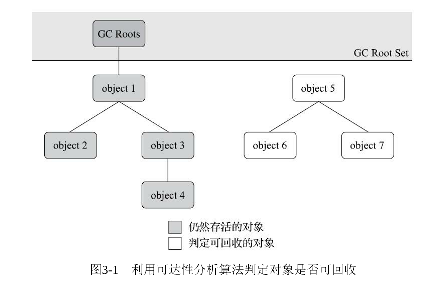

在Java技术体系里面，固定可作为GC Roots的对象包括以下几种：

- 在虚拟机栈（栈帧中的本地变量表）中引用的对象，譬如各个线程被调用的方法堆栈中使用到的参数、局部变量、临时变量等。
- 在方法区中类静态属性引用的对象，譬如Java类的引用类型静态变量。
- 在方法区中常量引用的对象，譬如字符串常量池（String Table）里的引用。
- 在本地方法栈中JNI（即通常所说的Native方法）引用的对象。 
- Java虚拟机内部的引用，如基本数据类型对应的Class对象，一些常驻的异常对象（比如NullPointExcepiton、OutOfMemoryError）等，还有系统类加载器。
- 所有被同步锁（synchronized关键字）持有的对象。 
- 反映Java虚拟机内部情况的JMXBean、JVMTI中注册的回调、本地代码缓存等。

除了这些固定的GC Roots集合以外，根据用户所选用的垃圾收集器以及当前回收的内存区域不同，还可以有其他对象“临时性”地加入，共 同构成完整GC Roots集合。譬如后文将会提到的分代收集和局部回收 （Partial GC），如果只针对Java堆中某一块区域发起垃圾收集时（如最 典型的只针对新生代的垃圾收集），必须考虑到内存区域是虚拟机自己的实现细节（在用户视角里任何内存区域都是不可见的），更不是孤立封闭的，所以某个区域里的对象完全有可能被位于堆中其他区域的对象所引用，这时候就需要将这些关联区域的对象也一并加入GC Roots集合中去，才能保证可达性分析的正确性。

目前最新的几款垃圾收集器无一例外都具备了局部回收的特征， 为了避免GC Roots包含过多对象而过度膨胀，它们在实现上也做出了各 种优化处理。关于这些概念、优化技巧以及各种不同收集器实现等内 容，都将在本章后续内容中一一介绍。

#### 再谈引用

无论是通过引用计数算法判断对象的引用数量，还是通过可达性分析算法判断对象是否引用链可达，判定对象是否存活都和“引用”离不开 关系。在JDK 1.2版之前，Java里面的引用是很传统的定义：如果reference类型的数据中存储的数值代表的是另外一块内存的起始地址， 就称该reference数据是代表某块内存、某个对象的引用。这种定义并没有什么不对，只是现在看来有些过于狭隘了，一个对象在这种定义下只有“被引用”或者“未被引用”两种状态，对于描述一些“食之无味，弃之可惜”的对象就显得无能为力。譬如我们希望能描述一类对象：当内存空间还足够时，能保留在内存之中，如果内存空间在进行垃圾收集后仍然非常紧张，那就可以抛弃这些对象——很多系统的缓存功能都符合这样的应用场景。

在JDK 1.2版之后，Java对引用的概念进行了扩充，将引用分为强引 用（Strongly Reference）、软引用（Soft Reference）、弱引用（Weak Reference）和虚引用（Phantom Reference）4种，这4种引用强度依次逐渐减弱。

- **强引用**是最传统的“引用”的定义，是指在程序代码之中普遍存在的引用赋值，即类似“Object obj=new Object()”这种引用关系。无论任何情况下，只要强引用关系还存在，垃圾收集器就永远不会回收掉被引用的对象。
- **软引用**是用来描述一些还有用，但非必须的对象。只被软引用关联着的对象，在系统将要发生内存溢出异常前，会把这些对象列进回收范围之中进行第二次回收，如果这次回收还没有足够的内存，才会抛出内存溢出异常。在JDK 1.2版之后提供了SoftReference类来实现软引用。
- **弱引用**也是用来描述那些非必须对象，但是它的强度比软引用更弱一些，被弱引用关联的对象只能生存到下一次垃圾收集发生为止。当垃圾收集器开始工作，**无论当前内存是否足够(软引用则在内存不足的情况下才会触发回收)，都会回收掉只被弱引用关联的对象**。在JDK 1.2版之后提供了WeakReference类来实现弱引用。 
- **虚引用**也称为“幽灵引用”或者“幻影引用”，它是最弱的一种引用关系。一个对象是否有虚引用的存在，完全不会对其生存时间构成影响， 也无法通过虚引用来取得一个对象实例。**为一个对象设置虚引用关联的唯一目的只是为了能在这个对象被收集器回收时收到一个系统通知。**在JDK 1.2版之后提供了PhantomReference类来实现虚引用。

#### 生存还是死亡？

即使在可达性分析算法中判定为不可达的对象，也不是“非死不可”的，这时候它们暂时还处于“缓刑”阶段，要真正宣告一个对象死亡，至少要经历两次标记过程：如果对象在进行可达性分析后发现没有与GC Roots相连接的引用链，那它将会被第一次标记，随后进行一次筛 选，筛选的条件是此对象是否有必要执行finalize()方法。**假如对象没有覆盖finalize()方法，或者finalize()方法已经被虚拟机调用过，那么虚拟机将这两种情况都视为“没有必要执行”，这类对象将会被终结回收**。 

**如果这个对象被判定为确有必要执行finalize()方法**，那么该对象将会被放置在一个名为F-Queue的队列之中，并在稍后由一条由虚拟机自动建立的、低调度优先级的Finalizer线程去执行它们的finalize()方法。 这里所说的“执行”是指虚拟机会触发这个方法开始运行，但并不承诺一定会等待它运行结束。这样做的原因是，如果某个对象的finalize()方法执行缓慢，或者更极端地发生了死循环，将很可能导致F-Queue队列中的其他对象永久处于等待，甚至导致整个内存回收子系统的崩溃。finalize()方法是对象逃脱死亡命运的最后一次机会，稍后收集器将对FQueue中的对象进行第二次小规模的标记，**如果对象要在finalize()中成功拯救自己—只要重新与引用链上的任何一个对象建立关联即可，譬如把自己（this关键字）赋值给某个类变量或者对象的成员变量，那在第二次标记时它将被移出“即将回收”的集合；如果对象这时候还没有逃脱，那基本上它就真的要被回收了。** 下面代码清单中我们可以看到一 个对象的finalize()被执行，但是它仍然可以存活：

```java
/**
 * 此代码演示了两点： 
 * 1.对象可以在被GC时自我拯救。 
 * 2.这种自救的机会只有一次，因为一个对象的finalize()方法最多只会被系统自动调用一次
 * 
 * @author 	zzm
 */
public class FinalizeEscapeGC {

	public static FinalizeEscapeGC SAVE_HOOK = null;
	
	public void isAlive() {
		System.out.println("yes, i am still alive :)");
	}
	
	@Override
	protected void finalize() throws Throwable {
		super.finalize();
		System.out.println("finalize method executed!");
		FinalizeEscapeGC.SAVE_HOOK = this;
	}
	
	public static void main(String[] args) throws Throwable {
		SAVE_HOOK = new FinalizeEscapeGC();
		// 对象第一次成功拯救自己
		SAVE_HOOK = null;
		System.gc(); 
		// 因为Finalizer方法优先级很低，暂停0.5秒，以等待它
		Thread.sleep(500);
		if (SAVE_HOOK != null) {
			SAVE_HOOK.isAlive();
		} else {
			System.out.println("no, i am dead :(");
		}
		// 下面这段代码与上面的完全相同，但是这次自救却失败了(因为这个对象的finalize()方法已经被JVM调用过一次了)
		SAVE_HOOK = null;
		System.gc(); 
		// 因为Finalizer方法优先级很低，暂停0.5秒，以等待它
		Thread.sleep(500);
		if (SAVE_HOOK != null) {
			SAVE_HOOK.isAlive();
		} else {
			System.out.println("no, i am dead :(");
		}
	}

}
```

还有一点需要特别说明，上面关于对象死亡时finalize()方法的描述可能带点悲情的艺术加工，笔者并不鼓励大家使用这个方法来拯救对 象。相反，笔者建议大家尽量避免使用它，因为它并不能等同于C和C++语言中的析构函数，而是Java刚诞生时为了使传统C、C++程序员更容易接受Java所做出的一项妥协。它的运行代价高昂，不确定性大，无 法保证各个对象的调用顺序，如今已被官方明确声明为不推荐使用的语法。有些教材中描述它适合做“关闭外部资源”之类的清理性工作，这完全是对finalize()方法用途的一种自我安慰。finalize()能做的所有工作， 使用try-finally或者其他方式都可以做得更好、更及时，所以笔者建议大家完全可以忘掉Java语言里面的这个方法。

#### 回收方法区

有些人认为方法区（如HotSpot虚拟机中的元空间或者永久代）是没有垃圾收集行为的，《Java虚拟机规范》中提到过可以不要求虚拟机 在方法区中实现垃圾收集，事实上也确实有未实现或未能完整实现方法区类型卸载的收集器存在（如JDK 11时期的ZGC收集器就不支持类卸载），方法区垃圾收集的“性价比”通常也是比较低的：在Java堆中，尤其是在新生代中，对常规应用进行一次垃圾收集通常可以回收70%至99%的内存空间，相比之下，方法区回收囿于苛刻的判定条件，其区域垃圾收集的回收成果往往远低于此。

方法区的垃圾收集主要回收两部分内容：废弃的常量和不再使用的类型。回收废弃常量与回收Java堆中的对象非常类似。举个常量池中字 面量回收的例子，假如一个字符串“java”曾经进入常量池中，但是当前系统又没有任何一个字符串对象的值是“java”，换句话说，已经没有任何字符串对象引用常量池中的“java”常量，且虚拟机中也没有其他地方引用这个字面量。如果在这时发生内存回收，而且垃圾收集器判断确有必要的话，这个“java”常量就将会被系统清理出常量池。常量池中其他类（接口）、方法、字段的符号引用也与此类似。

**判定一个常量是否“废弃”还是相对简单，而要判定一个类型是否属于“不再被使用的类”的条件就比较苛刻了。需要同时满足下面三个条 件：**

- 该类所有的实例都已经被回收，也就是Java堆中不存在该类及其任何派生子类的实例。
- 加载该类的类加载器已经被回收，这个条件除非是经过精心设计的可替换类加载器的场景，如OSGi、JSP的重加载等，否则通常是很难达成的。
- 该类对应的java.lang.Class对象没有在任何地方被引用，无法在任何地方通过反射访问该类的方法。

Java虚拟机被允许对满足上述三个条件的无用类进行回收，这里说的仅仅是“被允许”，而并不是和对象一样，没有引用了就必然会回收。

**关于是否要对类型进行回收，HotSpot虚拟机提供了-Xnoclassgc参数进行控制**，还可以使用-verbose:class以及-XX:+TraceClassLoading、XX:+TraceClassUnLoading查看类加载和卸载信息，其中-verbose:class和-XX:+TraceClassLoading可以在Product版的虚拟机中使用，XX:+TraceClassUnLoading参数需要FastDebug版的虚拟机支持。 

**在大量使用反射、动态代理、CGLib等字节码框架，动态生成JSP 以及OSGi这类频繁自定义类加载器的场景中，通常都需要Java虚拟机具备类型卸载的能力，以保证不会对方法区造成过大的内存压力。**

### 3.3　垃圾收集算法

垃圾收集算法的实现涉及大量的程序细节，且各个平台的虚拟机操作内存的方法都有差异，在本节中我们暂不过多讨论算法实现，只重点 介绍分代收集理论和几种算法思想及其发展过程。如果读者对其中的理论细节感兴趣，推荐阅读Richard Jones撰写的《垃圾回收算法手册》的第2～4章的相关内容。

**从如何判定对象消亡的角度出发，垃圾收集算法可以划分为“引用计数式垃圾收集”（Reference Counting GC）和“追踪式垃圾收 集”（Tracing GC）两大类，这两类也常被称作“直接垃圾收集”和“间接垃圾收集”。**由于引用计数式垃圾收集算法在本书讨论到的主流Java虚 拟机中均未涉及，所以我们暂不把它作为正文主要内容来讲解，本节介绍的所有算法均属于追踪式垃圾收集的范畴。

#### 分代收集理论

当前商业虚拟机的垃圾收集器，大多数都遵循了“分代收集”（Generational Collection）的理论进行设计，分代收集名为理论， 实质是一套符合大多数程序运行实际情况的经验法则，它建立在两个分代假说之上：

- 弱分代假说（Weak Generational Hypothesis）：绝大多数对象都是朝生夕灭的。
- 强分代假说（Strong Generational Hypothesis）：熬过越多次垃圾收集过程的对象就越难以消亡。

**这两个分代假说共同奠定了多款常用的垃圾收集器的一致的设计原 则：收集器应该将Java堆划分出不同的区域，然后将回收对象依据其年龄（年龄即对象熬过垃圾收集过程的次数）分配到不同的区域之中存储。显而易见，如果一个区域中大多数对象都是朝生夕灭，难以熬过垃圾收集过程的话，那么把它们集中放在一起，每次回收时只关注如何保留少量存活而不是去标记那些大量将要被回收的对象，就能以较低代价回收到大量的空间；如果剩下的都是难以消亡的对象，那把它们集中放在一块，虚拟机便可以使用较低的频率来回收这个区域，这就同时兼顾了垃圾收集的时间开销和内存的空间有效利用。**

在Java堆划分出不同的区域之后，垃圾收集器才可以每次只回收其中某一个或者某些部分的区域——因而才有了“Minor GC”“Major GC”“Full GC”这样的回收类型的划分；也才能够针对不同的区域安排与里面存储对象存亡特征相匹配的垃圾收集算法——因而发展出了“标记复制算法”“标记-清除算法”“标记-整理算法”等针对性的垃圾收集算法。 这里笔者提前提及了一些新的名词，它们都是本章的重要角色，稍后都会逐一登场，现在读者只需要知道，这一切的出现都始于分代收集理论。

把分代收集理论具体放到现在的商用Java虚拟机里，设计者一般至少会把Java堆划分为新生代（Young Generation）和老年代（Old Generation）两个区域。顾名思义，在新生代中，每次垃圾收集时都
发现有大批对象死去，而每次回收后存活的少量对象，将会逐步晋升到老年代中存放。如果读者有兴趣阅读HotSpot虚拟机源码的话，会发现里面存在着一些名为“*Generation”的实现， 如“DefNewGeneration”和“ParNewGeneration”等，这些就是HotSpot的“分代式垃圾收集器框架”。原本HotSpot鼓励开发者尽量在这个框架内开发新的垃圾收集器，但除了最早期的两组四款收集器之外，后来的开发者并没有继续遵循。导致此事的原因有很多，最根本的是分代收集理论仍在不断发展之中，如何实现也有许多细节可以改进，被既定的代码框架约束反而不便。其实我们只要仔细思考一下，也很容易发现分代收集并非只是简单划分一下内存区域那么容易，它至少存在一个明显的困难： 对象不是孤立的，对象之间会存在跨代引用。

假如要现在进行一次只局限于新生代区域内的收集（Minor GC）， 但新生代中的对象是完全有可能被老年代所引用的，为了找出该区域中的存活对象，不得不在固定的GC Roots之外，再额外遍历整个老年代中所有对象来确保可达性分析结果的正确性，反过来也是一样。遍历整个老年代所有对象的方案虽然理论上可行，但无疑会为内存回收带来很大的性能负担。为了解决这个问题，就需要对分代收集理论添加第三条经验法则：

- 跨代引用假说（Intergenerational Reference Hypothesis）：跨代引用相对于同代引用来说仅占极少数。

这其实是可根据前两条假说逻辑推理得出的隐含推论：存在互相引用关系的两个对象，是应该倾向于同时生存或者同时消亡的。举个例 子，如果某个新生代对象存在跨代引用，由于老年代对象难以消亡，该引用会使得新生代对象在收集时同样得以存活，进而在年龄增长之后晋升到老年代中，这时跨代引用也随即被消除了。

依据这条假说，我们就不应再为了少量的跨代引用去扫描整个老年 代，也不必浪费空间专门记录每一个对象是否存在及存在哪些跨代引 用，只需在新生代上建立一个全局的数据结构（该结构被称为“记忆集”，Remembered Set），这个结构把老年代划分成若干小块，标识出老年代的哪一块内存会存在跨代引用。此后当发生Minor GC时，只有包含了跨代引用的小块内存里的对象才会被加入到GC Roots进行扫描。虽 然这种方法需要在对象改变引用关系（如将自己或者某个属性赋值）时维护记录数据的正确性，会增加一些运行时的开销，但比起收集时扫描整个老年代来说仍然是划算的。

#### 标记-清除算法

最早出现也是最基础的垃圾收集算法是“标记-清除”（MarkSweep）算法，在1960年由Lisp之父John McCarthy所提出。如它的名字一样，算法分为“标记”和“清除”两个阶段：首先标记出所有需要回收的对象，在标记完成后，统一回收掉所有被标记的对象，也可以反过来， 标记存活的对象，统一回收所有未被标记的对象。标记过程就是对象是否属于垃圾的判定过程，这在前一节讲述垃圾对象标记判定算法时其实已经介绍过了。

之所以说它是最基础的收集算法，是因为后续的收集算法大多都是以标记-清除算法为基础，对其缺点进行改进而得到的。它的主要缺点 有两个：第一个是执行效率不稳定，如果Java堆中包含大量对象，而且其中大部分是需要被回收的，这时必须进行大量标记和清除的动作，导致标记和清除两个过程的执行效率都随对象数量增长而降低；第二个是内存空间的碎片化问题，标记、清除之后会产生大量不连续的内存碎片，空间碎片太多可能会导致当以后在程序运行过程中需要分配较大对象时无法找到足够的连续内存而不得不提前触发另一次垃圾收集动作。

#### 标记-复制算法

标记-复制算法常被简称为复制算法。为了解决标记-清除算法面对大量可回收对象时执行效率低的问题，1969年Fenichel提出了一种称 为“半区复制”（Semispace Copying）的垃圾收集算法，它将可用内存按容量划分为大小相等的两块，每次只使用其中的一块。当这一块的内存用完了，就将还存活着的对象复制到另外一块上面，然后再把已使用过的内存空间一次清理掉。如果内存中多数对象都是存活的，这种算法将会产生大量的内存间复制的开销，但对于多数对象都是可回收的情况， 算法需要复制的就是占少数的存活对象，而且每次都是针对整个半区进行内存回收，分配内存时也就不用考虑有空间碎片的复杂情况，只要移动堆顶指针，按顺序分配即可。这样实现简单，运行高效，不过其缺陷也显而易见，这种复制回收算法的代价是将可用内存缩小为了原来的一 半，空间浪费未免太多了一点。

**现在的商用Java虚拟机大多都优先采用了这种收集算法去回收新生代**，IBM公司曾有一项专门研究对新生代“朝生夕灭”的特点做了更量化
的诠释——新生代中的对象有98%熬不过第一轮收集。因此并不需要按照1∶1的比例来划分新生代的内存空间。

**在1989年，Andrew Appel针对具备“朝生夕灭”特点的对象，提出了 一种更优化的半区复制分代策略，现在称为“Appel式回收”。HotSpot虚拟机的Serial、ParNew等新生代收集器均采用了这种策略来设计新生代的内存布局。Appel式回收的具体做法是把新生代分为一块较大的Eden空间和两块较小的Survivor空间，每次分配内存只使用Eden和其中一块Survivor。发生垃圾搜集时，将Eden和Survivor中仍然存活的对象一次性复制到另外一块Survivor空间上，然后直接清理掉Eden和已用过的那块Survivor空间。HotSpot虚拟机默认Eden和Survivor的大小比例是 8∶1，也即每次新生代中可用内存空间为整个新生代容量的90%（Eden 的80%加上一个Survivor的10%），只有一个Survivor空间，即10%的新生代是会被“浪费”的。当然，98%的对象可被回收仅仅是“普通场景”下测得的数据，任何人都没有办法百分百保证每次回收都只有不多于10% 的对象存活，因此Appel式回收还有一个充当罕见情况的“逃生门”的安全设计，当Survivor空间不足以容纳一次Minor GC之后存活的对象时， 就需要依赖其他内存区域（实际上大多就是老年代）进行分配担保（Handle Promotion）。** 

内存的分配担保好比我们去银行借款，如果我们信誉很好，在98%的情况下都能按时偿还，于是银行可能会默认我们下一次也能按时按量 地偿还贷款，只需要有一个担保人能保证如果我不能还款时，可以从他的账户扣钱，那银行就认为没有什么风险了。内存的分配担保也一样， 如果另外一块Survivor空间没有足够空间存放上一次新生代收集下来的存活对象，这些对象便将通过分配担保机制直接进入老年代，这对虚拟机来说就是安全的。关于对新生代进行分配担保的内容，在稍后的3.8.5节介绍垃圾收集器执行规则时还会再进行讲解。

#### 标记-整理算法

标记-复制算法在对象存活率较高时就要进行较多的复制操作，效率将会降低。更关键的是，如果不想浪费50%的空间，就需要有额外的 空间进行分配担保，以应对被使用的内存中所有对象都100%存活的极端情况，所以在老年代一般不能直接选用这种算法。

针对老年代对象的存亡特征，1974年Edward Lueders提出了另外一种有针对性的“标记-整理”（Mark-Compact）算法，其中的标记过程仍然与“标记-清除”算法一样，但后续步骤不是直接对可回收对象进行清理，而是让所有存活的对象都向内存空间一端移动，然后直接清理掉边界以外的内存。

标记-清除算法与标记-整理算法的本质差异在于前者是一种非移动式的回收算法，而后者是移动式的。是否移动回收后的存活对象是一项 优缺点并存的风险决策：

如果移动存活对象，尤其是在老年代这种每次回收都有大量对象存活区域，移动存活对象并更新所有引用这些对象的地方将会是一种极为负重的操作，而且这种对象移动操作必须全程暂停用户应用程序才能进行，这就更加让使用者不得不小心翼翼地权衡其弊端了，像这样的停顿被最初的虚拟机设计者形象地描述为“Stop The World”。 

但如果跟标记-清除算法那样完全不考虑移动和整理存活对象的话，弥散于堆中的存活对象导致的空间碎片化问题就只能依赖更为复杂的内存分配器和内存访问器来解决。譬如通过“分区空闲分配链表”来解决内存分配问题（计算机硬盘存储大文件就不要求物理连续的磁盘空 间，能够在碎片化的硬盘上存储和访问就是通过硬盘分区表实现的）。 内存的访问是用户程序最频繁的操作，甚至都没有之一，假如在这个环节上增加了额外的负担，势必会直接影响应用程序的吞吐量。

基于以上两点，是否移动对象都存在弊端，移动则内存回收时会更复杂，不移动则内存分配时会更复杂。从垃圾收集的停顿时间来看，不 移动对象停顿时间会更短，甚至可以不需要停顿，但是从整个程序的吞吐量来看，移动对象会更划算。此语境中，吞吐量的实质是赋值器 （Mutator，可以理解为使用垃圾收集的用户程序，本书为便于理解， 多数地方用“用户程序”或“用户线程”代替）与收集器的效率总和。即使不移动对象会使得收集器的效率提升一些，但因内存分配和访问相比垃圾收集频率要高得多，这部分的耗时增加，总吞吐量仍然是下降的。HotSpot虚拟机里面关注吞吐量的Parallel Scavenge收集器是基于标记-整理算法的，而关注延迟的CMS收集器则是基于标记-清除算法的，这也从侧面印证这点。

另外，还有一种“和稀泥式”解决方案可以不在内存分配和访问上增加太大额外负担，做法是让虚拟机平时多数时间都采用标记-清除算法，暂时容忍内存碎片的存在，直到内存空间的碎片化程度已经大到影响对象分配时，再采用标记-整理算法收集一次，以获得规整的内存空 间。前面提到的基于标记-清除算法的CMS收集器面临空间碎片过多时采用的就是这种处理办法。

### 3.4　HotSpot的算法细节实现

3.2、3.3节从理论原理上介绍了常见的对象存活判定算法和垃圾收集算法，Java虚拟机实现这些算法时，必须对算法的执行效率有严格的 考量，才能保证虚拟机高效运行。本章设置这部分内容主要是为了稍后介绍各款垃圾收集器时做前置知识铺垫，如果读者对这部分内容感到枯燥或者疑惑，不妨先跳过去，等后续遇到要使用它们的实际场景、实际问题时再结合问题，重新翻阅和理解。

#### 根节点枚举

我们以可达性分析算法中从GC Roots集合找引用链这个操作作为介绍虚拟机高效实现的第一个例子。固定可作为GC Roots的节点主要在全局性的引用（例如常量或类静态属性）与执行上下文（例如栈帧中的本地变量表）中，尽管目标明确，但查找过程要做到高效并非一件容易的事情，现在Java应用越做越庞大，光是方法区的大小就常有数百上千兆，里面的类、常量等更是恒河沙数，若要逐个检查以这里为起源的引用肯定得消耗不少时间。

迄今为止，所有收集器在根节点枚举这一步骤时都是必须暂停用户线程的，因此毫无疑问根节点枚举与之前提及的整理内存碎片一样会面 临相似的“Stop The World”的困扰。现在可达性分析算法耗时最长的查找引用链的过程已经可以做到与用户线程一起并发（具体见3.4.6节）， 但根节点枚举始终还是必须在一个能保障一致性的快照中才得以进行——这里“一致性”的意思是整个枚举期间执行子系统看起来就像被冻结在某个时间点上，不会出现分析过程中，根节点集合的对象引用关系还在不断变化的情况，若这点不能满足的话，分析结果准确性也就无法保证。这是导致垃圾收集过程必须停顿所有用户线程的其中一个重要原因，即使是号称停顿时间可控，或者（几乎）不会发生停顿的CMS、 G1、ZGC等收集器，枚举根节点时也是必须要停顿的。

由于目前主流Java虚拟机使用的都是准确式垃圾收集（这个概念在 第1章介绍Exact VM相对于Classic VM的改进时介绍过），所以当用户 线程停顿下来之后，其实并不需要一个不漏地检查完所有执行上下文和全局的引用位置，虚拟机应当是有办法直接得到哪些地方存放着对象引用的。在HotSpot的解决方案里，是使用一组称为OopMap的数据结构来达到这个目的。一旦类加载动作完成的时候，HotSpot就会把对象内什么偏移量上是什么类型的数据计算出来，在即时编译（见第11章）过程中，也会在特定的位置记录下栈里和寄存器里哪些位置是引用。这样收集器在扫描时就可以直接得知这些信息了，并不需要真正一个不漏地从方法区等GC Roots开始查找。

#### 安全点

在OopMap的协助下，HotSpot可以快速准确地完成GC Roots枚举， 但一个很现实的问题随之而来：可能导致引用关系变化，或者说导致OopMap内容变化的指令非常多，如果为每一条指令都生成对应的OopMap，那将会需要大量的额外存储空间，这样垃圾收集伴随而来的空间成本就会变得无法忍受的高昂。

实际上HotSpot也的确没有为每条指令都生成OopMap，前面已经提到，只是在“特定的位置”记录了这些信息，这些位置被称为安全点（Safepoint）。有了安全点的设定，也就决定了用户程序执行时并非在代码指令流的任意位置都能够停顿下来开始垃圾收集，而是强制要求必须执行到达安全点后才能够暂停。因此，安全点的选定既不能太少以至于让收集器等待时间过长，也不能太过频繁以至于过分增大运行时的内存负荷。安全点位置的选取基本上是以“是否具有让程序长时间执行的特征”为标准进行选定的，因为每条指令执行的时间都非常短暂，程序不太可能因为指令流长度太长这样的原因而长时间执行，“长时间执行”的最明显特征就是指令序列的复用，例如方法调用、循环跳转、异常跳转等都属于指令序列复用，所以只有具有这些功能的指令才会产生安全点。

对于安全点，另外一个需要考虑的问题是，如何在垃圾收集发生时让所有线程（这里其实不包括执行JNI调用的线程）都跑到最近的安全 点，然后停顿下来。这里有两种方案可供选择：抢先式中断（Preemptive Suspension）和主动式中断（Voluntary Suspension），抢 先式中断不需要线程的执行代码主动去配合，在垃圾收集发生时，系统 首先把所有用户线程全部中断，如果发现有用户线程中断的地方不在安全点上，就恢复这条线程执行，让它一会再重新中断，直到跑到安全点 上。现在几乎没有虚拟机实现采用抢先式中断来暂停线程响应GC事件。

而主动式中断的思想是当垃圾收集需要中断线程的时候，不直接对线程操作，仅仅简单地设置一个标志位，各个线程执行过程时会不停地主动去轮询这个标志，一旦发现中断标志为真时就自己在最近的安全点上主动中断挂起。轮询标志的地方和安全点是重合的，另外还要加上所有创建对象和其他需要在Java堆上分配内存的地方，这是为了检查是否即将要发生垃圾收集，避免没有足够内存分配新对象。

#### 安全区域

使用安全点的设计似乎已经完美解决如何停顿用户线程，让虚拟机进入垃圾回收状态的问题了，但实际情况却并不一定。安全点机制保证了程序执行时，在不太长的时间内就会遇到可进入垃圾收集过程的安全 点。但是，程序“不执行”的时候呢？所谓的程序不执行就是没有分配处理器时间，典型的场景便是用户线程处于Sleep状态或者Blocked状态， 这时候线程无法响应虚拟机的中断请求，不能再走到安全的地方去中断挂起自己，虚拟机也显然不可能持续等待线程重新被激活分配处理器时间。对于这种情况，就必须引入安全区域（Safe Region）来解决。

安全区域是指能够确保在某一段代码片段之中，引用关系不会发生变化，因此，在这个区域中任意地方开始垃圾收集都是安全的。我们也 可以把安全区域看作被扩展拉伸了的安全点。

当用户线程执行到安全区域里面的代码时，首先会标识自己已经进入了安全区域，那样当这段时间里虚拟机要发起垃圾收集时就不必去管 这些已声明自己在安全区域内的线程了。当线程要离开安全区域时，它要检查虚拟机是否已经完成了根节点枚举（或者垃圾收集过程中其他需要暂停用户线程的阶段），如果完成了，那线程就当作没事发生过，继续执行；否则它就必须一直等待，直到收到可以离开安全区域的信号为止。

#### 记忆集与卡表

讲解分代收集理论的时候，提到了为解决对象跨代引用所带来的问 题，垃圾收集器在新生代中建立了名为记忆集（Remembered Set）的数据结构，用以避免把整个老年代加进GC Roots扫描范围。事实上并不只是新生代、老年代之间才有跨代引用的问题，所有涉及部分区域收集 （Partial GC）行为的垃圾收集器，典型的如G1、ZGC和Shenandoah收集器，都会面临相同的问题，因此我们有必要进一步理清记忆集的原理和实现方式，以便在后续章节里介绍几款最新的收集器相关知识时能更好地理解。

记忆集是一种用于记录从非收集区域指向收集区域的指针集合的抽象数据结构。如果我们不考虑效率和成本的话，最简单的实现可以用非 收集区域中所有含跨代引用的对象数组来实现这个数据结构。

#### 写屏障

我们已经解决了如何使用记忆集来缩减GC Roots扫描范围的问题， 但还没有解决卡表元素如何维护的问题，例如它们何时变脏、谁来把它们变脏等。

卡表元素何时变脏的答案是很明确的——有其他分代区域中对象引用了本区域对象时，其对应的卡表元素就应该变脏，变脏时间点原则上 应该发生在引用类型字段赋值的那一刻。但问题是如何变脏，即如何在对象赋值的那一刻去更新维护卡表呢？假如是解释执行的字节码，那相对好处理，虚拟机负责每条字节码指令的执行，有充分的介入空间；但 在编译执行的场景中呢？经过即时编译后的代码已经是纯粹的机器指令流了，这就必须找到一个在机器码层面的手段，把维护卡表的动作放到每一个赋值操作之中。

在HotSpot虚拟机里是通过写屏障（Write Barrier）技术维护卡表状态的。先请读者注意将这里提到的“写屏障”，以及后面在低延迟收集器中会提到的“读屏障”与解决并发乱序执行问题中的“内存屏障”区分开来，避免混淆。写屏障可以看作在虚拟机层面对“引用类型字段赋值”这个动作的AOP切面，在引用对象赋值时会产生一个环形（Around）通知，供程序执行额外的动作，也就是说赋值的前后都在写屏障的覆盖范畴内。在赋值前的部分的写屏障叫作写前屏障（Pre-Write Barrier），在 赋值后的则叫作写后屏障（Post-Write Barrier）。HotSpot虚拟机的许多收集器中都有使用到写屏障，但直至G1收集器出现之前，其他收集器都只用到了写后屏障。

#### 并发的可达性分析

在3.2节中曾经提到了当前主流编程语言的垃圾收集器基本上都是 依靠可达性分析算法来判定对象是否存活的，可达性分析算法理论上要 求全过程都基于一个能保障一致性的快照中才能够进行分析，这意味着必须全程冻结用户线程的运行。在根节点枚举（见3.4.1节）这个步骤中，由于GC Roots相比起整个Java堆中全部的对象毕竟还算是极少数， 且在各种优化技巧（如OopMap）的加持下，它带来的停顿已经是非常短暂且相对固定（不随堆容量而增长）的了。可从GC Roots再继续往下遍历对象图，这一步骤的停顿时间就必定会与Java堆容量直接成正比例关系了：堆越大，存储的对象越多，对象图结构越复杂，要标记更多对象而产生的停顿时间自然就更长，这听起来是理所当然的事情。

要知道包含“标记”阶段是所有追踪式垃圾收集算法的共同特征，如果这个阶段会随着堆变大而等比例增加停顿时间，其影响就会波及几乎所有的垃圾收集器，同理可知，如果能够削减这部分停顿时间的话，那收益也将会是系统性的。

想解决或者降低用户线程的停顿，就要先搞清楚为什么必须在一个能保障一致性的快照上才能进行对象图的遍历？为了能解释清楚这个问 题，我们引入三色标记（Tri-color Marking）作为工具来辅助推导，把遍历对象图过程中遇到的对象，按照“是否访问过”这个条件标记成以下三种颜色：

- 白色：表示对象尚未被垃圾收集器访问过。显然在可达性分析刚刚开始的阶段，所有的对象都是白色的，若在分析结束的阶段，仍然是白色的对象，即代表不可达。
- 黑色：表示对象已经被垃圾收集器访问过，且这个对象的所有引用都已经扫描过。黑色的对象代表已经扫描过，它是安全存活的，如果有其他对象引用指向了黑色对象，无须重新扫描一遍。黑色对象不可能直接（不经过灰色对象）指向某个白色对象。
- 灰色：表示对象已经被垃圾收集器访问过，但这个对象上至少存在一个引用还没有被扫描过。

关于可达性分析的扫描过程，读者不妨发挥一下想象力，把它看作对象图上一股以灰色为波峰的波纹从黑向白推进的过程，如果用户线程此时是冻结的，只有收集器线程在工作，那不会有任何问题。但如果用户线程与收集器是并发工作呢？收集器在对象图上标记颜色，同时用户线程在修改引用关系——即修改对象图的结构，这样可能出现两种后果。一种是把原本消亡的对象错误标记为存活，这不是好事，但其实是可以容忍的，只不过产生了一点逃过本次收集的浮动垃圾而已，下次收集清理掉就好。另一种是把原本存活的对象错误标记为已消亡，这就是非常致命的后果了，程序肯定会因此发生错误。

### 3.5　经典垃圾收集器

如果说收集算法是内存回收的方法论，那垃圾收集器就是内存回收的实践者。《Java虚拟机规范》中对垃圾收集器应该如何实现并没有做 出任何规定，因此不同的厂商、不同版本的虚拟机所包含的垃圾收集器都可能会有很大差别，不同的虚拟机一般也都会提供各种参数供用户根据自己的应用特点和要求组合出各个内存分代所使用的收集器。

本节标题中“经典”二字并非情怀，它其实是讨论范围的限定语，这里讨论的是在JDK 7 Update 4之后（在这个版本中正式提供了商用的G1 收集器，此前G1仍处于实验状态）、JDK 11正式发布之前，OracleJDK中的HotSpot虚拟机所包含的全部可用的垃圾收集器。使用“经典”二字是为了与几款目前仍处于实验状态，但执行效果上有革命性改进的高性能低延迟收集器区分开来，这些经典的收集器尽管已经算不上是最先进的技术，但它们曾在实践中千锤百炼，足够成熟，基本上可认为是现在到未来两、三年内，能够在商用生产环境上放心使用的全部垃圾收集器了。各款经典收集器之间的关系如下图所示。

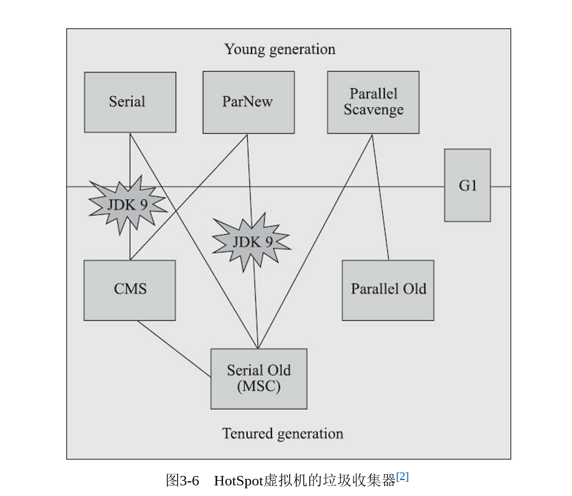

**图3-6展示了七种作用于不同分代的收集器，如果两个收集器之间存在连线（连线中的JDK9代表该组合自JDK9开始已经废弃了）就说明它们可以搭配使用，图中收集器所处的区域，则表示它是属于新生代收集器抑或是老年代收集器。接下来笔者将逐一介绍这些收集器的目标、特性、原理和使用场景，并重点分析CMS和G1这两款相对复杂而又广泛使用的收集器，深入了解它们的部分运作细节。**

在介绍这些收集器各自的特性之前，让我们先来明确一个观点：虽然我们会对各个收集器进行比较，但并非为了挑选一个最好的收集器出来，虽然垃圾收集器的技术在不断进步，但直到现在还没有最好的收集器出现，更加不存在“万能”的收集器，所以我们选择的只是对具体应用最合适的收集器。这点不需要多加论述就能证明：如果有一种放之四海皆准、任何场景下都适用的完美收集器存在，HotSpot虚拟机完全没必要实现那么多种不同的收集器了。

#### Serial收集器

Serial收集器是最基础、历史最悠久的收集器，曾经（在JDK 1.3.1 之前）是HotSpot虚拟机新生代收集器的唯一选择。大家只看名字就能 够猜到，这个收集器是一个单线程工作的收集器，但它的“单线程”的意义并不仅仅是说明它只会使用一个处理器或一条收集线程去完成垃圾收集工作，更重要的是强调在它进行垃圾收集时，必须暂停其他所有工作线程，直到它收集结束。“Stop The World”这个词语也许听起来很酷，但这项工作是由虚拟机在后台自动发起和自动完成的，在用户不可知、 不可控的情况下把用户的正常工作的线程全部停掉，这对很多应用来说都是不能接受的。读者不妨试想一下，要是你的电脑每运行一个小时就会暂停响应五分钟，你会有什么样的心情？图3-7示意了Serial/Serial Old收集器的运行过程。

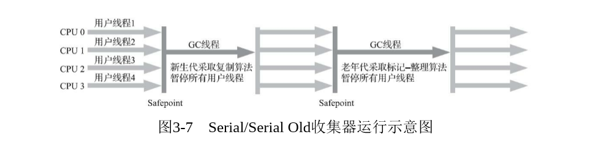

对于“Stop The World”带给用户的恶劣体验，早期HotSpot虚拟机的 设计者们表示完全理解，但也同时表示非常委屈：“你妈妈在给你打扫房间的时候，肯定也会让你老老实实地在椅子上或者房间外待着，如果她一边打扫，你一边乱扔纸屑，这房间还能打扫完？”这确实是一个合情合理的矛盾，虽然垃圾收集这项工作听起来和打扫房间属于一个工种，但实际上肯定还要比打扫房间复杂得多！

从JDK 1.3开始，一直到现在最新的JDK 13，HotSpot虚拟机开发团队为消除或者降低用户线程因垃圾收集而导致停顿的努力一直持续进行 着，从Serial收集器到Parallel收集器，再到Concurrent Mark Sweep（CMS）和Garbage First（G1）收集器，最终至现在垃圾收集器的最前沿成果Shenandoah和ZGC等，我们看到了一个个越来越构思精巧，越来越优秀，也越来越复杂的垃圾收集器不断涌现，用户线程的停顿时间在持续缩短，但是仍然没有办法彻底消除（这里不去讨论RTSJ 中的收集器），探索更优秀垃圾收集器的工作仍在继续。

写到这里，笔者似乎已经把Serial收集器描述成一个最早出现，但目前已经老而无用，食之无味，弃之可惜的“鸡肋”了，但事实上，迄今为止，它依然是HotSpot虚拟机运行在客户端模式下的默认新生代收集器，有着优于其他收集器的地方，那就是简单而高效（与其他收集器的单线程相比），对于内存资源受限的环境，它是所有收集器里额外内存消耗（Memory Footprint）最小的；对于单核处理器或处理器核心数较少的环境来说，Serial收集器由于没有线程交互的开销，专心做垃圾收集自然可以获得最高的单线程收集效率。在用户桌面的应用场景以及近年来流行的部分微服务应用中，分配给虚拟机管理的内存一般来说并不会特别大，收集几十兆甚至一两百兆的新生代（仅仅是指新生代使用的内存，桌面应用甚少超过这个容量），垃圾收集的停顿时间完全可以控制在十几、几十毫秒，最多一百多毫秒以内，只要不是频繁发生收集，这点停顿时间对许多用户来说是完全可以接受的。**所以，Serial收集器对于运行在客户端模式下的虚拟机来说是一个很好的选择。**

#### ParNew收集器

ParNew收集器实质上是Serial收集器的多线程并行版本，除了同时使用多条线程进行垃圾收集之外，其余的行为包括Serial收集器可用的 所有控制参数（例如：-XX:SurvivorRatio、-XX:PretenureSizeThreshold、-XX:HandlePromotionFailure等）、收集算法、Stop The World、对象分配规则、回收策略等都与Serial收集器完全一致，在实现上这两种收集器也共用了相当多的代码。ParNew收集器的工作过程如图3-8所示。

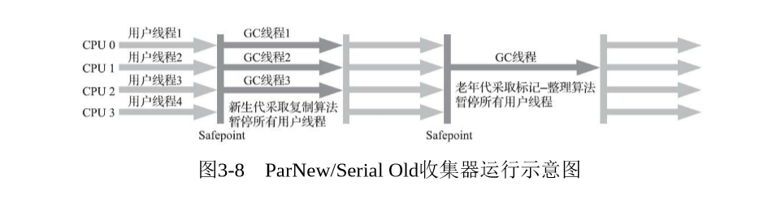

ParNew收集器除了支持多线程并行收集之外，其他与Serial收集器相比并没有太多创新之处，但它却是不少运行在服务端模式下的HotSpot虚拟机，尤其是JDK 7之前的遗留系统中首选的新生代收集器， 其中有一个与功能、性能无关但其实很重要的原因是：除了Serial收集器外，目前只有它能与CMS收集器配合工作。 

在JDK 5发布时，HotSpot推出了一款在强交互应用中几乎可称为具有划时代意义的垃圾收集器——CMS收集器。这款收集器是HotSpot虚拟机中第一款真正意义上支持并发的垃圾收集器，它首次实现了让垃圾收集线程与用户线程（基本上）同时工作。

遗憾的是，CMS作为老年代的收集器，却无法与JDK 1.4.0中已经存在的新生代收集器Parallel Scavenge配合工作，所以在JDK 5中使用 CMS来收集老年代的时候，新生代只能选择ParNew或者Serial收集器中 的一个。ParNew收集器是激活CMS后（使用-XX:+UseConcMarkSweepGC选项）的默认新生代收集器，也可以使用-XX:+/-UseParNewGC选项来强制指定或者禁用它。

可以说直到CMS的出现才巩固了ParNew的地位，但成也萧何败也萧何，随着垃圾收集器技术的不断改进，更先进的G1收集器带着CMS 继承者和替代者的光环登场。G1是一个面向全堆的收集器，不再需要其他新生代收集器的配合工作。所以自JDK 9开始，ParNew加CMS收集器的组合就不再是官方推荐的服务端模式下的收集器解决方案了。官方希望它能完全被G1所取代，甚至还取消了ParNew加Serial Old以及Serial加CMS这两组收集器组合的支持（其实原本也很少人这样使用），并直接取消了-XX:+UseParNewGC参数(因为启用CMS收集器-XX:+UseCMSGC的话也只能搭配默认的ParNew收集器)，这意味着ParNew和CMS从此只能互相搭配使用，再也没有其他收集器能够和它们配合了。读者也可以理解为从此以后，ParNew合并入CMS，成为它专门处理新生代的组成部分。ParNew可以说是HotSpot虚拟机中第一款退出历史舞台的垃圾收集器。

ParNew收集器在单核心处理器的环境中绝对不会有比Serial收集器更好的效果，甚至由于存在线程交互的开销，该收集器在通过超线程 （Hyper-Threading）技术实现的伪双核处理器环境中都不能百分之百保证超越Serial收集器。当然，随着可以被使用的处理器核心数量的增加，ParNew对于垃圾收集时系统资源的高效利用还是很有好处的。它 默认开启的收集线程数与处理器核心数量相同，在处理器核心非常多（譬如32个，现在CPU都是多核加超线程设计，服务器达到或超过32个逻辑核心的情况非常普遍）的环境中，可以使用-XX:ParallelGCThreads参数来限制垃圾收集的线程数。

从ParNew收集器开始，后面还将会接触到若干款涉及“并发”和“并行”概念的收集器。在大家可能产生疑惑之前，有必要先解释清楚这两个名词。并行和并发都是并发编程中的专业名词，在谈论垃圾收集器的上下文语境中，它们可以理解为：

- 并行（Parallel）：并行描述的是多条垃圾收集器线程之间的关系，说明同一时间有多条这样的线程在协同工作，通常默认此时用户线程是处于等待状态。
- 并发（Concurrent）：并发描述的是垃圾收集器线程与用户线程之间的关系，说明同一时间垃圾收集器线程与用户线程都在运行。由于用户线程并未被冻结，所以程序仍然能响应服务请求，但由于垃圾收集器线程占用了一部分系统资源，此时应用程序的处理的吞吐量将受到一定影响。

#### Parallel Scavenge收集器

Parallel Scavenge收集器也是一款新生代收集器，它同样是基于标记-复制算法实现的收集器，也是能够并行收集的多线程收集器…… Parallel Scavenge的诸多特性从表面上看和ParNew非常相似，那它有什么特别之处呢？

Parallel Scavenge收集器的特点是它的关注点与其他收集器不同， CMS等收集器的关注点是尽可能地缩短垃圾收集时用户线程的停顿时 间，而Parallel Scavenge收集器的目标则是达到一个可控制的吞吐量（Throughput）。所谓吞吐量就是处理器用于运行用户代码的时间与处理器总消耗时间的比值，即：


如果虚拟机完成某个任务，用户代码加上垃圾收集总共耗费了100分钟，其中垃圾收集花掉1分钟，那吞吐量就是99%。停顿时间越短就 越适合需要与用户交互或需要保证服务响应质量的程序，良好的响应速度能提升用户体验；而高吞吐量则可以最高效率地利用处理器资源，尽快完成程序的运算任务，主要适合在后台运算而不需要太多交互的分析任务。

**Parallel Scavenge收集器提供了两个参数用于精确控制吞吐量，分别是控制最大垃圾收集停顿时间的-XX:MaxGCPauseMillis参数以及直接设置吞吐量大小的-XX:GCTimeRatio参数。**

-XX:MaxGCPauseMillis参数允许的值是一个大于0的毫秒数，收集器将尽力保证内存回收花费的时间不超过用户设定值。不过大家不要 异想天开地认为如果把这个参数的值设置得更小一点就能使得系统的垃圾收集速度变得更快，垃圾收集停顿时间缩短是以牺牲吞吐量和新生代空间为代价换取的：系统把新生代调得小一些，收集300MB新生代肯定比收集500MB快，但这也直接导致垃圾收集发生得更频繁，原来10秒收集一次、每次停顿100毫秒，现在变成5秒收集一次、每次停顿70毫秒。 停顿时间的确在下降，但吞吐量也降下来了。

-XX：GCTimeRatio参数的值则应当是一个大于0小于100的整数，也就是垃圾收集时间占总时间的比率，相当于吞吐量的倒数。譬如把此 参数设置为19，那允许的最大垃圾收集时间就占总时间的5%（即 1/(1+19)），默认值为99，即允许最大1%（即1/(1+99)）的垃圾收集时 间。

由于与吞吐量关系密切，Parallel Scavenge收集器也经常被称作“吞吐量优先收集器”。除上述两个参数之外，Parallel Scavenge收集器还**有一个参数-XX:+UseAdaptiveSizePolicy值得我们关注。这是一个开关参数，当这个参数被激活之后，就不需要人工指定新生代的大小（Xmn）、Eden与Survivor区的比例（-XX:SurvivorRatio）、晋升老年代 对象大小（-XX:PretenureSizeThreshold）等细节参数了，虚拟机会根据当前系统的运行情况收集性能监控信息，动态调整这些参数以提供最合适的停顿时间或者最大的吞吐量。这种调节方式称为垃圾收集的自适应的调节策略（GC Ergonomics）**。如果读者对于收集器运作不太了解，手工优化存在困难的话，使用Parallel Scavenge收集器配合自适应调节策略，把内存管理的调优任务交给虚拟机去完成也许是一个很不错的选择。只需要把基本的内存数据设置好（如-Xmx设置最大堆），然后使用-XX:MaxGCPauseMillis参数（更关注最大停顿时间）或-XX:GCTimeRatio（更关注吞吐量）参数给虚拟机设立一个优化目标，那具体细节参数的调节工作就由虚拟机完成了。自适应调节策略也是Parallel Scavenge收集器区别于ParNew收集器的一个重要特性。

#### Serial Old收集器

Serial Old是Serial收集器的老年代版本，它同样是一个单线程收集器，使用标记-整理算法。这个收集器的主要意义也是供客户端模式下 的HotSpot虚拟机使用。如果在服务端模式下，它也可能有两种用途： 一种是在JDK 5以及之前的版本中与Parallel Scavenge收集器搭配使用，另外一种就是作为CMS收集器发生失败时的后备预案，在并发收集发生Concurrent Mode Failure时使用。这两点都将在后面的内容中继续 讲解。Serial Old收集器的工作过程如图3-7所示。


#### Parallel Old收集器

Parallel Old是Parallel Scavenge收集器的老年代版本，支持多线程并发收集，基于标记-整理算法实现。这个收集器是直到JDK 6时才开始提供的，在此之前，新生代的Parallel Scavenge收集器一直处于相当尴尬的状态，原因是如果新生代选择了Parallel Scavenge收集器，老年代除了Serial Old（PS MarkSweep）收集器以外别无选择，其他表现良好的老年代收集器，如CMS无法与它配合工作。由于老年代Serial Old收集器在服务端应用性能上的“拖累”，使用Parallel Scavenge收集器也未必能在整体上获得吞吐量最大化的效果。同样，由于单线程的老年代收集中无法充分利用服务器多处理器的并行处理能力，在老年代内存空间很大而且硬件规格比较高级的运行环境中，这种组合的总吞吐量甚至不一定比ParNew加CMS的组合来得优秀。

直到Parallel Old收集器出现后，“吞吐量优先”收集器终于有了比较名副其实的搭配组合，在注重吞吐量或者处理器资源较为稀缺的场合，都可以优先考虑Parallel Scavenge加Parallel Old收集器这个组合。Parallel Old收集器的工作过程如图3-10所示。

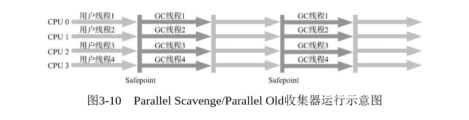

#### CMS收集器

CMS（Concurrent Mark Sweep）收集器是一种以获取最短回收停顿时间为目标的收集器。目前很大一部分的Java应用集中在互联网网站或者基于浏览器的B/S系统的服务端上，这类应用通常都会较为关注服务的响应速度，希望系统停顿时间尽可能短，以给用户带来良好的交互体验。CMS收集器就非常符合这类应用的需求。

从名字（包含“Mark Sweep”）上就可以看出CMS收集器是基于标记-清除算法实现的，它的运作过程相对于前面几种收集器来说要更复杂一些，整个过程分为四个步骤，包括：

1. 初始标记（CMS initial mark） (需要Stop The World)

2. 并发标记（CMS concurrent mark） 

3. 重新标记（CMS remark）  (需要Stop The World)

4. 并发清除（CMS concurrent sweep） 

其中初始标记、重新标记这两个步骤仍然需要“Stop The World”。 初始标记仅仅只是标记一下GC Roots能直接关联到的对象，速度很快；并发标记阶段就是从GC Roots的直接关联对象开始遍历整个对象图的过程，这个过程耗时较长但是不需要停顿用户线程，可以与垃圾收集线程一起并发运行；而重新标记阶段则是为了修正并发标记期间，因用户程序继续运作而导致标记产生变动的那一部分对象的标记记录（详见3.4.6节中关于增量更新的讲解），这个阶段的停顿时间通常会比初始标记阶段稍长一些，但也远比并发标记阶段的时间短；最后是并发清除阶段，清理删除掉标记阶段判断的已经死亡的对象，由于不需要移动存活对象，所以这个阶段也是可以与用户线程同时并发的。

由于在整个过程中耗时最长的并发标记和并发清除阶段中，垃圾收集器线程都可以与用户线程一起工作，所以从总体上来说，CMS收集器 的内存回收过程是与用户线程一起并发执行的。通过图3-11可以比较清 楚地看到CMS收集器的运作步骤中并发和需要停顿的阶段。

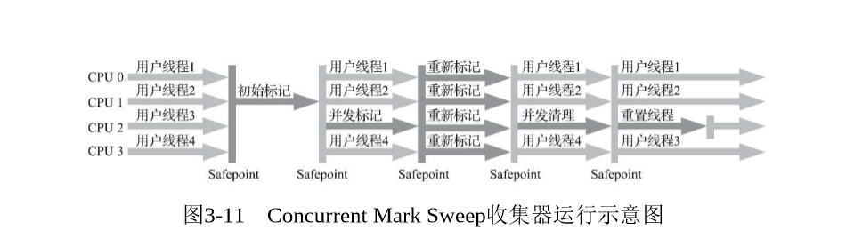

CMS是一款优秀的收集器，它最主要的优点在名字上已经体现出来：并发收集、低停顿，一些官方公开文档里面也称之为“并发低停顿收集器”（Concurrent Low Pause Collector）。CMS收集器是HotSpot虚拟机追求低停顿的第一次成功尝试，但是它还远达不到完美的程度，至少有以下三个明显的缺点：

首先，CMS收集器对处理器资源非常敏感。事实上，面向并发设计的程序都对处理器资源比较敏感。在并发阶段，它虽然不会导致用户线 程停顿，但却会因为占用了一部分线程（或者说处理器的计算能力）而导致应用程序变慢，降低总吞吐量。CMS默认启动的回收线程数是（处理器核心数量+3）/ 4，也就是说，如果处理器核心数在四个或以上，并发回收时垃圾收集线程只占用不超过25%的处理器运算资源，并且会随着处理器核心数量的增加而下降。但是当处理器核心数量不足四个时，CMS对用户程序的影响就可能变得很大。如果应用本来的处理器负载就很高，还要分出一半的运算能力去执行收集器线程，就可能导致用户程序的执行速度忽然大幅降低。为了缓解这种情况，虚拟机提供了一种称为“增量式并发收集器”（Incremental Concurrent Mark Sweep/i-CMS）的CMS收集器变种，所做的事情和以前单核处理器年代PC机操作系统靠抢占式多任务来模拟多核并行多任务的思想一样，是在并发标记、清理的时候让收集器线程、用户线程交替运行，尽量减少垃圾收集线程的独占资源的时间，这样整个垃圾收集的过程会更长，但对用户程序的影响就会显得较少一些，直观感受是速度变慢的时间更多了，但速度下降幅度就没有那么明显。实践证明增量式的CMS收集器效果很一般，从JDK 7开始，i-CMS模式已经被声明为“deprecated”，即已过时不再提倡用户使用，到JDK 9发布后i-CMS模式被完全废弃。

然后，由于CMS收集器无法处理“浮动垃圾”（Floating Garbage）， 有可能出现“Concurrent Mode Failure”失败进而导致另一次完全“Stop The World”的Full GC的产生。在CMS的并发标记和并发清理阶段，用户线程是还在继续运行的，程序在运行自然就还会伴随有新的垃圾对象不断产生，但这一部分垃圾对象是出现在标记过程结束以后，CMS无法在当次收集中处理掉它们，只好留待下一次垃圾收集时再清理掉。这一部分垃圾就称为“浮动垃圾”。**同样也是由于在垃圾收集阶段用户线程还需要持续运行，那就还需要预留足够内存空间提供给用户线程使用，因此CMS收集器不能像其他收集器那样等待到老年代几乎完全被填满了再进行收集，必须预留一部分空间供并发收集时的程序运作使用。在JDK 5的默认设置下，CMS收集器当老年代使用了68%的空间后就会被激活， 这是一个偏保守的设置，如果在实际应用中老年代增长并不是太快，可以适当调高参数-XX:CMSInitiatingOccupancyFraction的值来提高CMS的触发百分比，降低内存回收频率，获取更好的性能。到了JDK 6时， CMS收集器的启动阈值就已经默认提升至92%（这个值是由MinHeapFreeRatio和CMSTriggerRatio间接计算出来的，因为默认的CMSInitiatingOccupancyFraction=-1）。但这又会更容易面临另 一种风险：要是CMS运行期间预留的内存无法满足程序分配新对象的需要，就会出现一次“并发失败”（Concurrent Mode Failure），这时候虚拟机将不得不启动后备预案：冻结用户线程的执行，临时启用Serial Old收集器来重新进行老年代的垃圾收集，但这样停顿时间就很长了。所以参数-XX:CMSInitiatingOccupancyFraction设置得太高将会很容易导致大量的并发失败产生，性能反而降低，用户应在生产环境中根据实际应用情况来权衡设置。**

还有最后一个缺点，在本节的开头曾提到，CMS是一款基于“标记清除”算法实现的收集器，如果读者对前面这部分介绍还有印象的话， 就可能想到这意味着收集结束时会有大量空间碎片产生。空间碎片过多时，将会给大对象分配带来很大麻烦，往往会出现老年代还有很多剩余空间，但就是无法找到足够大的连续空间来分配当前对象，而不得不提前触发一次Full GC的情况。为了解决这个问题，CMS收集器提供了一 个-XX：+UseCMSCompactAtFullCollection开关参数（默认是开启的， 此参数从JDK 9开始废弃），用于在CMS收集器不得不进行Full GC时开启内存碎片的合并整理过程，由于这个内存整理必须移动存活对象，（在Shenandoah和ZGC出现前）是无法并发的。这样空间碎片问题是解决了，但停顿时间又会变长，因此虚拟机设计者们还提供了另外一个参数-XX:CMSFullGCsBeforeCompaction（此参数从JDK 9开始废弃）， 这个参数的作用是要求CMS收集器在执行过若干次（数量由参数值决定）不整理空间的Full GC之后，下一次进入Full GC前会先进行碎片整理（默认值为0，表示每次进入Full GC时都进行碎片整理）。

#### Garbage First收集器

Garbage First（简称G1）收集器是垃圾收集器技术发展历史上的里程碑式的成果，它开创了收集器面向局部收集的设计思路和基于Region 的内存布局形式。早在JDK 7刚刚确立项目目标、Oracle公司制定的JDK 7 RoadMap里面，G1收集器就被视作JDK 7中HotSpot虚拟机的一项重要进化特征。从JDK 6 Update 14开始就有Early Access版本的G1收集器供开发人员实验和试用，但由此开始G1收集器的“实验状态”（Experimental）持续了数年时间，直至JDK 7 Update 4，Oracle才认为它达到足够成熟的商用程度，移除了“Experimental”的标识；到了JDK 8 Update 40的时候，G1提供并发的类卸载的支持，补全了其计划功能的后一块拼图。这个版本以后的G1收集器才被Oracle官方称为“全功能的垃圾收集器”（Fully-Featured Garbage Collector）。 

G1是一款主要面向服务端应用的垃圾收集器。HotSpot开发团队最初赋予它的期望是（在比较长期的）未来可以替换掉JDK 5中发布的 CMS收集器。现在这个期望目标已经实现过半了，JDK 9发布之日，G1宣告取代Parallel Scavenge加Parallel Old组合，成为服务端模式下的默认垃圾收集器，而CMS则沦落至被声明为不推荐使用（Deprecate）的收集器。如果对JDK 9及以上版本的HotSpot虚拟机使用参数-XX:+UseConcMarkSweepGC来开启CMS收集器的话，用户会收到一个警告信息，提示CMS未来将会被废弃：
```java
Java HotSpot(TM) 64-Bit Server VM warning: Option UseConcMarkSweepGC was deprecated in version 9.0 and will likely be removed in a future release.
```

但作为一款曾被广泛运用过的收集器，经过多个版本的开发迭代后，CMS（以及之前几款收集器）的代码与HotSpot的内存管理、执 行、编译、监控等子系统都有千丝万缕的联系，这是历史原因导致的， 并不符合职责分离的设计原则。为此，规划JDK 10功能目标时，HotSpot虚拟机提出了“统一垃圾收集器接口”，将内存回收的“行为”与“实现”进行分离，CMS以及其他收集器都重构成基于这套接口的一种实现。以此为基础，日后要移除或者加入某一款收集器，都会变得容易许多，风险也可以控制，这算是在为CMS退出历史舞台铺下最后的道路了。

作为CMS收集器的替代者和继承人，设计者们希望做出一款能够建立起“停顿时间模型”（Pause Prediction Model）的收集器，停顿时间模型的意思是能够支持指定在一个长度为M毫秒的时间片段内，消耗在垃圾收集上的时间大概率不超过N毫秒这样的目标，这几乎已经是实时Java（RTSJ）的中软实时垃圾收集器特征了。

那具体要怎么做才能实现这个目标呢？首先要有一个思想上的改变，在G1收集器出现之前的所有其他收集器，包括CMS在内，垃圾收集的目标范围要么是整个新生代（Minor GC），要么就是整个老年代（Major GC），再要么就是整个Java堆（Full GC）。而G1跳出了这个樊笼，它可以面向堆内存任何部分来组成回收集（Collection Set，一般 简称CSet）进行回收，衡量标准不再是它属于哪个分代，而是哪块内存中存放的垃圾数量最多，回收收益最大，这就是G1收集器的Mixed GC模式。

G1开创的基于Region的堆内存布局是它能够实现这个目标的关键。虽然G1也仍是遵循分代收集理论设计的，但其堆内存的布局与其他收 集器有非常明显的差异：G1不再坚持固定大小以及固定数量的分代区域划分，而是把连续的Java堆划分为多个大小相等的独立区域（Region），每一个Region都可以根据需要，扮演新生代的Eden空间、Survivor空间，或者老年代空间。收集器能够对扮演不同角色的Region采用不同的策略去处理，这样无论是新创建的对象还是已经存活了一段时间、熬过多次收集的旧对象都能获取很好的收集效果。

Region中还有一类特殊的Humongous区域，专门用来存储大对象。 G1认为只要大小超过了一个Region容量一半的对象即可判定为大对象。 每个Region的大小可以通过参数-XX:G1HeapRegionSize设定，取值范围为1MB～32MB，且应为2的N次幂。而对于那些超过了整个Region容量的超级大对象，将会被存放在N个连续的Humongous Region之中，G1的大多数行为都把Humongous Region作为老年代的一部分来进行看待，如图3-12所示。

虽然G1仍然保留新生代和老年代的概念，但新生代和老年代不再是固定的了，它们都是一系列区域（不需要连续）的动态集合。G1收集器之所以能建立可预测的停顿时间模型，是因为它将Region作为单次回收的最小单元，即每次收集到的内存空间都是Region大小的整数倍，这样可以有计划地避免在整个Java堆中进行全区域的垃圾收集。更具体的处理思路是让G1收集器去跟踪各个Region里面的垃圾堆积的“价值”大小，价值即回收所获得的空间大小以及回收所需时间的经验值，然后在后台维护一个优先级列表，每次根据用户设定允许的收集停顿时间（使用参数-XX:MaxGCPauseMillis指定，默认值是200毫秒），优先处理回收价值收益最大的那些Region，这也就是“Garbage First”名字的由来。这种使用Region划分内存空间，以及具有优先级的区域回收方式，保证了G1收集器在有限的时间内获取尽可能高的收集效率。

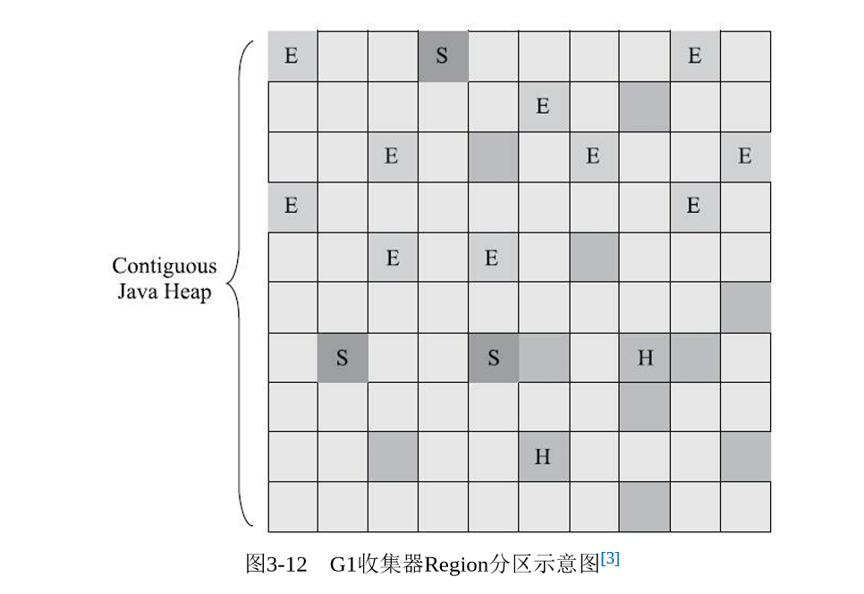

G1将堆内存“化整为零”的“解题思路”，看起来似乎没有太多令人惊讶之处，也完全不难理解，但其中的实现细节可是远远没有想象中那么 简单，否则就不会从2004年Sun实验室发表第一篇关于G1的论文后一直拖到2012年4月JDK 7 Update 4发布，用将近10年时间才倒腾出能够商用的G1收集器来。G1收集器至少有（不限于）以下这些关键的细节问题需要妥善解决：

- 譬如，将Java堆分成多个独立Region后，Region里面存在的跨Region引用对象如何解决？解决的思路我们已经知道（见3.3.1节和3.4.4 节）：使用记忆集避免全堆作为GC Roots扫描，但在G1收集器上记忆集的应用其实要复杂很多，它的每个Region都维护有自己的记忆集，这些记忆集会记录下别的Region指向自己的指针，并标记这些指针分别在哪些卡页的范围之内。G1的记忆集在存储结构的本质上是一种哈希表，Key是别的Region的起始地址，Value是一个集合，里面存储的元素是卡表的索引号。这种“双向”的卡表结构（卡表是“我指向谁”，这种结构还记录了“谁指向我”）比原来的卡表实现起来更复杂，同时由于Region数量比传统收集器的分代数量明显要多得多，因此G1收集器要比其他的传统垃圾收集器有着更高的内存占用负担。根据经验，G1至少要耗费大约相当于Java堆容量10%至20%的额外内存来维持收集器工作。
- 譬如，在并发标记阶段如何保证收集线程与用户线程互不干扰地运行？这里首先要解决的是用户线程改变对象引用关系时，必须保证其不能打破原本的对象图结构，导致标记结果出现错误，该问题的解决办法笔者已经抽出独立小节来讲解过（见3.4.6节）：CMS收集器采用增量更新算法实现，而G1收集器则是通过原始快照（SATB）算法来实现的。此外，垃圾收集对用户线程的影响还体现在回收过程中新创建对象的内存分配上，程序要继续运行就肯定会持续有新对象被创建，G1为每一个Region设计了两个名为TAMS（Top at Mark Start）的指针，把Region中的一部分空间划分出来用于并发回收过程中的新对象分配，并发回收时新分配的对象地址都必须要在这两个指针位置以上。G1收集器默认在这个地址以上的对象是被隐式标记过的，即默认它们是存活的，不纳入回收范围。与CMS中的“Concurrent Mode Failure”失败会导致Full GC类似，如果内存回收的速度赶不上内存分配的速度，G1收集器也要被迫冻结用户线程执行，导致Full GC而产生长时间“Stop The World”。 
- 譬如，怎样建立起可靠的停顿预测模型？用户通过-XX:MaxGCPauseMillis参数指定的停顿时间只意味着垃圾收集发生之前的期望值，但G1收集器要怎么做才能满足用户的期望呢？G1收集器的停顿预测模型是以衰减均值（Decaying Average）为理论基础来实现的，在垃圾收集过程中，G1收集器会记录每个Region的回收耗时、每个Region记忆集里的脏卡数量等各个可测量的步骤花费的成本，并分析得出平均值、标准偏差、置信度等统计信息。这里强调的“衰减平均值”是指它会比普通的平均值更容易受到新数据的影响，平均值代表整体平均状态，但衰减平均值更准确地代表“最近的”平均状态。换句话说，Region的统计状态越新越能决定其回收的价值。然后通过这些信息预测现在开始回收的话，由哪些Region组成回收集才可以在不超过期望停顿时间的约束下获得最高的收益。

如果我们不去计算用户线程运行过程中的动作（如使用写屏障维护记忆集的操作），G1收集器的运作过程大致可划分为以下四个步骤： 

- 初始标记（Initial Marking）：仅仅只是标记一下GC Roots能直接关联到的对象，并且修改TAMS指针的值，让下一阶段用户线程并发运 行时，能正确地在可用的Region中分配新对象。**这个阶段需要停顿线程，但耗时很短**，而且是借用进行Minor GC的时候同步完成的，所以G1收集器在这个阶段实际并没有额外的停顿。
- 并发标记（Concurrent Marking）：从GC Root开始对堆中对象进行可达性分析，递归扫描整个堆里的对象图，找出要回收的对象，**这阶段耗时较长，但可与用户程序并发执行**。当对象图扫描完成以后，还要重新处理SATB记录下的在并发时有引用变动的对象。
- 最终标记（Final Marking）：**对用户线程做另一个短暂的暂停**，用 于处理并发阶段结束后仍遗留下来的最后那少量的SATB记录。
- 筛选回收（Live Data Counting and Evacuation）：负责更新Region的统计数据，对各个Region的回收价值和成本进行排序，根据用户所期望的停顿时间来制定回收计划，可以自由选择任意多个Region构成回收集，然后把决定回收的那一部分Region的存活对象复制到空的Region中，再清理掉整个旧Region的全部空间。这里的操作涉及存活对象的移动，**是必须暂停用户线程，由多条收集器线程并行完成的**。

从上述阶段的描述可以看出，G1收集器除了并发标记外，其余阶段也是要完全暂停用户线程的，换言之，它并非纯粹地追求低延迟，官 方给它设定的目标是在延迟可控的情况下获得尽可能高的吞吐量，所以才能担当起“全功能收集器”的重任与期望。

从Oracle官方透露出来的信息可获知，回收阶段（Evacuation）其实本也有想过设计成与用户程序一起并发执行，但这件事情做起来比较复杂，考虑到G1只是回收一部分Region，停顿时间是用户可控制的，所以并不迫切去实现，而选择把这个特性放到了G1之后出现的低延迟垃圾收集器（即ZGC）中。另外，还考虑到G1不是仅仅面向低延迟，停顿用户线程能够最大幅度提高垃圾收集效率，为了保证吞吐量所以才选择了完全暂停用户线程的实现方案。通过图3-13可以比较清楚地看到G1收集器的运作步骤中并发和需要停顿的阶段。

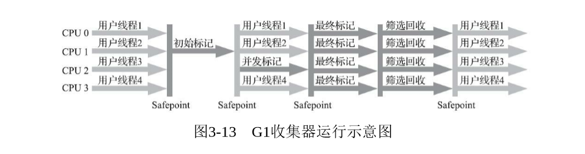

毫无疑问，可以由用户指定期望的停顿时间是G1收集器很强大的一个功能，设置不同的期望停顿时间，可使得G1在不同应用场景中取得关注吞吐量和关注延迟之间的最佳平衡。不过，这里设置的“期望值”必须是符合实际的，不能异想天开，毕竟G1是要冻结用户线程来复制对象的，这个停顿时间再怎么低也得有个限度。它默认的停顿目标为两百毫秒，一般来说，回收阶段占到几十到一百甚至接近两百毫秒都很正常，但如果我们把停顿时间调得非常低，譬如设置为二十毫秒，很可能出现的结果就是由于停顿目标时间太短，导致每次选出来的回收集只占堆内存很小的一部分，收集器收集的速度逐渐跟不上分配器分配的速度，导致垃圾慢慢堆积。很可能一开始收集器还能从空闲的堆内存中获得一些喘息的时间，但应用运行时间一长就不行了，最终占满堆引发Full GC反而降低性能，所以通常把期望停顿时间设置为一两百毫秒或者两三百毫秒会是比较合理的。

从G1开始，最先进的垃圾收集器的设计导向都不约而同地变为追 求能够应付应用的内存分配速率（Allocation Rate），而不追求一次把 整个Java堆全部清理干净。这样，应用在分配，同时收集器在收集，只要收集的速度能跟得上对象分配的速度，那一切就能运作得很完美。这 种新的收集器设计思路从工程实现上看是从G1开始兴起的，所以说G1是收集器技术发展的一个里程碑。

G1收集器常会被拿来与CMS收集器互相比较，毕竟它们都非常关注停顿时间的控制，官方资料中将它们两个并称为“The Mostly Concurrent Collectors”。在未来，G1收集器最终还是要取代CMS的，而当下它们两者并存的时间里，分个高低优劣就无可避免。

相比CMS，G1的优点有很多，暂且不论可以指定最大停顿时间、分Region的内存布局、按收益动态确定回收集这些创新性设计带来的红 利，单从最传统的算法理论上看，G1也更有发展潜力。与CMS的“标记清除”算法不同，G1从整体来看是基于“标记-整理”算法实现的收集器，但从局部（两个Region之间）上看又是基于“标记-复制”算法实现，无论如何，这两种算法都意味着G1运作期间不会产生内存空间碎片，垃圾收集完成之后能提供规整的可用内存。这种特性有利于程序长时间运行，在程序为大对象分配内存时不容易因无法找到连续内存空间而提前触发下一次收集。

不过，G1相对于CMS仍然不是占全方位、压倒性优势的，从它出现几年仍不能在所有应用场景中代替CMS就可以得知这个结论。比起CMS，G1的弱项也可以列举出不少，如在用户程序运行过程中，G1无论是为了垃圾收集产生的内存占用（Footprint）还是程序运行时的额外执行负载（Overload）都要比CMS要高。

就内存占用来说，虽然G1和CMS都使用卡表来处理跨代指针，但G1的卡表实现更为复杂，而且堆中每个Region，无论扮演的是新生代还 是老年代角色，都必须有一份卡表，这导致G1的记忆集（和其他内存消耗）可能会占整个堆容量的20%乃至更多的内存空间；相比起来CMS的卡表就相当简单，只有唯一一份，而且只需要处理老年代到新生代的引用，反过来则不需要，由于新生代的对象具有朝生夕灭的不稳定性，引用变化频繁，能省下这个区域的维护开销是很划算的。

在执行负载的角度上，同样由于两个收集器各自的细节实现特点导致了用户程序运行时的负载会有不同，譬如它们都使用到写屏障，CMS 用写后屏障来更新维护卡表；而G1除了使用写后屏障来进行同样的（由于G1的卡表结构复杂，其实是更烦琐的）卡表维护操作外，为了 实现原始快照搜索（SATB）算法，还需要使用写前屏障来跟踪并发时的指针变化情况。相比起增量更新算法，原始快照搜索能够减少并发标记和重新标记阶段的消耗，避免CMS那样在最终标记阶段停顿时间过长的缺点，但是在用户程序运行过程中确实会产生由跟踪引用变化带来的额外负担。由于G1对写屏障的复杂操作要比CMS消耗更多的运算资源，所以CMS的写屏障实现是直接的同步操作，而G1就不得不将其实现为类似于消息队列的结构，把写前屏障和写后屏障中要做的事情都放到队列里，然后再异步处理。

以上的优缺点对比仅仅是针对G1和CMS两款垃圾收集器单独某方面的实现细节的定性分析，通常我们说哪款收集器要更好、要好上多少，往往是针对具体场景才能做的定量比较。按照笔者的实践经验，目前在小内存应用上CMS的表现大概率仍然要会优于G1，而在大内存应用上G1则大多能发挥其优势，这个优劣势的Java堆容量平衡点通常在6GB至8GB之间，当然，以上这些也仅是经验之谈，不同应用需要量体裁衣地实际测试才能得出最合适的结论，随着HotSpot的开发者对G1的不断优化，也会让对比结果继续向G1倾斜。

### 3.6　低延迟垃圾收集器

HotSpot的垃圾收集器从Serial发展到CMS再到G1，经历了逾二十年 时间，经过了数百上千万台服务器上的应用实践，已经被淬炼得相当成熟了，不过它们距离“完美”还是很遥远。怎样的收集器才算是“完美”呢？这听起来像是一道主观题，其实不然，完美难以实现，但是我们确实可以把它客观描述出来。

衡量垃圾收集器的三项最重要的指标是：内存占用（Footprint）、 吞吐量（Throughput）和延迟（Latency），三者共同构成了一个“不可能三角”。三者总体的表现会随技术进步而越来越好，但是要在这三个方面同时具有卓越表现的“完美”收集器是极其困难甚至是不可能的，一款优秀的收集器通常最多可以同时达成其中的两项。

**在内存占用、吞吐量和延迟这三项指标里，延迟的重要性日益凸显，越发备受关注。其原因是随着计算机硬件的发展、性能的提升，我们越来越能容忍收集器多占用一点点内存；硬件性能增长，对软件系统的处理能力是有直接助益的，硬件的规格和性能越高，也有助于降低收集器运行时对应用程序的影响，换句话说，吞吐量会更高。但对延迟则不是这样，硬件规格提升，准确地说是内存的扩大，对延迟反而会带来负面的效果，这点也是很符合直观思维的：虚拟机要回收完整的1TB的堆内存，毫无疑问要比回收1GB的堆内存耗费更多时间。由此，我们就不难理解为何延迟会成为垃圾收集器最被重视的性能指标了。现在我们来观察一下现在已接触过的垃圾收集器的停顿状况，如图3-14所示。**

图3-14中浅色阶段表示必须挂起用户线程，深色表示收集器线程与用户线程是并发工作的。由图3-14可见，在CMS和G1之前的全部收集器，其工作的所有步骤都会产生“Stop The World”式的停顿；CMS和G1分别使用增量更新和原始快照（见3.4.6节）技术，实现了标记阶段的并发，不会因管理的堆内存变大，要标记的对象变多而导致停顿时间随之增长。但是对于标记阶段之后的处理，仍未得到妥善解决。CMS使用标记-清除算法，虽然避免了整理阶段收集器带来的停顿，但是清除算法不论如何优化改进，在设计原理上避免不了空间碎片的产生，随着空间碎片不断淤积最终依然逃不过“Stop The World”的命运。G1虽然可以按更小的粒度进行回收，从而抑制整理阶段出现时间过长的停顿，但毕竟也还是要暂停的。


读者肯定也从图3-14中注意到了，最后的两款收集器，Shenandoah和ZGC，几乎整个工作过程全部都是并发的，只有初始标记、最终标记 这些阶段有短暂的停顿，这部分停顿的时间基本上是固定的，与堆的容量、堆中对象的数量没有正比例关系。实际上，它们都可以在任意可管理的（譬如现在ZGC只能管理4TB以内的堆）堆容量下，实现垃圾收集的停顿都不超过十毫秒这种以前听起来是天方夜谭、匪夷所思的目标。这两款目前仍处于实验状态的收集器，被官方命名为“低延迟垃圾收集器”（Low-Latency Garbage Collector或者Low-Pause-Time Garbage Collector）。 

#### Shenandoah收集器

在本书所出现的众多垃圾收集器里，Shenandoah大概是最“孤独”的 一个。现代社会竞争激烈，连一个公司里不同团队之间都存在“部门墙”，那Shenandoah作为第一款不由Oracle（包括以前的Sun）公司的虚拟机团队所领导开发的HotSpot垃圾收集器，不可避免地会受到一些来自“官方”的排挤。在笔者撰写这部分内容时，Oracle仍明确拒绝在OracleJDK 12中支持Shenandoah收集器，并执意在打包OracleJDK时通过条件编译完全排除掉了Shenandoah的代码，换句话说，Shenandoah是一款只有OpenJDK才会包含，而OracleJDK里反而不存在的收集器，“免费开源版”比“收费商业版”功能更多，这是相对罕见的状况。如果读者的项目要求用到Oracle商业支持的话，就不得不把Shenandoah排除在选择范围之外了。

最初Shenandoah是由RedHat公司独立发展的新型收集器项目，在2014年RedHat把Shenandoah贡献给了OpenJDK，并推动它成为OpenJDK 12的正式特性之一，也就是后来的JEP 189。这个项目的目标是实现一种能在任何堆内存大小下都可以把垃圾收集的停顿时间限制在十毫秒以内的垃圾收集器，该目标意味着相比CMS和G1，Shenandoah不仅要进行并发的垃圾标记，还要并发地进行对象清理后的整理动作。

从代码历史渊源上讲，比起稍后要介绍的有着Oracle正朔血统的ZGC，Shenandoah反而更像是G1的下一代继承者，它们两者有着相似的 堆内存布局，在初始标记、并发标记等许多阶段的处理思路上都高度一 致，甚至还直接共享了一部分实现代码，这使得部分对G1的打磨改进和Bug修改会同时反映在Shenandoah之上，而由于Shenandoah加入所带来的一些新特性，也有部分会出现在G1收集器中，譬如在并发失败后作为“逃生门”的Full GC，G1就是由于合并了Shenandoah的代码才获得多线程Full GC的支持。

那Shenandoah相比起G1又有什么改进呢？虽然Shenandoah也是使用基于Region的堆内存布局，同样有着用于存放大对象的Humongous Region，默认的回收策略也同样是优先处理回收价值最大的Region…… 但在管理堆内存方面，它与G1至少有三个明显的不同之处，最重要的当然是支持并发的整理算法，G1的回收阶段是可以多线程并行的，但却不能与用户线程并发，这点作为Shenandoah最核心的功能稍后笔者会着重讲解。其次，Shenandoah（目前）是默认不使用分代收集的，换言之，不会有专门的新生代Region或者老年代Region的存在，没有实现分代，并不是说分代对Shenandoah没有价值，这更多是出于性价比的权衡，基于工作量上的考虑而将其放到优先级较低的位置上。最后， Shenandoah摒弃了在G1中耗费大量内存和计算资源去维护的记忆集，改用名为“连接矩阵”（Connection Matrix）的全局数据结构来记录跨 Region的引用关系，降低了处理跨代指针时的记忆集维护消耗，也降低了伪共享问题（见3.4.4节）的发生概率。连接矩阵可以简单理解为一张二维表格，如果Region N有对象指向Region M，就在表格的N行M列中打上一个标记，如图3-15所示，如果Region 5中的对象Baz引用了Region 3的Foo，Foo又引用了Region 1的Bar，那连接矩阵中的5行3列、3行1列就应该被打上标记。在回收时通过这张表格就可以得出哪些Region之间产生了跨代引用。

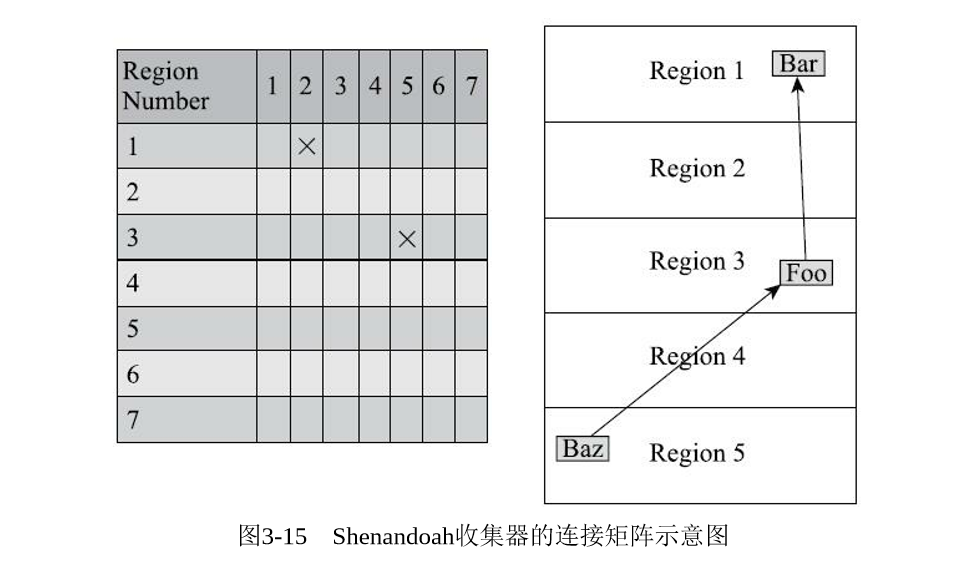

Shenandoah收集器的工作过程大致可以划分为以下九个阶段（此处以Shenandoah在2016年发表的原始论文进行介绍。在最新版本的Shenandoah 2.0中，进一步强化了“部分收集”的特性，初始标记之前还 有Initial Partial、Concurrent Partial和Final Partial阶段，它们可以不太严谨地理解为对应于以前分代收集中的Minor GC的工作）：

- 初始标记（Initial Marking）：与G1一样，首先标记与GC Roots直接关联的对象，这个阶段仍是“Stop The World”的，但停顿时间与堆大小无关，只与GC Roots的数量相关。

- 并发标记（Concurrent Marking）：与G1一样，遍历对象图，标记出全部可达的对象，这个阶段是与用户线程一起并发的，时间长短取决于堆中存活对象的数量以及对象图的结构复杂程度。

- 最终标记（Final Marking）：与G1一样，处理剩余的SATB扫描， 并在这个阶段统计出回收价值最高的Region，将这些Region构成一组回收集（Collection Set）。**最终标记阶段也会有一小段短暂的停顿。**

- 并发清理（Concurrent Cleanup）：这个阶段用于清理那些整个区域内连一个存活对象都没有找到的Region（这类Region被称为Immediate Garbage Region）。

- 并发回收（Concurrent Evacuation）：并发回收阶段是Shenandoah与之前HotSpot中其他收集器的核心差异。在这个阶段，Shenandoah要把回收集里面的存活对象先复制一份到其他未被使用的Region之中。复制对象这件事情如果将用户线程冻结起来再做那是相当简单的，但如果两者必须要同时并发进行的话，就变得复杂起来了。其困难点是在移动 对象的同时，用户线程仍然可能不停对被移动的对象进行读写访问，移动对象是一次性的行为，但移动之后整个内存中所有指向该对象的引用都还是旧对象的地址，这是很难一瞬间全部改变过来的。对于并发回收阶段遇到的这些困难，Shenandoah将会通过读屏障和被称为“Brooks Pointers”的转发指针来解决（讲解完Shenandoah整个工作过程之后笔者还要再回头介绍它）。并发回收阶段运行的时间长短取决于回收集的大小。

- 初始引用更新（Initial Update Reference）：并发回收阶段复制对象结束后，还需要把堆中所有指向旧对象的引用修正到复制后的新地址，这个操作称为引用更新。引用更新的初始化阶段实际上并未做什么具体的处理，设立这个阶段只是为了建立一个线程集合点，确保所有并发回收阶段中进行的收集器线程都已完成分配给它们的对象移动任务而已。**初始引用更新时间很短，会产生一个非常短暂的停顿。**

- 并发引用更新（Concurrent Update Reference）：真正开始进行引用更新操作，这个阶段是与用户线程一起并发的，时间长短取决于内存中涉及的引用数量的多少。并发引用更新与并发标记不同，它不再需要沿着对象图来搜索，只需要按照内存物理地址的顺序，线性地搜索出引用类型，把旧值改为新值即可。

- 最终引用更新（Final Update Reference）：解决了堆中的引用更新后，还要修正存在于GC Roots中的引用。**这个阶段是Shenandoah的最后一次停顿，停顿时间只与GC Roots的数量相关。**

- 并发清理（Concurrent Cleanup）：经过并发回收和引用更新之后，整个回收集中所有的Region已再无存活对象，这些Region都变成Immediate Garbage Regions了，最后再调用一次并发清理过程来回收这些Region的内存空间，供以后新对象分配使用。

以上对Shenandoah收集器这九个阶段的工作过程的描述可能拆分得略为琐碎，读者只要抓住其中三个最重要的并发阶段（并发标记、并发回收、并发引用更新），就能比较容易理清Shenandoah是如何运作的了。图3-16中黄色的区域代表的是被选入回收集的Region，绿色部分就代表还存活的对象，蓝色就是用户线程可以用来分配对象的内存Region了。图3-16中不仅展示了Shenandoah三个并发阶段的工作过程，还能形象地表示出并发标记阶段如何找出回收对象确定回收集，并发回收阶段如何移动回收集中的存活对象，并发引用更新阶段如何将指向回收集中存活对象的所有引用全部修正，此后回收集便不存在任何引用可达的存活对象了。

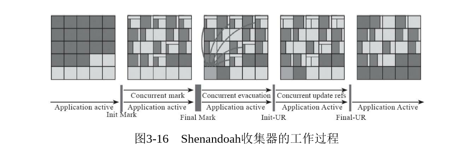

学习了Shenandoah收集器的工作过程，我们再来聊一下Shenandoah用以支持并行整理的核心概念——Brooks Pointer。“Brooks”是一个人的名字。1984年，Rodney A.Brooks在论文《Trading Data Space for Reduced Time and Code Space in Real-Time Garbage Collection on Stock Hardware》中提出了使用转发指针（Forwarding Pointer，也常被称为Indirection Pointer）来实现对象移动与用户程序并发的一种解决方案。此前，要做类似的并发操作，通常是在被移动对象原有的内存上设置保护陷阱（Memory Protection Trap），一旦用户程序访问到归属于旧对象的内存空间就会产生自陷中段，进入预设好的异常处理器中，再由其中的代码逻辑把访问转发到复制后的新对象上。虽然确实能够实现对象移动与用户线程并发，但是如果没有操作系统层面的直接支持，这种方案将导致用户态频繁切换到核心态，代价是非常大的，不能频繁使用。

Brooks提出的新方案不需要用到内存保护陷阱，而是在原有对象布局结构的最前面统一增加一个新的引用字段，在正常不处于并发移动的 情况下，该引用指向对象自己。

从结构上来看，Brooks提出的转发指针与某些早期Java虚拟机使用过的句柄定位（关于对象定位详见第2章）有一些相似之处，两者都是 一种间接性的对象访问方式，差别是句柄通常会统一存储在专门的句柄池中，而转发指针是分散存放在每一个对象头前面。

有了转发指针之后，有何收益暂且不论，所有间接对象访问技术的缺点都是相同的，也是非常显著的——每次对象访问会带来一次额外的 转向开销，尽管这个开销已经被优化到只有一行汇编指令的程度。不过，毕竟对象定位会被频繁使用到，这仍是一笔不可忽视的执行成本，只是它比起内存保护陷阱的方案已经好了很多。转发指针加入后带来的收益自然是当对象拥有了一份新的副本时，只需要修改一处指针的值，即旧对象上转发指针的引用位置，使其指向新对象，便可将所有对该对象的访问转发到新的副本上。这样只要旧对象的内存仍然存在，未被清理掉，虚拟机内存中所有通过旧引用地址访问的代码便仍然可用，都会被自动转发到新对象上继续工作。

需要注意，Brooks形式的转发指针在设计上决定了它是必然会出现多线程竞争问题的，如果收集器线程与用户线程发生的只是并发读取， 那无论读到旧对象还是新对象上的字段，返回的结果都应该是一样的，这个场景还可以有一些“偷懒”的处理余地；但如果发生的是并发写入， 就一定必须保证写操作只能发生在新复制的对象上，而不是写入旧对象的内存中。所以这里必须针对转发指针的访问操作采取同步措施，让收集器线程或者用户线程对转发指针的访问只有其中之一能够成功，另外一个必须等待，避免两者交替进行。实际上Shenandoah收集器是通过比较并交换（Compare And Swap，CAS）操作来保证并发时对象的访问正确性的。

转发指针另一点必须注意的是执行频率的问题，尽管通过对象头上的Brooks Pointer来保证并发时原对象与复制对象的访问一致性，这件事情只从原理上看是不复杂的，但是“对象访问”这四个字的分量是非常重的，对于一门面向对象的编程语言来说，对象的读取、写入，对象的比较，为对象哈希值计算，用对象加锁等，这些操作都属于对象访问的范 畴，它们在代码中比比皆是，要覆盖全部对象访问操作，Shenandoah不得不同时设置读、写屏障去拦截。

之前介绍其他收集器时，或者是用于维护卡表，或者是用于实现并发标记，写屏障已被使用多次，累积了不少的处理任务了，这些写屏障 有相当一部分在Shenandoah收集器中依然要被使用到。除此以外，为了实现Brooks Pointer，Shenandoah在读、写屏障中都加入了额外的转发处理，尤其是使用读屏障的代价，这是比写屏障更大的。代码里对象读取的出现频率要比对象写入的频率高出很多，读屏障数量自然也要比写屏障多得多，所以读屏障的使用必须更加谨慎，不允许任何的重量级操作。Shenandoah是本书中第一款使用到读屏障的收集器，它的开发者也意识到数量庞大的读屏障带来的性能开销会是Shenandoah被诟病的关键点之一，所以计划在JDK 13中将Shenandoah的内存屏障模型改进为基于引用访问屏障（Load Reference Barrier）的实现，所谓“引用访问屏障”是指内存屏障只拦截对象中数据类型为引用类型的读写操作，而不去管原生数据类型等其他非引用字段的读写，这能够省去大量对原生类型、对象比较、对象加锁等场景中设置内存屏障所带来的消耗。

最后来谈谈Shenandoah在实际应用中的性能表现，Shenandoah的开发团队或者其他第三方测试者在网上都公布了一系列测试，结果各有差异。笔者在此选择展示了一份RedHat官方在2016年所发表的Shenandoah实现论文中给出的应用实测数据，测试内容是使用ElasticSearch对200GB的维基百科数据进行索引，如表3-2所示。从结果来看，应该说2016年做该测试时的Shenandoah并没有完全达成预定目标，停顿时间比其他几款收集器确实有了质的飞跃，但也并未实现最大停顿时间控制在十毫秒以内的目标，而吞吐量方面则出现了很明显的下降，其总运行时间是所有测试收集器中最长的。读者可以从这个官方的测试结果来对Shenandoah的弱项（高运行负担使得吞吐量下降）和强项（低延迟时间）建立量化的概念，并对比一下稍后介绍的ZGC的测试结果。

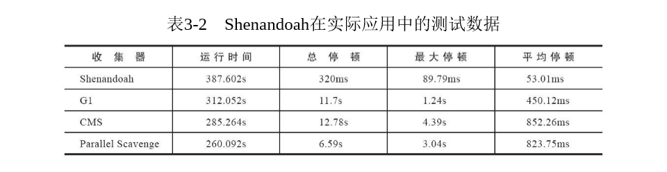

#### ZGC收集器

ZGC（“Z”并非什么专业名词的缩写，这款收集器的名字就叫作Z Garbage Collector）是一款在JDK 11中新加入的具有实验性质的低延迟垃圾收集器，是由Oracle公司研发的。2018年Oracle创建了JEP 333将ZGC提交给OpenJDK，推动其进入OpenJDK 11的发布清单之中。

ZGC和Shenandoah的目标是高度相似的，都希望在尽可能对吞吐量影响不太大的前提下，实现在任意堆内存大小下都可以把垃圾收集的 停顿时间限制在十毫秒以内的低延迟。但是ZGC和Shenandoah的实现思路又是差异显著的，如果说RedHat公司开发的Shenandoah像是Oracle的G1收集器的实际继承者的话，那Oracle公司开发的ZGC就更像是Azul System公司独步天下的PGC（Pauseless GC）和C4（Concurrent Continuously Compacting Collector）收集器的同胞兄弟。

早在2005年，运行在Azul VM上的PGC就已经实现了标记和整理阶段都全程与用户线程并发运行的垃圾收集，而运行在Zing VM上的C4收 集器是PGC继续演进的产物，主要增加了分代收集支持，大幅提升了收集器能够承受的对象分配速度。无论从算法还是实现原理上来讲，PGC和C4肯定算是一脉相承的，而ZGC虽然并非Azul公司的产品，但也应视为这条脉络上的另一个节点，因为ZGC几乎所有的关键技术上，与PGC和C4都只存在术语称谓上的差别，实质内容几乎是一模一样的。相信到这里读者应该已经对Java虚拟机收集器常见的专业术语都有所了解了，如果不避讳专业术语的话，我们可以给ZGC下一个这样的定义来概括它的主要特征：ZGC收集器是一款基于Region内存布局的，（暂时）不设分代的，使用了读屏障、染色指针和内存多重映射等技术来实现可并发的**标记-整理算法**的，以低延迟为首要目标的一款垃圾收集器。接下来，笔者将逐项来介绍ZGC的这些技术特点。

首先从ZGC的内存布局说起。与Shenandoah和G1一样，ZGC也采用基于Region的堆内存布局，但与它们不同的是，ZGC的Region（在一些官方资料中将它称为Page或者ZPage，本章为行文一致继续称为Region）具有动态性——动态创建和销毁，以及动态的区域容量大小。在x64硬件平台下，ZGC的Region可以具有如图3-19所示的大、中、小 三类容量：

- 小型Region（Small Region）：容量固定为2MB，用于放置小于256KB的小对象。

- 中型Region（Medium Region）：容量固定为32MB，用于放置大于等于256KB但小于4MB的对象。

- 大型Region（Large Region）：容量不固定，可以动态变化，但必须为2MB的整数倍，用于放置4MB或以上的大对象。每个大型Region中只会存放一个大对象，这也预示着虽然名字叫作“大型Region”，但它的实际容量完全有可能小于中型Region，最小容量可低至4MB。大型Region在ZGC的实现中是不会被重分配（重分配是ZGC的一种处理动作，用于复制对象的收集器阶段，稍后会介绍到）的，因为复制一个大对象的代价非常高昂。

接下来是ZGC的核心问题——并发整理算法的实现。Shenandoah使用转发指针和读屏障来实现并发整理，ZGC虽然同样用到了读屏障，但用的却是一条与Shenandoah完全不同，更加复杂精巧的解题思路。 

ZGC收集器有一个标志性的设计是它采用的染色指针技术（Colored Pointer，其他类似的技术中可能将它称为Tag Pointer或者Version Pointer）。从前，如果我们要在对象上存储一些额外的、只供收集器或者虚拟机本身使用的数据，通常会在对象头中增加额外的存储字段（详见2.3.2节的内容），如对象的哈希码、分代年龄、锁记录等就是这样存储的。这种记录方式在有对象访问的场景下是很自然流畅的， 不会有什么额外负担。但如果对象存在被移动过的可能性，即不能保证对象访问能够成功呢？又或者有一些根本就不会去访问对象，但又希望得知该对象的某些信息的应用场景呢？能不能从指针或者与对象内存无关的地方得到这些信息，譬如是否能够看出来对象被移动过？这样的要求并非不合理的刁难，先不去说并发移动对象可能带来的可访问性问题，此前我们就遇到过这样的要求——追踪式收集算法的标记阶段就可能存在只跟指针打交道而不必涉及指针所引用的对象本身的场景。例如对象标记的过程中需要给对象打上三色标记（见3.4.6节），这些标记本质上就只和对象的引用有关，而与对象本身无关——某个对象只有它的引用关系能决定它存活与否，对象上其他所有的属性都不能够影响它的存活判定结果。HotSpot虚拟机的几种收集器有不同的标记实现方案，有的把标记直接记录在对象头上（如Serial收集器），有的把标记记录在与对象相互独立的数据结构上（如G1、Shenandoah使用了一种相当于堆内存的1/64大小的，称为BitMap的结构来记录标记信息），而ZGC的染色指针是最直接的、最纯粹的，它直接把标记信息记在引用对象的指针上，这时，与其说可达性分析是遍历对象图来标记对象，还不如说是遍历“引用图”来标记“引用”了。

染色指针是一种直接将少量额外的信息存储在指针上的技术，可是为什么指针本身也可以存储额外信息呢？在64位系统中，理论可以访问 的内存高达16EB（2的64次幂）字节。实际上，基于需求（用不到那么多内存）、性能（地址越宽在做地址转换时需要的页表级数越多）和成本（消耗更多晶体管）的考虑，在AMD64架构中只支持到52位（4PB）的地址总线和48位（256TB）的虚拟地址空间，所以目前64位的硬件实际能够支持的最大内存只有256TB。此外，操作系统一侧也还会施加自己的约束，64位的Linux则分别支持47位（128TB）的进程虚拟地址空间和46位（64TB）的物理地址空间，64位的Windows系统甚至只支持44位（16TB）的物理地址空间。

尽管Linux下64位指针的高18位不能用来寻址，但剩余的46位指针所能支持的64TB内存在今天仍然能够充分满足大型服务器的需要。鉴 于此，ZGC的染色指针技术继续盯上了这剩下的46位指针宽度，将其高4位提取出来存储四个标志信息。通过这些标志位，虚拟机可以直接从指针中看到其引用对象的三色标记状态、是否进入了重分配集（即被移动过）、是否只能通过finalize()方法才能被访问到，如图3-20所示。当然，由于这些标志位进一步压缩了原本就只有46位的地址空间，也直接导致ZGC能够管理的内存不可以超过4TB（2的42次幂）。

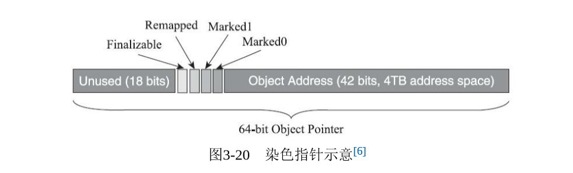

虽然染色指针有4TB的内存限制，不能支持32位平台，不能支持压缩指针（-XX:+UseCompressedOops）等诸多约束，但它带来的收益也是非常可观的，在JEP 333的描述页中，ZGC的设计者Per Liden在“描述”小节里花了全文过半的篇幅来陈述染色指针的三大优势：

- 染色指针可以使得一旦某个Region的存活对象被移走之后，这个Region立即就能够被释放和重用掉，而不必等待整个堆中所有指向该Region的引用都被修正后才能清理。这点相比起Shenandoah是一个颇大的优势，使得理论上只要还有一个空闲Region，ZGC就能完成收集，而Shenandoah需要等到引用更新阶段结束以后才能释放回收集中的Region，这意味着堆中几乎所有对象都存活的极端情况，需要1∶1复制对象到新Region的话，就必须要有一半的空闲Region来完成收集。至于为什么染色指针能够导致这样的结果，笔者将在后续解释其“自愈”特性的时候进行解释。
- 染色指针可以大幅减少在垃圾收集过程中内存屏障的使用数量，设置内存屏障，尤其是写屏障的目的通常是为了记录对象引用的变动情况，如果将这些信息直接维护在指针中，显然就可以省去一些专门的记录操作。实际上，到目前为止ZGC都并未使用任何写屏障，只使用了读屏障（一部分是染色指针的功劳，一部分是ZGC现在还不支持分代收集，天然就没有跨代引用的问题）。内存屏障对程序运行时性能的损耗在前面章节中已经讲解过，能够省去一部分的内存屏障，显然对程序运行效率是大有裨益的，所以ZGC对吞吐量的影响也相对较低。
- 染色指针可以作为一种可扩展的存储结构用来记录更多与对象标记、重定位过程相关的数据，以便日后进一步提高性能。现在Linux下的64位指针还有前18位并未使用，它们虽然不能用来寻址，却可以通过其他手段用于信息记录。如果开发了这18位，既可以腾出已用的4个标志位，将ZGC可支持的最大堆内存从4TB拓展到64TB，也可以利用其余位置再存储更多的标志，譬如存储一些追踪信息来让垃圾收集器在移动对象时能将低频次使用的对象移动到不常访问的内存区域。

不过，要顺利应用染色指针有一个必须解决的前置问题：Java虚拟机作为一个普普通通的进程，这样随意重新定义内存中某些指针的其中 几位，操作系统是否支持？处理器是否支持？这是很现实的问题，无论中间过程如何，程序代码最终都要转换为机器指令流交付给处理器去执行，处理器可不会管指令流中的指针哪部分存的是标志位，哪部分才是真正的寻址地址，只会把整个指针都视作一个内存地址来对待。这个问题在Solaris/SPARC平台上比较容易解决，因为SPARC硬件层面本身就支持虚拟地址掩码，设置之后其机器指令直接就可以忽略掉染色指针中的标志位。但在x86-64平台上并没有提供类似的黑科技，ZGC设计者就只能采取其他的补救措施了，这里面的解决方案要涉及虚拟内存映射技术。

接下来，我们来学习ZGC收集器是如何工作的。ZGC的运作过程大致可划分为以下四个大的阶段。全部四个阶段都是可以并发执行的，仅 是两个阶段中间会存在短暂的停顿小阶段，这些小阶段，譬如初始化GC Root直接关联对象的Mark Start，与之前G1和Shenandoah的Initial Mark阶段并没有什么差异，笔者就不再单独解释了。ZGC的运作过程具体如图3-22所示。

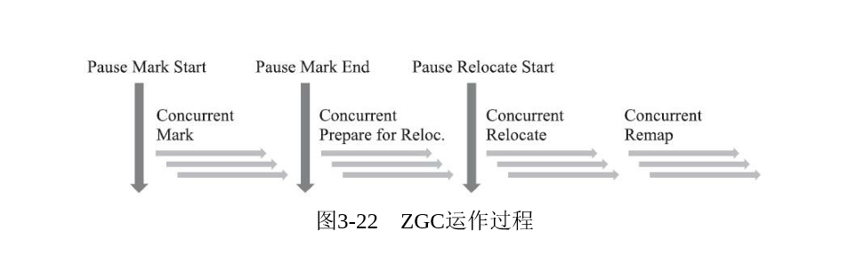

- 并发标记（Concurrent Mark）：与G1、Shenandoah一样，并发标记是遍历对象图做可达性分析的阶段，前后也要经过类似于G1、 Shenandoah的初始标记、最终标记（尽管ZGC中的名字不叫这些）的短暂停顿，而且这些停顿阶段所做的事情在目标上也是相类似的。与G1、Shenandoah不同的是，ZGC的标记是在指针上而不是在对象上进行的，标记阶段会更新染色指针中的Marked 0、Marked 1标志位。
- 并发预备重分配（Concurrent Prepare for Relocate）：这个阶段需要根据特定的查询条件统计得出本次收集过程要清理哪些Region，将这些Region组成重分配集（Relocation Set）。重分配集与G1收集器的回收集（Collection Set）还是有区别的，ZGC划分Region的目的并非为了像G1那样做收益优先的增量回收。相反，ZGC每次回收都会扫描所有的Region，用范围更大的扫描成本换取省去G1中记忆集的维护成本。因此，ZGC的重分配集只是决定了里面的存活对象会被重新复制到其他的Region中，里面的Region会被释放，而并不能说回收行为就只是针对这个集合里面的Region进行，因为标记过程是针对全堆的。此外，在JDK 12的ZGC中开始支持的类卸载以及弱引用的处理，也是在这个阶段中完成的。
- 并发重分配（Concurrent Relocate）：重分配是ZGC执行过程中的 核心阶段，这个过程要把重分配集中的存活对象复制到新的Region上，并为重分配集中的每个Region维护一个转发表（Forward Table），记录从旧对象到新对象的转向关系。得益于染色指针的支持，ZGC收集器能仅从引用上就明确得知一个对象是否处于重分配集之中，如果用户线程此时并发访问了位于重分配集中的对象，这次访问将会被预置的内存屏障所截获，然后立即根据Region上的转发表记录将访问转发到新复制的对象上，并同时修正更新该引用的值，使其直接指向新对象，ZGC将这种行为称为指针的“自愈”（Self-Healing）能力。这样做的好处是只有第一次访问旧对象会陷入转发，也就是只慢一次，对比Shenandoah的Brooks转发指针，那是每次对象访问都必须付出的固定开销，简单地说 就是每次都慢，因此ZGC对用户程序的运行时负载要比Shenandoah来得 更低一些。还有另外一个直接的好处是由于染色指针的存在，一旦重分配集中某个Region的存活对象都复制完毕后，这个Region就可以立即释放用于新对象的分配（但是转发表还得留着不能释放掉），哪怕堆中还有很多指向这个对象的未更新指针也没有关系，这些旧指针一旦被使用，它们都是可以自愈的。
- 并发重映射（Concurrent Remap）：重映射所做的就是修正整个堆中指向重分配集中旧对象的所有引用，这一点从目标角度看是与 Shenandoah并发引用更新阶段一样的，但是ZGC的并发重映射并不是一个必须要“迫切”去完成的任务，因为前面说过，即使是旧引用，它也是可以自愈的，最多只是第一次使用时多一次转发和修正操作。重映射清理这些旧引用的主要目的是为了不变慢（还有清理结束后可以释放转发表这样的附带收益），所以说这并不是很“迫切”。因此，ZGC很巧妙地把并发重映射阶段要做的工作，合并到了下一次垃圾收集循环中的并发标记阶段里去完成，反正它们都是要遍历所有对象的，这样合并就节省了一次遍历对象图的开销。一旦所有指针都被修正之后，原来记录新旧对象关系的转发表就可以释放掉了。

ZGC的设计理念与Azul System公司的PGC和C4收集器一脉相承，是迄今垃圾收集器研究的最前沿成果，它与Shenandoah一样做到了几乎整个收集过程都全程可并发，短暂停顿也只与GC Roots大小相关而与堆内存大小无关，因而同样实现了任何堆上停顿都小于十毫秒的目标。

相比G1、Shenandoah等先进的垃圾收集器，ZGC在实现细节上做了一些不同的权衡选择，譬如G1需要通过写屏障来维护记忆集，才能处理跨代指针，得以实现Region的增量回收。记忆集要占用大量的内存空间，写屏障也对正常程序运行造成额外负担，这些都是权衡选择的代价。ZGC就完全没有使用记忆集，它甚至连分代都没有，连像CMS中那样只记录新生代和老年代间引用的卡表也不需要，因而完全没有用到写屏障，所以给用户线程带来的运行负担也要小得多。可是，必定要有优有劣才会称作权衡，ZGC的这种选择也限制了它能承受的对象分配速率不会太高，可以想象以下场景来理解ZGC的这个劣势：ZGC准备要 对一个很大的堆做一次完整的并发收集，假设其全过程要持续十分钟以上（请读者切勿混淆并发时间与停顿时间，ZGC立的Flag是停顿时间不超过十毫秒），在这段时间里面，由于应用的对象分配速率很高，将创造大量的新对象，这些新对象很难进入当次收集的标记范围，通常就只能全部当作存活对象来看待——尽管其中绝大部分对象都是朝生夕灭的，这就产生了大量的浮动垃圾。如果这种高速分配持续维持的话，每 一次完整的并发收集周期都会很长，回收到的内存空间持续小于期间并发产生的浮动垃圾所占的空间，堆中剩余可腾挪的空间就越来越小了。 目前唯一的办法就是尽可能地增加堆容量大小，获得更多喘息的时间。 但是若要从根本上提升ZGC能够应对的对象分配速率，还是需要引入分代收集，让新生对象都在一个专门的区域中创建，然后专门针对这个区域进行更频繁、更快的收集。Azul的C4收集器实现了分代收集后，能够应对的对象分配速率就比不分代的PGC收集器提升了十倍之多。 

ZGC还有一个常在技术资料上被提及的优点是支持“NUMAAware”的内存分配。NUMA（Non-Uniform Memory Access，非统一内存访问架构）是一种为多处理器或者多核处理器的计算机所设计的内存架构。由于摩尔定律逐渐失效，现代处理器因频率发展受限转而向多核 方向发展，以前原本在北桥芯片中的内存控制器也被集成到了处理器内核中，这样每个处理器核心所在的裸晶（DIE）都有属于自己内存管理器所管理的内存，如果要访问被其他处理器核心管理的内存，就必须通过Inter-Connect通道来完成，这要比访问处理器的本地内存慢得多。 在NUMA架构下，ZGC收集器会优先尝试在请求线程当前所处的处理器的本地内存上分配对象，以保证高效内存访问。在ZGC之前的收集器就只有针对吞吐量设计的Parallel Scavenge支持NUMA内存分配，如今ZGC也成为另外一个选择。

在性能方面，尽管目前还处于实验状态，还没有完成所有特性，稳定性打磨和性能调优也仍在进行，但即使是这种状态下的ZGC，其性能表现已经相当亮眼，从官方给出的测试结果来看，用“令人震惊的、革命性的ZGC”来形容都不为过。

图3-23和图3-24是ZGC与Parallel Scavenge、G1三款收集器通过SPECjbb 2015的测试结果。在ZGC的“弱项”吞吐量方面，以低延迟为首要目标的ZGC已经达到了以高吞吐量为目标Parallel Scavenge的99%，直接超越了G1。如果将吞吐量测试设定为面向SLA（Service Level Agreements）应用的“Critical Throughput”的话，ZGC的表现甚至还反超了Parallel Scavenge收集器。

而在ZGC的强项停顿时间测试上，它就毫不留情地与Parallel Scavenge、G1拉开了两个数量级的差距。不论是平均停顿，还是95%停顿、99%停顿、99.9%停顿，抑或是最大停顿时间，ZGC均能毫不费劲地控制在十毫秒之内，以至于把它和另外两款停顿数百近千毫秒的收集 器放到一起对比，就几乎显示不了ZGC的柱状条（图3-24a），必须把结果的纵坐标从线性尺度调整成对数尺度（图3-24b，纵坐标轴的尺度是对数增长的）才能观察到ZGC的测试结果。

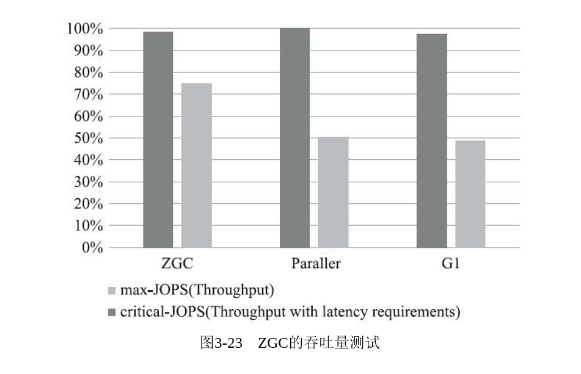

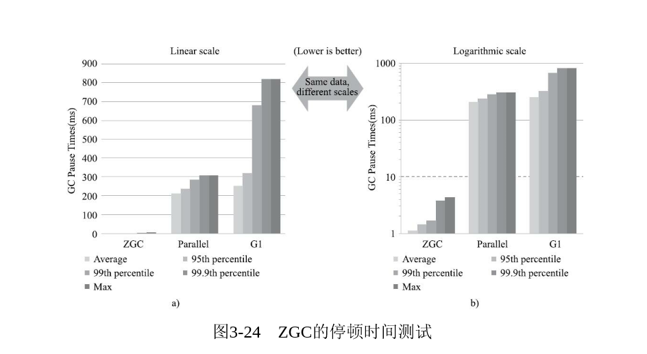

ZGC原本是Oracle作为一项商业特性（如同JFR、JMC这些功能）来设计和实现的，只不过在它横空出世的JDK 11时期，正好适逢Oracle 调整许可证授权，把所有商业特性都开源给了OpenJDK（详情见第1章 Java发展史），所以用户对其商业性并没有明显的感知。ZGC有着令所有开发人员趋之若鹜的优秀性能，让以前大多数人只是听说，但从未用过的“Azul式的垃圾收集器”一下子飞入寻常百姓家，笔者相信它完全成熟之后，将会成为服务端、大内存、低延迟应用的首选收集器的有力竞争者。

### 3.7　选择合适的垃圾收集器

HotSpot虚拟机提供了种类繁多的垃圾收集器，选择太多反而令人踌躇难决，若只挑最先进的显然不可能满足全部应用场景，但只用一 句“必须因地制宜，按需选用”又未免有敷衍的嫌疑，本节我们就来探讨一下如何选择合适的垃圾收集器。

#### Epsilon收集器

在G1、Shenandoah或者ZGC这些越来越复杂、越来越先进的垃圾收集器相继出现的同时，也有一个“反其道而行”的新垃圾收集器出现在 JDK 11的特征清单中——Epsilon，这是一款以不能够进行垃圾收集为“卖点”的垃圾收集器，这种话听起来第一感觉就十分违反逻辑，这种“不干活”的收集器要它何用？

Epsilon收集器由RedHat公司在JEP 318中提出，在此提案里Epsilon被形容成一个无操作的收集器（A No-Op Garbage Collector），而事实上只要Java虚拟机能够工作，垃圾收集器便不可能是真正“无操作”的。 原因是“垃圾收集器”这个名字并不能形容它全部的职责，更贴切的名字应该是本书为这一部分所取的标题——“自动内存管理子系统”。一个垃圾收集器除了垃圾收集这个本职工作之外，它还要负责堆的管理与布局、对象的分配、与解释器的协作、与编译器的协作、与监控子系统协作等职责，其中至少堆的管理和对象的分配这部分功能是Java虚拟机能够正常运作的必要支持，是一个最小化功能的垃圾收集器也必须实现的内容。从JDK 10开始，为了隔离垃圾收集器与Java虚拟机解释、编译、监控等子系统的关系，RedHat提出了垃圾收集器的统一接口，即JEP 304提案，Epsilon是这个接口的有效性验证和参考实现，同时也用于需要剥离垃圾收集器影响的性能测试和压力测试。

在实际生产环境中，不能进行垃圾收集的Epsilon也仍有用武之地。很长一段时间以来，Java技术体系的发展重心都在面向长时间、大规模的企业级应用和服务端应用，尽管也有移动平台（指Java ME而不是Android）和桌面平台的支持，但使用热度上与前者相比要逊色不少。 可是近年来大型系统从传统单体应用向微服务化、无服务化方向发展的趋势已越发明显，Java在这方面比起Golang等后起之秀来确实有一些先天不足，使用率正渐渐下降。传统Java有着内存占用较大，在容器中启动时间长，即时编译需要缓慢优化等特点，这对大型应用来说并不是什么太大的问题，但对短时间、小规模的服务形式就有诸多不适。为了应对新的技术潮流，最近几个版本的JDK逐渐加入了提前编译、面向应用的类数据共享等支持。Epsilon也是有着类似的目标，如果读者的应用只要运行数分钟甚至数秒，只要Java虚拟机能正确分配内存，在堆耗尽之前就会退出，那显然运行负载极小、没有任何回收行为的Epsilon便是很恰当的选择。

#### 收集器的权衡

如果算上Epsilon，本书中已经介绍过十款HotSpot虚拟机的垃圾收集器了，此外还涉及Azul System公司的PGC、C4等收集器，再加上本章中并没有出现，但其实也颇为常用的OpenJ9中的垃圾收集器，把这些收集器罗列出来就仿佛是一幅琳琅画卷、一部垃圾收集的技术演进史。现在可能有读者要犯选择困难症了，**我们应该如何选择一款适合自己应用的收集器呢？这个问题的答案主要受以下三个因素影响：**

- 应用程序的主要关注点是什么？如果是数据分析、科学计算类的任务，目标是能尽快算出结果，那吞吐量就是主要关注点；如果是SLA应用，那停顿时间直接影响服务质量，严重的甚至会导致事务超时，这样延迟就是主要关注点；而如果是客户端应用或者嵌入式应用，那垃圾收集的内存占用则是不可忽视的。
- 运行应用的基础设施如何？譬如硬件规格，要涉及的系统架构是x86-32/64、SPARC还是ARM/Aarch64；处理器的数量多少，分配内存的大小；选择的操作系统是Linux、Solaris还是Windows等。
- 使用JDK的发行商是什么？版本号是多少？是ZingJDK/Zulu、OracleJDK、Open-JDK、OpenJ9抑或是其他公司的发行版？该JDK对应了《Java虚拟机规范》的哪个版本？

一般来说，收集器的选择就从以上这几点出发来考虑。举个例子，假设某个直接面向用户提供服务的B/S系统准备选择垃圾收集器，一般来说延迟时间是这类应用的主要关注点，那么：

- 如果你有充足的预算但没有太多调优经验，那么一套带商业技术支持的专有硬件或者软件解决方案是不错的选择，Azul公司以前主推的Vega系统和现在主推的Zing VM是这方面的代表，这样你就可以使用传说中的C4收集器了。
- 如果你虽然没有足够预算去使用商业解决方案，但能够掌控软硬件型号，使用较新的版本，同时又特别注重延迟，那ZGC很值得尝试。
- 如果你对还处于实验状态的收集器的稳定性有所顾虑，或者应用必须运行在Windows操作系统下，那ZGC就无缘了，试试Shenandoah吧。
- 如果你接手的是遗留系统，软硬件基础设施和JDK版本都比较落后，那就根据内存规模衡量一下，对于大概4GB到6GB以下的堆内存，CMS一般能处理得比较好，而对于更大的堆内存，可重点考察一下G1。

当然，以上都是仅从理论出发的分析，实战中切不可纸上谈兵，根据系统实际情况去测试才是选择收集器的最终依据。

#### 虚拟机及垃圾收集器日志

阅读分析虚拟机和垃圾收集器的日志是处理Java虚拟机内存问题必备的基础技能，垃圾收集器日志是一系列人为设定的规则，多少有点随开发者编码时的心情而定，没有任何的“业界标准”可言，换句话说，每个收集器的日志格式都可能不一样。除此以外还有一个麻烦，在JDK 9 以前，HotSpot并没有提供统一的日志处理框架，虚拟机各个功能模块的日志开关分布在不同的参数上，日志级别、循环日志大小、输出格式、重定向等设置在不同功能上都要单独解决。直到JDK 9，这种混乱不堪的局面才终于消失，HotSpot所有功能的日志都收归到了“-Xlog”参数上，这个参数的能力也相应被极大拓展了：
```java
-Xlog[:[selector][:[output][:[decorators][:output-options]]]]
```

命令行中最关键的参数是选择器（Selector），它由标签（Tag）和日志级别（Level）共同组成。标签可理解为虚拟机中某个功能模块的名字，它告诉日志框架用户希望得到虚拟机哪些功能的日志输出。垃圾收集器的标签名称为“gc”，由此可见，垃圾收集器日志只是HotSpot众多功能日志的其中一项，全部支持的功能模块标签名如下所示：
```java
add，age，alloc，annotation，aot，arguments，attach，barrier，biasedlocking，blocks，bot，breakpoint，bytecode，census，class，classhisto，cleanup，compaction，comparator，constraints，constantpool，coops，cpu，cset，data，defaultmethods，dump，ergo，event，exceptions，exit，fingerprint，freelist，gc，hashtables，heap，humongous，ihop，iklass，init，itables，jfr，jni，jvmti，liveness，load，loader，logging，mark，marking，metadata，metaspace，method，mmu，modules，monitorinflation，monitormismatch，nmethod，normalize，objecttagging，obsolete，oopmap，os，pagesize，parser，patch，path，phases，plab，preorder，promotion，protectiondomain，purge，redefine，ref，refine，region，remset，resolve，safepoint，scavenge，scrub，setting，stackmap，stacktrace，stackwalk，start，startuptime，state，stats，stringdedup，stringtable，subclass，survivor，sweep，system，task，thread，time，timer，tlab，unload，update，verification，verify，vmoperation，vtables，workgang
```

日志级别从低到高，共有Trace，Debug，Info，Warning，Error，Off六种级别，日志级别决定了输出信息的详细程度，默认级别为Info，HotSpot的日志规则与Log4j、SLF4j这类Java日志框架大体上是一致的。 另外，还可以使用修饰器（Decorator）来要求每行日志输出都附加上额外的内容，支持附加在日志行上的信息包括：

- time：当前日期和时间。
- timemillis：当前时间的毫秒数，相当于System.currentTimeMillis() 的输出。
- timenanos：当前时间的纳秒数，相当于System.nanoTime()的输出。
- uptime：虚拟机启动到现在经过的时间，以秒为单位。
- uptimemillis：虚拟机启动到现在经过的毫秒数。
- uptimenanos：虚拟机启动到现在经过的纳秒数。
- pid：进程ID。
- tid：线程ID。
- level：日志级别。
- tags：日志输出的标签集。

如果不指定，默认值是uptime、level、tags这三个，此时日志输出 类似于以下形式：
```java
[3.080s][info][gc,cpu] GC(5) User=0.03s Sys=0.00s Real=0.01s
```

下面笔者举几个例子，展示在JDK 9统一日志框架前、后是如何获得垃圾收集器过程的相关信息，以下均以JDK 9的G1收集器（JDK 9下默认收集器就是G1，所以命令行中没有指定收集器）为例。

1）查看GC基本信息，在JDK 9之前使用-XX:+PrintGC，JDK 9后使用-Xlog:gc：
```java
bash-3.2$ java -Xlog:gc GCTest
[0.222s][info][gc] Using G1
[2.825s][info][gc] GC(0) Pause Young (G1 Evacuation Pause) 26M->5M(256M) 355.623ms
[3.096s][info][gc] GC(1) Pause Young (G1 Evacuation Pause) 14M->7M(256M) 50.030ms
[3.385s][info][gc] GC(2) Pause Young (G1 Evacuation Pause) 17M->10M(256M) 40.576ms
```
2）查看GC详细信息，在JDK 9之前使用-XX：+PrintGCDetails，在 JDK 9之后使用-Xlog:gc\*，用通配符\*将GC标签下所有细分过程都打 印出来，如果把日志级别调整到Debug或者Trace（基于版面篇幅考虑，例子中并没有），还将获得更多细节信息：
```java
bash-3.2$ java -Xlog:gc* GCTest 
[0.233s][info][gc,heap] Heap region size: 1M
[0.383s][info][gc ] Using G1 
[0.383s][info][gc,heap,coops] Heap address: 0xfffffffe50400000, size: 4064 MB, 
Compressed Oops mode: Non-zero based: 0xfffffffe50000000, 
Oop shift amount: 3
[3.064s][info][gc,start ] GC(0) Pause Young (G1 Evacuation Pause) gc,task ] GC(0) Using 23 workers of 23 for evacuation
[3.420s][info][gc,phases ] GC(0) Pre Evacuate Collection Set: 0.2ms
[3.421s][info][gc,phases ] GC(0) Evacuate Collection Set: 348.0ms gc,phases ] GC(0) Post Evacuate Collection Set: 6.2ms 
[3.421s][info][gc,phases ] GC(0) Other: 2.8ms gc,heap ] GC(0) Eden regions: 24->0(9) 
[3.421s][info][gc,heap ] GC(0) Survivor regions: 0->3(3) 
[3.421s][info][gc,heap ] GC(0) Old regions: 0->2 
[3.421s][info][gc,heap ] GC(0) Humongous regions: 2->1 
[3.421s][info][gc,metaspace ] GC(0) Metaspace: 4719K->4719K(1056768K) 
[3.421s][info][gc ] GC(0) Pause Young (G1 Evacuation Pause) 26M->5M(256M) 357.743ms [3.422s][info][gc,cpu ] GC(0) User=0.70s Sys=5.13s Real=0.36s
[3.648s][info][gc,start ] GC(1) Pause Young (G1 Evacuation Pause) 
[3.648s][info][gc,task ] GC(1) Using 23 workers of 23 for evacuation 
[3.699s][info][gc,phases ] GC(1) Pre Evacuate Collection Set: 0.3ms 
gc,phases ] GC(1) Evacuate Collection Set: 45.6ms
gc,phases ] GC(1) Post Evacuate Collection Set: 3.4ms 
gc,phases ] GC(1) Other: 1.7ms 
gc,heap ] GC(1) Eden regions: 9->0(10) 
[3.699s][info][gc,heap ] GC(1) Survivor regions: 3->2(2) 
[3.699s][info][gc,heap ] GC(1) Old regions: 2->5 
[3.700s][info][gc,heap ] GC(1) Humongous regions: 1->1 
[3.700s][info][gc,metaspace ] GC(1) Metaspace: 4726K->4726K(1056768K) 
[3.700s][info][gc ] GC(1) Pause Young (G1 Evacuation Pause) 14M->7M(256M) 51.872ms
[3.700s][info][gc,cpu ] GC(1) User=0.56s Sys=0.46s Real=0.05s
```

3）查看GC前后的堆、方法区可用容量变化，在JDK 9之前使用XX：+PrintHeapAtGC，JDK 9之后使用-Xlog:gc+heap=debug

4）查看GC过程中用户线程并发时间以及停顿的时间，在JDK 9之 前使用-XX:+PrintGCApplicationConcurrentTime以及-XX:+PrintGCApplicationStoppedTime，JDK 9之后使用-Xlog:safepoint

5）查看收集器Ergonomics机制（自动设置堆空间各分代区域大 小、收集目标等内容，从Parallel收集器开始支持）自动调节的相关信 息。在JDK 9之前使用-XX:+PrintAdaptive-SizePolicy，JDK 9之后使用Xlog:gc+ergo*=trace

6）查看熬过收集后剩余对象的年龄分布信息，在JDK 9前使用XX:+PrintTenuringDistribution，JDK 9之后使用-Xlog:gc+age=trace

囿于篇幅原因，不再一一列举，表3-3给出了全部在JDK 9中被废弃的日志相关参数及它们在JDK 9后使用-Xlog的代替配置形式。

|                    JDK9前日志参数                     |                        JDK9后日志参数                        |
| :---------------------------------------------------: | :----------------------------------------------------------: |
|                  G1PrintHeapRegions                   |                     Xlog:gc+region=trace                     |
|               G1PrintRegionLivenessInfo               |                    Xlog:gc+liveness=trace                    |
|                  G1SummarizeConcMark                  |                    Xlog:gc+marking=trace                     |
|                 G1SummarizeRSetStats                  |                    Xlog:gc+remset*=trace                     |
| GCLogFileSize,NumberOfGCLogFiles,UseGCLogFileRotation | Xlog:gc*file=<file>::filecount=<count>,filesize=<file size in kb> |
|                PrintAdaptiveSizePolicy                |                     Xlog:gc+ergo*=trace                      |
|            PrintClassHistogramAfterFullGC             |                    Xlog:classhisto*=trace                    |
|            PrintClassHistogramBeforeFullGC            |                    Xlog:classhisto*=trace                    |
|           PrintGCApplicationConcurrentTime            |                        Xlog:safepoint                        |
|             PrintGCApplicationStoppedTime             |                        Xlog:safepoint                        |
|                   PrintGCDateStamps                   |               使用time修饰，例如: Xlog:gc:time               |
|                 PrintGCTaskTimeStamps                 |                      Xlog:gc+task=trace                      |
|                   PrintGCTimeStamps                   |             使用uptime修饰，例如: Xlog:gc:uptime             |
|                     PrintHeapAtGC                     |                      Xlog:gc+heap=debug                      |
|                 PrintHeapAtGCExtended                 |                      Xlog:gc+heap=trace                      |
|                   PrintJNIGCStalls                    |                      Xlog:gc+jni=debug                       |
|                     PrintOldPLAB                      |                      Xlog:gc+plab=trace                      |
|              PrintParallelOldGCPhaseTime              |                     Xlog:gc+phases=trace                     |
|                       PrintPLAB                       |                      Xlog:gc+plab=trace                      |
|                 PrintPromotionFailure                 |                   Xlog:gc+promotion=debug                    |
|                   PrintReferenceGC                    |                      Xlog:gc+ref=debug                       |
|          PrintStringDeduplicationStatistics           |                     Xlog:gc+stringdedup                      |
|                    PrintTaskqueue                     |                   Xlog:gc+task+stats=trace                   |
|               PrintTenuringDistribution               |                      Xlog:gc+age=trace                       |
|                 PrintTerminationStats                 |                   Xlog:gc+task+stats=debug                   |
|                       PrintTLAB                       |                      Xlog:gc+tlab=trace                      |
|                TraceAdaptiveGCBoundary                |                     Xlog:heap+ergo=debug                     |
|                 TraceDynamicGCThreads                 |                      Xlog:gc+task=trace                      |
|           TraceMetadataHumongousAllocation            |                Xlog:gc+metaspace+alloc=debug                 |
|                 G1TraceConcRefinement                 |                     Xlog:gc+refine=debug                     |
|          G1TraceEagerReclaimHumongousObjects          |                   Xlog:gc+humongous=debug                    |
|           G1TraceStringSymbolTableScrubbing           |                  Xlog:gc+stringtable=trace                   |


#### 垃圾收集器参数总结

HotSpot虚拟机中的各种垃圾收集器到此全部介绍完毕，在描述过程中提到了很多虚拟机非稳定的运行参数，下面表3-4中整理了这些参数，供读者实践时参考。

|              参数              |                             描述                             |
| :----------------------------: | :----------------------------------------------------------: |
|          UseSerialGC           | 虚拟机运行在Client模式下的默认值，打开此开关后，使用Serial + Serial Old的收集器组合进行内存回收 |
|          UseParNewGC           | 打开此开关后，使用ParNew + Serial Old的收集器组合进行内存回收，在JDK9中已经不再支持 |
|       UseConcMarkSweepGC       | 打开此开关后，使用ParNew + CMS + Serial Old的收集器组合进行内存回收，其中Serial Old将会在CMS回收遇到“Concurrent Mode Failure”错误时的后备垃圾收集器使用 |
|       **UseParallelGC**        | **JDK9之前虚拟机运行在server模式下的默认值**，打开此开关后，使用Parallel Scavenge + Serial Old 的收集器组合进行内存回收 |
|        UseParallelOldGC        | 打开此开关后，使用Parallel Scavenge + Parallel Old 的收集器组合进行内存回收 |
|         SurvivorRatio          | 新生代中Eden区与Survivor区的容量比，默认为8，代表Eden : Survivor = 8:1 |
|     PretenureSizeThreshold     | 直接晋升到老年代的对象大小，设置此参数后，大于这个参数值的对象将直接在老年代分配 |
|      MaxTenuringThreshold      | 晋升到老年代的对象年龄，每个对象在坚持过MinorGC之后，年龄将会增加1，超过这个值时对象将会进入老年代 |
|     UseAdaptiveSizePolicy      |      动态调整Java堆中各个区域的大小以及进入老年代的年龄      |
|     HandlePromotionFailure     | 是否允许分配担保失败，即老年代的剩余空间不足以应付新生代的整个Eden区和Survivor区的所有对象都存活的极端情况 |
|       ParallelGCThreads        |               设置并行GC时进行内存回收的线程数               |
|          GCTimeRatio           | GC时间占总时间的比例，默认为99，即允许1%的GC时间，仅在使用Parallel Scavenge收集器时才会生效 |
|        MaxGCPauseMillis        | 设置GC的最大停顿时间，仅在使用Parallel Scavenge收集器时才会生效 |
| CMSInitiatingOccupancyFraction | 设置CMS收集器在老年代空间达到多少时触发垃圾回收，默认为68%，仅在使用CMS收集器时才会生效 |
| UseCMSCompactAtFullCollection  | 设置CMS收集器在完成垃圾回收之后是否要进行一次内存碎片整理，，仅在使用CMS收集器时才会生效，此参数从JDK9开始废弃 |
|          **UseG1GC**           |        使用G1收集器，**这是JDK9后server模式的默认值**        |
|        G1HeapRegionSize        |                 设置Region的大小，并非最终值                 |
|        MaxGCPauseMillis        |    设置G1收集过程的目标时间，默认值为200ms，不是硬性条件     |
|        G1NewSizePercent        |                     新生代最小值，默认5%                     |
|      G1MaxNewSizePercent       |                    新生代最大值，默认60%                     |
|         ConcGCThreads          | 并发标记、并发整理的执行线程数，对不同的收集器，有不同的含义 |
| InitiatingHeapOccupancyPercent |        设置触发标记周期的Java堆占用率阈值，默认45%，         |
|             UseZGC             | 使用ZGC收集器，目前仍要配合-XX:UnlockExperimentalVMOptions使用 |
|            UseNUMA             | 启用NUMA内存分配支持，目前只有Parallel和ZGC支持，以后G1收集器也可能支持该选项 |

### 3.8　实战：内存分配与回收策略

Java技术体系的自动内存管理，最根本的目标是自动化地解决两个问题：自动给对象分配内存以及自动回收分配给对象的内存。关于回收 内存这方面，笔者已经使用了大量篇幅去介绍虚拟机中的垃圾收集器体系以及运作原理，现在我们来探讨一下关于给对象分配内存的那些事儿。

对象的内存分配，从概念上讲，应该都是在堆上分配（而实际上也有可能经过即时编译后被拆散为标量类型并间接地在栈上分配）。在 经典分代的设计下，新生对象通常会分配在新生代中，少数情况下（例如对象大小超过一定阈值）也可能会直接分配在老年代。对象分配的规则并不是固定的，《Java虚拟机规范》并未规定新对象的创建和存储细 节，这取决于虚拟机当前使用的是哪一种垃圾收集器，以及虚拟机中与内存相关的参数的设定。

接下来的几小节内容，笔者将会讲解若干最基本的内存分配原则，并通过代码去验证这些原则。本节出现的代码如无特别说明，均使用 HotSpot虚拟机，以客户端模式运行。由于并未指定收集器组合，因此，本节验证的实际是使用Serial加Serial Old客户端默认收集器组合下的内存分配和回收的策略，这种配置和收集器组合也许是开发人员做研发时的默认组合（其实现在研发时很多也默认用服务端虚拟机了），但在生产环境中一般不会这样用，所以大家主要去学习的是分析方法，而列举的分配规则反而只是次要的。读者也不妨根据自己项目中使用的收集器编写一些程序去实践验证一下使用其他几种收集器的内存分配规则。

#### 对象优先在Eden分配

大多数情况下，对象在新生代Eden区中分配。当Eden区没有足够空间进行分配时，虚拟机将发起一次Minor GC。 

HotSpot虚拟机提供了-XX:+PrintGCDetails这个收集器日志参数， 告诉虚拟机在发生垃圾收集行为时打印内存回收日志，并且在进程退出 的时候输出当前的内存各区域分配情况。在实际的问题排查中，收集器日志常会打印到文件后通过工具进行分析，不过本节实验的日志并不多，直接阅读就能看得很清楚。

在代码清单3-7的testAllocation()方法中，尝试分配三个2MB大小和一个4MB大小的对象，在运行时通过-Xms20M、-Xmx20M、-Xmn10M这三个参数限制了Java堆大小为20MB，不可扩展，其中10MB分配给新生代，剩下的10MB分配给老年代。-XX:SurvivorRatio=8决定了新生代中Eden区与一个Survivor区的空间比例是8∶1，从输出的结果也清晰地看到“eden space 8192K、from space 1024K、to space 1024K”的信息， 新生代总可用空间为9216KB（Eden区+1个Survivor区的总容量）。

执行testAllocation()中分配allocation4对象的语句时会发生一次Minor GC，这次回收的结果是新生代6651KB变为148KB，而总内存占用量则几乎没有减少（因为allocation1、2、3三个对象都是存活的，虚拟机几乎没有找到可回收的对象）。产生这次垃圾收集的原因是为allocation4分配内存时，发现Eden已经被占用了6MB，剩余空间已不足以分配allocation4所需的4MB内存，因此发生Minor GC。垃圾收集期间虚拟机又发现已有的三个2MB大小的对象全部无法放入Survivor空间（Survivor空间只有1MB大小），所以只好通过分配担保机制提前转移到老年代去。

这次收集结束后，4MB的allocation4对象顺利分配在Eden中。因此 程序执行完的结果是Eden占用4MB（被allocation4占用），Survivor空闲，老年代被占用6MB（被allocation1、2、3占用）。通过GC日志可以证实这一点。

代码清单3-7　新生代Minor GC
```java
private static final int _1MB = 1024 * 1024;
/** 
 * VM参数：-verbose:gc -Xms20M -Xmx20M -Xmn10M -XX:+PrintGCDetails XX:SurvivorRatio=8 
 */
public static void testAllocation() {    
    byte[] allocation1, allocation2, allocation3, allocation4;    
    allocation1 = new byte[2 * _1MB];    
    allocation2 = new byte[2 * _1MB];    
    allocation3 = new byte[2 * _1MB];    
    allocation4 = new byte[4 * _1MB];  // 出现一次Minor GC 
}
```

运行结果：

```java
[GC [DefNew: 6651K->148K(9216K), 0.0070106 secs] 6651K->6292K(19456K), 0.0070426 secs] [Times: user=0.00 sys=0.00, real=0.00 secs] 
Heap    
    def new generation   total 9216K, used 4326K [0x029d0000, 0x033d0000, 0x033d0000)        
     	eden space 8192K,  51% used [0x029d0000, 0x02de4828, 0x031d0000)        
        from space 1024K,  14% used [0x032d0000, 0x032f5370, 0x033d0000)        
        to   space 1024K,   0% used [0x031d0000, 0x031d0000, 0x032d0000)    
        tenured generation   total 10240K, used 6144K [0x033d0000, 0x03dd0000, 0x03dd0000)            
        the space 10240K,  60% used [0x033d0000, 0x039d0030, 0x039d0200, 0x03dd0000)    
        compacting perm gen  total 12288K, used 2114K [0x03dd0000, 0x049d0000, 0x07dd0000)            
        the space 12288K,  17% used [0x03dd0000, 0x03fe0998, 0x03fe0a00, 0x049d0000) 
No shared spaces configured.
```

#### 大对象直接进入老年代

大对象就是指需要大量连续内存空间的Java对象，最典型的大对象便是那种很长的字符串，或者元素数量很庞大的数组，本节例子中的byte[]数组就是典型的大对象。大对象对虚拟机的内存分配来说就是一个不折不扣的坏消息，比遇到一个大对象更加坏的消息就是遇到一群“朝生夕灭”的“短命大对象”，我们写程序的时候应注意避免。在Java虚拟机中要避免大对象的原因是，在分配空间时，它容易导致内存明明还有不少空间时就提前触发垃圾收集，以获取足够的连续空间才能安置好它们，而当复制对象时，大对象就意味着高额的内存复制开销。HotSpot虚拟机提供了-XX:PretenureSizeThreshold参数，指定大于该设置值的对象直接在老年代分配，这样做的目的就是避免在Eden区及两个Survivor区之间来回复制，产生大量的内存复制操作。

执行代码清单3-8中的testPretenureSizeThreshold()方法后，我们看到Eden空间几乎没有被使用，而老年代的10MB空间被使用了40%，也就是4MB的allocation对象直接就分配在老年代中，这是因为-XX:PretenureSizeThreshold被设置为3MB（就是3145728，这个参数单位是kb），因此超过3MB的对象都会直接在老年代进行分配。
```java
private static final int _1MB = 1024 * 1024;
/** 
 * VM参数：-verbose:gc -Xms20M -Xmx20M -Xmn10M -XX:+PrintGCDetails XX:SurvivorRatio=8 
 * -XX:PretenureSizeThreshold=3145728 
 */ 
public static void testPretenureSizeThreshold() {    
    byte[] allocation;    allocation = new byte[4 * _1MB];  //直接分配在老年代中
}
```

运行结果：

```java
Heap    
    def new generation   total 9216K, used 671K [0x029d0000, 0x033d0000, 0x033d0000)        
    eden space 8192K,   8% used [0x029d0000, 0x02a77e98, 0x031d0000)        
    from space 1024K,   0% used [0x031d0000, 0x031d0000, 0x032d0000)        
    to   space 1024K,   0% used [0x032d0000, 0x032d0000, 0x033d0000)    
    tenured generation   total 10240K, used 4096K [0x033d0000, 0x03dd0000, 0x03dd0000)            
    the space 10240K,  40% used [0x033d0000, 0x037d0010, 0x037d0200, 0x03dd0000)    
    compacting perm gen  total 12288K, used 2107K [0x03dd0000, 0x049d0000, 0x07dd0000)            
    the space 12288K,  17% used [0x03dd0000, 0x03fdefd0, 0x03fdf000, 0x049d0000) 
No shared spaces configured.
```

#### 长期存活的对象将进入老年代

HotSpot虚拟机中多数收集器都采用了分代收集来管理堆内存，那内存回收时就必须能决策哪些存活对象应当放在新生代，哪些存活对象放在老年代中。为做到这点，虚拟机给每个对象定义了一个对象年龄（Age）计数器，存储在对象头中（详见第2章）。对象通常在Eden区里诞生，如果经过第一次Minor GC后仍然存活，并且能被Survivor容纳的话，该对象会被移动到Survivor空间中，并且将其对象年龄设为1岁。 对象在Survivor区中每熬过一次Minor GC，年龄就增加1岁，当它的年龄增加到一定程度（默认为15），就会被晋升到老年代中。对象晋升老年代的年龄阈值，可以通过参数-XX:MaxTenuringThreshold设置。

#### 动态对象年龄判定

为了能更好地适应不同程序的内存状况，HotSpot虚拟机并不是永远要求对象的年龄必须达到-XX:MaxTenuringThreshold才能晋升老年代，如果在Survivor空间中相同年龄所有对象大小的总和大于Survivor空间的一半，年龄大于或等于该年龄的对象就可以直接进入老年代，无须等到-XX:MaxTenuringThreshold中要求的年龄。

#### 空间分配担保

在发生Minor GC之前，虚拟机必须先检查老年代最大可用的连续空间是否大于新生代所有对象总空间，如果这个条件成立，那这一次Minor GC可以确保是安全的。如果不成立，则虚拟机会先查看-XX:HandlePromotionFailure参数的设置值是否允许担保失败（Handle Promotion Failure）；如果允许，那会继续检查老年代最大可用的连续空间是否大于历次晋升到老年代对象的平均大小，如果大于，将尝试进行一次Minor GC，尽管这次Minor GC是有风险的；如果小于，或者XX:HandlePromotionFailure设置不允许冒险，那这时就要改为进行一次Full GC。

解释一下“冒险”是冒了什么风险：前面提到过，新生代使用复制收集算法，但为了内存利用率，只使用其中一个Survivor空间来作为轮换备份，因此当出现大量对象在Minor GC后仍然存活的情况——最极端的情况就是内存回收后新生代中所有对象都存活，需要老年代进行分配担保，把Survivor无法容纳的对象直接送入老年代，这与生活中贷款担保类似。老年代要进行这样的担保，前提是老年代本身还有容纳这些对象的剩余空间，但一共有多少对象会在这次回收中活下来在实际完成内存回收之前是无法明确知道的，所以只能取之前每一次回收晋升到老年代对象容量的平均大小作为经验值，与老年代的剩余空间进行比较，决定是否进行Full GC来让老年代腾出更多空间。

取历史平均值来比较其实仍然是一种赌概率的解决办法，也就是说假如某次Minor GC存活后的对象突增，远远高于历史平均值的话，依然会导致担保失败。如果出现了担保失败，那就只好老老实实地重新发起一次Full GC，这样停顿时间就很长了。虽然担保失败时绕的圈子是最大的，但通常情况下都还是会将-XX:HandlePromotionFailure开关打开，避免Full GC过于频繁。

在JDK 6 Update 24之后，这个测试结果就有了差异，-XX: HandlePromotionFailure参数不会再影响到虚拟机的空间分配担保策略， 观察OpenJDK中的源码变化，虽然源码中还定义了XX:HandlePromotionFailure参数，但是在实际虚拟机中已经不会再使 用它。JDK 6 Update 24之后的规则变为只要老年代的连续空间大于新生代对象总大小或者历次晋升的平均大小，就会进行Minor GC，否则将进行Full GC。

### 3.9　本章小结

本章介绍了垃圾收集的算法、若干款HotSpot虚拟机中提供的垃圾收集器的特点以及运作原理。通过代码实例验证了Java虚拟机中自动内存分配及回收的主要规则。

垃圾收集器在许多场景中都是影响系统停顿时间和吞吐能力的重要因素之一，虚拟机之所以提供多种不同的收集器以及大量的调节参数，就是因为只有根据实际应用需求、实现方式选择最优的收集方式才能获取最好的性能。没有固定收集器、参数组合，没有最优的调优方法，虚拟机也就没有什么必然的内存回收行为。因此学习虚拟机内存知识，如果要到实践调优阶段，必须了解每个具体收集器的行为、优势劣势、调节参数。在接下来的两章中，作者将会介绍内存分析的工具和一些具体调优的案例。

现在我们回过头来对比一下本章介绍的各种垃圾收集：

注：并行-指的是垃圾收集器本身内部是否是多线程并发收集，并发-指的是垃圾收集线程和用户线程是否能并发运行。

|      GC名称       | 线程模型 | 并行 | 并发 | 适用分代 |       GC算法       | Stop The Wolrd | 起源JDK版本 | 关注点 | 摘要                                                         |
| :---------------: | :------: | :--: | :--: | :------: | :----------------: | :------------: | :---------: | :----: | :----------------------------------------------------------- |
|      Serial       |  单线程  |  否  |  否  |  新生代  |    标记复制算法    |     完全会     |  最为古老   |   -    | 使用JVM参数-XX:+UseSerialGC启用，新生代和老年代将分别使用Serial和Serial Old收集器组合。HotSpot虚拟机Client模式下的默认新生代收集器，适合在处理器核数很少(例如单核或双核)或者一些桌面应用程序的中使用。 |
|      ParNew       |  多线程  |  是  |  否  |  新生代  |    标记复制算法    |     完全会     |   JDK1.3    |  延迟  | 使用JVM参数-XX:+UseParNewGC启用，新生代和老年代将分别使用ParNew和Serial Old收集器组合。如果启用CMS收集器-XX:+UseConcMarkSweepGC那么新生代将默认启用ParNew收集器。ParNew是JDK7之前许多运行在Server模式下的虚拟机中首选的新生代收集器。JDK9开始取消ParNew+Serial Old组合，即取消了-XX:UseParNewGC参数，此时ParNew只能与CMS搭配使用，启用CMS收集器将默认启用ParNew。 |
| Parallel Scavenge |  多线程  |  是  |  否  |  新生代  |    标记复制算法    |     完全会     |   JDK1.4    | 吞吐量 | 使用JVM参数-XX:+UseParallelGC启用，新生代和老年代将分别使用Parallel Scavenge和Parallel Old收集器组合。该组合是JDK7~JDK8的默认首选GC收集器。它以吞吐量可控闻名，也称之为“吞吐量优先收集器”。 |
|    Serial Old     |  单线程  |  否  |  否  |  老年代  |    标记整理算法    |     完全会     |  最为古老   |   -    | 是启用Serial收集器(-XX:UseSerialGC)后老年代的默认收集器，可配合Parallel Scavenge和ParNew组合使用，其中JDK9开始取消ParNew+Serial Old组合。适合在处理器核数很少(例如单核或双核)或者一些桌面应用程序的中使用。 |
|   Parallel Old    |  多线程  |  是  |  否  |  老年代  |    标记整理算法    |     完全会     |    JDK6     |  延迟  | 是启用Parallel Scavenge收集器(-XX:UseParallelGC)后老年代的默认收集器，且只能与Parallel Scavenge收集器组合使用。 |
|        CMS        |  多线程  |  是  |  是  |  老年代  |    标记清除算法    |     部分会     |    JDK5     |  延迟  | 使用JVM参数-XX:+UseConcMarkSweepGC启用，作为老年代的一款优秀收集器它配合ParNew和Serial收集器组合工作，其中JDK9开始取消了CMS+Serial的组合。由于“Concurrent Mode Failure”将会触发Full GC，或者标记清除算法将会产生内存碎片等原因，将会导致更长停顿时间。到JDK9开始被标记为不推荐的垃圾收集器而被G1取代。 |
|        G1         |  多线程  |  是  |  是  |   全代   | 标记复制和整理算法 |     部分会     |    JDK7     |  延迟  | 使用JVM参数-XX:+UseG1GC启用，新生代和老年代都将使用G1收集器。自JDK9开始，G1宣告取代Parallel Scavenge + Parallel Old的默认组合，成为server模式下的默认垃圾收集器。G1跳出传统分代的樊笼，该用Region堆内存布局实现基于"停顿时间模型"的垃圾收集器，实现了在一段JVM运行时间段内因垃圾回收导致的停顿时间可控(通过-XX:MaxGCPauseMillis设置，默认200毫秒)，使得G1收集器能通过可控的停顿时间能达到吞吐量与延迟之间的最佳平衡。G1收集器本身工作时会占用不少的堆内存，在小内存情况下表现的不会比CMS好。 |
|    Shenandoah     |  多线程  |  是  |  是  |   全代   | 标记复制和整理算法 |     部分会     |  OpenJDK12  |  延迟  | Shenandoah是一款只有OpenJDK12开始才有的收集器，是一款对G1收集器设计思想做了继承及改进的低延迟垃圾收集器，完全废弃了分代收集理论，即Region不分新生代和老年代等。做到了回收整理阶段也可以与用户线程并发执行。优点：低延迟；缺点：高运行负担使得吞吐量下降；使用大量的读写屏障，尤其是读屏障，增大了系统的性能开销； |
|        ZGC        |  多线程  |  是  |  是  |   全代   |    标记整理算法    |    少部分会    |    JDK11    |  延迟  | 使用JVM参数-XX:+UseZGCGC启用。ZGC收集器是一款基于动态大小Region内存布局的，（暂时）不设分代的，使用了读屏障、染色指针和内存多重映射等技术来实现可并发的标记-整理算法的，以低延迟为首要目标的一款垃圾收集器。从目前官方的测试数据看ZGC，结果是令人震惊的革命性的：延迟与其他GC收集器存在数量级上的差距，绝对能控制在几毫秒以内，同时吞吐量也不必其他GC收集器逊色。由于ZGC是面向低延迟、大内存的，延迟低的同时是整个回收过程的漫长，在这漫长的回收过程中会又会并发的产生大量的浮动垃圾，最终会造成回收速度跟不上分配速度。 |

## 第4章　虚拟机性能监控、故障处理工具

Java与C++之间有一堵由内存动态分配和垃圾收集技术所围成的高墙，墙外面的人想进去，墙里面的人却想出来。

### 4.1　概述

经过前面两章对于虚拟机内存分配与回收技术各方面的介绍，相信读者已经建立了一个比较系统、完整的理论基础。理论总是作为指导实 践的工具，把这些知识应用到实际工作中才是我们的最终目的。接下来的两章，我们将从实践的角度去认识虚拟机内存管理的世界。

给一个系统定位问题的时候，知识、经验是关键基础，数据是依据，工具是运用知识处理数据的手段。这里说的数据包括但不限于异常堆栈、虚拟机运行日志、垃圾收集器日志、线程快照 （threaddump/javacore文件）、堆转储快照（heapdump/hprof文件）等。恰当地使用虚拟机故障处理、分析的工具可以提升我们分析数据、定位并解决问题的效率，但我们在学习工具前，也应当意识到工具永远都是 知识技能的一层包装，没有什么工具是“秘密武器”，拥有了就能“包治百病”。

### 4.2　基础故障处理工具

Java开发人员肯定都知道JDK的bin目录中有java.exe、javac.exe这两个命令行工具，但并非所有程序员都了解过JDK的bin目录下其他各种小工具的作用。随着JDK版本的更迭，这些小工具的数量和功能也在不知不觉地增加与增强。除了编译和运行Java程序外，打包、部署、签名、调试、监控、运维等各种场景都可能会用到它们，这些工具如图4-1所 示。

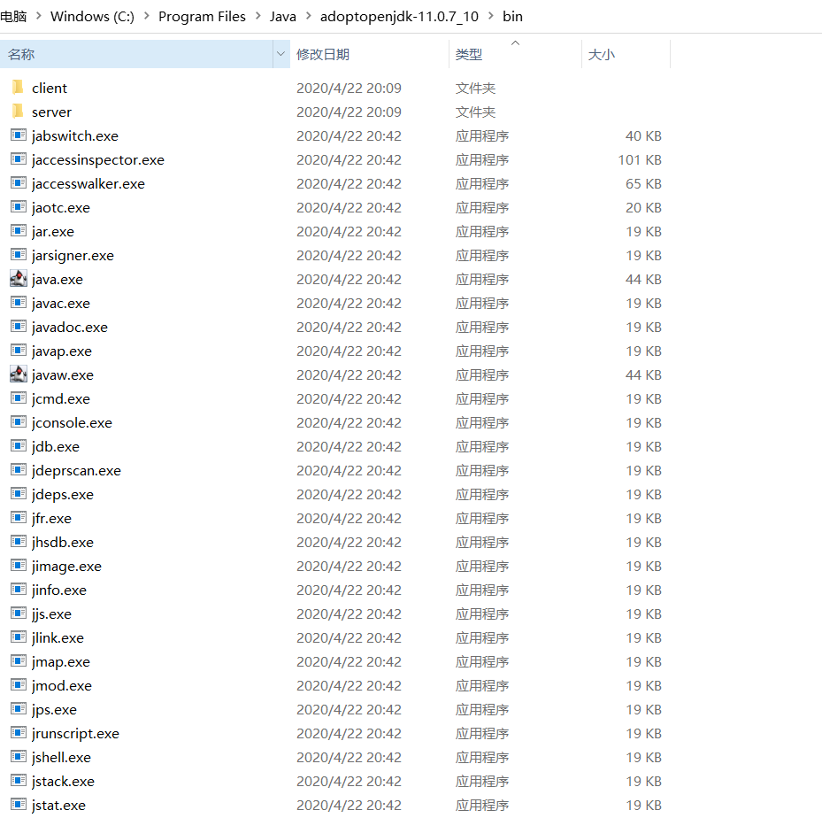

在本章，笔者将介绍这些工具中的一部分，主要是用于监视虚拟机运行状态和进行故障处理的工具。这些故障处理工具并不单纯是被Oracle公司作为“礼物”附赠给JDK的使用者，根据软件可用性和授权的不同，可以把它们划分成三类：

- 商业授权工具：主要是JMC（Java Mission Control）及它要使用到的JFR（Java Flight Recorder），JMC这个原本来自于JRockit的运维监控套件从JDK 7 Update 40开始就被集成到OracleJDK中，JDK 11之前都无须独立下载，但是在商业环境中使用它则是要付费的。

- 正式支持工具：这一类工具属于被长期支持的工具，不同平台、不同版本的JDK之间，这类工具可能会略有差异，但是不会出现某一个工具突然消失的情况。

- 实验性工具：这一类工具在它们的使用说明中被声明为“没有技术支持，并且是实验性质的”（Unsupported and Experimental）产品，日后可能会转正，也可能会在某个JDK版本中无声无息地消失。但事实上它们通常都非常稳定而且功能强大，也能在处理应用程序性能问题、定位故障时发挥很大的作用。

读者如果比较细心的话，还可能会注意到这些工具程序大多数体积都异常小。假如之前没注意到，现在不妨再看看图4-1中的最后一列“大小”，各个工具的体积基本上都稳定在21KB左右。并非JDK开发团队刻意把它们制作得如此精炼、统一，而是因为这些命令行工具大多仅是一层薄包装而已，真正的功能代码是实现在JDK的工具类库中的，读者把图4-1和图4-2两张图片对比一下就可以看得很清楚。假如读者使用的是Linux版本的JDK，还可以发现这些工具中不少是由Shell脚本直接写成，可以用文本编辑器打开并编辑修改它们。

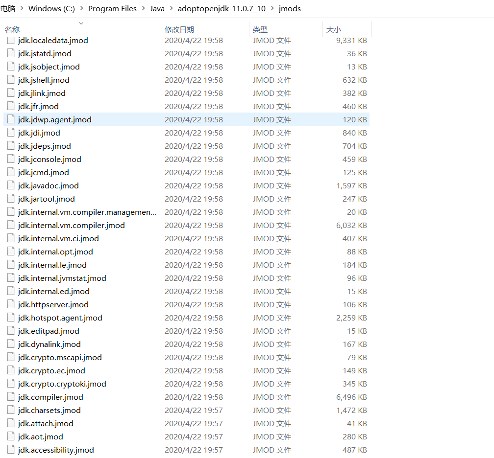

JDK开发团队选择采用Java语言本身来实现这些故障处理工具是有特别用意的：当应用程序部署到生产环境后，无论是人工物理接触到服 务器还是远程Telnet到服务器上都可能会受到限制。借助这些工具类库里面的接口和实现代码，开发者可以选择直接在应用程序中提供功能强大的监控分析功能。

本章所讲解的工具大多基于Windows平台下的JDK进行演示，如果读者选用的JDK版本、操作系统不同，那么工具不仅可能数量上有所差别，同一个工具所支持的功能范围和效果都可能会不一样。本章提及的工具，如无特别说明，是JDK5中就已经存在的，但为了避免运行环境带来的差异和兼容性问题，建议读者使用更高版本的JDK来验证本章介绍的内容。通常高版本JDK的工具有可能向下兼容运行于低版本JDK的虚拟机上的程序，反之则一般不行。

**注意**：如果读者在工作中需要监控运行于JDK 5的虚拟机之上的程序，在程序启动时请添加参数“-Dcom.sun.management.jmxremote”开 启JMX管理功能，否则由于大部分工具都是基于或者要用到JMX（包括下一节的可视化工具），它们都将无法使用，如果被监控程序运行于 JDK 6或以上版本的虚拟机之上，那JMX管理默认是开启的，虚拟机启动时无须再添加任何参数。

#### jps：虚拟机进程状况工具

JDK的很多小工具的名字都参考了UNIX命令的命名方式， jps（JVM Process Status Tool）是其中的典型。除了名字像UNIX的ps命令之外，它的功能也和ps命令类似：可以列出正在运行的虚拟机进程，并显示虚拟机执行主类（Main Class，main()函数所在的类）名称以及这些进程的本地虚拟机唯一ID（LVMID，Local Virtual Machine Identifier）。虽然功能比较单一，但它绝对是使用频率最高的JDK命令行工具，因为其他的JDK工具大多需要输入它查询到的LVMID来确定要监控的是哪一个虚拟机进程。**对于本地虚拟机进程来说，LVMID与操 作系统的进程ID（PID，Process Identifier）是一致的**，使用Windows的任务管理器或者UNIX的ps命令也可以查询到虚拟机进程的LVMID，但如果同时启动了多个虚拟机进程，无法根据进程名称定位时，那就必须依赖jps命令显示主类的功能才能区分了。

jps命令格式：

```shell
usage: jps [-help]
       jps [-q] [-mlvV] [<hostid>]

Definitions:
    <hostid>:      <hostname>[:<port>]
```

**其中如果指定hostid(hostname:port)则是通过RMI来查看远程机器上的JVM状态信息。**

示例：

1、列出主类信息

```shell
C:\Users\Pengle>jps -l
10436 com.penglecode.xmodule.master4j.jvm.examples.boot.JvmExampleApplication
8888 sun.tools.jps.Jps
16396
```

2、列出JVM启动参数

```shell
C:\Users\Pengle>jps -v
10436 JvmExampleApplication -agentlib:jdwp=transport=dt_socket,suspend=y,address=localhost:55841 -XX:+PrintCommandLineFlags -Xmx1024m -Xms1024m -Xmn512m -javaagent:C:\workbench\Program Files\eclipse-202003\configuration\org.eclipse.osgi\411\0\.cp\lib\javaagent-shaded.jar -Dfile.encoding=UTF-8

4120 Jps -Denv.class.path=.;C:\Program Files\Java\jdk1.8.0_241\lib\dt.jar;C:\Program Files\Java\jdk1.8.0_241\lib\tools.jar; -Dapplication.home=C:\Program Files\Java\jdk1.8.0_241 -Xms8m

16396  -Dosgi.requiredJavaVersion=1.8 -Dosgi.instance.area.default=@user.home/eclipse-workspace -XX:+UseG1GC -XX:+UseStringDeduplication -Dosgi.requiredJavaVersion=1.8 -Dosgi.dataAreaRequiresExplicitInit=true -Xms256m -Xmx2048m -Dosgi.requiredJavaVersion=1.8 -Dosgi.instance.area.default=@user.home/eclipse-workspace -XX:+UseG1GC -XX:+UseStringDeduplication -Dosgi.requiredJavaVersion=1.8 -Dosgi.dataAreaRequiresExplicitInit=true -Xms256m -Xmx2048m
```

jps还可以通过RMI协议查询开启了RMI服务的远程虚拟机进程状态，参数hostid为RMI注册表中注册的主机名。jps的其他常用选项见表4-1。

| 选项 | 作用                                             |
| :--: | :----------------------------------------------- |
|  -q  | 只输出LVMID，省略主类的名称                      |
|  -m  | 输出虚拟机进程启动时传递给主类main()方法的参数   |
|  -l  | 输出主类名称，如果是以jar包启动则输出jar包的路径 |
|  -v  | 输出虚拟机进程启动时的JVM参数                    |

#### jstat：虚拟机统计信息监视工具

jstat（JVM Statistics Monitoring Tool）是用于监视虚拟机各种运行状态信息的命令行工具。它可以显示本地或者远程虚拟机进程中的类加载、内存、垃圾收集、即时编译等运行时数据，在没有GUI图形界面、只提供了纯文本控制台环境的服务器上，它将是运行期定位虚拟机性能问题的常用工具。

jstat命令格式为：

```shell
Usage: jstat -help|-options
       jstat -<option> [-t] [-h<lines>] <vmid> [<interval> [<count>]]

Definitions:
  <option>      An option reported by the -options option
  <vmid>        Virtual Machine Identifier. A vmid takes the following form:
                     <lvmid>[@<hostname>[:<port>]]
                Where <lvmid> is the local vm identifier for the target
                Java virtual machine, typically a process id; <hostname> is
                the name of the host running the target Java virtual machine;
                and <port> is the port number for the rmiregistry on the
                target host. See the jvmstat documentation for a more complete
                description of the Virtual Machine Identifier.
  <lines>       Number of samples between header lines.
  <interval>    Sampling interval. The following forms are allowed:
                    <n>["ms"|"s"]
                Where <n> is an integer and the suffix specifies the units as
                milliseconds("ms") or seconds("s"). The default units are "ms".
  <count>       Number of samples to take before terminating.
  -J<flag>      Pass <flag> directly to the runtime system.
```

对于命令格式中的VMID与LVMID需要特别说明一下：如果是本地虚拟机进程，VMID与LVMID是一致的；如果是远程虚拟机进程，那 VMID的格式应当是：

```shell
[protocol:][//]lvmid[@hostname[:port]/servername]
```

参数interval和count代表查询间隔和次数，如果省略这2个参数，说 明只查询一次。假设需要每250毫秒查询一次进程2764垃圾收集状况， 一共查询20次，那命令应当是：

```shell
jstat -gc 2764 250 20
```

选项option代表用户希望查询的虚拟机信息，主要分为三类：类加载、垃圾收集、运行期编译状况。详细请参考表4-2中的描述。

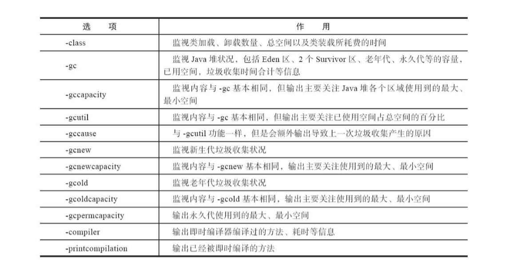 

jstat监视选项众多，囿于版面原因无法逐一演示，这里举一个在命令行下启动一个SpringBoot服务的GC状况的例子，用以演示如何查看监视结果。监视参数与输出结果如代码清单4-1所示

下面示例演示了通过jstat对应用的GC状况进行采样(每5000毫秒采样一次，共采样5次)

(注：使用OracleJDK8运行，启动时附加JVM参数为：-XX:+PrintCommandLineFlags -Xmx1024m -Xms1024m -Xmn512m)
由于在HotSpot VM里，JDK8默认使用并行系的收集器（UseParallelGC / UseParallelOldGC）默认开启-XX:+UseAdaptiveSizePolicy，这个配置会在每次Minor GC之后对From和To区进行自适应分配大小，而SurvivorRatio使用默认值8将会失效。所以下面的EC / S0C = 6而非8
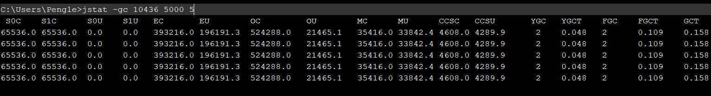

S0C：Survivor0的大小 
S1C：Survivor1的大小
S0U：Survivor0的使用大小
S1U：Survivor1的使用大小
EC：Eden区的大小
EU：Eden区的使用大小
OC：老年代大小
OU：老年代使用大小
MC：元数据区大小
MU：元数据区使用大小
CCSC：压缩类空间大小
CCSU：压缩类空间使用大小
YGC：年轻代垃圾回收次数
YGCT：年轻代垃圾回收消耗时间
FGC：老年代垃圾回收次数
FGCT：老年代垃圾回收消耗时间
GCT：垃圾回收消耗总时间

通过gcutil选项监控已使用空间占比的示例：

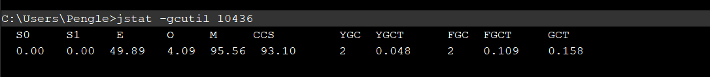

S0：Survivor0当前使用比例
S1：Survivor1当前使用比例
E：Eden区使用比例
O：老年代使用比例
M：元数据区使用比例
CCS：压缩使用比例
YGC：年轻代垃圾回收次数
FGC：老年代垃圾回收次数
FGCT：老年代垃圾回收消耗时间
GCT：垃圾回收消耗总时间

通过gccause选项查看上一次GC的原因示例：

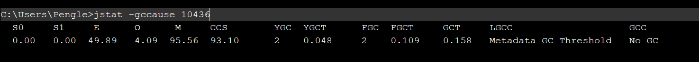

LGCC：上一次GC的原因，是G1垃圾回收器回收
GCC ：当前GC的原因

更多选项示例请参考：https://www.cnblogs.com/parryyang/p/5772484.html

#### jinfo：Java配置信息工具

**jinfo（Configuration Info for Java）的作用是实时查看和调整虚拟机各项参数。使用jps命令的-v参数可以查看虚拟机启动时显式指定的参数列表，但如果想知道未被显式指定的参数的系统默认值，除了去找资料外，就只能使用jinfo的-flag选项进行查询了（如果只限于JDK 6或以上版本的话，使用java-XX:+PrintFlagsFinal查看参数默认值也是一个很好的选择）**。jinfo还可以使用-sysprops选项把虚拟机进程的 System.getProperties()的内容打印出来。这个命令在JDK 5时期已经随着 Linux版的JDK发布，当时只提供了信息查询的功能，JDK 6之后，jinfo 在Windows和Linux平台都有提供，并且加入了在运行期修改部分参数值的能力（可以使用-flag[+|-]name或者-flag name=value在运行期修改一部分运行期可写的虚拟机参数值）。在JDK 6中，jinfo对于Windows平台功能仍然有较大限制，只提供了最基本的-flag选项。

jinfo命令格式：

```shell
C:\Users\Pengle>jinfo -help
Usage:
    jinfo [option] <pid>
        (to connect to running process)
    jinfo [option] <executable <core>
        (to connect to a core file)
    jinfo [option] [server_id@]<remote server IP or hostname>
        (to connect to remote debug server)

where <option> is one of:
    -flag <name>         to print the value of the named VM flag
    -flag [+|-]<name>    to enable or disable the named VM flag
    -flag <name>=<value> to set the named VM flag to the given value
    -flags               to print VM flags
    -sysprops            to print Java system properties
    <no option>          to print both of the above
    -h | -help           to print this help message
```

查看当前显示指定的VM参数及CommandLine参数：

```shell
C:\Users\Pengle>jinfo -flags 16732
Attaching to process ID 16732, please wait...
Debugger attached successfully.
Server compiler detected.
JVM version is 25.241-b07

Non-default VM flags: -XX:CICompilerCount=4 -XX:InitialHeapSize=1073741824 -XX:MaxHeapSize=1073741824 -XX:MaxNewSize=536870912 -XX:MinHeapDeltaBytes=524288 -XX:NewSize=536870912 -XX:OldSize=536870912 -XX:+PrintCommandLineFlags -XX:+UseCompressedClassPointers -XX:+UseCompressedOops -XX:+UseFastUnorderedTimeStamps -XX:-UseLargePagesIndividualAllocation -XX:+UseParallelGC

Command line:  -agentlib:jdwp=transport=dt_socket,suspend=y,address=localhost:61009 -XX:+PrintCommandLineFlags -Xmx1024m -Xms1024m -Xmn512m -javaagent:C:\workbench\Program Files\eclipse-202003\configuration\org.eclipse.osgi\411\0\.cp\lib\javaagent-shaded.jar -Dfile.encoding=UTF-8
```

查看系统属性：

```shell
C:\Users\Pengle>jinfo -sysprops 16732
Attaching to process ID 16732, please wait...
Debugger attached successfully.
Server compiler detected.
JVM version is 25.241-b07
java.runtime.name = Java(TM) SE Runtime Environment
java.vm.version = 25.241-b07
sun.boot.library.path = C:\Program Files\Java\jdk1.8.0_241\jre\bin
nacos.logging.default.config.enabled = false
java.vendor.url = http://java.oracle.com/
java.vm.vendor = Oracle Corporation
path.separator = ;
file.encoding.pkg = sun.io
java.vm.name = Java HotSpot(TM) 64-Bit Server VM
sun.os.patch.level =
sun.java.launcher = SUN_STANDARD
user.script =
user.country = CN
user.dir = C:\workbench\GIT\xmodule\xmodule-master4j-jvm
java.vm.specification.name = Java Virtual Machine Specification
```

查看某个特定VM参数：

```shell
C:\Users\Pengle>jinfo -flag UseAdaptiveSizePolicy 16732
-XX:+UseAdaptiveSizePolicy

C:\Users\Pengle>jinfo -flag SurvivorRatio 16732
-XX:SurvivorRatio=8
```

#### jmap：Java内存映像工具

jmap（Memory Map for Java）命令用于生成堆转储快照（一般称为 heapdump或dump文件）。如果不使用jmap命令，要想获取Java堆转储 快照也还有一些比较“暴力”的手段：譬如在第2章中用过的-XX:+HeapDumpOnOutOfMemoryError参数，可以让虚拟机在内存溢出异常出现之后自动生成堆转储快照文件，通过-XX:+HeapDumpOnCtrlBreak参数则可以使用[Ctrl]+[Break]键让虚拟机生成堆转储快照文件，又或者在Linux系统下通过Kill-3命令发送进程退出信号“恐吓”一下虚拟机，也能顺利拿到堆转储快照。

**jmap的作用并不仅仅是为了获取堆转储快照，它还可以查询finalize执行队列、Java堆和方法区的详细信息，如空间使用率、当前用的是哪种收集器等。**

和jinfo命令一样，jmap有部分功能在Windows平台下是受限的，除了生成堆转储快照的-dump选项和用于查看每个类的实例、空间占用统计的-histo选项在所有操作系统中都可以使用之外，其余选项都只能在Linux/Solaris中使用。

jmap命令格式：

```shell
C:\Users\Pengle>jmap -help
Usage:
    jmap [option] <pid>
        (to connect to running process)
    jmap [option] <executable <core>
        (to connect to a core file)
    jmap [option] [server_id@]<remote server IP or hostname>
        (to connect to remote debug server)

where <option> is one of:
    <none>               to print same info as Solaris pmap
    -heap                to print java heap summary
    -histo[:live]        to print histogram of java object heap; if the "live"
                         suboption is specified, only count live objects
    -clstats             to print class loader statistics
    -finalizerinfo       to print information on objects awaiting finalization
    -dump:<dump-options> to dump java heap in hprof binary format
                         dump-options:
                           live         dump only live objects; if not specified,
                                        all objects in the heap are dumped.
                           format=b     binary format
                           file=<file>  dump heap to <file>
                         Example: jmap -dump:live,format=b,file=heap.bin <pid>
    -F                   force. Use with -dump:<dump-options> <pid> or -histo
                         to force a heap dump or histogram when <pid> does not
                         respond. The "live" suboption is not supported
                         in this mode.
    -h | -help           to print this help message
    -J<flag>             to pass <flag> directly to the runtime system
```

option选项的合法值与具体含义如下表所示。 

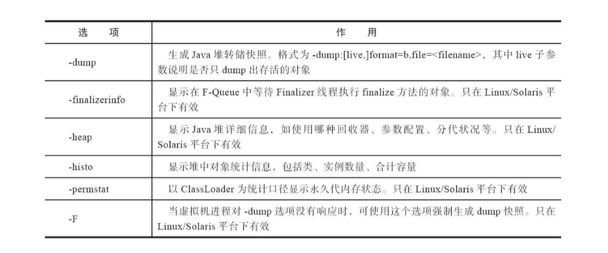

通过jmap查看堆详细信息：

```shell
C:\Users\Pengle>jmap -heap 16732
Attaching to process ID 16732, please wait...
Debugger attached successfully.
Server compiler detected.
JVM version is 25.241-b07

using thread-local object allocation.
Parallel GC with 8 thread(s)

Heap Configuration:
   MinHeapFreeRatio         = 0
   MaxHeapFreeRatio         = 100
   MaxHeapSize              = 1073741824 (1024.0MB)
   NewSize                  = 536870912 (512.0MB)
   MaxNewSize               = 536870912 (512.0MB)
   OldSize                  = 536870912 (512.0MB)
   NewRatio                 = 2
   SurvivorRatio            = 8
   MetaspaceSize            = 21807104 (20.796875MB)
   CompressedClassSpaceSize = 1073741824 (1024.0MB)
   MaxMetaspaceSize         = 17592186044415 MB
   G1HeapRegionSize         = 0 (0.0MB)

Heap Usage:
PS Young Generation
Eden Space:
   capacity = 402653184 (384.0MB)
   used     = 161395720 (153.91895294189453MB)
   free     = 241257464 (230.08104705810547MB)
   40.0830606619517% used
From Space:
   capacity = 67108864 (64.0MB)
   used     = 0 (0.0MB)
   free     = 67108864 (64.0MB)
   0.0% used
To Space:
   capacity = 67108864 (64.0MB)
   used     = 0 (0.0MB)
   free     = 67108864 (64.0MB)
   0.0% used
PS Old Generation
   capacity = 536870912 (512.0MB)
   used     = 22179968 (21.1524658203125MB)
   free     = 514690944 (490.8475341796875MB)
   4.131340980529785% used

16890 interned Strings occupying 1595520 bytes.
```

通过jmap查看每个class的实例数目,内存占用,类全名信息. VM的内部类名字开头会加上前缀”*”. 如果live子参数加上后,只统计活的对象数量：

```shell
C:\Users\Pengle>jmap -histo:live 16732

 num     #instances         #bytes  class name
----------------------------------------------
   1:         37559        3784104  [C
   2:          6918        3685944  [B
   3:         37394         897456  java.lang.String
   4:          8003         888464  java.lang.Class
   5:          7924         697312  java.lang.reflect.Method
   6:         20865         667680  java.util.concurrent.ConcurrentHashMap$Node
   7:          7331         386248  [Ljava.lang.Object;
   8:          7292         291680  java.util.LinkedHashMap$Entry
   9:          3278         267456  [Ljava.util.HashMap$Node;
  10:          6889         220448  java.util.HashMap$Node
  11:          4394         199960  [I
  12:          3505         196280  java.util.LinkedHashMap
  13:           109         188896  [Ljava.util.concurrent.ConcurrentHashMap$Node;
  14:         11609         185744  java.lang.Object
  15:          5725         133224  [Ljava.lang.Class;
  16:          3559          85416  org.springframework.core.MethodClassKey
  17:          1886          75440  java.lang.ref.Finalizer
  18:          1600          64000  java.util.TreeMap$Entry
  19:          1575          63000  java.lang.ref.SoftReference
  20:          1114          62384  java.lang.invoke.MemberName
  21:          2315          55560  java.util.ArrayList
  22:          1112          53376  java.util.HashMap
  23:          1404          44928  java.util.Hashtable$Entry
  24:           937          43808  [Ljava.lang.String;
```

通过jmap dump出内存快照，然后用Eclipse MAT分析：

```shell
C:\Users\Pengle>jmap -dump:file=d:/jmap.hprof 16732
Dumping heap to D:\jmap.hprof ...
Heap dump file created
```

#### jhat：虚拟机堆转储快照分析工具

不建议用，直接用更专业的Eclipse MAT来分析内存快照吧。

#### jstack：Java堆栈跟踪工具

jstack（Stack Trace for Java）命令用于生成虚拟机当前时刻的线程快照（一般称为threaddump或者javacore文件）。线程快照就是当前虚拟机内每一条线程正在执行的方法堆栈的集合，**生成线程快照的目的通常是定位线程出现长时间停顿的原因，如线程间死锁、死循环、请求外部资源导致的长时间挂起等，都是导致线程长时间停顿的常见原因**。线程出现停顿时通过jstack来查看各个线程的调用堆栈，就可以获知没有响应的线程到底在后台做些什么事情，或者等待着什么资源。

jstack命令格式：

```shell
C:\Users\Pengle>jstack -help
Usage:
    jstack [-l] <pid>
        (to connect to running process)
    jstack -F [-m] [-l] <pid>
        (to connect to a hung process)
    jstack [-m] [-l] <executable> <core>
        (to connect to a core file)
    jstack [-m] [-l] [server_id@]<remote server IP or hostname>
        (to connect to a remote debug server)

Options:
    -F  to force a thread dump. Use when jstack <pid> does not respond (process is hung)
    -m  to print both java and native frames (mixed mode)
    -l  long listing. Prints additional information about locks
    -h or -help to print this help message
```

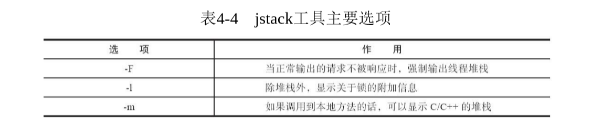

例如将当前应用的实时堆栈信息dump到一个本地文件：

```shell
C:\Users\Pengle>jstack -l 16168 > d:/jstack-dump.log
```

从JDK 5起，java.lang.Thread类新增了一个getAllStackTraces()方法用于获取虚拟机中所有线程的StackTraceElement对象。使用这个方法可以通过简单的几行代码完成jstack的大部分功能，在实际项目中不妨调用这个方法做个管理员页面，可以随时使用浏览器来查看线程堆栈，如代码清单4-5所示，这也算是笔者的一个小经验。

代码清单4-5　查看线程状况的JSP页面

```jsp
<%@ page import="java.util.Map"%>
<html> 
    <head> <title>服务器线程信息</title> </head> 
    <body> 
        <pre> 
        <%    
			for (Map.Entry<Thread, StackTraceElement[]> stackTrace : Thread.getAllStackTraces().entrySet()){ 
                Thread thread = (Thread) stackTrace.getKey();        
                StackTraceElement[] stack = (StackTraceElement[]) stackTrace.getValue();        
                if (thread.equals(Thread.currentThread())) {            
                    continue;        
                }        
                out.print("\n线程：" + thread.getName() + "\n");        
                for (StackTraceElement element : stack) {            
                    out.print("\t"+element+"\n");        
                }    
            } 
		%> 
		</pre> 
    </body> 
</html>
```

**下面讲解一个通过jstack定位死循环的例子**

我们假设死循环内部代码执行的很快没有出现一些资源处理上的等待，这样基本可以出现CPU使用率飙升的情况，**通过CPU飙升定位到是哪个进程的哪个线程在作怪是本次示例的关键所在！**

我们通过一个Restful请求触发一个死循环：

```java
@Component
public class JstackAgainstUsageExample {

	/**
	 * 触发一个死循环
	 */
	@Async
	public void tryEndlessLoop() {
		System.out.println("try endlessloop for jstack usage...");
		long lastTimeMillis = 0;
		do {
			lastTimeMillis = System.currentTimeMillis();
		} while (lastTimeMillis <= System.currentTimeMillis());
		System.err.println("clock is moving backwards...");
	}
}

@RestController
@RequestMapping("/api/example/jstack")
public class JstackAgainstUsageController {

	@Autowired
	private JstackAgainstUsageExample example;
	
	@GetMapping(value="/try-endlessloop", produces=MediaType.APPLICATION_JSON_VALUE)
	public Object tryEndlessLoop() {
		example.tryEndlessLoop();
		return Result.success().build();
	}
	
}
```

基于SpringBoot的以上核心代码，我们打个jar包部署到Linux系统上进行测试，触发死循环后通过top命令查看CPU情况：

```shell
[root@localhost apps]# top
top - 13:46:29 up  1:32,  2 users,  load average: 1.00, 0.79, 0.78
Tasks: 132 total,   2 running, 130 sleeping,   0 stopped,   0 zombie
%Cpu(s): 22.4 us,  0.3 sy,  0.0 ni, 77.2 id,  0.0 wa,  0.0 hi,  0.1 si,  0.0 st
KiB Mem :  3880008 total,  2022836 free,  1154552 used,   702620 buff/cache
KiB Swap:  2097148 total,  2097148 free,        0 used.  2490460 avail Mem 

  PID USER      PR  NI    VIRT    RES    SHR S  %CPU %MEM     TIME+ COMMAND                                                                                           
 7072 root      20   0 4661392 507576  13548 S 100.0 13.1   5:28.94 java                                      2007 polkitd   20   0 2005584 381976  19640 S   1.7  9.8   1:09.87 mysqld                                    7190 root      20   0  162020   2268   1584 R   0.3  0.1   0:00.43 top                                         1 root      20   0  193656   6784   4176 S   0.0  0.2   0:04.33 systemd                                     2 root      20   0       0      0      0 S   0.0  0.0   0:00.01 kthreadd                                     4 root       0 -20       0      0      0 S   0.0  0.0   0:00.00 kworker/0:0H                                 6 root      20   0       0      0      0 S   0.0  0.0   0:00.60 ksoftirqd/0                                 7 root      rt   0       0      0      0 S   0.0  0.0   0:00.11 migration/0                                 8 root      20   0       0      0      0 S   0.0  0.0   0:00.00 rcu_bh                                       9 root      20   0       0      0      0 S   0.0  0.0   0:01.15 rcu_sched                                  10 root       0 -20       0      0      0 S   0.0  0.0   0:00.00 lru-add-drain
```

**使用jstack输出7072号进程的信息：jstack -l 7072 > jstack-7072.log**

**再使用top命令检查7072号进程中的线程信息：top -p 7072 -H**

```shell
[root@localhost apps]# top -p 7072 -H
top - 13:50:06 up  1:36,  2 users,  load average: 1.07, 0.94, 0.85
Threads:  41 total,   1 running,  40 sleeping,   0 stopped,   0 zombie
%Cpu(s): 22.6 us,  0.3 sy,  0.0 ni, 77.0 id,  0.0 wa,  0.0 hi,  0.1 si,  0.0 st
KiB Mem :  3880008 total,  2020320 free,  1157040 used,   702648 buff/cache
KiB Swap:  2097148 total,  2097148 free,        0 used.  2487972 avail Mem 

  PID USER      PR  NI    VIRT    RES    SHR S %CPU %MEM     TIME+ COMMAND                                                                                            
 7151 root      20   0 4664476 508004  13696 R 99.7 13.1   8:41.13 java                                      7089 root      20   0 4664476 508004  13696 S  0.3 13.1   0:01.02 java                                      7072 root      20   0 4664476 508004  13696 S  0.0 13.1   0:00.00 java                                      7073 root      20   0 4664476 508004  13696 S  0.0 13.1   0:06.49 java                                      7074 root      20   0 4664476 508004  13696 S  0.0 13.1   0:00.08 java                                      7075 root      20   0 4664476 508004  13696 S  0.0 13.1   0:00.08 java                                      7076 root      20   0 4664476 508004  13696 S  0.0 13.1   0:00.09 java                                      7077 root      20   0 4664476 508004  13696 S  0.0 13.1   0:00.07 java                                      7078 root      20   0 4664476 508004  13696 S  0.0 13.1   0:00.21 java
```

上图中第一个CPU奇高的线程ID 7151是十进制的，而jstack输出的线程号是十六进制的，需做转换(Linux命令行下输入printf "%x" 7151或者使用windows计算器程序员模式)得出十六进制：1bef，然后在刚刚得到的线程堆栈(jstack-7072.log)中查找1bef即可定位到导致CPU占用过高的代码：

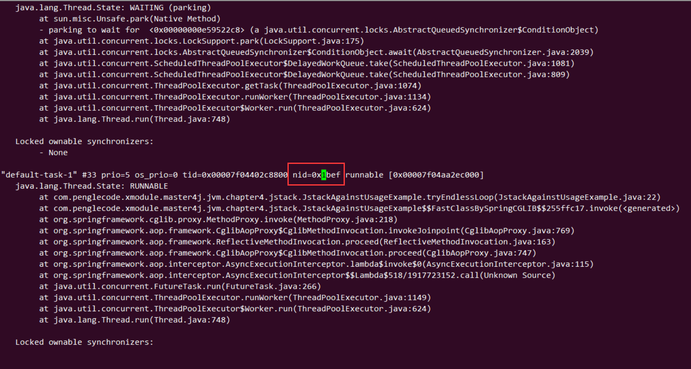

**下面讲解一个通过jstack定位死锁的例子**

从JDK7开始jstack就能直接检测出java范畴内的死锁。本例代码如下所示：

```java
@RestController
@RequestMapping("/api/example/jstack")
public class JstackAgainstUsageController {

	@Autowired
	private JstackAgainstUsageExample example;
	
	@GetMapping(value="/try-deadlock", produces=MediaType.APPLICATION_JSON_VALUE)
	public Object tryDeadLock() {
		example.tryDeadLock();
		return Result.success().build();
	}
	
}

@Component
public class JstackAgainstUsageExample {

	private final Object monitor1 = new Object();
	
	private final Object monitor2 = new Object();
	
	protected void tryLock1() {
		synchronized (monitor1) {
			/*
			 * 暂停一下，以确保tryLock1()中获取到锁monitor1的同时tryLock2()中获取到锁monitor2
			 * 这样在一次运行中就能产生出个死锁示例
			 */
			LockSupport.parkNanos(TimeUnit.MILLISECONDS.toNanos(200));
			synchronized (monitor2) {
				System.out.println("do something after acquired lock : monitor1 and monitor2");
			}
		}
	}
	
	protected void tryLock2() {
		synchronized (monitor2) {
            /*
			 * 暂停一下，以确保tryLock2()中获取到锁monitor2的同时tryLock1()中获取到锁monitor1
			 * 这样在一次运行中就能产生出个死锁示例
			 */
			LockSupport.parkNanos(TimeUnit.MILLISECONDS.toNanos(200));
			synchronized (monitor1) {
				System.out.println("do something after acquired lock : monitor2 and monitor1");
			}
		}
	}
	
	/**
	 * 触发一个死锁
	 */
	public void tryDeadLock() {
		System.out.println("try deadlock for jstack usage...");
		new Thread(this::tryLock1).start();
		new Thread(this::tryLock2).start();
	}
}
```

我们通过一个Restful请求触发一个死锁，然后使用jstack查看堆栈信息：jstack -l 21304 > d:/jstack-dump.log

我们发现两个等待获取锁的堆栈信息：

```java
2020-07-09 14:44:53
Full thread dump Java HotSpot(TM) 64-Bit Server VM (25.241-b07 mixed mode):

"Thread-5" #38 daemon prio=5 os_prio=0 tid=0x0000000019abb000 nid=0x3690 waiting for monitor entry [0x00000000290af000]
   java.lang.Thread.State: BLOCKED (on object monitor)
	at com.penglecode.xmodule.master4j.jvm.chapter4.jstack.JstackAgainstUsageExample.tryLock2(JstackAgainstUsageExample.java:43)
	- waiting to lock <0x00000000e273af78> (a java.lang.Object)
	- locked <0x00000000e273af88> (a java.lang.Object)
	at com.penglecode.xmodule.master4j.jvm.chapter4.jstack.JstackAgainstUsageExample$$Lambda$525/982704765.run(Unknown Source)
	at java.lang.Thread.run(Thread.java:748)

   Locked ownable synchronizers:
	- None

"Thread-4" #37 daemon prio=5 os_prio=0 tid=0x0000000019aba800 nid=0x1bc4 waiting for monitor entry [0x0000000022e5f000]
   java.lang.Thread.State: BLOCKED (on object monitor)
	at com.penglecode.xmodule.master4j.jvm.chapter4.jstack.JstackAgainstUsageExample.tryLock1(JstackAgainstUsageExample.java:30)
	- waiting to lock <0x00000000e273af88> (a java.lang.Object)
	- locked <0x00000000e273af78> (a java.lang.Object)
	at com.penglecode.xmodule.master4j.jvm.chapter4.jstack.JstackAgainstUsageExample$$Lambda$524/422511039.run(Unknown Source)
	at java.lang.Thread.run(Thread.java:748)

   Locked ownable synchronizers:
	- None
```

然后在堆栈dump文件的最下面发现了jstack检测到的Java级别的死锁提示：

```java

Found one Java-level deadlock:
=============================
"Thread-5":
  waiting to lock monitor 0x00000000199b6ab8 (object 0x00000000e273af78, a java.lang.Object),
  which is held by "Thread-4"
"Thread-4":
  waiting to lock monitor 0x000000001c520d58 (object 0x00000000e273af88, a java.lang.Object),
  which is held by "Thread-5"

Java stack information for the threads listed above:
===================================================
"Thread-5":
	at com.penglecode.xmodule.master4j.jvm.chapter4.jstack.JstackAgainstUsageExample.tryLock2(JstackAgainstUsageExample.java:43)
	- waiting to lock <0x00000000e273af78> (a java.lang.Object)
	- locked <0x00000000e273af88> (a java.lang.Object)
	at com.penglecode.xmodule.master4j.jvm.chapter4.jstack.JstackAgainstUsageExample$$Lambda$525/982704765.run(Unknown Source)
	at java.lang.Thread.run(Thread.java:748)
"Thread-4":
	at com.penglecode.xmodule.master4j.jvm.chapter4.jstack.JstackAgainstUsageExample.tryLock1(JstackAgainstUsageExample.java:30)
	- waiting to lock <0x00000000e273af88> (a java.lang.Object)
	- locked <0x00000000e273af78> (a java.lang.Object)
	at com.penglecode.xmodule.master4j.jvm.chapter4.jstack.JstackAgainstUsageExample$$Lambda$524/422511039.run(Unknown Source)
	at java.lang.Thread.run(Thread.java:748)

Found 1 deadlock.
```

#### 基础工具总结

下面表4-5～表4-14中罗列了JDK附带的全部（包括曾经存在但已经在最新版本中被移除的）工具及其简要用途，限于篇幅，本节只讲解了 6个常用的命令行工具。笔者选择这几个工具除了因为它们是最基础的命令外，还因为它们已经有很长的历史，能适用于大多数读者工作、学习中使用的JDK版本。在高版本的JDK中，这些工具大多已有了功能更为强大的替代品，譬如JCMD、JHSDB的命令行模式，但使用方法也是相似的，无论JDK发展到了什么版本，学习这些基础的工具命令并不会过时和浪费。

- 基础工具：用于支持基本的程序创建和运行（见表4-5）

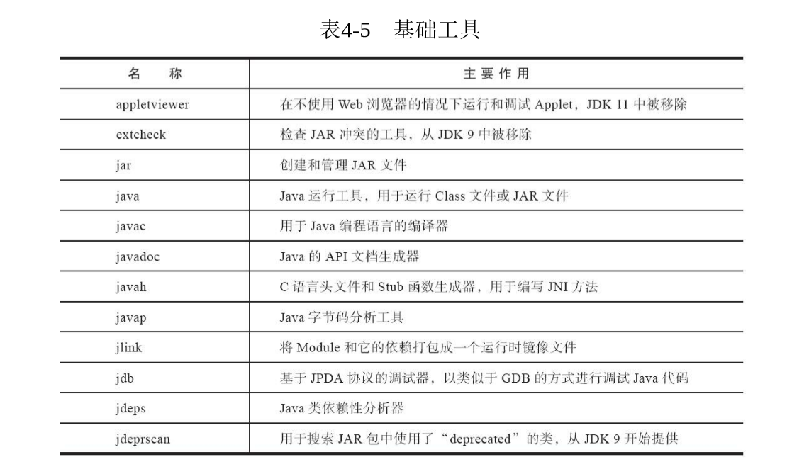

- 安全：用于程序签名、设置安全测试等（见表4-6）

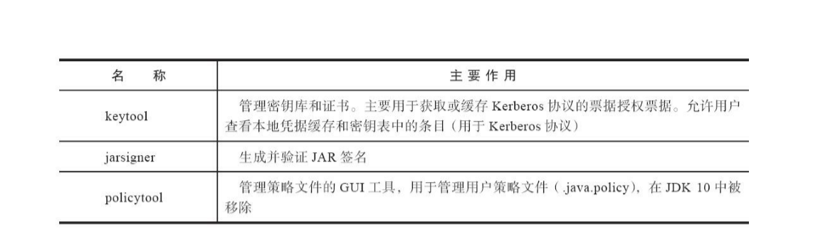

- 国际化：用于创建本地语言文件（见表4-7） 

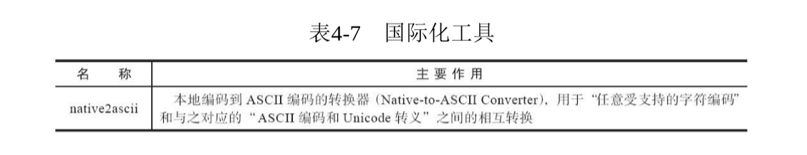

- 远程方法调用：用于跨Web或网络的服务交互（见表4-8） 

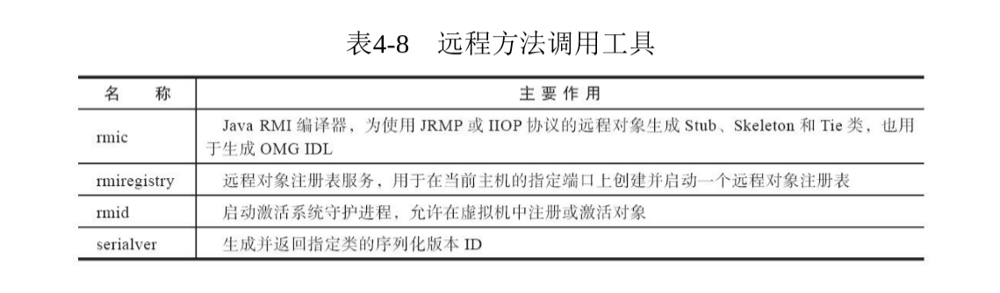

- 性能监控和故障处理：用于监控分析Java虚拟机运行信息，排查问题（见表4-12） 

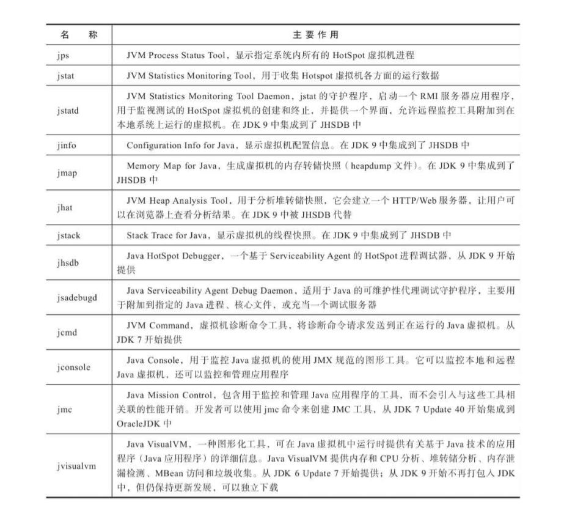

### 4.3　可视化故障处理工具

JDK中除了附带大量的命令行工具外，还提供了几个功能集成度更高的可视化工具，用户可以使用这些可视化工具以更加便捷的方式进行 进程故障诊断和调试工作。这类工具主要包括JConsole、JHSDB、VisualVM和JMC四个。其中，JConsole是最古老，早在JDK 5时期就已经存在的虚拟机监控工具，而JHSDB虽然名义上是JDK 9中才正式提供，但之前已经以sa-jdi.jar包里面的HSDB（可视化工具）和CLHSDB（命令行工具）的形式存在了很长一段时间。它们两个都是 JDK的正式成员，随着JDK一同发布，无须独立下载，使用也是完全免费的。

VisualVM在JDK 6 Update 7中首次发布，直到JRockit Mission Control与OracleJDK的融合工作完成之前，它都曾是Oracle主力推动的多合一故障处理工具，现在它已经从OracleJDK中分离出来，成为一个独立发展的开源项目。VisualVM已不是JDK中的正式成员，但仍是可以免费下载、使用的。

Java Mission Control，曾经是大名鼎鼎的来自BEA公司的图形化诊断工具，随着BEA公司被Oracle收购，它便被融合进OracleJDK之中。在 JDK 7 Update 40时开始随JDK一起发布，后来Java SE Advanced产品线建立，Oracle明确区分了Oracle OpenJDK和OracleJDK的差别，JMC从JDK 11开始又被移除出JDK。虽然在2018年Oracle将JMC开源并交付给OpenJDK组织进行管理，但开源并不意味着免费使用，JMC需要与HotSpot内部的“飞行记录仪”（Java Flight Recorder，JFR）配合才能工作，而在JDK 11以前，JFR的开启必须解锁OracleJDK的商业特性支持（使用JCMD的VM.unlock_commercial_features或启动时加入-XX: +UnlockCommercialFeatures参数），所以这项功能在生产环境中仍然是需要付费才能使用的商业特性。

为避免本节讲解的内容变成对软件说明文档的简单翻译，笔者准备了一些代码样例，大多数是笔者特意编写的反面教材。稍后将会使用几 款工具去监控、分析这些代码存在的问题，算是本节简单的实战演练。读者可以把在可视化工具观察到的数据、现象，与前面两章中讲解的理论知识进行互相验证。

#### JHSDB：基于服务性代理的调试工具

JDK中提供了JCMD和JHSDB两个集成式的多功能工具箱，它们不仅整合了上一节介绍到的所有基础工具所能提供的专项功能，而且由于 有着“后发优势”，能够做得往往比之前的老工具们更好、更强大，表415所示是JCMD、JHSDB与原基础工具实现相同功能的简要对比。

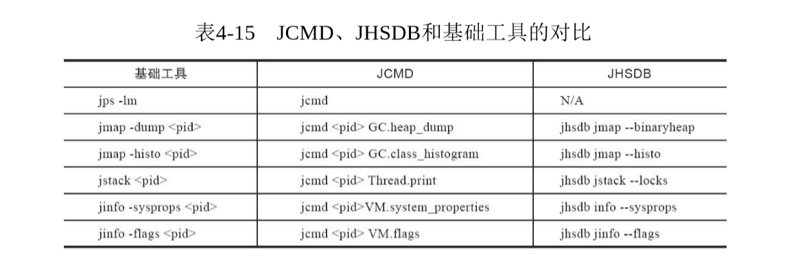

本节的主题是可视化的故障处理，所以JCMD及JHSDB的命令行模式就不再作重点讲解了，读者可参考上一节的基础命令，再借助它们在 JCMD和JHSDB中的help去使用，相信是很容易举一反三、触类旁通的。接下来笔者要通过一个实验来讲解JHSDB的图形模式下的功能。

JHSDB是一款基于服务性代理（Serviceability Agent，SA）实现的进程外调试工具。服务性代理是HotSpot虚拟机中一组用于映射Java虚拟机运行信息的、主要基于Java语言（含少量JNI代码）实现的API集合。 服务性代理以HotSpot内部的数据结构为参照物进行设计，把这些C++的数据抽象出Java模型对象，相当于HotSpot的C++代码的一个镜像。通过服务性代理的API，可以在一个独立的Java虚拟机的进程里分析其他HotSpot虚拟机的内部数据，或者从HotSpot虚拟机进程内存中dump出来的转储快照里还原出它的运行状态细节。服务性代理的工作原理跟Linux上的GDB或者Windows上的Windbg是相似的。本次，我们要借助JHSDB来分析一下代码清单4-6中的代码，并通过实验来回答一个简单问题：staticObj、instanceObj、localObj这三个变量本身（而不是它们所指向的对象）存放在哪里？

代码清单4-6　JHSDB测试代码

```java
/** 
 * staticObj、instanceObj、localObj存放在哪里？ 
 */ 
public class JHSDB_TestCase {
    
    static class Test {        
        static ObjectHolder staticObj = new ObjectHolder();   
        ObjectHolder instanceObj = new ObjectHolder();
        
        void foo() {           
            ObjectHolder localObj = new ObjectHolder();            
            System.out.println("done");    // 这里设一个断点        
        }    
    }
    
    private static class ObjectHolder {}
    
    public static void main(String[] args) {        
        Test test = new JHSDB_TestCase.Test();        
        test.foo();    
    } 
}
```

答案读者当然都知道：staticObj随着Test的类型信息存放在方法区，instanceObj随着Test的对象实例存放在Java堆，localObject则是存放在foo()方法栈帧的局部变量表中。这个答案是通过前两章学习的理论知识得出的，现在要做的是通过JHSDB来实践验证这一点。

首先，我们要确保这三个变量已经在内存中分配好，然后将程序暂停下来，以便有空隙进行实验，这只要把断点设置在代码中加粗的打印 语句上，然后在调试模式下运行程序即可。由于JHSDB本身对压缩指针的支持存在很多缺陷，建议用64位系统的读者在实验时禁用压缩指针，另外为了后续操作时可以加快在内存中搜索对象的速度，也建议读者限制一下Java堆的大小。本例中，笔者采用的运行参数如下：

-Xmx10m -XX:+UseSerialGC -XX:-UseCompressedOops

程序执行后通过jps查询到测试程序的进程ID，具体如下：

```shell
C:\Program Files\Java\adoptopenjdk-11.0.7_10\bin>jps
14308 XMLServerLauncher
15060 JHSDBTestExample
27668 Jps
21932
```

通过以下命令启动JHSDB可视化界面(注意jhsdb是JDK9以后才有的，所以本例中使用了adoptopenjdk-11)：

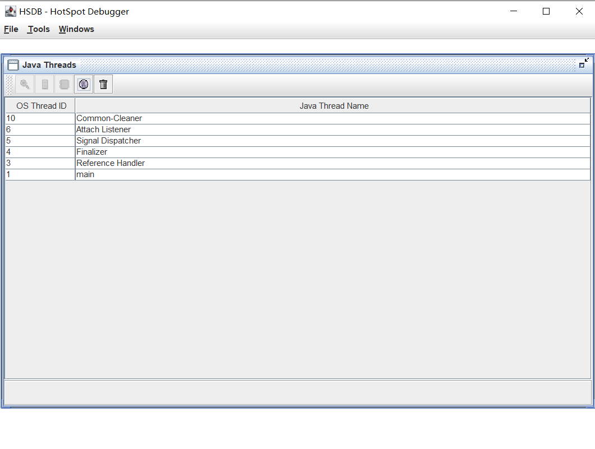

阅读代码清单4-6可知，运行至断点位置一共会创建三个ObjectHolder对象的实例，只要是对象实例必然会在Java堆中分配，既然我们要查找引用这三个对象的指针存放在哪里，不妨从这三个对象开始着手，先把它们从Java堆中找出来。

首先点击菜单中的Tools->Heap Parameters，结果如图4-5所示，因为笔者的运行参数中指定了使用的是Serial收集器，图中我们看到了典型的Serial的分代内存布局，Heap Parameters窗口中清楚列出了新生代的 Eden、S1、S2和老年代的容量（单位为字节）以及它们的虚拟内存地址起止范围。

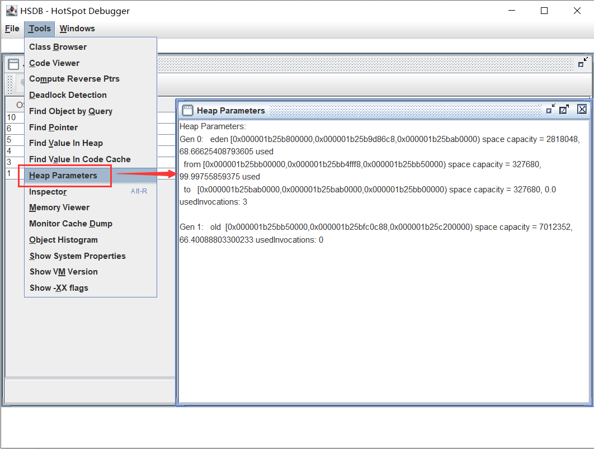

如果读者实践时不指定收集器，即使用JDK默认的G1的话，得到的信息应该类似如下所示：

```shell
Heap Parameters: garbage-first heap [0x00007f32c7800000, 0x00007f32c8200000] region size 1024K
```

请读者注意一下图中各个区域的内存地址范围，后面还要用到它们。打开Windows->Console窗口，使用scanoops命令在Java堆的新生代 （从Eden起始地址到To Survivor结束地址）范围内查找ObjectHolder的实例，结果如下所示：

```shell
hsdb> scanoops 0x0000029f3a200000 0x0000029f3a500000 com/penglecode/xmodule/master4j/jvm/chapter4/jhsdb/JHSDBTestExample$ObjectHolder
```

由于笔者使用的是adoptopenjdk11，按照《深入理解JAVA虚拟机第三步》后续步骤进行时出现错误，估计是openjdk本身的bug，后续示例没继续实践了。

**从《Java虚拟机规范》所定义的概念模型来看，所有Class相关的信息都应该存放在方法区之中，但方法区该如何实现，《Java虚拟机规 范》并未做出规定，这就成了一件允许不同虚拟机自己灵活把握的事情。JDK 7及其以后版本的HotSpot虚拟机选择把静态变量与类型在Java语言一端的映射Class对象存放在一起，存储于Java堆之中，从我们的实验中也明确验证了这一点。**

#### JConsole：Java监视与管理控制台

JConsole（Java Monitoring and Management Console）是一款基于 JMX（Java Management Extensions）的可视化监视、管理工具。它的主要功能是通过JMX的MBean（Managed Bean）对系统进行信息收集和参数动态调整。JMX是一种开放性的技术，不仅可以用在虚拟机本身的管理上，还可以运行于虚拟机之上的软件中，典型的如中间件大多也基于JMX来实现管理与监控。虚拟机对JMX MBean的访问也是完全开放的，可以使用代码调用API、支持JMX协议的管理控制台，或者其他符合JMX规范的软件进行访问。

1.启动JConsole

通过JDK/bin目录下的jconsole.exe启动JCon-sole后，会自动搜索出本机运行的所有虚拟机进程，而不需要用户自己使用jps来查询，如图4-10所示。双击选择其中一个进程便可进入主界面开始监控。JMX支持跨服务器的管理，也可以使用下面的“远程进程”功能来连接远程服务器， 对远程虚拟机进行监控。

本例中笔者通过远程RMI来监控远程的一个应用如图4-10所示。双击它进入JConsole主界面，可以看到主界面 里共包括“概述”“内存”“线程”“类”“VM摘要”“MBean”六个页签，如图4-11所示。

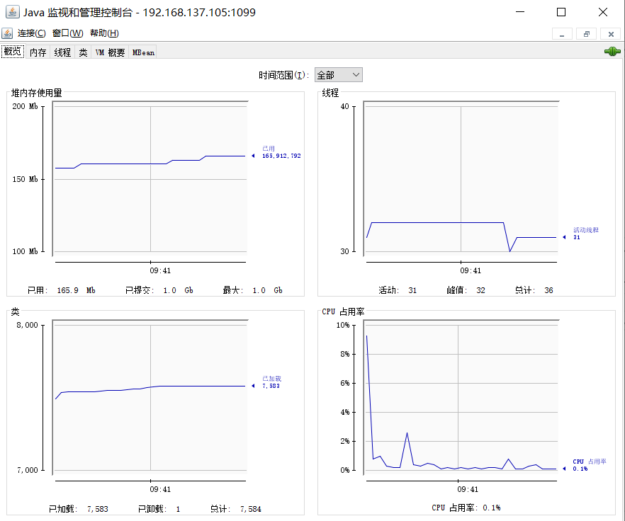

“概述”页签里显示的是整个虚拟机主要运行数据的概览信息，包括“堆内存使用情况”“线程”“类”“CPU使用情况”四项信息的曲线图，这
些曲线图是后面“内存”“线程”“类”页签的信息汇总，具体内容将在稍后介绍。

2.内存监控

“内存”页签的作用相当于可视化的jstat命令，用于监视被收集器管 理的虚拟机内存（被收集器直接管理的Java堆和被间接管理的方法区） 的变化趋势。

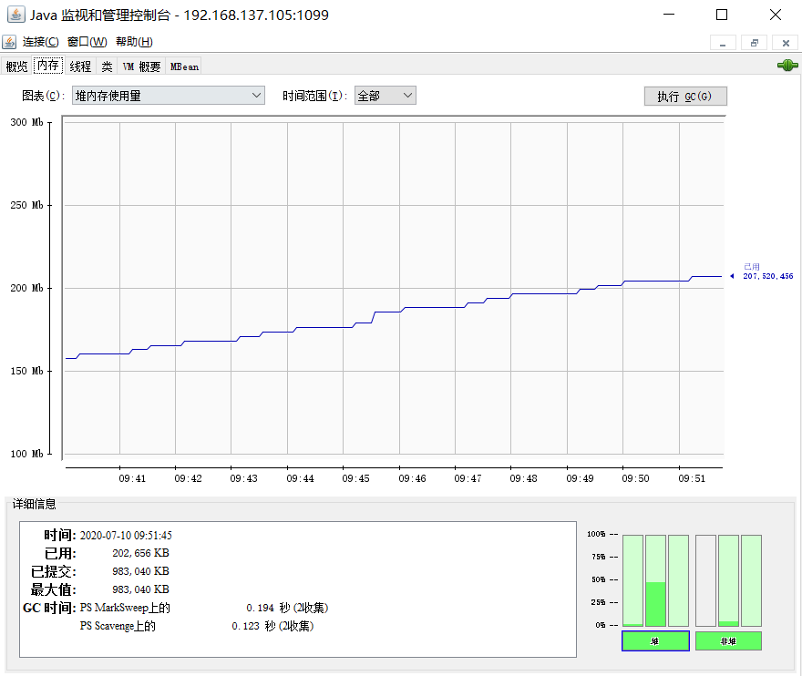

3.线程监控 

如果说JConsole的“内存”页签相当于可视化的jstat命令的话，那“线 程”页签的功能就相当于可视化的jstack命令了，遇到线程停顿的时候可 以使用这个页签的功能进行分析。前面讲解jstack命令时提到线程长时 间停顿的主要原因有等待外部资源（数据库连接、网络资源、设备资源 等）、死循环、锁等待等。

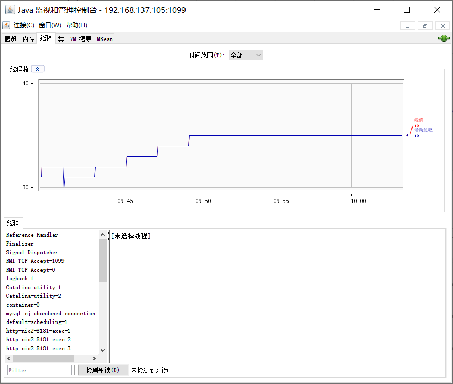

#### VisualVM：多合-故障处理工具

VisualVM（All-in-One Java Troubleshooting Tool）是功能最强大的运行监视和故障处理程序之一，曾经在很长一段时间内是Oracle官方主力发展的虚拟机故障处理工具。Oracle曾在VisualVM的软件说明中写上了“All-in-One”的字样，预示着它除了常规的运行监视、故障处理外，还将提供其他方面的能力，譬如性能分析（Profiling）。VisualVM的性能分析功能比起JProfiler、YourKit等专业且收费的Profiling工具都不遑多让。而且相比这些第三方工具，VisualVM还有一个很大的优点：不需要被监视的程序基于特殊Agent去运行，因此它的通用性很强，对应用程序实际性能的影响也较小，使得它可以直接应用在生产环境中。这个优点是JProfiler、YourKit等工具无法与之媲美的。 

1.VisualVM兼容范围与插件安装

VisualVM基于NetBeans平台开发工具，所以一开始它就具备了通过插件扩展功能的能力，有了插件扩展支持，VisualVM可以做到：

- 显示虚拟机进程以及进程的配置、环境信息（jps、jinfo）。
- 监视应用程序的处理器、垃圾收集、堆、方法区以及线程的信息（jstat、jstack）。
- dump以及分析堆转储快照（jmap、jhat）。
- **方法级的程序运行性能分析，找出被调用最多、运行时间最长的方法。**
- 离线程序快照：收集程序的运行时配置、线程dump、内存dump等信息建立一个快照，可以将快照发送开发者处进行Bug反馈。
- 其他插件带来的无限可能性。

VisualVM在JDK 6 Update 7中首次发布，但并不意味着它只能监控运行于JDK 6上的程序，它具备很优秀的向下兼容性，甚至能向下兼容 至2003年发布的JDK 1.4.2版本，这对无数处于已经完成实施、正在维护的遗留项目很有意义。当然，也并非所有功能都能完美地向下兼容， 主要功能的兼容性见表4-16所示。 

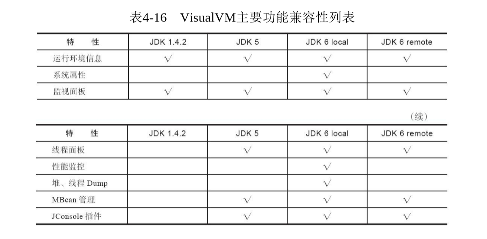

首次启动VisualVM后，读者先不必着急找应用程序进行监测，初始状态下的VisualVM并没有加载任何插件，虽然基本的监视、线程面板的功能主程序都以默认插件的形式提供，但是如果不在VisualVM上装任何扩展插件，就相当于放弃它最精华的功能，和没有安装任何应用 软件的操作系统差不多。

VisualVM的插件可以手工进行安装，在网站上下载nbm包后，点击“工具->插件->已下载”菜单，然后在弹出对话框中指定nbm包路径便 可完成安装。独立安装的插件存储在VisualVM的根目录，譬如JDK 9之前自带的VisulalVM，插件安装后是放在JDK_HOME/lib/visualvm中的。手工安装插件并不常用，VisualVM的自动安装功能已可找到大多数所需的插件，在有网络连接的环境下，点击“工具->插件菜单”，弹出如图 4-17所示的插件页签，在页签的“可用插件”及“已安装”中列举了当前版本VisualVM可以使用的全部插件，选中插件后在右边窗口会显示这个插件的基本信息，如开发者、版本、功能描述等。

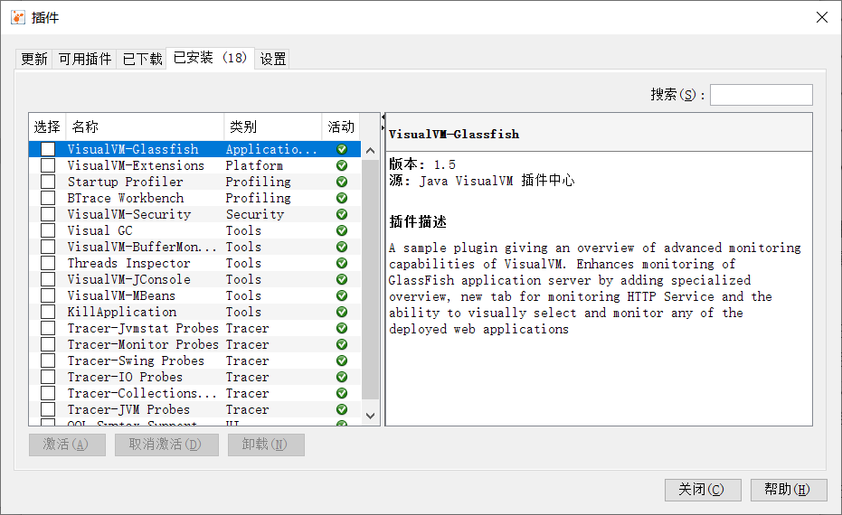

读者可根据自己的工作需要和兴趣选择合适的插件，然后点击“安 装”按钮，弹出如图4-18所示的下载进度窗口，跟着提示操作即可完成 安装。

**通过VisualVM远程监控JVM**

VisualVM远程监控JVM主要依靠JMX（Java Management Extensions，即Java管理扩展）和jstatd来实现实现远程监控的，其都是基于RMI（远程过程调用）协议的。其中JMX直接与指定应用执行交互，而jstatd作为一个独立的Server运行在应用所在机器上，能自动发现所在主机上的各个JVM进程进而进行监控的。

- 启用JMX远程监控仅需在应用的启动命令后面追加如下启动参数(加粗部分)即可：

  java -server **-Dcom.sun.management.jmxremote.rmi.port=1099 -Dcom.sun.management.jmxremote=true -Dcom.sun.management.jmxremote.port=1099 -Dcom.sun.management.jmxremote.s**
  **sl=false -Dcom.sun.management.jmxremote.authenticate=false -Dcom.sun.management.jmxremote.local.only=false -Djava.rmi.server.hostname=192.168.137.105** -XX:+PrintCommand
  LineFlags -Xmx1024m -Xms1024m -Xmn512m -jar xmodule-master4j-jvm.jar

- 启用jstatd远程监控需要在远程主机或docker容器中做以下配置即可：

  vi $JAVA_HOME/jre/lib/security/java.policy在该policy文件末尾 }; 前添加：**permission java.security.AllPermission;**

  启动jstatd服务：**jstatd -J-Djava.security.policy=jstatd.all.policy -J-Djava.rmi.server.hostname=192.168.137.105 -p 1100**，其中hostname为远程主机的真实ip地址，-p参数是为了另指一个RMI端口，因为上面JMX已经使用了默认的RMI端口1099了，所以此处需要另指端口否则会报reject错误。

**以上通过JMX方式就能监控绝大部分的需求，但是除了最重要GC模块：Visual GC，Visual GC的正常工作是需要依赖于jstatd的，所以上面两个都需要进行启用。**

打开VisualVM，主界面->远程，右击"添加远程主机"（**主机名输入上面的192.168.137.105，点开"高级设置"，需要设置jstatd的配置，注意修改jstatd的端口为1100而非1099**）,最后"确定"后会立即列出远程主机上的各个JVM进程列表，如下图所示：

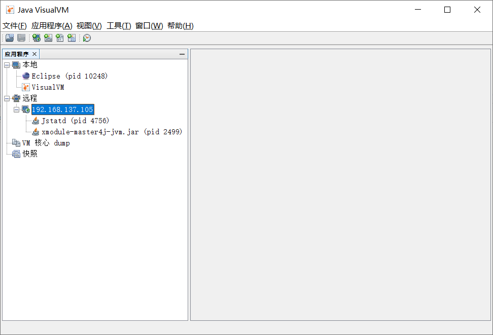

点击上面某个JVM进程节点(如Jstatd)，会有短暂的卡顿，应该是在点击的时候初始化监控所致。本例中我们运行了一个样例应用：xmodule-master4j-jvm.jar，如上图所示，我们双击后如下图所示：

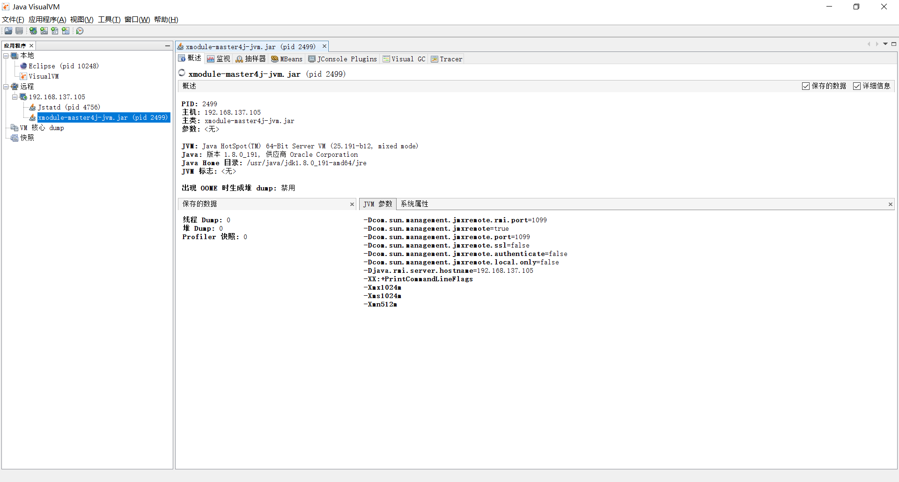

上图展示了"概述"信息。

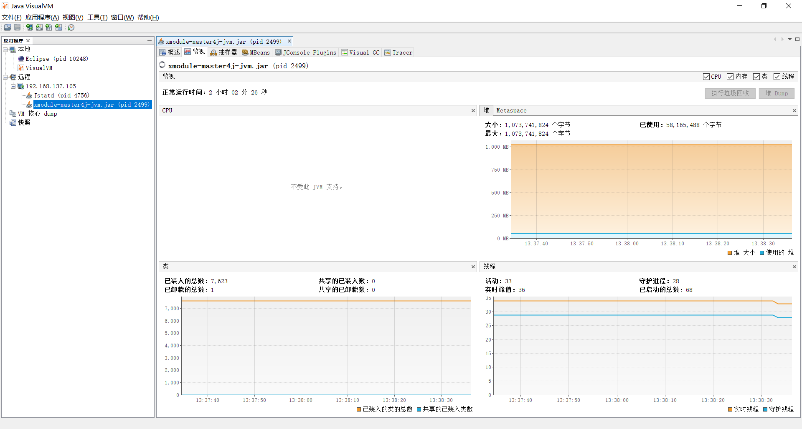

上图展示了"监视"，即CPU、堆、类、线程四个大方面的监控信息，但是CPU却不受支持，大概原因是此监控是单纯基于jstatd的，所以无法展示CPU。

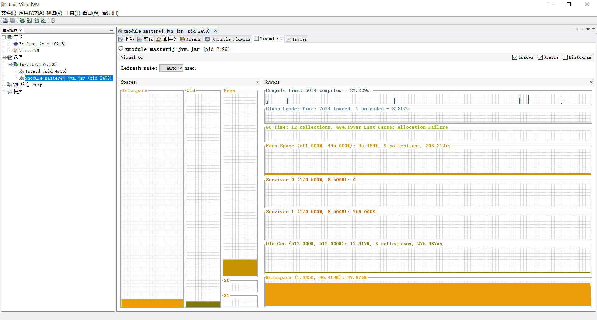

上图展示了"Visual GC"有关GC方面的监控信息。

由于上面无法展示较为重要的CPU监控信息，为此，我选中远程节点"192.168.137.105"右击"添加JXM连接"：在对话框中输入JMX连接的RMI地址：192.168.137.105:1099，并且勾选"不要求SSL连接"，然后"确定"后如下图所示：

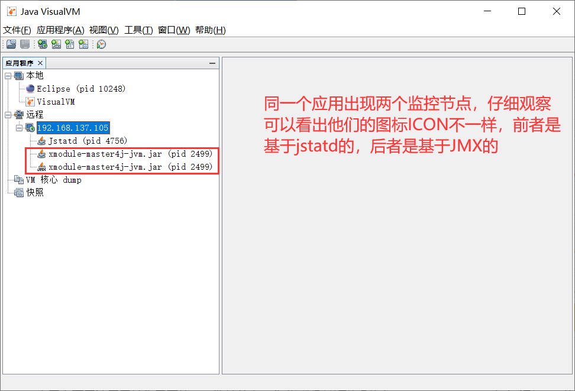

同一个应用出现两个监控节点，仔细观察可以看出他们的图标ICON不一样，前者是基于jstatd的，后者是基于JMX的。

点击基于JMX的"xmodule-master4j-jvm.jar"，如下图所示，其中CPU监控信息可以看见了，Visual GC信息也可以看见了，非常完美：

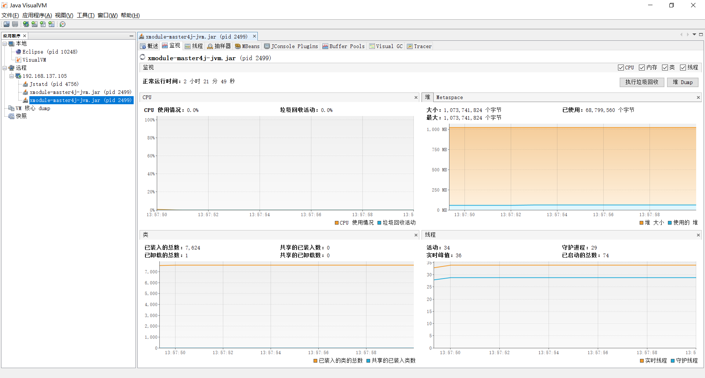

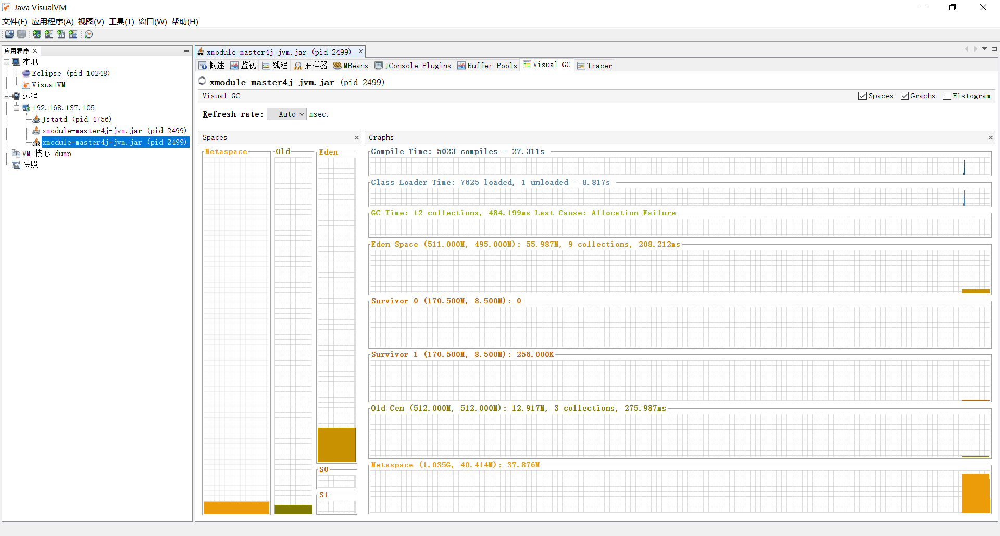

点击"JConsole Plugins"标签发现是个空面板，需要对VisualVM JConsole Plugins进行一些配置才能使用JConsole插件：

1、下载JDK demos(例如jdk-8u251-windows-x64-demos.zip)并释放到JAVA_HOME目录下

2、配置JConsole，点击Add，如图找到，选中它：

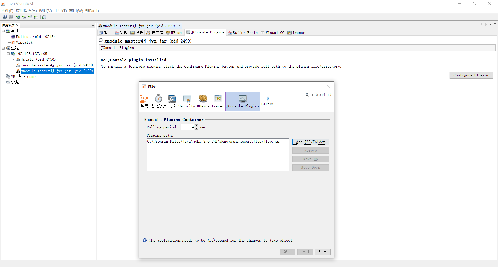

3、重启VisualVM，JConsole就可以使用了，如下图所示：

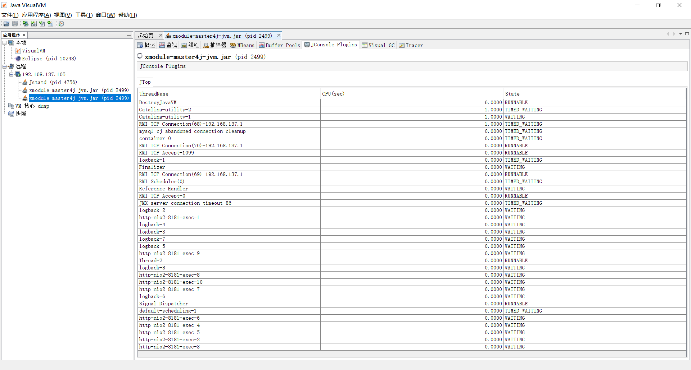

**至此，所有的监控准备工作已经就绪了，接下来就一些常用的功能进行介绍。**

**1、概述**

- 查看当前JVM的进程ID，也即PID。
- 应用运行的JDK信息及JVM信息等。
- 应用启动的JVM参数及系统参数等。

**2、监视**

- 展示应用的CPU、堆、类、线程等实时信息。
- 此处可以dump堆转储快照以及执行GC。

**3、线程**

VisualVM将线程的状态分为五种：运行、休眠、等待、驻留、监视，与Thread类中的线程状态对应如下：

| VisualVM线程状态 | 描述                                                         |
| ---------------- | ------------------------------------------------------------ |
| Running：运行    | 处于这种状态的线程对于操作系统而言，要么是正在占用CPU时间片运行的线程，要么是已经就绪的线程，只要有CPU时间片分配到，就可以直接运行，对应Java中Runnable状态。 |
| Sleeping：休眠   | 处于睡眠状态的线程，通过调用Thread.sleep()方法让线程进行这种状态，此种状态的线程不占用CPU，但是不释放锁资源。 |
| Wait：等待       | 通过调用Object.wait()、Thread.join()等方法让线程进入这种状态，这种状态的线程不仅会让出CPU资源，也会让出所占用的锁资源。 |
| Park：驻留       | 通过调用LockSupport类中的一些列park方法进行此种状态。这种状态是线程没有占用锁，但是可以直接让线程让出CPU，其他的方法都提到了锁的概念。 |
| Monitor：监视    | 通过抢占synchronized中的锁而进入的状态。                     |

**4、抽样器**

- 对CPU进行抽样，查看热点方法、线程的CPU时间等。
- 对内存进行抽样，查看哪些类的实例内存占比及实例个数。

**5、Visual GC**

- 展示JIT即时编译次数及耗时。
- 展示已加载类个数及卸载个数和耗时。
- 展示堆中总的GC次数、GC耗时及最近一次GC原因。
- 展示Eden区、Old区等GC次数、GC耗时。

#### Java Mission Control：可持续在线的监控工具

除了大家熟知的面向通用计算（General Purpose Computing）可免费使用的Java SE外，Oracle公司还开辟过带商业技术支持的Oracle Java SE Support和面向独立软件供应商（ISV）的Oracle Java SE Advanced & Suite产品线。

除去带有7×24小时的技术支持以及可以为企业专门定制安装包这些非技术类的增强服务外，Oracle Java SE Advanced & Suite与普通 Oracle Java SE在功能上的主要差别是前者包含了一系列的监控、管理工具，譬如用于企业JRE定制管理的AMC（Java Advanced Management Console）控制台、JUT（Java Usage Tracker）跟踪系统，用于持续收集数据的JFR（Java Flight Recorder）飞行记录仪和用于监控Java虚拟机的 JMC（Java Mission Control）。这些功能全部都是需要商业授权才能在生产环境中使用，但根据Oracle Binary Code协议，在个人开发环境中， 允许免费使用JMC和JFR，本节笔者将简要介绍它们的原理和使用。

JMC最初是BEA公司的产品，因此并没有像VisualVM那样一开始就基于自家的Net-Beans平台来开发，而是选择了由IBM捐赠的Eclipse RCP作为基础框架，现在的JMC不仅可以下载到独立程序，更常见的是作为Eclipse的插件来使用。JMC与虚拟机之间同样采取JMX协议进行通信， JMC一方面作为JMX控制台，显示来自虚拟机MBean提供的数据；另一方面作为JFR的分析工具，展示来自JFR的数据。启动后JMC的主界面如图4-24所示。

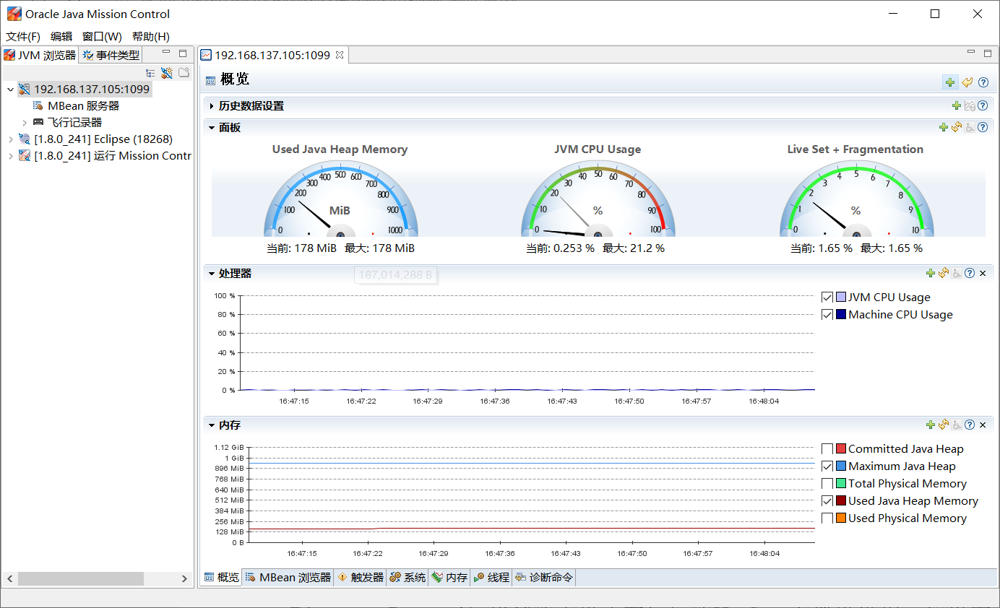

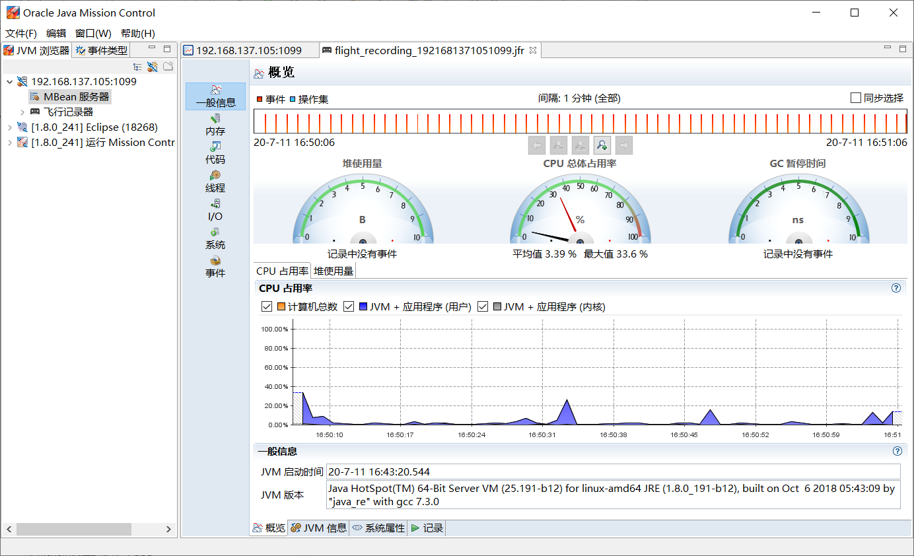

## 第5章　调优案例分析与实战

Java与C++之间有一堵由内存动态分配和垃圾收集技术所围成的高墙，墙外面的人想进去，墙里面的人却想出来。

### 5.1　概述

在前面3章笔者系统性地介绍了处理Java虚拟机内存问题的知识与工具，在处理应用中的实际问题时，除了知识与工具外，经验同样是一 个很重要的因素。在本章，将会与读者分享若干较有代表性的实际案例。

考虑到虚拟机的故障处理与调优主要面向各类服务端应用，而大多数Java程序员较少有机会直接接触生产环境的服务器，因此本章还准备了一个所有开发人员都能够进行“亲身实战”的练习，希望大家通过实践能获得故障处理、调优的经验。

### 5.2　案例分析

本章中的案例一部分来源于笔者处理过的实际问题，还有另一部分来源于网上有特色和代表性的案例总结。出于对客户商业信息保护的原因，在不影响前后逻辑的前提下，笔者对实际环境和用户业务做了一些屏蔽和精简。

本章内容将着重考虑如何在应用部署层面去解决问题，有不少案例中的问题的确可以在设计和开发阶段就先行避免，但这并不是本书要讨 论的话题。也有一些问题可以直接通过升级硬件或者使用最新JDK版本 里的新技术去解决，但我们同时也会探讨如何在不改变已有软硬件版本和规格的前提下，调整部署和配置策略去解决或者缓解问题。

#### 大内存硬件上的程序部署策略

这是笔者很久之前处理过的一个案例，但今天仍然具有代表性。一个15万PV/日左右的在线文档类型网站最近更换了硬件系统，服务器的 硬件为四路志强处理器、16GB物理内存，操作系统为64位CentOS 5.4， Resin作为Web服务器。整个服务器暂时没有部署别的应用，所有硬件资源都可以提供给这访问量并不算太大的文档网站使用。软件版本选用的是64位的JDK 5，管理员启用了一个虚拟机实例，使用-Xmx和-Xms参数将Java堆大小固定在12GB。使用一段时间后发现服务器的运行效果十分不理想，网站经常不定期出现长时间失去响应。

监控服务器运行状况后发现网站失去响应是由垃圾收集停顿所导致的，在该系统软硬件条件下，HotSpot虚拟机是以服务端模式运行，默 认使用的是吞吐量优先收集器，回收12GB的Java堆，一次Full GC的停顿时间就高达14秒。由于程序设计的原因，访问文档时会把文档从磁盘提取到内存中，导致内存中出现很多由文档序列化产生的大对象，这些大对象大多在分配时就直接进入了老年代，没有在Minor GC中被清理掉。这种情况下即使有12GB的堆，内存也很快会被消耗殆尽，由此导致每隔几分钟出现十几秒的停顿，令网站开发、管理员都对使用Java技术开发网站感到很失望。

分析此案例的情况，程序代码问题这里不延伸讨论，程序部署上的主要问题显然是过大的堆内存进行回收时带来的长时间的停顿。经调查，更早之前的硬件使用的是32位操作系统，给HotSpot虚拟机只分配了1.5GB的堆内存，当时用户确实感觉到使用网站比较缓慢，但还不至于发生长达十几秒的明显停顿，后来将硬件升级到64位系统、16GB内存希望能提升程序效能，却反而出现了停顿问题，尝试过将Java堆分配的内存重新缩小到1.5GB或者2GB，这样的确可以避免长时间停顿，但是在硬件上的投资就显得非常浪费。

每一款Java虚拟机中的每一款垃圾收集器都有自己的应用目标与最适合的应用场景，如果在特定场景中选择了不恰当的配置和部署方式，自然会事倍功半。目前单体应用在较大内存的硬件上主要的部署方式有两种：

1. 通过一个单独的Java虚拟机实例来管理大量的Java堆内存。
2. 同时使用若干个Java虚拟机，建立逻辑集群来利用硬件资源。

此案例中的管理员采用了第一种部署方式。对于用户交互性强、对停顿时间敏感、内存又较大的系统，并不是一定要使用Shenandoah、ZGC这些明确以控制延迟为目标的垃圾收集器才能解决问题（当然不可否认，如果情况允许的话，这是最值得考虑的方案），使用Parallel Scavenge/Old收集器，并且给Java虚拟机分配较大的堆内存也是有很多运行得很成功的案例的，但前提是必须把应用的Full GC频率控制得足够低，至少要低到不会在用户使用过程中发生，譬如十几个小时乃至一整天都不出现一次Full GC，这样可以通过在深夜执行定时任务的方式触发Full GC甚至是自动重启应用服务器来保持内存可用空间在一个稳定的水平。

**控制Full GC频率的关键是老年代的相对稳定**，这主要取决于应用中绝大多数对象能否符合“朝生夕灭”的原则，即大多数对象的生存时间不应当太长，尤其是不能有成批量的、长生存时间的大对象产生，这样才能保障老年代空间的稳定。

在许多网站和B/S形式的应用里，多数对象的生存周期都应该是请求级或者页面级的，会话级和全局级的长生命对象相对较少。只要代码写得合理，实现在超大堆中正常使用没有Full GC应当并不困难，这样的话，使用超大堆内存时，应用响应速度才可能会有所保证。除此之外，如果读者计划使用单个Java虚拟机实例来管理大内存，还需要考虑下面可能面临的问题：

- 回收大块堆内存而导致的长时间停顿，自从G1收集器的出现，增量回收得到比较好的应用，这个问题有所缓解，但要到ZGC和Shenandoah收集器成熟之后才得到相对彻底地解决。
- 大内存必须有64位Java虚拟机的支持，但由于压缩指针、处理器缓存行容量（Cache Line）等因素，64位虚拟机的性能测试结果普遍略低于相同版本的32位虚拟机。
- 必须保证应用程序足够稳定，因为这种大型单体应用要是发生了堆内存溢出，几乎无法产生堆转储快照（要产生十几GB乃至更大的快 照文件），哪怕成功生成了快照也难以进行分析；如果确实出了问题要进行诊断，可能就必须应用JMC这种能够在生产环境中进行的运维工具。
- 相同的程序在64位虚拟机中消耗的内存一般比32位虚拟机要大，这是由于指针膨胀，以及数据类型对齐补白等因素导致的，可以开启 （默认即开启）压缩指针功能来缓解。

鉴于上述这些问题，现阶段仍然有一些系统管理员选择第二种方式来部署应用：同时使用若干个虚拟机建立逻辑集群来利用硬件资源。做 法是在一台物理机器上启动多个应用服务器进程，为每个服务器进程分配不同端口，然后在前端搭建一个负载均衡器，以反向代理的方式来分配访问请求。这里无须太在意均衡器转发所消耗的性能，即使是使用第一个部署方案，多数应用也不止有一台服务器，因此应用中前端的负载均衡器总是免不了的。

考虑到我们在一台物理机器上建立逻辑集群的目的仅仅是尽可能利用硬件资源，并不是要按职责、按领域做应用拆分，也不需要考虑状态 保留、热转移之类的高可用性需求，不需要保证每个虚拟机进程有绝对准确的均衡负载，因此使用无Session复制的亲合式集群是一个相当合适的选择。仅仅需要保障集群具备亲合性，也就是均衡器按一定的规则算法（譬如根据Session ID分配）将一个固定的用户请求永远分配到一个固定的集群节点进行处理即可，这样程序开发阶段就几乎不必为集群环境做任何特别的考虑。

当然，第二种部署方案也不是没有缺点的，如果读者计划使用逻辑集群的方式来部署程序，可能会遇到下面这些问题：

- 节点竞争全局的资源，最典型的就是磁盘竞争，各个节点如果同时访问某个磁盘文件的话（尤其是并发写操作容易出现问题），很容易导致I/O异常。
- 很难最高效率地利用某些资源池，譬如连接池，一般都是在各个节点建立自己独立的连接池，这样有可能导致一些节点的连接池已经满了，而另外一些节点仍有较多空余。尽管可以使用集中式的JNDI来解决，但这个方案有一定复杂性并且可能带来额外的性能代价。
- 如果使用32位Java虚拟机作为集群节点的话，各个节点仍然不可避免地受到32位的内存限制，在32位Windows平台中每个进程只能使用2GB的内存，考虑到堆以外的内存开销，堆最多一般只能开到1.5GB。 在某些Linux或UNIX系统（如Solaris）中，可以提升到3GB乃至接近4GB的内存，但32位中仍然受最高4GB（2的32次幂）内存的限制。
- 大量使用本地缓存（如大量使用HashMap作为K/V缓存）的应用， 在逻辑集群中会造成较大的内存浪费，因为每个逻辑节点上都有一份缓存，这时候可以考虑把本地缓存改为集中式缓存。

介绍完这两种部署方式，重新回到这个案例之中，最后的部署方案并没有选择升级JDK版本，而是调整为建立5个32位JDK的逻辑集群，每 个进程按2GB内存计算（其中堆固定为1.5GB），占用了10GB内存。另外建立一个Apache服务作为前端均衡代理作为访问门户。考虑到用户对响应速度比较关心，并且文档服务的主要压力集中在磁盘和内存访问，处理器资源敏感度较低，因此改为CMS收集器进行垃圾回收。部署方式调整后，服务再没有出现长时间停顿，速度比起硬件升级前有较大提升。

#### 集群间同步导致的内存溢出

一个基于B/S的MIS系统，硬件为两台双路处理器、8GB内存的HP小型机，应用中间件是WebLogic 9.2，每台机器启动了3个WebLogic实 例，构成一个6个节点的亲合式集群。由于是亲合式集群，节点之间没有进行Session同步，但是有一些需求要实现部分数据在各个节点间共享。最开始这些数据是存放在数据库中的，但由于读写频繁、竞争很激烈，性能影响较大，后面使用JBossCache构建了一个全局缓存。全局缓存启用后，服务正常使用了一段较长的时间。但在最近不定期出现多次的内存溢出问题。

在内存溢出异常不出现的时候，服务内存回收状况一直正常，每次内存回收后都能恢复到一个稳定的可用空间。开始怀疑是程序某些不常 用的代码路径中存在内存泄漏，但管理员反映最近程序并未更新、升级过，也没有进行什么特别操作。只好让服务带着-XX:+HeapDumpOnOutOfMemoryError参数运行了一段时间。在最近一次溢出之后，管理员发回了堆转储快照，发现里面存在着大量的org.jgroups.protocols.pbcast.NAKACK对象。

JBossCache是基于自家的JGroups进行集群间的数据通信，JGroups使用协议栈的方式来实现收发数据包的各种所需特性自由组合，数据包接收和发送时要经过每层协议栈的up()和down()方法，其中的NAKACK栈用于保障各个包的有效顺序以及重发。

由于信息有传输失败需要重发的可能性，在确认所有注册在GMS（Group Membership Service）的节点都收到正确的信息前，发送 的信息必须在内存中保留。而此MIS的服务端中有一个负责安全校验的全局过滤器，每当接收到请求时，均会更新一次最后操作时间，并且将这个时间同步到所有的节点中去，使得一个用户在一段时间内不能在多台机器上重复登录。在服务使用过程中，往往一个页面会产生数次乃至数十次的请求，因此这个过滤器导致集群各个节点之间网络交互非常频繁。当网络情况不能满足传输要求时，重发数据在内存中不断堆积，很快就产生了内存溢出。

这个案例中的问题，既有JBossCache的缺陷，也有MIS系统实现方式上的缺陷。JBoss-Cache官方的邮件讨论组中讨论过很多次类似的内存 溢出异常问题，据说后续版本也有了改进。而更重要的缺陷是，这一类被集群共享的数据要使用类似JBossCache这种非集中式的集群缓存来同步的话，可以允许读操作频繁，因为数据在本地内存有一份副本，读取的动作不会耗费多少资源，但不应当有过于频繁的写操作，会带来很大的网络同步的开销。

#### 堆外内存导致的溢出错误

这是一个学校的小型项目：基于B/S的电子考试系统，为了实现客户端能实时地从服务器端接收考试数据，系统使用了逆向AJAX技术 （也称为Comet或者Server Side Push），选用CometD 1.1.1作为服务端推送框架，服务器是Jetty 7.1.4，硬件为一台很普通PC机，Core i5 CPU， 4GB内存，运行32位Windows操作系统。

测试期间发现服务端不定时抛出内存溢出异常，服务不一定每次都出现异常，但假如正式考试时崩溃一次，那估计整场电子考试都会乱套。网站管理员尝试过把堆内存调到最大，32位系统最多到1.6GB基本无法再加大了，而且开大了基本没效果，抛出内存溢出异常好像还更加频繁。加入-XX:+HeapDumpOnOutOfMemoryError参数，居然也没有任何反应，抛出内存溢出异常时什么文件都没有产生。无奈之下只好挂着jstat紧盯屏幕，发现垃圾收集并不频繁，Eden区、Survivor区、老年代以及方法区的内存全部都很稳定，压力并不大，但就是照样不停抛出内存溢出异常。最后，在内存溢出后从系统日志中找到异常堆栈如代码清单如下所示。

```java
[org.eclipse.jetty.util.log] handle failed java.lang.OutOfMemoryError: null 
    at sun.misc.Unsafe.allocateMemory(Native Method) 
    at java.nio.DirectByteBuffer.<init>(DirectByteBuffer.java:99) 
    at java.nio.ByteBuffer.allocateDirect(ByteBuffer.java:288) 
    at org.eclipse.jetty.io.nio.DirectNIOBuffer.<init> 
    ……

```

如果认真阅读过本书第2章，看到异常堆栈应该就清楚这个抛出内存溢出异常是怎么回事了。我们知道操作系统对每个进程能管理的内存 是有限制的，这台服务器使用的32位Windows平台的限制是2GB，其中划了1.6GB给Java堆，而Direct Memory耗用的内存并不算入这1.6GB的堆之内，因此它最大也只能在剩余的0.4GB空间中再分出一部分而已。在此应用中导致溢出的关键是垃圾收集进行时，虚拟机虽然会对直接内存进行回收，但是直接内存却不能像新生代、老年代那样，发现空间不足了就主动通知收集器进行垃圾回收，它只能等待老年代满后Full GC出现后，“顺便”帮它清理掉内存的废弃对象。否则就不得不一直等到抛出内存溢出异常时，先捕获到异常，再在Catch块里面通过System.gc()命令来触发垃圾收集。但如果Java虚拟机再打开了-XX:+DisableExplicitGC开关，禁止了人工触发垃圾收集的话，那就只能眼睁睁看着堆中还有许多空闲内存，自己却不得不抛出内存溢出异常了。而本案例中使用的CometD 1.1.1框架，正好有大量的NIO操作需要使用到直接内存。

从实践经验的角度出发，在处理小内存或者32位的应用问题时，除了Java堆和方法区之外，我们注意到下面这些区域还会占用较多的内存，这里所有的内存总和受到操作系统进程最大内存的限制：

- 直接内存：可通过-XX:MaxDirectMemorySize调整大小，内存不足时抛出OutOfMemoryError或者OutOfMemoryError：Direct buffer memory。
- 线程堆栈：可通过-Xss调整大小，内存不足时抛出StackOverflowError（如果线程请求的栈深度大于虚拟机所允许的深度）或者OutOfMemoryError（如果Java虚拟机栈容量可以动态扩展，当栈扩展时无法申请到足够的内存）。
- Socket缓存区：每个Socket连接都Receive和Send两个缓存区，分别占大约37KB和25KB内存，连接多的话这块内存占用也比较可观。如果无法分配，可能会抛出IOException：Too many open files异常。
- JNI代码：如果代码中使用了JNI调用本地库，那本地库使用的内存也不在堆中，而是占用Java虚拟机的本地方法栈和本地内存的。
- 虚拟机和垃圾收集器：虚拟机、垃圾收集器的工作也是要消耗一定数量的内存的。

#### 由安全点导致长时间停顿

有一个比较大的承担公共计算任务的离线HBase集群，运行在JDK 8上，使用G1收集器。每天都有大量的MapReduce或Spark离线分析任务对其进行访问，同时有很多其他在线集群Replication过来的数据写入，因为集群读写压力较大，而离线分析任务对延迟又不会特别敏感，所以将-XX:MaxGCPauseMillis参数设置到了500毫秒。不过运行一段时间后发现垃圾收集的停顿经常达到3秒以上，而且实际垃圾收集器进行回收的动作就只占其中的几百毫秒，现象如以下日志所示。

```shell
[Times: user=1.51 sys=0.67, real=0.14 secs] 2019-06-25T 12:12:43.376+0800: 3448319.277: Total time for which application threads were stopped: 2.2645818 seconds
```

考虑到不是所有读者都了解计算机体系和操作系统原理，笔者先解 释一下user、sys、real这三个时间的概念：

- user：进程执行用户态代码所耗费的处理器时间。
- sys：进程执行核心态代码所耗费的处理器时间。
- real：执行动作从开始到结束耗费的时钟时间。

请注意，前面两个是处理器时间，而最后一个是时钟时间，它们的区别是处理器时间代表的是线程占用处理器一个核心的耗时计数，而时 钟时间就是现实世界中的时间计数。如果是单核单线程的场景下，这两者可以认为是等价的，但如果是多核环境下，同一个时钟时间内有多少处理器核心正在工作，就会有多少倍的处理器时间被消耗和记录下来。

在垃圾收集调优时，我们主要依据real时间为目标来优化程序，因为最终用户只关心发出请求到得到响应所花费的时间，也就是响应速度，而不太关心程序到底使用了多少个线程或者处理器来完成任务。

日志显示这次垃圾收集一共花费了0.14秒，但其中用户线程却足足停顿了有2.26秒，两者差距已经远远超出了正常的TTSP（Time To
Safepoint）耗时的范畴。所以先加入参数-XX:+PrintSafepointStatistics 和-XX:PrintSafepointStatisticsCount=1去查看安全点日志，具体如下所示：

```shell
vmop    [threads: total initially_running wait_to_block] 65968.203: ForceAsyncSafepoint [931   1   2] 
[time: spin block sync cleanup vmop] page_trap_count [2255  0  2255 11  0]  1
```

**日志显示当前虚拟机的操作（VM Operation，VMOP）是等待所有用户线程进入到安全点，但是有两个线程特别慢，导致发生了很长时间的自旋等待。**日志中的2255毫秒自旋（Spin）时间就是指由于部分线程已经走到了安全点，但还有一些特别慢的线程并没有到，所以垃圾收集线程无法开始工作，只能空转（自旋）等待。

解决问题的第一步是把这两个特别慢的线程给找出来，这个倒不困难，添加-XX:+SafepointTimeout和-XX:SafepointTimeoutDelay=2000 两个参数，让虚拟机在等到线程进入安全点的时间超过2000毫秒时就认定为超时，这样就会输出导致问题的线程名称，得到的日志如下所示：

```shell
# SafepointSynchronize::begin: Timeout detected: 
# SafepointSynchronize::begin: Timed out while spinning to reach a safepoint. 
# SafepointSynchronize::begin: Threads which did not reach the safepoint: 
# "RpcServer.listener,port=24600" 
#32 daemon prio=5 os_prio=0 tid=0x00007f4c14b22840  nid=0xa621 runnable [0x0000000000000000] java.lang.Thread.State: RUNNABLE 
# SafepointSynchronize::begin: (End of list)
```

从错误日志中顺利得到了导致问题的线程名称为“RpcServer.listener，port=24600”。但是为什么它们会出问题呢？有什么因素可以阻止线程进入安全点？在第3章关于安全点的介绍中，我们已经知道安全点是以“是否具有让程序长时间执行的特征”为原则进行选定的，所以方法调用、循环跳转、异常跳转这些位置都可能会设置有安全点，但是HotSpot虚拟机为了避免安全点过多带来过重的负担，对循环还有一项优化措施，认为循环次数较少的话，执行时间应该也不会太长，所以使用int类型或范围更小的数据类型作为索引值的循环默认是不会被放置安全点的。这种循环被称为可数循环（Counted Loop），相对应地，使用long或者范围更大的数据类型作为索引值的循环就被称为不可数循环（Uncounted Loop），将会被放置安全点。通常情况下这个优化措施是可行的，但循环执行的时间不单单是由其次数决定，如果循环体单次执行就特别慢，那即使是可数循环也可能会耗费很多的时间。

HotSpot原本提供了-XX:+UseCountedLoopSafepoints参数去强制在可数循环中也放置安全点，不过这个参数在JDK 8下有Bug，有导致虚拟机崩溃的风险，所以就不得不找到RpcServer线程里面的缓慢代码来进行修改。最终查明导致这个问题是HBase中一个连接超时清理的函数，由于集群会有多个MapReduce或Spark任务进行访问，而每个任务又会同时起多个Mapper/Reducer/Executer，其每一个都会作为一个HBase的客户端，这就导致了同时连接的数量会非常多。更为关键的是，清理连接的索引值就是int类型，所以这是一个可数循环，HotSpot不会在循环中插入安全点。当垃圾收集发生时，如果RpcServer的Listener线程刚好执行到该函数里的可数循环时，则必须等待循环全部跑完才能进入安全点，此时其他线程也必须一起等着，所以从现象上看就是长时间的停顿。找到了问题，解决起来就非常简单了，把循环索引的数据类型从int改为long即可，但如果不具备安全点和垃圾收集的知识，这种问题是很难处理的。


# 第三部分　虚拟机执行子系统


## 第6章　类文件结构

代码编译的结果从本地机器码转变为字节码，是存储格式发展的一小步，却是编程语言发展的一大步。

### 6.1　概述

曾记得在第一堂计算机程序课上老师就讲过：“计算机只认识0和1，所以我们写的程序需要被编译器翻译成由0和1构成的二进制格式才能被计算机执行。”十多年过去了，今天的计算机仍然只能识别0和1，但由于最近十年内虚拟机以及大量建立在虚拟机之上的程序语言如雨后春笋般出现并蓬勃发展，把我们编写的程序编译成二进制本地机器码（Native Code）已不再是唯一的选择，越来越多的程序语言选择了与操作系统和机器指令集无关的、平台中立的格式作为程序编译后的存储格式。

### 6.2　无关性的基石

如果全世界所有计算机的指令集就只有x86一种，操作系统就只有Windows一种，那也许就不会有Java语言的出现。Java在刚刚诞生之时曾经提出过一个非常著名的宣传口号“一次编写，到处运行（Write Once，Run Anywhere）”，这句话充分表达了当时软件开发人员对冲破平台界限的渴求。在每时每刻都充满竞争的IT业界，不可能只有Wintel存在，我们也不希望出现只有Wintel而没有竞争者的世界，各种不同的硬件体系结构、各种不同的操作系统肯定将会长期并存发展。“与平台无关”的理想最终只有实现在操作系统以上的应用层：Oracle公司以及其他虚拟机发行商发布过许多可以运行在各种不同硬件平台和操作系统上的Java虚拟机，这些虚拟机都可以载入和执行同一种平台无关的字节码，从而实现了程序的“一次编写，到处运行”。

各种不同平台的Java虚拟机，以及所有平台都统一支持的程序存储格式——字节码（Byte Code）是构成平台无关性的基石，但本节标题中笔者刻意省略了“平台”二字，那是因为笔者注意到虚拟机的另外一种中立特性——语言无关性正在越来越被开发者所重视。直到今天，或许还有相当一部分程序员认为Java虚拟机执行Java程序是一件理所当然和天经地义的事情。但在Java技术发展之初，设计者们就曾经考虑过并实现了让其他语言运行在Java虚拟机之上的可能性，他们在发布规范文档的时候，也刻意把Java的规范拆分成了《Java语言规范》（The Java Language Specification）及《Java虚拟机规范》（The Java Virtual Machine Specification）两部分。并且早在1997年发表的第一版《Java虚 拟机规范》中就曾经承诺过：“在未来，我们会对Java虚拟机进行适当的扩展，以便更好地支持其他语言运行于Java虚拟机之上”（In the future，we will consider bounded extensions to the Java virtual machine to provide better support for other languages）。Java虚拟机发展到今天，尤 其是在2018年，基于HotSpot扩展而来的GraalVM公开之后，当年的虚拟机设计者们已经基本兑现了这个承诺。

时至今日，商业企业和开源机构已经在Java语言之外发展出一大批运行在Java虚拟机之上的语言，如Kotlin、Clojure、Groovy、JRuby、 JPython、Scala等。相比起基数庞大的Java程序员群体，使用过这些语言的开发者可能还不是特别多，但是听说过的人肯定已经不少，随着时间的推移，谁能保证日后Java虚拟机在语言无关性上的优势不会赶上甚至超越它在平台无关性上的优势呢？

实现语言无关性的基础仍然是虚拟机和字节码存储格式。Java虚拟机不与包括Java语言在内的任何程序语言绑定，它只与“Class文件”这种特定的二进制文件格式所关联，Class文件中包含了Java虚拟机指令集、 符号表以及若干其他辅助信息。基于安全方面的考虑，《Java虚拟机规范》中要求在Class文件必须应用许多强制性的语法和结构化约束，但图灵完备的字节码格式，保证了任意一门功能性语言都可以表示为一个能 被Java虚拟机所接受的有效的Class文件。作为一个通用的、与机器无关 的执行平台，任何其他语言的实现者都可以将Java虚拟机作为他们语言的运行基础，以Class文件作为他们产品的交付媒介。例如，使用Java编译器可以把Java代码编译为存储字节码的Class文件，使用JRuby等其他语言的编译器一样可以把它们的源程序代码编译成Class文件。虚拟机丝毫不关心Class的来源是什么语言，它与程序语言之间的关系如图6-1所示。

Java语言中的各种语法、关键字、常量变量和运算符号的语义最终都会由多条字节码指令组合来表达，这决定了字节码指令所能提供的语言描述能力必须比Java语言本身更加强大才行。因此，有一些Java语言本身无法有效支持的语言特性并不代表在字节码中也无法有效表达出来，这为其他程序语言实现一些有别于Java的语言特性提供了发挥空间。

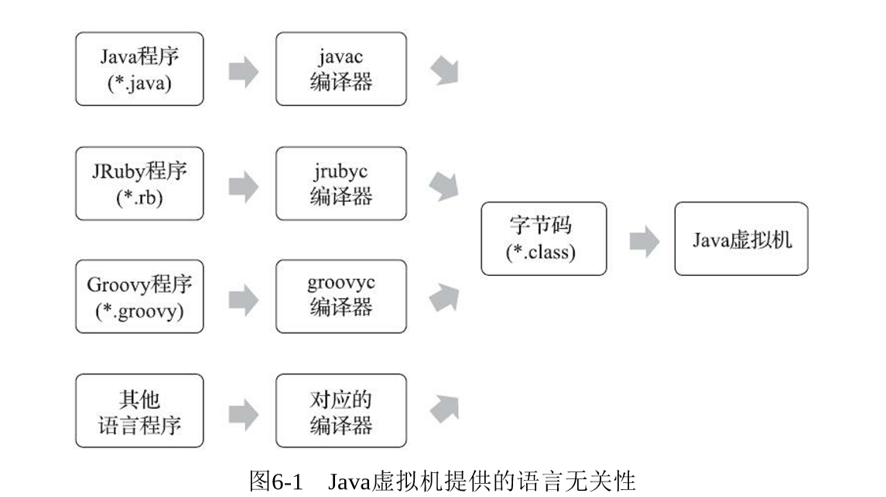

### 6.3　Class类文件的结构

解析Class文件的数据结构是本章的最主要内容。笔者曾经在前言中阐述过本书的写作风格：力求在保证逻辑准确的前提下，用尽量通俗的语言和案例去讲述虚拟机中与开发关系最为密切的内容。但是，对文件格式、结构方面的学习，有点类似于“读字典”，读者阅读本章时，大概会不可避免地感到比较枯燥，但这部分内容又是Java虚拟机的重要基础之一，是了解虚拟机的必经之路，如果想比较深入地学习虚拟机相关知识，这部分是无法回避的。

Java技术能够一直保持着非常良好的向后兼容性，Class文件结构的稳定功不可没，任何一门程序语言能够获得商业上的成功，都不可能去做升级版本后，旧版本编译的产品就不再能够运行这种事情。本章所讲述的关于Class文件结构的内容，绝大部分都是在第一版的《Java虚拟机规范》（1997年发布，对应于JDK 1.2时代的Java虚拟机）中就已经定义好的，内容虽然古老，但时至今日，Java发展经历了十余个大版本、无数小更新，那时定义的Class文件格式的各项细节几乎没有出现任何改变。尽管不同版本的《Java虚拟机规范》对Class文件格式进行了几次更新，但基本上只是在原有结构基础上新增内容、扩充功能，并未对已定义的内容做出修改。

**注意**任何一个Class文件都对应着唯一的一个类或接口的定义信息，但是反过来说，类或接口并不一定都得定义在文件里（譬如类或接口也可以动态生成，直接送入类加载器中）。本章中，笔者只是通俗地将任意一个有效的类或接口所应当满足的格式称为“Class文件格式”，实际上它完全不需要以磁盘文件的形式存在。

Class文件是一组以8个字节为基础单位的二进制流，各个数据项目严格按照顺序紧凑地排列在文件之中，中间没有添加任何分隔符，这使得整个Class文件中存储的内容几乎全部是程序运行的必要数据，没有空隙存在。当遇到需要占用8个字节以上空间的数据项时，则会按照高位在前的方式分割成若干个8个字节进行存储。

根据《Java虚拟机规范》的规定，Class文件格式采用一种类似于C 语言结构体的伪结构来存储数据，这种伪结构中只有两种数据类
型：“无符号数”和“表”。后面的解析都要以这两种数据类型为基础，所以这里笔者必须先解释清楚这两个概念。

- 无符号数属于基本的数据类型，以u1、u2、u4、u8来分别代表1个 字节、2个字节、4个字节和8个字节的无符号数，无符号数可以用来描述数字、索引引用、数量值或者按照UTF-8编码构成字符串值。
- 表是由多个无符号数或者其他表作为数据项构成的复合数据类型，为了便于区分，所有表的命名都习惯性地以“_info”结尾。表用于描述有层次关系的复合结构的数据，整个Class文件本质上也可以视作是一张表，这张表由表6-1所示的数据项按严格顺序排列构成。

表6-1　Class文件格式

| **类型**       | **名称**            | **数量**                |
| -------------- | ------------------- | ----------------------- |
| u4             | magic               | 1                       |
| u2             | minor_version       | 1                       |
| u2             | major_version       | 1                       |
| u2             | constant_pool_count | 1                       |
| cp_info        | constant_pool       | constant_pool_count - 1 |
| u2             | access_flags        | 1                       |
| u2             | this_class          | 1                       |
| u2             | super_class         | 1                       |
| u2             | interfaces_count    | 1                       |
| u2             | interfaces          | interfaces_count        |
| u2             | fields_count        | 1                       |
| field_info     | fields              | fields_count            |
| u2             | methods_count       | 1                       |
| method_info    | methods             | methods_count           |
| u2             | attribute_count     | 1                       |
| attribute_info | attributes          | attributes_count        |

本节结束之前，笔者需要再强调一次，Class的结构不像XML等描述语言，由于它没有任何分隔符号，所以在表6-1中的数据项，无论是顺序还是数量，甚至于数据存储的字节序（Byte Ordering，Class文件中字节序为Big-Endian）这样的细节，都是被严格限定的，哪个字节代表什么含义，长度是多少，先后顺序如何，全部都不允许改变。接下来，我们将一起看看这个表中各个数据项的具体含义。

#### 魔数与Class文件的版本

每个Class文件的头4个字节被称为魔数（Magic Number），它的唯一作用是确定这个文件是否为一个能被虚拟机接受的Class文件。不仅是Class文件，很多文件格式标准中都有使用魔数来进行身份识别的习惯，譬如图片格式，如GIF或者JPEG等在文件头中都存有魔数。使用魔数而不是扩展名来进行识别主要是基于安全考虑，因为文件扩展名可以随意改动。文件格式的制定者可以自由地选择魔数值，只要这个魔数值还没有被广泛采用过而且不会引起混淆。Class文件的魔数取得很有“浪漫气息”，值为0xCAFEBABE（咖啡宝贝？）。这个魔数值在Java还被称 作“Oak”语言的时候（大约是1991年前后）就已经确定下来了。它还有一段很有趣的历史，据Java开发小组最初的关键成员Patrick Naughton所 说：“我们一直在寻找一些好玩的、容易记忆的东西，选择0xCAFEBABE是因为它象征着著名咖啡品牌Peet’s Coffee深受欢迎的Baristas咖啡。”这个魔数似乎也预示着日后“Java”这个商标名称的出现。

紧接着魔数的4个字节存储的是Class文件的版本号：第5和第6个字节是次版本号（Minor Version），第7和第8个字节是主版本号（Major Version）。Java的版本号是从45开始的，JDK 1.1之后的每个JDK大版本发布主版本号向上加1（JDK 1.0～1.1使用了45.0～45.3的版本号），**高版本的JDK能向下兼容以前版本的Class文件，但不能运行以后版本的Class文件，因为《Java虚拟机规范》在Class文件校验部分明确要求了即使文件格式并未发生任何变化，虚拟机也必须拒绝执行超过其版本号的Class文件**。

例如，JDK 1.1能支持版本号为45.0～45.65535的Class文件，无法执行版本号为46.0以上的Class文件，而JDK 1.2则能支持45.0～46.65535的Class文件。目前最新的JDK版本为13，可生成的Class文件主版本号最大值为57.0。

代码清单6-1　简单的Java代码

```java
public class TestClass {

	private int m;
	
	public int inc() {
		return m + 1;
	}
	
}
```

图6-2显示的是使用十六进制编辑器WinHex打开这个Class文件的结 果，可以清楚地看见开头4个字节的十六进制表示是0xCAFEBABE，代 表次版本号的第5个和第6个字节值为0x0000，而主版本号的值为0x0032，也即是十进制的50，该版本号说明这个是可以被JDK 6或以上版本虚拟机执行的Class文件。

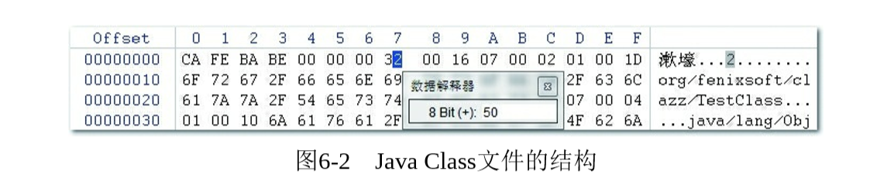

#### 常量池

紧接着主、次版本号之后的是常量池入口，常量池可以比喻为Class文件里的资源仓库，它是Class文件结构中与其他项目关联最多的数据，通常也是占用Class文件空间最大的数据项目之一，另外，它还是在Class文件中第一个出现的表类型数据项目。

由于常量池中常量的数量是不固定的，所以在常量池的入口需要放置一项u2类型的数据，代表常量池容量计数值（constant_pool_count）。与Java中语言习惯不同，这个容量计数是从1而不是0开始的，如图6-3所示，常量池容量（偏移地址：0x00000008）为十六进制数0x0016，即十进制的22，这就代表常量池中有21项常量， 索引值范围为1～21。在Class文件格式规范制定之时，设计者将第0项常量空出来是有特殊考虑的，这样做的目的在于，如果后面某些指向常量池的索引值的数据在特定情况下需要表达“不引用任何一个常量池项目”的含义，可以把索引值设置为0来表示。Class文件结构中只有常量池 的容量计数是从1开始，对于其他集合类型，包括接口索引集合、字段表集合、方法表集合等的容量计数都与一般习惯相同，是从0开始。


常量池中主要存放两大类常量：字面量（Literal）和符号引用 （Symbolic References）。字面量比较接近于Java语言层面的常量概念，如文本字符串、被声明为final的常量值等。而符号引用则属于编译原理方面的概念，主要包括下面几类常量：

- 被模块导出或者开放的包（Package） 
- 类和接口的全限定名（Fully Qualified Name）
- 字段的名称和描述符（Descriptor）
- 方法的名称和描述符
- 方法句柄和方法类型（Method Handle、Method Type、Invoke Dynamic）
- 动态调用点和动态常量（Dynamically-Computed Call Site、 Dynamically-Computed Constant）

Java代码在进行Javac编译的时候，并不像C和C++那样有“连接”这一步骤，而是在虚拟机加载Class文件的时候进行动态连接（具体见第7章）。也就是说，在Class文件中不会保存各个方法、字段最终在内存中的布局信息，这些字段、方法的符号引用不经过虚拟机在运行期转换的话是无法得到真正的内存入口地址，也就无法直接被虚拟机使用的。当虚拟机做类加载时，将会从常量池获得对应的符号引用，再在类创建时或运行时解析、翻译到具体的内存地址之中。关于类的创建和动态连接的内容，在下一章介绍虚拟机类加载过程时再详细讲解。

常量池中每一项常量都是一个表，最初常量表中共有11种结构各不相同的表结构数据，后来为了更好地支持动态语言调用，额外增加了4种动态语言相关的常量，为了支持Java模块化系统（Jigsaw），又加入了CONSTANT_Module_info和CONSTANT_Package_info两个常量， 所以截至JDK 13，常量表中分别有17种不同类型的常量。

## 第7章　虚拟机类加载机制

代码编译的结果从本地机器码转变为字节码，是存储格式发展的一小步，却是编程语言发展的一大步。

### 7.1　概述

上一章我们学习了Class文件存储格式的具体细节，在Class文件中描述的各类信息，最终都需要加载到虚拟机中之后才能被运行和使用。而虚拟机如何加载这些Class文件，Class文件中的信息进入到虚拟机后会发生什么变化，这些都是本章将要讲解的内容。

Java虚拟机把描述类的数据从Class文件加载到内存，并对数据进行校验、转换解析和初始化，最终形成可以被虚拟机直接使用的Java类型，这个过程被称作虚拟机的类加载机制。与那些在编译时需要进行连接的语言不同，在Java语言里面，类型的加载、连接和初始化过程都是在程序运行期间完成的，这种策略让Java语言进行提前编译会面临额外的困难，也会让类加载时稍微增加一些性能开销，但是却为Java应用提供了极高的扩展性和灵活性，Java天生可以动态扩展的语言特性就是依赖运行期动态加载和动态连接这个特点实现的。例如，编写一个面向接口的应用程序，可以等到运行时再指定其实际的实现类，用户可以通过Java预置的或自定义类加载器，让某个本地的应用程序在运行时从网络或其他地方上加载一个二进制流作为其程序代码的一部分。这种动态组装应用的方式目前已广泛应用于Java程序之中，从最基础的Applet、JSP到相对复杂的OSGi技术，都依赖着Java语言运行期类加载才得以诞生。

为了避免语言表达中可能产生的偏差，在正式开始本章以前，笔者先设立两个语言上的约定：

第一，在实际情况中，每个Class文件都有代表着Java语言中的一个类或接口的可能，后文中直接对“类型”的描述都同时蕴含着类和接口的 可能性，而需要对类和接口分开描述的场景，笔者会特别指明；

第二，与前面介绍Class文件格式时的约定一致，本章所提到的“Class文件”也并非特指某个存在于具体磁盘中的文件，而应当是一串二进制字节流，无论其以何种形式存在，包括但不限于磁盘文件、网络、数据库、内存或者动态产生等。

### 7.2　类加载的时机

一个类型从被加载到虚拟机内存中开始，到卸载出内存为止，它的整个生命周期将会经历加载（Loading）、验证（Verification）、准备 （Preparation）、解析（Resolution）、初始化（Initialization）、使用 （Using）和卸载（Unloading）七个阶段，其中验证、准备、解析三个部分统称为连接（Linking）。这七个阶段的发生顺序如图7-1所示。

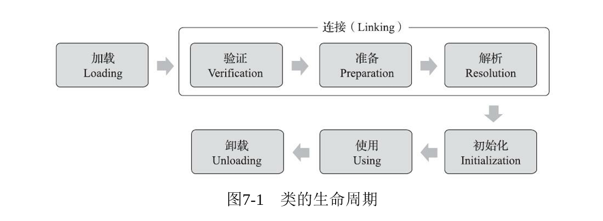

图7-1中，加载、验证、准备、初始化和卸载这五个阶段的顺序是确定的，类型的加载过程必须按照这种顺序按部就班地开始，而解析阶段则不一定：它在某些情况下可以在初始化阶段之后再开始，这是为了支持Java语言的运行时绑定特性（也称为动态绑定或晚期绑定）。请注意，这里笔者写的是按部就班地“开始”，而不是按部就班地“进行”或按部就班地“完成”，强调这点是因为这些阶段通常都是互相交叉地混合进行的，会在一个阶段执行的过程中调用、激活另一个阶段。

关于在什么情况下需要开始类加载过程的第一个阶段“加载”， 《Java虚拟机规范》中并没有进行强制约束，这点可以交给虚拟机的具体实现来自由把握。**但是对于初始化阶段，《Java虚拟机规范》则是严格规定了有且只有六种情况必须立即对类进行“初始化”（而加载、验证、准备自然需要在此之前开始）：**

1. 遇到new、getstatic、putstatic或invokestatic这四条字节码指令时，如果类型没有进行过初始化，则需要先触发其初始化阶段。能够生 成这四条指令的典型Java代码场景有：

   - 使用new关键字实例化对象的时候。
   - 读取或设置一个类型的静态字段（被final修饰、已在编译期把结果放入常量池的静态字段除外）的时候。
   - 调用一个类型的静态方法的时候。
2. 使用java.lang.reflect包的方法对类型进行反射调用的时候，如果类型没有进行过初始化，则需要先触发其初始化。
3. 当初始化类的时候，如果发现其父类还没有进行过初始化，则需要先触发其父类的初始化。
4. 当虚拟机启动时，用户需要指定一个要执行的主类（包含main() 方法的那个类），虚拟机会先初始化这个主类。
5. 当使用JDK 7新加入的动态语言支持时，如果一个java.lang.invoke.MethodHandle实例最后的解析结果为REF_getStatic、 REF_putStatic、REF_invokeStatic、REF_newInvokeSpecial四种类型的方法句柄，并且这个方法句柄对应的类没有进行过初始化，则需要先触发其初始化。
6. 当一个接口中定义了JDK 8新加入的默认方法（被default关键字修饰的接口方法）时，如果有这个接口的实现类发生了初始化，那该接口要在其之前被初始化。

对于这六种会触发类型进行初始化的场景，《Java虚拟机规范》中使用了一个非常强烈的限定语——“有且只有”，这六种场景中的行为称为对一个类型进行主动引用。除此之外，所有引用类型的方式都不会触发初始化，称为被动引用。下面举三个例子来说明何为被动引用，分别见代码清单7-1、代码清单7-2和代码清单7-3。

代码清单7-1　被动引用的例子之一

```java
package org.fenixsoft.classloading;

/** 
 * 被动使用类字段演示一：
 * 通过子类引用父类的静态字段，不会导致子类初始化
 **/
public class SuperClass {
    static {        
        System.out.println("SuperClass init!");    
    }
    public static int value = 123; 
}

public class SubClass extends SuperClass {
    static {        
        System.out.println("SubClass init!");    
    } 
}

/** 
 * 非主动使用类字段演示
 * 在Hotspot虚拟机中加入-XX:+TraceClassLoading参数会打印出：
 *      [Loaded org.fenixsoft.classloading.SuperClass 。。。
 *      [Loaded org.fenixsoft.classloading.SubClass 。。。
 *
 *  请注意打印出Loaded了该类并不代表初始化了该类！！！Loaded该类仅仅是表明JVM加载了该类，并不代表要初始化该类！！！
 **/ 
public class NotInitialization {
    public static void main(String[] args) {    
        System.out.println(SubClass.value);    
    }
}
```

**上述代码运行之后，只会输出“SuperClass init！”，而不会输出“SubClass init”。对于静态字段，只有直接定义这个字段的类才会被初始化，因此通过其子类来引用父类中定义的静态字段，只会触发父类的初始化而不会触发子类的初始化。至于是否要触发子类的加载和验证阶段，在《Java虚拟机规范》中并未明确规定，所以这点取决于虚拟机的具体实现。对于HotSpot虚拟机来说，可通过-XX:+TraceClassLoading参数观察到此操作是会导致子类加载的。**

代码清单7-2　被动引用的例子之二

```java
package org.fenixsoft.classloading;
/** 
 * 被动使用类字段演示二： 
 * 通过数组定义来引用类，不会触发此类的初始化 
 **/ 
public class NotInitialization {
    public static void main(String[] args) {        
        SuperClass[] sca = new SuperClass[10];    
    }
}
```

为了节省版面，这段代码复用了代码清单7-1中的SuperClass，运行之后发现没有输出“SuperClass init！”，说明并没有触发类org.fenixsoft.classloading.SuperClass的初始化阶段。但是这段代码里面触发了另一个名为“[Lorg.fenixsoft.classloading.SuperClass”的类的初始化阶段，对于用户代码来说，这并不是一个合法的类型名称，它是一个由虚拟机自动生成的、直接继承于java.lang.Object的子类，创建动作由字节码指令newarray触发。

这个类代表了一个元素类型为org.fenixsoft.classloading.SuperClass的一维数组，数组中应有的属性和方法（用户可直接使用的只有被修饰为public的length属性和clone()方法）都实现在这个类里。Java语言中对数组的访问要比C/C++相对安全，很大程度上就是因为这个类包装了数组元素的访问，而C/C++中则是直接翻译为对数组指针的移动。在Java语言里，当检查到发生数组越界时会抛出java.lang.ArrayIndexOutOfBoundsException异常，避免了直接造成非法内存访问。

代码清单7-3　被动引用的例子之三

```java
package org.fenixsoft.classloading;

/** 
 * 被动使用类字段演示三： 
 * 常量在编译阶段会存入调用类的常量池中，本质上没有直接引用到定义常量的类，因此不会触发定义常量的类的初始化 
 **/ 
public class ConstClass {
    static {        
        System.out.println("ConstClass init!");    
    }
    
    public static final String HELLOWORLD = "hello world"; 
    
}

/** 
 * 非主动使用类字段演示 
 **/ 
public class NotInitialization {
    public static void main(String[] args) {        
        System.out.println(ConstClass.HELLOWORLD);    
    } 
}
```

上述代码运行之后，也没有输出“ConstClass init！”，这是因为虽然在Java源码中确实引用了ConstClass类的常量HELLOWORLD，但其实 在编译阶段通过常量传播优化，已经将此常量的值“hello world”直接存储在NotInitialization类的常量池中，以后NotInitialization对常量 ConstClass.HELLOWORLD的引用，实际都被转化为NotInitialization类对自身常量池的引用了。也就是说，实际上NotInitialization的Class文件之中并没有ConstClass类的符号引用入口，这两个类在编译成Class文件后就已不存在任何联系了。

接口的加载过程与类加载过程稍有不同，针对接口需要做一些特殊说明：接口也有初始化过程，这点与类是一致的，上面的代码都是用静态语句块“static{}”来输出初始化信息的，而接口中不能使用“static{}”语句块，但编译器仍然会为接口生成“<clinit>()”类构造器，用于初始化接口中所定义的成员变量。接口与类真正有所区别的是前面讲述的六种“有且仅有”需要触发初始化场景中的第三种：当一个类在初始化时，要求其父类全部都已经初始化过了，但是一个接口在初始化时，并不要求其父接口全部都完成了初始化，只有在真正使用到父接口的时候（如引用接口中定义的常量）才会初始化。

### 7.3　类加载的过程

接下来我们会详细了解Java虚拟机中类加载的全过程，即加载、验证、准备、解析和初始化这五个阶段所执行的具体动作。

#### 加载

“加载”（Loading）阶段是整个“类加载”（Class Loading）过程中的一个阶段，希望读者没有混淆这两个看起来很相似的名词。在加载阶段，Java虚拟机需要完成以下三件事情：

1. 通过一个类的全限定名来获取定义此类的二进制字节流。
2. 将这个字节流所代表的静态存储结构转化为方法区的运行时数据结构。
3. 在内存中生成一个代表这个类的java.lang.Class对象，作为方法区这个类的各种数据的访问入口。

《Java虚拟机规范》对这三点要求其实并不是特别具体，留给虚拟机实现与Java应用的灵活度都是相当大的。例如“通过一个类的全限定名来获取定义此类的二进制字节流”这条规则，它并没有指明二进制字节流必须得从某个Class文件中获取，确切地说是根本没有指明要从哪里获取、如何获取。仅仅这一点空隙，Java虚拟机的使用者们就可以在加载阶段搭构建出一个相当开放广阔的舞台，Java发展历程中，充满创造力的开发人员则在这个舞台上玩出了各种花样，许多举足轻重的Java技术都建立在这一基础之上，例如：

- 从ZIP压缩包中读取，这很常见，最终成为日后JAR、EAR、WAR格式的基础。
- 从网络中获取，这种场景最典型的应用就是Web Applet。
- 运行时计算生成，这种场景使用得最多的就是动态代理技术，在 java.lang.reflect.Proxy中，就是用了ProxyGenerator.generateProxyClass() 来为特定接口生成形式为“*$Proxy”的代理类的二进制字节流。 
- 由其他文件生成，典型场景是JSP应用，由JSP文件生成对应的Class文件。
- 从数据库中读取，这种场景相对少见些，例如有些中间件服务器（如SAP Netweaver）可以选择把程序安装到数据库中来完成程序代码在集群间的分发。
- 可以从加密文件中获取，这是典型的防Class文件被反编译的保护措施，通过加载时解密Class文件来保障程序运行逻辑不被窥探。
- 等等。。。

相对于类加载过程的其他阶段，非数组类型的加载阶段（准确地说，是加载阶段中获取类的二进制字节流的动作）是开发人员可控性最强的阶段。加载阶段既可以使用Java虚拟机里内置的引导类加载器来完成，也可以由用户自定义的类加载器去完成，开发人员通过定义自己的类加载器去控制字节流的获取方式（重写一个类加载器的findClass()或loadClass()方法），实现根据自己的想法来赋予应用程序获取运行代码的动态性。

**对于数组类而言，情况就有所不同，数组类本身不通过类加载器创建，它是由Java虚拟机直接在内存中动态构造出来的。但数组类与类加 载器仍然有很密切的关系，因为数组类的元素类型（Element Type，指的是数组去掉所有维度的类型）最终还是要靠类加载器来完成加载，一个数组类（下面简称为C）创建过程遵循以下规则：**

- 如果数组的组件类型（Component Type，指的是数组去掉一个维度的类型，注意和前面的元素类型区分开来）是引用类型，那就递归采用本节中定义的加载过程去加载这个组件类型，数组C将被标识在加载该组件类型的类加载器的类名称空间上（这点很重要，在7.4节会介绍，一个类型必须与类加载器一起确定唯一性）。
- 如果数组的组件类型不是引用类型（例如int[]数组的组件类型为 int），Java虚拟机将会把数组C标记为与引导类加载器关联。
- 数组类的可访问性与它的组件类型的可访问性一致，如果组件类型不是引用类型，它的数组类的可访问性将默认为public，可被所有的类和接口访问到。

加载阶段结束后，Java虚拟机外部的二进制字节流就按照虚拟机所设定的格式存储在方法区之中了，方法区中的数据存储格式完全由虚拟 机实现自行定义，《Java虚拟机规范》未规定此区域的具体数据结构。类型数据妥善安置在方法区之后，会在Java堆内存中实例化一个java.lang.Class类的对象，这个对象将作为程序访问方法区中的类型数据的外部接口。

**加载阶段与连接阶段的部分动作（如一部分字节码文件格式验证动作）是交叉进行的，加载阶段尚未完成，连接阶段可能已经开始，但这 些夹在加载阶段之中进行的动作，仍然属于连接阶段的一部分，这两个阶段的开始时间仍然保持着固定的先后顺序。**

#### 验证

验证是连接阶段的第一步，这一阶段的目的是确保Class文件的字节流中包含的信息符合《Java虚拟机规范》的全部约束要求，保证这些信息被当作代码运行后不会危害虚拟机自身的安全。

Java语言本身是相对安全的编程语言（起码对于C/C++来说是相对安全的），使用纯粹的Java代码无法做到诸如访问数组边界以外的数据、将一个对象转型为它并未实现的类型、跳转到不存在的代码行之类的事情，如果尝试这样去做了，编译器会毫不留情地抛出异常、拒绝编译。但前面也曾说过，Class文件并不一定只能由Java源码编译而来，它可以使用包括靠键盘0和1直接在二进制编辑器中敲出Class文件在内的任何途径产生。上述Java代码无法做到的事情在字节码层面上都是可以实现的，至少语义上是可以表达出来的。Java虚拟机如果不检查输入的字节流，对其完全信任的话，很可能会因为载入了有错误或有恶意企图的字节码流而导致整个系统受攻击甚至崩溃，所以验证字节码是Java虚拟机保护自身的一项必要措施。

验证阶段是非常重要的，这个阶段是否严谨，直接决定了Java虚拟机是否能承受恶意代码的攻击，从代码量和耗费的执行性能的角度上讲，验证阶段的工作量在虚拟机的类加载过程中占了相当大的比重。但是《Java虚拟机规范》的早期版本（第1、2版）对这个阶段的检验指导是相当模糊和笼统的，规范中仅列举了一些对Class文件格式的静态和结构化的约束，要求虚拟机验证到输入的字节流如不符合Class文件格式的约束，就应当抛出一个java.lang.VerifyError异常或其子类异常，但具体应当检查哪些内容、如何检查、何时进行检查等，都没有足够具体的要求和明确的说明。直到2011年《Java虚拟机规范（Java SE 7版）》出版，规范中大幅增加了验证过程的描述（篇幅从不到10页增加到130 页），这时验证阶段的约束和验证规则才变得具体起来。受篇幅所限，本书中无法逐条规则去讲解，但从整体上看，**验证阶段大致上会完成下面四个阶段的检验动作：文件格式验证、元数据验证、字节码验证和符号引用验证。**

**1.文件格式验证**

第一阶段要验证字节流是否符合Class文件格式的规范，并且能被当前版本的虚拟机处理。这一阶段可能包括下面这些验证点：

- 是否以魔数0xCAFEBABE开头。
- 主、次版本号是否在当前Java虚拟机接受范围之内。
- 常量池的常量中是否有不被支持的常量类型（检查常量tag标志）。
- 指向常量的各种索引值中是否有指向不存在的常量或不符合类型的常量。
- CONSTANT_Utf8_info型的常量中是否有不符合UTF-8编码的数据。
- Class文件中各个部分及文件本身是否有被删除的或附加的其他信息。
- 等等。。。

实际上第一阶段的验证点还远不止这些，上面所列的只是从HotSpot虚拟机源码[1]中摘抄的一小部分内容，该验证阶段的主要目的是保证输入的字节流能正确地解析并存储于方法区之内，格式上符合描述一个Java类型信息的要求。这阶段的验证是基于二进制字节流进行的只有通过了这个阶段的验证之后，这段字节流才被允许进入Java虚拟机内存的方法区中进行存储，所以后面的三个验证阶段全部是基于方法区的存储结构上进行的，不会再直接读取、操作字节流了。

**2.元数据验证**

第二阶段是对字节码描述的信息进行语义分析，以保证其描述的信息符合《Java语言规范》的要求，这个阶段可能包括的验证点如下：

- 这个类是否有父类（除了java.lang.Object之外，所有的类都应当有父类）。
- 这个类的父类是否继承了不允许被继承的类（被final修饰的类）。
- 如果这个类不是抽象类，是否实现了其父类或接口之中要求实现的所有方法。
- 类中的字段、方法是否与父类产生矛盾（例如覆盖了父类的final字段，或者出现不符合规则的方法重载，例如方法参数都一致，但返回值类型却不同等）。
- 等等。。。

第二阶段的主要目的是对类的元数据信息进行语义校验，保证不存在与《Java语言规范》定义相悖的元数据信息。

**3.字节码验证**

第三阶段是整个验证过程中最复杂的一个阶段，主要目的是通过数据流分析和控制流分析，确定程序语义是合法的、符合逻辑的。在第二阶段对元数据信息中的数据类型校验完毕以后，这阶段就要对类的方法体（Class文件中的Code属性）进行校验分析，保证被校验类的方法在运行时不会做出危害虚拟机安全的行为，例如：

- 保证任意时刻操作数栈的数据类型与指令代码序列都能配合工作，例如不会出现类似于“在操作栈放置了一个int类型的数据，使用时却按long类型来加载入本地变量表中”这样的情况。
- 保证任何跳转指令都不会跳转到方法体以外的字节码指令上。
- 保证方法体中的类型转换总是有效的，例如可以把一个子类对象赋值给父类数据类型，这是安全的，但是把父类对象赋值给子类数据类型，甚至把对象赋值给与它毫无继承关系、完全不相干的一个数据类型，则是危险和不合法的。
- 等等。。。

如果一个类型中有方法体的字节码没有通过字节码验证，那它肯定是有问题的；但如果一个方法体通过了字节码验证，也仍然不能保证它 一定就是安全的。即使字节码验证阶段中进行了再大量、再严密的检查，也依然不能保证这一点。这里涉及了离散数学中一个很著名的问题——“停机问题”（Halting Problem），即不能通过程序准确地检查出程序是否能在有限的时间之内结束运行。在我们讨论字节码校验的上下文语境里，通俗一点的解释是通过程序去校验程序逻辑是无法做到绝对 准确的，不可能用程序来准确判定一段程序是否存在Bug。

由于数据流分析和控制流分析的高度复杂性，Java虚拟机的设计团队为了避免过多的执行时间消耗在字节码验证阶段中，在JDK 6之后的Javac编译器和Java虚拟机里进行了一项联合优化，把尽可能多的校验辅助措施挪到Javac编译器里进行。具体做法是给方法体Code属性的属性表中新增加了一项名为“StackMapTable”的新属性，这项属性描述了方法体所有的基本块（Basic Block，指按照控制流拆分的代码块）开始时本地变量表和操作栈应有的状态，在字节码验证期间，Java虚拟机就不需要根据程序推导这些状态的合法性，只需要检查StackMapTable属性中的记录是否合法即可。这样就将字节码验证的类型推导转变为类型检查，从而节省了大量校验时间。理论上StackMapTable属性也存在错误或被篡改的可能，所以是否有可能在恶意篡改了Code属性的同时，也生成相应的StackMapTable属性来骗过虚拟机的类型校验，则是虚拟机设计者们需要仔细思考的问题。

JDK 6的HotSpot虚拟机中提供了-XX:-UseSplitVerifier选项来关闭 掉这项优化，或者使用参数-XX:+FailOverToOldVerifier要求在类型校验失败的时候退回到旧的类型推导方式进行校验。而到了JDK 7之后，尽管虚拟机中仍然保留着类型推导验证器的代码，但是对于主版本号大于50（对应JDK 6）的Class文件，使用类型检查来完成数据流分析校验则是唯一的选择，不允许再退回到原来的类型推导的校验方式。

**4.符号引用验证**

最后一个阶段的校验行为发生在虚拟机将符号引用转化为直接引用的时候，这个转化动作将在连接的第三阶段——解析阶段中发生。符号引用验证可以看作是对类自身以外（常量池中的各种符号引用）的各类信息进行匹配性校验，通俗来说就是，该类是否缺少或者被禁止访问它依赖的某些外部类、方法、字段等资源。本阶段通常需要校验下列内容：

- 符号引用中通过字符串描述的全限定名是否能找到对应的类。
- 在指定类中是否存在符合方法的字段描述符及简单名称所描述的方法和字段。
- 符号引用中的类、字段、方法的可访问性（private、protected、 public、<package>）是否可被当前类访问。
- 等等。。。

符号引用验证的主要目的是确保解析行为能正常执行，如果无法通过符号引用验证，Java虚拟机将会抛出一个java.lang.IncompatibleClassChangeError的子类异常，典型的如： java.lang.IllegalAccessError、java.lang.NoSuchFieldError、 java.lang.NoSuchMethodError等。

验证阶段对于虚拟机的类加载机制来说，是一个非常重要的、但却不是必须要执行的阶段，因为验证阶段只有通过或者不通过的差别，只 要通过了验证，其后就对程序运行期没有任何影响了。如果程序运行的全部代码（包括自己编写的、第三方包中的、从外部加载的、动态生成的等所有代码）都已经被反复使用和验证过，在生产环境的实施阶段就可以考虑使用-Xverify:none参数来关闭大部分的类验证措施，以缩短虚拟机类加载的时间。

#### 准备

准备阶段是正式为类中定义的变量（即静态变量，被static修饰的变量）分配内存并设置类变量初始值的阶段，从概念上讲，这些变量所使用的内存都应当在方法区中进行分配，但必须注意到方法区本身是一个逻辑上的区域，在JDK 7及之前，HotSpot使用永久代来实现方法区时，实现是完全符合这种逻辑概念的；而在JDK 8及之后，类变量则会随着Class对象一起存放在Java堆中，这时候“类变量在方法区”就完全是一种对逻辑概念的表述了，关于这部分内容，笔者已在4.3.1节介绍并且验证过。

关于准备阶段，还有两个容易产生混淆的概念笔者需要着重强调，首先是这时候进行内存分配的仅包括类变量，而不包括实例变量，实例变量将会在对象实例化时随着对象一起分配在Java堆中。其次是这里所说的初始值“通常情况”下是数据类型的零值，假设一个类变量的定义为：
```java
public static int value = 123;
```

那变量value在准备阶段过后的初始值为0而不是123，因为这时尚未开始执行任何Java方法，而把value赋值为123的putstatic指令是程序被编译后，存放于类构造器<clinit>()方法之中，所以把value赋值为123的动作要到类的初始化阶段才会被执行。表7-1列出了Java中所有基本数据类型的零值。

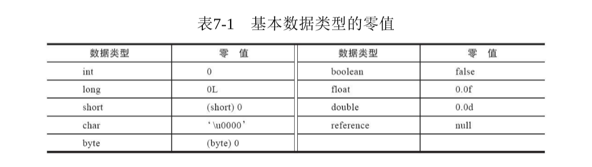

上面提到在“通常情况”下初始值是零值，那言外之意是相对的会有某些“特殊情况”：如果类字段的字段属性表中存在ConstantValue属性， 那在准备阶段变量值就会被初始化为ConstantValue属性所指定的初始值，假设上面类变量value的定义修改为：
```java
public static final int value = 123;
```

编译时Javac将会为value生成ConstantValue属性，在准备阶段虚拟机就会根据ConstantValue的设置将value赋值为123。**也就是说常量值在准备阶段就定下来了。**

#### 解析

解析阶段是Java虚拟机将常量池内的符号引用替换为直接引用的过程，符号引用在第6章讲解Class文件格式的时候已经出现过多次，在Class文件中它以CONSTANT_Class_info、CONSTANT_Fieldref_info、 CONSTANT_Methodref_info等类型的常量出现，那解析阶段中所说的直接引用与符号引用又有什么关联呢？

- 符号引用（Symbolic References）：符号引用以一组符号来描述所引用的目标，符号可以是任何形式的字面量，只要使用时能无歧义地定位到目标即可。符号引用与虚拟机实现的内存布局无关，引用的目标并不一定是已经加载到虚拟机内存当中的内容。各种虚拟机实现的内存布局可以各不相同，但是它们能接受的符号引用必须都是一致的，因为符号引用的字面量形式明确定义在《Java虚拟机规范》的Class文件格式中。
- 直接引用（Direct References）：直接引用是可以直接指向目标的指针、相对偏移量或者是一个能间接定位到目标的句柄。直接引用是和虚拟机实现的内存布局直接相关的，同一个符号引用在不同虚拟机实例上翻译出来的直接引用一般不会相同。如果有了直接引用，那引用的目标必定已经在虚拟机的内存中存在。

《Java虚拟机规范》之中并未规定解析阶段发生的具体时间，只要求了在执行anewarray、checkcast、getfield、getstatic、instanceof、 invokedynamic、invokeinterface、invokespecial、invokestatic、 invokevirtual、ldc、ldc_w、ldc2_w、multianewarray、new、putfield和putstatic这17个用于操作符号引用的字节码指令之前，先对它们所使用的符号引用进行解析。**所以虚拟机实现可以根据需要来自行判断，到底是在类被加载器加载时就对常量池中的符号引用进行解析，还是等到一个符号引用将要被使用前才去解析它。**

类似地，对方法或者字段的访问，也会在解析阶段中对它们的可访问性（public、protected、private、<package>）进行检查，至于其中的约束规则已经是Java语言的基本常识，笔者就不再赘述了。

对同一个符号引用进行多次解析请求是很常见的事情，除invokedynamic指令以外，虚拟机实现可以对第一次解析的结果进行缓存，譬如在运行时直接引用常量池中的记录，并把常量标识为已解析状态，从而避免解析动作重复进行。无论是否真正执行了多次解析动作， Java虚拟机都需要保证的是在同一个实体中，如果一个符号引用之前已经被成功解析过，那么后续的引用解析请求就应当一直能够成功；同样 地，如果第一次解析失败了，其他指令对这个符号的解析请求也应该收到相同的异常，哪怕这个请求的符号在后来已成功加载进Java虚拟机内存之中。

不过对于invokedynamic指令，上面的规则就不成立了。当碰到某个前面已经由invokedynamic指令触发过解析的符号引用时，并不意味着这个解析结果对于其他invokedynamic指令也同样生效。因为invokedynamic指令的目的本来就是用于动态语言支持，它对应的引用称为“动态调用点限定符（Dynamically-Computed Call Site Specifier）”， 这里“动态”的含义是指必须等到程序实际运行到这条指令时，解析动作才能进行。相对地，其余可触发解析的指令都是“静态”的，可以在刚刚完成加载阶段，还没有开始执行代码时就提前进行解析。

**解析动作主要针对类或接口、字段、类方法、接口方法、方法类型、方法句柄和调用点限定符这7类符号引用进行，分别对应于常量池的CONSTANT_Class_info、CONSTANT_Fieldref_info、 CONSTANT_Methodref_info、CONSTANT_InterfaceMethodref_info、 CONSTANT_MethodType_info、CONSTANT_MethodHandle_info、 CONSTANT_Dyna-mic_info和CONSTANT_InvokeDynamic_info 8种常量类型。**

#### 初始化

类的初始化阶段是类加载过程的最后一个步骤，之前介绍的几个类加载的动作里，除了在加载阶段用户应用程序可以通过自定义类加载器的方式局部参与外，其余动作都完全由Java虚拟机来主导控制。直到初始化阶段，Java虚拟机才真正开始执行类中编写的Java程序代码，将主导权移交给应用程序。

进行准备阶段时，变量已经赋过一次系统要求的初始零值，而在初始化阶段，则会根据程序员通过程序编码制定的主观计划去初始化类变量和其他资源。我们也可以从另外一种更直接的形式来表达：初始化阶段就是执行类构造器<clinit>()方法的过程。<clinit>()并不是程序员在 Java代码中直接编写的方法，它是Javac编译器的自动生成物，但我们非常有必要了解这个方法具体是如何产生的，以及<clinit>()方法执行过程中各种可能会影响程序运行行为的细节，这部分比起其他类加载过程更贴近于普通的程序开发人员的实际工作。

- **<clinit>()方法是由编译器自动收集类中的所有类变量的赋值动作和静态语句块（static{}块）中的语句合并产生的，编译器收集的顺序是由语句在源文件中出现的顺序决定的，静态语句块中只能访问到定义在静态语句块之前的变量，定义在它之后的变量，在前面的静态语句块可以赋值，但是不能访问**，如代码清单7-5所示。

  代码清单7-5　非法前向引用变量

  ```java
  public class Test {    
      static {        
          i = 0;  //  给变量复制可以正常编译通过        
          System.out.print(i);  // 这句编译器会提示“非法向前引用”    
      }    
      
      static int i = 1; 
  }
  ```
  
- <clinit>()方法与类的构造函数（即在虚拟机视角中的实例构造器 <init>()方法）不同，它不需要显式地调用父类构造器，Java虚拟机会保证在子类的<clinit>()方法执行前，父类的<clinit>()方法已经执行完毕。 因此在Java虚拟机中第一个被执行的<clinit>()方法的类型肯定是java.lang.Object。 

- 由于父类的<clinit>()方法先执行，也就意味着父类中定义的静态语句块要优先于子类的变量赋值操作，如代码清单7-6中，字段B的值将会是2而不是1。

  代码清单7-6　<clinit>()方法执行顺序

  ```java
  static class Parent {    
      public static int A = 1;    
      static {        
          A = 2;    
      } 
  }
  
  static class Sub extends Parent {    
      public static int B = A; 
  }
  
  public static void main(String[] args) {    
      System.out.println(Sub.B); 
  }
  ```

- <clinit>()方法对于类或接口来说并不是必需的，如果一个类中没有静态语句块，也没有对变量的赋值操作，那么编译器可以不为这个类生成<clinit>()方法。

- 接口中不能使用静态语句块，但仍然有变量初始化的赋值操作， 因此接口与类一样都会生成<clinit>()方法。但接口与类不同的是，执行接口的<clinit>()方法不需要先执行父接口的<clinit>()方法，因为只有当父接口中定义的变量被使用时，父接口才会被初始化。此外，接口的实现类在初始化时也一样不会执行接口的<clinit>()方法。

  **因为接口只能定义常量(public static final)，而常量是在准备阶段其值就定下来的，而且对其访问虚拟机也做了优化：即可以在接口类未执行类加载的情况下单独访问其上的常量。**

- Java虚拟机必须保证一个类的<clinit>()方法在多线程环境中被正确 地加锁同步，如果多个线程同时去初始化一个类，那么只会有其中一个 线程去执行这个类的<clinit>()方法，其他线程都需要阻塞等待，直到活 动线程执行完毕<clinit>()方法。如果在一个类的<clinit>()方法中有耗时 很长的操作，那就可能造成多个进程阻塞，在实际应用中这种阻塞往 往是很隐蔽的。代码清单7-7演示了这种场景。

  代码清单7-7　字段解析

  ```java
  static class DeadLoopClass {    
    static {        
          // 如果不加上这个if语句，编译器将提示“Initializer does not complete normally”           并拒绝编译        		if (true) {            
        	System.out.println(Thread.currentThread() + "init DeadLoopClass");            
          	while (true) {            
              }        
         }    
      } 
  }
  
  public static void main(String[] args) {    
      Runnable script = new Runnable() {        
          public void run() {            
              System.out.println(Thread.currentThread() + "start");            
              DeadLoopClass dlc = new DeadLoopClass();            
              System.out.println(Thread.currentThread() + " run over");        
          }    
      };
    	Thread thread1 = new Thread(script);    
      Thread thread2 = new Thread(script);    
      thread1.start();    
      thread2.start(); 
  }
  ```

  运行结果如下，一条线程在死循环以模拟长时间操作，另外一条线 程在阻塞等待：

  ```java
  Thread[Thread-0,5,main]start 
  Thread[Thread-1,5,main]start 
  Thread[Thread-0,5,main]init DeadLoopClass
  ```

  需要注意，其他线程虽然会被阻塞，但如果执行＜clinit＞()方法的那条线程退出＜clinit＞()方法后，其他线程唤醒后则不会再次进入＜clinit ＞()方法。同一个类加载器下，一个类型只会被初始化一次。

### 7.4　类加载器

Java虚拟机设计团队有意把类加载阶段中的“通过一个类的全限定名来获取描述该类的二进制字节流”这个动作放到Java虚拟机外部去实 现，以便让应用程序自己决定如何去获取所需的类。实现这个动作的代码被称为“类加载器”（Class Loader）。

类加载器可以说是Java语言的一项创新，它是早期Java语言能够快速流行的重要原因之一。类加载器最初是为了满足Java Applet的需求而 设计出来的，在今天用在浏览器上的Java Applet技术基本上已经被淘汰，但类加载器却在类层次划分、OSGi、程序热部署、代码加密等领域大放异彩，成为Java技术体系中一块重要的基石，可谓是失之桑榆，收之东隅。

#### 类与类加载器

类加载器虽然只用于实现类的加载动作，但它在Java程序中起到的作用却远超类加载阶段。对于任意一个类，都必须由加载它的类加载器 和这个类本身一起共同确立其在Java虚拟机中的唯一性，每一个类加载器，都拥有一个独立的类名称空间。**这句话可以表达得更通俗一些：比较两个类是否“相等”，只有在这两个类是由同一个类加载器加载的前提下才有意义，否则，即使这两个类来源于同一个Class文件，被同一个Java虚拟机加载，只要加载它们的类加载器不同，那这两个类就必定不相等。**

这里所指的“相等”，包括代表类的Class对象的equals()方法、isAssignableFrom()方法、isInstance()方法的返回结果，也包括了使用instanceof关键字做对象所属关系判定等各种情况。如果没有注意到类加载器的影响，在某些情况下可能会产生具有迷惑性的结果，代码清单78中演示了不同的类加载器对instanceof关键字运算的结果的影响。

代码清单7-8　不同的类加载器对instanceof关键字运算的结果的影响

```java
/** 
 * 类加载器与instanceof关键字演示 
 * 
 * @author zzm 
 */ 
public class ClassLoaderTest {
    public static void main(String[] args) throws Exception {
        ClassLoader myLoader = new ClassLoader() {            @Override            
            public Class<?> loadClass(String name) throws ClassNotFoundException {                
                try {                    
                    String fileName = name.substring(name.lastIndexOf(".") + 1)+".class";                    					 InputStream is = getClass().getResourceAsStream(fileName);                    
                    if (is == null) {                        
                        return super.loadClass(name);                    
                    }                    
                    byte[] b = new byte[is.available()];                    
                    is.read(b);                    
                    return defineClass(name, b, 0, b.length);                
                } catch (IOException e) {                    
                    throw new ClassNotFoundException(name);
                }            
            }        
        };
        Object obj = myLoader.loadClass("org.fenixsoft.classloading.ClassLoaderTest").newInstance();
        System.out.println(obj.getClass());        
        System.out.println(obj instanceof org.fenixsoft.classloading.ClassLoaderTest);    
    } 
}
```

运行结果：

```java
class org.fenixsoft.classloading.ClassLoaderTest 
false
```

代码清单7-8中构造了一个简单的类加载器，尽管它极为简陋，但是对于这个演示来说已经足够。它可以加载与自己在同一路径下的Class文件，我们使用这个类加载器去加载了一个名 为“org.fenixsoft.classloading.ClassLoaderTest”的类，并实例化了这个类的对象。

两行输出结果中，从第一行可以看到这个对象确实是类org.fenixsoft.classloading.ClassLoaderTest实例化出来的，但在第二行的输出中却发现这个对象与类org.fenixsoft.classloading.ClassLoaderTest做所属类型检查的时候返回了false。这是因为Java虚拟机中同时存在了两个ClassLoaderTest类，一个是由虚拟机的应用程序类加载器所加载的，另外一个是由我们自定义的类加载器加载的，虽然它们都来自同一个Class文件，但在Java虚拟机中仍然是两个互相独立的类，做对象所属类型检查时的结果自然为false。

#### 双亲委派模型

**首先这个翻译不是很专业，应该叫委派模型或父委派模型，请不要理解成"委派给父母"什么的...**

站在Java虚拟机的角度来看，只存在两种不同的类加载器：一种是启动类加载器（Bootstrap ClassLoader），这个类加载器使用C++语言实现，是虚拟机自身的一部分；另外一种就是其他所有的类加载器，这些类加载器都由Java语言实现，独立存在于虚拟机外部，并且全都继承自抽象类java.lang.ClassLoader。

站在Java开发人员的角度来看，类加载器就应当划分得更细致一些。自JDK 1.2以来，Java一直保持着三层类加载器、双亲委派的类加载架构，尽管这套架构在Java模块化系统出现后有了一些调整变动，但依然未改变其主体结构，我们将在7.5节中专门讨论模块化系统下的类加载器。

本节内容将针对JDK 8及之前版本的Java来介绍什么是三层类加载器，以及什么是双亲委派模型。对于这个时期的Java应用，绝大多数Java程序都会使用到以下3个系统提供的类加载器来进行加载。

- **启动类加载器（Bootstrap ClassLoader）**：前面已经介绍过，这个类加载器负责加载存放在<JAVA_HOME>\lib目录，或者被Xbootclasspath参数所指定的路径中存放的，而且是Java虚拟机能够识别的（按照文件名识别，如rt.jar、tools.jar，名字不符合的类库即使放在lib目录中也不会被加载）类库加载到虚拟机的内存中。启动类加载器无法被Java程序直接引用，用户在编写自定义类加载器时，如果需要把加载请求委派给引导类加载器去处理，那直接使用null代替即可，代码清单7-9展示的就是java.lang.ClassLoader.getClassLoader()方法的代码片段，其中的注释和代码实现都明确地说明了以null值来代表引导类加载器的约定规则。

  代码清单7-9　ClassLoader.getClassLoader()方法的代码片段

  ```java
  /** Returns the class loader for the class.  Some implementations may use null to represent the bootstrap class loader. This method will return  null in such implementations if this class was loaded by the bootstrap class loader. 
  */ 
  public ClassLoader getClassLoader() {
      ClassLoader cl = getClassLoader0();    
      if (cl == null)        
          return null;    
      SecurityManager sm = System.getSecurityManager();    
      if (sm != null) {        
          ClassLoader ccl = ClassLoader.getCallerClassLoader();        
          if (ccl != null && ccl != cl && !cl.isAncestor(ccl)) {            			                                 sm.checkPermission(SecurityConstants.GET_CLASSLOADER_PERMISSION);        
          }    
      }    
      return cl; 
  }
  ```
**也就是说如果你的自定义ClassLoader类重写了getClassLoader()方法并返回null，则代表着使用Bootstrap ClassLoader来委派加载**

- **扩展类加载器（Extension ClassLoader）**：这个类加载器是在类 sun.misc.Launcher$ExtClassLoader中以Java代码的形式实现的。它负责加载<JAVA_HOME>\lib\ext目录中，或者被java.ext.dirs系统变量所指定的路径中所有的类库。根据“扩展类加载器”这个名称，就可以推断出这是一种Java系统类库的扩展机制，JDK的开发团队允许用户将具有通用性的类库放置在ext目录里以扩展Java SE的功能，**在JDK 9之后，这种扩展机制被模块化带来的天然的扩展能力所取代**。由于扩展类加载器是由Java代码实现的，开发者可以直接在程序中使用扩展类加载器来加载Class文件。

- **应用程序类加载器（Application ClassLoader）**：这个类加载器由 sun.misc.Launcher$AppClassLoader来实现。由于应用程序类加载器是ClassLoader类中的getSystemClassLoader()方法的返回值，所以有些场合中也称它为“系统类加载器”。它负责加载用户类路径（ClassPath）上所有的类库，开发者同样可以直接在代码中使用这个类加载器。如果应用程序中没有自定义过自己的类加载器，一般情况下这个就是程序中默认的类加载器。

  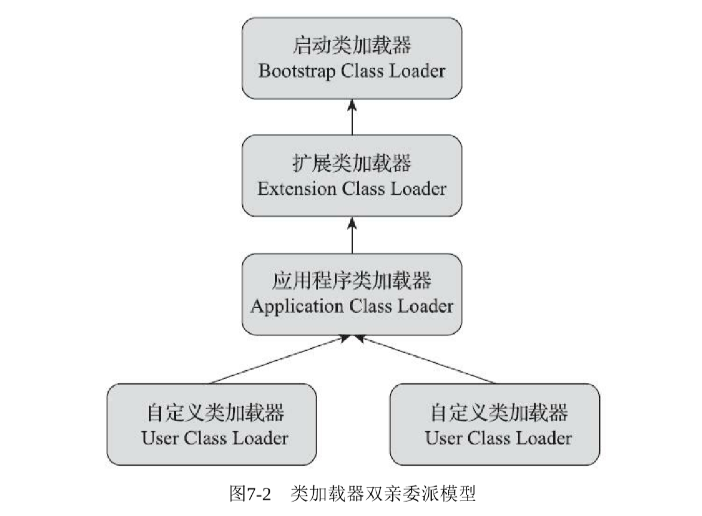

JDK 9之前的Java应用都是由这三种类加载器互相配合来完成加载的，如果用户认为有必要，还可以加入自定义的类加载器来进行拓展，典型的如增加除了磁盘位置之外的Class文件来源，或者通过类加载器实现类的隔离、重载等功能。这些类加载器之间的协作关系“通常”会如图 7-2所示。

图7-2中展示的各种类加载器之间的层次关系被称为类加载器的“双亲委派模型（Parents Delegation Model）”。双亲委派模型要求除了顶层的启动类加载器外，其余的类加载器都应有自己的父类加载器。不过这里类加载器之间的父子关系一般不是以继承（Inheritance）的关系来实现的，而是通常使用组合（Composition）关系来复用父加载器的代码。**即ClassLoader.getParent()返回。**

读者可能注意到前面描述这种类加载器协作关系时，笔者专门用双引号强调这是“通常”的协作关系。类加载器的双亲委派模型在JDK 1.2
时期被引入，并被广泛应用于此后几乎所有的Java程序中，但它并不是一个具有强制性约束力的模型，而是Java设计者们推荐给开发者的一种类加载器实现的最佳实践。

**双亲委派模型的工作过程是：如果一个类加载器收到了类加载的请求，它首先不会自己去尝试加载这个类，而是把这个请求委派给父类加 载器去完成，每一个层次的类加载器都是如此，因此所有的加载请求最终都应该传送到最顶层的启动类加载器中，只有当父加载器反馈自己无法完成这个加载请求（它的搜索范围中没有找到所需的类）时，子加载器才会尝试自己去完成加载。**

使用双亲委派模型来组织类加载器之间的关系，一个显而易见的好 处就是Java中的类随着它的类加载器一起具备了一种带有优先级的层次 关系。例如类java.lang.Object，它存放在rt.jar之中，无论哪一个类加载器要加载这个类，最终都是委派给处于模型最顶端的启动类加载器进行加载，因此Object类在程序的各种类加载器环境中都能够保证是同一个类。反之，如果没有使用双亲委派模型，都由各个类加载器自行去加载的话，如果用户自己也编写了一个名为java.lang.Object的类，并放在程序的ClassPath中，那系统中就会出现多个不同的Object类，Java类型体系中最基础的行为也就无从保证，应用程序将会变得一片混乱。如果读者有兴趣的话，可以尝试去写一个与rt.jar类库中已有类重名的Java类，将会发现它可以正常编译，但永远无法被加载运行。

**概括一下，使用双亲委派模型的好处就是在架构上确保一个确定的类在程序的各种类加载器环境中都能保证是同一个类。**

双亲委派模型对于保证Java程序的稳定运作极为重要，但它的实现却异常简单，用以实现双亲委派的代码只有短短十余行，全部集中在java.lang.ClassLoader的loadClass()方法之中，如代码清单7-10所示。

代码清单7-10　双亲委派模型的实现
```java
protected synchronized Class<?> loadClass(String name, boolean resolve) throws ClassNotFoundException {    	     // 首先，检查请求的类是否已经被加载过了    
    Class c = findLoadedClass(name);    
    if (c == null) {        
        try {        
            if (parent != null) {            
                c = parent.loadClass(name, false);        
            } else {            
                c = findBootstrapClassOrNull(name);        
            }        
        } catch (ClassNotFoundException e) {
            // 如果父类加载器抛出ClassNotFoundException            
            // 说明父类加载器无法完成加载请求        
        }        
        if (c == null) {            
            // 在父类加载器无法加载时            
            // 再调用本身的findClass方法来进行类加载            
            c = findClass(name);        
        }    
    }    
    if (resolve) {        
        resolveClass(c);    
    }    
    return c; 
}
```

这段代码的逻辑清晰易懂：先检查请求加载的类型是否已经被加载过，若没有则调用父加载器的loadClass()方法，若父加载器为空则默认 使用启动类加载器作为父加载器。假如父类加载器加载失败，抛出ClassNotFoundException异常的话，才调用自己的findClass()方法尝试进行加载。

这里只限于HotSpot，像MRP、Maxine这些虚拟机，整个虚拟机本身都是由Java编写的，自然Boot-strap ClassLoader也是由Java语言而不是C++实现的。退一步说，除了HotSpot外的其他两个高性能虚拟机JRockit 和J9都有一个代表Bootstrap ClassLoader的Java类存在，但是关键方法的实现仍然是使用JNI回调到C（而不是C++）的实现上，这个Bootstrap ClassLoader的实例也无法被用户获取到。在JDK 9以后，HotSpot虚拟机也采用了类似的虚拟机与Java类互相配合来实现Bootstrap ClassLoader的方式，所以在JDK 9后HotSpot也有一个无法获取实例的代表Bootstrap ClassLoader的Java类存在了。

即使自定义了自己的类加载器，强行用defineClass()方法去加载一个以“java.lang”开头的类也不会成功。如果读者尝试这样做的话，将会收到一个由Java虚拟机内部抛出的“java.lang.SecurityException：Prohibited package name：java.lang”异常。

#### 破坏双亲委派模型

上文提到过双亲委派模型并不是一个具有强制性约束的模型，而是Java设计者推荐给开发者们的类加载器实现方式。在Java的世界中大部分的类加载器都遵循这个模型，但也有例外的情况，直到Java模块化出现为止，双亲委派模型主要出现过3次较大规模“被破坏”的情况。

双亲委派模型的第一次“被破坏”其实发生在双亲委派模型出现之前——即JDK 1.2面世以前的“远古”时代。由于双亲委派模型在JDK 1.2之后才被引入，但是类加载器的概念和抽象类java.lang.ClassLoader则在Java的第一个版本中就已经存在，面对已经存在的用户自定义类加载器的代码，Java设计者们引入双亲委派模型时不得不做出一些妥协，为了兼容这些已有代码，无法再以技术手段避免loadClass()被子类覆盖的可能性，只能在JDK 1.2之后的java.lang.ClassLoader中添加一个新的protected方法findClass()，并引导用户编写的类加载逻辑时尽可能去重写这个方法，而不是在loadClass()中编写代码。上节我们已经分析过loadClass()方法，双亲委派的具体逻辑就实现在这里面，按照loadClass() 方法的逻辑，如果父类加载失败，会自动调用自己的findClass()方法来完成加载，这样既不影响用户按照自己的意愿去加载类，又可以保证新写出来的类加载器是符合双亲委派规则的。

双亲委派模型的第二次“被破坏”是由这个模型自身的缺陷导致的，双亲委派很好地解决了各个类加载器协作时基础类型的一致性问题（越基础的类由越上层的加载器进行加载），基础类型之所以被称为“基础”，是因为它们总是作为被用户代码继承、调用的API存在，但程序设 计往往没有绝对不变的完美规则，如果有基础类型又要调用回用户的代码，那该怎么办呢？

这并非是不可能出现的事情，一个典型的例子便是JNDI服务， JNDI现在已经是Java的标准服务，它的代码由启动类加载器来完成加载（在JDK 1.3时加入到rt.jar的），肯定属于Java中很基础的类型了。但JNDI存在的目的就是对资源进行查找和集中管理，它需要调用由其他厂商实现并部署在应用程序的ClassPath下的JNDI服务提供者接口（Service Provider Interface，SPI）的代码，现在问题来了，启动类加载器是绝不可能认识、加载这些代码的，那该怎么办？

为了解决这个困境，Java的设计团队只好引入了一个不太优雅的设计：线程上下文类加载器（Thread Context ClassLoader）。这个类加载器可以通过java.lang.Thread类的setContextClassLoader()方法进行设置，如果创建线程时还未设置，它将会从父线程中继承一个，如果在应用程序的全局范围内都没有设置过的话，那这个类加载器默认就是应用程序类加载器。

有了线程上下文类加载器，程序就可以做一些“舞弊”的事情了。JNDI服务使用这个线程上下文类加载器去加载所需的SPI服务代码，这是一种父类加载器去请求子类加载器完成类加载的行为，这种行为实际上是打通了双亲委派模型的层次结构来逆向使用类加载器，已经违背了双亲委派模型的一般性原则，但也是无可奈何的事情。Java中涉及SPI的加载基本上都采用这种方式来完成，例如JNDI、JDBC、JCE、JAXB 和JBI等。不过，当SPI的服务提供者多于一个的时候，代码就只能根据具体提供者的类型来硬编码判断，为了消除这种极不优雅的实现方式，在JDK 6时，JDK提供了java.util.ServiceLoader类，以META-INF/services中的配置信息，辅以责任链模式，这才算是给SPI的加载提供了一种相对合理的解决方案。

双亲委派模型的第三次“被破坏”是由于用户对程序动态性的追求而导致的，这里所说的“动态性”指的是一些非常“热”门的名词：代码热替换（Hot Swap）、模块热部署（Hot Deployment）等。说白了就是希望Java应用程序能像我们的电脑外设那样，接上鼠标、U盘，不用重启机器就能立即使用，鼠标有问题或要升级就换个鼠标，不用关机也不用重启。对于个人电脑来说，重启一次其实没有什么大不了的，但对于一些生产系统来说，关机重启一次可能就要被列为生产事故，这种情况下热部署就对软件开发者，尤其是大型系统或企业级软件开发者具有很大的吸引力。

早在2008年，在Java社区关于模块化规范的第一场战役里，由 Sun/Oracle公司所提出的JSR-294、JSR-277规范提案就曾败给以IBM公司主导的JSR-291（即OSGi R4.2）提案。尽管Sun/Oracle并不甘心就此失去Java模块化的主导权，随即又再拿出Jigsaw项目迎战，但此时OSGi已经站稳脚跟，成为业界“事实上”的Java模块化标准。曾经在很长一段时间内，IBM凭借着OSGi广泛应用基础让Jigsaw吃尽苦头，其影响一直持续到Jigsaw随JDK 9面世才算告一段落。而且即使Jigsaw现在已经是Java的标准功能了，它仍需小心翼翼地避开OSGi运行期动态热部署上的优势，仅局限于静态地解决模块间封装隔离和访问控制的问题，这部分内容笔者在7.5节中会继续讲解，现在我们先来简单看一看OSGi是如何通过类加载器实现热部署的。

### 7.5　Java模块化系统

在JDK 9中引入的Java模块化系统（Java Platform Module System，JPMS）是对Java技术的一次重要升级，为了能够实现模块化的关键目标——可配置的封装隔离机制，Java虚拟机对类加载架构也做出了相应的变动调整，才使模块化系统得以顺利地运作。JDK 9的模块不仅仅像之前的JAR包那样只是简单地充当代码的容器，除了代码外，Java的模块定义还包含以下内容：

- 依赖其他模块的列表。
- 导出的包列表，即其他模块可以使用的列表。
- 开放的包列表，即其他模块可反射访问模块的列表。
- 使用的服务列表。
- 提供服务的实现列表。

可配置的封装隔离机制首先要解决JDK 9之前基于类路径（ClassPath）来查找依赖的可靠性问题。此前，如果类路径中缺失了运行时依赖的类型，那就只能等程序运行到发生该类型的加载、链接时才会报出运行的异常。而在JDK 9以后，如果启用了模块化进行封装，模块就可以声明对其他模块的显式依赖，这样Java虚拟机就能够在启动时验证应用程序开发阶段设定好的依赖关系在运行期是否完备，如有缺失那就直接启动失败，从而避免了很大一部分由于类型依赖而引发的运行时异常。

可配置的封装隔离机制还解决了原来类路径上跨JAR文件的public 类型的可访问性问题。JDK 9中的public类型不再意味着程序的所有地方 的代码都可以随意访问到它们，模块提供了更精细的可访问性控制，必须明确声明其中哪一些public的类型可以被其他哪一些模块访问，这种访问控制也主要是在类加载过程中完成的，具体内容笔者在前文对解析阶段的讲解中已经介绍过。

#### 模块的兼容性

为了使可配置的封装隔离机制能够兼容传统的类路径查找机制， JDK 9提出了与“类路径”（ClassPath）相对应的“模块路径”（ModulePath）的概念。简单来说，就是某个类库到底是模块还是传统的JAR包，只取决于它存放在哪种路径上。只要是放在类路径上的JAR文件，无论其中是否包含模块化信息（是否包含了module-info.class 文件），它都会被当作传统的JAR包来对待；相应地，只要放在模块路径上的JAR文件，即使没有使用JMOD后缀，甚至说其中并不包含module-info.class文件，它也仍然会被当作一个模块来对待。

模块化系统将按照以下规则来保证使用传统类路径依赖的Java程序可以不经修改地直接运行在JDK 9及以后的Java版本上，即使这些版本的JDK已经使用模块来封装了Java SE的标准类库，模块化系统的这套规则也仍然保证了传统程序可以访问到所有标准类库模块中导出的包。

- JAR文件在类路径的访问规则：所有类路径下的JAR文件及其他资源文件，都被视为自动打包在一个匿名模块（Unnamed Module）里，这个匿名模块几乎是没有任何隔离的，它可以看到和使用类路径上所有的包、JDK系统模块中所有的导出包，以及模块路径上所有模块中导出的包。
- 模块在模块路径的访问规则：模块路径下的具名模块（Named Module）只能访问到它依赖定义中列明依赖的模块和包，匿名模块里所有的内容对具名模块来说都是不可见的，即具名模块看不见传统JAR包的内容。
- JAR文件在模块路径的访问规则：如果把一个传统的、不包含模块定义的JAR文件放置到模块路径中，它就会变成一个自动模块（Automatic Module）。尽管不包含module-info.class，但自动模块将默认依赖于整个模块路径中的所有模块，因此可以访问到所有模块导出的包，自动模块也默认导出自己所有的包。

以上3条规则保证了即使Java应用依然使用传统的类路径，升级到 JDK 9对应用来说几乎（类加载器上的变动还是可能会导致少许可见的
影响，将在下节介绍）不会有任何感觉，项目也不需要专门为了升级 JDK版本而去把传统JAR包升级成模块。

除了向后兼容性外，随着JDK 9模块化系统的引入，更值得关注的是它本身面临的模块间的管理和兼容性问题：如果同一个模块发行了多个不同的版本，那只能由开发者在编译打包时人工选择好正确版本的模块来保证依赖的正确性。Java模块化系统目前不支持在模块定义中加入版本号来管理和约束依赖，本身也不支持多版本号的概念和版本选择功能。前面这句话引来过很多的非议，但它确实是Oracle官方对模块化系统的明确的目标说明。我们不论是在Java命令、Java类库的API抑或是《Java虚拟机规范》定义的Class文件格式里都能轻易地找到证据，表明模块版本应是编译、加载、运行期间都可以使用的。譬如输入“java-list-modules”，会得到明确带着版本号的模块列表：
```shell
java.base@12.0.1 
java.compiler@12.0.1 
java.datatransfer@12.0.1 
java.desktop@12.0.1 
java.instrument@12.0.1 
java.logging@12.0.1 
java.management@12.0.1 
....
```

在JDK 9时加入Class文件格式的Module属性，里面有module_version_index这样的字段，用户可以在编译时使用“javac-module-version”来指定模块版本，在Java类库API中也存在 java.lang.module.ModuleDescriptor.Version这样的接口可以在运行时获取到模块的版本号。这一切迹象都证明了Java模块化系统对版本号的支持本可以不局限在编译期。而官方却在Jigsaw的规范文件、JavaOne大会的宣讲和与专家的讨论列表中，都反复强调“JPMS的目的不是代替OSGi”，“JPMS不支持模块版本”这样的话语。

Oracle给出的理由是希望维持一个足够简单的模块化系统，避免技术过于复杂。但结合JCP执行委员会关于的Jigsaw投票中Oracle与IBM、 RedHat的激烈冲突，实在很难让人信服这种设计只是单纯地基于技术原因，而不是厂家之间互相博弈妥协的结果。Jigsaw仿佛在刻意地给OSGi让出一块生存空间，以换取IBM支持或者说不去反对Jigsaw，其代价就是几乎宣告Java模块化系统不可能拥有像OSGi那样支持多版本模块并存、支持运行时热替换、热部署模块的能力，可这却往往是一个应用进行模块化的最大驱动力所在。如果要在JDK 9之后实现这种目的，就只能将OSGi和JPMS混合使用，如图7-4所示，这无疑带来了更高的复杂度。模块的运行时部署、替换能力没有内置在Java模块化系统和Java虚拟机之中，仍然必须通过类加载器去实现，实在不得不说是一个缺憾。

其实Java虚拟机内置的JVMTI接口（java.lang.instrument.Instrumentation）提供了一定程度的运行时修改类的能力（RedefineClass、RetransformClass），但这种修改能力会受到很多限制，不可能直接用来实现OSGi那样的热替换和多版本并存，用在IntelliJ IDE、Eclipse这些IDE上做HotSwap（是指IDE编辑方法的代码后不需要重启即可生效）倒是非常的合适。也曾经有一个研究性项目 Dynamic Code Evolution VM（DECVM）探索过在虚拟机内部支持运行时类型替换的可行性，允许任意修改已加载到内存中的Class，并不损失任何性能，但可惜已经很久没有更新了，最新版只支持到JDK 7。

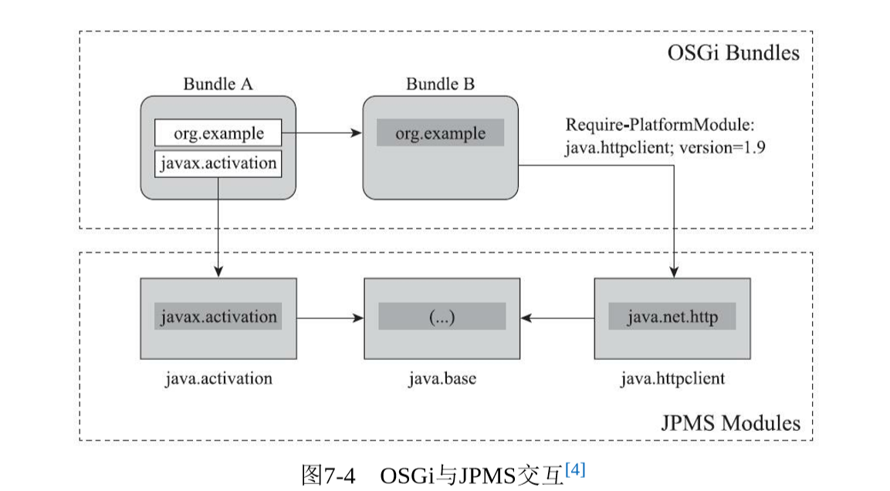

#### 模块化下的类加载器

为了保证兼容性，JDK 9并没有从根本上动摇从JDK 1.2以来运行了二十年之久的三层类加载器架构以及双亲委派模型。但是为了模块化系 统的顺利施行，模块化下的类加载器仍然发生了一些应该被注意到变动，主要包括以下几个方面。

首先，是扩展类加载器（Extension Class Loader）被平台类加载器（Platform Class Loader）取代。这其实是一个很顺理成章的变动，既然整个JDK都基于模块化进行构建（原来的rt.jar和tools.jar被拆分成数十个JMOD文件），其中的Java类库就已天然地满足了可扩展的需求，那自然无须再保留<JAVA_HOME>\lib\ext目录，此前使用这个目录或者java.ext.dirs系统变量来扩展JDK功能的机制已经没有继续存在的价值了，用来加载这部分类库的扩展类加载器也完成了它的历史使命。类似地，在新版的JDK中也取消了<JAVA_HOME>\jre目录，因为随时可以组合构建出程序运行所需的JRE来，譬如假设我们只使用java.base模块中的类型，那么随时可以通过以下命令打包出一个“JRE”：

```shell
jlink -p $JAVA_HOME/jmods --add-modules java.base --output jre
```

其次，平台类加载器和应用程序类加载器都不再派生自 java.net.URLClassLoader，如果有程序直接依赖了这种继承关系，或者依赖了URLClassLoader类的特定方法，那代码很可能会在JDK 9及更高版本的JDK中崩溃。现在启动类加载器、平台类加载器、应用程序类加载器全都继承于jdk.internal.loader.BuiltinClassLoader，在BuiltinClassLoader中实现了新的模块化架构下类如何从模块中加载的逻辑，以及模块中资源可访问性的处理。两者的前后变化如图7-5和7-6所示。

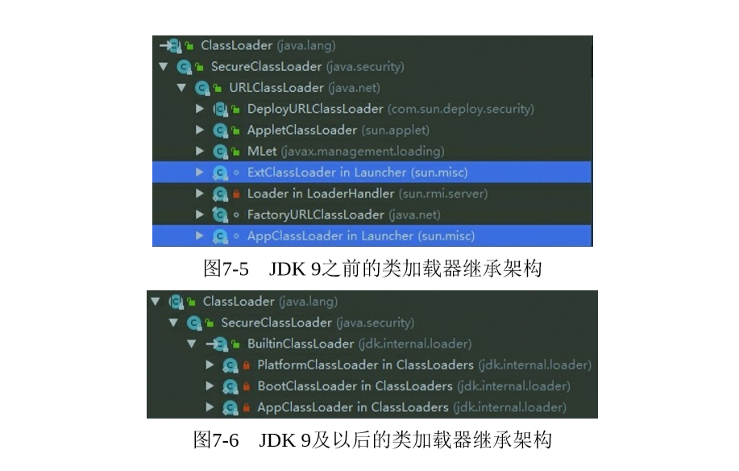

另外，读者可能已经注意到图7-6中有“BootClassLoader”存在，启动 类加载器现在是在Java虚拟机内部和Java类库共同协作实现的类加载器，尽管有了BootClassLoader这样的Java类，但为了与之前的代码保持兼容，所有在获取启动类加载器的场景（譬如Object.class.getClassLoader()）中仍然会返回null来代替，而不会得到BootClassLoader的实例。

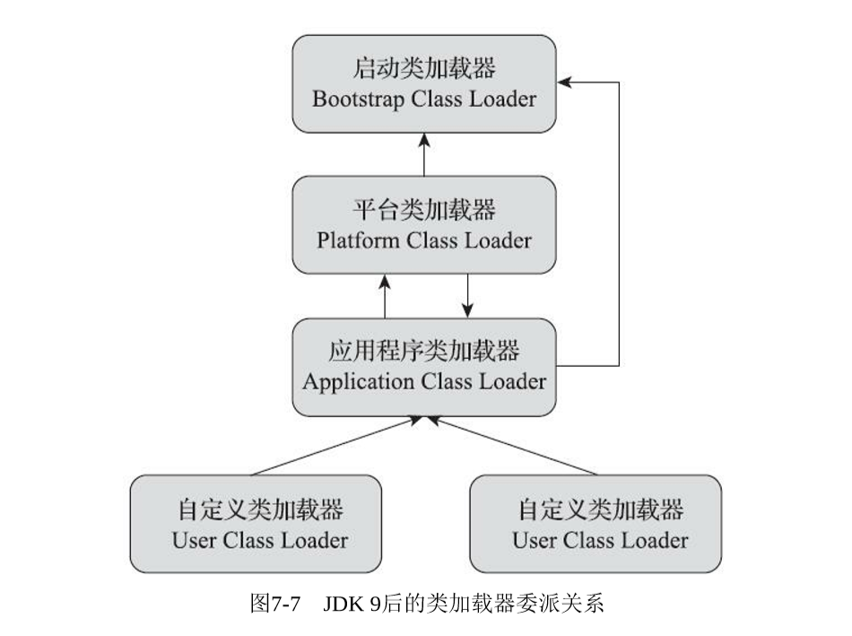

最后，JDK 9中虽然仍然维持着三层类加载器和双亲委派的架构，但类加载的委派关系也发生了变动。当平台及应用程序类加载器收到类加载请求，在委派给父加载器加载前，要先判断该类是否能够归属到某一个系统模块中，如果可以找到这样的归属关系，就要优先委派给负责那个模块的加载器完成加载，也许这可以算是对双亲委派的第四次破坏。在JDK 9以后的三层类加载器的架构如图7-7所示，请读者对照图72进行比较。

在Java模块化系统明确规定了三个类加载器负责各自加载的模块，即前面所说的归属关系，如下所示。

- 启动类加载器负责加载的模块：

  ```shell
  java.base                        java.security.sasl 
  java.datatransfer                java.xml 
  java.desktop                     jdk.httpserver 
  java.instrument                  jdk.internal.vm.ci 
  java.logging                     jdk.management
  java.management                  jdk.management.agent 
  java.management.rmi              jdk.naming.rmi 
  java.naming                      jdk.net 
  java.prefs                       jdk.sctp 
  java.rmi                         jdk.unsupported
  
  ```

- 平台类加载器负责加载的模块：

  ```shell
  java.activation*                jdk.accessibility 
  java.compiler*                  jdk.charsets 
  java.corba*                     jdk.crypto.cryptoki 
  java.scripting                  jdk.crypto.ec 
  java.se                         jdk.dynalink 
  java.se.ee                      jdk.incubator.httpclient 
  java.security.jgss              jdk.internal.vm.compiler* 
  java.smartcardio                jdk.jsobject 
  java.sql                        jdk.localedata 
  java.sql.rowset                 jdk.naming.dns 
  java.transaction*               jdk.scripting.nashorn 
  java.xml.bind*                  jdk.security.auth 
  java.xml.crypto                 jdk.security.jgss 
  java.xml.ws*                    jdk.xml.dom 
  java.xml.ws.annotation*         jdk.zipfs
  
  ```

- 应用程序类加载器负责加载的模块：

  ```shell
  jdk.aot                         jdk.jdeps jdk.attach                      
  jdk.jdi jdk.compiler            jdk.jdwp.agent 
  jdk.editpad                     jdk.jlink 
  jdk.hotspot.agent               jdk.jshell 
  jdk.internal.ed                 jdk.jstatd 
  jdk.internal.jvmstat            jdk.pack 
  jdk.internal.le                 jdk.policytool 
  jdk.internal.opt                jdk.rmic 
  jdk.jartool                     jdk.scripting.nashorn.shell 
  jdk.javadoc                     jdk.xml.bind* 
  jdk.jcmd                        jdk.xml.ws* 
  jdk.jconsole
  ```


### 7.6　本章小结

本章介绍了类加载过程的“加载”“验证”“准备”“解析”和“初始化”这5个阶段中虚拟机进行了哪些动作，还介绍了类加载器的工作原理及其对虚拟机的意义。

经过第6、7章的讲解，相信读者已经对如何在Class文件中定义类，以及如何将类加载到虚拟机之中这两个问题有了一个比较系统的了解，第8章我们将探索Java虚拟机的执行引擎，一起来看看虚拟机如何执行定义在Class文件里的字节码。

## 第8章　虚拟机字节码执行引擎

代码编译的结果从本地机器码转变为字节码，是存储格式发展的一小步，却是编程语言发展的一大步。

### 8.1　概述

执行引擎是Java虚拟机核心的组成部分之一。“虚拟机”是一个相对于“物理机”的概念，这两种机器都有代码执行能力，其区别是物理机的 执行引擎是直接建立在处理器、缓存、指令集和操作系统层面上的，而虚拟机的执行引擎则是由软件自行实现的，因此可以不受物理条件制约地定制指令集与执行引擎的结构体系，能够执行那些不被硬件直接支持的指令集格式。

在《Java虚拟机规范》中制定了Java虚拟机字节码执行引擎的概念模型，这个概念模型成为各大发行商的Java虚拟机执行引擎的统一外观 （Facade）。在不同的虚拟机实现中，执行引擎在执行字节码的时候，通常会有解释执行（通过解释器执行）和编译执行（通过即时编译器产生本地代码执行）两种选择，也可能两者兼备，还可能会有同时包含几个不同级别的即时编译器一起工作的执行引擎。但从外观上来看，所有的Java虚拟机的执行引擎输入、输出都是一致的：输入的是字节码二进制流，处理过程是字节码解析执行的等效过程，输出的是执行结果，本章将主要从概念模型的角度来讲解虚拟机的方法调用和字节码执行。

### 8.2　运行时栈帧结构

