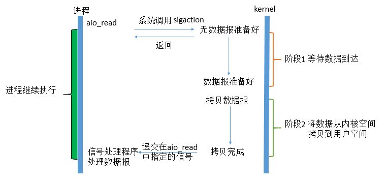
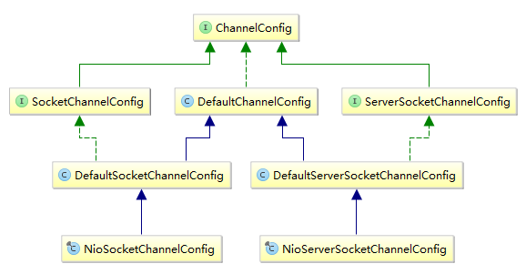
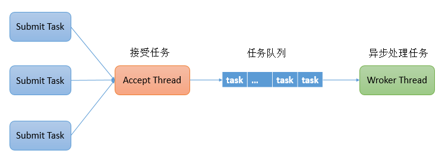
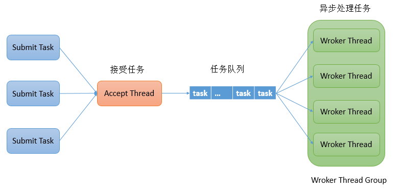
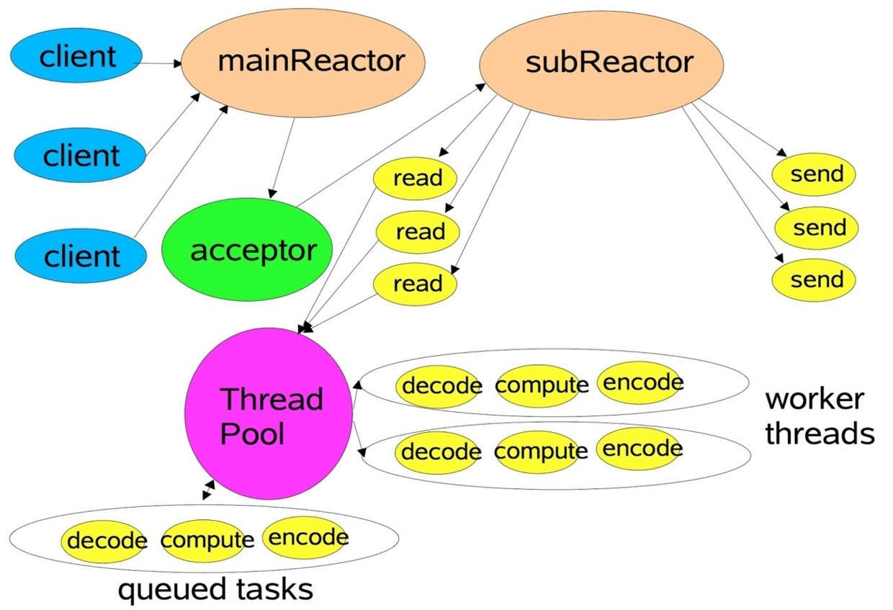
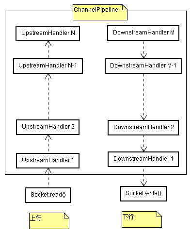
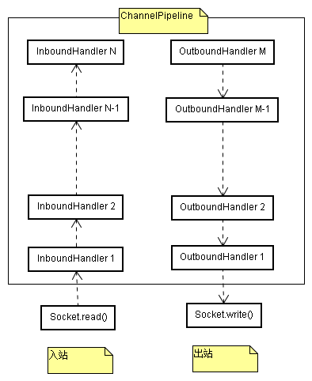
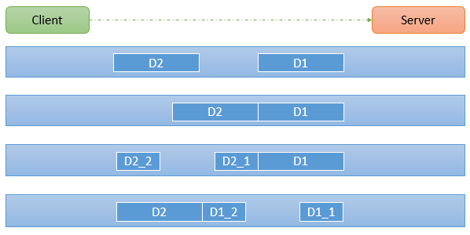
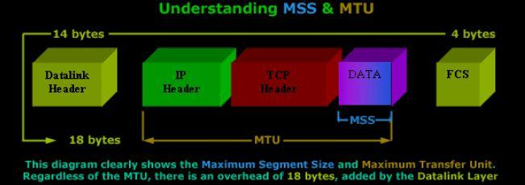
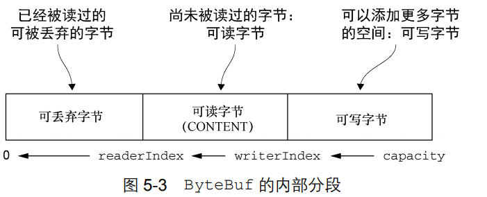

全网最好Netty在线教程：
http://www.tianshouzhi.com/api/tutorials/netty/220


## 1、Unix五种IO模型

- ##### I/O的两个阶段

  **阶段1**：等待数据准备 (Waiting for the data to be ready)

  **阶段2**：将数据从内核拷贝到进程中 (Copying the data from the kernel to the process)

- ##### 阻塞式I/O

  

  阻塞I/O称之为Blocking I/O，即BIO或者OIO（Old IO）

  **Blocking I/O的特点就是在IO执行的两个阶段都被block了。**

- ##### 非阻塞式I/O

  

  linux下，可以通过设置socket使其变为non-blocking。

  在Java中可以通过`serverSocketChannel.configureBlocking(false)`设置socket使其变为non-blocking。

  非阻塞式I/O称之为Non-Blocking I/O，即NIO

  **Non-Blocking I/O的特点就是用户进程第一个阶段不是阻塞的，需要不断的主动询问kernel数据好了没有；第二个阶段依然总是阻塞的。**

- ##### I/O多路复用

  IO multiplexing这个词可能有点陌生，但是如果我说select，epoll，大概就都能明白了。有些地方也称这种IO方式为event driven IO。我们都知道，select/epoll的好处就在于单个process就可以同时处理多个网络连接的IO。

  IO复用同非阻塞IO本质一样，不过利用了新的select系统调用，由内核来负责本来是请求进程该做的轮询操作。看似比非阻塞IO还多了一个系统调用开销，不过因为可以支持多路IO，才算提高了效率。

  它的基本原理就是select /epoll这个function会不断的轮询所负责的所有socket，当某个socket有数据到达了，就通知用户进程。它的流程如图：

  

  当用户进程调用了`select`，那么整个进程会被block，而同时，kernel会“监视”所有select负责的socket，当任何一个 socket中的数据准备好了，select就会返回。这个时候用户进程再调用read操作，将数据从kernel拷贝到用户进程。

  这个图和blocking IO的图其实并没有太大的不同，事实上，还更差一些。因为这里需要使用两个system call (select 和 recvfrom)，而blocking IO只调用了一个system call (recvfrom)。但是，用select的优势在于它可以同时处理多个connection。

  **多说一句。所以，如果处理的连接数不是很高的话，使用 select/epoll的web server不一定比使用multi-threading + blocking IO的web server性能更好，可能延迟还更大。**

  **select/epoll的优势并不是对于单个连接能处理得更快，而是在于能处理更多的连接。**

  在IO multiplexing模型中，实际中，对于每一个socket，一般都设置成为non-blocking，但是，如上图所示，整个用户的process其实是一直被 block的。只不过process是被select这个函数block，而不是被socket IO给block。

- ##### 信号驱动式I/O

  用的很少，就不做讲解了

- ##### 异步I/O

  这类函数的工作机制是告知内核启动某个操作，并让内核在整个操作（包括将数据从内核拷贝到用户空间）完成后通知我们。如图：

  

  用户进程发起read操作之后，立刻就可以开始去做其它的事。而另一方面，从kernel的角度，当它受到一个asynchronous read之后，首先它会立刻返回，所以不会对用户进程产生任何block。然后，kernel会等待数据准备完成，然后将数据拷贝到用户内存，当这一切都 完成之后，kernel会给用户进程发送一个signal，告诉它read操作完成了。 **在这整个过程中，进程完全没有被block。**

- ##### 总结

  其实前四种I/O模型都是同步I/O操作，他们的区别在于第一阶段，而他们的第二阶段是一样的：在数据从内核复制到应用缓冲区期间（用户空间），进程阻塞于recvfrom调用。 

  有人可能会说，non-blocking IO并没有被block啊。这里有个非常“狡猾”的地方，定义中所指的”IO operation”是指真实的IO操作，就是例子中的recvfrom这个system call。non-blocking IO在执行recvfrom这个system call的时候，如果kernel的数据没有准备好，这时候不会block进程。但是，当kernel中数据准备好的时候，recvfrom会将数据从 kernel拷贝到用户内存中，这个时候进程是被block了，在这段时间内，进程是被block的。


## 2、TCP与HTTP的keep-alive机制的区别

http://www.tianshouzhi.com/api/tutorials/netty/406

- HTTP的keep-alive机制

  HTTP的keep-alive应该理解为在一定的时效内保持连接活着，不能持久保活，要求客户端要尽快在keepAlive时间内尽快把事情做完。

- TCP的keep-alive机制

  keep-alive频率低，默认2h没有数据传输则发keep-alive探测包，如果对方不回复则会继续发探测包，最多发9次，如果9次都没回应则关闭连接。

  如果对方回复ACK则保活成功，等到下一个2h再发keep-alive探测包；如果对方回复RST则说明连接已经不存在了(例如对方刚刚重启过)

  然而，tcp的keep-alive机制，说实话，有一些鸡肋：

  1、**keep-alive只能检测连接是否存活，不能检测连接是否可用。**例如，某一方发生了死锁，无法在连接上进行任何读写操作，但是操作系统仍然可以响应网络层keepalive包。

  2、TCP keep-alive 机制依赖于操作系统的实现,灵活性不够，默认关闭，且默认的 keep-alive 心跳时间是 两个小时, 时间较长。

  3、代理(如socks proxy)、或者负载均衡器，会让tcp keep-alive失效

  我们需要加上应用层的心跳。应用层的心跳的作用，取决于你想干啥。


## 3、TCP三次握手过程

http://www.52im.net/thread-258-1-1.html


## 4、BIO、NIO和AIO的区别

- **BIO**：一个线程负责全程处理一个客户端连接，随着连接数的增多，导致大量的线程上下文切换，严重影响系统性能，系统性能随着连接数的增多而直线下降。
- **NIO**：一个IO多路复用器Selector被用于处理所有客户端连接，多路复用器只感兴趣客户端连接上发生的事件，诸如Accept、Read、Write等事件，至于诸如Read、Write事件中具体的数据读写则交由有限的worker线程去做，这是典型的Reactor模式。
- **AIO**：一个有效请求一个线程，客户端的I/O请求都是由OS先完成了再通知服务器应用去启动线程进行处理。

**BIO是面向流的，单向的，阻塞的；NIO是基于事件驱动的，面向通道和缓冲区的，双向的，非阻塞的；**


## 4、通道Channel和流Stream的区别

- 通道Channel是面向缓冲区，能双向读写；
- 流Stream只能是单向读或单向写；


## 5、字节流与字符流有什么区别

计算机中的一切最终都是以二进制字节形式存在的，对于我们经常操作的字符串，在写入时其实都是先得到了其对应的字节，然后将字节写入到输出流，在读取时其实都是先读到的是字节，然后将字节直接使用或者转换为字符给我们使用。由于对于字节和字符两种操作的需求比较广泛，所以 Java 专门提供了字符流与字节流相关IO类。对于程序运行的底层设备来说永远都只接受字节数据，所以当我们往设备写数据时无论是字节还是字符最终都是写的字节流。字符流是字节流的包装类，所以当我们将字符流向字节流转换时要注意编码问题（因为字符串转成字节数组的实质是转成该字符串的某种字节编码）。字符流和字节流的使用非常相似，但是实际上字节流的操作不会经过缓冲区（内存）而是直接操作文本本身的，而字符流的操作会先经过缓冲区（内存）然后通过缓冲区再操作文件。

**字符流和字节流的使用非常相似，但是实际上字节流的操作不会经过缓冲区（内存）而是直接操作文本本身的，而字符流的操作会先经过缓冲区（内存）然后通过缓冲区再操作文件。**


## 5、ByteBuffer

- 写数据到Buffer有两种方式：

  1. 从Channel写到Buffer。
  2. 通过Buffer的put()方法写到Buffer里。

- `flip()`：方法将Buffer从写模式切换到读模式。调用flip()方法会将position设回0，并将limit设置成之前position的值。

- `rewind()`：方法将position设回0，所以你可以重读Buffer中的所有数据。limit保持不变，仍然表示能从Buffer中读取多少个元素（byte、char等）。

- `clear()`与`compact()`方法

  一旦读完Buffer中的数据，需要让Buffer准备好再次被写入。可以通过clear()或compact()方法来完成。

  如果调用的是clear()方法，position将被设回0，limit被设置成 capacity的值。换句话说，Buffer 被清空了。Buffer中的数据并未清除，只是这些标记告诉我们可以从哪里开始往Buffer里写数据。

  如果Buffer中有一些未读的数据，调用clear()方法，数据将“被遗忘”，意味着不再有任何标记会告诉你哪些数据被读过，哪些还没有。

  如果Buffer中仍有未读的数据，且后续还需要这些数据，但是此时想要先先写些数据，那么使用compact()方法。

  compact()方法将所有未读的数据拷贝到Buffer起始处。然后将position设到最后一个未读元素正后面。limit属性依然像clear()方法一样，设置成capacity。现在Buffer准备好写数据了，但是不会覆盖未读的数据。


## 6、DirectByteBuffer

**PhantomReference & Cleaner**：https://zhuanlan.zhihu.com/p/29454205


## 7、HeapByteBuffer与DirectByteBuffer的区别

- ##### HeapByteBuffer

  HeapByteBuffer是通过ByteBuffer#allocate(int capacity)方法new出来的。

  HeapByteBuffer顾名思义，是写在jvm堆上面的一个buffer，底层的本质是一个数组，用类封装维护了很多的索引（limit/position/capacity等）。

  HeapByteBuffer优点：由于内容维护在jvm里，所以把内容写进buffer里速度会快些；并且，可以更容易回收。

- ##### DirectByteBuffer

  DirectByteBuffer是通过ByteBuffer#allocateDirect(int capacity)方法new出来的。

  DirectByteBuffer可减少一次系统空间到用户空间的拷贝。但Buffer创建和销毁的成本更高，不可控，通常会用内存池来提高性能。**应用场景：直接缓冲区主要分配给那些易受基础系统的本机I/O 操作影响的大型、持久的缓冲区。如果数据量比较小的中小应用情况下，可以考虑使用heapBuffer，由JVM进行管理。**

  HeapByteBuffer底层的数据其实是维护在操作系统的内存中，而不是jvm里，DirectByteBuffer里维护了一个引用address指向了数据，从而操作数据。可以通过DirectBuffer#clean()方法来释放其所持的堆外直接内存。
  
  DirectByteBuffer优点：跟外设（IO设备）打交道时会快很多，因为外设读取jvm堆里的数据时，不是直接读取的，而是把jvm里的数据读到一个内存块里，再在这个块里读取的，如果使用DirectByteBuffer，则可以省去这一步，实现zero copy（零拷贝）。

**题外**：外设之所以要把jvm堆里的数据copy出来再操作，不是因为操作系统不能直接操作jvm内存，而是因为jvm在进行gc（垃圾回收）时，会对数据进行移动，一旦出现这种问题，外设就会出现数据错乱的情况。


## 8、Java nio实现non-blocking I/O的两种方式

- ##### 不使用Selector选择器

  ```java
  public static void main(String[] args) throws Exception {
      ServerSocketChannel serverSocketChannel = ServerSocketChannel.open();
      serverSocketChannel.socket().bind(new InetSocketAddress(port));
      serverSocketChannel.configureBlocking(false); //设置为非阻塞模式
      while (true) {
          //由于上面设置为非阻塞模式，因此accept()方法在没有新的客户端连上来时会立刻返回null
          SocketChannel clientSocketChannel = serverSocketChannel.accept();
          if(clientSocketChannel == null) {
              Thread.sleep(200); //稍事休眠以下，避免自旋
          } else {
           	ByteBuffer buffer = ByteBuffer.allocateDirect (16 * 1024);
              //注意这个read()方法，在上面设置为非阻塞模式的情况下，如果读不到数据read()方法会立马返回0
              while(clientSocketChannel.read(buffer) > 0) {
  				...
          	}
          }
      }
  }
  ```
  **很明显，这种实现non-blocking I/O的方式是基于不断自旋询问的方式来实现的。**

- ##### 使用Selector选择器

  ```java
  public static void main(String[] args) throws Exception {
      SelectableChannel channel = null;
  
      Selector selector = Selector.open();
      channel.configureBlocking(false); //设置为非阻塞模式
      SelectionKey interestkey = channel.register(selector, SelectionKey.OP_READ);
      while(true) {
          if(selector.select() > 0) { //如果有客户端准备就绪(包括连接就绪、读就绪、写就绪等)
              Set<SelectionKey> selectedKeys = selector.selectedKeys();
              Iterator<SelectionKey> keyIterator = selectedKeys.iterator();
              while(keyIterator.hasNext()) {
                  SelectionKey key = keyIterator.next();
                  if(key.isAcceptable()) {
                      //接受客户端连接
                  } else if (key.isConnectable()) {
                      //建立了连接
                  } else if (key.isReadable()) {
                      //客户端读就绪
                  } else if (key.isWritable()) {
                      //客户端写就绪
                  }
                  keyIterator.remove();
              }
          }
      }
  }
  ```

  **这种实现non-blocking I/O的方式是基于Selector方式来实现的，其不断询问是借助底层操作系统内核中的IO多路复用技术(select/poll/epoll等)实现的。**
  
- ##### socketChannel#read()方法

  - 当socketChannel.configureBlocking(false)时，即非阻塞模式时，read()方法在没有数据可读时立马返回，且其返回值为0
  - 当socketChannel.configureBlocking(true)时，即阻塞模式时，read()方法在没有数据可读时会阻塞，当有数据读时，如果读到末尾则返回-1，接着读又会被阻塞。


## 9、HttpURLConnection的使用示例

```java
public class HttpURLConnectionExample {

    public static void doGet() throws Exception {
        URL url = new URL("http://127.0.0.1:8181/now");
        HttpURLConnection urlConnection = (HttpURLConnection) url.openConnection();
        //设置请求方法，默认也为GET
        urlConnection.setRequestMethod("GET");
        /**
         * 设置是否向httpUrlConnection输出数据，因为这个是GET请求，
         * 所以请求体(正文)中不需要设置输出数据，所以设置为false，默认也为false
         */
        urlConnection.setDoOutput(false);
        //设置是否从httpUrlConnection读入数据，即是需要响应数据，默认为true
        urlConnection.setDoInput(true);
        //设置请求头
        urlConnection.setRequestProperty("Content-Type", "text/html;charset=UTF-8");
        urlConnection.setRequestProperty("Accept", "application/json;charset=UTF-8");
        urlConnection.setRequestProperty("Pragma", "no-cache");
        //设置连接超时时间
        urlConnection.setConnectTimeout(6000);
        //设置不使用缓存
        urlConnection.setUseCaches(false);
        //urlConnection.getOutputStream()会隐含的进行connect()，所以此处可以不connect()
        urlConnection.connect();
        //获取响应状态码
        int responseCode = urlConnection.getResponseCode();
        if(responseCode == 200) {
            //读取响应内容
            try(BufferedReader br = new BufferedReader(new InputStreamReader(urlConnection.getInputStream(), "UTF-8"))) {
                String responseBody = br.lines().collect(Collectors.joining("\n"));
                System.out.println("responseBody = " + responseBody); //{"nowTime":"2020-09-29 12:21:05"}
            }
        }
        //关闭连接(其实就是关闭底层的那个Socket链接)
        urlConnection.disconnect();
    }

    public static void doPost() throws Exception {
        URL url = new URL("http://127.0.0.1:8181/login");
        HttpURLConnection urlConnection = (HttpURLConnection) url.openConnection();
        //设置请求方法，默认为GET
        urlConnection.setRequestMethod("POST");
        /**
         * 设置是否向httpUrlConnection输出数据，因为这个是POST请求，
         * 所以请求体(正文)中需要设置输出数据，所以设置为true，默认为false
         */
        urlConnection.setDoOutput(true);
        //设置是否从httpUrlConnection读入数据，即是需要响应数据，默认为true
        urlConnection.setDoInput(true);
        //设置请求头
        urlConnection.setRequestProperty("Content-Type", "application/x-www-form-urlencoded");
        urlConnection.setRequestProperty("Accept", "application/json;charset=UTF-8");
        urlConnection.setRequestProperty("Pragma", "no-cache");
        //设置连接超时时间
        urlConnection.setConnectTimeout(6000);
        //设置不使用缓存
        urlConnection.setUseCaches(false);
        //urlConnection.getOutputStream()会隐含的进行connect()，所以此处可以不connect()
        urlConnection.connect();
        //向请求体中写入输出数据(即POST正文)
        //标准application/x-www-form-urlencoded类型的正文格式：参数键与值之间用=连接，每个键值对之间用&连接
        try(BufferedWriter bw = new BufferedWriter(new OutputStreamWriter(urlConnection.getOutputStream(), StandardCharsets.UTF_8))) {
            String requestBody = "username=admin&password=123456";
            bw.write(requestBody);
        }
        //获取响应状态码
        int responseCode = urlConnection.getResponseCode();
        if(responseCode == 200) {
            //读取响应内容
            try(BufferedReader br = new BufferedReader(new InputStreamReader(urlConnection.getInputStream(), "UTF-8"))) {
                String responseBody = br.lines().collect(Collectors.joining("\n"));
                System.out.println("responseBody = " + responseBody);
            }
        }
        //关闭连接(其实就是关闭底层的那个Socket链接)
        urlConnection.disconnect();
    }

    public static void main(String[] args) throws Exception {
        //doGet();
        doPost();
    }

}
```


## 10、BIO的echo示例

Server端：

```java
public class EchoServer extends Thread {

    public static final Charset CHARSET = StandardCharsets.UTF_8;

    public static final String LINE_SEPARATOR = System.getProperty("line.separator");

    private final ServerSocket serverSocket;

    public EchoServer(int port) throws IOException {
        Assert.isTrue(port > 0, "EchoServer port must be > 0");
        this.serverSocket = new ServerSocket(port);
        this.serverSocket.setReuseAddress(true);
        System.out.println("【EchoServer】Echo 服务器启动了...");
    }

    @Override
    public void run() {
        while (!serverSocket.isClosed()) {
            try (Socket clientSocket = serverSocket.accept()) { //accept()方法将会阻塞，直到有客户端连接到Server
                SocketAddress clientSocketAddr = clientSocket.getRemoteSocketAddress();
                BufferedReader clientReader = new BufferedReader(new InputStreamReader(clientSocket.getInputStream(), CHARSET));
                BufferedWriter clientWriter = new BufferedWriter(new OutputStreamWriter(clientSocket.getOutputStream(), CHARSET));
                String line;
                while((line = clientReader.readLine()) != null) {
                    System.out.println("【EchoServer】收到来自远程客户端(" + clientSocketAddr + ")的Echo消息：" + line);
                    //回写消息给客户端
                    clientWriter.write(line + LINE_SEPARATOR);
                    clientWriter.flush();
                }
            } catch (IOException e) {
                e.printStackTrace();
            }
        }
    }

    public static void main(String[] args) throws IOException {
        new EchoServer(1234).start();
    }

}
```

Client端

```java
public class EchoClient extends Thread {

    public static final Charset CHARSET = StandardCharsets.UTF_8;

    public static final String LINE_SEPARATOR = System.getProperty("line.separator");

    private final Socket clientSocket;

    private volatile BufferedReader clientReader;

    private volatile BufferedWriter clientWriter;

    public EchoClient(String serverHost, int serverPort) throws IOException {
        this.clientSocket = new Socket(serverHost, serverPort);
        this.clientReader = new BufferedReader(new InputStreamReader(clientSocket.getInputStream(), CHARSET));
        this.clientWriter = new BufferedWriter(new OutputStreamWriter(clientSocket.getOutputStream(), CHARSET));
    }

    /**
     * 子线程负责接收Echo消息
     */
    @Override
    public void run() {
        while(clientSocket.isConnected()) {
            try {
                SocketAddress serverAddr = clientSocket.getRemoteSocketAddress();
                String line;
                while((line = clientReader.readLine()) != null) {
                    System.out.println("【EchoClient】收到来自服务器(" + serverAddr + ")的Echo消息：" + line);
                }
            } catch (IOException e) {
                e.printStackTrace();
            }
        }
    }

    /**
     * 主线程负责发送Echo消息
     */
    public void service() throws IOException {
        try (BufferedReader in = new BufferedReader(new InputStreamReader(System.in))) {
            String line;
            while((line = in.readLine()) != null) {
                clientWriter.write(line + LINE_SEPARATOR);
                clientWriter.flush();
            }
        }
    }

    public static void main(String[] args) throws IOException {
        EchoClient echoClient = new EchoClient("127.0.0.1", 1234);
        echoClient.start(); //子线程负责接收Echo消息
        echoClient.service(); //主线程负责发送Echo消息
    }

}
```


## 11、NIO的echo示例

```java
public abstract class EchoEndpoint extends Thread {

    private final int bufferSize = 1024;

    private final Charset charset = StandardCharsets.UTF_8;

    private final String lineSeparator = "\r\n";

    public int getBufferSize() {
        return bufferSize;
    }

    public Charset getCharset() {
        return charset;
    }

    public String getLineSeparator() {
        return lineSeparator;
    }

}
```

Server端：

```java
public class EchoServer extends EchoEndpoint {

    private final ServerSocketChannel serverSocketChannel;

    private final Selector selector;

    private final int port;

    public EchoServer(int port) throws IOException {
        Assert.isTrue(port > 0, "EchoServer port must be > 0");
        this.port = port;
        this.serverSocketChannel = ServerSocketChannel.open();
        this.selector = Selector.open();
    }

    protected void initChannels() throws IOException {
        //设置通道为非阻塞模式
        this.serverSocketChannel.configureBlocking(false);
        //重启时重用相同端口
        this.serverSocketChannel.socket().setReuseAddress(true);
        //设置ServerSocket监听的端口
        this.serverSocketChannel.socket().bind(new InetSocketAddress(port));
        this.serverSocketChannel.register(this.selector, SelectionKey.OP_ACCEPT);
        System.out.println("【EchoServer】>>> EchoServer启动了，监听端口：" + port);
    }

    @Override
    public void run() {
        try {
            initChannels();
            while (true) {
                if (selector.select() > 0) { //有通道准备就绪了?
                    Set<SelectionKey> readyKeys = selector.selectedKeys();
                    for(Iterator<SelectionKey> keyIterator = readyKeys.iterator(); keyIterator.hasNext();) {
                        SelectionKey key = keyIterator.next();
                        try {
                            if(key.isAcceptable()) { // a connection was accepted by a ServerSocketChannel.
                                handleClientConnected(key);
                            } else if (key.isReadable()) { //a channel is ready for reading
                                handleClientRead(key);
                            }
                        } catch (IOException e) {
                            e.printStackTrace();
                            key.channel().close(); //IO异常时强制断开连接
                        } finally {
                            keyIterator.remove(); //删除已选的key,以防重复处理
                        }
                    }
                }
            }
        } catch (IOException e) {
            e.printStackTrace();
        }
    }

    protected void handleClientConnected(SelectionKey key) throws IOException {
        ServerSocketChannel serverChannel = (ServerSocketChannel) key.channel();
        SocketChannel clientChannel = serverChannel.accept(); //接受客户端的请求
        System.out.println("【EchoServer】>>> 收到来在客户端(" + clientChannel + ")的连接...");
        clientChannel.configureBlocking(false); //指定为非阻塞模式
        //在首次收到客户端的连接之后立即注册对该客户端通道的读写事件
        //请不要注册SelectionKey.OP_WRITE，否则selector.select()基本上不会阻塞,会引起CPU自旋!!!
        clientChannel.register(selector, SelectionKey.OP_READ, ByteBuffer.allocate(getBufferSize()));
    }

    protected void handleClientRead(SelectionKey key) throws IOException {
        SocketChannel clientChannel = (SocketChannel) key.channel();
        StringBuilder sb = new StringBuilder();
        ByteBuffer readBuffer = (ByteBuffer) key.attachment();
        char c;
        /**
         * 此处的读操作值得注意：它只能保证消息的顺序性，无法保证消息是否被部分发送
         * 即clientChannel.read(readBuffer)之后可能出现：
         *      客户端发送两拨数据：1、hello\r\n
         *                      2、how are you\r\n
         *      服务端read(readBuffer)之后,readBuffer中的数据可能是：[h, e, l, l, o, \r, \n, h, o, w]
         *
         * 所以下面要使用compact()将实际上未处理的数据移进行压缩待到下一次再进行处理
         */
        //如果配置clientChannel.configureBlocking(false);那么下面的read()是非阻塞的
        //如果read是非阻塞的那么当没有数据可读时返回0，如果read是阻塞的那么当没有数据可读时返回-1
        outerLoop:
        while(clientChannel.read(readBuffer) > 0) {
            if(readBuffer.hasRemaining()) {
                readBuffer.flip();
                CharBuffer charBuffer = getCharset().decode(readBuffer);
                while(charBuffer.hasRemaining()) {
                    c = charBuffer.get();
                    sb.append(c);
                    if(c == '\r') {
                        continue;
                    }
                    //解析出一个整行即终止，剩余不完整的留到下一波解析
                    if(c == '\n') {
                        charBuffer.flip();
                        ByteBuffer lineBuffer = getCharset().encode(charBuffer);
                        readBuffer.position(lineBuffer.limit());
                        readBuffer.compact(); //当前\r\n后面的数据整体移到最前面去
                        break outerLoop;
                    }
                }
            }
        }
        String message = sb.toString(); //注意message结尾包含了\r\n
        System.out.print("【EchoServer】>>> 收到来在客户端(" + clientChannel + ")的消息：" + message);
        clientChannel.write(getCharset().encode(message)); //回发给客户端
    }


    public static void main(String[] args) throws IOException {
        new EchoServer(9090).start();
    }

}
```

Client端：

```java
public class EchoClient extends EchoEndpoint {

    private final SocketChannel socketChannel;

    private final Selector selector;

    private final InetSocketAddress serverAddress;

    //读取来自服务端的数据buffer
    private final ByteBuffer readBuffer;

    public EchoClient(String serverHost, int serverPort) throws IOException {
        this.serverAddress = new InetSocketAddress(serverHost, serverPort);
        this.readBuffer = ByteBuffer.allocate(getBufferSize());
        this.selector = Selector.open();
        this.socketChannel = SocketChannel.open();
    }

    protected void initChannels() throws IOException {
        this.socketChannel.configureBlocking(false);
        this.socketChannel.register(this.selector, SelectionKey.OP_CONNECT);
        this.socketChannel.connect(serverAddress);
    }

    @Override
    public void run() {
        try {
            initChannels();
            while(true) {
                if(selector.select() > 0) {
                    Set<SelectionKey> readyKeys = selector.selectedKeys();
                    for(Iterator<SelectionKey> keyIteratort = readyKeys.iterator(); keyIteratort.hasNext();) {
                        SelectionKey key = keyIteratort.next();
                        try {
                            if (key.isConnectable()) {
                                handleClientConnected(key);
                            } else if (key.isReadable()) {
                                handleClientRead(key);
                            }
                        } catch (IOException e) {
                            e.printStackTrace();
                            key.channel().close(); //IO异常时强制断开连接
                        } finally {
                            keyIteratort.remove();
                        }
                    }
                }
            }
        } catch (IOException e) {
            e.printStackTrace();
        }
    }

    protected void handleClientConnected(SelectionKey key) throws IOException {
        while(!socketChannel.finishConnect()) {
            LockSupport.parkNanos(TimeUnit.MILLISECONDS.toNanos(100));
        }
        System.out.println("【EchoClient】>>> EchoClient启动了, 监听端口：" + ((InetSocketAddress) this.socketChannel.getLocalAddress()).getPort());
        System.out.println("【EchoClient】>>> 客户端(" + socketChannel + ")已连接到远程服务器...");
        //请不要注册SelectionKey.OP_WRITE，否则selector.select()基本上不会阻塞,会引起CPU自旋!!!
        socketChannel.register(selector, SelectionKey.OP_READ);
    }

    protected void handleClientRead(SelectionKey key) throws IOException {
        StringBuilder sb = new StringBuilder();
        char c;
        /**
         * 此处逻辑跟EchoServer相似，基本一样
         */
        outerLoop:
        while(socketChannel.read(readBuffer) != -1) {
            if(readBuffer.hasRemaining()) {
                readBuffer.flip();
                CharBuffer charBuffer = getCharset().decode(readBuffer);
                while(charBuffer.hasRemaining()) {
                    c = charBuffer.get();
                    sb.append(c);
                    if(c == '\r') {
                        continue;
                    }
                    //解析出一个整行即终止，剩余不完整的留到下一波解析
                    if(c == '\n') {
                        charBuffer.flip();
                        ByteBuffer lineBuffer = getCharset().encode(charBuffer);
                        readBuffer.position(lineBuffer.limit());
                        readBuffer.compact(); //当前\r\n后面的数据整体移到最前面去
                        break outerLoop;
                    }
                }
            }
        }
        String message = sb.toString(); //注意message结尾包含了\r\n
        System.out.print("【EchoClient】>>> 收到来自服务端(" + socketChannel + ")的Echo消息：" + message);
        //到这里一个echo流程走完
    }

    protected void service() {
        try {
            BufferedReader br = new BufferedReader(new InputStreamReader(System.in, getCharset()));
            String message;
            while((message = br.readLine()) != null) {
                socketChannel.write(getCharset().encode(message + getLineSeparator()));
                if("bye".equals(message)) {
                    break;
                }
            }
        } catch (IOException e) {
            e.printStackTrace();
        }
    }

    public static void main(String[] args) throws IOException {
        EchoClient client = new EchoClient("127.0.0.1", 9090);
        client.start();
        client.service();
    }

}
```


## 12、Netty简单入门示例

Server端：

```java
public class NettyTimeServer {

    private static final Logger LOGGER = LoggerFactory.getLogger(NettyTimeServer.class);

    /**
     * 用于接受客户端连接的线程组
     */
    private final EventLoopGroup bossGroup;

    /**
     * 处理I/O事件的线程组
     */
    private final EventLoopGroup workerGroup;

    /**
     * 服务端启动类，我们需要给设置一些参数，包括bossGroup和workerGroup
     */
    private final ServerBootstrap serverBootstrap;

    private final int port;

    public NettyTimeServer(int port) {
        this.port = port;
        int cores = Runtime.getRuntime().availableProcessors();
        this.bossGroup = new NioEventLoopGroup(cores);
        this.workerGroup = new NioEventLoopGroup(cores * 2);
        this.serverBootstrap = new ServerBootstrap();
    }

    public void start() {
        try {
            serverBootstrap.group(bossGroup, workerGroup)
                    //指定服务端ChannelFactory的生产的Channel类型，用于接受客户端连接，对应于java.nio包中的ServerSocketChannel
                    .channel(NioServerSocketChannel.class)
                    //设置底层socket已接受请求的缓存队列大小，可设最大值与平台有关：windows最大200，其他128
                    .option(ChannelOption.SO_BACKLOG, 128)
                    //是否重用处于TIME_WAIT状态的地址(例如服务重启后是否可以绑定相同端口)，默认false
                    .option(ChannelOption.SO_REUSEADDR, true)
                    //是否启用心跳机制,默认false(鸡肋设置，还是建议应用层自己实现心跳)
                    .childOption(ChannelOption.SO_KEEPALIVE, true)
                    /**
                     * 上面NioServerSocketChannel接受客户端连接后需要做的初始化动作，
                     * 包括设置读数据的解码器、写数据的编码器以及自定义业务数据处理器
                     *
                     * 需要注意的是LineBasedFrameDecoder对于消息内容本身就含有换行符的情况就无能为力了，必须先用Base64Encoder先行编码，
                     * 再用LineBasedFrameDecoder进行编码方可解决问题，但是在此例中就业务来讲绝对足够不会出问题，因为此例只对客户端发来的
                     * 固定内容"GET NOW TIME"感兴趣，对其他任何不匹配的内容均认为是BAD_REQUEST
                     */
                    .childHandler(new ChannelInitializer<SocketChannel>() {
                        @Override
                        public void initChannel(SocketChannel ch) throws Exception {
                            //LineBasedFrameDecoder在解析客户端请求时，遇到字符”\n”或”\r\n”时则认为是一个完整的请求报文，
                            //然后将这个请求报文的二进制字节流交给StringDecoder处理。
                            ch.pipeline().addLast(new LineBasedFrameDecoder(1024)); //基于换行符的TCP粘包解码器
                            //StringDecoder将字节流转换成一个字符串，交给TimeServerHandler来进行处理。
                            ch.pipeline().addLast(new StringDecoder(StandardCharsets.UTF_8)); //byte -> String的解码器
                            //TimeServerHandler是我们自己要编写的类，在这个类中，我们要根据用户请求返回当前时间。
                            ch.pipeline().addLast(new TimeServerHandler());
                        }
                    });
            //启动服务并监听在8080端口，接受客户端请求
            ChannelFuture channelFuture = serverBootstrap.bind(port).sync();
            LOGGER.info(">>> Netty Time Server started and listen on {}", port);
            //等待服务端所持有的的NioServerSocketChannel被关闭，start()方法运行结束，否则hang在此处
            channelFuture.channel().closeFuture().sync();
        } catch (Exception e) {
            LOGGER.error(e.getMessage(), e);
        } finally {
            workerGroup.shutdownGracefully();
            bossGroup.shutdownGracefully();
        }
    }

    public static void main(String[] args) {
        new NettyTimeServer(1212).start();
    }

}
```

Client端：

```java
public class NettyTimeClient {

    private static final Logger LOGGER = LoggerFactory.getLogger(NettyTimeClient.class);

    private final EventLoopGroup workerGroup;

    private final Bootstrap bootstrap;

    private final InetSocketAddress serverAddress;

    public NettyTimeClient(int serverPort) {
        this("127.0.0.1", serverPort);
    }

    public NettyTimeClient(String serverHost, int serverPort) {
        this.serverAddress = new InetSocketAddress(serverHost, serverPort);
        //客户端的工作线程池
        this.workerGroup = new NioEventLoopGroup();
        //与ServerBootstrap相对应，这表示一个客户端的启动类
        this.bootstrap = new Bootstrap();
    }

    public void start() {
        try {
            /**
             * 前面提到，EventLoopGroup的作用是线程池。前面在创建ServerBootstrap时，
             * 设置了一个bossGroup，一个wrokerGroup，这样做主要是为将接受连接和处理连接请求任务划分开，
             * 以提升效率。对于客户端而言，则没有这种需求，只需要设置一个EventLoopGroup实例即可
             */
            bootstrap.group(workerGroup)
                    //通过channel方法指定了NioSocketChannel，这是netty在nio编程中用于表示客户端的对象实例。
                    .channel(NioSocketChannel.class)
                    .handler(new ChannelInitializer<SocketChannel>() {
                        @Override
                        public void initChannel(SocketChannel ch) throws Exception {
                            //LineBasedFrameDecoder在解析客户端请求时，遇到字符”\n”或”\r\n”时则认为是一个完整的请求报文，
                            //然后将这个请求报文的二进制字节流交给StringDecoder处理。
                            ch.pipeline().addLast(new LineBasedFrameDecoder(1024));
                            //StringDecoder将字节流转换成一个字符串，交给TimeServerHandler来进行处理。
                            ch.pipeline().addLast(new StringDecoder());
                            //TimeClientHandler是我们自己编写的给服务端发送请求，并接受服务端响应的处理器类。
                            ch.pipeline().addLast(new TimeClientHandler());
                        }
                    });
            //客户端连接到远程服务器
            ChannelFuture f = bootstrap.connect(serverAddress).sync();
            //等待客户端所持有的的SocketChannel被关闭，start()方法运行结束，否则hang在此处
            f.channel().closeFuture().sync();
        } catch (Exception e) {
            LOGGER.error(e.getMessage(), e);
        } finally {
            workerGroup.shutdownGracefully();
        }
    }

    public static void main(String[] args) throws Exception {
        new NettyTimeClient(1212).start();
    }

}
```


## 13、创建Netty服务端程序的主要流程

- 创建服务端程序启动器：ServerBootStrap

  ```java
  ServerBootstrap serverBootstrap = new ServerBootstrap();
  ```

- 创建用于接受客户端连接的boss线程组

  ```java
  EventLoopGroup bossGroup = new NioEventLoopGroup(coreSize, new DefaultThreadFactory("bossGroup"));
  ```

- 创建用于处理I/O事件的worker线程组

  ```java
  EventLoopGroup workerGroup = new NioEventLoopGroup(coreSize * 2, new DefaultThreadFactory("workerGroup"));
  ```

- 设置bootstrap的parent线程池和child线程池

  ```java
  serverBootstrap.group(bossGroup, workerGroup)
  ```

- 指定服务端的channel类型，一般是NioServerSocketChannel，其实是传递给ChannelFactory工厂，通过反射创建channel实例

  ```java
  serverBootstrap.channel(NioServerSocketChannel.class)
  ```

- 设置服务端通道NioServerSocketChannel的通道配置(ChannelConfig)

  ```java
  //指定服务端ChannelFactory的生产的Channel类型，用于接受客户端连接，对应于java.nio包中的ServerSocketChannel
  serverBootstrap.channel(NioServerSocketChannel.class)
  //设置底层socket已接受请求的缓存队列大小，可设最大值与平台有关：windows最大200，其他128
  serverBootstrap.option(ChannelOption.SO_BACKLOG, 128)
  //是否重用处于TIME_WAIT状态的地址(例如服务重启后是否可以绑定相同端口)，默认false
  serverBootstrap.option(ChannelOption.SO_REUSEADDR, true)
  ```
  其实serverBootstrap.option(..)只与boss线程组有关联

- 设置服务端已接受客户端连接通道NioSocketChannel的通道配置(ChannelConfig)

  ```java
  //是否启用心跳机制,默认false(鸡肋设置，还是建议应用层自己实现心跳)
  serverBootstrap.childOption(ChannelOption.SO_KEEPALIVE, true)
  ```
  其实serverBootstrap.childOption(..)只与worker线程组有关联

- 设置服务端通道NioServerSocketChannel的ChannelHandler (这一步一般很少见)

  ```java
  serverBootstrap.handler(..)
  ```

  其实serverBootstrap.handler(..)只与boss线程组有关联

- 设置服务端已接受客户端连接通道NioSocketChannel的ChannelHandler，例如设置解码器、编码器以及业务处理器

  ```java
  serverBootstrap.childHandler(new ChannelInitializer<SocketChannel>() {
      @Override
      public void initChannel(SocketChannel ch) throws Exception {
          //LineBasedFrameDecoder在解析客户端请求时，遇到字符”\n”或”\r\n”时则认为是一个完整的请求报文，
          //然后将这个请求报文的二进制字节流交给StringDecoder处理。
          ch.pipeline().addLast(new LineBasedFrameDecoder(1024)); //基于换行符的TCP粘包解码器
          //StringDecoder将字节流转换成一个字符串，交给TimeServerHandler来进行处理。
          ch.pipeline().addLast(new StringDecoder(StandardCharsets.UTF_8)); //byte -> String的解码器
          //TimeServerHandler是我们自己要编写的类，在这个类中，我们要根据用户请求返回当前时间。
          ch.pipeline().addLast(new TimeServerHandler());
      }
  });
  ```

- 启动服务并监听在指定的port端口，接受客户端请求

  ```java
  ChannelFuture channelFuture = serverBootstrap.bind(port).sync();
  ```
  这bind()方法兼顾了builder模式的build()方法的作用，即通过ChannelFactory工厂new一个NioServerSocketChannel实例，并调用init()方法初始化NioServerSocketChannel通道上的由前面option()方法设置的ChannelConfig、由前面attr()方法设置的Channel属性等；同时也会向ChannelPipeline中注册相应的ChannelHandler（例如serverBootstrap.handler(..)方法指定的，还有就是接受客户端连接请求的ServerBootstrapAcceptor）
  
- 接着一旦boss线程组接受了一个客户端连接，就会执行ServerBootstrapAcceptor中channelRead()，在该方法中首次初始化新接受的代表客户端连接的NioSocketChannel（包括初始化由前面childOption()方法设置的ChannelConfig、由前面childAttr()方法设置的Channel属性），并将NioSocketChannel注册到worker线程组中。

- 等待服务端所持有的的NioServerSocketChannel被关闭，主线程hang在此处

  ```java
  channelFuture.channel().closeFuture().sync();
  ```


## 14、ChannelConfig

在Netty中，每种Channel都有对应的配置，用`ChannelConfig`来表示，ChannelConfig是一个接口，每个特定的Channel实现类都有自己对应的ChannelConfig实现类，如：



1. NioSocketChannel的对应的配置类为`NioSocketChannelConfig`

2. NioServerSocketChannel的对应的配置类为`NioServerSocketChannelConfig`

3. `DefaultSocketChannelConfig`中设置所有SocketChannel的共通配置：

   ```java
   public class DefaultSocketChannelConfig extends DefaultChannelConfig
                                           implements SocketChannelConfig {
   
       protected final Socket javaSocket;
       private volatile boolean allowHalfClosure;
   
       /**
        * Creates a new instance.
        */
       public DefaultSocketChannelConfig(SocketChannel channel, Socket javaSocket) {
           super(channel);
           this.javaSocket = ObjectUtil.checkNotNull(javaSocket, "javaSocket");
   
           // Enable TCP_NODELAY by default if possible.
           if (PlatformDependent.canEnableTcpNoDelayByDefault()) {
               try {
                   setTcpNoDelay(true);
               } catch (Exception e) {
                   // Ignore.
               }
           }
       }
   
       //SocketChannel的共通配置
       @Override
       public Map<ChannelOption<?>, Object> getOptions() {
           return getOptions(
                   super.getOptions(),
                   SO_RCVBUF, SO_SNDBUF, TCP_NODELAY, SO_KEEPALIVE, SO_REUSEADDR, SO_LINGER, IP_TOS,
                   ALLOW_HALF_CLOSURE);
       }
   
       //getOption()只负责自己管辖范围内的配置，不认识的交由父类DefaultChannelConfig的getOption()去处理
       @Override
       public <T> T getOption(ChannelOption<T> option) {
           if (option == SO_RCVBUF) {
               return (T) Integer.valueOf(getReceiveBufferSize());
           }
           if (option == SO_SNDBUF) {
               return (T) Integer.valueOf(getSendBufferSize());
           }
           if (option == TCP_NODELAY) {
               return (T) Boolean.valueOf(isTcpNoDelay());
           }
           if (option == SO_KEEPALIVE) {
               return (T) Boolean.valueOf(isKeepAlive());
           }
           if (option == SO_REUSEADDR) {
               return (T) Boolean.valueOf(isReuseAddress());
           }
           if (option == SO_LINGER) {
               return (T) Integer.valueOf(getSoLinger());
           }
           if (option == IP_TOS) {
               return (T) Integer.valueOf(getTrafficClass());
           }
           if (option == ALLOW_HALF_CLOSURE) {
               return (T) Boolean.valueOf(isAllowHalfClosure());
           }
   
           return super.getOption(option);
       }
   
       //同样setOption()只负责自己管辖范围内的配置，不认识的交由父类DefaultChannelConfig的setOption()去处理
       @Override
       public <T> boolean setOption(ChannelOption<T> option, T value) {
           validate(option, value);
   
           if (option == SO_RCVBUF) {
               setReceiveBufferSize((Integer) value);
           } else if (option == SO_SNDBUF) {
               setSendBufferSize((Integer) value);
           } else if (option == TCP_NODELAY) {
               setTcpNoDelay((Boolean) value);
           } else if (option == SO_KEEPALIVE) {
               setKeepAlive((Boolean) value);
           } else if (option == SO_REUSEADDR) {
               setReuseAddress((Boolean) value);
           } else if (option == SO_LINGER) {
               setSoLinger((Integer) value);
           } else if (option == IP_TOS) {
               setTrafficClass((Integer) value);
           } else if (option == ALLOW_HALF_CLOSURE) {
               setAllowHalfClosure((Boolean) value);
           } else {
               return super.setOption(option, value);
           }
   
           return true;
       }
   }
   ```

4. `DefaultServerSocketChannelConfig`中设置所有ServerSocketChannel的共通配置：

   ```java
   public class DefaultServerSocketChannelConfig extends DefaultChannelConfig
                                                 implements ServerSocketChannelConfig {
   
       protected final ServerSocket javaSocket;
       private volatile int backlog = NetUtil.SOMAXCONN;
   
       /**
        * Creates a new instance.
        */
       public DefaultServerSocketChannelConfig(ServerSocketChannel channel, ServerSocket javaSocket) {
           super(channel);
           this.javaSocket = ObjectUtil.checkNotNull(javaSocket, "javaSocket");
       }
   	
       //ServerSocketChannel的共通配置
       @Override
       public Map<ChannelOption<?>, Object> getOptions() {
           return getOptions(super.getOptions(), SO_RCVBUF, SO_REUSEADDR, SO_BACKLOG);
       }
   
       //getOption()只负责自己管辖范围内的配置，不认识的交由父类DefaultChannelConfig的getOption()去处理
       @Override
       public <T> T getOption(ChannelOption<T> option) {
           if (option == SO_RCVBUF) {
               return (T) Integer.valueOf(getReceiveBufferSize());
           }
           if (option == SO_REUSEADDR) {
               return (T) Boolean.valueOf(isReuseAddress());
           }
           if (option == SO_BACKLOG) {
               return (T) Integer.valueOf(getBacklog());
           }
   
           return super.getOption(option);
       }
   
       //同样setOption()只负责自己管辖范围内的配置，不认识的交由父类DefaultChannelConfig的setOption()去处理
       @Override
       public <T> boolean setOption(ChannelOption<T> option, T value) {
           validate(option, value);
   
           if (option == SO_RCVBUF) {
               setReceiveBufferSize((Integer) value);
           } else if (option == SO_REUSEADDR) {
               setReuseAddress((Boolean) value);
           } else if (option == SO_BACKLOG) {
               setBacklog((Integer) value);
           } else {
               return super.setOption(option, value);
           }
   
           return true;
       }
   }
   ```

5. 以上都继承自`DefaultChannelConfig`，`DefaultChannelConfig`中持有所有Channel的共通配置：

   ```java
   public class DefaultChannelConfig implements ChannelConfig {
   	public Map<ChannelOption<?>, Object> getOptions() {
           return getOptions(
                   null,
                   CONNECT_TIMEOUT_MILLIS, MAX_MESSAGES_PER_READ, WRITE_SPIN_COUNT,
                   ALLOCATOR, AUTO_READ, AUTO_CLOSE, RCVBUF_ALLOCATOR, WRITE_BUFFER_HIGH_WATER_MARK,
                   WRITE_BUFFER_LOW_WATER_MARK, WRITE_BUFFER_WATER_MARK, MESSAGE_SIZE_ESTIMATOR,
                   SINGLE_EVENTEXECUTOR_PER_GROUP);
       }
       
       @Override
       public <T> T getOption(ChannelOption<T> option) {
           ObjectUtil.checkNotNull(option, "option");
   
           if (option == CONNECT_TIMEOUT_MILLIS) {
               return (T) Integer.valueOf(getConnectTimeoutMillis());
           }
           if (option == MAX_MESSAGES_PER_READ) {
               return (T) Integer.valueOf(getMaxMessagesPerRead());
           }
           if (option == WRITE_SPIN_COUNT) {
               return (T) Integer.valueOf(getWriteSpinCount());
           }
           if (option == ALLOCATOR) {
               return (T) getAllocator();
           }
           if (option == RCVBUF_ALLOCATOR) {
               return (T) getRecvByteBufAllocator();
           }
           if (option == AUTO_READ) {
               return (T) Boolean.valueOf(isAutoRead());
           }
           if (option == AUTO_CLOSE) {
               return (T) Boolean.valueOf(isAutoClose());
           }
           if (option == WRITE_BUFFER_HIGH_WATER_MARK) {
               return (T) Integer.valueOf(getWriteBufferHighWaterMark());
           }
           if (option == WRITE_BUFFER_LOW_WATER_MARK) {
               return (T) Integer.valueOf(getWriteBufferLowWaterMark());
           }
           if (option == WRITE_BUFFER_WATER_MARK) {
               return (T) getWriteBufferWaterMark();
           }
           if (option == MESSAGE_SIZE_ESTIMATOR) {
               return (T) getMessageSizeEstimator();
           }
           if (option == SINGLE_EVENTEXECUTOR_PER_GROUP) {
               return (T) Boolean.valueOf(getPinEventExecutorPerGroup());
           }
           return null;
       }
   
       @Override
       @SuppressWarnings("deprecation")
       public <T> boolean setOption(ChannelOption<T> option, T value) {
           validate(option, value);
   
           if (option == CONNECT_TIMEOUT_MILLIS) {
               setConnectTimeoutMillis((Integer) value);
           } else if (option == MAX_MESSAGES_PER_READ) {
               setMaxMessagesPerRead((Integer) value);
           } else if (option == WRITE_SPIN_COUNT) {
               setWriteSpinCount((Integer) value);
           } else if (option == ALLOCATOR) {
               setAllocator((ByteBufAllocator) value);
           } else if (option == RCVBUF_ALLOCATOR) {
               setRecvByteBufAllocator((RecvByteBufAllocator) value);
           } else if (option == AUTO_READ) {
               setAutoRead((Boolean) value);
           } else if (option == AUTO_CLOSE) {
               setAutoClose((Boolean) value);
           } else if (option == WRITE_BUFFER_HIGH_WATER_MARK) {
               setWriteBufferHighWaterMark((Integer) value);
           } else if (option == WRITE_BUFFER_LOW_WATER_MARK) {
               setWriteBufferLowWaterMark((Integer) value);
           } else if (option == WRITE_BUFFER_WATER_MARK) {
               setWriteBufferWaterMark((WriteBufferWaterMark) value);
           } else if (option == MESSAGE_SIZE_ESTIMATOR) {
               setMessageSizeEstimator((MessageSizeEstimator) value);
           } else if (option == SINGLE_EVENTEXECUTOR_PER_GROUP) {
               setPinEventExecutorPerGroup((Boolean) value);
           } else {
               return false;
           }
   
           return true;
       }
   }
   ```


## 15、基本并发编程模型

在讲解reactor线程模型之前，我们需要先对基本并发编程模型：**串行工作者模型**、**并行工作者模型**进行讲解，因为netty中的reactor线程模型是在这个基础之上演进的，**并且，根据我们代码编写的方式，我们的netty应用也有可能是串行工作者模型或者并行工作者模型的**。

总的来说：

串行工作者模型和并行工作者模型关注的是将任务划分为2个阶段：1、任务的接受阶段 2、任务的处理阶段；

而reactor线程模型关注的是上述**第二个阶段**：任务在处理的过程中，继续划分为多个步骤进行处理下面依次进行讲解

- ##### 串行工作者模型

  

  在这种情况下，接受任务的线程称之为AcceptThread，其将接受到的任务放到一个任务队列中，因此能立即返回接受下一个任务。而worker线程不断的从这个队列中取出任务进行异步执行。

  <u>目前这种情况存在一个很大的问题，在于任务处理的太慢，导致队列里积压的任务数量越来愈大，任务不能得到及时的执行</u>。所以我们可以用多个worker thread来处理任务。**这就是串行工作者模型的并发版本-并行工作者模型。**

- ##### 并行工作者模型

  **在并行工作者模型中，有一个accpet thread，多个worker thread**，因为worker thread的功能都相同，所以我们通常会将其划分到一个组中(worker thread group) 。

  在具体实现上，并行工作者线程模型有两种设计方式，以下分别进行介绍。

  1. **并行工作者线程模型设计方式一：基于公共任务队列**

     accept thread将接受到的任务放到任务队列中，worker thread group中的多个worker thread 并行的从公共的队列中拉取任务进行处理

     

     熟悉java线程池 的用户可能已经发现，可以用ThreadPoolExecutor 来实现右半部分的功能，因为ThreadPoolExecutor 就是多个线程从一个公共的任务队列中拉取任务进行执行。通过在main线程中接受任务，将任务提交到线程池中，即可以完成上述线程模型。

  2. **并行工作者线程模型设计方式二：每个worker thread维护自己的任务队列**

     在第一种方式中，由于多个worker线程同时从一个公共的任务队列中拉取任务进行处理，因此必须要进行加锁，因而影响了效率。因此又有了下面一种设计方式：reactor thread直接将任务转发给各个worker thread，**每个worker thread内部维护一个队列来处理**，如下图：

     

     这种方式的设计，避免的锁竞争，因为每个worker thread都从各自的队列中取出任务进行执行。**实际上，netty的实现中，就是为每个worker thread维护了一个队列。**

     需要注意的是：由于现在是accpet thread直接给多个worker thread转发任务，任务分配的平均的责任就落到了reactor thread的身上。 


## 16、Reactor线程模型

首先要需要说明的是，reactor线程模型并不是netty所独有，其是一种并发编程模型，更确切的或者说一种思想，其具有的是指导意义，开发者需要在这种编程模型思想的指导下，结合自己的实际场景，来进行合理的设计。在不同的场景下，可能设计出来的reactor线程模型是不一样的，例如scala中的akka框架，就是基于reactor线程模型的思想设计的。**换句话说，netty只是结合了nio网络编程的特点，合理的应用了reactor线程模型**。关于netty是如何合理的利用reactor线程模型，将在之后讲解。

**reactor线程模型关注的是**：<u>任务接受之后，对处理过程继续进行切分，划分为多个不同的步骤，每个步骤用不同的线程来处理，也就是原本由一个线程处理的任务现在由多个线程来处理，每个线程在处理完自己的步骤之后，还需要将任务转发到线程继续进行处理。</u>为了进行区分，在reactor线程模型中，处理任务并且分发的线程，不再称之为worker thread，而是`reactor thread`。

- **单Acceptor线程的reactor线程模型**

  下图演示了单线程reactor线程模型，之所以称之为单线程，还是因为只有一个accpet Thread接受任务，之后转发到reactor线程中进行处理。两个黄色框表示的是Reactor Thread Group，里面有多个Reactor Thread。一个Reactor Thread Group中的Reactor Thread功能都是相同的，例如第一个黄色框中的Reactor Thread都是处理拆分后的任务的第一阶段，第二个黄色框中的Reactor Thread都是处理拆分后的任务的第二步骤。任务具体要怎么拆分，要结合具体场景，下图只是演示作用。**一般来说，都是以比较耗时的操作(例如IO)为切分点**。

  

  特别的，如果我们在任务处理的过程中，不划分为多个阶段进行处理的话，那么单线程reactor线程模型就退化成了并行工作和模型。**事实上，可以认为并行工作者模型，就是单Acceptor线程的reactor线程模型的最简化版本。**

  

- **多Acceptor线程的reactor线程模型**

  所谓多线程reactor线程模型，无非就是有多个accpet线程，如下图中的虚线框中的部分。

  

- **混合型reactor线程模型**

  混合型reactor线程模型，实际上最能体现reactor线程模型的本质：

  - 将任务处理切分成多个阶段进行，每个阶段处理完自己的部分之后，转发到下一个阶段进行处理。不同的阶段之间的执行是异步的，可以认为每个阶段都有一个独立的线程池。
  - 不同的类型的任务，有着不同的处理流程，划分时需要划分成不同的阶段。如下图蓝色是一种任务、绿色是另一种任务，两种任务有着不同的执行流程

  

## 17、Netty线程模型

netty是被设计用于支持`reactor`线程模型的。注意，这里用的是支持，而不是使用了netty，就一定会是reactor线程模型。不过大多数情况下，我们在编写netty应用的时候，很多人就会忽略这些问题，糊里糊涂的用了netty，也不知道自己编写的netty应用属于那种reactor线程模型。

上面提到的几种线程模型，在我们编写的基于netty的应用中都有可能出现，甚至可能会不用reactor线程。具体属于哪一种情况，要看我们的代码是如何编写的。

我们先以一个使用了reactor线程模型的netty服务端的典型代码进行说明：

```java
EventLoopGroup bossGroup = new NioEventLoopGroup(1); //1个boss线程组
EventLoopGroup workerGroup = new NioEventLoopGroup(3); //3个worker线程组
ServerBootstrap b = new ServerBootstrap(); 
	b.group(bossGroup, workerGroup)
    .channel(NioServerSocketChannel.class)
    .handler(new LoggingHandler(LogLevel.INFO))
    .option(ChannelOption.SO_BACKLOG, 128)
    .attr(AttributeKey.valueOf("ssc.key"),"scc.value")
    .childHandler(new ChannelInitializer<SocketChannel>() {
        @Override
        public void initChannel(SocketChannel ch) throws Exception {
            ch.pipeline().addLast(new DiscardServerHandler());
        }
    }) 
    .childOption(ChannelOption.SO_KEEPALIVE, true); 
	.childAttr(AttributeKey.valueOf("sc.key"),"sc.value")
    .bind(port);
```

在上述代码片段中代码很少，却包含了一个复杂reactor线程模型，如下所示：


图中大致包含了5个步骤，而我们编写的服务端代码中可能并不能完全体现这样的步骤，因为Netty将其中一些步骤的细节隐藏了，笔者将会通过图形分析与源码分析相结合的方式帮助读者理解这五个步骤。这个五个步骤可以按照以下方式简要概括：

1. 设置服务端ServerBootStrap启动参数：bossGroup线程组和workerGroup线程组。
2. 通过ServerBootStrap的bind方法启动服务端，bind方法会在bossGroup线程组中注册NioServerScoketChannel，监听客户端的连接请求。
3. Client发起连接CONNECT请求，bossGroup线程组中的NioEventLoop不断轮循是否有新的客户端请求，如果有，ACCEPT事件触发。
4. ACCEPT事件触发后，bossGroup线程组中NioEventLoop会通过NioServerSocketChannel获取到对应的代表客户端的NioSocketChannel，并将其注册到workerGroup线程组中，这个过程是发生在ServerBootstrapAcceptor这个ChannelHandler中的。
5. workerGroup中的NioEventLoop不断检测自己管理的NioSocketChannel是否有读写事件准备好，如果有的话，调用对应的ChannelHandler进行处理。

**下面我们开始详细介绍每一个步骤：**

1. ##### 设置服务端ServerBootStrap启动参数

   ServerBootStrap继承自AbstractBootstrap，其代表服务端的启动类，当调用其bind方法时，表示启动服务端。在启动之前，我们会调用group()，channel()、handler()、option()、attr()、childHandler()、childOption()、childAttr()等方法来设置一些启动参数。

   

2. ##### 调用ServerBootStrap的bind方法

   **调用bind方法，就相当于启动了服务端。启动的核心逻辑都是在bind方法中。**

   bind方法内部，会创建一个NioServerSocketChannel实例，并将其在bossGroup中进行注册，注意这个过程对用户屏蔽了。

   bossGroup在接受到注册请求时，会从自己的管理的NioEventLoop中，选择一个进行注册。由于我们的案例中，bossGroup只有一个NioEventLoop，因此只能注册到这个上。

   一旦注册完成，我们就可以通过NioServerSocketChannel检测有没有新的客户端连接的到来。

3. 在ServerBootstrapAcceptor中注册代表客户端连接的NioSocketChannel

   在ServerBootstrapAcceptor的channelRead()方法中，调用workerGroup（NioEventLoopGroup）的register(Channel)方法注册bossGroup线程组accept的表客户端连接的NioSocketChannel。

   ```java
   public class ServerBootstrap extends AbstractBootstrap<ServerBootstrap, ServerChannel> {
       //...
       private static class ServerBootstrapAcceptor extends ChannelInboundHandlerAdapter {
           //...
           @Override
           @SuppressWarnings("unchecked")
           public void channelRead(ChannelHandlerContext ctx, Object msg) {
               final Channel child = (Channel) msg;
   
               child.pipeline().addLast(childHandler);
   
               setChannelOptions(child, childOptions, logger);
               setAttributes(child, childAttrs);
   
               try {
                   childGroup.register(child).addListener(new ChannelFutureListener() {
                       @Override
                       public void operationComplete(ChannelFuture future) throws Exception {
                           if (!future.isSuccess()) {
                               forceClose(child, future.cause());
                           }
                       }
                   });
               } catch (Throwable t) {
                   forceClose(child, t);
               }
           }
       }
   }
   ```
   NioEventLoopGroup的register方法继承自MultithreadEventLoopGroup：

   ```java
   public abstract class MultithreadEventLoopGroup extends MultithreadEventExecutorGroup implements EventLoopGroup {
       //...
       @Override
       public ChannelFuture register(Channel channel) {
           return next().register(channel);
       }
       //...
   }
   ```

   next方法的返回值，就是NioEventLoop，可以看到，真正的注册工作，是NioEventLoop完成的。**next()方法还提供了通道在NioEventLoop中平均分配的机制。**

   NioEventLoopGroup创建的时候，其父类MultithreadEventExecutorGroup中会创建一个EventExecutorChooser实例，之后通过其来保证通道平均注册到不同的NioEventLoop中：

   ```java
   public abstract class MultithreadEventExecutorGroup extends AbstractEventExecutorGroup {
   
       //NioEventLoop是EventExecutor的子类，这里的children指的就是NioEventLoop
       private final EventExecutor[] children;
       //
       private final EventExecutorChooserFactory.EventExecutorChooser chooser;
   
       protected MultithreadEventExecutorGroup(int nThreads, Executor executor,
                                               EventExecutorChooserFactory chooserFactory, Object... args) {
           if (nThreads <= 0) {
               throw new IllegalArgumentException(String.format("nThreads: %d (expected: > 0)", nThreads));
           }
   
           if (executor == null) { //如果没指定Java线程池，则使用默认的ThreadPerTaskExecutor
               executor = new ThreadPerTaskExecutor(newDefaultThreadFactory());
           }
   
           children = new EventExecutor[nThreads];
   
           for (int i = 0; i < nThreads; i ++) {
               boolean success = false;
               try {
                   children[i] = newChild(executor, args);//newChild()是abstract的留个子类实现的
                   success = true;
               } catch (Exception e) {
                   //...
               } finally {
                   //...
               }
           }
           chooser = chooserFactory.newChooser(children);
           //...
       }
   
       @Override
       public EventExecutor next() {
           return chooser.next();
       }
   
       /**
        * Create a new EventExecutor which will later then accessible via the {@link #next()}  method. This method will be
        * called for each thread that will serve this {@link MultithreadEventExecutorGroup}.
        *
        */
       protected abstract EventExecutor newChild(Executor executor, Object... args) throws Exception;
       
       //...
   }
   
   public class NioEventLoopGroup extends MultithreadEventLoopGroup {
   	@Override
       protected EventLoop newChild(Executor executor, Object... args) throws Exception {
           EventLoopTaskQueueFactory queueFactory = args.length == 4 ? (EventLoopTaskQueueFactory) args[3] : null;
           return new NioEventLoop(this, executor, (SelectorProvider) args[0],
               ((SelectStrategyFactory) args[1]).newSelectStrategy(), (RejectedExecutionHandler) args[2], queueFactory);
       }
   }
   
   public final class NioEventLoop extends SingleThreadEventLoop {
       //...
   }
   
   public abstract class SingleThreadEventLoop extends SingleThreadEventExecutor implements EventLoop {
       //...
   }
   
   public abstract class SingleThreadEventExecutor extends AbstractScheduledEventExecutor implements OrderedEventExecutor {
       //...
       private volatile Thread thread; //单个工作线程
       private final Queue<Runnable> taskQueue; //单独的工作队列
       //...
   }
   ```

4. ##### 从上面可以看出：

   ```java
   EventLoopGroup bossGroup = new NioEventLoopGroup(1); //1个boss线程组
   EventLoopGroup workerGroup = new NioEventLoopGroup(3); //3个worker线程组
   ```
   **bossGroup内部持有1个NioEventLoop，即bossGroup中的children[]数组的长度为1且children[]数组中的元素正是NioEventLoop，而NioEventLoop是单线程的且拥有单独的任务队列，也就是说bossGroup线程组中只有一个实际工作线程。**
   
   **workerGroup内部持有3个NioEventLoop，即workerGroup中的children[]数组的长度为3且children[]数组中的元素正是NioEventLoop，而NioEventLoop是单线程的且拥有单独的任务队列，也就是说workerGroup线程组中只有三个实际工作线程。**
   
   **<u>这就是netty使用中最为常见的线程模型！！！</u>**
   
5. ##### Netty的Reactor线程模型总结，与上面所述并无出入，只是另一种表述形式而已：

   Netty主要**基于主从Reactors多线程模型**（如下图）做了一定的修改，其中主从Reactor多线程模型有多个Reactor：MainReactor和SubReactor：

   - MainReactor其实就是bossGroup，负责客户端的连接请求，并将请求转交给SubReactor
   - SubReactor其实就是workerGroup，负责相应通道的IO读写请求
   - 非IO请求（具体逻辑处理）的任务则会直接写入队列，等待worker threads进行处理

   这里引用Doug Lee大神的Reactor介绍：[Scalable IO in Java](http://gee.cs.oswego.edu/dl/cpjslides/nio.pdf)里面关于主从Reactor多线程模型的图

   


## 18、Netty中的ChannelHandler之分：上行/下行 or 入站/出站

- Netty3使用了**上行/下行**的概念：

  Netty3的ChannelHandler有两个子接口ChannelUpstreamHandler，ChannelDownstreamHandler

  

- Netty4使用了**入站/出站**的概念：

  Netty4的ChannelHandler有两个子接口ChannelInboundHandler，ChannelOutboundHandler

  

  


## 19、TCP连接中启用和禁用TCP_NODELAY有什么影响？

TCP/IP协议中针对TCP默认开启了[Nagle](https://link.zhihu.com/?target=https%3A//en.wikipedia.org/wiki/Nagle%27s_algorithm)算法。Nagle算法通过减少需要传输数据包的数量，来优化网络。在内核实现中，数据包的发送和接受会先做缓存，分别对应于写缓存和读缓存。

启动TCP_NODELAY，就意味着禁用了Nagle算法，允许小包的发送。对于延时敏感型，同时数据传输量比较小的应用，开启TCP_NODELAY选项无疑是一个正确的选择。比如，对于SSH会话，用户在远程敲击键盘发出指令的速度相对于网络带宽能力来说，绝对不是在一个量级上的，所以数据传输非常少；而又要求用户的输入能够及时获得返回，有较低的延时。如果开启了Nagle算法，就很可能出现频繁的延时，导致用户体验极差。当然，你也可以选择在应用层进行buffer，比如使用java中的buffered stream，尽可能地将大包写入到内核的写缓存进行发送；vectored I/O（writev接口）也是个不错的选择。


对于关闭TCP_NODELAY，则是应用了Nagle算法。数据只有在写缓存中累积到一定量之后，才会被发送出去，这样明显提高了网络利用率（实际传输数据payload与协议头的比例大大提高）。但是这又不可避免地增加了延时；与TCP delayed ack这个特性结合，这个问题会更加显著，延时基本在40ms左右。当然这个问题只有在连续进行两次写操作的时候，才会暴露出来。

连续进行多次对小数据包的写操作，然后进行读操作，本身就不是一个好的网络编程模式；在应用层就应该进行优化。


**对于既要求低延时，又有大量小数据传输，还同时想提高网络利用率的应用，大概只能用UDP自己在应用层来实现可靠性保证了。好像企鹅家就是这么干的。**

TCP/IP协议中，无论发送多少数据，总是要在数据前面加上协议头，同时，对方接收到数据，也需要发送ACK表示确认。为了尽可能的利用网络带宽，TCP总是希望尽可能的发送足够大的数据。（一个连接会设置MSS参数，因此，TCP/IP希望每次都能够以MSS尺寸的数据块来发送数据）。

Nagle算法就是为了尽可能发送大块数据，避免网络中充斥着许多小数据块。

Nagle算法的基本定义是***\*任意时刻，最多只能有一个未被确认的小段\**。** 所谓“小段”，指的是小于MSS尺寸的数据块，所谓“未被确认”，是指一个数据块发送出去后，没有收到对方发送的ACK确认该数据已收到。

举个例子，比如之前的blog中的实验，一开始client端调用socket的write操作将一个int型数据(称为A块)写入到网络中，由于此时连接是空闲的（也就是说还没有未被确认的小段），因此这个int型数据会被马上发送到server端，接着，client端又调用write操作写入‘/r/n’（简称B块），这个时候，A块的ACK没有返回，所以可以认为已经存在了一个未被确认的小段，所以B块没有立即被发送，一直等待A块的ACK收到（大概40ms之后），B块才被发送。整个过程如图所示：


这里还隐藏了一个问题，就是A块数据的ACK为什么40ms之后才收到？这是因为TCP/IP中不仅仅有nagle算法，还有一个**ACK延迟机制** 。当Server端收到数据之后，它并不会马上向client端发送ACK，而是会将ACK的发送延迟一段时间（假设为t），它希望在t时间内server端会向client端发送应答数据，这样ACK就能够和应答数据一起发送，就像是应答数据捎带着ACK过去。在我之前的时间中，t大概就是40ms。这就解释了为什么'/r/n'(B块)总是在A块之后40ms才发出。

如果你觉着nagle算法太捣乱了，那么可以通过**设置TCP_NODELAY将其禁用** 。当然，更合理的方案还是**应该使用一次大数据的写操作，而不是多次小数据的写操作。**

## 20、TCP粘包、拆包与通信协议

- **TCP（Transport Control Protocol，传输控制协议）**：**是面向连接的，面向流的，提供高可靠性的服务。**收发两端（客户端和服务器端）都要有一一成对的socket，因此，发送端为了将多个发往接收端的包，更有效的发到对方，**使用了优化方法（Nagle算法），将多次间隔较小且数据量小的数据，合并成一个大的数据块，然后进行封包。**这样，接收端，就难于分辨出来了，必须提供科学的拆包机制。**即面向流的通信是无消息保护边界的。**

- **UDP（User Datagram Protocol，用户数据报协议）**：**是无连接的，面向消息的，提供不可靠但高效率的服务。**不会使用块的合并优化算法，, 由于UDP支持的是一对多的模式，所以接收端的skbuff(套接字缓冲区）采用了链式结构来记录每一个到达的UDP包，在每个UDP包中就有了消息头（消息来源地址，端口等信息），这样，对于接收端来说，就容易进行区分处理了。 **即面向消息的通信是有消息保护边界的。**

  由于TCP无消息保护边界, 需要在消息接收端处理消息边界问题，也就是我们所说的粘包、拆包问题；而UDP通信则不需要考虑此问题。

- **TCP粘包、拆包**

  假设客户端分别发送了两个数据包D1和D2给服务端，由于服务端一次读取到字节数是不确定的，故可能存在以下四种情况：

  

  1. 服务端分两次读取到了两个独立的数据包，分别是D1和D2，没有粘包和拆包
  2. 服务端一次接受到了两个数据包，D1和D2粘合在一起，称之为TCP粘包
  3. 服务端分两次读取到了数据包，第一次读取到了完整的D1包和D2包的部分内容，第二次读取到了D2包的剩余内容，这称之为TCP拆包
  4. 服务端分两次读取到了数据包，第一次读取到了D1包的部分内容D1_1，第二次读取到了D1包的剩余部分内容D1_2和完整的D2包。

- **TCP粘包、拆包发生原因**

  笔者个人理解，粘包、拆包问题的产生原因有以下3种：

  - socket缓冲区与滑动窗口
  - MSS/MTU限制
  - Nagle算法

  1. ##### socket缓冲区与滑动窗口

     先明确一个概念：每个TCP socket在内核中都有一个发送缓冲区(SO_SNDBUF )和一个接收缓冲区(SO_RCVBUF)，TCP的全双工的工作模式以及TCP的滑动窗口便是依赖于这两个独立的buffer以及此buffer的填充状态。SO_SNDBUF和SO_RCVBUF 在windows操作系统中默认情况下都是8K。

     **SO_SNDBUF**：进程发送的数据的时候(假设调用了一个send方法)，最简单情况（也是一般情况），将数据拷贝进入socket的内核发送缓冲区之中，然后send便会在上层返回。换句话说，send返回之时，数据不一定会发送到对端去（和write写文件有点类似），send仅仅是把应用层buffer的数据拷贝进socket的内核发送buffer中。

     **SO_RCVBUF**：把接受到的数据缓存入内核，应用进程一直没有调用read进行读取的话，此数据会一直缓存在相应socket的接收缓冲区内。再啰嗦一点，不管进程是否读取socket，对端发来的数据都会经由内核接收并且缓存到socket的内核接收缓冲区之中。read所做的工作，就是把内核缓冲区中的数据拷贝到应用层用户的buffer里面，仅此而已。

     **滑动窗口**：TCP链接在三次握手的时候，会将自己的窗口大小**(window size**)发送给对方，**窗口大小其实就是SO_RCVBUF指定的值**。之后在发送数据的时，发送方必须要先确认接收方的窗口没有被填充满，如果没有填满，则可以发送。

     每次发送数据后，发送方将自己维护的对方的window size减小，表示对方的SO_RCVBUF可用空间变小。

     当接收方处理开始处理SO_RCVBUF 中的数据时，会将数据从socket 在内核中的接受缓冲区读出，此时接收方的SO_RCVBUF可用空间变大，即window size变大，接受方会以ack消息的方式将自己最新的window size返回给发送方，此时发送方将自己的维护的接受的方的window size设置为ack消息返回的window size。

     此外，发送方可以连续的给接受方发送消息，只要保证对方的SO_RCVBUF空间可以缓存数据即可，即window size>0。当接收方的SO_RCVBUF被填充满时，此时window size=0，发送方不能再继续发送数据，要等待接收方ack消息，以获得最新可用的window size。

     **现在来看一下SO_RCVBUF和滑动窗口是如何造成粘包、拆包的？**

     **粘包：**假设发送方的每256 bytes表示一个完整的报文，接收方由于数据处理不及时，这256个字节的数据都会被缓存到SO_RCVBUF中。如果接收方的SO_RCVBUF中缓存了多个报文，那么对于接收方而言，这就是粘包。

     **拆包：**考虑另外一种情况，假设接收方的window size只剩了128，意味着发送方最多还可以发送128字节，而由于发送方的数据大小是256字节，因此只能发送前128字节，等到接收方ack后，才能发送剩余字节。这就造成了拆包。

  2. ##### MSS/MTU限制

     **MSS**：是MSS是Maximum Segement Size的缩写，表示TCP报文中data部分的最大长度，是TCP协议在OSI五层网络模型中传输层(transport layer)对一次可以发送的最大数据的限制。

     **MTU**：最大传输单元是Maxitum Transmission Unit的简写，是OSI五层网络模型中链路层(datalink layer)对一次可以发送的最大数据的限制。

     当需要传输的数据大于MSS或者MTU时，数据会被拆分成多个包进行传输。由于MSS是根据MTU计算出来的，因此当发送的数据满足MSS时，必然满足MTU。归根结底：限制一次可发送数据大小的是MTU，MSS只是TCP协议在MTU基础限制的传输层一次可传输的数据的大小。

     为了更好的理解，我们先介绍一下在5层网络模型中应用通过TCP发送数据的流程：

     

     - 对于应用层来说，只关心发送的数据DATA，将数据写入socket在内核中的缓冲区SO_SNDBUF即返回，操作系统会将SO_SNDBUF中的数据取出来进行发送。
     - 传输层会在DATA前面加上TCP Header,构成一个完整的TCP报文。
     - 当数据到达网络层(network layer)时，网络层会在TCP报文的基础上再添加一个IP Header，也就是将自己的网络地址加入到报文中。
     - 到数据链路层时，还会加上Datalink Header和CRC。
     - 当到达物理层时，会将SMAC(Source Machine，数据发送方的MAC地址)，DMAC(Destination Machine，数据接受方的MAC地址 )和Type域加入。

     可以发现数据在发送前，每一层都会在上一层的基础上增加一些内容，下图演示了MSS、MTU在这个过程中的作用。

     

     MTU是以太网传输数据方面的限制，每个以太网帧都有最小的大小64bytes最大不能超过1518bytes。刨去以太网帧的帧头 （DMAC目的MAC地址48bit=6Bytes+SMAC源MAC地址48bit=6Bytes+Type域2bytes）14Bytes和帧尾 CRC校验部分4Bytes（这个部分有时候大家也把它叫做FCS），那么剩下承载上层协议的地方也就是Data域最大就只能有1500Bytes这个值 我们就把它称之为MTU。

     **由于MTU限制了一次最多可以发送1500个字节，而TCP协议在发送DATA时，还会加上额外的TCP Header和Ip Header，因此刨去这两个部分，就是TCP协议一次可以发送的实际应用数据的最大大小，也就是MSS。**

     ```powershell
     MSS长度=MTU长度-IP Header-TCP Header
     ```

     TCP Header的长度是20字节，IPv4中IP Header长度是20字节，IPV6中IP Header长度是40字节，因此：在IPV4中，以太网MSS可以达到1460byte；在IPV6中，以太网MSS可以达到1440byte。

      需要注意的是MSS表示的一次可以发送的DATA的最大长度，而不是DATA的真实长度。发送方发送数据时，当SO_SNDBUF中的数据量大于MSS时，操作系统会将数据进行拆分，使得每一部分都小于MSS，这就是拆包，然后每一部分都加上TCP Header，构成多个完整的TCP报文进行发送，当然经过网络层和数据链路层的时候，还会分别加上相应的内容。

     细心的读者会发现，通过wireshark抓包工具的抓取的记录中，TCP在三次握手中的前两条报文中都包含了MSS=65495的字样。这是因为我们的抓包案例的client和server都运行在本地，不需要走以太网，所以不受到以太网MTU=1500的限制。MSS(65495)=MTU(65535)-IP Header(20)-TCP Header(20)。 

     linux服务器上输入ifconfig命令，可以查看不同网卡的MTU大小，如下：

     ```powershell
     [root@www tianshouzhi]# ifconfig
     eth0      Link encap:Ethernet  HWaddr 00:16:3E:02:0E:EA 
               inet addr:10.144.211.78  Bcast:10.144.223.255  Mask:255.255.240.0
               UP BROADCAST RUNNING MULTICAST  MTU:1500  Metric:1
               RX packets:266023788 errors:0 dropped:0 overruns:0 frame:0
               TX packets:1768555 errors:0 dropped:0 overruns:0 carrier:0
               collisions:0 txqueuelen:1000
               RX bytes:12103832054 (11.2 GiB)  TX bytes:138231258 (131.8 MiB)
               Interrupt:164
      
      
     lo        Link encap:Local Loopback 
               inet addr:127.0.0.1  Mask:255.0.0.0
               UP LOOPBACK RUNNING  MTU:65535  Metric:1
               RX packets:499956845 errors:0 dropped:0 overruns:0 frame:0
               TX packets:499956845 errors:0 dropped:0 overruns:0 carrier:0
               collisions:0 txqueuelen:0
               RX bytes:86145804231 (80.2 GiB)  TX bytes:86145804231 (80.2 GiB)
     ```

     可以看到，默认情况下，与外部通信的网卡eth0的MTU大小是1500个字节。而本地回环地址的MTU大小为65535，这是因为本地测试时数据不需要走网卡，所以不受到1500的限制。

     MTU的大小可以通过类似以下命令修改：

     ```powershell
     ip link set eth0 mtu 65535 #其中eth0是网卡的名字
     ```

     

  3. ##### Nagle算法

     TCP/IP协议中，无论发送多少数据，总是要在数据(DATA)前面加上协议头(TCP Header+IP Header)，同时，对方接收到数据，也需要发送ACK表示确认。

     即使从键盘输入的一个字符，占用一个字节，可能在传输上造成41字节的包，其中包括1字节的有用信息和40字节的首部数据。这种情况转变成了4000%的消耗，这样的情况对于重负载的网络来是无法接受的。

     为了尽可能的利用网络带宽，TCP总是希望尽可能的发送足够大的数据。（一个连接会设置MSS参数，因此，TCP/IP希望每次都能够以MSS尺寸的数据块来发送数据）。**Nagle算法就是为了尽可能发送大块数据(最大不超过MSS代表的大小)，避免网络中充斥着许多小数据块。**

     Nagle算法的基本定义是任意时刻，最多只能有一个未被确认的小段。 所谓“小段”，指的是小于MSS尺寸的数据块，所谓“未被确认”，是指一个数据块发送出去后，没有收到对方发送的ACK确认该数据已收到。

     **Nagle算法的规则：**

     1. 如果SO_SNDBUF中的数据长度达到MSS，则允许发送；
     2. 如果该SO_SNDBUF中含有FIN，表示请求关闭连接，则先将SO_SNDBUF中的剩余数据发送，再关闭；
     3. 设置了TCP_NODELAY=true选项，则允许发送。TCP_NODELAY是取消TCP的确认延迟机制，相当于禁用了Negale 算法。正常情况下，当Server端收到数据之后，它并不会马上向client端发送ACK，而是会将ACK的发送延迟一段时间（假一般是40ms），它希望在t时间内server端会向client端发送应答数据，这样ACK就能够和应答数据一起发送，就像是应答数据捎带着ACK过去。当然，TCP确认延迟40ms并不是一直不变的，TCP连接的延迟确认时间一般初始化为最小值40ms，随后根据连接的重传超时时间（RTO）、上次收到数据包与本次接收数据包的时间间隔等参数进行不断调整。另外可以通过设置TCP_QUICKACK选项来取消确认延迟。
     4. 未设置TCP_CORK选项时，若所有发出去的小数据包（包长度小于MSS）均被确认，则允许发送;
     5. 上述条件都未满足，但发生了超时（一般为200ms），则立即发送。

- #### 总结：

  **开启TCP_NODELAY=true，即禁用Nagle算法，可有效降低粘包现象；不管怎么样由于TCP窗口的存在，肯定会发生读取一个完整包的部分数据的情况，即拆包；当然适当增大TCP窗口大小（即SO_RCVBUF）能够降低拆包的现象。你想想TCP接收端系统内核收到一个完整TCP包后先要将TCP包解包即去掉TCP-header、IP-header等从中得到Data部分然后往内核缓冲区RCVBUF中填，当Data数据部分填进去后发现内核缓冲区RCVBUF满了，此时产生拆包现象，因此适当增大内核缓冲区RCVBUF的大小能够减少拆包现象。**


## 21、Netty中的编码/解码框架

**编码：**发送方要将发送的二进制数据转换成协议规定的格式的二进制数据流，称之为编码(encode)，编码功能由编码器(encoder)完成。

<u>编码肯定发生在数据出站，因此编码器都是**ChannelOutboundHandler**类型的。</u>

**解码：**接收方需要根据协议的格式，对二进制数据进行解析，称之为解码(decode)，解码功能由解码器(decoder)完成。

<u>解码肯定发生在数据入站，因此解码器都是**ChannelInboundHandler**类型的。</u>

**编解码：**如果有一种组件，既能编码，又能解码，则称之为编码解码器(codec)。这种组件在发送方和接收方都可以使用。

- ##### 解码器

  Netty中主要提供了两类解码器：`ByteToMessageDecoder`和`MessageToMessageDecoder`，二者都实现`ChannelInboundHandler`接口。

  1. `ByteToMessageDecoder`：用于将接收到的二进制数据(Byte)解码，得到一个完整的请求报文(Message)。这个过程其实是解决自定义的协议中最底层数据报文的粘包拆包问题。此类解码器典型的有：

     - **FixedLengthFrameDecoder**：定长协议解码器，我们可以指定固定的字节数算一个完整的报文。
     - **LineBasedFrameDecoder**：基于换行分隔符解码器，遇到\n或者\r\n，则认为是一个完整的报文。
     - **DelimiterBasedFrameDecoder**：分隔符解码器，与LineBasedFrameDecoder类似，只不过分隔符可以自己指定。
     - **LengthFieldBasedFrameDecoder**：长度编码解码器，将报文划分为报文头/报文体，根据报文头中的Length字段确定报文体的长度，因此报文提的长度是可变的。

     **基于分隔符的解码器(LineBasedFrameDecoder、DelimiterBasedFrameDecoder)一般都得配合Base64Decoder一起工作，主要是解决报文中含有分隔符的情况，所以应该在编码时先应用Base64Encoder，然后再应用LineEncoder才能完全保证没有问题。**

  2. `MessageToMessageDecoder`：ByteToMessageDecoder是将二进制流进行解码后，得到有效报文。而MessageToMessageDecoder则是将一个本身就包含完整报文信息的对象转换成另一个Java对象。Netty提供的MessageToMessageDecoder实现类较少，主要有：

     - **StringDecoder：**用于将包含完整的报文信息的ByteBuf转换成字符串。我们可以将其与ByteToMessageDecoder的一些实现类联合使用，以LineBasedFrameDecoder为例，其将二进制数据流按行分割后封装到ByteBuf中。我们可以在其之后再添加一个StringDecoder，将ByteBuf中的数据转换成字符串。
     - **Base64Decoder：**用于Base64编码。例如，前面我们提到LineBasedFrameDecoder、DelimiterBasedFrameDecoder等ByteToMessageDecoder实现类，是使用特殊字符作为分隔符作为解码的条件。但是如果报文内容中如果本身就包含了分隔符，那么解码就会出错。此时，对于发送方，可以先使用Base64Encoder对报文内容进行Base64编码，然后我们选择Base64编码包含的64种字符之外的其他特殊字符作为分隔符。在解码时，首先特殊字符进行分割，然后通过Base64Decoder解码得到原始的二进制字节流。

- ##### 编码器

  与ByteToMessageDecoder和MessageToMessageDecoder相对应，Netty提供了对应的编码器实现`MessageToByteEncoder`和`MessageToMessageEncoder`，二者都实现`ChannelOutboundHandler`接口。

  1. `MessageToByteEncoder`：编码的结果是将信息转换成二进制流放入ByteBuf，其实现类较少，例如：
     - **ObjectEncoder**：基于Java对象序列化的对象到ByteBuf的编码器。
  2. `MessageToMessageEncoder`：MessageToMessageEncoder同样是一个泛型类，泛型参数I表示将需要编码的对象的类型，编码的结果是将信息放到一个List中。子类通过覆写其抽象方法encode，来实现编码，其实现类主要有：
     - **LineEncoder**：按行编码，给定一个CharSequence(如String)，在其之后添加换行符\n或者\r\n，并封装到ByteBuf进行输出，与LineBasedFrameDecoder相对应。
     - **Base64Encoder**：给定一个ByteBuf，得到对其包含的二进制数据进行Base64编码后的新的ByteBuf进行输出，与Base64Decoder相对应。
     - **LengthFieldPrepender**：给定一个ByteBuf，为其添加报文头Length字段，得到一个新的ByteBuf进行输出。Length字段表示报文长度，与LengthFieldBasedFrameDecoder相对应。
     - **StringEncoder**：给定一个CharSequence(如：StringBuilder、StringBuffer、String等)，将其转换成ByteBuf进行输出，与StringDecoder对应。

- ##### 编码解码器Codec

  编码解码器同时具有编码与解码功能，特点同时实现了ChannelInboundHandler和ChannelOutboundHandler接口，因此在数据输入和输出时都能进行处理。Netty提供提供了一个ChannelDuplexHandler适配器类，编码解码器的抽象基类 `ByteToMessageCodec` 、`MessageToMessageCodec`都继承与此类。


## 22、基于LengthFieldBasedFrameDecoder的万能解码器

1. 首先按LengthFieldBasedFrameDecoder对原始报文解码，然后在对复合Content(Serializer + 真实Content)进行解码，比如我们将Serializer定为1个字节，也就是说可以有256中序列化方式可选，远远满足需求，比如：Serializer=1代表走JSON序列化，Serializer=2代表走JDK序列化，Serializer=3代表走序列化hessian序列化等等。

```shell
+--------+-------------+------------+
| Length |  Serializer |   Content  |
+--------+-------------+------------+
```


## 23、Netty中ByteBuf示例

- ##### ByteBuf内部分段结构

  

  其中0 <= readerIndex <= writerIndex <= capacity

- ##### ByteBuf的特点

  1. 可以自定义缓冲类型，例如可以是基于Heap的缓冲区或者是堆外Direct的缓冲区，亦或是Unpooled或者是Pooled。
  2. 通过一个CompositeByteBuf以及ByteBuf#slice()方法共同实现了零拷贝。
  3. 不需要调用诸如NIO的ByteBuffer#flip()之类的方法来切换读/写模式。
  4. 读取和写入索引是分开的互不干涉。
  5. 基于链式调用，使用起来更加简洁。
  6. 通过引用计数机制，Netty内部会尽可能早的释放ByteBuf，例如通过继承SimpleChannelInboundHandler就可以实现自动释放ByteBuf。
  7. 4.x版本实现了一个高性能的buffer池：PooledByteBuf，来提高性能和降低内存的消耗。
  8. ByteBuf有当前容量capacity()和最大容量maxCapacity()，即允许扩容(capacity(int newCapacity)))。

- ##### ByteBuf的工作原理

  - ByteBuf中有两个索引：一个用来读，一个用来写。这两个索引达到了便于操作的目的。我们可以按顺序的读取数据，也可以通过调整读取数据的索引或者直接将读取位置索引作为参数传递给get方法来重复读取数据。

  - 写入数据到 ByteBuf 后，writerIndex（写入索引）增加写入的字节数。读取字节后，readerIndex（读取索引）也增加读取出的字节数。你可以读取字节，直到写入索引和读取索引处在相同的位置。此时ByteBuf不可读，所以下一次读操作将会抛出 IndexOutOfBoundsException，就像读取数组时越位一样。**也就是说readerIndex永远不可能大于writerIndex。**

  - 调用 ByteBuf 的以 "read" 或 "write" 开头的任何方法都将自动增加相应的索引。另一方面，"set" 、 "get"操作字节将不会移动索引位置，它们只会在指定的相对位置上操作字节。

  - 可以给ByteBuf指定一个最大容量值，这个值限制着ByteBuf的容量。任何尝试将写入超过这个值的数据的行为都将导致抛出异常。ByteBuf 的默认最大容量限制是 Integer.MAX_VALUE。

  - ByteBuf 类似于一个字节数组，最大的区别是读和写的索引可以用来控制对缓冲区数据的访问。下图显示了一个容量为16的空的 ByteBuf 的布局和状态，writerIndex 和 readerIndex 都在索引位置 0 ：

    

  

- ##### ByteBuf 使用模式

  - ###### HEAP BUFFER(堆缓冲区)

    最常用的模式是 ByteBuf 将数据存储在 JVM 的堆空间，这是通过将数据存储在数组的实现。堆缓冲区可以快速分配，当不使用时也可以快速释放。它还提供了直接访问数组的方法，通过 ByteBuf.array() 来获取 byte[]数据。 这种方法，正如下面清单中所示的那样，是非常适合用来处理遗留数据的。

    ```java
    public static void headByteBuf() {
        byte[] bytes = "Netty In Action".getBytes();
        ByteBuf buffer = Unpooled.wrappedBuffer(bytes);
        printBuffer(buffer);
        int readableBytes = buffer.readableBytes();
        for(int i = 0; i < readableBytes; i++) {
            byte b = buffer.readByte(); //读取一个字节，readerIndex递增1
            System.out.println(String.format("【%s】b = %s, readerIndex = %s, writerIndex = %s",
                    i, (char) b, buffer.readerIndex(), buffer.writerIndex()));
        }
        if(buffer.hasArray()) {
            bytes = buffer.array();
            System.out.println(new String(bytes)); //Netty In Action
        }
    }
    ```

  - ###### DIRECT BUFFER(直接缓冲区)

    “直接缓冲区”是另一个 ByteBuf 模式。对象的所有内存分配发生在堆，对不对？好吧，并非总是如此。在 JDK1.4 中被引入 NIO 的ByteBuffer 类允许 JVM 通过本地方法调用分配内存，其目的是

    - 通过免去中间交换的内存拷贝, 提升IO处理速度; 直接缓冲区的内容可以驻留在垃圾回收扫描的堆区以外。
    - DirectBuffer 在 -XX:MaxDirectMemorySize=xxM大小限制下, 使用 Heap 之外的内存, GC对此”无能为力”,也就意味着规避了在高负载下频繁的GC过程对应用线程的中断影响.

    这就解释了为什么“直接缓冲区”对于那些通过 socket 实现数据传输的应用来说，是一种非常理想的方式。如果你的数据是存放在堆中分配的缓冲区，那么实际上，在通过 socket 发送数据之前，JVM 需要将先数据复制到直接缓冲区。

    但是直接缓冲区的缺点是在内存空间的分配和释放上比堆缓冲区慢也更复杂，另外一个缺点是如果要将数据传递给遗留代码处理，因为数据不是在堆上，你可能不得不作出一个副本，如下：

    ```java
    ByteBuf directBuf = ...
    if (!directBuf.hasArray()) { //检查 ByteBuf 是不是由数组支持。如果不是，这是一个直接缓冲区。
        int length = directBuf.readableBytes();//获取可读的字节数
        byte[] array = new byte[length]; //分配一个新的数组来保存字节
        directBuf.getBytes(directBuf.readerIndex(), array); //字节复制到数组   
        handleArray(array, 0, length); //将数组，偏移量和长度作为参数调用某些处理方法
    }
    ```

    显然，这比使用数组要多做一些工作。因此，如果你事前就知道容器里的数据将作为一个数组被访问，你可能更愿意使用堆内存。

  - ###### COMPOSITE BUFFER(复合缓冲区)

    最后一种模式是复合缓冲区，我们可以创建多个不同的 ByteBuf，然后提供一个这些 ByteBuf 组合的视图。复合缓冲区就像一个列表，我们可以动态的添加和删除其中的 ByteBuf，JDK 的 ByteBuffer 没有这样的功能。

    Netty 提供了 ByteBuf 的子类 CompositeByteBuf 类来处理复合缓冲区，CompositeByteBuf 只是一个视图。

    *CompositeByteBuf.hasArray() 总是返回 false，因为它可能既包含堆缓冲区，也包含直接缓冲区*

    例如，一条消息由 header 和 body 两部分组成，将 header 和 body 组装成一条消息发送出去，可能 body 相同，只是 header 不同，使用CompositeByteBuf 就不用每次都重新分配一个新的缓冲区。

    ```java
    CompositeByteBuf messageBuf = ...;
    ByteBuf headerBuf = ...; // 可以支持或直接
    ByteBuf bodyBuf = ...; // 可以支持或直接
    messageBuf.addComponents(headerBuf, bodyBuf); //追加 ByteBuf 实例的 CompositeByteBuf
    // ....
    messageBuf.removeComponent(0); //移除头
    
    for (int i = 0; i < messageBuf.numComponents(); i++) { //遍历所有 ByteBuf 实例
        System.out.println(messageBuf.component(i).toString());
    }
    ```

  - ###### 衍生的缓冲区

    “衍生的缓冲区”是代表一个专门的展示 ByteBuf 内容的“视图”。这种视图是由 duplicate(), slice(), slice(int, int),readOnly(), 和 order(ByteOrder) 方法创建的。所有这些都返回一个新的 ByteBuf 实例包括它自己的 reader, writer 和标记索引。然而，内部数据存储**共享**就像在一个 NIO 的 ByteBuffer。这使得衍生的缓冲区创建、修改其内容，以及修改其“源”实例更廉价。

    ```java
    Charset utf8 = Charset.forName("UTF-8");
    ByteBuf buf = Unpooled.copiedBuffer("Netty in Action rocks!", utf8); //copiedBuffer是一个heap buffer
    
    ByteBuf sliced = buf.slice(0, 14);          //创建从索引 0 开始，并在 14 结束的 ByteBuf 的新 slice
    System.out.println(sliced.toString(utf8));  //打印 Netty in Action
    
    buf.setByte(0, (byte) 'J');                 //更新索引0的字节。由于buf和sliced底层共享同一个array
    assert buf.getByte(0) == sliced.getByte(0); //所以此处为true，断言成功
    ```

    *ByteBuf 拷贝*

    *如果需要已有的缓冲区的全新副本，使用 copy() 或者 copy(int, int)。不同于派生缓冲区，这个调用返回的 ByteBuf 有数据的独立副本。*

    ```java
    Charset utf8 = Charset.forName("UTF-8");
    ByteBuf buf = Unpooled.copiedBuffer("Netty in Action rocks!", utf8); //copiedBuffer是一个heap buffer
    
    ByteBuf copy = buf.copy(0, 14);           //创建从索引0开始和 14 结束 的 ByteBuf 的段的拷贝
    System.out.println(sliced.toString(utf8));  //打印 Netty in Action
    
    buf.setByte(0, (byte) 'J');                 //更新索引0的字节。由于buf和sliced底层有自己独立的array
    assert buf.getByte(0) != copy.getByte(0);   //所以此处为true，断言成功
    ```

- ##### ByteBuf的基本使用

  - 遍历缓冲区的可读字节

    ```java
    ByteBuf buffer= ...;
    while (buffer.isReadable()) {
        System.out.println(buffer.readByte());
    }
    ```

  - 向缓冲区中填充数据

    ```java
    ByteBuf buffer = ...;
    while (buffer.writableBytes() >= 4) {
        buffer.writeInt(random.nextInt());
    }
    ```

  - 查询操作

    ```java
    ByteBuf buffer = ...;
    int index1 = buffer.forEachByte(ByteBufProcessor.FIND_CR); //查询'\r'字符的位置
    int index2 = buffer.forEachByte(ByteBufProcessor.FIND_COMMA); //查询','字符的位置
    
    //查询所有空格符
    byte[] bytes = "Netty In Action".getBytes();
    ByteBuf buffer = Unpooled.wrappedBuffer(bytes);
    int spaceIndex = 0;
    while(true) {
        spaceIndex = buffer.forEachByte(spaceIndex, buffer.readableBytes() - spaceIndex, ByteProcessor.FIND_ASCII_SPACE);
        if(spaceIndex == -1) {
            break;
        }
        System.out.println(spaceIndex++); //++是为了前进一个字符，否则就会在某个空格符处无限循环
    }
    ```

  - 读/写操作

    读/写操作主要由2类：

    - getXxx()/setXxx() 操作从给定的索引开始，保持不变
    - readXxx()/writeXxx() 操作从给定的索引开始，与字节访问的数量来适用，递增当前的写索引或读索引

- ##### Netty之ByteBuf 分配

  - ###### ByteBufAllocator

    为了减少分配和释放内存的开销，Netty 通过支持池类 ByteBufAllocator，可用于分配的任何 ByteBuf 我们已经描述过的类型的实例。是否使用池是由应用程序决定的，表5.8列出了 ByteBufAllocator 提供的操作。

    Table 5.8 ByteBufAllocator methods

    |                             名称                             |                             描述                             |
    | :----------------------------------------------------------: | :----------------------------------------------------------: |
    |            buffer() buffer(int) buffer(int, int)             |   Return a ByteBuf with heap-based or direct data storage.   |
    |      heapBuffer() heapBuffer(int) heapBuffer(int, int)       |          Return a ByteBuf with heap-based storage.           |
    |   directBuffer() directBuffer(int) directBuffer(int, int)    |            Return a ByteBuf with direct storage.             |
    | compositeBuffer() compositeBuffer(int) heapCompositeBuffer() heapCompositeBuffer(int) directCompositeBuffer()directCompositeBuffer(int) | Return a CompositeByteBuf that can be expanded by adding heapbased or direct buffers. |
    |                          ioBuffer()                          | Return a ByteBuf that will be used for I/O operations on a socket. |

    得到一个 ByteBufAllocator 的引用很简单。你可以得到从 Channel （在理论上，每 Channel 可具有不同的 ByteBufAllocator ），或通过绑定到的 ChannelHandler 的 ChannelHandlerContext 得到它，用它实现了你数据处理逻辑。

    下面的列表说明获得 ByteBufAllocator 的两种方式：

    ```java
    Channel channel = ...;
    ByteBufAllocator allocator = channel.alloc(); //1、从 channel 获得 ByteBufAllocator
    ....
    ChannelHandlerContext ctx = ...;
    ByteBufAllocator allocator2 = ctx.alloc(); //2、从 ChannelHandlerContext 获得 ByteBufAllocator
    ...
    ```

  - ###### Unpooled （非池化）缓存

    当未引用 ByteBufAllocator 时，上面的方法无法访问到 ByteBuf。对于这个用例 Netty 提供一个实用工具类称为 Unpooled,，它提供了静态辅助方法来创建非池化的 ByteBuf 实例。表5.9列出了最重要的方法

    Table 5.9 Unpooled helper class

    |                          名称                           |                        描述                         |
    | :-----------------------------------------------------: | :-------------------------------------------------: |
    |          buffer() buffer(int) buffer(int, int)          | Returns an unpooled ByteBuf with heap-based storage |
    | directBuffer() directBuffer(int) directBuffer(int, int) |   Returns an unpooled ByteBuf with direct storage   |
    |                     wrappedBuffer()                     |   Returns a ByteBuf, which wraps the given data.    |
    |                     copiedBuffer()                      |   Returns a ByteBuf, which copies the given data    |

    在 非联网项目，该 Unpooled 类也使得它更容易使用的 ByteBuf API，获得一个高性能的可扩展缓冲 API，而不需要 Netty 的其他部分的。

    


## 24、Netty中Zero Copy机制

Netty 的零拷贝主要包含三个方面：

- ##### 基于堆外本地内存的零拷贝：

  Netty 的接收和发送 ByteBuffer 采用 DIRECT BUFFERS，使用堆外直接内存进行 Socket 读写，不需要进行字节缓冲区的二次拷贝。如果使用传统的堆内存（HEAP BUFFERS）进行 Socket 读写，**JVM 会将堆内存 Buffer 拷贝一份到直接内存中，然后才写入 Socket 中。相比于堆外直接内存，消息在发送过程中多了一次缓冲区的内存拷贝。**

- ##### Netty自己的零拷贝：

  Netty自己的Zero-Copy与传统意义的[zero-copy](https://en.wikipedia.org/wiki/Zero-copy)不太一样。传统的zero-copy是I/O传输过程中，数据无需中内核态到用户态、用户态到内核态的数据拷贝，减少拷贝次数。**而Netty的zero-copy则是完全在用户态**，或者说传输层的zero-copy机制，可以参考下图。由于协议传输过程中，通常会有拆包、合并包的过程，一般的做法就是System.arrayCopy了，但是Netty通过：

  - ##### 使用CompositeByteBuf来组合分散的缓冲区而无需通过拷贝达到合并的效果

  - ##### 使用ByteBuf#slice()方法拆分切割缓冲区而无需通过拷贝达到拆分切割的效果

  以上两者共通组成了Netty Zero-Copy的基石。

- Netty 的文件传输采用了 transferTo 方法，该方法常被用于高效的网络/文件的数据传输和大文件拷贝。在操作系统支持的情况下，通过该方法传输数据并不需要将源数据从内核态拷贝到用户态，再从用户态拷贝到目标通道的内核态，同时也避免了两次用户态和内核态间的上下文切换，也即使用了“零拷贝”。


## 25、ChannelHandler

### Channel 生命周期

Channel 有个简单但强大的状态模型，与 ChannelInboundHandler API 密切相关。下面表格是 Channel 的四个状态

Table 6.1 Channel lifeycle states

|        状态         |                             描述                             |
| :-----------------: | :----------------------------------------------------------: |
| channelUnregistered |            channel已创建但未注册到一个 EventLoop.            |
|  channelRegistered  |                channel 注册到一个 EventLoop.                 |
|    channelActive    | channel 变为活跃状态(连接到了远程主机)，现在可以接收和发送数据了 |
|   channelInactive   |          channel 处于非活跃状态，没有连接到远程主机          |

Channel 的正常的生命周期如下图，当状态出现变化，就会触发对应的事件，这样就能与 ChannelPipeline 中的 ChannelHandler进行及时的交互。

**Figure 6.1 Channel State Model**


ChannelHandler 定义的生命周期操作如下表，当 ChannelHandler 添加到 ChannelPipeline，或者从 ChannelPipeline 移除后，对应的方法将会被调用。每个方法都传入了一个 ChannelHandlerContext 参数

**Table 6.2 ChannelHandler lifecycle methods**

|      类型       |                      描述                       |
| :-------------: | :---------------------------------------------: |
|  handlerAdded   |  当 ChannelHandler 添加到 ChannelPipeline 调用  |
| handlerRemoved  | 当 ChannelHandler 从 ChannelPipeline 移除时调用 |
| exceptionCaught |      当 ChannelPipeline 执行抛出异常时调用      |

### ChannelHandler 子接口

Netty 提供2个重要的 ChannelHandler 子接口：

- ChannelInboundHandler - 处理进站数据和所有状态更改事件
- ChannelOutboundHandler - 处理出站数据，允许拦截各种操作

### ChannelInboundHandler

ChannelInboundHandler 的生命周期方法在下表中，当接收到数据或者与之关联的 Channel 状态改变时调用。之前已经注意到了，这些方法与 Channel 的生命周期接近

**Table 6.3 ChannelInboundHandler methods**

|           类型            |                             描述                             |
| :-----------------------: | :----------------------------------------------------------: |
|     channelRegistered     | Invoked when a Channel is registered to its EventLoop and is able to handle I/O. |
|    channelUnregistered    | Invoked when a Channel is deregistered from its EventLoop and cannot handle any I/O. |
|       channelActive       | Invoked when a Channel is active; the Channel is connected/bound and ready. |
|      channelInactive      | Invoked when a Channel leaves active state and is no longer connected to its remote peer. |
|    channelReadComplete    | Invoked when a read operation on the Channel has completed.  |
|        channelRead        |          Invoked if data are read from the Channel.          |
| channelWritabilityChanged | Invoked when the writability state of the Channel changes. The user can ensure writes are not done too fast (with risk of an OutOfMemoryError) or can resume writes when the Channel becomes writable again.Channel.isWritable() can be used to detect the actual writability of the channel. The threshold for writability can be set via Channel.config().setWriteHighWaterMark() and Channel.config().setWriteLowWaterMark(). |
|  userEventTriggered(...)  | Invoked when a user calls Channel.fireUserEventTriggered(...) to pass a pojo through the ChannelPipeline. This can be used to pass user specific events through the ChannelPipeline and so allow handling those events. |

### ChannelOutboundHandler

ChannelOutboundHandler 提供了出站操作时调用的方法。这些方法会被 Channel, ChannelPipeline, 和 ChannelHandlerContext 调用。

ChannelOutboundHandler 另个一个强大的方面是它具有在请求时延迟操作或者事件的能力。比如，当你在写数据到 remote peer 的过程中被意外暂停，你可以延迟执行刷新操作，然后在迟些时候继续。

下面显示了 ChannelOutboundHandler 的方法（继承自 ChannelHandler 未列出来）

**Table 6.4 ChannelOutboundHandler methods**

|    类型    |                             描述                             |
| :--------: | :----------------------------------------------------------: |
|    bind    |  Invoked on request to bind the Channel to a local address   |
|  connect   | Invoked on request to connect the Channel to the remote peer |
| disconnect | Invoked on request to disconnect the Channel from the remote peer |
|   close    |           Invoked on request to close the Channel            |
| deregister | Invoked on request to deregister the Channel from its EventLoop |
|    read    |    Invoked on request to read more data from the Channel     |
|   flush    | Invoked on request to flush queued data to the remote peer through the Channel |
|   write    | Invoked on request to write data through the Channel to the remote peer |


## 26、ChannelPipeline

**ChannelPipeline** 是一系列的ChannelHandler 实例，流经一个 Channel 的入站和出站事件可以被ChannelPipeline 拦截，ChannelPipeline能够让用户自己对入站/出站事件的处理逻辑，以及pipeline里的各个Handler之间的交互进行定义。

每当一个新的Channel被创建了，都会建立一个新的 ChannelPipeline，并且这个新的 ChannelPipeline 还会绑定到Channel上。这个关联是永久性的；Channel 既不能附上另一个 ChannelPipeline 也不能分离当前这个。这些都由Netty负责完成,，而无需开发人员的特别处理。

根据它的起源,一个事件将由 ChannelInboundHandler 或 ChannelOutboundHandler 处理。随后它将调用 ChannelHandlerContext 实现转发到下一个相同的超类型的处理程序。

## 27、ChannelHandlerContext

在ChannelHandler 添加到 ChannelPipeline 时会创建一个实例，就是**接口 ChannelHandlerContext**，它代表了 ChannelHandler 和ChannelPipeline 之间的关联。接口ChannelHandlerContext 主要是对通过同一个 ChannelPipeline 关联的 ChannelHandler 之间的交互进行管理

ChannelHandlerContext 中包含了有许多方法，其中一些方法也出现在 Channel 和ChannelPipeline 本身。如果您通过Channel 或ChannelPipeline 的实例来调用这些方法，他们就会在整个 pipeline中传播 。相比之下，一样的方法在 ChannelHandlerContext 的实例上调用， 就只会从当前的 ChannelHandler 开始并传播到相关管道中的下一个有处理事件能力的 ChannelHandler 。

ChannelHandlerContext API 总结如下：

**Table 6.10 ChannelHandlerContext API**

|          名称           |                             描述                             |
| :---------------------: | :----------------------------------------------------------: |
|          bind           | Request to bind to the given SocketAddress and return a ChannelFuture. |
|         channel         |     Return the Channel which is bound to this instance.      |
|          close          |   Request to close the Channel and return a ChannelFuture.   |
|         connect         | Request to connect to the given SocketAddress and return a ChannelFuture. |
|       deregister        | Request to deregister from the previously assigned EventExecutor and return a ChannelFuture. |
|       disconnect        | Request to disconnect from the remote peer and return a ChannelFuture. |
|        executor         |       Return the EventExecutor that dispatches events.       |
|    fireChannelActive    |               A Channel is active (connected).               |
|   fireChannelInactive   |               A Channel is inactive (closed).                |
|     fireChannelRead     |                A Channel received a message.                 |
| fireChannelReadComplete |    Triggers a channelWritabilityChanged event to the next    |

其他注意注意事项：

- ChannelHandlerContext 与 ChannelHandler 的关联从不改变，所以缓存它的引用是安全的。
- 正如我们前面指出的,ChannelHandlerContext 所包含的事件流比其他类中同样的方法都要短，利用这一点可以尽可能高地提高性能。

**使用 ChannelHandler**

本节，我们将说明 ChannelHandlerContext的用法 ，以及ChannelHandlerContext, Channel 和 ChannelPipeline 这些类中方法的不同表现。下图展示了 ChannelPipeline, Channel, ChannelHandler 和 ChannelHandlerContext 的关系


1. Channel 绑定到 ChannelPipeline
2. ChannelPipeline 绑定到 包含 ChannelHandler 的 Channel
3. ChannelHandler
4. 当添加 ChannelHandler 到 ChannelPipeline 时，ChannelHandlerContext 被创建

**总之,使用`@Sharable`的话，要确定 ChannelHandler 是线程安全的。**


## 28、Netty心跳机制

- ##### 如何实现心跳

  我们可以通过两种方式实现心跳机制:

  - 使用 TCP 协议层面的 keepalive 机制.
  - 在应用层上实现自定义的心跳机制，例如Netty自带的心跳机制.

  虽然在 TCP 协议层面上， 提供了 keepalive 保活机制，然而TCP的keep-alive机制，说实话有一些鸡肋：

       1. keepalive只能检测连接是否存活，不能检测连接是否可用。例如，某一方发生了死锁，无法在连接上进行任何读写操作，但是操作系统仍然可以响应网络层keepalive包。
       2. TCP keepalive 机制依赖于操作系统的实现,灵活性不够，默认关闭，且默认的 keepalive 心跳时间是 两个小时, 时间较长。
       3. 代理(如socks proxy)、或者负载均衡器，会让tcp keep-alive失效

  基于此，我们需要加上应用层的心跳。应用层的心跳的作用，取决于你想干啥。

- ##### 使用 Netty 实现心跳

  - **首先**，在 Netty 中, 实现心跳机制的关键是 **IdleStateHandler**, 那么这个 Handler 如何使用呢? 我们来看看它的构造器：

    ```java
    public IdleStateHandler(int readerIdleTimeSeconds, int writerIdleTimeSeconds, int allIdleTimeSeconds) {
        this((long)readerIdleTimeSeconds, (long)writerIdleTimeSeconds, (long)allIdleTimeSeconds, TimeUnit.SECONDS);
    }
    ```

    实例化一个 IdleStateHandler 需要提供三个参数:

    - **readerIdleTimeSeconds**：读超时. 即当在指定的时间间隔内没有从 Channel 读取到数据时, 会触发一个 READER_IDLE 的 IdleStateEvent 事件.
    - **writerIdleTimeSeconds**：写超时. 即当在指定的时间间隔内没有数据写入到 Channel 时, 会触发一个 WRITER_IDLE 的 IdleStateEvent 事件.
    - **allIdleTimeSeconds**：读/写超时. 即当在指定的时间间隔内没有读或写操作时, 会触发一个 ALL_IDLE 的 IdleStateEvent 事件.

    为了展示具体的 IdleStateHandler 实现的心跳机制, 下面我们来构造一个具体的EchoServer 的例子, **这个例子的行为如下**：

    1. 在这个例子中, 客户端和服务器通过 TCP 长连接进行通信.
    2. 客户端每隔一个随机的时间后, 向服务器发送消息, 服务器收到消息后, 立即将收到的消息原封不动地回复给客户端.
    3. 若客户端在指定的时间间隔内没有读/写操作, 则客户端会自动向服务器发送一个 PING 心跳, 服务器收到 PING 心跳消息时, 需要回复一个 PONG 消息.

  - **其次**，就是实现`io.netty.channel.ChannelInboundHandlerAdapter#userEventTriggered(ctx, event)`方法，例如：

    ```java
    public abstract class AbstractHeartbeatHandler extends ChannelInboundHandlerAdapter {
        //...
        @Override
        public void userEventTriggered(ChannelHandlerContext ctx, Object evt) throws Exception {
            if(evt instanceof IdleStateEvent) {
                IdleStateEvent event = (IdleStateEvent) evt;
                switch (event.state()) {
                    case READER_IDLE:
                        handleReaderIdle(ctx);
                        break;
                    case WRITER_IDLE:
                        handleWriterIdle(ctx);
                        break;
                    case ALL_IDLE:
                        handleAllIdle(ctx);
                        break;
                    default:
                        break;
                }
            }
        }
        //...
    }
    ```

- ##### Netty 实现心跳要点

  - 使用 Netty 实现心跳机制的关键就是利用 **IdleStateHandler** 来产生对应的 idle 事件。
  - 一般是客户端负责发送心跳的PING消息，因此客户端注意关注**ALL_IDLE**事件，(**这个ALL_IDLE可以这么理解**：1、对应于**写IDLE**，即客户端很久没发消息给服务端了，作为客户端需要主动跟服务端保持畅通，需要发一个PING心跳包给服务端；2、对应于**读IDLE**，即服务端很久没发来消息了，作为客户端需要主动跟服务端保持畅通，需要发一个PING心跳包给服务端；) 在这个ALL_IDLE事件触发后，客户端需要向服务器发送PING消息，告诉服务器"我还存活着"。
  - 服务器是接收客户端的PING消息的，因此服务器关注的是**READER_IDLE**事件，并且服务器的**READER_IDLE**间隔需要比客户端的**ALL_IDLE**事件间隔大，**最好是2倍/3倍，这样做就无需引入超时次数计数的复杂逻辑**。（例如客户端**ALL_IDLE**是5s没有读写时触发，因此服务器的**READER_IDLE**可以：设置为10s(代表2个周期内没收到客户端的PING)，或者设置为15s(代表3个周期内没收到客户端的PING)）<u>如果服务端在**READER_IDLE**间隔内还未收到来自客户端的任何消息，那么可以判定客户端连接已经无效了并关闭客户端连接。</u>

- ##### 示例代码

  - 处理心跳逻辑的Handler基类：

    ```java
    public abstract class AbstractHeartbeatHandler extends ChannelInboundHandlerAdapter {
    
        public static final String PING_MESSAGE = "PING";
    
        public static final String PONG_MESSAGE = "PONG";
    
        @Override
        public void channelRead(ChannelHandlerContext ctx, Object msg) throws Exception {
            if(PING_MESSAGE.equals(msg)) { //对端发来ping消息 (对端关注我的状态)
                sendPongMessage(ctx); //回复对端pong消息
                System.out.println(String.format("【%s】>>> Received PING from %s", DateTimeUtils.formatNow(), ctx.channel().remoteAddress()));
            } else if (PONG_MESSAGE.equals(msg)) { //收到对端发来的pong (我关注对端的状态)
                System.out.println(String.format("【%s】>>> Received PONG from %s", DateTimeUtils.formatNow(), ctx.channel().remoteAddress()));
            } else { //除了ping/pong之外的真正的业务信息，继续传播给后续XxxHandler
                super.channelRead(ctx, msg);
            }
        }
    
        @Override
        public void userEventTriggered(ChannelHandlerContext ctx, Object evt) throws Exception {
            if(evt instanceof IdleStateEvent) {
                IdleStateEvent event = (IdleStateEvent) evt;
                switch (event.state()) {
                    case READER_IDLE:
                        handleReaderIdle(ctx);
                        break;
                    case WRITER_IDLE:
                        handleWriterIdle(ctx);
                        break;
                    case ALL_IDLE:
                        handleAllIdle(ctx);
                        break;
                    default:
                        break;
                }
            }
        }
    
        //处理读超时，即当在指定的时间间隔内没有从 Channel 读取到数据时
        protected void handleReaderIdle(ChannelHandlerContext ctx) {
    
        }
    
        //处理写超时，即当在指定的时间间隔内没有数据写入到 Channel 时
        protected void handleWriterIdle(ChannelHandlerContext ctx) {
    
        }
    
        //处理读/写超时
        protected void handleAllIdle(ChannelHandlerContext ctx) {
    
        }
    
        //发送心跳包给对端
        protected void sendPingMessage(ChannelHandlerContext ctx) {
            ctx.writeAndFlush(PING_MESSAGE);
        }
    
        //回应对端的心跳包
        protected void sendPongMessage(ChannelHandlerContext ctx) {
            ctx.writeAndFlush(PONG_MESSAGE);
        }
    
    }
    ```

  - 客户端心跳handler：

    ```java
    /**
     * 一般是客户端负责发送心跳的PING消息，因此客户端注意关注ALL_IDLE事件，
     * (这个ALL_IDLE可以这么理解：
     * 1、对应于写IDLE，即客户端很久没发消息给服务端了，作为客户端需要主动跟服务端保持畅通，需要发一个PING心跳包给服务端；
     * 2、对应于读IDLE，即服务端很久没发来消息了，作为客户端需要主动跟服务端保持畅通，需要发一个PING心跳包给服务端；)
     * 在这个ALL_IDLE事件触发后，客户端需要向服务器发送PING消息，告诉服务器"我还存活着"。
     */
    public class EchoClientHeartbeatHandler extends AbstractHeartbeatHandler {
    
        /**
         * 积极的向服务端上报"我还活着"
         * 此标志位测试用，测试客户端不发PING时服务端什么反应
         */
        private final boolean keepAlive;
    
        public EchoClientHeartbeatHandler(boolean keepAlive) {
            this.keepAlive = keepAlive;
        }
    
        /**
         * 例如在5s后触发了ALL_IDLE事件，则发送一个PING心跳包给服务端；
         */
        @Override
        protected void handleAllIdle(ChannelHandlerContext ctx) {
            if(keepAlive) {
                sendPingMessage(ctx);
                System.out.println(String.format("【%s】>>> 发送PING心跳包给服务端", DateTimeUtils.formatNow()));
            }
        }
    
    }
    ```

  - 客户端Echo业务handler：

    ```java
    //这个主要业务类中只关注echo业务，不管心跳
    public class EchoClientHandler extends ChannelInboundHandlerAdapter {
    
        private static final Logger LOGGER = LoggerFactory.getLogger(EchoClientHandler.class);
    
        @Override
        public void channelActive(ChannelHandlerContext ctx) throws Exception {
            LOGGER.info(">>> Channel active : {}", ctx.channel());
            //super.channelActive(ctx); //注意注释此句将会导致fireChannelXxx()事件不能传播给后续YyyHandler
        }
    
        @Override
        public void channelRead(ChannelHandlerContext ctx, Object msg) throws Exception {
            String message = (String) msg;
            LOGGER.info(">>> Echo message from server : {}", message);
            //super.channelRead(ctx, msg); //注意注释此句将会导致fireChannelXxx()事件不能传播给后续YyyHandler
        }
    
        @Override
        public void exceptionCaught(ChannelHandlerContext ctx, Throwable cause) throws Exception {
            LOGGER.error(cause.getMessage(), cause);
            //super.exceptionCaught(ctx, cause); //注意注释此句将会导致fireChannelXxx()事件不能传播给后续YyyHandler
        }
    }
    ```

  - Echo客户端类：

    ```java
    //客户端基类
    public abstract class AbstractNettyClient extends ChannelInitializer<NioSocketChannel> implements ChannelFutureListener {
    
        private static final Logger LOGGER = LoggerFactory.getLogger(NettyEchoClient.class);
    
        private final Bootstrap bootstrap;
    
        private final InetSocketAddress serverAddress;
    
        private final NioEventLoopGroup workerGroup;
    
        private volatile ChannelFuture channelFuture;
    
        private volatile boolean initialized;
    
        private volatile boolean running;
    
        public AbstractNettyClient(int serverPort) {
            this("127.0.0.1", serverPort);
        }
    
        public AbstractNettyClient(String serverHost, int serverPort) {
            this(serverHost, serverPort, Runtime.getRuntime().availableProcessors());
        }
    
        public AbstractNettyClient(String serverHost, int serverPort, int nThreads) {
            this.serverAddress = new InetSocketAddress(serverHost, serverPort);
            this.workerGroup = new NioEventLoopGroup(nThreads, new DefaultThreadFactory("workerGroup"));
            this.bootstrap = new Bootstrap();
            this.connect();
        }
    
        protected void initBootstrap() {
            if(!initialized) {
                synchronized (this) {
                    if(!initialized) {
                        doInitBootstrap(bootstrap);
                        initialized = true;
                    }
                }
            }
        }
    
        protected void doInitBootstrap(Bootstrap bootstrap) {
            bootstrap.group(workerGroup)
                    .channel(NioSocketChannel.class)
                    .option(ChannelOption.SO_KEEPALIVE, true)
                    .handler(this);
        }
    
        protected void initChannel(NioSocketChannel ch) throws Exception {
            //入站消息解码handlers：
            //先通过LengthFieldBasedFrameDecoder解码
            ch.pipeline().addLast(new LengthFieldBasedFrameDecoder(1024, 0, 2, 0, 2, true));
            //将上一步的字节数组转为String
            ch.pipeline().addLast(new StringDecoder(StandardCharsets.UTF_8));
    
            //出站消息编码handlers：
            //最后前置追加Length报文头
            ch.pipeline().addLast(new LengthFieldPrepender(2, 0, false));
            //先将原始字符串明文转为ByteBuf
            ch.pipeline().addLast(new StringEncoder(StandardCharsets.UTF_8));
    
            //业务处理器：
            List<ChannelHandler> clientHandlers = createClientHandlers();
            for(ChannelHandler clientHandler : clientHandlers) {
                ch.pipeline().addLast(clientHandler);
            }
        }
    
        protected abstract List<ChannelHandler> createClientHandlers();
    
        protected ChannelFuture connect() {
            initBootstrap();
            if(!running) {
                synchronized (this) {
                    if(!running) {
                        channelFuture = doConnect(bootstrap);
                        running = true;
                    }
                }
            } else {
                Channel channel = getClientChannel();
                if(!channel.isActive()) { //重连接
                    channelFuture = doConnect(bootstrap);
                }
            }
            return channelFuture;
        }
    
        protected ChannelFuture doConnect(Bootstrap bootstrap) {
            //客户端连接到远程服务器
            ChannelFuture channelFuture = bootstrap.connect(serverAddress).syncUninterruptibly();
            //注册代表当前客户端的通道被关闭的监听器
            return channelFuture.channel().closeFuture().addListener(this);
        }
    
        @Override
        public void operationComplete(ChannelFuture future) throws Exception {
            shutdown();
        }
    
        protected void shutdown() {
            LOGGER.info(">>> Netty {} client will be shutdown now", getClientName());
            workerGroup.shutdownGracefully();
            running = false;
            LOGGER.info("<<< Netty {} client has been shutdown gracefully", getClientName());
        }
    
        protected NioEventLoopGroup getWorkerGroup() {
            return workerGroup;
        }
    
        protected ChannelFuture getChannelFuture() {
            return channelFuture;
        }
    
        protected Channel getClientChannel() {
            Assert.isTrue(running, "Client is not running!");
            return channelFuture.channel();
        }
    
        protected String getClientName() {
            return getClass().getSimpleName();
        }
    
    }
    ```

    ```java
    //Netty心跳机制的客户端
    public class NettyEchoClient extends AbstractNettyClient {
    
        /**
         * 被服务端断开连接后是否需要重连接?
         * 此标志位测试用，表示是否开启断线重连测试
         */
        private volatile boolean reconnect = true;
    
        /**
         * 积极的向服务端上报"我还活着"
         * 此标志位测试用，测试客户端不发PING时服务端什么反应
         * 如果keepAlive=true，那么上面的reconnect参数应该没作用了，
         * 因为keepAlive=true表示客户端会积极发送ping给服务端，所以基本上服务端不会关闭连接，也就没有重连的可能。
         */
        private final boolean keepAlive = true;
    
        public NettyEchoClient(int serverPort) {
            super("127.0.0.1", serverPort, 4);
        }
    
        @Override
        protected String getClientName() {
            return "Echo";
        }
    
        @Override
        protected void initChannel(NioSocketChannel ch) throws Exception {
            /**
             * 客户端注意关注ALL_IDLE事件，即在5秒钟内，如果没发任何消息给服务端或者没收到服务端任何消息，
             * 那么就会触发ALL_IDLE事件，进入EchoClientHeartbeatHandler#handleAllIdle(..)方法中
             */
            ch.pipeline().addLast(new IdleStateHandler(0, 0, 5));
            super.initChannel(ch);
        }
    
        @Override
        public void operationComplete(ChannelFuture future) throws Exception {
            if(!reconnect) { //不需要重连则执行shutdown
                shutdown();
            } else {
                connect();
            }
        }
    
        @Override
        protected List<ChannelHandler> createClientHandlers() {
            return Arrays.asList(new EchoClientHeartbeatHandler(keepAlive), new EchoClientHandler());
        }
    
        /**
         * 随机间隔滴发送Echo消息
         */
        protected void randomEcho() {
            Random random = new Random();
            int reports = 10;
            int maxIntervals = 15;
    
            for(int i = 0; i < reports; i++) {
                LockSupport.parkNanos(TimeUnit.SECONDS.toNanos(random.nextInt(maxIntervals)));
                boolean success = sendMessage(); //发送一次Echo消息
                if(!success && !reconnect) { //不需要重连的情况下，就结束测试吧
                    break;
                }
            }
            closeChannel(); //reports次测试完毕后关闭客户端
        }
    
        protected boolean sendMessage() {
            try {
                Channel channel = getClientChannel();
                channel.writeAndFlush(DateTimeUtils.formatNow());
                return true;
            } catch (Exception e) {
                System.err.println(e.getMessage());
                return false;
            }
        }
    
        protected void closeChannel() {
            try {
                reconnect = false; //指示直接shutdown
                Channel channel = getClientChannel();
                channel.close();
            } catch (Exception e) {
            }
        }
    
        public static void main(String[] args) {
            NettyEchoClient client = new NettyEchoClient(1912);
            client.connect();
            client.randomEcho();
        }
    
    }
    ```

  - ##### 总的来说，客户端类中各个handler的添加顺序应该是这样的：

    ```java
    bootstrap
        .group(workGroup)
        .channel(NioSocketChannel.class)
        .handler(new ChannelInitializer<NioSocketChannel>() {
            protected void initChannel(NioSocketChannel ch) throws Exception {
                /**
                 * 客户端注意关注ALL_IDLE事件，即在5秒钟内，如果没发任何消息给服务端或者没收到服务端任何消息，
                 * 那么就会触发ALL_IDLE事件，进入EchoClientHeartbeatHandler#handleAllIdle(..)方法中
                 */
                ch.pipeline().addLast(new IdleStateHandler(0, 0, 5));
                //入站消息解码handlers：
                //先通过LengthFieldBasedFrameDecoder解码
                ch.pipeline().addLast(new LengthFieldBasedFrameDecoder(1024, 0, 2, 0, 2, true));
                //将上一步的字节数组转为String
                ch.pipeline().addLast(new StringDecoder(StandardCharsets.UTF_8));
    
                //出站消息编码handlers：
                //最后前置追加Length报文头
                ch.pipeline().addLast(new LengthFieldPrepender(2, 0, false));
                //先将原始字符串明文转为ByteBuf
                ch.pipeline().addLast(new StringEncoder(StandardCharsets.UTF_8));
                //独立的心跳handler
                ch.pipeline().addLast(new EchoClientHeartbeatHandler(true));
                //独立的业务handler
                ch.pipeline().addLast(new EchoClientHandler());
            }
        });
    ```

  - 服务端心跳handler：

    ```java
    /**
     * 服务器是接收客户端的PING消息的，因此服务器关注的是READER_IDLE事件，并且服务器的READ_IDLE间隔需要比客户端的ALL_IDLE事件间隔大，最好是2倍/3倍，这样做就无需引入超时次数计数的复杂逻辑。
     * (例如客户端ALL_IDLE是5s没有读写时触发，因此服务器的READER_IDLE可以：设置为10s(代表2个周期内没收到客户端的PING)，或者设置为15s(代表3个周期内没收到客户端的PING))
     * 如果服务端在READER_IDLE间隔内还未收到来自客户端的任何消息，那么可以判定客户端连接已经无效了并关闭客户端连接。
     */
    public class EchoServerHeartbeatHandler extends AbstractHeartbeatHandler {
    
        /**
         * 例如服务端超过10s(两个客户端的ALL_IDLE时间)内还未收到来自客户端的任何消息，那么可以判定客户端连接已经无效了并关闭客户端连接。
         */
        @Override
        protected void handleReaderIdle(ChannelHandlerContext ctx) {
            ctx.close();
            System.out.println(String.format("【%s】>>> 长时间未收到来自客户端的任何消息，关闭客户端连接", DateTimeUtils.formatNow()));
        }
    
    }
    ```

  - 服务端Echo业务handler：

    ```java
    //仅关心Echo业务，不掺杂任何心跳
    public class EchoServerHandler extends ChannelInboundHandlerAdapter {
    
        private static final Logger LOGGER = LoggerFactory.getLogger(EchoServerHandler.class);
    
        @Override
        public void channelRegistered(ChannelHandlerContext ctx) throws Exception {
            LOGGER.info(">>> Channel registered : {}", ctx.channel());
            //super.channelRegistered(ctx); //注意注释此句将会导致fireChannelXxx()事件不能传播给后续YyyHandler
        }
    
        @Override
        public void channelUnregistered(ChannelHandlerContext ctx) throws Exception {
            LOGGER.info(">>> Channel unregistered : {}", ctx.channel());
            //super.channelUnregistered(ctx); //注意注释此句将会导致fireChannelXxx()事件不能传播给后续YyyHandler
        }
    
        @Override
        public void channelActive(ChannelHandlerContext ctx) throws Exception {
            LOGGER.info(">>> Channel active : {}", ctx.channel());
            //super.channelActive(ctx); //注意注释此句将会导致fireChannelXxx()事件不能传播给后续YyyHandler
        }
    
        @Override
        public void channelInactive(ChannelHandlerContext ctx) throws Exception {
            LOGGER.info(">>> Channel inactive : {}", ctx.channel());
            //super.channelInactive(ctx); //注意注释此句将会导致fireChannelXxx()事件不能传播给后续YyyHandler
        }
    
        @Override
        public void channelRead(ChannelHandlerContext ctx, Object msg) throws Exception {
            String message = (String) msg;
            LOGGER.info(">>> Receive message from client : {}", message);
            ctx.writeAndFlush(message); //回写消息给客户端
            //super.channelRead(ctx, msg); //注意注释此句将会导致fireChannelXxx()事件不能传播给后续YyyHandler
        }
    
        @Override
        public void exceptionCaught(ChannelHandlerContext ctx, Throwable cause) throws Exception {
            LOGGER.error(cause.getMessage());
            //super.exceptionCaught(ctx, cause); //注意注释此句将会导致fireChannelXxx()事件不能传播给后续YyyHandler
        }
    
    }
    ```

  - 服务端基类：

    ```java
    public abstract class AbstractNettyServer extends ChannelInitializer<NioSocketChannel> {
    
        private static final Logger LOGGER = LoggerFactory.getLogger(AbstractNettyServer.class);
    
        private final ServerBootstrap bootstrap;
    
        private final NioEventLoopGroup bossGroup;
    
        private final NioEventLoopGroup workerGroup;
    
        private final int port;
    
        private volatile boolean running;
    
        public AbstractNettyServer(int bossThreads, int workerThreads, int port) {
            this.port = port;
            this.bootstrap = new ServerBootstrap();
            this.bossGroup = new NioEventLoopGroup(bossThreads, new DefaultThreadFactory("bossGroup"));
            this.workerGroup = new NioEventLoopGroup(workerThreads, new DefaultThreadFactory("workerGroup"));
        }
    
        public void start() {
            if(!running) {
                synchronized (this) {
                    if(!running) {
                        try {
                            doStart(bootstrap);
                            running = true;
                        } catch (Exception e) {
                            LOGGER.error(e.getMessage(), e);
                        }
                    }
                }
            }
        }
    
        protected void doStart(ServerBootstrap bootstrap) throws Exception {
            try {
                initBootstrap(bootstrap);
                //启动服务并监听在8080端口，接受客户端请求
                ChannelFuture channelFuture = bootstrap.bind(port).sync();
                LOGGER.info(">>> Netty {} server started and listen on {}", port, getServerName());
                /**
                 * 科普解惑：
                 * 1、channel().closeFuture().sync()与channel().close().sync()的区别：
                 *    前者是当前线程等待并监听别人关闭channel，当前线程并无发出关闭操作；后者是当前线程立即发出关闭操作并等待channel被关闭
                 *
                 * 2、xxx.sync()与xxx.syncUninterruptibly()的区别：
                 *    前者导致当前线程阻塞等待，如果发生异常则会抛出异常，后者导致当前线程等待，且不可通过Interrupt中断操作
                 */
                //等待服务端所持有的的NioServerSocketChannel被关闭，start()方法运行结束，否则hang在此处
                channelFuture.channel().closeFuture().sync();
                LOGGER.info("<<< Netty {} server all ServerSocketChannel has been closed", getServerName());
            } finally {
                workerGroup.shutdownGracefully();
                bossGroup.shutdownGracefully();
                running = false;
                LOGGER.info("<<< Netty {} server has been shutdown successfully", getServerName());
            }
        }
    
        protected void initBootstrap(ServerBootstrap bootstrap) {
            bootstrap.group(bossGroup, workerGroup)
                    .channel(NioServerSocketChannel.class)
                    .option(ChannelOption.SO_REUSEADDR, true)
                    .option(ChannelOption.SO_BACKLOG, 1024)
                    .childOption(ChannelOption.SO_KEEPALIVE, true)
                    .childHandler(this);
        }
    
        @Override
        protected void initChannel(NioSocketChannel ch) throws Exception {
            //入站消息解码handlers：
            //先通过LengthFieldBasedFrameDecoder解码
            ch.pipeline().addLast(new LengthFieldBasedFrameDecoder(1024, 0, 2, 0, 2, true));
            //将上一步的字节数组转为String
            ch.pipeline().addLast(new StringDecoder(StandardCharsets.UTF_8));
    
            //出站消息编码handlers：
            //最后前置追加Length报文头
            ch.pipeline().addLast(new LengthFieldPrepender(2, 0, false));
            //先将原始字符串明文转为ByteBuf
            ch.pipeline().addLast(new StringEncoder(StandardCharsets.UTF_8));
    
            //业务处理器：
            List<ChannelHandler> serverHandlers = createServerHandlers();
            for(ChannelHandler serverHandler : serverHandlers) {
                ch.pipeline().addLast(serverHandler);
            }
        }
    
        protected abstract List<ChannelHandler> createServerHandlers();
    
        protected abstract String getServerName();
    
    }
    ```

  - Echo服务端类：

    ```java
    public class NettyEchoServer extends AbstractNettyServer {
    
        public NettyEchoServer(int port) {
            super(1, 4, port);
        }
    
        @Override
        protected void initChannel(NioSocketChannel ch) throws Exception {
            /**
             * 服务器关注的是READER_IDLE事件，并且服务器的READ_IDLE间隔需要比客户端的ALL_IDLE事件间隔大
             * 最好是2倍/3倍，这样做就无需引入超时次数计数的复杂逻辑。
             */
            ch.pipeline().addLast(new IdleStateHandler(10, 0, 0));
            super.initChannel(ch);
        }
    
        @Override
        protected List<ChannelHandler> createServerHandlers() {
            return Arrays.asList(new EchoServerHeartbeatHandler(), new EchoServerHandler());
        }
    
        @Override
        protected String getServerName() {
            return "Echo";
        }
    
        public static void main(String[] args) {
            new NettyEchoServer(1912).start();
        }
    
    }
    ```

  - ##### 总的来说，服务端类中各个handler的添加顺序应该是这样的：

    ```java
    bootstrap
        .group(workGroup)
        .channel(NioServerSocketChannel.class)
        .handler(new ChannelInitializer<NioSocketChannel>() {
            protected void initChannel(NioSocketChannel ch) throws Exception {
                /**
                 * 服务器关注的是READER_IDLE事件，并且服务器的READ_IDLE间隔需要比客户端的ALL_IDLE事件间隔大
                 * 最好是2倍/3倍，这样做就无需引入超时次数计数的复杂逻辑。
                 */
                ch.pipeline().addLast(new IdleStateHandler(10, 0, 0));
                //入站消息解码handlers：
                //先通过LengthFieldBasedFrameDecoder解码
                ch.pipeline().addLast(new LengthFieldBasedFrameDecoder(1024, 0, 2, 0, 2, true));
                //将上一步的字节数组转为String
                ch.pipeline().addLast(new StringDecoder(StandardCharsets.UTF_8));
    
                //出站消息编码handlers：
                //最后前置追加Length报文头
                ch.pipeline().addLast(new LengthFieldPrepender(2, 0, false));
                //先将原始字符串明文转为ByteBuf
                ch.pipeline().addLast(new StringEncoder(StandardCharsets.UTF_8));
                //独立的心跳handler
                ch.pipeline().addLast(new EchoServerHeartbeatHandler());
                //独立的业务handler
                ch.pipeline().addLast(new EchoServerHandler());
            }
        });
    ```


## 29、select、poll、epoll工作机制及区别

- ##### select

  select工作机制是遍历由用户态拷贝进内核态的由socket连接持有的文件描述符fd引用，找出哪个上面可以读数据了，哪个可以写数据了，所以**select具有O(n)的无差别轮询复杂度**，select存在缺陷：

  1. 即单个进程可监视的fd数量被限制，Linux上可以通过ulimit -n查看，一般是1024，可以修改。
  2. 对socket连接持有的文件描述符fd进行扫描时是线性扫描，即采用轮询的方法，效率较低。
  3. 需要维护一个用来存放大量fd的数据结构，这样会使得用户空间和内核空间在传递该结构时复制开销大。

- ##### poll

  poll的实现和select非常相似，只是描述fd集合的方式不同，poll是基于链表实现的。因此相对于select只解决了select受fd数量的限制。其他并没什么多大改善。

- ##### epoll

  epoll是基于事件注册及通知回调机制来解决select和poll遇到的问题，epoll保证了每个fd在整个过程中只会拷贝一次，避免重复拷贝；epoll通过将fd加入等待队列和唤醒就绪fd来取代轮训的方法，效率较高；epoll没有fd数量这个限制，它所支持的fd上限是最大可以打开文件的数目，这个数字一般远大于2048，举个例子，在1GB内存的机器上大约是10万左右，具体数目可以cat /proc/sys/fs/file-max察看,一般来说这个数目和系统内存关系很大。

## 30、Netty及网络面试题

https://blog.csdn.net/ThinkWon/article/details/104391081